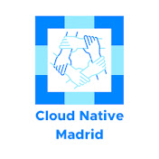
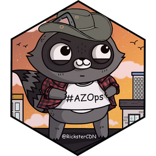
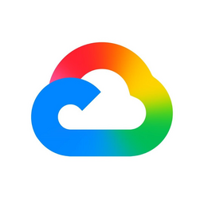
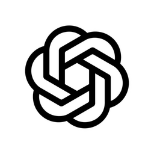

# Nubenetes: Awesome Kubernetes and Cloud 

!!! tip "Nubenetes V2: Agentic Elite Edition is now live!"
    Looking for a high-density, AI-curated experience? Explore our [**V2 Elite Portal**](/) - Optimized for 2026 Architectural Standards.

A curated list of awesome references collected since 2018. Microservices architectures rely on DevOps practices, automation, CI/CD (Continuous Integration & Delivery), and API-focused designs.

[Nubenetes](https://nubenetes.com) is also available at [this other site](https://awesome-kubernetes.readthedocs.io).

"I do not believe you can do today's job with yesterday's methods and be in business tomorrow" ([Horatio Nelson Jackson](https://en.wikipedia.org/wiki/Horatio_Nelson_Jackson))

  

---

## Motivation
- [microservices.io](https://microservices.io)
- [cncf.io](https://www.cncf.io)
    - [landscape.cncf.io](https://landscape.cncf.io)
    - [Certified Kubernetes offerings](https://www.cncf.io/certification/software-conformance)
    - [CNCF Reports](https://www.cncf.io/reports)
        - [CNCF Survey Report 2019](https://www.cncf.io/wp-content/uploads/2020/03/CNCF_Survey_Report.pdf)
        - [CNCF Survey Report 2020](https://www.cncf.io/wp-content/uploads/2020/11/CNCF_Survey_Report_2020.pdf)
        - [CNCF Survey Report 2021](https://www.cncf.io/wp-content/uploads/2021/12/Q1-2021-State-of-Cloud-Native-development-FINAL.pdf) - [CNCF Publishes State of Cloud Native Development Report](https://www.infoq.com/news/2022/01/ -cncf-state-of-cloud-native) - [CNCF Sees Record Kubernetes and Container Adoption](https://www.cncf.io/announcements/2022/02/10/cncf-sees-record-kubernetes-and-container-adoption-in-2021-cloud-native-survey)
- [State of DevOps Reports](https://puppet.com/resources/?refinementList%5Btype%5D%5B0%5D=Report&page=1&configure%5BhitsPerPage%5D=18)
    - [2020 State of DevOps Report](https://puppet.com/resources/report/2020-state-of-devops-report)
    - [2020 DevOps Salary Report](https://puppet.com/resources/report/2020-devops-salary-report)
    - [2021 State of DevOps Report: A decade of DevOps](https://puppet.com/resources/report/2021-state-of-devops-report)
    - [2021 Gartner Report Top Trends Infra & Operations](https://puppet.com/resources/report/gartner-report-top-trends-impacting-infrastructure-and-operations-for-2021)
- [CRI-O Lightweight Container Runtime for Kubernetes](https://cri-o.io)
- [Open Container Initiative](https://opencontainers.org)
- [agilemethodology.org](https://agilemethodology.org)
- [agilemanifesto.org](https://agilemanifesto.org)
- [12factor.net](https://12factor.net) - [Are You 12-Factor Application Ready?](https://dzone.com/articles/are-you-12-factor-application-ready) - [12-factor app infographic](https://dzone.com/whitepapers/the-12-factor-app-infographic) - [An illustrated guide to 12 Factor Apps 🌟](https://www.redhat.com/en/blog/12-factor-app)
- [openpracticelibrary.com](https://openpracticelibrary.com) - [Top 10 most visited pages](https://www.redhat.com/en/blog/top-10-most-used-open-practice-library-concepts)
- [roadmap.sh](https://roadmap.sh) - [DevOps Roadmap](https://roadmap.sh/devops) - [Kubernetes Roadmap](https://roadmap.sh/kubernetes)
    - [roadmap.sh/ai: Generate roadmaps with AI](https://roadmap.sh/ai)
    - [roadmap.sh/terraform](https://roadmap.sh/terraform)
- [API Landscape](https://apilandscape.apiscene.io)
- [Stack Overflow Annual Developer Survey](https://survey.stackoverflow.co)
    - [2021](https://survey.stackoverflow.co/2021)
    - [2022 🌟](https://survey.stackoverflow.co/2022) - [betterprogramming.pub](https://betterprogramming.pub/stack-overflow-2022-developer-survey-where-is-the-industry-heading-3cd4a0cd41f3)
- [Stack Overflow Collectives](https://stackoverflow.com/collectives) Communities for your favorite technologies
    - [Go Collective](https://stackoverflow.com/collectives/go)
    - [GitLab Collective](https://stackoverflow.com/collectives/gitlab)
    - [Google Cloud Collective](https://stackoverflow.com/collectives/google-cloud)
    - [AWS Collective](https://stackoverflow.com/collectives/aws)
    - [Azure Collective](https://stackoverflow.com/collectives/azure)
    - [CI/CD Collective](https://stackoverflow.com/collectives/ci-cd)
    - [WSO2 Collective](https://stackoverflow.com/collectives/wso2)
    - etc
- [Open Source Guides](https://opensource.guide)
- [The Open Group: Making Standards Work](https://www.opengroup.org) - [publications.opengroup.org](https://publications.opengroup.org) - [The TOGAF® Standard, a standard of The Open Group](https://www.opengroup.org/togaf)
- [How Your Application Architecture Has Evolved 🌟](https://dzone.com/articles/how-your-application-architecture-evolved)
- [==Kubernetes magic is in enterprise standardization, not app portability==](https://www.techrepublic.com/article/kubernetes-magic-is-in-enterprise-standardization-not-app-portability)
- [A new role to emerge: Kubernetes Manager (KubeMaster) 🌟](https://cloudnativenow.com/features/the-rise-of-the-kubemaster)
- [An emerging Job: Kubernetes engineer 🌟](https://www.cncf.io/blog/2022/03/03/an-emerging-job-kubernetes-engineer)
- [Google DORA Report: State of DevOps 2021 🌟](https://cloud.google.com/blog/products/devops-sre/announcing-dora-2021-accelerate-state-of-devops-report) How to accelerate DevOps - [summary 1](https://devops.com/google-dora-report-shows-modest-devops-gains) - [summary 2](https://dzone.com/articles/googles-state-of-devops-2021-report-what-sres-need)
- [Top GitHub Users By Country](https://github.com/gayanvoice/top-github-users)
- [Red Hat automation glossary 🌟](https://www.redhat.com/en/blog/red-hat-automation-glossary)
- [The rise of the automation architect](https://www.redhat.com/en/blog/automation-architects)
- [Automation is the future of cloud cost optimization](https://www.cncf.io/blog/2021/09/29/automation-is-the-future-of-cloud-cost-optimization)
- [The Rise of Modern Day Kubernetes Operations](https://vmblog.com/archive/2021/10/07/the-rise-of-modern-day-kubernetes-operations.aspx)
- [The Evolution of Distributed Systems on Kubernetes](https://www.infoq.com/articles/distributed-systems-kubernetes)
- [10 Cloud Deficiencies You Should Know](https://thenewstack.io/10-cloud-deficiencies-you-should-know)
- [==How to Explain Kubernetes to a Business Team==](https://dzone.com/articles/how-to-explain-kubernetes-to-a-business-team)
- [==Pets vs. Cattle: The Future of Kubernetes in 2022==](https://traefik.io/blog/pets-vs-cattle-the-future-of-kubernetes-in-2022)
- [dok.community: DoKC Data on Kubernetes](https://dok.community)
- [A Kubernetes Documentary Shares Google’s Open Source Story](https://thenewstack.io/a-kubernetes-documentary-shares-googles-open-source-story)
- [==Infrastructure as Code in DevOps==](https://alpacked.io/blog/infrastructure-as-code-for-devops)
- [Kubernetes at Scale without GitOps Is a Bad Idea](https://thenewstack.io/kubernetes-at-scale-without-gitops-is-a-bad-idea)
- [dzone.com/trendreports](https://dzone.com/trendreports)
- [kube.events](https://kube.events) A curated list of Kubernetes-related events such as meetups, conferences, training & webinars that you will find interesting to attend
- [The future of Kubernetes – and why developers should look beyond Kubernetes in 2022](https://www.eficode.com/blog/the-future-of-kubernetes-and-why-developers-should-look-beyond-kubernetes-in-2022)
- [cloudtechtwitter.com: Introduction to Kubernetes 🌟](https://www.cloudtechtwitter.com/2022/05/dont-miss-next-article-be-first-to-be.html)
- [GitHub Guides](https://github.com/readme/guides)
- [learnk8s.io/news](https://learnkube.com/news-events-jobs) How do you keep up with Kubernetes? If you are looking for curated Kubernetes news, we have you covered on:
    - Core Kubernetes
    - Security
    - Architecture & development
    - Job opportunities
    - K3s
    - Events
- [thenewstack.io: What We Learned from Enabling Developer Self-Service 🌟](https://thenewstack.io/what-we-learned-from-enabling-developer-self-service)
- [dzone: Kubernetes in the Enterprise - Trend Report](https://dzone.com/trendreports/kubernetes-in-the-enterprise-1)
- [Struggling with IT Staff Leaving? Try Infrastructure as Code 🌟](https://thenewstack.io/struggling-with-it-staff-leaving-try-infrastructure-as-code)
- [learnk8s.io/learn-kubernetes-weekly 🌟](https://kube.today/learn-kubernetes-weekly)
- [infoworld.com: Cloud architects are afraid of automation](https://www.infoworld.com/article/2337301/cloud-architects-are-afraid-of-automation.html) Automation is one of the greatest gifts to cloud architecture, operations, security, and finops. Yet, many architects still are reluctant to use it. What's so scary?
- [infoworld.com: The biggest obstacle to cloud is people](https://www.infoworld.com/article/2334635/the-biggest-obstacle-to-cloud-is-people.html) People and culture prevent many businesses from capturing the true value of cloud computing. Transforming organizational culture and revamping KPIs can help.
- [Droogans/How To Write Unmaintainable Code](https://github.com/Droogans/unmaintainable-code) Ensure a job for life ;-)
- [dzone.com: DevOps vs. SRE vs. Platform Engineer vs. Cloud Engineer](https://dzone.com/articles/devops-vs-sre-vs-platform-engineer-vs-cloud-engine)
- [github.com/metaleapca: metaleap-devops-in-k8s.pdf](https://github.com/metaleapca/metaleap-devops-in-k8s/blob/main/metaleap-devops-in-k8s.pdf)
- [github.com/metaleapca: metaleap-k8s-troubleshooting.pdf](https://github.com/metaleapca/metaleap-k8s-troubleshooting/blob/main/metaleap-k8s-troubleshooting.pdf)
- [devops.com: Declarative Compliance With Policy-as-Code and GitOps 🌟](https://devops.com/declarative-compliance-with-policy-as-code-and-gitops)
- [serverlessland.com: EDA VISUALS](https://serverlessland.com/event-driven-architecture/visuals) Small bite sized visuals about event-driven architectures
- [dzone: The Essentials of GitOps 🌟](https://dzone.com/refcardz/the-essentials-of-gitops)
- [dzone.com: REST vs. Messaging for Microservices](https://dzone.com/articles/rest-vs-messaging-for-microservices)
- [The Next Kubernetes Management Frontier: Automation](https://thenewstack.io/the-next-kubernetes-management-frontier-automation) Automation Is No Longer a “Nice to Have”
- [redis.com: Microservice Architecture Key Concepts](https://redis.io/blog/microservice-architecture-key-concepts)
- [thenewstack.io: Kubernetes Evolution: From Microservices to Batch Processing Powerhouse 🌟](https://thenewstack.io/kubernetes-evolution-from-microservices-to-batch-processing-powerhouse)
- [Software Deployment Best Practices in 2023](https://dzone.com/articles/software-deployment-best-practices) Explore the best software development practices that are the proven catalysts for innovation and growth.
- [==DevOps-Books== 🌟](https://github.com/DevOps-Projects-Ideas/DevOps-Books)
- [community.aws/kubernetes](https://builder.aws.com/learn/topics/kubernetes) Kubernetes at AWS! Welcome to the hub for all things Kubernetes at AWS.
- [AWS Skill Builder](https://skillbuilder.aws)
- [cloudcatalog.dev](https://www.cloudcatalog.dev) Documentation tool for AWS Architectures. CloudCatalog is an Open Source project that helps you document your AWS resources, services and assign owners.
- [platformengineering.org](https://platformengineering.org) The global home for Platform Engineers
- [Azure DevOps vs GitHub Actions: Which is the best CI/CD tool?](https://liora.io/en/azure-devops-vs-github-actions-which-is-the-best-ci-cd-tool)
- [Redefining Virtualization in the VMware Acquisition Era](https://pod.chaoslever.com/redefining-virtualization-in-the-vmware-acquisition-era)
- [Do Kubernetes Certs Prepare You For Real-World Production?](https://packetpushers.net/podcasts/kubernetes-unpacked/ku046-do-kubernetes-certs-prepare-you-for-real-world-production)
- [Why I Don’t Consider Your Certifications During An Interview](https://madokai.medium.com/why-i-dont-consider-your-certifications-during-an-interview-fe4b62cf6f8c)
- [dagger.io](https://dagger.io) CI/CD as Code that Runs Anywhere.
- [Bus factor](https://en.wikipedia.org/wiki/Bus_factor) The bus factor is a measurement of the risk resulting from information and capabilities not being shared among team members, derived from the phrase "in case they get hit by a bus".
- [seal.io: Open Source Platform Engineering for Dev & Ops](https://gpustack.ai)
- [==k8sgpt.ai==](https://k8sgpt.ai) K8sGPT is a tool for scanning your kubernetes clusters, diagnosing and triaging issues in simple english. It has SRE experience codified into its analyzers and helps to pull out the most relevant information to enrich it with AI.
- [github.com/topics/gitops](https://github.com/topics/gitops)
- [Dolt: Git for Data](https://github.com/dolthub/dolt)
- [serverlesshorrors.com](https://serverlesshorrors.com)
- [glasskube.dev package manager for k8s 🌟](https://glasskube.dev)
- [github.com/infrahouse/infrahouse-toolkit](https://github.com/infrahouse/infrahouse-toolkit) A collection of tools for building infrastructure
- [github.com/taubyte/tau](https://github.com/taubyte/tau) Open Source Git-Native CDN PaaS
- [==mattias.engineer/courses== 🌟](https://mattias.engineer/courses) HashiCorp Terraform, HashiCorp Vault, Kubernetes CKAD
- [The hater’s guide to Kubernetes](https://paulbutler.org/2024/the-haters-guide-to-kubernetes)
- [github.com/cyclops-ui/cyclops](https://github.com/cyclops-ui/cyclops) Developer Friendly Kubernetes
- [k8z.dev](https://k8z.dev) A lightweight, modern mobile and desktop application for manage kubernetes
- [Kube-score](https://github.com/zegl/kube-score)
- [testkube.io 🌟](https://testkube.io)
- [wcurl](https://github.com/curl/wcurl) A simple wrapper around curl to easily download files
- [NetBox IPAM 🌟](https://github.com/netbox-community/netbox)
    - [NetBox Labs](https://netboxlabs.com) is the commercial steward of NetBox. We are on a mission to make it easier to build and manage complex networks.
    - [Netbox Ansible Modules](https://docs.ansible.com/projects/ansible/latest/collections/netbox/netbox/index.html)
- [youtube: GitOps Guide to the Galaxy](https://www.youtube.com/playlist?list=PLbMP1JcGBmSGKO8UreWpOBOhCqilejhtd)
- [devopswithkubernetes.com](https://courses.mooc.fi/org/uh-cs/courses/devops-with-kubernetes) Introductory course to Kubernetes with K3s and GKE
- [Gardener](https://github.com/gardener/gardener) Deliver fully-managed clusters at scale everywhere with your own Kubernetes-as-a-Service
- [collabnix.github.io/kubetools 🌟](https://collabnix.github.io/kubetools) A Curated List of Kubernetes Tools
- [OpenShift AI Examples](https://github.com/CastawayEGR/openshift-ai-examples)
- [Jenkins Tutorials by CloudBeesTV 🌟](https://www.youtube.com/playlist?list=PLvBBnHmZuNQJeznYL2F-MpZYBUeLIXYEe&si=GBJtqv36O8bslj9z)
- [kui.tools](https://kui.tools) Kui: CLI-driven Graphics for Kubernetes

## Introduction
- [Microservice Architecture. From Java EE To Cloud Native. Openshift VS Kubernetes](introduction.md)
- [Microservices FAQ & Kubernetes Native](faq.md)
## SRE Site Reliability Engineering
- [Site Reliability Engineering (SRE)](sre.md)
- [Networking](networking.md)
- [FinOps - Cloud Financial Management](finops.md)
- [Chaos Engineering](chaos-engineering.md)
## DevOps
- [==DevOps==](devops.md)
- [==GitOps==](gitops.md)
- [MLOps](mlops.md)
- [Cheat Sheets 🌟](cheatsheets.md)
## DevSecOps and Security
- [DevSecOps and Security. Container Security](devsecops.md)
- [Security Policy as Code](securityascode.md)
- [OAuth2](oauth.md)
## NoOps aka Serverless
- [NoOps](noops.md)
- [Serverless Architectures & Frameworks. OpenFaaS, Knative & Kubeless](serverless.md)
## Docker
- [Docker](docker.md)
## Kubernetes
- [==Kubernetes==](kubernetes.md)
    - [==Kubernetes Tutorials==](kubernetes-tutorials.md)
    - [Kubernetes Plugins, Tools, Extensions and Projects 🌟](kubernetes-tools.md)
    - [kubectl Commands](kubectl-commands.md)
    - [Kubernetes Networking](kubernetes-networking.md)
    - [Kubernetes Monitoring and Logging](kubernetes-monitoring.md)
    - [Kubernetes Security](kubernetes-security.md)
    - [Kubernetes Storage](kubernetes-storage.md)
    - [Kubernetes Backup and Migrations](kubernetes-backup-migrations.md)
    - [Kubernetes Autoscaling](kubernetes-autoscaling.md)
    - [Kubernetes Operators and Controllers](kubernetes-operators-controllers.md)
    - [Kubernetes Based Development](kubernetes-based-devel.md)
    - [Kubernetes On Premise](kubernetes-on-premise.md)
    - [==Managed kubernetes in public clouds==](managed-kubernetes-in-public-cloud.md)
    - [Kubernetes Troubleshooting](kubernetes-troubleshooting.md)
    - [Kubernetes Releases](kubernetes-releases.md)
    - [Kubernetes Newsletters](kubernetes-newsletters.md)
- [Kubernetes Distributions & Installers](matrix-table.md)
- [Kubernetes Big Data](kubernetes-bigdata.md)
- [Kubernetes Alternatives](kubernetes-alternatives.md)
## Red Hat OpenShift
- [OpenShift](openshift.md)
- [OCP 3](ocp3.md)
- [OCP 4](ocp4.md)
## SUSE Rancher
- [Rancher - Enterprise management for Kubernetes](rancher.md)
## Software Delivery Pipeline
- [CI/CD - Continuous Integration & Continuous Delivery](cicd.md)
- [Git & Git Patterns. Trunk Devel, Git Flow & Feature Flags. Merge BOTs 🌟](git.md)
### Jenkins and CloudBees
- [Jenkins & CloudBees 😀](jenkins.md)
- [Performance testing with Jenkins, JMeter, Gatling, Azure Load Testing, etc](performance-testing-with-jenkins-and-jmeter.md)
### OpenShift Pipelines
- [OpenShift Pipelines with Jenkins, Tekton and more...](openshift-pipelines.md)
### DevOps Tools aka Toolchain. Jenkins Alternatives. Cloud Native CI/CD Tools
- [DevOps Tools](devops-tools.md)
- [Jenkins Alternatives for Continuous Integration & Deployment 🌟](jenkins-alternatives.md)
- [Argo - Declarative GitOps for Kubernetes 🌟](argo.md)
- [Flux CD - The GitOps Operator for Kubernetes 🌟](flux.md)
- [Tekton - Cloud Native CI/CD](tekton.md)
- [Keptn](keptn.md)
- [Container Runtimes/Managers & Base Images. Podman, Buildah & Skopeo](container-managers.md)
- [Maven, Gradle & SDKMAN](maven-gradle.md)
- [SonarQube](sonarqube.md)
- [Docker Registries. Quay, Nexus, JFrog Artifactory, Harbor and more](registries.md)
- [Linux & SSH](linux.md)
- [MkDocs & GitHub Pages](mkdocs.md)
### Web Servers, Reverse Proxies, Java Runtimes and Caching Solutions
- [Web Servers & Reverse Proxies: Apache, Nginx, HAProxy, Traefik and more](web-servers.md)
- [Java EE/Jakarta EE and MicroProfile Runtimes: Payara, JBoss EAP, WebSphere Liberty, WildFly and more](java_app_servers.md)
- [Embedded Servlet Containers in SpringBoot: Jetty, Tomcat, Undertow and more](embedded-servlet-containers.md)
- [Caching Solutions](caching.md)
## Monitoring and Performance. Prometheus, Grafana, APMs and more
- [Monitoring and Performance](monitoring.md)
- [Prometheus 🌟](prometheus.md)
- [Grafana](grafana.md)
## Infrastructure Provisioning. Infra Management Tools
- [IaC Infrastructure as Code](iac.md)
- [==Terraform & Packer.Kubernetes Boilerplates==](terraform.md)
- [Pulumi](pulumi.md)
- [Crossplane](crossplane.md) A Kubernetes Control Plane to Roll Your Own PaaS
- [Cloud Architecture Diagram Tools](cloud-arch-diagrams.md)
- [Cloud Asset Inventory](cloud-asset-inventory.md)

## Configuration Management
- [==Ansible==](ansible.md)
- [Helm Kubernetes Tool 🌟](helm.md)
- [Kustomize - Template-Free Kubernetes Configuration Customization](kustomize.md)
- [StackStorm](stackstorm.md)
- [Chef](chef.md)
- [CI/CD Kubernetes Plugins](cicd-kubernetes-plugins.md)
- [Client Libraries for Kubernetes: Go client, Python, Fabric8, JKube & Java Operator SDK](kubernetes-client-libraries.md)
- [Database Version Control. Liquibase, Flyway and PlanetScale](liquibase.md)
- [redhat-cop: Openshift Applier](https://dzone.com/articles/gitops-with-openshift-applier)
- [YAML and JSON 🌟](yaml.md)
## Databases on Kubernetes
- [Relational Databases and Database DevOps 🌟](databases.md)
- [Crunchy Data PostgreSQL Operator](crunchydata.md)
- [NoSQL Databases](nosql.md)
## Cloud Based Integration and Messaging. Data Processing and Streaming (aka Data Pipeline)
- [Data Pipeline 🌟](message-queue.md)
## Service Mesh
- [Service Mesh](servicemesh.md)
- [Istio](istio.md)
## Demos and Boilerplates
- [==Demos, Boilerplates & Screencasts==](demos.md) OpenShift, Kubernetes, Jenkins Pipelines with JCasC and more
## Cloud
- [Public Cloud Solutions](public-cloud-solutions.md)
- [Private Cloud Solutions](private-cloud-solutions.md)
- [Edge Computing](edge-computing.md)
- [==AWS==](aws.md)
    - [==repost.aws==](https://repost.aws)
    - [AWS Miscellaneous](aws-miscellaneous.md)
    - [==AWS Architecture and Best Practices==](aws-architecture.md)
    - [AWS Networking](aws-networking.md)
    - [AWS Databases](aws-databases.md)
    - [AWS Storage](aws-storage.md)
    - [AWS Security](aws-security.md)
    - [AWS Monitoring](aws-monitoring.md)
    - [AWS IaC](aws-iac.md)
    - [AWS Tools Scripts](aws-tools-scripts.md)
    - [AWS Messaging](aws-messaging.md)
    - [AWS Data](aws-data.md)
    - [AWS DevOps](aws-devops.md)
    - [AWS Serverless](aws-serverless.md)
    - [AWS Pricing](aws-pricing.md)
    - [AWS Containers](aws-containers.md)
    - [AWS Backup and Migrations](aws-backup.md)
    - [AWS Training and Certification](aws-training.md)
    - [AWS New Features](aws-newfeatures.md)
    - [AWS Spain](aws-spain.md)
- [==Microsoft Azure==](azure.md)
- [==Google Cloud Platform==](GoogleCloudPlatform.md)
- [IBM & IBM Cloud](ibm_cloud.md)
- [Oracle Cloud](oraclecloud.md)
- [Digital Ocean](digitalocean.md)
- [Cloudflare](cloudflare.md)
- [Scaleway](scaleway.md)
- [Linode](https://www.linode.com)
- [Alibaba](https://www.alibabacloud.com/en?_p_lc=5)
- [Symbiosis](https://symbiosis.host)
- [Gaia-X.eu](https://gaia-x.eu)
## APIs with SOAP, REST and gRPC
- [APIs with SOAP, REST and gRPC 🌟](api.md)
- [Swagger code generator for REST APIs](swagger-code-generator-for-rest-apis.md)
- [API Test Automation with Postman and REST Assured](postman.md)
- [API Marketplaces. API Management with API Gateways & Developer Portals 🌟](developerportals.md)
## Development and Frameworks
- [Websites for web developers](devel-sites.md)
- [Angular](angular.md)
- [Document Object Model (DOM)](dom.md)
- [Golang](golang.md)
- [JavaScript - node.js & npm](javascript.md)
- [Python - Django & Flask](python.md)
- [React](react.md)
- [Low Code and No Code](lowcode-nocode.md)
- [Web3](web3.md)
### Microsoft
- [Microsoft .NET](dotnet.md)
- [Microsoft Xamarin](xamarin.md)
### Java
- [Java & Open Source Microservices Frameworks. SpringBoot, MicroProfile, Quarkus and more](java_frameworks.md)
- [Java Memory Management & Java Performance Optimization](java-and-java-performance-optimization.md)
- [Java Parameters Matrix Table](jvm-parameters-matrix-table.md)
### Dev Environment
- [Visual Studio Code 🌟](visual-studio.md)
- [WSL: Linux Dev Environment on Windows](linux-dev-env.md)
- [Scaffolding Tools](scaffolding.md)
- [Chrome & Firefox DevTools. HTTP Protocols & WebSockets](ChromeDevTools.md)
## QA/TestOps - Continuous Testing
- [QA](qa.md)
- [TestOps and Continuous Testing](testops.md)
- [Test Automation Frameworks and Behavior Driven Development. Selenium, Cypress, Cucumber, Appium and more](test-automation-frameworks.md)
## AI
- [AI](ai.md)
- [MLOps](mlops.md)
- [ChatGPT](chatgpt.md)
## Project Management Methodology
- [Project Management Methodology](project-management-methodology.md)
- [Project Management Tools](project-management-tools.md)
- [Appointment Scheduling](appointment-scheduling.md)
- [Work From Home](workfromhome.md)
## More References
- [Other Awesome Lists 🌟](other-awesome-lists.md)
- [Interview Questions](interview-questions.md)
- [Forums and Communities](newsfeeds.md)
- [E-Learning](elearning.md)
- [Digital Money](digital-money.md)
## Hiring and Freelancing
- [Recruitment](recruitment.md)
- [Human Resources](hr.md)
- [Freelancing](freelancing.md)
- [Remote Tech Jobs](remote-tech-jobs.md)
## Customer Success Stories
- [Customer Success Stories](customer.md)

---

[{: style="width:7%"}](https://www.youtube.com/c/DockerIo) [{: style="width:7%"}](https://www.youtube.com/c/cloudnativefdn) [{: style="width:7%"}](https://www.youtube.com/kubernetescommunity) [{: style="width:7%"}](https://www.youtube.com/c/redhat) [{: style="width:7%"}](https://www.youtube.com/c/OpenShift) [{: style="width:7%"}](https://www.youtube.com/c/Rancher) [{: style="width:7%"}](https://www.youtube.com/c/CloudBeesTV) [{: style="width:7%"}](https://www.youtube.com/c/jenkinscicd) [{: style="width:7%"}](https://www.youtube.com/channel/UCN2kblPjXKMcjjVYmwvquvg) [{: style="width:7%"}](https://www.youtube.com/channel/UCcxQbw8kT1-FRhFhO2QCetg) [{: style="width:7%"}](https://www.youtube.com/c/VMwareTanzu) 
[{: style="width:7%"}](https://www.youtube.com/c/IBMTechnology) [{: style="width:7%"}](https://www.youtube.com/c/amazonwebservices) [{: style="width:7%"}](https://www.youtube.com/user/googlecloudplatform) [{: style="width:7%"}](https://www.youtube.com/c/MicrosoftAzure) [{: style="width:7%"}](https://www.youtube.com/c/OracleCloudInfrastructure) [{: style="width:7%"}](https://www.youtube.com/c/Digitalocean) [{: style="width:7%"}](https://www.youtube.com/cloudflare) [{: style="width:7%"}](https://www.youtube.com/c/Scaleway-Cloud) [{: style="width:7%"}](https://www.youtube.com/c/OpenStackFoundation) [{: style="width:7%"}](https://www.youtube.com/c/HashiCorp) [{: style="width:7%"}](https://www.youtube.com/c/PulumiTV) 
[{: style="width:7%"}](https://www.youtube.com/c/dzone) [{: style="width:7%"}](https://www.youtube.com/c/PrometheusIo) [{: style="width:7%"}](https://www.youtube.com/c/Grafana) [{: style="width:7%"}](https://www.youtube.com/c/Istio) [{: style="width:7%"}](https://www.youtube.com/c/Elastic) [{: style="width:7%"}](https://www.youtube.com/c/dynatrace) [{: style="width:7%"}](https://www.youtube.com/c/appdynamics) [{: style="width:7%"}](https://www.youtube.com/c/NewRelicInc) [{: style="width:7%"}](https://www.youtube.com/channel/UC8uN3yhpeBeerGNwDiQbcgw) [{: style="width:7%"}](https://www.youtube.com/c/WeaveWorksInc) [{: style="width:7%"}](https://www.youtube.com/c/LambdaTest) 
[{: style="width:7%"}](https://www.youtube.com/c/Atlassian) [{: style="width:7%"}](https://www.youtube.com/c/Code) [{: style="width:7%"}](https://www.youtube.com/c/GitHub) [{: style="width:7%"}](https://www.youtube.com/c/Gitlab) [{: style="width:7%"}](https://www.youtube.com/c/Gitkraken) [{: style="width:7%"}](https://www.youtube.com/c/RocketChatApp) [{: style="width:7%"}](https://www.youtube.com/c/Slackhq) [{: style="width:7%"}](https://www.youtube.com/c/MattermostHQ) [{: style="width:7%"}](https://www.youtube.com/c/microsoft365) [{: style="width:7%"}](https://www.youtube.com/c/OpenProjectCommunity) [{: style="width:7%"}](https://www.youtube.com/c/Tetrate) 
[{: style="width:7%"}](https://www.youtube.com/c/RedHatDevelopers) [{: style="width:7%"}](https://www.youtube.com/user/SpringSourceDev) [{: style="width:7%"}](https://www.youtube.com/c/Quarkusio) [{: style="width:7%"}](https://www.youtube.com/c/Lightbend-TV) [{: style="width:7%"}](https://www.youtube.com/c/postman) [{: style="width:7%"}](https://www.youtube.com/c/Smartbear) [{: style="width:7%"}](https://www.youtube.com/c/JFrogInc) [{: style="width:7%"}](https://www.youtube.com/c/Sonatypeinc) [{: style="width:7%"}](https://www.youtube.com/channel/UCS5-gTYteN9rnFd98YxYtrA) [{: style="width:7%"}](https://www.youtube.com/c/GoogleChromeDevelopers) [{: style="width:7%"}](https://www.youtube.com/c/MozillaDeveloper) 
[{: style="width:7%"}](https://www.youtube.com/c/CrunchyDataPostgres) [{: style="width:7%"}](https://www.youtube.com/channel/UC5qMsRjObu685rTBq0PJX8w) [{: style="width:7%"}](https://www.youtube.com/c/cockroachdb) [{: style="width:7%"}](https://www.youtube.com/c/MongoDBofficial) [{: style="width:7%"}](https://www.youtube.com/c/Redisinc) [{: style="width:7%"}](https://www.youtube.com/c/Confluent) [{: style="width:7%"}](https://www.youtube.com/channel/UCud7fErZAyMC6lHT_cWZNfA) [{: style="width:7%"}](https://www.youtube.com/channel/UC3ywadaAUQ1FI4YsHZ8wa0g) [{: style="width:7%"}](https://www.youtube.com/channel/UCm63IQg81KP9vXRWSHQpu1w) [{: style="width:7%"}](https://www.youtube.com/channel/UCt7N400Z8gB_3yKq1qrjP2w) [{: style="width:7%"}](https://www.youtube.com/c/Portworx) 
[{: style="width:7%"}](https://www.youtube.com/c/Cloudacademy) [{: style="width:7%"}](https://www.youtube.com/c/AcloudGuru) [{: style="width:7%"}](https://www.youtube.com/c/Devopsdotcom) [{: style="width:7%"}](https://www.youtube.com/c/XebiaLabs) [{: style="width:7%"}](https://www.youtube.com/c/Devopslibrary) [{: style="width:7%"}](https://www.youtube.com/c/codecademy) [{: style="width:7%"}](https://www.youtube.com/user/coursera) [{: style="width:7%"}](https://www.youtube.com/c/Academind) [{: style="width:7%"}](https://www.youtube.com/c/guru99comm) [{: style="width:7%"}](https://www.youtube.com/c/Intellipaat) [{: style="width:7%"}](https://www.youtube.com/channel/UCv9MUffHWyo2GgLIDLVu0KQ) 
[{: style="width:7%"}](https://www.youtube.com/c/Thetips4you) [{: style="width:7%"}](https://www.youtube.com/channel/UC57acx8sCmE7uFHfVMvIlNg) [{: style="width:7%"}](https://www.youtube.com/c/NTFAQGuy) [{: style="width:7%"}](https://www.youtube.com/channel/UCorFV-WGnajyfNu4zPI0AAA) [{: style="width:7%"}](https://www.youtube.com/c/AppsCodeInc) [{: style="width:7%"}](https://www.youtube.com/c/DevOpsToolkit) [{: style="width:7%"}](https://www.youtube.com/c/AnsiblePilot) [{: style="width:7%"}](https://www.youtube.com/CodelyTV) [{: style="width:7%"}](https://www.youtube.com/c/PeladoNerd) [{: style="width:7%"}](https://www.youtube.com/c/HolaMundoDev) [{: style="width:7%"}](https://www.youtube.com/c/JavierGarz%C3%A1s) 
[{: style="width:7%"}](https://www.youtube.com/c/LondonIAC) [{: style="width:7%"}](https://www.youtube.com/c/TechWorldwithNana) [{: style="width:7%"}](https://www.youtube.com/c/Honeypotio) [{: style="width:7%"}](https://www.youtube.com/c/AliSpittelDev) [{: style="width:7%"}](https://www.youtube.com/c/ThomasMaurerCloud) [{: style="width:7%"}](https://www.youtube.com/c/Freecodecamp) [{: style="width:7%"}](https://www.youtube.com/c/TheNewStack) [{: style="width:7%"}](https://www.youtube.com/channel/UCOvYmppcbOPm1viN6ust3lA) [{: style="width:7%"}](https://www.youtube.com/channel/UCoZxt-YMhGHb20ZkvcCc5KA) [{: style="width:7%"}](https://www.youtube.com/c/ContainerDays) [{: style="width:7%"}](https://www.youtube.com/c/priyankavergadia) 
[{: style="width:7%"}](https://www.youtube.com/c/ContinuousDeliveryFoundation) [{: style="width:7%"}](https://www.youtube.com/c/TinaHuang1) [{: style="width:7%"}](https://www.youtube.com/c/AzureDevOps) [{: style="width:7%"}](https://www.youtube.com/channel/UC2Pk9GcHhlVV0R9CQIU6gLw) [{: style="width:7%"}](https://www.youtube.com/c/AlibabaCloud) [{: style="width:7%"}](https://www.youtube.com/c/linode) [{: style="width:7%"}](https://www.youtube.com/channel/UCB5WMc2FfrxKzfd7XIODoMw) [{: style="width:7%"}](https://www.youtube.com/c/MadeByGPS) [{: style="width:7%"}](https://www.youtube.com/c/keptn) [{: style="width:7%"}](https://www.youtube.com/c/AnaisUrlichs) [{: style="width:7%"}](https://www.youtube.com/c/TheDigitalLifeTech) 
[{: style="width:7%"}](https://www.youtube.com/@azure-terraformer) [{: style="width:7%"}](https://www.youtube.com/@NedintheCloud) [{: style="width:7%"}](https://www.youtube.com/@NetBoxLabs) [{: style="width:7%"}](https://www.youtube.com/@techwithhelen) [{: style="width:7%"}](https://www.youtube.com/@ByteByteGo) [{: style="width:7%"}](https://www.youtube.com/@DotCSV) [{: style="width:7%"}](https://www.youtube.com/@midulive) [{: style="width:7%"}](https://www.youtube.com/@returngis) [{: style="width:7%"}](https://www.youtube.com/@kubefm) [{: style="width:7%"}](https://www.youtube.com/@OlenaKutsenko) [{: style="width:7%"}](https://www.youtube.com/@mouredev) 
[{: style="width:7%"}](https://www.youtube.com/@CloudNativeMadrid) [{: style="width:7%"}](https://www.youtube.com/@kyndryl) [{: style="width:7%"}](https://www.youtube.com/@ITOpsTalk) [{: style="width:7%"}](https://www.youtube.com/@googlecloudtech) [{: style="width:7%"}](https://www.youtube.com/@GoogleGemini) [{: style="width:7%"}](https://www.youtube.com/@googledeepmind) [{: style="width:7%"}](https://www.youtube.com/@anthropic-ai) [{: style="width:7%"}](https://www.youtube.com/@Microsoft.Copilot) [{: style="width:7%"}](https://www.youtube.com/OpenAI) [{: style="width:7%"}](https://www.youtube.com/@aiatmeta) [{: style="width:7%"}](https://www.youtube.com/@MicrosoftReactor) 
[{: style="width:7%"}](https://www.youtube.com/@Playwrightdev) [{: style="width:7%"}](https://www.youtube.com/@arsys) [{: style="width:7%"}](https://www.youtube.com/@ClickHouseDB) [{: style="width:7%"}](https://www.youtube.com/@gustavo-entrala) [{: style="width:7%"}](https://100daysofkubernetes.io) [{: style="width:7%"}](https://12factor.net) [{: style="width:7%"}](https://1829034.medium.com/getting-started-with-chaos-engineering-13e85a438d37) [{: style="width:7%"}](https://3t.io) [{: style="width:7%"}](https://3t.io/blog/how-to-connect-to-mongolab) [{: style="width:7%"}](https://4dayweek.medium.com/what-does-the-work-life-balance-of-a-software-engineer-look-like-fe16cc46bb0) [{: style="width:7%"}](https://4sysops.com/archives/kubernetes-guide-node-selector-and-node-affinity-in-kubernetes) 
[{: style="width:7%"}](https://4sysops.com/archives/use-psexec-and-powershell-together) [{: style="width:7%"}](https://53jk1.medium.com/argocd-the-continuous-delivery-solution-for-kubernetes-ae5b008e76d1) [{: style="width:7%"}](https://9elements.com/blog/developing-a-week-on-windows-with-wsl2) [{: style="width:7%"}](https://9elements.com/blog/developing-on-windows-with-wsl2) [{: style="width:7%"}](https://9to5linux.com/centos-alternative-rocky-linux-8-5-is-out-now-with-secure-boot-support-updated-components) [{: style="width:7%"}](https://9to5mac.com/2016/03/17/how-to-remap-windows-keyboard-buttons-match-mac-layout) [{: style="width:7%"}](https://a-connect.com) [{: style="width:7%"}](https://abarrak.gitbook.io/linux-sysops-handbook) [{: style="width:7%"}](https://abcabhishek.substack.com/p/chatgpt-for-generating-sql-as-a-data) [{: style="width:7%"}](https://abdulrwahab.medium.com/api-architecture-best-practices-for-designing-rest-apis-bf907025f5f) [{: style="width:7%"}](https://abhaypore.medium.com/migrate-your-manifest-yaml-files-into-helm-chart-32a44230f3b5) 
[{: style="width:7%"}](https://abhii85.hashnode.dev/how-to-get-started-with-k8s-contributions) [{: style="width:7%"}](https://abhirajdevops.hashnode.dev/a-cheat-sheet-of-essential-commands-for-managing-and-debugging-your-kubernetes-clusters-networking) [{: style="width:7%"}](https://abhisheksaini.hashnode.dev/yaml-for-representation) [{: style="width:7%"}](https://ably.com/blog/limits-aws-network-load-balancers) [{: style="width:7%"}](https://ably.com/blog/no-we-dont-use-kubernetes) [{: style="width:7%"}](https://ably.com/blog/realtime-ticket-booking-solution-kafka-fastapi-ably) [{: style="width:7%"}](https://about.appsheet.com/home) [{: style="width:7%"}](https://about.gitea.com) [{: style="width:7%"}](https://about.gitlab.com) [{: style="width:7%"}](https://about.gitlab.com/2016/06/28/get-started-with-openshift-origin-3-and-gitlab) [{: style="width:7%"}](https://about.gitlab.com/blog/2016/06/28/get-started-with-openshift-origin-3-and-gitlab) 
[{: style="width:7%"}](https://about.gitlab.com/blog/2020/03/13/partial-clone-for-massive-repositories) [{: style="width:7%"}](https://about.gitlab.com/blog/2020/07/06/beginner-guide-ci-cd) [{: style="width:7%"}](https://about.gitlab.com/blog/2020/07/29/effective-ci-cd-pipelines) [{: style="width:7%"}](https://about.gitlab.com/blog/2020/11/23/keep-git-history-clean-with-interactive-rebase) [{: style="width:7%"}](https://about.gitlab.com/blog/2020/11/30/vscode-extension-development-with-gitlab) [{: style="width:7%"}](https://about.gitlab.com/blog/2020/12/10/basics-of-gitlab-ci-updated) [{: style="width:7%"}](https://about.gitlab.com/blog/2021/01/20/using-run-parallel-jobs) [{: style="width:7%"}](https://about.gitlab.com/blog/2021/01/25/mr-reviews-with-vs-code) [{: style="width:7%"}](https://about.gitlab.com/blog/2021/02/05/ci-deployment-and-environments) [{: style="width:7%"}](https://about.gitlab.com/blog/2021/02/22/gitlab-kubernetes-agent-on-gitlab-com) [{: style="width:7%"}](https://about.gitlab.com/blog/2021/02/22/pipeline-editor-overview) 
[{: style="width:7%"}](https://about.gitlab.com/blog/2021/03/10/new-git-default-branch-name) [{: style="width:7%"}](https://about.gitlab.com/blog/2021/03/18/iteration-and-code-review) [{: style="width:7%"}](https://about.gitlab.com/blog/2021/04/21/devops-workflows-json-format-jq-ci-cd-lint) [{: style="width:7%"}](https://about.gitlab.com/blog/2021/04/27/gitops-done-3-ways) [{: style="width:7%"}](https://about.gitlab.com/blog/2021/07/28/secure-container-images-with-gitlab-and-grype) [{: style="width:7%"}](https://about.gitlab.com/blog/2021/08/10/how-to-agentless-gitops-aws) [{: style="width:7%"}](https://about.gitlab.com/blog/2021/09/09/5-code-review-features) [{: style="width:7%"}](https://about.gitlab.com/blog/2021/10/05/gitpod-desktop-app-personal-activities) [{: style="width:7%"}](https://about.gitlab.com/blog/2021/10/12/open-shift-ga) [{: style="width:7%"}](https://about.gitlab.com/blog/2021/11/16/gko-on-ocp) [{: style="width:7%"}](https://about.gitlab.com/blog/2021/11/18/gitops-with-gitlab-connecting-the-cluster) 
[{: style="width:7%"}](https://about.gitlab.com/blog/2021/11/30/soft-skills-are-the-key-to-your-devops-career-advancement) [{: style="width:7%"}](https://about.gitlab.com/blog/2021/12/16/how-to-navigate-the-great-resignation) [{: style="width:7%"}](https://about.gitlab.com/blog/2021/12/17/gitlab-chart-works-towards-kubernetes-1-22) [{: style="width:7%"}](https://about.gitlab.com/blog/2022/02/03/how-to-keep-up-with-ci-cd-best-practices) [{: style="width:7%"}](https://about.gitlab.com/blog/2022/02/17/fantastic-infrastructure-as-code-security-attacks-and-how-to-find-them) [{: style="width:7%"}](https://about.gitlab.com/blog/2022/04/13/how-to-learn-ci-cd-fast) [{: style="width:7%"}](https://about.gitlab.com/blog/2022/11/15/simple-kubernetes-management-with-gitlab) [{: style="width:7%"}](https://about.gitlab.com/blog/2022/11/16/how-is-ai-ml-changing-devops) [{: style="width:7%"}](https://about.gitlab.com/blog/get-started-with-openshift-origin-3-and-gitlab) [{: style="width:7%"}](https://about.gitlab.com/gitlab-org/gitlab/-/issues/14595) [{: style="width:7%"}](https://about.gitlab.com/gitlab-org/gitlab/-/issues/2785) 
[{: style="width:7%"}](https://about.gitlab.com/handbook) [{: style="width:7%"}](https://about.gitlab.com/releases/2021/04/22/gitlab-13-11) [{: style="width:7%"}](https://about.gitlab.com/releases/2021/04/22/gitlab-13-11-released) [{: style="width:7%"}](https://about.gitlab.com/releases/2021/07/22/gitlab-14-1-released) [{: style="width:7%"}](https://about.gitlab.com/remote-work-report) [{: style="width:7%"}](https://academy.fpblock.com/blog/announcing-amber-ci-secret-tool) [{: style="width:7%"}](https://academy.rancher.com) [{: style="width:7%"}](https://accenture.github.io/adop-cartridges-cookbook/docs/recipes/archiving-artefact-to-nexus) [{: style="width:7%"}](https://access.crunchydata.com/documentation/crunchy-postgres-containers/4.3.0/container-specifications/crunchy-pgadmin4) [{: style="width:7%"}](https://access.crunchydata.com/documentation/crunchy-postgres-containers/4.3.0/examples/administration/pgadmin4) [{: style="width:7%"}](https://access.crunchydata.com/documentation/crunchy-postgres-containers/latest) 
[{: style="width:7%"}](https://access.crunchydata.com/documentation/crunchy-postgres-containers/latest/examples/administration/pgadmin4) [{: style="width:7%"}](https://access.crunchydata.com/documentation/crunchy-postgres-containers/latest/installation-guide/installation-guide) [{: style="width:7%"}](https://access.crunchydata.com/documentation/postgres-operator/4.3.0/installation/other/ansible) [{: style="width:7%"}](https://access.crunchydata.com/documentation/postgres-operator/4.3.0/installation/other/bash) [{: style="width:7%"}](https://access.crunchydata.com/documentation/postgres-operator/4.3.0/installation/postgres-operator) [{: style="width:7%"}](https://access.crunchydata.com/documentation/postgres-operator/latest/operatorcli/pgo-overview) [{: style="width:7%"}](https://access.redhat.com/articles/4993781) [{: style="width:7%"}](https://access.redhat.com/community/learn) [{: style="width:7%"}](https://access.redhat.com/containers) [{: style="width:7%"}](https://access.redhat.com/documentation/en-us/openshift_container_platform) [{: style="width:7%"}](https://access.redhat.com/documentation/en-us/openshift_container_platform/4.1/pdf/updating_clusters/OpenShift_Container_Platform-4.1-Updating_clusters-en-US.pdf) 
[{: style="width:7%"}](https://access.redhat.com/documentation/en-us/openshift_container_platform/4.2/html/container-native_virtualization/container-native-virtualization-2-1-release-notes) [{: style="width:7%"}](https://access.redhat.com/documentation/en-us/openshift_container_platform/4.2/html/installing_on_ibm_z) [{: style="width:7%"}](https://access.redhat.com/documentation/en-us/openshift_container_platform/4.2/pdf/installing_on_ibm_z) [{: style="width:7%"}](https://access.redhat.com/documentation/en-us/openshift_container_platform/4.4/html-single/service_mesh/index) [{: style="width:7%"}](https://access.redhat.com/documentation/en-us/red_hat_amq/6.3) [{: style="width:7%"}](https://access.redhat.com/documentation/en-us/red_hat_amq/7.6/html/deploying_amq_broker_on_openshift/assembly_br-broker-monitoring_broker-ocp) [{: style="width:7%"}](https://access.redhat.com/documentation/en-us/red_hat_amq/7.6/html/deploying_amq_broker_on_openshift/deploying-broker-on-ocp-using-operator_broker-ocp) [{: style="width:7%"}](https://access.redhat.com/documentation/en-us/red_hat_amq/7.6/html/managing_amq_broker/prometheus-plugin-managing) [{: style="width:7%"}](https://access.redhat.com/documentation/en-us/red_hat_amq/7.6/html/using_amq_streams_on_openshift/assembly-distributed-tracing-str) [{: style="width:7%"}](https://access.redhat.com/documentation/en-us/red_hat_amq/7.6/html/using_amq_streams_on_openshift/assembly-metrics-setup-str) [{: style="width:7%"}](https://access.redhat.com/documentation/en-us/red_hat_amq/7.6/html/using_amq_streams_on_rhel/assembly-distributed-tracing-str) 
[{: style="width:7%"}](https://access.redhat.com/documentation/en-us/red_hat_amq/7.6/html/using_amq_streams_on_rhel/index) [{: style="width:7%"}](https://access.redhat.com/documentation/en-us/red_hat_jboss_web_server/5.4/html-single/red_hat_jboss_web_server_for_openshift/index) [{: style="width:7%"}](https://access.redhat.com/documentation/en-us/reference_architectures/2017/html-single/spring_boot_microservices_on_red_hat_openshift_container_platform_3/index) [{: style="width:7%"}](https://access.redhat.com/solutions/18301) [{: style="width:7%"}](https://access.redhat.com/solutions/4363731) [{: style="width:7%"}](https://accounts.google.com/v3/signin/identifier?continue=https%3A%2F%2Fconsole.cloud.google.com%2Fproducts&dsh=S-434924395%3A1779041052185976&followup=https%3A%2F%2Fconsole.cloud.google.com%2Fproducts&osid=1&passive=1209600&service=cloudconsole&flowName=WebLiteSignIn&flowEntry=ServiceLogin&ifkv=AWa2Pasn2LQq2-HAsrhKLmjDeNW0e8jsHz1CbZM8xG_fzw2d_QHhWCcHPV60tTMOkJixTn6JdLIstQ) [{: style="width:7%"}](https://accounts.google.com/v3/signin/identifier?continue=https%3A%2F%2Fdocs.google.com%2F&dsh=S20332737%3A1779042489432562&emr=1&followup=https%3A%2F%2Fdocs.google.com%2F&osid=1&passive=1209600&flowName=WebLiteSignIn&flowEntry=ServiceLogin&ifkv=AWa2Pav-11IKZl8IOb4XqImV3kUr5dyMPv-c_juxtiguwye_vvM_4JChlo3slW1NhgW6-FumHKZpvw) [{: style="width:7%"}](https://accounts.google.com/v3/signin/identifier?continue=https%3A%2F%2Fdocs.google.com%2Fdocument%2Fu%2F0%2Fcreate%3Fusp%3Ddot_new&dsh=S1328157413%3A1779046143757246&followup=https%3A%2F%2Fdocs.google.com%2Fdocument%2Fu%2F0%2Fcreate%3Fusp%3Ddot_new&ltmpl=docs&osid=1&passive=1209600&service=wise&flowName=WebLiteSignIn&flowEntry=ServiceLogin&ifkv=AWa2PasaQiQXmXb5iN1qZZsvtoOkhIgQoRWugSdY4-JVcpmeUs17j5clMIVQfi1xcpGGzFDWWEjvLg) [{: style="width:7%"}](https://accounts.google.com/v3/signin/identifier?continue=https%3A%2F%2Fdocs.google.com%2Fspreadsheets%2Fu%2F0%2Fcreate%3Fusp%3Ddot_new&dsh=S-888283151%3A1779038836107039&followup=https%3A%2F%2Fdocs.google.com%2Fspreadsheets%2Fu%2F0%2Fcreate%3Fusp%3Ddot_new&ltmpl=sheets&osid=1&passive=1209600&service=wise&flowName=WebLiteSignIn&flowEntry=ServiceLogin&ifkv=AWa2PauoMa7lQWyxlGGmOlILKdc_0OGix3neZYVIl24vayGw0wGG0CrQxkizeIBOFWVtABpTKfaO) [{: style="width:7%"}](https://accounts.google.com/v3/signin/identifier?continue=https%3A%2F%2Fnotebooklm.google.com%2Flogin%3Fcontinue%3Dhttps%3A%2F%2Fnotebooklm.google.com%2Fnotebook%2F87ae4230-9dda-445a-9775-df61ad7044dc%3Fauthuser%253D0%2526pageId%253Dnone&dsh=S-651079724%3A1780398802084305&followup=https%3A%2F%2Fnotebooklm.google.com%2Flogin%3Fcontinue%3Dhttps%3A%2F%2Fnotebooklm.google.com%2Fnotebook%2F87ae4230-9dda-445a-9775-df61ad7044dc%3Fauthuser%253D0%2526pageId%253Dnone&osid=1&passive=1209600&flowName=WebLiteSignIn&flowEntry=ServiceLogin&ifkv=AWa2PavtOIva2wcDqJnQlJq3nohbB8kL26HoI0qLEI-ErQFf9Roi9aGt-ViI1YzZGxXTHSAzER9n) [{: style="width:7%"}](https://accounts.google.com/v3/signin/identifier?continue=https%3A%2F%2Fnotebooklm.google.com%2Flogin%3Fcontinue%3Dhttps%3A%2F%2Fnotebooklm.google.com%2Fnotebook%2F87ae4230-9dda-445a-9775-df61ad7044dc%3Fauthuser%253D0%2526pageId%253Dnone&dsh=S1679469113%3A1780351896918873&followup=https%3A%2F%2Fnotebooklm.google.com%2Flogin%3Fcontinue%3Dhttps%3A%2F%2Fnotebooklm.google.com%2Fnotebook%2F87ae4230-9dda-445a-9775-df61ad7044dc%3Fauthuser%253D0%2526pageId%253Dnone&osid=1&passive=1209600&flowName=WebLiteSignIn&flowEntry=ServiceLogin&ifkv=AWa2PavSnxHMtFSGKVa_Dah4shJtj9idxNyn2Ox3EoPb7A8bY4KqdUXEQGTMYRZG1kKemtcZyQPg7w) 
[{: style="width:7%"}](https://accounts.google.com/v3/signin/identifier?continue=https%3A%2F%2Fsites.google.com%2Fsite%2Fmrxpalmeiras%2Fansible%2Fansible-cheat-sheet&dsh=S1127513064%3A1779041015006518&followup=https%3A%2F%2Fsites.google.com%2Fsite%2Fmrxpalmeiras%2Fansible%2Fansible-cheat-sheet&osid=1&passive=1209600&flowName=WebLiteSignIn&flowEntry=ServiceLogin&ifkv=AWa2PatKhgmTZTEkwb3Q5nWpkPt4ntDFIyQrUJIi2ZjPJ-M3IOraCUtKjEa4_jbOFaWLmjeqIlS_) [{: style="width:7%"}](https://acentocoop.es) [{: style="width:7%"}](https://acethecloud.com/blog/azure-application-gateway-and-nginx-on-vm) [{: style="width:7%"}](https://acg-notice.pluralsight.com) [{: style="width:7%"}](https://acloud.guru/forums/aws-certified-advanced-networking-specialty/discussion/-LELSWplsuDI8q8_KtjN/What%20is%20the%20best%20way%20to%20generate%20a%20visual%20diagram%20of%20the%20AWS%20environment%20which%20includes%20VPC,%20VPN,%20EC2,%20and%20AMIs%3F) [{: style="width:7%"}](https://acloudguru.com) [{: style="width:7%"}](https://acloudguru.com/blog/business/public-cloud-vs-private-cloud-whats-the-difference) [{: style="width:7%"}](https://acloudguru.com/blog/business/sharing-data-in-the-cloud-four-patterns-everyone-should-know) [{: style="width:7%"}](https://acloudguru.com/blog/business/what-is-lift-and-shift-cloud-migration) [{: style="width:7%"}](https://acloudguru.com/blog/engineering/10-docker-security-best-practices-to-cut-container-chaos) [{: style="width:7%"}](https://acloudguru.com/blog/engineering/10-fun-hands-on-projects-to-learn-aws) 
[{: style="width:7%"}](https://acloudguru.com/blog/engineering/12-aws-config-rules-that-every-account-should-have) [{: style="width:7%"}](https://acloudguru.com/blog/engineering/3-ways-to-practice-migrating-workloads-to-the-cloud) [{: style="width:7%"}](https://acloudguru.com/blog/engineering/5-reasons-to-not-move-to-devops) [{: style="width:7%"}](https://acloudguru.com/blog/engineering/5-things-we-love-about-terraform) [{: style="width:7%"}](https://acloudguru.com/blog/engineering/adopting-gitops-for-kubernetes-on-aws) [{: style="width:7%"}](https://acloudguru.com/blog/engineering/aks-vs-eks-vs-gke-managed-kubernetes-services-compared) [{: style="width:7%"}](https://acloudguru.com/blog/engineering/ansible-vs-puppet-which-is-right-for-you) [{: style="width:7%"}](https://acloudguru.com/blog/engineering/aws-adds-to-the-no-code-pile-is-it-the-end-of-the-engineer) [{: style="width:7%"}](https://acloudguru.com/blog/engineering/azure-devops-vs-github-comparing-microsofts-devops-twins) [{: style="width:7%"}](https://acloudguru.com/blog/engineering/blockchain-cloud-comparison-what-is-blockchain-as-a-service-baas) [{: style="width:7%"}](https://acloudguru.com/blog/engineering/cloud-apps-secure-by-design) 
[{: style="width:7%"}](https://acloudguru.com/blog/engineering/cloud-developer-tooling-compared-aws-vs-azure-vs-gcp) [{: style="width:7%"}](https://acloudguru.com/blog/engineering/cloud-security-comparison-aws-vs-azure-vs-gcp) [{: style="width:7%"}](https://acloudguru.com/blog/engineering/containers-vs-serverless-which-is-right-for-you) [{: style="width:7%"}](https://acloudguru.com/blog/engineering/docker-copy-vs-add-whats-the-difference) [{: style="width:7%"}](https://acloudguru.com/blog/engineering/getting-started-with-the-elastic-stack) [{: style="width:7%"}](https://acloudguru.com/blog/engineering/gke-ludicrous-speed-gke-image-streaming-speeds-up-container-starts) [{: style="width:7%"}](https://acloudguru.com/blog/engineering/how-to-audit-and-secure-an-aws-account) [{: style="width:7%"}](https://acloudguru.com/blog/engineering/how-to-troubleshoot-5-common-terraform-errors) [{: style="width:7%"}](https://acloudguru.com/blog/engineering/how-to-use-github-actions-to-automate-terraform) [{: style="width:7%"}](https://acloudguru.com/blog/engineering/how-to-use-terraform-inputs-and-outputs) [{: style="width:7%"}](https://acloudguru.com/blog/engineering/one-shell-to-rule-them-all-5-reasons-to-use-powershell-for-cloud-management) 
[{: style="width:7%"}](https://acloudguru.com/blog/engineering/s3-glacier-instant-retrieval-deep-dive-which-s3-storage-class-is-right-for-me) [{: style="width:7%"}](https://acloudguru.com/blog/engineering/securing-your-multi-cloud-terraform-pipelines-with-policy-as-code) [{: style="width:7%"}](https://acloudguru.com/blog/engineering/storage-showdown-aws-vs-azure-vs-gcp-cloud-comparison) [{: style="width:7%"}](https://acloudguru.com/blog/engineering/the-cloud-dictionary-of-pain-five-of-awss-toughest-cloud-topics) [{: style="width:7%"}](https://acloudguru.com/blog/engineering/the-top-cloud-diagramming-tools-ranked) [{: style="width:7%"}](https://acloudguru.com/blog/engineering/the-ultimate-terraform-cheatsheet) [{: style="width:7%"}](https://acloudguru.com/blog/engineering/twelve-factor-apps-in-kubernetes) [{: style="width:7%"}](https://acloudguru.com/blog/engineering/what-does-the-terraform-1-0-release-mean-for-you) [{: style="width:7%"}](https://acloudguru.com/blog/engineering/whats-new-with-kubernetes-1-22) [{: style="width:7%"}](https://acloudguru.com/blog/engineering/which-kubernetes-distribution-is-right-for-you) [{: style="width:7%"}](https://acloudguru.com/blog/engineering/why-learn-multiple-cloud-platforms) 
[{: style="width:7%"}](https://activemq.apache.org) [{: style="width:7%"}](https://activemq.apache.org/components/artemis) [{: style="width:7%"}](https://activemq.apache.org/components/artemis/documentation/latest/management-console.html) [{: style="width:7%"}](https://activemq.apache.org/components/artemis/documentation/latest/metrics.html) [{: style="width:7%"}](https://activemq.apache.org/components/artemis/documentation/latest/using-server.html) [{: style="width:7%"}](https://activemq.apache.org/components/classic) [{: style="width:7%"}](https://activemq.apache.org/components/classic/documentation) [{: style="width:7%"}](https://acuityscheduling.com) [{: style="width:7%"}](https://adam-kotwasinski.medium.com/kafka-mesh-filter-in-envoy-a70b3aefcdef) [{: style="width:7%"}](https://adambien.blog/roller/abien/entry/kafka_jax_rs_microprofile_json) [{: style="width:7%"}](https://adamrushuk.github.io/increasing-the-volumeclaimtemplates-disk-size-in-a-statefulset-on-aks) 
[{: style="width:7%"}](https://adamtheautomator.com/ansible-kubernetes) [{: style="width:7%"}](https://adamtheautomator.com/aws-codedeploy) [{: style="width:7%"}](https://adamtheautomator.com/azure-kubernetes-service) [{: style="width:7%"}](https://adamtheautomator.com/github-actions-environment-variables) [{: style="width:7%"}](https://adamtheautomator.com/kubernetes-dashboard) [{: style="width:7%"}](https://adamtheautomator.com/kubernetes-pvc) [{: style="width:7%"}](https://adamtheautomator.com/kubespray) [{: style="width:7%"}](https://adamtheautomator.com/minikube-tutorial) [{: style="width:7%"}](https://adamtheautomator.com/mongodb-kubernetes) [{: style="width:7%"}](https://adamtheautomator.com/postgres-to-kubernetes) [{: style="width:7%"}](https://adamtheautomator.com/prometheus-kubernetes) 
[{: style="width:7%"}](https://adamtheautomator.com/terraform-and-aws-rds) [{: style="width:7%"}](https://adamtheautomator.com/terraform-aws-rds) [{: style="width:7%"}](https://adamtheautomator.com/terraform-azure-devops) [{: style="width:7%"}](https://addozhang.medium.com/non-intrusive-inject-opentelemetry-auto-instrumentation-in-kubernetes-a9dfd49fc714) [{: style="width:7%"}](https://addwebsolution.com/blog/how-kubernetes-helps-businesses-manage-their-it-infrastructure) [{: style="width:7%"}](https://adequatica.medium.com/principles-of-writing-automated-tests-a2b72218264c) [{: style="width:7%"}](https://adevait.com) [{: style="width:7%"}](https://adevait.com/software/creating-branching-strategy) [{: style="width:7%"}](https://adicode.ml/python-libraries-for-webdevelopment) [{: style="width:7%"}](https://adictosaltrabajo.com/2016/02/03/como-reducir-el-codigo-repetitivo-con-lombok) [{: style="width:7%"}](https://adictosaltrabajo.com/2016/10/26/monitorizacion-y-analisis-de-rendimiento-de-aplicaciones-con-dynatrace) 
[{: style="width:7%"}](https://adictosaltrabajo.com/2018/12/13/spring-boot-war-o-jar-ambos) [{: style="width:7%"}](https://adictosaltrabajo.com/2020/12/22/como-crear-y-desplegar-microservicios-con-spring-boot-spring-cloud-netflix-y-docker) [{: style="width:7%"}](https://adil.medium.com/network-traffic-shaping-in-kubernetes-topology-aware-routing-e4ea4a03dd20) [{: style="width:7%"}](https://aditya-sunjava.medium.com/externalizing-configurations-in-kubernetes-using-configmap-and-secret-bfda0970d8ae) [{: style="width:7%"}](https://admiralty.io) [{: style="width:7%"}](https://admiralty.io/docs/tutorials/fargate) [{: style="width:7%"}](https://adoptium.net) [{: style="width:7%"}](https://adoptium.net/news/2021/08/using-jlink-in-dockerfiles) [{: style="width:7%"}](https://adoptopenjdk.net) [{: style="width:7%"}](https://advancedweb.hu/a-categorized-list-of-all-java-and-jvm-features-since-jdk-8-to-14) [{: style="width:7%"}](https://advancedweb.hu/a-categorized-list-of-all-java-and-jvm-features-since-jdk-8-to-16) 
[{: style="width:7%"}](https://aesher9o1.medium.com/autoscale-large-images-faster-using-longhorn-distributed-storage-618d0cf01ba2) [{: style="width:7%"}](https://age-of-product.com/42-scrum-product-owner-interview-questions) [{: style="width:7%"}](https://age-of-product.com/scrum-2021) [{: style="width:7%"}](https://agent.opsera.ai) [{: style="width:7%"}](https://agilecheetah.com/why-so-many-developers-are-fed-up-with-agile-pt-3) [{: style="width:7%"}](https://agilemanifesto.org) [{: style="width:7%"}](https://agilemethodology.org) [{: style="width:7%"}](https://agola.io) [{: style="width:7%"}](https://ahmedy.hashnode.dev/creating-tls-certificates-for-k8s-components-with-openssl) [{: style="width:7%"}](https://ahmet.im/blog/building-container-images-in-go) [{: style="width:7%"}](https://aidanfinn.com/?p=23582) 
[{: style="width:7%"}](https://aigents.co/blog/coding-tutorial/data-structures-and-python) [{: style="width:7%"}](https://aigents.co/blog/coding-tutorial/pro-python-tips-for-data-analysts) [{: style="width:7%"}](https://aigents.co/data-science-blog/coding-tutorial/data-structures-and-python) [{: style="width:7%"}](https://aigents.co/data-science-blog/coding-tutorial/pro-python-tips-for-data-analysts) [{: style="width:7%"}](https://aiml.com/quizzes/deep-learning-large-language-models-quiz-medium) [{: style="width:7%"}](https://airflow.apache.org/docs/apache-airflow-providers-cncf-kubernetes/stable/operators.html) [{: style="width:7%"}](https://airflow.apache.org/docs/apache-airflow/stable/howto/add-owner-links.html) [{: style="width:7%"}](https://airflow.apache.org/docs/helm-chart) [{: style="width:7%"}](https://aithority.com/it-and-devops/cloud/bacula-systems-announces-worlds-first-enterprise-class-backup-and-recovery-solution-for-red-hat-openshift) [{: style="width:7%"}](https://ajay-yadav.medium.com/internals-of-kubernetes-aff264063e91) [{: style="width:7%"}](https://akhilsharma.work/checking-kubernetes-api-calls-using-kubectl) 
[{: style="width:7%"}](https://akhilsharma.work/how-to-list-azure-rbac-roles-to-secure-aks-clusters) [{: style="width:7%"}](https://akhilsharma.work/kubectl-get-resource-short-names) [{: style="width:7%"}](https://akhilsharma.work/the-4cs-of-kubernetes-security) [{: style="width:7%"}](https://akintola-lonlon.medium.com/aws-kubernetes-the-1-rule-you-need-to-master-before-going-to-production-628b75ba1b6a) [{: style="width:7%"}](https://akka.io) [{: style="width:7%"}](https://akomljen.com/kubernetes-backup-and-restore-with-velero) [{: style="width:7%"}](https://akuity.io/blog/argo-cd-architectures-explained) [{: style="width:7%"}](https://akv2k8s.io) [{: style="width:7%"}](https://akyriako.medium.com/configure-path-based-routing-with-nginx-ingress-controller-64a63cd4d6bd) [{: style="width:7%"}](https://akyriako.medium.com/kubernetes-logging-with-grafana-loki-promtail-in-under-10-minutes-d2847d526f9e) [{: style="width:7%"}](https://akyriako.medium.com/provision-a-high-availability-k3s-cluster-with-k3d-a7519f476c9c) 
[{: style="width:7%"}](https://akyriako.medium.com/provision-an-on-prems-kubernetes-cluster-with-rancher-terraform-and-ansible-e26e24059319) [{: style="width:7%"}](https://alain-airom.medium.com/kubernetes-operators-patterns-and-best-practices-b7fbaa4cbd1) [{: style="width:7%"}](https://alanblackmore.medium.com/aws-diagram-architecture-afb50ea569a4) [{: style="width:7%"}](https://alanblackmore.medium.com/what-is-aws-vpc-peering-af85c1e29fb2) [{: style="width:7%"}](https://alemsbaja.hashnode.dev/git-and-github-demystified-a-comprehensive-guide-for-version-control-system) [{: style="width:7%"}](https://alenkacz.medium.com/kubernetes-operator-best-practices-implementing-observedgeneration-250728868792) [{: style="width:7%"}](https://alesnosek.com/blog/2020/06/30/ci-slash-cd-pipeline-spanning-multiple-openshift-clusters) [{: style="width:7%"}](https://alexander-goida.medium.com/thoughts-about-breaking-silos-of-software-engineering-teams-323d1f78ef68) [{: style="width:7%"}](https://alexander.holbreich.org/gitops-journey) [{: style="width:7%"}](https://alexandre-vazquez.com/inject-secrets-in-pods-using-hashicorp-vault) [{: style="width:7%"}](https://alexandrehtrb.github.io/posts/2024/03/http2-and-http3-explained) 
[{: style="width:7%"}](https://alexandrev.medium.com/grafana-alerting-vs-alertmanager-a-comparison-of-two-leading-monitoring-tools-5e262446a5f9) [{: style="width:7%"}](https://alexandrev.medium.com/how-to-enable-sticky-session-on-your-kubernetes-workloads-using-istio-e789014a6acd) [{: style="width:7%"}](https://alexandrev.medium.com/kubernetes-autoscaling-1-26-a-game-changer-for-keda-users-c718a81fb155) [{: style="width:7%"}](https://alexsniffin.medium.com/debugging-remotely-in-kubernetes-with-go-fda4f3332316) [{: style="width:7%"}](https://alicegg.tech/2020/11/09/helm) [{: style="width:7%"}](https://alicegg.tech/2020/11/09/helm.html) [{: style="width:7%"}](https://allanjohn909.medium.com/kubernetes-ingress-traefik-cert-manager-letsencrypt-3cb5ea4ee071) [{: style="width:7%"}](https://allazureblog.wordpress.com/2024/01/18/azure-bastion-and-udrs) [{: style="width:7%"}](https://allendowney.github.io/ThinkPython) [{: style="width:7%"}](https://allure.qatools.ru) [{: style="width:7%"}](https://alpacked.io/blog/infrastructure-as-code-for-devops) 
[{: style="width:7%"}](https://alsmola.medium.com/securing-github-organizations-9c33c850638) [{: style="width:7%"}](https://aly.arriqaaq.com/golang-design-patterns) [{: style="width:7%"}](https://amalaruja.medium.com/basic-http-routing-strategies-with-envoy-376be42559eb) [{: style="width:7%"}](https://aman.ai/primers/ai) [{: style="width:7%"}](https://aman.ai/primers/ai/LLM) [{: style="width:7%"}](https://aman.ai/primers/ai/bert) [{: style="width:7%"}](https://aman.ai/primers/ai/gpt) [{: style="width:7%"}](https://aman.ai/primers/ai/transformers) [{: style="width:7%"}](https://amazicworld.com/top-5-security-threats-unique-to-a-kubernetes-and-cloud-native-stack) [{: style="width:7%"}](https://amazicworld.com/why-apis-cant-be-missed-when-it-comes-to-devops) [{: style="width:7%"}](https://amazon.qwiklabs.com/catalog) 
[{: style="width:7%"}](https://ambar-thecloudgarage.medium.com/eks-anywhere-decoding-the-architecture-fd2741b03e0a) [{: style="width:7%"}](https://ambking1234.biz/?action=register&marketingRef=6788b227da9499f55f6ea745) [{: style="width:7%"}](https://ambking1234.biz/?action=register&marketingRef=6788b227da9499f55f6ea745/blog/case-study-national-australia-bank-decreases-operational-overhead-with-gitops) [{: style="width:7%"}](https://ambking1234.biz/?action=register&marketingRef=6788b227da9499f55f6ea745/blog/deutsche-telekom-explain-why-they-chose-gitops-for-5g) [{: style="width:7%"}](https://ambking1234.biz/?action=register&marketingRef=6788b227da9499f55f6ea745/blog/gitops-in-the-modern-enterprise) [{: style="width:7%"}](https://ambking1234.biz/?action=register&marketingRef=6788b227da9499f55f6ea745/blog/gitops-takes-devops-teams-to-higher-levels-of-maturity) [{: style="width:7%"}](https://ambking1234.biz/?action=register&marketingRef=6788b227da9499f55f6ea745/blog/manage-thousands-of-clusters-with-gitops-and-the-cluster-api) [{: style="width:7%"}](https://ambking1234.biz/?action=register&marketingRef=6788b227da9499f55f6ea745/blog/managing-kubernetes-with-gitops-in-a-multi-cluster-multi-cloud-world) [{: style="width:7%"}](https://ambking1234.biz/?action=register&marketingRef=6788b227da9499f55f6ea745/blog/the-history-of-gitops) [{: style="width:7%"}](https://ambking1234.biz/?action=register&marketingRef=6788b227da9499f55f6ea745/blog/what-is-gitops-really) [{: style="width:7%"}](https://ambking1234.biz/?action=register&marketingRef=6788b227da9499f55f6ea745/blog/wkp-team-workspaces-rbac) 
[{: style="width:7%"}](https://ambking1234.biz/?action=register&marketingRef=6788b227da9499f55f6ea745/blog/wksctl-a-new-oss-kubernetes-manager-using-gitops) [{: style="width:7%"}](https://ambking1234.biz/?action=register&marketingRef=6788b227da9499f55f6ea745/product/gitops-enterprise) [{: style="width:7%"}](https://ambking1234.biz/?action=register&marketingRef=6788b227da9499f55f6ea745/technologies/gitops) [{: style="width:7%"}](https://ambking1234.biz/?action=register&marketingRef=6788b227da9499f55f6ea745/use-cases/security-with-gitops) [{: style="width:7%"}](https://americanexpress.io/do-not-run-dockerized-applications-as-root) [{: style="width:7%"}](https://amitprius.medium.com/python-dictionary-zero-to-hero-with-examples-a7497a672dd4) [{: style="width:7%"}](https://amod-kadam.medium.com/are-there-two-load-balancer-controllers-with-eks-8a7b04db8c93) [{: style="width:7%"}](https://amolmote.hashnode.dev/replicaset-deployment-in-kubernetes) [{: style="width:7%"}](https://amralaayassen.medium.com/how-to-create-argocd-applications-automatically-using-applicationset-automation-of-the-gitops-59455eaf4f72) [{: style="width:7%"}](https://amy-ma.medium.com/ingress-configuration-d9f13c5bcf1a) [{: style="width:7%"}](https://anaisurl.com/full-tutorial-monitoring) 
[{: style="width:7%"}](https://anaisurl.com/kubernetes-rbac) [{: style="width:7%"}](https://analoghq.ai/blog/es/matriz-raci) [{: style="width:7%"}](https://analoghq.ai/blog/es/tipos-de-consultoria) [{: style="width:7%"}](https://analyticsindiamag.com/ansible-vs-docker-a-detailed-comparison-of-devops-tools) [{: style="width:7%"}](https://analyticsindiamag.com/free-online-resources-to-get-started-on-cloud-computing) [{: style="width:7%"}](https://analyticsindiamag.com/github-launches-code-scanner-to-flag-security-vulnerabilities) [{: style="width:7%"}](https://analyticsindiamag.com/how-uber-is-leveraging-apache-kafka-for-more-than-300-micro-services) [{: style="width:7%"}](https://analyticsindiamag.com/is-coding-necessary-to-work-as-a-data-scientist) [{: style="width:7%"}](https://analyticsindiamag.com/kubernetes-v1-21-released-major-updates-latest-features) [{: style="width:7%"}](https://analyticsindiamag.com/object-oriented-programming-python) [{: style="width:7%"}](https://analyticsindiamag.com/top-tools-for-enabling-ci-cd-in-ml-pipelines) 
[{: style="width:7%"}](https://anchore.com) [{: style="width:7%"}](https://anchore.com/cicd) [{: style="width:7%"}](https://anchore.com/kubernetes) [{: style="width:7%"}](https://andara88.it.com) [{: style="width:7%"}](https://anderfernandez.com/blog/automatizar-script-python-google-cloud) [{: style="width:7%"}](https://andrewlock.net/deploying-asp-net-core-applications-to-kubernetes-part-6-adding-health-checks-with-liveness-readiness-and-startup-probes) [{: style="width:7%"}](https://andrewlock.net/deploying-asp-net-core-applications-to-kubernetes-part-7-running-database-migrations) [{: style="width:7%"}](https://andrewlock.net/installing-docker-desktop-for-windows) [{: style="width:7%"}](https://andrewlock.net/series/deploying-asp-net-core-applications-to-kubernetes) [{: style="width:7%"}](https://android-developers.googleblog.com/2026/05/android-cli-stable-1-0-agent-development.html) [{: style="width:7%"}](https://android-developers.googleblog.com/2026/05/build-android-apps-google-ai-studio.html) 
[{: style="width:7%"}](https://andydote.co.uk/2021/06/02/os-cpus-and-kubernetes) [{: style="width:7%"}](https://angryip.org) [{: style="width:7%"}](https://angular.dev) [{: style="width:7%"}](https://angular.dev/guide/build) [{: style="width:7%"}](https://angular.io) [{: style="width:7%"}](https://angular.io/guide/build) [{: style="width:7%"}](https://aninditabasak.medium.com/a-lap-around-kubernetes-security-vulnerability-scanning-tools-checkov-kube-hunter-kube-bench-4ffda92c4cf1) [{: style="width:7%"}](https://anirudhdaya.hashnode.dev/kubernetes-explained-part-1) [{: style="width:7%"}](https://anirudhdaya.hashnode.dev/kubernetes-explained-part-2) [{: style="width:7%"}](https://ankush-chavan.medium.com/creating-multi-cloud-kubernetes-cluster-on-aws-azure-and-gcp-cloud-92d64633bdfc) [{: style="width:7%"}](https://ansible.ai) 
[{: style="width:7%"}](https://ansible.github.io/workshops/demos) [{: style="width:7%"}](https://answers.dynatrace.com/spaces/482/dynatrace-open-qa/questions/232421/dynatrace-distributed-tracing-with-kafka.html) [{: style="width:7%"}](https://anthropic.skilljar.com/claude-code-in-action) [{: style="width:7%"}](https://antigravity.google/use-cases/science) [{: style="width:7%"}](https://any-api.com) [{: style="width:7%"}](https://anywhere.eks.amazonaws.com/docs/concepts/eksafeatures) [{: style="width:7%"}](https://api-market.santalucia.es) [{: style="width:7%"}](https://api7.ai/blog/apisix-ingress-support-thousands-pod-replicas) [{: style="width:7%"}](https://apidog.com) [{: style="width:7%"}](https://apifriends.com/api-creation/different-types-apis) [{: style="width:7%"}](https://apifriends.com/api-management/what-is-an-api) 
[{: style="width:7%"}](https://apiiro.com/blog/malicious-kubernetes-helm-charts-can-be-used-to-steal-sensitive-information-from-argo-cd-deployments) [{: style="width:7%"}](https://apilandscape.apiscene.io) [{: style="width:7%"}](https://apimarket.cecabank.es) [{: style="width:7%"}](https://apis.developer.tsb.co.uk) [{: style="width:7%"}](https://apistore.caixabank.com) [{: style="width:7%"}](https://apkplz.net/app/com.LearningSolution.LearnKubernetes) [{: style="width:7%"}](https://apmblog.dynatrace.com/2011/05/11/how-garbage-collection-differs-in-the-three-big-jvms) [{: style="width:7%"}](https://apolicy.io) [{: style="width:7%"}](https://app.diagrams.net) [{: style="width:7%"}](https://app.getambassador.io) [{: style="width:7%"}](https://app.getambassador.io/initializer) 
[{: style="width:7%"}](https://app.gitbook.com/o/-LbOdudvkdYwKCQYAHS8/s/RrlyoCHlF8LNFTvw74mT) [{: style="width:7%"}](https://app.polymersearch.com/discover/aws) [{: style="width:7%"}](https://app.rollout.io) [{: style="width:7%"}](https://app.vagrantup.com/ansible/boxes/tower) [{: style="width:7%"}](https://app.vagrantup.com/krlex/boxes/centos-awx) [{: style="width:7%"}](https://appium.io) [{: style="width:7%"}](https://appscode.com/blog/post/openshift-mongodb) [{: style="width:7%"}](https://appsecengineer.com/courses/kubernetes-policy-management-with-kyverno) [{: style="width:7%"}](https://aprendegit.com/git-flow-la-rama-develop-y-uso-de-feature-branches) [{: style="width:7%"}](https://aprenderbigdata.com/databricks) [{: style="width:7%"}](https://aprenderbigdata.com/prometheus) 
[{: style="width:7%"}](https://aptakube.com) [{: style="width:7%"}](https://arabitnetwork.com/2021/03/13/k8s-enabling-auditing-logs-step-by-step) [{: style="width:7%"}](https://arc.dev) [{: style="width:7%"}](https://architectelevator.com/cloud/hybrid-multi-cloud) [{: style="width:7%"}](https://architectelevator.com/cloud/serverless-design-patterns) [{: style="width:7%"}](https://architecturenotes.co/12-factor-app-revisited) [{: style="width:7%"}](https://architecturenotes.co/p/12-factor-app-revisited) [{: style="width:7%"}](https://architecturenotes.co/p/redis) [{: style="width:7%"}](https://architecturenotes.co/p/things-you-should-know-about-databases) [{: style="width:7%"}](https://architecturenotes.co/redis) [{: style="width:7%"}](https://architecturenotes.co/things-you-should-know-about-databases) 
[{: style="width:7%"}](https://archive.grafana.com/docs/grafana/v5.4) [{: style="width:7%"}](https://archive.kabisa.nl/tech/k8s-workshop-in-a-box) [{: style="width:7%"}](https://argon2-cffi.readthedocs.io) [{: style="width:7%"}](https://argon2-cffi.readthedocs.io/en/stable) [{: style="width:7%"}](https://argonsys.com/microsoft-cloud/library/how-to-query-azure-resources-using-the-azure-cli) [{: style="width:7%"}](https://argoproj.github.io) [{: style="width:7%"}](https://argoproj.github.io/argo-cd) [{: style="width:7%"}](https://argoproj.github.io/argo-events) [{: style="width:7%"}](https://argoproj.github.io/argo-rollouts) [{: style="width:7%"}](https://arinco.com.au/blog/awesome-azure-policy-chapter-1) [{: style="width:7%"}](https://arinco.com.au/blog/awesome-azure-policy-chapter-2) 
[{: style="width:7%"}](https://arjavdave.com/2021/03/11/continuous-integration-for-ios-on-azure-devops-part-1) [{: style="width:7%"}](https://armin.su/ssl-certificates-from-lets-encrypt-for-kubernetes-private-ingress-via-terraform-c9f595ee65fa) [{: style="width:7%"}](https://arnoldgalovics.com/github-actions-oracle-cloud-kubernetes) [{: style="width:7%"}](https://arnoldgalovics.com/java-and-spring-boot-multiline-log-support-for-fluentd-efk-stack) [{: style="width:7%"}](https://arnoldgalovics.com/java-multiline-logs-fluentd) [{: style="width:7%"}](https://around25.com/blog/horizontal-pod-autoscaler-in-kubernetes) [{: style="width:7%"}](https://aroworkshop.io) [{: style="width:7%"}](https://arstechnica.com/gadgets/2021/01/centos-is-gone-but-rhel-is-now-free-for-up-to-16-production-servers) [{: style="width:7%"}](https://arstechnica.com/gadgets/2021/01/on-the-death-of-centos-red-hat-liaison-brian-exelbierd-speaks) [{: style="width:7%"}](https://arstechnica.com/gadgets/2022/03/google-calendar-now-lets-paid-users-create-a-booking-page-website) [{: style="width:7%"}](https://artemis.apache.org/components/artemis) 
[{: style="width:7%"}](https://artemis.apache.org/components/artemis/documentation/latest/management-console.html) [{: style="width:7%"}](https://artemis.apache.org/components/artemis/documentation/latest/using-server.html) [{: style="width:7%"}](https://arthurchiao.art/blog/cracking-k8s-network-policy) [{: style="width:7%"}](https://arthurchiao.art/blog/cracking-k8s-node-proxy) [{: style="width:7%"}](https://arthursens.medium.com/risk-analysis-and-security-compliance-in-kube-prometheus-10c8cfb180b8) [{: style="width:7%"}](https://artifacthub.io) [{: style="width:7%"}](https://artifacthub.io/packages/helm/choerodon/nexus3) [{: style="width:7%"}](https://artifacthub.io/packages/helm/mlflowserver/mlflow-server) [{: style="width:7%"}](https://artifacthub.io/packages/helm/oteemo/sonarqube) [{: style="width:7%"}](https://artifacthub.io/packages/helm/prometheus-community/kube-prometheus-stack) [{: style="width:7%"}](https://artifacthub.io/packages/helm/stable/cluster-autoscaler) 
[{: style="width:7%"}](https://artifacthub.io/packages/search?repo=haproxytech) [{: style="width:7%"}](https://artifacthub.io/packages/search?ts_query_web=awx&sort=relevance&page=1) [{: style="width:7%"}](https://artificialconfidence.com/p/artificial-confidence-the-spec-for) [{: style="width:7%"}](https://artoftesting.com/sql-queries-for-interview) [{: style="width:7%"}](https://arun-sisodiya.medium.com/kyverno-a-policy-manager-for-kubernetes-286f6e082062) [{: style="width:7%"}](https://asciiflow.com) [{: style="width:7%"}](https://asdf-vm.com) [{: style="width:7%"}](https://ashishtechmill.com/cicd-workflow-for-spring-boot-application-on-kubernetes-via-skaffold) [{: style="width:7%"}](https://ashishtechmill.com/demystifying-google-container-tool-jib-java-image-builder) [{: style="width:7%"}](https://asishmm.medium.com/discussion-on-horizontal-pod-autoscaler-with-a-demo-on-local-k8s-cluster-81694c09f818) [{: style="width:7%"}](https://asonisg.medium.com/multi-tenancy-with-kubernetes-part-1-8ac4e5083e31) 
[{: style="width:7%"}](https://astrofrog.github.io/blog/2016/01/12/stop-writing-python-4-incompatible-code) [{: style="width:7%"}](https://atareao.es/ubuntu/tuneles-ssh) [{: style="width:7%"}](https://atodorov.me/2020/06/14/comparing-kubernetes-managed-services-across-digital-ocean-scaleway-ovhcloud-and-linode) [{: style="width:7%"}](https://atodorov.me/2021/02/27/why-you-should-take-a-look-at-nomad-before-jumping-on-kubernetes) [{: style="width:7%"}](https://atul-agrawal.medium.com/library-vs-service-vs-sidecar-ff5a20b50cad) [{: style="width:7%"}](https://austingil.com/vs-code-timeline-restores-work-git-cant) [{: style="width:7%"}](https://auth0.com/blog/deployment-strategies-in-kubernetes) [{: style="width:7%"}](https://auth0.com/blog/java-spring-boot-microservices) [{: style="width:7%"}](https://auth0.com/blog/kubernetes-secrets-management) [{: style="width:7%"}](https://auth0.com/blog/kubernetes-tutorial-step-by-step-introduction-to-basic-concepts) [{: style="width:7%"}](https://auth0.com/blog/webauthn-and-passkeys-for-java-developers) 
[{: style="width:7%"}](https://auto-api.dev) [{: style="width:7%"}](https://autodotes.com/posts/s90PP9397WYTsAWaRapd) [{: style="width:7%"}](https://automated-360.com/integration/how-to-perform-code-quality-check-for-selenium-test-automation) [{: style="width:7%"}](https://automatetheboringstuff.com) [{: style="width:7%"}](https://automationqahub.com/common-cypress-interview-questions) [{: style="width:7%"}](https://automationqahub.com/how-to-build-playwright-page-object-model) [{: style="width:7%"}](https://automationqahub.com/how-to-configure-multiple-environments-in-playwright) [{: style="width:7%"}](https://automationqahub.com/how-to-do-mobile-automation-using-appium-2-0) [{: style="width:7%"}](https://automationqahub.com/how-to-install-playwright-tool) [{: style="width:7%"}](https://automationqahub.com/how-to-publish-extentreport-using-jenkins) [{: style="width:7%"}](https://automationqahub.com/latest-api-testing-interview-questions-and-answers) 
[{: style="width:7%"}](https://automationqahub.com/latest-rest-assured-interview-questions) [{: style="width:7%"}](https://automationqahub.com/latest-selenium-interview-questions-and-answers) [{: style="width:7%"}](https://automationqahub.com/mastering-git-your-ultimate-git-cheat-sheet-for-quick-reference) [{: style="width:7%"}](https://automationqahub.com/popular-software-testing-interview-questions) [{: style="width:7%"}](https://automationreinvented.blogspot.com/2020/02/top-18-docker-commands-for-aytomation.html) [{: style="width:7%"}](https://automationreinvented.blogspot.com/2020/06/top-30-interview-questions-on.html) [{: style="width:7%"}](https://automationreinvented.blogspot.com/2020/09/top-11-kubernetes-interview-question.html) [{: style="width:7%"}](https://automationreinvented.blogspot.com/2020/10/top-11-kubernetes-interview-questions.html) [{: style="width:7%"}](https://automationreinvented.blogspot.com/2020/11/top-30-api-testing-interview-questions.html) [{: style="width:7%"}](https://automationreinvented.blogspot.com/2020/11/top-interview-question-on-kubernetes.html) [{: style="width:7%"}](https://automationreinvented.blogspot.com/2021/01/top-60-interview-questions-on.html) 
[{: style="width:7%"}](https://automationreinvented.blogspot.com/2021/02/how-to-run-test-selenium-tests-from.html) [{: style="width:7%"}](https://automationreinvented.blogspot.com/2021/03/top-40-api-testing-interview-question.html) [{: style="width:7%"}](https://automationreinvented.blogspot.com/2021/05/how-to-schedule-job-in-jenkins-pipeline.html) [{: style="width:7%"}](https://automationreinvented.blogspot.com/2021/05/top-git-interview-question-set-03-for.html) [{: style="width:7%"}](https://automationreinvented.blogspot.com/2021/06/how-to-send-email-notification-in.html) [{: style="width:7%"}](https://automationreinvented.blogspot.com/2021/08/how-to-create-parameterized-job-in.html) [{: style="width:7%"}](https://automationreinvented.blogspot.com/2021/09/top-10-jenkins-interview-question-for.html) [{: style="width:7%"}](https://automationreinvented.blogspot.com/2021/09/top-40-git-interview-questions-and.html) [{: style="width:7%"}](https://automationreinvented.blogspot.com/2021/12/top-20-jenkins-interview-questions-and.html) [{: style="width:7%"}](https://automationreinvented.blogspot.com/2022/03/top-80-api-testing-interview-questions.html) [{: style="width:7%"}](https://automationreinvented.blogspot.com/2022/03/what-is-json-schema-and-how-to-perform.html) 
[{: style="width:7%"}](https://automationreinvented.blogspot.com/search/label/Kubernetes?m=1) [{: style="width:7%"}](https://automationscript.com/how-to-read-console-output-in-jenkins-pipeline) [{: style="width:7%"}](https://automationscript.com/parallel-execution-in-selenium-using-jenkins) [{: style="width:7%"}](https://awesome-architecture.com) [{: style="width:7%"}](https://awesome-go.com) [{: style="width:7%"}](https://awesome-kubernetes.readthedocs.io) [{: style="width:7%"}](https://awesome-kubernetes.readthedocs.io/kubernetes) [{: style="width:7%"}](https://awesome.jimmysong.io) [{: style="width:7%"}](https://awesomeopensource.com/project/William-Yeh/ansible-prometheus) [{: style="width:7%"}](https://awesomeopensource.com/project/cloudposse/terraform-aws-multi-az-subnets) [{: style="width:7%"}](https://awesomeopensource.com/project/sirredbeard/Awesome-WSL) 
[{: style="width:7%"}](https://awesomeopensource.com/projects/cidr) [{: style="width:7%"}](https://awesomerank.github.io/lists/janikvonrotz/awesome-powershell.html) [{: style="width:7%"}](https://awkwardferny.medium.com/setting-up-distributed-tracing-with-opentelemetry-jaeger-in-kubernetes-ingress-nginx-cfdda7d9441d) [{: style="width:7%"}](https://aws-latency.altaircp.com) [{: style="width:7%"}](https://aws-observability.github.io/terraform-aws-observability-accelerator) [{: style="width:7%"}](https://aws-observability.github.io/terraform-aws-observability-accelerator/eks/tracing) [{: style="width:7%"}](https://aws-quickstart.github.io/quickstart-eks-rancher) [{: style="width:7%"}](https://aws.amazon.com) [{: style="width:7%"}](https://aws.amazon.com/about-aws) [{: style="width:7%"}](https://aws.amazon.com/about-aws/global-infrastructure/innovation/?sc_channel=sm&sc_publisher=TWITTER&sc_country=global&sc_geo=GLOBAL&sc_outcome=awareness&trk=n/a&linkId=951858139) [{: style="width:7%"}](https://aws.amazon.com/about-aws/global-infrastructure/localzones/locations) 
[{: style="width:7%"}](https://aws.amazon.com/about-aws/whats-new/2015/12/aws-cloudformation-adds-support-for-aws-waf-and-aws-directory-service-for-microsoft-active-directory) [{: style="width:7%"}](https://aws.amazon.com/about-aws/whats-new/2015/12/now-add-or-modify-request-headers-forwarded-from-amazon-cloudfront-to-origin) [{: style="width:7%"}](https://aws.amazon.com/about-aws/whats-new/2016/01/aws-schema-conversion-tool-postgresql-support) [{: style="width:7%"}](https://aws.amazon.com/about-aws/whats-new/2016/04/aws-config-rules-now-available-in-4-new-regions-us-west-oregon-eu-ireland-eu-frankfurt-and-asia-pacific-tokyo) [{: style="width:7%"}](https://aws.amazon.com/about-aws/whats-new/2016/05/pci-dss-standardized-architecture-on-the-aws-cloud-quick-start-reference-deployment) [{: style="width:7%"}](https://aws.amazon.com/about-aws/whats-new/2016/06/learn-aws-security-fundamentals-with-free-and-online-training) [{: style="width:7%"}](https://aws.amazon.com/about-aws/whats-new/2016/07/build-a-modular-and-scalable-amazon-vpc-architecture-with-new-quick-start) [{: style="width:7%"}](https://aws.amazon.com/about-aws/whats-new/2016/08/aws-elastic-beanstalk-supports-application-load-balancer) [{: style="width:7%"}](https://aws.amazon.com/about-aws/whats-new/2016/08/aws-elastic-beanstalk-supports-asp-net-core-and-multi-app-net-support) [{: style="width:7%"}](https://aws.amazon.com/about-aws/whats-new/2016/08/aws-elastic-beanstalk-supports-nginx-proxy-server-with-tomcat) [{: style="width:7%"}](https://aws.amazon.com/about-aws/whats-new/2016/08/specifying-the-vpc-for-your-amazon-rds-db-instance) 
[{: style="width:7%"}](https://aws.amazon.com/about-aws/whats-new/2016/09/amazon-cloudfront-now-supports-http2) [{: style="width:7%"}](https://aws.amazon.com/about-aws/whats-new/2016/09/amazon-rds-for-postgresql-enhancements-support-for-new-minor-versions-logical-replication-and-amazon-rds-postgresql-as-a-source-for-aws-dms) [{: style="width:7%"}](https://aws.amazon.com/about-aws/whats-new/2016/09/nginx-plus-on-the-aws-cloud-quick-start-reference-deployment) [{: style="width:7%"}](https://aws.amazon.com/about-aws/whats-new/2016/10/oracle-database-on-the-aws-cloud-quick-start-reference-deployment) [{: style="width:7%"}](https://aws.amazon.com/about-aws/whats-new/2020/06/introducing-aws-cloudformation-guard-preview) [{: style="width:7%"}](https://aws.amazon.com/about-aws/whats-new/2020/08/announcing-the-aws-controllers-for-kubernetes-preview) [{: style="width:7%"}](https://aws.amazon.com/about-aws/whats-new/2020/09/amazon-cloudwatch-dashboards-supports-sharing) [{: style="width:7%"}](https://aws.amazon.com/about-aws/whats-new/2020/09/amazon-cloudwatch-monitors-prometheus-metrics-container-environments) [{: style="width:7%"}](https://aws.amazon.com/about-aws/whats-new/2020/12/amazon-ec2-announces-spot-blueprints-an-infrastructure-code-template-generator-to-get-started-with-ec2-spot-instances) [{: style="width:7%"}](https://aws.amazon.com/about-aws/whats-new/2021/01/amazon-elastic-file-system-triples-read-throughput) [{: style="width:7%"}](https://aws.amazon.com/about-aws/whats-new/2021/01/new-digital-course-and-lab-aws-cloud-development-kit-cdk-primer) 
[{: style="width:7%"}](https://aws.amazon.com/about-aws/whats-new/2021/02/amazon-eks-clusters-support-user-authentication-oidc-compatible-identity-providers) [{: style="width:7%"}](https://aws.amazon.com/about-aws/whats-new/2021/03/iam-access-analyzer-supports-over-100-policy-checks-with-actionable-recommendations) [{: style="width:7%"}](https://aws.amazon.com/about-aws/whats-new/2021/05/introducing-distributed-load-testing-v1-3) [{: style="width:7%"}](https://aws.amazon.com/about-aws/whats-new/2021/06/new-aws-solutions-implementation-tag-tamer) [{: style="width:7%"}](https://aws.amazon.com/about-aws/whats-new/2021/07/amazon-ec2-auto-scaling-now-lets-you-control-which-instances-to-terminate-on-scale-in) [{: style="width:7%"}](https://aws.amazon.com/about-aws/whats-new/2021/07/amazon-virtual-private-cloud-vpc-customers-can-assign-ip-prefixes-ec2-instances) [{: style="width:7%"}](https://aws.amazon.com/about-aws/whats-new/2021/07/amazon-vpc-cni-plugin-increases-pods-per-node-limits) [{: style="width:7%"}](https://aws.amazon.com/about-aws/whats-new/2021/07/simplify-ci-cd-configuration-serverless-applications-your-favorite-ci-cd-system-public-preview) [{: style="width:7%"}](https://aws.amazon.com/about-aws/whats-new/2021/08/amazon-rds-proxy-created-shared-virtual-private-cloud-vpc) [{: style="width:7%"}](https://aws.amazon.com/about-aws/whats-new/2021/08/amazon-vpc-resize-prefix-list) [{: style="width:7%"}](https://aws.amazon.com/about-aws/whats-new/2021/08/announcing-general-availability-amazon-redshift-cross-account-data-sharing) 
[{: style="width:7%"}](https://aws.amazon.com/about-aws/whats-new/2021/08/aws-security-hub-adds-18-new-controls-foundational-security-best-practices-standard-8-new-partners-enhanced-cloud-security-posture-monitoring) [{: style="width:7%"}](https://aws.amazon.com/about-aws/whats-new/2021/08/ec2-vm-import-export-unified-extensible-firmware-interface-aws) [{: style="width:7%"}](https://aws.amazon.com/about-aws/whats-new/2021/09/amazon-ec2-global-view-console-regions) [{: style="width:7%"}](https://aws.amazon.com/about-aws/whats-new/2021/09/application-load-balancer-aws-privatelink-static-ip-addresses-network-load-balancer) [{: style="width:7%"}](https://aws.amazon.com/about-aws/whats-new/2021/09/aws-site-to-site-vpn-download-configuration-utility) [{: style="width:7%"}](https://aws.amazon.com/about-aws/whats-new/2021/09/better-price-performance-aws-lambda-functions-aws-graviton2-processor) [{: style="width:7%"}](https://aws.amazon.com/about-aws/whats-new/2021/11/amazon-inspector-continual-vulnerability-management) [{: style="width:7%"}](https://aws.amazon.com/about-aws/whats-new/2021/11/aws-control-tower-supports-nested-organizational-units) [{: style="width:7%"}](https://aws.amazon.com/about-aws/whats-new/2021/11/aws-toolkits-cloud9-jetbrains-vs-code) [{: style="width:7%"}](https://aws.amazon.com/about-aws/whats-new/2021/11/visualize-kubernetes-clusters-one-place-amazon-eks-connector-generally-available) [{: style="width:7%"}](https://aws.amazon.com/about-aws/whats-new/2022/01/amazon-elastic-file-system-replication) 
[{: style="width:7%"}](https://aws.amazon.com/about-aws/whats-new/2022/02/general-availability-aws-backup-amazon-s3) [{: style="width:7%"}](https://aws.amazon.com/about-aws/whats-new/2022/04/amazon-cloudwatch-metrics-insights) [{: style="width:7%"}](https://aws.amazon.com/about-aws/whats-new/2022/04/aws-data-transfer-price-reduction-privatelink-transit-gateway-client-vpn-services/?nc1=h_ls) [{: style="width:7%"}](https://aws.amazon.com/about-aws/whats-new/2022/04/aws-shield-application-balancer-automatic-ddos-mitigation) [{: style="width:7%"}](https://aws.amazon.com/about-aws/whats-new/2022/04/aws-single-sign-on-configurable-synchronization-microsoft-active-directory) [{: style="width:7%"}](https://aws.amazon.com/about-aws/whats-new/2022/05/aws-systems-manager-support-port-forwarding-remote-hosts-using-session-manager) [{: style="width:7%"}](https://aws.amazon.com/about-aws/whats-new/2022/06/aws-well-architected-tool-organizations-integration) [{: style="width:7%"}](https://aws.amazon.com/about-aws/whats-new/2022/07/aws-single-sign-on-aws-sso-aws-identity-access-management-iam-customer-managed-policies-cmps) [{: style="width:7%"}](https://aws.amazon.com/about-aws/whats-new/2022/10/dark-mode-support-aws-management-console) [{: style="width:7%"}](https://aws.amazon.com/about-aws/whats-new/2022/10/iam-access-analyzer-cloudtrail-history-identify-actions-140-aws-services-fine-grained-policies) [{: style="width:7%"}](https://aws.amazon.com/about-aws/whats-new/2022/10/iam-identity-center-session-management-features-improved-user-experience-cloud-security) 
[{: style="width:7%"}](https://aws.amazon.com/about-aws/whats-new/2022/11/amazon-cloudwatch-cross-account-observability-multiple-aws-accounts) [{: style="width:7%"}](https://aws.amazon.com/about-aws/whats-new/2022/11/amazon-ec2-price-capacity-optimized-allocation-strategy-provisioning-ec2-spot-instances) [{: style="width:7%"}](https://aws.amazon.com/about-aws/whats-new/2022/11/amazon-nat-gateway-allows-select-private-ip-address-network-address-translation) [{: style="width:7%"}](https://aws.amazon.com/about-aws/whats-new/2022/11/amazon-rds-blue-green-deployments-safer-simpler-faster-updates) [{: style="width:7%"}](https://aws.amazon.com/about-aws/whats-new/2022/11/amazon-sns-increases-default-quota-subscription-filter-policies-account) [{: style="width:7%"}](https://aws.amazon.com/about-aws/whats-new/2022/11/application-load-balancers-turning-off-cross-zone-load-balancing-per-target-group) [{: style="width:7%"}](https://aws.amazon.com/about-aws/whats-new/2022/11/aws-backup-audit-manager-centralized-reporting-aws-organizations) [{: style="width:7%"}](https://aws.amazon.com/about-aws/whats-new/2022/11/aws-identity-access-management-multi-factor-authentication-devices) [{: style="width:7%"}](https://aws.amazon.com/about-aws/whats-new/2022/11/aws-organizations-delegated-administrator) [{: style="width:7%"}](https://aws.amazon.com/about-aws/whats-new/2022/12/amazon-ecs-cloudwatch-alarms-safety-deployments) [{: style="width:7%"}](https://aws.amazon.com/about-aws/whats-new/2022/12/amazon-eks-automated-provisioning-lifecycle-management-windows-containers) 
[{: style="width:7%"}](https://aws.amazon.com/about-aws/whats-new/2022/12/amazon-rds-integration-aws-secrets-manager) [{: style="width:7%"}](https://aws.amazon.com/about-aws/whats-new/2022/12/amazon-timestream-enables-protect-data-through-aws-backup) [{: style="width:7%"}](https://aws.amazon.com/about-aws/whats-new/2023/02/amazon-cloudwatch-high-resolution-metric-extraction-structured-logs) [{: style="width:7%"}](https://aws.amazon.com/about-aws/whats-new/2023/02/amazon-guardduty-aws-europe-spain-region) [{: style="width:7%"}](https://aws.amazon.com/about-aws/whats-new/2023/02/aws-network-firewall-tag-based-resource-groups) [{: style="width:7%"}](https://aws.amazon.com/about-aws/whats-new/2023/02/aws-sam-cli-sam-list-command-inspect-resources) [{: style="width:7%"}](https://aws.amazon.com/about-aws/whats-new/2023/02/enable-aws-systems-manager-default-all-ec2-instances-account) [{: style="width:7%"}](https://aws.amazon.com/about-aws/whats-new/2023/03/amazon-detective-graph-visualization-interactive-security-investigations) [{: style="width:7%"}](https://aws.amazon.com/about-aws/whats-new/2023/04/aws-transit-gateway-europe-spain-region) [{: style="width:7%"}](https://aws.amazon.com/about-aws/whats-new/2023/05/amazon-cloudfront-one-click-security-protections) [{: style="width:7%"}](https://aws.amazon.com/about-aws/whats-new/2023/05/aws-backup-cross-region-backups-four-regions) 
[{: style="width:7%"}](https://aws.amazon.com/about-aws/whats-new/2023/05/aws-management-console-private-access) [{: style="width:7%"}](https://aws.amazon.com/about-aws/whats-new/2023/05/aws-waf-rate-based-rules-request-headers-composite-keys) [{: style="width:7%"}](https://aws.amazon.com/about-aws/whats-new/2023/06/aws-config-recording-exclusions-resource-type) [{: style="width:7%"}](https://aws.amazon.com/about-aws/whats-new/2023/11/amazon-eks-pod-identity) [{: style="width:7%"}](https://aws.amazon.com/about-aws/whats-new/2023/11/automate-aws-control-tower-zone-operations-apis) [{: style="width:7%"}](https://aws.amazon.com/about-aws/whats-new/2023/11/aws-cloudformation-git-management-stacks) [{: style="width:7%"}](https://aws.amazon.com/about-aws/whats-new/2024/01/amazon-ecs-fargate-integrate-ebs) [{: style="width:7%"}](https://aws.amazon.com/about-aws/whats-new/2024/02/aws-cloudformation-templates-cdk-apps-minutes) [{: style="width:7%"}](https://aws.amazon.com/about-aws/whats-new/2024/03/application-load-balancer-http-keepalive-duration) [{: style="width:7%"}](https://aws.amazon.com/about-aws/whats-new/2024/05/amazon-eks-native-support-autoscaling-coredns-pods) [{: style="width:7%"}](https://aws.amazon.com/about-aws/whats-new/2024/08/aws-waf-rate-based-rules-lower-rate-limits) 
[{: style="width:7%"}](https://aws.amazon.com/about-aws/whats-new/2026/05/aws-local-zones-region-selector/?sc_channel=sm&sc_campaign=Launch_Campaign&sc_publisher=TWITTER&sc_country=global&sc_geo=GLOBAL&sc_outcome=awareness&trkCampaign=f9c69475-df97-4143-8955-acfd0ed7ce10&trk=f9c69475-df97-4143-8955-acfd0ed7ce10&linkId=944784139) [{: style="width:7%"}](https://aws.amazon.com/activate) [{: style="width:7%"}](https://aws.amazon.com/app-mesh) [{: style="width:7%"}](https://aws.amazon.com/application-migration-service) [{: style="width:7%"}](https://aws.amazon.com/apprunner) [{: style="width:7%"}](https://aws.amazon.com/architecture/icons) [{: style="width:7%"}](https://aws.amazon.com/architecture/serverless/serverless-or-kubernetes) [{: style="width:7%"}](https://aws.amazon.com/architecture/this-is-my-architecture) [{: style="width:7%"}](https://aws.amazon.com/backup) [{: style="width:7%"}](https://aws.amazon.com/big-data) [{: style="width:7%"}](https://aws.amazon.com/big-data/data-lake-on-aws) 
[{: style="width:7%"}](https://aws.amazon.com/blogs/apn) [{: style="width:7%"}](https://aws.amazon.com/blogs/apn/active-directory-single-sign-on-sso-on-aws-with-bitium) [{: style="width:7%"}](https://aws.amazon.com/blogs/apn/centralized-traffic-inspection-with-gateway-load-balancer-on-aws) [{: style="width:7%"}](https://aws.amazon.com/blogs/apn/how-to-build-sparse-ebs-volumes-for-fun-and-easy-snapshotting) [{: style="width:7%"}](https://aws.amazon.com/blogs/apn/how-to-deploy-a-high-availability-web-service-on-aws-using-spotinst) [{: style="width:7%"}](https://aws.amazon.com/blogs/apn/modernize-your-ci-cd-pipeline-using-jenkins-x-with-amazon-eks) [{: style="width:7%"}](https://aws.amazon.com/blogs/apn/optimizing-your-kubernetes-clusters-with-rancher-and-amazon-eks) [{: style="width:7%"}](https://aws.amazon.com/blogs/architecture) [{: style="width:7%"}](https://aws.amazon.com/blogs/architecture/architecting-a-highly-available-serverless-microservices-based-ecommerce-site) [{: style="width:7%"}](https://aws.amazon.com/blogs/architecture/best-practices-for-implementing-event-driven-architectures-in-your-organization) [{: style="width:7%"}](https://aws.amazon.com/blogs/architecture/creating-a-multi-region-application-with-aws-services-part-1-compute-and-security) 
[{: style="width:7%"}](https://aws.amazon.com/blogs/architecture/creating-a-multi-region-application-with-aws-services-part-2-data-and-replication) [{: style="width:7%"}](https://aws.amazon.com/blogs/architecture/data-caching-across-microservices-in-a-serverless-architecture) [{: style="width:7%"}](https://aws.amazon.com/blogs/architecture/disaster-recovery-with-aws-managed-services-part-i-single-region) [{: style="width:7%"}](https://aws.amazon.com/blogs/architecture/disaster-recovery-with-aws-managed-services-part-ii-multi-region-backup-and-restore) [{: style="width:7%"}](https://aws.amazon.com/blogs/architecture/exploring-data-transfer-costs-for-aws-managed-databases) [{: style="width:7%"}](https://aws.amazon.com/blogs/architecture/lets-architect-architecting-microservices-with-containers) [{: style="width:7%"}](https://aws.amazon.com/blogs/architecture/lets-architect-architecting-with-amazon-dynamodb) [{: style="width:7%"}](https://aws.amazon.com/blogs/architecture/maintain-visibility-over-the-use-of-cloud-architecture-patterns) [{: style="width:7%"}](https://aws.amazon.com/blogs/architecture/migrate-resources-between-aws-accounts) [{: style="width:7%"}](https://aws.amazon.com/blogs/architecture/migrate-your-applications-to-containers-at-scale) [{: style="width:7%"}](https://aws.amazon.com/blogs/architecture/mistakes-to-avoid-when-implementing-serverless-architecture-with-lambda) 
[{: style="width:7%"}](https://aws.amazon.com/blogs/architecture/multi-region-migration-using-aws-application-migration-service) [{: style="width:7%"}](https://aws.amazon.com/blogs/architecture/optimize-your-modern-data-architecture-for-sustainability-part-1-data-ingestion-and-data-lake) [{: style="width:7%"}](https://aws.amazon.com/blogs/architecture/optimizing-your-aws-infrastructure-for-sustainability-part-i-compute) [{: style="width:7%"}](https://aws.amazon.com/blogs/architecture/optimizing-your-aws-infrastructure-for-sustainability-part-ii-storage) [{: style="width:7%"}](https://aws.amazon.com/blogs/architecture/overview-of-data-transfer-costs-for-common-architectures) [{: style="width:7%"}](https://aws.amazon.com/blogs/architecture/reduce-cost-and-increase-security-with-amazon-vpc-endpoints) [{: style="width:7%"}](https://aws.amazon.com/blogs/architecture/use-templated-answers-to-perform-well-architected-reviews-at-scale) [{: style="width:7%"}](https://aws.amazon.com/blogs/architecture/verify-the-resilience-of-your-workloads-using-chaos-engineering) [{: style="width:7%"}](https://aws.amazon.com/blogs/architecture/what-to-consider-when-selecting-a-region-for-your-workloads) [{: style="width:7%"}](https://aws.amazon.com/blogs/aws-cloud-financial-management/announcing-general-availability-of-aws-cost-anomaly-detection) [{: style="width:7%"}](https://aws.amazon.com/blogs/aws-cloud-financial-management/understanding-your-aws-cost-datasets-a-cheat-sheet) 
[{: style="width:7%"}](https://aws.amazon.com/blogs/aws-cost-management/announcing-general-availability-of-aws-cost-anomaly-detection) [{: style="width:7%"}](https://aws.amazon.com/blogs/aws-cost-management/understanding-your-aws-cost-datasets-a-cheat-sheet) [{: style="width:7%"}](https://aws.amazon.com/blogs/aws/amazon-eks-anywhere-now-generally-available-to-create-and-manage-kubernetes-clusters-on-premises) [{: style="width:7%"}](https://aws.amazon.com/blogs/aws/amazon-eks-now-supports-ec2-inf1-instances) [{: style="width:7%"}](https://aws.amazon.com/blogs/aws/amazon-elastic-file-system-production-ready-in-three-regions) [{: style="width:7%"}](https://aws.amazon.com/blogs/aws/amazon-elastic-file-system-shared-file-storage-for-amazon-ec2) [{: style="width:7%"}](https://aws.amazon.com/blogs/aws/amazon-inspector-automated-security-assessment-service) [{: style="width:7%"}](https://aws.amazon.com/blogs/aws/amazon-managed-grafana-is-now-generally-available-with-many-new-features) [{: style="width:7%"}](https://aws.amazon.com/blogs/aws/amazon-managed-service-for-prometheus-is-now-generally-available-with-alert-manager-and-ruler) [{: style="width:7%"}](https://aws.amazon.com/blogs/aws/amazon-rds-for-sql-server-support-for-windows-authentication) [{: style="width:7%"}](https://aws.amazon.com/blogs/aws/amazon-rds-multi-az-db-cluster) 
[{: style="width:7%"}](https://aws.amazon.com/blogs/aws/amazon-workmail-now-generally-available) [{: style="width:7%"}](https://aws.amazon.com/blogs/aws/amazon-workspaces-introduces-ubuntu-desktops) [{: style="width:7%"}](https://aws.amazon.com/blogs/aws/announcing-amazon-opensearch-service-which-supports-opensearch-10) [{: style="width:7%"}](https://aws.amazon.com/blogs/aws/announcing-aws-cloud-control-api) [{: style="width:7%"}](https://aws.amazon.com/blogs/aws/announcing-aws-kms-external-key-store-xks) [{: style="width:7%"}](https://aws.amazon.com/blogs/aws/aws-application-discovery-service-update-agentless-discovery-for-vmware) [{: style="width:7%"}](https://aws.amazon.com/blogs/aws/aws-cloud-adoption-framework-caf-3-0-is-now-available) [{: style="width:7%"}](https://aws.amazon.com/blogs/aws/aws-config-rules-dynamic-compliance-checking-for-cloud-resources) [{: style="width:7%"}](https://aws.amazon.com/blogs/aws/aws-cost-explorer-update-access-to-ec2-usage-data) [{: style="width:7%"}](https://aws.amazon.com/blogs/aws/aws-database-migration-service) [{: style="width:7%"}](https://aws.amazon.com/blogs/aws/aws-iot-cloud-services-for-connected-devices) 
[{: style="width:7%"}](https://aws.amazon.com/blogs/aws/aws-lambda-now-supports-up-to-10-gb-ephemeral-storage) [{: style="width:7%"}](https://aws.amazon.com/blogs/aws/aws-lambda-update-python-vpc-increased-function-duration-scheduling-and-more) [{: style="width:7%"}](https://aws.amazon.com/blogs/aws/aws-mobile-hub-build-test-and-monitor-mobile-applications) [{: style="width:7%"}](https://aws.amazon.com/blogs/aws/aws-repost-a-reimagined-qa-experience-for-the-aws-community) [{: style="width:7%"}](https://aws.amazon.com/blogs/aws/aws-weekly-roundup-aws-local-zones-in-istanbul-open-source-extenddb-kiro-web-and-more-may-25-2026) [{: style="width:7%"}](https://aws.amazon.com/blogs/aws/aws-weekly-roundup-aws-transform-at-1-year-claude-platform-on-aws-ec2-m3-ultra-mac-instances-and-more-may-18-2026) [{: style="width:7%"}](https://aws.amazon.com/blogs/aws/aws-weekly-roundup-claude-opus-4-8-on-aws-aurora-mysql-with-kiro-powers-and-more-june-1-2026) [{: style="width:7%"}](https://aws.amazon.com/blogs/aws/cloudwatch-dashboards-create-use-customized-metrics-views) [{: style="width:7%"}](https://aws.amazon.com/blogs/aws/coming-soon-ec2-dedicated-hosts) [{: style="width:7%"}](https://aws.amazon.com/blogs/aws/convert-aws-console-actions-to-reusable-code-with-aws-console-to-code-now-generally-available/?trk=0d3532c8-5f49-4c86-9683-96c2417e9b4b&sc_channel=el) [{: style="width:7%"}](https://aws.amazon.com/blogs/aws/easily-manage-security-group-rules-with-the-new-security-group-rule-id) 
[{: style="width:7%"}](https://aws.amazon.com/blogs/aws/ec2-classic-is-retiring-heres-how-to-prepare) [{: style="width:7%"}](https://aws.amazon.com/blogs/aws/ec2-container-service-update-container-registry-ecs-cli-az-aware-scheduling-and-more) [{: style="width:7%"}](https://aws.amazon.com/blogs/aws/eks-price-reduction) [{: style="width:7%"}](https://aws.amazon.com/blogs/aws/elastic-network-adapter-high-performance-network-interface-for-amazon-ec2) [{: style="width:7%"}](https://aws.amazon.com/blogs/aws/get-started-with-openai-gpt-5-5-gpt-5-4-models-and-codex-on-amazon-bedrock) [{: style="width:7%"}](https://aws.amazon.com/blogs/aws/heads-up-amazon-s3-security-changes-are-coming-in-april-of-2023) [{: style="width:7%"}](https://aws.amazon.com/blogs/aws/iam-access-analyzer-update-policy-validation) [{: style="width:7%"}](https://aws.amazon.com/blogs/aws/ide-extension-for-aws-application-composer-enhances-visual-modern-applications-development-with-ai-generated-iac) [{: style="width:7%"}](https://aws.amazon.com/blogs/aws/infoworld-review-amazon-aurora-rocks-mysql) [{: style="width:7%"}](https://aws.amazon.com/blogs/aws/introducing-the-next-generation-of-amazon-opensearch-serverless-for-building-your-agentic-ai-applications) [{: style="width:7%"}](https://aws.amazon.com/blogs/aws/introducing-the-next-generation-of-aws-resilience-hub-for-generative-ai-based-sre-resilience-journey) 
[{: style="width:7%"}](https://aws.amazon.com/blogs/aws/meet-our-newest-aws-heroes-may-2026) [{: style="width:7%"}](https://aws.amazon.com/blogs/aws/meet-our-newest-aws-heroes-may-2026/?sc_channel=sm&sc_campaign=Community_Heroes&sc_publisher=TWITTER&sc_country=global&sc_geo=GLOBAL&sc_outcome=awareness&linkId=951222289) [{: style="width:7%"}](https://aws.amazon.com/blogs/aws/monitor-evaluate-and-demonstrate-backup-compliance-with-aws-backup-audit-manager) [{: style="width:7%"}](https://aws.amazon.com/blogs/aws/new-accelerate-your-lambda-functions-with-lambda-snapstart) [{: style="width:7%"}](https://aws.amazon.com/blogs/aws/new-amazon-vpc-network-access-analyzer) [{: style="width:7%"}](https://aws.amazon.com/blogs/aws/new-aws-application-load-balancer) [{: style="width:7%"}](https://aws.amazon.com/blogs/aws/new-aws-competency-aws-migration) [{: style="width:7%"}](https://aws.amazon.com/blogs/aws/new-aws-control-tower-account-factory-for-terraform) [{: style="width:7%"}](https://aws.amazon.com/blogs/aws/new-aws-dms-serverless-automatically-provisions-and-scales-capacity-for-migration-and-data-replication) [{: style="width:7%"}](https://aws.amazon.com/blogs/aws/new-create-microsoft-sql-server-instances-of-amazon-rds-on-aws-outposts) [{: style="width:7%"}](https://aws.amazon.com/blogs/aws/new-encrypted-ebs-boot-volumes) 
[{: style="width:7%"}](https://aws.amazon.com/blogs/aws/new-for-aws-distro-for-opentelemetry-tracing-support-is-now-generally-available) [{: style="width:7%"}](https://aws.amazon.com/blogs/aws/new-scheduled-reserved-instances) [{: style="width:7%"}](https://aws.amazon.com/blogs/aws/new-self-service-provisioning-of-terraform-open-source-configurations-with-aws-service-catalog) [{: style="width:7%"}](https://aws.amazon.com/blogs/aws/new-visualize-your-vpc-resources-from-amazon-vpc-creation-experience) [{: style="width:7%"}](https://aws.amazon.com/blogs/aws/new_deployment_pipelines_reference_architecture_and_-reference_implementations) [{: style="width:7%"}](https://aws.amazon.com/blogs/aws/now-aws-step-functions-supports-200-aws-services-to-enable-easier-workflow-automation) [{: style="width:7%"}](https://aws.amazon.com/blogs/aws/now-open-aws-region-in-spain) [{: style="width:7%"}](https://aws.amazon.com/blogs/aws/preview-aws-backup-adds-support-for-amazon-s3) [{: style="width:7%"}](https://aws.amazon.com/blogs/aws/reduce-unwanted-traffic-on-your-web-site-with-aws-bot-control) [{: style="width:7%"}](https://aws.amazon.com/blogs/aws/top-announcements-of-aws-reinvent-2021) [{: style="width:7%"}](https://aws.amazon.com/blogs/big-data/category/analytics/aws-data-pipeline) 
[{: style="width:7%"}](https://aws.amazon.com/blogs/big-data/querying-amazon-kinesis-streams-directly-with-sql-and-spark-streaming) [{: style="width:7%"}](https://aws.amazon.com/blogs/big-data/using-spark-sql-for-etl) [{: style="width:7%"}](https://aws.amazon.com/blogs/compute/architecture-patterns-for-consuming-private-apis-cross-account) [{: style="width:7%"}](https://aws.amazon.com/blogs/compute/building-an-event-driven-application-with-amazon-eventbridge) [{: style="width:7%"}](https://aws.amazon.com/blogs/compute/building-highly-resilient-applications-with-on-premises-interdependencies-using-aws-local-zones) [{: style="width:7%"}](https://aws.amazon.com/blogs/compute/deploying-aws-lambda-layers-automatically-across-multiple-regions) [{: style="width:7%"}](https://aws.amazon.com/blogs/compute/introducing-an-enhanced-local-ide-experience-for-aws-step-functions) [{: style="width:7%"}](https://aws.amazon.com/blogs/compute/introducing-aws-sam-pipelines-automatically-generate-deployment-pipelines-for-serverless-applications) [{: style="width:7%"}](https://aws.amazon.com/blogs/compute/migrating-a-monolithic-net-rest-api-to-aws-lambda) [{: style="width:7%"}](https://aws.amazon.com/blogs/compute/operating-lambda-understanding-event-driven-architecture-part-1) [{: style="width:7%"}](https://aws.amazon.com/blogs/compute/quick-restoration-through-replacing-the-root-volumes-of-amazon-ec2) 
[{: style="width:7%"}](https://aws.amazon.com/blogs/compute/scaling-aws-lambda-permissions-with-attribute-based-access-control-abac) [{: style="width:7%"}](https://aws.amazon.com/blogs/compute/secure-connectivity-from-public-to-private-introducing-ec2-instance-connect-endpoint-june-13-2023) [{: style="width:7%"}](https://aws.amazon.com/blogs/compute/server-side-rendering-micro-frontends-ui-composer-and-service-discovery) [{: style="width:7%"}](https://aws.amazon.com/blogs/compute/understanding-aws-lambda-scaling-and-throughput) [{: style="width:7%"}](https://aws.amazon.com/blogs/compute/using-amazon-efs-for-aws-lambda-in-your-serverless-applications) [{: style="width:7%"}](https://aws.amazon.com/blogs/containers/addressing-ipv4-address-exhaustion-in-amazon-eks-clusters-using-private-nat-gateways) [{: style="width:7%"}](https://aws.amazon.com/blogs/containers/addressing-latency-and-data-transfer-costs-on-eks-using-istio) [{: style="width:7%"}](https://aws.amazon.com/blogs/containers/amazon-eks-now-supports-kubernetes-1-22) [{: style="width:7%"}](https://aws.amazon.com/blogs/containers/amazon-eks-now-supports-kubernetes-version-1-25) [{: style="width:7%"}](https://aws.amazon.com/blogs/containers/architecting-for-resiliency-on-aws-app-runner) [{: style="width:7%"}](https://aws.amazon.com/blogs/containers/automate-rollbacks-for-amazon-ecs-rolling-deployments-with-cloudwatch-alarms) 
[{: style="width:7%"}](https://aws.amazon.com/blogs/containers/autoscaling-eks-on-fargate-with-custom-metrics) [{: style="width:7%"}](https://aws.amazon.com/blogs/containers/aws-and-kubecost-collaborate-to-deliver-cost-monitoring-for-eks-customers) [{: style="width:7%"}](https://aws.amazon.com/blogs/containers/aws-docker-collaborate-simplify-developer-experience) [{: style="width:7%"}](https://aws.amazon.com/blogs/containers/aws-secrets-manager-controller-poc-an-eks-operator-for-automatic-rotation-of-secrets) [{: style="width:7%"}](https://aws.amazon.com/blogs/containers/blue-green-kubernetes-upgrades-for-amazon-eks-anywhere-using-flux) [{: style="width:7%"}](https://aws.amazon.com/blogs/containers/chaos-engineering-with-litmuschaos-on-amazon-eks) [{: style="width:7%"}](https://aws.amazon.com/blogs/containers/cloud-native-ci-cd-with-tekton-and-argocd-on-aws) [{: style="width:7%"}](https://aws.amazon.com/blogs/containers/continuous-delivery-of-amazon-eks-clusters-using-aws-cdk-and-cdk-pipelines) [{: style="width:7%"}](https://aws.amazon.com/blogs/containers/create-a-pipeline-with-canary-deployments-for-amazon-eks-with-aws-app-mesh) [{: style="width:7%"}](https://aws.amazon.com/blogs/containers/easy-as-one-two-three-policy-management-with-kyverno-on-amazon-eks) [{: style="width:7%"}](https://aws.amazon.com/blogs/containers/eliminate-kubernetes-node-scaling-lag-with-pod-priority-and-over-provisioning) 
[{: style="width:7%"}](https://aws.amazon.com/blogs/containers/fluent-bit-integration-in-cloudwatch-container-insights-for-eks) [{: style="width:7%"}](https://aws.amazon.com/blogs/containers/gitops-model-for-provisioning-and-bootstrapping-amazon-eks-clusters-using-crossplane-and-argo-cd) [{: style="width:7%"}](https://aws.amazon.com/blogs/containers/how-to-track-costs-in-multi-tenant-amazon-eks-clusters-using-kubecost) [{: style="width:7%"}](https://aws.amazon.com/blogs/containers/introducing-aws-load-balancer-controller) [{: style="width:7%"}](https://aws.amazon.com/blogs/containers/introducing-cdk-for-kubernetes) [{: style="width:7%"}](https://aws.amazon.com/blogs/containers/introducing-general-availability-of-amazon-eks-anywhere) [{: style="width:7%"}](https://aws.amazon.com/blogs/containers/kubernetes-as-a-platform-vs-kubernetes-as-an-api-2) [{: style="width:7%"}](https://aws.amazon.com/blogs/containers/leveraging-app-mesh-with-amazon-eks-in-a-multi-account-environment) [{: style="width:7%"}](https://aws.amazon.com/blogs/containers/onfidos-journey-to-a-multi-cluster-amazon-eks-architecture) [{: style="width:7%"}](https://aws.amazon.com/blogs/containers/operating-a-multi-regional-stateless-application-using-amazon-eks) [{: style="width:7%"}](https://aws.amazon.com/blogs/containers/planning-kubernetes-upgrades-with-amazon-eks) 
[{: style="width:7%"}](https://aws.amazon.com/blogs/containers/policy-based-countermeasures-for-kubernetes-part-1) [{: style="width:7%"}](https://aws.amazon.com/blogs/containers/preventing-kubernetes-misconfigurations-using-datree) [{: style="width:7%"}](https://aws.amazon.com/blogs/containers/scaling-amazon-eks-and-cassandra-beyond-1000-nodes) [{: style="width:7%"}](https://aws.amazon.com/blogs/containers/start-pods-faster-by-prefetching-images) [{: style="width:7%"}](https://aws.amazon.com/blogs/containers/streaming-kubernetes-events-in-slack) [{: style="width:7%"}](https://aws.amazon.com/blogs/containers/troubleshooting-amazon-eks-api-servers-with-prometheus) [{: style="width:7%"}](https://aws.amazon.com/blogs/containers/understanding-and-cost-optimizing-amazon-eks-control-plane-logs) [{: style="width:7%"}](https://aws.amazon.com/blogs/containers/using-amazon-ec2-spot-instances-with-karpenter) [{: style="width:7%"}](https://aws.amazon.com/blogs/containers/using-cdk-to-perform-continuous-deployments-in-multi-region-kubernetes-environments) [{: style="width:7%"}](https://aws.amazon.com/blogs/containers/using-prometheus-to-avoid-disasters-with-kubernetes-cpu-limits) [{: style="width:7%"}](https://aws.amazon.com/blogs/database/amazon-aurora-postgresql-blue-green-deployment-using-fast-database-cloning) 
[{: style="width:7%"}](https://aws.amazon.com/blogs/database/auditing-for-highly-regulated-industries-using-amazon-aurora-postgresql) [{: style="width:7%"}](https://aws.amazon.com/blogs/database/introducing-the-aurora-storage-engine) [{: style="width:7%"}](https://aws.amazon.com/blogs/database/migrating-a-commercial-database-to-open-source-with-aws-sct-and-aws-dms) [{: style="width:7%"}](https://aws.amazon.com/blogs/database/migrating-oracle-databases-with-near-zero-downtime-using-aws-dms) [{: style="width:7%"}](https://aws.amazon.com/blogs/database/modernize-database-stored-procedures-to-use-amazon-aurora-postgresql-federated-queries-pg_cron-and-aws-lambda) [{: style="width:7%"}](https://aws.amazon.com/blogs/database/replicate-and-transform-data-in-amazon-aurora-postgresql-across-multiple-regions-using-aws-dms) [{: style="width:7%"}](https://aws.amazon.com/blogs/database/securely-connect-to-an-amazon-rds-or-amazon-ec2-database-instance-remotely-with-your-preferred-gui) [{: style="width:7%"}](https://aws.amazon.com/blogs/developer) [{: style="width:7%"}](https://aws.amazon.com/blogs/developer/announcing-end-of-support-for-python-2-7-in-aws-sdk-for-python-and-aws-cli-v1) [{: style="width:7%"}](https://aws.amazon.com/blogs/devops) [{: style="width:7%"}](https://aws.amazon.com/blogs/devops/announcing-cdk-migrate-a-single-command-to-migrate-to-the-aws-cdk) 
[{: style="width:7%"}](https://aws.amazon.com/blogs/devops/aws-codedeploy-deploying-from-a-development-account-to-a-production-account) [{: style="width:7%"}](https://aws.amazon.com/blogs/devops/aws-codepipeline-adds-support-for-branch-based-development-and-monorepos) [{: style="width:7%"}](https://aws.amazon.com/blogs/devops/blue-green-deployments-with-application-load-balancer) [{: style="width:7%"}](https://aws.amazon.com/blogs/devops/building-end-to-end-aws-devsecops-ci-cd-pipeline-with-open-source-sca-sast-and-dast-tools) [{: style="width:7%"}](https://aws.amazon.com/blogs/devops/chaos-engineering-on-amazon-eks-using-aws-fault-injection-simulator) [{: style="width:7%"}](https://aws.amazon.com/blogs/devops/deploy-and-manage-gitlab-runners-on-amazon-ec2) [{: style="width:7%"}](https://aws.amazon.com/blogs/devops/introducing-amazon-codewhisperer-for-command-line) [{: style="width:7%"}](https://aws.amazon.com/blogs/devops/jenkins-high-availability-and-disaster-recovery-on-aws) [{: style="width:7%"}](https://aws.amazon.com/blogs/devops/multi-branch-pipeline-management-and-infrastructure-deployment-using-aws-cdk-pipelines) [{: style="width:7%"}](https://aws.amazon.com/blogs/devops/new-self-paced-courses-to-improve-java-and-python-code-quality-with-amazon-codeguru) [{: style="width:7%"}](https://aws.amazon.com/blogs/devops/setting-up-the-jenkins-plugin-for-aws-codedeploy) 
[{: style="width:7%"}](https://aws.amazon.com/blogs/devops/tag/continuous-deployment) [{: style="width:7%"}](https://aws.amazon.com/blogs/devops/using-jenkins-with-codeartifact) [{: style="width:7%"}](https://aws.amazon.com/blogs/hpc/creating-a-digital-map-of-covid-19-virus-for-discovery-of-new-treatment-compounds) [{: style="width:7%"}](https://aws.amazon.com/blogs/industries/accelerating-radiology-imaging-workflows-with-relevant-clinical-context-on-aws) [{: style="width:7%"}](https://aws.amazon.com/blogs/industries/astrazenecas-drug-design-program-built-using-aws-wins-innovation-award) [{: style="width:7%"}](https://aws.amazon.com/blogs/industries/automating-and-scaling-chaos-engineering-using-aws-fault-injection-simulator) [{: style="width:7%"}](https://aws.amazon.com/blogs/industries/bmw-group-develops-a-genai-assistant-to-accelerate-infrastructure-optimization-on-aws) [{: style="width:7%"}](https://aws.amazon.com/blogs/infrastructure-and-automation/save-time-with-automated-security-checks-of-terraform-scripts) [{: style="width:7%"}](https://aws.amazon.com/blogs/machine-learning/mlops-foundation-roadmap-for-enterprises-with-amazon-sagemaker) [{: style="width:7%"}](https://aws.amazon.com/blogs/machine-learning/openai-models-and-codex-on-amazon-bedrock-are-now-generally-available/?sc_channel=sm&sc_publisher=TWITTER&sc_country=global&sc_geo=GLOBAL&sc_outcome=awareness&trk=n/a&linkId=953986722) [{: style="width:7%"}](https://aws.amazon.com/blogs/machine-learning/promote-pipelines-in-a-multi-environment-setup-using-amazon-sagemaker-model-registry-hashicorp-terraform-github-and-jenkins-ci-cd) 
[{: style="width:7%"}](https://aws.amazon.com/blogs/mobile/how-to-enforce-user-quota-on-aws-appsync-with-lambda-authorizer) [{: style="width:7%"}](https://aws.amazon.com/blogs/mt) [{: style="width:7%"}](https://aws.amazon.com/blogs/mt/amazon-managed-service-for-grafana-amg-preview-updated-with-new-capabilities) [{: style="width:7%"}](https://aws.amazon.com/blogs/mt/automate-preapproved-operations-with-aws-service-catalog-service-actions) [{: style="width:7%"}](https://aws.amazon.com/blogs/mt/automated-scaling-of-applications-running-on-eks-using-custom-metric-collected-by-amazon-prometheus-using-prometheus-adapter) [{: style="width:7%"}](https://aws.amazon.com/blogs/mt/extending-and-exploring-alarm-history-in-amazon-cloudwatch-part-2) [{: style="width:7%"}](https://aws.amazon.com/blogs/mt/how-bt-uses-amazon-cloudwatch-to-monitor-millions-of-devices) [{: style="width:7%"}](https://aws.amazon.com/blogs/mt/how-to-use-aws-config-and-cloudtrail-to-find-who-made-changes-to-a-resource) [{: style="width:7%"}](https://aws.amazon.com/blogs/mt/migrate-aws-landing-zone-solution-to-aws-control-tower) [{: style="width:7%"}](https://aws.amazon.com/blogs/mt/multi-account-aws-trusted-advisor-summaries-now-available-aws-systems-manager-explorer) [{: style="width:7%"}](https://aws.amazon.com/blogs/mt/share-your-amazon-cloudwatch-dashboards-with-anyone-using-aws-single-sign-on) 
[{: style="width:7%"}](https://aws.amazon.com/blogs/mt/simplifying-permissions-management-at-scale-using-tags-in-aws-organizations) [{: style="width:7%"}](https://aws.amazon.com/blogs/mt/standardize-compliance-in-aws-using-devops-and-a-cloud-center-of-excellence-ccoe-approach) [{: style="width:7%"}](https://aws.amazon.com/blogs/mt/visualize-and-gain-insights-into-your-aws-cost-and-usage-with-cloud-intelligence-dashboards-using-amazon-quicksight) [{: style="width:7%"}](https://aws.amazon.com/blogs/networking-and-content-delivery/centralize-access-using-vpc-interface-endpoints) [{: style="width:7%"}](https://aws.amazon.com/blogs/networking-and-content-delivery/creating-active-passive-bgp-connections-over-aws-direct-connect) [{: style="width:7%"}](https://aws.amazon.com/blogs/networking-and-content-delivery/creating-disaster-recovery-mechanisms-using-amazon-route-53) [{: style="width:7%"}](https://aws.amazon.com/blogs/networking-and-content-delivery/resolve-dns-names-of-network-load-balancer-nodes-to-limit-cross-zone-traffic) [{: style="width:7%"}](https://aws.amazon.com/blogs/opensource/accelerate-infrastructure-as-code-development-with-open-source-former2) [{: style="width:7%"}](https://aws.amazon.com/blogs/opensource/building-a-prometheus-remote-write-exporter-for-the-opentelemetry-go-sdk) [{: style="width:7%"}](https://aws.amazon.com/blogs/opensource/declarative-provisioning-of-aws-resources-with-spinnaker-and-crossplane) [{: style="width:7%"}](https://aws.amazon.com/blogs/opensource/git-push-deploy-app-eks-gitkube) 
[{: style="width:7%"}](https://aws.amazon.com/blogs/opensource/introducing-opensearch) [{: style="width:7%"}](https://aws.amazon.com/blogs/opensource/keeping-clients-of-opensearch-and-elasticsearch-compatible-with-open-source) [{: style="width:7%"}](https://aws.amazon.com/blogs/opensource/kubernetes-ingress-aws-alb-ingress-controller) [{: style="width:7%"}](https://aws.amazon.com/blogs/opensource/managing-secrets-deployment-in-kubernetes-using-sealed-secrets) [{: style="width:7%"}](https://aws.amazon.com/blogs/opensource/openshift-4-on-aws-quick-start) [{: style="width:7%"}](https://aws.amazon.com/blogs/opensource/querying-aws-at-scale-across-apis-regions-and-accounts) [{: style="width:7%"}](https://aws.amazon.com/blogs/opensource/realize-policy-as-code-with-aws-cloud-development-kit-through-open-policy-agent) [{: style="width:7%"}](https://aws.amazon.com/blogs/opensource/stepping-up-for-a-truly-open-source-elasticsearch) [{: style="width:7%"}](https://aws.amazon.com/blogs/opensource/why-jenkins-still-continuously-serves-developers) [{: style="width:7%"}](https://aws.amazon.com/blogs/security/adhere-to-iam-best-practices-in-2016) [{: style="width:7%"}](https://aws.amazon.com/blogs/security/announcing-industry-best-practices-for-securing-aws-resources) 
[{: style="width:7%"}](https://aws.amazon.com/blogs/security/announcing-new-aws-iam-identity-center-apis-to-manage-users-and-groups-at-scale) [{: style="width:7%"}](https://aws.amazon.com/blogs/security/automated-reasoning-and-amazon-s2n) [{: style="width:7%"}](https://aws.amazon.com/blogs/security/encrypt-global-data-client-side-with-aws-kms-multi-region-keys) [{: style="width:7%"}](https://aws.amazon.com/blogs/security/extend-aws-iam-roles-to-workloads-outside-of-aws-with-iam-roles-anywhere) [{: style="width:7%"}](https://aws.amazon.com/blogs/security/how-to-automate-aws-account-creation-with-sso-user-assignment) [{: style="width:7%"}](https://aws.amazon.com/blogs/security/how-to-automate-incident-response-to-security-events-with-aws-systems-manager-incident-manager) [{: style="width:7%"}](https://aws.amazon.com/blogs/security/how-to-automatically-update-your-security-groups-for-amazon-cloudfront-and-aws-waf-by-using-aws-lambda) [{: style="width:7%"}](https://aws.amazon.com/blogs/security/how-to-monitor-and-query-iam-resources-at-scale-part-1) [{: style="width:7%"}](https://aws.amazon.com/blogs/security/how-to-record-and-govern-your-iam-resource-configurations-using-aws-config) [{: style="width:7%"}](https://aws.amazon.com/blogs/security/how-to-replicate-secrets-aws-secrets-manager-multiple-regions) [{: style="width:7%"}](https://aws.amazon.com/blogs/security/how-to-restrict-amazon-s3-bucket-access-to-a-specific-iam-role) 
[{: style="width:7%"}](https://aws.amazon.com/blogs/security/how-to-use-aws-security-hub-and-amazon-opensearch-service-for-siem) [{: style="width:7%"}](https://aws.amazon.com/blogs/security/how-to-use-saml-to-automatically-direct-federated-users-to-a-specific-aws-management-console-page) [{: style="width:7%"}](https://aws.amazon.com/blogs/security/in-case-you-missed-these-aws-security-blog-posts-from-june-july-and-august) [{: style="width:7%"}](https://aws.amazon.com/blogs/security/security-practices-in-aws-multi-tenant-saas-environments) [{: style="width:7%"}](https://aws.amazon.com/blogs/security/temporary-elevated-access-management-with-iam-identity-center) [{: style="width:7%"}](https://aws.amazon.com/blogs/security/the-most-popular-aws-security-blog-posts-in-2015) [{: style="width:7%"}](https://aws.amazon.com/blogs/security/the-most-viewed-aws-security-blog-posts-so-far-in-2016) [{: style="width:7%"}](https://aws.amazon.com/blogs/security/update-of-aws-security-reference-architecture-is-now-available) [{: style="width:7%"}](https://aws.amazon.com/blogs/security/updated-whitepaper-available-aws-best-practices-for-ddos-resiliency) [{: style="width:7%"}](https://aws.amazon.com/blogs/security/use-iam-access-analyzer-policy-generation-to-grant-fine-grained-permissions-for-your-aws-cloudformation-service-roles) [{: style="width:7%"}](https://aws.amazon.com/blogs/security/when-and-where-to-use-iam-permissions-boundaries) 
[{: style="width:7%"}](https://aws.amazon.com/blogs/smb/four-principles-of-cloud-financial-management-small-and-medium-business-owners-need-to-know) [{: style="width:7%"}](https://aws.amazon.com/blogs/storage/a-step-by-step-guide-to-synchronize-data-between-amazon-s3-buckets) [{: style="width:7%"}](https://aws.amazon.com/blogs/storage/automate-and-centrally-manage-data-protection-for-amazon-s3-with-aws-backup) [{: style="width:7%"}](https://aws.amazon.com/blogs/storage/building-an-active-active-latency-based-application-across-multiple-regions) [{: style="width:7%"}](https://aws.amazon.com/blogs/storage/machine-learning-with-kubeflow-on-amazon-eks-with-amazon-efs) [{: style="width:7%"}](https://aws.amazon.com/blogs/storage/manage-amazon-s3-storage-costs-granularly-and-at-scale-using-s3-intelligent-tiering) [{: style="width:7%"}](https://aws.amazon.com/blogs/storage/monitor-amazon-s3-activity-using-s3-server-access-logs-and-pandas-in-python) [{: style="width:7%"}](https://aws.amazon.com/blogs/storage/mount-amazon-efs-file-systems-cross-account-from-amazon-eks) [{: style="width:7%"}](https://aws.amazon.com/blogs/storage/persistent-storage-for-kubernetes) [{: style="width:7%"}](https://aws.amazon.com/cdk) [{: style="width:7%"}](https://aws.amazon.com/certification/certification-prep/testing) 
[{: style="width:7%"}](https://aws.amazon.com/cli) [{: style="width:7%"}](https://aws.amazon.com/cloud-adoption-framework) [{: style="width:7%"}](https://aws.amazon.com/cloudcontrolapi) [{: style="width:7%"}](https://aws.amazon.com/cloudendure-migration) [{: style="width:7%"}](https://aws.amazon.com/cloudformation) [{: style="width:7%"}](https://aws.amazon.com/codeguru) [{: style="width:7%"}](https://aws.amazon.com/codeguru/profiler) [{: style="width:7%"}](https://aws.amazon.com/codewhisperer) [{: style="width:7%"}](https://aws.amazon.com/compliance/shared-responsibility-model) [{: style="width:7%"}](https://aws.amazon.com/controltower) [{: style="width:7%"}](https://aws.amazon.com/corretto) 
[{: style="width:7%"}](https://aws.amazon.com/datapipeline) [{: style="width:7%"}](https://aws.amazon.com/de/blogs/containers/troubleshooting-amazon-eks-api-servers-with-prometheus) [{: style="width:7%"}](https://aws.amazon.com/de/blogs/mt/strategies-for-consolidating-aws-environments) [{: style="width:7%"}](https://aws.amazon.com/de/blogs/networking-and-content-delivery/authorizationedge-using-cookies-protect-your-amazon-cloudfront-content-from-being-downloaded-by-unauthenticated-users) [{: style="width:7%"}](https://aws.amazon.com/de/blogs/storage/simplifying-amazon-ebs-volume-migration-and-modification-using-the-ebs-csi-driver) [{: style="width:7%"}](https://aws.amazon.com/device-farm) [{: style="width:7%"}](https://aws.amazon.com/devops) [{: style="width:7%"}](https://aws.amazon.com/devops-guru) [{: style="width:7%"}](https://aws.amazon.com/devops/-guru) [{: style="width:7%"}](https://aws.amazon.com/dms/?audit=2019q1) [{: style="width:7%"}](https://aws.amazon.com/dms/learn-more) 
[{: style="width:7%"}](https://aws.amazon.com/documentation/elastic-beanstalk) [{: style="width:7%"}](https://aws.amazon.com/eks) [{: style="width:7%"}](https://aws.amazon.com/elasticloadbalancing/application-load-balancer) [{: style="width:7%"}](https://aws.amazon.com/elasticloadbalancing/applicationloadbalancer) [{: style="width:7%"}](https://aws.amazon.com/en/eks) [{: style="width:7%"}](https://aws.amazon.com/en/iot) [{: style="width:7%"}](https://aws.amazon.com/en/premiumsupport) [{: style="width:7%"}](https://aws.amazon.com/en/premiumsupport/knowledge-center) [{: style="width:7%"}](https://aws.amazon.com/es/about-aws/whats-new/2015/12/aws-cloudformation-adds-support-for-aws-waf-and-aws-directory-service-for-microsoft-active-directory) [{: style="width:7%"}](https://aws.amazon.com/es/about-aws/whats-new/2016/06/docker-datacenter-on-the-aws-cloud-quick-start-reference-deployment) [{: style="width:7%"}](https://aws.amazon.com/es/about-aws/whats-new/2016/06/easily-model-your-app-data-in-a-nosql-database-with-aws-mobile-hub) 
[{: style="width:7%"}](https://aws.amazon.com/es/about-aws/whats-new/2016/07/aws-schema-conversion-tool-now-supports-conversions-from-oracle-dw-and-teradata-to-amazon-redshift-embedded-code-conversion-and-cloud-native-code-optimization) [{: style="width:7%"}](https://aws.amazon.com/es/about-aws/whats-new/2016/08/amazon-inspector-announces-general-availability-for-windows) [{: style="width:7%"}](https://aws.amazon.com/es/about-aws/whats-new/2016/08/backup-and-archive-to-aws-storage-gateway-vtl-with-veeam-backup-and-replication-v9) [{: style="width:7%"}](https://aws.amazon.com/es/about-aws/whats-new/2016/10/first-aws-certification-study-guide-now-available) [{: style="width:7%"}](https://aws.amazon.com/es/about-aws/whats-new/2021/08/ec2-vm-import-export-unified-extensible-firmware-interface-aws) [{: style="width:7%"}](https://aws.amazon.com/es/blogs/apn/aws-networking-for-developers) [{: style="width:7%"}](https://aws.amazon.com/es/blogs/apn/oracle-database-encryption-options-on-amazon-rds) [{: style="width:7%"}](https://aws.amazon.com/es/blogs/architecture/connect-amazon-s3-file-gateway-using-aws-privatelink-for-amazon-s3) [{: style="width:7%"}](https://aws.amazon.com/es/blogs/aws-spanish/aws-network-firewall-nuevo-servicio-gestionado-de-firewall-para-vpc) [{: style="width:7%"}](https://aws.amazon.com/es/blogs/aws-spanish/examenes-practicos-gratuitos-y-100-en-espanol-para-que-obtenga-su-certificacion) [{: style="width:7%"}](https://aws.amazon.com/es/blogs/aws/amazon-elasticsearch-service-is-now-amazon-opensearch-service-and-supports-opensearch-10) 
[{: style="width:7%"}](https://aws.amazon.com/es/blogs/aws/amazon-rds-proxy-now-generally-available) [{: style="width:7%"}](https://aws.amazon.com/es/blogs/aws/amazon-s3-glacier-price-reduction) [{: style="width:7%"}](https://aws.amazon.com/es/blogs/aws/aws-cloudshell-command-line-access-to-aws-resources) [{: style="width:7%"}](https://aws.amazon.com/es/blogs/aws/ec2-price-reduction-for-ec2-instance-saving-plans-and-standard-reserved-instances) [{: style="width:7%"}](https://aws.amazon.com/es/blogs/aws/introducing-a-public-registry-for-aws-cloudformation) [{: style="width:7%"}](https://aws.amazon.com/es/blogs/aws/new-for-aws-cloudformation-quickly-retry-stack-operations-from-the-point-of-failure) [{: style="width:7%"}](https://aws.amazon.com/es/blogs/aws/red-hat-openshift-service-on-aws-now-generally-availably) [{: style="width:7%"}](https://aws.amazon.com/es/blogs/compute/optimizing-lambda-functions-packaged-as-container-images) [{: style="width:7%"}](https://aws.amazon.com/es/blogs/containers/developers-guide-to-using-amazon-efs-with-amazon-ecs-and-aws-fargate-part-1) [{: style="width:7%"}](https://aws.amazon.com/es/blogs/containers/introducing-cdk8s-intent-driven-apis-for-kubernetes-objects) [{: style="width:7%"}](https://aws.amazon.com/es/blogs/containers/policy-based-countermeasures-for-kubernetes-part-1) 
[{: style="width:7%"}](https://aws.amazon.com/es/blogs/containers/red-hat-openshift-service-on-aws-architecture-and-networking) [{: style="width:7%"}](https://aws.amazon.com/es/blogs/developer/migrating-to-boto3) [{: style="width:7%"}](https://aws.amazon.com/es/blogs/devops/building-a-serverless-jenkins-environment-on-aws-fargate) [{: style="width:7%"}](https://aws.amazon.com/es/blogs/enterprise-strategy/introducing-finops-excuse-me-devsecfinbizops) [{: style="width:7%"}](https://aws.amazon.com/es/blogs/infrastructure-and-automation/use-git-pre-commit-hooks-avoid-aws-cloudformation-errors) [{: style="width:7%"}](https://aws.amazon.com/es/blogs/mt/bring-your-own-cli-session-manager-configurable-shell-profiles) [{: style="width:7%"}](https://aws.amazon.com/es/blogs/security/automatically-block-suspicious-traffic-with-aws-network-firewall-and-amazon-guardduty) [{: style="width:7%"}](https://aws.amazon.com/es/blogs/security/new-iamctl-tool-compares-multiple-iam-roles-and-policies) [{: style="width:7%"}](https://aws.amazon.com/es/builders-library/automating-safe-hands-off-deployments) [{: style="width:7%"}](https://aws.amazon.com/es/codepipeline/product-integrations) [{: style="width:7%"}](https://aws.amazon.com/es/documentation/ecr) 
[{: style="width:7%"}](https://aws.amazon.com/es/eks/pricing) [{: style="width:7%"}](https://aws.amazon.com/es/local/spain) [{: style="width:7%"}](https://aws.amazon.com/es/premiumsupport/knowledge-center/troubleshoot-service-quotas-cli-commands) [{: style="width:7%"}](https://aws.amazon.com/es/training/ramp-up-guides) [{: style="width:7%"}](https://aws.amazon.com/es/vmware) [{: style="width:7%"}](https://aws.amazon.com/events) [{: style="width:7%"}](https://aws.amazon.com/events/reinvent/?sc_channel=sm&sc_publisher=TWITTER&sc_country=global&sc_geo=GLOBAL&sc_outcome=GSMT%20Only&linkId=950284531) [{: style="width:7%"}](https://aws.amazon.com/getting-started/hands-on) [{: style="width:7%"}](https://aws.amazon.com/getting-started/hands-on/cost-optimize-jenkins) [{: style="width:7%"}](https://aws.amazon.com/getting-started/projects/deploy-kubernetes-app-amazon-eks) [{: style="width:7%"}](https://aws.amazon.com/getting-started/tutorials) 
[{: style="width:7%"}](https://aws.amazon.com/getting-started/tutorials/create-mysql-db) [{: style="width:7%"}](https://aws.amazon.com/glue) [{: style="width:7%"}](https://aws.amazon.com/grafana) [{: style="width:7%"}](https://aws.amazon.com/iot) [{: style="width:7%"}](https://aws.amazon.com/isv/?sc_channel=sm&sc_publisher=TWITTER&sc_country=global&sc_geo=GLOBAL&sc_outcome=awareness&trk=2b5d5ac0-d7ce-421b-87ac-beedc1d30a35&linkId=953889966) [{: style="width:7%"}](https://aws.amazon.com/lightsail) [{: style="width:7%"}](https://aws.amazon.com/marketplace) [{: style="width:7%"}](https://aws.amazon.com/marketplace/search/results?searchTerms=tower) [{: style="width:7%"}](https://aws.amazon.com/migration-and-modernization/partners/?sc_channel=sm&sc_publisher=TWITTER&sc_country=global&sc_geo=GLOBAL&sc_outcome=awareness&trkCampaign=4dd53e6b-f293-407d-aa10-583d5e116d36&sc_content=Video&trk=4dd53e6b-f293-407d-aa10-583d5e116d36&linkId=951237536) [{: style="width:7%"}](https://aws.amazon.com/migration-and-modernization/podcast/?sc_channel=sm&sc_publisher=TWITTER&sc_country=global&sc_geo=GLOBAL&sc_outcome=awareness&trkCampaign=d441cd74-3302-403f-826c-e93c7355e15a&trk=d441cd74-3302-403f-826c-e93c7355e15a&linkId=943129312) [{: style="width:7%"}](https://aws.amazon.com/new) 
[{: style="width:7%"}](https://aws.amazon.com/opsworks) [{: style="width:7%"}](https://aws.amazon.com/partners) [{: style="width:7%"}](https://aws.amazon.com/partners/consulting) [{: style="width:7%"}](https://aws.amazon.com/partners/paths) [{: style="width:7%"}](https://aws.amazon.com/partners/technology) [{: style="width:7%"}](https://aws.amazon.com/podcasts/aws-podcast) [{: style="width:7%"}](https://aws.amazon.com/podcasts/aws-techchat) [{: style="width:7%"}](https://aws.amazon.com/premiumsupport) [{: style="width:7%"}](https://aws.amazon.com/premiumsupport/knowledge-center) [{: style="width:7%"}](https://aws.amazon.com/premiumsupport/knowledge-center/create-and-activate-aws-account) [{: style="width:7%"}](https://aws.amazon.com/premiumsupport/knowledge-center/start-stop-lambda-cloudwatch) 
[{: style="width:7%"}](https://aws.amazon.com/premiumsupport/knowledge-center/transfer-domain-to-aws) [{: style="width:7%"}](https://aws.amazon.com/products) [{: style="width:7%"}](https://aws.amazon.com/products/networking/network-operations) [{: style="width:7%"}](https://aws.amazon.com/professional-services/CAF) [{: style="width:7%"}](https://aws.amazon.com/prometheus) [{: style="width:7%"}](https://aws.amazon.com/pt/blogs/compute/architecture-patterns-for-consuming-private-apis-cross-account) [{: style="width:7%"}](https://aws.amazon.com/q/developer) [{: style="width:7%"}](https://aws.amazon.com/quick/?trk=11d49785-b668-4178-b82a-cc8f673b8c09&sc_channel=sm&sc_publisher=TWITTER&sc_country=global&sc_geo=GLOBAL&sc_outcome=awareness&linkId=944519510) [{: style="width:7%"}](https://aws.amazon.com/quick/marketing/?sc_channel=sm&sc_publisher=TWITTER&sc_country=global&sc_geo=GLOBAL&sc_outcome=awareness&trk=60afbf58-3393-42b1-b54f-039c6a0255b4&linkId=944507053) [{: style="width:7%"}](https://aws.amazon.com/quick/sales/?trk=7e833520-af64-47a5-bf6f-e3b5219f1693&sc_channel=sm&sc_publisher=TWITTER&sc_country=global&sc_geo=GLOBAL&sc_outcome=awareness&linkId=947483556) [{: style="width:7%"}](https://aws.amazon.com/quickstart/architecture/openshift) 
[{: style="width:7%"}](https://aws.amazon.com/quickstart/architecture/superwerker) [{: style="width:7%"}](https://aws.amazon.com/releasenotes) [{: style="width:7%"}](https://aws.amazon.com/ru/blogs/aws-cloud-financial-management/aws-cost-explorers-new-ui-and-common-use-cases) [{: style="width:7%"}](https://aws.amazon.com/s3/faqs) [{: style="width:7%"}](https://aws.amazon.com/sdk-for-java) [{: style="width:7%"}](https://aws.amazon.com/secrets-manager) [{: style="width:7%"}](https://aws.amazon.com/security) [{: style="width:7%"}](https://aws.amazon.com/solutions) [{: style="width:7%"}](https://aws.amazon.com/solutions/case-studies/aeromexico-case-study/?sc_channel=sm&sc_publisher=TWITTER&sc_country=global&sc_geo=GLOBAL&sc_outcome=awareness&trkCampaign=c1377653-d4d2-4ea4-ad85-f94d5d9ebf33&trk=c1377653-d4d2-4ea4-ad85-f94d5d9ebf33&linkId=950665799) [{: style="width:7%"}](https://aws.amazon.com/solutions/case-studies/mercedes-benz-transform-case-study/?sc_channel=sm&sc_publisher=TWITTER&sc_country=global&sc_geo=GLOBAL&sc_outcome=awareness&trkCampaign=e20794db-f1a8-4cef-9cce-67e29faee359&sc_content=Video&trk=e20794db-f1a8-4cef-9cce-67e29faee359&linkId=945588626) [{: style="width:7%"}](https://aws.amazon.com/solutions/case-studies/thomas-publishing) 
[{: style="width:7%"}](https://aws.amazon.com/solutions/case-studies/trainline) [{: style="width:7%"}](https://aws.amazon.com/solutions/implementations/aws-perspective) [{: style="width:7%"}](https://aws.amazon.com/solutions/implementations/distributed-load-testing-on-aws) [{: style="width:7%"}](https://aws.amazon.com/solutions/implementations/workload-discovery-on-aws) [{: style="width:7%"}](https://aws.amazon.com/solutions/multi-region-infrastructure-deployment) [{: style="width:7%"}](https://aws.amazon.com/sports/f1/?sc_channel=sm&sc_campaign=Sports-Marketing&sc_publisher=TWITTER&sc_country=global&sc_geo=GLOBAL&sc_outcome=GSMT%20Only&linkId=941924374) [{: style="width:7%"}](https://aws.amazon.com/sqs/faqs) [{: style="width:7%"}](https://aws.amazon.com/startups) [{: style="width:7%"}](https://aws.amazon.com/step-functions) [{: style="width:7%"}](https://aws.amazon.com/streaming-data) [{: style="width:7%"}](https://aws.amazon.com/transform/?sc_channel=sm&sc_publisher=TWITTER&sc_country=global&sc_geo=GLOBAL&sc_outcome=awareness&trkCampaign=e8bfe3c0-b9b8-494a-837a-8581eb91e029&sc_content=AWS%20Transform%20Carousel&trk=e8bfe3c0-b9b8-494a-837a-8581eb91e029&linkId=943065458) 
[{: style="width:7%"}](https://aws.amazon.com/waf) [{: style="width:7%"}](https://aws.amazon.com/well-architected-tool) [{: style="width:7%"}](https://aws.amazon.com/what-is/data-lake) [{: style="width:7%"}](https://aws.amazon.com/what-is/streaming-data) [{: style="width:7%"}](https://aws.github.io) [{: style="width:7%"}](https://aws.github.io/aws-eks-best-practices) [{: style="width:7%"}](https://aws.github.io/aws-eks-best-practices/networking/index) [{: style="width:7%"}](https://aws.plainenglish.io) [{: style="width:7%"}](https://aws.plainenglish.io/6-tips-to-improve-availability-with-aws-load-balancers-and-kubernetes-ad8d4d1c0f61) [{: style="width:7%"}](https://aws.plainenglish.io/aws-codepipeline-for-amazon-ecs-part-2-a-blue-green-deployment-type-c162fd73be91) [{: style="width:7%"}](https://aws.plainenglish.io/building-aws-infrastructure-with-terraform-modules-2cee480be24d) 
[{: style="width:7%"}](https://aws.plainenglish.io/choosing-the-right-aws-container-service-ecs-vs-eks-3b11dd078c99) [{: style="width:7%"}](https://aws.plainenglish.io/creating-a-custom-ec2-module-using-terraform-59c9896c2df2) [{: style="width:7%"}](https://aws.plainenglish.io/deploying-application-on-amazon-eks-211eb46c069c) [{: style="width:7%"}](https://aws.plainenglish.io/deploying-aws-resources-and-a-jenkins-server-with-terraform-297bad905459) [{: style="width:7%"}](https://aws.plainenglish.io/how-to-push-an-image-to-aws-ecr-b2be848c2ef) [{: style="width:7%"}](https://aws.plainenglish.io/kubectl-get-kubernetes-o-architecture-6d4bd97dcaaf) [{: style="width:7%"}](https://aws.plainenglish.io/lessons-learned-from-switching-to-aws-sdk-v3-6babe1530a59) [{: style="width:7%"}](https://aws.plainenglish.io/lets-design-a-serverless-etl-pipeline-with-aws-services-9ab88c95afd4) [{: style="width:7%"}](https://aws.plainenglish.io/mastering-monitoring-the-complete-guide-to-using-prometheus-and-grafana-with-kubernetes-e53d8306123d) [{: style="width:7%"}](https://aws.plainenglish.io/pods-in-kubernetes-the-smallest-deployable-units-of-computing-dab3bf1a2762) [{: style="width:7%"}](https://aws.plainenglish.io/terraform-hands-on-project-d2105bbc0c62) 
[{: style="width:7%"}](https://aws.plainenglish.io/terraform-how-to-deploy-jenkins-ci-cd-pipelines-using-terraform-9ffc086dcd56) [{: style="width:7%"}](https://aws.plainenglish.io/the-automation-fellowship-packer-terraform-and-ansible-part-iii-73571ef103e1) [{: style="width:7%"}](https://aws.plainenglish.io/trigger-function-message-12f117b7f067) [{: style="width:7%"}](https://awscerts.slack.com) [{: style="width:7%"}](https://awscli.amazonaws.com/v2/documentation/api/latest/reference/service-quotas/get-service-quota.html) [{: style="width:7%"}](https://awsfundamentals.blogspot.com/2019/12/aws-vpc-fundamental.html) [{: style="width:7%"}](https://awsfundamentals.com/blog/aws-lambda-with-terraform) [{: style="width:7%"}](https://awsfundamentals.com/blog/aws-organizations-the-key-to-managing-your-cloud-infrastructure-effectively) [{: style="width:7%"}](https://awsfundamentals.com/blog/aws-s3-rm-removing-files) [{: style="width:7%"}](https://awsfundamentals.com/blog/aws-s3-sync) [{: style="width:7%"}](https://awsfundamentals.com/blog/using-s3-with-terraform) 
[{: style="width:7%"}](https://awstip.com) [{: style="width:7%"}](https://awstip.com/amazon-elastic-kubernetes-service-amazon-eks-the-only-resource-hub-you-ever-need-3b802687df36) [{: style="width:7%"}](https://awstip.com/deploying-azure-infrastructure-with-terraform-e34046c65d0f) [{: style="width:7%"}](https://awstip.com/essential-plugins-for-kubectl-cli-e35cbc99037b) [{: style="width:7%"}](https://awstip.com/how-to-list-all-resources-in-your-aws-account-c3f18061f71b) [{: style="width:7%"}](https://awstip.com/increase-security-and-efficiency-with-a-3-tier-cloud-architecture-bf5e835cd55a) [{: style="width:7%"}](https://awstip.com/kubernetes-chaos-monkey-a-scheduled-random-pod-deletion-python-script-for-testing-cluster-6eac429554b2) [{: style="width:7%"}](https://awstip.com/kubernetes-creating-deployments-via-command-line-and-with-yaml-files-783eaad7b3be) [{: style="width:7%"}](https://awstip.com/kubernetes-hpa-8b7cf54f115) [{: style="width:7%"}](https://awstip.com/manage-aws-services-directly-from-kubernetes-%EF%B8%8F-6c94e376febb) [{: style="width:7%"}](https://awstip.com/monitoring-your-eks-cluster-with-the-power-of-prometheus-and-grafana-through-helm-%EF%B8%8F-1e8dc1ad5620) 
[{: style="width:7%"}](https://awstip.com/per-pod-pids-limit-on-eks-fe320638c7e9) [{: style="width:7%"}](https://awstip.com/refactor-terraform-code-with-moved-blocks-a-new-way-without-manually-modifying-the-state-5ed1d80ed53e) [{: style="width:7%"}](https://awstip.com/setting-up-aws-vpc-endpoint-connection-d4294d0c2204) [{: style="width:7%"}](https://awstip.com/streamlining-aws-eks-cluster-volume-management-with-helm-and-terraform-ebs-csi-driver-78e1d51532ee) [{: style="width:7%"}](https://awstip.com/this-code-works-autoscaling-an-amazon-eks-cluster-with-karpenter-part-1-3-40c7bed26cfd) [{: style="width:7%"}](https://awstip.com/uploading-files-to-s3-through-api-gateway-7bb78c0d0483) [{: style="width:7%"}](https://awstip.com/working-the-amazon-eks-immersion-workshop-chapter-1-deploying-a-microservices-application-in-a-9acae5df2f01) [{: style="width:7%"}](https://awstrainingwithjagan.com/infrastructure-as-code-tool-comparison) [{: style="width:7%"}](https://axway.com/digitize) [{: style="width:7%"}](https://aymen-abdelwahed.medium.com/k8s-operators-cis-benchmarks-8d7915d5cb2d) [{: style="width:7%"}](https://aymen-segni.com/index.php/2020/07/22/deploying-your-serverless-services-on-kubernetes-using-knative) 
[{: style="width:7%"}](https://aytartana.wordpress.com/2020/08/26/migrating-springboot-petclinic-rest-to-quarkus) [{: style="width:7%"}](https://azapril.dev/2021/04/12/deploying-a-logicapp-with-terraform) [{: style="width:7%"}](https://azeynalli1990.medium.com/15-best-practices-when-working-with-docker-720d2d8de202) [{: style="width:7%"}](https://azure-samples.github.io/aks-labs/docs/intro) [{: style="width:7%"}](https://azure.github.io/AKS-Construction) [{: style="width:7%"}](https://azure.github.io/AppService/2024/01/05/Diagnose-Tools-for-NodeJs-Linux-apps.html) [{: style="width:7%"}](https://azure.github.io/Azure-Landing-Zones) [{: style="width:7%"}](https://azure.github.io/Azure-Landing-Zones/accelerator) [{: style="width:7%"}](https://azure.github.io/Azure-Landing-Zones/accelerator/accelerator-release-notes) [{: style="width:7%"}](https://azure.github.io/Azure-Proactive-Resiliency-Library) [{: style="width:7%"}](https://azure.github.io/Azure-Verified-Modules) 
[{: style="width:7%"}](https://azure.github.io/enterprise-azure-policy-as-code) [{: style="width:7%"}](https://azure.github.io/secrets-store-csi-driver-provider-azure) [{: style="width:7%"}](https://azure.microsoft.com) [{: style="width:7%"}](https://azure.microsoft.com/en-gb/blog/microsoft-azure-load-testing-is-now-generally-available) [{: style="width:7%"}](https://azure.microsoft.com/en-gb/products/load-testing) [{: style="width:7%"}](https://azure.microsoft.com/en-gb/updates/general-availability-azure-bastion-native-client-support) [{: style="width:7%"}](https://azure.microsoft.com/en-gb/updates/generally-available-durable-functions-support-of-managed-identity-for-azure-storage) [{: style="width:7%"}](https://azure.microsoft.com/en-in/blog/how-microsoft-azure-crossregion-load-balancer-helps-create-region-redundancy-and-low-latency) [{: style="width:7%"}](https://azure.microsoft.com/en-us) [{: style="width:7%"}](https://azure.microsoft.com/en-us/blog/announcing-the-general-availability-of-azure-cni-overlay-in-azure-kubernetes-service) [{: style="width:7%"}](https://azure.microsoft.com/en-us/blog/azure-virtual-wan-introduces-its-first-saas-offering) 
[{: style="width:7%"}](https://azure.microsoft.com/en-us/blog/choose-the-best-global-distribution-solution-for-your-applications-with-azure) [{: style="width:7%"}](https://azure.microsoft.com/en-us/blog/introducing-azure-load-testing-optimize-app-performance-at-scale) [{: style="width:7%"}](https://azure.microsoft.com/en-us/blog/openshift-on-azure-the-easiest-fully-managed-openshift-in-the-cloud) [{: style="width:7%"}](https://azure.microsoft.com/en-us/blog/powering-multi-cluster-workloads-with-seamless-cross-cluster-networking-for-azure-kubernetes-fleet-manager) [{: style="width:7%"}](https://azure.microsoft.com/en-us/en-gb/blog/microsoft-azure-load-testing-is-now-generally-available) [{: style="width:7%"}](https://azure.microsoft.com/en-us/en-gb/products/load-testing) [{: style="width:7%"}](https://azure.microsoft.com/en-us/en-in/blog/how-microsoft-azure-crossregion-load-balancer-helps-create-region-redundancy-and-low-latency) [{: style="width:7%"}](https://azure.microsoft.com/en-us/en-us/blog/azure-virtual-wan-introduces-its-first-saas-offering) [{: style="width:7%"}](https://azure.microsoft.com/en-us/en-us/blog/choose-the-best-global-distribution-solution-for-your-applications-with-azure) [{: style="width:7%"}](https://azure.microsoft.com/en-us/en-us/explore/global-infrastructure/products-by-region/table) [{: style="width:7%"}](https://azure.microsoft.com/en-us/en-us/resources/azure-for-architects) 
[{: style="width:7%"}](https://azure.microsoft.com/en-us/en-us/services/api-management) [{: style="width:7%"}](https://azure.microsoft.com/en-us/en-us/services/container-instances) [{: style="width:7%"}](https://azure.microsoft.com/en-us/en-us/updates) [{: style="width:7%"}](https://azure.microsoft.com/en-us/en-us/updates/?query=AKS) [{: style="width:7%"}](https://azure.microsoft.com/en-us/en-us/updates/general-availability-azure-bastion-native-client-support) [{: style="width:7%"}](https://azure.microsoft.com/en-us/en-us/updates/generally-available-azure-bastion-shareable-links) [{: style="width:7%"}](https://azure.microsoft.com/en-us/en-us/updates/generally-available-azure-blob-storage-cold-tier-support-on-change-feed-and-object-replication) [{: style="width:7%"}](https://azure.microsoft.com/en-us/en-us/updates/generally-available-durable-functions-support-of-managed-identity-for-azure-storage) [{: style="width:7%"}](https://azure.microsoft.com/en-us/en-us/updates/v2/Azure-Virtual-Network-Manager-topology-view-now-generally-available) [{: style="width:7%"}](https://azure.microsoft.com/en-us/explore/global-infrastructure/products-by-region/table) [{: style="width:7%"}](https://azure.microsoft.com/en-us/products/azure-vmware) 
[{: style="width:7%"}](https://azure.microsoft.com/en-us/products/chaos-studio) [{: style="width:7%"}](https://azure.microsoft.com/en-us/products/container-apps) [{: style="width:7%"}](https://azure.microsoft.com/en-us/products/devops) [{: style="width:7%"}](https://azure.microsoft.com/en-us/resources/azure-for-architects) [{: style="width:7%"}](https://azure.microsoft.com/en-us/resources/templates) [{: style="width:7%"}](https://azure.microsoft.com/en-us/services/api-management) [{: style="width:7%"}](https://azure.microsoft.com/en-us/services/container-apps) [{: style="width:7%"}](https://azure.microsoft.com/en-us/services/container-instances) [{: style="width:7%"}](https://azure.microsoft.com/en-us/services/devops) [{: style="width:7%"}](https://azure.microsoft.com/en-us/solutions/azure-iaas) [{: style="width:7%"}](https://azure.microsoft.com/en-us/updates) 
[{: style="width:7%"}](https://azure.microsoft.com/en-us/updates/?query=AKS) [{: style="width:7%"}](https://azure.microsoft.com/en-us/updates/azure-virtual-network-manager-topology-view-now-generally-available) [{: style="width:7%"}](https://azure.microsoft.com/en-us/updates/generally-available-azure-bastion-shareable-links) [{: style="width:7%"}](https://azure.microsoft.com/en-us/updates/generally-available-azure-blob-storage-cold-tier-support-on-change-feed-and-object-replication) [{: style="width:7%"}](https://azure.microsoft.com/en-us/updates/private-preview-aks-backup) [{: style="width:7%"}](https://azure.microsoft.com/en-us/updates/sftp-support-for-azure-blob-storage-now-generally-available) [{: style="width:7%"}](https://azure.microsoft.com/es-es/pricing/details/kubernetes-service) [{: style="width:7%"}](https://azure.microsoft.com/services/chaos-studio) [{: style="width:7%"}](https://azure.microsoft.com/services/container-apps) [{: style="width:7%"}](https://azure.microsoft.com/services/devops) [{: style="width:7%"}](https://azurearcjumpstart.io) 
[{: style="width:7%"}](https://azurecharts.com) [{: style="width:7%"}](https://azurecharts.com/learning) [{: style="width:7%"}](https://azurecloudai.blog/2019/09/27/deploy-azure-kubernetes-service-aks-to-a-preexisting-vnet) [{: style="width:7%"}](https://azuredevopsdemogenerator.azurewebsites.net) [{: style="width:7%"}](https://azuredevopslabs.com) [{: style="width:7%"}](https://azuredevopslabs.com/labs/vstsextend/kubernetes) [{: style="width:7%"}](https://azuremarketplace.microsoft.com/en-us/marketplace/apps/gofireflyltd1705083203658.firefly) [{: style="width:7%"}](https://azureviking.com/post/terraform-module-azure-dns-private-resolver) [{: style="width:7%"}](https://azureviking.com/post/terraform-module-azurerm-alz-subnet) [{: style="width:7%"}](https://azureway.cloud/azure-container-apps-creating-using-terraform-part-1) [{: style="width:7%"}](https://azureway.cloud/azure-container-apps-traffic-splitting-part-4) 
[{: style="width:7%"}](https://backstage.io) [{: style="width:7%"}](https://backup.docs.portworx.com) [{: style="width:7%"}](https://baeke.info/2022/06/02/trying-out-draft-2-on-aks) [{: style="width:7%"}](https://baeke.info/2022/11/24/aks-workload-identity-revisited) [{: style="width:7%"}](https://bagas-awibowo.medium.com/helm-templating-network-policy-using-helm-783b2f7e401a) [{: style="width:7%"}](https://balajisblog.com/cheatsheet-for-bitbucket-pipelines) [{: style="width:7%"}](https://banksco.de/p/state-of-realtime-web-2016.html) [{: style="width:7%"}](https://banzaicloud.com) [{: style="width:7%"}](https://banzaicloud.com/blog/backyards-api-gateway) [{: style="width:7%"}](https://banzaicloud.com/blog/helm3-the-good-the-bad-and-the-ugly) [{: style="width:7%"}](https://banzaicloud.com/blog/istio-1.6) 
[{: style="width:7%"}](https://banzaicloud.com/blog/istio-external-demo) [{: style="width:7%"}](https://banzaicloud.com/blog/istio-mixerless-telemetry) [{: style="width:7%"}](https://banzaicloud.com/blog/istio-opa) [{: style="width:7%"}](https://banzaicloud.com/blog/k8s-cluster-autoscaler) [{: style="width:7%"}](https://banzaicloud.com/blog/k8s-cluster-logging) [{: style="width:7%"}](https://banzaicloud.com/blog/k8s-sidecars) [{: style="width:7%"}](https://banzaicloud.com/blog/kafka-on-etcd) [{: style="width:7%"}](https://banzaicloud.com/blog/kafka-on-istio-benefits) [{: style="width:7%"}](https://banzaicloud.com/blog/kafka-rolling-upgrade) [{: style="width:7%"}](https://banzaicloud.com/blog/kafka-schemareg) [{: style="width:7%"}](https://banzaicloud.com/blog/kubernetes-nodepool-upgrades) 
[{: style="width:7%"}](https://banzaicloud.com/blog/supertubes-focal) [{: style="width:7%"}](https://banzaicloud.com/docs/one-eye/logging-operator/quickstarts/es-nginx) [{: style="width:7%"}](https://bash.cyberciti.biz/guide/Main_Page) [{: style="width:7%"}](https://bash.cyberciti.biz/guide/Man_command) [{: style="width:7%"}](https://baykara.medium.com/a-gentle-inspection-of-oomkilled-in-kubernetes-4b4124cd23a8) [{: style="width:7%"}](https://bea.stollnitz.com/blog/aml-batch-endpoint) [{: style="width:7%"}](https://beam.apache.org) [{: style="width:7%"}](https://beellz.hashnode.dev/continuous-profiling-in-kubernetes-using-pyroscope) [{: style="width:7%"}](https://ben11kehoe.medium.com/never-put-aws-temporary-credentials-in-env-vars-or-credentials-files-theres-a-better-way-25ec45b4d73e) [{: style="width:7%"}](https://ben11kehoe.medium.com/principals-in-aws-iam-38c4a3dc322a) [{: style="width:7%"}](https://bespoyasov.me/blog/clean-architecture-on-frontend) 
[{: style="width:7%"}](https://betanews.com/2022/01/26/overcoming-observability-challenges) [{: style="width:7%"}](https://betanews.com/2022/10/22/cloud-security-is-complex-but-most-vulnerabilities-fall-into-three-key-categories) [{: style="width:7%"}](https://betterhumans.pub/8-communication-hacks-i-use-to-appear-more-senior-as-a-young-employee-9106468bf5aa) [{: style="width:7%"}](https://betterprogramming.pub/10-antipatterns-for-kubernetes-deployments-e97ce1199f2d) [{: style="width:7%"}](https://betterprogramming.pub/10-things-you-might-not-know-about-yaml-b0589da547c) [{: style="width:7%"}](https://betterprogramming.pub/2-use-cases-of-python-pre-commit-hooks-to-tidy-up-your-git-repositories-8d86c9c4f06b) [{: style="width:7%"}](https://betterprogramming.pub/3-seemingly-simple-python-features-that-confuse-beginners-313575312dcf) [{: style="width:7%"}](https://betterprogramming.pub/4-awesome-browser-apis-you-might-not-be-using-yet-726d3e3237d2) [{: style="width:7%"}](https://betterprogramming.pub/5-simple-tips-for-debugging-docker-containers-271cb3dee77a) [{: style="width:7%"}](https://betterprogramming.pub/6-metrics-to-watch-for-on-your-k8s-cluster-76d58f08397f) [{: style="width:7%"}](https://betterprogramming.pub/6-tips-for-creating-helm-charts-in-kubernetes-applications-452a37446f31) 
[{: style="width:7%"}](https://betterprogramming.pub/8-advanced-git-commands-university-wont-teach-you-fe63b483d34b) [{: style="width:7%"}](https://betterprogramming.pub/8-techniques-to-speed-up-your-database-292754ff7739) [{: style="width:7%"}](https://betterprogramming.pub/a-beginners-cheat-sheet-for-docker-f5024fd6c17f) [{: style="width:7%"}](https://betterprogramming.pub/a-cloud-migration-questionnaire-for-solution-architects-dec7ffcf063e) [{: style="width:7%"}](https://betterprogramming.pub/advanced-features-of-kubernetes-horizontal-pod-autoscaler-536ebd7893ad) [{: style="width:7%"}](https://betterprogramming.pub/all-hail-the-monolith-celebrating-the-verbosity-of-the-unified-architecture-in-terraform-81b53e3a03ae) [{: style="width:7%"}](https://betterprogramming.pub/amazon-eks-is-eating-my-ips-e18ea057e045) [{: style="width:7%"}](https://betterprogramming.pub/applying-devops-to-api-development-for-apiops-21e2e605333e) [{: style="width:7%"}](https://betterprogramming.pub/attach-a-visual-debugger-to-ml-training-jobs-on-kubernetes-eb9678389f1f) [{: style="width:7%"}](https://betterprogramming.pub/automate-and-configure-your-rds-database-with-terraform-898fd4b8990d) [{: style="width:7%"}](https://betterprogramming.pub/automate-filling-templates-with-python-1ff6c6fd595e) 
[{: style="width:7%"}](https://betterprogramming.pub/awesome-kubernetes-command-line-hacks-8bd3604e394f) [{: style="width:7%"}](https://betterprogramming.pub/aws-creating-a-vpc-with-an-auto-scaling-group-using-t2-micro-instances-4ac2c5c7795b) [{: style="width:7%"}](https://betterprogramming.pub/aws-vs-digital-ocean-vs-hetzner-cloud-which-has-the-best-value-for-money-bd9cb3c06dee) [{: style="width:7%"}](https://betterprogramming.pub/bash-vs-python-vs-javascript-which-is-better-for-automation-92a277ef49e) [{: style="width:7%"}](https://betterprogramming.pub/build-a-cloud-native-multiprocessing-framework-b33cfc2c02b9) [{: style="width:7%"}](https://betterprogramming.pub/build-a-kubernetes-operator-in-10-minutes-11eec1492d30) [{: style="width:7%"}](https://betterprogramming.pub/building-a-highly-available-kubernetes-operator-using-golang-fe4a44c395c2) [{: style="width:7%"}](https://betterprogramming.pub/building-graphql-server-using-schema-first-approach-in-python-68aeee38bcc3) [{: style="width:7%"}](https://betterprogramming.pub/chatgpt-and-software-architecture-308b6e0cc25a) [{: style="width:7%"}](https://betterprogramming.pub/cheat-sh-the-ultimate-multi-language-cheat-sheet-8e97c16407aa) [{: style="width:7%"}](https://betterprogramming.pub/clean-up-your-kubernetes-deployments-using-ansible-10a000db313b) 
[{: style="width:7%"}](https://betterprogramming.pub/creating-a-human-and-machine-freindly-logging-format-bb6d4bb01dca) [{: style="width:7%"}](https://betterprogramming.pub/dependency-free-kubernetes-cluster-monitoring-5f7aa2f038d9) [{: style="width:7%"}](https://betterprogramming.pub/design-by-contracts-in-terraform-63467a749c1a) [{: style="width:7%"}](https://betterprogramming.pub/distributed-tracing-with-opentelemetry-spring-cloud-sleuth-kafka-and-jaeger-939e35f45821) [{: style="width:7%"}](https://betterprogramming.pub/do-faster-development-and-testing-on-kubernetes-apps-with-telepresence-b7eac604dca4) [{: style="width:7%"}](https://betterprogramming.pub/dockerize-your-django-apps-428189407c69) [{: style="width:7%"}](https://betterprogramming.pub/domain-partitions-how-to-find-a-healthy-balance-between-microservices-and-monoliths-2cd74206559) [{: style="width:7%"}](https://betterprogramming.pub/everything-you-need-to-know-about-kafka-a83e2456d14c) [{: style="width:7%"}](https://betterprogramming.pub/exploring-json-json5-and-circular-references-2b5b0c5de532) [{: style="width:7%"}](https://betterprogramming.pub/exploring-the-serverless-event-driven-architecture-8d6bda93e823) [{: style="width:7%"}](https://betterprogramming.pub/four-ways-you-can-experiment-with-sapling-709eec0ffcb1) 
[{: style="width:7%"}](https://betterprogramming.pub/generating-class-diagrams-for-net-core-c4913db9398b) [{: style="width:7%"}](https://betterprogramming.pub/getting-started-with-pyvcloud-a-python-library-2e77092ed3ea) [{: style="width:7%"}](https://betterprogramming.pub/going-serverless-governance-is-everything-c70589c9cee9) [{: style="width:7%"}](https://betterprogramming.pub/goldilocks-vs-krr-c986dfd7484d) [{: style="width:7%"}](https://betterprogramming.pub/good-leadership-is-about-growth-not-brilliance-af8ca30f1a3a) [{: style="width:7%"}](https://betterprogramming.pub/how-do-you-grow-as-a-software-engineering-manager-33a05873693) [{: style="width:7%"}](https://betterprogramming.pub/how-gitops-can-help-prevent-security-misconfigurations-8b506dcd89e1) [{: style="width:7%"}](https://betterprogramming.pub/how-i-split-a-monolith-into-microservices-without-refactoring-5d76924c34c2) [{: style="width:7%"}](https://betterprogramming.pub/how-solid-remains-solid-software-principles-vs-patterns-c77c623a628b) [{: style="width:7%"}](https://betterprogramming.pub/how-to-continuously-test-and-deploy-your-helm-charts-on-kubernetes-clusters-using-kind-d71e3585d2dc) [{: style="width:7%"}](https://betterprogramming.pub/how-to-create-a-noops-deployment-with-github-actions-kubernetes-and-shipa-18aab208fe7a) 
[{: style="width:7%"}](https://betterprogramming.pub/how-to-deprecate-apis-the-right-way-371c1cbf1723) [{: style="width:7%"}](https://betterprogramming.pub/how-to-filter-the-git-logs-2dcebf3d12) [{: style="width:7%"}](https://betterprogramming.pub/how-to-handle-duplicate-messages-and-message-ordering-in-kafka-82e2fef82025) [{: style="width:7%"}](https://betterprogramming.pub/how-to-implement-your-distributed-filesystem-with-glusterfs-and-kubernetes-83ee7f5f834f) [{: style="width:7%"}](https://betterprogramming.pub/how-to-make-json-and-python-talk-to-each-other-41531d58e59d) [{: style="width:7%"}](https://betterprogramming.pub/how-to-migrate-from-docker-compose-to-kubernetes-b57eb229beb2) [{: style="width:7%"}](https://betterprogramming.pub/how-to-refactor-a-codebase-982772695078) [{: style="width:7%"}](https://betterprogramming.pub/how-to-speed-up-your-progress-with-feedback-1f41872b290a) [{: style="width:7%"}](https://betterprogramming.pub/how-to-transform-a-monolith-application-into-a-microservices-architecture-1e00363a03ba) [{: style="width:7%"}](https://betterprogramming.pub/how-to-update-your-github-repository-in-visual-studio-code-7bb9e8549cea) [{: style="width:7%"}](https://betterprogramming.pub/how-to-use-pandas-to-consume-data-and-perform-data-analysis-76e000ad5480) 
[{: style="width:7%"}](https://betterprogramming.pub/how-to-use-server-side-apply-in-k8s-operators-5cbff023183c) [{: style="width:7%"}](https://betterprogramming.pub/how-to-use-tmuxp-to-manage-your-tmux-session-614b6d42d6b6) [{: style="width:7%"}](https://betterprogramming.pub/improve-cluster-monitoring-with-network-mapping-in-grafana-fa8bb479fd47) [{: style="width:7%"}](https://betterprogramming.pub/introduction-to-aws-websockets-8b336a92c379) [{: style="width:7%"}](https://betterprogramming.pub/k8s-network-policy-made-simple-with-cilium-editor-a5b55781291c) [{: style="width:7%"}](https://betterprogramming.pub/kafka-cli-commands-1a135a4ae1bd) [{: style="width:7%"}](https://betterprogramming.pub/kubectl-commands-all-beginners-must-know-e504349fcec9) [{: style="width:7%"}](https://betterprogramming.pub/kubernetes-and-ssl-certificate-management-5f6a4b6f5ae9) [{: style="width:7%"}](https://betterprogramming.pub/kubernetes-authentication-sidecars-a-revelation-in-microservice-architecture-12c4608189ab) [{: style="width:7%"}](https://betterprogramming.pub/kubernetes-observability-part-1-events-logs-integration-with-slack-openai-and-grafana-62068cf43ec) [{: style="width:7%"}](https://betterprogramming.pub/kubernetes-security-with-falco-2eb060d3ae7d) 
[{: style="width:7%"}](https://betterprogramming.pub/kubernetes-service-types-3c4a3088a5c) [{: style="width:7%"}](https://betterprogramming.pub/lambda-vs-step-functions-the-battle-of-cost-and-performance-5f008045e2ab) [{: style="width:7%"}](https://betterprogramming.pub/learn-solid-design-principles-in-java-by-coding-it-dcbf64a17b53) [{: style="width:7%"}](https://betterprogramming.pub/learn-to-code-remotely-with-vs-code-and-ssh-68c630759279) [{: style="width:7%"}](https://betterprogramming.pub/learning-python-with-program-templates-the-input-one-process-one-template-d7ed5156d3fc) [{: style="width:7%"}](https://betterprogramming.pub/leave-aside-git-checkout-consider-git-switch-for-a-change-7849df8714b0) [{: style="width:7%"}](https://betterprogramming.pub/mongodb-schema-validation-rules-8a1afc6ea67b) [{: style="width:7%"}](https://betterprogramming.pub/monitoring-kafkaapplications-implementing-healthchecks-and-tracking-lag-3976cc6f00d5) [{: style="width:7%"}](https://betterprogramming.pub/multi-tenancy-support-with-spring-boot-liquibase-and-postgresql-d41942dc0639) [{: style="width:7%"}](https://betterprogramming.pub/my-first-microservice-using-golang-c5cf69f1376d) [{: style="width:7%"}](https://betterprogramming.pub/my-top-7-most-underrated-intellij-idea-features-572b0b706bd6) 
[{: style="width:7%"}](https://betterprogramming.pub/my-yq-cheatsheet-34f2b672ee58) [{: style="width:7%"}](https://betterprogramming.pub/pandas-illustrated-the-definitive-visual-guide-to-pandas-c31fa921a43) [{: style="width:7%"}](https://betterprogramming.pub/python-fastapi-kubernetes-gcp-296e0dc3abb6) [{: style="width:7%"}](https://betterprogramming.pub/python-list-comprehensions-are-more-powerful-than-you-might-think-3363a90e5bb0) [{: style="width:7%"}](https://betterprogramming.pub/quit-unit-testing-classes-and-use-a-behavior-oriented-approach-306a667f9a31) [{: style="width:7%"}](https://betterprogramming.pub/recovering-from-common-git-errors-eccda7ec6180) [{: style="width:7%"}](https://betterprogramming.pub/reusable-ec2-instances-using-terraform-modules-59aac51f1fb) [{: style="width:7%"}](https://betterprogramming.pub/running-airflow-using-kubernetes-executor-and-kubernetes-pod-operator-with-istio-d5aa7af16ef5) [{: style="width:7%"}](https://betterprogramming.pub/secure-your-kubernetes-cluster-with-seccomp-9403ecf831b2) [{: style="width:7%"}](https://betterprogramming.pub/set-up-microservice-on-kubernetes-write-config-file-8df7c2b07a4c) [{: style="width:7%"}](https://betterprogramming.pub/solutions-architect-tips-the-5-types-of-architecture-diagrams-eb0c11996f9e) 
[{: style="width:7%"}](https://betterprogramming.pub/sprint-planning-best-practices-1aad4103f6cb) [{: style="width:7%"}](https://betterprogramming.pub/stack-overflow-2022-developer-survey-where-is-the-industry-heading-3cd4a0cd41f3) [{: style="width:7%"}](https://betterprogramming.pub/stop-hiring-software-engineers-8545520437ac) [{: style="width:7%"}](https://betterprogramming.pub/team-topologies-a-new-way-of-thinking-about-teams-8f4853038509) [{: style="width:7%"}](https://betterprogramming.pub/techniques-for-managing-your-time-and-cognitive-load-as-a-senior-leader-2b9eadb0daa4) [{: style="width:7%"}](https://betterprogramming.pub/terraform-setup-for-using-aws-lambda-with-s3-2b8ba286b6d7) [{: style="width:7%"}](https://betterprogramming.pub/the-5-step-checklist-for-serverless-load-testing-346f4a60841d) [{: style="width:7%"}](https://betterprogramming.pub/the-best-vs-code-extensions-to-supercharge-your-git-5d5ab3f64f64) [{: style="width:7%"}](https://betterprogramming.pub/the-perfect-message-queue-solution-based-on-the-redis-stream-type-ccf273554178) [{: style="width:7%"}](https://betterprogramming.pub/the-pros-and-cons-monorepos-explained-f86c998392e1) [{: style="width:7%"}](https://betterprogramming.pub/the-underestimated-importance-of-clear-code-ownership-baed758e47b8) 
[{: style="width:7%"}](https://betterprogramming.pub/this-is-why-you-should-use-tortoise-orm-in-your-python-projects-a3897dc5309e) [{: style="width:7%"}](https://betterprogramming.pub/understanding-kubernetes-multi-container-pod-patterns-577f74690aee) [{: style="width:7%"}](https://betterprogramming.pub/when-should-you-self-host-ci-tools-330fc38d2a6) [{: style="width:7%"}](https://betterprogramming.pub/why-working-on-cloud-vs-mobile-edge-is-so-different-e32930f1c801) [{: style="width:7%"}](https://betterprogramming.pub/with-latest-updates-create-amazon-eks-fargate-cluster-and-managed-node-group-using-terraform-bc5cfefd5773) [{: style="width:7%"}](https://betterprogramming.pub/write-tests-for-your-kubernetes-operator-d3d6a9530840) [{: style="width:7%"}](https://betterprogramming.pub/writing-custom-kubernetes-controller-and-webhooks-141230820e9) [{: style="width:7%"}](https://betterprogramming.pub/yaml-tutorial-get-started-with-yaml-in-5-minutes-549d462972d8) [{: style="width:7%"}](https://betterstack.com/community/comparisons/kubernetes-monitoring-tools) [{: style="width:7%"}](https://bgjar.com) [{: style="width:7%"}](https://bhupesh.me/publishing-my-first-ever-dockerfile-optimization-ugit) 
[{: style="width:7%"}](https://bikeshed.thoughtbot.com) [{: style="width:7%"}](https://binero.com/observability) [{: style="width:7%"}](https://binx.io/2022/07/13/working-with-aws-permission-policies) [{: style="width:7%"}](https://bishopfox.com/blog/kubernetes-pod-privilege-escalation) [{: style="width:7%"}](https://bit.ly/kube-tools-1) [{: style="width:7%"}](https://bit.ly/kubeappserver) [{: style="width:7%"}](https://bitbucket.org) [{: style="width:7%"}](https://bitbucket.org/atlassianlabs/atlascode/issues/112/cannot-activate-the-atlassian-for-vscode) [{: style="width:7%"}](https://bitbucket.org/blog/setting-up-a-ci-cd-pipeline-with-spring-mvc-jenkins-and-kubernetes-on-aws ) [{: style="width:7%"}](https://bitbucket.org/blog/transition-jira-issues-on-merge) [{: style="width:7%"}](https://bitfieldconsulting.com/blog/container-security) 
[{: style="width:7%"}](https://bitfieldconsulting.com/posts/container-security) [{: style="width:7%"}](https://bitnami.com/stacks/helm) [{: style="width:7%"}](https://bitnami.com/stacks?stack=helm) [{: style="width:7%"}](https://biztechmagazine.com/article/2021/07/6-steps-improved-api-security) [{: style="width:7%"}](https://blackbird.a8r.io) [{: style="width:7%"}](https://blackbird.a8r.io/initializer) [{: style="width:7%"}](https://blazemeter.com/blog/three-ways-devops-benefit-aws-codepipeline) [{: style="width:7%"}](https://blocksandfiles.com/2020/01/30/kasten-k10-kubernetes-container-protection) [{: style="width:7%"}](https://blocksandfiles.com/2020/06/05/ibm-spectrum-protect-plus) [{: style="width:7%"}](https://blocksandfiles.com/2020/06/23/lightbits-labs-adds-kubernetes-table-stakes-csi-support) [{: style="width:7%"}](https://blocksandfiles.com/2020/07/21/kubernetes-stateful-status) 
[{: style="width:7%"}](https://blocksandfiles.com/2020/12/10/trilio-funding) [{: style="width:7%"}](https://blocksandfiles.com/2020/12/22/the-storageless-storage-paradox) [{: style="width:7%"}](https://blocksandfiles.com/2021/01/27/red-hat-openshift-container-storage-backup) [{: style="width:7%"}](https://blocksandfiles.com/2021/08/05/kubernetes-storage-chinese-vendor-smartxs-iomesh-beats-portworx-longhorn-and-openebs) [{: style="width:7%"}](https://blog.abaganon.com/going-global-with-kubernetes-490cf51e2bf8) [{: style="width:7%"}](https://blog.acethecloud.com/a-step-by-step-guide-to-calculating-slas-slis-and-slos-for-your-it-services-6f0a07b67bb5) [{: style="width:7%"}](https://blog.acethecloud.com/the-kubernetes-handbook-a-comprehensive-guide-of-100-q-a-e680199e6e22) [{: style="width:7%"}](https://blog.adnansiddiqi.me/create-your-first-rest-api-in-fastapi) [{: style="width:7%"}](https://blog.adnansiddiqi.me/getting-started-with-elasticsearch-7-in-python) [{: style="width:7%"}](https://blog.adoptium.net/2021/08/using-jlink-in-dockerfiles) [{: style="width:7%"}](https://blog.adoptopenjdk.net/2020/06/adoptopenjdk-11-new-default) 
[{: style="width:7%"}](https://blog.aenix.io/argo-cd-vs-flux-cd-7b1d67a246ca) [{: style="width:7%"}](https://blog.aks.azure.com/2025/04/02/Scaling-Kubernetes-for-AI-and-Data-intensive-Workloads) [{: style="width:7%"}](https://blog.akuity.io/unveil-the-secret-ingredients-of-continuous-delivery-at-enterprise-scale-with-argo-cd-7c5b4057ee49) [{: style="width:7%"}](https://blog.alexellis.io/a-bit-of-istio-before-tea-time) [{: style="width:7%"}](https://blog.alexellis.io/bare-metal-kubernetes-with-k3s) [{: style="width:7%"}](https://blog.alexellis.io/building-containers-without-docker) [{: style="width:7%"}](https://blog.alexellis.io/get-private-kubectl-access-anywhere) [{: style="width:7%"}](https://blog.alexellis.io/ingress-for-your-local-kubernetes-cluster) [{: style="width:7%"}](https://blog.alexellis.io/primer-accessing-kubernetes-services) [{: style="width:7%"}](https://blog.alexellis.io/troubleshooting-on-kubernetes) [{: style="width:7%"}](https://blog.alexellis.io/what-if-your-pods-need-to-trust-self-signed-certificates) 
[{: style="width:7%"}](https://blog.alluxi.com/8-habilidades-que-necesitas-para-ser-un-gran-programador-python) [{: style="width:7%"}](https://blog.alterway.fr/en/building-a-continious-deployment-pipeline-with-kubernetes-and-concourse-ci.html) [{: style="width:7%"}](https://blog.amhaish.com/observing-the-k8-cluster-using-elk-stack-7d4264fdb0e3) [{: style="width:7%"}](https://blog.annamcdougall.com/git-workflow-tutorial-start-using-git-today-with-basic-git-commands-ckdc1nvfs02zp66s1d4zydz47) [{: style="width:7%"}](https://blog.antoinechoula.ga/native-eks-ingress-with-aws-load-balancer-controller) [{: style="width:7%"}](https://blog.appdynamics.com/cloud/a-guide-to-performance-challenges-with-aws-ec2-part-1) [{: style="width:7%"}](https://blog.appsignal.com/2021/01/06/microservices-monitoring-using-namespaces-for-data-structuring.html) [{: style="width:7%"}](https://blog.appstack.one/how-to-run-ghost-blog-inside-kubernetes) [{: style="width:7%"}](https://blog.aquasec.com/advanced-persistent-threat-techniques-container-attacks) [{: style="width:7%"}](https://blog.aquasec.com/container-isolation-techniques) [{: style="width:7%"}](https://blog.aquasec.com/docker-official-images) 
[{: style="width:7%"}](https://blog.aquasec.com/kubernetes-ui-tools-security-threat) [{: style="width:7%"}](https://blog.aquasec.com/kubernetes-version-1.23-security-features) [{: style="width:7%"}](https://blog.argoproj.io/5-new-git-commands-and-1-tip-youll-use-every-day-3c28e97c9321) [{: style="width:7%"}](https://blog.argoproj.io/architecting-workflows-for-reliability-d33bd720c6cc) [{: style="width:7%"}](https://blog.argoproj.io/best-practices-for-multi-tenancy-in-argo-cd-273e25a047b0) [{: style="width:7%"}](https://blog.argoproj.io/getting-started-with-applicationsets-9c961611bcf0) [{: style="width:7%"}](https://blog.argoproj.io/introducing-the-applicationset-controller-for-argo-cd-982e28b62dc5) [{: style="width:7%"}](https://blog.argoproj.io/introducing-the-appsource-controller-for-argocd-52f21d28d643) [{: style="width:7%"}](https://blog.argoproj.io/new-sync-and-diff-strategies-in-argocd-44195d3f8b8c) [{: style="width:7%"}](https://blog.argoproj.io/practical-argo-workflows-hardening-dd8429acc1ce) [{: style="width:7%"}](https://blog.argoproj.io/whats-new-in-argo-workflows-v3-3-dd051d2f1c7) 
[{: style="width:7%"}](https://blog.arkey.fr/2020/06/28/using-jdk-flight-recorder-and-jdk-mission-control) [{: style="width:7%"}](https://blog.ashwinchat.com/9-months-of-full-time-vim) [{: style="width:7%"}](https://blog.asmartbear.com/slc.html) [{: style="width:7%"}](https://blog.awsfundamentals.com/aws-lambda-with-terraform) [{: style="width:7%"}](https://blog.awsfundamentals.com/aws-s3-rm-removing-files) [{: style="width:7%"}](https://blog.awsfundamentals.com/aws-s3-sync) [{: style="width:7%"}](https://blog.awsfundamentals.com/using-s3-with-terraform) [{: style="width:7%"}](https://blog.axiomio.com/seven-kubernetes-trends-to-watch-in-upcoming-years-e7d48e86c614) [{: style="width:7%"}](https://blog.axway.com/hybrid-integration/whats-ipaas) [{: style="width:7%"}](https://blog.azurebrains.com) [{: style="width:7%"}](https://blog.azurebrains.com/despliega-azure-function-terraform-azuredevops) 
[{: style="width:7%"}](https://blog.baeke.info/2022/06/02/trying-out-draft-2-on-aks) [{: style="width:7%"}](https://blog.baeke.info/2022/11/24/aks-workload-identity-revisited) [{: style="width:7%"}](https://blog.balasundar.com/automate-git-operations-using-python) [{: style="width:7%"}](https://blog.balasundar.com/run-postman-collections-using-newman-and-python) [{: style="width:7%"}](https://blog.bandowski.eu/tools-that-should-be-used-in-every-kubernetes-cluster-38969ed3e603) [{: style="width:7%"}](https://blog.bigdataboutique.com/2021/07/tuning-elasticsearch-the-ideal-java-heap-size-2toq2j) [{: style="width:7%"}](https://blog.bitsrc.io/api-vs-microservices-are-you-using-2-terms-for-the-same-concept-b51f13f5974e) [{: style="width:7%"}](https://blog.bitsrc.io/best-practices-for-writing-a-dockerfile-68893706c3) [{: style="width:7%"}](https://blog.bitsrc.io/ci-cd-best-practices-bca0ef665677) [{: style="width:7%"}](https://blog.bitsrc.io/deep-dive-into-websockets-e6c4c7622423) [{: style="width:7%"}](https://blog.bitsrc.io/google-chrome-experimental-features-for-developers-a9a7cc9d1b30) 
[{: style="width:7%"}](https://blog.bitsrc.io/implementing-microservices-with-cqrs-2cecb0b09c66) [{: style="width:7%"}](https://blog.bitsrc.io/not-all-microservices-need-to-be-rest-3-alternatives-to-the-classic-41cedbf1a907) [{: style="width:7%"}](https://blog.bitsrc.io/why-microservices-should-use-event-sourcing-9755a54ebfb4) [{: style="width:7%"}](https://blog.bitsrc.iogithub-actions-or-jenkins-making-the-right-choice-for-you-9ac774684c8) [{: style="width:7%"}](https://blog.brujordet.no/post/homelab/using_custom_hardware_in_kubernetes) [{: style="width:7%"}](https://blog.byte.builders/post/openshift-mongodb) [{: style="width:7%"}](https://blog.bytebytego.com/p/ep94-rest-api-cheatsheet) [{: style="width:7%"}](https://blog.chainguard.dev/cosign-verify-ecs) [{: style="width:7%"}](https://blog.christianposta.com/kubernetes/logging-into-a-kubernetes-cluster-with-kubectl) [{: style="width:7%"}](https://blog.christianposta.com/microservices/do-i-need-an-api-gateway-if-i-have-a-service-mesh) [{: style="width:7%"}](https://blog.christianposta.com/microservices/istio-as-an-example-of-when-not-to-do-microservices) 
[{: style="width:7%"}](https://blog.christophetd.fr/shifting-cloud-security-left-scanning-infrastructure-as-code-for-security-issues) [{: style="width:7%"}](https://blog.cloud-mercato.com/aws-m6i-the-why-you-should-abandon-your-m5) [{: style="width:7%"}](https://blog.cloud-mercato.com/new-http-benchmark-tool-pycurlb) [{: style="width:7%"}](https://blog.cloud63.fr/landing-zone-networking-using-terraform) [{: style="width:7%"}](https://blog.cloudacode.com/how-to-autoscale-kubernetes-pods-based-on-ingress-request-prometheus-keda-and-k6-84ae4250a9f3) [{: style="width:7%"}](https://blog.clouddrove.com/aws-eks-blue-green-deployment-with-best-practices-99be4b7baa38) [{: style="width:7%"}](https://blog.cloudera.com/scalability-of-kafka-messaging-using-consumer-groups) [{: style="width:7%"}](https://blog.cloudflare.com/automatic-remediation-of-kubernetes-nodes) [{: style="width:7%"}](https://blog.cloudflare.com/casb-anthropic-integration) [{: style="width:7%"}](https://blog.cloudflare.com/claude-managed-agents) [{: style="width:7%"}](https://blog.cloudflare.com/cyber-frontier-models) 
[{: style="width:7%"}](https://blog.cloudflare.com/guest-blog-zero-trust-access-kubernetes) [{: style="width:7%"}](https://blog.cloudflare.com/how-we-use-hashicorp-nomad) [{: style="width:7%"}](https://blog.cloudflare.com/http-2-for-web-developers) [{: style="width:7%"}](https://blog.cloudflare.com/iran-internet-partially-restored-may-2026) [{: style="width:7%"}](https://blog.cloudflare.com/moving-k8s-communication-to-grpc) [{: style="width:7%"}](https://blog.cloudflare.com/network-performance-update-full-stack-week) [{: style="width:7%"}](https://blog.cloudflare.com/optimizing-core-unit-boot-time) [{: style="width:7%"}](https://blog.cloudflare.com/our-unified-data-platform) [{: style="width:7%"}](https://blog.cloudflare.com/tools-for-debugging-testing-and-using-http-2) [{: style="width:7%"}](https://blog.cloudflare.com/zero-trust-private-networking-rules) [{: style="width:7%"}](https://blog.cloudgeni.ai/the-definitive-guide-to-importing-your-cloud-resources-into-iac) 
[{: style="width:7%"}](https://blog.cloudneutral.se/running-cockroachdb-tpc-c-benchmark-on-gke) [{: style="width:7%"}](https://blog.cloudnloud.com/kubernetes-volume) [{: style="width:7%"}](https://blog.cloudsecque.com/how-to-improve-the-security-of-your-applications-with-kubernetes-security-scanners-cda97fd2f574) [{: style="width:7%"}](https://blog.cloudsigma.com/kubernetes-dns-service-a-beginners-guide) [{: style="width:7%"}](https://blog.cloudtrooper.net/2022/11/14/overlapping-ip-addresses-in-a-hub-and-spoke-network-feat-avnm-ars) [{: style="width:7%"}](https://blog.cloudtrooper.net/2023/02/06/virtual-network-gateways-routing-in-azure) [{: style="width:7%"}](https://blog.cloudtrooper.net/2023/06/08/deploy-azure-network-as-code-as-a-champ) [{: style="width:7%"}](https://blog.cloudtrooper.net/2023/08/19/dry-terraform-code-for-private-link-and-dns) [{: style="width:7%"}](https://blog.cloudtrooper.net/2024/01/23/azure-network-monitoring-with-synthetic-traffic) [{: style="width:7%"}](https://blog.cloudtrooper.net/2025/02/17/private-link-reality-bites-service-endpoints-vs-private-link) [{: style="width:7%"}](https://blog.cloudtrooper.net/2025/02/28/application-gateway-for-containers-a-not-so-gentle-intro-1) 
[{: style="width:7%"}](https://blog.cloudtrooper.net/2025/04/02/application-gateway-for-containers-a-not-so-gentle-intro-4) [{: style="width:7%"}](https://blog.cloudtrooper.net/2025/11/21/application-gateway-for-containers-istio-integration) [{: style="width:7%"}](https://blog.cloudtrooper.net/2026/01/16/which-azure-network-is-cheaper) [{: style="width:7%"}](https://blog.cloudyali.io/absolute-minimum-every-developer-must-know-about-aws-security) [{: style="width:7%"}](https://blog.codecentric.de/en/2021/03/github-actions-nextgen-cicd) [{: style="width:7%"}](https://blog.codefx.org/java/java-11-migration-guide) [{: style="width:7%"}](https://blog.coderco.io/p/tcp-fundamentals-for-software-and) [{: style="width:7%"}](https://blog.coderco.io/p/terraform-best-practices-series-lessons) [{: style="width:7%"}](https://blog.coderco.io/p/terraform-best-practices-series-lessons-0cd) [{: style="width:7%"}](https://blog.codeswiftr.com/kubernetes-in-azure-a-step-by-step-guide-to-setting-up-a-production-ready-cluster-7336f78d5f7) [{: style="width:7%"}](https://blog.codeswiftr.com/kubernetes-in-azure-part-2-basic-deployment-to-aks-and-https-setup-112d43e979cb) 
[{: style="width:7%"}](https://blog.coffeeapplied.com/securing-aks-in-peered-virtual-networks-using-only-network-security-groups-nsgs-c43d6a215f32) [{: style="width:7%"}](https://blog.container-solutions.com/7-cloud-native-trends-to-watch-in-2020) [{: style="width:7%"}](https://blog.container-solutions.com/comparing-chaos-engineering-tools) [{: style="width:7%"}](https://blog.container-solutions.com/deployment-strategies) [{: style="width:7%"}](https://blog.container-solutions.com/fluxcd-argocd-jenkins-x-gitops-tools) [{: style="width:7%"}](https://blog.container-solutions.com/fluxcd-argocd-or-jenkins-x-which-is-the-right-gitops-tool-for-you) [{: style="width:7%"}](https://blog.container-solutions.com/gitops-limitations) [{: style="width:7%"}](https://blog.container-solutions.com/gitops-the-bad-and-the-ugly) [{: style="width:7%"}](https://blog.container-solutions.com/how-mature-is-your-microservices-architecture) [{: style="width:7%"}](https://blog.container-solutions.com/kubernetes-operators-explained) [{: style="width:7%"}](https://blog.container-solutions.com/the-birth-of-the-external-secrets-community) 
[{: style="width:7%"}](https://blog.container-solutions.com/why-adopt-gitops) [{: style="width:7%"}](https://blog.couchbase.com/2016/january/nosql-in-the-perspective-of-industry-leaders) [{: style="width:7%"}](https://blog.couchbase.com/2016/july/docker-for-aws-getting-started-scaling-nodes) [{: style="width:7%"}](https://blog.couchbase.com/how-to-build-observability-dashboards-prometheus-grafana-couchbase) [{: style="width:7%"}](https://blog.couchbase.com/microservices-architecture-in-couchbase) [{: style="width:7%"}](https://blog.crossplane.io/crossplane-openshift-operator-cloud-native-services) [{: style="width:7%"}](https://blog.crunchydata.com/blog/a-postgres-primer-for-oracle-dbas) [{: style="width:7%"}](https://blog.crunchydata.com/blog/active-active-postgres-federation-on-kubernetes) [{: style="width:7%"}](https://blog.crunchydata.com/blog/announcing-google-cloud-storage-gcs-support-for-pgbackrest) [{: style="width:7%"}](https://blog.crunchydata.com/blog/announcing-postgres-container-apps-easy-deploy-postgres-apps) [{: style="width:7%"}](https://blog.crunchydata.com/blog/crunchy-postgres-operator-4.6.0) 
[{: style="width:7%"}](https://blog.crunchydata.com/blog/d-meta) [{: style="width:7%"}](https://blog.crunchydata.com/blog/generating-json-directly-from-postgres) [{: style="width:7%"}](https://blog.crunchydata.com/blog/gitops-postgres-kubernetes-helm) [{: style="width:7%"}](https://blog.crunchydata.com/blog/kube-cluster-from-scratch-on-rocky-8) [{: style="width:7%"}](https://blog.crunchydata.com/blog/kubernetes-pod-tolerations-and-postgresql-deployment-strategies) [{: style="width:7%"}](https://blog.crunchydata.com/blog/message-queuing-using-native-postgresql) [{: style="width:7%"}](https://blog.crunchydata.com/blog/multi-kubernetes-cluster-postgresql-deployments) [{: style="width:7%"}](https://blog.crunchydata.com/blog/pgbackrest-point-in-time-recovery-using-crunchy-postgresql-operator) [{: style="width:7%"}](https://blog.crunchydata.com/blog/postgres-indexes-for-newbies) [{: style="width:7%"}](https://blog.crunchydata.com/blog/postgresql-14-on-kubernetes) [{: style="width:7%"}](https://blog.crunchydata.com/blog/resize-postgres-kubernetes-volume-instance-sets) 
[{: style="width:7%"}](https://blog.crunchydata.com/blog/set-up-tls-for-postgresql-in-kubernetes) [{: style="width:7%"}](https://blog.crunchydata.com/blog/setup-postgresql-monitoring-in-kubernetes) [{: style="width:7%"}](https://blog.crunchydata.com/blog/tentative-smarter-query-optimization-in-postgres-starts-with-pg_stat_statements) [{: style="width:7%"}](https://blog.crunchydata.com/blog/using-cert-manager-to-deploy-tls-for-postgres-on-kubernetes) [{: style="width:7%"}](https://blog.crunchydata.com/blog/using-kubernetes-chances-are-you-need-a-database) [{: style="width:7%"}](https://blog.crunchydata.com/blog/your-guide-to-connection-management-in-postgres) [{: style="width:7%"}](https://blog.crunchydata.com/news/next-generation-crunchy-postgres-for-kubernetes-released) [{: style="width:7%"}](https://blog.csanchez.org/2021/06/15/serverless-jenkins-pipelines-with-google-cloud-run) [{: style="width:7%"}](https://blog.cyble.com/2022/06/27/exposed-kubernetes-clusters) [{: style="width:7%"}](https://blog.datumo.io/setting-up-kafka-on-kubernetes-an-easy-way-26ae150b9ca8) [{: style="width:7%"}](https://blog.davesdomain.co.uk/posts/azure-rbac-constrained-delegation) 
[{: style="width:7%"}](https://blog.dbi-services.com/deploying-postgresql-in-minishiftopenshift) [{: style="width:7%"}](https://blog.deckhouse.io/how-we-enjoyed-upgrading-a-bunch-of-kubernetes-clusters-from-v1-16-to-v1-19-7d664624b2c1) [{: style="width:7%"}](https://blog.deref.io/containers-dont-solve-everything) [{: style="width:7%"}](https://blog.desdelinux.net/microsoft-performance-tools-una-serie-de-herramientas-open-source-para-analizar-el-rendimiento-del-sistema) [{: style="width:7%"}](https://blog.developer.adobe.com/exploring-kafka-producers-internals-37411b647d0f) [{: style="width:7%"}](https://blog.developersteve.com/canary-deployments-in-kubernetes-safely-releasing-new-features-with-confidence-f6eb3f0dab6f) [{: style="width:7%"}](https://blog.developersteve.com/gitops-for-kubernetes-canary-deployments-4aeab4043727) [{: style="width:7%"}](https://blog.devgenius.io/7-open-source-kubernetes-developer-tools-to-follow-in-2022-78a5e5dbd4e3) [{: style="width:7%"}](https://blog.devgenius.io/all-you-need-to-know-about-debugging-kubernetes-cronjob-61989a998513) [{: style="width:7%"}](https://blog.devgenius.io/argo-cd-introduction-4b16f50b0d56) [{: style="width:7%"}](https://blog.devgenius.io/automate-kubernetes-with-python-2150c290afe7) 
[{: style="width:7%"}](https://blog.devgenius.io/automated-dns-tls-with-external-dns-letsencrypt-on-kubernetes-6f4f41827df9) [{: style="width:7%"}](https://blog.devgenius.io/backup-restore-and-migrate-kubernetes-cluster-resources-using-velero-a9b6997e4b54) [{: style="width:7%"}](https://blog.devgenius.io/best-practice-and-cheat-sheet-for-rest-api-design-6a6e12dfa89f) [{: style="width:7%"}](https://blog.devgenius.io/blue-green-deployment-with-kubernetes-b7595b17fe17) [{: style="width:7%"}](https://blog.devgenius.io/choosing-an-optimal-kubernetes-worker-node-size-e0eacab408c4) [{: style="width:7%"}](https://blog.devgenius.io/container-namespace-introduction-6a1e26f8707a) [{: style="width:7%"}](https://blog.devgenius.io/daily-useful-kubernetes-aliases-c35f7f411f39) [{: style="width:7%"}](https://blog.devgenius.io/devops-in-k8s-deployment-rolling-update-f022285c6f90) [{: style="width:7%"}](https://blog.devgenius.io/devops-in-k8s-pod-cgroups-ed05181865f9) [{: style="width:7%"}](https://blog.devgenius.io/devops-in-k8s-pod-downward-api-571399049013) [{: style="width:7%"}](https://blog.devgenius.io/devops-in-k8s-write-dockerfile-efficiently-37eaedf87163) 
[{: style="width:7%"}](https://blog.devgenius.io/devops-in-linux-systemd-introduction-db7f49cb566b) [{: style="width:7%"}](https://blog.devgenius.io/distributed-monolith-1d2d9f86a68f) [{: style="width:7%"}](https://blog.devgenius.io/explore-api-priority-and-fairness-to-ease-the-load-of-the-apiserver-a4fe9c4e7174) [{: style="width:7%"}](https://blog.devgenius.io/how-is-security-managed-in-kubernetes-clusters-addefffd2b0) [{: style="width:7%"}](https://blog.devgenius.io/how-to-use-redis-pub-sub-in-your-python-application-b6d5e11fc8de) [{: style="width:7%"}](https://blog.devgenius.io/introduction-to-python-dictionaries-89045c9bf315) [{: style="width:7%"}](https://blog.devgenius.io/is-it-time-to-migrate-from-lens-to-openlens-75496e5758d8) [{: style="width:7%"}](https://blog.devgenius.io/k8s-ipvs-mode-introduction-6457a02cd91a) [{: style="width:7%"}](https://blog.devgenius.io/k8s-kubecolor-introduction-3d650effc36f) [{: style="width:7%"}](https://blog.devgenius.io/k8s-manage-multiple-clusters-using-kubectl-at-scale-9f200c692099) [{: style="width:7%"}](https://blog.devgenius.io/k8s-networking-calico-part1-7f74395b6fe2) 
[{: style="width:7%"}](https://blog.devgenius.io/k8s-pause-container-f7abd1e9b488) [{: style="width:7%"}](https://blog.devgenius.io/k8s-troubleshooting-pod-in-terminating-or-unknown-status-2878f6ec66b8) [{: style="width:7%"}](https://blog.devgenius.io/k8s-why-use-job-instead-of-pod-directly-48cf4e24a0df) [{: style="width:7%"}](https://blog.devgenius.io/kubeflow-cloud-deployment-aws-46f739ccbb32) [{: style="width:7%"}](https://blog.devgenius.io/kubernetes-blue-green-deployment-a69ed17cd4cd) [{: style="width:7%"}](https://blog.devgenius.io/kubernetes-deployment-strategy-explained-bf27fea088e1) [{: style="width:7%"}](https://blog.devgenius.io/kubernetes-k8-high-level-overview-d4e8ef59de00) [{: style="width:7%"}](https://blog.devgenius.io/kubernetes-namespace-wide-network-policy-1126fafdf221) [{: style="width:7%"}](https://blog.devgenius.io/kubernetes-on-proxmox-with-terraform-6880921af6e4) [{: style="width:7%"}](https://blog.devgenius.io/kustomize-simple-manifest-manipulation-9330f7f40d5d) [{: style="width:7%"}](https://blog.devgenius.io/learn-kubernetes-programming-part-1-7384e5f3c481) 
[{: style="width:7%"}](https://blog.devgenius.io/logging-in-python-adec94519755) [{: style="width:7%"}](https://blog.devgenius.io/passing-the-2023-certified-kubernetes-administrator-cka-exam-693d8f9bc711) [{: style="width:7%"}](https://blog.devgenius.io/rest-apis-with-python-f330c7ffc6ab) [{: style="width:7%"}](https://blog.devgenius.io/running-opentelemetry-demo-app-in-kubernetes-95dccd613e0b) [{: style="width:7%"}](https://blog.devgenius.io/scanning-kubernetes-yaml-files-for-security-e302542b5407) [{: style="width:7%"}](https://blog.devgenius.io/send-information-from-databricks-to-airflow-810a7d49ff81) [{: style="width:7%"}](https://blog.devgenius.io/sso-authentication-for-applications-in-kubernetes-aedc3c189d89) [{: style="width:7%"}](https://blog.devgenius.io/top-10-architecture-characteristics-non-functional-requirements-with-cheatsheat-7ad14bbb0a9b) [{: style="width:7%"}](https://blog.devgenius.io/training-model-with-jenkins-using-docker-mlops-b18579ddb677) [{: style="width:7%"}](https://blog.devgenius.io/when-k8s-pods-are-stuck-mounting-large-volumes-2915e6656cb8) [{: style="width:7%"}](https://blog.devgenius.io/yaml-with-python-d6787a9bd8ab) 
[{: style="width:7%"}](https://blog.devgenius.io/zero-downtime-deployment-with-kubernetes-using-rolling-update-strategy-bff45de8c3c3) [{: style="width:7%"}](https://blog.devops.dev/automating-kubernetes-deployments-with-helm-charts-baaec0e6fbc5) [{: style="width:7%"}](https://blog.devops.dev/blue-green-deployment-ci-cd-pipelines-with-docker-github-and-jenkins-6a262b2994c6) [{: style="width:7%"}](https://blog.devops.dev/demystifying-kubernetes-understanding-ingress-configuration-and-best-practices-fb34e33e5f5f) [{: style="width:7%"}](https://blog.devops.dev/deploying-and-monitoring-an-application-using-prometheus-on-kubernetes-cluster-483773f789f) [{: style="width:7%"}](https://blog.devops.dev/deploying-awesome-app-on-aws-serverless-services-step-by-step-guide-54bc89e4d236) [{: style="width:7%"}](https://blog.devops.dev/deploying-helm-charts-with-jenkins-and-groovy-a-comprehensive-guide-c2aa0f2bd424) [{: style="width:7%"}](https://blog.devops.dev/deploying-prometheus-and-grafana-in-a-multi-node-kubernetes-cluster-and-auto-scaling-with-keda-eccecfbd8950) [{: style="width:7%"}](https://blog.devops.dev/devops-best-practices-for-continuous-delivery-2f0ebbae65c6) [{: style="width:7%"}](https://blog.devops.dev/end-to-end-devsecops-kubernetes-project-4259f90722ef) [{: style="width:7%"}](https://blog.devops.dev/generating-a-list-of-dictionaries-with-python-77fca1854911) 
[{: style="width:7%"}](https://blog.devops.dev/gitops-at-scale-69639c9a3dd7) [{: style="width:7%"}](https://blog.devops.dev/gitops-fundamentals-part-0-a8e63f8f9ce8) [{: style="width:7%"}](https://blog.devops.dev/hacking-kubernetes-in-aws-54f4681f1478) [{: style="width:7%"}](https://blog.devops.dev/hosting-your-own-helm-chart-on-github-with-chart-releaser-a356ac10ce5c) [{: style="width:7%"}](https://blog.devops.dev/how-to-create-an-aws-sandbox-account-using-terraform-c3592a6d8abd) [{: style="width:7%"}](https://blog.devops.dev/how-to-manage-multiple-environments-with-terraform-with-the-use-of-modules-d4ca512d7b4a) [{: style="width:7%"}](https://blog.devops.dev/how-to-use-the-kubernetes-resource-recommender-tool-in-a-gke-cluster-ef48a6dea85c) [{: style="width:7%"}](https://blog.devops.dev/importance-of-logging-in-kubernetes-and-intro-to-grafana-loki-f8dc6f736e6) [{: style="width:7%"}](https://blog.devops.dev/kateyes-visual-kubernetes-explorer-c40510874969) [{: style="width:7%"}](https://blog.devops.dev/keda-autoscaling-kubernetes-apps-using-prometheus-da037fe572cf) [{: style="width:7%"}](https://blog.devops.dev/kubernetes-services-explained-with-examples-3d1897a875b7) 
[{: style="width:7%"}](https://blog.devops.dev/manage-secrets-on-aws-and-helm-as-environment-variables-f7ec998c58fc) [{: style="width:7%"}](https://blog.devops.dev/mastering-machine-learning-at-scale-with-azure-machine-learning-dfaa4bf4353c) [{: style="width:7%"}](https://blog.devops.dev/monitoring-a-spring-boot-application-in-kubernetes-with-prometheus-a2d4ec7f9922) [{: style="width:7%"}](https://blog.devops.dev/monitoring-mysql-using-prometheus-and-grafana-in-kubernetes-16e7ae3de5dd) [{: style="width:7%"}](https://blog.devops.dev/networking-in-kubernetes-55dcf794b9cd) [{: style="width:7%"}](https://blog.devops.dev/observability-better-ci-for-your-prometheus-alerts-32aaea3b3d77) [{: style="width:7%"}](https://blog.devops.dev/observability-concept-in-prometheus-9f0093fa7495) [{: style="width:7%"}](https://blog.devops.dev/prometheus-metrics-within-kubernetes-an-ariel-view-d1d3b7d75418) [{: style="width:7%"}](https://blog.devops.dev/stop-cloning-helm-charts-enough-b40fb5d67ac7) [{: style="width:7%"}](https://blog.devops.dev/stop-messing-up-with-git-follow-this-simple-and-effective-strategy-to-maintain-git-branches-cc378468cde6) [{: style="width:7%"}](https://blog.devops.dev/terraform-drift-detection-in-production-why-plan-isnt-enough-f660af7e1029) 
[{: style="width:7%"}](https://blog.devops.dev/terraform-modules-db392bb7e950) [{: style="width:7%"}](https://blog.devops.dev/tools-to-manage-kubernetes-15b675f407d4) [{: style="width:7%"}](https://blog.devops.dev/understanding-jobs-and-cronjobs-in-kubernetes-9db379562da) [{: style="width:7%"}](https://blog.devops.dev/using-vault-in-kubernetes-production-for-security-engineers-54d2f0aca4d1) [{: style="width:7%"}](https://blog.direktiv.io/building-a-simple-cloud-native-orchestrated-microservice-from-containers-39dbcb80b0d8) [{: style="width:7%"}](https://blog.direktiv.io/event-driven-orchestration-with-knative-part-1-fbdcc0e2ea03) [{: style="width:7%"}](https://blog.direktiv.io/redefining-event-driven-orchestration-for-automation-applications-ec07d79f21c0) [{: style="width:7%"}](https://blog.docker.com/2019/07/intro-guide-to-dockerfile-best-practices) [{: style="width:7%"}](https://blog.doit-intl.com/aws-firewalls-101-how-and-when-to-use-each-one-d4ad8087a6b3) [{: style="width:7%"}](https://blog.doit-intl.com/how-to-setup-multi-cluster-load-balancing-with-gke-4b407e1f3dff) [{: style="width:7%"}](https://blog.doit-intl.com/kubernetes-and-secrets-management-in-cloud-858533c20dca) 
[{: style="width:7%"}](https://blog.dream11engineering.com/finding-order-in-chaos-how-we-automated-performance-testing-with-torque-6eb63706fcea) [{: style="width:7%"}](https://blog.dream11engineering.com/lessons-learned-from-running-graphql-at-scale-2ad60b3cefeb) [{: style="width:7%"}](https://blog.ediri.io/auto-docs-test-and-release-a-helm-chart-with-github-actions) [{: style="width:7%"}](https://blog.ediri.io/digitalocean-kubernetes-challenge) [{: style="width:7%"}](https://blog.ediri.io/flux-with-buckets-is-this-still-gitops) [{: style="width:7%"}](https://blog.ediri.io/how-to-remove-a-stuck-namespace) [{: style="width:7%"}](https://blog.ediri.io/how-to-unit-test-your-helm-charts) [{: style="width:7%"}](https://blog.ediri.io/kubernetes-imagepullbackoff) [{: style="width:7%"}](https://blog.ediri.io/writing-kubernetes-policies-with-jspolicy) [{: style="width:7%"}](https://blog.eduguru.in/mysql-2/mysql-create-index-on-table) [{: style="width:7%"}](https://blog.eisele.net/2015/11/http2-with-jboss-eap-7.html) 
[{: style="width:7%"}](https://blog.envoyproxy.io/examining-load-balancing-algorithms-with-envoy-1be643ea121c) [{: style="width:7%"}](https://blog.equationlabs.io/managing-database-migrations-safely-in-high-replicated-k8s-deployment) [{: style="width:7%"}](https://blog.executeautomation.com/running-jenkins-build-agent-within-docker-container-part-a) [{: style="width:7%"}](https://blog.extremehacking.org/blog/2015/11/09/jmeter-web-application-testing-cheatsheet) [{: style="width:7%"}](https://blog.fastthread.io/2018/09/24/stackoverflowerror) [{: style="width:7%"}](https://blog.flant.com/advanced-helm-templating) [{: style="width:7%"}](https://blog.flant.com/chaos-engineering-in-kubernetes-open-source-tools) [{: style="width:7%"}](https://blog.flant.com/comparing-kubernetes-operators-for-postgresql) [{: style="width:7%"}](https://blog.flant.com/ha-keycloak-infinispan-kubernetes) [{: style="width:7%"}](https://blog.flant.com/kubenav-managing-kubernetes-from-smartphone) [{: style="width:7%"}](https://blog.flant.com/kubernetes-security-with-kube-bench-and-kube-hunter) 
[{: style="width:7%"}](https://blog.flant.com/kubernetes-storage-performance-linstor-ceph-mayastor-vitastor) [{: style="width:7%"}](https://blog.flant.com/kui-hybrid-cli-gui-for-kubernetes) [{: style="width:7%"}](https://blog.flant.com/our-experience-with-postgres-operator-for-kubernetes-by-zalando) [{: style="width:7%"}](https://blog.flant.com/small-local-kubernetes-comparison) [{: style="width:7%"}](https://blog.flatturtle.com) [{: style="width:7%"}](https://blog.fleetdm.com/4-tips-for-github-actions-usability-2-debugging-4c0c920adfde) [{: style="width:7%"}](https://blog.flipkart.tech/the-art-of-system-debugging-decoding-cpu-utilization-da75f09ef1ff) [{: style="width:7%"}](https://blog.flomesh.io/kubernetes-gateway-api-evolution-of-service-networking-aa76ec4efa7e) [{: style="width:7%"}](https://blog.flomesh.io/using-pipy-as-a-kubernetes-policy-engine-e70a23c8d54c) [{: style="width:7%"}](https://blog.fourninecloud.com/kubernetes-monitoring-how-to-monitor-using-prometheus-f2eff767f6bb) [{: style="width:7%"}](https://blog.frankel.ch/annotation-free-spring) 
[{: style="width:7%"}](https://blog.frankel.ch/basics-access-kubernetes-pods) [{: style="width:7%"}](https://blog.frankel.ch/kubernetes-extensibility) [{: style="width:7%"}](https://blog.frankel.ch/learning-auditing-kubernetes-manifests) [{: style="width:7%"}](https://blog.gceasy.io/2019/03/13/micrometrics-to-forecast-application-performance) [{: style="width:7%"}](https://blog.gceasy.io/2020/11/05/best-practices-java-memory-arguments-for-containers) [{: style="width:7%"}](https://blog.gceasy.io/best-practices-java-memory-arguments-for-containers) [{: style="width:7%"}](https://blog.getambassador.io/best-tools-for-kubernetes-local-development-a-comprehensive-guide-3577d351d31e) [{: style="width:7%"}](https://blog.getambassador.io/centralized-authentication-with-keycloak-and-ambassador-edge-stack-d509ffbc7b6f) [{: style="width:7%"}](https://blog.getambassador.io/debugging-go-microservices-in-kubernetes-with-vscode-a36beb48ef1) [{: style="width:7%"}](https://blog.getambassador.io/externaltrafficpolicy-local-on-kubernetes-e66e498212f9) [{: style="width:7%"}](https://blog.getambassador.io/gitops-in-kubernetes-with-argocd-c6ea0e510741) 
[{: style="width:7%"}](https://blog.getambassador.io/how-to-learn-kubernetes-prerequisites-paths-and-resources-9e044daee185) [{: style="width:7%"}](https://blog.getambassador.io/implementing-grpc-web-with-emissary-ingress-22aa0d86aac) [{: style="width:7%"}](https://blog.getambassador.io/kubernetes-canary-testing-and-release-with-istio-4cbdedcc9914?gi=04efb3b4b70a) [{: style="width:7%"}](https://blog.getambassador.io/kubernetes-canary-testing-and-release-with-istio-4cbdedcc9914?gi=25c496762415) [{: style="width:7%"}](https://blog.getambassador.io/kubernetes-canary-testing-and-release-with-istio-4cbdedcc9914?gi=60de8626f769) [{: style="width:7%"}](https://blog.getambassador.io/kubernetes-canary-testing-and-release-with-istio-4cbdedcc9914?gi=65af8561dca0) [{: style="width:7%"}](https://blog.getambassador.io/kubernetes-canary-testing-and-release-with-istio-4cbdedcc9914?gi=77ba3a21d2dd) [{: style="width:7%"}](https://blog.getambassador.io/kubernetes-canary-testing-and-release-with-istio-4cbdedcc9914?gi=816ffb457b0d) [{: style="width:7%"}](https://blog.getambassador.io/kubernetes-canary-testing-and-release-with-istio-4cbdedcc9914?gi=a8be5865b1c9) [{: style="width:7%"}](https://blog.getambassador.io/kubernetes-canary-testing-and-release-with-istio-4cbdedcc9914?gi=c669845710fd) [{: style="width:7%"}](https://blog.getambassador.io/kubernetes-canary-testing-and-release-with-istio-4cbdedcc9914?gi=c8191f4288c7) 
[{: style="width:7%"}](https://blog.getambassador.io/kubernetes-canary-testing-and-release-with-istio-4cbdedcc9914?gi=e61c67017989) [{: style="width:7%"}](https://blog.getambassador.io/kubernetes-canary-testing-and-release-with-istio-4cbdedcc9914?gi=ffbb9dbe21b4) [{: style="width:7%"}](https://blog.getambassador.io/microservice-orchestration-best-practices-f32314dd6a12) [{: style="width:7%"}](https://blog.getpostman.com) [{: style="width:7%"}](https://blog.gitguardian.com/github-security) [{: style="width:7%"}](https://blog.gitguardian.com/hardening-your-k8-pt-1) [{: style="width:7%"}](https://blog.gitguardian.com/hardening-your-k8s-pt-2) [{: style="width:7%"}](https://blog.gitguardian.com/how-to-improve-your-docker-containers-security-cheat-sheet) [{: style="width:7%"}](https://blog.gitguardian.com/kubernetes-tutorial-part-1-pods) [{: style="width:7%"}](https://blog.gitguardian.com/kubernetes-tutorial-part-2-network) [{: style="width:7%"}](https://blog.gitguardian.com/rewriting-git-history-cheatsheet) 
[{: style="width:7%"}](https://blog.gitguardian.com/secrets-credentials-api-git) [{: style="width:7%"}](https://blog.gitguardian.com/what-is-policy-as-code-an-introduction-to-open-policy-agent) [{: style="width:7%"}](https://blog.golang.org/gopls-vscode-go) [{: style="width:7%"}](https://blog.google/innovation-and-ai/infrastructure-and-cloud/global-network/missouri-programs) [{: style="width:7%"}](https://blog.google/innovation-and-ai/infrastructure-and-cloud/google-cloud/eighth-generation-tpu-agentic-era/&linkId=61973364) [{: style="width:7%"}](https://blog.google/innovation-and-ai/models-and-research/gemini-models/gemini-3-5) [{: style="width:7%"}](https://blog.google/innovation-and-ai/models-and-research/gemini-models/gemini-omni) [{: style="width:7%"}](https://blog.google/innovation-and-ai/models-and-research/gemini-models/gemini-omni-3-5-videos) [{: style="width:7%"}](https://blog.google/innovation-and-ai/models-and-research/google-labs/flow-updates) [{: style="width:7%"}](https://blog.google/innovation-and-ai/models-and-research/google-research/google-beam-group-meetings) [{: style="width:7%"}](https://blog.google/innovation-and-ai/products/identifying-ai-generated-media-online) 
[{: style="width:7%"}](https://blog.google/innovation-and-ai/products/notebooklm/notebooklm-google-io-2026/?linkId=62068662) [{: style="width:7%"}](https://blog.google/innovation-and-ai/sundar-pichai-io-2026) [{: style="width:7%"}](https://blog.google/innovation-and-ai/technology/ai/google-io-2026-all-our-announcements) [{: style="width:7%"}](https://blog.google/innovation-and-ai/technology/ai/io-2026-dialogues-recap) [{: style="width:7%"}](https://blog.google/innovation-and-ai/technology/ai/io-2026-google-ai) [{: style="width:7%"}](https://blog.google/innovation-and-ai/technology/ai/io-2026-keynote-moment-videos) [{: style="width:7%"}](https://blog.google/innovation-and-ai/technology/ai/io-2026-vibe-coded-quiz) [{: style="width:7%"}](https://blog.google/innovation-and-ai/technology/ai/university-waterloo-labs) [{: style="width:7%"}](https://blog.google/innovation-and-ai/technology/developers-tools/google-io-2026-collection) [{: style="width:7%"}](https://blog.google/innovation-and-ai/technology/research/gemini-for-science-io-2026/?linkId=61968100) [{: style="width:7%"}](https://blog.google/products-and-platforms/products/google-one/google-ai-subscriptions) 
[{: style="width:7%"}](https://blog.google/products-and-platforms/products/search/ai-mode-us-insights) [{: style="width:7%"}](https://blog.google/products-and-platforms/products/search/search-io-2026) [{: style="width:7%"}](https://blog.google/products-and-platforms/products/workspace/workspace-updates) [{: style="width:7%"}](https://blog.gopaddle.io/2021/04/01/strange-things-you-never-knew-about-kubernetes-configmaps-on-day-one) [{: style="width:7%"}](https://blog.gougousis.net/file-permissions-the-painful-side-of-docker) [{: style="width:7%"}](https://blog.greenroots.info/how-not-to-use-git-in-practice-ten-git-usages-you-should-know-to-avoid) [{: style="width:7%"}](https://blog.griddynamics.comdeveloping-a-modular-pipeline-library-to-improve-devops-collaboration) [{: style="width:7%"}](https://blog.gruntwork.io/a-comprehensive-guide-to-managing-secrets-in-your-terraform-code-1d586955ace1) [{: style="width:7%"}](https://blog.gruntwork.io/how-to-manage-multiple-environments-with-terraform-32c7bc5d692) [{: style="width:7%"}](https://blog.gruntwork.io/how-to-use-terraform-as-a-team-251bc1104973) [{: style="width:7%"}](https://blog.gruntwork.io/introducing-git-xargs-an-open-source-tool-to-update-multiple-github-repos-753f9f3675ec) 
[{: style="width:7%"}](https://blog.gruntwork.io/introducing-the-gruntwork-module-service-and-architecture-catalogs-eb3a21b99f70) [{: style="width:7%"}](https://blog.gruntwork.io/terraform-tips-tricks-loops-if-statements-and-gotchas-f739bbae55f9) [{: style="width:7%"}](https://blog.gruntwork.io/why-we-use-terraform-and-not-chef-puppet-ansible-saltstack-or-cloudformation-7989dad2865c) [{: style="width:7%"}](https://blog.gskinner.com/archives/2022/01/flutter-easily-add-ci-testing-with-github-actions.html) [{: style="width:7%"}](https://blog.gurock.com/what-is-devtestops) [{: style="width:7%"}](https://blog.guybarrette.com/powershell-prompt-how-to-display-your-current-kubernetes-context-using-oh-my-posh-3) [{: style="width:7%"}](https://blog.harbur.io/demystifying-stateful-apps-on-kubernetes-by-deploying-an-etcd-cluster-b85bf8c16fea) [{: style="width:7%"}](https://blog.harbur.iothe-seven-steps-to-build-a-cloud-native-ci-cd-for-github-repos-using-tekton-31a445a3bde) [{: style="width:7%"}](https://blog.heaphero.io) [{: style="width:7%"}](https://blog.heaphero.io/2020/10/16/what-is-gc-log-thread-dump-and-heapdump) [{: style="width:7%"}](https://blog.heptio.com/kubectl-shell-autocomplete-heptioprotip-48dd023e0bf3) 
[{: style="width:7%"}](https://blog.heroku.com/monolithic-applications-into-services) [{: style="width:7%"}](https://blog.heyal.co.uk/unit-testing-helm-charts) [{: style="width:7%"}](https://blog.httpwatch.com/2015/01/16/a-simple-performance-comparison-of-https-spdy-and-http2/comment-page-1) [{: style="width:7%"}](https://blog.hubspot.com/marketing/ipaas-vendors) [{: style="width:7%"}](https://blog.hubspot.com/website/api-gateway-vs-load-balancer) [{: style="width:7%"}](https://blog.hubspot.es/marketing/matriz-raci) [{: style="width:7%"}](https://blog.hubspot.es/sales/producto-minimo-viable) [{: style="width:7%"}](https://blog.identitydigest.com/azuread-federate-k8s) [{: style="width:7%"}](https://blog.inedo.com/devops/top-50-docker-tools) [{: style="width:7%"}](https://blog.inedo.com/top-50-docker-tools) [{: style="width:7%"}](https://blog.insight-services-apac.dev/2023/12/04/getting-started-bicep) 
[{: style="width:7%"}](https://blog.ionelmc.ro/2015/01/02/speedup-pip-install) [{: style="width:7%"}](https://blog.isaack.io/articles/2016-08/Jenkins-CICD-Getting-Started-With-Groovy-Part-1) [{: style="width:7%"}](https://blog.ivnilv.com/posts/rotating-kops-etcd-certificates) [{: style="width:7%"}](https://blog.jcprz.com/my-tips-to-pass-the-cka-exam-and-whats-next-8df2c3d38a7e) [{: style="width:7%"}](https://blog.jessfraz.com/post/hard-multi-tenancy-in-kubernetes) [{: style="width:7%"}](https://blog.jetbrains.com/dotnet/2021/07/19/getting-started-with-asp-net-core-and-grpc) [{: style="width:7%"}](https://blog.jetbrains.com/teamcity/2019/03/configuration-as-code-part-1-getting-started-with-kotlin-dsl) [{: style="width:7%"}](https://blog.jetstack.io/blog/istio-oidc) [{: style="width:7%"}](https://blog.jimmyray.io/discover-k8s-through-its-apis-e2f90937a19f) [{: style="width:7%"}](https://blog.jimmyray.io/kubernetes-workload-identity-with-aws-sdk-for-go-v2-927d2f258057) [{: style="width:7%"}](https://blog.joda.org/2018/09/do-not-fall-into-oracles-java-11-trap.html) 
[{: style="width:7%"}](https://blog.johnfolberth.com) [{: style="width:7%"}](https://blog.jooq.org) [{: style="width:7%"}](https://blog.joshgav.com/posts/cluster-level-multitenancy) [{: style="width:7%"}](https://blog.jromanmartin.io/2020/09/25/how-upgrade-strimzi-operator.html) [{: style="width:7%"}](https://blog.jromanmartin.io/cheat-sheets) [{: style="width:7%"}](https://blog.kasten.io/10-key-takeaways-from-kubernetes-backup-recovery-for-dummies) [{: style="width:7%"}](https://blog.kasten.io/aks-and-storage-how-to-design-storage-for-cloud-native-applications) [{: style="width:7%"}](https://blog.kasten.io/aks-and-storage-performance-differences-among-kubernetes-storage-services) [{: style="width:7%"}](https://blog.kasten.io/benchmarking-kubernetes-storage-with-kubestr) [{: style="width:7%"}](https://blog.kasten.io/concepts-behind-terraform-and-kubernetes) [{: style="width:7%"}](https://blog.kasten.io/move-fast-and-test-in-kubernetes-without-breaking-things) 
[{: style="width:7%"}](https://blog.kasten.io/posts/extending-kubernetes-application-backup-and-mobility-to-the-edge-with-kasten-k10-v4.5) [{: style="width:7%"}](https://blog.kasten.io/ransomware-protection-kasten-k10-v4) [{: style="width:7%"}](https://blog.kintone.io/entry/2021/01/14/160935) [{: style="width:7%"}](https://blog.kintone.io/entry/neco-registry) [{: style="width:7%"}](https://blog.kintone.io/entry/pvc-autoresizer) [{: style="width:7%"}](https://blog.kloia.com/karpenter-cluster-autoscaler-76d7f7ec0d0e) [{: style="width:7%"}](https://blog.knell.it/commands-kubernetes-should-adopt-from-red-hat-openshift) [{: style="width:7%"}](https://blog.knell.it/making-your-helm-chart-observable-for-prometheus) [{: style="width:7%"}](https://blog.knoldus.com/introduction-to-kubernetes-deployment-strategies) [{: style="width:7%"}](https://blog.knoldus.com/introduction-to-kubernetes-deployment-strategies-part-2) [{: style="width:7%"}](https://blog.knoldus.com/monitoring-kafka-with-prometheus-and-grafana) 
[{: style="width:7%"}](https://blog.kubecost.com/blog/aks-cost) [{: style="width:7%"}](https://blog.kubecost.com/blog/announcing-kubecost-first-round) [{: style="width:7%"}](https://blog.kubecost.com/blog/kubernetes-kops) [{: style="width:7%"}](https://blog.kubecost.com/blog/kubernetes-labels) [{: style="width:7%"}](https://blog.kubecost.com/blog/kubernetes-node-affinity) [{: style="width:7%"}](https://blog.kubecost.com/blog/rancher-vs-kubernetes) [{: style="width:7%"}](https://blog.kubesimplify.com/diy-how-to-build-a-kubernetes-policy-engine) [{: style="width:7%"}](https://blog.kubesimplify.com/getting-started-with-ko-a-fast-container-image-builder-for-your-go-applications) [{: style="width:7%"}](https://blog.kubesimplify.com/moving-code-between-git-repositories-with-copybara) [{: style="width:7%"}](https://blog.kubesimplify.com/perform-crud-operations-on-kubernetes-using-golang) [{: style="width:7%"}](https://blog.kubesimplify.com/yours-kindly-drone) 
[{: style="width:7%"}](https://blog.kumomind.com/what-you-need-to-know-to-debug-a-preempted-pod-on-kubernetes) [{: style="width:7%"}](https://blog.lealdasilva.com/vmware2proxmox) [{: style="width:7%"}](https://blog.learncodeonline.in/everything-about-ansible-variables) [{: style="width:7%"}](https://blog.learncodeonline.in/kubernetes) [{: style="width:7%"}](https://blog.learncodeonline.in/kubernetes-cluster-deployment-on-centos-linux) [{: style="width:7%"}](https://blog.learncodeonline.in/kubernetes-scheduling-daemonset) [{: style="width:7%"}](https://blog.learncodeonline.in/kubernetes-scheduling-taints-and-tolerations) [{: style="width:7%"}](https://blog.learncodeonline.in/managing-file-operations-with-ansible) [{: style="width:7%"}](https://blog.lelonek.me/liveness-and-readiness-probes-for-kubernetes-in-phoenix-application-890e24d0737e) [{: style="width:7%"}](https://blog.lightspin.io/nginx-custom-snippets-cve-2021-25742) [{: style="width:7%"}](https://blog.linkody.com/guides/google-search-operators-cheatsheet) 
[{: style="width:7%"}](https://blog.logrocket.com/aws-amplify-and-react-native-a-tutorial) [{: style="width:7%"}](https://blog.logrocket.com/aws-amplify-react-native-tutorial-examples) [{: style="width:7%"}](https://blog.logrocket.com/build-blockchain-with-go) [{: style="width:7%"}](https://blog.logrocket.com/building-simple-app-go-postgresql) [{: style="width:7%"}](https://blog.logrocket.com/django-rest-framework-alternatives) [{: style="width:7%"}](https://blog.logrocket.com/docker-alternatives) [{: style="width:7%"}](https://blog.logrocket.com/graphql-vs-grpc-vs-rest-choosing-right-api) [{: style="width:7%"}](https://blog.logrocket.com/guide-to-grpc-gateway) [{: style="width:7%"}](https://blog.logrocket.com/how-to-build-blockchain-from-scratch-go) [{: style="width:7%"}](https://blog.logrocket.com/kubevela-intro-better-way-ship-applications) [{: style="width:7%"}](https://blog.logrocket.com/top-10-vs-code-extensions-2021) 
[{: style="width:7%"}](https://blog.logrocket.com/top-docker-alternatives-2022) [{: style="width:7%"}](https://blog.logrocket.com/working-supabase-studio) [{: style="width:7%"}](https://blog.lukechannings.com/2020-05-10-kubernetes-gitops-lessons.html) [{: style="width:7%"}](https://blog.marcnuri.com) [{: style="width:7%"}](https://blog.marcnuri.com/eclipse-jkube-1-4-0) [{: style="width:7%"}](https://blog.marcnuri.com/eclipse-jkube-introduction-kubernetes-openshift) [{: style="width:7%"}](https://blog.marcnuri.com/fabric8-kubernetes-java-client-and-quarkus-and-graalvm) [{: style="width:7%"}](https://blog.marcnuri.com/kubernetes-client-java-fabric8-introduction) [{: style="width:7%"}](https://blog.mariano.cloud/do-you-even-jsonpath) [{: style="width:7%"}](https://blog.mayadata.io/container-attached-storage-cas-vs.-software-defined-storage-which-one-to-choose) [{: style="width:7%"}](https://blog.mayadata.io/github-chaos-actions-in-your-ci/cd-workflow-part-1) 
[{: style="width:7%"}](https://blog.mayadata.io/kubernetes-storage-basics-pv-pvc-and-storageclass) [{: style="width:7%"}](https://blog.miguelgrinberg.com/post/the-flask-mega-tutorial-now-with-python-3-support) [{: style="width:7%"}](https://blog.mimacom.com/automate-nexus) [{: style="width:7%"}](https://blog.mimacom.com/git-aliases-you-wished-you-had) [{: style="width:7%"}](https://blog.mimacom.com/kubernetes-cheat-sheet) [{: style="width:7%"}](https://blog.mimacom.com/log4j-in-a-log4shell) [{: style="width:7%"}](https://blog.min.io/best-practices-for-kubernetes-object-storage) [{: style="width:7%"}](https://blog.min.io/certificate-based-authentication-with-s3) [{: style="width:7%"}](https://blog.min.io/monoclouds-vs-multiclouds-hybridclouds) [{: style="width:7%"}](https://blog.min.io/single-vs-multi-tenant) [{: style="width:7%"}](https://blog.min.io/the_way_of_the_cloud) 
[{: style="width:7%"}](https://blog.min.io/why-kubernetes-managed) [{: style="width:7%"}](https://blog.mineiros.io/how-to-keep-your-terraform-code-dry-by-using-terramate-be5807fef8f6) [{: style="width:7%"}](https://blog.mineiros.io/introducing-terramate-an-orchestrator-and-code-generator-for-terraform-5e538c9ee055) [{: style="width:7%"}](https://blog.mongodirector.com/which-is-the-best-mongodb-gui) [{: style="width:7%"}](https://blog.netsil.com/kubernetes-vs-openshift-vs-tectonic-comparing-enterprise-options-e3a34dc60519) [{: style="width:7%"}](https://blog.newrelic.com/engineering/how-to-organize-kubernetes-clusters) [{: style="width:7%"}](https://blog.newrelic.com/engineering/how-to-use-kubernetes-volumes) [{: style="width:7%"}](https://blog.newrelic.com/engineering/kubernetes-health-checks) [{: style="width:7%"}](https://blog.newrelic.com/engineering/kubernetes-request-and-limits) [{: style="width:7%"}](https://blog.newrelic.com/engineering/opentelemetry-opentracing-opencensus) [{: style="width:7%"}](https://blog.nillsf.com/index.php/2020/12/03/how-to-run-your-own-admission-controller-on-kubernetes) 
[{: style="width:7%"}](https://blog.nillsf.com/index.php/2020/12/06/customize-core-dump-in-azure-kubernetes) [{: style="width:7%"}](https://blog.nobugware.com/post/2019/nomad_an_alternative_to_kubernetes) [{: style="width:7%"}](https://blog.nody.cc/posts/2020-06-kubernetes-network-policy-verification) [{: style="width:7%"}](https://blog.nootch.net/post/kubernetes-at-home-with-k3s) [{: style="width:7%"}](https://blog.ogenki.io/post/terraform-controller) [{: style="width:7%"}](https://blog.oliverjumpertz.dev/the-10-most-valuable-lessons-i-learned-as-a-developer) [{: style="width:7%"}](https://blog.openreplay.com/8-cool-vs-code-tips-to-make-your-workspace-more-personal) [{: style="width:7%"}](https://blog.openshift.com/500_pods_per_node) [{: style="width:7%"}](https://blog.openshift.com/advanced-network-customizations-for-openshift-install) [{: style="width:7%"}](https://blog.openshift.com/aws-and-red-hat-quickstart-workshop) [{: style="width:7%"}](https://blog.openshift.com/cloud-native-ci-cd-with-openshift-pipelines) 
[{: style="width:7%"}](https://blog.openshift.com/configure-the-openshift-image-registry-backed-by-openshift-container-storage) [{: style="width:7%"}](https://blog.openshift.com/debugging-java-applications-on-openshift-kubernetes) [{: style="width:7%"}](https://blog.openshift.com/deploying-jenkins-on-openshift-part-1) [{: style="width:7%"}](https://blog.openshift.com/enabling-openshift-4-clusters-to-stop-and-resume-cluster-vms) [{: style="width:7%"}](https://blog.openshift.com/fine-grained-policy-enforcement-in-openshift-with-open-policy-agent) [{: style="width:7%"}](https://blog.openshift.com/from-templates-to-openshift-helm-charts) [{: style="width:7%"}](https://blog.openshift.com/fully-automated-management-of-egress-ips-with-the-egressip-ipam-operator) [{: style="width:7%"}](https://blog.openshift.com/getting-started-with-kubevirt) [{: style="width:7%"}](https://blog.openshift.com/guide-to-installing-an-okd-4-4-cluster-on-your-home-lab) [{: style="width:7%"}](https://blog.openshift.com/how-full-is-my-cluster-part-5-a-capacity-management-dashboard) [{: style="width:7%"}](https://blog.openshift.com/improving-jenkins-performance-on-openshift-part-2) 
[{: style="width:7%"}](https://blog.openshift.com/installing-okd-3-10-on-a-single-host) [{: style="width:7%"}](https://blog.openshift.com/introducing-red-hat-openshift-4) [{: style="width:7%"}](https://blog.openshift.com/introducing-red-hat-openshift-4-3-to-enhance-kubernetes-security) [{: style="width:7%"}](https://blog.openshift.com/introducing-red-hat-quay) [{: style="width:7%"}](https://blog.openshift.com/kubernetes-pods-life) [{: style="width:7%"}](https://blog.openshift.com/migrating-your-applications-to-openshift-4) [{: style="width:7%"}](https://blog.openshift.com/openshift-4-2-vsphere-install-quickstart) [{: style="width:7%"}](https://blog.openshift.com/openshift-4-2-vsphere-install-with-static-ips) [{: style="width:7%"}](https://blog.openshift.com/openshift-4-install-experience) [{: style="width:7%"}](https://blog.openshift.com/openshift-and-network-security-zones-coexistence-approaches) [{: style="width:7%"}](https://blog.openshift.com/openshift-ecosystem-api-management-on-red-hat-openshift-with-3scale) 
[{: style="width:7%"}](https://blog.openshift.com/performance-metrics-apm-spring-boot-microservices-openshift) [{: style="width:7%"}](https://blog.openshift.com/red-hat-openshift-service-mesh-is-now-available-what-you-should-know) [{: style="width:7%"}](https://blog.openshift.com/scaling-java-containers) [{: style="width:7%"}](https://blog.openshift.com/simplifying-openshift-case-information-gathering-workflow-must-gather-operator) [{: style="width:7%"}](https://blog.openshift.com/tag/multi-datacenter) [{: style="width:7%"}](https://blog.openshift.com/tech-preview-get-visibility-into-your-openshift-costs-across-your-hybrid-infrastructure) [{: style="width:7%"}](https://blog.openshift.com/top-kubernetes-operators-advancing-across-the-operator-capability-model) [{: style="width:7%"}](https://blog.openshift.com/troubleshooting-openshift-network-performance-with-a-netperf-daemonset) [{: style="width:7%"}](https://blog.openshift.com/understanding-service-accounts-sccs) [{: style="width:7%"}](https://blog.openshift.com/using-openshift-3-on-your-local-environment) [{: style="width:7%"}](https://blog.openshift.combuild-kubernetes-operators-from-helm-charts-in-5-steps) 
[{: style="width:7%"}](https://blog.openshift.comfederation-v2-is-now-kubefed) [{: style="width:7%"}](https://blog.openshift.comfull-cluster-part-2-protecting-nodes) [{: style="width:7%"}](https://blog.openshift.comfull-cluster-part-3-capacity-management) [{: style="width:7%"}](https://blog.openshift.comhelm-and-operators-on-openshift-part-1) [{: style="width:7%"}](https://blog.openshift.comhelm-and-operators-on-openshift-part-2) [{: style="width:7%"}](https://blog.openshift.comintroduction-to-gitops-with-openshift) [{: style="width:7%"}](https://blog.openshift.comis-it-too-late-to-integrate-gitops) [{: style="width:7%"}](https://blog.openshift.comkubernetes-federation-v2-on-openshift-3-11) [{: style="width:7%"}](https://blog.openshift.comopenshift-hive-cluster-as-a-service) [{: style="width:7%"}](https://blog.openshift.comusing-kubefed-to-deploy-applications-to-ocp3-and-ocp4-clusters) [{: style="width:7%"}](https://blog.opstree.com/2021/06/21/a-comparison-between-various-container-orchestration-services-ecs-vs-kubernetes) 
[{: style="width:7%"}](https://blog.opstree.com/2021/11/16/aws-secret-manager) [{: style="width:7%"}](https://blog.overops.com/devops-vs-sre-whats-the-difference-between-them-and-which-one-are-you) [{: style="width:7%"}](https://blog.ovhcloud.com) [{: style="width:7%"}](https://blog.palark.com/best-practices-for-deploying-highly-available-apps-in-kubernetes-part-1) [{: style="width:7%"}](https://blog.palark.com/best-practices-for-deploying-highly-available-apps-in-kubernetes-part-2) [{: style="width:7%"}](https://blog.palark.com/chaos-mesh-in-kubernetes) [{: style="width:7%"}](https://blog.palark.com/comparing-ingress-controllers-for-kubernetes) [{: style="width:7%"}](https://blog.palark.com/configmaps-in-kubernetes-how-they-work-and-what-you-should-remember) [{: style="width:7%"}](https://blog.palark.com/failure-stories-elasticsearch-migration-within-kubernetes) [{: style="width:7%"}](https://blog.palark.com/kubernetes-services-interaction-monitoring-with-netflow) [{: style="width:7%"}](https://blog.palark.com/kubernetes-snaphots-usage) 
[{: style="width:7%"}](https://blog.palark.com/okteto-cloud-for-local-development-in-kubernetes) [{: style="width:7%"}](https://blog.palark.com/tag/kubernetes) [{: style="width:7%"}](https://blog.paloaltonetworks.com/2020/10/cloud-iam-misconfiguration-risks) [{: style="width:7%"}](https://blog.pandorafms.org/network-commands) [{: style="width:7%"}](https://blog.pipetail.io/posts/2020-05-04-most-common-mistakes-k8s) [{: style="width:7%"}](https://blog.pixielabs.ai/hybrid-architecture/hybrid-architecture) [{: style="width:7%"}](https://blog.plasticscm.com/2018/09/add-mergebot-to-your-repo.html) [{: style="width:7%"}](https://blog.polymatic.systems/service-mesh-wars-goodbye-istio-b047d9e533c7) [{: style="width:7%"}](https://blog.postman.com/capture-responses-using-the-postman-proxy) [{: style="width:7%"}](https://blog.postman.com/how-to-choose-between-rest-vs-graphql-vs-grpc-vs-soap) [{: style="width:7%"}](https://blog.postman.com/introducing-secret-variable-type-in-postman) 
[{: style="width:7%"}](https://blog.postman.com/matrix-postman-internal-tool-microservices) [{: style="width:7%"}](https://blog.postman.com/postman-first-5-things-to-try) [{: style="width:7%"}](https://blog.postman.com/postmans-proxy-now-fully-supports-https-endpoints) [{: style="width:7%"}](https://blog.postman.com/what-is-platformops) [{: style="width:7%"}](https://blog.powerupcloud.com/2016/02/07/aws-inventory-details-in-csv-using-lambda) [{: style="width:7%"}](https://blog.pragmaticengineer.com/advice-for-tech-workers-to-navigate-a-heated-job-market) [{: style="width:7%"}](https://blog.pragmaticengineer.com/project-management-at-big-tech) [{: style="width:7%"}](https://blog.pragmaticengineer.com/typical-migration-approaches) [{: style="width:7%"}](https://blog.programster.org/docker-swarm-cheatsheet) [{: style="width:7%"}](https://blog.purestorage.com/stateful-kubernetes-pure-service-orchestrator-kontena-pharos) [{: style="width:7%"}](https://blog.px.dev/autoscaling-custom-k8s-metric) 
[{: style="width:7%"}](https://blog.px.dev/container-filesystems) [{: style="width:7%"}](https://blog.px.dev/etcd-6-tips) [{: style="width:7%"}](https://blog.px.dev/k8s-operator) [{: style="width:7%"}](https://blog.rabbitmq.com/posts/2021/07/rabbitmq-streams-first-application) [{: style="width:7%"}](https://blog.rackspace.com/patch-and-ami-management-for-windows-on-aws) [{: style="width:7%"}](https://blog.radwell.codes/2021/05/best-kubernetes-distribution-for-local-environments) [{: style="width:7%"}](https://blog.radwell.codes/2021/05/provisioning-single-node-kubernetes-cluster-using-kubeadm-on-ubuntu-20-04) [{: style="width:7%"}](https://blog.ratnopamc.com/reduce-cross-az-traffic-costs-on-eks-using-topology-aware-hints) [{: style="width:7%"}](https://blog.realkinetic.com/its-time-to-retire-terraform-30545fd5f186) [{: style="width:7%"}](https://blog.redbrickai.com/blog-posts/fast-meta-sam-for-medical-imaging) [{: style="width:7%"}](https://blog.rewanthtammana.com/creating-malicious-admission-controllers) 
[{: style="width:7%"}](https://blog.rewanthtammana.com/hardening-kaniko-build-process-with-linux-capabilities) [{: style="width:7%"}](https://blog.risingstack.com/argo-cd-kubernetes-tutorial) [{: style="width:7%"}](https://blog.risingstack.com/designing-microservices-architecture-for-failure) [{: style="width:7%"}](https://blog.robertsimoes.org/posts/four-wings-of-software-engineers) [{: style="width:7%"}](https://blog.rtwilson.com/my-top-5-new-python-modules-of-2015) [{: style="width:7%"}](https://blog.rubyroidlabs.com/2016/04/postgresql-9-5) [{: style="width:7%"}](https://blog.runx.dev/3-things-i-hate-about-kubernetes-49f1656baeaa) [{: style="width:7%"}](https://blog.runx.dev/5-common-kubernetes-mistakes-and-how-to-avoid-them-150607beb475) [{: style="width:7%"}](https://blog.runx.dev/will-that-kubernetes-v1-22-upgrade-break-my-application-cc339dc2e2c7) [{: style="width:7%"}](https://blog.scaleway.com/how-to-deploy-and-distribute-the-workload-on-a-multi-cloud-kubernetes-environment) [{: style="width:7%"}](https://blog.scaleway.com/saas-multi-tenant-vs-multi-instance-architectures) 
[{: style="width:7%"}](https://blog.scaleway.com/understanding-kubernetes-autoscaling) [{: style="width:7%"}](https://blog.scottlowe.org/2016/03/22/using-docker-machine-with-aws) [{: style="width:7%"}](https://blog.scottlowe.org/2020/06/16/using-kubectl-via-an-ssh-tunnel) [{: style="width:7%"}](https://blog.scrumstudy.com/scrum-and-kanban-alike-or-different-2) [{: style="width:7%"}](https://blog.searce.com/devtron-one-stop-shop-for-all-kubernetes-deployments-6f1c111a7ba1) [{: style="width:7%"}](https://blog.searce.com/jenkins-distributed-cluster-using-dynamic-build-agents-on-gke-e2262a59dcb3) [{: style="width:7%"}](https://blog.searce.com/optimize-cost-for-aws-eks-cluster-using-spotinst-ffcebe8e3571) [{: style="width:7%"}](https://blog.searce.com/single-pod-access-mode-for-persistent-volumes-on-kubernetes-4cf79200aa9a) [{: style="width:7%"}](https://blog.searce.com/transform-kubernetes-manifests-into-helm-chart-f3d100688423) [{: style="width:7%"}](https://blog.seifbassem.com/blogs/posts/azure-arc-ssh) [{: style="width:7%"}](https://blog.seifbassem.com/blogs/posts/azure-naming-tool) 
[{: style="width:7%"}](https://blog.shippable.com/how-to-be-a-great-devops-engineer) [{: style="width:7%"}](https://blog.shreyaspatil.dev/automate-library-publishing-to-maven-central-with-github-actions-workflow-dispatch) [{: style="width:7%"}](https://blog.sighup.io/an-introduction-to-hierarchical-namespace-controller-hnc) [{: style="width:7%"}](https://blog.sighup.io/how-to-run-kubernetes-without-docker) [{: style="width:7%"}](https://blog.sighup.io/keycloak-ha-on-kubernetes) [{: style="width:7%"}](https://blog.sigstore.dev/how-to-verify-container-images-with-kyverno-using-kms-cosign-and-workload-identity-1e07d2b85061) [{: style="width:7%"}](https://blog.siliconvalve.com/posts/2024/02/06/analysing-git-commit-history-using-azure-data-explorer) [{: style="width:7%"}](https://blog.sixeyed.com/you-cant-always-have-kubernetes-running-containers-in-azure-vm-scale-sets) [{: style="width:7%"}](https://blog.sldk.de/2021/02/introduction-to-gitops-on-kubernetes-with-flux-v2) [{: style="width:7%"}](https://blog.slycreator.com/network-policies-understanding-kubernetes-network-policies) [{: style="width:7%"}](https://blog.sonatype.com/achieving-ci/cd-with-kubernetes) 
[{: style="width:7%"}](https://blog.sonatype.com/new-cloud-native-ci/cd-projects-openshift-and-tekton) [{: style="width:7%"}](https://blog.sonatype.com/python-packages-upload-your-aws-keys-env-vars-secrets-to-web) [{: style="width:7%"}](https://blog.sonatype.com/using-nexus-3-as-your-repository-part-3-docker-images) [{: style="width:7%"}](https://blog.sonnes.cloud/introducing-azure-devops-backup-tool-1-1-0-0-major-update-with-new-features-bug-fixes-and-enhanced-security) [{: style="width:7%"}](https://blog.stack-labs.com/code/kustomize-101) [{: style="width:7%"}](https://blog.stackademic.com/advanced-end-to-end-devsecops-kubernetes-three-tier-project-using-aws-eks-argocd-prometheus-fbbfdb956d1a) [{: style="width:7%"}](https://blog.stackademic.com/advanced-end-to-end-devsecops-kubernetes-three-tier-project-using-azure-aks-fluxcd-prometheus-cca3c5e61953) [{: style="width:7%"}](https://blog.stackademic.com/create-the-aws-eks-cluster-with-a-managed-node-group-using-custom-launch-templates-185744a0cc79) [{: style="width:7%"}](https://blog.stackademic.com/mastering-local-microservices-debugging-with-mirrord-0a99443c1544) [{: style="width:7%"}](https://blog.stephane-robert.info/post/ansible-utiliser-mysql-comme-inventaire-dynamique) [{: style="width:7%"}](https://blog.streammonkey.com/how-we-serverlessly-migrated-1-58-billion-elasticsearch-documents-33ad3d0d7c4f) 
[{: style="width:7%"}](https://blog.styra.com/blog/5-opa-deployment-performance-models-for-microservices) [{: style="width:7%"}](https://blog.styra.com/blog/dynamic-policy-composition-for-opa) [{: style="width:7%"}](https://blog.styra.com/blog/integrating-identity-oauth2-and-openid-connect-in-open-policy-agent) [{: style="width:7%"}](https://blog.styra.com/blog/open-policy-agent-the-top-5-kubernetes-admission-control-policies) [{: style="width:7%"}](https://blog.styra.com/blog/policy-based-infrastructure-guardrails-with-terraform-and-opa) [{: style="width:7%"}](https://blog.styra.com/blog/rego-unit-testing) [{: style="width:7%"}](https://blog.styra.com/blog/using-opa-with-gitops-to-speed-cloud-native-development) [{: style="width:7%"}](https://blog.styra.com/blog/why-rbac-is-not-enough-for-kubernetes-api-security) [{: style="width:7%"}](https://blog.suhailkakar.com/web-30-terms-and-their-definitions-in-plain-english) [{: style="width:7%"}](https://blog.t-systems-mms.com/tech-insights/ansible-lets-encrypt-collection) [{: style="width:7%"}](https://blog.tanmaysarkar.tech/beginners-guide-to-argo-cd) 
[{: style="width:7%"}](https://blog.teamhephy.info/blog/posts/tutorials/running-workflow-without-any-loadbalancer.html) [{: style="width:7%"}](https://blog.techiescamp.com/docs/jenkins-multibranch-pipeline) [{: style="width:7%"}](https://blog.techiescamp.com/docs/wcurl) [{: style="width:7%"}](https://blog.techiescamp.com/jenkins-course) [{: style="width:7%"}](https://blog.techknowtrendz.com/taking-amazon-eks-anywhere-for-a-spin) [{: style="width:7%"}](https://blog.teclado.com/python-methods-instance-static-class) [{: style="width:7%"}](https://blog.teemo.co/terraform-in-10-commands-e737dfd8bf31) [{: style="width:7%"}](https://blog.tekspace.io/deploying-kubernetes-dashboard-in-k3s-cluster) [{: style="width:7%"}](https://blog.thundra.io/4-software-testing-roles) [{: style="width:7%"}](https://blog.thundra.io/dry-dont-repeat-yourself-on-the-cloud-with-pulumi) [{: style="width:7%"}](https://blog.thundra.io/how-to-fix-your-failing-end-to-end-tests) 
[{: style="width:7%"}](https://blog.thundra.io/how-to-set-up-a-ci-pipeline-in-github-actions) [{: style="width:7%"}](https://blog.thundra.io/the-ci/cd-war-of-2021-a-look-at-the-most-popular-technologies) [{: style="width:7%"}](https://blog.thundra.io/top-10-github-actions-you-should-use-to-set-up-your-ci/cd-pipeline) [{: style="width:7%"}](https://blog.thundra.io/what-ci-observability-means-for-devops) [{: style="width:7%"}](https://blog.thundra.io/why-a-ci/cd-pipeline-makes-good-business-sense) [{: style="width:7%"}](https://blog.thundra.io/why-should-you-run-all-your-tests-in-docker) [{: style="width:7%"}](https://blog.tilt.dev/2021/03/18/kubernetes-is-so-simple.html) [{: style="width:7%"}](https://blog.tobias-huebner.org/low-budget-kubernetes-self-hosted-series) [{: style="width:7%"}](https://blog.tomarrell.com/post/traefik_v2_on_kubernetes) [{: style="width:7%"}](https://blog.trello.com/es/conflictos-en-el-trabajo) [{: style="width:7%"}](https://blog.trello.com/is-it-time-to-leave) 
[{: style="width:7%"}](https://blog.twitter.com/engineering/en_us/topics/infrastructure/2021/processing-billions-of-events-in-real-time-at-twitter-) [{: style="width:7%"}](https://blog.twstewart.me/posts/cdk8s-python) [{: style="width:7%"}](https://blog.udemy.com/devops-engineer) [{: style="width:7%"}](https://blog.usejournal.com/building-a-serverless-back-end-with-aws-5bb3642a3f4) [{: style="width:7%"}](https://blog.usejournal.com/spice-up-your-kubernetes-environment-with-aws-lambda-a07d81347607) [{: style="width:7%"}](https://blog.usejournal.com/useful-tools-for-better-kubernetes-development-87820c2b9435) [{: style="width:7%"}](https://blog.varunsingh.in/5-python-tricks-that-made-me-a-good-python-developer) [{: style="width:7%"}](https://blog.vizuri.com/red-hat-openshift-service-on-aws-rosa-positions-openshift-for-mainstream-adoption) [{: style="width:7%"}](https://blog.webhose.io/2015/08/16/dead-simple-for-devs-python-crawler-script-for-extracting-structured-data-from-any-almost-website-into-csv) [{: style="width:7%"}](https://blog.werf.io/canary-releases-in-kubernetes-based-on-ingress-nginx-controller-96193efe34f9) [{: style="width:7%"}](https://blog.werf.io/deploying-helm-charts-with-dependencies-in-kubernetes-via-werf-17e5457cdd3f) 
[{: style="width:7%"}](https://blog.werf.io/running-one-time-tasks-and-debugging-images-in-the-kubernetes-cluster-using-werf-936d6dc483e2) [{: style="width:7%"}](https://blog.werf.io/werf-v1-2-is-now-stable-heres-what-it-is-all-about-832ed647810f) [{: style="width:7%"}](https://blog.wesleyac.com/posts/timezone-bullshit) [{: style="width:7%"}](https://blog.workwell.io/how-to-manage-your-kafka-consumers-from-the-producer-9933b88085dd) [{: style="width:7%"}](https://blog.wut.dev/2024/07/05/moving-aws-accounts-within-organization.html) [{: style="width:7%"}](https://blog.xmi.fr/posts/terraform-vs-bicep) [{: style="width:7%"}](https://blog.xolo.io/es/es-rentable-ser-aut%C3%B3nomo-en-espa%C3%B1a) [{: style="width:7%"}](https://blog.yannickreekmans.be/secretless-applications-add-permissions-to-a-managed-identity) [{: style="width:7%"}](https://blog.ycrash.io/2021/06/28/dmesg-unix-linux-command-beginners-introduction-with-examples) [{: style="width:7%"}](https://blog.yugabyte.com/are-stored-procedures-and-triggers-anti-patterns-in-the-cloud-native-world) [{: style="width:7%"}](https://blog.yugabyte.com/highly-available-prometheus-metrics-for-distributed-sql-with-thanos-on-gke) 
[{: style="width:7%"}](https://blog.zelarsoft.com/website-monitoring-by-using-prometheus-blackbox-exporter-with-grafana-c4004bb03131) [{: style="width:7%"}](https://blogit.create.pt/miguelisidoro/2019/01/07/pros-and-cons-of-single-tenant-vs-multiple-tenants-in-office-365) [{: style="width:7%"}](https://blogopenshift.com/full-cluster-capacity-management-monitoring-openshift) [{: style="width:7%"}](https://blogopenshift.com/how-full-is-my-cluster-part-4-right-sizing-pods-with-vertical-pod-autoscaler) [{: style="width:7%"}](https://blogopenshift.com/openshift-authentication-integration-with-argocd) [{: style="width:7%"}](https://blogs.akamai.com/2012/07/spdy-and-websocket-support-at-akamai.html) [{: style="width:7%"}](https://blogs.aws.amazon.com) [{: style="width:7%"}](https://blogs.aws.amazon.com/application-management) [{: style="width:7%"}](https://blogs.aws.amazon.com/application-management/post/Tx3PE3JTSVJSFI7/AWS-CodeDeploy-Deploying-from-a-Development-Account-to-a-Production-Account) [{: style="width:7%"}](https://blogs.aws.amazon.com/application-management/post/TxMJROUIFQZ4HS/Setting-Up-the-Jenkins-Plugin-for-AWS-CodeDeploy) [{: style="width:7%"}](https://blogs.aws.amazon.com/bigdata) 
[{: style="width:7%"}](https://blogs.aws.amazon.com/bigdata/post/Tx2D93GZRHU3TES/Using-Spark-SQL-for-ETL) [{: style="width:7%"}](https://blogs.aws.amazon.com/security) [{: style="width:7%"}](https://blogs.aws.amazon.com/security/post/Tx14ADBJOCAT9NS/How-to-Record-and-Govern-Your-IAM-Resource-Configurations-Using-AWS-Config) [{: style="width:7%"}](https://blogs.aws.amazon.com/security/post/Tx1G747SE1R2ZWE/How-to-Reduce-Security-Threats-and-Operating-Costs-Using-AWS-WAF-and-Amazon-Clou) [{: style="width:7%"}](https://blogs.aws.amazon.com/security/post/Tx1LPI2H6Q6S5KC/How-to-Automatically-Update-Your-Security-Groups-for-Amazon-CloudFront-and-AWS-W) [{: style="width:7%"}](https://blogs.aws.amazon.com/security/post/Tx223ZW25YRPRKV/How-to-Use-AWS-WAF-to-Block-IP-Addresses-That-Generate-Bad-Requests) [{: style="width:7%"}](https://blogs.aws.amazon.com/security/post/Tx2CGWIB8SBYW2J/How-to-Use-SAML-to-Automatically-Direct-Federated-Users-to-a-Specific-AWS-Manage) [{: style="width:7%"}](https://blogs.aws.amazon.com/security/post/Tx2N52FR8XGJVL3/The-Most-Viewed-AWS-Security-Blog-Posts-so-Far-in-2016) [{: style="width:7%"}](https://blogs.aws.amazon.com/security/post/Tx2OB7YGHMB7WCM/Adhere-to-IAM-Best-Practices-in-2016) [{: style="width:7%"}](https://blogs.aws.amazon.com/security/post/Tx3KVD6T490MM47/In-Case-You-Missed-These-AWS-Security-Blog-Posts-from-June-July-and-August) [{: style="width:7%"}](https://blogs.aws.amazon.com/security/post/Tx3PTTZB14FWPBA/Announcing-Industry-Best-Practices-for-Securing-AWS-Resources) 
[{: style="width:7%"}](https://blogs.aws.amazon.com/security/post/Tx4QX7W51NDSLO/The-Most-Popular-AWS-Security-Blog-Posts-in-2015) [{: style="width:7%"}](https://blogs.aws.amazon.com/security/post/Tx6QAIBSQTJPHB/Updated-Whitepaper-Available-AWS-Best-Practices-for-DDoS-Resiliency) [{: style="width:7%"}](https://blogs.aws.amazon.com/security/post/TxK5WUJK3DG9G8/How-to-Restrict-Amazon-S3-Bucket-Access-to-a-Specific-IAM-Role) [{: style="width:7%"}](https://blogs.aws.amazon.com/security/post/TxLEHNNDPUFDU9/Automated-Reasoning-and-Amazon-s2n) [{: style="width:7%"}](https://blogs.elconfidencial.com/deportes/tribuna/2022-08-03/alpine-aston-martin-lawrence-stroll-luca-de-meo_3470693) [{: style="width:7%"}](https://blogs.elconfidencial.com/tecnologia/tribuna/2021-06-02/talento-informatica-startups-silicon-valley-google_3112087) [{: style="width:7%"}](https://blogs.elconfidencial.com/tecnologia/tribuna/2022-02-12/productividad-tecnologia-startups-apps_3373786) [{: style="width:7%"}](https://blogs.gartner.com/cameron_haight/2014/10/13/getting-your-arms-around-devops-devops-patterns-and-practices) [{: style="width:7%"}](https://blogs.letusdevops.com/p/how-much-programming-should-i-know) [{: style="width:7%"}](https://blogs.msdn.microsoft.com/pythonengineering) [{: style="width:7%"}](https://blogs.mulesoft.com/dev/api-dev/apis-versus-web-services) 
[{: style="width:7%"}](https://blogs.mulesoft.com/dev/resources-dev/k8s-kubernetes) [{: style="width:7%"}](https://blogs.nakam.org/what-happens-when-k8s-edition) [{: style="width:7%"}](https://blogs.opentext.com/understanding-kubernetes-within-containers) [{: style="width:7%"}](https://blogs.oracle.com/cloud-infrastructure/announcing-private-kubernetes-clusters) [{: style="width:7%"}](https://blogs.oracle.com/cloud-infrastructure/post/introducing-free-java-license) [{: style="width:7%"}](https://blogs.oracle.com/maa/post/oracle-rac-on-docker-now-with-full-production-support) [{: style="width:7%"}](https://blogs.oracle.com/oracleuniversity/post/hands-on-labs-oci-training) [{: style="width:7%"}](https://blogs.sap.com/2020/10/18/continuous-quality-using-plugins-and-jenkins-abap-ui5) [{: style="width:7%"}](https://blogs.sap.com/2020/10/22/ci-cd-tools-for-sap-cloud-platform-abap-environment) [{: style="width:7%"}](https://blogs.sap.com/2021/05/06/decentralized-gitops-over-environments) [{: style="width:7%"}](https://blogs.sap.com/2021/07/04/cloud-integration-with-commerce-azure-blob-storage-using-rest-api) 
[{: style="width:7%"}](https://blogs.sap.com/2021/07/29/sap-cloud-integration-automated-testing-using-jenkins-and-pipeline-as-a-code-approach) [{: style="width:7%"}](https://blogs.sap.com/2021/12/13/a-practical-guide-to-devops-for-sap-erp) [{: style="width:7%"}](https://blogs.sap.com/2021/12/26/cloud-integration-with-commerce-azure-blob-storage-using-rest-api-part-2) [{: style="width:7%"}](https://blogs.splunk.com/2016/06/22/aws-video) [{: style="width:7%"}](https://blogs.vmware.com/management/2020/06/devops-culture.html) [{: style="width:7%"}](https://blogs.vmware.com/networkvirtualization/2020/03/vmware-tanzu-service-mesh-built-on-vmware-nsx-is-now-available.html) [{: style="width:7%"}](https://blogs.vmware.com/vov/2018/08/06/how-to-deconstruct-a-monolith-using-microservices-getting-ready-for-cloud-native) [{: style="width:7%"}](https://blogs.vmware.com/vsphere/2019/08/introducing-project-pacific.html) [{: style="width:7%"}](https://blogs.windows.com/msedgedev/2020/10/01/microsoft-edge-tools-vscode) [{: style="width:7%"}](https://bloo.media/blog/producto-minimo-viable-mvp) [{: style="width:7%"}](https://blue-clouds.com/category/study-guide) 
[{: style="width:7%"}](https://bootcamp.uxdesign.cc/a-quick-win-to-prepare-for-every-meeting-using-templates-d2359c849433) [{: style="width:7%"}](https://bootcamp.uxdesign.cc/popular-tech-stack-for-startups-in-2022-f3b53f50c18) [{: style="width:7%"}](https://boozangfromthetrenches.com/root-cause-analysis-in-test-automation/9) [{: style="width:7%"}](https://bors.tech) [{: style="width:7%"}](https://botkube.io) [{: style="width:7%"}](https://boxunix.com/2020/05/15/a-better-way-of-organizing-your-kubernetes-manifest-files) [{: style="width:7%"}](https://boxunix.com/2022/02/05/developers-guide-to-writing-a-good-helm-chart) [{: style="width:7%"}](https://bqstack.com/b/detail/109) [{: style="width:7%"}](https://bqstack.com/blog/monitoring-application-using-elastic-apm) [{: style="width:7%"}](https://braindose.blog/2020/03/18/4-key-characteristics-of-gitops) [{: style="width:7%"}](https://bravenewgeek.com/the-observability-pipeline) 
[{: style="width:7%"}](https://brennerm.github.io/posts/k8s-operators-with-python-part-1.html) [{: style="width:7%"}](https://brennerm.github.io/posts/kubernetes-overview-diagrams.html) [{: style="width:7%"}](https://brennerm.github.io/posts/setting-up-eks-with-irsa-using-terraform.html) [{: style="width:7%"}](https://brianchristner.io/how-to-use-docker-scan) [{: style="width:7%"}](https://bridgecrew.io) [{: style="width:7%"}](https://bridgecrew.io/blog/5-common-kubernetes-misconfigs-and-how-to-fix-them) [{: style="width:7%"}](https://bridgecrew.io/blog/5-tips-for-securely-adopting-infrastructure-as-code) [{: style="width:7%"}](https://bridgecrew.io/blog/advanced-terraform-security-pro-tips-for-secure-infrastructure-as-code) [{: style="width:7%"}](https://bridgecrew.io/blog/applying-kubernetes-security-best-practices-to-helm-charts) [{: style="width:7%"}](https://bridgecrew.io/blog/best-practices-for-aws-tagging-with-yor) [{: style="width:7%"}](https://bridgecrew.io/blog/kubernetes-devsecops-principles) 
[{: style="width:7%"}](https://bridgecrew.io/blog/open-source-helm-security-research) [{: style="width:7%"}](https://bridgecrew.io/blog/open-source-helm-security-research-part-2) [{: style="width:7%"}](https://bridgecrew.io/blog/open-source-helm-security-research-part-3) [{: style="width:7%"}](https://bridgecrew.io/blog/terraform-security-101-best-practices-for-secure-infrastructure-as-code) [{: style="width:7%"}](https://bridgecrew.io/blog/tutorial-incorporate-iac-security-in-your-ci-cd-pipeline-with-bridgecrew-jenkins-and-github) [{: style="width:7%"}](https://bsucaciu.com/?p=4645) [{: style="width:7%"}](https://btholt.github.io/intro-to-web-dev-v2/intro) [{: style="width:7%"}](https://buff.ly/3sl0yYu) [{: style="width:7%"}](https://buggyapp.ycrash.io) [{: style="width:7%"}](https://build.microsoft.com/en-US/home?ocid=FY26_soc_omc_br_X_BuildRegister) [{: style="width:7%"}](https://build.thebeat.co/a-curious-case-of-aws-nlb-timeouts-in-kubernetes-522bd88a3399) 
[{: style="width:7%"}](https://build5nines.com) [{: style="width:7%"}](https://build5nines.com/analyzing-ibms-acquisition-of-hashicorp-a-game-changer-in-hybrid-cloud-management) [{: style="width:7%"}](https://build5nines.com/azure-cdn-endpoint-interactive-map) [{: style="width:7%"}](https://build5nines.com/azure-cli-check-if-blob-exists-in-azure-storage) [{: style="width:7%"}](https://build5nines.com/azure-functions-cost-considerations-and-optimization) [{: style="width:7%"}](https://build5nines.com/azure-pipeline-publish-unit-test-and-code-coverage-results-with-net-solution-using-vstest-cobertura-and-coverlet) [{: style="width:7%"}](https://build5nines.com/azure-resource-tags-important-organization-strategies-and-tips) [{: style="width:7%"}](https://build5nines.com/beginners-guide-to-pulumi-ci-cd-pipelines) [{: style="width:7%"}](https://build5nines.com/benefits-of-convention-over-configuration-for-iac-deployment-projects) [{: style="width:7%"}](https://build5nines.com/best-practices-to-promote-from-dev-to-prod-environments-with-hashicorp-terraform-using-workspaces-and-folders) [{: style="width:7%"}](https://build5nines.com/configuring-github-actions-to-run-jobs-on-specific-branches) 
[{: style="width:7%"}](https://build5nines.com/configuring-manual-triggers-in-github-actions-with-workflow_dispatch) [{: style="width:7%"}](https://build5nines.com/deploy-terraform-using-azure-devops-yaml-pipelines) [{: style="width:7%"}](https://build5nines.com/deploying-hub-and-spoke-network-topology-in-microsoft-azure-using-terraform) [{: style="width:7%"}](https://build5nines.com/get-started-with-azure-bicep) [{: style="width:7%"}](https://build5nines.com/get-started-with-terraform-on-microsoft-azure) [{: style="width:7%"}](https://build5nines.com/git-merge-repositories-with-history) [{: style="width:7%"}](https://build5nines.com/git-reset-undo-most-recent-local-commit) [{: style="width:7%"}](https://build5nines.com/github-actions-get-current-branch-name-for-git-repo) [{: style="width:7%"}](https://build5nines.com/github-actions-run-pandoc-to-convert-markdown-to-word-document) [{: style="width:7%"}](https://build5nines.com/how-to-determine-url-a-local-git-repository-was-originally-cloned-from) [{: style="width:7%"}](https://build5nines.com/introducing-microsoft-copilot-for-azure) 
[{: style="width:7%"}](https://build5nines.com/ipv4-address-cidr-range-reference-and-calculator) [{: style="width:7%"}](https://build5nines.com/output-link-to-azure-resources-from-terraform-project) [{: style="width:7%"}](https://build5nines.com/read-and-write-azure-blob-storage-with-javascript) [{: style="width:7%"}](https://build5nines.com/should-terraform-lock-hcl-file-be-added-to-gitignore-or-committed-to-git-repo) [{: style="width:7%"}](https://build5nines.com/terraform-best-practices-for-writing-clean-readable-and-maintainable-code) [{: style="width:7%"}](https://build5nines.com/terraform-code-project-organization-strategies-based-on-team-workload-or-monolithic) [{: style="width:7%"}](https://build5nines.com/terraform-conditional-if-variable-does-not-exist-try-function) [{: style="width:7%"}](https://build5nines.com/terraform-create-an-aks-cluster) [{: style="width:7%"}](https://build5nines.com/terraform-deploy-azure-app-service-with-key-vault-secret-integration) [{: style="width:7%"}](https://build5nines.com/terraform-deploy-azure-expressroute-circuit-with-vnet-gateway) [{: style="width:7%"}](https://build5nines.com/terraform-deploy-azure-function-app-with-consumption-plan) 
[{: style="width:7%"}](https://build5nines.com/terraform-feature-flags-environment-toggle-design-patterns) [{: style="width:7%"}](https://build5nines.com/terraform-get-user-principal-name-upn-of-user-running-deployment-without-entra-id-read-permissions) [{: style="width:7%"}](https://build5nines.com/terraform-github-actions-automated-deployment) [{: style="width:7%"}](https://build5nines.com/terraform-how-are-data-sources-used) [{: style="width:7%"}](https://build5nines.com/terraform-how-to-for_each-through-a-listobjects) [{: style="width:7%"}](https://build5nines.com/terraform-how-to-join-and-split-strings) [{: style="width:7%"}](https://build5nines.com/terraform-import-existing-azure-resources-into-state-tfstate) [{: style="width:7%"}](https://build5nines.com/terraform-ip-functions-for-managing-ip-addresses-cidr-blocks-and-subnets) [{: style="width:7%"}](https://build5nines.com/terraform-modules-using-git-branch-as-source) [{: style="width:7%"}](https://build5nines.com/terraform-remove-resource-from-state-file-tfstate) [{: style="width:7%"}](https://build5nines.com/terraform-split-main-tf-into-seperate-files) 
[{: style="width:7%"}](https://build5nines.com/terraform-state-management-explained) [{: style="width:7%"}](https://build5nines.com/terraform-workflow-process-explained) [{: style="width:7%"}](https://build5nines.com/using-azapi-terraform-provider-dynamic-properties-feature-instead-of-jsonencode) [{: style="width:7%"}](https://build5nines.com/what-is-azure-private-link-and-how-to-deploy-with-terraform) [{: style="width:7%"}](https://build5nines.com/what-is-podman-and-how-does-it-compare-to-docker) [{: style="width:7%"}](https://build5nines.com/what-is-the-hashicorp-infrastructure-cloud) [{: style="width:7%"}](https://build5nines.com/why-do-azure-resource-groups-have-an-azure-region-association) [{: style="width:7%"}](https://build5nines.com/why-hashicorp-terraform-is-essential-for-sres-and-devops-engineers) [{: style="width:7%"}](https://build5nines.com/working-with-yaml-in-terraform-using-the-yamldecode-and-yamlencode-functions) [{: style="width:7%"}](https://buildah.io) [{: style="width:7%"}](https://buildbot.net) 
[{: style="width:7%"}](https://builder.aws.com/build/workshops?trk=265ae1c7-2dfc-44c6-bc73-a4d991b8bd7f&sc_channel=el) [{: style="width:7%"}](https://builder.aws.com/learn) [{: style="width:7%"}](https://builder.aws.com/learn/topics/kubernetes) [{: style="width:7%"}](https://buildkite.com/blog/manage-your-ci-cd-resources-as-code-with-terraform) [{: style="width:7%"}](https://buildkite.com/resources/blog/manage-your-ci-cd-resources-as-code-with-terraform) [{: style="width:7%"}](https://buildpacks.io) [{: style="width:7%"}](https://buoyant.io/2020/12/23/kubernetes-network-policies-with-cilium-and-linkerd) [{: style="width:7%"}](https://buoyant.io/2021/12/14/locking-down-network-traffic-between-kubernetes-namespaces) [{: style="width:7%"}](https://buoyant.io/blog/multi-cluster-multi-region-setup-using-linkerd-service-mesh) [{: style="width:7%"}](https://buoyant.io/service-mesh-academy/upgrading-to-linkerd-2-12) [{: style="width:7%"}](https://business.vogue.es/carrera/articulos/adios-jefes-toxicos-la-salud-organizacional-rentabilidad-residen-liderazgo-gentil/533) 
[{: style="width:7%"}](https://businessinsider.mx/trucos-chatgpt-aminorar-carga-laboranl_vida-profesional) [{: style="width:7%"}](https://buttondown.com/nelhage/archive/two-reasons-kubernetes-is-so-complex) [{: style="width:7%"}](https://buttondown.email/nelhage/archive/two-reasons-kubernetes-is-so-complex) [{: style="width:7%"}](https://buttons.github.io) [{: style="width:7%"}](https://bytebytego.com) [{: style="width:7%"}](https://bytebytego.com/courses/system-design-interview/scale-from-zero-to-millions-of-users) [{: style="width:7%"}](https://byteman.jboss.org) [{: style="width:7%"}](https://bytes.devopscube.com/p/pod-priority-preemption-explained) [{: style="width:7%"}](https://cal.com) [{: style="width:7%"}](https://calculadora.malt.es) [{: style="width:7%"}](https://calculator.aws) 
[{: style="width:7%"}](https://calendly.com) [{: style="width:7%"}](https://camel.apache.org) [{: style="width:7%"}](https://camel.apache.org/camel-k/2.10.x) [{: style="width:7%"}](https://camel.apache.org/camel-k/latest) [{: style="width:7%"}](https://camunda.com/blog/2022/02/how-we-overcame-long-running-job-limitations-in-jenkins-declarative-pipelines) [{: style="width:7%"}](https://camunda.com/platform/zeebe) [{: style="width:7%"}](https://canine.sh) [{: style="width:7%"}](https://canonical.com/blog/gitops-with-azure-arc-and-charmed-kubernetes) [{: style="width:7%"}](https://canonical.com/juju) [{: style="width:7%"}](https://canonical.com/microk8s) [{: style="width:7%"}](https://canvatechblog.com/supporting-gpu-accelerated-machine-learning-with-kubernetes-and-nix-7c1da8e42f61) 
[{: style="width:7%"}](https://capistranorb.com) [{: style="width:7%"}](https://capstonec.com/2020/10/08/cloud-native-app-architecture-patterns) [{: style="width:7%"}](https://carlos-piqueres.medium.com/product-backlog-vs-sprint-backlog-c951f972e979) [{: style="width:7%"}](https://carlos.mendible.com/2021/08/02/aks-persistent-volume-claim-with-an-azure-file-storage-protected-with-a-private-endpoint) [{: style="width:7%"}](https://carlosalca.medium.com/how-to-manage-all-my-k8s-secrets-in-git-securely-with-bitnami-sealed-secrets-43580b8fa0c7) [{: style="width:7%"}](https://carlosthe19916.wordpress.com/2020/04/12/rhamt-in-github-actions) [{: style="width:7%"}](https://carvel.dev/kapp) [{: style="width:7%"}](https://cassandra.apache.org) [{: style="width:7%"}](https://cast.ai) [{: style="width:7%"}](https://cast.ai/blog/8-best-practices-to-reduce-your-aws-bill-for-kubernetes) [{: style="width:7%"}](https://cast.ai/blog/aws-eks-vs-ecs-vs-fargate-where-to-manage-your-kubernetes) 
[{: style="width:7%"}](https://cast.ai/blog/cloud-pricing-comparison) [{: style="width:7%"}](https://cast.ai/blog/eks-cost-optimization) [{: style="width:7%"}](https://cast.ai/blog/eks-security-checklist-10-best-practices-for-a-secure-cluster) [{: style="width:7%"}](https://cast.ai/blog/guide-to-kubernetes-autoscaling-for-cloud-cost-optimization) [{: style="width:7%"}](https://cast.ai/blog/keep-your-aws-kubernetes-costs-in-check-with-intelligent-allocation) [{: style="width:7%"}](https://cast.ai/blog/kubernetes-labels-expert-guide-with-10-best-practices) [{: style="width:7%"}](https://cast.ai/blog/kubernetes-namespace-how-to-use-it-to-organize-and-optimize-costs) [{: style="width:7%"}](https://cast.ai/blog/kubernetes-security-10-best-practices) [{: style="width:7%"}](https://cast.ai/blog/ultimate-cloud-pricing-comparison-aws-vs-azure-vs-google-cloud-in-2021) [{: style="width:7%"}](https://catalog.ngc.nvidia.com/orgs/nvidia/helm-charts/gpu-operator) [{: style="width:7%"}](https://catalog.redhat.com/en) 
[{: style="width:7%"}](https://catalog.redhat.com/en/software/containers/explore) [{: style="width:7%"}](https://catalog.redhat.com/software/containers/explore) [{: style="width:7%"}](https://catonmat.net/gnu-coreutils-cheat-sheet) [{: style="width:7%"}](https://caylent.com/blog/beginners-guide-to-using-terraform-with-aws) [{: style="width:7%"}](https://caylent.com/blog/pragmatic-enterprise-cicd) [{: style="width:7%"}](https://caylent.com/insights) [{: style="width:7%"}](https://cbui.dev/every-company-has-an-old-production-aws-account) [{: style="width:7%"}](https://ccseyhan.medium.com/what-is-terraform-reusability-and-how-to-achieve-it-97d9565e394d) [{: style="width:7%"}](https://cd.foundation/blog/2020/02/11/announcing-the-cd-foundation-mlops-sig) [{: style="width:7%"}](https://cd.foundation/blog/2021/02/01/trends-that-will-define-ci-cd-in-2021) [{: style="width:7%"}](https://cd.foundation/blog/2021/03/24/intro-to-deployment-strategies-blue-green-canary-and-more) 
[{: style="width:7%"}](https://cd.foundation/blog/2021/08/03/cd-foundation-shipwright-announcement) [{: style="width:7%"}](https://cd.foundation/blog/2021/09/02/bringing-blue-ocean-into-the-future-of-jenkins) [{: style="width:7%"}](https://cd.foundation/blog/2021/09/02/going-cloud-native-with-jenkins-kubernetes-operator) [{: style="width:7%"}](https://cdk8s.io) [{: style="width:7%"}](https://cdn-dynmedia-1.microsoft.com/is/content/microsoftcorp/azure/acom/documents/pdfs/en-us/Azure-Essentials-customer-infographic-Innovate-with-AIFINAL.pdf) [{: style="width:7%"}](https://cdn.jsdelivr.net/gh/sindresorhus/awesome@d7305f38d29fed78fa85652e3a63e154dd8e8829/media/badge.svg) [{: style="width:7%"}](https://cdn.rawgit.com/sindresorhus/awesome/d7305f38d29fed78fa85652e3a63e154dd8e8829/media/badge.svg) [{: style="width:7%"}](https://cdn2.hubspot.net/hubfs/5111483/docker-swarm-cheatsheet-sematext.pdf) [{: style="width:7%"}](https://ceph.io) [{: style="width:7%"}](https://ceph.io/en) [{: style="width:7%"}](https://cert-manager.io) 
[{: style="width:7%"}](https://cert-manager.io/docs) [{: style="width:7%"}](https://cgruver.github.io/okd4-upi-lab-setup) [{: style="width:7%"}](https://chaimeleon.eu) [{: style="width:7%"}](https://chaitu-kopparthi.medium.com/scaling-kubernetes-workloads-using-custom-prometheus-metrics-1eb64b23919e) [{: style="width:7%"}](https://chakray.com/11-steps-achieving-successful-api-management-strategy) [{: style="width:7%"}](https://chakray.com/api-strategy-how-to-create-an-api-marketplace) [{: style="width:7%"}](https://chakray.com/es/11-pasos-lograr-estrategia-api-management-exitosa) [{: style="width:7%"}](https://chakray.com/es/por-que-api-lifecycle-management-imprescindible-api-organizacion) [{: style="width:7%"}](https://chakray.com/why-api-lifecycle-management-is-must-organisation-apis) [{: style="width:7%"}](https://changelog.com/posts/monoliths-are-the-future) [{: style="width:7%"}](https://channel9.msdn.com/Shows/Azure-Friday/Troubleshoot-AKS-cluster-issues-with-AKS-Diagnostics-and-AKS-Periscope) 
[{: style="width:7%"}](https://chaordic.io/blog/is-nomad-a-better-kubernetes) [{: style="width:7%"}](https://chaos-mesh.org) [{: style="width:7%"}](https://chaos-mesh.org/blog/chaos-mesh-1.0-chaos-engineering-on-kubernetes-made-easier) [{: style="width:7%"}](https://chaoslever.com/cl-20240118) [{: style="width:7%"}](https://charbelnemnom.com/az-305-exam-study-guide-azure-solutions-architect) [{: style="width:7%"}](https://charbelnemnom.com/move-files-between-azure-file-share-tiers) [{: style="width:7%"}](https://charlesleifer.com/blog/nginx-a-caching-thumbnailing-reverse-proxying-image-server-) [{: style="width:7%"}](https://chartcenter.io) [{: style="width:7%"}](https://charts.helm.sh/incubator) [{: style="width:7%"}](https://charts.helm.sh/stable) [{: style="width:7%"}](https://chat.openai.com/g/g-6eSNNNvsB-kubernetes-terraformer) 
[{: style="width:7%"}](https://chat.openai.com/g/g-TCE8R7bcL-kube-debugger) [{: style="width:7%"}](https://chatgippety.com) [{: style="width:7%"}](https://chatgpt.com/g/g-6eSNNNvsB-kubernetes-terraformer) [{: style="width:7%"}](https://chatgpt.com/g/g-TCE8R7bcL-kube-debugger) [{: style="width:7%"}](https://che.openshift.io/dashboard) [{: style="width:7%"}](https://cheat.sh) [{: style="width:7%"}](https://cheatography.com) [{: style="width:7%"}](https://cheatography.com/funthomas424242/cheat-sheets/jenkins) [{: style="width:7%"}](https://cheatography.com/mikesac/cheat-sheets/maven) [{: style="width:7%"}](https://cheatsheet.dennyzhang.com/cheatsheet-kubernetes-a4) [{: style="width:7%"}](https://cheatsheet.dennyzhang.com/cheatsheet-ssh-a4) 
[{: style="width:7%"}](https://cheatsheetseries.owasp.org/cheatsheets/Docker_Security_Cheat_Sheet.html) [{: style="width:7%"}](https://cheatsheetseries.owasp.org/index.html) [{: style="width:7%"}](https://chrisarcand.com/purposeful-commits) [{: style="width:7%"}](https://chrisedrego.medium.com/kubernetes-autoscaling-series-cluster-autoscaler-5d60c10c3dc1) [{: style="width:7%"}](https://chrisedrego.medium.com/power-of-priorityclass-in-kubernetes-87505260ecb6) [{: style="width:7%"}](https://chrishaessig.medium.com/multi-cluster-setup-with-istio-c1c6437f4e8c) [{: style="width:7%"}](https://chrisshort.net) [{: style="width:7%"}](https://chrisshort.net/abstracts/gitops-implementation-devops) [{: style="width:7%"}](https://chrisshort.net/gitops-an-implementation-of-devops) [{: style="width:7%"}](https://christianhuth.de/commands-kubernetes-should-adopt-from-red-hat-openshift) [{: style="width:7%"}](https://christianhuth.de/making-your-helm-chart-observable-for-prometheus) 
[{: style="width:7%"}](https://christianmartinezfinancialfox.medium.com/how-to-use-chatgpt-to-improve-your-microsft-excel-skills-41817b6465df) [{: style="width:7%"}](https://christianmartinezfinancialfox.medium.com/tableaugpt-the-ultimate-guide-on-how-to-utilize-its-full-potential-445939e3833d) [{: style="width:7%"}](https://christopher-lawshe.medium.com/building-infrastructure-with-terraform-ec2-jenkins-s3-and-more-4ec30f53a44a) [{: style="width:7%"}](https://christophermeiklejohn.com/filibuster/2022/03/19/understanding-faults.html) [{: style="width:7%"}](https://chrome.google.com/webstore/detail/json-viewer/efknglbfhoddmmfabeihlemgekhhnabb) [{: style="width:7%"}](https://chrome.google.com/webstore/detail/monitor-me-jenkins/jhbokpimjgedmpcmfoghhiokhpihlkgc) [{: style="width:7%"}](https://chromeos.dev/en/linux) [{: style="width:7%"}](https://chromewebstore.google.com/detail/empty-title/jhbokpimjgedmpcmfoghhiokhpihlkgc) [{: style="width:7%"}](https://chromewebstore.google.com/detail/json-viewer/efknglbfhoddmmfabeihlemgekhhnabb) [{: style="width:7%"}](https://chromewebstore.google.com/detail/yaml-validator/gjgbohnlhijomhfiflapnlnmcpckgigg) [{: style="width:7%"}](https://cicadatesting.github.io/cicada-2) 
[{: style="width:7%"}](https://cidr.xyz) [{: style="width:7%"}](https://cilium.io) [{: style="width:7%"}](https://cilium.io/blog/2021/02/10/network-policy-editor) [{: style="width:7%"}](https://cilium.io/blog/2021/05/11/cni-benchmark) [{: style="width:7%"}](https://cilium.io/blog/2021/05/20/cilium-110) [{: style="width:7%"}](https://cincodias.elpais.com/cincodias/2022/02/08/fortunas/1644336556_587972.html) [{: style="width:7%"}](https://cincodias.elpais.com/cincodias/2022/03/31/companias/1648738965_952353.html) [{: style="width:7%"}](https://cioperu.pe/articulo/30477/devops-5-formas-de-impulsar-la-utilizacion-de-feature-flags) [{: style="width:7%"}](https://circleci.com) [{: style="width:7%"}](https://circleci.com/blog/adding-approval-jobs-to-your-ci-pipeline) [{: style="width:7%"}](https://circleci.com/blog/building-cicd-pipelines-using-dynamic-config) 
[{: style="width:7%"}](https://circleci.com/blog/getting-started-with-kubernetes-how-to-set-up-your-first-cluster) [{: style="width:7%"}](https://circleci.com/blog/learn-iac-part02) [{: style="width:7%"}](https://circleci.com/blog/learn-iac-part1) [{: style="width:7%"}](https://circleci.com/blog/learn-iac-part3) [{: style="width:7%"}](https://circleci.com/blog/parameters-in-pipeline-config) [{: style="width:7%"}](https://circleci.com/blog/relational-db-testing) [{: style="width:7%"}](https://circleci.com/blog/top-5-ci-cd-best-practices) [{: style="width:7%"}](https://circleci.com/blog/unit-testing-vs-integration-testing) [{: style="width:7%"}](https://clarusway.com/top-21-devops-tools) [{: style="width:7%"}](https://claude101.com) [{: style="width:7%"}](https://clavinjune.dev/en/blogs/working-with-remote-docker-using-docker-context) 
[{: style="width:7%"}](https://cleancloud-k8s.com/2022/01/19/handling-multiline-logging-with-loki-and-fluent-bit-on-kubernetes) [{: style="width:7%"}](https://cli.github.com) [{: style="width:7%"}](https://click.palletsprojects.com) [{: style="width:7%"}](https://click.palletsprojects.com/en/stable) [{: style="width:7%"}](https://clickhouse.com) [{: style="width:7%"}](https://cloud-and-devops.hashnode.dev/git-007-learn-advanced-git-topics-like-a-pro) [{: style="width:7%"}](https://cloud-melon.com/2019/12/26/under-the-hood-of-kubernetes-and-microservices) [{: style="width:7%"}](https://cloud-viadee.medium.com/gitops-for-it-architects-6312e7822819) [{: style="width:7%"}](https://cloud.google.com) [{: style="width:7%"}](https://cloud.google.com/anthos) [{: style="width:7%"}](https://cloud.google.com/anthos/config-management) 
[{: style="width:7%"}](https://cloud.google.com/apigee) [{: style="width:7%"}](https://cloud.google.com/appsheet) [{: style="width:7%"}](https://cloud.google.com/architecture/creating-cicd-pipeline-vsts-compute-engine) [{: style="width:7%"}](https://cloud.google.com/architecture/owasp-top-ten-mitigation) [{: style="width:7%"}](https://cloud.google.com/architecture/partners/a-hybrid-cloud-native-devsecops-pipeline-with-jfrog-artifactory-and-gke-on-prem) [{: style="width:7%"}](https://cloud.google.com/blog/products/ai-machine-learning/google-cloud-managed-mcp-for-gemini) [{: style="width:7%"}](https://cloud.google.com/blog/products/ai-machine-learning/google-named-a-leader-in-the-gartner-magic-quadrant&linkId=61975377) [{: style="width:7%"}](https://cloud.google.com/blog/products/ai-machine-learning/innovations-from-google-io-26-on-google-cloud&linkId=61951707) [{: style="width:7%"}](https://cloud.google.com/blog/products/ai-machine-learning/nano-banana-2-and-nano-banana-pro-are-generally-available) [{: style="width:7%"}](https://cloud.google.com/blog/products/ai-machine-learning/nano-banana-2-and-nano-banana-pro-are-generally-available&linkId=62082425) [{: style="width:7%"}](https://cloud.google.com/blog/products/ai-machine-learning/whats-new-in-gemini-enterprise&linkId=61975527) 
[{: style="width:7%"}](https://cloud.google.com/blog/products/ai-machine-learning/whats-new-in-gemini-enterprise&linkId=62119638) [{: style="width:7%"}](https://cloud.google.com/blog/products/api-management/google-cloud-announces-apigee-integration) [{: style="width:7%"}](https://cloud.google.com/blog/products/application-development/access-an-orgs-custom-code-repo-from-cloud-code-ides) [{: style="width:7%"}](https://cloud.google.com/blog/products/application-development/google-cloud-cli-declarative-export-preview) [{: style="width:7%"}](https://cloud.google.com/blog/products/application-development/introducing-cloud-shell-editor) [{: style="width:7%"}](https://cloud.google.com/blog/products/application-development/kubernetes-development-simplified-skaffold-is-now-ga) [{: style="width:7%"}](https://cloud.google.com/blog/products/compute/guide-to-cost-optimization-through-automated-vm-management) [{: style="width:7%"}](https://cloud.google.com/blog/products/containers-kubernetes) [{: style="width:7%"}](https://cloud.google.com/blog/products/containers-kubernetes/5-ways-google-cloud-is-making-gke-the-best-place-to-run-kubernetes) [{: style="width:7%"}](https://cloud.google.com/blog/products/containers-kubernetes/announcing-spot-pods-for-gke-autopilot) [{: style="width:7%"}](https://cloud.google.com/blog/products/containers-kubernetes/gke-cost-optimization-insights-now-ga) 
[{: style="width:7%"}](https://cloud.google.com/blog/products/containers-kubernetes/google-cloud-anthos-multicloud-api-and-gke-on-azure-ga) [{: style="width:7%"}](https://cloud.google.com/blog/products/containers-kubernetes/introducing-gke-autopilot) [{: style="width:7%"}](https://cloud.google.com/blog/products/containers-kubernetes/introducing-gke-multi-cluster-services) [{: style="width:7%"}](https://cloud.google.com/blog/products/containers-kubernetes/kubernetes-control-plane-metrics-are-generally-available) [{: style="width:7%"}](https://cloud.google.com/blog/products/containers-kubernetes/multi-cluster-kubernetes-with-gke-at-geotab) [{: style="width:7%"}](https://cloud.google.com/blog/products/containers-kubernetes/the-rise-and-future-of-kubernetes-and-open-source-at-google) [{: style="width:7%"}](https://cloud.google.com/blog/products/data-analytics/create-templates-from-any-dataflow-pipeline) [{: style="width:7%"}](https://cloud.google.com/blog/products/databases/to-run-or-not-to-run-a-database-on-kubernetes-what-to-consider) [{: style="width:7%"}](https://cloud.google.com/blog/products/devops-sre) [{: style="width:7%"}](https://cloud.google.com/blog/products/devops-sre/announcing-dora-2021-accelerate-state-of-devops-report) [{: style="width:7%"}](https://cloud.google.com/blog/products/devops-sre/easy-managed-prometheus-metrics-service-for-kubernetes) 
[{: style="width:7%"}](https://cloud.google.com/blog/products/devops-sre/google-cloud-deploy-automates-deploys-to-gke) [{: style="width:7%"}](https://cloud.google.com/blog/products/devops-sre/google-cloud-deploy-now-ga) [{: style="width:7%"}](https://cloud.google.com/blog/products/devops-sre/sre-at-google-our-complete-list-of-cre-life-lessons) [{: style="width:7%"}](https://cloud.google.com/blog/products/gcp/5-google-cloud-product-cheat-sheets-2021) [{: style="width:7%"}](https://cloud.google.com/blog/products/gcp/sre-vs-devops-competing-standards-or-close-friends) [{: style="width:7%"}](https://cloud.google.com/blog/products/identity-security/announcing-general-availability-of-google-cloud-ids) [{: style="width:7%"}](https://cloud.google.com/blog/products/identity-security/enabling-keyless-authentication-from-github-actions) [{: style="width:7%"}](https://cloud.google.com/blog/products/identity-security/how-to-authenticate-service-accounts-to-help-keep-applications-secure) [{: style="width:7%"}](https://cloud.google.com/blog/products/identity-security/introducing-google-ai-threat-defense&linkId=62061638) [{: style="width:7%"}](https://cloud.google.com/blog/products/identity-security/introducing-google-ai-threat-defense&linkId=62065386) [{: style="width:7%"}](https://cloud.google.com/blog/products/identity-security/introducing-google-ai-threat-defense&linkId=62065785) 
[{: style="width:7%"}](https://cloud.google.com/blog/products/networking/how-to-use-new-traffic-control-features-in-cloud-load-balancing) [{: style="width:7%"}](https://cloud.google.com/blog/products/networking/private-service-connect-is-now-generally-available) [{: style="width:7%"}](https://cloud.google.com/blog/products/networking/traffic-director-supports-proxyless-grpc) [{: style="width:7%"}](https://cloud.google.com/blog/products/operations/better-access-to-observability-data-for-virtual-machines) [{: style="width:7%"}](https://cloud.google.com/blog/products/operations/introducing-google-cloud-managed-service-for-prometheus) [{: style="width:7%"}](https://cloud.google.com/blog/products/operations/troubleshooting-services-on-google-kubernetes-engine) [{: style="width:7%"}](https://cloud.google.com/blog/products/operations/use-ansible-to-deploy-the-google-cloud-ops-agent) [{: style="width:7%"}](https://cloud.google.com/blog/products/serverless/learn-how-to-use-advanced-vpc-functionality-with-your-cloud-functions) [{: style="width:7%"}](https://cloud.google.com/blog/products/serverless/the-next-big-evolution-in-cloud-computing) [{: style="width:7%"}](https://cloud.google.com/blog/products/storage-data-transfer/google-cloud-launches-backups-for-gke) [{: style="width:7%"}](https://cloud.google.com/blog/topics/anthos/windows-server-support-comes-to-anthos-on-prem) 
[{: style="width:7%"}](https://cloud.google.com/blog/topics/cloud-first/key-metrics-to-measure-impact-of-cloud-finops) [{: style="width:7%"}](https://cloud.google.com/blog/topics/developers-practitioners/cloud-dns-explained) [{: style="width:7%"}](https://cloud.google.com/blog/topics/developers-practitioners/container-story-google-kubernetes-engine) [{: style="width:7%"}](https://cloud.google.com/blog/topics/developers-practitioners/demystifying-cloud-spanner-multi-region-configurations) [{: style="width:7%"}](https://cloud.google.com/blog/topics/developers-practitioners/devops-and-cicd-google-cloud-explained) [{: style="width:7%"}](https://cloud.google.com/blog/topics/developers-practitioners/google-cloud-networking-overview) [{: style="width:7%"}](https://cloud.google.com/blog/topics/developers-practitioners/how-transfer-your-data-google-cloud) [{: style="width:7%"}](https://cloud.google.com/blog/topics/developers-practitioners/how-use-machine-learning-model-google-sheet-using-bigquery-ml) [{: style="width:7%"}](https://cloud.google.com/blog/topics/developers-practitioners/introducing-google-cloud-architecture-diagramming-tool) [{: style="width:7%"}](https://cloud.google.com/blog/topics/developers-practitioners/level-up-your-agents-announcing-googles-official-skills-repository) [{: style="width:7%"}](https://cloud.google.com/blog/topics/developers-practitioners/microservices-architecture-google-cloud) 
[{: style="width:7%"}](https://cloud.google.com/blog/topics/developers-practitioners/service-directory-cheat-sheet) [{: style="width:7%"}](https://cloud.google.com/blog/topics/developers-practitioners/service-orchestration-google-cloud) [{: style="width:7%"}](https://cloud.google.com/blog/topics/developers-practitioners/testing-cloud-sql-failover-where-begin) [{: style="width:7%"}](https://cloud.google.com/blog/topics/developers-practitioners/traffic-director-explained) [{: style="width:7%"}](https://cloud.google.com/blog/topics/developers-practitioners/what-cloud-cdn-and-how-does-it-work) [{: style="width:7%"}](https://cloud.google.com/blog/topics/developers-practitioners/what-cloud-load-balancing) [{: style="width:7%"}](https://cloud.google.com/blog/topics/developers-practitioners/where-should-i-run-my-stuff-choosing-google-cloud-compute-option) [{: style="width:7%"}](https://cloud.google.com/blog/topics/developers-practitioners/your-google-cloud-database-options-explained) [{: style="width:7%"}](https://cloud.google.com/blog/topics/developers/introducing-google-cloud-architecture-diagramming-tool) [{: style="width:7%"}](https://cloud.google.com/blog/topics/kubernetes-best-practices) [{: style="width:7%"}](https://cloud.google.com/blog/topics/threat-intelligence/azure-run-command-dummies) 
[{: style="width:7%"}](https://cloud.google.com/blog/topics/training-certifications/google-cloud-to-train-more-than-40-million-with-cloud-skills) [{: style="width:7%"}](https://cloud.google.com/blog/topics/training-certifications/new-learning-hub-and-benefits-for-google-cloud-innovators) [{: style="width:7%"}](https://cloud.google.com/build) [{: style="width:7%"}](https://cloud.google.com/cloud-build) [{: style="width:7%"}](https://cloud.google.com/code) [{: style="width:7%"}](https://cloud.google.com/code/docs/vscode/yaml-editing) [{: style="width:7%"}](https://cloud.google.com/config-connector/docs/overview) [{: style="width:7%"}](https://cloud.google.com/deploy/docs/deploy-app-run) [{: style="width:7%"}](https://cloud.google.com/devops) [{: style="width:7%"}](https://cloud.google.com/docs/compare) [{: style="width:7%"}](https://cloud.google.com/docs/compare/aws) 
[{: style="width:7%"}](https://cloud.google.com/docs/get-started/aws-azure-gcp-service-comparison) [{: style="width:7%"}](https://cloud.google.com/docs/terraform/blueprints/terraform-blueprints) [{: style="width:7%"}](https://cloud.google.com/free/docs/aws-azure-gcp-service-comparison) [{: style="width:7%"}](https://cloud.google.com/icons) [{: style="width:7%"}](https://cloud.google.com/kubernetes-engine) [{: style="width:7%"}](https://cloud.google.com/kubernetes-engine/docs/add-on/config-sync/overview) [{: style="width:7%"}](https://cloud.google.com/kubernetes-engine/docs/concepts/autopilot-overview) [{: style="width:7%"}](https://cloud.google.com/kubernetes-engine/docs/concepts/cluster-autoscaler) [{: style="width:7%"}](https://cloud.google.com/kubernetes-engine/docs/how-to/cloud-dns) [{: style="width:7%"}](https://cloud.google.com/kubernetes-engine/docs/how-to/nodelocal-dns-cache) [{: style="width:7%"}](https://cloud.google.com/kubernetes-engine/kubernetes-comic) 
[{: style="width:7%"}](https://cloud.google.com/kubernetes-engine/pricing) [{: style="width:7%"}](https://cloud.google.com/learn/what-is-kubernetes) [{: style="width:7%"}](https://cloud.google.com/load-balancing/docs/l7-internal) [{: style="width:7%"}](https://cloud.google.com/products) [{: style="width:7%"}](https://cloud.google.com/products/tools) [{: style="width:7%"}](https://cloud.google.com/pubsub/docs/overview) [{: style="width:7%"}](https://cloud.google.com/resources/content/architecting-for-autonomy&linkId=62121445) [{: style="width:7%"}](https://cloud.google.com/sdk/docs/cheatsheet?hl=en) [{: style="width:7%"}](https://cloud.google.com/secret-manager/docs/analyze-resources) [{: style="width:7%"}](https://cloud.google.com/secret-manager/docs/best-practices) [{: style="width:7%"}](https://cloud.google.com/solutions/media-entertainment&linkId=61896450) 
[{: style="width:7%"}](https://cloud.google.com/solutions/partners/a-hybrid-cloud-native-devsecops-pipeline-with-jfrog-artifactory-and-gke-on-prem) [{: style="width:7%"}](https://cloud.google.com/solutions/partners/openshift-on-gcp) [{: style="width:7%"}](https://cloud.google.com/stackdriver/docs/managed-prometheus) [{: style="width:7%"}](https://cloud.google.com/traffic-director) [{: style="width:7%"}](https://cloud.google.com/vpc/docs/vpc) [{: style="width:7%"}](https://cloud.hashicorp.com) [{: style="width:7%"}](https://cloud.ibm.com/docs/containers?topic=containers-troubleshoot_cluster_autoscaler) [{: style="width:7%"}](https://cloud.ibm.com/docs/openshift?topic=openshift-ingress) [{: style="width:7%"}](https://cloud.ibm.com/docs/openshift?topic=openshift-security) [{: style="width:7%"}](https://cloud.ibm.com/docs/solution-tutorials?topic=solution-tutorials-scalable-webapp-kubernetes) [{: style="width:7%"}](https://cloud.netapp.com/blog/prepare-for-the-day-of-all-cloud) 
[{: style="width:7%"}](https://cloud.redhat.com/blog/a-guide-to-ingress-controllers-in-openshift) [{: style="width:7%"}](https://cloud.redhat.com/blog/a-guide-to-secrets-management-with-gitops-and-kubernetes) [{: style="width:7%"}](https://cloud.redhat.com/blog/announcing-bring-your-own-host-support-for-windows-nodes-to-red-hat-openshift) [{: style="width:7%"}](https://cloud.redhat.com/blog/application-management-in-kubernetes-environments-with-helm-charts-and-kubernetes-operators) [{: style="width:7%"}](https://cloud.redhat.com/blog/automate-your-security-practices-and-policies-on-openshift-with-kyverno) [{: style="width:7%"}](https://cloud.redhat.com/blog/chaos-engineering-with-litmuschaos) [{: style="width:7%"}](https://cloud.redhat.com/blog/check-out-our-new-look) [{: style="width:7%"}](https://cloud.redhat.com/blog/cloud-devops-with-openshift-and-jfrog) [{: style="width:7%"}](https://cloud.redhat.com/blog/getting-started-in-openshift) [{: style="width:7%"}](https://cloud.redhat.com/blog/getting-started-running-spark-workloads-on-openshift) [{: style="width:7%"}](https://cloud.redhat.com/blog/global-load-balancer-approaches) 
[{: style="width:7%"}](https://cloud.redhat.com/blog/how-to-build-a-disconnected-openshift-cluster-with-mirror-registries-on-rhel-coreos-using-podman-and-systemd) [{: style="width:7%"}](https://cloud.redhat.com/blog/how-to-modernize-virtualized-workloads) [{: style="width:7%"}](https://cloud.redhat.com/blog/how-to-observe-your-clusters-with-red-hat-advanced-cluster-management-customize-the-grafana-dashboard) [{: style="width:7%"}](https://cloud.redhat.com/blog/how-to-use-argocd-deployments-with-github-tokens) [{: style="width:7%"}](https://cloud.redhat.com/blog/log4shell-practical-mitigations-and-impact-analysis) [{: style="width:7%"}](https://cloud.redhat.com/blog/monitoring-infrastructure-openshift-4.x-using-zabbix-operator) [{: style="width:7%"}](https://cloud.redhat.com/blog/openshift-commons-briefing-database-disaster-recovery-made-easy-with-annette-clewett-red-hat-and-andrew-lecuyer-crunchy-data) [{: style="width:7%"}](https://cloud.redhat.com/blog/openshift-sandboxed-containers-101) [{: style="width:7%"}](https://cloud.redhat.com/blog/openshift-sandboxed-containers-operator-from-zero-to-hero-the-hard-way) [{: style="width:7%"}](https://cloud.redhat.com/blog/openshift-virtualization-on-amazon-web-services) [{: style="width:7%"}](https://cloud.redhat.com/blog/red-hat-container-community-of-practice-operators) 
[{: style="width:7%"}](https://cloud.redhat.com/blog/red-hat-openshift-4.8-is-now-generally-available) [{: style="width:7%"}](https://cloud.redhat.com/blog/red-hat-openshift-4.9-is-now-generally-available) [{: style="width:7%"}](https://cloud.redhat.com/blog/sandboxed-containers-operator-from-zero-to-hero-the-hard-way-part-2) [{: style="width:7%"}](https://cloud.redhat.com/blog/scale-your-application-containers-on-red-hat-openshift-service-on-aws-rosa-clusters-using-amazon-efs-storage) [{: style="width:7%"}](https://cloud.redhat.com/blog/simplifying-database-cloud-service-access) [{: style="width:7%"}](https://cloud.redhat.com/blog/top-open-source-kubernetes-security-tools-of-2021) [{: style="width:7%"}](https://cloud.redhat.com/blog/velero-backup-and-restore-of-an-application-using-gp2-storageclass-on-rosa) [{: style="width:7%"}](https://cloud.redhat.com/blog/virtual-machines-as-code-with-openshift-gitops-and-openshift-virtualization) [{: style="width:7%"}](https://cloud.redhat.com/openshift/install) [{: style="width:7%"}](https://cloud.spring.io/spring-cloud-config/reference/html) [{: style="width:7%"}](https://cloud.spring.io/spring-cloud-config/spring-cloud-config.html) 
[{: style="width:7%"}](https://cloud.spring.io/spring-cloud-vault/reference/html) [{: style="width:7%"}](https://cloud.tilt.dev) [{: style="width:7%"}](https://cloud.vmware.com/tanzu) [{: style="width:7%"}](https://cloudacademy.com/blog/ansible-aws) [{: style="width:7%"}](https://cloudacademy.com/blog/devops-why-is-it-important-to-decouple-deployment-from-release) [{: style="width:7%"}](https://cloudacademy.com/blog/migrating-data-to-aws) [{: style="width:7%"}](https://cloudark.medium.com/kubernetes-custom-controllers-b6c7d0668fdf) [{: style="width:7%"}](https://cloudark.medium.com/whats-cooking-in-your-kubernetes-namespace-9200be114f8) [{: style="width:7%"}](https://cloudblog.withgoogle.com/products/containers-kubernetes/5-ways-google-cloud-is-making-gke-the-best-place-to-run-kubernetes/amp) [{: style="width:7%"}](https://cloudblog.withgoogle.com/products/data-analytics/create-templates-from-any-dataflow-pipeline/amp) [{: style="width:7%"}](https://cloudblog.withgoogle.com/products/networking/how-to-use-new-traffic-control-features-in-cloud-load-balancing/amp) 
[{: style="width:7%"}](https://cloudblog.withgoogle.com/products/networking/traffic-director-supports-proxyless-grpc/amp) [{: style="width:7%"}](https://cloudblogs.microsoft.com/opensource/2021/07/09/simple-steps-to-create-scalable-processes-to-deploy-ml-models-as-microservices) [{: style="width:7%"}](https://cloudblogs.microsoft.com/sqlserver/2020/06/23/expanding-sql-server-big-data-clusters-capabilities-now-on-red-hat-openshift) [{: style="width:7%"}](https://cloudbuild.co.uk/free-automated-lets-encrypt-certificates-in-azure-key-vault-with-acme-bot-a-step-by-step-guide) [{: style="width:7%"}](https://cloudbuild.co.uk/how-to-install-terraform) [{: style="width:7%"}](https://cloudbuild.co.uk/part-2-terraform-with-azure-how-to-install-azure-cli) [{: style="width:7%"}](https://cloudbuild.co.uk/part-3-terraform-with-azure-how-to-install-visual-studio-code) [{: style="width:7%"}](https://cloudbuild.co.uk/part-4-terraform-with-azure-how-to-install-azure-terraform-plugin-in-visual-code) [{: style="width:7%"}](https://cloudbuild.co.uk/part-5-terraform-with-azure-install-git-and-enable-in-visual-studio-code) [{: style="width:7%"}](https://cloudbuild.co.uk/part-6-terraform-with-azure-deploy-resources-in-azure) [{: style="width:7%"}](https://cloudbuild.co.uk/part-7-terraform-with-azure-deploy-a-variables-file-in-terraform) 
[{: style="width:7%"}](https://cloudbuild.co.uk/part-8-terraform-with-azure-deploy-a-terraform-tfvars-file) [{: style="width:7%"}](https://cloudcanvas.co) [{: style="width:7%"}](https://cloudcraft.co) [{: style="width:7%"}](https://cloudforecast.io/blog/cadvisor-and-kubernetes-monitoring-guide) [{: style="width:7%"}](https://cloudhero.io/creating-users-for-your-kubernetes-cluster) [{: style="width:7%"}](https://cloudhut.dev/blog/2021-06-24-running-kafka-on-kubernetes) [{: style="width:7%"}](https://cloudify.co/blog/ansible-terraform-and-cloudify) [{: style="width:7%"}](https://cloudify.co/blog/ansible-vs-terraform) [{: style="width:7%"}](https://cloudify.co/blog/aws-eks-vs-ecs-vs-fargate) [{: style="width:7%"}](https://cloudify.co/blog/docker-vs-kubernetes-comparison) [{: style="width:7%"}](https://cloudify.co/blog/infrastructure-as-code-is-it-really-enough-for-devops) 
[{: style="width:7%"}](https://cloudify.co/blog/migrating-pods-containerized-applications-nodes-kubernetes-cluster-using-cloudify) [{: style="width:7%"}](https://cloudify.co/blog/overcoming-devsecops-delivery-pipeline-challenges) [{: style="width:7%"}](https://cloudify.co/blog/simplifying-hybrid-cloud-deployments-with-aws-eks-and-outpost) [{: style="width:7%"}](https://cloudify.co/everything-you-need-to-know-about-hybrid-cloud) [{: style="width:7%"}](https://cloudify.co/terraform-integration) [{: style="width:7%"}](https://cloudkatha.com/aws-s3-storage-classes-everything-you-need-to-know) [{: style="width:7%"}](https://cloudkatha.com/difference-between-root-user-and-iam-user-in-aws-you-need-to-know) [{: style="width:7%"}](https://cloudkatha.com/how-to-configure-aws-sqs-dead-letter-queue-using-cloudformation) [{: style="width:7%"}](https://cloudkatha.com/how-to-create-an-s3-bucket-using-cloudformation) [{: style="width:7%"}](https://cloudkatha.com/how-to-create-iam-role-using-cloudformation) [{: style="width:7%"}](https://cloudkatha.com/how-to-setup-budget-in-aws-to-keep-your-bill-in-check) 
[{: style="width:7%"}](https://cloudkatha.com/how-to-setup-s3-bucket-cors-configuration-using-cloudformation) [{: style="width:7%"}](https://cloudkatha.com/how-to-use-cloudformation-to-create-sns-topic-and-subscription) [{: style="width:7%"}](https://cloudkatha.com/is-s3-region-specific-or-global-what-do-you-think) [{: style="width:7%"}](https://cloudkatha.com/why-s3-bucket-names-are-unique-globally) [{: style="width:7%"}](https://cloudnativeengineer.substack.com/p/prepare-for-your-cka-exam-e1c33883eaf2) [{: style="width:7%"}](https://cloudnativeislamabad.hashnode.dev/introduction-to-docker-part-1) [{: style="width:7%"}](https://cloudnativeislamabad.hashnode.dev/virtualization-vs-containerization) [{: style="width:7%"}](https://cloudnativenow.com) [{: style="width:7%"}](https://cloudnativenow.com/editorial-calendar/cloud-native-security/the-what-and-why-of-cloud-native-security) [{: style="width:7%"}](https://cloudnativenow.com/features/4-expert-level-things-i-wish-id-known-about-kubernetes) [{: style="width:7%"}](https://cloudnativenow.com/features/9-open-source-developer-tools-for-kubernetes) 
[{: style="width:7%"}](https://cloudnativenow.com/features/assessing-the-true-cost-of-kubernetes) [{: style="width:7%"}](https://cloudnativenow.com/features/deploying-kubernetes-on-bare-metal) [{: style="width:7%"}](https://cloudnativenow.com/features/gitlab-brings-kubernetes-operator-to-red-hat-openshift) [{: style="width:7%"}](https://cloudnativenow.com/features/gitops-the-missing-link-for-ci-cd-for-kubernetes) [{: style="width:7%"}](https://cloudnativenow.com/features/gitops-workflows-expanding-beyond-kubernetes-clusters) [{: style="width:7%"}](https://cloudnativenow.com/features/kubernetes-enables-devops-as-a-service-daas) [{: style="width:7%"}](https://cloudnativenow.com/features/kubernetes-security-in-your-ci-cd-pipeline) [{: style="width:7%"}](https://cloudnativenow.com/features/linkerds-cncf-graduation-due-to-its-simplicity) [{: style="width:7%"}](https://cloudnativenow.com/features/red-hat-ibm-launch-konveyor-to-aggregate-kubernetes-tools) [{: style="width:7%"}](https://cloudnativenow.com/features/red-hat-simplifies-kubernetes-cluster-management) [{: style="width:7%"}](https://cloudnativenow.com/features/siloscape-the-dark-side-of-kubernetes) 
[{: style="width:7%"}](https://cloudnativenow.com/features/the-4-levels-of-gitops-maturity) [{: style="width:7%"}](https://cloudnativenow.com/features/the-rise-of-the-kubemaster) [{: style="width:7%"}](https://cloudnativenow.com/features/whats-the-difference-between-docker-and-kubernetes) [{: style="width:7%"}](https://cloudnativenow.com/features/when-is-kubernetes-service-ownership-the-right-fit) [{: style="width:7%"}](https://cloudnativenow.com/features/when-is-service-mesh-worth-it) [{: style="width:7%"}](https://cloudnativenow.com/features/when-kubernetes-as-a-service-doesnt-cut-it) [{: style="width:7%"}](https://cloudnativenow.com/kubeconcnc/kubernetes-true-superpower-is-its-control-plane) [{: style="width:7%"}](https://cloudnativenow.com/topics/cloudnativedevelopment/how-docker-and-kubernetes-work-together) [{: style="width:7%"}](https://cloudnativenow.com/topics/cloudnativedevelopment/how-the-rise-of-containers-will-drive-devops) [{: style="width:7%"}](https://cloudnativenow.com/topics/cloudnativedevelopment/ibm-leverages-containers-to-advance-devops-on-mainframes) [{: style="width:7%"}](https://cloudnativenow.com/topics/cloudnativedevelopment/red-hat-adds-java-runtime-for-kubernetes-to-subscription) 
[{: style="width:7%"}](https://cloudnativenow.com/topics/cloudnativeplatforms/10-best-practices-worth-implementing-to-adopt-kubernetes) [{: style="width:7%"}](https://cloudnativenow.com/topics/cloudnativeplatforms/overcoming-kubernetes-infrastructure-challenges) [{: style="width:7%"}](https://cloudnativenow.com/topics/cloudnativeplatforms/rancher-labs-adds-support-for-longhorn-storage-on-kubernetes-clusters) [{: style="width:7%"}](https://cloudnativenow.com/topics/cloudnativeplatforms/red-hat-delivers-latest-kubernetes-enhancements) [{: style="width:7%"}](https://cloudnativenow.com/topics/cloudnativeplatforms/red-hat-integrates-kubevirt-with-kubernetes-management-platform-from-sap) [{: style="width:7%"}](https://cloudnativenow.com/topics/cloudnativeplatforms/red-hat-platform-brings-kafka-closer-to-kubernetes) [{: style="width:7%"}](https://cloudnativenow.com/topics/cloudnativesecurity/how-to-secure-your-kubernetes-cluster) [{: style="width:7%"}](https://cloudnativenow.com/topics/gitops-workflows-and-principles-for-kubernetes) [{: style="width:7%"}](https://cloudnativenow.com/uncategorized/9-pillars-of-engineering-devops-with-kubernetes) [{: style="width:7%"}](https://cloudnativesimplified.substack.com/p/tool-series-1-kcp) [{: style="width:7%"}](https://cloudnativetoolkit.dev/adopting/use-cases/gitops/gitops-ibm-cloud-paks) 
[{: style="width:7%"}](https://cloudogu.com/en/blog) [{: style="width:7%"}](https://cloudogu.com/en/blog/cd-with-nexus-jenkins-ces) [{: style="width:7%"}](https://cloudogu.com/en/blog/gitops-tools) [{: style="width:7%"}](https://cloudogu.com/en/blog/kubernetes-least-privilege-gcp-example) [{: style="width:7%"}](https://cloudonaut.io/advanved-aws-networking-pitfalls-that-you-should-avoid) [{: style="width:7%"}](https://cloudonaut.io/aws-client-vpn-connected-with-the-cloud) [{: style="width:7%"}](https://cloudonaut.io/ec2-checklist-seven-things-to-do-after-launching-an-instance) [{: style="width:7%"}](https://cloudonaut.io/getting-started-with-aws-cf-templates) [{: style="width:7%"}](https://cloudonaut.io/scaling-container-clusters-on-aws-ecs-eks) [{: style="width:7%"}](https://cloudonaut.io/seamless-ec2-monitoring-with-the-unified-cloudwatch-agent) [{: style="width:7%"}](https://cloudonaut.io/serverless-hybrid-cloud-accessing-an-api-gateway-via-vpn-or-direct-connect) 
[{: style="width:7%"}](https://cloudonaut.io/terraform-can-you-keep-a-secret) [{: style="width:7%"}](https://cloudonaut.io/what-architects-need-to-know-about-networking-on-aws) [{: style="width:7%"}](https://cloudowski.com) [{: style="width:7%"}](https://cloudowski.com/articles/honest-review-of-openshift-4) [{: style="width:7%"}](https://cloudowski.com/articles/jenkins-on-openshift) [{: style="width:7%"}](https://cloudowski.com/articles/why-managing-container-images-on-openshift-is-better-than-on-kubernetes) [{: style="width:7%"}](https://cloudpak8s.io) [{: style="width:7%"}](https://cloudpak8s.io/apps/cp4a_overview) [{: style="width:7%"}](https://cloudpundit.com/2020/09/22/dont-boil-the-ocean-to-create-your-cloud) [{: style="width:7%"}](https://cloudscaling.com/blog/cloud-computing/the-history-of-pets-vs-cattle) [{: style="width:7%"}](https://cloudskills.io/blog/git-azure-devops) 
[{: style="width:7%"}](https://cloudtips.nl/the-maester-terraform-module-8c68b2b68c51) [{: style="width:7%"}](https://cloudtweaks.com/2019/05/devops-secure-and-scalable-ci-cd-pipeline-with-aws) [{: style="width:7%"}](https://cloudyuga.guru/blogs/k8s-qos-oomkilled) [{: style="width:7%"}](https://cloudyuga.guru/hands_on_lab/k8s-qos-oomkilled) [{: style="width:7%"}](https://cluster-api.sigs.k8s.io) [{: style="width:7%"}](https://cluster-api.sigs.k8s.io/tasks/experimental-features/cluster-class) [{: style="width:7%"}](https://cmcrowell.com/cheat-sheet) [{: style="width:7%"}](https://cmder.net) [{: style="width:7%"}](https://cnab.io) [{: style="width:7%"}](https://code-dog.app) [{: style="width:7%"}](https://code-maze.com/ci-jenkins-docker) 
[{: style="width:7%"}](https://code.claude.com/docs/en/terminal-config) [{: style="width:7%"}](https://code.egym.de/horizontal-pod-autoscaler-in-kubernetes-part-1-simple-autoscaling-using-metrics-server-929e96cc2ab2) [{: style="width:7%"}](https://code.egym.de/vertical-pod-autoscaler-in-kubernetes-b12a5c61393f) [{: style="width:7%"}](https://code.joejag.com/2021/i-am-aws-certified-should-you-trust-me.html) [{: style="width:7%"}](https://code.likeagirl.io/docker-setup-simple-application-with-mongodb-for-data-storage-272bdb3036ad) [{: style="width:7%"}](https://code.tutsplus.com/tutorials/rest-vs-grpc-battle-of-the-apis--cms-30711) [{: style="width:7%"}](https://code.visualstudio.com) [{: style="width:7%"}](https://code.visualstudio.com/blogs/2021/06/10/remote-repositories) [{: style="width:7%"}](https://code.visualstudio.com/blogs/2021/10/20/vscode-dev?WT.mc_id=devcloud-46480-cxa) [{: style="width:7%"}](https://code.visualstudio.com/docs/azure/kubernetes) [{: style="width:7%"}](https://code.visualstudio.com/docs/copilot/overview) 
[{: style="width:7%"}](https://code.visualstudio.com/docs/datascience/data-wrangler) [{: style="width:7%"}](https://code.visualstudio.com/docs/editor/integrated-terminal) [{: style="width:7%"}](https://code.visualstudio.com/docs/editor/versioncontrol) [{: style="width:7%"}](https://code.visualstudio.com/docs/java/java-project) [{: style="width:7%"}](https://code.visualstudio.com/docs/sourcecontrol/overview) [{: style="width:7%"}](https://code.visualstudio.com/docs/terminal/basics) [{: style="width:7%"}](https://code.visualstudio.com/shortcuts/keyboard-shortcuts-linux.pdf) [{: style="width:7%"}](https://code.visualstudio.com/shortcuts/keyboard-shortcuts-macos.pdf) [{: style="width:7%"}](https://code.visualstudio.com/shortcuts/keyboard-shortcuts-windows.pdf) [{: style="width:7%"}](https://code.visualstudio.com/updates) [{: style="width:7%"}](https://code.visualstudio.com/updates/v1_120) 
[{: style="width:7%"}](https://code.visualstudio.com/updates/v1_120/v1_46) [{: style="width:7%"}](https://code.visualstudio.com/updates/v1_46) [{: style="width:7%"}](https://codebeautify.org/yaml-validator) [{: style="width:7%"}](https://codeberg.org/hjacobs/kube-downscaler) [{: style="width:7%"}](https://codeberg.org/hjacobs/kube-janitor) [{: style="width:7%"}](https://codeburst.io/7-kubernetes-security-best-practices-you-must-follow-ae32f1ed6444) [{: style="width:7%"}](https://codeburst.io/a-resource-for-all-things-git-b63d6626beca) [{: style="width:7%"}](https://codeburst.io/creating-a-local-development-kubernetes-cluster-with-k3s-and-traefik-proxy-7a5033cb1c2d) [{: style="width:7%"}](https://codeburst.io/debug-your-code-using-git-bisect-45db2983cc69) [{: style="width:7%"}](https://codeburst.io/getting-started-with-kubernetes-deploy-a-docker-container-with-kubernetes-in-5-minutes-eb4be0e96370) [{: style="width:7%"}](https://codeburst.io/google-kubernetes-engine-logging-by-example-df6946dcba6b) 
[{: style="width:7%"}](https://codeburst.io/kubernetes-ckad-weekly-challenges-overview-and-tips-7282b36a2681) [{: style="width:7%"}](https://codeburst.io/spinnaker-by-example-part-1-c4de9180d689) [{: style="width:7%"}](https://codeburst.io/spinnaker-by-example-part-2-6f92a1fdaedf) [{: style="width:7%"}](https://codeburst.io/spinnaker-by-example-part-3-c6ed9ac5f8ce) [{: style="width:7%"}](https://codecatalyst.aws/explore) [{: style="width:7%"}](https://codeengineered.com/blog/2020/helm-find-charts) [{: style="width:7%"}](https://codefresh.io) [{: style="width:7%"}](https://codefresh.io/about-gitops/applied-gitops-with-kustomize) [{: style="width:7%"}](https://codefresh.io/about-gitops/branches-gitops-environments) [{: style="width:7%"}](https://codefresh.io/about-gitops/gitops-for-infrastructure-and-applications) [{: style="width:7%"}](https://codefresh.io/about-gitops/pains-gitops-1-0) 
[{: style="width:7%"}](https://codefresh.io/blog/how-to-model-your-gitops-environments-and-promote-releases-between-them) [{: style="width:7%"}](https://codefresh.io/blog/kubernetes-antipatterns-1) [{: style="width:7%"}](https://codefresh.io/blog/kubernetes-antipatterns-2) [{: style="width:7%"}](https://codefresh.io/blog/progressive-delivery-for-kubernetes-config-maps-using-argo-rollouts) [{: style="width:7%"}](https://codefresh.io/blog/using-argo-cd-and-kustomize-for-configmap-rollouts) [{: style="width:7%"}](https://codefresh.io/containers/docker-anti-patterns) [{: style="width:7%"}](https://codefresh.io/devops/pains-gitops-1-0) [{: style="width:7%"}](https://codefresh.io/helm-tutorial/kanban-promotion-boards) [{: style="width:7%"}](https://codefresh.io/helm-tutorial/taking-helm-3-spin) [{: style="width:7%"}](https://codefresh.io/helm-tutorial/using-helm-with-gitops) [{: style="width:7%"}](https://codefresh.io/howtos/local-k8s-draft-skaffold-garden) 
[{: style="width:7%"}](https://codefresh.io/kubernetes-tutorial/okteto) [{: style="width:7%"}](https://codefresh.io/kubernetes-tutorial/telepresence-2-local-development) [{: style="width:7%"}](https://codegiant.io/home) [{: style="width:7%"}](https://codely.com/en) [{: style="width:7%"}](https://codely.tv) [{: style="width:7%"}](https://codeopinion.com/event-sourcing-vs-event-driven-architecture) [{: style="width:7%"}](https://codeopinion.com/splitting-up-a-monolith-into-microservices) [{: style="width:7%"}](https://codeopinion.com/troubleshooting-kafka-with-2000-microservices) [{: style="width:7%"}](https://codersociety.com/blog/articles/helm-best-practices) [{: style="width:7%"}](https://coderstan.com/2022/07/15/spark-on-kubernetes-launching-millions-of-spark-executors) [{: style="width:7%"}](https://codesolid.com/how-to-use-docker-with-python) 
[{: style="width:7%"}](https://codesolid.com/python-lists) [{: style="width:7%"}](https://codewithme.cloud/posts/2024/02/why-arent-you-using-secretless-authentication) [{: style="width:7%"}](https://codingfriend.medium.com/docker-swarm-cheatsheet-22665e3278b1) [{: style="width:7%"}](https://codingharbour.com/kafkacat-cheatsheet) [{: style="width:7%"}](https://codingpotions.com/salarios-programadores-2021) [{: style="width:7%"}](https://colab.research.google.com/drive/1m6ZjIJBxU20kxI9zTZqeMEVSq1FL0pNa?usp=sharing) [{: style="width:7%"}](https://collabnix.com/10-kubernetes-best-practices-to-get-you-started) [{: style="width:7%"}](https://collabnix.com/applying-devsecops-practices-to-kubernetes) [{: style="width:7%"}](https://collabnix.com/kubernetes-crud-operation-using-go-on-docker-desktop) [{: style="width:7%"}](https://collabnix.com/the-rise-of-kubernetes-and-ai-kubectl-openai-plugin) [{: style="width:7%"}](https://collabnix.com/the-ultimate-docker-tutorial-for-automation-testing) 
[{: style="width:7%"}](https://collabnix.com/top-10-kubernetes-tools-you-need-for-2021) [{: style="width:7%"}](https://collabnix.github.io/docker-community-extensions) [{: style="width:7%"}](https://collabnix.github.io/kubetools) [{: style="width:7%"}](https://collabnix.github.io/terraform) [{: style="width:7%"}](https://commandline.ninja) [{: style="width:7%"}](https://commandline.ninja/use-powershell-to-find-services-configured-to-run-as-another-user) [{: style="width:7%"}](https://commandline.ninja/video-intro-to-secret-management-with-powershell) [{: style="width:7%"}](https://commons.openshift.org) [{: style="width:7%"}](https://community.atlassian.com/forums/Bitbucket-questions/configure-bitbucket-pipelines-yml-to-automatically-merge-feature/qaq-p/793222) [{: style="width:7%"}](https://community.atlassian.com/forums/Teamwork-Collection-articles/How-to-run-a-marketing-campaign-from-kickoff-to-launch-using/ba-p/3183852) [{: style="width:7%"}](https://community.atlassian.com/t5/Bitbucket-questions/configure-bitbucket-pipelines-yml-to-automatically-merge-feature/qaq-p/793222) 
[{: style="width:7%"}](https://community.aws/kubernetes) [{: style="width:7%"}](https://community.aws/training) [{: style="width:7%"}](https://community.dataminer.services/ci-cd-and-the-agile-principles) [{: style="width:7%"}](https://community.f5.com/kb/technicalarticles/what-is-kubernetes/281010) [{: style="width:7%"}](https://community.hpe.com/hpeb/plugins/custom/hp/hpebresponsive/custom.bounce_endpoint?referer=https%3A%2F%2Fcommunity.hpe.com%2Ft5%2FHPE-Ezmeral-Uncut%2FContainers-vs-VMs-What-s-the-difference%2Fba-p%2F7147090) [{: style="width:7%"}](https://community.hpe.com/t5/HPE-Ezmeral-Uncut/Containers-vs-VMs-What-s-the-difference/ba-p/7147090) [{: style="width:7%"}](https://community.ibm.com/community/user/blogs/daniel-jast1/2023/12/07/red-hat-aap-on-ibm-z-and-linuxone) [{: style="width:7%"}](https://community.ibm.com/community/user/ibmz-and-linuxone/blogs/daniel-jast1/2023/12/07/red-hat-aap-on-ibm-z-and-linuxone) [{: style="width:7%"}](https://community.jenkins.io/t/dsty-jenkins-std-lib-shared-library-interact-with-files-directories-using-groovy/398) [{: style="width:7%"}](https://community.ops.io/danielepolencic/how-do-you-gracefully-shut-down-pods-in-kubernetes-30fa) [{: style="width:7%"}](https://community.ops.io/danielepolencic/learning-how-an-ingress-controller-works-by-building-one-in-bash-3fni) 
[{: style="width:7%"}](https://community.ops.io/danielepolencic/memory-requests-and-limits-in-kubernetes-217g) [{: style="width:7%"}](https://community.ops.io/danielepolencic/pod-rebalancing-and-allocations-in-kubernetes-4kim) [{: style="width:7%"}](https://community.ops.io/jatin/ci-cd-101-with-gitlab-4pol) [{: style="width:7%"}](https://community.ops.io/javi_labs/configuring-aks-to-read-secrets-and-certificates-from-azure-keyvaults-17o1) [{: style="width:7%"}](https://community.ops.io/javi_labs/one-day-wake-up-to-a-crashed-aks-cluster-and-this-is-what-i-did-to-get-it-back-to-life-1592) [{: style="width:7%"}](https://community.ops.io/the_cozma/k8s-fix-helm-release-failing-with-an-upgrade-still-in-progress-4660) [{: style="width:7%"}](https://community.suse.com/feed) [{: style="width:7%"}](https://community.suse.com/posts/13903989) [{: style="width:7%"}](https://community.suse.com/posts/comparing-modern-day-container-image-builders-jib-buildpacks-and-docker) [{: style="width:7%"}](https://community.suse.com/posts/stupid-simple-kubernetes-deployments-services-and-ingresses-explained) [{: style="width:7%"}](https://community.theforeman.org/t/rfc-operations-ansible-collection/20971) 
[{: style="width:7%"}](https://comparecloud.in) [{: style="width:7%"}](https://compliantkubernetes.io) [{: style="width:7%"}](https://computerhoy.20minutos.es) [{: style="width:7%"}](https://computerhoy.com/software/github-copilot-x-nueva-ia-parecida-chatgpt-destinada-ayudar-programadores-1219266) [{: style="width:7%"}](https://computerhoy.com/tecnologia/deep-learning-considera-revolucion-ia-1241180) [{: style="width:7%"}](https://computingforgeeks.com/build-aws-ec2-machine-images-with-packer-and-ansible) [{: style="width:7%"}](https://computingforgeeks.com/kubectl-cheat-sheet-for-kubernetes-cka-exam-prep) [{: style="width:7%"}](https://computingforgeeks.com/kubectl-cheat-sheet-kubernetes) [{: style="width:7%"}](https://computingforgeeks.com/ssh-cheatsheet-for-sysadmins) [{: style="width:7%"}](https://computingforgeeks.com/ssh-commands-cheat-sheet-linux) [{: style="width:7%"}](https://concourse-ci.org) 
[{: style="width:7%"}](https://confluence.atlassian.com/bitbucketserver/automatic-branch-merging-776639993.html) [{: style="width:7%"}](https://confluence.atlassian.com/bitbucketserver/branches-776639968.html) [{: style="width:7%"}](https://confluence.atlassian.com/bitbucketserver/checks-for-merging-pull-requests-776640039.html) [{: style="width:7%"}](https://confluence.atlassian.com/bitbucketserver/using-branches-in-bitbucket-server-776639968.html) [{: style="width:7%"}](https://confluence.sakaiproject.org/display/REL/Maven+release+plugin+cheat+sheet) [{: style="width:7%"}](https://conjure-up.io) [{: style="width:7%"}](https://console.cloud.google.com/products) [{: style="width:7%"}](https://console.kubestellar.io) [{: style="width:7%"}](https://console.redhat.com/openshift/install) [{: style="width:7%"}](https://container-registry.com/posts/productivity-lift-buildkit-cli-for-kubectl) [{: style="width:7%"}](https://containerd.io) 
[{: style="width:7%"}](https://containerjournal-com.cdn.ampproject.org/c/s/containerjournal.com/topics/container-ecosystems/prometheus-monitoring-ecosystem-begins-to-mature/amp) [{: style="width:7%"}](https://containerjournal.com) [{: style="width:7%"}](https://containerjournal.com/editorial-calendar/best-of-2021/kubernetes-enables-devops-as-a-service-daas) [{: style="width:7%"}](https://containerjournal.com/editorial-calendar/cloud-native-security/the-what-and-why-of-cloud-native-security) [{: style="width:7%"}](https://containerjournal.com/features/4-expert-level-things-i-wish-id-known-about-kubernetes) [{: style="width:7%"}](https://containerjournal.com/features/9-open-source-developer-tools-for-kubernetes) [{: style="width:7%"}](https://containerjournal.com/features/assessing-the-true-cost-of-kubernetes) [{: style="width:7%"}](https://containerjournal.com/features/deploying-kubernetes-on-bare-metal) [{: style="width:7%"}](https://containerjournal.com/features/gitlab-brings-kubernetes-operator-to-red-hat-openshift) [{: style="width:7%"}](https://containerjournal.com/features/gitops-the-missing-link-for-ci-cd-for-kubernetes) [{: style="width:7%"}](https://containerjournal.com/features/gitops-workflows-and-principles-for-kubernetes) 
[{: style="width:7%"}](https://containerjournal.com/features/gitops-workflows-expanding-beyond-kubernetes-clusters) [{: style="width:7%"}](https://containerjournal.com/features/kubernetes-enables-devops-as-a-service-daas) [{: style="width:7%"}](https://containerjournal.com/features/kubernetes-security-in-your-ci-cd-pipeline) [{: style="width:7%"}](https://containerjournal.com/features/linkerds-cncf-graduation-due-to-its-simplicity) [{: style="width:7%"}](https://containerjournal.com/features/red-hat-ibm-launch-konveyor-to-aggregate-kubernetes-tools) [{: style="width:7%"}](https://containerjournal.com/features/red-hat-simplifies-kubernetes-cluster-management) [{: style="width:7%"}](https://containerjournal.com/features/siloscape-the-dark-side-of-kubernetes) [{: style="width:7%"}](https://containerjournal.com/features/the-4-levels-of-gitops-maturity) [{: style="width:7%"}](https://containerjournal.com/features/the-rise-of-the-kubemaster) [{: style="width:7%"}](https://containerjournal.com/features/whats-the-difference-between-docker-and-kubernetes) [{: style="width:7%"}](https://containerjournal.com/features/when-is-kubernetes-service-ownership-the-right-fit) 
[{: style="width:7%"}](https://containerjournal.com/features/when-is-service-mesh-worth-it) [{: style="width:7%"}](https://containerjournal.com/features/when-kubernetes-as-a-service-doesnt-cut-it) [{: style="width:7%"}](https://containerjournal.com/kubeconcnc/kubernetes-true-superpower-is-its-control-plane) [{: style="width:7%"}](https://containerjournal.com/topics/container-ecosystems/how-docker-and-kubernetes-work-together) [{: style="width:7%"}](https://containerjournal.com/topics/container-ecosystems/how-the-rise-of-containers-will-drive-devops) [{: style="width:7%"}](https://containerjournal.com/topics/container-ecosystems/ibm-leverages-containers-to-advance-devops-on-mainframes) [{: style="width:7%"}](https://containerjournal.com/topics/container-ecosystems/red-hat-adds-java-runtime-for-kubernetes-to-subscription) [{: style="width:7%"}](https://containerjournal.com/topics/container-management/10-best-practices-worth-implementing-to-adopt-kubernetes) [{: style="width:7%"}](https://containerjournal.com/topics/container-management/overcoming-kubernetes-infrastructure-challenges) [{: style="width:7%"}](https://containerjournal.com/topics/container-management/rancher-labs-adds-support-for-longhorn-storage-on-kubernetes-clusters) [{: style="width:7%"}](https://containerjournal.com/topics/container-management/red-hat-delivers-latest-kubernetes-enhancements) 
[{: style="width:7%"}](https://containerjournal.com/topics/container-management/red-hat-integrates-kubevirt-with-kubernetes-management-platform-from-sap) [{: style="width:7%"}](https://containerjournal.com/topics/container-management/red-hat-platform-brings-kafka-closer-to-kubernetes) [{: style="width:7%"}](https://containerjournal.com/topics/container-security/how-to-secure-your-kubernetes-cluster) [{: style="width:7%"}](https://containerjournal.com/uncategorized/9-pillars-of-engineering-devops-with-kubernetes) [{: style="width:7%"}](https://containerssh.io) [{: style="width:7%"}](https://containo.us/blog/kubernetes-ingress-service-api-demystified) [{: style="width:7%"}](https://containo.us/maesh) [{: style="width:7%"}](https://contains.dev/blog/optimizing-docker-image-size) [{: style="width:7%"}](https://content.techgig.com/5-best-devops-practices-for-beginners/articleshow/81368965.cms) [{: style="width:7%"}](https://continuousdelivery.com/implementing/patterns) [{: style="width:7%"}](https://contractortaxation.com/contracting-in-spain) 
[{: style="width:7%"}](https://cookbook.learndataengineering.com/docs/05-CaseStudies) [{: style="width:7%"}](https://cookbook.openshift.org) [{: style="width:7%"}](https://cookbook.openshift.org/image-registry-and-image-streams/how-do-i-import-an-image-from-an-external-image.html) [{: style="width:7%"}](https://coolify.io) [{: style="width:7%"}](https://copilot.github.com) [{: style="width:7%"}](https://copr.fedorainfracloud.org) [{: style="width:7%"}](https://copr.fedorainfracloud.org/coprs) [{: style="width:7%"}](https://copyconstruct.medium.com/testing-in-production-the-safe-way-18ca102d0ef1) [{: style="width:7%"}](https://coreos.com/blog/introducing-ignition.html) [{: style="width:7%"}](https://coreos.com/ignition/docs/latest/what-is-ignition.html) [{: style="width:7%"}](https://cormachogan.com/2020/04/01/a-first-look-at-vsphere-with-kubernetes-in-action) 
[{: style="width:7%"}](https://cormachogan.com/2020/04/07/building-a-tkg-guest-cluster-in-vsphere-with-kubernetes) [{: style="width:7%"}](https://cortexmetrics.io) [{: style="width:7%"}](https://coruzant.com/appdev/kubernetes-management-tools-and-best-practices) [{: style="width:7%"}](https://couchdb.apache.org) [{: style="width:7%"}](https://courses.devopscube.com/l/products) [{: style="width:7%"}](https://courses.mooc.fi/org/uh-cs/courses/devops-with-kubernetes) [{: style="width:7%"}](https://craig-godden-payne.medium.com/how-does-ingress-work-in-kubernetes-f3b121d0351f) [{: style="width:7%"}](https://crc.dev) [{: style="width:7%"}](https://creately.com/blog/business/how-to-set-kpis-for-team-members) [{: style="width:7%"}](https://creately.com/blog/diagrams/what-is-a-kanban-board) [{: style="width:7%"}](https://creately.com/blog/project-management/what-is-a-kanban-board) 
[{: style="width:7%"}](https://cri-o.io) [{: style="width:7%"}](https://cribl.io/blog/using-prometheus-for-agentless-monitoring) [{: style="width:7%"}](https://cronicaglobal.elespanol.com/vida/20240604/roberto-ardon-incepto-ia-pueden-pedir-imposibles/860164103_0.html) [{: style="width:7%"}](https://crontab.guru) [{: style="width:7%"}](https://crossplane.io) [{: style="width:7%"}](https://crunchtools.com/comparison-linux-container-images) [{: style="width:7%"}](https://crunchtools.com/moving-linux-services-to-containers) [{: style="width:7%"}](https://crunchtools.com/should-i-use-docker-compose-or-podman-compose-with-podman) [{: style="width:7%"}](https://cryptography.io/en/latest/hazmat/primitives/key-derivation-functions) [{: style="width:7%"}](https://css-tricks.com/a-gentle-introduction-to-using-a-docker-container-as-a-dev-environment) [{: style="width:7%"}](https://css-tricks.com/better-collaboration-with-pull-requests) 
[{: style="width:7%"}](https://css-tricks.com/branching-strategies-in-git) [{: style="width:7%"}](https://css-tricks.com/cherry-picking-commits-in-git) [{: style="width:7%"}](https://css-tricks.com/creating-the-perfect-commit-in-git) [{: style="width:7%"}](https://css-tricks.com/git-switching-unstaged-changes-to-a-new-branch) [{: style="width:7%"}](https://css-tricks.com/how-to-automate-project-versioning-and-releases-with-continuous-deployment) [{: style="width:7%"}](https://css-tricks.com/interactive-rebase-clean-up-your-commit-history) [{: style="width:7%"}](https://css-tricks.com/kubernetes-explained-simply-containers-pods-and-images) [{: style="width:7%"}](https://css-tricks.com/merge-conflicts-what-they-are-and-how-to-deal-with-them) [{: style="width:7%"}](https://css-tricks.com/rebase-vs-merge-integrating-changes-in-git) [{: style="width:7%"}](https://css-tricks.com/the-many-faces-of-vs-code-in-the-browser) [{: style="width:7%"}](https://css-tricks.com/using-the-reflog-to-restore-lost-commits) 
[{: style="width:7%"}](https://cssnectar.com) [{: style="width:7%"}](https://cult.honeypot.io/reads/best-frontend-javascript-frameworks-learn-2021) [{: style="width:7%"}](https://curity.io/resources/client-security) [{: style="width:7%"}](https://curity.io/resources/learn/oauth-overview) [{: style="width:7%"}](https://curity.io/resources/learn/openid-connect-overview) [{: style="width:7%"}](https://cursor.com/blog/cloud-agent-development-environments) [{: style="width:7%"}](https://cursor.com/blog/composer-2-5) [{: style="width:7%"}](https://cursor.com/changelog/05-19-26) [{: style="width:7%"}](https://cursor.com/changelog/auto-review) [{: style="width:7%"}](https://cursor.com/compile) [{: style="width:7%"}](https://cursor.com/docs/bugbot) 
[{: style="width:7%"}](https://cursor.com/docs/sdk/python) [{: style="width:7%"}](https://cursor.com/download) [{: style="width:7%"}](https://cursor.com/es/learn) [{: style="width:7%"}](https://cursor.com/insights) [{: style="width:7%"}](https://cursor.com/marketplace) [{: style="width:7%"}](https://cybernews.com/cloud/trouble-in-paradise-it-professionals-unhappy-with-cloud-services) [{: style="width:7%"}](https://cyberscoop.com/log4j-hack-security-update-ransomware) [{: style="width:7%"}](https://cyble.com/blog/exposed-kubernetes-clusters) [{: style="width:7%"}](https://cybozu-go.github.io/moco) [{: style="width:7%"}](https://cycle.io) [{: style="width:7%"}](https://czakozoltan08.medium.com/stupid-simple-scalability-dc4a7fbe67d6) 
[{: style="width:7%"}](https://d1.awsstatic.com/whitepapers/Overview-AWS-Lambda-Security.pdf) [{: style="width:7%"}](https://d1.awsstatic.com/whitepapers/architecting-amazon-eks-for-pci-dss-compliance.pdf) [{: style="width:7%"}](https://daffodilsw.medium.com/what-is-infrastructure-automation-in-devops-d9681870b07d) [{: style="width:7%"}](https://dafriedman97.github.io/mlbook/content/introduction.html) [{: style="width:7%"}](https://dagger.io) [{: style="width:7%"}](https://dagster.io/blog/skip-kafka-use-postgres-message-queue) [{: style="width:7%"}](https://daily.dev/blog/building-a-fault-tolerant-event-driven-architecture-with-google-cloud-pulumi-and-debezium) [{: style="width:7%"}](https://dailymotion-oss.github.io/octopilot) [{: style="width:7%"}](https://dani-izquierdo95.medium.com/mysql-automated-backup-on-openshift-k8s-3690280d304f) [{: style="width:7%"}](https://daniel.haxx.se/blog/2015/12/14/curl-and-http2-by-default) [{: style="width:7%"}](https://daniel.haxx.se/blog/2015/12/20/a-2015-retrospective) 
[{: style="width:7%"}](https://daniel.haxx.se/blog/wp-content/uploads/2020/01/sticker-cheat-sheet.png) [{: style="width:7%"}](https://danielkummer.github.io/git-flow-cheatsheet/index.html) [{: style="width:7%"}](https://danielmangum.com/posts/controller-runtime-client-go-rate-limiting) [{: style="width:7%"}](https://danielmangum.com/posts/how-kubernetes-validates-custom-resources) [{: style="width:7%"}](https://danielmangum.com/posts/k8s-asa-the-storage-interface) [{: style="width:7%"}](https://dannys.cloud/10-best-free-aws-learning-resources-for-beginners) [{: style="width:7%"}](https://dannys.cloud/autocomplete-cloudformation-resources-vs-code) [{: style="width:7%"}](https://danoncoding.com/tricky-kubernetes-memory-management-for-java-applications-d2f88dd4e9f6) [{: style="width:7%"}](https://dapr.io) [{: style="width:7%"}](https://darryl-ruggles.cloud/aws-sso-credentials-with-multiple-accounts) [{: style="width:7%"}](https://darumatic.com/blog/improve_kubectl_command_with_krew) 
[{: style="width:7%"}](https://darumatic.com/blog/podman_introduction) [{: style="width:7%"}](https://dashbird.io/blog/aws-application-load-balancer) [{: style="width:7%"}](https://dashbird.io/blog/aws-relational-database-rds) [{: style="width:7%"}](https://dashbird.io/blog/aws-s3-python-tricks) [{: style="width:7%"}](https://dashbird.io/blog/aws-secrets-manager-python) [{: style="width:7%"}](https://dashbird.io/blog/aws-sns) [{: style="width:7%"}](https://dashbird.io/blog/boto3-aws-python) [{: style="width:7%"}](https://dashbird.io/blog/deploying-aws-lambda-with-docker) [{: style="width:7%"}](https://dashbird.io/blog/monitoring-vs-observability) [{: style="width:7%"}](https://dashbird.io/blog/optimizing-aws-lambda-for-production) [{: style="width:7%"}](https://dashbird.io/blog/serverless-case-study-coca-cola) 
[{: style="width:7%"}](https://dashbird.io/blog/use-aws-free) [{: style="width:7%"}](https://dataaisummit.databricks.com/flow/db/dais2026/landing/page/home) [{: style="width:7%"}](https://databaseschool.com/series/intro-to-postgres/videos/203) [{: style="width:7%"}](https://databricks.com/blog/2020/09/11/announcing-databricks-labs-terraform-integration-on-aws-and-azure.html) [{: style="width:7%"}](https://datacrazyworld.com/index.php/2025/03/16/automatiza-backups-de-sql-server-con-powershell) [{: style="width:7%"}](https://dataengineeringcentral.substack.com/p/why-is-everyone-trying-to-kill-airflow?sd=pf) [{: style="width:7%"}](https://datafix.com.au/BASHing) [{: style="width:7%"}](https://datascientest.com/en/azure-devops-pipeline-yaml-why-configure-ci-cd-pipelines-with-yaml) [{: style="width:7%"}](https://datascientest.com/en/azure-devops-vs-github-actions-which-is-the-best-ci-cd-tool) [{: style="width:7%"}](https://datastation.multiprocess.io/blog/2022-03-03-improving-go-json-encoding-performance-for-large-arrays-of-objects.html) [{: style="width:7%"}](https://datree.io/blog/git-commit-message-conventions-for-readable-git-log) 
[{: style="width:7%"}](https://datree.io/blog/useful-git-commands-list) [{: style="width:7%"}](https://datree.io/resources/argocd-best-practices-you-should-know) [{: style="width:7%"}](https://datree.io/resources/eks-1-22-upgrade-tutorial) [{: style="width:7%"}](https://datree.io/resources/kubernetes-readiness-and-liveness-probes-best-practices) [{: style="width:7%"}](https://dave.cheney.net/high-performance-json.html) [{: style="width:7%"}](https://dave.cheney.net/paste/ingress-is-dead-long-live-ingressroute.pdf) [{: style="width:7%"}](https://daveops.xyz/2020/08/25/administrar-usuarios-en-eks) [{: style="width:7%"}](https://daveops.xyz/en/2020/09/18/running-db-migrations-on-kubernetes-with-helm) [{: style="width:7%"}](https://davidsr.me/deploy-azure-waf-with-terraform-and-azure-devops) [{: style="width:7%"}](https://davidwalsh.name/more-awesome-git-aliases) [{: style="width:7%"}](https://davidxiang.com/2021/01/10/kafka-as-a-database) 
[{: style="width:7%"}](https://dbafromthecold.com/2020/04/08/adjusting-pod-eviction-time-in-kubernetes) [{: style="width:7%"}](https://dbasecenter.com/blog/the-top-5-mysql-performance-variables) [{: style="width:7%"}](https://dbatools.io) [{: style="width:7%"}](https://ddev.com) [{: style="width:7%"}](https://debezium.io) [{: style="width:7%"}](https://debezium.io/blog/2020/02/25/lessons-learned-running-debezium-with-postgresql-on-rds) [{: style="width:7%"}](https://debezium.io/blog/2021/10/20/using-debezium-create-data-lake-with-apache-iceberg) [{: style="width:7%"}](https://debuild.co) [{: style="width:7%"}](https://decisivedevops.com/kubernetes-events-news-feed-of-your-kubernetes-cluster-826e08892d7a) [{: style="width:7%"}](https://declarando.es) [{: style="width:7%"}](https://decodingml.substack.com) 
[{: style="width:7%"}](https://decodingml.substack.com/p/how-to-ensure-your-models-are-fail) [{: style="width:7%"}](https://deepsource.com/blog/zero-downtime-deployment) [{: style="width:7%"}](https://deepsource.io/blog/zero-downtime-deployment) [{: style="width:7%"}](https://deeptimittalblogger.medium.com/event-driven-architecture-111f504a8cbc) [{: style="width:7%"}](https://dekorate.io) [{: style="width:7%"}](https://denic.hashnode.dev/resources-to-crush-the-technical-interview) [{: style="width:7%"}](https://deniscooper.co.uk/azure-devops-terraform-pipeline) [{: style="width:7%"}](https://denniszielke.medium.com/using-azure-container-apps-at-scale-instead-of-your-building-your-own-naas-on-top-of-k8s-7c4760c2511f) [{: style="width:7%"}](https://deors.wordpress.com/2019/04/25/jenkins-ci-pipeline-java-spring-boot-maven-docker) [{: style="width:7%"}](https://dev-k8sref-io.web.app) [{: style="width:7%"}](https://dev-vibe.medium.com/encrypt-helm-sensitive-data-9d7622e41d00) 
[{: style="width:7%"}](https://dev.to/_nicolas_louis_/how-to-run-docker-on-windows-without-docker-desktop-hik) [{: style="width:7%"}](https://dev.to/aashiya123/git-commands-cheatsheet-advanced-20-git-commands-advanced--35i3) [{: style="width:7%"}](https://dev.to/abdorah/how-to-create-production-docker-image-ready-for-deployment-4bbe) [{: style="width:7%"}](https://dev.to/abhinavd26/all-about-k3s-lightweight-kubernetes-3ell) [{: style="width:7%"}](https://dev.to/actitime/whats-wrong-with-measuring-developer-performance-10-best-metrics-5620) [{: style="width:7%"}](https://dev.to/ajeetraina/top-200-kubernetes-tools-for-devops-engineer-like-you-3h7e) [{: style="width:7%"}](https://dev.to/aksrao1998/dockerize-a-golang-http-server-and-deploy-it-on-kubernetes-592j) [{: style="width:7%"}](https://dev.to/aleksk1ng/go-kafka-and-grpc-clean-architecture-cqrs-microservices-with-jaeger-tracing-45bj) [{: style="width:7%"}](https://dev.to/amanhimself/how-to-configure-vscode-bracket-pair-colors-natively-3nl) [{: style="width:7%"}](https://dev.to/amplication/extending-gitops-effortless-continuous-integration-and-deployment-on-kubernetes-1oem) [{: style="width:7%"}](https://dev.to/ankit01oss/5-github-projects-to-make-you-a-better-devops-engineer-2fkl) 
[{: style="width:7%"}](https://dev.to/appland/video-visualize-the-architecture-of-your-java-app-in-vs-code-in-2-minutes-568j) [{: style="width:7%"}](https://dev.to/appmap/video-visualize-the-architecture-of-your-java-app-in-vs-code-in-2-minutes-568j) [{: style="width:7%"}](https://dev.to/arpanadhikari/reusable-aws-iam-role-for-service-accounts-irsa-for-k8s-terraform-module-2og2) [{: style="width:7%"}](https://dev.to/arunkc/get-started-with-apache-airflow-1218) [{: style="width:7%"}](https://dev.to/attaullahshafiq10/dev-ops-59dm) [{: style="width:7%"}](https://dev.to/aurelievache/kubernetes-sketchnotes-pods-4ib0) [{: style="width:7%"}](https://dev.to/aurelievache/understanding-istio-part-1-istio-components-4ik5) [{: style="width:7%"}](https://dev.to/aurelievache/understanding-istio-part-16-observability-metrics-2m8p) [{: style="width:7%"}](https://dev.to/aurelievache/understanding-istio-part-9-destinationrule-1g7e) [{: style="width:7%"}](https://dev.to/aurelievache/understanding-kubernetes-part-22-limitrange-144l) [{: style="width:7%"}](https://dev.to/aurelievache/understanding-kubernetes-part-48-kubernetes-127-changelog-1alk) 
[{: style="width:7%"}](https://dev.to/aws-builders/adding-an-ebs-volume-to-a-running-aws-ec2-instance-311l) [{: style="width:7%"}](https://dev.to/aws-builders/amazon-vpc-lattice-build-applications-not-networks-59j8) [{: style="width:7%"}](https://dev.to/aws-builders/aws-app-runner-how-to-deploy-containerized-applications-using-app-runner-1f7c) [{: style="width:7%"}](https://dev.to/aws-builders/aws-waf-web-application-firewall-deep-dive-15bd) [{: style="width:7%"}](https://dev.to/aws-builders/best-practices-for-securing-kubernetes-deployments-1jg6) [{: style="width:7%"}](https://dev.to/aws-builders/best-practices-when-designing-aws-architecture-4c8d) [{: style="width:7%"}](https://dev.to/aws-builders/continuous-integration-and-deployment-on-aws-and-a-wishlist-for-cicd-tools-on-aws-5a13) [{: style="width:7%"}](https://dev.to/aws-builders/creating-a-rest-api-with-infrastructure-as-code-terraform-serverless-lambda-python-part-2-cicd-g8h) [{: style="width:7%"}](https://dev.to/aws-builders/creating-an-eks-cluster-and-node-group-with-terraform-1lf6) [{: style="width:7%"}](https://dev.to/aws-builders/deploying-a-containerized-app-to-ecs-fargate-using-a-private-ecr-repo-terragrunt-5b8a) [{: style="width:7%"}](https://dev.to/aws-builders/devops-made-easy-install-aws-cli-ecs-cli-docker-terraform-using-chocolatey-2lld) 
[{: style="width:7%"}](https://dev.to/aws-builders/disaster-recovery-cheat-sheetwrite-up-o62) [{: style="width:7%"}](https://dev.to/aws-builders/eks-iam-deep-dive-136d) [{: style="width:7%"}](https://dev.to/aws-builders/event-driven-architectures-using-aws-with-example-3d2d) [{: style="width:7%"}](https://dev.to/aws-builders/from-scratch-oidc-providers-252d) [{: style="width:7%"}](https://dev.to/aws-builders/getting-started-with-sns-and-sqs-3m4i) [{: style="width:7%"}](https://dev.to/aws-builders/go-fast-and-reduce-risk-using-cdk-to-deploy-your-serverless-applications-on-aws-2i3k) [{: style="width:7%"}](https://dev.to/aws-builders/how-to-automate-aws-ebs-snapshots-54og) [{: style="width:7%"}](https://dev.to/aws-builders/how-to-deploy-a-serverless-website-with-terraform-5677) [{: style="width:7%"}](https://dev.to/aws-builders/how-to-get-started-with-devops-what-skills-should-we-start-with-5efp) [{: style="width:7%"}](https://dev.to/aws-builders/how-well-architected-enables-junior-engineers-24j) [{: style="width:7%"}](https://dev.to/aws-builders/install-manage-amazon-eks-add-ons-with-terraform-2dea) 
[{: style="width:7%"}](https://dev.to/aws-builders/introduction-to-aws-sam-serverless-application-model-12oc) [{: style="width:7%"}](https://dev.to/aws-builders/karpenter-the-better-autoscaling-solution-for-kubernetes-part-1-4pd5) [{: style="width:7%"}](https://dev.to/aws-builders/keycloak-with-nginx-ingress-6fo) [{: style="width:7%"}](https://dev.to/aws-builders/manage-webhooks-at-scale-with-aws-serverless-fof) [{: style="width:7%"}](https://dev.to/aws-builders/many-free-and-useful-aws-official-dev-and-user-guides-54ci) [{: style="width:7%"}](https://dev.to/aws-builders/my-service-mesh-journey-with-terraform-on-aws-cloud-part-1-3hee) [{: style="width:7%"}](https://dev.to/aws-builders/my-service-mesh-journey-with-terraform-on-aws-cloud-part-2-58fd) [{: style="width:7%"}](https://dev.to/aws-builders/navigating-aws-eks-with-terraform-understanding-vpc-essentials-for-eks-cluster-management-51e3) [{: style="width:7%"}](https://dev.to/aws-builders/platform-engineering-and-internal-developer-platform-3deb) [{: style="width:7%"}](https://dev.to/aws-builders/provisioning-aws-infrastructure-using-terraform-and-jenkins-cicd-pgj) [{: style="width:7%"}](https://dev.to/aws-builders/sharing-secrets-to-ecs-in-an-aws-multi-account-architecture-5h1i) 
[{: style="width:7%"}](https://dev.to/aws-builders/un-modelo-de-eda-event-driven-architectures-4d9f) [{: style="width:7%"}](https://dev.to/aws-builders/unleashing-the-power-of-cdk-and-terraform-in-cloud-deployments-5680) [{: style="width:7%"}](https://dev.to/aws-builders/when-to-sns-or-sqs-2aji) [{: style="width:7%"}](https://dev.to/aws-heroes/automatic-api-key-rotation-for-amazon-managed-grafana-2h68) [{: style="width:7%"}](https://dev.to/aws-heroes/serverless-beyond-the-basics-kom) [{: style="width:7%"}](https://dev.to/aws/10-new-aws-amplify-features-to-check-out-4291) [{: style="width:7%"}](https://dev.to/azure/my-top-5-visual-studio-code-extensions-for-azure-developers-1odo) [{: style="width:7%"}](https://dev.to/balwanishivam/data-migration-from-monolith-to-microservice-in-django-5b9m) [{: style="width:7%"}](https://dev.to/baransel/a-git-cheat-sheet-4mab) [{: style="width:7%"}](https://dev.to/bekbrace/new-rules-in-github-git-push-u-origin-main-2k82) [{: style="width:7%"}](https://dev.to/bennyfmo_237/deploying-basic-infrastructure-on-aws-with-terraform-1k68) 
[{: style="width:7%"}](https://dev.to/bespoyasov/clean-architecture-on-frontend-4311?utm=midu) [{: style="width:7%"}](https://dev.to/bhanufyi/effective-terraform-variable-management-in-github-actions-488l) [{: style="width:7%"}](https://dev.to/bobbyiliev/introduction-to-bash-scripting-5571) [{: style="width:7%"}](https://dev.to/bowmanjd/install-docker-on-windows-wsl-without-docker-desktop-34m9) [{: style="width:7%"}](https://dev.to/camptocamp-ops/towards-a-modular-devops-stack-257c) [{: style="width:7%"}](https://dev.to/cedricclyburn/containers-without-docker-podman-buildah-and-skopeo-1eal) [{: style="width:7%"}](https://dev.to/chefgs/deploy-kubernetes-resources-in-minikube-cluster-using-terraform-1p8o) [{: style="width:7%"}](https://dev.to/chefgs/getting-started-tutorial-for-learning-kubernetes-455e) [{: style="width:7%"}](https://dev.to/chinmay13/aws-networking-with-terraform-vpc-transit-gateway-between-vpcs-1ne4) [{: style="width:7%"}](https://dev.to/christle/moving-azure-functions-from-aks-to-container-apps-k60) [{: style="width:7%"}](https://dev.to/cloudforecast/kubernetes-cost-management-and-analysis-guide-1e1b) 
[{: style="width:7%"}](https://dev.to/cloudskills/packer-and-terraform-with-immutable-infrastructure-47ja) [{: style="width:7%"}](https://dev.to/codefreshio/kubernetes-deployment-antipatterns-part-1-2116) [{: style="width:7%"}](https://dev.to/codereviewdoctor/the-json-trick-25-of-python-devs-dont-know-about-including-devs-at-microsoft-sentry-unicef-and-more-4h10) [{: style="width:7%"}](https://dev.to/codewithtee/git-cheat-sheet-20-commands-i-use-everyday-47h9) [{: style="width:7%"}](https://dev.to/colbygarland/using-vs-code-to-git-rebase-1lc) [{: style="width:7%"}](https://dev.to/colocodes/github-copilot-blew-my-mind-on-a-code-along-exercise-186n) [{: style="width:7%"}](https://dev.to/colocodes/learn-how-to-use-git-and-github-in-a-team-like-a-pro-2dk7) [{: style="width:7%"}](https://dev.to/colocodes/learn-how-to-use-git-and-github-in-a-team-like-a-pro-part-2-11j) [{: style="width:7%"}](https://dev.to/crenshaw_dev/the-three-meanings-of-template-in-argo-workflows-2paf) [{: style="width:7%"}](https://dev.to/cvitaa11/running-dapr-on-kubernetes-89g) [{: style="width:7%"}](https://dev.to/cyclops-ui/five-tools-to-make-your-k8s-experience-more-enjoyable-5d85) 
[{: style="width:7%"}](https://dev.to/d1020/price-comparison-of-popular-serverless-architecture-providers-2jk9) [{: style="width:7%"}](https://dev.to/danielepolencic/binding-aws-iam-roles-to-kubernetes-service-account-for-on-prem-clusters-1icc) [{: style="width:7%"}](https://dev.to/danielepolencic/labels-and-annotations-in-kubernetes-j4i) [{: style="width:7%"}](https://dev.to/danielepolencic/request-based-autoscaling-in-kubernetes-scaling-to-zero-2i73) [{: style="width:7%"}](https://dev.to/danielepolencic/scaling-kubernetes-to-multiple-clusters-and-regionss-294b) [{: style="width:7%"}](https://dev.to/danielepolencic/the-kubernetes-api-architecture-1pi9) [{: style="width:7%"}](https://dev.to/danielkolb/nosql-database-design-for-e-commerce-apps-in-2021-390e) [{: style="width:7%"}](https://dev.to/dashaun/k3s-on-raspberry-pi-and-clusterhat-m6k) [{: style="width:7%"}](https://dev.to/datreeio/a-deep-dive-into-kubernetes-schema-validation-39ll) [{: style="width:7%"}](https://dev.to/de_maric/learn-how-to-use-kafkacat-the-most-versatile-kafka-cli-client-1kb4) [{: style="width:7%"}](https://dev.to/deotyma/how-to-change-an-image-with-python-518d) 
[{: style="width:7%"}](https://dev.to/devland/20-git-commands-that-will-make-you-a-version-control-pro-149p) [{: style="width:7%"}](https://dev.to/devopsvn/kubernetes-practice-logging-with-logstash-and-fluentd-by-sidecar-container-16oi) [{: style="width:7%"}](https://dev.to/devsatasurion/deploying-applications-with-github-actions-and-argocd-to-eks-best-practices-and-techniques-4epc) [{: style="width:7%"}](https://dev.to/devteam/how-we-made-the-markdown-toolbar-4f09) [{: style="width:7%"}](https://dev.to/dhirajpatra/how-to-start-with-kubernetes-for-begginer-309e) [{: style="width:7%"}](https://dev.to/dhravya/docker-explained-to-a-5-year-old-2cbg) [{: style="width:7%"}](https://dev.to/dineshrathee12/how-to-copy-a-security-group-with-rules-from-one-aws-account-to-another-account-36mb) [{: style="width:7%"}](https://dev.to/doabledanny/git-cheat-sheet-50-commands-free-pdf-and-poster-4gcn) [{: style="width:7%"}](https://dev.to/docker/9-docker-extensions-every-developer-must-try-1no2) [{: style="width:7%"}](https://dev.to/docker/top-200-kubernetes-tools-for-devops-engineer-like-you-3h7e) [{: style="width:7%"}](https://dev.to/dollardhingra/code-quality-tools-in-python-4k2a) 
[{: style="width:7%"}](https://dev.to/dollardhingra/python-code-best-practices-4k96) [{: style="width:7%"}](https://dev.to/douglasmakey/implementing-a-simple-k8s-admission-controller-in-go-2dcg) [{: style="width:7%"}](https://dev.to/dsudia/how-to-integrate-docker-jetbrains-into-telepresence-31op) [{: style="width:7%"}](https://dev.to/duckinm/superb-vscode-extensions-changing-your-coding-life-2cmb) [{: style="width:7%"}](https://dev.to/eavnitech/send-notification-to-slack-from-the-jenkins-ci-job-and-jenkinsfile-e-avni-tech-2lm5) [{: style="width:7%"}](https://dev.to/eckelon/how-to-monitor-nginx-in-kubernetes-with-prometheus-j5f) [{: style="width:7%"}](https://dev.to/edlegaultle/introduction-to-helm-50jl) [{: style="width:7%"}](https://dev.to/eldadak/open-a-command-prompt-in-a-kubernetes-cluster-206g) [{: style="width:7%"}](https://dev.to/ender_minyard/full-stack-developer-s-roadmap-2k12) [{: style="width:7%"}](https://dev.to/env0/terraform-destroy-command-a-guide-to-controlled-infrastructure-removal-4af8) [{: style="width:7%"}](https://dev.to/envzero/terraform-destroy-command-a-guide-to-controlled-infrastructure-removal-4af8) 
[{: style="width:7%"}](https://dev.to/ericawanja/git-and-github-for-beginners-33a0) [{: style="width:7%"}](https://dev.to/estherwanjiru/introduction-to-git-and-github-25ei) [{: style="width:7%"}](https://dev.to/everythingdevops/how-to-run-minikube-on-apple-m1-chip-without-docker-desktop-h76) [{: style="width:7%"}](https://dev.to/faruqt/how-to-connect-django-to-reactjs-part-2-2oje) [{: style="width:7%"}](https://dev.to/fermyon/scaling-sidecars-to-zero-in-kubernetes-2m23) [{: style="width:7%"}](https://dev.to/fidalmathew/session-based-vs-token-based-authentication-which-is-better-227o) [{: style="width:7%"}](https://dev.to/fkurz/detecting-kubernetes-api-deprecations-with-pluto-3g2m) [{: style="width:7%"}](https://dev.to/fllstck/rapid-api-creation-with-aws-amplify-3c8i) [{: style="width:7%"}](https://dev.to/francescoxx/java-crud-rest-api-using-spring-boot-hibernate-postgres-docker-and-docker-compose-5cln) [{: style="width:7%"}](https://dev.to/franciscogm/aws-cli-sso-made-easy-3bh9) [{: style="width:7%"}](https://dev.to/francoislp/post-mortem-1h30-downtime-on-a-saturday-morning-5af0) 
[{: style="width:7%"}](https://dev.to/g_abud/advanced-git-reference-1o9j) [{: style="width:7%"}](https://dev.to/gabrielbiasi/automatic-sso-in-kubernetes-workloads-using-a-sidecar-container-3752) [{: style="width:7%"}](https://dev.to/gbengelebs/setting-up-a-ci-cd-pipeline-using-azure-devops-4gb) [{: style="width:7%"}](https://dev.to/gianlucam76/centralized-add-on-management-across-n-kubernetes-clusters-308k) [{: style="width:7%"}](https://dev.to/gitguardian/kubernetes-hardening-tutorial-part-3-authn-authz-logging-auditing-3fec) [{: style="width:7%"}](https://dev.to/github/3-ways-to-backup-your-code-even-if-you-dont-know-git-1o5l) [{: style="width:7%"}](https://dev.to/github/how-do-i-resolve-merge-conflicts-5438) [{: style="width:7%"}](https://dev.to/github/how-to-edit-a-github-action-3j14) [{: style="width:7%"}](https://dev.to/github/how-to-never-type-passwords-when-using-git-18bb) [{: style="width:7%"}](https://dev.to/github/how-to-undo-pushed-commits-with-git-2pe6) [{: style="width:7%"}](https://dev.to/github/visualize-github-pages-build-logs-1mc1) 
[{: style="width:7%"}](https://dev.to/github/whats-the-difference-between-a-github-action-and-a-workflow-2gba) [{: style="width:7%"}](https://dev.to/gitlive/gitlive-now-works-with-any-git-repository-in-vs-code-304o) [{: style="width:7%"}](https://dev.to/gofirefly/terraform-modules-for-advanced-users-4n56) [{: style="width:7%"}](https://dev.to/gonedark/3-git-commands-i-use-every-day) [{: style="width:7%"}](https://dev.to/grayhat/devops-101-introduction-to-ansible-1n64) [{: style="width:7%"}](https://dev.to/gre9ory/hull-tutorial-01-introducing-hull-the-helm-universal-layer-library-4njb) [{: style="width:7%"}](https://dev.to/grrywlsn/self-service-infrastructure-as-code-23bl) [{: style="width:7%"}](https://dev.to/harishash/vs-code-extensions-to-increase-your-productivity-eeb) [{: style="width:7%"}](https://dev.to/heroku/deploying-your-first-golang-webapp-11b3) [{: style="width:7%"}](https://dev.to/hey_atharva/git-it-right-git-cheatsheet-4o0h) [{: style="width:7%"}](https://dev.to/hkhelil/building-a-kubernetes-operator-with-an-nginx-crd-3lil) 
[{: style="width:7%"}](https://dev.to/hood/docker-cmd-vs-entrypoint-explaining-the-difference-55g7) [{: style="width:7%"}](https://dev.to/iainfreestone/10-trending-projects-on-github-for-web-developers-3rd-december-2021-12f5) [{: style="width:7%"}](https://dev.to/iamunnip/building-a-local-kubernetes-cluster-using-k3d-2p3d) [{: style="width:7%"}](https://dev.to/ifierygod/git-and-github-the-complete-guides-chapter-6-2c74) [{: style="width:7%"}](https://dev.to/ifierygod/series/14420) [{: style="width:7%"}](https://dev.to/imjoseangel/creating-a-blockchain-in-60-lines-of-python-2hlc) [{: style="width:7%"}](https://dev.to/imjoseangel/tune-up-your-kubernetes-application-performance-with-a-small-dns-configuration-1o46) [{: style="width:7%"}](https://dev.to/insha/javascript-array-and-its-methods-432k) [{: style="width:7%"}](https://dev.to/intuitdev/migrating-cicd-from-jenkins-to-argo-1km4) [{: style="width:7%"}](https://dev.to/irakan/is-jwt-really-a-good-fit-for-authentication-1khm) [{: style="width:7%"}](https://dev.to/itsahsanmangal/building-a-robust-cicd-pipeline-with-docker-a-comprehensive-guide-4k8b) 
[{: style="width:7%"}](https://dev.to/jarjanazy/the-simple-guide-to-dockerizing-spring-boot-og4) [{: style="width:7%"}](https://dev.to/javiermarasco/https-with-ingress-controller-cert-manager-and-duckdns-in-akskubernetes-2jd1) [{: style="width:7%"}](https://dev.to/javinpaul/5-best-java-frameworks-to-learn-in-2022-for-microservices-and-cloud-native-development-4732) [{: style="width:7%"}](https://dev.to/javinpaul/5-books-and-courses-to-learn-object-oriented-programming-in-depth-4kff) [{: style="width:7%"}](https://dev.to/javinpaul/7-api-tools-for-rest-developers-and-testers-n67) [{: style="width:7%"}](https://dev.to/javinpaul/7-free-courses-to-learn-microsoft-azure-cloud-platform-bg4) [{: style="width:7%"}](https://dev.to/javinpaul/how-to-become-a-certified-aws-solution-architect-in-2022-35ad) [{: style="width:7%"}](https://dev.to/javinpaul/my-favorite-free-courses-to-learn-docker-and-containers-in-2023-1ldo) [{: style="width:7%"}](https://dev.to/javinpaul/why-developers-should-learn-docker-and-kubernetes-in-2023-4hof) [{: style="width:7%"}](https://dev.to/jburroughs/1-tip-to-double-your-productivity-using-postman-3bdm) [{: style="width:7%"}](https://dev.to/jcoelho/8-jenkins-plugins-i-cant-live-without-3bin) 
[{: style="width:7%"}](https://dev.to/jcofman/make-vs-code-better-by-editing-and-updating-some-settings-4m9a) [{: style="width:7%"}](https://dev.to/jonatan5524/build-my-own-kubernetes-journey-1a3j) [{: style="width:7%"}](https://dev.to/josephmidura/how-to-manage-multiple-ssh-key-pairs-1ik) [{: style="width:7%"}](https://dev.to/kameshsampath/simplify-your-dockerfile-1j5k) [{: style="width:7%"}](https://dev.to/kanani_nirav/50-linux-commands-every-developer-need-to-know-with-example-mc) [{: style="width:7%"}](https://dev.to/karaluton/explain-like-i-m-five-git-rebase-vs-merging-1k69) [{: style="width:7%"}](https://dev.to/karaluton/what-exactly-is-the-dom-jhg) [{: style="width:7%"}](https://dev.to/karanpratapsingh/top-5-docker-best-practices-57oh) [{: style="width:7%"}](https://dev.to/katalon/top-15-automated-api-testing-tools-lasted-update-32ip) [{: style="width:7%"}](https://dev.to/katiatalhi/introduction-to-kustomize-how-to-customize-kubernetes-objects-3e08) [{: style="width:7%"}](https://dev.to/ken_mwaura1/getting-started-with-flask-and-docker-3ie8) 
[{: style="width:7%"}](https://dev.to/kennethatria/setting-up-a-ci-cd-with-jenkins-4hln) [{: style="width:7%"}](https://dev.to/khmarbaise/maven-plugin-configuration-the-unknown-tiny-details-1emm) [{: style="width:7%"}](https://dev.to/kodekloud/your-roadmap-to-become-a-devops-engineer-in-2020-i1n) [{: style="width:7%"}](https://dev.to/koladev/test-driven-development-with-django-unit-testing-integration-testing-with-docker-flask-github-actions-2047) [{: style="width:7%"}](https://dev.to/kooldev/use-kool-to-dockerize-your-local-development-environment-the-right-way-18gl) [{: style="width:7%"}](https://dev.to/ksingh7/the-most-elegant-way-to-performance-test-your-microservices-running-on-kubernetes-2mo2) [{: style="width:7%"}](https://dev.to/kubestack/a-better-way-to-provision-kubernetes-resources-using-terraform-355n) [{: style="width:7%"}](https://dev.to/kubona_my/docker-101-124e) [{: style="width:7%"}](https://dev.to/leading-edje/introduction-to-helm-50jl) [{: style="width:7%"}](https://dev.to/leandronsp/git-fundamentals-a-complete-guide-do7) [{: style="width:7%"}](https://dev.to/leandronsp/kubernetes-101-part-i-the-fundamentals-23a1) 
[{: style="width:7%"}](https://dev.to/leandronsp/kubernetes-101-part-ii-pods-19pb) [{: style="width:7%"}](https://dev.to/leandronsp/kubernetes-101-part-iii-controllers-and-self-healing-4ki5) [{: style="width:7%"}](https://dev.to/leandronsp/kubernetes-101-part-iv-deployments-20m3) [{: style="width:7%"}](https://dev.to/leandronsp/kubernetes-101-part-v-statefulsets-5dob) [{: style="width:7%"}](https://dev.to/leandronsp/kubernetes-101-part-vi-daemonsets-1ph0) [{: style="width:7%"}](https://dev.to/leandronsp/kubernetes-101-part-vii-jobs-and-cronjobs-12kg) [{: style="width:7%"}](https://dev.to/leandronsp/kubernetes-101-part-viii-networking-fundamentals-mo7) [{: style="width:7%"}](https://dev.to/leroykayanda/kubernetes-monitoring-using-grafana-3dhc) [{: style="width:7%"}](https://dev.to/levivm/how-to-use-ssh-and-ssh-agent-forwarding-more-secure-ssh-2c32) [{: style="width:7%"}](https://dev.to/lisahjung/beginner-s-guide-to-understanding-the-relevance-of-your-search-with-elasticsearch-and-kibana-29n6) [{: style="width:7%"}](https://dev.to/lizardkinglk/username-validator-1n8g) 
[{: style="width:7%"}](https://dev.to/lostintangent/10-awesome-things-you-can-do-with-github-dev-5fm7) [{: style="width:7%"}](https://dev.to/lucasepe/watch-and-react-to-kubernetes-objects-changes-3kcg) [{: style="width:7%"}](https://dev.to/madmaxx/how-to-make-exclusive-locks-in-kubernetes-23if) [{: style="width:7%"}](https://dev.to/madza/19-valuable-github-repositories-for-beginner-developers-3i18) [{: style="width:7%"}](https://dev.to/mage_ai/ci-cd-automating-our-build-and-deploy-process-2i91) [{: style="width:7%"}](https://dev.to/mahmoudessam/python-dictionary-methods-explanation-and-visualization-1l64) [{: style="width:7%"}](https://dev.to/majidqafouri/microservice-roadmap-4mci) [{: style="width:7%"}](https://dev.to/mariamarsh/10-best-github-repos-for-developers-5gmp) [{: style="width:7%"}](https://dev.to/mattiasfjellstrom/kubernetes-101-security-concepts-2f4f) [{: style="width:7%"}](https://dev.to/mattqafouri/microservice-roadmap-4mci) [{: style="width:7%"}](https://dev.to/mauriciolinhares/rate-limiting-http-requests-in-go-using-redis-51m7) 
[{: style="width:7%"}](https://dev.to/mavensingh/advantages-and-disadvantages-of-go-5gha) [{: style="width:7%"}](https://dev.to/maxx_don/implement-azure-ad-workload-identity-on-aks-with-terraform-3oho) [{: style="width:7%"}](https://dev.to/mbagley1020/price-comparison-of-popular-serverless-architecture-providers-2jk9) [{: style="width:7%"}](https://dev.to/mda590/using-kyverno-policies-for-kubernetes-governance-3e17) [{: style="width:7%"}](https://dev.to/memark/autoprovisioning-nfs-volumes-in-eks-with-cdk-4fn9) [{: style="width:7%"}](https://dev.to/mikeyglitz/proactive-kubernetes-monitoring-with-alerting-58en) [{: style="width:7%"}](https://dev.to/milu_franz/git-explained-the-basics-igc) [{: style="width:7%"}](https://dev.to/mkalioby/django-apps-on-kubernetes-2edo) [{: style="width:7%"}](https://dev.to/mkdev/kubernetes-capacity-and-resource-management-its-not-what-you-think-it-is-1oik) [{: style="width:7%"}](https://dev.to/moesif/api-management-vs-api-gateway-and-where-does-api-analytics-and-monitoring-fit-4g75) [{: style="width:7%"}](https://dev.to/monarene/dynamic-volume-provisioning-in-kubernetes-with-aws-and-terraform-3m6h) 
[{: style="width:7%"}](https://dev.to/msfaizi/kubernetes-cheatsheet-essential-commands-and-concepts-for-efficient-container-orchestration-201n) [{: style="width:7%"}](https://dev.to/mstryoda/configure-rbac-in-kubernetes-like-a-boss-h67) [{: style="width:7%"}](https://dev.to/mtulio/deep-dive-into-aws-oidc-identity-provider-when-installing-openshift-with-iam-sts-manual-sts-support-1bo7) [{: style="width:7%"}](https://dev.to/mwafrika/how-to-use-git-stash-command-22bk) [{: style="width:7%"}](https://dev.to/nagatodev/how-to-connect-django-to-reactjs-part-2-2oje) [{: style="width:7%"}](https://dev.to/narasimha1997/communication-between-microservices-in-a-kubernetes-cluster-1n41) [{: style="width:7%"}](https://dev.to/navneet7716/optimizing-sql-queries-h9j) [{: style="width:7%"}](https://dev.to/nazliander/using-selenium-within-a-docker-container-ghp) [{: style="width:7%"}](https://dev.to/niveditacoder/default-kyverno-policies-for-openebs-4abf) [{: style="width:7%"}](https://dev.to/novu/how-to-add-in-app-notifications-to-any-web-app-1b4n) [{: style="width:7%"}](https://dev.to/o1lab/how-to-build-7-000-rest-apis-within-2-mins-node-js-mysql-470b) 
[{: style="width:7%"}](https://dev.to/okimotomizuho/open-source-multiple-branches-and-git-merges-2f69) [{: style="width:7%"}](https://dev.to/okimotomizuho/open-source-my-first-pull-request-1356) [{: style="width:7%"}](https://dev.to/opensauced/how-to-create-a-good-pull-request-template-and-why-you-should-add-gifs-4i0l) [{: style="width:7%"}](https://dev.to/otomato_io/liveness-probes-feel-the-pulse-of-the-app-133e) [{: style="width:7%"}](https://dev.to/otomato_io/local-kubernetes-development-with-skaffold-i0k) [{: style="width:7%"}](https://dev.to/otomato_io/pixie-an-x-ray-machine-for-kubernetes-traffic-23pd) [{: style="width:7%"}](https://dev.to/otomato_io/possible-paths-2hfc) [{: style="width:7%"}](https://dev.to/otomer/my-12-favorite-chrome-extensions-as-a-web-developer-56eg) [{: style="width:7%"}](https://dev.to/pacheco/create-a-restful-api-with-golang-from-scratch-42g2) [{: style="width:7%"}](https://dev.to/paru429/beginner-s-guide-to-docker-and-docker-cli-commands-1p75) [{: style="width:7%"}](https://dev.to/pavanbelagatti/configure-kubernetes-readiness-and-liveness-probes-tutorial-478p) 
[{: style="width:7%"}](https://dev.to/pavanbelagatti/deploy-any-aiml-application-on-kubernetes-a-step-by-step-guide-2i37) [{: style="width:7%"}](https://dev.to/pavanbelagatti/devops-trends-for-developers-in-2023-345b) [{: style="width:7%"}](https://dev.to/pavanbelagatti/kubernetes-kustomize-tutorial-a-beginner-friendly-developer-guide-322n) [{: style="width:7%"}](https://dev.to/pavanbelagatti/kubernetes-security-best-practices-for-developers-2b92) [{: style="width:7%"}](https://dev.to/pavanbelagatti/learn-how-to-set-kubernetes-resource-requests-and-limits-23n2) [{: style="width:7%"}](https://dev.to/pavanbelagatti/scaling-your-application-with-kubernetes-5715) [{: style="width:7%"}](https://dev.to/pavanbelagatti/using-terraform-to-manage-infrastructure-resources-32da) [{: style="width:7%"}](https://dev.to/permit_io/load-external-data-into-opa-the-good-the-bad-and-the-ugly-26lc) [{: style="width:7%"}](https://dev.to/pghildiyal/series/14818) [{: style="width:7%"}](https://dev.to/playfulprogramming/a-better-way-to-code-documentation-driven-development-1kem) [{: style="width:7%"}](https://dev.to/playfulprogramming/the-awesome-side-of-github-awesome-lists-2a5h) 
[{: style="width:7%"}](https://dev.to/playfulprogramming/visual-studio-code-tips-tricks-command-palette-and-its-friends-2bhi) [{: style="width:7%"}](https://dev.to/playfulprogramming/visual-studio-code-tips-tricks-snippets-5041) [{: style="width:7%"}](https://dev.to/pmbanugo/faas-on-kubernetes-from-aws-lambda-api-gateway-to-knative-kong-api-gateway-4n84) [{: style="width:7%"}](https://dev.to/pmbanugo/goodbye-dockerfiles-build-secure-optimised-nodejs-container-images-with-cloud-native-buildpacks-489p) [{: style="width:7%"}](https://dev.to/pragyanatvade/docker-commands-cheat-sheet-47n4) [{: style="width:7%"}](https://dev.to/prasenjeetsymon/docker-from-zero-to-hero-part-1-3a45) [{: style="width:7%"}](https://dev.to/purveshshende2/git-for-beginners-3il6) [{: style="width:7%"}](https://dev.to/pwd9000/connect-terraform-to-azure-devops-git-repos-over-ssh-163c) [{: style="width:7%"}](https://dev.to/pwd9000/series/16567) [{: style="width:7%"}](https://dev.to/pwd9000/terraform-complex-variable-types-173e) [{: style="width:7%"}](https://dev.to/pwd9000/terraform-iac-scanning-with-trivy-3cai) 
[{: style="width:7%"}](https://dev.to/pwd9000/terraform-understanding-the-lifecycle-block-4f6e) [{: style="width:7%"}](https://dev.to/rahulrai/practical-introduction-to-kubernetes-autoscaling-tools-with-linode-kubernetes-engine-2i7k) [{: style="width:7%"}](https://dev.to/ranga_vadhineni/thunder-client-http-client-extension-for-vs-code-30i9) [{: style="width:7%"}](https://dev.to/razgandeanu/selenium-cheat-sheet-9lc) [{: style="width:7%"}](https://dev.to/rdvansloten/getting-started-with-windows-containers-on-azure-kubernetes-service-46ce) [{: style="width:7%"}](https://dev.to/render/git-organized-a-better-git-flow-56go) [{: style="width:7%"}](https://dev.to/rinkiyakedad/using-kyverno-to-enforce-eks-best-practices-cad) [{: style="width:7%"}](https://dev.to/rtpro/helm-release-time-to-livettl-for-temporary-environments-1239) [{: style="width:7%"}](https://dev.to/run-x/devops-is-not-automation-2amo) [{: style="width:7%"}](https://dev.to/sagary2j/elk-stack-deployment-using-minikube-single-node-architecture-16cl) [{: style="width:7%"}](https://dev.to/saintdle/deploying-nvidia-gpu-enabled-tanzu-kubernetes-clusters-40ma) 
[{: style="width:7%"}](https://dev.to/samuelfaure/how-atomic-git-commits-dramatically-increased-my-productivity-and-will-increase-yours-too-4a84) [{: style="width:7%"}](https://dev.to/scalyr/kubernetes-tutorial-learn-the-basics-and-get-started-5dgh) [{: style="width:7%"}](https://dev.to/scottshipp/series/15100) [{: style="width:7%"}](https://dev.to/semaphore/ci-cd-continuous-integration-delivery-explained-75l) [{: style="width:7%"}](https://dev.to/sergomz/construyendo-un-mvp-sin-base-de-datos-1i4k) [{: style="width:7%"}](https://dev.to/setevoy/apache-druid-overview-running-in-kubernetes-and-monitoring-with-prometheus-g5j) [{: style="width:7%"}](https://dev.to/shreyazz/javascript-objects-57ob) [{: style="width:7%"}](https://dev.to/shreyazz/make-your-own-api-under-30-lines-of-code-4doh) [{: style="width:7%"}](https://dev.to/signoz/docker-101-introduction-to-docker-1kbm) [{: style="width:7%"}](https://dev.to/solegaonkar/prevent-configuration-errors-in-kubernetes-30dn) [{: style="width:7%"}](https://dev.to/sourcegraph/15-developer-tools-to-make-you-super-productive-2g0a) 
[{: style="width:7%"}](https://dev.to/sowmenappd/build-a-highly-available-node-js-application-using-docker-nginx-and-aws-elb-3cjp) [{: style="width:7%"}](https://dev.to/spacelift/how-to-manage-terraform-with-github-actions-5b10) [{: style="width:7%"}](https://dev.to/spacelift/using-terraform-yaml-functions-3ade) [{: style="width:7%"}](https://dev.to/stack-labs/how-to-switch-container-runtime-in-a-kubernetes-cluster-1628) [{: style="width:7%"}](https://dev.to/stack-labs/manage-your-secrets-in-git-with-sops-for-kubernetes-57me) [{: style="width:7%"}](https://dev.to/stack-labs/store-your-kubernetes-secrets-in-git-thanks-to-kubeseal-hello-sealedsecret-2i6h) [{: style="width:7%"}](https://dev.to/star_trooper/git-it-right-git-cheatsheet-4o0h) [{: style="width:7%"}](https://dev.to/stefanprodan/a-gitops-recipe-for-progressive-delivery-2pa3) [{: style="width:7%"}](https://dev.to/swordheath/great-github-repositories-that-developers-love-1g97) [{: style="width:7%"}](https://dev.to/t/kubernetes) [{: style="width:7%"}](https://dev.to/tahsinature/get-lazy-with-lazygit-4h37) 
[{: style="width:7%"}](https://dev.to/techworld_with_nana/how-i-learn-new-technologies-as-a-devops-engineer-without-being-overwhelmed--495e) [{: style="width:7%"}](https://dev.to/techworld_with_nana/kubernetes-backup-restore-made-easy-2nlg) [{: style="width:7%"}](https://dev.to/techworld_with_nana/kubernetes-crash-course-for-absolute-beginners-35pc) [{: style="width:7%"}](https://dev.to/techworld_with_nana/top-8-docker-best-practices-for-using-docker-in-production-1m39) [{: style="width:7%"}](https://dev.to/thecoollearner/getting-started-with-javascript-modules-2mkg) [{: style="width:7%"}](https://dev.to/theghostmac/understanding-and-crafting-http-middlewares-in-go-3183) [{: style="width:7%"}](https://dev.to/thegroo/running-kafka-on-kubernetes-for-local-development-2a54) [{: style="width:7%"}](https://dev.to/thenjdevopsguy/aks-vs-eks-vs-gke-2459) [{: style="width:7%"}](https://dev.to/thenjdevopsguy/ci-with-datree-4h8d) [{: style="width:7%"}](https://dev.to/thenjdevopsguy/creating-a-custom-resource-definition-in-kubernetes-2k7o) [{: style="width:7%"}](https://dev.to/thenjdevopsguy/creating-your-platform-engineering-environment-4hpa) 
[{: style="width:7%"}](https://dev.to/thenjdevopsguy/devops-vs-sre-what-s-the-difference-560d) [{: style="width:7%"}](https://dev.to/thenjdevopsguy/getting-started-with-go-golang-5eh8) [{: style="width:7%"}](https://dev.to/thenjdevopsguy/getting-started-with-skaffold-5120) [{: style="width:7%"}](https://dev.to/thenjdevopsguy/impacts-of-not-setting-requests-limits-and-quotas-5f4b) [{: style="width:7%"}](https://dev.to/thenjdevopsguy/implementing-datadog-for-kubernetes-586e) [{: style="width:7%"}](https://dev.to/thenjdevopsguy/linkerd-and-gitops-115a) [{: style="width:7%"}](https://dev.to/thenjdevopsguy/monitoring-aks-with-prometheus-and-grafana-9o8) [{: style="width:7%"}](https://dev.to/thenjdevopsguy/platform-engineering-on-kubernetes-part-4-internal-developer-platforms-1kmh) [{: style="width:7%"}](https://dev.to/thenjdevopsguy/securing-kubernetes-pods-for-production-workloads-51oh) [{: style="width:7%"}](https://dev.to/thenjdevopsguy/the-4-cs-of-kubernetes-security-3i9e) [{: style="width:7%"}](https://dev.to/thenjdevopsguy/what-is-a-kubernetes-operator-53kb) 
[{: style="width:7%"}](https://dev.to/thenjdevopsguy/what-is-platform-engineering-and-what-is-it-not-2jb8) [{: style="width:7%"}](https://dev.to/thenjdevopsguy/what-problem-is-kubernetes-actually-trying-to-solve-3g1n) [{: style="width:7%"}](https://dev.to/thenjdevopsguy/what-you-need-to-break-into-devops-and-sre-3fp5) [{: style="width:7%"}](https://dev.to/thenomadevel/top-5-best-git-extensions-for-vs-code-you-must-have-40b6) [{: style="width:7%"}](https://dev.to/this-is-learning/a-better-way-to-code-documentation-driven-development-1kem) [{: style="width:7%"}](https://dev.to/this-is-learning/the-awesome-side-of-github-awesome-lists-2a5h) [{: style="width:7%"}](https://dev.to/this-is-learning/visual-studio-code-tips-tricks-command-palette-and-its-friends-2bhi) [{: style="width:7%"}](https://dev.to/this-is-learning/visual-studio-code-tips-tricks-snippets-5041) [{: style="width:7%"}](https://dev.to/tiangolo/https-for-developers-1774) [{: style="width:7%"}](https://dev.to/timtsoitt/argo-cd-and-sealed-secrets-is-a-perfect-match-1dbf) [{: style="width:7%"}](https://dev.to/timtsoitt/one-technique-to-save-your-aws-eks-ip-addresses-10x-2ocn) 
[{: style="width:7%"}](https://dev.to/tmchuynh/vscode-extensions-im-in-love-with-oab) [{: style="width:7%"}](https://dev.to/tngeene/when-are-microservices-appropriate-g2n) [{: style="width:7%"}](https://dev.to/treva123mutebi/getting-started-with-go-lang-1g0) [{: style="width:7%"}](https://dev.to/tutorialboy/a-detailed-brief-about-offence-and-defence-on-cloud-security-etcd-risks-4h02) [{: style="width:7%"}](https://dev.to/tutorialboy/a-detailed-talk-about-k8s-cluster-security-from-the-perspective-of-attackers-part-1-3mm5) [{: style="width:7%"}](https://dev.to/tylerlwsmith/one-does-not-just-containerize-an-app-5eae) [{: style="width:7%"}](https://dev.to/typeable/when-it-pays-to-choose-microservices-12h5) [{: style="width:7%"}](https://dev.to/unfor19/writing-bash-scripts-like-a-pro-part-1-styling-guide-4bin) [{: style="width:7%"}](https://dev.to/urstrulyvishwak/convert-nested-json-to-simple-json-in-javascript-4a34) [{: style="width:7%"}](https://dev.to/valeriavg/master-git-in-7-minutes-gai) [{: style="width:7%"}](https://dev.to/varbsan/a-simplified-convention-for-naming-branches-and-commits-in-git-il4) 
[{: style="width:7%"}](https://dev.to/verifacrew/how-to-assume-an-aws-iam-role-from-a-service-account-in-eks-with-terraform-28gd) [{: style="width:7%"}](https://dev.to/vikcodes/yq-a-command-line-tool-that-will-help-you-handle-your-yaml-resources-better-8j9) [{: style="width:7%"}](https://dev.to/vikrantnegi/become-a-vs-code-ninja-with-these-extensions-and-tools-2020-1119) [{: style="width:7%"}](https://dev.to/vinod827/scale-your-apps-using-keda-in-kubernetes-4i3h) [{: style="width:7%"}](https://dev.to/vivekanandrapaka/access-secrets-from-akv-using-managed-identities-for-aks-91p) [{: style="width:7%"}](https://dev.to/vromanov/kubernetes-services-1bj) [{: style="width:7%"}](https://dev.to/why_and_how/top-3-sites-for-programmers-4bmc) [{: style="width:7%"}](https://dev.to/wiggitywhitney/9-waa-w-what-is-knative-serving-a-friendly-guide-28f6) [{: style="width:7%"}](https://dev.to/wkrzywiec/automating-quality-checks-for-kubernetes-yamls-398) [{: style="width:7%"}](https://dev.to/yenyih/10-useful-git-tips-to-improve-your-workflow-kf1) [{: style="width:7%"}](https://dev.to/yet_anotherdev/aws-rds-scaling-postgres-30ic) 
[{: style="width:7%"}](https://dev.to/yugabyte/rest-data-service-on-yugabytedb-postgresql-5f2h) [{: style="width:7%"}](https://dev.to/zenika/eks-10-tips-to-reduce-the-bill-up-to-90-on-aws-managed-kubernetes-clusters-epe) [{: style="width:7%"}](https://dev.to/zinox9/git-github-cheatsheet-22ok) [{: style="width:7%"}](https://devblogs.microsoft.com/azure-sdk/announcing-azure-mcp-server-2-0-stable-release) [{: style="width:7%"}](https://devblogs.microsoft.com/azure-sql/devops-for-azure-sql) [{: style="width:7%"}](https://devblogs.microsoft.com/commandline/distro-installation-added-to-wsl-install-in-windows-10-insiders-preview-build-20246) [{: style="width:7%"}](https://devblogs.microsoft.com/commandline/take-your-linux-development-experience-in-windows-to-the-next-level-with-wsl-and-visual-studio-code-remote) [{: style="width:7%"}](https://devblogs.microsoft.com/commandline/windows-terminal-1-0) [{: style="width:7%"}](https://devblogs.microsoft.com/devops/azure-devops-demo-generator-is-now-open-source) [{: style="width:7%"}](https://devblogs.microsoft.com/devops/azure-devops-mcp-server-public-preview) [{: style="width:7%"}](https://devblogs.microsoft.com/devops/controlling-release-pipelines-with-gates-and-azure-policy-compliance) 
[{: style="width:7%"}](https://devblogs.microsoft.com/devops/devops-dojo-culture-and-mindset) [{: style="width:7%"}](https://devblogs.microsoft.com/devops/introduction-to-azure-devops-workload-identity-federation-oidc-with-terraform) [{: style="width:7%"}](https://devblogs.microsoft.com/devops/monitoring-azure-by-using-grafana-dashboards) [{: style="width:7%"}](https://devblogs.microsoft.com/devops/release-flow-how-we-do-branching-on-the-vsts-team) [{: style="width:7%"}](https://devblogs.microsoft.com/devops/update-to-ado-allowed-ip-addresses) [{: style="width:7%"}](https://devblogs.microsoft.com/devops/what-is-infrastructure-as-code) [{: style="width:7%"}](https://devblogs.microsoft.com/dotnet/announcing-rate-limiting-for-dotnet) [{: style="width:7%"}](https://devblogs.microsoft.com/dotnet/devops-for-dotnet-maui) [{: style="width:7%"}](https://devblogs.microsoft.com/dotnet/dotnet-loves-github-actions) [{: style="width:7%"}](https://devblogs.microsoft.com/dotnet/extend-your-coding-agent-with-dotnet-skills) [{: style="width:7%"}](https://devblogs.microsoft.com/dotnet/introducing-compatible-frameworks-on-nuget-org) 
[{: style="width:7%"}](https://devblogs.microsoft.com/engineering-at-microsoft/you-cant-have-security-for-devops-until-you-have-devops-for-security) [{: style="width:7%"}](https://devblogs.microsoft.com/java/deploy-spring-boot-applications-by-leveraging-enterprise-best-practices) [{: style="width:7%"}](https://devblogs.microsoft.com/nuget/introducing-compatible-frameworks-on-nuget-org) [{: style="width:7%"}](https://devblogs.microsoft.com/powershell-community) [{: style="width:7%"}](https://devblogs.microsoft.com/powershell-community/my-crescendo-journey) [{: style="width:7%"}](https://devblogs.microsoft.com/powershell/announcing-powershell-crescendo-preview-1) [{: style="width:7%"}](https://devblogs.microsoft.com/powershell/when-powershellget-v1-fails-to-install-the-nuget-provider) [{: style="width:7%"}](https://devblogs.microsoft.com/python) [{: style="width:7%"}](https://devblogs.microsoft.com/python/need-an-intro-to-vs-code-let-tech-with-tim-help) [{: style="width:7%"}](https://devblogs.microsoft.com/python/python-in-visual-studio-code-january-2021-release) [{: style="width:7%"}](https://devblogs.microsoft.com/python/python-in-visual-studio-code-october-2020-release) 
[{: style="width:7%"}](https://devblogs.microsoft.com/python/python-in-visual-studio-code-september-2020-release) [{: style="width:7%"}](https://devcentral.f5.com/s/articles/What-is-Kubernetes) [{: style="width:7%"}](https://devclass.com/2020/05/04/openshift-4-4-goes-all-out-on-mixed-workloads-puts-observability-at-devs-fingertips) [{: style="width:7%"}](https://devclass.com/2020/10/06/rancher-2_5) [{: style="width:7%"}](https://devclass.com/2021/01/07/prometheus-2_24) [{: style="width:7%"}](https://devclass.com/2021/01/13/sysdig-container-security-and-usage-report-2021) [{: style="width:7%"}](https://devclass.com/2021/01/26/haproxy-ingress-controller-1_5) [{: style="width:7%"}](https://devclass.com/2021/03/23/gitlab-march-release-focuses-on-security-and-scalability-pops-in-support-for-red-hat-openshift) [{: style="width:7%"}](https://devclass.com/2021/04/09/kubernetes-1-21-unloads-pod-security-adds-dual-ipv4-ipv6-networking-and-shuts-down-gracefully) [{: style="width:7%"}](https://devclass.com/2021/04/20/apache-kafka-2-8-0-previews-life-without-zookeeper) [{: style="width:7%"}](https://devclass.com/2021/09/02/rancher-presents-first-big-release-after-suse-acquisition-ups-game-on-hosted-cluster-provisioning) 
[{: style="width:7%"}](https://devclass.com/2021/12/09/terraform_-_1) [{: style="width:7%"}](https://devconnected.com/complete-node-exporter-mastery-with-prometheus) [{: style="width:7%"}](https://devconnected.com/how-to-delete-file-on-git) [{: style="width:7%"}](https://devdocs.io) [{: style="width:7%"}](https://devdocs.io/git) [{: style="width:7%"}](https://devdosvid.blog/2022/01/16/some-techniques-to-enhance-your-terraform-proficiency) [{: style="width:7%"}](https://devdosvid.blog/2023/04/16/hello-terraform-data-goodbye-null-resource) [{: style="width:7%"}](https://vadimkravcenko.com/shorts/promotion-based-development/) [{: style="width:7%"}](https://developer.amazon.com/en-US/blogs/alexa/post/TxDJWS16KUPVKO/new-alexa-skills-kit-template-build-a-trivia-skill-in-under-an-hou) [{: style="width:7%"}](https://developer.amazon.com/public/community/post/TxDJWS16KUPVKO/New-Alexa-Skills-Kit-Template-Build-a-Trivia-Skill-in-under-an-Hour) [{: style="width:7%"}](https://developer.android.com) 
[{: style="width:7%"}](https://developer.android.com/develop/xr/catalyst) [{: style="width:7%"}](https://developer.apple.com) [{: style="width:7%"}](https://developer.chrome.com/blog/chrome-at-io26) [{: style="width:7%"}](https://developer.chrome.com/docs/devtools) [{: style="width:7%"}](https://developer.chrome.com/docs/modern-web-guidance) [{: style="width:7%"}](https://developer.confluent.io) [{: style="width:7%"}](https://developer.confluent.io/confluent-tutorials/count-messages/ksql) [{: style="width:7%"}](https://developer.confluent.io/confluent-tutorials/joining-stream-table/kstreams) [{: style="width:7%"}](https://developer.confluent.io/tutorials) [{: style="width:7%"}](https://developer.confluent.io/what-is-apache-kafka) [{: style="width:7%"}](https://developer.cyberark.com/blog/istio-oidc-authentication) 
[{: style="width:7%"}](https://developer.db.com) [{: style="width:7%"}](https://developer.hashicorp.com) [{: style="width:7%"}](https://developer.hashicorp.com/consul) [{: style="width:7%"}](https://developer.hashicorp.com/consul/docs/connect) [{: style="width:7%"}](https://developer.hashicorp.com/consul/docs/north-south/ingress-gateway/k8s) [{: style="width:7%"}](https://developer.hashicorp.com/consul/tutorials/archive/kubernetes-consul-design-patterns) [{: style="width:7%"}](https://developer.hashicorp.com/consul/tutorials/get-started-kubernetes/kubernetes-gs-deploy?in=consul%2Fkubernetes) [{: style="width:7%"}](https://developer.hashicorp.com/nomad) [{: style="width:7%"}](https://developer.hashicorp.com/nomad/docs/k8s-nomad) [{: style="width:7%"}](https://developer.hashicorp.com/packer) [{: style="width:7%"}](https://developer.hashicorp.com/packer/docs) 
[{: style="width:7%"}](https://developer.hashicorp.com/packer/tutorials/aws-get-started/aws-get-started-build-image) [{: style="width:7%"}](https://developer.hashicorp.com/terraform) [{: style="width:7%"}](https://developer.hashicorp.com/terraform/cli/commands) [{: style="width:7%"}](https://developer.hashicorp.com/terraform/cli/commands/graph) [{: style="width:7%"}](https://developer.hashicorp.com/terraform/cloud-docs/recommended-practices/part3) [{: style="width:7%"}](https://developer.hashicorp.com/terraform/language/modules/develop/refactoring) [{: style="width:7%"}](https://developer.hashicorp.com/terraform/language/provisioners) [{: style="width:7%"}](https://developer.hashicorp.com/terraform/plugin/sdkv2) [{: style="width:7%"}](https://developer.hashicorp.com/terraform/tutorials/automation/github-actions) [{: style="width:7%"}](https://developer.hashicorp.com/terraform/tutorials/aws-get-started/infrastructure-as-code) [{: style="width:7%"}](https://developer.hashicorp.com/terraform/tutorials/aws/aws-default-tags) 
[{: style="width:7%"}](https://developer.hashicorp.com/terraform/tutorials/aws/lambda-api-gateway) [{: style="width:7%"}](https://developer.hashicorp.com/terraform/tutorials/cloud/cloud-agents) [{: style="width:7%"}](https://developer.hashicorp.com/terraform/tutorials/networking/multicloud-kubernetes) [{: style="width:7%"}](https://developer.hashicorp.com/terraform/tutorials/policy) [{: style="width:7%"}](https://developer.hashicorp.com/terraform/tutorials/state/resource-drift) [{: style="width:7%"}](https://developer.hashicorp.com/vault) [{: style="width:7%"}](https://developer.hashicorp.com/vault/tutorials/kubernetes-introduction/kubernetes-external-vault) [{: style="width:7%"}](https://developer.hashicorp.com/vault/tutorials/operations/codify-mgmt-enterprise) [{: style="width:7%"}](https://developer.hashicorp.com/waypoint) [{: style="width:7%"}](https://developer.ibm.com/apiconnect) [{: style="width:7%"}](https://developer.ibm.com/articles/secure-microservices-by-monitoring-behavior) 
[{: style="width:7%"}](https://developer.ibm.com/blogs/gitops-best-practices-for-the-real-world) [{: style="width:7%"}](https://developer.ibm.com/javasdk) [{: style="width:7%"}](https://developer.ibm.com/technologies/containers) [{: style="width:7%"}](https://developer.ibm.com/tutorials/examples-differentiate-openshift-kubernetes) [{: style="width:7%"}](https://developer.ibm.com/wasdev) [{: style="width:7%"}](https://developer.ibm.com/wasdev/downloads) [{: style="width:7%"}](https://developer.ibm.com/wasdev/downloads/liberty-profile-using-non-eclipse-environments) [{: style="width:7%"}](https://developer.ibm.com/wasdev/websphere-liberty) [{: style="width:7%"}](https://developer.ing.com) [{: style="width:7%"}](https://developer.ing.com/api-marketplace/marketplace) [{: style="width:7%"}](https://developer.ing.com/openbanking) 
[{: style="width:7%"}](https://developer.ing.com/openbanking/api-marketplace/marketplace) [{: style="width:7%"}](https://developer.mobileconnect.io) [{: style="width:7%"}](https://developer.mongodb.com/quickstart/cheat-sheet) [{: style="width:7%"}](https://developer.mozilla.org/en-US/docs/Tools/Tools_Toolbox) [{: style="width:7%"}](https://developer.okta.com/blog/2020/03/23/microservice-security-patterns) [{: style="width:7%"}](https://developer.okta.com/blog/2020/05/04/spring-vault) [{: style="width:7%"}](https://developer.okta.com/blog/2020/12/07/spring-cloud-config) [{: style="width:7%"}](https://developer.okta.com/blog/2021/02/05/okta-ansible) [{: style="width:7%"}](https://developer.okta.com/blog/2021/04/23/elasticsearch-go-developers-guide) [{: style="width:7%"}](https://developer.okta.com/blog/2021/07/08/jenkins-ci-dotnet-update-secrets) [{: style="width:7%"}](https://developer.okta.com/blog/2022/01/06/native-java-helidon) 
[{: style="width:7%"}](https://developer.okta.com/blog/2022/10/20/spring-vault) [{: style="width:7%"}](https://developer.rabobank.nl) [{: style="width:7%"}](https://developer.rabobank.nl/api-marketplace) [{: style="width:7%"}](https://developer.squareup.com/blog/kubernetes-pod-security-policies) [{: style="width:7%"}](https://developerblog.redhat.com/tag/varnish) [{: style="width:7%"}](https://developerhub.santander.com) [{: style="width:7%"}](https://developers.google.com/machine-learning/crash-course?hl=es-419) [{: style="width:7%"}](https://developers.google.com/machine-learning/glossary) [{: style="width:7%"}](https://developers.google.com/profile/u/me/dashboard) [{: style="width:7%"}](https://developers.google.com/solutions/catalog) [{: style="width:7%"}](https://developers.google.com/solutions/catalog?category=aiandmachinelearning) 
[{: style="width:7%"}](https://developers.google.com/solutions/catalog?language=python) [{: style="width:7%"}](https://developers.googleblog.com/2015/02/introducing-grpc-new-open-source-http2.html) [{: style="width:7%"}](https://developers.googleblog.com/build-long-running-ai-agents-that-pause-resume-and-never-lose-context-with-adk) [{: style="width:7%"}](https://developers.googleblog.com/one-year-of-innovation-celebrating-100k-members-in-the-google-cloud-x-nvidia-developer-community) [{: style="width:7%"}](https://developers.openai.com/codex/app/computer-use) [{: style="width:7%"}](https://developers.redhat.com) [{: style="width:7%"}](https://developers.redhat.com/articles/2021/05/17/integrating-systems-apache-camel-and-quarkus-red-hat-openshift) [{: style="width:7%"}](https://developers.redhat.com/articles/2021/05/19/micropipenv-installing-python-dependencies-containerized-applications) [{: style="width:7%"}](https://developers.redhat.com/articles/2021/05/20/shenandoah-garbage-collection-openjdk-16-concurrent-reference-processing) [{: style="width:7%"}](https://developers.redhat.com/articles/2021/05/21/build-your-own-rpm-package-sample-go-program) [{: style="width:7%"}](https://developers.redhat.com/articles/2021/05/24/build-lean-java-containers-new-red-hat-universal-base-images-openjdk-runtime) 
[{: style="width:7%"}](https://developers.redhat.com/articles/2021/05/24/deploy-helm-charts-jenkins-cicd-red-hat-openshift-4) [{: style="width:7%"}](https://developers.redhat.com/articles/2021/05/25/red-hat-universal-base-image-and-docker-hub-why-should-developers-care) [{: style="width:7%"}](https://developers.redhat.com/articles/2021/06/14/application-modernization-patterns-apache-kafka-debezium-and-kubernetes) [{: style="width:7%"}](https://developers.redhat.com/articles/2021/06/18/perform-kaniko-build-red-hat-openshift-cluster-and-push-image-registry) [{: style="width:7%"}](https://developers.redhat.com/articles/2021/06/25/making-java-programs-cloud-ready-part-1-incremental-approach-using-jakarta-ee) [{: style="width:7%"}](https://developers.redhat.com/articles/2021/06/28/making-java-programs-cloud-ready-part-2-upgrade-legacy-java-application-jakarta) [{: style="width:7%"}](https://developers.redhat.com/articles/2021/06/30/implementing-apache-activemq-style-broker-meshes-apache-artemis) [{: style="width:7%"}](https://developers.redhat.com/articles/2021/07/01/how-expose-websocket-endpoint-using-red-hat-3scale-api-management) [{: style="width:7%"}](https://developers.redhat.com/articles/2021/07/01/resteasy-reactive-and-more-quarkus-20) [{: style="width:7%"}](https://developers.redhat.com/articles/2021/07/07/getting-started-red-hat-openshift-streams-apache-kafka) [{: style="width:7%"}](https://developers.redhat.com/articles/2021/07/07/managing-api-life-cycle-event-driven-architecture-practical-approach) 
[{: style="width:7%"}](https://developers.redhat.com/articles/2021/07/08/troubleshooting-application-performance-red-hat-openshift-metrics-part-1) [{: style="width:7%"}](https://developers.redhat.com/articles/2021/07/16/how-secure-apache-kafka-schemas-red-hat-integration-service-registry-20) [{: style="width:7%"}](https://developers.redhat.com/articles/2021/07/20/deploy-nodejs-applications-red-hat-openshift-helm) [{: style="width:7%"}](https://developers.redhat.com/articles/2021/07/21/bootstrap-gitops-red-hat-openshift-pipelines-and-kam-cli) [{: style="width:7%"}](https://developers.redhat.com/articles/2021/07/23/jdk-flight-recorder-support-graalvm-native-image-journey-so-far) [{: style="width:7%"}](https://developers.redhat.com/articles/2021/07/26/modernizing-applications-apache-camel-javascript-and-red-hat-openshift) [{: style="width:7%"}](https://developers.redhat.com/articles/2021/07/29/troubleshooting-application-performance-red-hat-openshift-metrics-part-4) [{: style="width:7%"}](https://developers.redhat.com/articles/2021/07/30/customer-suggestions-improved-cicd-red-hat-openshift) [{: style="width:7%"}](https://developers.redhat.com/articles/2021/08/03/managing-gitops-control-planes-secure-gitops-practices) [{: style="width:7%"}](https://developers.redhat.com/articles/2021/08/04/managing-stateful-applications-kubernetes-operators-golang) [{: style="width:7%"}](https://developers.redhat.com/articles/2021/08/04/opening-black-boxes-statement-tracing) 
[{: style="width:7%"}](https://developers.redhat.com/articles/2021/08/11/how-maximize-data-storage-microservices-and-kubernetes-part-1-introduction) [{: style="width:7%"}](https://developers.redhat.com/articles/2021/08/11/simplify-load-balancing-api-gateways-using-red-hat-3scale-api-management) [{: style="width:7%"}](https://developers.redhat.com/articles/2021/08/12/build-and-deploy-microservices-kubernetes-and-dapr) [{: style="width:7%"}](https://developers.redhat.com/articles/2021/08/20/composable-software-catalogs-kubernetes-easier-way-update-containerized) [{: style="width:7%"}](https://developers.redhat.com/articles/2021/08/26/introduction-nodejs-reference-architecture-part-5-building-good-containers) [{: style="width:7%"}](https://developers.redhat.com/articles/2021/08/30/automate-red-hat-jboss-web-server-deployments-ansible) [{: style="width:7%"}](https://developers.redhat.com/articles/2021/08/31/why-should-i-choose-quarkus-over-spring-my-microservices) [{: style="width:7%"}](https://developers.redhat.com/articles/2021/09/01/outbox-pattern-apache-kafka-and-debezium) [{: style="width:7%"}](https://developers.redhat.com/articles/2021/09/06/improving-cicd-red-hat-openshift) [{: style="width:7%"}](https://developers.redhat.com/articles/2021/09/16/shenandoah-openjdk-17-sub-millisecond-gc-pauses) [{: style="width:7%"}](https://developers.redhat.com/articles/2021/09/20/quarkus-spring-developers-getting-started) 
[{: style="width:7%"}](https://developers.redhat.com/articles/2021/09/21/distributed-transaction-patterns-microservices-compared) [{: style="width:7%"}](https://developers.redhat.com/articles/2021/09/22/thoth-prescriptions-resolving-python-dependencies) [{: style="width:7%"}](https://developers.redhat.com/articles/2021/09/27/four-reasons-developers-should-use-ansible) [{: style="width:7%"}](https://developers.redhat.com/articles/2021/09/28/set-modcluster-red-hat-jboss-web-server-ansible) [{: style="width:7%"}](https://developers.redhat.com/articles/2021/10/01/new-application-samples-red-hat-openshift-48) [{: style="width:7%"}](https://developers.redhat.com/articles/2021/10/04/get-started-openshift-service-registry) [{: style="width:7%"}](https://developers.redhat.com/articles/2021/10/11/get-started-openshift-service-registry) [{: style="width:7%"}](https://developers.redhat.com/articles/2021/10/11/quarkus-spring-developers-kubernetes-native-design-patterns) [{: style="width:7%"}](https://developers.redhat.com/articles/2021/11/02/how-choose-best-java-garbage-collector) [{: style="width:7%"}](https://developers.redhat.com/articles/2021/11/04/boost-throughput-resteasy-reactive-quarkus-22) [{: style="width:7%"}](https://developers.redhat.com/articles/2021/11/04/generating-pseudorandom-numbers-python) 
[{: style="width:7%"}](https://developers.redhat.com/articles/2021/11/15/net-60-now-available-rhel-and-openshift) [{: style="width:7%"}](https://developers.redhat.com/articles/2021/11/15/red-hat-software-collections-38-and-red-hat-developer-toolset-11-now-generally) [{: style="width:7%"}](https://developers.redhat.com/articles/2021/11/18/build-and-store-universal-application-images-openshift) [{: style="width:7%"}](https://developers.redhat.com/articles/2021/11/22/bring-your-kubernetes-workloads-edge) [{: style="width:7%"}](https://developers.redhat.com/articles/2021/11/23/faster-way-access-jdk-flight-recorder-data) [{: style="width:7%"}](https://developers.redhat.com/articles/2021/11/30/modernizing-enterprise-java-cloud-native-guide-developers) [{: style="width:7%"}](https://developers.redhat.com/articles/2021/12/06/improve-your-kafka-connect-builds-debezium) [{: style="width:7%"}](https://developers.redhat.com/articles/2021/12/13/remote-debugging-kubernetes-using-vs-code) [{: style="width:7%"}](https://developers.redhat.com/articles/2021/12/16/secure-your-kubernetes-deployments-ebpf) [{: style="width:7%"}](https://developers.redhat.com/articles/2022/01/11/5-design-principles-microservices) [{: style="width:7%"}](https://developers.redhat.com/articles/2022/01/13/developers-guide-cicd-and-gitops-jenkins-pipelines) 
[{: style="width:7%"}](https://developers.redhat.com/articles/2022/01/17/reduce-size-container-images-dockerslim) [{: style="width:7%"}](https://developers.redhat.com/articles/2022/02/02/protect-secrets-git-cleansmudge-filter) [{: style="width:7%"}](https://developers.redhat.com/articles/2022/03/10/which-better-single-kafka-cluster-rule-them-all-or-many) [{: style="width:7%"}](https://developers.redhat.com/articles/2022/06/20/8-open-source-kubernetes-security-tools) [{: style="width:7%"}](https://developers.redhat.com/articles/2022/07/20/git-workflows-best-practices-gitops-deployments) [{: style="width:7%"}](https://developers.redhat.com/articles/2022/08/30/kubernetes-101-developers-names-ports-yaml-files-and-more) [{: style="width:7%"}](https://developers.redhat.com/articles/2022/09/07/how-set-your-gitops-directory-structure) [{: style="width:7%"}](https://developers.redhat.com/articles/2022/09/27/end-end-field-level-encryption-apache-kafka-connect) [{: style="width:7%"}](https://developers.redhat.com/articles/2022/10/24/podman-expands-desktop) [{: style="width:7%"}](https://developers.redhat.com/articles/2022/10/25/how-install-vms-and-ansible-automation-platform-mac-m1) [{: style="width:7%"}](https://developers.redhat.com/articles/2022/12/20/gitops-cookbook-kubernetes-automation-practice) 
[{: style="width:7%"}](https://developers.redhat.com/articles/2023/01/04/how-use-fabric8-java-client-kubernetes) [{: style="width:7%"}](https://developers.redhat.com/articles/2023/01/24/how-generate-code-using-fabric8-kubernetes-client) [{: style="width:7%"}](https://developers.redhat.com/articles/2023/02/14/remote-container-development-vs-code-and-podman) [{: style="width:7%"}](https://developers.redhat.com/articles/2023/03/16/how-deploy-openshift-azure-gui-part-1) [{: style="width:7%"}](https://developers.redhat.com/articles/2023/03/17/deploy-openshift-azure-gitops-part-2) [{: style="width:7%"}](https://developers.redhat.com/articles/2024/06/06/enhance-kubernetes-deployment-efficiency-argo-cd-and-applicationset) [{: style="width:7%"}](https://developers.redhat.com/articles/2025/06/25/how-kruize-optimizes-openshift-workloads) [{: style="width:7%"}](https://developers.redhat.com/articles/quarkus-quick-start-guide-kubernetes-native-java-stack) [{: style="width:7%"}](https://developers.redhat.com/articles/ubi-faq) [{: style="width:7%"}](https://developers.redhat.com/blog) [{: style="width:7%"}](https://developers.redhat.com/blog/2016/03/09/more-about-docker-images-size) 
[{: style="width:7%"}](https://developers.redhat.com/blog/2017/08/16/troubleshooting-java-applications-on-openshift) [{: style="width:7%"}](https://developers.redhat.com/blog/2017/10/05/jdbc-master-slave-persistence-setup-activemq-using-postgresql-database) [{: style="width:7%"}](https://developers.redhat.com/blog/2018/02/22/container-terminology-practical-introduction) [{: style="width:7%"}](https://developers.redhat.com/blog/2018/05/30/3scale-api-gateway-policies) [{: style="width:7%"}](https://developers.redhat.com/blog/2018/06/28/why-kubernetes-is-the-new-application-server) [{: style="width:7%"}](https://developers.redhat.com/blog/2018/08/29/intro-to-podman) [{: style="width:7%"}](https://developers.redhat.com/blog/2018/09/24/the-future-of-java-and-openjdk-updates-without-oracle-support) [{: style="width:7%"}](https://developers.redhat.com/blog/2018/09/26/source-versus-binary-s2i-workflows-with-red-hat-openshift-application-runtimes) [{: style="width:7%"}](https://developers.redhat.com/blog/2018/10/12/securing-net-core-on-openshift-using-https) [{: style="width:7%"}](https://developers.redhat.com/blog/2018/11/15/rhel8-introducing-appstreams) [{: style="width:7%"}](https://developers.redhat.com/blog/2018/11/21/eclipse-microprofile-for-spring-boot-developers) 
[{: style="width:7%"}](https://developers.redhat.com/blog/2018/11/22/automated-performance-testing-kubernetes-openshift) [{: style="width:7%"}](https://developers.redhat.com/blog/2019/01/03/leveraging-openshift-or-kubernetes-for-automated-performance-tests-part-2) [{: style="width:7%"}](https://developers.redhat.com/blog/2019/02/21/podman-and-buildah-for-docker-users) [{: style="width:7%"}](https://developers.redhat.com/blog/2019/02/27/sidecars-analyze-debug-network-traffic-kubernetes-pod) [{: style="width:7%"}](https://developers.redhat.com/blog/2019/05/02/get-started-with-jenkins-ci-cd-in-red-hat-openshift-4) [{: style="width:7%"}](https://developers.redhat.com/blog/2019/07/08/10-tips-for-reviewing-code-you-dont-like) [{: style="width:7%"}](https://developers.redhat.com/blog/2019/09/05/red-hat-openshift-4-on-your-laptop-introducing-red-hat-codeready-containers) [{: style="width:7%"}](https://developers.redhat.com/blog/2019/09/09/install-3scale-multitenant-in-7-commands) [{: style="width:7%"}](https://developers.redhat.com/blog/2019/09/12/jakarta-ee-8-the-new-era-of-java-ee-explained) [{: style="width:7%"}](https://developers.redhat.com/blog/2019/10/02/autowire-microprofile-into-spring-with-quarkus) [{: style="width:7%"}](https://developers.redhat.com/blog/2019/10/09/what-is-red-hat-universal-base-image) 
[{: style="width:7%"}](https://developers.redhat.com/blog/2019/11/18/how-quarkus-brings-imperative-and-reactive-programming-together) [{: style="width:7%"}](https://developers.redhat.com/blog/2019/11/19/decoupling-microservices-with-apache-camel-and-debezium) [{: style="width:7%"}](https://developers.redhat.com/blog/2019/11/27/handling-angular-environments-in-continuous-delivery-with-red-hat-openshift) [{: style="width:7%"}](https://developers.redhat.com/blog/2019/12/04/understanding-red-hat-amq-streams-components-for-openshift-and-kubernetes-part-1) [{: style="width:7%"}](https://developers.redhat.com/blog/2019/12/16/getting-started-with-red-hat-integration-service-registry) [{: style="width:7%"}](https://developers.redhat.com/blog/2020/01/01/skupper-io-let-your-services-communicate-across-kubernetes-clusters) [{: style="width:7%"}](https://developers.redhat.com/blog/2020/01/09debugging-applications-within-red-hat-openshift-containers) [{: style="width:7%"}](https://developers.redhat.com/blog/2020/01/15installing-debugging-tools-into-a-red-hat-openshift-container-with-oc-inject) [{: style="width:7%"}](https://developers.redhat.com/blog/2020/01/22/operator-pattern-rest-api-for-kubernetes-and-red-hat-openshift) [{: style="width:7%"}](https://developers.redhat.com/blog/2020/02/05/customizing-openshift-project-creation) [{: style="width:7%"}](https://developers.redhat.com/blog/2020/02/13/openshift-actions-deploy-to-red-hat-openshift-directly-from-your-github-repository) 
[{: style="width:7%"}](https://developers.redhat.com/blog/2020/02/14/using-secrets-in-apache-kafka-connect-configuration) [{: style="width:7%"}](https://developers.redhat.com/blog/2020/03/19/testing-memory-based-horizontal-pod-autoscaling-on-openshift) [{: style="width:7%"}](https://developers.redhat.com/blog/2020/03/24/red-hat-universal-base-images-for-docker-users) [{: style="width:7%"}](https://developers.redhat.com/blog/2020/03/25/low-code-microservices-orchestration-with-syndesis) [{: style="width:7%"}](https://developers.redhat.com/blog/2020/04/01/set-up-red-hat-amq-streams-custom-certificates-on-openshift-update) [{: style="width:7%"}](https://developers.redhat.com/blog/2020/04/08/why-kubernetes-native-instead-of-cloud-native) [{: style="width:7%"}](https://developers.redhat.com/blog/2020/04/10/migrating-a-spring-boot-microservices-application-to-quarkus) [{: style="width:7%"}](https://developers.redhat.com/blog/2020/04/13/red-hat-data-grid-8-0-brings-new-server-architecture-improved-rest-api-and-more) [{: style="width:7%"}](https://developers.redhat.com/blog/2020/04/14/capture-database-changes-with-debezium-apache-kafka-connectors) [{: style="width:7%"}](https://developers.redhat.com/blog/2020/04/24/build-and-deploy-a-serverless-app-with-camel-k-and-red-hat-openshift-serverless-1-5-0-tech-preview) [{: style="width:7%"}](https://developers.redhat.com/blog/2020/04/27/building-kubernetes-applications-on-openshift-with-red-hat-marketplace) 
[{: style="width:7%"}](https://developers.redhat.com/blog/2020/04/27/modern-web-applications-on-openshift-part-4-openshift-pipelines) [{: style="width:7%"}](https://developers.redhat.com/blog/2020/04/30/serverless-applications-made-faster-and-simpler-with-openshift-serverless-ga) [{: style="width:7%"}](https://developers.redhat.com/blog/2020/05/01/automated-api-testing-for-the-kie-server) [{: style="width:7%"}](https://developers.redhat.com/blog/2020/05/07/open-data-hub-0-6-brings-component-updates-and-kubeflow-architecture) [{: style="width:7%"}](https://developers.redhat.com/blog/2020/05/11/top-10-must-know-kubernetes-design-patterns) [{: style="width:7%"}](https://developers.redhat.com/blog/2020/05/12/six-reasons-to-love-camel-k) [{: style="width:7%"}](https://developers.redhat.com/blog/2020/05/15/change-data-capture-for-microservices-without-writing-any-code) [{: style="width:7%"}](https://developers.redhat.com/blog/2020/05/18/deploy-and-bind-enterprise-grade-microservices-with-kubernetes-operators) [{: style="width:7%"}](https://developers.redhat.com/blog/2020/05/19/extending-kafka-connectivity-with-apache-camel-kafka-connectors) [{: style="width:7%"}](https://developers.redhat.com/blog/2020/05/20/getting-started-with-the-fabric8-kubernetes-java-client) [{: style="width:7%"}](https://developers.redhat.com/blog/2020/05/26/build-a-go-application-using-openshift-pipelines) 
[{: style="width:7%"}](https://developers.redhat.com/blog/2020/05/28/how-the-fabric8-maven-plug-in-deploys-java-applications-to-openshift) [{: style="width:7%"}](https://developers.redhat.com/blog/2020/05/28/quarkus-a-kubernetes-native-java-runtime-now-fully-supported-by-red-hat) [{: style="width:7%"}](https://developers.redhat.com/blog/2020/06/02/how-the-fabric8-maven-plug-in-deploys-java-applications-to-openshift) [{: style="width:7%"}](https://developers.redhat.com/blog/2020/06/04/an-easier-way-to-create-custom-jenkins-containers) [{: style="width:7%"}](https://developers.redhat.com/blog/2020/06/04/the-road-to-quarkus-ga-completing-the-first-supported-kubernetes-native-java-stack) [{: style="width:7%"}](https://developers.redhat.com/blog/2020/06/12/event-streaming-and-data-federation-a-citizen-integrators-story) [{: style="width:7%"}](https://developers.redhat.com/blog/2020/06/12/how-to-install-codeready-workspaces-in-a-restricted-openshift-4-environment) [{: style="width:7%"}](https://developers.redhat.com/blog/2020/06/16/enterprise-kubernetes-development-with-odo-the-cli-tool-for-developers) [{: style="width:7%"}](https://developers.redhat.com/blog/2020/06/17/red-hat-jboss-enterprise-application-platform-expansion-pack-1-0-released) [{: style="width:7%"}](https://developers.redhat.com/blog/2020/06/17/support-for-graphql-with-open-liberty-20-0-0-6) [{: style="width:7%"}](https://developers.redhat.com/blog/2020/06/19/develop-and-test-a-quarkus-client-on-red-hat-codeready-containers-with-red-hat-data-grid-8-0) 
[{: style="width:7%"}](https://developers.redhat.com/blog/2020/06/22/a-development-roadmap-for-open-data-hub) [{: style="width:7%"}](https://developers.redhat.com/blog/2020/06/30/kourier-a-lightweight-knative-serving-ingress) [{: style="width:7%"}](https://developers.redhat.com/blog/2020/07/01/develop-eclipse-microprofile-applications-on-red-hat-jboss-enterprise-application-platform-expansion-pack-1-0-with-red-hat-codeready-workspaces) [{: style="width:7%"}](https://developers.redhat.com/blog/2020/07/02/build-a-simple-cloud-native-change-data-capture-pipeline) [{: style="width:7%"}](https://developers.redhat.com/blog/2020/07/20/best-practices-using-health-checks-in-the-openshift-4-5-web-console) [{: style="width:7%"}](https://developers.redhat.com/blog/2020/07/31/choosing-the-right-asynchronous-messaging-infrastructure-for-the-job) [{: style="width:7%"}](https://developers.redhat.com/blog/2020/08/03/authorizing-multi-language-microservices-with-louketo-proxy) [{: style="width:7%"}](https://developers.redhat.com/blog/2020/08/04/http-based-kafka-messaging-with-red-hat-amq-streams) [{: style="width:7%"}](https://developers.redhat.com/blog/2020/08/05/monitoring-net-core-applications-on-kubernetes) [{: style="width:7%"}](https://developers.redhat.com/blog/2020/08/07/a-deep-dive-into-keycloak) [{: style="width:7%"}](https://developers.redhat.com/blog/2020/08/14/introduction-to-strimzi-apache-kafka-on-kubernetes-kubecon-europe-2020) 
[{: style="width:7%"}](https://developers.redhat.com/blog/2020/08/14/openshift-for-kubernetes-developers-getting-started) [{: style="width:7%"}](https://developers.redhat.com/blog/2020/08/21/hello-world-tutorial-with-kubernetes-operators) [{: style="width:7%"}](https://developers.redhat.com/blog/2020/08/24/java-development-on-top-of-kubernetes-using-eclipse-jkube) [{: style="width:7%"}](https://developers.redhat.com/blog/2020/08/25/get-started-with-jdk-flight-recorder-in-openjdk-8u) [{: style="width:7%"}](https://developers.redhat.com/blog/2020/08/26/connecting-external-clients-to-red-hat-amq-broker-on-red-hat-openshift) [{: style="width:7%"}](https://developers.redhat.com/blog/2020/09/03/introduction-to-tekton-and-argo-cd-for-multicluster-development) [{: style="width:7%"}](https://developers.redhat.com/blog/2020/09/03/the-present-and-future-of-ci-cd-with-gitops-on-red-hat-openshift) [{: style="width:7%"}](https://developers.redhat.com/blog/2020/09/04/migrate-your-java-apps-to-containers-with-migration-toolkit-for-applications-5-0) [{: style="width:7%"}](https://developers.redhat.com/blog/2020/09/09/cloud-native-java-applications-made-easy-eclipse-jkube-1-0-0-now-available) [{: style="width:7%"}](https://developers.redhat.com/blog/2020/09/09/install-red-hat-openshift-operators-on-your-laptop-using-red-hat-codeready-containers-and-red-hat-marketplace) [{: style="width:7%"}](https://developers.redhat.com/blog/2020/09/10/from-code-to-production-with-openshift-pipelines-and-argo-cd) 
[{: style="width:7%"}](https://developers.redhat.com/blog/2020/09/11/5-tips-for-developing-kubernetes-operators-with-the-new-operator-sdk) [{: style="width:7%"}](https://developers.redhat.com/blog/2020/09/11/quarkus-and-jakarta-ee-together-or-not) [{: style="width:7%"}](https://developers.redhat.com/blog/2020/09/21/migrating-from-fabric8-maven-plugin-to-eclipse-jkube-1-0-0) [{: style="width:7%"}](https://developers.redhat.com/blog/2020/09/24/set-up-continuous-integration-for-net-core-with-openshift-pipelines) [{: style="width:7%"}](https://developers.redhat.com/blog/2020/09/25/rootless-containers-with-podman-the-basics) [{: style="width:7%"}](https://developers.redhat.com/blog/2020/09/28/build-a-data-streaming-pipeline-using-kafka-streams-and-quarkus) [{: style="width:7%"}](https://developers.redhat.com/blog/2020/10/01/building-modern-ci-cd-workflows-for-serverless-applications-with-red-hat-openshift-pipelines-and-argo-cd-part-1) [{: style="width:7%"}](https://developers.redhat.com/blog/2020/10/01/command-line-cluster-management-with-red-hat-openshifts-new-web-terminal-tech-preview) [{: style="width:7%"}](https://developers.redhat.com/blog/2020/10/06/kubernetes-integration-and-more-in-odo-2-0) [{: style="width:7%"}](https://developers.redhat.com/blog/2020/10/09/static-analysis-with-kubeaudit-for-red-hat-openshift) [{: style="width:7%"}](https://developers.redhat.com/blog/2020/10/14/building-modern-ci-cd-workflows-for-serverless-applications-with-red-hat-openshift-pipelines-and-argo-cd-part-2) 
[{: style="width:7%"}](https://developers.redhat.com/blog/2020/10/15/checkpointing-java-from-outside-of-java) [{: style="width:7%"}](https://developers.redhat.com/blog/2020/10/22/persistent-storage-in-action-understanding-red-hat-openshifts-persistent-volume-framework) [{: style="width:7%"}](https://developers.redhat.com/blog/2020/10/29/collect-jdk-flight-recorder-events-at-runtime-with-jmc-agent) [{: style="width:7%"}](https://developers.redhat.com/blog/2020/10/29/new-custom-metrics-and-air-gapped-installation-in-red-hat-3scale-api-management-2-9) [{: style="width:7%"}](https://developers.redhat.com/blog/2020/10/30/whats-new-in-fabric8-kubernetes-java-client-4-12-0) [{: style="width:7%"}](https://developers.redhat.com/blog/2020/11/16/devfiles-and-kubernetes-cluster-support-in-openshift-connector-0-2-0-extension-for-vs-code) [{: style="width:7%"}](https://developers.redhat.com/blog/2020/11/19/transitioning-from-docker-to-podman) [{: style="width:7%"}](https://developers.redhat.com/blog/2020/11/20/kubectl-developer-tips-for-the-kubernetes-command-line) [{: style="width:7%"}](https://developers.redhat.com/blog/2020/11/24/authentication-and-authorization-using-the-keycloak-rest-api) [{: style="width:7%"}](https://developers.redhat.com/blog/2020/11/25/how-to-configure-yaml-schema-to-make-editing-files-easier) [{: style="width:7%"}](https://developers.redhat.com/blog/2020/11/26/event-driven-distributed-service-orchestration-with-serverless-workflow) 
[{: style="width:7%"}](https://developers.redhat.com/blog/2020/12/08/spring-boot-to-quarkus-migrations-and-more-in-red-hats-migration-toolkit-for-applications-5-1-0) [{: style="width:7%"}](https://developers.redhat.com/blog/2021/01/08/message-broker-integration-made-simple-with-red-hat-fuse) [{: style="width:7%"}](https://developers.redhat.com/blog/2021/01/11/getting-started-with-buildah) [{: style="width:7%"}](https://developers.redhat.com/blog/2021/01/13/getting-started-with-tekton-and-pipelines) [{: style="width:7%"}](https://developers.redhat.com/blog/2021/02/08/deploying-kubernetes-operators-with-operator-lifecycle-manager-bundles) [{: style="width:7%"}](https://developers.redhat.com/blog/2021/02/09/spring-boot-on-quarkus-magic-or-madness) [{: style="width:7%"}](https://developers.redhat.com/blog/2021/02/12/developing-your-own-custom-devfiles-for-odo-2-0) [{: style="width:7%"}](https://developers.redhat.com/blog/2021/03/03/using-delve-to-debug-go-programs-on-red-hat-enterprise-linux) [{: style="width:7%"}](https://developers.redhat.com/blog/2021/03/04/making-environment-variables-accessible-in-front-end-containers) [{: style="width:7%"}](https://developers.redhat.com/blog/2021/03/09/a-guide-to-red-hat-openshift-4-5-installer-provisioned-infrastructure-on-vsphere) [{: style="width:7%"}](https://developers.redhat.com/blog/2021/03/09/deploying-node-js-applications-to-kubernetes-with-nodeshift-and-minikube) 
[{: style="width:7%"}](https://developers.redhat.com/blog/2021/03/16/three-ways-to-containerize-net-applications-on-red-hat-openshift) [{: style="width:7%"}](https://developers.redhat.com/blog/2021/03/17/using-dekorate-to-generate-kubernetes-manifests-for-java-applications) [{: style="width:7%"}](https://developers.redhat.com/blog/2021/03/25/db2-and-oracle-connectors-coming-to-debezium-1-4-ga) [{: style="width:7%"}](https://developers.redhat.com/blog/2021/04/02/design-event-driven-integrations-with-kamelets-and-camel-k) [{: style="width:7%"}](https://developers.redhat.com/blog/2021/04/07/deploy-quarkus-everywhere-with-red-hat-enterprise-linux-rhel) [{: style="width:7%"}](https://developers.redhat.com/blog/2021/04/09/containerize-and-deploy-strapi-applications-on-kubernetes-and-red-hat-openshift) [{: style="width:7%"}](https://developers.redhat.com/blog/2021/04/13/how-to-pick-the-right-container-base-image) [{: style="width:7%"}](https://developers.redhat.com/blog/2021/04/16/deploying-the-mosquitto-mqtt-message-broker-on-red-hat-openshift-part-1) [{: style="width:7%"}](https://developers.redhat.com/blog/2021/04/20/use-skupper-to-connect-multiple-kubernetes-clusters) [{: style="width:7%"}](https://developers.redhat.com/blog/2021/04/22/using-podman-compose-with-microcks-a-cloud-native-api-mocking-and-testing-tool) [{: style="width:7%"}](https://developers.redhat.com/blog/2021/04/26/deploying-the-mosquitto-mqtt-message-broker-on-red-hat-openshift-part-2) 
[{: style="width:7%"}](https://developers.redhat.com/blog/2021/04/28/kubernetes-configuration-patterns-part-1-patterns-for-kubernetes-primitives) [{: style="width:7%"}](https://developers.redhat.com/blog/2021/04/29/containerize-net-for-red-hat-openshift-use-a-windows-vm-like-a-container) [{: style="width:7%"}](https://developers.redhat.com/blog/2021/04/29/enhance-application-security-by-rotating-3scale-access-tokens) [{: style="width:7%"}](https://developers.redhat.com/blog/2021/05/04/event-driven-apis-and-schema-governance-for-apache-kafka-get-ready-for-kafka-summit-europe-2021) [{: style="width:7%"}](https://developers.redhat.com/blog/2021/05/05/building-resilient-event-driven-architectures-with-apache-kafka) [{: style="width:7%"}](https://developers.redhat.com/blog/2021/05/05/kubernetes-configuration-patterns-part-2-patterns-for-kubernetes-controllers) [{: style="width:7%"}](https://developers.redhat.com/blog/2021/05/11/building-an-api-using-quarkus-from-the-ground-up) [{: style="width:7%"}](https://developers.redhat.com/blog/2021/05/13/why-should-developers-care-about-gitops) [{: style="width:7%"}](https://developers.redhat.com/blog/authentication-and-authorization-using-the-keycloak-rest-api) [{: style="width:7%"}](https://developers.redhat.com/blog/making-environment-variables-accessible-in-front-end-containers) [{: style="width:7%"}](https://developers.redhat.com/books/kubernetes-operators) 
[{: style="width:7%"}](https://developers.redhat.com/books/red-hat-universal-base-images-ubi) [{: style="width:7%"}](https://developers.redhat.com/cheat-sheets) [{: style="width:7%"}](https://developers.redhat.com/cheat-sheets/advanced-linux-commands) [{: style="width:7%"}](https://developers.redhat.com/cheat-sheets/bash-shell-cheat-sheet) [{: style="width:7%"}](https://developers.redhat.com/cheat-sheets/buildah-cheat-sheet) [{: style="width:7%"}](https://developers.redhat.com/cheat-sheets/containers) [{: style="width:7%"}](https://developers.redhat.com/cheat-sheets/debezium-openshift-cheat-sheet) [{: style="width:7%"}](https://developers.redhat.com/cheat-sheets/intermediate-linux-cheat-sheet) [{: style="width:7%"}](https://developers.redhat.com/cheat-sheets/intermediate-linux-commands-cheat-sheet) [{: style="width:7%"}](https://developers.redhat.com/cheat-sheets/kubernetes) [{: style="width:7%"}](https://developers.redhat.com/cheat-sheets/linux-commands-cheat-sheet) 
[{: style="width:7%"}](https://developers.redhat.com/cheat-sheets/microprofile-jwt) [{: style="width:7%"}](https://developers.redhat.com/cheat-sheets/microprofile-rest-client) [{: style="width:7%"}](https://developers.redhat.com/cheat-sheets/nodejs-cheat-sheet) [{: style="width:7%"}](https://developers.redhat.com/cheat-sheets/odo-cheat-sheet) [{: style="width:7%"}](https://developers.redhat.com/cheat-sheets/red-hat-openshift-container-platform) [{: style="width:7%"}](https://developers.redhat.com/cheat-sheets/writing-kubernetes-operator-java) [{: style="width:7%"}](https://developers.redhat.com/cheat-sheetsgit) [{: style="width:7%"}](https://developers.redhat.com/cheatsheets) [{: style="width:7%"}](https://developers.redhat.com/courses/openshift) [{: style="width:7%"}](https://developers.redhat.com/developer-sandbox) [{: style="width:7%"}](https://developers.redhat.com/developer-sandbox/activities/deploying-full-stack-javascript-applications-to-the-sandbox/part1) 
[{: style="width:7%"}](https://developers.redhat.com/developer-sandbox/activities/how-to-manage-microservices-using-openshift-dev-spaces-and-jkube) [{: style="width:7%"}](https://developers.redhat.com/developer-sandbox/activities/run-the-canary-deployment-pattern-on-kubernetes) [{: style="width:7%"}](https://developers.redhat.com/developer-sandbox/get-started) [{: style="width:7%"}](https://developers.redhat.com/developer-sandbox/how-to-deploy-java-application-in-kubernetes) [{: style="width:7%"}](https://developers.redhat.com/devnation/tech-talks/10-kubernetes-tools) [{: style="width:7%"}](https://developers.redhat.com/e-books) [{: style="width:7%"}](https://developers.redhat.com/e-books/kubernetes-operators) [{: style="width:7%"}](https://developers.redhat.com/ebooks) [{: style="width:7%"}](https://developers.redhat.com/learn) [{: style="width:7%"}](https://developers.redhat.com/learn/openshift) [{: style="width:7%"}](https://developers.redhat.com/learn/openshift/foundations-openshift) 
[{: style="width:7%"}](https://developers.redhat.com/learn/openshift/how-deploy-full-stack-javascript-applications-openshift) [{: style="width:7%"}](https://developers.redhat.com/learn/openshift/how-manage-microservices-using-openshift-dev-spaces-and-jkube) [{: style="width:7%"}](https://developers.redhat.com/learn/openshift/run-canary-deployment-pattern-kubernetes) [{: style="width:7%"}](https://developers.redhat.com/openshift-commons/Operator-Lifecycle-Management) [{: style="width:7%"}](https://developers.redhat.com/products/amq/overview) [{: style="width:7%"}](https://developers.redhat.com/products/cdk/overview) [{: style="width:7%"}](https://developers.redhat.com/products/datagrid/overview) [{: style="width:7%"}](https://developers.redhat.com/products/developertoolset/overview) [{: style="width:7%"}](https://developers.redhat.com/products/eap) [{: style="width:7%"}](https://developers.redhat.com/products/eap/overview) [{: style="width:7%"}](https://developers.redhat.com/products/mta) 
[{: style="width:7%"}](https://developers.redhat.com/products/mta/getting-started) [{: style="width:7%"}](https://developers.redhat.com/products/mta/overview) [{: style="width:7%"}](https://developers.redhat.com/products/openjdk/download) [{: style="width:7%"}](https://developers.redhat.com/products/red-hat-data-grid) [{: style="width:7%"}](https://developers.redhat.com/products/red-hat-developer-toolset) [{: style="width:7%"}](https://developers.redhat.com/products/rhel) [{: style="width:7%"}](https://developers.redhat.com/products/softwarecollections/overview) [{: style="width:7%"}](https://developers.redhat.com/products/streams-for-apache-kafka) [{: style="width:7%"}](https://developers.redhat.com/promotions/docker-cheatsheet) [{: style="width:7%"}](https://developers.redhat.com/topics) [{: style="width:7%"}](https://developers.redhat.com/topics/enterprise-java) 
[{: style="width:7%"}](https://developers.redhat.com/topics/kubernetes) [{: style="width:7%"}](https://developers.redhat.com/topics/python) [{: style="width:7%"}](https://developers.redhat.com/topics/serverless-architecture) [{: style="width:7%"}](https://developers.redhat.com/topics/service-mesh) [{: style="width:7%"}](https://developers.soundcloud.com/blog/service-architecture-1) [{: style="width:7%"}](https://develosapiens.wordpress.com/2015/05/08/playing-with-gradle) [{: style="width:7%"}](https://devhints.io/go) [{: style="width:7%"}](https://devineer.medium.com/get-to-grips-with-kubernetes-volumes-a-practical-tutorial-c41853c64f02) [{: style="width:7%"}](https://devineer.medium.com/kubernetes-services-explained-22b4dd11de02) [{: style="width:7%"}](https://devlibrary.withgoogle.com) [{: style="width:7%"}](https://devm.io/blog) 
[{: style="width:7%"}](https://devm.io/kubernetes/kubernetes-bigger-173675) [{: style="width:7%"}](https://devm.io/kubernetes/kubernetes-extensions-172215) [{: style="width:7%"}](https://devm.io/kubernetes/kubernetes-practical-implications-171647) [{: style="width:7%"}](https://devm.io/microservices/cicd-microservices-docker-162408) [{: style="width:7%"}](https://devops-daily.com/games/linux-terminal) [{: style="width:7%"}](https://devops.cisel.ch/kubernetes-operational-tools-you-must-try) [{: style="width:7%"}](https://devops.com) [{: style="width:7%"}](https://devops.com/11-open-source-devops-tools-we-love-for-2021) [{: style="width:7%"}](https://devops.com/11-steps-to-a-successful-devops-career) [{: style="width:7%"}](https://devops.com/15-must-jenkins-plugins-increase-productivity) [{: style="width:7%"}](https://devops.com/5-tips-for-a-successful-devops-implementation) 
[{: style="width:7%"}](https://devops.com/6-advantages-of-microservices) [{: style="width:7%"}](https://devops.com/6-signs-youre-doing-devops-correctly) [{: style="width:7%"}](https://devops.com/7-popular-open-source-ci-cd-tools) [{: style="width:7%"}](https://devops.com/7-trends-influencing-devops-and-devsecops-adoption) [{: style="width:7%"}](https://devops.com/8-hot-takes-will-we-see-a-monolithic-renaissance) [{: style="width:7%"}](https://devops.com/8-security-considerations-for-ci-cd) [{: style="width:7%"}](https://devops.com/a-devops-reset-for-a-multi-cloud-world) [{: style="width:7%"}](https://devops.com/best-practices-for-application-performance-testing) [{: style="width:7%"}](https://devops.com/breaking-down-silos-applying-open-source-practices-in-the-workplace) [{: style="width:7%"}](https://devops.com/building-on-terraform-evolution-not-revolution) [{: style="width:7%"}](https://devops.com/catchpoint-to-acquire-webpagetest-org) 
[{: style="width:7%"}](https://devops.com/clubhouse-becomes-shortcut-to-transform-software-project-management) [{: style="width:7%"}](https://devops.com/continuous-security-the-next-evolution-of-ci-cd) [{: style="width:7%"}](https://devops.com/continuous-testing-practices-part-1) [{: style="width:7%"}](https://devops.com/continuous-testing-practices-part-2) [{: style="width:7%"}](https://devops.com/day-2-for-the-operator-ecosystem) [{: style="width:7%"}](https://devops.com/day-in-the-life-of-a-site-reliability-engineer-sre) [{: style="width:7%"}](https://devops.com/declarative-compliance-with-policy-as-code-and-gitops) [{: style="width:7%"}](https://devops.com/devops-as-a-service-migrating-your-entire-devops-stack-to-the-cloud) [{: style="width:7%"}](https://devops.com/devops-for-the-development-and-delivery-of-high-performance-applications) [{: style="width:7%"}](https://devops.com/devops-security-your-complete-checklist) [{: style="width:7%"}](https://devops.com/devops-teams-struggling-to-keep-secrets) 
[{: style="width:7%"}](https://devops.com/devops-trends-to-watch-in-2021) [{: style="width:7%"}](https://devops.com/devsecops-in-azure) [{: style="width:7%"}](https://devops.com/devsecops-trends-for-2021) [{: style="width:7%"}](https://devops.com/dynatrace-advances-application-environments-as-code) [{: style="width:7%"}](https://devops.com/finops-foundation-to-help-rein-in-cloud-costs) [{: style="width:7%"}](https://devops.com/five-steps-to-successful-devops-culture) [{: style="width:7%"}](https://devops.com/from-agile-to-devops-to-devsecops-the-next-evolution) [{: style="width:7%"}](https://devops.com/google-dora-report-shows-modest-devops-gains) [{: style="width:7%"}](https://devops.com/grafana-labs-acquires-assert-ai-to-bring-ai-to-observability) [{: style="width:7%"}](https://devops.com/great-resignation-spurs-interest-in-tech-certifications) [{: style="width:7%"}](https://devops.com/hansura-launches-beta-of-graphql-based-remote-joins-tool) 
[{: style="width:7%"}](https://devops.com/hazelcast-simplifies-streaming-for-extremely-fast-event-processing-in-iot-edge-and-cloud-environments) [{: style="width:7%"}](https://devops.com/how-are-api-management-and-service-mesh-different) [{: style="width:7%"}](https://devops.com/how-centralized-log-management-can-save-your-company) [{: style="width:7%"}](https://devops.com/how-containers-simplify-devops-workflows-and-ci-cd-pipelines) [{: style="width:7%"}](https://devops.com/how-good-developers-become-good-engineering-managers) [{: style="width:7%"}](https://devops.com/how-sres-benefit-from-feature-flags) [{: style="width:7%"}](https://devops.com/how-the-sre-role-is-evolving) [{: style="width:7%"}](https://devops.com/how-to-automate-pki-for-devops-with-open-source-tools) [{: style="width:7%"}](https://devops.com/how-to-implement-an-effective-ci-cd-pipeline) [{: style="width:7%"}](https://devops.com/how-to-migrate-existing-infrastructure-to-terraform) [{: style="width:7%"}](https://devops.com/how-to-seamlessly-transition-to-devsecops) 
[{: style="width:7%"}](https://devops.com/how-to-successfully-integrate-security-and-devops) [{: style="width:7%"}](https://devops.com/implementing-message-queue-in-kubernetes) [{: style="width:7%"}](https://devops.com/infrastructure-abstraction-will-be-key-to-managing-multi-cloud) [{: style="width:7%"}](https://devops.com/is-noops-the-future-of-cloud-networking) [{: style="width:7%"}](https://devops.com/kubernetes-jenkins-master-slave-scaling-the-scalability-issue) [{: style="width:7%"}](https://devops.com/languages-and-devops-recommendations) [{: style="width:7%"}](https://devops.com/make-github-backups-part-of-your-development-process) [{: style="width:7%"}](https://devops.com/measuring-technical-debt) [{: style="width:7%"}](https://devops.com/measuring-the-progress-of-the-opentelemetry-project) [{: style="width:7%"}](https://devops.com/nine-pillars-of-devops-best-practices) [{: style="width:7%"}](https://devops.com/pulumi-moves-to-automate-cloud-infrastructure-provisioning) 
[{: style="width:7%"}](https://devops.com/red-hat-extends-scope-of-ansible-automation-ambitions) [{: style="width:7%"}](https://devops.com/secdevops-is-the-solution-to-cybersecurity) [{: style="width:7%"}](https://devops.com/securing-your-software-development-pipelines) [{: style="width:7%"}](https://devops.com/serverless-computing-moving-from-devops-to-noops) [{: style="width:7%"}](https://devops.com/shift-right-testing-the-emergence-of-testops) [{: style="width:7%"}](https://devops.com/site-reliability-engineering-101-devops-versus-sre) [{: style="width:7%"}](https://devops.com/sre-devops-cloud-native-server-cage-match) [{: style="width:7%"}](https://devops.com/sre-vs-devops-false-distinction) [{: style="width:7%"}](https://devops.com/sre-vs-platform-engineering-whats-the-difference) [{: style="width:7%"}](https://devops.com/survey-shows-mounting-devops-frustration-and-costs) [{: style="width:7%"}](https://devops.com/survey-surfaces-high-reliance-on-devops-to-build-and-deploy-apis) 
[{: style="width:7%"}](https://devops.com/the-argo-project-making-gitops-practical) [{: style="width:7%"}](https://devops.com/the-devops-bottleneck-why-iac-orchestration-is-the-missing-piece) [{: style="width:7%"}](https://devops.com/the-evolving-devops-journey-continuous-mindset-starts-with-cultural-change) [{: style="width:7%"}](https://devops.com/the-fallacy-of-continuous-integration-delivery-and-testing) [{: style="width:7%"}](https://devops.com/the-real-pipeline) [{: style="width:7%"}](https://devops.com/the-rise-of-netdevops-and-ci-cd-pipeline-solutions) [{: style="width:7%"}](https://devops.com/tips-for-a-successful-devsecops-life-cycle) [{: style="width:7%"}](https://devops.com/top-10-best-practices-for-jenkins-pipeline-plugin) [{: style="width:7%"}](https://devops.com/top-nine-skills-for-sres-to-master) [{: style="width:7%"}](https://devops.com/transform-legacy-java-apps-to-microservices) [{: style="width:7%"}](https://devops.com/transform-mobile-devops-into-mobile-devsecops) 
[{: style="width:7%"}](https://devops.com/unlocking-your-devops-automation-mindset) [{: style="width:7%"}](https://devops.com/up-your-devops-game-its-time-for-noops) [{: style="width:7%"}](https://devops.com/updating-and-managing-infrastructure-as-code-iac) [{: style="width:7%"}](https://devops.com/using-jenkins-configuration-as-code) [{: style="width:7%"}](https://devops.com/using-llms-to-automate-pipeline-conversions-from-legacy-to-tekton) [{: style="width:7%"}](https://devops.com/vfunction-automates-conversion-of-java-apps-to-microservices) [{: style="width:7%"}](https://devops.com/web-application-security-is-not-api-security) [{: style="width:7%"}](https://devops.com/whats-the-difference-between-devops-and-platform-engineering) [{: style="width:7%"}](https://devops.com/when-to-use-api-management-and-service-mesh-together) [{: style="width:7%"}](https://devops.com/where-does-observability-stand-today-and-where-is-it-going-next) [{: style="width:7%"}](https://devops.com/why-boring-tech-is-best-to-avoid-a-microservices-mess) 
[{: style="width:7%"}](https://devops.com/why-monitoring-as-code-will-be-a-must-for-devops-teams) [{: style="width:7%"}](https://devops.com/why-mttr-is-a-vital-metric-for-devops-teams) [{: style="width:7%"}](https://devops.com/why-traditional-approaches-to-api-security-dont-work) [{: style="width:7%"}](https://devops.com/yeah-youre-doing-devops) [{: style="width:7%"}](https://devopscube.com) [{: style="width:7%"}](https://devopscube.com/automate-ebs-snapshot-creation-deletion) [{: style="width:7%"}](https://devopscube.com/become-devops-engineer) [{: style="width:7%"}](https://devopscube.com/build-docker-image) [{: style="width:7%"}](https://devopscube.com/build-docker-image-kubernetes-pod) [{: style="width:7%"}](https://devopscube.com/configure-ingress-tls-kubernetes) [{: style="width:7%"}](https://devopscube.com/create-kubernetes-jobs-cron-jobs) 
[{: style="width:7%"}](https://devopscube.com/create-kubernetes-role) [{: style="width:7%"}](https://devopscube.com/deploy-postgresql-statefulset) [{: style="width:7%"}](https://devopscube.com/docker-containers-as-build-slaves-jenkins) [{: style="width:7%"}](https://devopscube.com/immutable-infrastructure) [{: style="width:7%"}](https://devopscube.com/ip-address-tutorial) [{: style="width:7%"}](https://devopscube.com/jenkins-architecture-explained) [{: style="width:7%"}](https://devopscube.com/jenkins-build-agents-kubernetes) [{: style="width:7%"}](https://devopscube.com/jenkins-pipeline-as-code) [{: style="width:7%"}](https://devopscube.com/key-considerations-kubernetes-cluster-design-setup) [{: style="width:7%"}](https://devopscube.com/kube-bench-guide) [{: style="width:7%"}](https://devopscube.com/kubernetes-api-access-service-account) 
[{: style="width:7%"}](https://devopscube.com/kubernetes-daemonset) [{: style="width:7%"}](https://devopscube.com/kubernetes-ingress-tutorial) [{: style="width:7%"}](https://devopscube.com/kubernetes-kubeconfig-file) [{: style="width:7%"}](https://devopscube.com/kubernetes-logging-tutorial) [{: style="width:7%"}](https://devopscube.com/kubernetes-minikube-tutorial) [{: style="width:7%"}](https://devopscube.com/kubernetes-pod) [{: style="width:7%"}](https://devopscube.com/kubernetes-tutorials-beginners) [{: style="width:7%"}](https://devopscube.com/kubernetes-v1-21-released) [{: style="width:7%"}](https://devopscube.com/kustomize-tutorial) [{: style="width:7%"}](https://devopscube.com/kuztomize-configmap-generators) [{: style="width:7%"}](https://devopscube.com/learn-kubernetes-complete-roadmap) 
[{: style="width:7%"}](https://devopscube.com/pod-priorityclass-preemption) [{: style="width:7%"}](https://devopscube.com/podman-tutorial-beginners) [{: style="width:7%"}](https://devopscube.com/python-for-devops) [{: style="width:7%"}](https://devopscube.com/setup-ansible-aws-dynamic-inventory) [{: style="width:7%"}](https://devopscube.com/setup-grafana-kubernetes) [{: style="width:7%"}](https://devopscube.com/setup-ingress-kubernetes-nginx-controller) [{: style="width:7%"}](https://devopscube.com/setup-nexus-kubernetes) [{: style="width:7%"}](https://devopscube.com/setup-prometheus-helm-chart) [{: style="width:7%"}](https://devopscube.com/setup-prometheus-monitoring-on-kubernetes) [{: style="width:7%"}](https://devopscube.com/terraform-autoscaling-group) [{: style="width:7%"}](https://devopscube.com/terraform-aws-rds) 
[{: style="width:7%"}](https://devopscube.com/vagrant-tutorial-beginners) [{: style="width:7%"}](https://devopscube.com/vault-agent-injector-tutorial) [{: style="width:7%"}](https://devopscube.com/vault-in-kubernetes) [{: style="width:7%"}](https://devopscube.com/what-is-observability) [{: style="width:7%"}](https://devopsdays.org/events/2022-amsterdam/welcome) [{: style="width:7%"}](https://devopsera.com/2023/06/how-to-structure-directories-in-a-gitops-repository-for-the-best-user-friendliness-and-flexibility) [{: style="width:7%"}](https://devopsformula.hashnode.dev/cross-account-ecr-push-with-jenkins) [{: style="width:7%"}](https://devopsinside.com/how-kubernetes-is-killing-tools-like-ansible) [{: style="width:7%"}](https://devopslearners.com) [{: style="width:7%"}](https://devopslearners.com/blue-green-vs-canary-deployment-76436d7f6bc1) [{: style="width:7%"}](https://devopslearners.com/different-container-runtimes-and-configurations-in-the-same-kubernetes-cluster-fed228e1853e) 
[{: style="width:7%"}](https://devopslearners.com/how-to-convert-helm-chart-to-kubernetes-yaml-fbe6d6722f6) [{: style="width:7%"}](https://devopslearners.com/kubernetes-ingress-tutorial-for-beginners-26c2f7727bc) [{: style="width:7%"}](https://devopslearners.com/kubernetes-pod-priority-priorityclass-and-preemption-explained-a48fb7988672) [{: style="width:7%"}](https://devopslearners.com/what-is-a-kubernetes-ephemeral-container-aa8ab658755d) [{: style="width:7%"}](https://devopslearners.com/what-is-gitops-168aac9a2ee) [{: style="width:7%"}](https://devopslearning.medium.com/lesson-learned-while-scaling-kubernetes-cluster-to-1000-pods-in-aws-eks-d2d399152bc2) [{: style="width:7%"}](https://devopslibrary.com) [{: style="width:7%"}](https://devopsmonk.hashnode.dev/learn-aws-if-you-want-to-save-your-career) [{: style="width:7%"}](https://devopsparthu.hashnode.dev/day-35-mastering-configmaps-and-secrets-in-kubernetes) [{: style="width:7%"}](https://devopstalks.in/everything-about-prometheus) [{: style="width:7%"}](https://devopstips.net) 
[{: style="width:7%"}](https://devopsunlocked.com/kubernetes-learning-material) [{: style="width:7%"}](https://devopswithkubernetes.com) [{: style="width:7%"}](https://devoriales.com/home) [{: style="width:7%"}](https://devoriales.com/post/329/aws-eks-secret-encryption-securing-your-eks-secrets-at-rest-with-aws-kms) [{: style="width:7%"}](https://devoriales.com/video/897990746/intro-to-gitops) [{: style="width:7%"}](https://devsecops.co.in/2021/05/13/gitops-guide-what-why-and-how) [{: style="width:7%"}](https://devsecops.co.in/2021/05/18/ansible-interview-questions) [{: style="width:7%"}](https://devsecops.co.in/2021/05/20/devops-interview-questions) [{: style="width:7%"}](https://devsecops.co.in/2021/05/22/kubernetes-interview) [{: style="width:7%"}](https://devspace.sh) [{: style="width:7%"}](https://devstack.in) 
[{: style="width:7%"}](https://devstack.in/2020/05/25/deploy-prometheus-operator-with-helm3-and-private-registry) [{: style="width:7%"}](https://devtoolhub.com/claude-skills-devops-skillmd-guide) [{: style="width:7%"}](https://devtools.chrome.com) [{: style="width:7%"}](https://devtron.ai) [{: style="width:7%"}](https://devtron.ai/blog/7-tools-to-make-kubernetes-management-easy) [{: style="width:7%"}](https://devtron.ai/blog/cmd-and-entrypoint-differences) [{: style="width:7%"}](https://devtron.ai/blog/kubernetes-management-made-easier-with-tools) [{: style="width:7%"}](https://devtron.ai/blog/troubleshoot_crashloopbackoff_pod) [{: style="width:7%"}](https://devxblog.hashnode.dev/kubernetes-microservice-flask-application-1) [{: style="width:7%"}](https://devxblog.hashnode.dev/prometheus-elevate-your-monitoring-game) [{: style="width:7%"}](https://devxblog.hashnode.dev/simplified-setup-prometheus-cadvisor-redis-and-node-exporter) 
[{: style="width:7%"}](https://devxblog.hashnode.dev/terraform-with-aws) [{: style="width:7%"}](https://dhall-lang.org) [{: style="width:7%"}](https://diagrams.mingrammer.com) [{: style="width:7%"}](https://didil.medium.com/building-a-kubernetes-mutating-admission-webhook-7e48729523ed) [{: style="width:7%"}](https://difftastic.wilfred.me.uk) [{: style="width:7%"}](https://digger.dev) [{: style="width:7%"}](https://digital.ai) [{: style="width:7%"}](https://digital.ai/glossary) [{: style="width:7%"}](https://digital.ai/learn/devsecops-periodic-table) [{: style="width:7%"}](https://digital.ai/learn/diagram-generator) [{: style="width:7%"}](https://digital.ai/products/continuous-testing) 
[{: style="width:7%"}](https://digitalis.io/blog/kubernetes/kubernetes-gitops-continuous-integration-and-delivery-with-fleet-and-rancher) [{: style="width:7%"}](https://digitalisationworld.com/blogs/57435/multicloud-two-truths-and-a-lie) [{: style="width:7%"}](https://digitalvarys.com/devsecops-static-analysis-sast-with-jenkins-pipeline) [{: style="width:7%"}](https://digitalvarys.com/simple-introduction-to-hashicorp-vault) [{: style="width:7%"}](https://dilbert.com) [{: style="width:7%"}](https://dinantpaardenkooper.nl/posts/aks-2024-03-18) [{: style="width:7%"}](https://dineshchandgr.medium.com/why-do-we-need-a-database-connection-pool-every-programmer-must-know-9f90e7c8e5af) [{: style="width:7%"}](https://dineshkumarkb.com/tech/how-to-specify-non-pypi-requirements-in-your-requirements-txt-file) [{: style="width:7%"}](https://dineshkumarkb.com/tech/reverse-a-linked-list-without-additional-datastructures-using-python) [{: style="width:7%"}](https://dinushad92.medium.com/building-a-resilient-deployment-on-kubernetes-part-3-keep-the-deployment-up-to-date-with-the-7296f18f275a) [{: style="width:7%"}](https://disaev.me/p/how-i-have-set-up-ha-postgresql-on-kubernetes) 
[{: style="width:7%"}](https://discoblocks.io) [{: style="width:7%"}](https://discord.com/invite/google-dev-community) [{: style="width:7%"}](https://discuss.hashicorp.com/t/terraform-0-13-beta-released) [{: style="width:7%"}](https://discuss.hashicorp.com/t/terraform-0-13-beta-released/9555) [{: style="width:7%"}](https://discuss.kubernetes.io) [{: style="width:7%"}](https://divya-mohan0209.medium.com/getting-started-with-k8s-in-2022-1dfeb4bdc112) [{: style="width:7%"}](https://divya-mohan0209.medium.com/mo-tenancy-mo-problems-f031f75374f7) [{: style="width:7%"}](https://dkrallis.wordpress.com/2022/11/25/how-to-create-an-openshift-cluster-in-azure-and-how-you-can-interact-with-azure-devops-environment-part-a) [{: style="width:7%"}](https://dlorenc.medium.com/whos-at-the-helm-1101c37bf0f1) [{: style="width:7%"}](https://dmcommunity.org/2020/01/12/who-will-win-spring-boot-or-quarkus) [{: style="width:7%"}](https://dnastacio.medium.com/gitops-argocd-security-cbb6fb6378bb) 
[{: style="width:7%"}](https://dnastacio.medium.com/kubernetes-resources-1a1fa1e72dcf) [{: style="width:7%"}](https://dnastacio.medium.com/the-art-and-science-of-probing-a-kubernetes-container-db1f16539080) [{: style="width:7%"}](https://dnastacio.medium.com/why-you-should-keep-using-cpu-limits-on-kubernetes-60c4e50dfc61) [{: style="width:7%"}](https://dnschecker.org) [{: style="width:7%"}](https://doc.new) [{: style="width:7%"}](https://doc.traefik.io/traefik) [{: style="width:7%"}](https://docker-curriculum.com) [{: style="width:7%"}](https://docker-py.readthedocs.org) [{: style="width:7%"}](https://dockerlabs.collabnix.com/docker/cheatsheet) [{: style="width:7%"}](https://dockerlabs.collabnix.com/kubernetes/cheatsheets/kubectl.html) [{: style="width:7%"}](https://dockerlabs.collabnix.com/kubernetes/kubetools) 
[{: style="width:7%"}](https://dockerlux.github.io/pdf/cheat-sheet-v2.pdf) [{: style="width:7%"}](https://docs.amplify.aws/javascript/build-a-backend/auth/set-up-auth) [{: style="width:7%"}](https://docs.ansible.com) [{: style="width:7%"}](https://docs.ansible.com/ansible-tower/index.html) [{: style="width:7%"}](https://docs.ansible.com/ansible/latest/collections/kubernetes/core/helm_module.html) [{: style="width:7%"}](https://docs.ansible.com/ansible/latest/collections/kubernetes/core/helm_plugin_module.html) [{: style="width:7%"}](https://docs.ansible.com/ansible/latest/collections/kubernetes/core/k8s_module.html) [{: style="width:7%"}](https://docs.ansible.com/ansible/latest/collections/netbox/netbox/index.html) [{: style="width:7%"}](https://docs.ansible.com/ansible/latest/dev_guide/developing_modules_general.html) [{: style="width:7%"}](https://docs.ansible.com/ansible/latest/modules/k8s_module.html) [{: style="width:7%"}](https://docs.ansible.com/ansible/latest/scenario_guides/cloud_guides.html) 
[{: style="width:7%"}](https://docs.ansible.com/ansible/latest/user_guide/playbooks.html) [{: style="width:7%"}](https://docs.ansible.com/ansible/latest/user_guide/playbooks_advanced_syntax.html) [{: style="width:7%"}](https://docs.ansible.com/projects/ansible/latest/collections/kubernetes/core/helm_module.html) [{: style="width:7%"}](https://docs.ansible.com/projects/ansible/latest/collections/kubernetes/core/helm_plugin_module.html) [{: style="width:7%"}](https://docs.ansible.com/projects/ansible/latest/collections/kubernetes/core/k8s_module.html) [{: style="width:7%"}](https://docs.ansible.com/projects/ansible/latest/collections/netbox/netbox/index.html) [{: style="width:7%"}](https://docs.ansible.com/projects/ansible/latest/dev_guide/developing_modules_general.html) [{: style="width:7%"}](https://docs.ansible.com/projects/ansible/latest/scenario_guides/cloud_guides.html) [{: style="width:7%"}](https://docs.ansible.com/projects/ansible/latest/user_guide/playbooks.html) [{: style="width:7%"}](https://docs.ansible.com/projects/ansible/latest/user_guide/playbooks_advanced_syntax.html) [{: style="width:7%"}](https://docs.ansible.com/projects/molecule) 
[{: style="width:7%"}](https://docs.aporeto.com/docs/main/guides/okd-master-api-protection) [{: style="width:7%"}](https://docs.astronomer.io/learn/dynamically-generating-dags) [{: style="width:7%"}](https://docs.aws.amazon.com/AWSCloudFormation/latest/TemplateReference/aws-template-resource-type-ref.html) [{: style="width:7%"}](https://docs.aws.amazon.com/AWSCloudFormation/latest/UserGuide/ReleaseHistory.html) [{: style="width:7%"}](https://docs.aws.amazon.com/AWSCloudFormation/latest/UserGuide/aws-template-resource-type-ref.html) [{: style="width:7%"}](https://docs.aws.amazon.com/AWSCloudFormation/latest/UserGuide/doc-history.html) [{: style="width:7%"}](https://docs.aws.amazon.com/AWSEC2/latest/UserGuide/EBSEncryption.html) [{: style="width:7%"}](https://docs.aws.amazon.com/AWSEC2/latest/UserGuide/SSL-on-an-instance.html) [{: style="width:7%"}](https://docs.aws.amazon.com/AWSEC2/latest/UserGuide/using-eni.html) [{: style="width:7%"}](https://docs.aws.amazon.com/AWSSimpleQueueService/latest/SQSDeveloperGuide/sqs-limits.html) [{: style="width:7%"}](https://docs.aws.amazon.com/AWSSimpleQueueService/latest/SQSDeveloperGuide/sqs-quotas.html) 
[{: style="width:7%"}](https://docs.aws.amazon.com/AmazonECR/latest/userguide) [{: style="width:7%"}](https://docs.aws.amazon.com/AmazonECR/latest/userguide/ECR_GetStarted.html) [{: style="width:7%"}](https://docs.aws.amazon.com/AmazonECS/latest/developerguide/ecs-optimized_AMI.html) [{: style="width:7%"}](https://docs.aws.amazon.com/AmazonRDS/latest/UserGuide/CHAP_Tutorials.RestoringFromSnapshot.html) [{: style="width:7%"}](https://docs.aws.amazon.com/AmazonRDS/latest/UserGuide/USER_CreateDBInstance.html) [{: style="width:7%"}](https://docs.aws.amazon.com/AmazonRDS/latest/UserGuide/USER_CreateOracleInstance.html) [{: style="width:7%"}](https://docs.aws.amazon.com/AmazonRDS/latest/UserGuide/USER_ReadRepl.html) [{: style="width:7%"}](https://docs.aws.amazon.com/AmazonRDS/latest/UserGuide/USER_VPC.WorkingWithRDSInstanceinaVPC.html) [{: style="width:7%"}](https://docs.aws.amazon.com/AmazonS3/latest/API/ipv6-access.html) [{: style="width:7%"}](https://docs.aws.amazon.com/AmazonS3/latest/dev/ipv6-access.html) [{: style="width:7%"}](https://docs.aws.amazon.com/IAM/latest/UserGuide/getting-started.html) 
[{: style="width:7%"}](https://docs.aws.amazon.com/SchemaConversionTool/latest/userguide) [{: style="width:7%"}](https://docs.aws.amazon.com/SchemaConversionTool/latest/userguide/CHAP_SchemaConversionTool.Converting.CreateProject.html) [{: style="width:7%"}](https://docs.aws.amazon.com/apigateway/latest/developerguide/create-api-using-import-export-api.html) [{: style="width:7%"}](https://docs.aws.amazon.com/application-discovery/latest/userguide/what-is-appdiscovery.html) [{: style="width:7%"}](https://docs.aws.amazon.com/awsconsolehelpdocs/latest/gsg/getting-started.html) [{: style="width:7%"}](https://docs.aws.amazon.com/cli/latest/index.html) [{: style="width:7%"}](https://docs.aws.amazon.com/cli/latest/reference/codepipeline/index.html) [{: style="width:7%"}](https://docs.aws.amazon.com/cli/latest/reference/service-quotas/get-service-quota.html) [{: style="width:7%"}](https://docs.aws.amazon.com/cloud-map/latest/api/API_HealthCheckCustomConfig.html) [{: style="width:7%"}](https://docs.aws.amazon.com/data-pipeline) [{: style="width:7%"}](https://docs.aws.amazon.com/data-pipeline/index.html) 
[{: style="width:7%"}](https://docs.aws.amazon.com/eks/latest/userguide/autoscaling.html) [{: style="width:7%"}](https://docs.aws.amazon.com/eks/latest/userguide/calico.html ) [{: style="width:7%"}](https://docs.aws.amazon.com/eks/latest/userguide/cluster-autoscaler.html) [{: style="width:7%"}](https://docs.aws.amazon.com/eks/latest/userguide/cni-network-policy.html) [{: style="width:7%"}](https://docs.aws.amazon.com/eks/latest/userguide/eks-add-ons.html) [{: style="width:7%"}](https://docs.aws.amazon.com/eks/latest/userguide/managing-add-ons.html) [{: style="width:7%"}](https://docs.aws.amazon.com/eks/latest/userguide/sample-deployment.html) [{: style="width:7%"}](https://docs.aws.amazon.com/eks/latest/userguide/sec-group-reqs.html) [{: style="width:7%"}](https://docs.aws.amazon.com/eks/latest/userguide/update-managed-node-group.html) [{: style="width:7%"}](https://docs.aws.amazon.com/elasticbeanstalk/latest/dg/create_deploy_PHP_eb.html) [{: style="width:7%"}](https://docs.aws.amazon.com/elasticbeanstalk/latest/dg/environments-cfg-applicationloadbalancer.html) 
[{: style="width:7%"}](https://docs.aws.amazon.com/elasticbeanstalk/latest/dg/php-ha-tutorial.html) [{: style="width:7%"}](https://docs.aws.amazon.com/elasticloadbalancing/latest/userguide/what-is-load-balancing.html) [{: style="width:7%"}](https://docs.aws.amazon.com/general/latest/gr/glos-chap.html) [{: style="width:7%"}](https://docs.aws.amazon.com/hands-on/latest/create-mysql-db/create-mysql-db.html) [{: style="width:7%"}](https://docs.aws.amazon.com/iot/latest/developerguide/what-is-aws-iot.html) [{: style="width:7%"}](https://docs.aws.amazon.com/kinesis) [{: style="width:7%"}](https://docs.aws.amazon.com/kinesis/index.html) [{: style="width:7%"}](https://docs.aws.amazon.com/kms/latest/developerguide/importing-keys.html) [{: style="width:7%"}](https://docs.aws.amazon.com/lambda/latest/dg/lambda-python-how-to-create-deployment-package.html) [{: style="width:7%"}](https://docs.aws.amazon.com/lambda/latest/dg/limits.html) [{: style="width:7%"}](https://docs.aws.amazon.com/linux/al2/ug/SSL-on-amazon-linux-2.html) 
[{: style="width:7%"}](https://docs.aws.amazon.com/prescriptive-guidance/latest/patterns/access-container-applications-privately-on-amazon-eks-using-aws-privatelink-and-a-network-load-balancer.html) [{: style="width:7%"}](https://docs.aws.amazon.com/prescriptive-guidance/latest/security-reference-architecture) [{: style="width:7%"}](https://docs.aws.amazon.com/prescriptive-guidance/latest/security-reference-architecture/architecture.html) [{: style="width:7%"}](https://docs.aws.amazon.com/prescriptive-guidance/latest/security-reference-architecture/welcome.html) [{: style="width:7%"}](https://docs.aws.amazon.com/redshift/latest/dg/tutorial-tuning-tables.html) [{: style="width:7%"}](https://docs.aws.amazon.com/security) [{: style="width:7%"}](https://docs.aws.amazon.com/service-authorization/latest/reference/reference_policies_actions-resources-contextkeys.html) [{: style="width:7%"}](https://docs.aws.amazon.com/storagegateway) [{: style="width:7%"}](https://docs.aws.amazon.com/storagegateway/latest/userguide/GettingStarted-common.html) [{: style="width:7%"}](https://docs.aws.amazon.com/systems-manager/latest/userguide/systems-manager-parameter-store.html) [{: style="width:7%"}](https://docs.aws.amazon.com/wellarchitected/latest/framework/welcome.html) 
[{: style="width:7%"}](https://docs.aws.amazon.com/wellarchitected/latest/security-pillar/application-security.html) [{: style="width:7%"}](https://docs.aws.amazon.com/whitepapers/latest/aws-best-practices-ddos-resiliency/configuring-route53-for-cost-protection-from-nxdomain-attacks.html) [{: style="width:7%"}](https://docs.aws.amazon.com/whitepapers/latest/microservices-on-aws/microservices-on-aws.html) [{: style="width:7%"}](https://docs.aws.amazon.com/whitepapers/latest/organizing-your-aws-environment/organizing-your-aws-environment.html) [{: style="width:7%"}](https://docs.cloud.google.com/architecture/security/owasp-top-ten-mitigation) [{: style="width:7%"}](https://docs.cloud.google.com/code/docs/vscode/yaml-editing) [{: style="width:7%"}](https://docs.cloud.google.com/compute/docs/containers) [{: style="width:7%"}](https://docs.cloud.google.com/config-connector/docs/overview) [{: style="width:7%"}](https://docs.cloud.google.com/deploy/docs/deploy-app-run) [{: style="width:7%"}](https://docs.cloud.google.com/docs/get-started/aws-azure-gcp-service-comparison) [{: style="width:7%"}](https://docs.cloud.google.com/docs/get-started/aws-azure-gcp-service-comparison/aws) 
[{: style="width:7%"}](https://docs.cloud.google.com/docs/terraform/blueprints/terraform-blueprints) [{: style="width:7%"}](https://docs.cloud.google.com/dotnet/docs/creating-cicd-pipeline-vsts-compute-engine) [{: style="width:7%"}](https://docs.cloud.google.com/kubernetes-engine/config-sync/docs/overview) [{: style="width:7%"}](https://docs.cloud.google.com/kubernetes-engine/docs) [{: style="width:7%"}](https://docs.cloud.google.com/kubernetes-engine/docs/concepts/autopilot-overview) [{: style="width:7%"}](https://docs.cloud.google.com/kubernetes-engine/docs/concepts/cluster-autoscaler) [{: style="width:7%"}](https://docs.cloud.google.com/kubernetes-engine/docs/how-to/cloud-dns) [{: style="width:7%"}](https://docs.cloud.google.com/kubernetes-engine/docs/how-to/nodelocal-dns-cache) [{: style="width:7%"}](https://docs.cloud.google.com/load-balancing/docs/l7-internal) [{: style="width:7%"}](https://docs.cloud.google.com/pubsub/docs/overview) [{: style="width:7%"}](https://docs.cloud.google.com/sdk/docs/cheatsheet?hl=en) 
[{: style="width:7%"}](https://docs.cloud.google.com/secret-manager/docs/analyze-resources) [{: style="width:7%"}](https://docs.cloud.google.com/secret-manager/docs/best-practices) [{: style="width:7%"}](https://docs.cloud.google.com/service-mesh/docs) [{: style="width:7%"}](https://docs.cloud.google.com/stackdriver/docs/managed-prometheus) [{: style="width:7%"}](https://docs.cloud.google.com/vpc/docs/vpc) [{: style="width:7%"}](https://docs.cloud.oracle.com/en-us/iaas/Content/ContEng/Concepts/contengoverview.htm) [{: style="width:7%"}](https://docs.cloud.oracle.com/en-us/iaas/Content/GSG/Concepts/baremetalintro.htm) [{: style="width:7%"}](https://docs.cloudbees.com/docs/cloudbees-ci/latest/casc-controller/distribute-casc-bundles-from-oc) [{: style="width:7%"}](https://docs.cloudbees.com/docs/cloudbees-core/latest/cloud-admin-guide/core-casc-modern) [{: style="width:7%"}](https://docs.cloudblue.com/cbc/20.5/premium/content/Deployment-of-Product-to-Azure-Cloud-Guide/Deploying-AKS-Cluster-with-Custom-IP-Ranges.htm) [{: style="width:7%"}](https://docs.cloudify.co) 
[{: style="width:7%"}](https://docs.cloudposse.com/components/library/aws/runs-on) [{: style="width:7%"}](https://docs.conduktor.io/learn) [{: style="width:7%"}](https://docs.confluent.io/platform/current/streams/overview.html) [{: style="width:7%"}](https://docs.databricks.com/aws/en/structured-streaming/production) [{: style="width:7%"}](https://docs.databricks.com/structured-streaming/scheduler-pools.html) [{: style="width:7%"}](https://docs.digitalocean.com/products/app-platform) [{: style="width:7%"}](https://docs.digitalocean.com/products/kubernetes) [{: style="width:7%"}](https://docs.digitalocean.com/products/kubernetes/how-to/autoscale) [{: style="width:7%"}](https://docs.docker.com) [{: style="width:7%"}](https://docs.docker.com/build/buildkit) [{: style="width:7%"}](https://docs.docker.com/desktop/setup/install/windows-install) 
[{: style="width:7%"}](https://docs.docker.com/desktop/setup/sign-in) [{: style="width:7%"}](https://docs.docker.com/develop/develop-images/build_enhancements) [{: style="width:7%"}](https://docs.docker.com/docker-for-windows) [{: style="width:7%"}](https://docs.docker.com/ee/ucp) [{: style="width:7%"}](https://docs.docker.com/engine/context/ecs-integration) [{: style="width:7%"}](https://docs.docker.com/engine/reference/commandline/buildx_imagetools) [{: style="width:7%"}](https://docs.docker.com/engine/swarm) [{: style="width:7%"}](https://docs.docker.com/reference/cli/docker/buildx/imagetools) [{: style="width:7%"}](https://docs.docker.com/registry/insecure) [{: style="width:7%"}](https://docs.docker.com/retired) [{: style="width:7%"}](https://docs.dynatrace.com/docs/ingest-from/setup-on-container-platforms/kubernetes/legacy/deploy-oneagent-operator-openshift-legacy) 
[{: style="width:7%"}](https://docs.fluxcd.io) [{: style="width:7%"}](https://docs.fluxcd.io/en/1.22.2) [{: style="width:7%"}](https://docs.garden.io) [{: style="width:7%"}](https://docs.getenroute.io) [{: style="width:7%"}](https://docs.github.com/en) [{: style="width:7%"}](https://docs.github.com/en/actions/how-tos/write-workflows) [{: style="width:7%"}](https://docs.github.com/en/actions/learn-github-actions) [{: style="width:7%"}](https://docs.github.com/en/authentication/troubleshooting-ssh/using-ssh-over-the-https-port) [{: style="width:7%"}](https://docs.github.com/en/copilot/concepts/agents/copilot-cli/about-remote-control) [{: style="width:7%"}](https://docs.github.com/en/copilot/get-started/best-practices) [{: style="width:7%"}](https://docs.github.com/en/copilot/how-tos/github-copilot-app/getting-started) 
[{: style="width:7%"}](https://docs.github.com/en/discussions) [{: style="width:7%"}](https://docs.github.com/en/get-started/using-github/github-flow) [{: style="width:7%"}](https://docs.github.com/en/pdfs/markdown-cheatsheet-online.pdf) [{: style="width:7%"}](https://docs.github.com/en/repositories/configuring-branches-and-merges-in-your-repository/managing-protected-branches/managing-a-branch-protection-rule) [{: style="width:7%"}](https://docs.gitlab.com/ee/topics/gitlab_flow.html) [{: style="width:7%"}](https://docs.gitlab.com/ee/user/clusters/agent) [{: style="width:7%"}](https://docs.gitlab.com/ee/user/infrastructure/terraform_state.html) [{: style="width:7%"}](https://docs.gitlab.com/releases) [{: style="width:7%"}](https://docs.gitlab.com/runner/install/openshift.html) [{: style="width:7%"}](https://docs.gitlab.com/user/clusters/agent) [{: style="width:7%"}](https://docs.google.com) 
[{: style="width:7%"}](https://docs.google.com/document/d/1p4ZYQYM2VrMCR8K3T68JOMzWHlV-C8Jogrl9Ces77OA) [{: style="width:7%"}](https://docs.google.com/document/d/1p4ZYQYM2VrMCR8K3T68JOMzWHlV-C8Jogrl9Ces77OA/edit) [{: style="width:7%"}](https://docs.google.com/document/d/1p4ZYQYM2VrMCR8K3T68JOMzWHlV-C8Jogrl9Ces77OA/edit/edit) [{: style="width:7%"}](https://docs.google.com/document/u/0/d/1VEkUvTbqxfC1XyVGb2Z3DtEk9NA1M6PJpeCqEYRATLM/mobilebasic) [{: style="width:7%"}](https://docs.google.com/forms/d/e/1FAIpQLSdiuQN3sm2mQ2E86VTXVXu7bf_9C0hVdzhw2_Kvu3DFqL7EZA/viewform) [{: style="width:7%"}](https://docs.google.com/presentation/d/13k-Lhc-tVgUohrtKqAYIikaQCTsmuzzjhOe_hpwgUgw/edit) [{: style="width:7%"}](https://docs.google.com/presentation/d/17bQ30ycAUB-k4YZ4dC23cxNiNChvRRQO7_6FNGcS0j4/edit?usp=sharing) [{: style="width:7%"}](https://docs.google.com/presentation/d/1DFy4ZZdsK2ftREetv_f52E-caZXOGX6GvgzGQlfSLfE/edit?usp=sharing) [{: style="width:7%"}](https://docs.google.com/presentation/d/1IZXCiQl_NUawHMvKJANCG2_LIBZseUpY-XyPjlghj9E/edit) [{: style="width:7%"}](https://docs.google.com/presentation/d/1Q1PgNnRTgzBpVRXPqQo3PudzCa2eoc6_1_NRjFRMLrU/edit) [{: style="width:7%"}](https://docs.google.com/presentation/d/1zrfVlE5r61ZNQrmXKx5gJmBcXnoa_WerHEnTxu5SMco) 
[{: style="width:7%"}](https://docs.google.com/presentation/d/1zrfVlE5r61ZNQrmXKx5gJmBcXnoa_WerHEnTxu5SMco/edit) [{: style="width:7%"}](https://docs.google.com/spreadsheets/d/191WWNpjJ2za6-nbG4ZoUMXMpUK8KlCIosvQB0f-oq3k/edit) [{: style="width:7%"}](https://docs.google.com/spreadsheets/d/1RPpyDOLFmcgxMCpABDzrsBYWpPYCIBuvAoUQLwOGoQw) [{: style="width:7%"}](https://docs.google.com/spreadsheets/d/1RPpyDOLFmcgxMCpABDzrsBYWpPYCIBuvAoUQLwOGoQw/edit) [{: style="width:7%"}](https://docs.google.com/spreadsheets/d/1WPHt0gsb7adVzY3eviMK2W8LejV0I5m_Zpc8tMzl_2w) [{: style="width:7%"}](https://docs.google.com/spreadsheets/d/1WPHt0gsb7adVzY3eviMK2W8LejV0I5m_Zpc8tMzl_2w/edit) [{: style="width:7%"}](https://docs.google.com/spreadsheets/d/1yhkuBJBY2iO2Ax5FcbDMdWD5QLTVO6Y_kYt_VumnEtI/edit) [{: style="width:7%"}](https://docs.gradle.org/current/userguide/getting_started.html) [{: style="width:7%"}](https://docs.itrsgroup.com/docs/opsview/6.12.1/opspacks/opspack-index/index.html) [{: style="width:7%"}](https://docs.lightstep.com/docs/understand-distributed-tracing) [{: style="width:7%"}](https://docs.meshery.io/guides/tutorials/kubernetes-pods) 
[{: style="width:7%"}](https://docs.microsoft.com) [{: style="width:7%"}](https://docs.microsoft.com/azure) [{: style="width:7%"}](https://docs.microsoft.com/azure/load-testing) [{: style="width:7%"}](https://docs.microsoft.com/azure/traffic-manager) [{: style="width:7%"}](https://docs.microsoft.com/azure/vpn-gateway/openvpn-azure-ad-tenant) [{: style="width:7%"}](https://docs.microsoft.com/en-gb/azure/cloud-adoption-framework/ready/azure-best-practices/resource-naming) [{: style="width:7%"}](https://docs.microsoft.com/en-gb/azure/devops/pipelines) [{: style="width:7%"}](https://docs.microsoft.com/en-gb/learn/modules/create-a-build-pipeline) [{: style="width:7%"}](https://docs.microsoft.com/en-gb/learn/paths/build-applications-with-azure-devops) [{: style="width:7%"}](https://docs.microsoft.com/en-us/appcenter/build/choose-between-services) [{: style="width:7%"}](https://docs.microsoft.com/en-us/azure/active-directory/develop/howto-create-service-principal-portal) 
[{: style="width:7%"}](https://docs.microsoft.com/en-us/azure/active-directory/external-identities/cross-tenant-access-overview) [{: style="width:7%"}](https://docs.microsoft.com/en-us/azure/active-directory/fundamentals/multi-tenant-user-management-scenarios) [{: style="width:7%"}](https://docs.microsoft.com/en-us/azure/aks/cluster-autoscaler) [{: style="width:7%"}](https://docs.microsoft.com/en-us/azure/aks/configure-azure-cni) [{: style="width:7%"}](https://docs.microsoft.com/en-us/azure/aks/configure-kubenet) [{: style="width:7%"}](https://docs.microsoft.com/en-us/azure/aks/configure-kubenet-dual-stack) [{: style="width:7%"}](https://docs.microsoft.com/en-us/azure/aks/ingress-tls) [{: style="width:7%"}](https://docs.microsoft.com/en-us/azure/aks/managed-aad) [{: style="width:7%"}](https://docs.microsoft.com/en-us/azure/aks/operator-best-practices-cluster-isolation) [{: style="width:7%"}](https://docs.microsoft.com/en-us/azure/aks/start-stop-nodepools) [{: style="width:7%"}](https://docs.microsoft.com/en-us/azure/architecture/guide/technology-choices/load-balancing-overview) 
[{: style="width:7%"}](https://docs.microsoft.com/en-us/azure/architecture/icons) [{: style="width:7%"}](https://docs.microsoft.com/en-us/azure/architecture/patterns) [{: style="width:7%"}](https://docs.microsoft.com/en-us/azure/architecture/reference-architectures/containers/aks-microservices/aks-microservices) [{: style="width:7%"}](https://docs.microsoft.com/en-us/azure/architecture/reference-architectures/containers/aks/baseline-aks) [{: style="width:7%"}](https://docs.microsoft.com/en-us/azure/architecture/solution-ideas/articles/jboss-deployment-red-hat) [{: style="width:7%"}](https://docs.microsoft.com/en-us/azure/azure-arc/kubernetes/conceptual-configurations) [{: style="width:7%"}](https://docs.microsoft.com/en-us/azure/azure-arc/kubernetes/conceptual-gitops-flux2-ci-cd) [{: style="width:7%"}](https://docs.microsoft.com/en-us/azure/azure-arc/overview) [{: style="width:7%"}](https://docs.microsoft.com/en-us/azure/azure-resource-manager/templates/template-specs) [{: style="width:7%"}](https://docs.microsoft.com/en-us/azure/chaos-studio/chaos-studio-overview) [{: style="width:7%"}](https://docs.microsoft.com/en-us/azure/devops/demo-gen/use-demo-generator-v2?view=azure-devops) 
[{: style="width:7%"}](https://docs.microsoft.com/en-us/azure/devops/learn/devops-at-microsoft/use-git-microsoft) [{: style="width:7%"}](https://docs.microsoft.com/en-us/azure/devops/pipelines/yaml-schema/pipeline) [{: style="width:7%"}](https://docs.microsoft.com/en-us/azure/key-vault/general/overview) [{: style="width:7%"}](https://docs.microsoft.com/en-us/azure/machine-learning/concept-mlflow) [{: style="width:7%"}](https://docs.microsoft.com/en-us/azure/security-center/defender-for-container-registries-introduction) [{: style="width:7%"}](https://docs.microsoft.com/en-us/azure/site-recovery/azure-to-azure-how-to-enable-policy) [{: style="width:7%"}](https://docs.microsoft.com/en-us/azure/virtual-machines/linux/expand-disks) [{: style="width:7%"}](https://docs.microsoft.com/en-us/azure/virtual-machines/linux/openshift-get-started) [{: style="width:7%"}](https://docs.microsoft.com/en-us/azure/virtual-machines/linux/run-command) [{: style="width:7%"}](https://docs.microsoft.com/en-us/azure/virtual-machines/windows/run-command) [{: style="width:7%"}](https://docs.microsoft.com/en-us/cli/azure/microsoft-graph-migration?tabs=powershell) 
[{: style="width:7%"}](https://docs.microsoft.com/en-us/dotnet/architecture/microservices) [{: style="width:7%"}](https://docs.microsoft.com/en-us/java/openjdk/overview) [{: style="width:7%"}](https://docs.microsoft.com/en-us/learn/modules/azure-spring-cloud-workshop) [{: style="width:7%"}](https://docs.microsoft.com/en-us/learn/modules/github-actions-cd) [{: style="width:7%"}](https://docs.microsoft.com/en-us/learn/paths/build-javascript-applications-typescript) [{: style="width:7%"}](https://docs.microsoft.com/en-us/powershell/scripting/dsc) [{: style="width:7%"}](https://docs.microsoft.com/en-us/powershell/scripting/dsc/configurations/configData) [{: style="width:7%"}](https://docs.microsoft.com/en-us/shows/vs-code-livestreams/machine-learning-experimentation-in-vs-code-with-dvc-extension) [{: style="width:7%"}](https://docs.microsoft.com/en-us/visualstudio/bridge) [{: style="width:7%"}](https://docs.microsoft.com/en-us/visualstudio/docker/tutorials/docker-tutorial) [{: style="width:7%"}](https://docs.microsoft.com/powershell) 
[{: style="width:7%"}](https://docs.microsoft.com/windows/wsl) [{: style="width:7%"}](https://docs.mongodb.org/manual/administration/security) [{: style="width:7%"}](https://docs.monokle.io) [{: style="width:7%"}](https://docs.netapp.com/us-en/astra-data-store/concepts/intro.html) [{: style="width:7%"}](https://docs.netapp.com/us-en/trident/trident-docker/volumes-docker.html) [{: style="width:7%"}](https://docs.okd.io) [{: style="width:7%"}](https://docs.openebs.io/docs/next/features.html) [{: style="width:7%"}](https://docs.openshift.com) [{: style="width:7%"}](https://docs.openshift.com/container-platform/3.11/admin_guide/cluster-autoscaler.html) [{: style="width:7%"}](https://docs.openshift.com/container-platform/3.11/admin_guide/manage_scc.html) [{: style="width:7%"}](https://docs.openshift.com/container-platform/3.11/architecture/additional_concepts/authorization.html) 
[{: style="width:7%"}](https://docs.openshift.com/container-platform/3.11/architecture/core_concepts/builds_and_image_streams.html) [{: style="width:7%"}](https://docs.openshift.com/container-platform/3.11/architecture/index.html) [{: style="width:7%"}](https://docs.openshift.com/container-platform/3.11/architecture/networking/assembly_available_router_plugins.html) [{: style="width:7%"}](https://docs.openshift.com/container-platform/3.11/creating_images/s2i.html) [{: style="width:7%"}](https://docs.openshift.com/container-platform/3.11/dev_guide/dev_tutorials/openshift_pipeline.html) [{: style="width:7%"}](https://docs.openshift.com/container-platform/3.11/install_config/prometheus_cluster_monitoring.html) [{: style="width:7%"}](https://docs.openshift.com/container-platform/3.11/install_config/router/index.html) [{: style="width:7%"}](https://docs.openshift.com/container-platform/3.11/release_notes/ocp_3_11_release_notes.html) [{: style="width:7%"}](https://docs.openshift.com/container-platform/3.11/security/securing_container_platform.html) [{: style="width:7%"}](https://docs.openshift.com/container-platform/3.6/admin_guide/manage_scc.html) [{: style="width:7%"}](https://docs.openshift.com/container-platform/4.1/authentication/managing-security-context-constraints.html) 
[{: style="width:7%"}](https://docs.openshift.com/container-platform/4.1/authentication/understanding-and-creating-service-accounts.html) [{: style="width:7%"}](https://docs.openshift.com/container-platform/4.1/authentication/using-service-accounts-in-applications.html) [{: style="width:7%"}](https://docs.openshift.com/container-platform/4.2/applications/quotas/quotas-setting-across-multiple-projects.html) [{: style="width:7%"}](https://docs.openshift.com/container-platform/4.2/applications/quotas/quotas-setting-per-project.html) [{: style="width:7%"}](https://docs.openshift.com/container-platform/4.2/openshift_images/using_images/images-other-jenkins-agent.html) [{: style="width:7%"}](https://docs.openshift.com/container-platform/4.3/release_notes/ocp-4-3-release-notes.html) [{: style="width:7%"}](https://docs.openshift.com/container-platform/4.4/architecture/architecture-rhcos.html) [{: style="width:7%"}](https://docs.openshift.com/container-platform/4.4/authentication/managing-security-context-constraints.html) [{: style="width:7%"}](https://docs.openshift.com/container-platform/4.4/authentication/understanding-authentication.html) [{: style="width:7%"}](https://docs.openshift.com/container-platform/4.4/builds/custom-builds-buildah.html) [{: style="width:7%"}](https://docs.openshift.com/container-platform/4.4/cli_reference/openshift_cli/configuring-cli.html) 
[{: style="width:7%"}](https://docs.openshift.com/container-platform/4.4/logging/cluster-logging-deploying.html) [{: style="width:7%"}](https://docs.openshift.com/container-platform/4.4/machine_management/applying-autoscaling.html) [{: style="width:7%"}](https://docs.openshift.com/container-platform/4.4/networking/configuring-networkpolicy.html) [{: style="width:7%"}](https://docs.openshift.com/container-platform/4.4/networking/multiple_networks/understanding-multiple-networks.html) [{: style="width:7%"}](https://docs.openshift.com/container-platform/4.4/networking/understanding-networking.html) [{: style="width:7%"}](https://docs.openshift.com/container-platform/4.4/operators/crds/crd-managing-resources-from-crds.html) [{: style="width:7%"}](https://docs.openshift.com/container-platform/4.4/operators/olm-adding-operators-to-cluster.html) [{: style="width:7%"}](https://docs.openshift.com/container-platform/4.4/operators/understanding_olm/olm-understanding-olm.html) [{: style="width:7%"}](https://docs.openshift.com/container-platform/4.4/release_notes/ocp-4-4-release-notes.html) [{: style="width:7%"}](https://docs.openshift.com/container-platform/4.4/service_mesh/service_mesh_arch/ossm-vs-community.html) [{: style="width:7%"}](https://docs.openshift.com/container-platform/4.4/service_mesh/service_mesh_install/installing-ossm.html) 
[{: style="width:7%"}](https://docs.openshift.com/container-platform/4.4/service_mesh/service_mesh_install/preparing-ossm-installation.html) [{: style="width:7%"}](https://docs.openshift.com/container-platform/4.4/welcome/oke_about.html) [{: style="width:7%"}](https://docs.openshift.com/container-platform/4.8/cicd/gitops/understanding-openshift-gitops.html) [{: style="width:7%"}](https://docs.openshift.com/container-platform/4.8/registry/architecture-component-imageregistry.html) [{: style="width:7%"}](https://docs.openstack.org/infra/jenkins-job-builder/index.html) [{: style="width:7%"}](https://docs.openstack.org/tempest) [{: style="width:7%"}](https://docs.openstack.org/tempest/latest) [{: style="width:7%"}](https://docs.oracle.com/en-us/iaas/Content/ContEng/Concepts/contengoverview.htm) [{: style="width:7%"}](https://docs.oracle.com/en-us/iaas/Content/GSG/Concepts/baremetalintro.htm) [{: style="width:7%"}](https://docs.oracle.com/en-us/iaas/Content/ResourceManager/Concepts/resourcemanager.htm) [{: style="width:7%"}](https://docs.percona.com/percona-operator-for-mysql/pxc/index.html) 
[{: style="width:7%"}](https://docs.pixielabs.ai) [{: style="width:7%"}](https://docs.planetscale.com/concepts/planetscale-workflow) [{: style="width:7%"}](https://docs.portworx.com/portworx-backup-on-prem) [{: style="width:7%"}](https://docs.projectcalico.org/getting-started/openshift/installation) [{: style="width:7%"}](https://docs.python.org/3/library/hashlib.html) [{: style="width:7%"}](https://docs.ray.io/en/latest) [{: style="width:7%"}](https://docs.redhat.com/en) [{: style="width:7%"}](https://docs.redhat.com/en/documentation/openshift_container_platform/3.11/html/architecture/additional-concepts) [{: style="width:7%"}](https://docs.redhat.com/en/documentation/openshift_container_platform/3.11/html/architecture/architecture-index) [{: style="width:7%"}](https://docs.redhat.com/en/documentation/openshift_container_platform/3.11/html/architecture/core-concepts) [{: style="width:7%"}](https://docs.redhat.com/en/documentation/openshift_container_platform/3.11/html/cluster_administration/admin-guide-manage-scc) 
[{: style="width:7%"}](https://docs.redhat.com/en/documentation/openshift_container_platform/3.11/html/cluster_administration/configuring-cluster-auto-scaler-aws) [{: style="width:7%"}](https://docs.redhat.com/en/documentation/openshift_container_platform/3.11/html/configuring_clusters/prometheus-cluster-monitoring) [{: style="width:7%"}](https://docs.redhat.com/en/documentation/openshift_container_platform/3.11/html/configuring_clusters/setting-up-a-router) [{: style="width:7%"}](https://docs.redhat.com/en/documentation/openshift_container_platform/3.11/html/container_security_guide/security-platform) [{: style="width:7%"}](https://docs.redhat.com/en/documentation/openshift_container_platform/3.11/html/developer_guide/tutorials) [{: style="width:7%"}](https://docs.redhat.com/en/documentation/openshift_container_platform/3.11/html/release_notes/release-notes-ocp-3-11-release-notes) [{: style="width:7%"}](https://docs.redhat.com/en/documentation/openshift_container_platform/3.6/html/cluster_administration/admin-guide-manage-scc) [{: style="width:7%"}](https://docs.redhat.com/en/documentation/openshift_container_platform/4.1/html/authentication/using-service-accounts) [{: style="width:7%"}](https://docs.redhat.com/en/documentation/openshift_container_platform/4.1/pdf/updating_clusters/OpenShift_Container_Platform-4.1-Updating_clusters-en-US.pdf) [{: style="width:7%"}](https://docs.redhat.com/en/documentation/openshift_container_platform/4.2/html/applications/quotas) [{: style="width:7%"}](https://docs.redhat.com/en/documentation/openshift_container_platform/4.2/html/container-native_virtualization/container-native-virtualization-2-1-release-notes) 
[{: style="width:7%"}](https://docs.redhat.com/en/documentation/openshift_container_platform/4.2/html/images/using-images) [{: style="width:7%"}](https://docs.redhat.com/en/documentation/openshift_container_platform/4.2/html/installing_on_ibm_z/index) [{: style="width:7%"}](https://docs.redhat.com/en/documentation/openshift_container_platform/4.2/pdf/installing_on_ibm_z/index) [{: style="width:7%"}](https://docs.redhat.com/en/documentation/openshift_container_platform/4.21) [{: style="width:7%"}](https://docs.redhat.com/en/documentation/openshift_container_platform/4.21/html/ai_workloads/red-hat-build-of-kueue) [{: style="width:7%"}](https://docs.redhat.com/en/documentation/openshift_container_platform/4.4) [{: style="width:7%"}](https://docs.redhat.com/en/documentation/openshift_container_platform/4.4/html-single/service_mesh/index) [{: style="width:7%"}](https://docs.redhat.com/en/documentation/openshift_container_platform/4.4/html/architecture/architecture-rhcos) [{: style="width:7%"}](https://docs.redhat.com/en/documentation/openshift_container_platform/4.4/html/authentication_and_authorization/understanding-authentication) [{: style="width:7%"}](https://docs.redhat.com/en/documentation/openshift_container_platform/4.4/html/builds/custom-builds-buildah) [{: style="width:7%"}](https://docs.redhat.com/en/documentation/openshift_container_platform/4.4/html/cli_tools/openshift-cli-oc) 
[{: style="width:7%"}](https://docs.redhat.com/en/documentation/openshift_container_platform/4.4/html/logging/cluster-logging-deploying) [{: style="width:7%"}](https://docs.redhat.com/en/documentation/openshift_container_platform/4.4/html/machine_management/applying-autoscaling) [{: style="width:7%"}](https://docs.redhat.com/en/documentation/openshift_container_platform/4.4/html/networking/multiple-networks) [{: style="width:7%"}](https://docs.redhat.com/en/documentation/openshift_container_platform/4.4/html/networking/understanding-networking) [{: style="width:7%"}](https://docs.redhat.com/en/documentation/openshift_container_platform/4.4/html/operators/olm-adding-operators-to-a-cluster) [{: style="width:7%"}](https://docs.redhat.com/en/documentation/openshift_container_platform/4.4/html/release_notes/ocp-4-4-release-notes) [{: style="width:7%"}](https://docs.redhat.com/en/documentation/openshift_container_platform/4.4/html/service_mesh/service-mesh-1-x) [{: style="width:7%"}](https://docs.redhat.com/en/documentation/openshift_container_platform/4.8/html/cicd/gitops) [{: style="width:7%"}](https://docs.redhat.com/en/documentation/openshift_container_platform/4.8/html/registry/index) [{: style="width:7%"}](https://docs.redhat.com/en/documentation/red_hat_jboss_web_server/5.4/html-single/red_hat_jboss_web_server_for_openshift/index) [{: style="width:7%"}](https://docs.robusta.dev) 
[{: style="width:7%"}](https://docs.robusta.dev/master/index.html) [{: style="width:7%"}](https://docs.sonarqube.org/latest/analysis/overview) [{: style="width:7%"}](https://docs.sonarqube.org/latest/analysis/scan/sonarscanner) [{: style="width:7%"}](https://docs.sonarqube.org/latest/analysis/scan/sonarscanner-for-ant) [{: style="width:7%"}](https://docs.sonarqube.org/latest/analysis/scan/sonarscanner-for-azure-devops) [{: style="width:7%"}](https://docs.sonarqube.org/latest/analysis/scan/sonarscanner-for-gradle) [{: style="width:7%"}](https://docs.sonarqube.org/latest/analysis/scan/sonarscanner-for-jenkins) [{: style="width:7%"}](https://docs.sonarqube.org/latest/analysis/scan/sonarscanner-for-maven) [{: style="width:7%"}](https://docs.sonarqube.org/latest/analysis/scan/sonarscanner-for-msbuild) [{: style="width:7%"}](https://docs.sonarsource.com/sonarqube-server/2025.5/analyzing-source-code/scanners) [{: style="width:7%"}](https://docs.sonarsource.com/sonarqube-server/analyzing-source-code/overview) 
[{: style="width:7%"}](https://docs.sonarsource.com/sonarqube-server/analyzing-source-code/scanners/dotnet/installing) [{: style="width:7%"}](https://docs.sonarsource.com/sonarqube-server/analyzing-source-code/scanners/jenkins-extension-sonarqube) [{: style="width:7%"}](https://docs.sonarsource.com/sonarqube-server/analyzing-source-code/scanners/sonarqube-extension-for-azure-devops) [{: style="width:7%"}](https://docs.sonarsource.com/sonarqube-server/analyzing-source-code/scanners/sonarscanner) [{: style="width:7%"}](https://docs.sonarsource.com/sonarqube-server/analyzing-source-code/scanners/sonarscanner-for-gradle) [{: style="width:7%"}](https://docs.sonarsource.com/sonarqube-server/analyzing-source-code/scanners/sonarscanner-for-jenkins) [{: style="width:7%"}](https://docs.sonarsource.com/sonarqube-server/analyzing-source-code/scanners/sonarscanner-for-maven) [{: style="width:7%"}](https://docs.stacksimplify.com/aws-eks/aws-alb-ingress/lean-kubernetes-aws-alb-ingress-basics) [{: style="width:7%"}](https://docs.stacksimplify.com/aws-eks/aws-devops-eks/learn-to-master-devops-on-aws-eks-using-aws-codecommit-codebuild-codepipeline) [{: style="width:7%"}](https://docs.tigera.io/calico/latest/getting-started/kubernetes/openshift/installation) [{: style="width:7%"}](https://docs.traefik.io) 
[{: style="width:7%"}](https://docs.wavefront.com/activemq.html) [{: style="width:7%"}](https://dok.community) [{: style="width:7%"}](https://dok.community/dokc-2021-report) [{: style="width:7%"}](https://dolphinscheduler.apache.org) [{: style="width:7%"}](https://dominik-tornow.medium.com/inside-kubernetes-rbac-9988b08a738a) [{: style="width:7%"}](https://doodle.com) [{: style="width:7%"}](https://doodle.com/en) [{: style="width:7%"}](https://doordash.engineering/2021/04/14/gradual-code-releases-using-an-in-house-kubernetes-canary-controller) [{: style="width:7%"}](https://doordash.engineering/2022/06/23/fast-feedback-loop-for-kubernetes-product-development-in-a-production-environment) [{: style="width:7%"}](https://doordash.engineering/2022/08/09/how-to-handle-kubernetes-health-checks) [{: style="width:7%"}](https://doppler.com/blog/environment-variables-in-python) 
[{: style="width:7%"}](https://dormoshe.io/trending-news/kubernetes-101-part-i-the-fundamentals-23a1-60035) [{: style="width:7%"}](https://dotnet-helpers.com/powershell/azure-keyvault-set-and-retrieve-secrets) [{: style="width:7%"}](https://dotnet-helpers.com/powershell/convert-yaml-to-json-or-json-to-yaml-using-powershell) [{: style="width:7%"}](https://dotnet-helpers.com/powershell/passing-local-variables-to-remote-powershell-session) [{: style="width:7%"}](https://dotnet.microsoft.com/apps/xamarin) [{: style="width:7%"}](https://dotnet.microsoft.com/en-us/apps/xamarin) [{: style="width:7%"}](https://dotnet.microsoft.com/learn/xamarin/what-is-xamarin) [{: style="width:7%"}](https://doughellmann.com) [{: style="width:7%"}](https://downdetector.co.uk) [{: style="width:7%"}](https://downdetector.co.uk/status/aws-amazon-web-services) [{: style="width:7%"}](https://doylestowncoder.com/2021/11/29/building-ci-cd-pipelines-with-azure-data-factory-part-1) 
[{: style="width:7%"}](https://doylestowncoder.com/2021/12/02/building-ci-cd-pipelines-with-azure-data-factory-part-2) [{: style="width:7%"}](https://doylestowncoder.com/2021/12/05/building-ci-cd-pipelines-with-azure-data-factory-part-3) [{: style="width:7%"}](https://draculatheme.com/pro) [{: style="width:7%"}](https://draft.sh) [{: style="width:7%"}](https://dragondscv.medium.com/controller-runtime-handle-resource-deletion-with-predicate-f69d09dd5802) [{: style="width:7%"}](https://draw.io) [{: style="width:7%"}](https://drawio-app.com) [{: style="width:7%"}](https://dreampuf.github.io/GraphvizOnline) [{: style="width:7%"}](https://drill.apache.org) [{: style="width:7%"}](https://drone.io) [{: style="width:7%"}](https://dropshare.app/annotate) 
[{: style="width:7%"}](https://druid.apache.org) [{: style="width:7%"}](https://duo.com/blog) [{: style="width:7%"}](https://duo.com/blog/introducing-cloudmapper-an-aws-visualization-tool) [{: style="width:7%"}](https://dustinspecker.com/posts/how-do-kubernetes-and-docker-create-ip-addresses) [{: style="width:7%"}](https://dustinspecker.com/posts/iptables-how-kubernetes-services-direct-traffic-to-pods) [{: style="width:7%"}](https://dustinspecker.com/posts/ipvs-how-kubernetes-services-direct-traffic-to-pods) [{: style="width:7%"}](https://dustinspecker.com/posts/kubernetes-networking-from-scratch-bgp-bird-advertise-pod-routes) [{: style="width:7%"}](https://dustinspecker.com/posts/scaling-kubernetes-pods-prometheus-metrics) [{: style="width:7%"}](https://dustymabe.com/2020/09/28/openshift-okd-on-fedora-coreos-on-digitalocean-part-4-recorded-demo) [{: style="width:7%"}](https://dwdraju.medium.com/kubernetes-job-or-cronjob-which-one-to-use-and-when-4ffd4800d28e) [{: style="width:7%"}](https://dynatrace-perfclinics.github.io/codelabs/why-devs-love-dynatrace-2/index.html) 
[{: style="width:7%"}](https://dzone.com/articles/10-api-testing-tips-for-beginners-soap-amp-rest) [{: style="width:7%"}](https://dzone.com/articles/10-commandments-on-microservice-decomposition) [{: style="width:7%"}](https://dzone.com/articles/10-easy-to-use-modules-in-ansible-1) [{: style="width:7%"}](https://dzone.com/articles/10-effective-tips-on-using-maven) [{: style="width:7%"}](https://dzone.com/articles/10-vs-code-extensions-to-fight-technical-debt) [{: style="width:7%"}](https://dzone.com/articles/11-observability-tools-you-should-know-in-2023) [{: style="width:7%"}](https://dzone.com/articles/14-best-performance-testing-tools-and-apm-solution) [{: style="width:7%"}](https://dzone.com/articles/14-of-the-best-automation-testing-tools-available) [{: style="width:7%"}](https://dzone.com/articles/15-devops-trends-to-expect-in-2021) [{: style="width:7%"}](https://dzone.com/articles/15-useful-helm-charts-tools) [{: style="width:7%"}](https://dzone.com/articles/2-ways-to-integrate-jmeter-tests-into-jenkins) 
[{: style="width:7%"}](https://dzone.com/articles/3-gpt-3-tools-for-developers-software-engineers-de) [{: style="width:7%"}](https://dzone.com/articles/3-steps-to-developing-a-successful-gitops-model) [{: style="width:7%"}](https://dzone.com/articles/32-best-jira-alternatives-for-agile-project-manage) [{: style="width:7%"}](https://dzone.com/articles/4-cluster-management-tools-to-compare) [{: style="width:7%"}](https://dzone.com/articles/4-ways-to-build-applications-in-openshift-1) [{: style="width:7%"}](https://dzone.com/articles/5-hosted-kubernetes-platforms) [{: style="width:7%"}](https://dzone.com/articles/7-jvm-arguments-of-highly-effective-applications-1) [{: style="width:7%"}](https://dzone.com/articles/7-microservices-best-practices-for-developers) [{: style="width:7%"}](https://dzone.com/articles/7-software-development-models-you-should-know) [{: style="width:7%"}](https://dzone.com/articles/7-tips-to-achieve-high-availabilityha-for-your-mav-1) [{: style="width:7%"}](https://dzone.com/articles/a-beginners-guide-to-infrastructure-as-code) 
[{: style="width:7%"}](https://dzone.com/articles/a-complete-guide-to-project-management-life-cycle) [{: style="width:7%"}](https://dzone.com/articles/a-java-developers-guide-to-quarkus) [{: style="width:7%"}](https://dzone.com/articles/a-practical-guide-for-container-security) [{: style="width:7%"}](https://dzone.com/articles/a-quick-guide-to-deploying-java-apps-on-openshift) [{: style="width:7%"}](https://dzone.com/articles/advanced-kubernetes-deployment-strategies) [{: style="width:7%"}](https://dzone.com/articles/alternatives-to-docker-desktop) [{: style="width:7%"}](https://dzone.com/articles/an-overview-of-cicd-pipelines-with-kubernetes) [{: style="width:7%"}](https://dzone.com/articles/apache-airflow-architecture-on-openshift) [{: style="width:7%"}](https://dzone.com/articles/apache-jmeter-keyboard-shortcuts) [{: style="width:7%"}](https://dzone.com/articles/api-load-testing-with-gatling) [{: style="width:7%"}](https://dzone.com/articles/api-management-vs-api-gateway-and-where-does-api-a) 
[{: style="width:7%"}](https://dzone.com/articles/api-testing-with-cucumber) [{: style="width:7%"}](https://dzone.com/articles/api-throttling-strategies) [{: style="width:7%"}](https://dzone.com/articles/apm-tools-comparison-which-one-should-you-choose) [{: style="width:7%"}](https://dzone.com/articles/are-you-12-factor-application-ready) [{: style="width:7%"}](https://dzone.com/articles/are-you-stuck-in-the-new-devops-matrix-from-hell) [{: style="width:7%"}](https://dzone.com/articles/automate-to-save-mental-energy-not-time-1) [{: style="width:7%"}](https://dzone.com/articles/autoscaling-your-kubernetes-microservice-with-keda) [{: style="width:7%"}](https://dzone.com/articles/aws-basics) [{: style="width:7%"}](https://dzone.com/articles/aws-basics-bastian-hosts-and-nat) [{: style="width:7%"}](https://dzone.com/articles/best-emerging-project-management-methodologies-in) [{: style="width:7%"}](https://dzone.com/articles/best-practices-for-selenium-automation-one-must-kn) 
[{: style="width:7%"}](https://dzone.com/articles/best-practices-java-memory-arguments-for-container) [{: style="width:7%"}](https://dzone.com/articles/bootstrapping-java-kubernetes-apps-no-yaml) [{: style="width:7%"}](https://dzone.com/articles/breaking-up-a-monolithic-database-with-kong) [{: style="width:7%"}](https://dzone.com/articles/build-a-java-app-with-gradle) [{: style="width:7%"}](https://dzone.com/articles/build-a-java-rest-api-with-quarkus) [{: style="width:7%"}](https://dzone.com/articles/build-a-spring-boot-app-with-flyway-and-postgres) [{: style="width:7%"}](https://dzone.com/articles/building-a-hybrid-multi-cloud-event-mesh-demo-with) [{: style="width:7%"}](https://dzone.com/articles/building-a-restful-service-using-aspnet-core-and-d) [{: style="width:7%"}](https://dzone.com/articles/building-java-applications-with-maven) [{: style="width:7%"}](https://dzone.com/articles/building-rest-api-in-java) [{: style="width:7%"}](https://dzone.com/articles/checklist-for-api-verification) 
[{: style="width:7%"}](https://dzone.com/articles/choosing-the-right-gc) [{: style="width:7%"}](https://dzone.com/articles/cicd-with-kubernetes-and-helm) [{: style="width:7%"}](https://dzone.com/articles/cloud-native-development-a-blueprint) [{: style="width:7%"}](https://dzone.com/articles/code-analysis-with-sonarqube-part-1-setup) [{: style="width:7%"}](https://dzone.com/articles/comparing-openapi-with-grpc) [{: style="width:7%"}](https://dzone.com/articles/comparing-restful-apis-and-soap-apis) [{: style="width:7%"}](https://dzone.com/articles/component-tests-for-spring-cloud-microservices) [{: style="width:7%"}](https://dzone.com/articles/components-of-container-management) [{: style="width:7%"}](https://dzone.com/articles/comprehensive-guide-rest-vs-soap) [{: style="width:7%"}](https://dzone.com/articles/configuration-drift) [{: style="width:7%"}](https://dzone.com/articles/containerd-kubernetes-syslog-forwarding) 
[{: style="width:7%"}](https://dzone.com/articles/continuous-delivery-with-openshift-and-jenkins-ab) [{: style="width:7%"}](https://dzone.com/articles/continuous-deployment-on-kubernetes-with-spinnaker) [{: style="width:7%"}](https://dzone.com/articles/continuous-integration-in-aws-using-jenkins) [{: style="width:7%"}](https://dzone.com/articles/create-install-upgrade-and-rollback-a-helm-chart-p) [{: style="width:7%"}](https://dzone.com/articles/create-install-upgrade-rollback-a-helm-chart-part) [{: style="width:7%"}](https://dzone.com/articles/create-maven-archetype-1) [{: style="width:7%"}](https://dzone.com/articles/creating-a-soap-web-service-with-spring-boot-start) [{: style="width:7%"}](https://dzone.com/articles/defining-day-2-operations) [{: style="width:7%"}](https://dzone.com/articles/deploying-a-kubernetes-cluster-with-amazon-eks) [{: style="width:7%"}](https://dzone.com/articles/deploying-docker-images-to-openshift) [{: style="width:7%"}](https://dzone.com/articles/deploying-prometheus-and-grafana-as-applications-u) 
[{: style="width:7%"}](https://dzone.com/articles/deploying-spring-boot-app-to-jboss-wildfly) [{: style="width:7%"}](https://dzone.com/articles/developing-applications-on-multitenant-clusters-wi) [{: style="width:7%"}](https://dzone.com/articles/devops-101-setup-nginx-in-front-of-your-spring-boo) [{: style="width:7%"}](https://dzone.com/articles/devops-cicd-tools-to-watch-out-for-in-2022) [{: style="width:7%"}](https://dzone.com/articles/devops-guide-implementing-four-eyes-principle-with) [{: style="width:7%"}](https://dzone.com/articles/devops-pipeline-quality-gates-a-double-edged-sword) [{: style="width:7%"}](https://dzone.com/articles/devops-services-pricing-aws-vs-azure-vs-google-clo) [{: style="width:7%"}](https://dzone.com/articles/devops-toolchain-for-beginners) [{: style="width:7%"}](https://dzone.com/articles/devops-vs-sre-vs-platform-engineer-vs-cloud-engine) [{: style="width:7%"}](https://dzone.com/articles/dive-deep-into-resource-requests-and-limits-in-kub) [{: style="width:7%"}](https://dzone.com/articles/diy-devops-ci-and-cd-with-github-docker-and-a-vps) 
[{: style="width:7%"}](https://dzone.com/articles/docker-alternatives-10-alternatives-to-docker-for) [{: style="width:7%"}](https://dzone.com/articles/docker-explained-an-introductory-guide-to-docker) [{: style="width:7%"}](https://dzone.com/articles/easily-automate-your-cicd-pipeline-with-jenkins-he) [{: style="width:7%"}](https://dzone.com/articles/effectiveness-noise-is-the-problem) [{: style="width:7%"}](https://dzone.com/articles/ensure-high-availability-and-uptime-with-kubernete) [{: style="width:7%"}](https://dzone.com/articles/event-driven-architecture-as-a-strategy) [{: style="width:7%"}](https://dzone.com/articles/everything-you-need-to-know-about-docker) [{: style="width:7%"}](https://dzone.com/articles/executing-liquibase-3-use-cases) [{: style="width:7%"}](https://dzone.com/articles/exploring-the-api-first-design-pattern) [{: style="width:7%"}](https://dzone.com/articles/five-different-ways-to-build-aws-infrastructure) [{: style="width:7%"}](https://dzone.com/articles/flight-recorder-examining-java-and-kotlin-apps) 
[{: style="width:7%"}](https://dzone.com/articles/flux-windowing-and-aggregation) [{: style="width:7%"}](https://dzone.com/articles/from-java-microservices-to-lambda-functions-a-jour) [{: style="width:7%"}](https://dzone.com/articles/gatling-gun-is-now-a-prospecting-tool-for-testers) [{: style="width:7%"}](https://dzone.com/articles/gatling-light-weight-load-testing-tool) [{: style="width:7%"}](https://dzone.com/articles/gatling-performance-testing-pros-and-cons) [{: style="width:7%"}](https://dzone.com/articles/gatling-vs-jmeter) [{: style="width:7%"}](https://dzone.com/articles/getting-started-nexus-maven) [{: style="width:7%"}](https://dzone.com/articles/getting-started-with-java-ee-8-payara-5-and-eclips) [{: style="width:7%"}](https://dzone.com/articles/getting-started-with-jenkins-the-ultimate-guide) [{: style="width:7%"}](https://dzone.com/articles/getting-started-with-kibana-advanced-searches) [{: style="width:7%"}](https://dzone.com/articles/gitlab-ci-with-docker-environment-variable-quirks) 
[{: style="width:7%"}](https://dzone.com/articles/gitops-flux-vs-argo-cd) [{: style="width:7%"}](https://dzone.com/articles/gitops-with-openshift-applier) [{: style="width:7%"}](https://dzone.com/articles/googles-state-of-devops-2021-report-what-sres-need) [{: style="width:7%"}](https://dzone.com/articles/groovy-goodness-using-the-call-operator) [{: style="width:7%"}](https://dzone.com/articles/how-quickly-get-started-sonar) [{: style="width:7%"}](https://dzone.com/articles/how-to-build-an-effective-cicd-pipeline) [{: style="width:7%"}](https://dzone.com/articles/how-to-configure-ha-proxy-as-a-proxy-and-loadbalan) [{: style="width:7%"}](https://dzone.com/articles/how-to-create-microservices-using-spring) [{: style="width:7%"}](https://dzone.com/articles/how-to-create-rest-api-with-spring-boot) [{: style="width:7%"}](https://dzone.com/articles/how-to-deploy-apps-effortlessly-with-packer-and-te) [{: style="width:7%"}](https://dzone.com/articles/how-to-explain-kubernetes-to-a-business-team) 
[{: style="width:7%"}](https://dzone.com/articles/how-to-manage-vulnerabilities-in-modern-cloud-nati) [{: style="width:7%"}](https://dzone.com/articles/how-to-read-a-thread-dump) [{: style="width:7%"}](https://dzone.com/articles/how-to-run-the-spring-boot-application-as-a-stand) [{: style="width:7%"}](https://dzone.com/articles/how-to-set-up-a-gatling-tests-implementation-envir) [{: style="width:7%"}](https://dzone.com/articles/how-to-setup-scalable-jenkins-on-top-of-a-kubernet) [{: style="width:7%"}](https://dzone.com/articles/how-to-take-thread-dumps-7-options) [{: style="width:7%"}](https://dzone.com/articles/how-to-understand-and-setup-kubernetes-networking) [{: style="width:7%"}](https://dzone.com/articles/how-to-use-aws-iam-role-on-aws-eks-pods) [{: style="width:7%"}](https://dzone.com/articles/how-to-use-gatling-with-maven) [{: style="width:7%"}](https://dzone.com/articles/how-to-use-postman-to-manage-and-execute-your-apis) [{: style="width:7%"}](https://dzone.com/articles/how-to-use-regex-extractor-in-gatling-projects) 
[{: style="width:7%"}](https://dzone.com/articles/how-your-application-architecture-evolved) [{: style="width:7%"}](https://dzone.com/articles/immutable-infrastructure-cicd-using-hashicorp-terr) [{: style="width:7%"}](https://dzone.com/articles/implementing-serverless-microservices-architecture) [{: style="width:7%"}](https://dzone.com/articles/importing-a-maven-project-in-intellij-idea) [{: style="width:7%"}](https://dzone.com/articles/install-openshift-container-platform-in-minutes-video) [{: style="width:7%"}](https://dzone.com/articles/installing-maven) [{: style="width:7%"}](https://dzone.com/articles/integration-tests-with-maven) [{: style="width:7%"}](https://dzone.com/articles/introducing-amp-assimilating-caching-quick-read-fo) [{: style="width:7%"}](https://dzone.com/articles/introduction-to-kubernetes-part-1) [{: style="width:7%"}](https://dzone.com/articles/introduction-to-liquibase-and-managing-your-databa) [{: style="width:7%"}](https://dzone.com/articles/introduction-to-message-brokers-part-1-apache-kafk) 
[{: style="width:7%"}](https://dzone.com/articles/introduction-to-message-brokers-part-2-activemq-vs) [{: style="width:7%"}](https://dzone.com/articles/jakarta-ee-amp-wildfly-running-on-kubernetes) [{: style="width:7%"}](https://dzone.com/articles/java-creator-james-gosling-interview) [{: style="width:7%"}](https://dzone.com/articles/java-inside-docker-what-you-must-know-to-not-fail) [{: style="width:7%"}](https://dzone.com/articles/java-performance-monitoring-5-open-source-tools-you-should-know) [{: style="width:7%"}](https://dzone.com/articles/jenkins-in-a-nutshell) [{: style="width:7%"}](https://dzone.com/articles/jenkins-publish-maven-artifacts-to-nexus-oss-using) [{: style="width:7%"}](https://dzone.com/articles/jenkins-vs-gitlab-ci-battle-of-cicd-tools) [{: style="width:7%"}](https://dzone.com/articles/jmeter-tutorial-1) [{: style="width:7%"}](https://dzone.com/articles/jmeter-tutorial-for-beginners-jmeter-load-testing) [{: style="width:7%"}](https://dzone.com/articles/jvm-architecture-explained) 
[{: style="width:7%"}](https://dzone.com/articles/kibana-hacks-5-tips-and-tricks) [{: style="width:7%"}](https://dzone.com/articles/kubectl-commands-cheat-sheet) [{: style="width:7%"}](https://dzone.com/articles/kubernetes-architecture-diagram) [{: style="width:7%"}](https://dzone.com/articles/kubernetes-distributions-how-do-i-choose-one) [{: style="width:7%"}](https://dzone.com/articles/kubernetes-monitoring-best-practices-methods-and-e) [{: style="width:7%"}](https://dzone.com/articles/learn-how-to-setup-a-cicd-pipeline-from-scratch) [{: style="width:7%"}](https://dzone.com/articles/load-testing-your-database-connected-apis-with-gat) [{: style="width:7%"}](https://dzone.com/articles/manage-multiple-environments-with-terraform-worksp) [{: style="width:7%"}](https://dzone.com/articles/managing-helm-releases-the-gitops-way) [{: style="width:7%"}](https://dzone.com/articles/managing-kubernetes-secrets) [{: style="width:7%"}](https://dzone.com/articles/managing-your-database-with-liquibase-and-gradle) 
[{: style="width:7%"}](https://dzone.com/articles/maven-skipping-tests) [{: style="width:7%"}](https://dzone.com/articles/meet-the-docker-maven-plugin) [{: style="width:7%"}](https://dzone.com/articles/memory-leak-andjava-code) [{: style="width:7%"}](https://dzone.com/articles/messaging-for-multicloud-resilience) [{: style="width:7%"}](https://dzone.com/articles/micro-frontend-architecture) [{: style="width:7%"}](https://dzone.com/articles/micro-frontends-by-example-8) [{: style="width:7%"}](https://dzone.com/articles/microservices-and-the-event-aggregator-pattern) [{: style="width:7%"}](https://dzone.com/articles/microservices-event-driven-architecture-and-kafka) [{: style="width:7%"}](https://dzone.com/articles/microservices-patterns-sidecar) [{: style="width:7%"}](https://dzone.com/articles/microservices-quarkus-vs-spring-boot) [{: style="width:7%"}](https://dzone.com/articles/mitigating-devops-repository-risks) 
[{: style="width:7%"}](https://dzone.com/articles/monitoring-using-spring-boot-20-prometheus-and-gra) [{: style="width:7%"}](https://dzone.com/articles/monolith-to-microservices-using-the-strangler-patt) [{: style="width:7%"}](https://dzone.com/articles/multi-container-pod-design-patterns-in-kubernetes) [{: style="width:7%"}](https://dzone.com/articles/next-gen-data-pipes-with-spark-kafka-and-k8s) [{: style="width:7%"}](https://dzone.com/articles/nginx-reverse-proxy-ubuntu-1804) [{: style="width:7%"}](https://dzone.com/articles/oauth-20-beginners-guide) [{: style="width:7%"}](https://dzone.com/articles/openshift-egress-options) [{: style="width:7%"}](https://dzone.com/articles/optimize-aws-costs-with-cloudwatchs-advanced-metri) [{: style="width:7%"}](https://dzone.com/articles/optimizing-kubernetes-clusters-for-better-efficien-1) [{: style="width:7%"}](https://dzone.com/articles/origins-trunk-based) [{: style="width:7%"}](https://dzone.com/articles/parameterize-jenkinsfile-in-multibranch-jobs) 
[{: style="width:7%"}](https://dzone.com/articles/part-2-deploying-applications) [{: style="width:7%"}](https://dzone.com/articles/perfomance-testing-with-gatling) [{: style="width:7%"}](https://dzone.com/articles/performance-improvement-in-java-applications-orm-j) [{: style="width:7%"}](https://dzone.com/articles/performance-patterns-in-microservices-based-integr-1) [{: style="width:7%"}](https://dzone.com/articles/platform-as-code-with-openshift-amp-terraform) [{: style="width:7%"}](https://dzone.com/articles/postgresql-ha-and-kubernetes) [{: style="width:7%"}](https://dzone.com/articles/postgresql-versus-mysql-performance) [{: style="width:7%"}](https://dzone.com/articles/programming-styles-spring-boot-vis-a-vis-with-ecli) [{: style="width:7%"}](https://dzone.com/articles/prometheus-collectors) [{: style="width:7%"}](https://dzone.com/articles/prometheus-monitoring-with-grafana) [{: style="width:7%"}](https://dzone.com/articles/query-json-using-sql-with-couchbase-query-workbenc) 
[{: style="width:7%"}](https://dzone.com/articles/quick-start-witj-sonarqube-for-static-code-analysi) [{: style="width:7%"}](https://dzone.com/articles/rapidapi-provides-api-marketplace-and-insight) [{: style="width:7%"}](https://dzone.com/articles/rate-limiting-for-microservices) [{: style="width:7%"}](https://dzone.com/articles/removing-the-bastion-host-and-improving-the-securi) [{: style="width:7%"}](https://dzone.com/articles/rest-api-tutorials) [{: style="width:7%"}](https://dzone.com/articles/rest-api-versioning-strategies-1) [{: style="width:7%"}](https://dzone.com/articles/rest-vs-messaging-for-microservices) [{: style="width:7%"}](https://dzone.com/articles/restful-applications-in-an-event-driven-architecture) [{: style="width:7%"}](https://dzone.com/articles/run-and-scale-an-apache-spark-application-on-kuber) [{: style="width:7%"}](https://dzone.com/articles/running-ansible-at-scale) [{: style="width:7%"}](https://dzone.com/articles/running-ansible-playbooks-from-jenkins) 
[{: style="width:7%"}](https://dzone.com/articles/running-apache-spark-on-kubernetes) [{: style="width:7%"}](https://dzone.com/articles/running-cucumber-with-maven) [{: style="width:7%"}](https://dzone.com/articles/running-elasticsearch-on-kubernetes) [{: style="width:7%"}](https://dzone.com/articles/running-jenkins-server-with-configuration-as-code) [{: style="width:7%"}](https://dzone.com/articles/scale-to-zero-with-kubernetes) [{: style="width:7%"}](https://dzone.com/articles/seamless-migration-from-kafka-to-kubemq) [{: style="width:7%"}](https://dzone.com/articles/security-matters-vulnerability-scanning-done-right-1) [{: style="width:7%"}](https://dzone.com/articles/session-stickiness-in-openshift) [{: style="width:7%"}](https://dzone.com/articles/shift-left-a-developers-pipeline-dream) [{: style="width:7%"}](https://dzone.com/articles/software-deployment-best-practices) [{: style="width:7%"}](https://dzone.com/articles/software-engineering-best-practices-that-high-perf) 
[{: style="width:7%"}](https://dzone.com/articles/solving-dependency-conflicts-in-maven) [{: style="width:7%"}](https://dzone.com/articles/sonarcloud-integration-with-springboot-maven) [{: style="width:7%"}](https://dzone.com/articles/sonarqube-scanning-in-15-minutes-2) [{: style="width:7%"}](https://dzone.com/articles/spring-boot-framework-tutorials) [{: style="width:7%"}](https://dzone.com/articles/spring-boot-restful-web-service-complete-example) [{: style="width:7%"}](https://dzone.com/articles/spring-cloud-config-server-on-kubernetes-part-1) [{: style="width:7%"}](https://dzone.com/articles/sre-vs-devopssre-is-to-devops-what-scrum-is-to-agi) [{: style="width:7%"}](https://dzone.com/articles/stateful-microservices-with-apache-ignite) [{: style="width:7%"}](https://dzone.com/articles/tackling-the-top-5-kubernetes-debugging-challenges) [{: style="width:7%"}](https://dzone.com/articles/terraform-cli-cheat-sheet) [{: style="width:7%"}](https://dzone.com/articles/terraform-explained-in-5-minutes) 
[{: style="width:7%"}](https://dzone.com/articles/terraform-with-aws) [{: style="width:7%"}](https://dzone.com/articles/testing-the-untestable-and-other-anti-patterns) [{: style="width:7%"}](https://dzone.com/articles/the-10-minute-read-to-understanding-devops-tools) [{: style="width:7%"}](https://dzone.com/articles/the-best-cloud-migration-approach-lift-and-shift-r) [{: style="width:7%"}](https://dzone.com/articles/the-best-java-testing-frameworks-to-focus-in-2021) [{: style="width:7%"}](https://dzone.com/articles/the-concept-of-domain-driven-design-explained) [{: style="width:7%"}](https://dzone.com/articles/the-groovy-templates-cheat-sheet-for-jmeter) [{: style="width:7%"}](https://dzone.com/articles/the-keys-to-performance-tuning-and-testing) [{: style="width:7%"}](https://dzone.com/articles/the-power-of-automated-testing-and-test-management) [{: style="width:7%"}](https://dzone.com/articles/the-ultimate-json-library-jsonsimple-vs-gson-vs-ja) [{: style="width:7%"}](https://dzone.com/articles/top-10-best-practices-for-jenkins-pipeline) 
[{: style="width:7%"}](https://dzone.com/articles/top-10-low-code-articles) [{: style="width:7%"}](https://dzone.com/articles/top-11-challenges-in-automation-testing-using-sele) [{: style="width:7%"}](https://dzone.com/articles/top-20-git-commands-with-examples) [{: style="width:7%"}](https://dzone.com/articles/top-35-git-commands-with-examples-and-bonus) [{: style="width:7%"}](https://dzone.com/articles/top-40-project-management-terms-and-concepts-of-20) [{: style="width:7%"}](https://dzone.com/articles/top-microservices-testing-tools-testers-should-kno) [{: style="width:7%"}](https://dzone.com/articles/top-time-wastes-as-a-software-engineer) [{: style="width:7%"}](https://dzone.com/articles/transitioning-from-monolith-to-microservices) [{: style="width:7%"}](https://dzone.com/articles/troubleshoot-sudden-cpu-spikes) [{: style="width:7%"}](https://dzone.com/articles/understanding-openshift-security-context-constrain) [{: style="width:7%"}](https://dzone.com/articles/understanding-the-java-memory-model-and-the-garbag) 
[{: style="width:7%"}](https://dzone.com/articles/using-gitlab-rest-api-to-create-projects) [{: style="width:7%"}](https://dzone.com/articles/visualize-your-apache-kafka-streams-using-the-quar) [{: style="width:7%"}](https://dzone.com/articles/we-are-testing-software-incorrectly-and-its-costly) [{: style="width:7%"}](https://dzone.com/articles/what-is-apiops-and-how-to-be-successful-at-apiops) [{: style="width:7%"}](https://dzone.com/articles/what-is-cidr-classless-inter-domain-routing-in-mul) [{: style="width:7%"}](https://dzone.com/articles/what-is-devops-2) [{: style="width:7%"}](https://dzone.com/articles/what-is-noops) [{: style="width:7%"}](https://dzone.com/articles/what-is-zero-trust-security) [{: style="width:7%"}](https://dzone.com/articles/when-to-use-logic-apps-and-azure-functions) [{: style="width:7%"}](https://dzone.com/articles/when-to-use-serverless-when-to-use-kubernetes) [{: style="width:7%"}](https://dzone.com/articles/why-i-prefer-trunk-based-development-over-feature) 
[{: style="width:7%"}](https://dzone.com/articles/why-sonarqube-1) [{: style="width:7%"}](https://dzone.com/articles/zipkin-vs-jaeger-getting-started-with-tracing) [{: style="width:7%"}](https://dzone.com/asset/download/212) [{: style="width:7%"}](https://dzone.com/asset/download/223) [{: style="width:7%"}](https://dzone.com/devops-tutorials-tools-news) [{: style="width:7%"}](https://dzone.com/refcardz/advanced-kubernetes) [{: style="width:7%"}](https://dzone.com/refcardz/binary-repository-management) [{: style="width:7%"}](https://dzone.com/refcardz/continuous-delivery-patterns) [{: style="width:7%"}](https://dzone.com/refcardz/continuous-delivery-with-jenkins-pipeline) [{: style="width:7%"}](https://dzone.com/refcardz/continuous-integration-servers) [{: style="width:7%"}](https://dzone.com/refcardz/declarative-pipeline-with-jenkins) 
[{: style="width:7%"}](https://dzone.com/refcardz/essential-apache-http-server) [{: style="width:7%"}](https://dzone.com/refcardz/getting-started-git) [{: style="width:7%"}](https://dzone.com/refcardz/getting-started-infinispan) [{: style="width:7%"}](https://dzone.com/refcardz/getting-started-with-apache-jmeter?chapter=1) [{: style="width:7%"}](https://dzone.com/refcardz/getting-started-with-docker-1) [{: style="width:7%"}](https://dzone.com/refcardz/getting-started-with-openshift) [{: style="width:7%"}](https://dzone.com/refcardz/getting-started-with-quarkus-serverless-functions) [{: style="width:7%"}](https://dzone.com/refcardz/getting-started-with-rancher) [{: style="width:7%"}](https://dzone.com/refcardz/git-patterns-and-anti-patterns) [{: style="width:7%"}](https://dzone.com/refcardz/groovy) [{: style="width:7%"}](https://dzone.com/refcardz/java-caching) 
[{: style="width:7%"}](https://dzone.com/refcardz/java-containerization) [{: style="width:7%"}](https://dzone.com/refcardz/jenkins-paas) [{: style="width:7%"}](https://dzone.com/refcardz/kubernetes-essentials) [{: style="width:7%"}](https://dzone.com/refcardz/kubernetes-multi-cluster-management-and-governance) [{: style="width:7%"}](https://dzone.com/refcardz/monitoring-kubernetes) [{: style="width:7%"}](https://dzone.com/refcardz/quarkus-1) [{: style="width:7%"}](https://dzone.com/refcardz/rest-foundations-restful) [{: style="width:7%"}](https://dzone.com/refcardz/scaling-and-augmenting-prometheus) [{: style="width:7%"}](https://dzone.com/refcardz/scrum) [{: style="width:7%"}](https://dzone.com/refcardz/sql-syntax-for-apache-drill) [{: style="width:7%"}](https://dzone.com/refcardz/the-essentials-of-gitops) 
[{: style="width:7%"}](https://dzone.com/trendreports) [{: style="width:7%"}](https://dzone.com/trendreports/devops-3) [{: style="width:7%"}](https://dzone.com/trendreports/kubernetes-in-the-enterprise-1) [{: style="width:7%"}](https://dzone.com/whitepapers/the-12-factor-app-infographic) [{: style="width:7%"}](https://e-learning.zeef.com/tracy.parish) [{: style="width:7%"}](https://e.printstacktrace.blog/using-jenkins-pipeline-parallel-stages-to-build-maven-project-with-different-jdks) [{: style="width:7%"}](https://e.printstacktrace.blog/using-sdkman-as-a-docker-image-for-jenkins-pipeline-a-step-by-step-guide) [{: style="width:7%"}](https://ealtili.medium.com/deepdive-to-vpcs-and-connections-to-vpc-2de3fb164d7c) [{: style="width:7%"}](https://ebook.bobby.sh/training.html) [{: style="width:7%"}](https://ec2.shop) [{: style="width:7%"}](https://ecem.dev/kubernetes-basics-core-components-yaml-files-2a11841eb72a) 
[{: style="width:7%"}](https://eclipse.dev/jkube) [{: style="width:7%"}](https://eclipse.dev/jkube/docs/migration-guide) [{: style="width:7%"}](https://eclipse.org/jkube) [{: style="width:7%"}](https://economictimes.indiatimes.com/tech/technology/thoughtworks-xconf-tech-talk-series-serverless-vs-kubernetes-when-deploying-microservices/articleshow/89085544.cms) [{: style="width:7%"}](https://eda.jortilles.com/en/jortilles-english) [{: style="width:7%"}](https://edgebricks.com/why-public-clouds-get-so-expensive-over-time) [{: style="width:7%"}](https://edgehog.blog/getting-started-with-k8s-core-concepts-135fb570462e) [{: style="width:7%"}](https://edidiongasikpo.com/getting-started-with-the-dom-ck9u4u82503or6es16p2rx7c1) [{: style="width:7%"}](https://edidiongasikpo.com/how-to-give-developers-secure-access-to-kubernetes-clusters) [{: style="width:7%"}](https://edition.cnn.com/2021/12/15/tech/log4j-vulnerability/index.html) [{: style="width:7%"}](https://editor.cilium.io) 
[{: style="width:7%"}](https://editor.networkpolicy.io) [{: style="width:7%"}](https://edotor.net) [{: style="width:7%"}](https://edu.gcfglobal.org/en) [{: style="width:7%"}](https://education.github.com) [{: style="width:7%"}](https://education.github.com/git-cheat-sheet-education.pdf) [{: style="width:7%"}](https://ee.kumuluz.com) [{: style="width:7%"}](https://eev.ee/blog/2016/07/31/python-faq-why-should-i-use-python-3) [{: style="width:7%"}](https://eevans.co/blog/deconstructing-kubernetes-networking) [{: style="width:7%"}](https://eggboy.medium.com/ci-cd-java-apps-securely-to-azure-kubernetes-service-with-github-action-part-1-16393af4d097) [{: style="width:7%"}](https://ehcache.org) [{: style="width:7%"}](https://eksworkshop.com ) 
[{: style="width:7%"}](https://eksworkshop.com/ ) [{: style="width:7%"}](https://eksworkshop.com/scaling/deploy_ca) [{: style="width:7%"}](https://eksworkshop.com/x-ray/microservices) [{: style="width:7%"}](https://elastisys.io/compliantkubernetes) [{: style="width:7%"}](https://eli.thegreenplace.net/2021/rest-servers-in-go-part-4-using-openapi-and-swagger) [{: style="width:7%"}](https://elmanytas.es/?q=node/358) [{: style="width:7%"}](https://elpais.com/smoda/trabajo/apariencias-venderse-trabajo.html) [{: style="width:7%"}](https://emea-resources.awscloud.com/spain-events-webinars) [{: style="width:7%"}](https://eminaktas.medium.com/debug-containerd-in-production-fe93ef4e3ce2) [{: style="width:7%"}](https://eminalemdar.medium.com/cloud-native-secret-management-with-external-secrets-operator-2912f41f9c49) [{: style="width:7%"}](https://emirayhan.medium.com/kubernetes-k8s-deployment-strategies-eb3a0f5cbc49) 
[{: style="width:7%"}](https://emirayhan.medium.com/what-is-the-difference-message-queue-and-message-bus-7f2e2867eff6) [{: style="width:7%"}](https://empathy.co/blog/hat-ci-cd-for-deploying-cloud-native-applications) [{: style="width:7%"}](https://empresas.blogthinkbig.com/descubierta-vulnerabilidad-kubernetes-permite-acceso-redes-restringidas-cve-2020-8562) [{: style="width:7%"}](https://emptysqua.re/blog/getaddrinfo-deadlock) [{: style="width:7%"}](https://en.sokube.ch/post/aws-kubernetes-aws-elastic-kubernetes-service-eks) [{: style="width:7%"}](https://en.sokube.ch/post/gitops-and-the-millefeuille-dilemma-1) [{: style="width:7%"}](https://en.sokube.ch/post/k3s-k3d-k8s-a-new-perfect-match-for-dev-and-test-1) [{: style="width:7%"}](https://en.wikipedia.org/wiki/.NET) [{: style="width:7%"}](https://en.wikipedia.org/wiki/All_round_defence) [{: style="width:7%"}](https://en.wikipedia.org/wiki/Amazon_Virtual_Private_Cloud) [{: style="width:7%"}](https://en.wikipedia.org/wiki/Apache_Groovy) 
[{: style="width:7%"}](https://en.wikipedia.org/wiki/Apache_Maven) [{: style="width:7%"}](https://en.wikipedia.org/wiki/Apdex) [{: style="width:7%"}](https://en.wikipedia.org/wiki/Application_performance_management) [{: style="width:7%"}](https://en.wikipedia.org/wiki/Azure_DevOps) [{: style="width:7%"}](https://en.wikipedia.org/wiki/Azure_DevOps_Server) [{: style="width:7%"}](https://en.wikipedia.org/wiki/Blockchain) [{: style="width:7%"}](https://en.wikipedia.org/wiki/Bus_factor) [{: style="width:7%"}](https://en.wikipedia.org/wiki/Cloud-based_integration) [{: style="width:7%"}](https://en.wikipedia.org/wiki/Cockroach_Labs) [{: style="width:7%"}](https://en.wikipedia.org/wiki/Content_delivery_network) [{: style="width:7%"}](https://en.wikipedia.org/wiki/Continuous_delivery) 
[{: style="width:7%"}](https://en.wikipedia.org/wiki/Continuous_integration) [{: style="width:7%"}](https://en.wikipedia.org/wiki/Couchbase_Server) [{: style="width:7%"}](https://en.wikipedia.org/wiki/Cryptocurrency) [{: style="width:7%"}](https://en.wikipedia.org/wiki/Design_by_contract) [{: style="width:7%"}](https://en.wikipedia.org/wiki/DevOps) [{: style="width:7%"}](https://en.wikipedia.org/wiki/Domain-specific_language) [{: style="width:7%"}](https://en.wikipedia.org/wiki/Dynamic_site_acceleration) [{: style="width:7%"}](https://en.wikipedia.org/wiki/Enterprise_service_bus) [{: style="width:7%"}](https://en.wikipedia.org/wiki/Event-driven_messaging) [{: style="width:7%"}](https://en.wikipedia.org/wiki/Evolutionary_database_design) [{: style="width:7%"}](https://en.wikipedia.org/wiki/Function_as_a_service) 
[{: style="width:7%"}](https://en.wikipedia.org/wiki/Fuzzing) [{: style="width:7%"}](https://en.wikipedia.org/wiki/GRPC) [{: style="width:7%"}](https://en.wikipedia.org/wiki/Git) [{: style="width:7%"}](https://en.wikipedia.org/wiki/Go_(programming_language) [{: style="width:7%"}](https://en.wikipedia.org/wiki/Google_Search) [{: style="width:7%"}](https://en.wikipedia.org/wiki/Graphite_(software) [{: style="width:7%"}](https://en.wikipedia.org/wiki/HAProxy) [{: style="width:7%"}](https://en.wikipedia.org/wiki/HTTP/2) [{: style="width:7%"}](https://en.wikipedia.org/wiki/HTTP/3) [{: style="width:7%"}](https://en.wikipedia.org/wiki/Horatio_Nelson_Jackson) [{: style="width:7%"}](https://en.wikipedia.org/wiki/IP_address_management) 
[{: style="width:7%"}](https://en.wikipedia.org/wiki/Infrastructure_as_code) [{: style="width:7%"}](https://en.wikipedia.org/wiki/InspectIT) [{: style="width:7%"}](https://en.wikipedia.org/wiki/Internet_of_Things) [{: style="width:7%"}](https://en.wikipedia.org/wiki/JSON) [{: style="width:7%"}](https://en.wikipedia.org/wiki/Jakarta_EE) [{: style="width:7%"}](https://en.wikipedia.org/wiki/JavaScript) [{: style="width:7%"}](https://en.wikipedia.org/wiki/Java_Platform,_Enterprise_Edition) [{: style="width:7%"}](https://en.wikipedia.org/wiki/Kiss_up_kick_down) [{: style="width:7%"}](https://en.wikipedia.org/wiki/Kubernetes) [{: style="width:7%"}](https://en.wikipedia.org/wiki/Lean_software_development) [{: style="width:7%"}](https://en.wikipedia.org/wiki/List_of_HTTP_status_codes) 
[{: style="width:7%"}](https://en.wikipedia.org/wiki/List_of_performance_analysis_tools) [{: style="width:7%"}](https://en.wikipedia.org/wiki/MIT_License) [{: style="width:7%"}](https://en.wikipedia.org/wiki/Message_broker) [{: style="width:7%"}](https://en.wikipedia.org/wiki/Microsoft_Visual_Studio) [{: style="width:7%"}](https://en.wikipedia.org/wiki/Minimum_viable_product) [{: style="width:7%"}](https://en.wikipedia.org/wiki/NoSQL) [{: style="width:7%"}](https://en.wikipedia.org/wiki/Node.js) [{: style="width:7%"}](https://en.wikipedia.org/wiki/OpenAPI_Specification) [{: style="width:7%"}](https://en.wikipedia.org/wiki/OpenShift) [{: style="width:7%"}](https://en.wikipedia.org/wiki/Open_banking) [{: style="width:7%"}](https://en.wikipedia.org/wiki/OverOps) 
[{: style="width:7%"}](https://en.wikipedia.org/wiki/Payara_Server) [{: style="width:7%"}](https://en.wikipedia.org/wiki/Payment_Card_Industry_Data_Security_Standard) [{: style="width:7%"}](https://en.wikipedia.org/wiki/Payment_Services_Directive) [{: style="width:7%"}](https://en.wikipedia.org/wiki/Remote_procedure_call) [{: style="width:7%"}](https://en.wikipedia.org/wiki/Representational_state_transfer) [{: style="width:7%"}](https://en.wikipedia.org/wiki/Responsibility_assignment_matrix) [{: style="width:7%"}](https://en.wikipedia.org/wiki/Rubber_duck_debugging) [{: style="width:7%"}](https://en.wikipedia.org/wiki/SOAP) [{: style="width:7%"}](https://en.wikipedia.org/wiki/Site_Reliability_Engineering) [{: style="width:7%"}](https://en.wikipedia.org/wiki/Software_bot) [{: style="width:7%"}](https://en.wikipedia.org/wiki/SonarQube) 
[{: style="width:7%"}](https://en.wikipedia.org/wiki/Spring_Roo) [{: style="width:7%"}](https://en.wikipedia.org/wiki/Streaming_data) [{: style="width:7%"}](https://en.wikipedia.org/wiki/Time_series) [{: style="width:7%"}](https://en.wikipedia.org/wiki/Time_series_database) [{: style="width:7%"}](https://en.wikipedia.org/wiki/Twelve-Factor_App_methodology) [{: style="width:7%"}](https://en.wikipedia.org/wiki/Value_stream) [{: style="width:7%"}](https://en.wikipedia.org/wiki/VisualVM) [{: style="width:7%"}](https://en.wikipedia.org/wiki/WebSocket) [{: style="width:7%"}](https://en.wikipedia.org/wiki/Web_cache) [{: style="width:7%"}](https://en.wikipedia.org/wiki/Workflow_engine) [{: style="width:7%"}](https://en.wikipedia.org/wiki/Xamarin) 
[{: style="width:7%"}](https://en.wikipedia.org/wiki/YAML) [{: style="width:7%"}](https://eng.grip.security/enabling-aws-iam-group-access-to-an-eks-cluster-using-rbac) [{: style="width:7%"}](https://eng.lifion.com/journey-to-zero-downtime-rolling-updates-with-ambassador-badda6a7d450) [{: style="width:7%"}](https://eng.lyft.com/how-we-learned-to-improve-kubernetes-cronjobs-at-scale-part-2-of-2-dad0c973ffca) [{: style="width:7%"}](https://eng.lyft.com/improving-kubernetes-cronjobs-at-scale-part-1-cf1479df98d4) [{: style="width:7%"}](https://engineerd.github.io/kube-exec/introduction) [{: style="width:7%"}](https://engineering.atspotify.com/2016/02/25/spotifys-event-delivery-the-road-to-the-cloud-part-i) [{: style="width:7%"}](https://engineering.atspotify.com/2016/2/spotifys-event-delivery-the-road-to-the-cloud-part-i) [{: style="width:7%"}](https://engineering.backmarket.com/how-we-improved-third-party-availability-and-latency-with-nginx-in-kubernetes-bb3fc7224ae4) [{: style="width:7%"}](https://engineering.cloudflight.io/running-the-openshift-console-in-plain-kubernetes) [{: style="width:7%"}](https://engineering.doit.com/no-restarts-no-disruptions-seamless-pod-resource-updates-with-in-place-resizing-f3cf41654216) 
[{: style="width:7%"}](https://engineering.dynatrace.com/blog/kubernetes-security-part-1-role-based-access-control-rbac) [{: style="width:7%"}](https://engineering.fb.com/2026/05/26/ml-applications/silvertorch-index-as-model-new-retrieval-paradigm-recommendation-systems) [{: style="width:7%"}](https://engineering.grab.com/zero-trust-with-kafka) [{: style="width:7%"}](https://engineering.konveyor.io) [{: style="width:7%"}](https://engineering.linecorp.com/en/blog/building-large-kubernetes-clusters) [{: style="width:7%"}](https://engineering.mercari.com/en/blog/entry/20211222-kubernetes-based-spanner-autoscaler) [{: style="width:7%"}](https://engineering.mercari.com/en/blog/entry/20220214-managing-network-policies) [{: style="width:7%"}](https://engineering.mercari.com/en/blog/entry/20220218-dynamic-service-routing-using-istio) [{: style="width:7%"}](https://engineering.monday.com/monday-coms-multi-regional-architecture-a-deep-dive) [{: style="width:7%"}](https://engineering.plex.com/posts/kubernetes-policy-conftest) [{: style="width:7%"}](https://engineering.prezi.com/intro-4727024fc2c1) 
[{: style="width:7%"}](https://engineering.razorpay.com/the-culture-of-cost-optimization-reducing-kubernetes-cost-by-300-000-32611cdd19d9) [{: style="width:7%"}](https://engineering.salesforce.com/optimizing-eks-networking-for-scale-1325706c8f6d) [{: style="width:7%"}](https://engineering.salesforce.com/project-agumbe-share-objects-across-namespaces-in-kubernetes-1fc2e1ddb3eb) [{: style="width:7%"}](https://engineering.zalando.com/posts/2021/03/building-an-end-to-end-load-test-automation-system-on-top-of-kubernetes.html) [{: style="width:7%"}](https://engineeringblog.yelp.com/2020/10/improving-the-performance-of-the-prometheus-jmx-exporter.html) [{: style="width:7%"}](https://engineeringblog.yelp.com/2020/11/orchestrating-cassandra-on-kubernetes-with-operators.html) [{: style="width:7%"}](https://engineroom.trackmaven.com/blog/getting-started-drf-angularjs-part-1) [{: style="width:7%"}](https://engineroom.trackmaven.com/blog/getting-started-drf-angularjs-part-2) [{: style="width:7%"}](https://enlear.academy/26-git-command-i-use-all-the-time-cheatsheet-6c5682ded2af) [{: style="width:7%"}](https://enlear.academy/how-to-build-a-scalable-email-service-using-aws-d404b347a7fb) [{: style="width:7%"}](https://enlear.academy/repository-pattern-and-unit-of-work-with-asp-net-core-web-api-6802e1aa4f78) 
[{: style="width:7%"}](https://enlear.academy/sealed-secrets-with-kubernetes-a3f4d13dbc17) [{: style="width:7%"}](https://enmilocalfunciona.io/aprende-a-configurar-thanos-usando-docker-compose) [{: style="width:7%"}](https://enmilocalfunciona.io/mostrando-resultados-de-jenkins-en-grafana-mediante-influxdb) [{: style="width:7%"}](https://enterprisersproject.com/article/2017/10/how-explain-kubernetes-plain-english) [{: style="width:7%"}](https://enterprisersproject.com/article/2019/8/kubernetes-secrets-explained-plain-english) [{: style="width:7%"}](https://enterprisersproject.com/article/2020/10/scrum-kanban-3-realities-cios) [{: style="width:7%"}](https://enterprisersproject.com/article/2020/3/how-get-devops-noops-5-steps) [{: style="width:7%"}](https://enterprisersproject.com/article/2020/4/kubernetes-everything-you-need-know) [{: style="width:7%"}](https://enterprisersproject.com/article/2020/5/devops-shift-left-why-goes-wrong) [{: style="width:7%"}](https://enterprisersproject.com/article/2020/5/kubernetes-5-open-source-projects-improve) [{: style="width:7%"}](https://enterprisersproject.com/article/2020/6/devops-beginners-where-start) 
[{: style="width:7%"}](https://enterprisersproject.com/article/2020/6/devops-engineer-role-common-misconceptions) [{: style="width:7%"}](https://enterprisersproject.com/article/2020/7/3-devops-skills-it-leaders-need-next-normal) [{: style="width:7%"}](https://enterprisersproject.com/article/2020/7/devops-5-things-teams-need) [{: style="width:7%"}](https://enterprisersproject.com/article/2020/8/managing-kubernetes-resources-5-things-remember) [{: style="width:7%"}](https://enterprisersproject.com/article/2021/1/5-hybrid-cloud-trends-2021) [{: style="width:7%"}](https://enterprisersproject.com/article/2021/10/devops-future-operating-model-it) [{: style="width:7%"}](https://enterprisersproject.com/article/2021/2/remote-work-virtual-collaboration-best-practices) [{: style="width:7%"}](https://enterprisersproject.com/article/2021/5/kubernetes-6-open-source-tools-to-test-clusters) [{: style="width:7%"}](https://enterprisersproject.com/article/2021/6/gitops-explained-plain-english) [{: style="width:7%"}](https://enterprisersproject.com/article/2021/6/how-migrate-java-workloads-containers-3-considerations) [{: style="width:7%"}](https://enterprisersproject.com/article/2021/8/5-devsecops-open-source-projects-know) 
[{: style="width:7%"}](https://enterprisersproject.com/article/2022/11/15-minute-primer-kubernetes) [{: style="width:7%"}](https://epsagon.com/blog/serverless-open-source-frameworks-openfaas-knative-more) [{: style="width:7%"}](https://erik-engheim.medium.com/go-does-not-need-a-java-style-gc-ac99b8d26c60) [{: style="width:7%"}](https://erkanerol.github.io/post/restartable-pods) [{: style="width:7%"}](https://erkanzileli.medium.com/how-tls-certificates-work-422d95f1df5e) [{: style="width:7%"}](https://ermetic.com/blog/aws/access-undenied-on-aws) [{: style="width:7%"}](https://ermetic.com/blog/aws/diving-deeply-into-iam-policy-evaluation-highlights-from-aws-reinforce-session-iam433) [{: style="width:7%"}](https://es.euronews.com/next/2021/11/25/la-gran-renuncia-puede-llegar-la-revolucion-laboral-de-ee-uu-a-europa) [{: style="width:7%"}](https://es.scribd.com/document/207247675/PEP-8-Cheatsheet-2009) [{: style="width:7%"}](https://es.slideshare.net/AmazonWebServices/finops-a-culture-transformation-to-bring-devops-finance-and-the-business-together-sponsored-by-cloudability-aws-summit-sydney) [{: style="width:7%"}](https://eslint.org) 
[{: style="width:7%"}](https://estahn.github.io/k8s-image-swapper) [{: style="width:7%"}](https://eta-lang.org/docs/cheatsheets/gradle-cheatsheet) [{: style="width:7%"}](https://etcd.io/blog/2026/etcd-370-beta) [{: style="width:7%"}](https://ettema.dev/posts/ai-multi-repo-workspaces) [{: style="width:7%"}](https://eu.udacity.com) [{: style="width:7%"}](https://evaizik.medium.com/setting-up-a-remote-debugging-for-java-microservices-running-inside-kubernetes-pods-d4aab1ff4efa) [{: style="width:7%"}](https://evancordell.com/posts/kube-apis-crds) [{: style="width:7%"}](https://events.atlassian.com/team&event_id=288640) [{: style="width:7%"}](https://events.atlassian.com/team-digital) [{: style="width:7%"}](https://events.atlassian.com/team-digital/session-preview?sId=4058462) [{: style="width:7%"}](https://events.atlassian.com/team-digital/sign-in?rId=vs-4058473) 
[{: style="width:7%"}](https://events.atlassian.com/team-digital/sign-in?rId=vs-4080711) [{: style="width:7%"}](https://events.linuxfoundation.org/kubecon-cloudnativecon-north-america/co-located-events/argocon) [{: style="width:7%"}](https://evilmartians.com/chronicles/kubing-rails-stressless-kubernetes-deployments-with-kuby) [{: style="width:7%"}](https://examples.javacodegeeks.com/enterprise-java/spring/tomcat-vs-jetty-vs-undertow-comparison-of-spring-boot-embedded-servlet-containers) [{: style="width:7%"}](https://excalidraw.com) [{: style="width:7%"}](https://experitest.com/appium-blog/start-automating-your-mobile-tests-with-cucumber-and-appium) [{: style="width:7%"}](https://explore.skillbuilder.aws/learn) [{: style="width:7%"}](https://explore.skillbuilder.aws/learn/course/external/view/elearning/48/aws-security-fundamentals-second-edition) [{: style="width:7%"}](https://explore.skillbuilder.aws/learn/course/external/view/elearning/7854/aws-technical-essential-spanish-from-latin-america) [{: style="width:7%"}](https://exploreneptune.io) [{: style="width:7%"}](https://exporterhub.io) 
[{: style="width:7%"}](https://expressjs.com/es) [{: style="width:7%"}](https://external-secrets.io) [{: style="width:7%"}](https://fabiogomezdiaz.com/posts/how-to-run-packer-pipelines-on-jenkins-part1-traditional-jenkins) [{: style="width:7%"}](https://fabiolb.net) [{: style="width:7%"}](https://fabric8.io) [{: style="width:7%"}](https://fabric8.io/guide/cdelivery.html) [{: style="width:7%"}](https://faddom.com/cloud-computing-costs-and-pricing-comparison) [{: style="width:7%"}](https://fairwinds.medium.com/an-introduction-to-the-kubernetes-maturity-model-how-to-use-it-54ebfc21e413) [{: style="width:7%"}](https://falco.org) [{: style="width:7%"}](https://falco.org/about/case-studies/incepto-medical) [{: style="width:7%"}](https://falco.org/blog/detect-malicious-behaviour-on-kubernetes-api-server-through-gathering-audit-logs-by-using-fluentbit-part-2) 
[{: style="width:7%"}](https://fastapi.tiangolo.com) [{: style="width:7%"}](https://fastthread.io) [{: style="width:7%"}](https://fastthread.io/ft-error.jsp) [{: style="width:7%"}](https://fastthread.io/ft-thread-report.jsp?dumpId=1) [{: style="width:7%"}](https://fatehmuhammad.medium.com/introduction-to-docker-part-1-3cff7559e372) [{: style="width:7%"}](https://fathomtech.io/blog/microservices-vs-serverless) [{: style="width:7%"}](https://faun.pub/5-best-terraform-tools-that-you-need-in-2022-a3db2334c524) [{: style="width:7%"}](https://faun.pub/a-beginners-guide-to-jaeger-ed75ce5ed8f4) [{: style="width:7%"}](https://faun.pub/a-browser-based-remote-desktop-solution-on-kubernetes-d6b3d33e73b6) [{: style="width:7%"}](https://faun.pub/a-definitive-guide-to-kubernetes-operator-the-crawl-7647b278c28b) [{: style="width:7%"}](https://faun.pub/accessing-a-remote-minikube-from-a-local-computer-fd6180dd66dd) 
[{: style="width:7%"}](https://faun.pub/active-passive-load-balancing-with-kubernetes-services-742cae1938af) [{: style="width:7%"}](https://faun.pub/analyze-aws-eks-audit-logs-with-falco-95202167f2e) [{: style="width:7%"}](https://faun.pub/argocd-finalizer-shield-protecting-your-clusters-from-unintended-deletion-c7929a82d983) [{: style="width:7%"}](https://faun.pub/assign-permissions-to-an-user-in-kubernetes-an-overview-of-rbac-based-authz-in-k8s-7d9e5e1099f1) [{: style="width:7%"}](https://faun.pub/automate-certificate-management-in-kubernetes-using-cert-manager-d0745e5c7757) [{: style="width:7%"}](https://faun.pub/automate-jenkins-pipelines-management-6e771b5890f) [{: style="width:7%"}](https://faun.pub/automation-deploying-an-app-in-gke-using-ansible-4b6687967ac3) [{: style="width:7%"}](https://faun.pub/aws-ecs-blue-green-deployment-setup-using-terraform-b56bb4f656ea) [{: style="width:7%"}](https://faun.pub/aws-eks-the-ultimate-guide-to-deploy-an-ingress-controller-on-kubernetes-5952cb27c067) [{: style="width:7%"}](https://faun.pub/aws-eks-with-terraform-and-gitops-in-minutes-b3ca33171209) [{: style="width:7%"}](https://faun.pub/azure-devops-deploying-azure-resources-using-terraform-1f2fe46c6aa0) 
[{: style="width:7%"}](https://faun.pub/azure-kubernetes-service-aks-d1e71c7ecbe6) [{: style="width:7%"}](https://faun.pub/becoming-devops-observability-152b292c05b9) [{: style="width:7%"}](https://faun.pub/building-an-eks-fargate-cluster-with-terraform-9736813e1196) [{: style="width:7%"}](https://faun.pub/configuring-a-highly-available-infrastructure-in-aws-using-terraform-2fc9dbb519b6) [{: style="width:7%"}](https://faun.pub/configuring-ha-kubernetes-cluster-on-bare-metal-servers-with-kubeadm-1-2-1e79f0f7857b) [{: style="width:7%"}](https://faun.pub/continuous-deployments-of-kubernetes-applications-using-argo-cd-gitops-helm-charts-9df917caa2e4) [{: style="width:7%"}](https://faun.pub/control-traffic-flow-to-and-from-kubernetes-pods-with-network-policies-bc384c2d1f8c) [{: style="width:7%"}](https://faun.pub/debugging-networkpolicy-part-1-249921cdba37) [{: style="width:7%"}](https://faun.pub/defining-infrastructure-declaratively-with-crossplane-eb9e0a98ae38) [{: style="width:7%"}](https://faun.pub/deploy-active-active-multi-region-kubernetes-cluster-with-terraform-f2652e43f47e) [{: style="width:7%"}](https://faun.pub/deploying-argo-cd-and-sealed-secrets-with-helm-8de12f53051b) 
[{: style="width:7%"}](https://faun.pub/devops-create-your-first-ci-cd-pipeline-ed054ba1404f) [{: style="width:7%"}](https://faun.pub/devops-meets-observability-78775c021b0e) [{: style="width:7%"}](https://faun.pub/dockerfile-best-practices-for-developers-87a2c19b4abe) [{: style="width:7%"}](https://faun.pub/encrypting-kubernetes-secrets-at-rest-1b835e228c6a) [{: style="width:7%"}](https://faun.pub/end-to-end-ssl-encryption-with-aws-application-load-balancer-b43db918bd9e) [{: style="width:7%"}](https://faun.pub/external-secret-operator-on-aks-with-terraform-for-azure-key-vault-integration-with-workload-1d0c31082373) [{: style="width:7%"}](https://faun.pub/finally-successfully-setup-docker-registry-inside-kind-kubernetes-cluster-5b0381dbb2ec) [{: style="width:7%"}](https://faun.pub/finops-introduction-origins-and-next-steps-bcdaa8b82417) [{: style="width:7%"}](https://faun.pub/from-dev-to-admin-an-easy-kubernetes-privilege-escalation-you-should-be-aware-of-the-attack-950e6cf76cac) [{: style="width:7%"}](https://faun.pub/from-terraform-to-azure-bicep-what-you-need-to-know-bb1c404b7603) [{: style="width:7%"}](https://faun.pub/gatekeeper-k8-hardening-backlog-956d1b6860b6) 
[{: style="width:7%"}](https://faun.pub/getting-started-with-observability-657d57aab1c7) [{: style="width:7%"}](https://faun.pub/git-clone-using-init-container-kubernetes-b49535be6968) [{: style="width:7%"}](https://faun.pub/give-users-and-groups-access-to-kubernetes-cluster-using-rbac-b614b6c0b383) [{: style="width:7%"}](https://faun.pub/grafana-prometheus-and-loki-exploring-metrics-and-logs-f198637784fc) [{: style="width:7%"}](https://faun.pub/handling-exposed-aws-access-key-b053362abd73) [{: style="width:7%"}](https://faun.pub/helm-command-cheat-sheet-by-m-sharma-488706ecf131) [{: style="width:7%"}](https://faun.pub/helm-template-actions-functions-and-pipelines-16ed23ed336f) [{: style="width:7%"}](https://faun.pub/hierarchical-namespaces-in-kubernetes-5b07ea2c3e65) [{: style="width:7%"}](https://faun.pub/how-helm-subcharts-make-the-transition-to-argo-rollouts-a-breeze-aaf160924dbf) [{: style="width:7%"}](https://faun.pub/how-to-access-aws-services-from-eks-ab5fa003a1b6) [{: style="width:7%"}](https://faun.pub/how-to-automate-the-setup-of-a-kubernetes-cluster-on-gcp-e97918bf41de) 
[{: style="width:7%"}](https://faun.pub/how-to-build-a-gitops-workflow-with-argocd-kustomize-and-github-actions-f919e7443295) [{: style="width:7%"}](https://faun.pub/how-to-deploy-jaeger-on-kubernetes-69cf48447182) [{: style="width:7%"}](https://faun.pub/how-to-monitor-and-alert-on-nginx-ingress-in-kubernetes-6d7d172f0399) [{: style="width:7%"}](https://faun.pub/how-to-use-priorities-in-kubernetes-e1bb1b722b6a) [{: style="width:7%"}](https://faun.pub/hygiene-of-argocd-built-automation-at-a-scale-cf63ee459510) [{: style="width:7%"}](https://faun.pub/implementing-event-driven-architecture-with-aws-eventbridge-event-driven-messaging-pattern-9d29262bfade) [{: style="width:7%"}](https://faun.pub/import-your-existing-cloud-infra-into-terraform-ca70da146152) [{: style="width:7%"}](https://faun.pub/integrate-keycloak-with-hashicorp-vault-5264a873dd2f) [{: style="width:7%"}](https://faun.pub/intelligently-estimating-your-kubernetes-resource-needs-c12a75ea3138) [{: style="width:7%"}](https://faun.pub/k3s-vs-talos-linux-8a1e0dce9a77) [{: style="width:7%"}](https://faun.pub/kasten-k10-on-kubesphere-to-ensure-kubernetes-backup-and-restore-1bc59a0b91aa) 
[{: style="width:7%"}](https://faun.pub/keda-ec9fc7c8dd81) [{: style="width:7%"}](https://faun.pub/kubernetes-architecture-explained-under-5-minutes-e35277c4b6bc) [{: style="width:7%"}](https://faun.pub/kubernetes-chronicles-k8s-04-k8s-series-pod-resource-request-limits-49ac0cf67ae6) [{: style="width:7%"}](https://faun.pub/kubernetes-commands-for-deployment-and-management-e10a74c95015) [{: style="width:7%"}](https://faun.pub/kubernetes-controllers-custom-resources-and-operators-explained-8e92f46829f6) [{: style="width:7%"}](https://faun.pub/kubernetes-deployment-strategies-f36e7e4d2be) [{: style="width:7%"}](https://faun.pub/kubernetes-ingress-with-nginx-3c77e703e91a) [{: style="width:7%"}](https://faun.pub/kubernetes-liveness-probes-1a053f53690c) [{: style="width:7%"}](https://faun.pub/kubernetes-multi-tenancy-with-amazon-eks-best-practices-and-considerations-60bfd78c2f9a) [{: style="width:7%"}](https://faun.pub/kubernetes-nginx-deployments-simplified-management-and-increased-scalability-8b1a32884db1) [{: style="width:7%"}](https://faun.pub/kubernetes-practice-automating-blue-green-deployment-with-argo-rollouts-2279aa890c53) 
[{: style="width:7%"}](https://faun.pub/kubernetes-practice-logging-with-logstash-and-fluentd-by-sidecar-container-86076da0812f) [{: style="width:7%"}](https://faun.pub/kubernetes-service-types-tutorial-39223391316c) [{: style="width:7%"}](https://faun.pub/kubernetes-story-how-kubernetes-works-with-container-runtime-ce618a306f64) [{: style="width:7%"}](https://faun.pub/lets-encrypt-and-certmanager-aa88775730b8) [{: style="width:7%"}](https://faun.pub/multi-cloud-is-not-the-solution-to-the-next-aws-outage-bb41c0b14573) [{: style="width:7%"}](https://faun.pub/multiple-schedulers-in-kubernetes-a78a7b4fa4b2) [{: style="width:7%"}](https://faun.pub/optimize-kubernetes-resource-management-with-time-to-live-ttl-for-cleaner-cluster-ea1c6e0c1e73) [{: style="width:7%"}](https://faun.pub/package-and-deploy-your-application-using-helm-chart-21f0c568e65c) [{: style="width:7%"}](https://faun.pub/practical-example-of-how-to-set-requests-and-limits-on-kubernetes-87521b599983) [{: style="width:7%"}](https://faun.pub/production-grade-kubernetes-monitoring-using-prometheus-78144b835b60) [{: style="width:7%"}](https://faun.pub/redis-high-availability-with-sentinel-on-kubernetes-k8s-a1d67842e0ce) 
[{: style="width:7%"}](https://faun.pub/scaling-your-application-using-kubernetes-9ad0d6bcf0d6) [{: style="width:7%"}](https://faun.pub/secrets-kubernetes-298ea8dd9911) [{: style="width:7%"}](https://faun.pub/serverless-with-spring-boot-aws-lambda-bc76c1de2b12) [{: style="width:7%"}](https://faun.pub/set-up-global-rate-limiting-with-aws-waf-in-5-minutes-bd43a9309683) [{: style="width:7%"}](https://faun.pub/set-up-jenkins-on-a-kubernetes-cluster-2b982c840ebe) [{: style="width:7%"}](https://faun.pub/spying-on-kubernetes-pods-with-kubespy-3043a3ed044b) [{: style="width:7%"}](https://faun.pub/straight-to-the-point-kubernetes-probes-e5b23e267d9d) [{: style="width:7%"}](https://faun.pub/taints-and-toleration-basics-in-kubernetes-c0538c3f6deb) [{: style="width:7%"}](https://faun.pub/terraform-null-provider-and-null-resource-explained-6a8d674cad63) [{: style="width:7%"}](https://faun.pub/terraform-prevent-conditionally-created-resources-from-deletion-dcec1b793565) [{: style="width:7%"}](https://faun.pub/the-best-infrastructure-as-code-tools-for-2021-b37c323e89f0) 
[{: style="width:7%"}](https://faun.pub/the-lifecycle-of-a-terraform-resource-lifecycle-meta-argument-3cc4555ec976) [{: style="width:7%"}](https://faun.pub/top-10-uncommon-devops-tools-you-should-know-f4f4464ec7f3) [{: style="width:7%"}](https://faun.pub/troubleshooting-kubernetes-nodes-storage-space-shortage-on-aliyun-alibaba-cloud-ac28230fe3d3) [{: style="width:7%"}](https://faun.pub/understanding-the-kubernetes-manifest-e96d680f2a11) [{: style="width:7%"}](https://faun.pub/upgrading-and-scaling-kubernetes-cluster-in-aws-6971b3936465) [{: style="width:7%"}](https://faun.pub/using-aws-api-gateway-as-proxy-to-our-internal-application-369eb115db70) [{: style="width:7%"}](https://faun.pub/using-aws-session-manager-for-port-forwarding-to-remote-hosts-8168589ba579) [{: style="width:7%"}](https://faun.pub/using-aws-session-manager-with-ansible-to-execute-playbook-on-ec2-ac97fa17b187) [{: style="width:7%"}](https://faun.pub/what-is-chaos-engineering-a89b64db9af0) [{: style="width:7%"}](https://faun.pub/what-is-difference-of-event-driven-architecture-message-driven-architecture-and-microservices-f5623e51f868) [{: style="width:7%"}](https://faun.pub/why-we-moved-from-lambda-to-ecs-b84674f31869) 
[{: style="width:7%"}](https://fauna.com/blog/comparison-faas-providers) [{: style="width:7%"}](https://fdk.codes/securing-kubernetes-apps-with-keycloak-and-gatekeeper) [{: style="width:7%"}](https://featureflags.io/feature-flags-vs-branching) [{: style="width:7%"}](https://featureflags.io/python-feature-flags) [{: style="width:7%"}](https://fedidat.com/250-jvisualvm-openshift-pod) [{: style="width:7%"}](https://fedoralovespython.org) [{: style="width:7%"}](https://fedoramagazine.org/bash-shell-scripting-for-beginners-part-1) [{: style="width:7%"}](https://fedoramagazine.org/manage-containers-with-podman-compose) [{: style="width:7%"}](https://fedoramagazine.org/powershell-on-linux-a-primer-on-object-shells) [{: style="width:7%"}](https://fedoramagazine.org/use-docker-compose-with-podman-to-orchestrate-containers-on-fedora) [{: style="width:7%"}](https://fedoramagazine.org/using-ansible-to-configure-podman-containers) 
[{: style="width:7%"}](https://fedoramagazine.org/varnish-site-faster-stable) [{: style="width:7%"}](https://feedly.com) [{: style="width:7%"}](https://fenyuk.medium.com/helm-for-kubernetes-datree-for-keeping-cluster-secure-and-healthy-6fbd10f0d958) [{: style="width:7%"}](https://fenyuk.medium.com/helm-for-kubernetes-gitops-with-argo-cd-c8f80330596) [{: style="width:7%"}](https://fernandovillalba.substack.com/p/devops-dont-destroy-silos-transform) [{: style="width:7%"}](https://figments.medium.com/argocd-the-first-step-towards-gitops-899732fbc33e) [{: style="width:7%"}](https://figments.medium.com/observable-kubernetes-cluster-using-grafana-loki-prometheus-a661a31d7ad8) [{: style="width:7%"}](https://fika.works/blog/eks-service-accounts) [{: style="width:7%"}](https://finance.yahoo.com/news/ibms-red-hat-openshift-platform-143702224.html) [{: style="width:7%"}](https://finance.yahoo.com/sectors/technology/articles/broadcom-expands-collaboration-google-cloud-130000376.html?linkId=61973388) [{: style="width:7%"}](https://firebase.google.com) 
[{: style="width:7%"}](https://firefox-source-docs.mozilla.org/devtools-user/tools_toolbox/index.html) [{: style="width:7%"}](https://fireship.dev/async-javascript-from-callbacks-to-promises-to-async-await) [{: style="width:7%"}](https://fireship.dev/beginners-guide-to-javascript-prototype) [{: style="width:7%"}](https://first-web-scraper.readthedocs.io/en/latest) [{: style="width:7%"}](https://first-web-scraper.readthedocs.org) [{: style="width:7%"}](https://flagger.app) [{: style="width:7%"}](https://flask.palletsprojects.com) [{: style="width:7%"}](https://flask.palletsprojects.com/en/stable) [{: style="width:7%"}](https://fleetdm.com/engineering/tips-for-github-actions-usability) [{: style="width:7%"}](https://flightaware.engineering/systems-monitoring-with-prometheus-grafana) [{: style="width:7%"}](https://flink.apache.org) 
[{: style="width:7%"}](https://flink.apache.org/2021/02/10/native-k8s-with-ha.html) [{: style="width:7%"}](https://flood.io) [{: style="width:7%"}](https://fluentbit.io) [{: style="width:7%"}](https://flux-subsystem-argo.github.io/website/tutorials/terraform) [{: style="width:7%"}](https://fluxcd.io) [{: style="width:7%"}](https://fluxcd.io/blog/2022/09/gitops-without-leaving-your-ide) [{: style="width:7%"}](https://fluxcd.io/blog/2022/09/how-to-gitops-your-terraform) [{: style="width:7%"}](https://fluxcd.io/flux) [{: style="width:7%"}](https://flywaydb.org) [{: style="width:7%"}](https://foojay.io/today/k8ssandra-performance-benchmarks-on-cloud-managed-kubernetes) [{: style="width:7%"}](https://foojay.io/today/the-evolution-of-apis-from-restful-to-event-driven) 
[{: style="width:7%"}](https://foojay.io/today/top-10-java-language-features) [{: style="width:7%"}](https://foreseeti.com/how-to-become-and-stay-aws-well-architected-in-a-smart-way) [{: style="width:7%"}](https://forklift.konveyor.io) [{: style="width:7%"}](https://former2.com) [{: style="width:7%"}](https://forum.openai.com/public/videos/event-replay-terence-tao-and-mark-chen-on-ai-and-mathematical-discovery-2026-03-11) [{: style="width:7%"}](https://forums.aws.amazon.com) [{: style="width:7%"}](https://forums.docker.com/t/running-an-insecure-registry-insecure-registry/8159) [{: style="width:7%"}](https://fossforce.com) [{: style="width:7%"}](https://fourtheorem.com/monorepo) [{: style="width:7%"}](https://foxutech.com/kubernetes-namespace-resource-quota-and-limits) [{: style="width:7%"}](https://fr4nk.xyz/understanding-ingress-in-kubernetes-a-comprehensive-guide-b23b5cf37f8d) 
[{: style="width:7%"}](https://fransemalila.medium.com/kubernetes-networking-cea2e1b7d2b3) [{: style="width:7%"}](https://free-for.dev) [{: style="width:7%"}](https://free-web-services.com) [{: style="width:7%"}](https://freelance.es) [{: style="width:7%"}](https://freepromagazine.blogspot.de/2014/07/free-eguide-jvm-troubleshooting-guide.html) [{: style="width:7%"}](https://freesoft.dev/program/126957220) [{: style="width:7%"}](https://frigate.readthedocs.io) [{: style="width:7%"}](https://frigate.readthedocs.io/en/latest) [{: style="width:7%"}](https://fsgeorgee.medium.com/growing-out-of-heroku-to-terraform-docker-and-aws-69e66df4132d) [{: style="width:7%"}](https://fuse.labs.osecloud.com/fuse/creating-a-microservices-project-with-maven) [{: style="width:7%"}](https://futurecoder.io) 
[{: style="width:7%"}](https://gabrieltanner.org/blog/collecting-prometheus-metrics-in-golang) [{: style="width:7%"}](https://gabrieltanner.org/blog/ha-kubernetes-cluster-using-k3s) [{: style="width:7%"}](https://gaia-x.eu) [{: style="width:7%"}](https://galaxy.ansible.com) [{: style="width:7%"}](https://galaxy.ansible.com/UnderGreen/prometheus-node-exporter) [{: style="width:7%"}](https://galaxy.ansible.com/William-Yeh/prometheus) [{: style="width:7%"}](https://galaxy.ansible.com/alexdzyoba/jmx-exporter) [{: style="width:7%"}](https://galaxy.ansible.com/ansible/product_demos) [{: style="width:7%"}](https://galaxy.ansible.com/atosatto/docker-swarm) [{: style="width:7%"}](https://galaxy.ansible.com/awx/awx) [{: style="width:7%"}](https://galaxy.ansible.com/cloudalchemy/node-exporter) 
[{: style="width:7%"}](https://galaxy.ansible.com/geerlingguy) [{: style="width:7%"}](https://galaxy.ansible.com/geerlingguy/awx) [{: style="width:7%"}](https://galaxy.ansible.com/mesaguy/prometheus) [{: style="width:7%"}](https://galaxy.ansible.com/mkgin/vmware-harbor) [{: style="width:7%"}](https://galaxy.ansible.com/nginxinc/nginx_core) [{: style="width:7%"}](https://galaxy.ansible.com/t_systems_mms/letsencrypt) [{: style="width:7%"}](https://galaxy.ansible.com/theforeman/foreman) [{: style="width:7%"}](https://ganeshvernekar.com/blog/prometheus-tsdb-mmapping-head-chunks-from-disk) [{: style="width:7%"}](https://ganeshvernekar.com/blog/prometheus-tsdb-persistent-block-and-its-index) [{: style="width:7%"}](https://ganeshvernekar.com/blog/prometheus-tsdb-the-head-block) [{: style="width:7%"}](https://ganeshvernekar.com/blog/prometheus-tsdb-wal-and-checkpoint) 
[{: style="width:7%"}](https://garba.org/posts/2018/k8s_pod_lc) [{: style="width:7%"}](https://garden.io) [{: style="width:7%"}](https://garden.io/blog/performance-testing) [{: style="width:7%"}](https://garden.io/blog/pulumi-vs-terraform) [{: style="width:7%"}](https://gateway-api.sigs.k8s.io) [{: style="width:7%"}](https://gatling.io) [{: style="width:7%"}](https://gatling.io/docs/current/extensions/jenkins_plugin) [{: style="width:7%"}](https://gceasy.io) [{: style="width:7%"}](https://geek-cookbook.funkypenguin.co.nz/recipes/kubernetes/oauth2-proxy) [{: style="width:7%"}](https://geekflare.com/cybersecurity/kubernetes-security-scanner) [{: style="width:7%"}](https://geekflare.com/dev/generate-analyze-thread-dumps) 
[{: style="width:7%"}](https://geekflare.com/devops-tools) [{: style="width:7%"}](https://geekflare.com/devops/config-management-tools) [{: style="width:7%"}](https://geekflare.com/es/kubernetes-best-practices) [{: style="width:7%"}](https://geekflare.com/generate-analyze-thread-dumps) [{: style="width:7%"}](https://geekflare.com/gitops-introduction) [{: style="width:7%"}](https://geekflare.com/kubernetes-best-practices) [{: style="width:7%"}](https://geekflare.com/topic/development) [{: style="width:7%"}](https://geeksarray.com/blog/microservice-architecture-pattern-for-architects) [{: style="width:7%"}](https://gendocu.com) [{: style="width:7%"}](https://gennyallcroft.medium.com/understanding-kubernetes-deployments-with-helm-444116a622be) [{: style="width:7%"}](https://geshan.com.np/blog/2021/07/rabbitmq-docker-nodejs) 
[{: style="width:7%"}](https://geshan.com.np/blog/2021/12/docker-postgres) [{: style="width:7%"}](https://get-ytt.io) [{: style="width:7%"}](https://get.robin.io) [{: style="width:7%"}](https://getbetterdevops.io/build-docker-images-using-ansible-and-packer) [{: style="width:7%"}](https://getbetterdevops.io/k8s-ingress-with-letsencrypt) [{: style="width:7%"}](https://getbetterdevops.io/terraform-with-helm) [{: style="width:7%"}](https://getenroute.io/blog/leverage-open-source-oss-derive-insights-grafana-prometheus-tsdb-kubernetes-standalone-api-gateway) [{: style="width:7%"}](https://getenroute.io/docs/ingress-filter-legos-secure-microservices-apis-using-helm-envoy) [{: style="width:7%"}](https://getkuby.io) [{: style="width:7%"}](https://getmatter.app) [{: style="width:7%"}](https://getseabird.github.io) 
[{: style="width:7%"}](https://gettopical.com/djangoframework) [{: style="width:7%"}](https://gigaom.com/report/gigaom-radar-for-data-storage-for-kubernetes) [{: style="width:7%"}](https://gijsreijn.medium.com/optimizing-your-dsc-v3-authoring-experience-in-vscode-bd8e90c52312) [{: style="width:7%"}](https://gist.github.com/CrookedNumber/8964442) [{: style="width:7%"}](https://gist.github.com/Faheetah/e11bd0315c34ed32e681616e41279ef4) [{: style="width:7%"}](https://gist.github.com/GTRekter/51f8be3fbfb13b3696f92e117d956597) [{: style="width:7%"}](https://gist.github.com/JamesMGreene/cdd0ac49f90c987e45ac) [{: style="width:7%"}](https://gist.github.com/PatrLind/e651d3cbc3bf68e4bd9fcc9568cbd3fb) [{: style="width:7%"}](https://gist.github.com/andykuszyk/a5ee80ae263e77f651bed878c1deb03b) [{: style="width:7%"}](https://gist.github.com/chadmcrowell/4d11b8a56aba3bdc32ea73c31104357b) [{: style="width:7%"}](https://gist.github.com/chadmcrowell/f3fc3be2ca1fcb887034162c14d77e74) 
[{: style="width:7%"}](https://gist.github.com/djspiewak/9f2f91085607a4859a66) [{: style="width:7%"}](https://gist.github.com/hxlnt/60d0e62efdb973e221e585e2b990bfd6) [{: style="width:7%"}](https://gist.github.com/jahe/59557d507f43574b0d96) [{: style="width:7%"}](https://gist.github.com/jiffle/499caa5f53ab8f90dc19a3040ee40f48) [{: style="width:7%"}](https://gist.github.com/jimangel/0014770713cdca8b363816930ef2520f) [{: style="width:7%"}](https://gist.github.com/leonardofed) [{: style="width:7%"}](https://gist.github.com/luisalfonsopreciado/40a0fc2319241d517832affdce2bc1ff) [{: style="width:7%"}](https://gist.github.com/michaellihs/b08c89581ec597fa198cf74e2239f4a6) [{: style="width:7%"}](https://gist.github.com/ninlil/affbf7514d4e74c7634e77f47e172236) [{: style="width:7%"}](https://gist.github.com/pierrejoubert73/902cc94d79424356a8d20be2b382e1ab) [{: style="width:7%"}](https://gist.github.com/rafaeltuelho/111850b0db31106a4d12a186e1fbc53e) 
[{: style="width:7%"}](https://gist.github.com/scottrigby/a1a42c3292ec7899837c578ffdaaf92a) [{: style="width:7%"}](https://gist.github.com/so0k/42313dbb3b547a0f51a547bb968696ba) [{: style="width:7%"}](https://gist.github.com/starred) [{: style="width:7%"}](https://gist.github.com/tmckayus/8e843f90c44ac841d0673434c7de0c6a) [{: style="width:7%"}](https://gist.github.com/tuannvm/4e1bcc993f683ee275ed36e67c30ac49) [{: style="width:7%"}](https://gist.github.com/twasink/d52ef998b2a5b24cdfaa9e7358c5282f) [{: style="width:7%"}](https://gist.github.com/xandout/8d24558c75c53f3cb8bf0a97ec25fcfc) [{: style="width:7%"}](https://gist.new) [{: style="width:7%"}](https://git-flow.readthedocs.io) [{: style="width:7%"}](https://git-flow.readthedocs.io/en/latest) [{: style="width:7%"}](https://git-scm.com) 
[{: style="width:7%"}](https://git-scm.com/book) [{: style="width:7%"}](https://git-scm.com/book/en/v2/Distributed-Git-Distributed-Workflows) [{: style="width:7%"}](https://git-scm.com/book/en/v2/Git-Branching-Branching-Workflows) [{: style="width:7%"}](https://git-scm.com/book/en/v2/Git-Tools-Submodules) [{: style="width:7%"}](https://git-scm.com/docs) [{: style="width:7%"}](https://git-secret.io) [{: style="width:7%"}](https://gitea.com) [{: style="width:7%"}](https://gitexplorer.com) [{: style="width:7%"}](https://github.blog/2015-06-08-how-to-undo-almost-anything-with-git) [{: style="width:7%"}](https://github.blog/2019-01-07-create-pull-requests-in-vscode) [{: style="width:7%"}](https://github.blog/2019-08-08-github-actions-now-supports-ci-cd) 
[{: style="width:7%"}](https://github.blog/2020-04-15-npm-has-joined-github) [{: style="width:7%"}](https://github.blog/2020-07-02-git-credential-manager-core-building-a-universal-authentication-experience) [{: style="width:7%"}](https://github.blog/2020-07-02-how-we-launched-docs-github-com) [{: style="width:7%"}](https://github.blog/2020-07-27-highlights-from-git-2-28) [{: style="width:7%"}](https://github.blog/2020-07-27-introducing-githubs-openapi-description) [{: style="width:7%"}](https://github.blog/2020-07-30-token-authentication-requirements-for-api-and-git-operations) [{: style="width:7%"}](https://github.blog/2020-09-30-github-welcomes-the-openjdk-project) [{: style="width:7%"}](https://github.blog/2020-10-07-devops-definition) [{: style="width:7%"}](https://github.blog/2020-10-09-devops-cloud-testing) [{: style="width:7%"}](https://github.blog/2020-12-15-token-authentication-requirements-for-git-operations) [{: style="width:7%"}](https://github.blog/2020-12-17-commits-are-snapshots-not-diffs) 
[{: style="width:7%"}](https://github.blog/2020-12-18-how-to-make-devops-your-competitive-advantage) [{: style="width:7%"}](https://github.blog/2020-12-18-learn-about-ghapi-a-new-third-party-python-client-for-the-github-api) [{: style="width:7%"}](https://github.blog/2020-12-21-get-up-to-speed-with-partial-clone-and-shallow-clone) [{: style="width:7%"}](https://github.blog/2021-01-25-improving-how-we-deploy-github) [{: style="width:7%"}](https://github.blog/2021-02-03-deployment-reliability-at-github) [{: style="width:7%"}](https://github.blog/2021-02-04-extending-gitops-to-reliability-as-code-with-github-and-stackpulse) [{: style="width:7%"}](https://github.blog/2021-03-23-solving-the-innersource-discovery-problem) [{: style="width:7%"}](https://github.blog/2021-04-13-implementing-least-privilege-for-secrets-in-github-actions) [{: style="width:7%"}](https://github.blog/2021-04-15-work-with-github-actions-in-your-terminal-with-github-cli) [{: style="width:7%"}](https://github.blog/2021-04-22-github-actions-update-helping-maintainers-combat-bad-actors) [{: style="width:7%"}](https://github.blog/2021-04-27-ship-code-faster-safer-feature-flags) 
[{: style="width:7%"}](https://github.blog/2021-04-28-use-github-actions-manage-docs) [{: style="width:7%"}](https://github.blog/2021-05-10-security-keys-supported-ssh-git-operations) [{: style="width:7%"}](https://github.blog/2021-07-22-github-supply-chain-security-features-go-community) [{: style="width:7%"}](https://github.blog/2021-08-24-github-cli-2-0-includes-extensions) [{: style="width:7%"}](https://github.blog/2021-11-04-10-github-actions-resources-basics-ci-cd) [{: style="width:7%"}](https://github.blog/2021-11-30-5-devops-tips-to-speed-up-your-developer-workflow) [{: style="width:7%"}](https://github.blog/2021-12-06-safeguard-container-signing-capability-actions) [{: style="width:7%"}](https://github.blog/2021-12-08-improving-github-code-search) [{: style="width:7%"}](https://github.blog/2021-12-16-5-automations-every-developer-should-be-running) [{: style="width:7%"}](https://github.blog/2021-12-17-getting-started-with-github-actions-just-got-easier) [{: style="width:7%"}](https://github.blog/2022-01-31-dependency-graph-now-supports-github-actions) 
[{: style="width:7%"}](https://github.blog/2022-02-02-build-ci-cd-pipeline-github-actions-four-steps) [{: style="width:7%"}](https://github.blog/2022-02-10-using-reusable-workflows-github-actions) [{: style="width:7%"}](https://github.blog/2022-02-11-getting-started-with-project-planning-on-github) [{: style="width:7%"}](https://github.blog/2022-02-14-include-diagrams-markdown-files-mermaid) [{: style="width:7%"}](https://github.blog/2022-04-07-git-credential-manager-authentication-for-everyone) [{: style="width:7%"}](https://github.blog/2022-06-21-github-copilot-is-generally-available-to-all-developers) [{: style="width:7%"}](https://github.blog/2022-06-29-improve-git-monorepo-performance-with-a-file-system-monitor) [{: style="width:7%"}](https://github.blog/2023-03-02-why-python-keeps-growing-explained) [{: style="width:7%"}](https://github.blog/2023-03-13-highlights-from-git-2-40) [{: style="width:7%"}](https://github.blog/2023-03-22-github-copilot-x-the-ai-powered-developer-experience) [{: style="width:7%"}](https://github.blog/2023-06-02-applying-gitops-principles-to-your-operations) 
[{: style="width:7%"}](https://github.blog/ai-and-ml/github-copilot/building-a-general-purpose-accessibility-agent-and-what-we-learned-in-the-process) [{: style="width:7%"}](https://github.blog/ai-and-ml/github-copilot/building-an-emoji-list-generator-with-the-github-copilot-cli) [{: style="width:7%"}](https://github.blog/ai-and-ml/github-copilot/github-copilot-cli-for-beginners-getting-started-with-github-copilot-cli) [{: style="width:7%"}](https://github.blog/ai-and-ml/github-copilot/github-copilot-cli-for-beginners-interactive-v-non-interactive-mode) [{: style="width:7%"}](https://github.blog/ai-and-ml/github-copilot/github-recognized-as-a-leader-in-the-gartner-magic-quadrant-for-enterprise-ai-coding-agents-for-the-third-year-in-a-row) [{: style="width:7%"}](https://github.blog/changelog/2020-05-11-github-cli-allows-you-to-close-reopen-and-add-metadata-to-issues-and-pull-requests) [{: style="width:7%"}](https://github.blog/changelog/2020-05-26-mark-pull-requests-as-ready-for-review-review-and-merge-from-github-cli) [{: style="width:7%"}](https://github.blog/changelog/2020-08-26-set-the-default-branch-for-newly-created-repositories) [{: style="width:7%"}](https://github.blog/changelog/2021-01-21-access-control-for-github-pages) [{: style="width:7%"}](https://github.blog/changelog/2021-04-20-github-actions-control-permissions-for-github_token) [{: style="width:7%"}](https://github.blog/changelog/2021-09-20-github-actions-ephemeral-self-hosted-runners-new-webhooks-for-auto-scaling) 
[{: style="width:7%"}](https://github.blog/changelog/2021-09-27-improved-pull-request-file-filtering) [{: style="width:7%"}](https://github.blog/changelog/2021-09-27-showing-code-scanning-alerts-on-pull-requests) [{: style="width:7%"}](https://github.blog/changelog/2021-12-06-container-signing-added-to-the-publish-docker-container-workflow-for-github-actions) [{: style="width:7%"}](https://github.blog/changelog/2021-12-09-lists-are-now-available-as-a-public-beta) [{: style="width:7%"}](https://github.blog/changelog/2021-12-17-github-actions-improvements-to-github-actions-starter-experience) [{: style="width:7%"}](https://github.blog/changelog/2025-01-15-copilot-users-can-ask-about-a-failed-actions-job-ga) [{: style="width:7%"}](https://github.blog/changelog/2026-05-11-create-repositories-on-the-go-with-github-mobile) [{: style="width:7%"}](https://github.blog/changelog/2026-05-19-gemini-3-5-flash-is-generally-available-for-github-copilot) [{: style="width:7%"}](https://github.blog/developer-skills/5-devops-tips-to-speed-up-your-developer-workflow) [{: style="width:7%"}](https://github.blog/developer-skills/github/10-github-actions-resources-basics-ci-cd) [{: style="width:7%"}](https://github.blog/developer-skills/github/5-automations-every-developer-should-be-running) 
[{: style="width:7%"}](https://github.blog/developer-skills/github/deployment-reliability-at-github) [{: style="width:7%"}](https://github.blog/developer-skills/github/getting-started-with-project-planning-on-github) [{: style="width:7%"}](https://github.blog/developer-skills/github/github-for-beginners-getting-started-with-git-and-github-in-vs-code) [{: style="width:7%"}](https://github.blog/developer-skills/github/github-for-beginners-getting-started-with-oss-contributions) [{: style="width:7%"}](https://github.blog/developer-skills/github/include-diagrams-markdown-files-mermaid) [{: style="width:7%"}](https://github.blog/developer-skills/github/using-reusable-workflows-github-actions) [{: style="width:7%"}](https://github.blog/developer-skills/programming-languages-and-frameworks/10-unexpected-ways-to-use-github-copilot) [{: style="width:7%"}](https://github.blog/developer-skills/programming-languages-and-frameworks/learn-about-ghapi-a-new-third-party-python-client-for-the-github-api) [{: style="width:7%"}](https://github.blog/developer-skills/programming-languages-and-frameworks/why-python-keeps-growing-explained) [{: style="width:7%"}](https://github.blog/engineering/how-we-launched-docs-github-com) [{: style="width:7%"}](https://github.blog/engineering/improve-git-monorepo-performance-with-a-file-system-monitor) 
[{: style="width:7%"}](https://github.blog/engineering/improving-github-code-search) [{: style="width:7%"}](https://github.blog/engineering/security-keys-supported-ssh-git-operations) [{: style="width:7%"}](https://github.blog/engineering/ship-code-faster-safer-feature-flags) [{: style="width:7%"}](https://github.blog/engineering/use-github-actions-manage-docs) [{: style="width:7%"}](https://github.blog/enterprise-software/ci-cd/build-ci-cd-pipeline-github-actions-four-steps) [{: style="width:7%"}](https://github.blog/enterprise-software/devops/applying-gitops-principles-to-your-operations) [{: style="width:7%"}](https://github.blog/enterprise-software/devops/devops-cloud-testing) [{: style="width:7%"}](https://github.blog/enterprise-software/devops/devops-definition) [{: style="width:7%"}](https://github.blog/enterprise-software/devops/extending-gitops-to-reliability-as-code-with-github-and-stackpulse) [{: style="width:7%"}](https://github.blog/enterprise-software/devops/how-to-make-devops-your-competitive-advantage) [{: style="width:7%"}](https://github.blog/enterprise-software/devops/improving-how-we-deploy-github) 
[{: style="width:7%"}](https://github.blog/enterprise-software/devops/solving-the-innersource-discovery-problem) [{: style="width:7%"}](https://github.blog/news-insights/company-news/github-welcomes-the-openjdk-project) [{: style="width:7%"}](https://github.blog/news-insights/company-news/npm-has-joined-github) [{: style="width:7%"}](https://github.blog/news-insights/company-news/still-a-developer-just-outside-our-latest-github-shop-collection-is-here) [{: style="width:7%"}](https://github.blog/news-insights/company-news/token-authentication-requirements-for-api-and-git-operations) [{: style="width:7%"}](https://github.blog/news-insights/policy-news-and-insights/how-researchers-are-using-github-innovation-graph-data-to-reveal-the-digital-complexity-of-nations) [{: style="width:7%"}](https://github.blog/news-insights/product-news/create-pull-requests-in-vscode) [{: style="width:7%"}](https://github.blog/news-insights/product-news/dependency-graph-now-supports-github-actions) [{: style="width:7%"}](https://github.blog/news-insights/product-news/getting-started-with-github-actions-just-got-easier) [{: style="width:7%"}](https://github.blog/news-insights/product-news/github-actions-now-supports-ci-cd) [{: style="width:7%"}](https://github.blog/news-insights/product-news/github-cli-2-0-includes-extensions) 
[{: style="width:7%"}](https://github.blog/news-insights/product-news/github-copilot-is-generally-available-to-all-developers) [{: style="width:7%"}](https://github.blog/news-insights/product-news/github-copilot-x-the-ai-powered-developer-experience) [{: style="width:7%"}](https://github.blog/news-insights/product-news/introducing-githubs-openapi-description) [{: style="width:7%"}](https://github.blog/news-insights/product-news/take-your-local-github-sessions-anywhere) [{: style="width:7%"}](https://github.blog/news-insights/product-news/work-with-github-actions-in-your-terminal-with-github-cli) [{: style="width:7%"}](https://github.blog/open-source/building-githubs-next-chapter-in-accessibility) [{: style="width:7%"}](https://github.blog/open-source/gaming/beyond-the-engine-10-open-source-projects-shaping-how-games-actually-get-made) [{: style="width:7%"}](https://github.blog/open-source/gaming/dungeons-desktops-10-roguelikes-that-never-die-because-their-communities-wont-let-them) [{: style="width:7%"}](https://github.blog/open-source/git/commits-are-snapshots-not-diffs) [{: style="width:7%"}](https://github.blog/open-source/git/get-up-to-speed-with-partial-clone-and-shallow-clone) [{: style="width:7%"}](https://github.blog/open-source/git/git-credential-manager-core-building-a-universal-authentication-experience) 
[{: style="width:7%"}](https://github.blog/open-source/git/highlights-from-git-2-28) [{: style="width:7%"}](https://github.blog/open-source/git/highlights-from-git-2-40) [{: style="width:7%"}](https://github.blog/open-source/git/how-to-undo-almost-anything-with-git) [{: style="width:7%"}](https://github.blog/open-source/maintainers/github-actions-update-helping-maintainers-combat-bad-actors) [{: style="width:7%"}](https://github.blog/security/application-security/git-credential-manager-authentication-for-everyone) [{: style="width:7%"}](https://github.blog/security/application-security/how-exposed-is-your-code-find-out-in-minutes-for-free) [{: style="width:7%"}](https://github.blog/security/application-security/implementing-least-privilege-for-secrets-in-github-actions) [{: style="width:7%"}](https://github.blog/security/application-security/token-authentication-requirements-for-git-operations) [{: style="width:7%"}](https://github.blog/security/investigating-unauthorized-access-to-githubs-internal-repositories) [{: style="width:7%"}](https://github.blog/security/raising-the-bar-quality-shared-responsibility-and-the-future-of-githubs-bug-bounty-program) [{: style="width:7%"}](https://github.blog/security/supply-chain-security/github-supply-chain-security-features-go-community) 
[{: style="width:7%"}](https://github.blog/security/supply-chain-security/safeguard-container-signing-capability-actions) [{: style="width:7%"}](https://github.com/01mf02/jaq) [{: style="width:7%"}](https://github.com/10tanmay100/MEDICAL-DATA-PROJECT-END2END-WITH-FEW-MLOPS) [{: style="width:7%"}](https://github.com/2-alchemists/krossboard) [{: style="width:7%"}](https://github.com/2-alchemists/krossboard-kubernetes-operator) [{: style="width:7%"}](https://github.com/23andMe/Yamale) [{: style="width:7%"}](https://github.com/4ARMED/kubeletmein) [{: style="width:7%"}](https://github.com/99designs/aws-vault) [{: style="width:7%"}](https://github.com/ABZ-Aaron/CheatSheets) [{: style="width:7%"}](https://github.com/ABZ-Aaron/cheat-sheets) [{: style="width:7%"}](https://github.com/AICoE/OpenShiftKubeAudit) 
[{: style="width:7%"}](https://github.com/Abhisheksinha1506/Collection-of-Useful-Scripts) [{: style="width:7%"}](https://github.com/Abhisheksinhacoder/collection-of-useful-scripts) [{: style="width:7%"}](https://github.com/AbsaOSS/k8gb) [{: style="width:7%"}](https://github.com/AdamRussak/k8f) [{: style="width:7%"}](https://github.com/AdminTurnedDevOps/CapabilityPE) [{: style="width:7%"}](https://github.com/AdminTurnedDevOps/DevOps-The-Hard-Way-AWS) [{: style="width:7%"}](https://github.com/AdminTurnedDevOps/Terraform-The-Hard-Way) [{: style="width:7%"}](https://github.com/AdminTurnedDevOps/kubernetes-examples) [{: style="width:7%"}](https://github.com/AdminTurnedDevOps/kubernetes-in-production-examples) [{: style="width:7%"}](https://github.com/Alishahryar1/free-claude-code) [{: style="width:7%"}](https://github.com/Altinity/clickhouse-operator) 
[{: style="width:7%"}](https://github.com/Andrew-Klaas/hashi-k8s-demo) [{: style="width:7%"}](https://github.com/Ankit404butfound/PyWhatKit) [{: style="width:7%"}](https://github.com/App-vNext/Polly) [{: style="width:7%"}](https://github.com/Asabeneh/30-Days-Of-Python) [{: style="width:7%"}](https://github.com/Azure-Samples) [{: style="width:7%"}](https://github.com/Azure-Samples/aks-platform-engineering) [{: style="width:7%"}](https://github.com/Azure-Samples/api-management-workspaces-migration) [{: style="width:7%"}](https://github.com/Azure-Samples/azure-ai-studio-secure-bicep) [{: style="width:7%"}](https://github.com/Azure-Samples/azure-ai-studio-secure-bicep/blob/main/bicep/managedvnet/README.md) [{: style="width:7%"}](https://github.com/Azure-Samples/azure-load-testing-samples) [{: style="width:7%"}](https://github.com/Azure-Samples/azure-pipelines-remote-tasks) 
[{: style="width:7%"}](https://github.com/Azure-Samples/azure-pipelines-variable-templates) [{: style="width:7%"}](https://github.com/Azure-Samples/jenkins-terraform-azure-example) [{: style="width:7%"}](https://github.com/Azure-Samples/jmeter-aci-terraform) [{: style="width:7%"}](https://github.com/Azure/AZVerify) [{: style="width:7%"}](https://github.com/Azure/Enterprise-Scale/wiki/ALZ-AMA-Update) [{: style="width:7%"}](https://github.com/Azure/Microsoft-Defender-for-Cloud/tree/main/Workbooks/Network%20Security%20Dashboard) [{: style="width:7%"}](https://github.com/Azure/aad-pod-identity) [{: style="width:7%"}](https://github.com/Azure/apiops) [{: style="width:7%"}](https://github.com/Azure/awesome-terraform) [{: style="width:7%"}](https://github.com/Azure/azqr) [{: style="width:7%"}](https://github.com/Azure/aztfexport) 
[{: style="width:7%"}](https://github.com/Azure/azure-workload-identity) [{: style="width:7%"}](https://github.com/Azure/bicep) [{: style="width:7%"}](https://github.com/Azure/draft) [{: style="width:7%"}](https://github.com/Azure/eraser) [{: style="width:7%"}](https://github.com/Azure/migration) [{: style="width:7%"}](https://github.com/Azure/placement-policy-scheduler-plugins) [{: style="width:7%"}](https://github.com/Azure/terraform-azurerm-aks) [{: style="width:7%"}](https://github.com/Azure/terraform-azurerm-caf-enterprise-scale) [{: style="width:7%"}](https://github.com/Azure/vscode-kubernetes-tools) [{: style="width:7%"}](https://github.com/BBVA/sqerzo) [{: style="width:7%"}](https://github.com/BMW-InnovationLab) 
[{: style="width:7%"}](https://github.com/Banno/asdf-kubectl) [{: style="width:7%"}](https://github.com/Berops/claudie) [{: style="width:7%"}](https://github.com/BishopFox/iam-vulnerable) [{: style="width:7%"}](https://github.com/BrandonPotter/kubergui) [{: style="width:7%"}](https://github.com/BrianCollet/onboard-automator) [{: style="width:7%"}](https://github.com/BurntSushi/xsv) [{: style="width:7%"}](https://github.com/CASIA-IVA-Lab/FastSAM) [{: style="width:7%"}](https://github.com/CASIA-LMC-Lab/FastSAM) [{: style="width:7%"}](https://github.com/CastawayEGR/openshift-ai-examples) [{: style="width:7%"}](https://github.com/Checkmarx/kics) [{: style="width:7%"}](https://github.com/Clivern/Beetle) 
[{: style="width:7%"}](https://github.com/Cloud-Architekt/AzureAD-Attack-Defense) [{: style="width:7%"}](https://github.com/Comcast/kuberhealthy) [{: style="width:7%"}](https://github.com/ContainerSSH/ContainerSSH) [{: style="width:7%"}](https://github.com/ContainerSolutions/ImageWolf) [{: style="width:7%"}](https://github.com/ContainerSolutions/delayed-jobs-operator) [{: style="width:7%"}](https://github.com/ContainerSolutions/kubernetes-examples) [{: style="width:7%"}](https://github.com/CoolerVoid/codecat) [{: style="width:7%"}](https://github.com/CrunchyData) [{: style="width:7%"}](https://github.com/CrunchyData/crunchy-containers) [{: style="width:7%"}](https://github.com/CrunchyData/postgres-operator) [{: style="width:7%"}](https://github.com/DATA-DOG/go-sqlmock) 
[{: style="width:7%"}](https://github.com/DaspawnW/vault-crd) [{: style="width:7%"}](https://github.com/DataCater/datacater) [{: style="width:7%"}](https://github.com/DataExpert-io/data-engineer-handbook) [{: style="width:7%"}](https://github.com/DevOps-Nirvana/Grafana-Dashboards) [{: style="width:7%"}](https://github.com/DevOps-Nirvana/Kubernetes-Volume-Autoscaler) [{: style="width:7%"}](https://github.com/DevOps-Projects-Ideas/DevOps-Books) [{: style="width:7%"}](https://github.com/DevOpsHiveHQ/kubech) [{: style="width:7%"}](https://github.com/DhruvinSoni30/Terraform_multiple_modules) [{: style="width:7%"}](https://github.com/DontShaveTheYak/jenkins-std-lib) [{: style="width:7%"}](https://github.com/Droogans/unmaintainable-code) [{: style="width:7%"}](https://github.com/DustinBrett/daedalOS) 
[{: style="width:7%"}](https://github.com/Efrat19/kubeload) [{: style="width:7%"}](https://github.com/ElYusubov/AWESOME-Azure-Bicep) [{: style="width:7%"}](https://github.com/ElanShudnow/AzureCode) [{: style="width:7%"}](https://github.com/ElanShudnow/AzureCode/blob/main/PowerShell/AzVNETOverlap/README.md) [{: style="width:7%"}](https://github.com/ElanShudnow/AzureCode/tree/main/PowerShell/AzResourceMoveSupport) [{: style="width:7%"}](https://github.com/ElementTech/kube-reqsizer) [{: style="width:7%"}](https://github.com/Email-Dashboard/Email-Dashboard) [{: style="width:7%"}](https://github.com/ExtendDB/extenddb/pull/54) [{: style="width:7%"}](https://github.com/FairwindsOps/gemini) [{: style="width:7%"}](https://github.com/FairwindsOps/goldilocks) [{: style="width:7%"}](https://github.com/FairwindsOps/gonogo) 
[{: style="width:7%"}](https://github.com/FairwindsOps/pluto) [{: style="width:7%"}](https://github.com/FairwindsOps/polaris) [{: style="width:7%"}](https://github.com/FairwindsOps/rbac-manager) [{: style="width:7%"}](https://github.com/FairwindsOps/saffire) [{: style="width:7%"}](https://github.com/G-Research/armada) [{: style="width:7%"}](https://github.com/GalleyBytes/terraform-operator) [{: style="width:7%"}](https://github.com/GambitResearch/kubeonoff) [{: style="width:7%"}](https://github.com/GhostWriters/DockSTARTer) [{: style="width:7%"}](https://github.com/GitCredentialManager/git-credential-manager) [{: style="width:7%"}](https://github.com/GitHubSecurityLab/actions-permissions) [{: style="width:7%"}](https://github.com/GoodforGod/java-logger-benchmark) 
[{: style="width:7%"}](https://github.com/GoogleCloudPlatform) [{: style="width:7%"}](https://github.com/GoogleCloudPlatform/awesome-google-cloud) [{: style="width:7%"}](https://github.com/GoogleCloudPlatform/buildpacks) [{: style="width:7%"}](https://github.com/GoogleCloudPlatform/click-to-deploy/tree/master/k8s/sonarqube) [{: style="width:7%"}](https://github.com/GoogleCloudPlatform/cloud-code-samples) [{: style="width:7%"}](https://github.com/GoogleCloudPlatform/elcarro-oracle-operator) [{: style="width:7%"}](https://github.com/GoogleCloudPlatform/golang-samples) [{: style="width:7%"}](https://github.com/GoogleCloudPlatform/k8s-config-connector) [{: style="width:7%"}](https://github.com/GoogleCloudPlatform/secrets-store-csi-driver-provider-gcp) [{: style="width:7%"}](https://github.com/GoogleCloudPlatform/terraformer) [{: style="width:7%"}](https://github.com/GoogleContainerTools/container-structure-test) 
[{: style="width:7%"}](https://github.com/GoogleContainerTools/jib) [{: style="width:7%"}](https://github.com/GoogleContainerTools/kaniko) [{: style="width:7%"}](https://github.com/HewlettPackard/terraschema) [{: style="width:7%"}](https://github.com/HolmesGPT/holmesgpt) [{: style="width:7%"}](https://github.com/HopopOps/k8s-ldap-auth) [{: style="width:7%"}](https://github.com/IBM/CP4MCM-SDK) [{: style="width:7%"}](https://github.com/IBM/argocd-vault-plugin) [{: style="width:7%"}](https://github.com/IBM/varnish-operator) [{: style="width:7%"}](https://github.com/Ileriayo/markdown-badges) [{: style="width:7%"}](https://github.com/Isan-Rivkin/kube_query) [{: style="width:7%"}](https://github.com/IvanJosipovic/KubeUI) 
[{: style="width:7%"}](https://github.com/JFolberth/TheYAMLPipelineOne) [{: style="width:7%"}](https://github.com/JFryy/qq) [{: style="width:7%"}](https://github.com/JPCERTCC/LogonTracer) [{: style="width:7%"}](https://github.com/JamesTGrant/kubectl-debug) [{: style="width:7%"}](https://github.com/JeanBaptisteWATENBERG/junit5-kubernetes) [{: style="width:7%"}](https://github.com/JovianX/Service-Hub) [{: style="width:7%"}](https://github.com/JovianX/helm-release-plugin) [{: style="width:7%"}](https://github.com/JulianHayward/AzADServicePrincipalInsights) [{: style="width:7%"}](https://github.com/Juniper/Junos-terraform) [{: style="width:7%"}](https://github.com/Juniper/contrail-docker/wiki/Configure-docker-service-to-use-insecure-registry) [{: style="width:7%"}](https://github.com/K8Studio/K8studio) 
[{: style="width:7%"}](https://github.com/KWasm/podman-wasm) [{: style="width:7%"}](https://github.com/KnicKnic/temp-kubernetes-ci) [{: style="width:7%"}](https://github.com/Kubeinit/kubeinit) [{: style="width:7%"}](https://github.com/Kubermatic/Kubermatic) [{: style="width:7%"}](https://github.com/KurtGokhan/tegaki) [{: style="width:7%"}](https://github.com/KusionStack/kusion) [{: style="width:7%"}](https://github.com/Kyrremann/kubectl-eksporter) [{: style="width:7%"}](https://github.com/LeCoupa/awesome-cheatsheets) [{: style="width:7%"}](https://github.com/LerryAlexander/postman_jenkins_api_tests) [{: style="width:7%"}](https://github.com/Levi-Michael/boto3-ec2-s3-management) [{: style="width:7%"}](https://github.com/Lightning-AI/engineering-class) 
[{: style="width:7%"}](https://github.com/Lightning-AI/engineering-class/blob/main/ep08-github-pr/Ep08-ShowNotes.md) [{: style="width:7%"}](https://github.com/Lightning-AI/engineering-class/blob/main/ep09-github-collab/Ep09-ShowNotes.md) [{: style="width:7%"}](https://github.com/LovesCloud/java-groovy-docker) [{: style="width:7%"}](https://github.com/LukeMwila/bootstrap-rke-cluster-in-aws) [{: style="width:7%"}](https://github.com/MOZGIII/port-map-operator) [{: style="width:7%"}](https://github.com/Maelstromage/Log4jSherlock) [{: style="width:7%"}](https://github.com/ManagedKube/kubernetes-common-services) [{: style="width:7%"}](https://github.com/ManagedKube/kubernetes-development-environment-in-a-box) [{: style="width:7%"}](https://github.com/Masterminds/sprig) [{: style="width:7%"}](https://github.com/Mathieu-Desrochers/Learning-Go) [{: style="width:7%"}](https://github.com/MatthewCYLau/gcp-react-gke-terraform) 
[{: style="width:7%"}](https://github.com/MatthewCYLau/node-express-typescript-k8-gke) [{: style="width:7%"}](https://github.com/MichaelCade/90DaysOfDevOps) [{: style="width:7%"}](https://github.com/MichaelMure/git-bug) [{: style="width:7%"}](https://github.com/Michaelpalacce/SimpleSecrets) [{: style="width:7%"}](https://github.com/Microsoft/azure-pipelines-tasks) [{: style="width:7%"}](https://github.com/MiteshSharma/PrometheusWithGrafana) [{: style="width:7%"}](https://github.com/MnrGreg/kubectl-node-restart) [{: style="width:7%"}](https://github.com/Mr-Un1k0d3r/ATP-PowerShell-Scripts) [{: style="width:7%"}](https://github.com/NCCloud/mayfly) [{: style="width:7%"}](https://github.com/NVIDIA/gpu-operator) [{: style="width:7%"}](https://github.com/NVIDIA/k8s-device-plugin) 
[{: style="width:7%"}](https://github.com/NVIDIA/nvidia-docker/blob/8c0eeba474cace48fdb8216f518063db2bd2d4d1/tools/src/nvidia/volumes.go#L103) [{: style="width:7%"}](https://github.com/Neoteroi/essentials-configuration-keyvault) [{: style="width:7%"}](https://github.com/Netcracker/KubeMarine) [{: style="width:7%"}](https://github.com/Netflix/SimianArmy/wiki/Chaos-Monkey) [{: style="width:7%"}](https://github.com/Netflix/consoleme) [{: style="width:7%"}](https://github.com/Netflix/metaflow) [{: style="width:7%"}](https://github.com/NielsRogge/Transformers-Tutorials) [{: style="width:7%"}](https://github.com/NimbleArchitect/kubectl-ice) [{: style="width:7%"}](https://github.com/NirDiamant/agents-towards-production) [{: style="width:7%"}](https://github.com/Noovolari/awesome-cloudops) [{: style="width:7%"}](https://github.com/NuGet/docs.microsoft.com-nuget/blob/main/docs/reference/nuspec.md) 
[{: style="width:7%"}](https://github.com/OT-CONTAINER-KIT/k8s-vault-webhook) [{: style="width:7%"}](https://github.com/OT-CONTAINER-KIT/logging-operator) [{: style="width:7%"}](https://github.com/OT-CONTAINER-KIT/mongodb-operator) [{: style="width:7%"}](https://github.com/OT-CONTAINER-KIT/redis-operator) [{: style="width:7%"}](https://github.com/OWASP/www-project-kubernetes-top-ten) [{: style="width:7%"}](https://github.com/OctopusDeploy/Octopus-TeamCity) [{: style="width:7%"}](https://github.com/OctopusDeploy/go-octopusdeploy) [{: style="width:7%"}](https://github.com/OpenFunction/OpenFunction) [{: style="width:7%"}](https://github.com/OpenHFT/Java-Thread-Affinity) [{: style="width:7%"}](https://github.com/OpenSLO/OpenSLO) [{: style="width:7%"}](https://github.com/OpenShiftDemos) 
[{: style="width:7%"}](https://github.com/OpenShiftDemos/sonarqube-openshift-docker) [{: style="width:7%"}](https://github.com/OvidiuBorlean/kubectl-sockperf) [{: style="width:7%"}](https://github.com/OvidiuBorlean/kubectl-windumps) [{: style="width:7%"}](https://github.com/PacktPublishing/Kubernetes-in-Production-Best-Practices) [{: style="width:7%"}](https://github.com/PacktPublishing/The-Azure-Cloud-Native-Architecture-Mapbook) [{: style="width:7%"}](https://github.com/PacoVK/tapir) [{: style="width:7%"}](https://github.com/PaloAltoNetworks/rbac-police) [{: style="width:7%"}](https://github.com/PatrickJS/awesome-angular) [{: style="width:7%"}](https://github.com/PaulJuliusMartinez/jless) [{: style="width:7%"}](https://github.com/PhilippeChepy/exoscale-kubernetes-crio) [{: style="width:7%"}](https://github.com/PlasticSCM/trunk-mergebot) 
[{: style="width:7%"}](https://github.com/Playtika/testcontainers-spring-boot) [{: style="width:7%"}](https://github.com/PlaytikaOSS/testcontainers-spring-boot) [{: style="width:7%"}](https://github.com/Portshift/Kubei) [{: style="width:7%"}](https://github.com/Portshift/kubei) [{: style="width:7%"}](https://github.com/Praqma/helmsman) [{: style="width:7%"}](https://github.com/PrasadG193/kyaml2go) [{: style="width:7%"}](https://github.com/Pscheidl/kubectl-explorer) [{: style="width:7%"}](https://github.com/Pscheidl/kubexplorer) [{: style="width:7%"}](https://github.com/PyGithub/PyGithub) [{: style="width:7%"}](https://github.com/PyratLabs/ansible-role-k3s) [{: style="width:7%"}](https://github.com/Qovery/Torii) 
[{: style="width:7%"}](https://github.com/Qovery/engine) [{: style="width:7%"}](https://github.com/Qovery/pleco) [{: style="width:7%"}](https://github.com/Quentin-M/etcd-cloud-operator) [{: style="width:7%"}](https://github.com/Radware/radware-ansible) [{: style="width:7%"}](https://github.com/Ramilito/kubediff) [{: style="width:7%"}](https://github.com/Ramilito/kubesess) [{: style="width:7%"}](https://github.com/Reaimua/AWS-CLI-Uploader-Project) [{: style="width:7%"}](https://github.com/ReallyLiri/kubescout) [{: style="width:7%"}](https://github.com/RedisLabs/redis-enterprise-k8s-docs) [{: style="width:7%"}](https://github.com/Rested/portfall) [{: style="width:7%"}](https://github.com/Retzork/terraform-journey/tree/main/11%20Multi%20Region%20Zero%20Trust%20Architecture) 
[{: style="width:7%"}](https://github.com/RoseSecurity/Terramaid) [{: style="width:7%"}](https://github.com/SAP-archive/kubernetes-deployment-orchestrator) [{: style="width:7%"}](https://github.com/SAP/jenkins-library) [{: style="width:7%"}](https://github.com/SAP/kubernetes-deployment-orchestrator) [{: style="width:7%"}](https://github.com/Salaboy/from-monolith-to-k8s) [{: style="width:7%"}](https://github.com/Saniewski/mongo-express-docker-extension) [{: style="width:7%"}](https://github.com/Shopify/kubeaudit) [{: style="width:7%"}](https://github.com/SigNoz/signoz) [{: style="width:7%"}](https://github.com/SimonTheLeg/konf-go) [{: style="width:7%"}](https://github.com/SkalskiP/top-cvpr-2023-papers) [{: style="width:7%"}](https://github.com/Skarlso/crd-to-sample-yaml) 
[{: style="width:7%"}](https://github.com/Skyvern-ai/Skyvern) [{: style="width:7%"}](https://github.com/SparebankenVest/azure-key-vault-to-kubernetes) [{: style="width:7%"}](https://github.com/SquadcastHub/awesome-sre-tools) [{: style="width:7%"}](https://github.com/StackStorm) [{: style="width:7%"}](https://github.com/StarpTech/k-andy) [{: style="width:7%"}](https://github.com/Stono/kconmon) [{: style="width:7%"}](https://github.com/SymbioticLab/Oobleck) [{: style="width:7%"}](https://github.com/TabularisDB/tabularis/blob/main/README.es.md) [{: style="width:7%"}](https://github.com/TerraHubCorp/terraform-google-automation-demo) [{: style="width:7%"}](https://github.com/TheJambo/awesome-testing) [{: style="width:7%"}](https://github.com/TheYkk/synator) 
[{: style="width:7%"}](https://github.com/Thiht/smocker) [{: style="width:7%"}](https://github.com/TrackMaven/getting-started-with-drf-angular/tree/part-2) [{: style="width:7%"}](https://github.com/Trendyol/kink) [{: style="width:7%"}](https://github.com/Trendyol/kubectl-view-webhook) [{: style="width:7%"}](https://github.com/Trolley-MGMT/trolleymgmt) [{: style="width:7%"}](https://github.com/Tronde/ansible-role-rhel-patchmanagement) [{: style="width:7%"}](https://github.com/UnderGreen/ansible-prometheus-node-exporter) [{: style="width:7%"}](https://github.com/Unitech/pm2) [{: style="width:7%"}](https://github.com/VictoriaMetrics/operator) [{: style="width:7%"}](https://github.com/Vigneshwari-08/Server_Log-Analyzer-Intrusion-Detector) [{: style="width:7%"}](https://github.com/VikParuchuri/surya) 
[{: style="width:7%"}](https://github.com/Wilfred/difftastic) [{: style="width:7%"}](https://github.com/William-Yeh/ansible-prometheus) [{: style="width:7%"}](https://github.com/XI-lab/PyExPool) [{: style="width:7%"}](https://github.com/XingangPan/DragGAN) [{: style="width:7%"}](https://github.com/XtratusCloud/terraform-provider-azureipam) [{: style="width:7%"}](https://github.com/XuehaiPan/nvitop) [{: style="width:7%"}](https://github.com/YannickRe/msgraph-utility-scripts) [{: style="width:7%"}](https://github.com/a8m/golang-cheat-sheet) [{: style="width:7%"}](https://github.com/aabouzaid/kubech) [{: style="width:7%"}](https://github.com/aalmiray/q-cli) [{: style="width:7%"}](https://github.com/aarondl/sqlboiler) 
[{: style="width:7%"}](https://github.com/abahmed/kwatch) [{: style="width:7%"}](https://github.com/abessifi/ansible-sqlplus) [{: style="width:7%"}](https://github.com/abhirockzz/kubexpose-operator) [{: style="width:7%"}](https://github.com/abhishek-ch/around-dataengineering) [{: style="width:7%"}](https://github.com/aca/go-kubectx) [{: style="width:7%"}](https://github.com/acantril/learn-cantrill-io-labs) [{: style="width:7%"}](https://github.com/acidonper/jump-app-docs) [{: style="width:7%"}](https://github.com/acidonper/jump-app-gitops) [{: style="width:7%"}](https://github.com/acorn-io/acorn) [{: style="width:7%"}](https://github.com/actions-runner-controller/actions-runner-controller) [{: style="width:7%"}](https://github.com/actions/actions-runner-controller) 
[{: style="width:7%"}](https://github.com/adam-p/markdown-here/wiki/Markdown-Cheatsheet) [{: style="width:7%"}](https://github.com/adaptant-labs/k8s-auto-labeller) [{: style="width:7%"}](https://github.com/adaptant-labs/k8s-dt-node-labeller) [{: style="width:7%"}](https://github.com/adaptant-labs/k8s-node-label-monitor) [{: style="width:7%"}](https://github.com/admindroid-community/powershell-scripts) [{: style="width:7%"}](https://github.com/adriannovegil/awesome-observability) [{: style="width:7%"}](https://github.com/aelsabbahy/goss) [{: style="width:7%"}](https://github.com/affaan-m/ECC) [{: style="width:7%"}](https://github.com/ahas-sigs/kube-ebpf-exporter) [{: style="width:7%"}](https://github.com/ahmetb/kubectl-aliases) [{: style="width:7%"}](https://github.com/ahmetb/kubectl-foreach) 
[{: style="width:7%"}](https://github.com/ahmetb/kubectl-tree) [{: style="width:7%"}](https://github.com/ahmetb/kubectx) [{: style="width:7%"}](https://github.com/ahmetb/kubernetes-network-policy-recipes) [{: style="width:7%"}](https://github.com/aidansteele/secretsctx) [{: style="width:7%"}](https://github.com/aimhubio/aim) [{: style="width:7%"}](https://github.com/airwallex/k8s-pod-restart-info-collector) [{: style="width:7%"}](https://github.com/ajayk/drifter) [{: style="width:7%"}](https://github.com/ajmyyra/ambassador-auth-oidc) [{: style="width:7%"}](https://github.com/akuity/awesome-argo) [{: style="width:7%"}](https://github.com/akuity/kargo) [{: style="width:7%"}](https://github.com/akullpp/awesome-java) 
[{: style="width:7%"}](https://github.com/alcideio/advisor) [{: style="width:7%"}](https://github.com/alcideio/rbac-tool) [{: style="width:7%"}](https://github.com/alcideio/skan) [{: style="width:7%"}](https://github.com/alexdzyoba/ansible-jmx-exporter) [{: style="width:7%"}](https://github.com/alexellis/k3sup) [{: style="width:7%"}](https://github.com/alexellis/registry-creds) [{: style="width:7%"}](https://github.com/alexellis/run-job) [{: style="width:7%"}](https://github.com/aliesbelik/awesome-jmeter) [{: style="width:7%"}](https://github.com/allure-framework/allure2) [{: style="width:7%"}](https://github.com/amazon-archives/aws-training-demo) [{: style="width:7%"}](https://github.com/amazon-archives/aws-waf-sample) 
[{: style="width:7%"}](https://github.com/amelbakry/kubernetes-active-passive) [{: style="width:7%"}](https://github.com/amitmavgupta/azure-terraform) [{: style="width:7%"}](https://github.com/anchore/grype) [{: style="width:7%"}](https://github.com/anchore/syft) [{: style="width:7%"}](https://github.com/anderseknert/awesome-opa) [{: style="width:7%"}](https://github.com/andreazorzetto/yh) [{: style="width:7%"}](https://github.com/andredesousa/devops-best-practices) [{: style="width:7%"}](https://github.com/andrewpuch/nagios_setup) [{: style="width:7%"}](https://github.com/andrewstetsenko/tech-jobs-with-relocation) [{: style="width:7%"}](https://github.com/anordal/shellharden/blob/master/how_to_do_things_safely_in_bash.md) [{: style="width:7%"}](https://github.com/ansible-collections) 
[{: style="width:7%"}](https://github.com/ansible-collections/amazon.aws) [{: style="width:7%"}](https://github.com/ansible-community/awesome-ansible) [{: style="width:7%"}](https://github.com/ansible/awx) [{: style="width:7%"}](https://github.com/ansible/awx-operator) [{: style="width:7%"}](https://github.com/ansistrano) [{: style="width:7%"}](https://github.com/anthonysterling/setec) [{: style="width:7%"}](https://github.com/antonarhipov/awesome-apm) [{: style="width:7%"}](https://github.com/antonbabenko/terraform-best-practices) [{: style="width:7%"}](https://github.com/antonbabenko/terraform-skill) [{: style="width:7%"}](https://github.com/antonmedv/fx) [{: style="width:7%"}](https://github.com/antrea-io/antrea) 
[{: style="width:7%"}](https://github.com/apache/activemq-artemis) [{: style="width:7%"}](https://github.com/apache/apisix) [{: style="width:7%"}](https://github.com/apache/artemis) [{: style="width:7%"}](https://github.com/apache/dolphinscheduler) [{: style="width:7%"}](https://github.com/apache/maven-mvnd) [{: style="width:7%"}](https://github.com/apache/tomcat-jakartaee-migration) [{: style="width:7%"}](https://github.com/apicurio/apicurio-registry) [{: style="width:7%"}](https://github.com/apk8s/k3s-gitlab) [{: style="width:7%"}](https://github.com/aporia-ai/kubesurvival) [{: style="width:7%"}](https://github.com/aporia-ai/mlplatform-workshop) [{: style="width:7%"}](https://github.com/app-sre/qontract-server) 
[{: style="width:7%"}](https://github.com/appscode/guard) [{: style="width:7%"}](https://github.com/appvia/cosign-keyless-admission-webhook) [{: style="width:7%"}](https://github.com/appvia/kev) [{: style="width:7%"}](https://github.com/appvia/krane) [{: style="width:7%"}](https://github.com/appvia/tako) [{: style="width:7%"}](https://github.com/aquasecurity/cloudsec-icons) [{: style="width:7%"}](https://github.com/aquasecurity/kube-bench) [{: style="width:7%"}](https://github.com/aquasecurity/kube-hunter) [{: style="width:7%"}](https://github.com/aquasecurity/starboard) [{: style="width:7%"}](https://github.com/aquasecurity/trivy) [{: style="width:7%"}](https://github.com/argilla-io/argilla) 
[{: style="width:7%"}](https://github.com/argoproj-labs/applicationset) [{: style="width:7%"}](https://github.com/argoproj-labs/argocd-autopilot) [{: style="width:7%"}](https://github.com/argoproj-labs/argocd-vault-plugin) [{: style="width:7%"}](https://github.com/argoproj/applicationset) [{: style="width:7%"}](https://github.com/argoproj/argo-cd/issues/25203) [{: style="width:7%"}](https://github.com/argoproj/argo-cd/pull/26601) [{: style="width:7%"}](https://github.com/armadaproject/armada) [{: style="width:7%"}](https://github.com/arminc/k8s-platform-lcm) [{: style="width:7%"}](https://github.com/armory/minnaker) [{: style="width:7%"}](https://github.com/armosec/kubescape) [{: style="width:7%"}](https://github.com/armosec/regolibrary) 
[{: style="width:7%"}](https://github.com/arslanbilal/git-cheat-sheet) [{: style="width:7%"}](https://github.com/arttor/helmify) [{: style="width:7%"}](https://github.com/arun-gupta/docker-jenkins-pipeline) [{: style="width:7%"}](https://github.com/asdf-community/asdf-kubectl) [{: style="width:7%"}](https://github.com/asim/go-micro) [{: style="width:7%"}](https://github.com/askmeegs/learn-istio) [{: style="width:7%"}](https://github.com/askmeegs/yaml-your-cloud) [{: style="width:7%"}](https://github.com/asobti/kube-monkey) [{: style="width:7%"}](https://github.com/astefanutti/kubebox) [{: style="width:7%"}](https://github.com/astral-sh/ruff) [{: style="width:7%"}](https://github.com/atinfo/awesome-test-automation) 
[{: style="width:7%"}](https://github.com/atombender/ktail) [{: style="width:7%"}](https://github.com/auchenberg/volkswagen) [{: style="width:7%"}](https://github.com/authelia/authelia) [{: style="width:7%"}](https://github.com/automateyournetwork/automate_your_network) [{: style="width:7%"}](https://github.com/avelino/awesome-go) [{: style="width:7%"}](https://github.com/avencera/yamine) [{: style="width:7%"}](https://github.com/awesome-devops/awesome-ansible) [{: style="width:7%"}](https://github.com/awesome-foss/awesome-sysadmin) [{: style="width:7%"}](https://github.com/awesome-it/adeploy) [{: style="width:7%"}](https://github.com/awesome-soft/awesome-devops) [{: style="width:7%"}](https://github.com/awesome-sre/awesome-sre) 
[{: style="width:7%"}](https://github.com/aws-cloudformation/cloudformation-guard) [{: style="width:7%"}](https://github.com/aws-controllers-k8s/community) [{: style="width:7%"}](https://github.com/aws-ia/terraform-aws-eks-blueprints) [{: style="width:7%"}](https://github.com/aws-ia/terraform-aws-eks-blueprints/blob/main/docs/v4-to-v5/motivation.md) [{: style="width:7%"}](https://github.com/aws-observability) [{: style="width:7%"}](https://github.com/aws-observability/terraform-aws-observability-accelerator) [{: style="width:7%"}](https://github.com/aws-quickstart/cdk-eks-blueprints) [{: style="width:7%"}](https://github.com/aws-samples) [{: style="width:7%"}](https://github.com/aws-samples/aws-auto-inventory) [{: style="width:7%"}](https://github.com/aws-samples/aws-cdk-for-k3scluster) [{: style="width:7%"}](https://github.com/aws-samples/aws-cdk-stack-builder-tool) 
[{: style="width:7%"}](https://github.com/aws-samples/aws-customer-playbook-framework) [{: style="width:7%"}](https://github.com/aws-samples/aws-eks-accelerator-for-terraform) [{: style="width:7%"}](https://github.com/aws-samples/aws-network-hub-for-terraform) [{: style="width:7%"}](https://github.com/aws-samples/aws-secrets-manager-hybrid-secret-replication-from-hashicorp-vault) [{: style="width:7%"}](https://github.com/aws-samples/aws-training-demo) [{: style="width:7%"}](https://github.com/aws-samples/aws-waf-ops-dashboards) [{: style="width:7%"}](https://github.com/aws-samples/hardeneks) [{: style="width:7%"}](https://github.com/aws-samples/kubernetes-log4j-cve-2021-44228-node-agent) [{: style="width:7%"}](https://github.com/aws-samples/resource-tagging-automation) [{: style="width:7%"}](https://github.com/aws-samples/serverless-java-frameworks-samples) [{: style="width:7%"}](https://github.com/aws-samples/service-catalog-engine-for-terraform-os) 
[{: style="width:7%"}](https://github.com/aws-samples/service-control-policy-examples) [{: style="width:7%"}](https://github.com/aws-samples/visualize-iam-access-analyzer-policy-validation-findings) [{: style="width:7%"}](https://github.com/aws-samples/well-architected-iac-analyzer) [{: style="width:7%"}](https://github.com/aws-solutions/aws-waf-security-automations) [{: style="width:7%"}](https://github.com/aws/amazon-ec2-metadata-mock) [{: style="width:7%"}](https://github.com/aws/amazon-eks-pod-identity-webhook) [{: style="width:7%"}](https://github.com/aws/aws-node-termination-handler) [{: style="width:7%"}](https://github.com/aws/containers-roadmap) [{: style="width:7%"}](https://github.com/aws/eks-anywhere) [{: style="width:7%"}](https://github.com/aws/eks-charts) [{: style="width:7%"}](https://github.com/aws/eks-distro) 
[{: style="width:7%"}](https://github.com/aws/karpenter-provider-aws) [{: style="width:7%"}](https://github.com/aws/secrets-store-csi-driver-provider-aws) [{: style="width:7%"}](https://github.com/awslabs) [{: style="width:7%"}](https://github.com/awslabs/amazon-ecr-credential-helper) [{: style="width:7%"}](https://github.com/awslabs/amazon-eks-ami/issues/183) [{: style="width:7%"}](https://github.com/awslabs/amazon-s3-tar-tool) [{: style="width:7%"}](https://github.com/awslabs/assisted-log-enabler-for-aws) [{: style="width:7%"}](https://github.com/awslabs/aws-cloudsaga) [{: style="width:7%"}](https://github.com/awslabs/aws-kubernetes-migration-factory) [{: style="width:7%"}](https://github.com/awslabs/aws-waf-sample) [{: style="width:7%"}](https://github.com/awslabs/cdk-eks-blueprints) 
[{: style="width:7%"}](https://github.com/awslabs/cdk8s) [{: style="width:7%"}](https://github.com/awslabs/cognito-at-edge) [{: style="width:7%"}](https://github.com/awslabs/diagram-as-code) [{: style="width:7%"}](https://github.com/awslabs/eks-node-viewer) [{: style="width:7%"}](https://github.com/awslabs/karpenter) [{: style="width:7%"}](https://github.com/awslabs/specctl) [{: style="width:7%"}](https://github.com/awslabs/sustainability-scanner) [{: style="width:7%"}](https://github.com/awslabs/terraform-iam-policy-validator) [{: style="width:7%"}](https://github.com/aylei/kubectl-debug) [{: style="width:7%"}](https://github.com/azohra/yaml.sh) [{: style="width:7%"}](https://github.com/azsk/DevOpsKit) 
[{: style="width:7%"}](https://github.com/azsk/DevOpsKit-docs) [{: style="width:7%"}](https://github.com/azure-devops) [{: style="width:7%"}](https://github.com/azure-samples/avm-terraform-labs) [{: style="width:7%"}](https://github.com/azure/fleet) [{: style="width:7%"}](https://github.com/azure/mission-critical-online) [{: style="width:7%"}](https://github.com/backstage/backstage) [{: style="width:7%"}](https://github.com/backube/volsync) [{: style="width:7%"}](https://github.com/badarsebard/terraforge) [{: style="width:7%"}](https://github.com/bank-vaults/bank-vaults) [{: style="width:7%"}](https://github.com/banzaicloud/dast-operator) [{: style="width:7%"}](https://github.com/banzaicloud/kafka-operator) 
[{: style="width:7%"}](https://github.com/banzaicloud/koperator) [{: style="width:7%"}](https://github.com/banzaicloud/thanos-operator) [{: style="width:7%"}](https://github.com/bbl/secretize) [{: style="width:7%"}](https://github.com/bcicen/ctop) [{: style="width:7%"}](https://github.com/bee-travels/openapi-comment-parser) [{: style="width:7%"}](https://github.com/benc-uk/kubeview) [{: style="width:7%"}](https://github.com/binhnguyennus/awesome-scalability) [{: style="width:7%"}](https://github.com/biosimulations/biosimulations) [{: style="width:7%"}](https://github.com/biosimulations/deployment) [{: style="width:7%"}](https://github.com/bit-cloner/ecrcp) [{: style="width:7%"}](https://github.com/bit-cloner/kcg) 
[{: style="width:7%"}](https://github.com/bit-cloner/poke) [{: style="width:7%"}](https://github.com/bitnami-labs/kubewatch) [{: style="width:7%"}](https://github.com/bitnami/kubecfg) [{: style="width:7%"}](https://github.com/blendle/kubecrt) [{: style="width:7%"}](https://github.com/bloomberg/goldpinger) [{: style="width:7%"}](https://github.com/bloomberg/memray) [{: style="width:7%"}](https://github.com/bluefrg/bitbucket-auto-merge) [{: style="width:7%"}](https://github.com/bluxmit/alnoda-workspaces) [{: style="width:7%"}](https://github.com/bmaynard/kubevol) [{: style="width:7%"}](https://github.com/bmuschko/ckad-crash-course) [{: style="width:7%"}](https://github.com/bmuschko/ckad-prep) 
[{: style="width:7%"}](https://github.com/bodywork-ml/bodywork-core) [{: style="width:7%"}](https://github.com/boltops-tools/kubes) [{: style="width:7%"}](https://github.com/borchero/meerkat) [{: style="width:7%"}](https://github.com/borchero/switchboard) [{: style="width:7%"}](https://github.com/bors-ng/bors-ng) [{: style="width:7%"}](https://github.com/boto/boto) [{: style="width:7%"}](https://github.com/box/kube-exec-controller) [{: style="width:7%"}](https://github.com/box/kube-iptables-tailer) [{: style="width:7%"}](https://github.com/bpftrace/bpftrace) [{: style="width:7%"}](https://github.com/bregman-arie/devops-exercises) [{: style="width:7%"}](https://github.com/bregman-arie/devops-resources) 
[{: style="width:7%"}](https://github.com/brennerm/uptimerobot-operator) [{: style="width:7%"}](https://github.com/bridgecrewio/AirIAM) [{: style="width:7%"}](https://github.com/bridgecrewio/checkov) [{: style="width:7%"}](https://github.com/bridgecrewio/helm-scanner) [{: style="width:7%"}](https://github.com/bryanl/sheaf) [{: style="width:7%"}](https://github.com/buger/jsonparser) [{: style="width:7%"}](https://github.com/burrsutter/9stepsawesome) [{: style="width:7%"}](https://github.com/bytebase/bytebase) [{: style="width:7%"}](https://github.com/c0dyhi11/k3s-linkerd) [{: style="width:7%"}](https://github.com/cakehappens/seaworthy) [{: style="width:7%"}](https://github.com/caldito/soup) 
[{: style="width:7%"}](https://github.com/calvin-puram/awesome-kubernetes-operator-resources) [{: style="width:7%"}](https://github.com/carlosedp/cluster-monitoring) [{: style="width:7%"}](https://github.com/carlosedp/lbconfig-operator) [{: style="width:7%"}](https://github.com/carlosonunez/k8s-harness) [{: style="width:7%"}](https://github.com/carlosonunez/kubernetes-the-hard-way-on-azure) [{: style="width:7%"}](https://github.com/cavaliercoder/vpc-free) [{: style="width:7%"}](https://github.com/cdk8s-team/cdk8s) [{: style="width:7%"}](https://github.com/ceph/ceph) [{: style="width:7%"}](https://github.com/cert-manager/approver-policy) [{: style="width:7%"}](https://github.com/cert-manager/cert-manager) [{: style="width:7%"}](https://github.com/cert-manager/policy-approver) 
[{: style="width:7%"}](https://github.com/chaos-mesh/chaos-mesh) [{: style="width:7%"}](https://github.com/chaosblade-io/chaosblade) [{: style="width:7%"}](https://github.com/charlax/professional-programming) [{: style="width:7%"}](https://github.com/che-samples) [{: style="width:7%"}](https://github.com/chen-keinan/mesh-kridik) [{: style="width:7%"}](https://github.com/chenjd/terraform-101) [{: style="width:7%"}](https://github.com/chenjiandongx/kubectl-count) [{: style="width:7%"}](https://github.com/chenjiandongx/kubectl-images) [{: style="width:7%"}](https://github.com/chmouel/kss) [{: style="width:7%"}](https://github.com/chr-fritz/csi-sshfs) [{: style="width:7%"}](https://github.com/chrislusf/seaweedfs) 
[{: style="width:7%"}](https://github.com/chrisns/cosign-keyless-demo) [{: style="width:7%"}](https://github.com/chrisns/k8s-opa-boilerplate) [{: style="width:7%"}](https://github.com/christopherhein/awesome-eks) [{: style="width:7%"}](https://github.com/cicdops/awesome-ciandcd) [{: style="width:7%"}](https://github.com/cilium/tetragon) [{: style="width:7%"}](https://github.com/cinhtau/sonatype-nexus-waffle) [{: style="width:7%"}](https://github.com/circa10a/terraform-provider-mailform) [{: style="width:7%"}](https://github.com/cisagov/log4j-scanner) [{: style="width:7%"}](https://github.com/ckotzbauer/chekr) [{: style="width:7%"}](https://github.com/ckotzbauer/chekr/issues/61) [{: style="width:7%"}](https://github.com/ckotzbauer/vulnerability-operator) 
[{: style="width:7%"}](https://github.com/clanktron/k3s-ansible) [{: style="width:7%"}](https://github.com/clastix/capsule) [{: style="width:7%"}](https://github.com/cli/cli) [{: style="width:7%"}](https://github.com/cloud-ark/caastle) [{: style="width:7%"}](https://github.com/cloud-ark/kubeplus) [{: style="width:7%"}](https://github.com/cloud-bulldozer/benchmark-operator) [{: style="width:7%"}](https://github.com/cloud-bulldozer/kube-burner) [{: style="width:7%"}](https://github.com/cloud-custodian/cloud-custodian) [{: style="width:7%"}](https://github.com/cloud-native-toolkit/multi-tenancy-gitops) [{: style="width:7%"}](https://github.com/cloud66-oss/copper) [{: style="width:7%"}](https://github.com/cloudalchemy/ansible-grafana) 
[{: style="width:7%"}](https://github.com/cloudalchemy/ansible-prometheus) [{: style="width:7%"}](https://github.com/cloudbees/groovy-cps) [{: style="width:7%"}](https://github.com/cloudflare/cf-terraforming) [{: style="width:7%"}](https://github.com/cloudflare/lockbox) [{: style="width:7%"}](https://github.com/cloudflare/sciuro) [{: style="width:7%"}](https://github.com/cloudfoundry/cf-for-k8s) [{: style="width:7%"}](https://github.com/cloudnativelabs/kube-shell) [{: style="width:7%"}](https://github.com/cloudogu/gitops-patterns) [{: style="width:7%"}](https://github.com/cloudogu/gitops-playground) [{: style="width:7%"}](https://github.com/cloudogu/jenkinsfiles) [{: style="width:7%"}](https://github.com/cloudogu/k8s-diagrams) 
[{: style="width:7%"}](https://github.com/cloudposse-terraform-components/aws-eks-argocd) [{: style="width:7%"}](https://github.com/cloudposse/atmos) [{: style="width:7%"}](https://github.com/cloudposse?q=terraform-) [{: style="width:7%"}](https://github.com/cloudtty/cloudtty) [{: style="width:7%"}](https://github.com/clusternet/clusternet) [{: style="width:7%"}](https://github.com/clusterpedia-io/clusterpedia) [{: style="width:7%"}](https://github.com/clvx/k8s-rbac-model) [{: style="width:7%"}](https://github.com/cncf/tag-security) [{: style="width:7%"}](https://github.com/cni-genie/CNI-Genie) [{: style="width:7%"}](https://github.com/cnrancher/autok3s) [{: style="width:7%"}](https://github.com/cockroachdb/copyist) 
[{: style="width:7%"}](https://github.com/codecentric/helm-charts) [{: style="width:7%"}](https://github.com/codecentric/spring-boot-admin) [{: style="width:7%"}](https://github.com/codecrafters-io/build-your-own-x) [{: style="width:7%"}](https://github.com/coderanger/migrations-operator) [{: style="width:7%"}](https://github.com/codesenberg/bombardier) [{: style="width:7%"}](https://github.com/colbymchenry/codegraph) [{: style="width:7%"}](https://github.com/collabnix/kubetools) [{: style="width:7%"}](https://github.com/collections/learn-to-code) [{: style="width:7%"}](https://github.com/commjoen/wrongsecrets) [{: style="width:7%"}](https://github.com/config-syncer/config-syncer) [{: style="width:7%"}](https://github.com/configurator/kubefs) 
[{: style="width:7%"}](https://github.com/containerd/containerd) [{: style="width:7%"}](https://github.com/containerd/nerdctl) [{: style="width:7%"}](https://github.com/containernetworking) [{: style="width:7%"}](https://github.com/containernetworking/cni) [{: style="width:7%"}](https://github.com/containers/buildah) [{: style="width:7%"}](https://github.com/containers/conmon) [{: style="width:7%"}](https://github.com/containers/crun) [{: style="width:7%"}](https://github.com/containers/libpod) [{: style="width:7%"}](https://github.com/containers/podman) [{: style="width:7%"}](https://github.com/containers/skopeo) [{: style="width:7%"}](https://github.com/containerscrew/aws-sso-auth) 
[{: style="width:7%"}](https://github.com/containerscrew/aws-sso-rs) [{: style="width:7%"}](https://github.com/containrrr/watchtower) [{: style="width:7%"}](https://github.com/contentful-labs/kube-secret-syncer) [{: style="width:7%"}](https://github.com/controlplaneio/badrobot) [{: style="width:7%"}](https://github.com/coodict/python3-in-one-pic) [{: style="width:7%"}](https://github.com/copilot) [{: style="width:7%"}](https://github.com/coreos/flannel) [{: style="width:7%"}](https://github.com/coreos/kube-prometheus) [{: style="width:7%"}](https://github.com/coreos/rpm-ostree) [{: style="width:7%"}](https://github.com/corneliusweig/ketall) [{: style="width:7%"}](https://github.com/corneliusweig/konfig) 
[{: style="width:7%"}](https://github.com/cortexproject/cortex) [{: style="width:7%"}](https://github.com/corunet/kloadgen) [{: style="width:7%"}](https://github.com/couler-proj/couler) [{: style="width:7%"}](https://github.com/crazy-max/diun) [{: style="width:7%"}](https://github.com/crc-org/crc) [{: style="width:7%"}](https://github.com/create-go-app/cli) [{: style="width:7%"}](https://github.com/cremich/cdk-bill-bot) [{: style="width:7%"}](https://github.com/cruise-automation/rbacsync) [{: style="width:7%"}](https://github.com/crumbhole/argocd-lovely-plugin) [{: style="width:7%"}](https://github.com/crumbhole/argocd-vault-replacer) [{: style="width:7%"}](https://github.com/crynta/terax-ai) 
[{: style="width:7%"}](https://github.com/csantanapr/faststart2020-pipelines-lab) [{: style="width:7%"}](https://github.com/cschotte/Azure-DevOps-Dashboard) [{: style="width:7%"}](https://github.com/csweichel/werft) [{: style="width:7%"}](https://github.com/ctrox/csi-s3) [{: style="width:7%"}](https://github.com/cuber-cloud/cuber-gem) [{: style="width:7%"}](https://github.com/curl/wcurl) [{: style="width:7%"}](https://github.com/cyberark/kubeletctl) [{: style="width:7%"}](https://github.com/cyberark/kubesploit) [{: style="width:7%"}](https://github.com/cybersecsi/HOUDINI) [{: style="width:7%"}](https://github.com/cybersecsi/RAUDI) [{: style="width:7%"}](https://github.com/cyberus-technology/virtualbox-kvm) 
[{: style="width:7%"}](https://github.com/cycloidio/inframap) [{: style="width:7%"}](https://github.com/cyclops-ui/cyclops) [{: style="width:7%"}](https://github.com/cykerway/complete-alias) [{: style="width:7%"}](https://github.com/d-kuro/kubectl-fuzzy) [{: style="width:7%"}](https://github.com/dagger/dagger) [{: style="width:7%"}](https://github.com/dahlbyk/posh-git) [{: style="width:7%"}](https://github.com/dair-ai/ML-Course-Notes) [{: style="width:7%"}](https://github.com/danielfoehrKn/kubeswitch) [{: style="width:7%"}](https://github.com/danielqsj/kafka_exporter) [{: style="width:7%"}](https://github.com/darkbitio/gcp-iam-role-permissions) [{: style="width:7%"}](https://github.com/darkbitio/k8s-mirror) 
[{: style="width:7%"}](https://github.com/darxkies/k8s-tew) [{: style="width:7%"}](https://github.com/dastergon/awesome-chaos-engineering) [{: style="width:7%"}](https://github.com/dastergon/awesome-sre) [{: style="width:7%"}](https://github.com/databrickslabs/ucx) [{: style="width:7%"}](https://github.com/databus23/helm-diff) [{: style="width:7%"}](https://github.com/datafold/data-diff) [{: style="width:7%"}](https://github.com/datakickstart) [{: style="width:7%"}](https://github.com/datalab-to/surya) [{: style="width:7%"}](https://github.com/datastax/cass-operator) [{: style="width:7%"}](https://github.com/datreeio/CRDs-catalog) [{: style="width:7%"}](https://github.com/davidB/kubectl-view-allocations) 
[{: style="width:7%"}](https://github.com/davila7/claude-code-templates) [{: style="width:7%"}](https://github.com/dawitnida/awesome-packer) [{: style="width:7%"}](https://github.com/dcasati/kubernetes-PlantUML) [{: style="width:7%"}](https://github.com/dcherman/image-cache-daemon) [{: style="width:7%"}](https://github.com/dchonch/awesome-packer) [{: style="width:7%"}](https://github.com/ddosify/ddosify) [{: style="width:7%"}](https://github.com/debianmaster/actions-k3s) [{: style="width:7%"}](https://github.com/deckhouse/deckhouse) [{: style="width:7%"}](https://github.com/deckhouse/k8s-image-availability-exporter) [{: style="width:7%"}](https://github.com/decodingai-magazine/articles-code/tree/main/articles/ml_system_design/real_time_news_search_with_upstash_kafka_and_vector_db) [{: style="width:7%"}](https://github.com/decodingml/articles-code/tree/main/articles/ml_system_design/real_time_news_search_with_upstash_kafka_and_vector_db) 
[{: style="width:7%"}](https://github.com/decolua/9router) [{: style="width:7%"}](https://github.com/deepfence/PacketStreamer) [{: style="width:7%"}](https://github.com/deepfence/ThreatMapper) [{: style="width:7%"}](https://github.com/deepfence/YaraHunter) [{: style="width:7%"}](https://github.com/deepops-ai/deepops) [{: style="width:7%"}](https://github.com/defenseunicorns/zarf) [{: style="width:7%"}](https://github.com/deislabs/ratify) [{: style="width:7%"}](https://github.com/deors/deors-demos-petclinic/blob/master/Jenkinsfile) [{: style="width:7%"}](https://github.com/depop/github-merge-bot) [{: style="width:7%"}](https://github.com/derailed/k9s) [{: style="width:7%"}](https://github.com/derailed/popeye) 
[{: style="width:7%"}](https://github.com/derekparker/delve) [{: style="width:7%"}](https://github.com/detailyang/awesome-cheatsheet) [{: style="width:7%"}](https://github.com/developer-guy/awesome-falco) [{: style="width:7%"}](https://github.com/developer-guy/falco-analyze-audit-log-from-k3s-cluster) [{: style="width:7%"}](https://github.com/developer-guy/kubernetes-cluster-setup-using-terraform-and-k3s-on-digitalocean) [{: style="width:7%"}](https://github.com/devopshubproject/azure-terraform-ansible) [{: style="width:7%"}](https://github.com/devopshubproject/cka-lab) [{: style="width:7%"}](https://github.com/devopsspiral/KubeLibrary) [{: style="width:7%"}](https://github.com/devoriales/cheatsheets) [{: style="width:7%"}](https://github.com/devoriales/kubectl-cheatsheet) [{: style="width:7%"}](https://github.com/devtron-labs/devtron) 
[{: style="width:7%"}](https://github.com/deweya/OpenShift-Jenkins-Lab) [{: style="width:7%"}](https://github.com/dexidp/dex) [{: style="width:7%"}](https://github.com/dfrappart/articles/blob/master/podidentityjourney.md) [{: style="width:7%"}](https://github.com/diagrid-labs/dapr-workflow-demos) [{: style="width:7%"}](https://github.com/dictcp/awesome-git) [{: style="width:7%"}](https://github.com/didier-durand/microk8s-kata-containers) [{: style="width:7%"}](https://github.com/didier-durand/microk8s-kube-bench) [{: style="width:7%"}](https://github.com/didil/autobucket-operator) [{: style="width:7%"}](https://github.com/diegolnasc/kubernetes-best-practices) [{: style="width:7%"}](https://github.com/digitalis-io/vals-operator) [{: style="width:7%"}](https://github.com/dignajar/another-autoscaler) 
[{: style="width:7%"}](https://github.com/dignajar/another-ldap) [{: style="width:7%"}](https://github.com/direktiv/direktiv) [{: style="width:7%"}](https://github.com/dirien/pulumi-civo-flux-bucket) [{: style="width:7%"}](https://github.com/distribution/distribution) [{: style="width:7%"}](https://github.com/dj-wasabi/vagrant-kubernetes) [{: style="width:7%"}](https://github.com/docker/awesome-compose) [{: style="width:7%"}](https://github.com/docker/build-push-action) [{: style="width:7%"}](https://github.com/doitintl/clustercloner) [{: style="width:7%"}](https://github.com/doitintl/kube-no-trouble) [{: style="width:7%"}](https://github.com/doitintl/kube-secrets-init) [{: style="width:7%"}](https://github.com/doitintl/kubeIP) 
[{: style="width:7%"}](https://github.com/dolevshor/azure-finops-guide) [{: style="width:7%"}](https://github.com/dolevshor/azure-orphan-resources) [{: style="width:7%"}](https://github.com/dolthub/dolt) [{: style="width:7%"}](https://github.com/donnemartin/awesome-aws) [{: style="width:7%"}](https://github.com/dora-metrics/pelorus) [{: style="width:7%"}](https://github.com/dotdc/grafana-dashboards-kubernetes) [{: style="width:7%"}](https://github.com/dpeckett/pangolin) [{: style="width:7%"}](https://github.com/dsa0x/sicher) [{: style="width:7%"}](https://github.com/dsyer/kubernetes-intro) [{: style="width:7%"}](https://github.com/dty1er/kubecolor) [{: style="width:7%"}](https://github.com/dvob/k8s-s2s-auth) 
[{: style="width:7%"}](https://github.com/e-minguez/openshift-yolo) [{: style="width:7%"}](https://github.com/eXascaleInfolab/PyExPool) [{: style="width:7%"}](https://github.com/eamodio/vscode-gitlens) [{: style="width:7%"}](https://github.com/ebosas/microservices) [{: style="width:7%"}](https://github.com/eclipse-jkube/jkube) [{: style="width:7%"}](https://github.com/eclipse/jkube) [{: style="width:7%"}](https://github.com/edrevo/suspicious-pods) [{: style="width:7%"}](https://github.com/education) [{: style="width:7%"}](https://github.com/eezhee/eezhee) [{: style="width:7%"}](https://github.com/ekramasif/Basic-Machine-Learning) [{: style="width:7%"}](https://github.com/ekramasif/Basic-Machine-Learning/blob/main/Extraa/PythonCheatSheet.ipynb) 
[{: style="width:7%"}](https://github.com/eksctl-io/eksctl) [{: style="width:7%"}](https://github.com/elastic/apm-pipeline-library) [{: style="width:7%"}](https://github.com/eldada/kubernetes-scripts) [{: style="width:7%"}](https://github.com/eldadru/ksniff) [{: style="width:7%"}](https://github.com/electrocucaracha/krd) [{: style="width:7%"}](https://github.com/elotl/kip) [{: style="width:7%"}](https://github.com/emberstack/kubernetes-reflector) [{: style="width:7%"}](https://github.com/enix/x509-certificate-exporter) [{: style="width:7%"}](https://github.com/enochtangg/quick-SQL-cheatsheet) [{: style="width:7%"}](https://github.com/envoyproxy/gateway) [{: style="width:7%"}](https://github.com/eon01/kubernetes-workshop) 
[{: style="width:7%"}](https://github.com/epinio/epinio) [{: style="width:7%"}](https://github.com/eraser-dev/eraser) [{: style="width:7%"}](https://github.com/erebe/personal-server) [{: style="width:7%"}](https://github.com/erjosito/alz-repo-best-practices/blob/main/README.md) [{: style="width:7%"}](https://github.com/ermetic/access-undenied-aws) [{: style="width:7%"}](https://github.com/errordeveloper/kubegen) [{: style="width:7%"}](https://github.com/estahn/k8s-image-swapper) [{: style="width:7%"}](https://github.com/etcd-io/etcd) [{: style="width:7%"}](https://github.com/external-secrets/kubernetes-external-secrets) [{: style="width:7%"}](https://github.com/fabric8io/docker-maven-plugin) [{: style="width:7%"}](https://github.com/fabric8io/fabric8-maven-plugin ) 
[{: style="width:7%"}](https://github.com/fabric8io/fabric8-pipeline-library) [{: style="width:7%"}](https://github.com/fabric8io/kansible/blob/master/vendor/k8s.io/kubernetes/docs/user-guide/kubectl-cheatsheet.md) [{: style="width:7%"}](https://github.com/facebook/jest) [{: style="width:7%"}](https://github.com/fairwindsops/nova) [{: style="width:7%"}](https://github.com/fatherlinux/ubi-micro) [{: style="width:7%"}](https://github.com/features/codespaces) [{: style="width:7%"}](https://github.com/features/preview/github-app) [{: style="width:7%"}](https://github.com/felipecruz91/debug-ctr) [{: style="width:7%"}](https://github.com/feluelle/airflow-diagrams) [{: style="width:7%"}](https://github.com/fepegar/vesseg) [{: style="width:7%"}](https://github.com/fidelity/kconnect) 
[{: style="width:7%"}](https://github.com/figaw/configuration-as-code-jenkins-k8s) [{: style="width:7%"}](https://github.com/figaw/freestyle-to-pipeline-jenkins) [{: style="width:7%"}](https://github.com/figaw/freestyle-to-pipeline-jenkins/blob/master/from-freestyle-jobs-to-pipeline-with-jobdsl.pdf) [{: style="width:7%"}](https://github.com/flannel-io/flannel) [{: style="width:7%"}](https://github.com/flant/k8s-image-availability-exporter) [{: style="width:7%"}](https://github.com/flant/shell-operator) [{: style="width:7%"}](https://github.com/flared/teleproxy) [{: style="width:7%"}](https://github.com/flaviostutz/promster) [{: style="width:7%"}](https://github.com/floci-io/floci) [{: style="width:7%"}](https://github.com/floci-io/floci-az) [{: style="width:7%"}](https://github.com/flomesh-io/pipy) 
[{: style="width:7%"}](https://github.com/flux-iac/tofu-controller) [{: style="width:7%"}](https://github.com/fluxcd/flux) [{: style="width:7%"}](https://github.com/fluxcd/flux2) [{: style="width:7%"}](https://github.com/fluxcd/flux2-kustomize-helm-example) [{: style="width:7%"}](https://github.com/fluxcd/flux2-multi-tenancy) [{: style="width:7%"}](https://github.com/foggykitchen/foggykitchen-landing-zone-orchestrator) [{: style="width:7%"}](https://github.com/forbearing/k8s) [{: style="width:7%"}](https://github.com/freach/kubernetes-security-best-practice/blob/master/README.md) [{: style="width:7%"}](https://github.com/frectonz/sql-studio) [{: style="width:7%"}](https://github.com/freelensapp/freelens) [{: style="width:7%"}](https://github.com/fstab/cifs) 
[{: style="width:7%"}](https://github.com/furiko-io/furiko) [{: style="width:7%"}](https://github.com/futurewei-cloud/arktos) [{: style="width:7%"}](https://github.com/gardener/etcd-backup-restore) [{: style="width:7%"}](https://github.com/gardener/gardener) [{: style="width:7%"}](https://github.com/gardener/terraformer) [{: style="width:7%"}](https://github.com/garutilorenzo/k3s-aws-terraform-cluster) [{: style="width:7%"}](https://github.com/garutilorenzo/k8s-aws-terraform-cluster) [{: style="width:7%"}](https://github.com/gayanvoice/top-github-users) [{: style="width:7%"}](https://github.com/gcla/termshark) [{: style="width:7%"}](https://github.com/geerlingguy/ansible-for-devops) [{: style="width:7%"}](https://github.com/geerlingguy/ansible-for-devops/tree/master/kubernetes) 
[{: style="width:7%"}](https://github.com/geerlingguy/ansible-role-docker) [{: style="width:7%"}](https://github.com/geerlingguy/ansible-role-jenkins) [{: style="width:7%"}](https://github.com/geerlingguy/ansible-role-kubernetes) [{: style="width:7%"}](https://github.com/genuinetools/contained.af) [{: style="width:7%"}](https://github.com/genuinetools/img) [{: style="width:7%"}](https://github.com/geritol/secret-backup-operator) [{: style="width:7%"}](https://github.com/germainlefebvre4/ns-killer) [{: style="width:7%"}](https://github.com/getanteon/anteon) [{: style="width:7%"}](https://github.com/getporter/porter) [{: style="width:7%"}](https://github.com/getseabird/seabird) [{: style="width:7%"}](https://github.com/getsops/sops) 
[{: style="width:7%"}](https://github.com/gfkse/jenkins-shared-library) [{: style="width:7%"}](https://github.com/ggicci/httpin) [{: style="width:7%"}](https://github.com/gianlucam76/k8s-cleaner) [{: style="width:7%"}](https://github.com/gimlet-io/gimletd) [{: style="width:7%"}](https://github.com/gini/dexter) [{: style="width:7%"}](https://github.com/giscus/giscus) [{: style="width:7%"}](https://github.com/git-bug/git-bug) [{: style="width:7%"}](https://github.com/git-ecosystem/git-credential-manager) [{: style="width:7%"}](https://github.com/git-lfs/git-lfs) [{: style="width:7%"}](https://github.com/github/hub) [{: style="width:7%"}](https://github.com/github/roadmap) 
[{: style="width:7%"}](https://github.com/github/spec-kit) [{: style="width:7%"}](https://github.com/gitkraken/vscode-gitlens) [{: style="width:7%"}](https://github.com/gitops-working-group/gitops-working-group) [{: style="width:7%"}](https://github.com/gitpod-io/gitpod) [{: style="width:7%"}](https://github.com/glasskube/glasskube) [{: style="width:7%"}](https://github.com/glebiller/dynamic-configuration-operator) [{: style="width:7%"}](https://github.com/globalbao/awesome-azure-policy) [{: style="width:7%"}](https://github.com/gnunn1/openshift-basic-pipeline) [{: style="width:7%"}](https://github.com/go-ini/ini) [{: style="width:7%"}](https://github.com/go-kratos/kratos) [{: style="width:7%"}](https://github.com/go-skynet/LocalAI) 
[{: style="width:7%"}](https://github.com/go-zepto/zepto) [{: style="width:7%"}](https://github.com/goatlas-io/atlas) [{: style="width:7%"}](https://github.com/goauthentik/authentik) [{: style="width:7%"}](https://github.com/gobins/vault-controller) [{: style="width:7%"}](https://github.com/gofireflyio/aiac) [{: style="width:7%"}](https://github.com/golang-design/history) [{: style="width:7%"}](https://github.com/golang/go) [{: style="width:7%"}](https://github.com/golang/vscode-go/blob/master/README.md) [{: style="width:7%"}](https://github.com/goldbergyoni/nodebestpractices/blob/spanish-translation/README.spanish.md) [{: style="width:7%"}](https://github.com/google/agents-cli) [{: style="width:7%"}](https://github.com/google/clusterfuzzlite) 
[{: style="width:7%"}](https://github.com/google/gke-policy-automation) [{: style="width:7%"}](https://github.com/google/go-containerregistry) [{: style="width:7%"}](https://github.com/google/jsonnet/tree/master/case_studies/kubernetes) [{: style="width:7%"}](https://github.com/google/ko) [{: style="width:7%"}](https://github.com/google/log4jscanner) [{: style="width:7%"}](https://github.com/google/prometheus-slo-burn-example) [{: style="width:7%"}](https://github.com/google/python-fire) [{: style="width:7%"}](https://github.com/google/slo-generator) [{: style="width:7%"}](https://github.com/google/zx) [{: style="width:7%"}](https://github.com/gopaddle-io/configurator) [{: style="width:7%"}](https://github.com/goss-org/goss) 
[{: style="width:7%"}](https://github.com/govirtuo/kube-ns-suspender) [{: style="width:7%"}](https://github.com/grafana/agent) [{: style="width:7%"}](https://github.com/grafana/mimir) [{: style="width:7%"}](https://github.com/grafana/tanka) [{: style="width:7%"}](https://github.com/grafana/tempo) [{: style="width:7%"}](https://github.com/gravitational/teleport) [{: style="width:7%"}](https://github.com/gravitational/teleport/discussions/8330) [{: style="width:7%"}](https://github.com/gravitl/netmaker) [{: style="width:7%"}](https://github.com/griddynamics/mpl) [{: style="width:7%"}](https://github.com/grosser/preoomkiller) [{: style="width:7%"}](https://github.com/groundcover-com/blog/tree/main/blog_k8s_containers_restarts) 
[{: style="width:7%"}](https://github.com/groundcover-com/murre) [{: style="width:7%"}](https://github.com/groundnuty/k8s-wait-for) [{: style="width:7%"}](https://github.com/grpc-ecosystem/grpc-gateway) [{: style="width:7%"}](https://github.com/gruberdev/local-gitops) [{: style="width:7%"}](https://github.com/gruntwork-io/terragrunt-infrastructure-live-example) [{: style="width:7%"}](https://github.com/gshipley/installcentos) [{: style="width:7%"}](https://github.com/gudpick/pods) [{: style="width:7%"}](https://github.com/gudpick/pods/tree/master/sonar-latest) [{: style="width:7%"}](https://github.com/gventuri/pandas-ai) [{: style="width:7%"}](https://github.com/gyli/DictMySQL) [{: style="width:7%"}](https://github.com/hadolint/hadolint) 
[{: style="width:7%"}](https://github.com/haflidif/terraform-azurerm-dns-private-resolver) [{: style="width:7%"}](https://github.com/hahwul/DevSecOps) [{: style="width:7%"}](https://github.com/halkeye-docker/docker-jenkins) [{: style="width:7%"}](https://github.com/harvester/harvester) [{: style="width:7%"}](https://github.com/hasheddan/k8scr) [{: style="width:7%"}](https://github.com/hashicorp/cap) [{: style="width:7%"}](https://github.com/hashicorp/hcl) [{: style="width:7%"}](https://github.com/hashicorp/terraform-cdk) [{: style="width:7%"}](https://github.com/hashicorp/terraform-k8s) [{: style="width:7%"}](https://github.com/hashicorp/vault) [{: style="width:7%"}](https://github.com/hashicorp/vault-csi-provider) 
[{: style="width:7%"}](https://github.com/hashicorp/waypoint/tree/main/website/content/docs) [{: style="width:7%"}](https://github.com/hasura/gitkube) [{: style="width:7%"}](https://github.com/haxsaw/hikaru) [{: style="width:7%"}](https://github.com/hayao-k/cdk-ecr-image-scan-notify) [{: style="width:7%"}](https://github.com/hbollon/k8s-voting-app-aws) [{: style="width:7%"}](https://github.com/hcavarsan/kftray) [{: style="width:7%"}](https://github.com/heketi/heketi) [{: style="width:7%"}](https://github.com/helm/charts/tree/master/stable/distributed-jmeter) [{: style="width:7%"}](https://github.com/helm/charts/tree/master/stable/jenkins) [{: style="width:7%"}](https://github.com/helm/charts/tree/master/stable/selenium) [{: style="width:7%"}](https://github.com/helm/charts/tree/master/stable/sonarqube) 
[{: style="width:7%"}](https://github.com/helm/charts/tree/master/stable/sonatype-nexus) [{: style="width:7%"}](https://github.com/helm/helm) [{: style="width:7%"}](https://github.com/helm/helm-mapkubeapis) [{: style="width:7%"}](https://github.com/helmfile/helmfile) [{: style="width:7%"}](https://github.com/helmwave/helmwave) [{: style="width:7%"}](https://github.com/heptiolabs/ktx) [{: style="width:7%"}](https://github.com/hiddeco/cronjobber) [{: style="width:7%"}](https://github.com/hidetatz/kubecolor) [{: style="width:7%"}](https://github.com/highmobility) [{: style="width:7%"}](https://github.com/hoanhan101/ultimate-go) [{: style="width:7%"}](https://github.com/hobby-kube/guide) 
[{: style="width:7%"}](https://github.com/homeport/havener) [{: style="width:7%"}](https://github.com/huazhihao/kubespy) [{: style="width:7%"}](https://github.com/huginn/huginn) [{: style="width:7%"}](https://github.com/humanlayer/12-factor-agents) [{: style="width:7%"}](https://github.com/hygieia/Hygieia) [{: style="width:7%"}](https://github.com/hyscale/hyscale) [{: style="width:7%"}](https://github.com/iam-veeramalla/Azure-zero-to-hero) [{: style="width:7%"}](https://github.com/ianmiell/kubernetes-examples) [{: style="width:7%"}](https://github.com/iann0036/iamlive) [{: style="width:7%"}](https://github.com/iawia002/lux) [{: style="width:7%"}](https://github.com/ibm-messaging) 
[{: style="width:7%"}](https://github.com/ibm-messaging/mq-metric-samples/tree/master/cmd/mq_prometheus) [{: style="width:7%"}](https://github.com/ibuildthecloud/wtfk8s) [{: style="width:7%"}](https://github.com/idealista/prometheus_jmx_exporter-role) [{: style="width:7%"}](https://github.com/idealista/prometheus_jmx_exporter_role) [{: style="width:7%"}](https://github.com/idoavrah/terraform-tui) [{: style="width:7%"}](https://github.com/ilkilab/agorakube) [{: style="width:7%"}](https://github.com/ilyash/show-struct) [{: style="width:7%"}](https://github.com/im2nguyen/rover) [{: style="width:7%"}](https://github.com/imperialwicket/spinnaker-demo) [{: style="width:7%"}](https://github.com/imthenachoman/How-To-Secure-A-Linux-Server) [{: style="width:7%"}](https://github.com/inancgumus/learngo) 
[{: style="width:7%"}](https://github.com/infiniumtek/terraform-review-agent) [{: style="width:7%"}](https://github.com/influxdata/telegraf/tree/master/plugins/inputs/activemq) [{: style="width:7%"}](https://github.com/influxdata/telegraf/tree/master/plugins/outputs/prometheus_client) [{: style="width:7%"}](https://github.com/infracost/infracost) [{: style="width:7%"}](https://github.com/infrahouse/infrahouse-toolkit) [{: style="width:7%"}](https://github.com/infrahouse/terraform-aws-ecs) [{: style="width:7%"}](https://github.com/infrahouse/terraform-aws-openvpn) [{: style="width:7%"}](https://github.com/infrahq/infra) [{: style="width:7%"}](https://github.com/inguardians/peirates) [{: style="width:7%"}](https://github.com/inkdrop-org/inkdrop-visualizer) [{: style="width:7%"}](https://github.com/inputsh/awesome-linux) 
[{: style="width:7%"}](https://github.com/inscapist/terraform-k3s-private-cloud) [{: style="width:7%"}](https://github.com/inspektor-gadget/inspektor-gadget) [{: style="width:7%"}](https://github.com/instrumenta/kubernetes-json-schema) [{: style="width:7%"}](https://github.com/instrumenta/kubeval) [{: style="width:7%"}](https://github.com/instrumenta/policies) [{: style="width:7%"}](https://github.com/int128/kubelogin) [{: style="width:7%"}](https://github.com/iovisor/bpftrace) [{: style="width:7%"}](https://github.com/iovisor/kubectl-trace) [{: style="width:7%"}](https://github.com/irockel/tda) [{: style="width:7%"}](https://github.com/isaaguilar/terraform-operator) [{: style="width:7%"}](https://github.com/ishantanu/awesome-kubectl-plugins) 
[{: style="width:7%"}](https://github.com/istio-ecosystem/admiral) [{: style="width:7%"}](https://github.com/istio/istio) [{: style="width:7%"}](https://github.com/istio/tools/blob/master/perf/README.md) [{: style="width:7%"}](https://github.com/itaysk/kubectl-neat) [{: style="width:7%"}](https://github.com/ivx/yet-another-cloudwatch-exporter) [{: style="width:7%"}](https://github.com/iximiuz/awesome-container-tinkering) [{: style="width:7%"}](https://github.com/iximiuz/cdebug) [{: style="width:7%"}](https://github.com/iximiuz/client-go-examples) [{: style="width:7%"}](https://github.com/jace-ys/sentry-operator) [{: style="width:7%"}](https://github.com/jamesbuckett/ckad-questions) [{: style="width:7%"}](https://github.com/jamesw4/confirm-tfvars) 
[{: style="width:7%"}](https://github.com/jamiehannaford/what-happens-when-k8s) [{: style="width:7%"}](https://github.com/janikvonrotz/awesome-powershell) [{: style="width:7%"}](https://github.com/jbossdemocentral/rhpam7-mortgage-demo) [{: style="width:7%"}](https://github.com/jcchavezs/porto) [{: style="width:7%"}](https://github.com/jcjorel/ec2-spot-converter) [{: style="width:7%"}](https://github.com/jdauphant/awesome-ansible) [{: style="width:7%"}](https://github.com/jenkins-infra/jenkins-usage-stats) [{: style="width:7%"}](https://github.com/jenkins-infra/jenkins-version) [{: style="width:7%"}](https://github.com/jenkins-infra/jenkins.io/issues) [{: style="width:7%"}](https://github.com/jenkins-infra/pipeline-library) [{: style="width:7%"}](https://github.com/jenkins-x-plugins/jx-secret-postrenderer) 
[{: style="width:7%"}](https://github.com/jenkins-x/gsm-controller) [{: style="width:7%"}](https://github.com/jenkins-x/jenkins-x-openshift-image) [{: style="width:7%"}](https://github.com/jenkins-x/updatebot) [{: style="width:7%"}](https://github.com/jenkinsci) [{: style="width:7%"}](https://github.com/jenkinsci/JenkinsPipelineUnit) [{: style="width:7%"}](https://github.com/jenkinsci/configuration-as-code-plugin) [{: style="width:7%"}](https://github.com/jenkinsci/custom-war-packager) [{: style="width:7%"}](https://github.com/jenkinsci/docker/blob/master/install-plugins.sh) [{: style="width:7%"}](https://github.com/jenkinsci/ghprb-plugin) [{: style="width:7%"}](https://github.com/jenkinsci/git-plugin) [{: style="width:7%"}](https://github.com/jenkinsci/git-plugin/releases/tag/git-4.8.0) 
[{: style="width:7%"}](https://github.com/jenkinsci/github-autostatus-plugin) [{: style="width:7%"}](https://github.com/jenkinsci/helm-charts) [{: style="width:7%"}](https://github.com/jenkinsci/influxdb-plugin) [{: style="width:7%"}](https://github.com/jenkinsci/jenkins-scripts) [{: style="width:7%"}](https://github.com/jenkinsci/jenkinsfile-runner) [{: style="width:7%"}](https://github.com/jenkinsci/jenkinsfile-runner-test-framework) [{: style="width:7%"}](https://github.com/jenkinsci/jep/blob/master/jep/224/README.adoc) [{: style="width:7%"}](https://github.com/jenkinsci/job-dsl-plugin) [{: style="width:7%"}](https://github.com/jenkinsci/job-dsl-plugin/wiki) [{: style="width:7%"}](https://github.com/jenkinsci/kubernetes-operator) [{: style="width:7%"}](https://github.com/jenkinsci/kubernetes-plugin) 
[{: style="width:7%"}](https://github.com/jenkinsci/opentelemetry-plugin) [{: style="width:7%"}](https://github.com/jenkinsci/performance-plugin) [{: style="width:7%"}](https://github.com/jenkinsci/pipeline-graph-view-plugin) [{: style="width:7%"}](https://github.com/jenkinsci/pipeline-utility-steps-plugin) [{: style="width:7%"}](https://github.com/jenkinsci/plugin-installation-manager-tool) [{: style="width:7%"}](https://github.com/jenkinsci/plugin-installation-manager-tool/releases/tag/plugin-management-parent-pom-1.1.0) [{: style="width:7%"}](https://github.com/jenkinsci/plugin-pom) [{: style="width:7%"}](https://github.com/jenkinsci/plugin-pom/releases/tag/plugin-4.0) [{: style="width:7%"}](https://github.com/jenkinsci/prometheus-plugin) [{: style="width:7%"}](https://github.com/jenkinsci/pull-request-monitoring-plugin) [{: style="width:7%"}](https://github.com/jenkinsci/redis-fingerprint-storage-plugin) 
[{: style="width:7%"}](https://github.com/jenkinsci/remoting-opentelemetry-plugin) [{: style="width:7%"}](https://github.com/jenkinsci/remoting-opentelemetry-plugin/pull/40) [{: style="width:7%"}](https://github.com/jenkinsci/robot-plugin) [{: style="width:7%"}](https://github.com/jenkinsci/tekton-client-plugin) [{: style="width:7%"}](https://github.com/jenkinsci/url-filter-plugin) [{: style="width:7%"}](https://github.com/jertel/elastalert2) [{: style="width:7%"}](https://github.com/jesseduffield/lazydocker) [{: style="width:7%"}](https://github.com/jessfraz/branch-cleanup-action) [{: style="width:7%"}](https://github.com/jetify-com/launchpad) [{: style="width:7%"}](https://github.com/jetpack-io/launchpad) [{: style="width:7%"}](https://github.com/jetstack/cert-manager) 
[{: style="width:7%"}](https://github.com/jetstack/jetstack-secure) [{: style="width:7%"}](https://github.com/jetstack/kube-oidc-proxy) [{: style="width:7%"}](https://github.com/jetstack/preflight) [{: style="width:7%"}](https://github.com/jetstack/version-checker) [{: style="width:7%"}](https://github.com/jglick/jk--) [{: style="width:7%"}](https://github.com/jimmyraywv/awesome-eks) [{: style="width:7%"}](https://github.com/jk8s/awesome-kubernetes) [{: style="width:7%"}](https://github.com/jkcfg/jk) [{: style="width:7%"}](https://github.com/jkosik/helm-decomposer) [{: style="width:7%"}](https://github.com/jlevy/the-art-of-command-line) [{: style="width:7%"}](https://github.com/jmfloreszazo/ghapp_demo/blob/main/README.es.md) 
[{: style="width:7%"}](https://github.com/jmxtrans/jmxtrans) [{: style="width:7%"}](https://github.com/johanhaleby/kubetail) [{: style="width:7%"}](https://github.com/johnkerl/miller) [{: style="width:7%"}](https://github.com/johnlokerse/azure-bicep-cheat-sheet) [{: style="width:7%"}](https://github.com/johnthebrit/CertificationMaterials) [{: style="width:7%"}](https://github.com/joke2k/faker) [{: style="width:7%"}](https://github.com/jonleibowitz/awesome-digitalocean) [{: style="width:7%"}](https://github.com/jonmosco/kube-ps1) [{: style="width:7%"}](https://github.com/jonrau1/ElectricEye/blob/master/README.md) [{: style="width:7%"}](https://github.com/jordanwilson230/kubectl-plugins/tree/krew) [{: style="width:7%"}](https://github.com/jose-r-lopez/SSI_Infraestructure_Automation_Materials) 
[{: style="width:7%"}](https://github.com/jose-r-lopez/SSI_Materials) [{: style="width:7%"}](https://github.com/joseadanof/awesome-cloudnative-trainings) [{: style="width:7%"}](https://github.com/joshnh/Git-Commands/blob/master/README.md) [{: style="width:7%"}](https://github.com/joyrex2001/kubedock) [{: style="width:7%"}](https://github.com/joyrex2001/tekline) [{: style="width:7%"}](https://github.com/jpmens/jo) [{: style="width:7%"}](https://github.com/jrockway/ekglue) [{: style="width:7%"}](https://github.com/jrussellfreelance/powershell-scripts) [{: style="width:7%"}](https://github.com/jsmartin/ansible-tower-packer) [{: style="width:7%"}](https://github.com/jthomperoo/custom-pod-autoscaler) [{: style="width:7%"}](https://github.com/jthomperoo/k8shorizmetrics) 
[{: style="width:7%"}](https://github.com/jthomperoo/predictive-horizontal-pod-autoscaler) [{: style="width:7%"}](https://github.com/junegunn/fzf) [{: style="width:7%"}](https://github.com/jupyterlab/jupyter-ai) [{: style="width:7%"}](https://github.com/jwcesign/kubespider) [{: style="width:7%"}](https://github.com/jyguyomarch/awesome-productivity) [{: style="width:7%"}](https://github.com/k0sproject/k0s) [{: style="width:7%"}](https://github.com/k3d-io/k3d) [{: style="width:7%"}](https://github.com/k3s-io/k3s-ansible) [{: style="width:7%"}](https://github.com/k8gb-io/k8gb) [{: style="width:7%"}](https://github.com/k8s-ruby/k8s-ruby) [{: style="width:7%"}](https://github.com/k8snetworkplumbingwg/multus-cni) 
[{: style="width:7%"}](https://github.com/k8spacket/k8spacket) [{: style="width:7%"}](https://github.com/k8spatterns/examples) [{: style="width:7%"}](https://github.com/k8spin/k8spin-operator) [{: style="width:7%"}](https://github.com/k8spin/k8spin-operator/projects/1) [{: style="width:7%"}](https://github.com/k8tz/k8tz) [{: style="width:7%"}](https://github.com/k8zdev/k8z) [{: style="width:7%"}](https://github.com/kabisa/k8s-workshop-in-a-box) [{: style="width:7%"}](https://github.com/kadalu/kadalu) [{: style="width:7%"}](https://github.com/kahun/awesome-sysadmin) [{: style="width:7%"}](https://github.com/kairos-io/kairos) [{: style="width:7%"}](https://github.com/kakao/ipvs-node-controller) 
[{: style="width:7%"}](https://github.com/kakao/network-node-manager) [{: style="width:7%"}](https://github.com/kapicorp/tesoro) [{: style="width:7%"}](https://github.com/karampok/dnsconfig-injector) [{: style="width:7%"}](https://github.com/kareem-elsayed/k8s-alerts) [{: style="width:7%"}](https://github.com/karmab/autolabeller) [{: style="width:7%"}](https://github.com/karmada-io/karmada) [{: style="width:7%"}](https://github.com/kaysalawu/azure-network-terraform) [{: style="width:7%"}](https://github.com/kbrew-dev/kbrew) [{: style="width:7%"}](https://github.com/kbst/terraform-kubestack) [{: style="width:7%"}](https://github.com/kbterm/kubeterm) [{: style="width:7%"}](https://github.com/kcp-dev/kcp) 
[{: style="width:7%"}](https://github.com/kedacore/keda/issues/2214) [{: style="width:7%"}](https://github.com/keel-hq/keel) [{: style="width:7%"}](https://github.com/kei6u/kubectl-secret-data) [{: style="width:7%"}](https://github.com/keikoproj/upgrade-manager) [{: style="width:7%"}](https://github.com/keisku/kubectl-explore) [{: style="width:7%"}](https://github.com/keisku/kubectl-secretdata) [{: style="width:7%"}](https://github.com/kellyjonbrazil/jc) [{: style="width:7%"}](https://github.com/kelseyhightower/cmd-tutorial) [{: style="width:7%"}](https://github.com/kelseyhightower/kubernetes-the-hard-way) [{: style="width:7%"}](https://github.com/kelseyhightower/nocode) [{: style="width:7%"}](https://github.com/kelseyhightower/serverless-vault-with-cloud-run) 
[{: style="width:7%"}](https://github.com/keptn-sandbox/keptn-jenkins-library) [{: style="width:7%"}](https://github.com/keptn-sandbox/keptn-on-k3s) [{: style="width:7%"}](https://github.com/keptn-sandbox/keptn-on-k3s/blob/master/README-KeptnForDynatrace.md) [{: style="width:7%"}](https://github.com/kevincobain2000/gobrew) [{: style="width:7%"}](https://github.com/kgamanji/cluster-api-helm-chart) [{: style="width:7%"}](https://github.com/kiali/kiali) [{: style="width:7%"}](https://github.com/kingdonb/kubectl-exec-user) [{: style="width:7%"}](https://github.com/kinvolk/inspektor-gadget) [{: style="width:7%"}](https://github.com/kiosk-sh/kiosk) [{: style="width:7%"}](https://github.com/kislyuk/yq) [{: style="width:7%"}](https://github.com/kkdai/youtube) 
[{: style="width:7%"}](https://github.com/kloeckner-i/db-auth-gateway) [{: style="width:7%"}](https://github.com/kloeckner-i/db-operator) [{: style="width:7%"}](https://github.com/knative-extensions/net-kourier) [{: style="width:7%"}](https://github.com/knative-sandbox/net-kourier) [{: style="width:7%"}](https://github.com/knative/client) [{: style="width:7%"}](https://github.com/knight42/kubectl-blame) [{: style="width:7%"}](https://github.com/knorrie/network-examples) [{: style="width:7%"}](https://github.com/ko-build/ko) [{: style="width:7%"}](https://github.com/kodemore/chili) [{: style="width:7%"}](https://github.com/kohsuke/petclinic/blob/master/Jenkinsfile) [{: style="width:7%"}](https://github.com/komodorio/helm-dashboard) 
[{: style="width:7%"}](https://github.com/komodorio/validkube) [{: style="width:7%"}](https://github.com/konstructio/kubefirst) [{: style="width:7%"}](https://github.com/konstruktoid/ansible-hvault-inventory) [{: style="width:7%"}](https://github.com/konveyor) [{: style="width:7%"}](https://github.com/konveyor/crane) [{: style="width:7%"}](https://github.com/konveyor/move2kube) [{: style="width:7%"}](https://github.com/kootenpv/yagmail) [{: style="width:7%"}](https://github.com/koslib/awesome-containerized-security) [{: style="width:7%"}](https://github.com/kostis-codefresh/gitops-environment-promotion) [{: style="width:7%"}](https://github.com/kotalco/kotal) [{: style="width:7%"}](https://github.com/krateoplatformops/krateo) 
[{: style="width:7%"}](https://github.com/krestomatio/keydb-operator) [{: style="width:7%"}](https://github.com/kris-nova/kaar) [{: style="width:7%"}](https://github.com/kris-nova/naml) [{: style="width:7%"}](https://github.com/krisnova/kaar) [{: style="width:7%"}](https://github.com/krisnova/naml) [{: style="width:7%"}](https://github.com/kristofferandreasen/awesome-azure) [{: style="width:7%"}](https://github.com/ksctl/ksctl) [{: style="width:7%"}](https://github.com/kserve/kserve) [{: style="width:7%"}](https://github.com/ksoclabs/awesome-kubernetes-security) [{: style="width:7%"}](https://github.com/ktock/buildg) [{: style="width:7%"}](https://github.com/kube-aws/kube-spot-termination-notice-handler) 
[{: style="width:7%"}](https://github.com/kube-burner/kube-burner) [{: style="width:7%"}](https://github.com/kube-logging/logging-operator) [{: style="width:7%"}](https://github.com/kube-ns-suspender/kube-ns-suspender) [{: style="width:7%"}](https://github.com/kube-vip/kube-vip) [{: style="width:7%"}](https://github.com/kubecfg/kubecfg) [{: style="width:7%"}](https://github.com/kubecost/cluster-turndown) [{: style="width:7%"}](https://github.com/kubecost/cost-model) [{: style="width:7%"}](https://github.com/kubecost/kubectl-cost) [{: style="width:7%"}](https://github.com/kubefirst/kubefirst) [{: style="width:7%"}](https://github.com/kubeflow/kfserving) [{: style="width:7%"}](https://github.com/kubeguard/guard) 
[{: style="width:7%"}](https://github.com/kubehelper/kubehelper) [{: style="width:7%"}](https://github.com/kubeinit/kubeinit) [{: style="width:7%"}](https://github.com/kubemq-io/kubemq-community) [{: style="width:7%"}](https://github.com/kubenav/kubenav) [{: style="width:7%"}](https://github.com/kubeops/config-syncer) [{: style="width:7%"}](https://github.com/kubeops/ui-server) [{: style="width:7%"}](https://github.com/kubeopsskills/cloud-secret-resolvers) [{: style="width:7%"}](https://github.com/kubepack/chart-doc-gen) [{: style="width:7%"}](https://github.com/kubepug/kubepug) [{: style="width:7%"}](https://github.com/kubereboot/kured) [{: style="width:7%"}](https://github.com/kuberhealthy/kuberhealthy) 
[{: style="width:7%"}](https://github.com/kuberlogic/kuberlogic) [{: style="width:7%"}](https://github.com/kubermatic/fubectl) [{: style="width:7%"}](https://github.com/kubermatic/kubecarrier) [{: style="width:7%"}](https://github.com/kubermatic/kubeone) [{: style="width:7%"}](https://github.com/kubernetes-client) [{: style="width:7%"}](https://github.com/kubernetes-client/go) [{: style="width:7%"}](https://github.com/kubernetes-client/java) [{: style="width:7%"}](https://github.com/kubernetes-client/python) [{: style="width:7%"}](https://github.com/kubernetes-client/python-base) [{: style="width:7%"}](https://github.com/kubernetes-course/container_workshops) [{: style="width:7%"}](https://github.com/kubernetes-csi) 
[{: style="width:7%"}](https://github.com/kubernetes-csi/csi-driver-smb) [{: style="width:7%"}](https://github.com/kubernetes-retired/etcdadm) [{: style="width:7%"}](https://github.com/kubernetes-retired/frakti) [{: style="width:7%"}](https://github.com/kubernetes-retired/hierarchical-namespaces) [{: style="width:7%"}](https://github.com/kubernetes-retired/kpng) [{: style="width:7%"}](https://github.com/kubernetes-retired/kube-batch) [{: style="width:7%"}](https://github.com/kubernetes-retired/kubefed) [{: style="width:7%"}](https://github.com/kubernetes-retired/kui) [{: style="width:7%"}](https://github.com/kubernetes-retired/multi-tenancy/tree/master/incubator/hnc) [{: style="width:7%"}](https://github.com/kubernetes-sigs) [{: style="width:7%"}](https://github.com/kubernetes-sigs/aws-load-balancer-controller) 
[{: style="width:7%"}](https://github.com/kubernetes-sigs/cluster-addons) [{: style="width:7%"}](https://github.com/kubernetes-sigs/cluster-api) [{: style="width:7%"}](https://github.com/kubernetes-sigs/descheduler) [{: style="width:7%"}](https://github.com/kubernetes-sigs/e2e-framework) [{: style="width:7%"}](https://github.com/kubernetes-sigs/etcdadm) [{: style="width:7%"}](https://github.com/kubernetes-sigs/external-dns) [{: style="width:7%"}](https://github.com/kubernetes-sigs/gateway-api) [{: style="width:7%"}](https://github.com/kubernetes-sigs/hierarchical-namespaces) [{: style="width:7%"}](https://github.com/kubernetes-sigs/ingate) [{: style="width:7%"}](https://github.com/kubernetes-sigs/kind) [{: style="width:7%"}](https://github.com/kubernetes-sigs/kpng) 
[{: style="width:7%"}](https://github.com/kubernetes-sigs/krew-index/blob/master/plugins.md) [{: style="width:7%"}](https://github.com/kubernetes-sigs/kube-batch) [{: style="width:7%"}](https://github.com/kubernetes-sigs/kube-scheduler-simulator) [{: style="width:7%"}](https://github.com/kubernetes-sigs/kubebuilder) [{: style="width:7%"}](https://github.com/kubernetes-sigs/kubefed) [{: style="width:7%"}](https://github.com/kubernetes-sigs/kubespray) [{: style="width:7%"}](https://github.com/kubernetes-sigs/kueue) [{: style="width:7%"}](https://github.com/kubernetes-sigs/kueue/releases/tag/v0.14.0) [{: style="width:7%"}](https://github.com/kubernetes-sigs/kui) [{: style="width:7%"}](https://github.com/kubernetes-sigs/kustomize) [{: style="width:7%"}](https://github.com/kubernetes-sigs/kwok) 
[{: style="width:7%"}](https://github.com/kubernetes-sigs/multi-tenancy/tree/master/incubator/hnc) [{: style="width:7%"}](https://github.com/kubernetes-sigs/nfs-ganesha-server-and-external-provisioner) [{: style="width:7%"}](https://github.com/kubernetes-sigs/nfs-subdir-external-provisioner) [{: style="width:7%"}](https://github.com/kubernetes-sigs/node-feature-discovery) [{: style="width:7%"}](https://github.com/kubernetes-sigs/scheduler-plugins/tree/master/pkg/trimaran) [{: style="width:7%"}](https://github.com/kubernetes-sigs/secrets-store-csi-driver) [{: style="width:7%"}](https://github.com/kubernetes-sigs/security-profiles-operator) [{: style="width:7%"}](https://github.com/kubernetes-sigs/sig-storage-local-static-provisioner) [{: style="width:7%"}](https://github.com/kubernetes/autoscaler/tree/master/cluster-autoscaler) [{: style="width:7%"}](https://github.com/kubernetes/autoscaler/tree/master/vertical-pod-autoscaler) [{: style="width:7%"}](https://github.com/kubernetes/client-go) 
[{: style="width:7%"}](https://github.com/kubernetes/community/blob/main/README.md) [{: style="width:7%"}](https://github.com/kubernetes/community/blob/main/sig-scalability/configs-and-limits/thresholds.md) [{: style="width:7%"}](https://github.com/kubernetes/community/blob/master/README.md) [{: style="width:7%"}](https://github.com/kubernetes/community/blob/master/sig-scalability/configs-and-limits/thresholds.md) [{: style="width:7%"}](https://github.com/kubernetes/community/tree/main/icons) [{: style="width:7%"}](https://github.com/kubernetes/community/tree/master/icons) [{: style="width:7%"}](https://github.com/kubernetes/enhancements) [{: style="width:7%"}](https://github.com/kubernetes/enhancements/blob/ddf7d2a8c098e97b0714f31e88abad3b3e0e706c/keps/sig-node/2837-pod-level-resource-spec/README.md) [{: style="width:7%"}](https://github.com/kubernetes/frakti) [{: style="width:7%"}](https://github.com/kubernetes/git-sync) [{: style="width:7%"}](https://github.com/kubernetes/ingress-nginx/issues/7837) 
[{: style="width:7%"}](https://github.com/kubernetes/ingress-nginx/releases/tag/controller-v1.0.0) [{: style="width:7%"}](https://github.com/kubernetes/kompose) [{: style="width:7%"}](https://github.com/kubernetes/kops) [{: style="width:7%"}](https://github.com/kubernetes/kube-state-metrics) [{: style="width:7%"}](https://github.com/kubernetes/kubeadm) [{: style="width:7%"}](https://github.com/kubernetes/kubeadm/blob/main/docs/ha-considerations.md) [{: style="width:7%"}](https://github.com/kubernetes/kubernetes/issues/126811) [{: style="width:7%"}](https://github.com/kubernetes/kubernetes/pull/73787) [{: style="width:7%"}](https://github.com/kubernetes/kubernetes/pull/97057) [{: style="width:7%"}](https://github.com/kubernetes/minikube) [{: style="width:7%"}](https://github.com/kubernetes/sample-controller) 
[{: style="width:7%"}](https://github.com/kubernetes/test-infra/tree/master/prow) [{: style="width:7%"}](https://github.com/kubescape/kubescape) [{: style="width:7%"}](https://github.com/kubescape/regolibrary) [{: style="width:7%"}](https://github.com/kubeshark/kubeshark) [{: style="width:7%"}](https://github.com/kubeshield/identity-server) [{: style="width:7%"}](https://github.com/kubeshop/kusk) [{: style="width:7%"}](https://github.com/kubeshop/monokle) [{: style="width:7%"}](https://github.com/kubeshop/testkube) [{: style="width:7%"}](https://github.com/kubesimplify/ksctl) [{: style="width:7%"}](https://github.com/kubesphere/kubeeye) [{: style="width:7%"}](https://github.com/kubesphere/kubekey) 
[{: style="width:7%"}](https://github.com/kubetail-org/kubetail) [{: style="width:7%"}](https://github.com/kubevious/kubevious) [{: style="width:7%"}](https://github.com/kubevirt/kubevirt) [{: style="width:7%"}](https://github.com/kubevirt/monitoring) [{: style="width:7%"}](https://github.com/kudobuilder/kuttl) [{: style="width:7%"}](https://github.com/kuhlman-labs/terraform-azurerm-landing-zone) [{: style="width:7%"}](https://github.com/kunchalavikram1427/Kubernetes_public) [{: style="width:7%"}](https://github.com/kunchalavikram1427/Kubernetes_public/blob/main/Kubernetes_Commands.txt) [{: style="width:7%"}](https://github.com/kunchalavikram1427/Kubernetes_public/blob/master/Kubernetes_Commands.txt) [{: style="width:7%"}](https://github.com/kvaps/kubectl-build) [{: style="width:7%"}](https://github.com/kvaps/kubectl-node-shell) 
[{: style="width:7%"}](https://github.com/kvdi/kvdi) [{: style="width:7%"}](https://github.com/kyma-incubator/terraform-provider-kind) [{: style="width:7%"}](https://github.com/kyverno/chainsaw) [{: style="width:7%"}](https://github.com/kyverno/policies/issues/80) [{: style="width:7%"}](https://github.com/kyverno/policy-reporter) [{: style="width:7%"}](https://github.com/laurci/kubernate) [{: style="width:7%"}](https://github.com/laurent22/joplin) [{: style="width:7%"}](https://github.com/lbroudoux/openshift-cases/tree/master/jboss-amq7-custom) [{: style="width:7%"}](https://github.com/learning-cloud-native-go/myapp) [{: style="width:7%"}](https://github.com/learnk8s/free-kubernetes) [{: style="width:7%"}](https://github.com/learnk8s/k8bit) 
[{: style="width:7%"}](https://github.com/learnk8s/templating-kubernetes) [{: style="width:7%"}](https://github.com/learnk8s/xlskubectl) [{: style="width:7%"}](https://github.com/leg100/pug) [{: style="width:7%"}](https://github.com/lensesio/fast-data-dev) [{: style="width:7%"}](https://github.com/libopenstorage/stork) [{: style="width:7%"}](https://github.com/ligurio/awesome-software-quality) [{: style="width:7%"}](https://github.com/ligurio/sqa-wiki) [{: style="width:7%"}](https://github.com/ligyxy/DictMySQL) [{: style="width:7%"}](https://github.com/lima-vm/lima) [{: style="width:7%"}](https://github.com/line/promgen) [{: style="width:7%"}](https://github.com/linkedin/kafka-monitor) 
[{: style="width:7%"}](https://github.com/linode/apl-core) [{: style="width:7%"}](https://github.com/liqotech/liqo) [{: style="width:7%"}](https://github.com/litmuschaos/litmus) [{: style="width:7%"}](https://github.com/little-angry-clouds/kubectl-ssh-proxy) [{: style="width:7%"}](https://github.com/lnsp/k8s-crash-informer) [{: style="width:7%"}](https://github.com/localstack/localstack) [{: style="width:7%"}](https://github.com/loft-sh/jspolicy) [{: style="width:7%"}](https://github.com/loft-sh/kiosk) [{: style="width:7%"}](https://github.com/login?return_to=https%3A%2F%2Fgithub.com%2Fnew) [{: style="width:7%"}](https://github.com/longhorn/longhorn) [{: style="width:7%"}](https://github.com/longhorn/longhorn/issues/292) 
[{: style="width:7%"}](https://github.com/lorabv/awesome-agile) [{: style="width:7%"}](https://github.com/lorien/awesome-web-scraping) [{: style="width:7%"}](https://github.com/louislam/uptime-kuma) [{: style="width:7%"}](https://github.com/lsdopen/ahoy) [{: style="width:7%"}](https://github.com/lucidrains/PaLM-rlhf-pytorch) [{: style="width:7%"}](https://github.com/lucky-sideburn/kubeinvaders) [{: style="width:7%"}](https://github.com/luk4z7/go-concurrency-guide) [{: style="width:7%"}](https://github.com/lukaszraczylo/jobs-manager-operator) [{: style="width:7%"}](https://github.com/lukemurraynz/awesome-azure-architecture) [{: style="width:7%"}](https://github.com/m9sweeper/m9sweeper) [{: style="width:7%"}](https://github.com/maddevsio/aws-eks-base) 
[{: style="width:7%"}](https://github.com/madhuakula/kubernetes-goat) [{: style="width:7%"}](https://github.com/madisonmay/tracker) [{: style="width:7%"}](https://github.com/magnologan/awesome-k8s-security) [{: style="width:7%"}](https://github.com/mailtoharshit/Awesome-Api-Management-Tools) [{: style="width:7%"}](https://github.com/maistra/istio) [{: style="width:7%"}](https://github.com/major/imagebuilder-containerized/blob/main/.github/workflows/main.yml) [{: style="width:7%"}](https://github.com/mancubus77/awesome-sre) [{: style="width:7%"}](https://github.com/manuzhang/awesome-streaming) [{: style="width:7%"}](https://github.com/maorfr/helm-backup) [{: style="width:7%"}](https://github.com/maorfr/kube-tasks) [{: style="width:7%"}](https://github.com/marcredhat/crcdemos) 
[{: style="width:7%"}](https://github.com/marketplace/actions/aws-secrets-manager-github-action) [{: style="width:7%"}](https://github.com/marketplace/actions/flat-data) [{: style="width:7%"}](https://github.com/marketplace?query=publisher%3Aokteto&type=actions) [{: style="width:7%"}](https://github.com/maruina/aws-auth-manager) [{: style="width:7%"}](https://github.com/mattfeltonma/azure-networking-patterns) [{: style="width:7%"}](https://github.com/mattmoor/warm-image) [{: style="width:7%"}](https://github.com/mattpocock/skills) [{: style="width:7%"}](https://github.com/mautic/docker-mautic) [{: style="width:7%"}](https://github.com/mbucc/shmig) [{: style="width:7%"}](https://github.com/mcelep/blog/tree/master/automated-networkpolicy-generation) [{: style="width:7%"}](https://github.com/mdixon47/azure-hub-spoke-teraform) 
[{: style="width:7%"}](https://github.com/medmouine/Kubernetes-autoscaling-poster/blob/main/k8s-auto-scaling-poster.pdf) [{: style="width:7%"}](https://github.com/medyagh/setup-minikube) [{: style="width:7%"}](https://github.com/mehdihadeli/awesome-go-education) [{: style="width:7%"}](https://github.com/mehdihadeli/awesome-software-architecture) [{: style="width:7%"}](https://github.com/mercedes-benz) [{: style="width:7%"}](https://github.com/mesaguy/ansible-prometheus) [{: style="width:7%"}](https://github.com/meshery-extensions/helm-kanvas-snapshot) [{: style="width:7%"}](https://github.com/meshery/helm-kanvas-snapshot) [{: style="width:7%"}](https://github.com/meshery/meshery) [{: style="width:7%"}](https://github.com/meta-llama/llama-cookbook) [{: style="width:7%"}](https://github.com/meta-llama/llama-recipes) 
[{: style="width:7%"}](https://github.com/metacontroller/metacontroller) [{: style="width:7%"}](https://github.com/metal3-io/baremetal-operator) [{: style="width:7%"}](https://github.com/metal3-io/cluster-api-provider-metal3) [{: style="width:7%"}](https://github.com/metalbear-co/mirrord) [{: style="width:7%"}](https://github.com/metaleapca/metaleap-devops-in-k8s/blob/main/metaleap-devops-in-k8s.pdf) [{: style="width:7%"}](https://github.com/metaleapca/metaleap-k8s-troubleshooting/blob/main/metaleap-k8s-troubleshooting.pdf) [{: style="width:7%"}](https://github.com/metallb/metallb) [{: style="width:7%"}](https://github.com/metalmatze/slo-libsonnet) [{: style="width:7%"}](https://github.com/mfornos/awesome-microservices) [{: style="width:7%"}](https://github.com/mhausenblas/openshift-cheat-sheet) [{: style="width:7%"}](https://github.com/mhlabs/cfn-diagram) 
[{: style="width:7%"}](https://github.com/mholt/json-to-go) [{: style="width:7%"}](https://github.com/michaelmsonne/AzureDevOpsBackupTool) [{: style="width:7%"}](https://github.com/michaelneale/jenkins-ci.org-docker) [{: style="width:7%"}](https://github.com/micnncim/kubectl-reap) [{: style="width:7%"}](https://github.com/micro/go-micro) [{: style="width:7%"}](https://github.com/microsoft/ARI) [{: style="width:7%"}](https://github.com/microsoft/CBL-Mariner) [{: style="width:7%"}](https://github.com/microsoft/Git-Credential-Manager-Core) [{: style="width:7%"}](https://github.com/microsoft/InnerEye-Gateway) [{: style="width:7%"}](https://github.com/microsoft/ML-For-Beginners) [{: style="width:7%"}](https://github.com/microsoft/NubesGen) 
[{: style="width:7%"}](https://github.com/microsoft/Webwright) [{: style="width:7%"}](https://github.com/microsoft/api-guidelines/blob/vNext/Guidelines.md) [{: style="width:7%"}](https://github.com/microsoft/azure-devops-mcp) [{: style="width:7%"}](https://github.com/microsoft/azure-digital-twins-postman-samples) [{: style="width:7%"}](https://github.com/microsoft/azure-pipelines-tasks) [{: style="width:7%"}](https://github.com/microsoft/azure-pipelines-yaml) [{: style="width:7%"}](https://github.com/microsoft/azure-pipelines-yaml/blob/master/templates/maven.yml) [{: style="width:7%"}](https://github.com/microsoft/azure-skills) [{: style="width:7%"}](https://github.com/microsoft/azure_arc) [{: style="width:7%"}](https://github.com/microsoft/azurelinux) [{: style="width:7%"}](https://github.com/microsoft/contosotraders-cloudtesting) 
[{: style="width:7%"}](https://github.com/microsoft/dicom-server) [{: style="width:7%"}](https://github.com/microsoft/entraexporter) [{: style="width:7%"}](https://github.com/microsoft/fhir-server) [{: style="width:7%"}](https://github.com/microsoft/finops-toolkit) [{: style="width:7%"}](https://github.com/microsoft/mindaro) [{: style="width:7%"}](https://github.com/microsoft/pyright) [{: style="width:7%"}](https://github.com/microsoft/retina) [{: style="width:7%"}](https://github.com/microsoft/terraform-provider-azuredevops/releases/tag/v1.0.0) [{: style="width:7%"}](https://github.com/microsoft/vscode-python) [{: style="width:7%"}](https://github.com/microsoft/winget-cli) [{: style="width:7%"}](https://github.com/microsoftgraph/msgraph-sdk-powershell) 
[{: style="width:7%"}](https://github.com/microtica/gitops-resources) [{: style="width:7%"}](https://github.com/migtools/crane) [{: style="width:7%"}](https://github.com/miguelmota/golang-for-nodejs-developers) [{: style="width:7%"}](https://github.com/mikefarah/yq) [{: style="width:7%"}](https://github.com/mikefrank-ca/bitbucket-auto-merge) [{: style="width:7%"}](https://github.com/mikeroyal/Kubernetes-Guide) [{: style="width:7%"}](https://github.com/mikeroyal/Kubernetes-Guide/blob/main/README.md) [{: style="width:7%"}](https://github.com/mikeroyal/OpenShift-Guide) [{: style="width:7%"}](https://github.com/mikzuit/fair-job-offer) [{: style="width:7%"}](https://github.com/milanm/DevOps-Roadmap) [{: style="width:7%"}](https://github.com/mineiros-io/terramate) 
[{: style="width:7%"}](https://github.com/mingrammer/diagrams) [{: style="width:7%"}](https://github.com/minishift/minishift/releases) [{: style="width:7%"}](https://github.com/ministryofjustice/modernisation-platform/tree/main/architecture-decision-record) [{: style="width:7%"}](https://github.com/miracle2k/k8s-snapshots) [{: style="width:7%"}](https://github.com/mishushakov/llm-scraper) [{: style="width:7%"}](https://github.com/mislav/hub) [{: style="width:7%"}](https://github.com/mitchellh/terraform-provider-multispace) [{: style="width:7%"}](https://github.com/mithi/react-philosophies) [{: style="width:7%"}](https://github.com/mittwald/kube-httpcache) [{: style="width:7%"}](https://github.com/mittwald/kubernetes-secret-generator) [{: style="width:7%"}](https://github.com/mivano/azure-cost-cli) 
[{: style="width:7%"}](https://github.com/miztiik/AWS-Demos) [{: style="width:7%"}](https://github.com/mkubaczyk/helmsman) [{: style="width:7%"}](https://github.com/mlabonne/llm-course) [{: style="width:7%"}](https://github.com/mlabouardy/grafana-dashboards) [{: style="width:7%"}](https://github.com/mlabouardy/nexus-cli) [{: style="width:7%"}](https://github.com/mlrun/mlrun) [{: style="width:7%"}](https://github.com/mmmmmmpc/forklift-configmap-service) [{: style="width:7%"}](https://github.com/moabukar/tech-vault) [{: style="width:7%"}](https://github.com/modelcontextprotocol/servers) [{: style="width:7%"}](https://github.com/moditect/jfrunit) [{: style="width:7%"}](https://github.com/mogensen/helm-changelog) 
[{: style="width:7%"}](https://github.com/mohanad86/secure-ssh-python) [{: style="width:7%"}](https://github.com/mohatb/kubectl-exec) [{: style="width:7%"}](https://github.com/monksy/awesome-kafka/blob/master/tools.md) [{: style="width:7%"}](https://github.com/monodot/pipeline-library-demo) [{: style="width:7%"}](https://github.com/moule3053/mck8s) [{: style="width:7%"}](https://github.com/mozilla/sops) [{: style="width:7%"}](https://github.com/mperezco/forklift-configmap-service) [{: style="width:7%"}](https://github.com/mramanathan/ansible-harbor) [{: style="width:7%"}](https://github.com/mrcodedev/frontend-developer-resources) [{: style="width:7%"}](https://github.com/msfidelis/kubernetes-with-cri-o) [{: style="width:7%"}](https://github.com/mspnp/AzureNamingTool) 
[{: style="width:7%"}](https://github.com/mudler/LocalAI) [{: style="width:7%"}](https://github.com/mumoshu/helm-x) [{: style="width:7%"}](https://github.com/mustafakaya/Azure-Reliability-Checker-Tool) [{: style="width:7%"}](https://github.com/muxinc/certificate-expiry-monitor) [{: style="width:7%"}](https://github.com/mxschmitt/action-tmate) [{: style="width:7%"}](https://github.com/myspotontheweb/gitops-workloads-demo) [{: style="width:7%"}](https://github.com/mysticrenji/jenkins-cicd-pipelines) [{: style="width:7%"}](https://github.com/myugan/awesome-docker-security) [{: style="width:7%"}](https://github.com/nabsul/k8s-ecr-login-renew) [{: style="width:7%"}](https://github.com/narendranathreddythota/podtnl) [{: style="width:7%"}](https://github.com/naveensilver/Ansible) 
[{: style="width:7%"}](https://github.com/nebuly-ai/nos) [{: style="width:7%"}](https://github.com/ned1313/quiz-grader) [{: style="width:7%"}](https://github.com/neilhwatson/nustuff/blob/master/networking/nmcli.md) [{: style="width:7%"}](https://github.com/nekop/openshift-sandbox/blob/master/docs/command-cheatsheet.md) [{: style="width:7%"}](https://github.com/netbox-community/netbox) [{: style="width:7%"}](https://github.com/netdata/netdata) [{: style="width:7%"}](https://github.com/network-automation/toolkit) [{: style="width:7%"}](https://github.com/network-automation/tower_workshop) [{: style="width:7%"}](https://github.com/nevalla/lens-resource-map-extension) [{: style="width:7%"}](https://github.com/nfrankel/jvm-controller) [{: style="width:7%"}](https://github.com/nicholasamorim/ansible-role-harbor) 
[{: style="width:7%"}](https://github.com/nickjj/wait-until) [{: style="width:7%"}](https://github.com/nicolai86/github-rebase-bot) [{: style="width:7%"}](https://github.com/nicolaka/netshoot) [{: style="width:7%"}](https://github.com/nicolargo/glances) [{: style="width:7%"}](https://github.com/nicolgit/azure-firewall-mon) [{: style="width:7%"}](https://github.com/night-gold/armada) [{: style="width:7%"}](https://github.com/nilic/kubectl-netshoot) [{: style="width:7%"}](https://github.com/ninlil/kubectl-vpa) [{: style="width:7%"}](https://github.com/nirmata/kyverno) [{: style="width:7%"}](https://github.com/nirops/yakiapp) [{: style="width:7%"}](https://github.com/nleiva/go-links) 
[{: style="width:7%"}](https://github.com/nmachine-io/kerbi) [{: style="width:7%"}](https://github.com/nnellans/ado-pipelines-guide) [{: style="width:7%"}](https://github.com/nnellans/bicep-guide) [{: style="width:7%"}](https://github.com/nnrthota/podtnl) [{: style="width:7%"}](https://github.com/noamraph/tqdm) [{: style="width:7%"}](https://github.com/nodejs/node) [{: style="width:7%"}](https://github.com/nokia/danm) [{: style="width:7%"}](https://github.com/noobaa/noobaa-core) [{: style="width:7%"}](https://github.com/norwoodj/helm-docs) [{: style="width:7%"}](https://github.com/notaryproject/notary) [{: style="width:7%"}](https://github.com/nsriram/lambda-the-terraform-way) 
[{: style="width:7%"}](https://github.com/nubenetes/apache-reverse-proxy-jenkins) [{: style="width:7%"}](https://github.com/nubenetes/awesome-kubernetes/blob/master/pdf/dynatrace_demo.pdf) [{: style="width:7%"}](https://github.com/nubenetes/awesome-kubernetes/tree/master/pdf) [{: style="width:7%"}](https://github.com/nubenetes/awesome-kubernetes/tree/master/scripts) [{: style="width:7%"}](https://github.com/nubenetes/confluence6-atlassian) [{: style="width:7%"}](https://github.com/nubenetes/jenkins-CasC-kubernetes-demo) [{: style="width:7%"}](https://github.com/nubenetes/nexus3-helm-chart) [{: style="width:7%"}](https://github.com/nvucinic/kdbg) [{: style="width:7%"}](https://github.com/oauth2-proxy/oauth2-proxy) [{: style="width:7%"}](https://github.com/obitech/micro-obs) [{: style="width:7%"}](https://github.com/obot-platform/obot) 
[{: style="width:7%"}](https://github.com/obsidiandynamics/kafdrop) [{: style="width:7%"}](https://github.com/odedia/spring-petclinic-microservices) [{: style="width:7%"}](https://github.com/odigos-io/odigos) [{: style="width:7%"}](https://github.com/odoo/odoo/wiki/Mergebot) [{: style="width:7%"}](https://github.com/ofek/csi-gcs) [{: style="width:7%"}](https://github.com/oils-for-unix/oils/wiki/Alternative-Shells) [{: style="width:7%"}](https://github.com/oilshell/oil/wiki/Alternative-Shells) [{: style="width:7%"}](https://github.com/okd-community-install) [{: style="width:7%"}](https://github.com/okd-project/okd/blob/master/README.md) [{: style="width:7%"}](https://github.com/okelet/awsipinventory) [{: style="width:7%"}](https://github.com/okwasniewski/minisim) 
[{: style="width:7%"}](https://github.com/oleg-nenashev/demo-jenkins-config-as-code/tree/java11-support) [{: style="width:7%"}](https://github.com/omenking/localstack-gitpod-template) [{: style="width:7%"}](https://github.com/omerbsezer/Fast-Kubernetes) [{: style="width:7%"}](https://github.com/omrikiei/ktunnel) [{: style="width:7%"}](https://github.com/ondat/discoblocks) [{: style="width:7%"}](https://github.com/ondat/trousseau) [{: style="width:7%"}](https://github.com/one2nc/cloudlens) [{: style="width:7%"}](https://github.com/oneconcern/keycloak-gatekeeper) [{: style="width:7%"}](https://github.com/onedr0p/cluster-template) [{: style="width:7%"}](https://github.com/onedr0p/flux-cluster-template) [{: style="width:7%"}](https://github.com/onurakpolat/awesome-bigdata) 
[{: style="width:7%"}](https://github.com/onzack/grafana-dashboards) [{: style="width:7%"}](https://github.com/open-gitops/project) [{: style="width:7%"}](https://github.com/open-gsd/gsd-pi) [{: style="width:7%"}](https://github.com/open-guides/og-aws) [{: style="width:7%"}](https://github.com/open-policy-agent/awesome-opa) [{: style="width:7%"}](https://github.com/open-policy-agent/conftest) [{: style="width:7%"}](https://github.com/open-policy-agent/contrib/tree/main/wasm/cloudflare-worker) [{: style="width:7%"}](https://github.com/open-policy-agent/contrib/tree/master/wasm/cloudflare-worker) [{: style="width:7%"}](https://github.com/open-policy-agent/gatekeeper) [{: style="width:7%"}](https://github.com/open-telemetry/opentelemetry-collector) [{: style="width:7%"}](https://github.com/open-telemetry/opentelemetry-operator) 
[{: style="width:7%"}](https://github.com/open-telemetry/opentelemetry-specification) [{: style="width:7%"}](https://github.com/openai/openai-cookbook) [{: style="width:7%"}](https://github.com/openappsec/openappsec) [{: style="width:7%"}](https://github.com/openclarity/kubeclarity) [{: style="width:7%"}](https://github.com/openclarity/openclarity) [{: style="width:7%"}](https://github.com/opencontainers/runc) [{: style="width:7%"}](https://github.com/opencontrolplane) [{: style="width:7%"}](https://github.com/opencost/opencost) [{: style="width:7%"}](https://github.com/openebs/dynamic-localpv-provisioner) [{: style="width:7%"}](https://github.com/openebs/lvm-localpv) [{: style="width:7%"}](https://github.com/openebs/zfs-localpv) 
[{: style="width:7%"}](https://github.com/openkruise/kruise) [{: style="width:7%"}](https://github.com/openliberty) [{: style="width:7%"}](https://github.com/openobserve/debug-container) [{: style="width:7%"}](https://github.com/openops-cloud/openops) [{: style="width:7%"}](https://github.com/openpitrix/openpitrix) [{: style="width:7%"}](https://github.com/openshift-labs) [{: style="width:7%"}](https://github.com/openshift/community/blob/master/ROADMAP.md) [{: style="width:7%"}](https://github.com/openshift/console) [{: style="width:7%"}](https://github.com/openshift/hive) [{: style="width:7%"}](https://github.com/openshift/hypershift) [{: style="width:7%"}](https://github.com/openshift/installer) 
[{: style="width:7%"}](https://github.com/openshift/installer/blob/main/docs/user/aws/README.md) [{: style="width:7%"}](https://github.com/openshift/installer/blob/master/docs/user/aws/README.md) [{: style="width:7%"}](https://github.com/openshift/jenkins) [{: style="width:7%"}](https://github.com/openshift/machine-api-operator) [{: style="width:7%"}](https://github.com/openshift/machine-api-operator/tree/main) [{: style="width:7%"}](https://github.com/openshift/machine-api-operator/tree/master) [{: style="width:7%"}](https://github.com/openshift/multus-cni) [{: style="width:7%"}](https://github.com/openshift/ocs-operator) [{: style="width:7%"}](https://github.com/openshift/okd/blob/master/README.md) [{: style="width:7%"}](https://github.com/openshift/origin) [{: style="width:7%"}](https://github.com/openshift/origin/tree/main/examples/jenkins/pipeline) 
[{: style="width:7%"}](https://github.com/openshift/origin/tree/master/examples/jenkins/pipeline) [{: style="width:7%"}](https://github.com/openshift/origin/tree/release-3.11/examples/prometheus) [{: style="width:7%"}](https://github.com/openshift/pipelines-catalog) [{: style="width:7%"}](https://github.com/openshift/pipelines-tutorial) [{: style="width:7%"}](https://github.com/openshift/source-to-image) [{: style="width:7%"}](https://github.com/openshift/tektoncd-pipeline-operator) [{: style="width:7%"}](https://github.com/openshift/training) [{: style="width:7%"}](https://github.com/openshiftdemos) [{: style="width:7%"}](https://github.com/operator-framework/operator-lifecycle-manager) [{: style="width:7%"}](https://github.com/operator-framework/operator-lifecycle-manager/blob/master/doc/design/architecture.md) [{: style="width:7%"}](https://github.com/operator-framework/operator-lifecycle-manager/blob/master/doc/design/philosophy.md) 
[{: style="width:7%"}](https://github.com/opsgenie/kubernetes-event-exporter) [{: style="width:7%"}](https://github.com/opstree/Opstree-Go-WebApp) [{: style="width:7%"}](https://github.com/opstree/dynamic-pv-scaler) [{: style="width:7%"}](https://github.com/oracle) [{: style="width:7%"}](https://github.com/orangetw/awesome-jenkins-rce-2019) [{: style="width:7%"}](https://github.com/oravirt/ansible-oracle) [{: style="width:7%"}](https://github.com/oravirt/ansible-oracle-modules) [{: style="width:7%"}](https://github.com/orchest/orchest) [{: style="width:7%"}](https://github.com/orgrim/pg_back) [{: style="width:7%"}](https://github.com/orgs/community/discussions/196624) [{: style="width:7%"}](https://github.com/ori-edge/k8s_gateway) 
[{: style="width:7%"}](https://github.com/ory/dockertest) [{: style="width:7%"}](https://github.com/osa-ora/camel-k-samples) [{: style="width:7%"}](https://github.com/oscp/awesome-openshift3) [{: style="width:7%"}](https://github.com/oslabs-beta/ClusterWatch) [{: style="width:7%"}](https://github.com/oslabs-beta/Ekkremis) [{: style="width:7%"}](https://github.com/oslabs-beta/KUR8) [{: style="width:7%"}](https://github.com/oslabs-beta/KubernOcular) [{: style="width:7%"}](https://github.com/oslabs-beta/OdinsEye) [{: style="width:7%"}](https://github.com/oslabs-beta/Palaemon) [{: style="width:7%"}](https://github.com/oslabs-beta/kubermetrics) [{: style="width:7%"}](https://github.com/oslabs-beta/neptune) 
[{: style="width:7%"}](https://github.com/oslabs-beta/oslabs) [{: style="width:7%"}](https://github.com/osquery/osquery) [{: style="width:7%"}](https://github.com/oxnr/awesome-bigdata) [{: style="width:7%"}](https://github.com/ozbillwang/terraform-best-practices) [{: style="width:7%"}](https://github.com/pabpereza/containers-best-practices) [{: style="width:7%"}](https://github.com/pabpereza/curated-dockerfiles-examples) [{: style="width:7%"}](https://github.com/palantir/bulldozer) [{: style="width:7%"}](https://github.com/palark/awesome-devops-telegram) [{: style="width:7%"}](https://github.com/paliimx/Data-Structures-and-Algorithms) [{: style="width:7%"}](https://github.com/pallets/jinja) [{: style="width:7%"}](https://github.com/pan-net-security/kcount) 
[{: style="width:7%"}](https://github.com/panjf2000/gnet) [{: style="width:7%"}](https://github.com/paragpallavsingh/90DaysOfDevOps) [{: style="width:7%"}](https://github.com/paragpallavsingh/90DaysOfDevOps/blob/master/submission/day21/README.md) [{: style="width:7%"}](https://github.com/paralus/paralus) [{: style="width:7%"}](https://github.com/particledecay/kconf) [{: style="width:7%"}](https://github.com/patelh/kafka-manager) [{: style="width:7%"}](https://github.com/patrickdappollonio/kubectl-slice) [{: style="width:7%"}](https://github.com/patrickdappollonio/tabloid) [{: style="width:7%"}](https://github.com/patroni/patroni) [{: style="width:7%"}](https://github.com/paulczar/k8s-spring-petclinic) [{: style="width:7%"}](https://github.com/pditommaso/awesome-pipeline) 
[{: style="width:7%"}](https://github.com/pelotech/jsonnet-controller) [{: style="width:7%"}](https://github.com/percona/grafana-dashboards) [{: style="width:7%"}](https://github.com/percona/pg_stat_monitor) [{: style="width:7%"}](https://github.com/pfnet-research/k8s-cluster-simulator) [{: style="width:7%"}](https://github.com/pie-r/terragrunt-vs-terraspace) [{: style="width:7%"}](https://github.com/pieterlange/kube-backup) [{: style="width:7%"}](https://github.com/pingcap/chaos-mesh) [{: style="width:7%"}](https://github.com/piomin/sample-quarkus-serverless-kafka) [{: style="width:7%"}](https://github.com/piomin/sample-spring-microservices-kubernetes) [{: style="width:7%"}](https://github.com/piomin/sample-spring-microservices-new) [{: style="width:7%"}](https://github.com/piomin/spring-boot-logging) 
[{: style="width:7%"}](https://github.com/pipe-cd/pipe) [{: style="width:7%"}](https://github.com/pipe-cd/pipecd) [{: style="width:7%"}](https://github.com/pixie-io/pixie) [{: style="width:7%"}](https://github.com/pixie-labs/pixie) [{: style="width:7%"}](https://github.com/planetlabs/draino) [{: style="width:7%"}](https://github.com/plexsystems/konstraint) [{: style="width:7%"}](https://github.com/plexsystems/sinker) [{: style="width:7%"}](https://github.com/polarpoint-io/groovy-jenkins-pipelines/blob/master/jobs/parameterisedPipelines.groovy) [{: style="width:7%"}](https://github.com/policy-hub/policy-hub-cli) [{: style="width:7%"}](https://github.com/pomerium/pomerium) [{: style="width:7%"}](https://github.com/porscheofficial/terraform-aws-ecr-watch) 
[{: style="width:7%"}](https://github.com/portainer/portainer) [{: style="width:7%"}](https://github.com/poseidon/typhoon) [{: style="width:7%"}](https://github.com/postfinance/kubectl-sudo) [{: style="width:7%"}](https://github.com/postgresml/postgresml) [{: style="width:7%"}](https://github.com/postmanlabs/newman) [{: style="width:7%"}](https://github.com/powerfulseal/powerfulseal) [{: style="width:7%"}](https://github.com/prabhatsharma/kubernetes-the-hard-way-aws) [{: style="width:7%"}](https://github.com/practo/k8s-worker-pod-autoscaler) [{: style="width:7%"}](https://github.com/prae1809/PowerShell-Scripts/tree/master/OperationalCollections) [{: style="width:7%"}](https://github.com/pravega/pravega-operator) [{: style="width:7%"}](https://github.com/predatorray/kubectl-tmux-exec) 
[{: style="width:7%"}](https://github.com/presslabs/silver) [{: style="width:7%"}](https://github.com/priyankavergadia/google-cloud-4-words) [{: style="width:7%"}](https://github.com/proferosec/log4jScanner) [{: style="width:7%"}](https://github.com/projectcapsule/capsule) [{: style="width:7%"}](https://github.com/projectsveltos/sveltosctl) [{: style="width:7%"}](https://github.com/prometheus) [{: style="width:7%"}](https://github.com/prometheus-community/elasticsearch_exporter) [{: style="width:7%"}](https://github.com/prometheus-community/yet-another-cloudwatch-exporter) [{: style="width:7%"}](https://github.com/prometheus-operator) [{: style="width:7%"}](https://github.com/prometheus-operator/kube-prometheus) [{: style="width:7%"}](https://github.com/prometheus/alertmanager/releases/tag/v0.23.0-rc.0) 
[{: style="width:7%"}](https://github.com/prometheus/blackbox_exporter) [{: style="width:7%"}](https://github.com/prometheus/client_java) [{: style="width:7%"}](https://github.com/prometheus/jmx_exporter) [{: style="width:7%"}](https://github.com/prometheus/jmx_exporter/blob/master/example_configs/activemq.yml) [{: style="width:7%"}](https://github.com/prometheus/jmx_exporter/blob/master/example_configs/artemis-2.yml) [{: style="width:7%"}](https://github.com/prometheus/jmx_exporter/blob/master/example_configs/kafka-2_0_0.yml) [{: style="width:7%"}](https://github.com/prometheus/jmx_exporter/blob/master/example_configs/kafka-connect.yml) [{: style="width:7%"}](https://github.com/prometheus/jmx_exporter/blob/master/example_configs/zookeeper.yaml) [{: style="width:7%"}](https://github.com/prometheus/prometheus) [{: style="width:7%"}](https://github.com/prometheus/pushgateway) [{: style="width:7%"}](https://github.com/prosimcorp/reforma) 
[{: style="width:7%"}](https://github.com/prowler-cloud/prowler) [{: style="width:7%"}](https://github.com/prymitive/karma) [{: style="width:7%"}](https://github.com/public-apis/public-apis) [{: style="width:7%"}](https://github.com/pulumi/kube2pulumi) [{: style="width:7%"}](https://github.com/pulumi/pulumi) [{: style="width:7%"}](https://github.com/punkpeye/awesome-mcp-servers) [{: style="width:7%"}](https://github.com/pusher/k8s-spot-rescheduler) [{: style="width:7%"}](https://github.com/pyang55/k8sdeploy) [{: style="width:7%"}](https://github.com/pyca/bcrypt) [{: style="width:7%"}](https://github.com/pydantic/pydantic) [{: style="width:7%"}](https://github.com/pyinstaller/pyinstaller) 
[{: style="width:7%"}](https://github.com/pymag09/kubecui) [{: style="width:7%"}](https://github.com/pyxll/pyxll-jupyter) [{: style="width:7%"}](https://github.com/quarkslab/kdigger) [{: style="width:7%"}](https://github.com/quarkusio/quarkus-images) [{: style="width:7%"}](https://github.com/quay) [{: style="width:7%"}](https://github.com/quay/clair) [{: style="width:7%"}](https://github.com/quay/quay) [{: style="width:7%"}](https://github.com/quay/quay-operator) [{: style="width:7%"}](https://github.com/quickbooks2018/eks-redmin) [{: style="width:7%"}](https://github.com/quii/learn-go-with-tests) [{: style="width:7%"}](https://github.com/quinnypig/billie) 
[{: style="width:7%"}](https://github.com/quozd/awesome-dotnet) [{: style="width:7%"}](https://github.com/r0hi7/k8s-In-30Mins) [{: style="width:7%"}](https://github.com/radondb/radondb-clickhouse-kubernetes) [{: style="width:7%"}](https://github.com/rainyear/python3-in-one-pic) [{: style="width:7%"}](https://github.com/rakyll/fake-it-til-you-make-it) [{: style="width:7%"}](https://github.com/rakyll/go-test-trace) [{: style="width:7%"}](https://github.com/ramitsurana/awesome-kubernetes) [{: style="width:7%"}](https://github.com/ran-isenberg/aws-lambda-handler-cookbook) [{: style="width:7%"}](https://github.com/rancher-sandbox/rancher-desktop) [{: style="width:7%"}](https://github.com/rancher/cis-operator) [{: style="width:7%"}](https://github.com/rancher/fleet) 
[{: style="width:7%"}](https://github.com/rancher/harvester) [{: style="width:7%"}](https://github.com/rancher/k3c) [{: style="width:7%"}](https://github.com/rancher/k3d) [{: style="width:7%"}](https://github.com/rancher/k3os) [{: style="width:7%"}](https://github.com/rancher/k3s) [{: style="width:7%"}](https://github.com/rancher/kim) [{: style="width:7%"}](https://github.com/rancher/system-upgrade-controller) [{: style="width:7%"}](https://github.com/rancherfederal/rke2-aws-tf) [{: style="width:7%"}](https://github.com/ranchergovernment/rke2-aws-tf) [{: style="width:7%"}](https://github.com/rasbt/LLMs-from-scratch) [{: style="width:7%"}](https://github.com/raspbernetes/k8s-security-policies) 
[{: style="width:7%"}](https://github.com/ray-project/kuberay) [{: style="width:7%"}](https://github.com/rayfrankenstein/AITOW) [{: style="width:7%"}](https://github.com/rchakode/kube-opex-analytics) [{: style="width:7%"}](https://github.com/reactive-python/reactpy) [{: style="width:7%"}](https://github.com/reactive-tech/kubegres) [{: style="width:7%"}](https://github.com/readme/guides) [{: style="width:7%"}](https://github.com/readme/guides/functional-programming-basics) [{: style="width:7%"}](https://github.com/realopslabs/kubeledger) [{: style="width:7%"}](https://github.com/realvz/awesome-eks) [{: style="width:7%"}](https://github.com/rebataur/djkube) [{: style="width:7%"}](https://github.com/rebataur/fskube) 
[{: style="width:7%"}](https://github.com/recognai/rubrix) [{: style="width:7%"}](https://github.com/reconquest/tubekit) [{: style="width:7%"}](https://github.com/red-hat-storage/ocs-operator) [{: style="width:7%"}](https://github.com/reddec/keycloak-ext-operator) [{: style="width:7%"}](https://github.com/redhat-actions) [{: style="width:7%"}](https://github.com/redhat-actions/openshift-actions-runner) [{: style="width:7%"}](https://github.com/redhat-actions/openshift-actions-runner-chart) [{: style="width:7%"}](https://github.com/redhat-actions/openshift-actions-runners) [{: style="width:7%"}](https://github.com/redhat-actions/openshift-actions-runners-chart) [{: style="width:7%"}](https://github.com/redhat-actions/spring-petclinic) [{: style="width:7%"}](https://github.com/redhat-certification/chart-verifier) 
[{: style="width:7%"}](https://github.com/redhat-cop) [{: style="width:7%"}](https://github.com/redhat-cop/container-pipelines) [{: style="width:7%"}](https://github.com/redhat-cop/dynamic-rbac-operator) [{: style="width:7%"}](https://github.com/redhat-cop/gitops-catalog) [{: style="width:7%"}](https://github.com/redhat-cop/infra-ansible) [{: style="width:7%"}](https://github.com/redhat-cop/infra-ansible/tree/master/roles/identity-management ) [{: style="width:7%"}](https://github.com/redhat-cop/keepalived-operator) [{: style="width:7%"}](https://github.com/redhat-cop/openshift-applier) [{: style="width:7%"}](https://github.com/redhat-cop/openshift-playbooks) [{: style="width:7%"}](https://github.com/redhat-cop/openshift-toolkit) [{: style="width:7%"}](https://github.com/redhat-cop/openshift-toolkit/tree/master/capacity-dashboard) 
[{: style="width:7%"}](https://github.com/redhat-cop/openshift-toolkit/tree/master/custom-dashboards) [{: style="width:7%"}](https://github.com/redhat-cop/openshift-toolkit/tree/master/networkpolicy) [{: style="width:7%"}](https://github.com/redhat-cop/openshift-toolkit/tree/master/quota-management) [{: style="width:7%"}](https://github.com/redhat-cop/pelorus) [{: style="width:7%"}](https://github.com/redhat-cop/pipeline-library) [{: style="width:7%"}](https://github.com/redhat-cop/quay-operator) [{: style="width:7%"}](https://github.com/redhat-developer-demos) [{: style="width:7%"}](https://github.com/redhat-developer-demos/istio-tutorial) [{: style="width:7%"}](https://github.com/redhat-developer-demos/knative-tutorial) [{: style="width:7%"}](https://github.com/redhat-developer-demos/spring-petclinic) [{: style="width:7%"}](https://github.com/redhat-developer/odo) 
[{: style="width:7%"}](https://github.com/redhat-gpte-devopsautomation/ocp4_app_deploy_homework_grading) [{: style="width:7%"}](https://github.com/redhat-scholars/istio-tutorial) [{: style="width:7%"}](https://github.com/redhatdemocentral/ocp-install-demo) [{: style="width:7%"}](https://github.com/redhatspain/apache-reverse-proxy-jenkins) [{: style="width:7%"}](https://github.com/redhatspain/awesome-kubernetes/blob/master/pdf/dynatrace_demo.pdf) [{: style="width:7%"}](https://github.com/redhatspain/awesome-kubernetes/tree/master/pdf) [{: style="width:7%"}](https://github.com/redhatspain/confluence6-atlassian) [{: style="width:7%"}](https://github.com/redhatspain/jenkins-CasC-kubernetes-demo) [{: style="width:7%"}](https://github.com/redhatspain/nexus3-helm-chart) [{: style="width:7%"}](https://github.com/redkubes/otomi-core) [{: style="width:7%"}](https://github.com/redpanda-data/console) 
[{: style="width:7%"}](https://github.com/redpanda-data/kowl) [{: style="width:7%"}](https://github.com/reetasingh/CKAD-Bookmarks) [{: style="width:7%"}](https://github.com/regret546/AzureBlueprints/tree/main/iac-azure-bastion-hub-spoke) [{: style="width:7%"}](https://github.com/rehacktive/caffeine) [{: style="width:7%"}](https://github.com/rekon-oss/portfall) [{: style="width:7%"}](https://github.com/rene6502/keepass-secret) [{: style="width:7%"}](https://github.com/reneaudain/jenkins_tf_repo) [{: style="width:7%"}](https://github.com/replicatedhq/troubleshoot) [{: style="width:7%"}](https://github.com/resmoio/kubernetes-event-exporter) [{: style="width:7%"}](https://github.com/resources/events/github-microsoft-build26) [{: style="width:7%"}](https://github.com/resources/whitepapers/actions) 
[{: style="width:7%"}](https://github.com/reviewdog/reviewdog) [{: style="width:7%"}](https://github.com/rh-messaging/artemis-prometheus-metrics-plugin) [{: style="width:7%"}](https://github.com/ricardomaraschini/tagger) [{: style="width:7%"}](https://github.com/ricoberger/vault-secrets-operator) [{: style="width:7%"}](https://github.com/rmb938/hostport-allocator) [{: style="width:7%"}](https://github.com/robscott/kube-capacity/releases) [{: style="width:7%"}](https://github.com/robusta-dev/chatgpt-yaml-generator) [{: style="width:7%"}](https://github.com/robusta-dev/holmesgpt) [{: style="width:7%"}](https://github.com/robusta-dev/krr) [{: style="width:7%"}](https://github.com/robusta-dev/kubernetes-chatgpt-bot) [{: style="width:7%"}](https://github.com/robzienert/awesome-spinnaker) 
[{: style="width:7%"}](https://github.com/rohitg00/ai-engineering-from-scratch) [{: style="width:7%"}](https://github.com/roib20/terraform-provision-gke-cloudflare) [{: style="width:7%"}](https://github.com/rootless-containers/usernetes) [{: style="width:7%"}](https://github.com/rootsongjc) [{: style="width:7%"}](https://github.com/rootsongjc/awesome-cloud-native) [{: style="width:7%"}](https://github.com/rosehgal/k8s-In-30Mins) [{: style="width:7%"}](https://github.com/rossmcdonald/telegraf) [{: style="width:7%"}](https://github.com/rothgar/bashScheduler) [{: style="width:7%"}](https://github.com/rottencandy/vimkubectl) [{: style="width:7%"}](https://github.com/roubles/kubeshell) [{: style="width:7%"}](https://github.com/rromannissen/rhoar-microservices-demo) 
[{: style="width:7%"}](https://github.com/ruanbekker/thanos-cluster-setup) [{: style="width:7%"}](https://github.com/run-x/awesome-kubernetes) [{: style="width:7%"}](https://github.com/run-x/opta) [{: style="width:7%"}](https://github.com/runacapital/awesome-oss-alternatives) [{: style="width:7%"}](https://github.com/ruoshan/autoportforward) [{: style="width:7%"}](https://github.com/ryane/kfilt) [{: style="width:7%"}](https://github.com/ryanmcdermott/clean-code-javascript) [{: style="width:7%"}](https://github.com/rydogs/kubecle) [{: style="width:7%"}](https://github.com/sa-mw-dach/podium) [{: style="width:7%"}](https://github.com/sageteam-org/django-sage-painless) [{: style="width:7%"}](https://github.com/sageteamorg/django-sage-painless) 
[{: style="width:7%"}](https://github.com/sagittaros/terraform-k3s-private-cloud) [{: style="width:7%"}](https://github.com/sahilsk/awesome-jenkins) [{: style="width:7%"}](https://github.com/sajeetharan/azure-mindmap) [{: style="width:7%"}](https://github.com/sajeetharan/azure-mindmap/blob/master/azure-fundamentals/AZ-900.pdf) [{: style="width:7%"}](https://github.com/salesforce/craft) [{: style="width:7%"}](https://github.com/salesforce/metabadger) [{: style="width:7%"}](https://github.com/salesforce/sloop) [{: style="width:7%"}](https://github.com/saml-to/assume-aws-role-action) [{: style="width:7%"}](https://github.com/samrocketman) [{: style="width:7%"}](https://github.com/samrocketman/docker-jenkins-jervis/blob/main/README.md) [{: style="width:7%"}](https://github.com/samrocketman/docker-jenkins-jervis/blob/master/README.md) 
[{: style="width:7%"}](https://github.com/samrocketman/jenkins-script-console-scripts) [{: style="width:7%"}](https://github.com/samrocketman/jervis/wiki) [{: style="width:7%"}](https://github.com/samrocketman/nexus3-config-as-code) [{: style="width:7%"}](https://github.com/samyfodil/taubyte-llama-satellite) [{: style="width:7%"}](https://github.com/saturnism/awesome-cloud-native-java) [{: style="width:7%"}](https://github.com/saturnism/spring-petclinic-gcp) [{: style="width:7%"}](https://github.com/sauljabin/kaskade) [{: style="width:7%"}](https://github.com/savecost/datav) [{: style="width:7%"}](https://github.com/sbilly/awesome-security) [{: style="width:7%"}](https://github.com/sclorg) [{: style="width:7%"}](https://github.com/sclorg/mariadb-container) 
[{: style="width:7%"}](https://github.com/scorputty/packer-centos-awx) [{: style="width:7%"}](https://github.com/scraly/terraform-cheat-sheet/blob/master/terraform-cheat-sheet.pdf) [{: style="width:7%"}](https://github.com/screwdriver-cd/screwdriver) [{: style="width:7%"}](https://github.com/scriptcamp/kubernetes-serviceaccount-example) [{: style="width:7%"}](https://github.com/scylladb/scylla-operator) [{: style="width:7%"}](https://github.com/sdduursma/github-merge-bot) [{: style="width:7%"}](https://github.com/sdras/awesome-actions) [{: style="width:7%"}](https://github.com/seal-io/tap) [{: style="width:7%"}](https://github.com/search?l=powershell&q=stars%3A%3E1&type=Repositories) [{: style="width:7%"}](https://github.com/search?q=org%3Alightstep+launcher) [{: style="width:7%"}](https://github.com/segmentio/kubectl-curl) 
[{: style="width:7%"}](https://github.com/segmentio/stack) [{: style="width:7%"}](https://github.com/selefra/selefra) [{: style="width:7%"}](https://github.com/seligman/aws-ip-ranges) [{: style="width:7%"}](https://github.com/sematext/cheatsheets/blob/master/docker-swarm-cheatsheet.md) [{: style="width:7%"}](https://github.com/senthilrch/kube-fledged) [{: style="width:7%"}](https://github.com/serenakeyitan/awesome-notebookLM-prompts) [{: style="width:7%"}](https://github.com/serkan-ozal/jillegal) [{: style="width:7%"}](https://github.com/shahedbd/awesome-project-management) [{: style="width:7%"}](https://github.com/shank-git/metal-kubes) [{: style="width:7%"}](https://github.com/shanraisshan/claude-code-best-practice) [{: style="width:7%"}](https://github.com/sharadbhat/KubernetesPatterns) 
[{: style="width:7%"}](https://github.com/sheehan/job-dsl-gradle-example) [{: style="width:7%"}](https://github.com/sherifabdlnaby/kubephp) [{: style="width:7%"}](https://github.com/sherifabdlnaby/phpdocker) [{: style="width:7%"}](https://github.com/shipa-corp/ketch) [{: style="width:7%"}](https://github.com/shipwright-io/build) [{: style="width:7%"}](https://github.com/shuaibiyy/awesome-terraform) [{: style="width:7%"}](https://github.com/shuaibiyy/awesome-tf) [{: style="width:7%"}](https://github.com/shurshun/domain-harvester) [{: style="width:7%"}](https://github.com/siamaksade/jenkins-blueocean) [{: style="width:7%"}](https://github.com/siamaksade/mapit-spring) [{: style="width:7%"}](https://github.com/sieve-project/sieve) 
[{: style="width:7%"}](https://github.com/sighupio/permission-manager) [{: style="width:7%"}](https://github.com/sigstore/cosign) [{: style="width:7%"}](https://github.com/sigstore/k8s-manifest-sigstore) [{: style="width:7%"}](https://github.com/silverapp/silver) [{: style="width:7%"}](https://github.com/simhol/awesome-azure) [{: style="width:7%"}](https://github.com/similarweb/statusbay) [{: style="width:7%"}](https://github.com/simplenetes-io/simplenetes) [{: style="width:7%"}](https://github.com/sinaptik-ai/pandas-ai) [{: style="width:7%"}](https://github.com/sindresorhus/awesome) [{: style="width:7%"}](https://github.com/sirech/example-concourse-pipeline) [{: style="width:7%"}](https://github.com/skooner-k8s/skooner) 
[{: style="width:7%"}](https://github.com/sl1pm4t/k2tf) [{: style="width:7%"}](https://github.com/slackhq/nebula) [{: style="width:7%"}](https://github.com/slawekradzyminski/AwesomeTesting) [{: style="width:7%"}](https://github.com/slipway-gitops/slipway) [{: style="width:7%"}](https://github.com/slok/kubewebhook) [{: style="width:7%"}](https://github.com/slok/sloth) [{: style="width:7%"}](https://github.com/sls-dev1/openshift-elastic-apm-server) [{: style="width:7%"}](https://github.com/smarkets/marge-bot) [{: style="width:7%"}](https://github.com/smartxworks/knest) [{: style="width:7%"}](https://github.com/smartxworks/virtink) [{: style="width:7%"}](https://github.com/smocker-dev/smocker) 
[{: style="width:7%"}](https://github.com/sngular/kloadgen) [{: style="width:7%"}](https://github.com/softonic/node-policy-webhook) [{: style="width:7%"}](https://github.com/solarwinds/rkubelog) [{: style="width:7%"}](https://github.com/sonatype-nexus-community) [{: style="width:7%"}](https://github.com/sonatype-nexus-community/nexus-kubernetes-openshift) [{: style="width:7%"}](https://github.com/sottlmarek/DevSecOps) [{: style="width:7%"}](https://github.com/spacecloud-io/space-cloud) [{: style="width:7%"}](https://github.com/spotify/flink-on-k8s-operator) [{: style="width:7%"}](https://github.com/spring-cloud/spring-cloud-kubernetes) [{: style="width:7%"}](https://github.com/spring-petclinic/spring-petclinic-cloud) [{: style="width:7%"}](https://github.com/spring-petclinic/spring-petclinic-kubernetes) 
[{: style="width:7%"}](https://github.com/spring-petclinic/spring-petclinic-microservices) [{: style="width:7%"}](https://github.com/spring-projects/spring-boot#L73) [{: style="width:7%"}](https://github.com/spring-projects/spring-petclinic) [{: style="width:7%"}](https://github.com/spring-projects/spring-petclinic/issues/339) [{: style="width:7%"}](https://github.com/squalrus/merge-bot) [{: style="width:7%"}](https://github.com/squareops/terraform-aws-vpc) [{: style="width:7%"}](https://github.com/squat/kilo) [{: style="width:7%"}](https://github.com/srfrnk/jabos) [{: style="width:7%"}](https://github.com/ssbostan/jenkins-stack-docker) [{: style="width:7%"}](https://github.com/ssbostan/jenkins-stack-kubernetes) [{: style="width:7%"}](https://github.com/ssbostan/jenkins-tutorial) 
[{: style="width:7%"}](https://github.com/sse-secure-systems/connaisseur) [{: style="width:7%"}](https://github.com/sstarcher/helm-exporter) [{: style="width:7%"}](https://github.com/sstephenson/rbenv) [{: style="width:7%"}](https://github.com/ssup2/kpexec) [{: style="width:7%"}](https://github.com/stackrox/Kubernetes_Security_Specialist_Study_Guide) [{: style="width:7%"}](https://github.com/stackrox/kube-linter) [{: style="width:7%"}](https://github.com/stacksimplify/aws-eks-kubernetes-masterclass) [{: style="width:7%"}](https://github.com/stacksimplify/azure-aks-kubernetes-masterclass) [{: style="width:7%"}](https://github.com/stacksimplify/azure-aks-kubernetes-masterclass/tree/master/25-Azure-DevOps-Terraform-Azure-AKS) [{: style="width:7%"}](https://github.com/stacksimplify/azure-aks-kubernetes-masterclass/tree/master/ppt-presentation) [{: style="width:7%"}](https://github.com/stakater/Forecastle) 
[{: style="width:7%"}](https://github.com/stakater/IngressMonitorController) [{: style="width:7%"}](https://github.com/stakater/Reloader) [{: style="width:7%"}](https://github.com/stakater/Xposer) [{: style="width:7%"}](https://github.com/stan-smith/FossFLOW) [{: style="width:7%"}](https://github.com/stashed/stash) [{: style="width:7%"}](https://github.com/steamhaus/kubeswitch) [{: style="width:7%"}](https://github.com/stedolan/jq) [{: style="width:7%"}](https://github.com/stefanprodan/gitops-istio) [{: style="width:7%"}](https://github.com/stefanprodan/podinfo) [{: style="width:7%"}](https://github.com/stepchowfun/docuum) [{: style="width:7%"}](https://github.com/stephaneey/azure-and-k8s-architecture) 
[{: style="width:7%"}](https://github.com/stephaneey/azure-and-k8s-architecture/blob/main/maps/apim.md) [{: style="width:7%"}](https://github.com/stephaneey/azure-and-k8s-architecture/blob/main/networking/azure-kubernetes-service/east-west-traffic/east-west-shared-calico.md) [{: style="width:7%"}](https://github.com/stern/stern) [{: style="width:7%"}](https://github.com/steve-mt/awesome-slo) [{: style="width:7%"}](https://github.com/steveazz/awesome-slo) [{: style="width:7%"}](https://github.com/steveteuber/kubectl-graph) [{: style="width:7%"}](https://github.com/strimzi/kafka-kubernetes-config-provider) [{: style="width:7%"}](https://github.com/strimzi/strimzi-canary) [{: style="width:7%"}](https://github.com/sukeesh/k8s-job-notify) [{: style="width:7%"}](https://github.com/summerwind/actions-runner-controller) [{: style="width:7%"}](https://github.com/superbrothers/zsh-kubectl-prompt) 
[{: style="width:7%"}](https://github.com/superlinked/sie) [{: style="width:7%"}](https://github.com/suraksha-123/Grant-Revoke-ssh-access) [{: style="width:7%"}](https://github.com/swade1987/deprek8ion) [{: style="width:7%"}](https://github.com/swagger-api/swagger-codegen) [{: style="width:7%"}](https://github.com/swapnakpanda/Infographics/blob/main/Cheat%20Sheet/Database/SQL_CheatSheet.png) [{: style="width:7%"}](https://github.com/swarmlet/swarmlet) [{: style="width:7%"}](https://github.com/swyxio/skills/tree/main) [{: style="width:7%"}](https://github.com/swyxio/skills/tree/main/twitter-x-scraping) [{: style="width:7%"}](https://github.com/syntasso/kratix) [{: style="width:7%"}](https://github.com/systemcraftsman/lab-tekton-pipelines) [{: style="width:7%"}](https://github.com/taosdata/TDengine) 
[{: style="width:7%"}](https://github.com/target/pod-reaper) [{: style="width:7%"}](https://github.com/taubyte/dream) [{: style="width:7%"}](https://github.com/taubyte/dreamland) [{: style="width:7%"}](https://github.com/taubyte/tau) [{: style="width:7%"}](https://github.com/tchiotludo/akhq) [{: style="width:7%"}](https://github.com/tcnksm/awesome-container) [{: style="width:7%"}](https://github.com/team-soteria/rback) [{: style="width:7%"}](https://github.com/teamcode-inc/kubeorbit) [{: style="width:7%"}](https://github.com/techiescamp/devops-projects) [{: style="width:7%"}](https://github.com/techiescamp/kubernetes-learning-path) [{: style="width:7%"}](https://github.com/techno-tim/k3s-ansible) 
[{: style="width:7%"}](https://github.com/techpivot/terraform-module-releaser) [{: style="width:7%"}](https://github.com/tektoncd) [{: style="width:7%"}](https://github.com/tektoncd/chains) [{: style="width:7%"}](https://github.com/tektoncd/community) [{: style="width:7%"}](https://github.com/tektoncd/pipeline) [{: style="width:7%"}](https://github.com/telekom/das-schiff) [{: style="width:7%"}](https://github.com/teleskopeView/teleskope_k8s) [{: style="width:7%"}](https://github.com/tellerops/helm-teller) [{: style="width:7%"}](https://github.com/tenable/access-undenied-aws) [{: style="width:7%"}](https://github.com/tensorchord/Awesome-LLMOps) [{: style="width:7%"}](https://github.com/tensorchord/envd) 
[{: style="width:7%"}](https://github.com/termkit/gama) [{: style="width:7%"}](https://github.com/terraform-aws-modules) [{: style="width:7%"}](https://github.com/terraform-aws-modules/terraform-aws-eks) [{: style="width:7%"}](https://github.com/terraform-aws-modules/terraform-aws-solutions) [{: style="width:7%"}](https://github.com/terraform-linters/tflint/releases/tag/v0.51.0) [{: style="width:7%"}](https://github.com/terramate-io/terramate) [{: style="width:7%"}](https://github.com/terrytangyuan/awesome-argo) [{: style="width:7%"}](https://github.com/terrytangyuan/awesome-kubeflow) [{: style="width:7%"}](https://github.com/testcontainers) [{: style="width:7%"}](https://github.com/tfutils/tfenv) [{: style="width:7%"}](https://github.com/tfxor/terraform-google-automation-demo) 
[{: style="width:7%"}](https://github.com/thangchung/awesome-dotnet-core) [{: style="width:7%"}](https://github.com/thanos-io/kube-thanos) [{: style="width:7%"}](https://github.com/thanos-io/thanos) [{: style="width:7%"}](https://github.com/thebjorn/pydeps) [{: style="width:7%"}](https://github.com/theforeman/foreman-ansible-modules) [{: style="width:7%"}](https://github.com/theketchio/ketch) [{: style="width:7%"}](https://github.com/theonedev/onedev) [{: style="width:7%"}](https://github.com/thomast1906/DevOps-Journey-Using-Azure-DevOps/tree/main/labs) [{: style="width:7%"}](https://github.com/thomast1906/DevOps-The-Hard-Way-Azure) [{: style="width:7%"}](https://github.com/thomast1906/terraform-on-azure) [{: style="width:7%"}](https://github.com/tibordp/terraform-hcloud-dualstack-k8s) 
[{: style="width:7%"}](https://github.com/timothystewart6/k3s-ansible) [{: style="width:7%"}](https://github.com/tinyzimmer/gst-pipeline-operator) [{: style="width:7%"}](https://github.com/tinyzimmer/k3p) [{: style="width:7%"}](https://github.com/tinyzimmer/kvdi) [{: style="width:7%"}](https://github.com/tldrsec/awesome-secure-defaults) [{: style="width:7%"}](https://github.com/tlkamp/terraform-provider-validation) [{: style="width:7%"}](https://github.com/tmobile/magtape) [{: style="width:7%"}](https://github.com/toboshii/hajimari) [{: style="width:7%"}](https://github.com/todaywasawesome/atomic-cluster) [{: style="width:7%"}](https://github.com/todaywasawesome/oss-apps) [{: style="width:7%"}](https://github.com/tokarev-artem/auto-ec2-setup) 
[{: style="width:7%"}](https://github.com/tom-256/ansible-awx-packer) [{: style="width:7%"}](https://github.com/tomhuang12/awesome-k8s-resources) [{: style="width:7%"}](https://github.com/tommeramber/ocp-automations) [{: style="width:7%"}](https://github.com/tomnomnom/gron) [{: style="width:7%"}](https://github.com/tomwechsler/HashiCorp_Certified_Terraform_Associate) [{: style="width:7%"}](https://github.com/toniblyx/my-arsenal-of-aws-security-tools) [{: style="width:7%"}](https://github.com/topics/gitops) [{: style="width:7%"}](https://github.com/topics/yaml-processor) [{: style="width:7%"}](https://github.com/topolvm/pvc-autoresizer) [{: style="width:7%"}](https://github.com/towardsthecloud/cloudburn) [{: style="width:7%"}](https://github.com/trimstray/test-your-sysadmin-skills) 
[{: style="width:7%"}](https://github.com/trimstray/the-book-of-secret-knowledge) [{: style="width:7%"}](https://github.com/trisberg/spring-petclinic) [{: style="width:7%"}](https://github.com/trstringer/kubectl-example) [{: style="width:7%"}](https://github.com/tsenart/vegeta) [{: style="width:7%"}](https://github.com/tutorialworks/pipeline-library-demo) [{: style="width:7%"}](https://github.com/twintproject/twint) [{: style="width:7%"}](https://github.com/txn2/kubefwd) [{: style="width:7%"}](https://github.com/typescript-cheatsheets/react) [{: style="width:7%"}](https://github.com/ua-nick/Data-Structures-and-Algorithms) [{: style="width:7%"}](https://github.com/ualter/awsbe-site) [{: style="width:7%"}](https://github.com/uber/kraken) 
[{: style="width:7%"}](https://github.com/unagex/kondense) [{: style="width:7%"}](https://github.com/unitypark/aws-serverless-demos) [{: style="width:7%"}](https://github.com/unitypark/aws-serverless-demos/tree/main/serverless-web-hosting/cloudfront-http-api-cognito) [{: style="width:7%"}](https://github.com/unixorn/awesome-zsh-plugins) [{: style="width:7%"}](https://github.com/unxsist/jet-pilot) [{: style="width:7%"}](https://github.com/up9inc/mizu) [{: style="width:7%"}](https://github.com/upbound/platform-ref-multi-k8s) [{: style="width:7%"}](https://github.com/updatecli/updatecli) [{: style="width:7%"}](https://github.com/upgundecha/howtheysre) [{: style="width:7%"}](https://github.com/upmc-enterprises/registry-creds) [{: style="width:7%"}](https://github.com/utilitywarehouse/kube-applier) 
[{: style="width:7%"}](https://github.com/utterance/utterances) [{: style="width:7%"}](https://github.com/vbouchaud/k8s-ldap-auth) [{: style="width:7%"}](https://github.com/vchinnipilli/kubestriker) [{: style="width:7%"}](https://github.com/veggiemonk/awesome-docker) [{: style="width:7%"}](https://github.com/velero-io/velero) [{: style="width:7%"}](https://github.com/venkateshk111/terraform-beginners-guide) [{: style="width:7%"}](https://github.com/vetyy/helm-ecr) [{: style="width:7%"}](https://github.com/viaduct-ai/kustomize-sops) [{: style="width:7%"}](https://github.com/viatsko/awesome-vscode) [{: style="width:7%"}](https://github.com/vidispine/hull) [{: style="width:7%"}](https://github.com/vijaykedar/jenkins-setup-using-terraform) 
[{: style="width:7%"}](https://github.com/vimwiki/vimwiki) [{: style="width:7%"}](https://github.com/vincentserpoul/kubench) [{: style="width:7%"}](https://github.com/vinta/awesome-python) [{: style="width:7%"}](https://github.com/viralpoetry/kubesurveyor) [{: style="width:7%"}](https://github.com/visenger/awesome-mlops) [{: style="width:7%"}](https://github.com/vitobotta/velero-notifications) [{: style="width:7%"}](https://github.com/vivekagate/yakiapp) [{: style="width:7%"}](https://github.com/viveksinghggits/kuui) [{: style="width:7%"}](https://github.com/vladimirvivien/ktop) [{: style="width:7%"}](https://github.com/vllm-project/vllm) [{: style="width:7%"}](https://github.com/vmware-archive/buildkit-cli-for-kubectl) 
[{: style="width:7%"}](https://github.com/vmware-archive/ktx) [{: style="width:7%"}](https://github.com/vmware-archive/kube-fluentd-operator) [{: style="width:7%"}](https://github.com/vmware-archive/kubecfg) [{: style="width:7%"}](https://github.com/vmware-archive/kubewatch) [{: style="width:7%"}](https://github.com/vmware-archive/octant) [{: style="width:7%"}](https://github.com/vmware-tanzu/antrea) [{: style="width:7%"}](https://github.com/vmware-tanzu/buildkit-cli-for-kubectl) [{: style="width:7%"}](https://github.com/vmware-tanzu/k-bench) [{: style="width:7%"}](https://github.com/vmware-tanzu/octant) [{: style="width:7%"}](https://github.com/vmware-tanzu/pinniped) [{: style="width:7%"}](https://github.com/vmware-tanzu/sonobuoy) 
[{: style="width:7%"}](https://github.com/vmware-tanzu/velero) [{: style="width:7%"}](https://github.com/vmware/k-bench) [{: style="width:7%"}](https://github.com/vmware/kube-fluentd-operator) [{: style="width:7%"}](https://github.com/vmware/octant) [{: style="width:7%"}](https://github.com/vmware/pinniped) [{: style="width:7%"}](https://github.com/volatiletech/sqlboiler) [{: style="width:7%"}](https://github.com/vscode-kubernetes-tools/vscode-kubernetes-tools) [{: style="width:7%"}](https://github.com/wagoodman/dive) [{: style="width:7%"}](https://github.com/wallarm/sysbindings) [{: style="width:7%"}](https://github.com/wangjia184/pod-inspector) [{: style="width:7%"}](https://github.com/wardviaene) 
[{: style="width:7%"}](https://github.com/wardviaene/advanced-kubernetes-course) [{: style="width:7%"}](https://github.com/wardviaene/advanced-kubernetes-course/tree/master/spinnaker) [{: style="width:7%"}](https://github.com/wardviaene/jenkins-course) [{: style="width:7%"}](https://github.com/wardviaene/kubernetes-course) [{: style="width:7%"}](https://github.com/we-dcode/kubetunnel) [{: style="width:7%"}](https://github.com/weaveworks-experiments/kspan) [{: style="width:7%"}](https://github.com/weaveworks/awesome-gitops) [{: style="width:7%"}](https://github.com/weaveworks/cluster-api-provider-existinginfra) [{: style="width:7%"}](https://github.com/weaveworks/eksctl) [{: style="width:7%"}](https://github.com/weaveworks/kubediff) [{: style="width:7%"}](https://github.com/weaveworks/kured) 
[{: style="width:7%"}](https://github.com/weaveworks/tf-controller) [{: style="width:7%"}](https://github.com/weaveworks/weave) [{: style="width:7%"}](https://github.com/weaveworks/wksctl) [{: style="width:7%"}](https://github.com/webmeshproj/webmesh-vdi) [{: style="width:7%"}](https://github.com/welldone-cloud/aws-list-resources) [{: style="width:7%"}](https://github.com/werf/kubedog) [{: style="width:7%"}](https://github.com/werf/nelm) [{: style="width:7%"}](https://github.com/werf/werf) [{: style="width:7%"}](https://github.com/widdix/aws-cf-templates) [{: style="width:7%"}](https://github.com/willdady/aws-resource-based-policy-collector) [{: style="width:7%"}](https://github.com/willdady/cdk-iam-credentials-rotator) 
[{: style="width:7%"}](https://github.com/wincent/git-cipher) [{: style="width:7%"}](https://github.com/windup) [{: style="width:7%"}](https://github.com/winfordlin/Compass) [{: style="width:7%"}](https://github.com/witchery-project/witchery) [{: style="width:7%"}](https://github.com/wololock/jenkine-pipeline-maven-demo/tree/sdkman) [{: style="width:7%"}](https://github.com/wongcyrus/aws-account-cloud9-visualizer) [{: style="width:7%"}](https://github.com/wsargent/docker-cheat-sheet) [{: style="width:7%"}](https://github.com/wunderio/csi-rclone) [{: style="width:7%"}](https://github.com/xUnholy/k8s-gitops) [{: style="width:7%"}](https://github.com/xavier-mt/kerbi) [{: style="width:7%"}](https://github.com/xiaods/k8e) 
[{: style="width:7%"}](https://github.com/xiaopeng163/docker-compose-tpg) [{: style="width:7%"}](https://github.com/yahoo/check-log4j) [{: style="width:7%"}](https://github.com/yandex-cloud/k8s-csi-s3) [{: style="width:7%"}](https://github.com/yangshun/tech-interview-handbook) [{: style="width:7%"}](https://github.com/yangtao309/awesome-api-gateway) [{: style="width:7%"}](https://github.com/yankils/Simple-DevOps-Project) [{: style="width:7%"}](https://github.com/yannh/kubeconform) [{: style="width:7%"}](https://github.com/yashvardhan-kukreja/kube-bench-exporter) [{: style="width:7%"}](https://github.com/ynqa/bul) [{: style="width:7%"}](https://github.com/ynqa/jnv) [{: style="width:7%"}](https://github.com/yogeshkk/K8sPurger) 
[{: style="width:7%"}](https://github.com/yokawasa/action-setup-kube-tools) [{: style="width:7%"}](https://github.com/yonahd/kor) [{: style="width:7%"}](https://github.com/yonahd/orphaned-configmaps) [{: style="width:7%"}](https://github.com/yteraoka/kubectl-isolate) [{: style="width:7%"}](https://github.com/zakkg3/ClusterSecret) [{: style="width:7%"}](https://github.com/zalando/logbook) [{: style="width:7%"}](https://github.com/zalando/patroni) [{: style="width:7%"}](https://github.com/zalando/postgres-operator) [{: style="width:7%"}](https://github.com/zalando/spilo) [{: style="width:7%"}](https://github.com/zarf-dev/zarf) [{: style="width:7%"}](https://github.com/zaynali53/DotENV) 
[{: style="width:7%"}](https://github.com/zegl/kube-score) [{: style="width:7%"}](https://github.com/zsh-users/zsh-autosuggestions) [{: style="width:7%"}](https://github.comjoshmsmith/monkey-ops) [{: style="width:7%"}](https://github.dev) [{: style="width:7%"}](https://github.dev/github/dev) [{: style="width:7%"}](https://github.dev/jakevdp/PythonDataScienceHandbook/tree/master/notebooks) [{: style="width:7%"}](https://github.github.com/training-kit/downloads/github-git-cheat-sheet.pdf) [{: style="width:7%"}](https://github1s.com) [{: style="width:7%"}](https://githubcom/OctopusDeploy/terraform-provider-octopusdeploy) [{: style="width:7%"}](https://gitlab.beuth-hochschule.de/s70178/petclinic-ansible-jenkins-ci-cd) [{: style="width:7%"}](https://gitlab.beuth-hochschule.de/users/sign_in) 
[{: style="width:7%"}](https://gitlab.com) [{: style="width:7%"}](https://gitlab.com/bpmworkshop/rhpam-signal-marketing-demo) [{: style="width:7%"}](https://gitlab.com/gitlab-org/gitlab/-/issues/14595) [{: style="width:7%"}](https://gitlab.com/gitlab-org/gitlab/-/issues/2785) [{: style="width:7%"}](https://gitlab.com/jackatbancast/manifesto) [{: style="width:7%"}](https://gitlab.com/k3s_hetzner/k3s_hetzner) [{: style="width:7%"}](https://gitlab.com/mrman/k8s-storage-provider-benchmarks) [{: style="width:7%"}](https://gitlab.com/purelb/purelb) [{: style="width:7%"}](https://gitlab.com/redhatdemocentral) [{: style="width:7%"}](https://gitlab.com/redhatdemocentral/portfolio-architecture-examples) [{: style="width:7%"}](https://gitlab.com/redhatdemocentral/portfolio-architecture-examples/-/blob/main/healthcare.adoc) 
[{: style="width:7%"}](https://gitlab.com/redhatdemocentral/rhcs-rhdm-install-demo) [{: style="width:7%"}](https://gitlab.com/rosarior/awesome-django) [{: style="width:7%"}](https://gitlab.com/xavki/devopsland/-/tree/master/ansible) [{: style="width:7%"}](https://gitlab.comquent.de/petclinic/spring-petclinic-microservices) [{: style="width:7%"}](https://gitlab.freedesktop.org/gstreamer-merge-bot) [{: style="width:7%"}](https://gitlab.gnome.org/marge-merge-bot) [{: style="width:7%"}](https://gitlab.gnome.org/users/sign_in) [{: style="width:7%"}](https://gizmodo.com/google-calendar-debuts-appointment-schedule-feature-1848715533) [{: style="width:7%"}](https://gkovan.medium.com/a-zero-trust-approach-for-securing-the-supply-chain-of-microservices-packaged-as-container-images-89d2f5b7293b) [{: style="width:7%"}](https://glasskube.dev) [{: style="width:7%"}](https://globaldatanet.com/blog/terraform-cicd-best-practices) 
[{: style="width:7%"}](https://globaldatanet.com/tech-blog/aws-iam-identity-center-permission-management-at-scale-part-2) [{: style="width:7%"}](https://globaldatanet.com/tech-blog/terraform-cicd-best-practices) [{: style="width:7%"}](https://gmaster.io) [{: style="width:7%"}](https://gmaster.io/mergedroid) [{: style="width:7%"}](https://go.atlassian.com/ijvzec) [{: style="width:7%"}](https://go.atomist.com) [{: style="width:7%"}](https://go.aws/4eFRwIt) [{: style="width:7%"}](https://go.dev) [{: style="width:7%"}](https://go.dev/blog/gopls-vscode-go) [{: style="width:7%"}](https://go.dev/blog/pkgsite-search-redesign) [{: style="width:7%"}](https://go.digitalocean.com/cicd-on-k8s) 
[{: style="width:7%"}](https://go.weave.works/2021_GitOps_Maturity_Model.html) [{: style="width:7%"}](https://go.weave.works/automating-kubernetes-with-gitops-wp.html) [{: style="width:7%"}](https://go.weave.works/gitops-ebook.html) [{: style="width:7%"}](https://go.weave.works/hardening-git-for-gitops.html) [{: style="width:7%"}](https://go.weave.works/production-ready-kubernetes-checklist.html) [{: style="width:7%"}](https://goglides.io/running-openebs-in-kubernetes/371) [{: style="width:7%"}](https://goharbor.io) [{: style="width:7%"}](https://goharbor.io/docs/2.0.0/install-config/quick-install-script) [{: style="width:7%"}](https://gokatalyst.io/blog/2023/12/06/katalyst-a-qos-based-resource-management-system-for-workload-colocation-on-kubernetes) [{: style="width:7%"}](https://gokhan-karadas1992.medium.com/argocd-kubevela-integration-eb88dc0484e0) [{: style="width:7%"}](https://gokulchandrapr.medium.com/amazon-eks-anywhere-eks-connector-600953aaa42d) 
[{: style="width:7%"}](https://gokuldevops.medium.com/argo-cdsample-app-deployment-56b36601f279) [{: style="width:7%"}](https://golang.org) [{: style="width:7%"}](https://golangrepo.com) [{: style="width:7%"}](https://googlecloudcheatsheet.withgoogle.com) [{: style="width:7%"}](https://goteleport.com/blog/devsecops-passwordless) [{: style="width:7%"}](https://goteleport.com/blog/hack-via-pull-request) [{: style="width:7%"}](https://goteleport.com/blog/how-to-ssh-properly) [{: style="width:7%"}](https://goteleport.com/blog/kube-authn-methods) [{: style="width:7%"}](https://goteleport.com/blog/kubernetes-api-access-security) [{: style="width:7%"}](https://goteleport.com/blog/kubernetes-sso-saml) [{: style="width:7%"}](https://goteleport.com/blog/ssh-certificates) 
[{: style="width:7%"}](https://goteleport.com/blog/ssh-vs-kubectl) [{: style="width:7%"}](https://gpustack.ai) [{: style="width:7%"}](https://gradle.org) [{: style="width:7%"}](https://grafana.com) [{: style="width:7%"}](https://grafana.com/about/press/2021/11/10/grafana-labs-and-microsoft-partner-to-deliver-new-first-party-microsoft-azure-service) [{: style="width:7%"}](https://grafana.com/blog/2020/07/22/introducing-the-new-and-improved-new-relic-plugin-for-grafana) [{: style="width:7%"}](https://grafana.com/blog/2020/08/26/popular-community-plugins-that-can-improve-your-grafana-dashboards) [{: style="width:7%"}](https://grafana.com/blog/2020/09/21/how-we-use-the-grafana-github-plugin-to-track-outstanding-pull-requests) [{: style="width:7%"}](https://grafana.com/blog/2020/10/27/announcing-grafana-tempo-a-massively-scalable-distributed-tracing-system) [{: style="width:7%"}](https://grafana.com/blog/2021/01/08/get-started-with-prometheus-with-these-three-easy-projects) [{: style="width:7%"}](https://grafana.com/blog/2021/01/25/a-beginners-guide-to-distributed-tracing-and-how-it-can-increase-an-applications-performance) 
[{: style="width:7%"}](https://grafana.com/blog/2021/04/05/using-telegraf-plugins-to-visualize-industrial-iot-data-with-the-grafana-cloud-hosted-prometheus-service) [{: style="width:7%"}](https://grafana.com/blog/2021/04/08/how-we-use-metamonitoring-prometheus-servers-to-monitor-all-other-prometheus-servers-at-grafana-labs) [{: style="width:7%"}](https://grafana.com/blog/2021/07/06/whats-new-in-grafana-cloud-for-july-2021-traces-live-streaming-kubernetes-and-docker-integrations-and-more) [{: style="width:7%"}](https://grafana.com/blog/2021/07/26/get-comprehensive-monitoring-for-your-apache-kafka-ecosystem-instances-quickly-with-grafana-cloud) [{: style="width:7%"}](https://grafana.com/blog/2021/08/05/grafana-8.1-released-new-geomap-and-annotations-panels-updated-plugin-management-and-more) [{: style="width:7%"}](https://grafana.com/blog/2021/08/31/how-istio-tempo-and-loki-speed-up-debugging-for-microservices) [{: style="width:7%"}](https://grafana.com/blog/2021/11/16/why-we-created-a-prometheus-agent-mode-from-the-grafana-agent) [{: style="width:7%"}](https://grafana.com/blog/2021/11/17/2021/11/17/grafana-aws-cloudwatch-integration) [{: style="width:7%"}](https://grafana.com/blog/2021/11/17/grafana-aws-cloudwatch-integration) [{: style="width:7%"}](https://grafana.com/blog/2021/11/19/a-3-step-guide-to-troubleshooting-and-visualizing-kubernetes-with-grafana-cloud) [{: style="width:7%"}](https://grafana.com/blog/2021/11/29/how-to-build-performance-tests-into-your-ci-pipeline-with-k6-github-actions-and-grafana) 
[{: style="width:7%"}](https://grafana.com/blog/2021/12/06/testing-shift-left-observability-with-the-grafana-stack-opentelemetry-and-k6) [{: style="width:7%"}](https://grafana.com/blog/2022/01/11/top-5-user-requested-synthetic-monitoring-alerts-in-grafana-cloud) [{: style="width:7%"}](https://grafana.com/blog/2022/01/19/a-beginners-guide-to-network-monitoring-with-grafana-and-prometheus) [{: style="width:7%"}](https://grafana.com/blog/2022/01/27/video-how-to-build-a-prometheus-query-in-grafana) [{: style="width:7%"}](https://grafana.com/blog/2022/02/01/an-advanced-guide-to-network-monitoring-with-grafana-and-prometheus) [{: style="width:7%"}](https://grafana.com/blog/2022/04/05/how-to-use-websockets-to-visualize-real-time-iot-data-in-grafana) [{: style="width:7%"}](https://grafana.com/blog/2022/06/06/grafana-dashboards-a-complete-guide-to-all-the-different-types-you-can-build) [{: style="width:7%"}](https://grafana.com/blog/2022/07/13/introducing-kubernetes-monitoring-in-grafana-cloud) [{: style="width:7%"}](https://grafana.com/blog/2022/10/20/how-to-manage-high-cardinality-metrics-in-prometheus-and-kubernetes) [{: style="width:7%"}](https://grafana.com/blog/2022/11/02/introducing-grafana-faro-oss-application-observability) [{: style="width:7%"}](https://grafana.com/blog/2022/12/06/a-complete-guide-to-managing-grafana-as-code-tools-tips-and-tricks) 
[{: style="width:7%"}](https://grafana.com/blog/2022/12/08/grafana-9.3-feature-grafana-oauth-token-improvements/?mdm=social) [{: style="width:7%"}](https://grafana.com/blog/2023/01/19/how-to-monitor-kubernetes-clusters-with-the-prometheus-operator) [{: style="width:7%"}](https://grafana.com/blog/2023/01/31/a-beginners-guide-to-kubernetes-application-monitoring) [{: style="width:7%"}](https://grafana.com/blog/2023/03/03/how-to-optimize-resource-utilization-with-kubernetes-monitoring-for-grafana-cloud) [{: style="width:7%"}](https://grafana.com/blog/2023/04/07/scrape-azure-metrics-and-monitor-aks-using-grafana-agent) [{: style="width:7%"}](https://grafana.com/blog/2023/10/16/why-companies-choose-grafana-cloud-over-self-managed-oss-stacks) [{: style="width:7%"}](https://grafana.com/blog/2023/11/14/grafana-beyla-1.0-release-zero-code-instrumentation-for-application-telemetry-using-ebpf) [{: style="width:7%"}](https://grafana.com/docs/agent/v0.32/configuration/integrations/azure-exporter-config) [{: style="width:7%"}](https://grafana.com/docs/grafana-cloud/monitor-infrastructure/integrations/integration-reference/integration-docker) [{: style="width:7%"}](https://grafana.com/docs/grafana-cloud/reference/integrations/integration-docker) [{: style="width:7%"}](https://grafana.com/docs/grafana/latest/administration/provisioning) 
[{: style="width:7%"}](https://grafana.com/docs/v5.4) [{: style="width:7%"}](https://grafana.com/grafana/dashboards) [{: style="width:7%"}](https://grafana.com/grafana/dashboards/10702) [{: style="width:7%"}](https://grafana.com/grafana/dashboards/10702-activemq) [{: style="width:7%"}](https://grafana.com/grafana/dashboards/9087) [{: style="width:7%"}](https://grafana.com/grafana/dashboards/9777) [{: style="width:7%"}](https://grafana.com/grafana/dashboards/9777-watermill) [{: style="width:7%"}](https://grafana.com/grafana/dashboards/?collector=Telegraf) [{: style="width:7%"}](https://grafana.com/grafana/dashboards?collector=Telegraf) [{: style="width:7%"}](https://grafana.com/oss/faro) [{: style="width:7%"}](https://grafana.com/oss/grafana/?mdm=social) 
[{: style="width:7%"}](https://grafana.com/oss/loki) [{: style="width:7%"}](https://grafana.com/oss/oncall) [{: style="width:7%"}](https://grafana.com/press/2021/11/10/grafana-labs-and-microsoft-partner-to-deliver-new-first-party-microsoft-azure-service) [{: style="width:7%"}](https://granulate.io/a-deep-dive-into-kubernetes-scheduling) [{: style="width:7%"}](https://graphql.org) [{: style="width:7%"}](https://graphviz.online) [{: style="width:7%"}](https://graphviz.org) [{: style="width:7%"}](https://gravitational.com/blog/how-to-ssh-properly) [{: style="width:7%"}](https://gravitational.com/blog/kubernetes-sso-saml) [{: style="width:7%"}](https://gravitydevops.com/terraform-tutorials-basic-to-advanced) [{: style="width:7%"}](https://gravitydevops.com/terraform-tutorials-basic-to-advanced-2025) 
[{: style="width:7%"}](https://gregsramblings.com/blog/compare-google-cloud-to-aws) [{: style="width:7%"}](https://grokkinginterview.com/13-rest-api-interview-questions-you-need-to-know-f0e7ec857550) [{: style="width:7%"}](https://groups.google.com/g/ansible-devel/c/CdQ7eWUUm8k?pli=1) [{: style="width:7%"}](https://grow.google/certificates/interview-warmup) [{: style="width:7%"}](https://grow.google/grow-your-career/articles/interview-tips) [{: style="width:7%"}](https://grpc.io) [{: style="width:7%"}](https://grpc.io/docs/what-is-grpc/faq) [{: style="width:7%"}](https://grpc.io/faq) [{: style="width:7%"}](https://gruntwork.io) [{: style="width:7%"}](https://guide.sst.dev/examples/how-to-debug-lambda-functions-with-visual-studio-code.html) [{: style="width:7%"}](https://guides.github.com) 
[{: style="width:7%"}](https://guides.github.com/introduction/flow) [{: style="width:7%"}](https://guides.github.com/pdfs/markdown-cheatsheet-online.pdf) [{: style="width:7%"}](https://guides.sonatype.com/repo3/technical-guides/secure-docker-registries) [{: style="width:7%"}](https://guyzsarun.medium.com/kubernetes-liveness-readiness-probe-explained-352691dcccf1) [{: style="width:7%"}](https://hackernoon.com/9-basic-and-crucial-tips-for-microservices-developers) [{: style="width:7%"}](https://hackernoon.com/a-guide-to-deploying-jaeger-on-kubernetes-in-production-0p2n3tub) [{: style="width:7%"}](https://hackernoon.com/cleanup-old-docker-images-from-nexus-repository-617b1004dad8) [{: style="width:7%"}](https://hackernoon.com/database-vs-data-warehouse-vs-data-lake-a-simple-explanation-hz2k33rm) [{: style="width:7%"}](https://hackernoon.com/exporting-your-gke-cluster-to-terraform-cloud-a-guide-with-challenges-and-solutions) [{: style="width:7%"}](https://hackernoon.com/how-to-create-kubernetes-yaml-files) [{: style="width:7%"}](https://hackernoon.com/how-to-deploy-code-faster-using-kubernetes-jh1y3ul0) 
[{: style="width:7%"}](https://hackernoon.com/how-to-generate-kubernetes-manifests-with-a-single-command) [{: style="width:7%"}](https://hackernoon.com/how-to-use-opentelemetry-and-jaeger-to-implement-distributed-tracing-and-apm-jcx34fi) [{: style="width:7%"}](https://hackernoon.com/how-to-work-with-the-kubectl-debug-command) [{: style="width:7%"}](https://hackernoon.com/kubernetes-and-helm-a-deadly-combo-to-help-you-deploy-with-ease-rjr30x2) [{: style="width:7%"}](https://hackernoon.com/kubernetes-cluster-must-haves-to-be-production-ready) [{: style="width:7%"}](https://hackernoon.com/kubernetes-resource-quotas) [{: style="width:7%"}](https://hackernoon.com/practical-transaction-handling-in-microservice-architecture-5x1631ke) [{: style="width:7%"}](https://hackernoon.com/reducing-kubernetes-costs) [{: style="width:7%"}](https://hackernoon.com/the-ultimate-beginners-guide-to-kubernetes-and-container-orchestration-5d83354y) [{: style="width:7%"}](https://hackernoon.com/using-spinnaker-with-kubernetes-for-cicd-52w3uo9) [{: style="width:7%"}](https://hackernoon.com/what-is-gitops-and-why-is-it-almost-useless-part-2) 
[{: style="width:7%"}](https://hackernoon.com/what-is-gitops-and-why-it-is-almost-useless-part-1) [{: style="width:7%"}](https://hackerone.com/reports/1249583) [{: style="width:7%"}](https://hackingcpp.com/cpp/cheat_sheets) [{: style="width:7%"}](https://hackingcpp.com/cpp/cheat_sheets.html) [{: style="width:7%"}](https://hackr.io/blog/sql-commands) [{: style="width:7%"}](https://hackr.io/blog/top-devops-tools) [{: style="width:7%"}](https://hamees.hashnode.dev/kubernetes-explain-like-im-5) [{: style="width:7%"}](https://handbook.gitlab.com/handbook) [{: style="width:7%"}](https://handbook.gitlab.com/handbook/company/culture/all-remote/remote-work-report) [{: style="width:7%"}](https://handles.x.com/login) [{: style="width:7%"}](https://hands-on.cloud/quick-introduction-to-python-for-aws-automation-engineers) 
[{: style="width:7%"}](https://hansencloud.com/2025/02/24/reduce-latency-with-azure-proximity-placement-groups) [{: style="width:7%"}](https://haque-zubair.medium.com/aws-lambda-api-gateway-with-terraform-bd143b1c56bb) [{: style="width:7%"}](https://hardiks.medium.com/top-6-best-practices-for-container-orchestration-b4b0d3398ebc) [{: style="width:7%"}](https://hardiks.medium.com/where-should-you-manage-your-kubernetes-in-2023-amazon-ecs-or-eks-6f503e93f7a7) [{: style="width:7%"}](https://harness.io) [{: style="width:7%"}](https://harness.io/2020/09/getting-started-with-cloud-cost-optimization) [{: style="width:7%"}](https://harness.io/2020/10/what-is-cicd-platform-why-should-i-care) [{: style="width:7%"}](https://harness.io/blog/autostopping-rules-kubernetes) [{: style="width:7%"}](https://harness.io/blog/cd-jenkins-pipelines-harness) [{: style="width:7%"}](https://harness.io/blog/continuous-delivery/automated-devsecops) [{: style="width:7%"}](https://harness.io/blog/continuous-delivery/ci-cd-pipeline) 
[{: style="width:7%"}](https://harness.io/blog/continuous-delivery/spinnaker-alternatives) [{: style="width:7%"}](https://harness.io/blog/continuous-delivery/what-is-helm) [{: style="width:7%"}](https://harness.io/blog/continuous-integration/continuous-integration-performance-metrics) [{: style="width:7%"}](https://harness.io/blog/continuous-integration/streamlining-ci-cd) [{: style="width:7%"}](https://harness.io/blog/continuous-integration/what-is-continuous-integration) [{: style="width:7%"}](https://harness.io/blog/continuous-verification/blue-green-canary-deployment-strategies) [{: style="width:7%"}](https://harness.io/blog/devops/6-gitops-best-practices) [{: style="width:7%"}](https://harness.io/blog/devops/deployment-pipeline-patterns) [{: style="width:7%"}](https://harness.io/blog/devops/gitops-new-kid-devops-block) [{: style="width:7%"}](https://harness.io/blog/devops/helm-chart-repo) [{: style="width:7%"}](https://harness.io/blog/devops/helm-vs-kustomize) 
[{: style="width:7%"}](https://harness.io/blog/devops/pipeline-as-code) [{: style="width:7%"}](https://harness.io/blog/devops/secrets-management-ci-cd) [{: style="width:7%"}](https://harness.io/blog/devops/software-development-life-cycle) [{: style="width:7%"}](https://harness.io/blog/devops/terraform-201-tutorial) [{: style="width:7%"}](https://harness.io/blog/devops/tutorial-s3-cross-account) [{: style="width:7%"}](https://harness.io/blog/devops/vault-agent-kubernetes-delegates) [{: style="width:7%"}](https://harness.io/blog/devops/vault-agent-secrets-management) [{: style="width:7%"}](https://harness.io/blog/feature-flags/progressive-delivery) [{: style="width:7%"}](https://harness.io/blog/gitops-repo-structure) [{: style="width:7%"}](https://harness.io/blog/helm-vs-kustomize) [{: style="width:7%"}](https://harness.io/blog/kubernetes-ci-cd-best-practices) 
[{: style="width:7%"}](https://harness.io/blog/kubernetes-mistakes) [{: style="width:7%"}](https://harness.io/blog/kubernetes-services-explained) [{: style="width:7%"}](https://harness.io/blog/product-updates/recommendations-api) [{: style="width:7%"}](https://harness.io/blog/software-delivery-best-practices) [{: style="width:7%"}](https://harshityadav95.medium.com/load-balancing-layer-4-vs-layer-7-f37a839afd9c) [{: style="width:7%"}](https://hart-michael.medium.com/why-you-need-continuous-deployment-93d7b5936523) [{: style="width:7%"}](https://hashcat.net/hashcat) [{: style="width:7%"}](https://hashinteractive.com/blog/mongodump-and-mongorestore-vs-mongoexport-and-mongoimport) [{: style="width:7%"}](https://hashnode.tpschmidt.com/my-top-10-free-learning-resources-for-aws) [{: style="width:7%"}](https://hasura.io) [{: style="width:7%"}](https://hasura.io/blog/a-simple-real-time-event-driven-architecture-with-qr-codes) 
[{: style="width:7%"}](https://havanrijn.wordpress.com/2024/04/01/dont-let-azure-log-analytics-break-the-bank) [{: style="width:7%"}](https://hawar.no/2020/09/cisco-dna-center-with-grafana-dashboard) [{: style="width:7%"}](https://hawar.no/2021/05/cisco-dna-center-with-grafana-dashboard) [{: style="width:7%"}](https://hazelcast.com/blog/architectural-patterns-for-caching-microservices) [{: style="width:7%"}](https://hbase.apache.org) [{: style="width:7%"}](https://hbr.org/2015/08/how-to-give-tough-feedback-that-helps-people-grow) [{: style="width:7%"}](https://hbr.org/2016/04/optimists-are-better-at-finding-new-jobs) [{: style="width:7%"}](https://hbr.org/2016/05/change-your-career-without-having-to-start-all-over-again) [{: style="width:7%"}](https://hbr.org/2018/01/how-to-hire) [{: style="width:7%"}](https://hbr.org/2019/01/how-to-debate-ideas-productively-at-work) [{: style="width:7%"}](https://hbr.org/2019/02/the-surprising-power-of-simply-asking-coworkers-how-theyre-doing) 
[{: style="width:7%"}](https://hbr.org/2019/03/as-your-team-gets-bigger-your-leadership-style-has-to-adapt) [{: style="width:7%"}](https://hbr.org/2020/01/what-it-takes-to-give-a-great-presentation) [{: style="width:7%"}](https://hbr.org/2021/06/the-real-value-of-middle-managers) [{: style="width:7%"}](https://hbr.org/2021/10/forget-flexibility-your-employees-want-autonomy) [{: style="width:7%"}](https://hbr.org/2022/05/how-to-deal-with-high-pressure-situations-at-work) [{: style="width:7%"}](https://headleysj.medium.com/building-event-driven-systems-at-scale-in-kubernetes-with-dapr-part-2-how-does-dapr-work-732ba7a0d652) [{: style="width:7%"}](https://headspring.com/2019/07/09/kafka-or-rabbitmq-messaging) [{: style="width:7%"}](https://health.aws.amazon.com/health/status) [{: style="width:7%"}](https://health.google/imaging-and-diagnostics) [{: style="width:7%"}](https://health.google/intl/ALL_en/health-research/imaging-and-diagnostics) [{: style="width:7%"}](https://healthitanalytics.com/news/ai-for-medical-imaging-boosts-cancer-screenings-with-provider-aid) 
[{: style="width:7%"}](https://heaphero.io) [{: style="width:7%"}](https://heka-ai.medium.com/introduction-to-debugging-locally-and-live-on-kubernetes-8c8ecd3acbaa) [{: style="width:7%"}](https://helidon.io) [{: style="width:7%"}](https://hellotestworld.com/2016/02/02/cheatsheet-for-jmeter-__time-function-calls) [{: style="width:7%"}](https://helm.sh) [{: style="width:7%"}](https://helm.sh/blog/migrate-from-helm-v2-to-helm-v3) [{: style="width:7%"}](https://helm.sh/blog/new-location-stable-incubator-charts) [{: style="width:7%"}](https://helm.sh/docs) [{: style="width:7%"}](https://helm.sh/docs/chart_template_guide/getting_started) [{: style="width:7%"}](https://help.github.com/en/github) [{: style="width:7%"}](https://help.github.com/en/github/administering-a-repository/enabling-required-status-checks) 
[{: style="width:7%"}](https://help.sonatype.com/en/404-page.html) [{: style="width:7%"}](https://help.sonatype.com/en/404-page.html?_ga=2.250230211.411976214.1575978022-1513910029.1575978022) [{: style="width:7%"}](https://help.sonatype.com/en/docker-registry.html) [{: style="width:7%"}](https://help.sonatype.com/en/nexus-platform-plugin-for-jenkins.html) [{: style="width:7%"}](https://help.sonatype.com/en/sonatype-nexus-repository.html) [{: style="width:7%"}](https://help.sonatype.com/en/sonatype-nexus-repository.html/security/configuring-ssl?_ga=2.250230211.411976214.1575978022-1513910029.1575978022) [{: style="width:7%"}](https://help.sonatype.com/integrations/nexus-and-continuous-integration/nexus-platform-plugin-for-jenkins) [{: style="width:7%"}](https://help.sonatype.com/repomanager3) [{: style="width:7%"}](https://help.sonatype.com/repomanager3/formats/docker-registry) [{: style="width:7%"}](https://help.sonatype.com/repomanager3/security/configuring-ssl?_ga=2.250230211.411976214.1575978022-1513910029.1575978022) [{: style="width:7%"}](https://helpercodes.com/spring-boot-complete-tutorial) 
[{: style="width:7%"}](https://helpercodes.com/sql-query-cheatsheet-tutorial) [{: style="width:7%"}](https://hermes-agent.nousresearch.com/docs) [{: style="width:7%"}](https://hernan-david-hd.medium.com/5-pilares-del-sre-devops-f16e45f8d3fd) [{: style="width:7%"}](https://hernan-david-hd.medium.com/breaking-down-sre-devops-into-5-key-areas-5aacf40e8392) [{: style="width:7%"}](https://hervekhg.medium.com/3-years-managing-kubernetes-clusters-my-10-lessons-b565a5509f0e) [{: style="width:7%"}](https://hevodata.com/learn/spark-data-pipeline) [{: style="width:7%"}](https://hewi.blog/deploying-an-eks-cluster-using-terraform) [{: style="width:7%"}](https://hewing.foliotek.me) [{: style="width:7%"}](https://high-mobility.com) [{: style="width:7%"}](https://high-mobility.com/learn/tutorials/rest) [{: style="width:7%"}](https://highscalability.com/blog/2016/2/17/building-nginx-and-tarantool-based-services.html) 
[{: style="width:7%"}](https://hipertextual.com/2021/06/github-inteligencia-artificial-autocompletar-codigo) [{: style="width:7%"}](https://hipertextual.com/2023/02/diferencias-ia-machine-learning) [{: style="width:7%"}](https://hipertextual.com/2024/03/devin-inteligencia-artificial-programa-software) [{: style="width:7%"}](https://hiralee.medium.com/software-design-vs-architecture-1da0a94322a4) [{: style="width:7%"}](https://hitch-tls.org) [{: style="width:7%"}](https://hitesh-pattanayak.medium.com/observability-in-kubernetes-b53d6ea1b37d) [{: style="width:7%"}](https://hive.apache.org) [{: style="width:7%"}](https://hjrocha.medium.com/add-a-custom-host-to-kubernetes-a06472cedccb) [{: style="width:7%"}](https://hlokensgard.no/2023/07/03/azure-firewall-as-dns-proxy-with-the-new-azure-dns-resolver) [{: style="width:7%"}](https://hlokensgard.no/2023/12/05/get-started-with-powershell-7-2-in-azure-automation-account) [{: style="width:7%"}](https://hlokensgard.no/2024/07/01/azure-virtual-network-manager-a-game-changer-or-just-a-costly-upgrade) 
[{: style="width:7%"}](https://hlokensgard.no/knowledge-sharing) [{: style="width:7%"}](https://hmaslowski.com/home/f/macos-security-hardening-with-microsoft-intune) [{: style="width:7%"}](https://hmh.engineering/dive-into-kubernetes-healthchecks-part-1-73a900fa6dbd) [{: style="width:7%"}](https://hmh.engineering/dive-into-kubernetes-healthchecks-part-2-a9f83eb712d5) [{: style="width:7%"}](https://hmh.engineering/musings-on-microservice-observability-f7052ac42f04) [{: style="width:7%"}](https://hms.harvard.edu/news/does-ai-help-or-hurt-human-radiologists-performance-depends-doctor) [{: style="width:7%"}](https://hodovi.cc/blog/creating-low-cost-managed-kubernetes-cluster-personal-development-terraform) [{: style="width:7%"}](https://home.robusta.dev/blog/k8s-node-benchmark) [{: style="width:7%"}](https://home.robusta.dev/blog/kubernetes-service-vs-loadbalancer-vs-ingress) [{: style="width:7%"}](https://home.robusta.dev/blog/kubernetes-utilization-vs-reliability) [{: style="width:7%"}](https://home.robusta.dev/blog/stop-using-cpu-limits) 
[{: style="width:7%"}](https://home.robusta.dev/blog/why-everyone-should-track-and-audit-kubernetes-changes-and-top-ways) [{: style="width:7%"}](https://homebusinessmag.com/businesses/success-tips/certificates-alone-wont-get-hired-need-certifications-plus) [{: style="width:7%"}](https://hoppscotch.io) [{: style="width:7%"}](https://horizons.carrefour.com/efficient-java-in-the-cloud-with-quarkus) [{: style="width:7%"}](https://horovits.medium.com/prometheus-now-supports-opentelemetry-metrics-83f85878e46a) [{: style="width:7%"}](https://horovits.wordpress.com/2020/07/15/kubernetes-security-best-practices) [{: style="width:7%"}](https://hostadvice.com/blog/devops-toolbox-jenkins-ansible-chef-puppet-vagrant-saltstack) [{: style="width:7%"}](https://howdns.works) [{: style="width:7%"}](https://howhttps.works) [{: style="width:7%"}](https://howtodoinjava.com/maven) [{: style="width:7%"}](https://howtodoinjava.com/maven/how-to-convert-maven-java-project-to-intellij-idea-project) 
[{: style="width:7%"}](https://howtodoinjava.com/maven/maven-java-project-with-intellij-idea) [{: style="width:7%"}](https://http.cat) [{: style="width:7%"}](https://http2-explained.haxx.se) [{: style="width:7%"}](https://http2.github.io) [{: style="width:7%"}](https://http2.github.io/faq) [{: style="width:7%"}](https://http3-explained.haxx.se) [{: style="width:7%"}](https://httpd.apache.org) [{: style="width:7%"}](https://httpd.apache.org/docs/2.4/howto/reverse_proxy.html) [{: style="width:7%"}](https://hub.docker.com/_/elasticsearch) [{: style="width:7%"}](https://hub.docker.com/_/websphere-liberty) [{: style="width:7%"}](https://hub.docker.com/r/alwin2/petclinic-customers-service) 
[{: style="width:7%"}](https://hub.docker.com/r/anthonydahanne/spring-petclinic) [{: style="width:7%"}](https://hub.docker.com/r/arey/springboot-petclinic) [{: style="width:7%"}](https://hub.docker.com/r/bitnami/cluster-autoscaler) [{: style="width:7%"}](https://hub.docker.com/r/bmoussaud/petclinic) [{: style="width:7%"}](https://hub.docker.com/r/centos/postgresql-10-centos7) [{: style="width:7%"}](https://hub.docker.com/r/ibuchh/petclinic-spinnaker-jenkins) [{: style="width:7%"}](https://hub.docker.com/r/jboss/kie-server) [{: style="width:7%"}](https://hub.docker.com/r/jbrisbin/spring-petclinic) [{: style="width:7%"}](https://hub.docker.com/r/openshift) [{: style="width:7%"}](https://hub.docker.com/r/openshiftdemos) [{: style="width:7%"}](https://hub.docker.com/r/payara/micro) 
[{: style="width:7%"}](https://hub.docker.com/r/payara/server-full) [{: style="width:7%"}](https://hub.docker.com/r/sarjunkumar24391/petclinic) [{: style="width:7%"}](https://hub.docker.com/r/sonatype/nexus3) [{: style="width:7%"}](https://hub.docker.com/r/texthtml/gitlab-merge-bot) [{: style="width:7%"}](https://hub.docker.com/u/openshift) [{: style="width:7%"}](https://hub.docker.com/u/openshiftdemos) [{: style="width:7%"}](https://hub.docker.com/u/redhat) [{: style="width:7%"}](https://hub.helm.sh) [{: style="width:7%"}](https://hub.helm.sh/charts/choerodon/nexus3) [{: style="width:7%"}](https://hub.helm.sh/charts/oteemo/sonarqube) [{: style="width:7%"}](https://hub.helm.sh/charts/stable/cluster-autoscaler) 
[{: style="width:7%"}](https://hub.kubeapps.com) [{: style="width:7%"}](https://hub.qovery.com/guides/engineering/terraform-not-the-golden-hammer) [{: style="width:7%"}](https://hub.tinztwins.de/7-hidden-python-tips-for-2024) [{: style="width:7%"}](https://huggingface.co/blog/NileshInfer/implementing-fractional-gpus-in-kubernetes) [{: style="width:7%"}](https://humanitec.com/blog/escape-vmware-lock-in-with-a-modular-internal-developer-platform) [{: style="width:7%"}](https://humanitec.com/blog/handling-environment-variables-with-kubernetes) [{: style="width:7%"}](https://humanitec.com/blog/how-to-design-your-repository-structures-to-nail-platform-engineering) [{: style="width:7%"}](https://humanitec.com/blog/why-every-internal-developer-platform-needs-a-backend) [{: style="width:7%"}](https://humanitec.com/reference-architectures) [{: style="width:7%"}](https://humanitec.com/reference-architectures/aws) [{: style="width:7%"}](https://humanitec.com/reference-architectures/azure) 
[{: style="width:7%"}](https://humanwhocodes.com/blog/2011/11/29/how-content-delivery-networks-cdns-work) [{: style="width:7%"}](https://huryn.substack.com/p/3-ways-to-create-10x-better-product) [{: style="width:7%"}](https://huyenchip.com/2021/09/13/data-science-infrastructure.html) [{: style="width:7%"}](https://huyenchip.com/2023/04/11/llm-engineering.html) [{: style="width:7%"}](https://hwchiu.medium.com/docker-networking-model-introduction-194a2a2c9b68) [{: style="width:7%"}](https://hwchiu.medium.com/kubernetes-network-troubleshooting-approach-701de9463493) [{: style="width:7%"}](https://hwchiu.medium.com/why-does-my-2vcpu-application-run-faster-in-a-vm-than-in-a-container-6438ffaba245) [{: style="width:7%"}](https://hystax.com/the-difference-between-cloud-cost-management-and-finops) [{: style="width:7%"}](https://iainhunter.wordpress.com/2016/01/12/avoiding-pitfalls-running-mongo-3-2-in-docker-on-osx) [{: style="width:7%"}](https://iamitcohen.medium.com/dns-in-kubernetes-how-does-it-work-7c4690fd813e) [{: style="width:7%"}](https://iamunnip.medium.com/merging-kubeconfig-files-c9e0f340a71c) 
[{: style="width:7%"}](https://iaviral.medium.com/most-used-functions-in-pandas-7c12ae238185) [{: style="width:7%"}](https://ibrahims.medium.com/azure-terraform-pipeline-devops-b57005a37936) [{: style="width:7%"}](https://ibrahims.medium.com/security-context-kubernetes-9672ae2380f9) [{: style="width:7%"}](https://iceburn.medium.com/jenkins-configuration-as-code-afd9031a42c9) [{: style="width:7%"}](https://iceburn.medium.com/kubernetes-resource-requests-and-resource-limits-99c549c5a439) [{: style="width:7%"}](https://ics.uci.edu/~pattis/ICS-33/lectures/complexitypython.txt) [{: style="width:7%"}](https://id.atlassian.com/login?continue=https%3A%2F%2Fid.atlassian.com%2Fjoin%2Fuser-access%3Fresource%3Dari%253Acloud%253Aconfluence%253A%253Asite%252F9568dfdc-cfdd-4632-a68e-1e18063a3152%26continue%3Dhttps%253A%252F%252Fcockroachlabs.atlassian.net%252Fwiki%252Fspaces%252FCRDB%252Fpages%252F73204099%252FBors%252BMerge%252BBot&application=confluence&orgId=52a68357-cecf-4127-a5ec-32eeac8cf060) [{: style="width:7%"}](https://id.cloudbees.com/u/login/identifier?state=hKFo2SBoUmhWb3d4WEs0dkFkRGhTbnk0andSSjZMVFNJUzdOZ6Fur3VuaXZlcnNhbC1sb2dpbqN0aWTZIDB0NTY2d1FJaW9FTmxwNkFwNXFWbzNYajZfalZmelRjo2NpZNkgTXJPWHU5R0Y5NTAwT1NnWElTUkxEU0xsTU9UZ0JEd0Q) [{: style="width:7%"}](https://ideas.ted.com/want-to-discover-or-re-discover-your-sense-of-purpose-at-work-heres-how) [{: style="width:7%"}](https://ifuckinghatejira.com) [{: style="width:7%"}](https://igboie.medium.com/kubernetes-ci-cd-with-github-github-actions-and-argo-cd-36b88b6bda64) 
[{: style="width:7%"}](https://ignite.apache.org) [{: style="width:7%"}](https://ikunalsingh.hashnode.dev/dynamic-operations-in-terraform-with-functions) [{: style="width:7%"}](https://images.linoxide.com/ebook-kubernetes-essentials.pdf) [{: style="width:7%"}](https://imanishchaudhary.medium.com/secure-kubernetes-dashboards-with-sso-authentication-using-okta-oauth2-proxy-9e52189e9749) [{: style="width:7%"}](https://imoisharma.medium.com/how-leader-election-works-in-kubernetes-by-m-sharma-635d213b3fd1) [{: style="width:7%"}](https://imperialbiosciencereview.wordpress.com/2023/05/26/redefining-diagnostics-the-integration-of-machine-learning-in-medical-imaging-2) [{: style="width:7%"}](https://imsundeep8.medium.com/deploy-production-grade-kubernetes-cluster-using-kops-on-amazon-cloud-aws-abc79f46aa32) [{: style="width:7%"}](https://incepto-medical.com/en) [{: style="width:7%"}](https://inder-devops.medium.com/aks-networking-deep-dive-kubenet-vs-azure-cni-vs-azure-cni-overlay-a51709171ce9) [{: style="width:7%"}](https://inder-devops.medium.com/ci-cd-setup-in-just-5-mins-with-basic-yaml-configuration-95b8e894a110) [{: style="width:7%"}](https://inder-devops.medium.com/its-time-to-migrate-your-container-runtime-kubernetes-1-24-is-coming-f0c0b6b9bb90) 
[{: style="width:7%"}](https://inder-devops.medium.com/kafka-best-practices-lessons-learned-by-inder-431dc5fafd3b) [{: style="width:7%"}](https://inder-devops.medium.com/on-premise-to-cloud-migration-mock-drills-using-istio-ea89aee5ea38) [{: style="width:7%"}](https://ine.com) [{: style="width:7%"}](https://info.acloud.guru/resources/azure-devops-vs-github-comparing-microsofts-devops-twins) [{: style="width:7%"}](https://info.acloud.guru/resources/brazeal-how-your-org-predicts-your-ci/cd-pipeline) [{: style="width:7%"}](https://info.acloud.guru/resources/deploy-kubernetes-app-with-azure-devops) [{: style="width:7%"}](https://info.acloud.guru/resources/deploying-kubernetes-with-gitops) [{: style="width:7%"}](https://info.acloud.guru/resources/kubernetes-aws-cloud-scaling-hey) [{: style="width:7%"}](https://info.crunchydata.com/blog/active-active-on-kubernetes) [{: style="width:7%"}](https://info.crunchydata.com/blog/an-easy-recipe-for-creating-a-postgresql-cluster-with-docker-swarm) [{: style="width:7%"}](https://info.crunchydata.com/blog/announcing-the-crunchy-data-developer-portal) 
[{: style="width:7%"}](https://info.crunchydata.com/blog/composite-primary-keys-postgresql-and-django) [{: style="width:7%"}](https://info.crunchydata.com/blog/crunchy-postgres-kubernetes-operator-4.0) [{: style="width:7%"}](https://info.crunchydata.com/blog/crunchy-postgresql-operator-with-rook-ceph-storage) [{: style="width:7%"}](https://info.crunchydata.com/blog/d-meta) [{: style="width:7%"}](https://info.crunchydata.com/blog/deploy-high-availability-postgresql-on-kubernetes) [{: style="width:7%"}](https://info.crunchydata.com/blog/deploy-pgadmin4-with-postgresql-on-kubernetes) [{: style="width:7%"}](https://info.crunchydata.com/blog/fast-csv-and-json-ingestion-in-postgresql-with-copy) [{: style="width:7%"}](https://info.crunchydata.com/blog/getting-started-with-postgresql-operator-4.3-in-openshift) [{: style="width:7%"}](https://info.crunchydata.com/blog/gitops-postgres-kubernetes) [{: style="width:7%"}](https://info.crunchydata.com/blog/install-postgres-operator-kubernetes-on-gke-ansible) [{: style="width:7%"}](https://info.crunchydata.com/blog/kubernetes-pod-tolerations-and-postgresql-deployment-strategies) 
[{: style="width:7%"}](https://info.crunchydata.com/blog/migrating-from-oracle-to-postgresql-questions-and-considerations) [{: style="width:7%"}](https://info.crunchydata.com/blog/monitoring-postgresql-clusters-in-kubernetes) [{: style="width:7%"}](https://info.crunchydata.com/blog/multi-kubernetes-cluster-postgresql-deployments) [{: style="width:7%"}](https://info.crunchydata.com/blog/pgbackrest-performing-backups-on-a-standby-cluster) [{: style="width:7%"}](https://info.crunchydata.com/blog/postgresql-change-data-capture-with-debezium) [{: style="width:7%"}](https://info.crunchydata.com/blog/postgresql-monitoring-for-application-developers-dba-stats) [{: style="width:7%"}](https://info.crunchydata.com/blog/schedule-postgresql-backups-and-retention-with-kubernetes) [{: style="width:7%"}](https://info.crunchydata.com/blog/setup-ora2pg-for-oracle-to-postgres-migration) [{: style="width:7%"}](https://info.crunchydata.com/blog/setup-postgresql-monitoring-in-kubernetes) [{: style="width:7%"}](https://info.crunchydata.com/blog/synchronous-replication-in-the-postgresql-operator-for-kubernetes-guarding-against-transactions-loss) [{: style="width:7%"}](https://info.crunchydata.com/blog/tuning-your-postgres-database-for-high-write-loads) 
[{: style="width:7%"}](https://info.crunchydata.com/blog/using-postgres-to-back-prometheus-for-your-postgresql-monitoring-1) [{: style="width:7%"}](https://info.crunchydata.com/news/crunchy-postgresql-for-kuberenetes-4.3) [{: style="width:7%"}](https://info.microsoft.com/ww-landing-ai-made-simple.html) [{: style="width:7%"}](https://info.microsoft.com/ww-landing-the-road-to-azure-cost-governance-e-book.html) [{: style="width:7%"}](https://info.varnish-software.com/the-varnish-book) [{: style="width:7%"}](https://infoq.com/news/2023/11/azure-well-architected-framework) [{: style="width:7%"}](https://infosecwriteups.com/attacking-and-securing-docker-containers-cc8c80f05b5b) [{: style="width:7%"}](https://infosecwriteups.com/how-i-discovered-thousands-of-open-databases-on-aws-764729aa7f32) [{: style="width:7%"}](https://infraxpertzz.com/deploying-custom-files-with-jinja2-template) [{: style="width:7%"}](https://infviz.io) [{: style="width:7%"}](https://ingressbuilder.jetstack.io) 
[{: style="width:7%"}](https://inlets.dev/blog/2021/07/08/short-lived-clusters.html) [{: style="width:7%"}](https://inlets.dev/blog/2022/06/24/fixing-kubectl-port-forward.html) [{: style="width:7%"}](https://inlets.dev/blog/2023/02/24/ingress-for-local-kubernetes-clusters.html) [{: style="width:7%"}](https://innovation.ebayinc.com/stories/resiliency-and-disaster-recovery-with-kafka) [{: style="width:7%"}](https://insight-services-apac.github.io/2023/12/04/getting-started-bicep) [{: style="width:7%"}](https://insights.project-a.com/using-github-actions-to-deploy-to-kubernetes-122c653c0b09) [{: style="width:7%"}](https://insights.stackoverflow.com/survey) [{: style="width:7%"}](https://insights.stackoverflow.com/survey/2021) [{: style="width:7%"}](https://inspektor.cloud/blog/evaluating-open-policy-agent-in-rust-using-wasm) [{: style="width:7%"}](https://intellipaat.com/blog/ansible-vs-kubernetes-vs-docker) [{: style="width:7%"}](https://intellipaat.com/blog/aws-vs-azure-vs-google-cloud) 
[{: style="width:7%"}](https://intellipaat.com/blog/dbms-vs-rdbms-difference) [{: style="width:7%"}](https://intellipaat.com/blog/devops-monitoring-tools) [{: style="width:7%"}](https://intellipaat.com/blog/interview-question/amazon-aws-interview-questions) [{: style="width:7%"}](https://intellipaat.com/blog/interview-question/devops-interview-questions) [{: style="width:7%"}](https://intellipaat.com/blog/interview-question/git-interview-questions-answers) [{: style="width:7%"}](https://intellipaat.com/blog/interview-question/jenkins-interview-questions-answers) [{: style="width:7%"}](https://intellipaat.com/blog/interview-question/kubernetes-interview-questions-answers) [{: style="width:7%"}](https://intellipaat.com/blog/interview-question/mysql-interview-questions) [{: style="width:7%"}](https://intellipaat.com/blog/nosql-vs-sql-what-is-better) [{: style="width:7%"}](https://intellipaat.com/blog/sql-vs-mysql-difference) [{: style="width:7%"}](https://intellipaat.com/blog/terraform-vs-ansible-difference) 
[{: style="width:7%"}](https://intellipaat.com/blog/tutorial/amazon-web-services-aws-tutorial/aws-cheat-sheet) [{: style="width:7%"}](https://intellipaat.com/blog/tutorial/devops-tutorial/ansible-basic-cheat-sheet) [{: style="width:7%"}](https://intellipaat.com/blog/tutorial/devops-tutorial/docker-cheat-sheet) [{: style="width:7%"}](https://intellipaat.com/blog/tutorial/devops-tutorial/git-cheat-sheet) [{: style="width:7%"}](https://intellipaat.com/blog/tutorial/devops-tutorial/git-tutorial) [{: style="width:7%"}](https://intellipaat.com/blog/tutorial/devops-tutorial/jenkins-cheat-sheet) [{: style="width:7%"}](https://intellipaat.com/blog/tutorial/devops-tutorial/kubernetes-cheat-sheet) [{: style="width:7%"}](https://intellipaat.com/blog/tutorial/python-tutorial/python-cheat-sheet-basics) [{: style="width:7%"}](https://intellipaat.com/blog/tutorial/rpa-tutorial/rpa-cheat-sheet) [{: style="width:7%"}](https://intellipaat.com/blog/tutorial/selenium-tutorial) [{: style="width:7%"}](https://intellipaat.com/blog/tutorial/selenium-tutorial/selenium-cheat-sheet) 
[{: style="width:7%"}](https://intellipaat.com/blog/tutorial/sql-tutorial/sql-commands-cheat-sheet) [{: style="width:7%"}](https://intellipaat.com/blog/what-does-a-devops-engineer-do) [{: style="width:7%"}](https://intellipaat.com/blog/what-is-amazon-web-services-aws) [{: style="width:7%"}](https://intellipaat.com/blog/what-is-penetration-testing) [{: style="width:7%"}](https://intellipaat.com/mediaFiles/2019/03/docker-cheat-sheet.pdf) [{: style="width:7%"}](https://intezer.com/blog/new-attacks-on-kubernetes-via-misconfigured-argo-workflows) [{: style="width:7%"}](https://intezer.com/blog/research/new-attacks-on-kubernetes-via-misconfigured-argo-workflows) [{: style="width:7%"}](https://inthecloud.withgoogle.com/free-training-21/register.html) [{: style="width:7%"}](https://io.google/2026) [{: style="width:7%"}](https://iongion.github.io/podman-desktop-companion) [{: style="width:7%"}](https://iopshub.medium.com/terraform-best-practices-everyone-should-know-a7c76ba9f085) 
[{: style="width:7%"}](https://iot-analytics.com/iot-cloud) [{: style="width:7%"}](https://irfanyusanif.medium.com/how-to-communicate-between-microservices-7956ed68a99a) [{: style="width:7%"}](https://ishantgaurav.in/2021/06/22/complete-application-deployment-using-kubernetes) [{: style="width:7%"}](https://ishantgaurav.in/2021/07/18/kubernetes-sidecar-container-pattern) [{: style="width:7%"}](https://ismiletechnologies.com/en_us/devsecops/secure-devops-kit-azureazsk) [{: style="width:7%"}](https://isoflow.io) [{: style="width:7%"}](https://isovalent.com/blog/post/2021-11-container-escape) [{: style="width:7%"}](https://isovalent.com/blog/post/azure-cni-cilium) [{: style="width:7%"}](https://isovalent.com/blog/post/what-are-the-4-golden-signals-for-monitoring-kubernetes) [{: style="width:7%"}](https://isprox.com/16-estilos-liderazgo-cual-es-mas-efectivo) [{: style="width:7%"}](https://isprox.com/es/16-estilos-liderazgo-cual-es-mas-efectivo) 
[{: style="width:7%"}](https://istio.io) [{: style="width:7%"}](https://istio.io/blog/2020/tradewinds-2020) [{: style="width:7%"}](https://istio.io/latest/blog/2020/tradewinds-2020) [{: style="width:7%"}](https://istio.io/latest/blog/2021/external-locality-failover) [{: style="width:7%"}](https://istio.io/latest/blog/2022/introducing-ambient-mesh) [{: style="width:7%"}](https://istio.io/latest/blog/2022/merbridge) [{: style="width:7%"}](https://istio.io/latest/docs/examples/microservices-istio) [{: style="width:7%"}](https://istiobyexample.dev) [{: style="width:7%"}](https://istiobyexample.dev/fault-injection) [{: style="width:7%"}](https://it.slashdot.org/story/21/05/22/041242/and-the-top-source-of-critical-security-threats-ispowershell) [{: style="width:7%"}](https://iter8.tools) 
[{: style="width:7%"}](https://itnext.io/12-factor-microservice-applications-on-kubernetes-db913008b018) [{: style="width:7%"}](https://itnext.io/3-reasons-to-choose-a-wide-cluster-over-multi-cluster-with-kubernetes-c923fecf4644) [{: style="width:7%"}](https://itnext.io/4-container-design-patterns-for-kubernetes-a8593028b4cd) [{: style="width:7%"}](https://itnext.io/5-advanced-kubernetes-operators-every-devops-engineer-should-know-about-ab46bdc1c7d5) [{: style="width:7%"}](https://itnext.io/6-kubectl-plugins-you-must-try-1411dcbcf950) [{: style="width:7%"}](https://itnext.io/a-minimalist-guide-to-grpc-e4d556293422) [{: style="width:7%"}](https://itnext.io/a-practical-guide-for-linkerd-authorization-policies-6cfdb50392e9) [{: style="width:7%"}](https://itnext.io/accelerate-development-with-jenkins-pipelines-and-continuous-integration-9a6c7857ccd2) [{: style="width:7%"}](https://itnext.io/adding-master-nodes-to-achieve-ha-one-of-the-best-practices-for-using-kubekey-6207e94b0bdd) [{: style="width:7%"}](https://itnext.io/adding-security-layers-to-your-app-on-openshift-part-1-deployment-and-tls-ingress-9ef752835599) [{: style="width:7%"}](https://itnext.io/aks-performance-limit-ranges-8e18cbebe351) 
[{: style="width:7%"}](https://itnext.io/ansible-and-jenkins-automate-your-scritps-8dff99ef653) [{: style="width:7%"}](https://itnext.io/anthos-multi-cluster-management-aa6f2c03120d) [{: style="width:7%"}](https://itnext.io/architecting-kubernetes-clusters-choosing-a-cluster-size-92f6feaa2908) [{: style="width:7%"}](https://itnext.io/architecting-kubernetes-clusters-choosing-a-worker-node-size-b3729cc0c78f) [{: style="width:7%"}](https://itnext.io/argocd-secret-management-with-argocd-vault-plugin-539f104aff05) [{: style="width:7%"}](https://itnext.io/argocd-users-access-and-rbac-ddf9f8b51bad) [{: style="width:7%"}](https://itnext.io/automating-system-updates-for-kubernetes-clusters-using-ansible-94a70f4e1972) [{: style="width:7%"}](https://itnext.io/autoscaling-ingress-controllers-in-kubernetes-c64b47088485) [{: style="width:7%"}](https://itnext.io/aws-cdk-for-eks-handling-helm-charts-aa002afedde4) [{: style="width:7%"}](https://itnext.io/aws-elastic-kubernetes-service-rbac-authorization-via-aws-iam-and-rbac-groups-7b70ded144b5) [{: style="width:7%"}](https://itnext.io/backup-and-restore-of-kubernetes-stateful-application-data-with-csi-volume-snapshots-14ce9e6f3778) 
[{: style="width:7%"}](https://itnext.io/benchmark-results-of-kubernetes-network-plugins-cni-over-10gbit-s-network-updated-august-2020-6e1b757b9e49) [{: style="width:7%"}](https://itnext.io/boosting-your-kubectl-productivity-b348f7c25712) [{: style="width:7%"}](https://itnext.io/breaking-down-and-fixing-etcd-cluster-d81e35b9260d) [{: style="width:7%"}](https://itnext.io/breaking-down-and-fixing-kubernetes-4df2f22f87c3) [{: style="width:7%"}](https://itnext.io/build-a-lightweight-internal-developer-platform-with-argo-cd-and-kubernetes-labels-4c0e52c6c0f4) [{: style="width:7%"}](https://itnext.io/build-an-eks-cluster-with-terraform-d35db8005963) [{: style="width:7%"}](https://itnext.io/build-ship-github-container-registry-kubernetes-aa06029b3f21) [{: style="width:7%"}](https://itnext.io/building-and-deploying-a-weather-web-application-onto-kubernetes-red-hat-openshift-using-eclipse-62bf7c924be4) [{: style="width:7%"}](https://itnext.io/building-docker-images-the-proper-way-3c9807524582) [{: style="width:7%"}](https://itnext.io/building-ml-componentes-on-kubernetes-fc7e24cb9269) [{: style="width:7%"}](https://itnext.io/ckad-scenarios-about-ingress-and-networkpolicy-155ce958c9ce) 
[{: style="width:7%"}](https://itnext.io/cks-exam-series-9-rbac-v2-23ee24dd77cd) [{: style="width:7%"}](https://itnext.io/cloud-native-ci-cd-with-tekton-building-custom-tasks-663e63c1f4fb) [{: style="width:7%"}](https://itnext.io/configuring-kafka-sources-and-sinks-in-kubernetes-271e3757b208) [{: style="width:7%"}](https://itnext.io/configuring-routing-for-metallb-in-l2-mode-7ea26e19219e) [{: style="width:7%"}](https://itnext.io/connect-to-containers-using-kubectl-exec-b1fb5c171f03) [{: style="width:7%"}](https://itnext.io/continuous-gitops-the-way-to-do-devops-in-kubernetes-896b0ea1d0fb) [{: style="width:7%"}](https://itnext.io/cpu-limits-and-requests-in-kubernetes-fa9d55948b7c) [{: style="width:7%"}](https://itnext.io/crd-is-just-a-table-in-kubernetes-13e15367bbe4) [{: style="width:7%"}](https://itnext.io/database-migrations-on-kubernetes-using-helm-hooks-fb80c0d97805) [{: style="width:7%"}](https://itnext.io/databases-in-a-kubernetes-angular-net-core-microservice-arch-a0c0ae23dca9) [{: style="width:7%"}](https://itnext.io/deciphering-the-kubernetes-networking-maze-navigating-load-balance-bgp-ipvs-and-beyond-7123ef428572) 
[{: style="width:7%"}](https://itnext.io/deploy-argo-cd-with-ingress-and-tls-in-three-steps-no-yaml-yak-shaving-required-bc536d401491) [{: style="width:7%"}](https://itnext.io/deploy-flexible-and-custom-setups-with-anything-llm-on-kubernetes-a2b5687f2bcc) [{: style="width:7%"}](https://itnext.io/deploy-kubernetes-k8s-on-amazon-aws-using-mixed-on-demand-and-spot-instances-5440e5bece7) [{: style="width:7%"}](https://itnext.io/deploy-your-first-serverless-function-to-kubernetes-232307f7b0a9) [{: style="width:7%"}](https://itnext.io/devops-big-picture-on-premises-d07f61d6c34c) [{: style="width:7%"}](https://itnext.io/difference-between-fabric8-and-official-kubernetes-java-client-3e0a994fd4af) [{: style="width:7%"}](https://itnext.io/differences-between-websockets-and-socket-io-a9e5fa29d3dc) [{: style="width:7%"}](https://itnext.io/distroless-container-debugging-on-k8s-openshift-e418fd66fdad) [{: style="width:7%"}](https://itnext.io/do-you-need-multi-clusters-6e58556f7f06) [{: style="width:7%"}](https://itnext.io/docker-and-kubernetes-root-vs-privileged-9d2a37453dec) [{: style="width:7%"}](https://itnext.io/docker-in-docker-521958d34efd) 
[{: style="width:7%"}](https://itnext.io/docker-kaniko-buildah-209abdde5f94) [{: style="width:7%"}](https://itnext.io/effective-secrets-with-vault-and-kubernetes-9af5f5c04d06) [{: style="width:7%"}](https://itnext.io/embracing-failures-and-cutting-infrastructure-costs-spot-instances-in-kubernetes-6976781beacc) [{: style="width:7%"}](https://itnext.io/event-driven-architectures-with-kafka-and-java-spring-boot-revision-1-c0d43d103ee7) [{: style="width:7%"}](https://itnext.io/event-driven-autoscaling-503b5cefaa49) [{: style="width:7%"}](https://itnext.io/evolution-of-paases-to-platform-as-code-in-kubernetes-world-74464b0013ca) [{: style="width:7%"}](https://itnext.io/expose-open-policy-agent-gatekeeper-constraint-violations-with-prometheus-and-grafana-6b7ac92ea07f) [{: style="width:7%"}](https://itnext.io/extending-kubernetes-cluster-kubectl-plugins-and-krew-547a8bc839a3) [{: style="width:7%"}](https://itnext.io/find-issues-in-your-istio-mesh-with-kiali-89d37d5e1fb1) [{: style="width:7%"}](https://itnext.io/fleet-management-of-kubernetes-clusters-at-scale-ranchers-fleet-de161cc52325) [{: style="width:7%"}](https://itnext.io/for-developers-the-low-code-winter-is-coming-76875d3606c0) 
[{: style="width:7%"}](https://itnext.io/generating-kubernetes-network-policies-by-sniffing-network-traffic-6d5135fe77db) [{: style="width:7%"}](https://itnext.io/generating-transforming-and-patching-kubernetes-configuration-with-kustomize-fb7b02476a1b) [{: style="width:7%"}](https://itnext.io/generically-working-with-kubernetes-resources-in-go-53bce678f887) [{: style="width:7%"}](https://itnext.io/getting-started-with-docker-facts-you-should-know-d000e5815598) [{: style="width:7%"}](https://itnext.io/github-actions-for-android-developers-9ae606df2bfa) [{: style="width:7%"}](https://itnext.io/github-actions-terraform-deployments-with-a-review-of-planned-changes-30143358bb5c) [{: style="width:7%"}](https://itnext.io/github-github-actions-overview-and-argocd-deployment-example-b6cf0cf6f832) [{: style="width:7%"}](https://itnext.io/gitops-with-kubernetes-740f37ea015b) [{: style="width:7%"}](https://itnext.io/gitopsify-cloud-infrastructure-with-crossplane-and-flux-d605d3043452) [{: style="width:7%"}](https://itnext.io/go-does-not-need-a-java-style-gc-ac99b8d26c60) [{: style="width:7%"}](https://itnext.io/guide-installing-an-okd-4-5-cluster-508a2631cbee) 
[{: style="width:7%"}](https://itnext.io/hardening-docker-and-kubernetes-with-seccomp-a88b1b4e2111) [{: style="width:7%"}](https://itnext.io/hardening-monitoring-a-step-by-step-guide-7a18007c915) [{: style="width:7%"}](https://itnext.io/helm-3-secrets-management-4f23041f05c3) [{: style="width:7%"}](https://itnext.io/helm-3-umbrella-charts-standalone-chart-image-tags-an-alternative-approach-78a218d74e2d) [{: style="width:7%"}](https://itnext.io/helm-is-not-enough-you-also-need-kustomize-82bae896816e) [{: style="width:7%"}](https://itnext.io/helm-reusable-chart-named-templates-and-a-generic-chart-for-multiple-applications-13d9b26e9244) [{: style="width:7%"}](https://itnext.io/highly-available-nfs-cluster-in-kubernetes-a-cloud-vendor-independent-storage-solution-f9a314cfdfcc) [{: style="width:7%"}](https://itnext.io/horizontal-pod-autoscaling-with-custom-metric-from-different-namespace-f19f8446143b) [{: style="width:7%"}](https://itnext.io/how-do-you-gracefully-shut-down-pods-in-kubernetes-fb19f617cd67) [{: style="width:7%"}](https://itnext.io/how-to-build-an-event-driven-asp-net-core-microservice-architecture-e0ef2976f33f) [{: style="width:7%"}](https://itnext.io/how-to-cold-start-fast-a-java-service-on-k8s-eks-3a7b4450845d) 
[{: style="width:7%"}](https://itnext.io/how-to-create-kubernetes-home-lab-on-an-old-laptop-1de6cc12c13e) [{: style="width:7%"}](https://itnext.io/how-to-create-kubernetes-yaml-files-abb8426eeb45) [{: style="width:7%"}](https://itnext.io/how-to-deploy-a-cross-cloud-kubernetes-cluster-with-built-in-disaster-recovery-bbce27fcc9d7) [{: style="width:7%"}](https://itnext.io/how-to-deploy-a-single-kubernetes-cluster-across-multiple-clouds-using-k3s-and-wireguard-a5ae176a6e81) [{: style="width:7%"}](https://itnext.io/how-to-design-and-provision-a-production-ready-eks-cluster-f24156ac29b2) [{: style="width:7%"}](https://itnext.io/how-to-experiment-locally-on-kubernetes-with-minikube-and-your-local-dockerfiles-48833fcd90c9) [{: style="width:7%"}](https://itnext.io/how-to-kubernetes-cluster-network-security-f19bc99161f5) [{: style="width:7%"}](https://itnext.io/how-to-restart-kubernetes-pods-with-kubectl-2a7834a6b961) [{: style="width:7%"}](https://itnext.io/how-to-run-distributed-performance-tests-in-kubernetes-with-k6-and-elasticsearch-4ff8142bc774) [{: style="width:7%"}](https://itnext.io/how-to-setup-ci-cd-pipelines-for-android-with-azure-devops-2a4ded0de0e7) [{: style="width:7%"}](https://itnext.io/how-to-tackle-kubernetes-observability-challenges-with-pixie-4c6414ca913) 
[{: style="width:7%"}](https://itnext.io/how-to-use-terraform-to-create-a-small-scale-cloud-infrastructure-abf54fabc9dd) [{: style="width:7%"}](https://itnext.io/how-we-used-terraform-to-create-and-manage-a-ha-aks-kubernetes-cluster-in-azure-812f64896c08) [{: style="width:7%"}](https://itnext.io/hydrating-a-data-lake-using-log-based-change-data-capture-cdc-with-debezium-apicurio-and-kafka-799671e0012f) [{: style="width:7%"}](https://itnext.io/implementing-a-restricted-first-pod-security-policyarchitecture-af4e906593b0) [{: style="width:7%"}](https://itnext.io/in-search-of-converged-usage-analytics-for-multiple-managed-kubernetes-c5108cb7f0e1) [{: style="width:7%"}](https://itnext.io/ingress-for-anthos-multi-cluster-ingress-and-global-service-load-balancing-c56c57b97e82) [{: style="width:7%"}](https://itnext.io/inspecting-and-understanding-service-network-dfd8c16ff2c5) [{: style="width:7%"}](https://itnext.io/installing-cilium-on-kubernetes-in-a-fast-and-efficient-way-dbcb79ce9699) [{: style="width:7%"}](https://itnext.io/integrating-compliance-for-kubernetes-pipeline-c538415401c5) [{: style="width:7%"}](https://itnext.io/introduction-to-kubernetes-security-for-security-professionals-a61b424f7a2a) [{: style="width:7%"}](https://itnext.io/isolating-and-managing-dependencies-in-12-factor-microservice-applications-with-kubernetes-988638f8bc6d) 
[{: style="width:7%"}](https://itnext.io/jenkins-running-workers-in-kubernetes-and-docker-images-build-83299a10f3ca) [{: style="width:7%"}](https://itnext.io/jenkins-tutorial-part-1-pipelines-bd1397cf5509) [{: style="width:7%"}](https://itnext.io/jenkins-tutorial-part-2-pipeline-variables-5e4783aa2c07) [{: style="width:7%"}](https://itnext.io/jenkins-tutorial-part-3-parameterized-pipeline-3898643ac6ad) [{: style="width:7%"}](https://itnext.io/jenkins-tutorial-part-7-interactive-pipelines-a739b23ac41c) [{: style="width:7%"}](https://itnext.io/jenkins-tutorial-part-7-interactive-pipelines-a739b23ac41c?gi=563a447caa2b) [{: style="width:7%"}](https://itnext.io/jenkins-x-managing-jenkins-926f0e0f8bcf) [{: style="width:7%"}](https://itnext.io/journey-of-a-microservice-application-in-the-kubernetes-world-6abd625c60fe) [{: style="width:7%"}](https://itnext.io/journey-of-a-microservice-application-in-the-kubernetes-world-bdfe795532ef) [{: style="width:7%"}](https://itnext.io/k8s-prevent-queue-worker-pod-from-being-killed-during-deployment-4252ea7c13f6) [{: style="width:7%"}](https://itnext.io/k8s-raise-statefulset-volume-size-with-low-impact-33fe1e2576f6) 
[{: style="width:7%"}](https://itnext.io/k8s-tips-accessing-the-api-server-from-a-pod-f6f72bc847de) [{: style="width:7%"}](https://itnext.io/k8s-vertical-pod-autoscaling-fd9e602cbf81) [{: style="width:7%"}](https://itnext.io/k8sgpt-localai-unlock-kubernetes-superpowers-for-free-584790de9b65) [{: style="width:7%"}](https://itnext.io/karpenter-open-source-high-performance-kubernetes-cluster-autoscaler-d56e3ab06aae) [{: style="width:7%"}](https://itnext.io/keep-it-simple-k8s-c0c68c46eabb) [{: style="width:7%"}](https://itnext.io/kubernetes-apps-the-easy-way-f06d9e5cad3c) [{: style="width:7%"}](https://itnext.io/kubernetes-cluster-autoscaler-more-than-scaling-out-7b2d97f10b27) [{: style="width:7%"}](https://itnext.io/kubernetes-contexts-complete-guide-for-developers-7ea5b2fc75c7) [{: style="width:7%"}](https://itnext.io/kubernetes-draining-nodes-properly-79e18dca4d5e) [{: style="width:7%"}](https://itnext.io/kubernetes-essential-tools-2021-def12e84c572) [{: style="width:7%"}](https://itnext.io/kubernetes-extensibility-c5fed27f0952) 
[{: style="width:7%"}](https://itnext.io/kubernetes-for-dummies-life-of-a-pod-fc8158e27aa) [{: style="width:7%"}](https://itnext.io/kubernetes-gitops-tools-cf0247eb5368) [{: style="width:7%"}](https://itnext.io/kubernetes-in-a-box-7a146ba9f681) [{: style="width:7%"}](https://itnext.io/kubernetes-ingress-on-azure-using-the-application-gateway-2779b647deb5) [{: style="width:7%"}](https://itnext.io/kubernetes-installation-methods-the-complete-guide-1036c860a2b3) [{: style="width:7%"}](https://itnext.io/kubernetes-is-hard-190f1d0c6d36) [{: style="width:7%"}](https://itnext.io/kubernetes-journey-up-and-running-out-of-the-cloud-how-to-setup-the-masters-using-kubeadm-9a496a14fbc1) [{: style="width:7%"}](https://itnext.io/kubernetes-kustomize-cheat-sheet-8e2d31b74d8f) [{: style="width:7%"}](https://itnext.io/kubernetes-load-testing-and-high-load-tuning-problems-and-solutions-244d869a9791) [{: style="width:7%"}](https://itnext.io/kubernetes-local-playground-alternatives-e1a590632b9f) [{: style="width:7%"}](https://itnext.io/kubernetes-logging-in-production-545ea88d9a4a) 
[{: style="width:7%"}](https://itnext.io/kubernetes-monitoring-with-prometheus-exporters-a-service-discovery-and-its-roles-ce63752e5a1) [{: style="width:7%"}](https://itnext.io/kubernetes-network-deep-dive-7492341e0ab5) [{: style="width:7%"}](https://itnext.io/kubernetes-operator-to-manage-jobs-7ee96744c74a) [{: style="width:7%"}](https://itnext.io/kubernetes-operators-cruise-control-for-managing-cloud-native-apps-db328ef8e345) [{: style="width:7%"}](https://itnext.io/kubernetes-owasp-top-10-centralised-policy-enforcement-9adc53438e22) [{: style="width:7%"}](https://itnext.io/kubernetes-owasp-top-10-secrets-management-c996faa87b47) [{: style="width:7%"}](https://itnext.io/kubernetes-persistentvolume-and-persistentvolumeclaim-an-overview-with-examples-3c5688222f99) [{: style="width:7%"}](https://itnext.io/kubernetes-probes-startup-liveness-readiness-a9fc9ccff4b2) [{: style="width:7%"}](https://itnext.io/kubernetes-rancher-cluster-manager-2-6-on-your-macos-laptop-with-k3d-k3s-in-5-min-8acdb94f3376) [{: style="width:7%"}](https://itnext.io/kubernetes-readiness-probes-examples-common-pitfalls-136e3a9a058d) [{: style="width:7%"}](https://itnext.io/kubernetes-resource-management-in-production-d5382c904ed1) 
[{: style="width:7%"}](https://itnext.io/kubernetes-resources-and-autoscaling-from-basics-to-greatness-7cae17fbf27b) [{: style="width:7%"}](https://itnext.io/kubernetes-rolling-updates-rollbacks-and-multi-environments-4ff9912df5) [{: style="width:7%"}](https://itnext.io/kubernetes-running-multiple-container-runtimes-65220b4f9ef4) [{: style="width:7%"}](https://itnext.io/kubernetes-sandbox-environments-with-virtual-clusters-fb465b296777) [{: style="width:7%"}](https://itnext.io/kubernetes-scheduler-deep-dive-fdfcb516be30) [{: style="width:7%"}](https://itnext.io/kubernetes-serverless-simply-visually-explained-ccf7be05a689) [{: style="width:7%"}](https://itnext.io/kubernetes-service-type-lb-for-on-prem-deployments-89e9b2a73a0c) [{: style="width:7%"}](https://itnext.io/kubernetes-silent-pod-killer-104e7c8054d9) [{: style="width:7%"}](https://itnext.io/kubernetes-statefulset-initialization-with-unique-configs-per-pod-7e02c01ada65) [{: style="width:7%"}](https://itnext.io/kubernetes-vertical-pods-scaling-with-vertical-pod-autoscaler-e2e5a3b8e1a9) [{: style="width:7%"}](https://itnext.io/kubernetes-what-are-endpoints-3cc9e769b614) 
[{: style="width:7%"}](https://itnext.io/kubernetes-yaml-tips-and-tricks-904a2c0b2b81) [{: style="width:7%"}](https://itnext.io/kubesphere-a-new-pluggable-kubernetes-application-management-platform-bf078b9f3330) [{: style="width:7%"}](https://itnext.io/kubexpose-a-kubernetes-operator-for-fun-and-profit-f528586eee07) [{: style="width:7%"}](https://itnext.io/labels-and-annotations-in-kubernetes-234944b0f7ab) [{: style="width:7%"}](https://itnext.io/lessons-learned-from-managing-a-kubernetes-cluster-for-side-projects-780fbbacf36c) [{: style="width:7%"}](https://itnext.io/lifecycle-of-kubernetes-network-policies-749b5218f684) [{: style="width:7%"}](https://itnext.io/logging-in-kubernetes-with-loki-and-the-plg-stack-93b27c90ec34) [{: style="width:7%"}](https://itnext.io/manage-auto-generated-secrets-in-your-helm-charts-5aee48ba6918) [{: style="width:7%"}](https://itnext.io/manage-redis-on-aws-from-kubernetes-eeadba7eb889) [{: style="width:7%"}](https://itnext.io/managing-kubernetes-secrets-securely-with-gitops-b8174b4f4d30) [{: style="width:7%"}](https://itnext.io/managing-multiple-kubernetes-clusters-using-git-cd068bbd85ac) 
[{: style="width:7%"}](https://itnext.io/measuring-patching-cadence-on-kubernetes-with-gitops-353bc4a1d25) [{: style="width:7%"}](https://itnext.io/memory-requests-and-limits-in-kubernetes-1c9cd573b3ab) [{: style="width:7%"}](https://itnext.io/migrating-apache-spark-workloads-from-aws-emr-to-kubernetes-463742b49fda) [{: style="width:7%"}](https://itnext.io/monitoring-certificates-expiration-in-kubernetes-with-x-509-exporter-8030b69f611d) [{: style="width:7%"}](https://itnext.io/monitoring-kubernetes-jobs-8adc241a7b60) [{: style="width:7%"}](https://itnext.io/monitoring-kubernetes-workloads-with-prometheus-and-thanos-4ddb394b32c) [{: style="width:7%"}](https://itnext.io/monitoring-spark-streaming-on-k8s-with-prometheus-and-grafana-e6d8720c4a02) [{: style="width:7%"}](https://itnext.io/multi-cloud-and-multi-cluster-declarative-kubernetes-cluster-creation-and-management-with-cluster-6df8efdc2a89) [{: style="width:7%"}](https://itnext.io/multi-cluster-kubernetes-networking-with-netmaker-bfa4e22eb2fb) [{: style="width:7%"}](https://itnext.io/multi-tenancy-in-kubernetes-332ff88d55d8) [{: style="width:7%"}](https://itnext.io/my-journey-to-hashicorp-certified-terraform-associate-f91f397a01e0) 
[{: style="width:7%"}](https://itnext.io/necessary-culture-change-with-gitops-2c63f4fe9604) [{: style="width:7%"}](https://itnext.io/network-isolated-aks-part-1-controlling-network-traffic-2cd0e045352d) [{: style="width:7%"}](https://itnext.io/observability-at-scale-52d0d9a5fb9b) [{: style="width:7%"}](https://itnext.io/observing-grpc-based-microservices-on-amazon-eks-running-istio-77ba90dd8cc0) [{: style="width:7%"}](https://itnext.io/opentelemetry-understanding-sli-and-slo-with-opentelemetry-demo-74c1d0b263b0) [{: style="width:7%"}](https://itnext.io/performing-security-checks-for-deployed-kubernetes-manifests-fa9d442b7951) [{: style="width:7%"}](https://itnext.io/platform-as-code-how-it-compares-with-infrastructure-as-code-and-what-it-enables-2684b348be2e) [{: style="width:7%"}](https://itnext.io/pod-rebalancing-and-allocations-in-kubernetes-df3dbfb1e2f9) [{: style="width:7%"}](https://itnext.io/principles-patterns-and-practices-for-effective-infrastructure-as-code-e5f7bbe13df1) [{: style="width:7%"}](https://itnext.io/processes-for-12-factor-microservice-applications-70551a9021b) [{: style="width:7%"}](https://itnext.io/prometheus-with-grafana-using-ansible-549e575c9dfa) 
[{: style="width:7%"}](https://itnext.io/prometheus-yet-another-cloudwatch-exporter-collecting-aws-cloudwatch-metrics-806bd34818a8) [{: style="width:7%"}](https://itnext.io/protecting-your-kubernetes-environment-with-kubearmor-76b02fc2209b) [{: style="width:7%"}](https://itnext.io/python-yaml-and-kubernetes-the-art-of-mastering-configuration-cd60029b3f62) [{: style="width:7%"}](https://itnext.io/reference-other-values-in-helm-chart-values-file-19d44d9276c7) [{: style="width:7%"}](https://itnext.io/replace-docker-desktop-with-lima-88ec6f9d6a19) [{: style="width:7%"}](https://itnext.io/resizing-statefulset-persistent-volumes-with-zero-downtime-916ebc65b1d4) [{: style="width:7%"}](https://itnext.io/run-kubernetes-on-your-machine-7ee463af21a2) [{: style="width:7%"}](https://itnext.io/running-k3s-workload-in-a-restricted-environment-c2f593d19005) [{: style="width:7%"}](https://itnext.io/running-production-workloads-in-eks-using-spot-instances-fc6808a7b462) [{: style="width:7%"}](https://itnext.io/running-your-microservices-securely-on-aks-417a110b2e76) [{: style="width:7%"}](https://itnext.io/scaling-my-app-serverless-vs-kubernetes-cdb8adf446e1) 
[{: style="width:7%"}](https://itnext.io/secrets-injection-from-external-vault-into-kubernetes-poc-83a52c8cf5cb) [{: style="width:7%"}](https://itnext.io/secure-azure-cosmos-db-access-by-using-azure-managed-identities-55f9fdf48fda) [{: style="width:7%"}](https://itnext.io/securely-decoupling-applications-on-amazon-eks-using-kafka-with-sasl-scram-48c340e1ffe9) [{: style="width:7%"}](https://itnext.io/securing-kubernetes-workloads-a-practical-approach-to-signed-and-encrypted-container-images-ff6e98b65bcd) [{: style="width:7%"}](https://itnext.io/sending-messages-to-kafka-cfb5a246f5eb) [{: style="width:7%"}](https://itnext.io/service-mesh-testing-tools-frameworks-open-source-7904ee222298) [{: style="width:7%"}](https://itnext.io/setup-a-private-git-repository-in-kubernetes-with-gitea-64f5ea1e5070) [{: style="width:7%"}](https://itnext.io/slos-should-be-easy-say-hi-to-sloth-9c8a225df0d4) [{: style="width:7%"}](https://itnext.io/software-development-in-containers-a-cookbook-2ba14d07e535) [{: style="width:7%"}](https://itnext.io/software-development-is-misunderstood-quality-is-fastest-way-to-get-code-into-production-f1f5a0792c69) [{: style="width:7%"}](https://itnext.io/sonarqube-running-tests-from-jenkins-pipeline-from-docker-7740702b6f42) 
[{: style="width:7%"}](https://itnext.io/state-of-persistent-storage-in-k8s-a-benchmark-77a96bb1ac29) [{: style="width:7%"}](https://itnext.io/stateful-workloads-in-kubernetes-e49b56a5959) [{: style="width:7%"}](https://itnext.io/sticky-sessions-and-canary-releases-in-kubernetes-8c45de2b0a2e) [{: style="width:7%"}](https://itnext.io/stupid-simple-scalability-dc4a7fbe67d6) [{: style="width:7%"}](https://itnext.io/stupid-simple-service-mesh-what-when-why-e9be9e5f4d41) [{: style="width:7%"}](https://itnext.io/successful-short-kubernetes-stories-for-devops-architects-677f8bfed803) [{: style="width:7%"}](https://itnext.io/tagged/jenkins-x) [{: style="width:7%"}](https://itnext.io/tagged/kubernetes) [{: style="width:7%"}](https://itnext.io/temporary-storage-for-kubernetes-pods-f8330ad8db88) [{: style="width:7%"}](https://itnext.io/terraform-dont-use-kubernetes-provider-with-your-cluster-resource-d8ec5319d14a) [{: style="width:7%"}](https://itnext.io/testing-the-operator-sdk-and-making-a-prefetch-mechanism-for-kubernetes-7508577efdd7) 
[{: style="width:7%"}](https://itnext.io/the-subtleties-of-ensuring-zero-downtime-during-pod-lifecycle-events-in-kubernetes-6461c12f7736) [{: style="width:7%"}](https://itnext.io/tips-tricks-for-cka-ckad-and-cks-exams-cc9dade1f76d) [{: style="width:7%"}](https://itnext.io/top-10-ways-to-protect-eks-workloads-from-ransomware-ae96d1c1e839) [{: style="width:7%"}](https://itnext.io/top-6-threat-detection-tools-for-containers-3dd80b77777e) [{: style="width:7%"}](https://itnext.io/tracing-pod-to-pod-network-traffic-in-kubernetes-112523a325b2) [{: style="width:7%"}](https://itnext.io/traffic-shaping-with-kubernetes-and-istio-7e44fbfca200) [{: style="width:7%"}](https://itnext.io/understanding-kubectl-explain-9d703396cc8) [{: style="width:7%"}](https://itnext.io/unleashing-the-power-of-kubernetes-1-26-56979ee667fd) [{: style="width:7%"}](https://itnext.io/upgrade-cert-manager-for-your-production-deployment-without-downtime-ee5d32fabec8) [{: style="width:7%"}](https://itnext.io/using-aws-nlb-manually-targeting-an-eks-service-exposing-udp-traffic-17053ecd8f52) [{: style="width:7%"}](https://itnext.io/using-rook-on-a-k3s-cluster-8a97a75ba25e) 
[{: style="width:7%"}](https://itnext.io/vault-cluster-with-auto-unseal-on-kubernetes-8e469f9cdcfd) [{: style="width:7%"}](https://itnext.io/why-and-how-of-kubernetes-ingress-and-networking-6cb308ca03d2) [{: style="width:7%"}](https://itnext.io/why-do-developers-find-kubernetes-hard-6532e8d6ce7f) [{: style="width:7%"}](https://itnext.io/working-with-kubernetes-configmaps-part-1-volume-mounts-f0ace283f5aa) [{: style="width:7%"}](https://itnext.io/working-with-kubernetes-configmaps-part-2-watchers-b6dd0e583d71) [{: style="width:7%"}](https://itnext.io/working-with-the-kubernetes-api-587bc5941992) [{: style="width:7%"}](https://itnext.io/writing-a-kubernetes-cli-in-go-a3970ad58299) [{: style="width:7%"}](https://itnext.io/wsl2-tips-limit-cpu-memory-when-using-docker-c022535faf6f) [{: style="width:7%"}](https://itnext.io/wth-is-a-operator-lifecycle-manager-873cf1661b04) [{: style="width:7%"}](https://itnext.io/you-dont-need-microservices-2ad8508b9e27) [{: style="width:7%"}](https://itnext.iocloud-native-ci-cd-with-tekton-laying-the-foundation-a377a1b59ac0) 
[{: style="width:7%"}](https://itrevolution.com/articles/get-started-with-team-topologies-in-8-steps) [{: style="width:7%"}](https://itrevolution.com/articles/the-problem-with-org-charts) [{: style="width:7%"}](https://itrevolution.com/author/gene-kim) [{: style="width:7%"}](https://itrevolution.com/faculty/gene-kim) [{: style="width:7%"}](https://itrevolution.com/get-started-with-team-topologies-in-8-steps) [{: style="width:7%"}](https://itrevolution.com/the-problem-with-org-charts) [{: style="width:7%"}](https://itsfoss.com/exa) [{: style="width:7%"}](https://itsfoss.com/gitter) [{: style="width:7%"}](https://itsfoss.com/htop-alternatives) [{: style="width:7%"}](https://itsopensource.com/how-to-reduce-node-docker-image-size-by-ten-times) [{: style="width:7%"}](https://ittroubleshooter.in/run-parallel-build-kubernetes-cluster-jenkins) 
[{: style="width:7%"}](https://iximiuz.ck.page/posts/ivan-on-containers-kubernetes-and-backend-development-12) [{: style="width:7%"}](https://iximiuz.com/en/posts/container-learning-path) [{: style="width:7%"}](https://iximiuz.com/en/posts/container-networking-is-simple) [{: style="width:7%"}](https://iximiuz.com/en/posts/containerd-command-line-clients) [{: style="width:7%"}](https://iximiuz.com/en/posts/containers-101-attach-vs-exec) [{: style="width:7%"}](https://iximiuz.com/en/posts/containers-making-images-better) [{: style="width:7%"}](https://iximiuz.com/en/posts/containers-vs-pods) [{: style="width:7%"}](https://iximiuz.com/en/posts/docker-debug-slim-containers) [{: style="width:7%"}](https://iximiuz.com/en/posts/docker-publish-container-ports) [{: style="width:7%"}](https://iximiuz.com/en/posts/docker-publish-port-of-running-container) [{: style="width:7%"}](https://iximiuz.com/en/posts/kubernetes-api-call-simple-http-client) 
[{: style="width:7%"}](https://iximiuz.com/en/posts/kubernetes-api-go-cli) [{: style="width:7%"}](https://iximiuz.com/en/posts/kubernetes-api-go-types-and-common-machinery) [{: style="width:7%"}](https://iximiuz.com/en/posts/kubernetes-api-how-to-extend) [{: style="width:7%"}](https://iximiuz.com/en/posts/kubernetes-api-structure-and-terminology) [{: style="width:7%"}](https://iximiuz.com/en/posts/kubernetes-ephemeral-containers) [{: style="width:7%"}](https://iximiuz.com/en/posts/kubernetes-operator-pattern) [{: style="width:7%"}](https://iximiuz.com/en/posts/kubernetes-vs-virtual-machines) [{: style="width:7%"}](https://iximiuz.com/en/posts/laymans-iptables-101) [{: style="width:7%"}](https://iximiuz.com/en/posts/prometheus-functions-agg-over-time) [{: style="width:7%"}](https://iximiuz.com/en/posts/prometheus-vector-matching) [{: style="width:7%"}](https://iximiuz.com/en/posts/service-discovery-in-kubernetes) 
[{: style="width:7%"}](https://iximiuz.com/en/posts/service-proxy-pod-sidecar-oh-my) [{: style="width:7%"}](https://iximiuz.com/en/posts/ssh-tunnels) [{: style="width:7%"}](https://iximiuz.com/en/posts/thick-container-vulnerabilities) [{: style="width:7%"}](https://iximiuz.com/en/series/working-with-kubernetes-api) [{: style="width:7%"}](https://iximiuz.kit.com/posts/ivan-on-containers-kubernetes-and-backend-development-12) [{: style="width:7%"}](https://jaffarshaik.medium.com/kubernetes-architecture-and-components-bf637dbd0526) [{: style="width:7%"}](https://jakarta.ee) [{: style="width:7%"}](https://jakevdp.github.io/PythonDataScienceHandbook) [{: style="width:7%"}](https://jakubstransky.com/2021/11/05/4-devs-kubernetes-interview-question-made-easy) [{: style="width:7%"}](https://jamaica-gleaner.com/article/business/20211224/amazon-outages-future-implications) [{: style="width:7%"}](https://jamalshahverdiev.medium.com/argocd-applicationset-with-applications-image-updater-and-notification-controller-with-sso-bba3182dad8a) 
[{: style="width:7%"}](https://jamesdefabia.github.io/docs/user-guide/kubectl/kubectl_explain) [{: style="width:7%"}](https://jamiemaguire.net/index.php/2023/04/22/first-look-azure-open-ai-studio-prompt-engineering-what-you-can-do-and-how) [{: style="width:7%"}](https://jan-krueger.net/git-cheat-sheet-extended-edition) [{: style="width:7%"}](https://jasiek-petryk.medium.com/setting-up-a-private-helm-chart-repository-on-github-4a767703cec8) [{: style="width:7%"}](https://jasperfx.github.io/lamar) [{: style="width:7%"}](https://jasperfx.github.io/oakton) [{: style="width:7%"}](https://javaconceptoftheday.com/java-9-interface-private-methods) [{: style="width:7%"}](https://javaoperatorsdk.io) [{: style="width:7%"}](https://javarevisited.blogspot.com/2011/04/garbage-collection-in-java.html) [{: style="width:7%"}](https://javarevisited.blogspot.com/2013/07/role-based-access-control-using-spring-security-ldap-authorities-mapping-mvc.html) [{: style="width:7%"}](https://javarevisited.blogspot.com/2017/02/difference-between-executor-executorservice-and-executors-in-java.html) 
[{: style="width:7%"}](https://javarevisited.blogspot.com/2017/12/10-things-java-programmers-should-learn.html) [{: style="width:7%"}](https://javarevisited.blogspot.com/2018/06/java-vs-python-which-programming-language-to-learn-first.html) [{: style="width:7%"}](https://javarevisited.blogspot.com/2019/01/top-5-free-kubernetes-courses-for-DevOps-Engineer.html) [{: style="width:7%"}](https://javarevisited.blogspot.com/2019/05/top-5-courses-to-learn-docker-and-kubernetes-for-devops.html) [{: style="width:7%"}](https://javarevisited.blogspot.com/2019/10/the-java-developer-roadmap.html) [{: style="width:7%"}](https://javarevisited.blogspot.com/2020/05/10-jdbctemplate-examples-in-spring.html) [{: style="width:7%"}](https://javarevisited.blogspot.com/2020/06/top-5-courses-to-learn-kubernetes-for-devops-and-certification.html) [{: style="width:7%"}](https://javarevisited.blogspot.com/2020/11/why-devops-engineer-learn-docker-kubernetes.html) [{: style="width:7%"}](https://javarevisited.blogspot.com/2021/09/microservices-design-patterns-principles.html) [{: style="width:7%"}](https://javarevisited.blogspot.com/2022/01/spring-boot-angular-example-tutorial.html) [{: style="width:7%"}](https://javarevisited.blogspot.com/2022/02/how-to-log-sql-statements-in-spring.html) 
[{: style="width:7%"}](https://javarevisited.blogspot.com/2022/03/top-20-apache-kafka-interview-questions.html) [{: style="width:7%"}](https://javarevisited.blogspot.com/2022/08/how-to-post-json-data-with-curl-command.html) [{: style="width:7%"}](https://javarevisited.blogspot.com/2022/08/json-interview-questions-with-answers.html) [{: style="width:7%"}](https://javascript.plainenglish.io/enough-why-its-time-to-rip-out-angular-7d831802c8a2) [{: style="width:7%"}](https://javascript.plainenglish.io/everything-you-need-to-know-about-yaml-files-5423358cc5c9) [{: style="width:7%"}](https://javaspringvaadin.wordpress.com/2018/05/22/mavenintellijidea) [{: style="width:7%"}](https://javatechonline.com/deploy-spring-boot-docker-spring-boot) [{: style="width:7%"}](https://javatechonline.com/distributed-tracing-logging-using-sleuth-zipkin) [{: style="width:7%"}](https://javatechonline.com/how-to-deploy-spring-boot-application-in-docker) [{: style="width:7%"}](https://javatechonline.com/how-to-implement-distributed-logging-tracing-using-sleuth-zipkin) [{: style="width:7%"}](https://javatechonline.com/how-to-monitor-spring-boot-microservices-using-elk-stack) 
[{: style="width:7%"}](https://javatechonline.com/how-to-work-with-apache-kafka-in-spring-boot) [{: style="width:7%"}](https://javatechonline.com/microservices-in-java) [{: style="width:7%"}](https://javatechonline.com/oops-design-principles) [{: style="width:7%"}](https://javatechonline.com/oops-principles-oops-design-principles) [{: style="width:7%"}](https://javatechonline.com/spring-boot-annotations-with-examples) [{: style="width:7%"}](https://javatutorial.net/introduction-to-spring-web-framework) [{: style="width:7%"}](https://javatutorial.net/spring-vs-java-ee) [{: style="width:7%"}](https://javi-kata.medium.com/ci-cd-the-journey-of-a-dummy-team-f51a061684bc) [{: style="width:7%"}](https://jaxenter.com/cicd-microservices-docker-162408.html) [{: style="width:7%"}](https://jaxenter.com/grafana-7-0-interview-tom-wilkie-172261.html) [{: style="width:7%"}](https://jaxenter.com/kubernetes-bigger-173675.html) 
[{: style="width:7%"}](https://jaxenter.com/kubernetes-extensions-172215.html) [{: style="width:7%"}](https://jaxenter.com/kubernetes-microservices-162690.html) [{: style="width:7%"}](https://jaxenter.com/kubernetes-practical-implications-171647.html) [{: style="width:7%"}](https://jayendrapatil.com) [{: style="width:7%"}](https://jayex.io) [{: style="width:7%"}](https://jayex.io/blog/2019/07/23/serverless-deployments) [{: style="width:7%"}](https://jayex.io/blog/2021/04/08/jx3-pipeline-trace) [{: style="width:7%"}](https://jayex.io/v3/admin/setup/secrets) [{: style="width:7%"}](https://jchyip.medium.com/my-critique-of-the-spotify-model-part-1-197d335ef7af) [{: style="width:7%"}](https://jdhitsolutions.com/blog/powershell-7/8793/profile-powershell-functions) [{: style="width:7%"}](https://jdk.java.net/11) 
[{: style="width:7%"}](https://jenkins-ci.361315.n4.nabble.com/Declarative-pipelines-vs-scripted-td4891792.html) [{: style="width:7%"}](https://jenkins-job-builder.readthedocs.io) [{: style="width:7%"}](https://jenkins-job-builder.readthedocs.io/en/latest) [{: style="width:7%"}](https://jenkins-job-builder.readthedocs.io/en/latest/en/latest) [{: style="width:7%"}](https://jenkins-x.io) [{: style="width:7%"}](https://jenkins-x.io/blog/2019/07/23/serverless-deployments) [{: style="width:7%"}](https://jenkins-x.io/blog/2021/04/08/jx3-pipeline-trace) [{: style="width:7%"}](https://jenkins-x.io/v3/admin/setup/secrets) [{: style="width:7%"}](https://jenkins.io) [{: style="width:7%"}](https://jenkins.io/blog/2016/11/21/gc-tuning) [{: style="width:7%"}](https://jenkins.io/blog/2019/11/22/welcome-to-the-matrix) 
[{: style="width:7%"}](https://jenkins.io/blog/2020/01/08/atlassians-new-bitbucket-server-integration-for-jenkins) [{: style="width:7%"}](https://jenkins.io/blog/2020/02/02/web-socket) [{: style="width:7%"}](https://jenkins.io/doc/book/pipeline) [{: style="width:7%"}](https://jenkins.io/doc/book/pipeline/jenkinsfile) [{: style="width:7%"}](https://jenkins.io/solutions/pipeline) [{: style="width:7%"}](https://jenkinsci.github.io/job-dsl-plugin) [{: style="width:7%"}](https://jenkinsistheway.io) [{: style="width:7%"}](https://jenkinsistheway.io/user-story/jenkins-is-the-way-to-fintech-excellence) [{: style="width:7%"}](https://jenkinsistheway.io/user-story/jenkins-is-the-way-to-improve-solution-development) [{: style="width:7%"}](https://jenkinsistheway.io/user-story/to-build-ci-cd-that-fits-advanced-and-unique-use-cases) [{: style="width:7%"}](https://jenkinsistheway.io/user-story/to-devsecops) 
[{: style="width:7%"}](https://jeremydmiller.com/2021/10/12/self-diagnosing-deployments-with-oakton-and-lamar) [{: style="width:7%"}](https://jeromevdl.medium.com/when-to-use-a-lambda-function-and-when-not-9a225e6dd2dd) [{: style="width:7%"}](https://jet-start.sh) [{: style="width:7%"}](https://jet-start.sh/blog/2020/06/09/jdk-gc-benchmarks-part1) [{: style="width:7%"}](https://jfrog.com/blog) [{: style="width:7%"}](https://jfrog.com/blog/5-steps-to-hosting-your-application-on-amazon-cloud-container-service) [{: style="width:7%"}](https://jfrog.com/blog/cloud-native-ci-cd-the-ultimate-checklist) [{: style="width:7%"}](https://jfrog.com/blog/dont-let-prometheus-steal-your-fire) [{: style="width:7%"}](https://jfrog.com/blog/github-vs-jfrog-who-can-do-the-job-for-devops) [{: style="width:7%"}](https://jfrog.com/blog/helm-charts-best-practices) [{: style="width:7%"}](https://jfrog.com/blog/how-i-leaped-forward-my-jenkins-build-with-jfrog-pipelines) 
[{: style="width:7%"}](https://jfrog.com/blog/how-to-accelerate-software-delivery-with-hybrid-cloud-ci-cd) [{: style="width:7%"}](https://jfrog.com/blog/how-to-protect-your-secrets-with-spectral-and-jfrog-pipelines) [{: style="width:7%"}](https://jfrog.com/blog/jfrog-artifactory-kubernetes-registry) [{: style="width:7%"}](https://jfrog.com/blog/pipelines-ci-cd-and-the-jfrog-platform-difference) [{: style="width:7%"}](https://jfrog.com/container-registry) [{: style="width:7%"}](https://jfrog.com/help/r/jfrog-artifactory-documentation/helm-chart-repositories) [{: style="width:7%"}](https://jfrog.com/integration/kubernetes-docker-registry) [{: style="width:7%"}](https://jfrog.com/integrations/kubernetes-docker-registry) [{: style="width:7%"}](https://jfrog.com/knowledge-base/a-beginners-guide-to-understanding-and-building-docker-images) [{: style="width:7%"}](https://jfrog.com/knowledge-base/the-basics-7-alternatives-to-docker-all-in-one-solutions-and-standalone-container-tools) [{: style="width:7%"}](https://jfrog.com/learn/cloud-native/how-to-build-docker-images) 
[{: style="width:7%"}](https://jfrog.com/learn/devops/alternatives-to-docker) [{: style="width:7%"}](https://jfrog.com/pipelines) [{: style="width:7%"}](https://jfrog.com/platform) [{: style="width:7%"}](https://jfrog.com/whitepaper/gigaom-radar-for-enterprise-ci-cd) [{: style="width:7%"}](https://jfrog.com/whitepaper/the-jfrog-journey-to-kubernetes-best-practices-for-taking-your-containers-all-the-way-to-production) [{: style="width:7%"}](https://jhhemal.medium.com/some-essential-built-in-tools-for-working-with-lists-81c4f9d5f25e) [{: style="width:7%"}](https://jhhemal.medium.com/some-tips-and-tricks-for-writing-better-code-in-python-f65e4b6814fd) [{: style="width:7%"}](https://jijujacob27.medium.com/sharded-saas-applications-on-kubernetes-using-helm-argocd-and-argo-rollouts-a683c66f8646) [{: style="width:7%"}](https://jimangel.io/post/auto-gitops-isitstillrunning.com) [{: style="width:7%"}](https://jimmydqv.com/iam-anywhere) [{: style="width:7%"}](https://jimmysong.io/awesome-cloud-native) 
[{: style="width:7%"}](https://jimmysong.io/blog/sidecar-injection-iptables-and-traffic-routing) [{: style="width:7%"}](https://jimmysong.io/en/blog/sidecar-injection-iptables-and-traffic-routing) [{: style="width:7%"}](https://jimmysong.io/kubernetes-handbook/concepts/pod.html) [{: style="width:7%"}](https://jimmysong.io/kubernetes-handbook/guide/using-kubectl.html) [{: style="width:7%"}](https://jimmysong.io/zh/book/kubernetes-handbook) [{: style="width:7%"}](https://jinwookim928.medium.com/automation-script-for-git-flow-on-powershell-70d0596f6da8) [{: style="width:7%"}](https://jinwookim928.medium.com/intro-to-event-driven-architecture-79914e5969d7) [{: style="width:7%"}](https://jitpack.io) [{: style="width:7%"}](https://jjba.dev/posts/jenkins-shared-library) [{: style="width:7%"}](https://jkcfg.github.io) [{: style="width:7%"}](https://jkebertz.medium.com/the-art-of-writing-amazing-rest-apis-dc4c4100478d) 
[{: style="width:7%"}](https://jmeter.apache.org) [{: style="width:7%"}](https://jmeter.apache.org/usermanual/best-practices.html) [{: style="width:7%"}](https://jmfloreszazo.com/flujos-de-trabajo-de-git) [{: style="width:7%"}](https://jmfloreszazo.com/git-mejores-practicas-cherry-picking) [{: style="width:7%"}](https://jmfloreszazo.com/monetizar-un-api-con-azure-api-management) [{: style="width:7%"}](https://jmrobles.medium.com/how-to-setup-hetzner-load-balancer-on-a-kubernetes-cluster-2ce79ca4a27b) [{: style="width:7%"}](https://joachim8675309.medium.com/aks-with-grpc-and-ingress-nginx-32481a792a1) [{: style="width:7%"}](https://joachim8675309.medium.com/externaldns-with-aks-azure-dns-941a1804dc88) [{: style="width:7%"}](https://joachim8675309.medium.com/externaldns-with-eks-and-route53-90aa23fa3aba) [{: style="width:7%"}](https://joachim8675309.medium.com/istio-service-mesh-on-aks-1b6ed16f6890) [{: style="width:7%"}](https://jobs.rekruuto.com) 
[{: style="width:7%"}](https://joelcalifa.com/blog/tiny-wins) [{: style="width:7%"}](https://joereis.substack.com/p/data-engineering-in-2024-what-im) [{: style="width:7%"}](https://john-tucker.medium.com/kubernetes-cpu-resource-requests-at-runtime-c4df668d1c5c) [{: style="width:7%"}](https://johnclarke73.medium.com/our-continuous-delivery-journey-11d86dd68a49) [{: style="width:7%"}](https://johnlokerse.dev/2024/02/05/lint-azure-bicep-templates-in-azure-devops) [{: style="width:7%"}](https://johnlokerse.dev/2025/02/10/automate-pull-request-descriptions-in-azure-devops-with-azure-openai) [{: style="width:7%"}](https://jonbc.medium.com/hacking-your-way-to-observability-part-1-cf4cd42fb4dc) [{: style="width:7%"}](https://jonbc.medium.com/hacking-your-way-to-observability-part-2-c38baaee6b92) [{: style="width:7%"}](https://jonnylangefeld.com/blog/kubernetes-how-to-view-swagger-ui) [{: style="width:7%"}](https://josephrodriguezg.medium.com/deploying-a-spring-boot-application-in-kubernetes-using-helm-charts-5c04c2d46e16) [{: style="width:7%"}](https://joseprsm.medium.com/how-to-build-machine-learning-models-that-train-themselves-bbc87499ca5) 
[{: style="width:7%"}](https://joshbersin.com/2021/12/from-the-great-resignation-to-the-great-migration) [{: style="width:7%"}](https://journeyofthegeek.com/2024/05/10/azure-authorization-azure-rbac-delegation) [{: style="width:7%"}](https://jpastreamer.org) [{: style="width:7%"}](https://jpetazzo.github.io/2021/11/30/docker-build-container-images-antipatterns) [{: style="width:7%"}](https://jproco.medium.com/deliver-a-product-roadmap-that-survives-startup-velocity-f9be4fb9893e) [{: style="width:7%"}](https://json-schema.org/understanding-json-schema) [{: style="width:7%"}](https://json-schema.org/understanding-json-schema/reference) [{: style="width:7%"}](https://jsoncrack.com) [{: style="width:7%"}](https://jsonformatter.org/yaml-validator) [{: style="width:7%"}](https://jsoning.com) [{: style="width:7%"}](https://jsonnet.org) 
[{: style="width:7%"}](https://jsontoolbox.com) [{: style="width:7%"}](https://judebantony.github.io/cicd-github-action-example) [{: style="width:7%"}](https://juhache.substack.com/p/from-data-engineer-to-yaml-engineer-ed2) [{: style="width:7%"}](https://juju.is/cloud-native-kubernetes-usage-report-2021) [{: style="width:7%"}](https://julien.danjou.info/blog/2015/guide-to-python-profiling-cprofile-concrete-case-carbonara) [{: style="width:7%"}](https://julien.danjou.info/stop-merging-your-pull-request-manually) [{: style="width:7%"}](https://jumpstart.azure.com) [{: style="width:7%"}](https://junit.org) [{: style="width:7%"}](https://justingarrison.com/blog/2021-07-11-github-url-hacks) [{: style="width:7%"}](https://justinoconnor.codes/2022/08/19/azure-periodic-table-of-resource-naming-convention-shorthands) [{: style="width:7%"}](https://jvns.ca/blog/2021/09/24/new-tool--an-nginx-playground) 
[{: style="width:7%"}](https://jvns.ca/blog/2022/04/12/a-list-of-new-ish--command-line-tools) [{: style="width:7%"}](https://k0sproject.io) [{: style="width:7%"}](https://k21academy.com) [{: style="width:7%"}](https://k21academy.com/amazon-web-services/aws-devops-vs-azure-devops) [{: style="width:7%"}](https://k21academy.com/amazon-web-services/aws-solutions-architect/aws-application-services) [{: style="width:7%"}](https://k21academy.com/amazon-web-services/aws-solutions-architect/aws-secrets-manager) [{: style="width:7%"}](https://k21academy.com/ansible/ansible-for-beginners) [{: style="width:7%"}](https://k21academy.com/ansible/day2-live-session-review-and-q-a) [{: style="width:7%"}](https://k21academy.com/ansible/terraform-vs-ansible) [{: style="width:7%"}](https://k21academy.com/aws-cloud/aws-application-services) [{: style="width:7%"}](https://k21academy.com/aws-cloud/aws-devops-vs-azure-devops) 
[{: style="width:7%"}](https://k21academy.com/aws-cloud/aws-secrets-manager) [{: style="width:7%"}](https://k21academy.com/azure-cloud/azure-rbac-vs-azure-policies-vs-azure-blueprints) [{: style="width:7%"}](https://k21academy.com/azure-data/azure-data-lake) [{: style="width:7%"}](https://k21academy.com/category/docker-kubernetes) [{: style="width:7%"}](https://k21academy.com/devops/ansible-for-beginners) [{: style="width:7%"}](https://k21academy.com/devops/day2-live-session-review-and-q-a) [{: style="width:7%"}](https://k21academy.com/devops/terraform-vs-ansible) [{: style="width:7%"}](https://k21academy.com/docker-kubernetes/configmaps-secrets) [{: style="width:7%"}](https://k21academy.com/docker-kubernetes/kubernetes-architecture-components-overview-for-beginners) [{: style="width:7%"}](https://k21academy.com/docker-kubernetes/kubernetes-deployment) [{: style="width:7%"}](https://k21academy.com/docker-kubernetes/kubernetes-security/kube-bench-cis) 
[{: style="width:7%"}](https://k21academy.com/docker-kubernetes/monolithic-vs-microservices) [{: style="width:7%"}](https://k21academy.com/kubernetes/configmaps-secrets) [{: style="width:7%"}](https://k21academy.com/kubernetes/kube-bench-cis) [{: style="width:7%"}](https://k21academy.com/kubernetes/kubernetes-architecture-components-overview-for-beginners) [{: style="width:7%"}](https://k21academy.com/kubernetes/kubernetes-deployment) [{: style="width:7%"}](https://k21academy.com/kubernetes/monolithic-vs-microservices) [{: style="width:7%"}](https://k21academy.com/microsoft-azure/az-104/azure-container-instances-and-kubernetes-service) [{: style="width:7%"}](https://k21academy.com/microsoft-azure/az-303/azure-container-instances-and-kubernetes-service) [{: style="width:7%"}](https://k21academy.com/microsoft-azure/az-400/azure-pipelines-vs-jenkins) [{: style="width:7%"}](https://k21academy.com/microsoft-azure/azure-rbac-vs-azure-policies-vs-azure-blueprints) [{: style="width:7%"}](https://k21academy.com/microsoft-azure/data-engineer/azure-data-lake) 
[{: style="width:7%"}](https://k21academy.com/microsoft-azure/dp-203/azure-data-lake) [{: style="width:7%"}](https://k21academy.com/scrum-master/scrum-vs-kanban) [{: style="width:7%"}](https://k21academy.com/scrum/scrum-vs-kanban) [{: style="width:7%"}](https://k21academy.com/terraform-iac/terraform-automate-aws-vm) [{: style="width:7%"}](https://k21academy.com/terraform-iac/terraform-interview-questions) [{: style="width:7%"}](https://k21academy.com/terraform-iac/why-terraform-not-chef-ansible-puppet-cloudformation) [{: style="width:7%"}](https://k21academy.com/terraform/terraform-automate-aws-vm) [{: style="width:7%"}](https://k21academy.com/terraform/terraform-interview-questions) [{: style="width:7%"}](https://k21academy.com/terraform/why-terraform-not-chef-ansible-puppet-cloudformation) [{: style="width:7%"}](https://k3s.io) [{: style="width:7%"}](https://k8s-examples.container-solutions.com) 
[{: style="width:7%"}](https://k8s.af) [{: style="width:7%"}](https://k8sgpt.ai) [{: style="width:7%"}](https://k8slens.dev) [{: style="width:7%"}](https://k8spatterns.io) [{: style="width:7%"}](https://k8spharos.dev) [{: style="width:7%"}](https://k8spin.cloud/oss-projects) [{: style="width:7%"}](https://k8studio.io) [{: style="width:7%"}](https://k8studio.io/blogs/k8studio-vs-lens-kubernetes-ide) [{: style="width:7%"}](https://k8syaml.com) [{: style="width:7%"}](https://k8up.io) [{: style="width:7%"}](https://k8z.dev) 
[{: style="width:7%"}](https://k9scli.io) [{: style="width:7%"}](https://kafka-tutorials.confluent.io) [{: style="width:7%"}](https://kafka-tutorials.confluent.io/how-to-count-messages-on-a-kafka-topic/ksql.html) [{: style="width:7%"}](https://kafka-tutorials.confluent.io/join-a-stream-to-a-table/kstreams.html) [{: style="width:7%"}](https://kafka.apache.org) [{: style="width:7%"}](https://kailashyogeshwar.medium.com/how-we-implemented-reusable-ci-cd-pipeline-using-git-and-tekton-503bed91975b) [{: style="width:7%"}](https://kaleshreya907.medium.com/step2a-install-docker-and-run-sonarqube-container-faa42d01f5fe) [{: style="width:7%"}](https://kalilinuxtutorials.com/deploying-securing-kubernetes-clusters) [{: style="width:7%"}](https://kalilinuxtutorials.com/ldsview) [{: style="width:7%"}](https://kalm.dev) [{: style="width:7%"}](https://kamsjec.medium.com/argocd-setup-on-kubernetes-openshift-cluster-f7340344c017) 
[{: style="width:7%"}](https://kamsjec.medium.com/kubernetes-taints-and-tolerations-18727f618d01) [{: style="width:7%"}](https://kamsjec.medium.com/liveness-and-readiness-probes-91919f24e305) [{: style="width:7%"}](https://kanakinfosystems.com/blog/sql-cheat-sheet) [{: style="width:7%"}](https://kanister.io) [{: style="width:7%"}](https://kapeli.com/cheat_sheets/Sourcetree.docset/Contents/Resources/Documents/index) [{: style="width:7%"}](https://kapeli.com/cheatsheets) [{: style="width:7%"}](https://kapeli.com/dash) [{: style="width:7%"}](https://kapitan.dev) [{: style="width:7%"}](https://karenapp.io) [{: style="width:7%"}](https://karenapp.io/articles/calendly-vs-scheduleonce) [{: style="width:7%"}](https://kargo.akuity.io) 
[{: style="width:7%"}](https://karlstoney.com/2019/05/31/istio-503s-ucs-and-tcp-fun-times) [{: style="width:7%"}](https://karlstoney.com/istio-503s-ucs-and-tcp-fun-times) [{: style="width:7%"}](https://karneliuk.com/2019/07/rest-api-1-basics-cheat-sheet-ansible-bash-postman-and-python-for-get-using-netbox-and-docker-as-examples) [{: style="width:7%"}](https://karneliuk.com/2019/08/rest-api-2-basics-cheat-sheet-ansible-bash-postman-and-python-for-post-delete-using-netbox-and-docker-as-examples) [{: style="width:7%"}](https://karpenter.sh) [{: style="width:7%"}](https://karunsubramanian.com/websphere/one-important-change-in-memory-management-in-java-8) [{: style="width:7%"}](https://kb.wisc.edu/ns/page.php?id=3493) [{: style="width:7%"}](https://kccncna20.sched.com/event/ekAd/a-walk-through-the-kubernetes-ui-landscape-joaquim-rocha-kinvolk-henning-jacobs-zalando-se) [{: style="width:7%"}](https://kdo.dev) [{: style="width:7%"}](https://kean.blog/post/trunk-based-development) [{: style="width:7%"}](https://kean.github.io/post/trunk-based-development) 
[{: style="width:7%"}](https://keda.sh) [{: style="width:7%"}](https://keepler.io/2021/03/gestionando-el-control-de-accesos-en-nuestro-data-lake-en-aws) [{: style="width:7%"}](https://keepler.io/es/2021/03/15/gestionando-el-control-de-accesos-en-nuestro-data-lake-en-aws) [{: style="width:7%"}](https://keithtenzer.com/openshift/openshift-4-aws-ipi-installation-getting-started-guide) [{: style="width:7%"}](https://kelda.io/blog/sres-should-manage-development-environments) [{: style="width:7%"}](https://kemilad.medium.com/monitoring-stack-deployment-to-a-kubernetes-cluster-prometheus-grafana-alertmanager-loki-dcc7339d4f19) [{: style="width:7%"}](https://kenmugrage.com/2017/05/05/my-new-definition-of-devops) [{: style="width:7%"}](https://kenneth.io/post/introducing-remote-debugging-of-nodejs-apps-on-azure-app-service-from-vs-code-in-public-preview) [{: style="width:7%"}](https://kennybrast.medium.com/how-i-used-docker-to-create-a-python-dev-environment-48a5d31ae277) [{: style="width:7%"}](https://keptn.sh/docs/quickstart) [{: style="width:7%"}](https://keptn.sh/stable) 
[{: style="width:7%"}](https://kerneltalks.com/virtualization/docker-swarm-cheat-sheet) [{: style="width:7%"}](https://kevintuei.medium.com/a-deep-dive-into-logs-and-metrics-for-aws-observability-one-observability-workshop-14c162932174) [{: style="width:7%"}](https://khainas.dev/create-ssh-tunnel-in-aws-with-terraform-62d1f6968e5d) [{: style="width:7%"}](https://khalidabuhakmeh.com/a-dotnet-five-guide-from-idea-to-nuget-package) [{: style="width:7%"}](https://khalidabuhakmeh.com/running-sql-server-queries-in-docker) [{: style="width:7%"}](https://kiali.io) [{: style="width:7%"}](https://kie.apache.org) [{: style="width:7%"}](https://kie.org) [{: style="width:7%"}](https://kind-brown-cfb734.netlify.app/post/2021-02/kubernetes-policy-comparison-opa-gatekeeper-vs-kyverno) [{: style="width:7%"}](https://kinsta.com/blog/cloud-platform-for-developers) [{: style="width:7%"}](https://kinsta.com/blog/google-cloud-hosting) 
[{: style="width:7%"}](https://kinsta.com/blog/kubernetes-vs-docker) [{: style="width:7%"}](https://kinvolk.io) [{: style="width:7%"}](https://kinvolk.io/docs/headlamp/latest) [{: style="width:7%"}](https://kiro.dev) [{: style="width:7%"}](https://kislayverma.com/software-architecture/layering-domains-and-microservices-using-api-gateways) [{: style="width:7%"}](https://kite.com) [{: style="width:7%"}](https://kitploit.com/2021/12/mesh-kridik-open-source-security.html) [{: style="width:7%"}](https://kkamalesh117.medium.com/setting-up-prometheus-and-grafana-integration-on-kubernetes-with-helm-dfc63823608c) [{: style="width:7%"}](https://kkamalesh117.medium.com/terraform-variables-part-2-75ef8543fb2f) [{: style="width:7%"}](https://kkamalesh117.medium.com/terraform-variables-providers-c66f68747050) [{: style="width:7%"}](https://klaushofrichter.medium.com/using-windows-subsystem-for-linux-for-kubernetes-8bd1f5468531) 
[{: style="width:7%"}](https://kluctl.io) [{: style="width:7%"}](https://kmahi2600.medium.com/launching-a-wordpress-application-with-mysql-database-in-k8s-cluster-on-aws-using-ansible-a78d6bf12b1a) [{: style="width:7%"}](https://kmitevski.com/writing-a-kubernetes-validating-webhook-using-python) [{: style="width:7%"}](https://knative.dev) [{: style="width:7%"}](https://koa) [{: style="width:7%"}](https://kodekloud.com) [{: style="width:7%"}](https://kodekloud.com/blog/ci-cd-pipeline-in-devops) [{: style="width:7%"}](https://kodekloud.com/blog/cka-vs-ckad-vs-cks) [{: style="width:7%"}](https://kodekloud.com/cka-vs-ckad-vs-cks-what-is-the-difference) [{: style="width:7%"}](https://kodekloud.com/what-is-ci-cd-pipeline-in-devops) [{: style="width:7%"}](https://kodiakhq.com) 
[{: style="width:7%"}](https://kogito.kie.org) [{: style="width:7%"}](https://komodor.com) [{: style="width:7%"}](https://komodor.com/blog/5-kubernetes-deployment-best-practices) [{: style="width:7%"}](https://komodor.com/blog/best-practices-to-migrate-to-kubernetes) [{: style="width:7%"}](https://komodor.com/blog/using-workflows-to-troubleshoot-like-a-pro) [{: style="width:7%"}](https://komodor.com/learn/exit-codes-in-containers-and-kubernetes-the-complete-guide) [{: style="width:7%"}](https://komodor.com/learn/how-to-fix-crashloopbackoff-kubernetes-error) [{: style="width:7%"}](https://komodor.com/learn/kubernetes-cpu-limits-throttling) [{: style="width:7%"}](https://komodor.com/learn/kubernetes-liveness-probes-a-practical-guide) [{: style="width:7%"}](https://komodor.com/learn/kubernetes-nodes-complete-guide) [{: style="width:7%"}](https://komodor.com/learn/kubernetes-troubleshooting-the-complete-guide) 
[{: style="width:7%"}](https://komodor.com/learn/the-ultimate-kubectl-cheat-sheet) [{: style="width:7%"}](https://konghq.com/blog/kong-and-red-hat-collaboration) [{: style="width:7%"}](https://konghq.com/blog/news/kong-and-red-hat-collaboration) [{: style="width:7%"}](https://konghq.com/kong) [{: style="width:7%"}](https://konghq.com/products/kong-gateway) [{: style="width:7%"}](https://konstruktoid.medium.com/running-a-nginx-container-using-rootless-docker-with-ansible-a2bfcedd3b07) [{: style="width:7%"}](https://konveyor.io) [{: style="width:7%"}](https://kosyfrances.com/kubernetes-cluster) [{: style="width:7%"}](https://kothiyal-anuj.medium.com/serverless-diary-the-ultimate-guide-to-caching-in-the-cloud-249f6a06915f) [{: style="width:7%"}](https://kpatronas.medium.com/docker-swarm-high-availability-36ea7ee7f9e8) [{: style="width:7%"}](https://kpi.org/KPI-Basics) 
[{: style="width:7%"}](https://krew.sigs.k8s.io) [{: style="width:7%"}](https://krisp.ai) [{: style="width:7%"}](https://kristhecodingunicorn.com/post/k8s_nginx_oauth) [{: style="width:7%"}](https://krossboard.app) [{: style="width:7%"}](https://kruschecompany.com/kubernetes-operator) [{: style="width:7%"}](https://kruschecompany.com/kubernetes-prometheus-operator) [{: style="width:7%"}](https://kruschecompany.com/page-not-found) [{: style="width:7%"}](https://kruschecompany.com/wp-content/uploads/2020/01/kubernetes-operator.jpg) [{: style="width:7%"}](https://kruyt.org/migrate-docker-containerd-kubernetes) [{: style="width:7%"}](https://kruyt.org/running-a-mailserver-in-kubernetes) [{: style="width:7%"}](https://ksingh7.medium.com/kubernetes-endpoint-object-your-bridge-to-external-services-3fc48263b776) 
[{: style="width:7%"}](https://ksqldb.io) [{: style="width:7%"}](https://kstefanj.github.io/2021/11/24/gc-progress-8-17.html) [{: style="width:7%"}](https://kube-green.dev) [{: style="width:7%"}](https://kube.academy) [{: style="width:7%"}](https://kube.academy/pro) [{: style="width:7%"}](https://kube.careers) [{: style="width:7%"}](https://kube.careers/kubernetes-trend-report-2022-q2) [{: style="width:7%"}](https://kube.careers/kubernetes-trend-report-2022-q3) [{: style="width:7%"}](https://kube.careers/kubernetes-trend-report-2022-q4) [{: style="width:7%"}](https://kube.careers/report-2021-q2) [{: style="width:7%"}](https://kube.careers/report-2021-q4) 
[{: style="width:7%"}](https://kube.events) [{: style="width:7%"}](https://kube.events/newsletter) [{: style="width:7%"}](https://kube.fm/capi-100s-clusters-zain) [{: style="width:7%"}](https://kube.today/learn-kubernetes-weekly) [{: style="width:7%"}](https://kubeapps.dev) [{: style="width:7%"}](https://kubearmor.io) [{: style="width:7%"}](https://kubebyexample.com) [{: style="width:7%"}](https://kubebyexample.com/community/blog/migrating-to-kubernetes-with-open-source-tools) [{: style="width:7%"}](https://kubebyexample.com/en/community/blog/migrating-to-kubernetes-with-open-source-tools) [{: style="width:7%"}](https://kubebyexample.com/learning-paths/argo-cd/argo-cd-overview) [{: style="width:7%"}](https://kubedb.com) 
[{: style="width:7%"}](https://kubedex.com) [{: style="width:7%"}](https://kubedex.com/autoscaling) [{: style="width:7%"}](https://kubedex.com/base-images) [{: style="width:7%"}](https://kubedex.com/kubernetes-operating-systems) [{: style="width:7%"}](https://kubedex.com/redhat-openshift-vs-pivotal-pks-vs-rancher) [{: style="width:7%"}](https://kubeip.com) [{: style="width:7%"}](https://kubeless.io) [{: style="width:7%"}](https://kubelist.com) [{: style="width:7%"}](https://kubelist.com/podcast) [{: style="width:7%"}](https://kubelog.de) [{: style="width:7%"}](https://kubemq.io) 
[{: style="width:7%"}](https://kubemq.io/kafka-vs-kubemq) [{: style="width:7%"}](https://kubernauts.sh) [{: style="width:7%"}](https://kubernetes-advocate.medium.com) [{: style="width:7%"}](https://kubernetes-advocate.medium.com/ci-cd-with-dockers-and-jenkins-70b6f801f9f7) [{: style="width:7%"}](https://kubernetes-advocate.medium.com/how-to-deploy-a-website-to-aws-with-ansible-e878a63dd93) [{: style="width:7%"}](https://kubernetes-csi.github.io) [{: style="width:7%"}](https://kubernetes-on-aws.readthedocs.io) [{: style="width:7%"}](https://kubernetes-on-aws.readthedocs.io/en/latest) [{: style="width:7%"}](https://kubernetes-sigs.github.io/aws-load-balancer-controller) [{: style="width:7%"}](https://kubernetes-sigs.github.io/aws-load-balancer-controller/v2.4/guide/integrations/external_dns) [{: style="width:7%"}](https://kubernetes.io) 
[{: style="width:7%"}](https://kubernetes.io/blog/2016/06/container-design-patterns) [{: style="width:7%"}](https://kubernetes.io/blog/2016/08/sig-apps-running-apps-in-kubernetes) [{: style="width:7%"}](https://kubernetes.io/blog/2018/05/29/introducing-kustomize-template-free-configuration-customization-for-kubernetes) [{: style="width:7%"}](https://kubernetes.io/blog/2018/08/03/out-of-the-clouds-onto-the-ground-how-to-make-kubernetes-production-grade-anywhere) [{: style="width:7%"}](https://kubernetes.io/blog/2020/05/21/wsl-docker-kubernetes-on-the-windows-desktop) [{: style="width:7%"}](https://kubernetes.io/blog/2020/05/29/k8s-kpis-with-kuberhealthy) [{: style="width:7%"}](https://kubernetes.io/blog/2020/05/introducing-podtopologyspread) [{: style="width:7%"}](https://kubernetes.io/blog/2020/06/05/supporting-the-evolving-ingress-specification-in-kubernetes-1.18) [{: style="width:7%"}](https://kubernetes.io/blog/2020/06/working-with-terraform-and-kubernetes) [{: style="width:7%"}](https://kubernetes.io/blog/2020/08/14/introducing-hierarchical-namespaces) [{: style="width:7%"}](https://kubernetes.io/blog/2020/09/02/scaling-kubernetes-networking-with-endpointslices) 
[{: style="width:7%"}](https://kubernetes.io/blog/2020/11/18/cloud-native-security-for-your-clusters) [{: style="width:7%"}](https://kubernetes.io/blog/2020/12/02/dont-panic-kubernetes-and-docker) [{: style="width:7%"}](https://kubernetes.io/blog/2020/12/10/kubernetes-1.20-volume-snapshot-moves-to-ga) [{: style="width:7%"}](https://kubernetes.io/blog/2021/04/06/podsecuritypolicy-deprecation-past-present-and-future) [{: style="width:7%"}](https://kubernetes.io/blog/2021/04/08/kubernetes-1-21-release-announcement) [{: style="width:7%"}](https://kubernetes.io/blog/2021/04/09/kubernetes-release-1.21-cronjob-ga) [{: style="width:7%"}](https://kubernetes.io/blog/2021/04/12/introducing-suspended-jobs) [{: style="width:7%"}](https://kubernetes.io/blog/2021/04/15/three-tenancy-models-for-kubernetes) [{: style="width:7%"}](https://kubernetes.io/blog/2021/04/20/annotating-k8s-for-humans) [{: style="width:7%"}](https://kubernetes.io/blog/2021/04/21/graceful-node-shutdown-beta) [{: style="width:7%"}](https://kubernetes.io/blog/2021/04/22/evolving-kubernetes-networking-with-the-gateway-api) 
[{: style="width:7%"}](https://kubernetes.io/blog/2021/04/23/kubernetes-release-1.21-metrics-stability-ga) [{: style="width:7%"}](https://kubernetes.io/blog/2021/06/21/writing-a-controller-for-pod-labels) [{: style="width:7%"}](https://kubernetes.io/blog/2021/07/14/upcoming-changes-in-kubernetes-1-22) [{: style="width:7%"}](https://kubernetes.io/blog/2021/07/20/new-kubernetes-release-cadence) [{: style="width:7%"}](https://kubernetes.io/blog/2021/08/04/kubernetes-1-22-release-announcement) [{: style="width:7%"}](https://kubernetes.io/blog/2021/08/11/kubernetes-1-22-feature-memory-manager-moves-to-beta) [{: style="width:7%"}](https://kubernetes.io/blog/2021/09/03/api-server-tracing) [{: style="width:7%"}](https://kubernetes.io/blog/2021/10/08/capi-clusterclass-and-managed-topologies) [{: style="width:7%"}](https://kubernetes.io/blog/2021/10/18/use-kpng-to-write-specialized-kube-proxiers) [{: style="width:7%"}](https://kubernetes.io/blog/2021/11/12/are-you-ready-for-dockershim-removal) [{: style="width:7%"}](https://kubernetes.io/blog/2021/12/07/kubernetes-1-23-release-announcement) 
[{: style="width:7%"}](https://kubernetes.io/blog/2021/12/17/security-profiles-operator) [{: style="width:7%"}](https://kubernetes.io/blog/2021/12/21/admission-controllers-for-container-drift) [{: style="width:7%"}](https://kubernetes.io/blog/2021/12/22/kubernetes-in-kubernetes-and-pxe-bootable-server-farm) [{: style="width:7%"}](https://kubernetes.io/blog/2022/01/07/kubernetes-is-moving-on-from-dockershim) [{: style="width:7%"}](https://kubernetes.io/blog/2022/02/17/dockershim-faq) [{: style="width:7%"}](https://kubernetes.io/blog/2022/08/04/upcoming-changes-in-kubernetes-1-25) [{: style="width:7%"}](https://kubernetes.io/blog/2022/08/23/kubernetes-v1-25-release) [{: style="width:7%"}](https://kubernetes.io/blog/2022/08/23/podsecuritypolicy-the-historical-context) [{: style="width:7%"}](https://kubernetes.io/blog/2022/09/12/k8s-cve-feed-alpha) [{: style="width:7%"}](https://kubernetes.io/blog/2022/11/28/registry-k8s-io-faster-cheaper-ga) [{: style="width:7%"}](https://kubernetes.io/blog/2022/12/16/kubernetes-1-26-non-graceful-node-shutdown-beta) 
[{: style="width:7%"}](https://kubernetes.io/blog/2022/12/23/kubernetes-12-06-fsgroup-on-mount) [{: style="width:7%"}](https://kubernetes.io/blog/2022/12/26/pod-scheduling-readiness-alpha) [{: style="width:7%"}](https://kubernetes.io/blog/2022/12/27/cpumanager-ga) [{: style="width:7%"}](https://kubernetes.io/blog/2022/12/29/scalable-job-tracking-ga) [{: style="width:7%"}](https://kubernetes.io/blog/2022/12/30/advancements-in-kubernetes-traffic-engineering) [{: style="width:7%"}](https://kubernetes.io/blog/2023/01/12/protect-mission-critical-pods-priorityclass) [{: style="width:7%"}](https://kubernetes.io/blog/2023/04/11/kubernetes-v1-27-release) [{: style="width:7%"}](https://kubernetes.io/blog/2023/05/12/in-place-pod-resize-alpha) [{: style="width:7%"}](https://kubernetes.io/blog/2025/02/28/nftables-kube-proxy) [{: style="width:7%"}](https://kubernetes.io/blog/2026/05/15/ccm-new-metric-route-sync-total) [{: style="width:7%"}](https://kubernetes.io/blog/2026/05/15/kubernetes-1-36-feature-mixed-version-proxy-beta) 
[{: style="width:7%"}](https://kubernetes.io/blog/2026/05/20/etcd-370-beta) [{: style="width:7%"}](https://kubernetes.io/blog/2026/05/26/reconciling-unfixed-kubernetes-cves) [{: style="width:7%"}](https://kubernetes.io/docs/concepts/cluster-administration/networking) [{: style="width:7%"}](https://kubernetes.io/docs/concepts/configuration/assign-pod-node) [{: style="width:7%"}](https://kubernetes.io/docs/concepts/extend-kubernetes/api-extension/custom-resources) [{: style="width:7%"}](https://kubernetes.io/docs/concepts/extend-kubernetes/compute-storage-net/network-plugins) [{: style="width:7%"}](https://kubernetes.io/docs/concepts/extend-kubernetes/operator) [{: style="width:7%"}](https://kubernetes.io/docs/concepts/policy/limit-range) [{: style="width:7%"}](https://kubernetes.io/docs/concepts/policy/pod-security-policy) [{: style="width:7%"}](https://kubernetes.io/docs/concepts/scheduling-eviction/assign-pod-node) [{: style="width:7%"}](https://kubernetes.io/docs/concepts/scheduling-eviction/topology-spread-constraints) 
[{: style="width:7%"}](https://kubernetes.io/docs/concepts/security) [{: style="width:7%"}](https://kubernetes.io/docs/concepts/security/multi-tenancy) [{: style="width:7%"}](https://kubernetes.io/docs/concepts/security/overview) [{: style="width:7%"}](https://kubernetes.io/docs/concepts/security/pod-security-policy) [{: style="width:7%"}](https://kubernetes.io/docs/concepts/security/security-checklist) [{: style="width:7%"}](https://kubernetes.io/docs/concepts/services-networking/ingress-controllers) [{: style="width:7%"}](https://kubernetes.io/docs/concepts/services-networking/service) [{: style="width:7%"}](https://kubernetes.io/docs/concepts/workloads/autoscaling/horizontal-pod-autoscale) [{: style="width:7%"}](https://kubernetes.io/docs/concepts/workloads/pods/pod-topology-spread-constraints) [{: style="width:7%"}](https://kubernetes.io/docs/contribute/style/diagram-guide) [{: style="width:7%"}](https://kubernetes.io/docs/reference/access-authn-authz/authentication) 
[{: style="width:7%"}](https://kubernetes.io/docs/reference/issues-security/official-cve-feed) [{: style="width:7%"}](https://kubernetes.io/docs/reference/kubectl/cheatsheet) [{: style="width:7%"}](https://kubernetes.io/docs/reference/kubectl/quick-reference) [{: style="width:7%"}](https://kubernetes.io/docs/reference/kubernetes-api) [{: style="width:7%"}](https://kubernetes.io/docs/reference/scheduling) [{: style="width:7%"}](https://kubernetes.io/docs/reference/scheduling/config) [{: style="width:7%"}](https://kubernetes.io/docs/reference/scheduling/profiles) [{: style="width:7%"}](https://kubernetes.io/docs/setup/production-environment/container-runtimes) [{: style="width:7%"}](https://kubernetes.io/docs/tasks/access-application-cluster/access-cluster) [{: style="width:7%"}](https://kubernetes.io/docs/tasks/administer-cluster/access-cluster-api) [{: style="width:7%"}](https://kubernetes.io/docs/tasks/administer-cluster/configure-upgrade-etcd) 
[{: style="width:7%"}](https://kubernetes.io/docs/tasks/administer-cluster/encrypt-data) [{: style="width:7%"}](https://kubernetes.io/docs/tasks/configure-pod-container/user-namespaces) [{: style="width:7%"}](https://kubernetes.io/docs/tasks/extend-kubectl/kubectl-plugins) [{: style="width:7%"}](https://kubernetes.io/docs/tasks/manage-kubernetes-objects/kustomization) [{: style="width:7%"}](https://kubernetes.io/docs/tasks/run-application/horizontal-pod-autoscale) [{: style="width:7%"}](https://kubernetes.io/docs/tutorials) [{: style="width:7%"}](https://kubernetes.slack.com) [{: style="width:7%"}](https://kubernetesbyexample.com) [{: style="width:7%"}](https://kubernetespodcast.com) [{: style="width:7%"}](https://kubernetespodcast.com/episode/164-podman) [{: style="width:7%"}](https://kubernetesreadme.com) 
[{: style="width:7%"}](https://kubernetestutorials.com/install-and-deploy-kubernetes-on-centos-7) [{: style="width:7%"}](https://kubernetestutorials.com/kubernetes-tutorials/kubernetes-introduction-to-yaml) [{: style="width:7%"}](https://kubeshark.co) [{: style="width:7%"}](https://kubeshop.github.io/monokle) [{: style="width:7%"}](https://kubeshop.io) [{: style="width:7%"}](https://kubesphere.io) [{: style="width:7%"}](https://kubesphere.io/blogs/install-kubernetes-containerd) [{: style="width:7%"}](https://kubesphere.io/blogs/k8s-ha-practices) [{: style="width:7%"}](https://kubesphere.io/blogs/kubeeye-automatic-cluster-diagnostic-tool) [{: style="width:7%"}](https://kubesphere.io/blogs/scale-kubernetes-cluster-using-kubekey) [{: style="width:7%"}](https://kubestone.io) 
[{: style="width:7%"}](https://kubestr.io) [{: style="width:7%"}](https://kubetools.io/kopylot-an-ai-powered-kubernetes-assistant-for-devops-developers) [{: style="width:7%"}](https://kubetools.io/mastering-kubernetes-debugging-and-troubleshooting-with-kubeshark-real-time-visibility-query-language-service-map-and-integrations) [{: style="width:7%"}](https://kubetools.io/why-k9s-should-be-your-go-to-tool-for-kubernetes-management) [{: style="width:7%"}](https://kubevela.io) [{: style="width:7%"}](https://kubevious.io) [{: style="width:7%"}](https://kubevious.io/blog/post/kubevious-saas-beta-launch) [{: style="width:7%"}](https://kubevious.io/blog/post/top-kubernetes-yaml-validation-tools) [{: style="width:7%"}](https://kubevious.io/docs/built-in-validators) [{: style="width:7%"}](https://kubevirt.io) [{: style="width:7%"}](https://kubezilla.com/tools) 
[{: style="width:7%"}](https://kuderko.medium.com/fixing-bad-cpu-usage-distribution-in-kubernetes-e1e43ed87cd6) [{: style="width:7%"}](https://kudo.dev) [{: style="width:7%"}](https://kui.tools) [{: style="width:7%"}](https://kumomind.medium.com/should-i-consider-the-gitops-methodology-f49e042b8c22) [{: style="width:7%"}](https://kurl.sh) [{: style="width:7%"}](https://kustomize.io) [{: style="width:7%"}](https://kustomizer.dev) [{: style="width:7%"}](https://kuttl.dev) [{: style="width:7%"}](https://kvs-vishnu23.medium.com/is-aws-cdk-better-than-terraform-85194e7a42cd) [{: style="width:7%"}](https://kymidd.medium.com/lets-do-devops-eks-k8s-python-fuzzy-staging-with-aws-secrets-manager-k8s-init-disk-secrets-b0d8022f3a5d) [{: style="width:7%"}](https://kyverno.io) 
[{: style="width:7%"}](https://kyverno.io/docs/writing-policies/autogen) [{: style="width:7%"}](https://kyverno.io/docs/writing-policies/generate) [{: style="width:7%"}](https://kyverno.io/docs/writing-policies/mutate) [{: style="width:7%"}](https://kyverno.io/policies) [{: style="width:7%"}](https://kyverno.io/policies/best-practices/check_deprecated_apis) [{: style="width:7%"}](https://kyverno.io/policies/best-practices/require_probes/require_probes) [{: style="width:7%"}](https://kyverno.io/policies/best-practices/restrict_image_registries/restrict_image_registries) [{: style="width:7%"}](https://kyverno.io/policies/other/add-pod-proxies) [{: style="width:7%"}](https://kyverno.io/policies/other/require_pdb) [{: style="width:7%"}](https://lab.github.com) [{: style="width:7%"}](https://lab.texthtml.net/gitlab/merge-bot) 
[{: style="width:7%"}](https://labs.bishopfox.com/tech-blog/bad-pods-kubernetes-pod-privilege-escalation) [{: style="width:7%"}](https://labs.demoredhat.com/demos) [{: style="width:7%"}](https://labs.google/fx/projectgenie) [{: style="width:7%"}](https://labs.google/lll/en) [{: style="width:7%"}](https://labs.google/science) [{: style="width:7%"}](https://labs.hol.vmware.com) [{: style="width:7%"}](https://labs.hol.vmware.com/HOL) [{: style="width:7%"}](https://labs.iximiuz.com/courses/containerd-cli/ctr/image-management) [{: style="width:7%"}](https://labs.iximiuz.com/tutorials/controlling-process-resources-with-cgroups) [{: style="width:7%"}](https://labs.meanpug.com/kubernetes-kpt-in-the-wild) [{: style="width:7%"}](https://labs.mwrinfosecurity.com/blog/attacking-kubernetes-through-kubelet) 
[{: style="width:7%"}](https://labs.play-with-docker.com) [{: style="width:7%"}](https://labs.play-with-k8s.com) [{: style="width:7%"}](https://laduram.medium.com/the-future-of-observability-c33cd7ff644a) [{: style="width:7%"}](https://lakshaws.medium.com/ci-cd-pipeline-for-dockerized-applications-f1003e821812) [{: style="width:7%"}](https://lalatron.hashnode.dev/when-kubernetes-and-go-dont-work-well-together) [{: style="width:7%"}](https://lalitchaturveditech.medium.com/optimize-java-performance-on-kubernetes-5f055d406ecf) [{: style="width:7%"}](https://lambda.grofers.com/evolving-cd-in-a-cloud-native-environment-bb64a38145ae) [{: style="width:7%"}](https://lambda.grofers.com/learnings-from-two-years-of-kubernetes-in-production-b0ec21aa2814) [{: style="width:7%"}](https://landing.google.com/sre) [{: style="width:7%"}](https://landing.gravitee.io/gravitee-edge-stack-unified-api-visibility-and-governance) [{: style="width:7%"}](https://landing.jobs/blog/how-does-remote-work-affect-your-salary) 
[{: style="width:7%"}](https://landing.llamaindex.ai/-webinar-parsebench) [{: style="width:7%"}](https://landscape.cncf.io) [{: style="width:7%"}](https://laravel-news.com/deploy-your-php-app-with-ansible-and-github-actions) [{: style="width:7%"}](https://laravel-news.com/generate-github-actions-config-for-laravel-projects-with-ghygen) [{: style="width:7%"}](https://launchdarkly.com/blog/get-a-detailed-explanation-of-release-testing-several) [{: style="width:7%"}](https://layer5.io/service-mesh-landscape) [{: style="width:7%"}](https://leaddev.com/legacy-technical-debt-migrations/how-break-cycle-tech-debt) [{: style="width:7%"}](https://leaddev.com/technical-direction/how-break-cycle-tech-debt) [{: style="width:7%"}](https://leanpub.com/kubernetes-101) [{: style="width:7%"}](https://leanpub.com/the-devops-2-6-toolkit) [{: style="width:7%"}](https://learn.cantrill.io) 
[{: style="width:7%"}](https://learn.chef.io) [{: style="width:7%"}](https://learn.crunchydata.com) [{: style="width:7%"}](https://learn.gitkraken.com/courses/git-foundations) [{: style="width:7%"}](https://learn.hashicorp.com/collections/terraform/policy) [{: style="width:7%"}](https://learn.hashicorp.com/collections/terraform/providers) [{: style="width:7%"}](https://learn.hashicorp.com/tutorials/consul/kubernetes-consul-design-patterns) [{: style="width:7%"}](https://learn.hashicorp.com/tutorials/consul/kubernetes-minikube?in=consul/kubernetes) [{: style="width:7%"}](https://learn.hashicorp.com/tutorials/packer/aws-get-started-build-image) [{: style="width:7%"}](https://learn.hashicorp.com/tutorials/terraform/aws-default-tags) [{: style="width:7%"}](https://learn.hashicorp.com/tutorials/terraform/cloud-agents) [{: style="width:7%"}](https://learn.hashicorp.com/tutorials/terraform/github-actions) 
[{: style="width:7%"}](https://learn.hashicorp.com/tutorials/terraform/infrastructure-as-code) [{: style="width:7%"}](https://learn.hashicorp.com/tutorials/terraform/lambda-api-gateway) [{: style="width:7%"}](https://learn.hashicorp.com/tutorials/terraform/multicloud-kubernetes) [{: style="width:7%"}](https://learn.hashicorp.com/tutorials/vault/codify-mgmt-enterprise) [{: style="width:7%"}](https://learn.hashicorp.com/tutorials/vault/kubernetes-external-vault) [{: style="width:7%"}](https://learn.hashicorp.com/tutorials/waypoint/gitops-helm-deployment) [{: style="width:7%"}](https://learn.iterative.ai) [{: style="width:7%"}](https://learn.microsoft.com/en-gb/azure/cloud-adoption-framework/ready/azure-best-practices/resource-naming) [{: style="width:7%"}](https://learn.microsoft.com/en-gb/azure/cloud-adoption-framework/ready/landing-zone/implementation-options) [{: style="width:7%"}](https://learn.microsoft.com/en-gb/azure/devops/pipelines/?view=azure-devops) [{: style="width:7%"}](https://learn.microsoft.com/en-gb/azure/devops/pipelines/build/ci-build-git?view=azure-devops) 
[{: style="width:7%"}](https://learn.microsoft.com/en-gb/training/browse) [{: style="width:7%"}](https://learn.microsoft.com/en-us) [{: style="width:7%"}](https://learn.microsoft.com/en-us/appcenter) [{: style="width:7%"}](https://learn.microsoft.com/en-us/appcenter/build/choose-between-services) [{: style="width:7%"}](https://learn.microsoft.com/en-us/azure) [{: style="width:7%"}](https://learn.microsoft.com/en-us/azure/active-directory/reports-monitoring/overview-recommendations) [{: style="width:7%"}](https://learn.microsoft.com/en-us/azure/active-directory/roles/custom-available-permissions) [{: style="width:7%"}](https://learn.microsoft.com/en-us/azure/advisor/advisor-assessments) [{: style="width:7%"}](https://learn.microsoft.com/en-us/azure/aks/cluster-autoscaler) [{: style="width:7%"}](https://learn.microsoft.com/en-us/azure/aks/configure-azure-cni) [{: style="width:7%"}](https://learn.microsoft.com/en-us/azure/aks/configure-dual-stack) 
[{: style="width:7%"}](https://learn.microsoft.com/en-us/azure/aks/configure-kubenet) [{: style="width:7%"}](https://learn.microsoft.com/en-us/azure/aks/entra-id-control-plane-authentication) [{: style="width:7%"}](https://learn.microsoft.com/en-us/azure/aks/monitor-aks) [{: style="width:7%"}](https://learn.microsoft.com/en-us/azure/aks/monitor-control-plane-metrics) [{: style="width:7%"}](https://learn.microsoft.com/en-us/azure/aks/operator-best-practices-cluster-isolation) [{: style="width:7%"}](https://learn.microsoft.com/en-us/azure/aks/rdp) [{: style="width:7%"}](https://learn.microsoft.com/en-us/azure/aks/start-stop-nodepools) [{: style="width:7%"}](https://learn.microsoft.com/en-us/azure/api-management/api-management-howto-mutual-certificates-for-clients) [{: style="width:7%"}](https://learn.microsoft.com/en-us/azure/app-service/configure-custom-container) [{: style="width:7%"}](https://learn.microsoft.com/en-us/azure/app-service/configure-language-java) [{: style="width:7%"}](https://learn.microsoft.com/en-us/azure/app-service/configure-language-java-deploy-run) 
[{: style="width:7%"}](https://learn.microsoft.com/en-us/azure/app-service/reference-app-settings) [{: style="width:7%"}](https://learn.microsoft.com/en-us/azure/app-testing) [{: style="width:7%"}](https://learn.microsoft.com/en-us/azure/architecture/ai-ml/guide/mlops-maturity-model) [{: style="width:7%"}](https://learn.microsoft.com/en-us/azure/architecture/example-scenario/aks-agic/aks-agic) [{: style="width:7%"}](https://learn.microsoft.com/en-us/azure/architecture/guide/azure-sandbox/azure-sandbox) [{: style="width:7%"}](https://learn.microsoft.com/en-us/azure/architecture/guide/networking/global-web-applications/mission-critical-app-service) [{: style="width:7%"}](https://learn.microsoft.com/en-us/azure/architecture/guide/security/conditional-access-architecture) [{: style="width:7%"}](https://learn.microsoft.com/en-us/azure/architecture/guide/technology-choices/compute-decision-tree) [{: style="width:7%"}](https://learn.microsoft.com/en-us/azure/architecture/guide/technology-choices/load-balancing-overview) [{: style="width:7%"}](https://learn.microsoft.com/en-us/azure/architecture/icons) [{: style="width:7%"}](https://learn.microsoft.com/en-us/azure/architecture/landing-zones/subscription-vending) 
[{: style="width:7%"}](https://learn.microsoft.com/en-us/azure/architecture/networking/architecture/hub-spoke) [{: style="width:7%"}](https://learn.microsoft.com/en-us/azure/architecture/patterns) [{: style="width:7%"}](https://learn.microsoft.com/en-us/azure/architecture/reference-architectures/containers/aks-microservices/aks-microservices) [{: style="width:7%"}](https://learn.microsoft.com/en-us/azure/architecture/reference-architectures/containers/aks-mission-critical/mission-critical-intro) [{: style="width:7%"}](https://learn.microsoft.com/en-us/azure/architecture/reference-architectures/containers/aks/baseline-aks) [{: style="width:7%"}](https://learn.microsoft.com/en-us/azure/architecture/solution-ideas/articles/dev-test-microservice) [{: style="width:7%"}](https://learn.microsoft.com/en-us/azure/architecture/solution-ideas/articles/mutual-tls-deploy-aks-api-management) [{: style="width:7%"}](https://learn.microsoft.com/en-us/azure/architecture/web-apps/guides/enterprise-app-patterns/overview) [{: style="width:7%"}](https://learn.microsoft.com/en-us/azure/azure-arc/kubernetes/conceptual-gitops-flux2) [{: style="width:7%"}](https://learn.microsoft.com/en-us/azure/azure-arc/kubernetes/conceptual-gitops-flux2-ci-cd) [{: style="width:7%"}](https://learn.microsoft.com/en-us/azure/azure-functions/durable/durable-functions-configure-durable-functions-with-credentials) 
[{: style="width:7%"}](https://learn.microsoft.com/en-us/azure/azure-resource-manager/management/azure-subscription-service-limits) [{: style="width:7%"}](https://learn.microsoft.com/en-us/azure/azure-resource-manager/templates/template-specs) [{: style="width:7%"}](https://learn.microsoft.com/en-us/azure/chaos-studio/chaos-studio-overview) [{: style="width:7%"}](https://learn.microsoft.com/en-us/azure/cloud-adoption-framework/manage/monitor) [{: style="width:7%"}](https://learn.microsoft.com/en-us/azure/cloud-adoption-framework/overview) [{: style="width:7%"}](https://learn.microsoft.com/en-us/azure/cloud-adoption-framework/ready/enterprise-scale/transition) [{: style="width:7%"}](https://learn.microsoft.com/en-us/azure/cloud-adoption-framework/scenarios/app-platform/aks/landing-zone-accelerator) [{: style="width:7%"}](https://learn.microsoft.com/en-us/azure/container-apps) [{: style="width:7%"}](https://learn.microsoft.com/en-us/azure/cost-management-billing/costs/view-kubernetes-costs) [{: style="width:7%"}](https://learn.microsoft.com/en-us/azure/defender-for-cloud/defender-for-container-registries-introduction) [{: style="width:7%"}](https://learn.microsoft.com/en-us/azure/defender-for-cloud/iac-vulnerabilities) 
[{: style="width:7%"}](https://learn.microsoft.com/en-us/azure/developer/java/ee/jboss-eap-on-aro) [{: style="width:7%"}](https://learn.microsoft.com/en-us/azure/developer/java/migration/migration-overview) [{: style="width:7%"}](https://learn.microsoft.com/en-us/azure/developer/terraform/azure-export-for-terraform/export-advanced-scenarios) [{: style="width:7%"}](https://learn.microsoft.com/en-us/azure/developer/terraform/azure-export-for-terraform/export-terraform-overview) [{: style="width:7%"}](https://learn.microsoft.com/en-us/azure/devops/demo-gen/use-demo-generator-v2?view=azure-devops) [{: style="width:7%"}](https://learn.microsoft.com/en-us/azure/devops/managed-devops-pools) [{: style="width:7%"}](https://learn.microsoft.com/en-us/azure/devops/managed-devops-pools/?view=azure-devops) [{: style="width:7%"}](https://learn.microsoft.com/en-us/azure/devops/pipelines/process/templates) [{: style="width:7%"}](https://learn.microsoft.com/en-us/azure/devops/pipelines/process/templates?view=azure-devops) [{: style="width:7%"}](https://learn.microsoft.com/en-us/azure/devops/pipelines/yaml-schema/pipeline?view=azure-pipelines) [{: style="width:7%"}](https://learn.microsoft.com/en-us/azure/devtest-labs) 
[{: style="width:7%"}](https://learn.microsoft.com/en-us/azure/dns/dns-private-resolver-overview) [{: style="width:7%"}](https://learn.microsoft.com/en-us/azure/healthcare-apis/dicom) [{: style="width:7%"}](https://learn.microsoft.com/en-us/azure/key-vault/general/overview) [{: style="width:7%"}](https://learn.microsoft.com/en-us/azure/machine-learning/concept-mlflow?view=azureml-api-2) [{: style="width:7%"}](https://learn.microsoft.com/en-us/azure/private-link/network-security-perimeter-concepts) [{: style="width:7%"}](https://learn.microsoft.com/en-us/azure/role-based-access-control/built-in-roles) [{: style="width:7%"}](https://learn.microsoft.com/en-us/azure/role-based-access-control/rbac-and-directory-admin-roles) [{: style="width:7%"}](https://learn.microsoft.com/en-us/azure/security/fundamentals/network-overview) [{: style="width:7%"}](https://learn.microsoft.com/en-us/azure/traffic-manager) [{: style="width:7%"}](https://learn.microsoft.com/en-us/azure/virtual-machines/linux/expand-disks) [{: style="width:7%"}](https://learn.microsoft.com/en-us/azure/virtual-machines/linux/openshift-container-platform-4x) 
[{: style="width:7%"}](https://learn.microsoft.com/en-us/azure/virtual-machines/linux/run-command) [{: style="width:7%"}](https://learn.microsoft.com/en-us/azure/virtual-network-manager/concept-connectivity-configuration) [{: style="width:7%"}](https://learn.microsoft.com/en-us/azure/vpn-gateway/openvpn-azure-ad-tenant) [{: style="width:7%"}](https://learn.microsoft.com/en-us/azure/well-architected) [{: style="width:7%"}](https://learn.microsoft.com/en-us/azure/well-architected/mission-critical/mission-critical-overview) [{: style="width:7%"}](https://learn.microsoft.com/en-us/azure/well-architected/service-guides/app-service-web-apps) [{: style="width:7%"}](https://learn.microsoft.com/en-us/azure/well-architected/service-guides/azure-kubernetes-service) [{: style="width:7%"}](https://learn.microsoft.com/en-us/azure/well-architected/service-guides/azure-machine-learning) [{: style="width:7%"}](https://learn.microsoft.com/en-us/cli/azure/microsoft-graph-migration?view=azure-cli-latest&tabs=powershell) [{: style="width:7%"}](https://learn.microsoft.com/en-us/credentials/certifications/practice-assessments-for-microsoft-certifications) [{: style="width:7%"}](https://learn.microsoft.com/en-us/devops/develop/git/what-is-git) 
[{: style="width:7%"}](https://learn.microsoft.com/en-us/dotnet/architecture/microservices) [{: style="width:7%"}](https://learn.microsoft.com/en-us/en-us/azure/active-directory/fundamentals/multi-tenant-user-management-scenarios) [{: style="width:7%"}](https://learn.microsoft.com/en-us/en-us/azure/azure-arc/overview) [{: style="width:7%"}](https://learn.microsoft.com/en-us/en-us/azure/site-recovery/azure-to-azure-how-to-enable-policy) [{: style="width:7%"}](https://learn.microsoft.com/en-us/en-us/azure/virtual-machines/windows/run-command) [{: style="width:7%"}](https://learn.microsoft.com/en-us/entra/architecture/multi-tenant-user-management-introduction) [{: style="width:7%"}](https://learn.microsoft.com/en-us/entra/external-id/cross-tenant-access-overview) [{: style="width:7%"}](https://learn.microsoft.com/en-us/entra/fundamentals/configure-security) [{: style="width:7%"}](https://learn.microsoft.com/en-us/entra/identity-platform/howto-create-service-principal-portal) [{: style="width:7%"}](https://learn.microsoft.com/en-us/entra/identity/conditional-access/concept-conditional-access-policy-common) [{: style="width:7%"}](https://learn.microsoft.com/en-us/entra/identity/conditional-access/plan-conditional-access) 
[{: style="width:7%"}](https://learn.microsoft.com/en-us/entra/identity/monitoring-health/overview-recommendations) [{: style="width:7%"}](https://learn.microsoft.com/en-us/entra/identity/role-based-access-control/custom-available-permissions) [{: style="width:7%"}](https://learn.microsoft.com/en-us/java/openjdk/overview) [{: style="width:7%"}](https://learn.microsoft.com/en-us/microsoft-365/enterprise/subscriptions-licenses-accounts-and-tenants-for-microsoft-cloud-offerings?view=o365-worldwide) [{: style="width:7%"}](https://learn.microsoft.com/en-us/powershell) [{: style="width:7%"}](https://learn.microsoft.com/en-us/powershell/dsc/overview/decisionmaker?view=dsc-1.1) [{: style="width:7%"}](https://learn.microsoft.com/en-us/powershell/dsc/overview/decisionmaker?view=dsc-1.1&viewFallbackFrom=dsc-1.1%2Fconfigurations%2Fconfigdata) [{: style="width:7%"}](https://learn.microsoft.com/en-us/powershell/dsc/overview/decisionmaker?view=dsc-1.1/configurations/configData) [{: style="width:7%"}](https://learn.microsoft.com/en-us/previous-versions/azure/aks/ingress-tls) [{: style="width:7%"}](https://learn.microsoft.com/en-us/previous-versions/visualstudio/bridge) [{: style="width:7%"}](https://learn.microsoft.com/en-us/samples/azure-samples/avm-terraform-labs/avm-terraform-labs) 
[{: style="width:7%"}](https://learn.microsoft.com/en-us/samples/browse/?expanded=azure&products=azure-resource-manager) [{: style="width:7%"}](https://learn.microsoft.com/en-us/shows/azure-friday/troubleshoot-aks-cluster-issues-with-aks-diagnostics-and-aks-periscope) [{: style="width:7%"}](https://learn.microsoft.com/en-us/shows/vs-code-livestreams/machine-learning-experimentation-in-vs-code-with-dvc-extension) [{: style="width:7%"}](https://learn.microsoft.com/en-us/training/browse/?resource_type=course&products=azure) [{: style="width:7%"}](https://learn.microsoft.com/en-us/training/modules/github-actions-cd) [{: style="width:7%"}](https://learn.microsoft.com/en-us/training/paths/build-javascript-applications-typescript) [{: style="width:7%"}](https://learn.microsoft.com/en-us/training/paths/gh-developing-agentic-systems-1) [{: style="width:7%"}](https://learn.microsoft.com/en-us/training/paths/implement-azure-functions) [{: style="width:7%"}](https://learn.microsoft.com/en-us/training/paths/intro-to-kubernetes-on-azure) [{: style="width:7%"}](https://learn.microsoft.com/en-us/visualstudio/docker/tutorials/docker-tutorial) [{: style="width:7%"}](https://learn.microsoft.com/en-us/windows/wsl) 
[{: style="width:7%"}](https://learn.microsoft.com/nb-no/azure/cloud-adoption-framework/ready/landing-zone) [{: style="width:7%"}](https://learn.microsoft.com/nb-no/azure/role-based-access-control/delegate-role-assignments-portal) [{: style="width:7%"}](https://learn.microsoft.com/nb-no/azure/role-based-access-control/delegate-role-assignments-portal?tabs=template) [{: style="width:7%"}](https://learn.openshift.com) [{: style="width:7%"}](https://learn.openshift.com/introduction/gitops-introduction) [{: style="width:7%"}](https://learn.openshift.com/middleware/pipelines) [{: style="width:7%"}](https://learn.openshift.com/playgrounds/openshift44) [{: style="width:7%"}](https://learn.pluralsight.com/programs/2019/free-course/template4) [{: style="width:7%"}](https://learn.theketch.io/docs/getting-started) [{: style="width:7%"}](https://learncloudnative.com/blog/2020-11-23-multiple-vs-gateway) [{: style="width:7%"}](https://learncloudnative.com/blog/2022-05-10-kubectl-tips) 
[{: style="width:7%"}](https://learndevops.substack.com/p/hitting-prometheus-api-with-curl) [{: style="width:7%"}](https://learngitbranching.js.org) [{: style="width:7%"}](https://learning-devops-tools-with-nandita.blogspot.com/2022/08/overview-of-ansible-and-ansible.html) [{: style="width:7%"}](https://learning.postman.com/docs/collections/performance-testing/testing-api-performance) [{: style="width:7%"}](https://learningdaily.dev/software-architecture-diagramming-and-patterns-7d38999e7a12) [{: style="width:7%"}](https://learnk8s.io/allocatable-resources) [{: style="width:7%"}](https://learnk8s.io/authentication-kubernetes) [{: style="width:7%"}](https://learnk8s.io/blog) [{: style="width:7%"}](https://learnk8s.io/blog/smaller-docker-images) [{: style="width:7%"}](https://learnk8s.io/cloud-resources-kubernetes) [{: style="width:7%"}](https://learnk8s.io/etcd-kubernetes) 
[{: style="width:7%"}](https://learnk8s.io/first-steps) [{: style="width:7%"}](https://learnk8s.io/graceful-shutdown) [{: style="width:7%"}](https://learnk8s.io/how-many-clusters) [{: style="width:7%"}](https://learnk8s.io/kafka-ha-kubernetes) [{: style="width:7%"}](https://learnk8s.io/kubernetes-autoscaling-strategies) [{: style="width:7%"}](https://learnk8s.io/kubernetes-custom-authentication) [{: style="width:7%"}](https://learnk8s.io/kubernetes-instance-calculator) [{: style="width:7%"}](https://learnk8s.io/kubernetes-long-lived-connections) [{: style="width:7%"}](https://learnk8s.io/kubernetes-network-packets) [{: style="width:7%"}](https://learnk8s.io/kubernetes-node-size) [{: style="width:7%"}](https://learnk8s.io/kubernetes-policies) 
[{: style="width:7%"}](https://learnk8s.io/kubernetes-rollbacks) [{: style="width:7%"}](https://learnk8s.io/kubernetes-terraform) [{: style="width:7%"}](https://learnk8s.io/kubernetes-wallpapers) [{: style="width:7%"}](https://learnk8s.io/learn-kubernetes-weekly) [{: style="width:7%"}](https://learnk8s.io/microservices-authentication-kubernetes) [{: style="width:7%"}](https://learnk8s.io/news) [{: style="width:7%"}](https://learnk8s.io/production-best-practices) [{: style="width:7%"}](https://learnk8s.io/rbac-kubernetes) [{: style="width:7%"}](https://learnk8s.io/real-time-dashboard) [{: style="width:7%"}](https://learnk8s.io/research) [{: style="width:7%"}](https://learnk8s.io/scaling-celery-rabbitmq-kubernetes) 
[{: style="width:7%"}](https://learnk8s.io/setting-cpu-memory-limits-requests) [{: style="width:7%"}](https://learnk8s.io/sidecar-containers-patterns) [{: style="width:7%"}](https://learnk8s.io/spring-boot-kubernetes-guide) [{: style="width:7%"}](https://learnk8s.io/templating-yaml-with-code) [{: style="width:7%"}](https://learnk8s.io/terraform-aks) [{: style="width:7%"}](https://learnk8s.io/terraform-eks) [{: style="width:7%"}](https://learnk8s.io/terraform-gke) [{: style="width:7%"}](https://learnk8s.io/terraform-lke) [{: style="width:7%"}](https://learnk8s.io/troubleshooting-deployments) [{: style="width:7%"}](https://learnk8s.io/validating-kubernetes-yaml) [{: style="width:7%"}](https://learnkube.com/allocatable-resources) 
[{: style="width:7%"}](https://learnkube.com/authentication-kubernetes) [{: style="width:7%"}](https://learnkube.com/blog) [{: style="width:7%"}](https://learnkube.com/blog/smaller-docker-images) [{: style="width:7%"}](https://learnkube.com/cloud-resources-kubernetes) [{: style="width:7%"}](https://learnkube.com/etcd-kubernetes) [{: style="width:7%"}](https://learnkube.com/graceful-shutdown) [{: style="width:7%"}](https://learnkube.com/how-many-clusters) [{: style="width:7%"}](https://learnkube.com/kafka-ha-kubernetes) [{: style="width:7%"}](https://learnkube.com/kubernetes-autoscaling-strategies) [{: style="width:7%"}](https://learnkube.com/kubernetes-custom-authentication) [{: style="width:7%"}](https://learnkube.com/kubernetes-instance-calculator) 
[{: style="width:7%"}](https://learnkube.com/kubernetes-long-lived-connections) [{: style="width:7%"}](https://learnkube.com/kubernetes-network-packets) [{: style="width:7%"}](https://learnkube.com/kubernetes-node-size) [{: style="width:7%"}](https://learnkube.com/kubernetes-policies) [{: style="width:7%"}](https://learnkube.com/kubernetes-rollbacks) [{: style="width:7%"}](https://learnkube.com/kubernetes-services-and-load-balancing) [{: style="width:7%"}](https://learnkube.com/kubernetes-terraform) [{: style="width:7%"}](https://learnkube.com/kubernetes-wallpapers) [{: style="width:7%"}](https://learnkube.com/microservices-authentication-kubernetes) [{: style="width:7%"}](https://learnkube.com/news-events-jobs) [{: style="width:7%"}](https://learnkube.com/production-best-practices) 
[{: style="width:7%"}](https://learnkube.com/rbac-kubernetes) [{: style="width:7%"}](https://learnkube.com/real-time-dashboard) [{: style="width:7%"}](https://learnkube.com/research) [{: style="width:7%"}](https://learnkube.com/scaling-celery-rabbitmq-kubernetes) [{: style="width:7%"}](https://learnkube.com/setting-cpu-memory-limits-requests) [{: style="width:7%"}](https://learnkube.com/sidecar-containers-patterns) [{: style="width:7%"}](https://learnkube.com/spring-boot-kubernetes-guide) [{: style="width:7%"}](https://learnkube.com/templating-yaml-with-code) [{: style="width:7%"}](https://learnkube.com/terraform-aks) [{: style="width:7%"}](https://learnkube.com/terraform-eks) [{: style="width:7%"}](https://learnkube.com/terraform-gke) 
[{: style="width:7%"}](https://learnkube.com/terraform-lke) [{: style="width:7%"}](https://learnkube.com/training) [{: style="width:7%"}](https://learnkube.com/troubleshooting-deployments) [{: style="width:7%"}](https://learnkube.com/validating-kubernetes-yaml) [{: style="width:7%"}](https://learntocloud.guide) [{: style="width:7%"}](https://leebriggs.co.uk/blog/2019/02/07/why-are-we-templating-yaml.html) [{: style="width:7%"}](https://legacy-controller-docs.ansible.com/ansible-tower) [{: style="width:7%"}](https://lenshq.io) [{: style="width:7%"}](https://levelup.gitconnected.com/12-visual-studio-code-shortcuts-that-every-developer-must-know-8d6ce5fc3631) [{: style="width:7%"}](https://levelup.gitconnected.com/5-bash-string-manipulation-methods-that-help-every-developer-49d4ee38b593) [{: style="width:7%"}](https://levelup.gitconnected.com/5-git-commands-to-know-before-your-first-tech-job-or-internship-1b5856313338) 
[{: style="width:7%"}](https://levelup.gitconnected.com/5-tips-for-troubleshooting-apps-on-kubernetes-835b6b539c24) [{: style="width:7%"}](https://levelup.gitconnected.com/5-tips-to-design-for-multi-tenancy-architecture-5f7d55657d77) [{: style="width:7%"}](https://levelup.gitconnected.com/5-tricks-to-take-your-kubernetes-skills-to-the-next-level-a5541baeb18e) [{: style="width:7%"}](https://levelup.gitconnected.com/access-kubernetes-objects-data-from-proc-directory-8d2ec6a0faba) [{: style="width:7%"}](https://levelup.gitconnected.com/automating-integration-and-deployment-to-remote-server-63a2b6576ebf) [{: style="width:7%"}](https://levelup.gitconnected.com/aws-azure-gcp-resource-hierarchies-25b829127511) [{: style="width:7%"}](https://levelup.gitconnected.com/basics-of-ci-cd-a98340c60b04) [{: style="width:7%"}](https://levelup.gitconnected.com/blue-green-with-canary-deployment-a-novel-approach-2cee77ff564d) [{: style="width:7%"}](https://levelup.gitconnected.com/concurrency-in-go-shared-memory-a2ef201b396b) [{: style="width:7%"}](https://levelup.gitconnected.com/continuous-integration-continuous-deployment-with-terraform-cloud-ad384f29d7a0) [{: style="width:7%"}](https://levelup.gitconnected.com/deploying-simple-golang-webapp-to-kubernetes-25dc1736dcc4) 
[{: style="width:7%"}](https://levelup.gitconnected.com/digestible-devops-the-7-devops-practices-8bd8b34e1418) [{: style="width:7%"}](https://levelup.gitconnected.com/do-you-know-distributed-job-scheduling-in-microservices-architecture-44082adad8ac) [{: style="width:7%"}](https://levelup.gitconnected.com/effects-of-docker-image-size-on-autoscaling-w-r-t-single-and-multi-node-kube-cluster-29c4f689cd99) [{: style="width:7%"}](https://levelup.gitconnected.com/enforce-audit-policy-in-kubernetes-k8s-34e504733300) [{: style="width:7%"}](https://levelup.gitconnected.com/error-handling-in-event-driven-systems-1f0a7ef2cfb7) [{: style="width:7%"}](https://levelup.gitconnected.com/exploring-grafana-agent-flow-simplifying-monitoring-for-kubernetes-2a06a92614) [{: style="width:7%"}](https://levelup.gitconnected.com/first-try-on-java-operator-sdk-5a07f30771de) [{: style="width:7%"}](https://levelup.gitconnected.com/flux-cd-getting-started-1a06671d718f) [{: style="width:7%"}](https://levelup.gitconnected.com/fully-explained-array-data-structure-in-python-67dd9a12b695) [{: style="width:7%"}](https://levelup.gitconnected.com/generics-in-go-viva-la-revolution-e27898bf5495) [{: style="width:7%"}](https://levelup.gitconnected.com/getting-started-with-argocd-on-your-kubernetes-cluster-552ca5d8cf41) 
[{: style="width:7%"}](https://levelup.gitconnected.com/github-actions-self-hosted-runners-on-amazon-eks-spot-instances-bc3abcd5d38f) [{: style="width:7%"}](https://levelup.gitconnected.com/github-may-replace-dockerhub-a5da5e547f01) [{: style="width:7%"}](https://levelup.gitconnected.com/gitops-ci-cd-using-github-actions-and-argocd-on-kubernetes-909d85d37746) [{: style="width:7%"}](https://levelup.gitconnected.com/helm-101-for-developers-1c28e734937e) [{: style="width:7%"}](https://levelup.gitconnected.com/helm-data-sharing-between-parent-and-child-chart-c4487a452d4e) [{: style="width:7%"}](https://levelup.gitconnected.com/helm-named-templates-de2efc3875d0) [{: style="width:7%"}](https://levelup.gitconnected.com/helm-vs-kustomize-navigating-kubernetes-configuration-complexity-ae86596c3cf2) [{: style="width:7%"}](https://levelup.gitconnected.com/how-to-design-a-system-to-scale-to-your-first-100-million-users-4450a2f9703d) [{: style="width:7%"}](https://levelup.gitconnected.com/how-to-guess-the-right-size-for-your-kubernetes-pods-9c88686fec) [{: style="width:7%"}](https://levelup.gitconnected.com/how-to-manage-your-technical-backlog-868415f8eea9) [{: style="width:7%"}](https://levelup.gitconnected.com/installing-exploring-the-kube-prometheus-project-eef375d49f6b) 
[{: style="width:7%"}](https://levelup.gitconnected.com/introduction-to-helm-dashboard-dddf43e38cc2) [{: style="width:7%"}](https://levelup.gitconnected.com/kafka-for-engineers-975feaea6067) [{: style="width:7%"}](https://levelup.gitconnected.com/kubernetes-101-secrets-20d068ab0563) [{: style="width:7%"}](https://levelup.gitconnected.com/kubernetes-101-understanding-the-basics-of-container-orchestration-898562f45651) [{: style="width:7%"}](https://levelup.gitconnected.com/kubernetes-autoscaling-101-cluster-autoscaler-horizontal-pod-autoscaler-and-vertical-pod-2a441d9ad231) [{: style="width:7%"}](https://levelup.gitconnected.com/kubernetes-monitoring-101-core-pipeline-services-pipeline-a34cd4cc9627) [{: style="width:7%"}](https://levelup.gitconnected.com/kubernetes-planternetes-v1-28-non-graceful-node-shutdown-feature-8608d5073519) [{: style="width:7%"}](https://levelup.gitconnected.com/kubernetes-with-coredns-e40772c5e6ee) [{: style="width:7%"}](https://levelup.gitconnected.com/master-sparkml-practical-guide-for-machine-learning-1efe1bd9cdce) [{: style="width:7%"}](https://levelup.gitconnected.com/micro-frontend-architecture-794442e9b325) [{: style="width:7%"}](https://levelup.gitconnected.com/multi-tenant-application-a29153d31c5a) 
[{: style="width:7%"}](https://levelup.gitconnected.com/nestjs-microservices-with-grpc-api-gateway-and-authentication-part-1-2-650009c03686) [{: style="width:7%"}](https://levelup.gitconnected.com/openshift-the-next-level-of-kubernetes-6d58ad722b26) [{: style="width:7%"}](https://levelup.gitconnected.com/operators-extending-kubernetes-capabilities-184df001b7e) [{: style="width:7%"}](https://levelup.gitconnected.com/running-workflows-on-windows-with-jenkins-pipeline-and-kubernetes-52752a89a0e7) [{: style="width:7%"}](https://levelup.gitconnected.com/scale-your-apps-using-keda-in-kubernetes-a1f2142ecc20) [{: style="width:7%"}](https://levelup.gitconnected.com/setting-up-application-load-balancer-ingress-for-the-pods-running-in-aws-eks-fargate-519e20e97497) [{: style="width:7%"}](https://levelup.gitconnected.com/short-using-iac-over-clickops-229e919b5373) [{: style="width:7%"}](https://levelup.gitconnected.com/start-your-scripting-journey-today-bash-script-part-1-46cbddf4e4e7) [{: style="width:7%"}](https://levelup.gitconnected.com/step-by-step-slow-guide-kubernetes-dashboard-on-raspberry-pi-cluster-part-2-acdc8f9b5b99) [{: style="width:7%"}](https://levelup.gitconnected.com/the-core-of-kubernetes-security-clusters-5d9a69f1dba4) [{: style="width:7%"}](https://levelup.gitconnected.com/top-30-git-commands-you-should-know-to-master-git-cli-f04e041779bc) 
[{: style="width:7%"}](https://levelup.gitconnected.com/truth-about-soap-vs-rest-vs-grpc-vs-graphql-checklist-f50bcb475adf) [{: style="width:7%"}](https://levelup.gitconnected.com/vim-a-how-to-guide-55f63bfdcff) [{: style="width:7%"}](https://levelup.gitconnected.com/whats-wrong-with-your-crudy-interfaces-besides-everything-bde4f4c8cb8a) [{: style="width:7%"}](https://liavyona09.medium.com/spice-up-your-kubernetes-environment-with-aws-lambda-a07d81347607) [{: style="width:7%"}](https://libguestfs.org/guestfish.1.html) [{: style="width:7%"}](https://libropython.es) [{: style="width:7%"}](https://librosgratis.dev) [{: style="width:7%"}](https://lightstep.com) [{: style="width:7%"}](https://linbit.com/kubernetes) [{: style="width:7%"}](https://linkerd.io) [{: style="width:7%"}](https://linkerd.io/2.10/tasks/multicluster/index.html) 
[{: style="width:7%"}](https://linkerd.io/2020/06/09/announcing-linkerd-2.8) [{: style="width:7%"}](https://linkerd.io/2020/06/09/announcing-linkerd-2.8/index.html) [{: style="width:7%"}](https://linkerd.io/2021/05/27/linkerd-vs-istio-benchmarks/index.html) [{: style="width:7%"}](https://linkerd.io/2021/07/28/announcing-cncf-graduation) [{: style="width:7%"}](https://linkerd.io/2021/07/28/announcing-cncf-graduation/index.html) [{: style="width:7%"}](https://linkerd.io/2021/11/29/linkerd-vs-istio-benchmarks-2021/index.html) [{: style="width:7%"}](https://linkerd.io/2021/12/28/using-kubernetess-new-bound-service-account-tokens-for-secure-workload-identity) [{: style="width:7%"}](https://linkerd.io/2021/12/28/using-kubernetess-new-bound-service-account-tokens-for-secure-workload-identity/index.html) [{: style="width:7%"}](https://linkerd.io/2022/03/09/announcing-automated-multi-cluster-failover-for-kubernetes) [{: style="width:7%"}](https://linkerd.io/2022/03/09/announcing-automated-multi-cluster-failover-for-kubernetes/index.html) [{: style="width:7%"}](https://linoxide.com) 
[{: style="width:7%"}](https://linoxide.com/linux-command/use-ip-command-linux) [{: style="width:7%"}](https://linux.101hacks.com) [{: style="width:7%"}](https://linux.amitmaheshwari.in/2019/11/kubernetes-interview-questions-and.html) [{: style="width:7%"}](https://linux.slashdot.org/story/21/11/27/0328223/aws-embraces-fedora-linux-for-its-cloud-based-amazon-linux) [{: style="width:7%"}](https://linuxacademy.com/blog/containers/kubernetes-cheat-sheet) [{: style="width:7%"}](https://linuxacademy.com/blog/red-hat/ansible-roles-explained) [{: style="width:7%"}](https://linuxconfig.org/python-tuples) [{: style="width:7%"}](https://linuxctl.com/2017/01/ansible---interacting-with-external-rest-api) [{: style="width:7%"}](https://linuxera.org/writing-operators-using-operator-framework) [{: style="width:7%"}](https://linuxhandbook.com/cheatsheets/yum) [{: style="width:7%"}](https://linuxhandbook.com/container-lifecycle-docker-commands) 
[{: style="width:7%"}](https://linuxhandbook.com/variables-bash-script) [{: style="width:7%"}](https://linuxhandbook.com/yaml-basics) [{: style="width:7%"}](https://linuxhandbook.com/yum-cheatsheet) [{: style="width:7%"}](https://linuxjourney.com) [{: style="width:7%"}](https://linuxjourney.com/lesson/the-shell) [{: style="width:7%"}](https://linuxtechlab.com/ansible-tutorial-simple-commands) [{: style="width:7%"}](https://linuxtechlab.com/learn-create-dockerfile-example) [{: style="width:7%"}](https://linuxtechlab.com/search-a-file-in-linux-using-find-locate-command) [{: style="width:7%"}](https://liora.io/en/azure-devops-pipeline-yaml-why-configure-ci-cd-pipelines-with-yaml) [{: style="width:7%"}](https://liora.io/en/azure-devops-vs-github-actions-which-is-the-best-ci-cd-tool) [{: style="width:7%"}](https://liquidat.wordpress.com/2016/06/27/howto-writing-an-ansible-module-for-a-rest-api) 
[{: style="width:7%"}](https://liquidat.wordpress.com/2021/08/15/good-bye-red-hat) [{: style="width:7%"}](https://lisowski0925.medium.com/using-kubernetes-csrs-and-rbac-for-cluster-user-authentication-and-authorization-9df5498655cd) [{: style="width:7%"}](https://livecodestream.dev/post/2020-08-21-git-concepts-and-workflow-for-beginners) [{: style="width:7%"}](https://livecodestream.dev/post/five-advanced-git-concepts-that-make-you-look-like-a-pro) [{: style="width:7%"}](https://livingdevops.com/devops/10-real-world-kubernetes-troubleshooting-scenarios-and-solutions) [{: style="width:7%"}](https://localstack.cloud) [{: style="width:7%"}](https://locust.io) [{: style="width:7%"}](https://loft-sh.medium.com/10-essentials-for-kubernetes-access-control-a67ae72977dd) [{: style="width:7%"}](https://loft-sh.medium.com/how-virtual-kubernetes-clusters-can-speed-up-your-local-development-e5645614a3c5) [{: style="width:7%"}](https://loft-sh.medium.com/kubernetes-network-policies-a-practitioners-guide-c9bb4cdd0dbc) [{: style="width:7%"}](https://loft-sh.medium.com/kubernetes-statefulset-examples-best-practices-902cd50f7fff) 
[{: style="width:7%"}](https://loft.sh/blog/10-essentials-for-kubernetes-multi-tenancy) [{: style="width:7%"}](https://loft.sh/blog/checklist-for-kubernetes-based-development) [{: style="width:7%"}](https://loft.sh/blog/docker-compose-to-kubernetes-step-by-step-migration) [{: style="width:7%"}](https://loft.sh/blog/gitops-kubernetes-explained) [{: style="width:7%"}](https://loft.sh/blog/how-to-set-up-kubernetes-requests-and-limits) [{: style="width:7%"}](https://loft.sh/blog/kubernetes-admission-controllers-what-they-are-and-why-they-matter) [{: style="width:7%"}](https://loft.sh/blog/kubernetes-and-ldap-enterprise-authentication-for-kubernetes) [{: style="width:7%"}](https://loft.sh/blog/kubernetes-cost-monitoring-with-prometheus-and-grafana) [{: style="width:7%"}](https://loft.sh/blog/kubernetes-cost-savings) [{: style="width:7%"}](https://loft.sh/blog/kubernetes-dashboards-headlamp) [{: style="width:7%"}](https://loft.sh/blog/kubernetes-development-environments-comparison) 
[{: style="width:7%"}](https://loft.sh/blog/kubernetes-monitoring-dashboards-5-best-open-source-tools) [{: style="width:7%"}](https://loft.sh/blog/kubernetes-multi-tenancy-why-virtual-clusters-are-the-best-solution) [{: style="width:7%"}](https://loft.sh/blog/kubernetes-network-policies-a-practitioners-guide) [{: style="width:7%"}](https://loft.sh/blog/kubernetes-network-policies-for-isolating-namespaces) [{: style="width:7%"}](https://loft.sh/blog/kubernetes-nginx-ingress-10-useful-configuration-options) [{: style="width:7%"}](https://loft.sh/blog/kubernetes-on-windows-6-life-saving-tools-and-tips) [{: style="width:7%"}](https://loft.sh/blog/kubernetes-rbac-basics-and-advanced-patterns) [{: style="width:7%"}](https://loft.sh/blog/kubernetes-readiness-probes-examples-common-pitfalls) [{: style="width:7%"}](https://loft.sh/blog/kubernetes-statefulset-examples-and-best-practices) [{: style="width:7%"}](https://loft.sh/blog/kubernetes-virtual-clusters-for-ci-cd-testing) [{: style="width:7%"}](https://loft.sh/blog/multi-tenant-kubernetes-clusters-challenges-and-useful-tooling) 
[{: style="width:7%"}](https://loft.sh/blog/platform-engineering-the-definitive-guide) [{: style="width:7%"}](https://loft.sh/blog/reduce-kubernetes-cost) [{: style="width:7%"}](https://loft.sh/blog/self-service-kubernetes-namespaces-are-a-game-changer) [{: style="width:7%"}](https://loft.sh/blog/skaffold-vs-tilt-vs-devspace) [{: style="width:7%"}](https://loft.sh/blog/the-cost-of-managed-kubernetes-a-comparison) [{: style="width:7%"}](https://loft.sh/blog/using-kubernetes-ephemeral-containers-for-troubleshooting) [{: style="width:7%"}](https://logging.apache.org/log4j/2.x/security.html) [{: style="width:7%"}](https://logging.apache.org/security.html) [{: style="width:7%"}](https://login.microsoftonline.com/common/oauth2/v2.0/authorize?client_id=09213cdc-9f30-4e82-aa6f-9b6e8d82dab3&redirect_uri=https%3A%2F%2Ftechcommunity.microsoft.com%2Ft5%2Fs%2Fauth%2Foauth2callback%2Fproviderid%2Fdefault&response_type=code&state=l6szqle4bzDgvgJagl8z4PdMvpp_5xu-WPFDEhepQ0JV4o6p1Oiy79YAZuEPj3BnEO_EXjdV2VJH4ckf68foAKVHFZ9zL0POiDIgyviNM2LPLGkKCrmP95s8cCy29jWSMUodTlRNE7u4fcWrQ3_-0x0suxxUZh0nRgtFL0BouINjnmwDFGMwFhi1w5p0fjhA99nnnjuaIC8aIgq1A2Orcmawz9DQyoYwqLMlKMupP-U&scope=User.Read+openid+email+profile+offline_access&referer=https%3A%2F%2Ftechcommunity.microsoft.com%2Fblog%2F-%2Fintroduction-to-azure-devops-workload-identity-federation-oidc%2F3908687) [{: style="width:7%"}](https://logz.io) [{: style="width:7%"}](https://logz.io/blog/aws-ec2-metrics) 
[{: style="width:7%"}](https://logz.io/blog/aws-lambda-metrics-monitoring-guide) [{: style="width:7%"}](https://logz.io/blog/finops-observability-monitoring-kubernetes-cost) [{: style="width:7%"}](https://logz.io/blog/grok-pattern-examples-for-log-parsing) [{: style="width:7%"}](https://logz.io/blog/kibana-tutorial-2) [{: style="width:7%"}](https://logz.io/blog/logstash-grok) [{: style="width:7%"}](https://logz.io/blog/monitoring-reality-check) [{: style="width:7%"}](https://logz.io/blog/open-source-monitoring-tools-for-kubernetes) [{: style="width:7%"}](https://logz.io/blog/open-source-observability-adoption-migration-curve) [{: style="width:7%"}](https://logz.io/blog/opensearch-1-0-ga-generally-available-elasticsearch-kibana-fork) [{: style="width:7%"}](https://logz.io/blog/prometheus-as-a-service-launch) [{: style="width:7%"}](https://logz.io/blog/unified-observability-kubernetes-360) 
[{: style="width:7%"}](https://logz.io/blog/windows-kubernetes-nodes-aks-metrics) [{: style="width:7%"}](https://logz.io/learn/opentelemetry-guide) [{: style="width:7%"}](https://logz.io/news-posts/logz-io-announces-support-for-opensearch-a-community-driven-open-source-fork-of-elasticsearch-and-kibana) [{: style="width:7%"}](https://lonesysadmin.net) [{: style="width:7%"}](https://longhorn.io) [{: style="width:7%"}](https://loopholelabs.io) [{: style="width:7%"}](https://lordofthejars.github.io/quarkus-cheat-sheet) [{: style="width:7%"}](https://loves.cloud/ci-cd-pipeline-using-docker-and-jenkins) [{: style="width:7%"}](https://loves.cloud/creation-of-a-fully-automated-devsecops-cicd-pipeline) [{: style="width:7%"}](https://loves.cloud/kubernetes-an-introduction) [{: style="width:7%"}](https://loves.cloud/setting-up-a-kubernetes-cluster-on-ubuntu-18-04) 
[{: style="width:7%"}](https://lucid.co/blog/agile-vs-waterfall-vs-kanban-vs-scrum) [{: style="width:7%"}](https://lucid.co/lucidscale) [{: style="width:7%"}](https://lucid.co/marketplace/91074b9b/aws) [{: style="width:7%"}](https://lucidscale.com) [{: style="width:7%"}](https://lucperkins.dev/blog/service-mesh-use-cases) [{: style="width:7%"}](https://luis-sena.medium.com/automated-aws-load-balancer-warm-up-d0b4084c8bbc) [{: style="width:7%"}](https://luke.geek.nz/azure/azure-architecture-solution-requirement-consideration-checklist) [{: style="width:7%"}](https://luke.geek.nz/azure/azure-naming-tool-api-bicep-resources) [{: style="width:7%"}](https://luke.geek.nz/azure/export-azure-devops-repos-azure-storage-account) [{: style="width:7%"}](https://lukechannings.com/blog/2020-05-10-kubernetes-gitops-lessons) [{: style="width:7%"}](https://luminousmen.com/post/a-very-quick-introduction-to-the-pain-of-aws-cloudformation) 
[{: style="width:7%"}](https://luminousmen.com/post/kubernetes-101) [{: style="width:7%"}](https://luraproject.org) [{: style="width:7%"}](https://lwkd.info) [{: style="width:7%"}](https://lwkd.info/2026/20260514) [{: style="width:7%"}](https://lwkd.info/2026/20260522) [{: style="width:7%"}](https://lwkd.info/2026/20260524) [{: style="width:7%"}](https://lwn.net) [{: style="width:7%"}](https://lynnlangit.medium.com/tech-anti-interviewing-106674655ea0) [{: style="width:7%"}](https://lzone.de) [{: style="width:7%"}](https://lzone.de/cheat-sheet/Docker%20Swarm) [{: style="width:7%"}](https://lzone.de/cheat-sheet/Maven) 
[{: style="width:7%"}](https://lzone.de/cheat-sheet/SSH) [{: style="width:7%"}](https://lzone.de/cheat-sheet/Terraform) [{: style="width:7%"}](https://m.signalvnoise.com/running-spot-instances-effectively-with-amazon-eks) [{: style="width:7%"}](https://m3db.io) [{: style="width:7%"}](https://maarten.mulders.it/2020/11/whats-new-in-maven-4) [{: style="width:7%"}](https://mad.firstmark.com) [{: style="width:7%"}](https://madeeshafernando.medium.com/capturing-heap-dumps-of-stateless-kubernetes-pods-before-container-termination-and-export-to-aws-s3-9602378ee60b) [{: style="width:7%"}](https://madhuakula.com/kubernetes-goat) [{: style="width:7%"}](https://madokai.medium.com/why-i-dont-consider-your-certifications-during-an-interview-fe4b62cf6f8c) [{: style="width:7%"}](https://magic-cookie.co.uk/iplist.html) [{: style="width:7%"}](https://magnet.xataka.com/en-diez-minutos/esclavos-improductividad-70-reuniones-impiden-que-empleados-hagan-su-trabajo) 
[{: style="width:7%"}](https://magnet.xataka.com/en-diez-minutos/gran-renuncia-americana-como-trabajadores-se-han-hartado-sistema-estan-dejando-sus-empleos) [{: style="width:7%"}](https://maheshwari-bittu.medium.com/why-event-driven-architecture-eda-is-needed-fac2f00f25a8) [{: style="width:7%"}](https://mahira-technology.medium.com/deploying-aws-codepipeline-with-terraform-d6613979d0b6) [{: style="width:7%"}](https://mahira-technology.medium.com/kubernetes-secrets-management-level-up-with-external-secrets-operator-ed7d32df2189) [{: style="width:7%"}](https://maintainermonth.github.com/partner-pack) [{: style="width:7%"}](https://maistra.io) [{: style="width:7%"}](https://makefiletutorial.com) [{: style="width:7%"}](https://makendran.hashnode.dev/just-in-time-worker-nodes-with-karpenter) [{: style="width:7%"}](https://mamaqueesscrum.com/2018/11/12/labores-que-un-product-owner-deberia-hacer-que-no-aparecen-en-la-scrum-guide) [{: style="width:7%"}](https://managedkube.com/gitops/flux/weaveworks/guide/tutorial/2020/05/01/a-complete-step-by-step-guide-to-implementing-a-gitops-workflow-with-flux.html) [{: style="width:7%"}](https://managedkube.com/kubernetes/trace/ingress/service/port/not/matching/pod/k8sbot/2019/02/13/trace-ingress.html) 
[{: style="width:7%"}](https://manfredmlange.medium.com/containerized-keycloak-in-development-2f9d079ec4a3) [{: style="width:7%"}](https://manifests.io) [{: style="width:7%"}](https://manz.dev/cheatsheets) [{: style="width:7%"}](https://maps.google.com/maps?q=18+China+St,+%2301-01+Ya+Kun+Kaya+Toast+(Far+East+Square),+Singapore+049560&ftid=0x31da190c7f13a56b:0xfa072ec1345f8321&entry=gps&shh=CAE&lucs=,94297699,100808504,94284460,94231188,94280568,47071704,94218641,94282134,94286869&g_ep=CAISEjI2LjE2LjAuODk4OTU0MjE1MBgAIIgnKlIsOTQyOTc2OTksMTAwODA4NTA0LDk0Mjg0NDYwLDk0MjMxMTg4LDk0MjgwNTY4LDQ3MDcxNzA0LDk0MjE4NjQxLDk0MjgyMTM0LDk0Mjg2ODY5QgJVUw%3D%3D&skid=0bd888ca-7b59-438a-af5f-992d9462bc9e&g_st=ic) [{: style="width:7%"}](https://marcincuber.medium.com/amazon-eks-upgrade-journey-from-1-24-to-1-25-e1bcccc2f384) [{: style="width:7%"}](https://marckean.com/2016/06/01/azure-vs-azure-ad-accounts-tenants-subscriptions) [{: style="width:7%"}](https://marcofranssen.nl/install-hashicorp-vault-on-kubernetes-using-helm-part-1) [{: style="width:7%"}](https://marcusnoble.co.uk/2022-01-20-restricting-cluster-admin-permissions) [{: style="width:7%"}](https://marcusnoble.co.uk/2022-07-04-managing-kubernetes-without-losing-your-cool) [{: style="width:7%"}](https://marinaaisa.com/es/blog/contractor-eeuu-espana) [{: style="width:7%"}](https://markaicode.com/terraform-ai-infrastructure-as-code) 
[{: style="width:7%"}](https://markdownguide.offshoot.io/cheat-sheet) [{: style="width:7%"}](https://marketplace.apilayer.com) [{: style="width:7%"}](https://marketplace.atlassian.com/apps/1014681/zephyr-for-jira-test-management) [{: style="width:7%"}](https://marketplace.atlassian.com/apps/1227641/license-manager-easily-track-your-software-licenses) [{: style="width:7%"}](https://marketplace.redhat.com) [{: style="width:7%"}](https://marketplace.redhat.com/en-us/blog/dont-treat-kubernetes-storage-as-an-afterthought) [{: style="width:7%"}](https://marketplace.redhat.com/sunset) [{: style="width:7%"}](https://marketplace.visualstudio.com) [{: style="width:7%"}](https://marketplace.visualstudio.com/azuredevops) [{: style="width:7%"}](https://marketplace.visualstudio.com/items&itemName=Tim-Koehler.helm-intellisense&ssr=false) [{: style="width:7%"}](https://marketplace.visualstudio.com/items?itemName=2gua.rainbow-brackets) 
[{: style="width:7%"}](https://marketplace.visualstudio.com/items?itemName=Atlassian.atlascode) [{: style="width:7%"}](https://marketplace.visualstudio.com/items?itemName=ChakrounAnas.turbo-console-log) [{: style="width:7%"}](https://marketplace.visualstudio.com/items?itemName=DontShaveTheYak.jenkins-extension-pack) [{: style="width:7%"}](https://marketplace.visualstudio.com/items?itemName=EditorConfig.EditorConfig) [{: style="width:7%"}](https://marketplace.visualstudio.com/items?itemName=Fatih.baba-flow) [{: style="width:7%"}](https://marketplace.visualstudio.com/items?itemName=GitHub.copilot) [{: style="width:7%"}](https://marketplace.visualstudio.com/items?itemName=GitHub.github-vscode-theme) [{: style="width:7%"}](https://marketplace.visualstudio.com/items?itemName=GitHub.remotehub) [{: style="width:7%"}](https://marketplace.visualstudio.com/items?itemName=GitHub.vscode-pull-request-github) [{: style="width:7%"}](https://marketplace.visualstudio.com/items?itemName=GreatMinds.gitflow4code) [{: style="width:7%"}](https://marketplace.visualstudio.com/items?itemName=Gruntfuggly.todo-tree) 
[{: style="width:7%"}](https://marketplace.visualstudio.com/items?itemName=Iterative.dvc) [{: style="width:7%"}](https://marketplace.visualstudio.com/items?itemName=MS-vsliveshare.vsliveshare) [{: style="width:7%"}](https://marketplace.visualstudio.com/items?itemName=Orta.vscode-jest) [{: style="width:7%"}](https://marketplace.visualstudio.com/items?itemName=PKief.material-icon-theme) [{: style="width:7%"}](https://marketplace.visualstudio.com/items?itemName=SebastianBille.iam-legend) [{: style="width:7%"}](https://marketplace.visualstudio.com/items?itemName=SemihOnay.jiraux) [{: style="width:7%"}](https://marketplace.visualstudio.com/items?itemName=TeamHub.teamhub) [{: style="width:7%"}](https://marketplace.visualstudio.com/items?itemName=Weaveworks.vscode-gitops-tools) [{: style="width:7%"}](https://marketplace.visualstudio.com/items?itemName=aaron-bond.better-comments) [{: style="width:7%"}](https://marketplace.visualstudio.com/items?itemName=adpyke.codesnap) [{: style="width:7%"}](https://marketplace.visualstudio.com/items?itemName=alefragnani.jenkins-status) 
[{: style="width:7%"}](https://marketplace.visualstudio.com/items?itemName=angryobject.react-pure-to-class-vscode) [{: style="width:7%"}](https://marketplace.visualstudio.com/items?itemName=azurepaas-tools.vscode-learncloud) [{: style="width:7%"}](https://marketplace.visualstudio.com/items?itemName=charliermarsh.ruff) [{: style="width:7%"}](https://marketplace.visualstudio.com/items?itemName=christian-kohler.path-intellisense) [{: style="width:7%"}](https://marketplace.visualstudio.com/items?itemName=cschleiden.vscode-github-actions) [{: style="width:7%"}](https://marketplace.visualstudio.com/items?itemName=dag-andersen.kubernetes-reference-highlighter) [{: style="width:7%"}](https://marketplace.visualstudio.com/items?itemName=dannysteenman.cloudformation-yaml-snippets) [{: style="width:7%"}](https://marketplace.visualstudio.com/items?itemName=dbaeumer.vscode-eslint) [{: style="width:7%"}](https://marketplace.visualstudio.com/items?itemName=dracula-theme.theme-dracula) [{: style="width:7%"}](https://marketplace.visualstudio.com/items?itemName=dsteenman.cloudformation-yaml-snippets) [{: style="width:7%"}](https://marketplace.visualstudio.com/items?itemName=eamodio.gitlens) 
[{: style="width:7%"}](https://marketplace.visualstudio.com/items?itemName=esbenp.prettier-vscode) [{: style="width:7%"}](https://marketplace.visualstudio.com/items?itemName=fabiospampinato.vscode-todo-plus) [{: style="width:7%"}](https://marketplace.visualstudio.com/items?itemName=fatihacet.gitlab-workflow) [{: style="width:7%"}](https://marketplace.visualstudio.com/items?itemName=github.vscode-github-actions) [{: style="width:7%"}](https://marketplace.visualstudio.com/items?itemName=gitlab.gitlab-workflow) [{: style="width:7%"}](https://marketplace.visualstudio.com/items?itemName=hashicorp.terraform) [{: style="width:7%"}](https://marketplace.visualstudio.com/items?itemName=hediet.vscode-drawio) [{: style="width:7%"}](https://marketplace.visualstudio.com/items?itemName=icrawl.discord-vscode) [{: style="width:7%"}](https://marketplace.visualstudio.com/items?itemName=ivory-lab.jenkinsfile-support) [{: style="width:7%"}](https://marketplace.visualstudio.com/items?itemName=janjoerke.jenkins-pipeline-linter-connector) [{: style="width:7%"}](https://marketplace.visualstudio.com/items?itemName=jcasc-developers.jcasc-plugin) 
[{: style="width:7%"}](https://marketplace.visualstudio.com/items?itemName=jmMeessen.jenkins-declarative-support) [{: style="width:7%"}](https://marketplace.visualstudio.com/items?itemName=jock.svg) [{: style="width:7%"}](https://marketplace.visualstudio.com/items?itemName=juanmnl.vscode-theme-1984) [{: style="width:7%"}](https://marketplace.visualstudio.com/items?itemName=kennylong.kubernetes-yaml-formatter) [{: style="width:7%"}](https://marketplace.visualstudio.com/items?itemName=livepdm.auto-markdown-toc-ax1) [{: style="width:7%"}](https://marketplace.visualstudio.com/items?itemName=mauve.terraform) [{: style="width:7%"}](https://marketplace.visualstudio.com/items?itemName=mgmcdermott.vscode-language-babel) [{: style="width:7%"}](https://marketplace.visualstudio.com/items?itemName=mhutchie.git-graph) [{: style="width:7%"}](https://marketplace.visualstudio.com/items?itemName=mikestead.dotenv) [{: style="width:7%"}](https://marketplace.visualstudio.com/items?itemName=mindaro.mindaro) [{: style="width:7%"}](https://marketplace.visualstudio.com/items?itemName=mongodb.mongodb-vscode) 
[{: style="width:7%"}](https://marketplace.visualstudio.com/items?itemName=monokai.theme-monokai-pro-vscode) [{: style="width:7%"}](https://marketplace.visualstudio.com/items?itemName=ms-azuretools.mindaro) [{: style="width:7%"}](https://marketplace.visualstudio.com/items?itemName=ms-azuretools.vscode-azureappservice) [{: style="width:7%"}](https://marketplace.visualstudio.com/items?itemName=ms-azuretools.vscode-docker) [{: style="width:7%"}](https://marketplace.visualstudio.com/items?itemName=ms-kubernetes-tools.kind-vscode) [{: style="width:7%"}](https://marketplace.visualstudio.com/items?itemName=ms-kubernetes-tools.vscode-kubernetes-tools) [{: style="width:7%"}](https://marketplace.visualstudio.com/items?itemName=msazurermtools.azurerm-vscode-tools) [{: style="width:7%"}](https://marketplace.visualstudio.com/items?itemName=njpwerner.autodocstring) [{: style="width:7%"}](https://marketplace.visualstudio.com/items?itemName=oderwat.indent-rainbow) [{: style="width:7%"}](https://marketplace.visualstudio.com/items?itemName=pnp.polacode) [{: style="width:7%"}](https://marketplace.visualstudio.com/items?itemName=redhat.vscode-openshift-connector) 
[{: style="width:7%"}](https://marketplace.visualstudio.com/items?itemName=ritwickdey.LiveServer) [{: style="width:7%"}](https://marketplace.visualstudio.com/items?itemName=rvest.vs-code-prettier-eslint) [{: style="width:7%"}](https://marketplace.visualstudio.com/items?itemName=salesforce.codey-midnight) [{: style="width:7%"}](https://marketplace.visualstudio.com/items?itemName=secanis.jenkinsfile-support) [{: style="width:7%"}](https://marketplace.visualstudio.com/items?itemName=usernamehw.errorlens) [{: style="width:7%"}](https://marketplace.visualstudio.com/items?itemName=vector-of-bool.gitflow) [{: style="width:7%"}](https://marketplace.visualstudio.com/items?itemName=wayou.vscode-todo-highlight) [{: style="width:7%"}](https://marketplace.visualstudio.com/items?itemName=xyz.local-history) [{: style="width:7%"}](https://marketplace.visualstudio.com/items?itemName=yzhang.markdown-all-in-one) [{: style="width:7%"}](https://marketplace.visualstudio.com/publishers/AmazonWebServices) [{: style="width:7%"}](https://marketplace.visualstudio.com/publishers/GoogleCloudTools) 
[{: style="width:7%"}](https://marketplace.visualstudio.com/publishers/Microsoft) [{: style="width:7%"}](https://marketplace.visualstudio.com/publishers/Oracle) [{: style="width:7%"}](https://marketplace.visualstudio.com/publishers/redhat) [{: style="width:7%"}](https://marklodato.github.io/visual-git-guide/index-en.html) [{: style="width:7%"}](https://markrosscloud.medium.com/introducing-kiro-aws-agentic-ai-based-ide-cded711b1409) [{: style="width:7%"}](https://markstevenson.org) [{: style="width:7%"}](https://martinfowler.com/articles/201701-event-driven.html) [{: style="width:7%"}](https://martinfowler.com/articles/branching-patterns.html) [{: style="width:7%"}](https://martinfowler.com/articles/data-mesh-principles.html) [{: style="width:7%"}](https://martinfowler.com/articles/data-monolith-to-mesh.html) [{: style="width:7%"}](https://martinfowler.com/articles/evodb.html) 
[{: style="width:7%"}](https://martinfowler.com/articles/feature-toggles.html) [{: style="width:7%"}](https://martinfowler.com/articles/originalContinuousIntegration.html) [{: style="width:7%"}](https://martinfowler.com/articles/retrospective-antipatterns.html) [{: style="width:7%"}](https://martinfowler.com/articles/serverless.html) [{: style="width:7%"}](https://martinfowler.com/bliki/KeystoneInterface.html) [{: style="width:7%"}](https://martinfowler.com/nosql.html) [{: style="width:7%"}](https://martinheinz.dev/blog/35) [{: style="width:7%"}](https://martinheinz.dev/blog/53) [{: style="width:7%"}](https://martinheinz.dev/blog/58) [{: style="width:7%"}](https://martinheinz.dev/blog/60) [{: style="width:7%"}](https://martinheinz.dev/blog/63) 
[{: style="width:7%"}](https://martinheinz.dev/blog/73) [{: style="width:7%"}](https://martinheinz.dev/blog/85) [{: style="width:7%"}](https://martinheinz.dev/blog/89) [{: style="width:7%"}](https://martkos-it.co.uk/our-work/jmeter-testing-cheat-sheet-ng5zm-97y43-af8tj) [{: style="width:7%"}](https://martkos-it.co.uk/s/jmeter-testing-cheat-sheet-v10.pdf) [{: style="width:7%"}](https://marvelousmlops.substack.com) [{: style="width:7%"}](https://marvelousmlops.substack.com/p/cicd-for-mlops-on-gitlab-part-1) [{: style="width:7%"}](https://marvelousmlops.substack.com/p/how-to-sell-mlops-in-large-organizations) [{: style="width:7%"}](https://marvelousmlops.substack.com/p/mlops-roadmap-2024) [{: style="width:7%"}](https://marvelousmlops.substack.com/p/model-serving-architectures-on-databricks) [{: style="width:7%"}](https://marvelousmlops.substack.com/p/sharpen-your-cookiecutter-speed-up) 
[{: style="width:7%"}](https://marvelousmlops.substack.com/p/technical-roles-in-data-science-who) [{: style="width:7%"}](https://marvelousmlops.substack.com/p/traceability-and-reproducibility) [{: style="width:7%"}](https://masterpoint.io/blog/ai-meets-tf-prompt-strategies-for-test-generation) [{: style="width:7%"}](https://masterpoint.io/blog/terraform-use-cases) [{: style="width:7%"}](https://masterpoint.io/updates/terraform-use-cases) [{: style="width:7%"}](https://matiasmct.medium.com/observability-at-scale-52d0d9a5fb9b) [{: style="width:7%"}](https://matt-rickard.com/docker-desktop-alternatives) [{: style="width:7%"}](https://matt-rickard.com/how-to-calculate-a-cidr) [{: style="width:7%"}](https://matt-rickard.com/infrastructure-as-code-will-be-written-by-ai) [{: style="width:7%"}](https://mattermost.com) [{: style="width:7%"}](https://mattermost.com/blog/the-top-7-open-source-tools-for-securing-your-kubernetes-cluster) 
[{: style="width:7%"}](https://matthewpalmer.net/kubernetes-app-developer/articles/kubernetes-ingress-guide-nginx-example.html) [{: style="width:7%"}](https://matthewpalmer.net/kubernetes-app-developer/articles/kubernetes-networking-guide-beginners.html) [{: style="width:7%"}](https://matthewpalmer.net/kubernetes-app-developer/articles/kubernetes-volumes-example-nfs-persistent-volume.html) [{: style="width:7%"}](https://mattias.engineer/blog/2024/azure-federated-credentials-github) [{: style="width:7%"}](https://mattias.engineer/blog/2024/terraform-professional-chapter-2) [{: style="width:7%"}](https://mattias.engineer/blog/2024/terraform-variable-cross-validation) [{: style="width:7%"}](https://mattias.engineer/blog/2025/azure-ipam-with-terraform) [{: style="width:7%"}](https://mattias.engineer/blog/2025/azure-portal-export-terraform) [{: style="width:7%"}](https://mattias.engineer/courses) [{: style="width:7%"}](https://mattias.engineer/courses/kubernetes) [{: style="width:7%"}](https://mattias.engineer/courses/kubernetes/helm) 
[{: style="width:7%"}](https://mattias.engineer/k8s/ingress) [{: style="width:7%"}](https://mattias.engineer/posts/terraform-testing-and-validation) [{: style="width:7%"}](https://mattrickard.com/docker-desktop-alternatives) [{: style="width:7%"}](https://mattrickard.com/how-to-calculate-a-cidr) [{: style="width:7%"}](https://mattrickard.com/infrastructure-as-code-will-be-written-by-ai) [{: style="width:7%"}](https://maven.apache.org) [{: style="width:7%"}](https://maven.apache.org/guides/MavenQuickReferenceCard.pdf) [{: style="width:7%"}](https://maven.apache.org/guides/introduction/introduction-to-the-standard-directory-layout.html) [{: style="width:7%"}](https://maven.apache.org/plugins/maven-changelog-plugin) [{: style="width:7%"}](https://maven.apache.org/plugins/maven-checkstyle-plugin) [{: style="width:7%"}](https://maven.apache.org/plugins/maven-javadoc-plugin) 
[{: style="width:7%"}](https://maven.apache.org/shared/maven-dependency-analyzer/index.html) [{: style="width:7%"}](https://maven.apache.org/surefire/maven-surefire-report-plugin) [{: style="width:7%"}](https://maxilect-company.medium.com/graceful-shutdown-in-a-cloud-environment-the-example-of-kubernetes-spring-boot-f922b41adaa0) [{: style="width:7%"}](https://maximilianmichels.com/2021/kubernetes-what-you-need-to-know) [{: style="width:7%"}](https://mayadata.io) [{: style="width:7%"}](https://mayankshah.dev/blog/demystifying-kube-proxy) [{: style="width:7%"}](https://mbbaig.blog/how-to-create-custom-helm-charts) [{: style="width:7%"}](https://mbuffett.com/posts/ktunnel-ngrok-replace) [{: style="width:7%"}](https://mckornfield.medium.com/working-with-hpas-in-kubernetes-ced39263b596) [{: style="width:7%"}](https://mcpbundles.com) [{: style="width:7%"}](https://media.defense.gov/2021/Aug/03/2002820425/-1/-1/1/CTR_KUBERNETES%20HARDENING%20GUIDANCE.PDF) 
[{: style="width:7%"}](https://media.pearsoncmg.com/aw/ecs_kurose_compnetwork_7/cw/content/interactiveanimations/recursive-iterative-queries-in-dns/index.html) [{: style="width:7%"}](https://mediatemple.net/blog/cloud-hosting/cicd-workflows-aws-3-use-cases) [{: style="width:7%"}](https://medium.baqend.com/nosql-databases-a-survey-and-decision-guidance-ea7823a822d) [{: style="width:7%"}](https://medium.com/01001101/using-terraform-with-azure-the-right-way-35af3b51a6b0) [{: style="width:7%"}](https://medium.com/4th-coffee/10-best-devops-tools-for-start-ups-91eb69bc3128) [{: style="width:7%"}](https://medium.com/4th-coffee/10-new-devops-tools-to-watch-in-2023-e974dbb1f1bb) [{: style="width:7%"}](https://medium.com/4th-coffee/a-comprehensive-tutorial-on-service-mesh-istio-envoy-access-log-and-log-filtering-8f3d939c081d) [{: style="width:7%"}](https://medium.com/4th-coffee/state-of-kubernetes-secrets-management-in-2022-6148af91e7b5) [{: style="width:7%"}](https://medium.com/4th-coffee/what-is-policy-as-code-an-introduction-to-open-policy-agent-6098463f8461) [{: style="width:7%"}](https://medium.com/99dotco/a-detail-guide-to-deploying-elasticsearch-on-elastic-cloud-on-kubernetes-eck-31808ac60466) [{: style="width:7%"}](https://medium.com/@.anders/learnings-from-our-8-years-of-kubernetes-in-production-two-major-cluster-crashes-ditching-self-0257c09d36cd) 
[{: style="width:7%"}](https://medium.com/@15daniel10/yoyo-attack-on-a-k8s-cluster-102bc1d5ca3e) [{: style="width:7%"}](https://medium.com/@AceTheCloud-Abhishek/50-shades-of-containers-and-kubernetes-d2217fbea788) [{: style="width:7%"}](https://medium.com/@Alibaba_Cloud/getting-started-with-kubernetes-etcd-a26cba0b4258) [{: style="width:7%"}](https://medium.com/@BeNitinAgarwal/lifecycle-of-docker-container-d2da9f85959) [{: style="width:7%"}](https://medium.com/@CloudifyOps/setting-up-a-horizontal-pod-autoscaler-for-kubernetes-cluster-a7d3cf3be7) [{: style="width:7%"}](https://medium.com/@CuriousLearner/deploying-efk-stack-on-kubernetes-c25ba2682c99) [{: style="width:7%"}](https://medium.com/@DevOps-Diva.o/implementing-security-on-azure-devops-pipelines-a653da4862a9) [{: style="width:7%"}](https://medium.com/@DevOpsfreak/top-12-kubernetes-installation-errors-you-cant-afford-to-miss-b52d7cda1a52) [{: style="width:7%"}](https://medium.com/@ElizAyer/meetings-are-the-work-9e429dde6aa3) [{: style="width:7%"}](https://medium.com/@GiantSwarm/deep-dive-into-kubernetes-networking-in-azure-9f0e85e2ee34) [{: style="width:7%"}](https://medium.com/@GranulateIntel/the-fundamental-principles-of-kubernetes-capacity-management-e23f388b4f3) 
[{: style="width:7%"}](https://medium.com/@HirenDhaduk1/best-choice-to-run-your-containers-aws-fargate-or-aws-lambda-or-both-d9e14685a363) [{: style="width:7%"}](https://medium.com/@HirenDhaduk1/top-kubernetes-observability-tools-and-their-usage-e4e8eef8aec3) [{: style="width:7%"}](https://medium.com/@KarlKFI/yaml-sh-yaml-sans-helm-e983a3dfdaec) [{: style="width:7%"}](https://medium.com/@Kubernetes_Advocate) [{: style="width:7%"}](https://medium.com/@LachlanEvenson/how-to-enable-kubernetes-container-runtimedefault-seccomp-profile-for-all-workloads-6795624fcbcc) [{: style="width:7%"}](https://medium.com/@LachlanEvenson/mutating-kubernetes-resources-with-gatekeeper-3e5585d49ead) [{: style="width:7%"}](https://medium.com/@LachlanEvenson/verifying-container-signatures-on-kubernetes-with-gatekeeper-19a4519c3016) [{: style="width:7%"}](https://medium.com/@MetricFire/monitoring-kubernetes-tutorial-using-grafana-and-prometheus-3239079b138f) [{: style="width:7%"}](https://medium.com/@Mohamed-ElEmam/build-docker-images-in-kubernetes-pod-without-docker-kaniko-46e1a5b76c9) [{: style="width:7%"}](https://medium.com/@Paddy_Adallah/how-to-choose-kubernetes-platforms-for-enterprise-deployments-c04d5e436543) [{: style="width:7%"}](https://medium.com/@Platform9Sys/kubernetes-cloud-services-comparing-gke-eks-and-aks-1fe42770cad3) 
[{: style="width:7%"}](https://medium.com/@RoussiAbel/optimizing-java-base-docker-images-size-from-674mb-to-58mb-c1b7c911f622) [{: style="width:7%"}](https://medium.com/@Sandeepkallazhi/velero-backup-restore-for-k8s-stateful-applications-managed-by-operators-8fd9c732ffcc) [{: style="width:7%"}](https://medium.com/@ScrumPokerPro/cloud-native-architecture-with-kubernetes-and-argocd-ebecda7784b8) [{: style="width:7%"}](https://medium.com/@Techie1/networking-tasks-in-production-using-ansible-b09d0a6121f7) [{: style="width:7%"}](https://medium.com/@TimvanBaarsen/maven-cheat-sheet-45942d8c0b86) [{: style="width:7%"}](https://medium.com/@TonyBologni/4-reasons-why-4-is-the-perfect-team-size-for-agile-software-development-8597d33f3cfe) [{: style="width:7%"}](https://medium.com/@Tyler.Gallimore/deploying-apache-web-server-on-aws-ec2-with-terraform-and-docker-6c315c81c024) [{: style="width:7%"}](https://medium.com/@ZiXianZeroX/setting-up-an-on-premise-kubernetes-cluster-from-scratch-8e3a6b415387) [{: style="width:7%"}](https://medium.com/@_gdantas/backstage-and-terraform-a-powerful-combination-for-ops-wonderful-for-devs-c04ebce849f0) [{: style="width:7%"}](https://medium.com/@a.j.abbott24/kubernetes-multi-environment-config-management-c36c5cf3bbac) [{: style="width:7%"}](https://medium.com/@abdelrhmanahmed131/longhorn-distributed-block-storage-for-k8s-2ea11df400d1) 
[{: style="width:7%"}](https://medium.com/@abdulfayis/storage-orchestration-for-kubernetes-c6370f943e23) [{: style="width:7%"}](https://medium.com/@abhimanyubajaj98/deploying-kubernetes-from-scratch-with-terraform-a-step-by-step-guide-7d628910efd0) [{: style="width:7%"}](https://medium.com/@abhinav.ittekot/granting-iam-permissions-to-pods-in-eks-using-oidc-f2044c88a53) [{: style="width:7%"}](https://medium.com/@abhinav.ittekot/running-kubernetes-jobs-with-sidecar-containers-8c034b020993) [{: style="width:7%"}](https://medium.com/@abhishekbhardwaj510/gitops-with-jenkins-and-kubernetes-c20425244c73) [{: style="width:7%"}](https://medium.com/@abhisman.sarkar/kubernetes-monitoring-effective-cluster-tracking-with-prometheus-b0ed5b3efb32) [{: style="width:7%"}](https://medium.com/@adarsh.prabhu/microservices-and-the-world-with-a-service-mesh-ec9a709dd4b5) [{: style="width:7%"}](https://medium.com/@adeelsubhan25/how-to-setup-and-build-docker-images-on-windows-baf252152aca) [{: style="width:7%"}](https://medium.com/@adityadhopade18/mastering-k8s-event-driven-autoscaling-cd1b9df78903) [{: style="width:7%"}](https://medium.com/@adnn.selimovic/creating-kubernetes-operator-using-kubebuilder-15db5f29ee50) [{: style="width:7%"}](https://medium.com/@adolfo.diaz.zar/secret-management-with-terraform-6b5e02f9437e) 
[{: style="width:7%"}](https://medium.com/@adrianarba/ci-cd-defined-through-terraform-using-aws-codepipeline-aws-codecommit-and-aws-codebuild-12ade4d9cfa3) [{: style="width:7%"}](https://medium.com/@ahmed.farhan/kafka-setup-in-kubernetes-using-strimzi-k8s-operator-part-2-1f67dbe5f14d) [{: style="width:7%"}](https://medium.com/@ahmed.fathy.elayaat/gitops-fc27ef5a7836) [{: style="width:7%"}](https://medium.com/@ahmet16ck/what-is-load-balancer-and-how-does-it-work-in-kubernetes-5ab5f0537069) [{: style="width:7%"}](https://medium.com/@ahmetb/mastering-kubeconfig-4e447aa32c75) [{: style="width:7%"}](https://medium.com/@ajin.sunny/rate-limiting-in-distributed-systems-bbeca0c47b96) [{: style="width:7%"}](https://medium.com/@ajin.sunny/system-design-architecture-stateful-vs-stateless-62ed0ddb9f2b) [{: style="width:7%"}](https://medium.com/@ajin.sunny/system-design-concept-rate-limiting-f4da72371533) [{: style="width:7%"}](https://medium.com/@akamenev/running-sonarqube-on-azure-kubernetes-92a1b9051120) [{: style="width:7%"}](https://medium.com/@akashjoffical08/monitor-uptime-of-endpoints-in-k8s-using-blackbox-exporter-f80166a328e9) [{: style="width:7%"}](https://medium.com/@akshayavb99/integration-of-aws-terraform-and-github-for-automated-deployment-infrastructure-da0a19ff4e86) 
[{: style="width:7%"}](https://medium.com/@akshitverma8191/prometheus-grafana-node-monitoring-on-kubernetes-79fd8311b56d) [{: style="width:7%"}](https://medium.com/@alamdar.hussain0007/gitops-with-kubernetes-f0912b644925) [{: style="width:7%"}](https://medium.com/@alex.ivenin/chaos-engineering-in-kubernetes-4de425132ba1) [{: style="width:7%"}](https://medium.com/@alex.ivenin/exploring-ephemeral-containers-in-kubernetes-bcceaf21101c) [{: style="width:7%"}](https://medium.com/@alexellisuk/5-tips-for-troubleshooting-apps-on-kubernetes-835b6b539c24) [{: style="width:7%"}](https://medium.com/@alexellisuk/then-he-asked-me-is-kubernetes-right-for-us-78695ee35289) [{: style="width:7%"}](https://medium.com/@alexellisuk/walk-through-install-kubernetes-to-your-raspberry-pi-in-15-minutes-84a8492dc95a) [{: style="width:7%"}](https://medium.com/@alexmogfr/zevent-place-how-we-handled-100k-ccu-on-a-real-time-collective-canvas-71d3d346e0ab) [{: style="width:7%"}](https://medium.com/@alextheedom/eclipse-microprofile-5-things-you-need-to-know-e7a0bc9a3fb6) [{: style="width:7%"}](https://medium.com/@alfahreiza/building-an-elt-pipeline-from-csv-to-bigquery-using-dbt-f6e3f30bfc9c) [{: style="width:7%"}](https://medium.com/@amid.ukr/agile-git-branching-strategies-in-2023-caeead79ddd) 
[{: style="width:7%"}](https://medium.com/@amir.ilw/kubernetes-storage-migration-ac48f6f9f5a5) [{: style="width:7%"}](https://medium.com/@amirhosseineidy/kubernetes-authentication-with-keycloak-oidc-63571eaeed61) [{: style="width:7%"}](https://medium.com/@amitabhprasad/kubernetes-volume-backup-for-disaster-recovery-56a5facee7fe) [{: style="width:7%"}](https://medium.com/@anatoliydadashev/terraform-aws-decoupled-architecture-9135df865310) [{: style="width:7%"}](https://medium.com/@andreas.soularidis/a-simple-guide-to-handle-text-files-in-python-cd8a1a33ecaf) [{: style="width:7%"}](https://medium.com/@andreas.soularidis/learn-about-exceptions-in-python-fef309f66a78) [{: style="width:7%"}](https://medium.com/@andretost_75145/using-chatgpt-to-learn-kubernetes-and-openshift-15051bc95535) [{: style="width:7%"}](https://medium.com/@andrewachraf/detect-crashes-in-your-cluster-using-kwatch-an-slack-84b979e93e03) [{: style="width:7%"}](https://medium.com/@andrewjr350/misunderstanding-of-serverless-aws-835c7076ea4c) [{: style="width:7%"}](https://medium.com/@andriikrymus/dns-config-for-eks-61eb70c3e31e) [{: style="width:7%"}](https://medium.com/@andriisumko/single-sign-on-in-kubernetes-1ad9528350ed) 
[{: style="width:7%"}](https://medium.com/@andy.bryant/processing-guarantees-in-kafka-12dd2e30be0e) [{: style="width:7%"}](https://medium.com/@anjkeesari/install-grafana-loki-stack-helmchart-in-azure-kubernetes-services-aks-1359281b3321) [{: style="width:7%"}](https://medium.com/@ankit.wal/the-how-of-iam-roles-for-service-accounts-irsa-on-aws-eks-3d76badb8942) [{: style="width:7%"}](https://medium.com/@ankitrai_13207/kubernetes-deployment-service-6f32b7e63f16) [{: style="width:7%"}](https://medium.com/@anshuman2121/devsecops-implement-security-on-cicd-pipeline-19eb7aa22626) [{: style="width:7%"}](https://medium.com/@antoine.loizeau/add-a-switch-to-simplify-terraform-debugging-2d532eb889eb) [{: style="width:7%"}](https://medium.com/@anujsharma12feb/devops-tools-handbook-b42487a53353) [{: style="width:7%"}](https://medium.com/@anupam.s1602/aws-app-mesh-with-eks-and-canary-deployment-5503d9ba95d6) [{: style="width:7%"}](https://medium.com/@anurag2397/solving-javas-core-problems-around-memory-and-cpu-4d0c97748c43) [{: style="width:7%"}](https://medium.com/@aqsarahman71/introduction-to-kaniko-912e0f494570) [{: style="width:7%"}](https://medium.com/@arbnair97/introduction-to-kubernetes-network-policy-and-calico-based-network-policy-675a7fa6b5dc) 
[{: style="width:7%"}](https://medium.com/@aritra.chatterjee_/hexagonal-architecture-in-java-7ac8f4bea753) [{: style="width:7%"}](https://medium.com/@arton.demaku/managing-stateful-applications-with-kubernetes-statefulsets-3eeec9e9d151) [{: style="width:7%"}](https://medium.com/@arunksingh16/azure-devops-handbook-d6dcd82da1b7) [{: style="width:7%"}](https://medium.com/@ashish_fagna/aws-services-every-developer-should-be-aware-of-f7c48aaa854f) [{: style="width:7%"}](https://medium.com/@atif.ramzan89/top-7-cloud-source-code-management-tools-features-and-pricing-plans-105f4eb88a3a) [{: style="width:7%"}](https://medium.com/@avyanab/deploy-a-two-tier-architecture-with-aws-and-terraform-cloud-c6087f118ba7) [{: style="width:7%"}](https://medium.com/@ayushsingh1525/aws-configuration-with-apache-server-in-ec2-using-ansible-2ef61f98872e) [{: style="width:7%"}](https://medium.com/@badawekoo/helm-theory-demo-and-commands-you-need-to-know-628777fdb0c2) [{: style="width:7%"}](https://medium.com/@badawekoo/limit-number-of-processes-running-in-a-kubernetes-pod-50ccf156ec18) [{: style="width:7%"}](https://medium.com/@badawekoo/monitoring-in-devops-lifecycle-4d9a2f277eb0) [{: style="width:7%"}](https://medium.com/@badawekoo/scaling-in-kubernetes-what-why-and-how-d120e99be071) 
[{: style="width:7%"}](https://medium.com/@badawekoo/using-rbac-in-kubernetes-for-authorization-complete-demo-part-1-83f0a1fb8f) [{: style="width:7%"}](https://medium.com/@bareckidarek/tcp-packets-traffic-visualization-for-kubernetes-by-k8spacket-and-grafana-bb87cb106f30) [{: style="width:7%"}](https://medium.com/@bchenjh/full-fine-tuning-of-llama2-on-kubernetes-a983e1eb2259) [{: style="width:7%"}](https://medium.com/@ben11kehoe/aws-configuration-files-explained-9a7ea7a5b42e) [{: style="width:7%"}](https://medium.com/@benjamin.christmann_12432/setting-up-your-first-eks-cluster-on-aws-some-practical-tips-60400963c588) [{: style="width:7%"}](https://medium.com/@benjaminacar.private/a-comprehensive-guide-to-setup-a-new-k8s-cluster-4b88e6f021bc) [{: style="width:7%"}](https://medium.com/@betz.mark/understanding-resource-limits-in-kubernetes-cpu-time-9eff74d3161b) [{: style="width:7%"}](https://medium.com/@bgrant0607/advantages-of-storing-configuration-in-container-registries-rather-than-git-b4266dc0c79f) [{: style="width:7%"}](https://medium.com/@bherta/using-kubernetes-operators-to-manage-the-lifecycle-of-ai-applications-5682c3b372b3) [{: style="width:7%"}](https://medium.com/@bijit211987/devsecops-approach-with-terraform-and-ci-cd-pipelines-f556c2d5b40d) [{: style="width:7%"}](https://medium.com/@bijit211987/grafana-with-opentelemetry-vendor-neutral-and-open-source-approach-ab4bc08f67e9) 
[{: style="width:7%"}](https://medium.com/@bijit211987/kubernetes-ready-for-stateful-workloads-and-to-revolutionize-enterprise-database-management-3cd619b1a0b2) [{: style="width:7%"}](https://medium.com/@bijit211987/kubernetes-roadmap-edd06067fa72) [{: style="width:7%"}](https://medium.com/@bijit211987/observability-driven-development-2bc2cdde8661) [{: style="width:7%"}](https://medium.com/@bill.salvaggio/the-aws-cloud-resume-challenge-project-c5c0c6fe9593) [{: style="width:7%"}](https://medium.com/@bill.salvaggio/the-aws-cloud-resume-challenge-project-part-ii-5c36029dbc59) [{: style="width:7%"}](https://medium.com/@blgreco72/debugging-kubernetes-services-locally-8cb14bf8745a) [{: style="width:7%"}](https://medium.com/@bm54cloud/stressing-a-kubernetes-pod-to-induce-an-oomkilled-error-96f3be9c931d) [{: style="width:7%"}](https://medium.com/@boomimagestudio-techblog/goodbye-jenkins-how-drone-simplifies-ci-cd-for-engineering-teams-everywhere-73a7db435a86) [{: style="width:7%"}](https://medium.com/@brightzheng100/kubernetes-the-hard-way-on-docker-f512bae734af) [{: style="width:7%"}](https://medium.com/@brunoolimpio/kubernetes-deepdive-parte-2-a65ffdce596d) [{: style="width:7%"}](https://medium.com/@brunosquassoni/creating-a-kubernetes-cluster-step-by-step-bd9ae3c85275) 
[{: style="width:7%"}](https://medium.com/@bubu.tripathy/blue-green-deployment-using-kubernetes-be994df956b4) [{: style="width:7%"}](https://medium.com/@bubu.tripathy/headless-k8s-service-924c689607a7) [{: style="width:7%"}](https://medium.com/@bunnyshell/how-to-overcome-infrastructure-as-code-iac-challenges-f4947be7cde2) [{: style="width:7%"}](https://medium.com/@buraktahtacioglu/aws-well-architected-framework-aws-roadmap-80aaa6ca7f53) [{: style="width:7%"}](https://medium.com/@buraktahtacioglu/gitops-fundamentals-cncf-roadmap-fa686dbced9d) [{: style="width:7%"}](https://medium.com/@calvineotieno010/managing-application-secrets-with-hashicorp-vault-8efb5e1d87fd) [{: style="width:7%"}](https://medium.com/@carlosedp/red-hat-openshift-virtualization-in-nested-vmware-vsphere-56c5e5d76a80) [{: style="width:7%"}](https://medium.com/@casperrubaek/why-keda-is-a-game-changer-for-scaling-in-kubernetes-4ebf34cb4b61) [{: style="width:7%"}](https://medium.com/@cbkwgl/continuous-monitoring-in-devops-8d4db48a0e24) [{: style="width:7%"}](https://medium.com/@cdoan/ibm-multicloud-manager-cluster-sizing-bc3b609b7de9) [{: style="width:7%"}](https://medium.com/@chamakenjefi/kubernetes-deployments-using-a-configmap-with-a-custom-index-html-page-5b4de0a7aa1b) 
[{: style="width:7%"}](https://medium.com/@chandranathmondal/self-service-amazon-eks-cluster-provisioning-with-kubernetes-configuration-applied-372bce839d7) [{: style="width:7%"}](https://medium.com/@charled.breteche/kind-cilium-metallb-and-no-kube-proxy-a9fe66ddfad6) [{: style="width:7%"}](https://medium.com/@charled.breteche/kubernetes-security-control-pod-to-pod-communications-with-cilium-network-policies-d7275b2ed378) [{: style="width:7%"}](https://medium.com/@charled.breteche/securing-grafana-with-keycloak-sso-d01fec05d984) [{: style="width:7%"}](https://medium.com/@chrisedrego/kubernetes-monitoring-kube-state-metrics-df6546aea324) [{: style="width:7%"}](https://medium.com/@claudio.domingos/ansible-awx-from-scratch-to-rest-api-part-4-of-8-4aa860d823f6) [{: style="width:7%"}](https://medium.com/@cloud_tips/kubernetes-incident-response-94daac6d7a2b) [{: style="width:7%"}](https://medium.com/@cloud_tips/kubernetes-security-best-practices-ea1e3913c001) [{: style="width:7%"}](https://medium.com/@clymeneallen/best-practices-monitoring-system-for-multi-k8s-cluster-environments-using-open-source-d85544052f37) [{: style="width:7%"}](https://medium.com/@codebob75/application-network-security-in-azure-subnets-endpoints-dns-nsgs-with-terraform-code-0bcabdb3a65b) [{: style="width:7%"}](https://medium.com/@codingkarma/kubernetes-goat-part-1-8718b1345a42) 
[{: style="width:7%"}](https://medium.com/@connect.hashblock/learn-how-you-can-create-a-chatbot-in-python-da136467309b) [{: style="width:7%"}](https://medium.com/@craig_robinson/guide-installing-an-okd-4-5-cluster-508a2631cbee) [{: style="width:7%"}](https://medium.com/@cyber-security/devops-01-example-project-with-terraform-ade540824db1) [{: style="width:7%"}](https://medium.com/@d.deloatch/how-to-stop-all-instances-using-aws-sdk-for-python-boto3-2e02af03177) [{: style="width:7%"}](https://medium.com/@d.kumarkaran12/devsecops-with-aws-codepipeline-and-ecs-c800f139a9ee) [{: style="width:7%"}](https://medium.com/@dan.avila7/prueba-tus-proyectos-serverless-de-forma-local-con-serverless-offline-2e555f2b5e9b) [{: style="width:7%"}](https://medium.com/@danielaaronw/k8s-pod-anti-affinity-dd2667a20c5f) [{: style="width:7%"}](https://medium.com/@danielepolencic/binding-aws-iam-roles-to-kubernetes-service-account-for-on-prem-clusters-b8bac41f269d) [{: style="width:7%"}](https://medium.com/@danielepolencic/challenge-16-throttled-93133f8fd0ad) [{: style="width:7%"}](https://medium.com/@danielepolencic/how-does-rbac-work-in-kubernetes-d50dd34771ca) [{: style="width:7%"}](https://medium.com/@danielepolencic/isolating-kubernetes-pods-for-debugging-5fe41e630e9) 
[{: style="width:7%"}](https://medium.com/@danielepolencic/reserved-cpu-and-memory-in-kubernetes-nodes-65aee1946afd) [{: style="width:7%"}](https://medium.com/@danieljimgarcia/the-application-gateway-ingress-controller-is-broken-6aa9eb229881) [{: style="width:7%"}](https://medium.com/@danielresponda/testing-spot-reclamation-mechanisms-with-aws-node-termination-handler-and-kubernetes-autoscaler-43194d05dae0) [{: style="width:7%"}](https://medium.com/@dast04/writing-custom-prometheus-exporters-in-python-kubernetes-73626b66d78c) [{: style="width:7%"}](https://medium.com/@database-mesh/database-mesh-2-0-database-governance-in-a-cloud-native-environment-3e41f0f2722c) [{: style="width:7%"}](https://medium.com/@datosh18/gitsign-in-remote-environments-6f40f47d289f) [{: style="width:7%"}](https://medium.com/@deejiw/test-helm-release-in-production-environment-with-zero-downtime-400c5d41ecdf) [{: style="width:7%"}](https://medium.com/@deepanshuyadavv11/task1-integrating-github-jenkins-and-docker-d66a817774be) [{: style="width:7%"}](https://medium.com/@deepeshjaiswal6734/an-introduction-to-kubernetes-architecture-kubernetes-object-deep-dive-1-77205e56db5) [{: style="width:7%"}](https://medium.com/@denhox/sharing-data-between-microservices-fe7fb9471208) [{: style="width:7%"}](https://medium.com/@denniszielke/continuous-kubernetes-blue-green-deployments-on-azure-using-nginx-appgateway-or-trafficmanager-4490bce29cb) 
[{: style="width:7%"}](https://medium.com/@devfire/how-to-become-a-devops-engineer-in-six-months-or-less-part-7-monitor-47c61aea0bf7) [{: style="width:7%"}](https://medium.com/@devml2016/lets-start-automation-using-jenkins-docker-github-d5f8d019ec4a) [{: style="width:7%"}](https://medium.com/@devopsfolks8546/1-pods-c3d1a9349ba0) [{: style="width:7%"}](https://medium.com/@devopsrockers/blue-green-deployment-on-eks-using-argocd-with-kubecost-istio-external-dns-grafana-prometheus-d5d5508f0748) [{: style="width:7%"}](https://medium.com/@dfrancisczok/introduction-to-kubernetes-other-kubernetes-components-and-abstract-concepts-7dfa4955d845) [{: style="width:7%"}](https://medium.com/@dima.statz_89242/no-code-data-collect-api-on-aws-d79e3681d204) [{: style="width:7%"}](https://medium.com/@dimitrijevskiv/monitor-kubernetes-pod-status-from-a-jenkins-pipeline-e25c744d944d) [{: style="width:7%"}](https://medium.com/@dius_au/delivering-value-on-kubernetes-8d5c5655c1b4) [{: style="width:7%"}](https://medium.com/@dmglascoe/deploying-iam-users-and-s3-buckets-using-boto3-and-terraform-71ec04b2e14b) [{: style="width:7%"}](https://medium.com/@dominik.tornow/the-kubernetes-scheduler-cd429abac02f) [{: style="width:7%"}](https://medium.com/@dotdc/a-set-of-modern-grafana-dashboards-for-kubernetes-4b989c72a4b2) 
[{: style="width:7%"}](https://medium.com/@dotdc/how-to-find-unused-prometheus-metrics-using-mimirtool-a44560173543) [{: style="width:7%"}](https://medium.com/@dotdc/is-your-kubernetes-api-server-exposed-learn-how-to-check-and-fix-609ab9638fae) [{: style="width:7%"}](https://medium.com/@dsdatsme/terraform-gitops-ci-cd-with-approval-notifications-6f0807299fc4) [{: style="width:7%"}](https://medium.com/@dugouchet.a/manage-your-terraform-like-a-container-d2acbc46d7d4) [{: style="width:7%"}](https://medium.com/@duplocloud/infrastructure-as-code-but-you-dont-have-to-write-that-code-87ec4fe94863) [{: style="width:7%"}](https://medium.com/@ebin/stop-you-dont-need-microservices-dc732d70b3e0) [{: style="width:7%"}](https://medium.com/@ebonyymonae/github-actions-and-automation-9637aa06af64) [{: style="width:7%"}](https://medium.com/@ebonyymonae/terraform-for-newbies-1f4c4bcd2ace) [{: style="width:7%"}](https://medium.com/@eduard.mihai.lemnaru/auto-update-helm-chart-version-using-argocd-4936933a2bac) [{: style="width:7%"}](https://medium.com/@eduardo854/building-your-gitops-pipeline-with-github-actions-dockerhub-and-helm-repository-553c4873116e) [{: style="width:7%"}](https://medium.com/@ehsan-khodadadi/patterns-and-anti-patterns-for-a-reliable-kubernetes-infra-deployment-5724f6749b7a) 
[{: style="width:7%"}](https://medium.com/@ehsan-khodadadi/prometheus-multi-cluster-monitoring-using-prometheus-agent-mode-cab2cdb20c11) [{: style="width:7%"}](https://medium.com/@ej.sta.ana/easy-blue-green-deployment-on-openshift-container-platform-using-argo-rollouts-4d514b3c5c0f) [{: style="width:7%"}](https://medium.com/@eliran89c/for-the-love-of-god-learn-when-to-use-cpu-limits-on-kubernetes-2225341e9dbd) [{: style="width:7%"}](https://medium.com/@elliotgraebert/four-great-alternatives-to-hashicorps-terraform-cloud-6e0a3a0a5482) [{: style="width:7%"}](https://medium.com/@emmaliaocode/kubectl-create-vs-kubectl-apply-whats-the-differences-f6472f4c6c86) [{: style="width:7%"}](https://medium.com/@eoneoff/installing-istio-multicluster-deployment-with-terraform-59db2f9b2177) [{: style="width:7%"}](https://medium.com/@erfin.feluzy/tutorial-secure-your-api-with-x509-mutual-authentication-with-spring-boot-on-openshift4-416a00a47af8) [{: style="width:7%"}](https://medium.com/@eriky/copilot-is-genuinely-scary-and-fascinating-at-the-same-time-63ebcbf80899) [{: style="width:7%"}](https://medium.com/@ernestkwashie3/provisioning-amazon-elastic-kubernetes-service-eks-cluster-using-terraform-5e07f1f0dc32) [{: style="width:7%"}](https://medium.com/@ershivamgupta/disaster-recovery-solution-for-azure-kubernetes-service-aks-persistent-volume-storage-f2b3d2aafcf4) [{: style="width:7%"}](https://medium.com/@eshiett314/mutual-tls-with-emissary-ingress-and-linkerd-4aa3ffe0413f) 
[{: style="width:7%"}](https://medium.com/@espringe/amazon-s-customer-service-backdoor-be375b3428c4) [{: style="width:7%"}](https://medium.com/@eumaho/setting-up-readiness-and-liveness-health-check-probes-in-kubernetes-with-springboot-674eb1038377) [{: style="width:7%"}](https://medium.com/@extio/understanding-kubernetes-annotations-enhancing-flexibility-and-extensibility-8f9046591aa1) [{: style="width:7%"}](https://medium.com/@ezinneanne/best-api-documentation-tools-you-need-cf3ef2c47e89) [{: style="width:7%"}](https://medium.com/@fabrizio-cafolla/dockerize-python-for-aws-lambda-deploy-with-github-workflow-9a930c1e86b1) [{: style="width:7%"}](https://medium.com/@faisalkuzhan/day-43-90-infrastructure-as-code-iac-5a826258ee4b) [{: style="width:7%"}](https://medium.com/@far3ns/kong-the-microservice-api-gateway-526c4ca0cfa6) [{: style="width:7%"}](https://medium.com/@fengruohang/database-in-kubernetes-is-that-a-good-idea-daf5775b5c1f) [{: style="width:7%"}](https://medium.com/@firat.yasar/backup-restore-kubernetes-resources-with-velero-b7fee14e7664) [{: style="width:7%"}](https://medium.com/@florian.rieger/if-you-haven-t-heard-of-descriptors-you-don-t-know-python-1ea4fd1614c2) [{: style="width:7%"}](https://medium.com/@franoisdagostini/gitops-build-infrastructure-resilient-applications-95bbc939046d) 
[{: style="width:7%"}](https://medium.com/@frommeyerc/containers-and-the-jvm-about-cfs-and-how-to-deal-with-it-805883b72a87) [{: style="width:7%"}](https://medium.com/@fvtool/jenkins-cicd-getting-started-with-groovy-and-docker-containers-part-2-b03a1b934a49) [{: style="width:7%"}](https://medium.com/@fwiles/k9s-eks-context-error-7ff18df7547f) [{: style="width:7%"}](https://medium.com/@gajaoncloud/demystifying-karpenters-advanced-features-consolidation-drift-and-spot-handling-007fbad29549) [{: style="width:7%"}](https://medium.com/@gajaoncloud/karpenter-mastery-nodepools-nodeclasses-for-workload-nirvana-bc89850fa934) [{: style="width:7%"}](https://medium.com/@gajaoncloud/unleash-the-power-of-karpenter-automating-aws-eks-scaling-and-cost-optimization-7e236319eda4) [{: style="width:7%"}](https://medium.com/@gangsta_black/grafana-cool-dashboard-for-monitoring-jenkins-with-prometheus-c7ba4f1c6297) [{: style="width:7%"}](https://medium.com/@gavinklfong/8-tips-to-incredibly-boost-the-efficiency-of-command-execution-on-kubernetes-using-k9s-a515a90a3a27) [{: style="width:7%"}](https://medium.com/@gdiener/how-to-build-a-smaller-docker-image-76779e18d48a) [{: style="width:7%"}](https://medium.com/@geoffrey.muselli/argocd-multi-cluster-helm-charts-installation-in-mono-repo-0a406ff7c578) [{: style="width:7%"}](https://medium.com/@george_bakas/mastering-github-actions-environment-variables-and-secrets-management-3daac384477b) 
[{: style="width:7%"}](https://medium.com/@ghumare64/deploying-infrastructure-frontend-backend-on-aws-using-amazon-eks-5f1f426d618e) [{: style="width:7%"}](https://medium.com/@gjoshevski/reduce-the-cost-of-running-aks-cluster-by-leveraging-azure-spot-vms-70-and-more-e917f568c3b9) [{: style="width:7%"}](https://medium.com/@glen.yu/getting-started-with-ebpf-and-cilium-on-gke-6553c5d7e02a) [{: style="width:7%"}](https://medium.com/@glen.yu/nginx-ingress-or-gke-ingress-d87dd9db504c) [{: style="width:7%"}](https://medium.com/@glen.yu/why-i-prefer-kyverno-over-gatekeeper-for-native-kubernetes-policy-management-35a05bb94964) [{: style="width:7%"}](https://medium.com/@griggheo/initial-experiences-with-the-prometheus-monitoring-system-167054ac439c) [{: style="width:7%"}](https://medium.com/@hammadsaif061/simplifying-microservices-management-with-kubernetes-and-service-mesh-de458ce566f1) [{: style="width:7%"}](https://medium.com/@haozhao_2156/rescue-my-openshift-cluster-from-loss-of-2-masters-59f118a30f95) [{: style="width:7%"}](https://medium.com/@hardiktaneja_99752/lessons-after-running-kafka-in-production-626974ffd700) [{: style="width:7%"}](https://medium.com/@hari.balagopal/create-a-helm-chart-automatically-from-kubernetes-yamls-91a4c1bf8cc5) [{: style="width:7%"}](https://medium.com/@harmonh/solutions-to-communication-problems-in-microservices-using-apache-kafka-and-kafka-lens-9b6d453de352) 
[{: style="width:7%"}](https://medium.com/@harsh.manvar111/dont-confuse-the-difference-between-stateless-and-stateful-9f253efe3ebd) [{: style="width:7%"}](https://medium.com/@harshvijaythakkar/creating-ci-cd-pipeline-for-aws-ecs-part-i-b2f61bb1522f) [{: style="width:7%"}](https://medium.com/@haseebshaukat2/kyverno-policy-engine-for-kubernetes-b49f3fac43b9) [{: style="width:7%"}](https://medium.com/@hashiroulap/terraform-aws-api-gateway-6d86a010f359) [{: style="width:7%"}](https://medium.com/@hello_9187/why-we-are-not-supporting-opentf-a46855f52dc4) [{: style="width:7%"}](https://medium.com/@het.trivedi05/designing-multi-tenant-applications-on-kubernetes-f0470f8e641c) [{: style="width:7%"}](https://medium.com/@hinsulak/multi-node-lightweight-kubernetes-setup-using-k3s-454e87fdc933) [{: style="width:7%"}](https://medium.com/@hirushanonline/dynamic-scaling-with-kubernetes-event-driven-autoscaling-keda-caaa15096e1c) [{: style="width:7%"}](https://medium.com/@hmquan08011996/set-up-microservice-on-kubernetes-write-config-file-8df7c2b07a4c) [{: style="width:7%"}](https://medium.com/@hmquan08011996/setup-microservices-on-kubernetes-automating-kubernetes-with-argocd-cb94622dac5b) [{: style="width:7%"}](https://medium.com/@hnaveed221/starting-out-with-kubernetes-21d0bd03c956) 
[{: style="width:7%"}](https://medium.com/@hubian/16-best-practices-in-spring-boot-production-62c065a6145c) [{: style="width:7%"}](https://medium.com/@hunkarbozkurt/what-is-devops-how-was-devops-derived-660ef47d42d6) [{: style="width:7%"}](https://medium.com/@i180826/using-docker-to-build-react-app-49862615e6f8) [{: style="width:7%"}](https://medium.com/@icheko/wordpress-high-availability-on-kubernetes-f6c0bcc2f28d) [{: style="width:7%"}](https://medium.com/@imarunrk/continuous-gitops-the-way-to-do-devops-in-kubernetes-896b0ea1d0fb) [{: style="width:7%"}](https://medium.com/@imaze.enabulele/autoscaling-ec2-instances-for-high-availability-and-stress-testing-946b41f229e2) [{: style="width:7%"}](https://medium.com/@interviewready/data-replication-in-distributed-system-87f7d265ff28) [{: style="width:7%"}](https://medium.com/@isalapiyarisi/getting-started-on-kubernetes-observability-with-ebpf-88139eb13fb2) [{: style="width:7%"}](https://medium.com/@ishana98dadhich/integrating-aws-secret-manager-with-eks-and-use-secrets-inside-the-pods-part-1-1938b0c3c2fb) [{: style="width:7%"}](https://medium.com/@ismailyenigul/how-to-enable-openshift-oc-bash-auto-completion-958b80e56e17) [{: style="width:7%"}](https://medium.com/@issy972/balancing-reliability-cost-and-performance-with-kubernetes-45aae8489a3c) 
[{: style="width:7%"}](https://medium.com/@it-craftsman/how-to-fix-kubernetes-namespaces-stuck-in-terminating-state-ea46c5fff045) [{: style="width:7%"}](https://medium.com/@jainal/mastering-graceful-shutdown-in-distributed-systems-and-microservices-29c311e49660) [{: style="width:7%"}](https://medium.com/@jake.page91/the-guide-to-kubectl-i-never-had-3874cc6074ff) [{: style="width:7%"}](https://medium.com/@jasonmfehr/inspecting-kubernetes-client-to-api-server-network-traffic-cd6d1802bb43) [{: style="width:7%"}](https://medium.com/@jasonmfehr/kubernetes-informers-opening-the-mystery-box-4cd690a43a4) [{: style="width:7%"}](https://medium.com/@javachampions/java-is-still-free-2-0-0-6b9aa8d6d244) [{: style="width:7%"}](https://medium.com/@jdxcode/12-factor-cli-apps-dd3c227a0e46) [{: style="width:7%"}](https://medium.com/@jeevansathisocial/high-performance-api-gateway-3661d5a2fee0s-3661d5a2fee0) [{: style="width:7%"}](https://medium.com/@jeremyaherzog/cicada-an-integration-testing-framework-for-docker-and-kubernetes-7eee5624cc55) [{: style="width:7%"}](https://medium.com/@jerome.decoster/create-temporary-environment-from-pull-request-with-argocd-applicationset-1cef9803223a) [{: style="width:7%"}](https://medium.com/@jerome.decoster/kubernetes-eks-canary-deployment-1ef79ae89dfc) 
[{: style="width:7%"}](https://medium.com/@jerome_tarte/extend-your-toolset-with-kubectl-plugin-55596067595f) [{: style="width:7%"}](https://medium.com/@jerome_tarte/managing-your-sensitive-information-during-gitops-process-with-secret-sealed-27498c77e2b8) [{: style="width:7%"}](https://medium.com/@jettycloud/making-sense-of-kubernetes-cpu-requests-and-limits-390bbb5b7c92) [{: style="width:7%"}](https://medium.com/@jjlakis/gcp-secret-manager-with-self-hosted-kubernetes-db35d01d65f0) [{: style="width:7%"}](https://medium.com/@jlamillan/rancher-deployed-kubernetes-on-oracle-cloud-infrastructure-6b0656cdaec0) [{: style="width:7%"}](https://medium.com/@jmrobles/how-to-setup-hetzner-load-balancer-on-a-kubernetes-cluster-2ce79ca4a27b) [{: style="width:7%"}](https://medium.com/@joelbelton/optimising-docker-performance-the-key-4-techniques-you-need-6440cfebb650) [{: style="width:7%"}](https://medium.com/@joelkaplan1/gitops-with-istio-tekton-and-argo-cd-on-openshift-4-5e42d22994e3) [{: style="width:7%"}](https://medium.com/@jon.mclean/argocd-the-gitops-way-90f7eb0d2606) [{: style="width:7%"}](https://medium.com/@jonathan_37674/comparing-kubernetes-security-frameworks-and-guidance-f1c2821ea733) [{: style="width:7%"}](https://medium.com/@jonathan_37674/how-to-keep-your-ci-cd-pipelines-secure-armo-8e962bc51fb6) 
[{: style="width:7%"}](https://medium.com/@jonathan_37674/how-to-secure-kubernetes-ingress-by-armo-cb86086ec540) [{: style="width:7%"}](https://medium.com/@jonathan_37674/how-to-validate-kubernetes-yaml-files-armo-e45dd006d633) [{: style="width:7%"}](https://medium.com/@jonathan_37674/kubernetes-1-27-everything-you-should-know-armo-236de6d77272) [{: style="width:7%"}](https://medium.com/@jonathan_37674/kubernetes-admission-controller-the-definitive-guide-786b09279418) [{: style="width:7%"}](https://medium.com/@jonathan_37674/kubernetes-security-best-practices-definitive-guide-bcb546e9f529) [{: style="width:7%"}](https://medium.com/@jonathan_37674/what-have-we-learned-from-scanning-over-10k-kubernetes-clusters-b0ac6b250427) [{: style="width:7%"}](https://medium.com/@jpcontad/a-year-of-running-kubernetes-as-a-product-7eed1204eecd) [{: style="width:7%"}](https://medium.com/@jportasa/ecs-jenkins-plugin-to-create-ephemeral-slaves-in-fargate-8cb80b46fb75) [{: style="width:7%"}](https://medium.com/@jstrachan/fabric8-please-check-out-jenkins-x-instead-8295a025173a) [{: style="width:7%"}](https://medium.com/@jtdv01/kubernetes-authorization-and-role-based-access-controls-ca0b7acc17a4) [{: style="width:7%"}](https://medium.com/@juliorenner123/k8s-creating-a-kube-scheduler-plugin-8a826c486a1) 
[{: style="width:7%"}](https://medium.com/@junjun231953_53717/terraform-best-practices-737153356d41) [{: style="width:7%"}](https://medium.com/@jweng1/setting-up-kafkasource-to-send-data-and-displayed-with-knative-event-display-33891b253442) [{: style="width:7%"}](https://medium.com/@kachidude007/setting-up-an-access-token-in-gitlab-for-a-jenkins-pipeline-a688dd6c994a) [{: style="width:7%"}](https://medium.com/@kajan26/the-myth-of-scalability-in-kubernetes-e49953944b8e) [{: style="width:7%"}](https://medium.com/@karanshingde/machine-learning-in-production-your-comprehensive-101-practical-guide-c7de0b5ad011) [{: style="width:7%"}](https://medium.com/@kennethtcp/how-to-spread-replica-pods-into-nodes-evenly-by-topologyspreadconstraints-8abd03424aae) [{: style="width:7%"}](https://medium.com/@kevin30101999/machine-learning-pipeline-using-argo-workflow-be91feb07c41) [{: style="width:7%"}](https://medium.com/@kewynakshlley/performance-evaluation-of-the-autoscaling-strategies-vertical-and-horizontal-using-kubernetes-42d9a1663e6b) [{: style="width:7%"}](https://medium.com/@kinghuang/docker-compose-anchors-aliases-extensions-a1e4105d70bd) [{: style="width:7%"}](https://medium.com/@knoldus/configure-ssl-certificate-with-cert-manager-on-kubernetes-e5ca8a804e16) [{: style="width:7%"}](https://medium.com/@knoldus/how-to-schedule-pods-on-nodes-in-kubernetes-af321d8ea5d) 
[{: style="width:7%"}](https://medium.com/@knoldus/introduction-to-kubernetes-deployment-strategies-part-3-5037a6b4d6aa) [{: style="width:7%"}](https://medium.com/@knoldus/introduction-to-sealed-secrets-in-kubernetes-7857b361a845) [{: style="width:7%"}](https://medium.com/@knoldus/using-sealed-secrets-in-kubernetes-7f7518d4c984) [{: style="width:7%"}](https://medium.com/@krishnendupatra/best-practices-to-achieve-zero-downtime-on-kubernetes-deployments-438f15cd811e) [{: style="width:7%"}](https://medium.com/@kylekhunter/kubernetes-monitoring-with-prometheus-a149c35694c4) [{: style="width:7%"}](https://medium.com/@kylelzk/kubernetes-theory-understanding-kubernetes-components-a-deep-dive-ac31b7463df2) [{: style="width:7%"}](https://medium.com/@ladoui.bilal/10-git-commands-should-every-devops-should-know-6ae07f5e1989) [{: style="width:7%"}](https://medium.com/@lambdaEranga/monitor-kubernets-services-endpoints-with-prometheus-blackbox-exporter-a64e062c05d5) [{: style="width:7%"}](https://medium.com/@leocherian/simple-cdk-app-to-create-eks-cluster-06f651a12ccd) [{: style="width:7%"}](https://medium.com/@lessandro.ugulino/securing-the-kubernetes-cluster-c5ab43fe0dd0) [{: style="width:7%"}](https://medium.com/@lfoster49203/kubernetes-on-azure-setting-up-a-cluster-on-microsoft-azure-with-azure-aks-d6bee3eaa65) 
[{: style="width:7%"}](https://medium.com/@litombeg/kubernetes-high-level-architecture-8a39456c2023) [{: style="width:7%"}](https://medium.com/@lucapompei91/kubernetes-observability-17a7875a38f6) [{: style="width:7%"}](https://medium.com/@lupass93/zero-trust-architecture-on-kubernetes-with-istio-service-mesh-eade6c5a3c53) [{: style="width:7%"}](https://medium.com/@m.json/the-kubernetes-cloud-controller-manager-d440af0d2be5) [{: style="width:7%"}](https://medium.com/@madhankannan7/kubernetes-in-production-key-considerations-b2ead677fd78) [{: style="width:7%"}](https://medium.com/@maggarwa/part-1-why-red-hat-openshift-service-mesh-54b8b6ae1a8f) [{: style="width:7%"}](https://medium.com/@magstherdev/opentelemetry-on-kubernetes-c167f024b35f) [{: style="width:7%"}](https://medium.com/@magstherdev/opentelemetry-operator-d3d407354cbf) [{: style="width:7%"}](https://medium.com/@maneesha649nirman/design-patterns-for-microservices-30bed0d215f5) [{: style="width:7%"}](https://medium.com/@maninder.bindra/using-nginx-ingress-controller-to-restrict-access-by-ip-ip-whitelisting-for-a-service-deployed-to-bd5c86dc66d6) [{: style="width:7%"}](https://medium.com/@marc.guerrini/diy-istio-validate-jwt-1ffbd488b1f3) 
[{: style="width:7%"}](https://medium.com/@marc.khouzam/shell-completion-for-plugins-with-helm-3-8-7cb001012a54) [{: style="width:7%"}](https://medium.com/@marco.franssen/gitops-using-helmsman-to-apply-helm-charts-to-k8s-1a7217ced411) [{: style="width:7%"}](https://medium.com/@marco.franssen/install-hashicorp-vault-on-kubernetes-using-helm-part-2-d612cf6c0c91) [{: style="width:7%"}](https://medium.com/@marinradjenovic/why-do-you-still-need-to-think-of-scalability-when-architecting-serverless-apps-a2e1f14e3eca) [{: style="width:7%"}](https://medium.com/@mariusz_kujawski/terraform-for-a-data-engineer-553f7538fec8) [{: style="width:7%"}](https://medium.com/@mark.andreev/how-to-configure-kubernetes-memory-limits-for-java-application-ec0cc5a68c24) [{: style="width:7%"}](https://medium.com/@markcallen_devops/setup-kubernetes-admin-on-linux-with-brew-da143cef1c90) [{: style="width:7%"}](https://medium.com/@marko.luksa/delaying-application-start-until-sidecar-is-ready-2ec2d21a7b74) [{: style="width:7%"}](https://medium.com/@marom.itamar/kubernetes-controllers-custom-resources-and-operators-explained-8e92f46829f6) [{: style="width:7%"}](https://medium.com/@martin.hodges/adding-observability-to-a-kubernetes-cluster-using-prometheus-c2cba6c0fdaa) [{: style="width:7%"}](https://medium.com/@martin.hodges/enabling-tls-on-your-vault-cluster-on-kubernetes-0d20439b13d0) 
[{: style="width:7%"}](https://medium.com/@martin.hodges/how-to-install-keycloak-iam-on-your-kubernetes-cluster-backed-by-postgres-1228eae4faeb) [{: style="width:7%"}](https://medium.com/@martin.hodges/introduction-to-vault-to-provide-secret-management-in-your-kubernetes-cluster-658b58372569) [{: style="width:7%"}](https://medium.com/@martin.hodges/use-terraform-ansible-and-github-actions-to-automate-running-your-spring-boot-application-on-e82424da828e) [{: style="width:7%"}](https://medium.com/@martin.hodges/using-a-wildcard-certificate-within-your-kubernetes-cluster-87c014e8dafe) [{: style="width:7%"}](https://medium.com/@martin.hodges/why-do-i-need-an-api-gateway-on-a-kubernetes-cluster-c70f15da836c) [{: style="width:7%"}](https://medium.com/@martin.schneppenheim/utilizing-and-monitoring-kubernetes-cluster-resources-more-effectively-using-this-tool-df4c68ec2053) [{: style="width:7%"}](https://medium.com/@mathieuces/how-to-calculate-cpu-for-containers-in-k8s-dynamically-47a89e3886eb) [{: style="width:7%"}](https://medium.com/@mbarkin.narin/problem-solving-strategies-for-microservice-architecture-part-iii-c15830151890) [{: style="width:7%"}](https://medium.com/@mehmetodabashi/authentication-and-authorization-in-kubernetes-client-certificates-and-role-based-access-control-d4e98a3c1098) [{: style="width:7%"}](https://medium.com/@mehmetodabashi/kubernetes-networking-and-service-object-understanding-clusterip-and-nodeport-with-hands-on-study-90cfeaf66e8c) [{: style="width:7%"}](https://medium.com/@meng.yan/what-happens-when-deleting-a-pod-d1219c7e1b53) 
[{: style="width:7%"}](https://medium.com/@mertmengu/aws-sam-cli-advanced-serverless-deployments-07432fee87ab) [{: style="width:7%"}](https://medium.com/@mfsilv/kubernetes-a-gentle-introduction-9d23de7f00e0) [{: style="width:7%"}](https://medium.com/@mfsilv/kubernetes-for-dummies-the-cluster-7cf6a7b5532) [{: style="width:7%"}](https://medium.com/@michaeljguarino/how-we-created-an-in-browser-kubernetes-experience-58c065cda803) [{: style="width:7%"}](https://medium.com/@michaelkm03/api-testing-with-postman-build-a-dynamic-test-suite-e874f4d78e69) [{: style="width:7%"}](https://medium.com/@michaelkm03/rest-api-test-automation-with-postman-jenkins-1-of-3-860edf3c2a45) [{: style="width:7%"}](https://medium.com/@micheldirk/on-amazon-eks-and-karpenter-2b84e75e254e) [{: style="width:7%"}](https://medium.com/@mikakrief/using-azure-service-operator-v2-4a1fa1f5e3b8) [{: style="width:7%"}](https://medium.com/@mike_tyson_cloud/aws-landing-zone-mastering-the-architecture-best-practices-and-design-secrets-a37746f72962) [{: style="width:7%"}](https://medium.com/@mike_tyson_cloud/it-automation-10-alternatives-to-terraform-286107def5ad) [{: style="width:7%"}](https://medium.com/@mjkool/kubernetes-operator-simplified-96b8c8f7e627) 
[{: style="width:7%"}](https://medium.com/@mkremer_75412/why-postgres-rds-didnt-work-for-us-and-why-it-won-t-work-for-you-if-you-re-implementing-a-big-6c4fff5a8644) [{: style="width:7%"}](https://medium.com/@moep_moep/test-driven-development-with-ansible-using-molecule-3386cef987ac) [{: style="width:7%"}](https://medium.com/@mohaamer5/kubernetes-pod-priority-and-preemption-943c58aee07d) [{: style="width:7%"}](https://medium.com/@moshe.beladev.mb/better-debugging-environment-for-your-micro-services-9420a71b8a37) [{: style="width:7%"}](https://medium.com/@muhidabid.cs/why-does-kubernetes-need-ingress-73d969fb6ffe) [{: style="width:7%"}](https://medium.com/@muppedaanvesh/a-hand-on-guide-to-vault-in-kubernetes-%EF%B8%8F-1daf73f331bd) [{: style="width:7%"}](https://medium.com/@muppedaanvesh/a-hands-on-guide-to-kubernetes-monitoring-using-prometheus-grafana-%EF%B8%8F-b0e00b1ae039) [{: style="width:7%"}](https://medium.com/@muppedaanvesh/azure-devops-self-hosted-agents-on-kubernetes-part-1-aa91e7912f79) [{: style="width:7%"}](https://medium.com/@mustafaaltunok/how-ingress-service-deployment-and-pod-link-to-eachother-d3a6ae2c0e06) [{: style="width:7%"}](https://medium.com/@nadinCodeHat/http-based-microservices-is-a-bad-idea-670d3db29ca6) [{: style="width:7%"}](https://medium.com/@nanditasahu031/devsecops-implementing-secure-ci-cd-pipelines-9653726b4916) 
[{: style="width:7%"}](https://medium.com/@nanditasahu031/how-to-integrate-hashicorp-vault-with-jenkins-to-secure-your-secrets-f13bb36e28e9) [{: style="width:7%"}](https://medium.com/@nanditasahu031/how-to-start-with-kustomize-its-features-dd541c3d2fa8) [{: style="width:7%"}](https://medium.com/@nanditasahu031/how-to-start-with-terragrunt-5cd1a842088a) [{: style="width:7%"}](https://medium.com/@nanditasahu031/istio-service-mesh-a11654f90ed9) [{: style="width:7%"}](https://medium.com/@nanditasahu031/terraform-with-gcp-cloud-d25d60a6e740) [{: style="width:7%"}](https://medium.com/@nanditasahu031/terraformer-generate-terraform-files-from-existing-infrastructure-5d709fedd2b9) [{: style="width:7%"}](https://medium.com/@nblaye/exporting-kafka-jmx-metrics-to-grafana-1b9d32fe900a) [{: style="width:7%"}](https://medium.com/@neonforge/why-you-shouldnt-use-aws-managed-kms-keys-83d9eb9d5090) [{: style="width:7%"}](https://medium.com/@nidhibansal26/iac-and-openshift-virtualization-handshake-c0a4ada79af5) [{: style="width:7%"}](https://medium.com/@nikhil.purva/securing-kubernetes-secrets-with-hashicorp-vault-a9555728e095) [{: style="width:7%"}](https://medium.com/@niklas.uhrberg/auto-scaling-in-kubernetes-using-kafka-and-application-metrics-part-1-a509256b64ff) 
[{: style="width:7%"}](https://medium.com/@noelgass/azure-common-monitoring-with-terraform-543aee6dd1f1) [{: style="width:7%"}](https://medium.com/@nomulex/how-to-create-an-ssh-tunnel-to-a-remote-database-in-kubernetes-8e702e927328) [{: style="width:7%"}](https://medium.com/@norlin.t/build-a-managed-kubernetes-cluster-from-scratch-part-1-fca5f6b3639b) [{: style="width:7%"}](https://medium.com/@norlin.t/build-a-managed-kubernetes-cluster-from-scratch-part-2-e8ca6c2cc45c) [{: style="width:7%"}](https://medium.com/@norlin.t/build-a-managed-kubernetes-cluster-from-scratch-part-3-10dec988757) [{: style="width:7%"}](https://medium.com/@norlin.t/build-a-managed-kubernetes-cluster-from-scratch-part-4-3856f0756a03) [{: style="width:7%"}](https://medium.com/@norlin.t/build-a-managed-kubernetes-cluster-from-scratch-part-5-a4c22f0c0245) [{: style="width:7%"}](https://medium.com/@norlin.t/kubernetes-the-hard-illumos-way-c4b45a080bac) [{: style="width:7%"}](https://medium.com/@norlin.t/kubernetes-the-hard-illumos-way-last-part-c68ca71bc2ce) [{: style="width:7%"}](https://medium.com/@nsfabrice2009/how-to-install-argocd-on-k8s-cluster-ad9084c71f16) [{: style="width:7%"}](https://medium.com/@oamdev2020/glue-terraform-ecosystem-into-kubernetes-world-3e5d6feb461e) 
[{: style="width:7%"}](https://medium.com/@okandavut/what-is-gitflow-c0be7a659992) [{: style="width:7%"}](https://medium.com/@olivier.gaumond/why-am-i-able-to-bind-a-privileged-port-in-my-container-without-the-net-bind-service-capability-60972a4d5496) [{: style="width:7%"}](https://medium.com/@onai.rotich/4-tools-that-make-it-easy-to-manage-your-kubernetes-cluster-be252847cd85) [{: style="width:7%"}](https://medium.com/@onai.rotich/understand-container-metrics-and-why-they-matter-9e88434ca62a) [{: style="width:7%"}](https://medium.com/@orangecola3/understanding-podsecurity-in-kubernetes-e58a65102056) [{: style="width:7%"}](https://medium.com/@orellanaluke/terraform-and-the-art-of-small-my-guide-to-navigating-smarter-safer-state-management-cd156533ccf7) [{: style="width:7%"}](https://medium.com/@ospalaemon/introducing-palaemon-the-savior-of-kubernetes-pods-85576c33287c) [{: style="width:7%"}](https://medium.com/@ostridelabs/k8s-vs-k3s-the-comprehensive-difference-f7667d141c0) [{: style="width:7%"}](https://medium.com/@outlier.developer/getting-started-with-argocd-for-gitops-kubernetes-deployments-fafc2ad2af0) [{: style="width:7%"}](https://medium.com/@paolo.gallina/releasing-helm-charts-maintaining-your-mental-health-b382685390c8) [{: style="width:7%"}](https://medium.com/@paolo.gazzola/deploy-a-rabbitmq-cluster-in-an-on-premise-kubernetes-multi-node-cluster-enviroment-5dd71d84dafc) 
[{: style="width:7%"}](https://medium.com/@pauldotyu/app-to-aks-with-draft-and-acorn-2d25f19649b7) [{: style="width:7%"}](https://medium.com/@pauldotyu/service-mesh-considerations-117561f30295) [{: style="width:7%"}](https://medium.com/@pavanbelagatti/kubernetes-service-types-explained-2709cde3bc0c) [{: style="width:7%"}](https://medium.com/@pbijjala/considerations-for-hardening-your-gke-a-workload-perceptive-943be26949d2) [{: style="width:7%"}](https://medium.com/@pbijjala/container-security-an-eco-system-183dbffdf2d8) [{: style="width:7%"}](https://medium.com/@pbijjala/recap-elasticity-in-kubernetes-gke-543d8523d3c) [{: style="width:7%"}](https://medium.com/@pbijjala/recap-kube-vrs-cloud-dns-in-gke-b8d1d407e00d) [{: style="width:7%"}](https://medium.com/@peiruwang/build-ci-cd-multibranch-pipeline-with-jenkins-and-kubernetes-637de560d55a) [{: style="width:7%"}](https://medium.com/@peiruwang/serverless-build-a-serverless-simple-flask-application-with-kubeless-on-top-of-kubernetes-95c6682c3750) [{: style="width:7%"}](https://medium.com/@percenuage/my-adventure-with-helm-as-gitops-in-a-distributed-architecture-6a6fdc6f11bd) [{: style="width:7%"}](https://medium.com/@perspectivementor/6-essential-skills-for-landing-a-devops-job-in-2024-88f6c19341d7) 
[{: style="width:7%"}](https://medium.com/@pflooky/intro-to-kubernetes-mutating-webhooks-even-if-you-dont-know-kubernetes-172c30232488) [{: style="width:7%"}](https://medium.com/@pittar/running-oracle-12c-on-openshift-container-platform-ca471a9f7057) [{: style="width:7%"}](https://medium.com/@piyush.sachdeva055/deploy-aks-cluster-in-azure-with-terraform-2028f6c71ada) [{: style="width:7%"}](https://medium.com/@piyush_74867/apache-airflow-on-kubernetes-at-scale-a-peak-under-the-hood-1eebb9b4769b) [{: style="width:7%"}](https://medium.com/@pleasingsmoke/graceful-shutdown-of-pods-in-kubernetes-6da5588b5356) [{: style="width:7%"}](https://medium.com/@polatatc/terraform-the-most-demanded-devops-skill-88c461641e7b) [{: style="width:7%"}](https://medium.com/@portainerio/kubernetes-the-ultimate-enabler-of-automation-27d5a3502807) [{: style="width:7%"}](https://medium.com/@poseidon.os/poseidon-a-kubernetes-cluster-visualization-cost-analysis-tool-d0fb55c2858c) [{: style="width:7%"}](https://medium.com/@prasadanilmore/the-magic-of-visualizing-your-cloud-infrastructure-real-time-terraform-visualization-c85ac0ca4933) [{: style="width:7%"}](https://medium.com/@pratyush.mathur/kubernetes-architecture-82e9bc8324f1) [{: style="width:7%"}](https://medium.com/@pratyush.mathur/kubernetes-resources-c09d172dbdc5) 
[{: style="width:7%"}](https://medium.com/@pratyush.mathur/logging-with-efk-1c2e131496d) [{: style="width:7%"}](https://medium.com/@pratyush.mathur/secrets-management-using-vault-in-k8s-272462c37fd8) [{: style="width:7%"}](https://medium.com/@pratzy99/adoption-of-finops-for-kubernetes-cost-optimization-6263bc7b3f57) [{: style="width:7%"}](https://medium.com/@r_chan/kubernetes-pods-termination-lifecycle-fd2926c4611a) [{: style="width:7%"}](https://medium.com/@radha.sable25/enabling-iam-users-roles-access-on-amazon-eks-cluster-f69b485c674f) [{: style="width:7%"}](https://medium.com/@rafavinnce/gitflow-branch-guide-8a523360c053) [{: style="width:7%"}](https://medium.com/@raghavendraguttur/podman-containers-beginners-guide-830b931e66f4) [{: style="width:7%"}](https://medium.com/@rahul.fiem/opentelemetry-otel-vs-application-performance-monitoring-apm-86ae829877cf) [{: style="width:7%"}](https://medium.com/@randhirthakur076/optimizing-kubernetes-cost-management-a-deep-dive-into-kubecost-5b07c9926c87) [{: style="width:7%"}](https://medium.com/@ranjana-jha/infrastructure-as-a-code-best-practices-terraform-d7ae4291d621) [{: style="width:7%"}](https://medium.com/@rasikzilte711/kubernetes-networking-a-guide-to-services-ingress-network-policies-dns-and-cni-plugins-fc1ad7d22ab4) 
[{: style="width:7%"}](https://medium.com/@ravindursr/automated-manifest-file-validation-using-open-policy-agent-and-github-actions-697fa9fd74f0) [{: style="width:7%"}](https://medium.com/@raymon_dut/whats-the-relationship-between-pod-deployment-replicaset-and-service-in-kubernetes-57bf3be22abb) [{: style="width:7%"}](https://medium.com/@raymon_dut/whats-the-relationship-between-pod-deployment-replicaset-and-service-in-kubernetes-57bf3be22abb 🌟) [{: style="width:7%"}](https://medium.com/@reefland/access-pvc-data-without-the-pod-troubleshooting-kubernetes-b28bfdd7502) [{: style="width:7%"}](https://medium.com/@reefland/tracking-down-invisible-oom-kills-in-kubernetes-192a3de33a60) [{: style="width:7%"}](https://medium.com/@rghetia/distributed-tracing-and-monitoring-using-opencensus-fe5f6e9479fb) [{: style="width:7%"}](https://medium.com/@rifkikarimr/continuous-integration-and-continuous-deployment-best-practices-for-devops-b99eac071a5c) [{: style="width:7%"}](https://medium.com/@rishabh1799/building-pipeline-and-launching-jenkins-in-container-d4faf39de173) [{: style="width:7%"}](https://medium.com/@rizkiprass/beginner-terraform-tutorial-launching-ec2-in-aws-using-terraform-73f6d99e6233) [{: style="width:7%"}](https://medium.com/@rosaniline/setup-chained-jenkins-declarative-pipeline-projects-with-triggers-d3d04f1daf75) [{: style="width:7%"}](https://medium.com/@rphilogene/platform-engineering-7-internal-developer-platform-vs-internal-developer-portal-05c33658891b) 
[{: style="width:7%"}](https://medium.com/@rphilogene/top-10-platform-engineering-tools-you-should-consider-in-2024-892e6e211b85) [{: style="width:7%"}](https://medium.com/@rphilogene/turning-kubernetes-into-a-developer-friendly-product-930d7290a448) [{: style="width:7%"}](https://medium.com/@rphilogene/whats-an-internal-developer-platform-8f52fb367552) [{: style="width:7%"}](https://medium.com/@rramiz.rraza/kafka-metrics-integration-with-prometheus-and-grafana-14fe318fbb8b) [{: style="width:7%"}](https://medium.com/@rsk.saikrishna/when-to-use-mongodb-rather-than-mysql-d03ceff2e922) [{: style="width:7%"}](https://medium.com/@rtaplamaci/horizontal-scaling-on-kubernetes-clusters-based-on-aws-cloudwatch-metrics-with-keda-7c9e0e3ba5f) [{: style="width:7%"}](https://medium.com/@ruxijitianu/database-version-control-liquibase-versus-flyway-9872d43ee5a4) [{: style="width:7%"}](https://medium.com/@ryan.dardis/kubeclarity-cloud-native-security-scanning-for-your-kubernetes-cluster-and-more-7c3ee6a16556) [{: style="width:7%"}](https://medium.com/@sachem2015/kubermetrics-cluster-visualization-made-simple-d24928f63451) [{: style="width:7%"}](https://medium.com/@sajjadfazlani/how-to-protect-your-apis-and-microservices-f22b99ce2322) [{: style="width:7%"}](https://medium.com/@sakshampaliwal/what-is-kubernetes-in-short-e92f2b81248a) 
[{: style="width:7%"}](https://medium.com/@sam.euchaliptus/tolerations-nodeaffinity-for-deterministic-pod-scheduling-in-kubernetes-aa2f1d4316fa) [{: style="width:7%"}](https://medium.com/@samiullah6799/different-roles-in-mlops-0918de5321a4) [{: style="width:7%"}](https://medium.com/@samng1991216/building-kubernetes-operator-application-from-scratch-part-1-211b6b2467df) [{: style="width:7%"}](https://medium.com/@samuelbagattin/partial-helm-values-encryption-using-aws-kms-with-argocd-aca1c0d36323) [{: style="width:7%"}](https://medium.com/@sandeepsharmaster/modernize-your-cloud-microservices-apps-hexagonal-architecture-769696494c0) [{: style="width:7%"}](https://medium.com/@sandupatlaabhilash1747/automation-of-cloud-terraform-5a299fb785bb) [{: style="width:7%"}](https://medium.com/@sangjinn/how-to-communicate-with-kubernetes-workloads-1-service-abe1c5b03fc) [{: style="width:7%"}](https://medium.com/@sangjinn/how-to-communicate-with-kubernetes-workloads-2-ingress-18f44a712690) [{: style="width:7%"}](https://medium.com/@sanjayaben/how-to-build-an-efficient-ci-cd-pipeline-b5738ad567c8) [{: style="width:7%"}](https://medium.com/@sassenthusiast/serverless-simplified-integrating-docker-containers-into-aws-lambda-via-serverless-yml-cdef9be1681e) [{: style="width:7%"}](https://medium.com/@satyakommula/deploy-kubernetes-dashboard-with-nodeport-382f447d2ff8) 
[{: style="width:7%"}](https://medium.com/@saurabhdahibhate50/devops-day-04-task-e51d64ffbf16) [{: style="width:7%"}](https://medium.com/@sdevsecops/how-to-implement-devsecops-in-a-kubernetes-cluster-environment-github-actions-and-azure-devops-522bdd121e34) [{: style="width:7%"}](https://medium.com/@sdhah1999/prometheus-grafana-on-k8s-6efee4af4036) [{: style="width:7%"}](https://medium.com/@sebagomez/windows-containers-personal-cheat-sheet-95c1c4d6bdf5) [{: style="width:7%"}](https://medium.com/@selvamraju007/git-branching-strategies-a6eafe4541ae) [{: style="width:7%"}](https://medium.com/@senjutide2000/designing-a-controller-for-custom-resources-from-scratch-for-absolute-beginners-9cb84b7f906f) [{: style="width:7%"}](https://medium.com/@senthilrch/api-access-control-using-istio-ingress-gateway-44be659a087e) [{: style="width:7%"}](https://medium.com/@senthilrch/kubernetes-network-polices-are-they-really-useful-c3a153c49316) [{: style="width:7%"}](https://medium.com/@shahinghasemy/what-is-docker-why-should-you-use-it-in-simple-words-cc5e6160f9db) [{: style="width:7%"}](https://medium.com/@sharprazor.app/memory-settings-for-java-process-running-in-kubernetes-pod-1e608a5d2a64) [{: style="width:7%"}](https://medium.com/@sheraznadeem1/kubescape-kubernetes-hardening-demystified-87fba47f3b6a) 
[{: style="width:7%"}](https://medium.com/@shrishs/application-backup-and-restore-using-openshift-api-for-data-protection-oadp-790d39ad96d4) [{: style="width:7%"}](https://medium.com/@shrishtishreya/kubernetes-configmaps-explained-c6e7c9a6e6a6) [{: style="width:7%"}](https://medium.com/@shubhadeepchat/best-practices-for-good-rest-api-design-b5fae9a62c86) [{: style="width:7%"}](https://medium.com/@siegert.maximilian/ensure-content-trust-on-kubernetes-using-notary-and-open-policy-agent-485ab3a9423c) [{: style="width:7%"}](https://medium.com/@simionrazvan/simple-spring-boot-microservice-deployed-in-kubernetes-using-docker-and-nexus-part-1-b581e3ca8916) [{: style="width:7%"}](https://medium.com/@simionrazvan/simple-spring-boot-microservice-deployed-in-kubernetes-using-docker-and-nexus-part-2-25dc2a3982cf) [{: style="width:7%"}](https://medium.com/@sindhujacynixit/fighting-service-latency-in-microservices-with-kubernetes-f5a584f5af36) [{: style="width:7%"}](https://medium.com/@slashben81/how-to-write-a-yaml-file-for-kubernetes-armo-76f29e533b1f) [{: style="width:7%"}](https://medium.com/@slimm609/secure-image-signing-with-cosign-and-aws-kms-82bc25d7fdae) [{: style="width:7%"}](https://medium.com/@srikanth.k/kubernetes-what-is-it-what-problems-does-it-solve-how-does-it-compare-with-its-alternatives-937fe80b754f) [{: style="width:7%"}](https://medium.com/@study.uttam/main-challenges-of-machine-learning-eb06dffac3da) 
[{: style="width:7%"}](https://medium.com/@suleimanabualrob/kubernetes-cost-optimisation-9e81b76814f6) [{: style="width:7%"}](https://medium.com/@sumudu_liyan/how-to-install-istio-on-kubernetes-cluster-e831c12381b) [{: style="width:7%"}](https://medium.com/@sureshpalemoni/kubernetes-authentication-and-authorization-with-x509-client-certificates-edbc3517c10) [{: style="width:7%"}](https://medium.com/@suvankar.dey80/time-series-sql-vs-no-sql-a8c7f40d80a8) [{: style="width:7%"}](https://medium.com/@swain.dennis1/forking-github-repository-with-git-and-vim-54288dff3801) [{: style="width:7%"}](https://medium.com/@swapnasagarpradhan/simplifying-orchestration-with-kubernetes-e81015681a85) [{: style="width:7%"}](https://medium.com/@ta.abhisingh/agile-vs-devops-vs-sre-its-not-or-it-s-and-aa312904e577) [{: style="width:7%"}](https://medium.com/@tamerberatcelik/when-and-why-to-use-kubernetes-fface756859f) [{: style="width:7%"}](https://medium.com/@tanmay.avinash.deshpande/the-easiest-way-to-remove-checked-in-credentials-from-a-git-repo-704a373b94e3) [{: style="width:7%"}](https://medium.com/@tarekbecker/serverless-enterprise-grade-multi-tenancy-using-aws-76ff5f4d0a23) [{: style="width:7%"}](https://medium.com/@tarikucar/getting-started-with-google-cloud-storage-with-terraform-dfb26d85e2dd) 
[{: style="width:7%"}](https://medium.com/@tarunbehal02/aws-cost-optimizations-my-learnings-fcdc14da1f58) [{: style="width:7%"}](https://medium.com/@tathagatapaul7/opentelemetry-in-kubernetes-deploying-your-collector-and-metrics-backend-b8ec86ac4a43) [{: style="width:7%"}](https://medium.com/@tech_18484/simplifying-kubernetes-logging-with-efk-stack-158da47ce982) [{: style="width:7%"}](https://medium.com/@terminalsandcoffee/mastering-python-how-to-generate-a-list-of-dictionaries-for-files-in-your-working-directory-with-7cab8b485e69) [{: style="width:7%"}](https://medium.com/@thapliyal705/create-amazon-eks-cluster-from-scratch-using-eksctl-67e0d0900245) [{: style="width:7%"}](https://medium.com/@the.nick.miller/multi-container-deployments-with-kubernetes-33c824d8d9a4) [{: style="width:7%"}](https://medium.com/@therealjordanlee/azure-devops-tips-each-loops-c082c692d025) [{: style="width:7%"}](https://medium.com/@thibault60000/git-flow-for-beginners-d7a152b2c1f9) [{: style="width:7%"}](https://medium.com/@thomaspoignant/starting-with-kubernetes-db121b09fd4) [{: style="width:7%"}](https://medium.com/@timebertt/kubernetes-controllers-at-scale-clients-caches-conflicts-patches-explained-aa0f7a8b4332) [{: style="width:7%"}](https://medium.com/@timleonardDS/who-lets-the-dags-out-register-an-external-dag-with-flyte-chapter-3-bad0ea781119) 
[{: style="width:7%"}](https://medium.com/@tom-neal/cto-checklist-1a2ef3d6502) [{: style="width:7%"}](https://medium.com/@toonvandeuren/kubernetes-scaling-the-event-driven-approach-bdd58ded4e3f) [{: style="width:7%"}](https://medium.com/@vafrcor2009/gitflow-vs-trunk-based-development-3beff578030b) [{: style="width:7%"}](https://medium.com/@vaib16dec/kubesecops-pipeline-container-security-in-a-cloudnative-ecosystem-e59bf19a713d) [{: style="width:7%"}](https://medium.com/@vaibhav176/saving-costs-in-google-kubernetes-engine-using-spot-vms-2e6d0157815e) [{: style="width:7%"}](https://medium.com/@vajrapuvinod/mastering-ingress-context-path-based-routing-in-aws-eks-using-terraform-0db2bbbae474) [{: style="width:7%"}](https://medium.com/@valyala/promql-tutorial-for-beginners-9ab455142085) [{: style="width:7%"}](https://medium.com/@vamshisuram/how-to-crack-ckad-exam-part-2-26330c32a4e) [{: style="width:7%"}](https://medium.com/@vamsi.lakshman/overview-of-azure-kubernetes-services-networking-models-e3ca0591aebe) [{: style="width:7%"}](https://medium.com/@vdboor/using-nginx-ingress-as-a-static-cache-91bc27be04a1) [{: style="width:7%"}](https://medium.com/@versentfastforward/gitops-and-argocd-to-automate-kubernetes-deployments-640f3a086865) 
[{: style="width:7%"}](https://medium.com/@versentfastforward/one-click-bootstrap-deployment-of-argocd-e06f848aacc5) [{: style="width:7%"}](https://medium.com/@versentfastforward/structuring-your-repo-for-argocd-part-1-582817713b0) [{: style="width:7%"}](https://medium.com/@victor.ronin/design-your-code-for-readability-vs-writability-d42f04cc6f4d) [{: style="width:7%"}](https://medium.com/@victor.ronin/the-dark-side-of-a-cross-functional-team-e0d379e37c70) [{: style="width:7%"}](https://medium.com/@victorpaulo/from-zero-to-kubernetes-operator-dd06436b9d89) [{: style="width:7%"}](https://medium.com/@vikram.fugro/container-networking-interface-aka-cni-bdfe23f865cf) [{: style="width:7%"}](https://medium.com/@vinciabhinav7/microservices-communication-architecture-patterns-a8e77e614c2c) [{: style="width:7%"}](https://medium.com/@vinoji2005/using-terraform-with-kubernetes-a-comprehensive-guide-237f6bbb0586) [{: style="width:7%"}](https://medium.com/@vinothiniraju/streamlining-kubernetes-deployment-with-ready-built-developer-platform-5ba0cbb4facf) [{: style="width:7%"}](https://medium.com/@vipinagarwal18/install-istio-on-azure-kubernetes-cluster-using-terraform-214f6d3f611) [{: style="width:7%"}](https://medium.com/@visweswara/pod-disruption-budget-budget-that-can-save-you-one-day-7c22c8a11d) 
[{: style="width:7%"}](https://medium.com/@visweswara/what-are-kubernetes-admission-controllers-let-me-explain-93b97f659ccc) [{: style="width:7%"}](https://medium.com/@vrnvav97/canary-deployment-in-kubernetes-a18c81cb9b) [{: style="width:7%"}](https://medium.com/@vvsevel/a-guide-to-kubernetes-application-resource-tuning-part-1-bf0ba04db10) [{: style="width:7%"}](https://medium.com/@walissonscd/creating-a-kubernetes-pod-with-multiple-containers-and-a-shared-volume-257d9aa2081d) [{: style="width:7%"}](https://medium.com/@walissonscd/monitoring-kubernetes-cluster-resources-using-top-metrics-commands-a60408765321) [{: style="width:7%"}](https://medium.com/@walissonscd/understanding-your-kubernetes-cluster-16f4b90f3edc) [{: style="width:7%"}](https://medium.com/@wessel__/istio-with-authentik-securing-your-cluster-and-providing-authentication-and-authorization-b5e48b331920) [{: style="width:7%"}](https://medium.com/@willguibr/terraform-1-5-import-and-automatic-code-generation-caa4debfef28) [{: style="width:7%"}](https://medium.com/@wuestkamp/kubernetes-canary-deployment-1-gitlab-ci-518f9fdaa7ed) [{: style="width:7%"}](https://medium.com/@yankee.exe/how-rolling-and-rollback-deployments-work-in-kubernetes-8db4c4dce599) [{: style="width:7%"}](https://medium.com/@yogitakothadia/a-manifest-file-in-kubernetes-952183a508d4) 
[{: style="width:7%"}](https://medium.com/@yonatanzunger/advanced-python-achieving-high-performance-with-code-generation-796b177ec79) [{: style="width:7%"}](https://medium.com/@yusufkaratoprak/advanced-troubleshooting-techniques-in-kubernetes-pods-24ee0cebfa6f) [{: style="width:7%"}](https://medium.com/@zeloygabri/deploying-2-tier-aws-architecture-using-terraform-b4167b035751) [{: style="width:7%"}](https://medium.com/@zhaoyi0113/kubernetes-how-does-service-network-work-in-the-cluster-d235b69ff536) [{: style="width:7%"}](https://medium.com/activewizards-machine-learning-company/kafka-monitoring-with-prometheus-telegraf-and-grafana-6228fed736f1) [{: style="width:7%"}](https://medium.com/adaltas/gitops-in-practice-deploy-kubernetes-applications-with-argocd-ca170ce8aba3) [{: style="width:7%"}](https://medium.com/adaltas/kubernetes-debugging-with-ephemeral-containers-e4be659d9ef6) [{: style="width:7%"}](https://medium.com/adaltas/operating-kafka-in-kubernetes-with-strimzi-84a281c6d964) [{: style="width:7%"}](https://medium.com/adeo-tech/a-walkthrough-guide-for-multi-tenancy-with-gke-b9e6f1aed2a2) [{: style="width:7%"}](https://medium.com/adeo-tech/how-to-save-money-fast-with-kubernetes-do-finops-3a9cafc9beba) [{: style="width:7%"}](https://medium.com/adeo-tech/multi-cloud-kubernetes-survival-guide-49eee9aa58e2) 
[{: style="width:7%"}](https://medium.com/adessoturkey/azure-devops-agents-on-aks-with-kaniko-option-f672f900a177) [{: style="width:7%"}](https://medium.com/adessoturkey/create-a-windows-vm-in-kubernetes-using-kubevirt-b5f54fb10ffd) [{: style="width:7%"}](https://medium.com/adevinta-tech-blog/highway-to-helm-how-to-efficiently-manage-chart-sources-f5749ba8031e) [{: style="width:7%"}](https://medium.com/adidoescode/chaos-engineering-how-simulating-adversity-can-help-build-ecommerce-resilience-4a799c8912dc) [{: style="width:7%"}](https://medium.com/adobetech/designing-a-kubernetes-cluster-with-amazon-eks-from-scratch-4b4ee9d1b8f) [{: style="width:7%"}](https://medium.com/agileinsider/devops-principles-and-practices-explained-in-ten-minutes-6cec7e1dae6d) [{: style="width:7%"}](https://medium.com/agorapulse-stories/platform-engineering-part-3-when-how-to-build-an-internal-developer-platform-cfb22efcca34) [{: style="width:7%"}](https://medium.com/ai-hero/streamlining-machine-learning-operations-with-kubernetes-and-terraform-41baad37998e) [{: style="width:7%"}](https://medium.com/aiguys/mlops-serving-ai-to-million-users-c77ed718b7ed) [{: style="width:7%"}](https://medium.com/airbnb-engineering/dynamic-kubernetes-cluster-scaling-at-airbnb-d79ae3afa132) [{: style="width:7%"}](https://medium.com/airbnb-engineering/how-we-partitioned-airbnb-s-main-database-in-two-weeks-55f7e006ff21) 
[{: style="width:7%"}](https://medium.com/airwalk/automate-policies-enforcement-with-policy-as-code-2f20aac9e2b0) [{: style="width:7%"}](https://medium.com/airwallex-engineering/kafka-streams-iterative-development-and-blue-green-deployment-fae88b26e75e) [{: style="width:7%"}](https://medium.com/altitudehq/kafka-retries-and-maintain-order-of-retry-events-313482044351) [{: style="width:7%"}](https://medium.com/ampersand-academy/integrate-bitbucket-jenkins-c6e51103d0fe) [{: style="width:7%"}](https://medium.com/analytics-vidhya/dockerizing-a-rest-api-in-python-less-than-9-mb-and-based-on-scratch-image-ef0ee3ad3f0a) [{: style="width:7%"}](https://medium.com/analytics-vidhya/multi-namespace-helm-deploy-in-kubernetes-26d1baf1ca5c) [{: style="width:7%"}](https://medium.com/andcloudio/creating-authentication-and-authorization-in-kubernetes-c6c5f0f1d2ad) [{: style="width:7%"}](https://medium.com/ankercloud-engineering/10-reasons-why-you-should-think-about-using-an-aws-application-loadbalancer-945f57816c34) [{: style="width:7%"}](https://medium.com/apache-airflow/passing-data-between-tasks-with-the-kubernetespodoperator-in-apache-airflow-7ae9e3e6675c) [{: style="width:7%"}](https://medium.com/apache-airflow/what-we-learned-after-running-airflow-on-kubernetes-for-2-years-0537b157acfd) [{: style="width:7%"}](https://medium.com/apache-apisix/10-most-use-cases-of-an-api-gateway-in-api-led-architecture-f4d7fa160dcf) 
[{: style="width:7%"}](https://medium.com/apache-apisix/end-to-end-tracing-opentelemetry-a50fceafed74) [{: style="width:7%"}](https://medium.com/application-driven-infrastructure/best-practices-for-understanding-kubernetes-costs-f3c58a5e1ebf) [{: style="width:7%"}](https://medium.com/armory/continuous-cost-optimization-for-kubernetes-4361045f0215) [{: style="width:7%"}](https://medium.com/asl19-developers/create-readwritemany-persistentvolumeclaims-on-your-kubernetes-cluster-3a8db51f98e3) [{: style="width:7%"}](https://medium.com/aspnetrun/microservices-resilience-and-fault-tolerance-with-applying-retry-and-circuit-breaker-patterns-c32e518db990) [{: style="width:7%"}](https://medium.com/atlantbh/implementing-ci-cd-pipeline-using-argo-workflows-and-argo-events-6417dd157566) [{: style="width:7%"}](https://medium.com/attest-product-and-technology/debugging-mislabelled-route-metrics-from-linkerd-dda47fdff04a) [{: style="width:7%"}](https://medium.com/aventude/which-git-branching-model-should-i-select-73aafc503b5f) [{: style="width:7%"}](https://medium.com/avmconsulting-blog) [{: style="width:7%"}](https://medium.com/avmconsulting-blog/aws-backup-service-for-amazon-rds-3e6f5827aa66) [{: style="width:7%"}](https://medium.com/avmconsulting-blog/aws-secret-manager-protect-sensitive-information-and-functionality-f520e15293f4) 
[{: style="width:7%"}](https://medium.com/avmconsulting-blog/building-a-global-network-with-aws-transit-gateway-7ab0e5222f12) [{: style="width:7%"}](https://medium.com/avmconsulting-blog/ci-cd-with-dockers-and-jenkins-70b6f801f9f7) [{: style="width:7%"}](https://medium.com/avmconsulting-blog/cluster-autoscaler-type-in-kubernetes-part2-f2ae432eefbb) [{: style="width:7%"}](https://medium.com/avmconsulting-blog/deploy-infrastructure-with-the-terraform-cloud-operator-for-kubernetes-a179ea4dbbfe) [{: style="width:7%"}](https://medium.com/avmconsulting-blog/deploying-applications-using-helm-in-kubernetes-b5c8b609e4b5) [{: style="width:7%"}](https://medium.com/avmconsulting-blog/deploying-microservices-via-ansible-in-cloud-platform-a03d46b7bd68) [{: style="width:7%"}](https://medium.com/avmconsulting-blog/deploying-statefulsets-in-kubernetes-k8s-5924e701d327) [{: style="width:7%"}](https://medium.com/avmconsulting-blog/deployment-types-in-kubernetes-14b70ca7ef93) [{: style="width:7%"}](https://medium.com/avmconsulting-blog/encrypting-the-certificate-for-kubernetes-lets-encrypt-805d2bf88b2a) [{: style="width:7%"}](https://medium.com/avmconsulting-blog/exploring-network-policies-in-kubernetes-c8a3d8ed00cb) [{: style="width:7%"}](https://medium.com/avmconsulting-blog/how-to-deploy-an-efk-stack-to-kubernetes-ebc1b539d063) 
[{: style="width:7%"}](https://medium.com/avmconsulting-blog/how-to-deploy-an-eks-stack-to-kubernetes-aws-5ec9c5a07247) [{: style="width:7%"}](https://medium.com/avmconsulting-blog/installing-vault-on-eks-with-tls-and-persistent-storage-98254b4150f3) [{: style="width:7%"}](https://medium.com/avmconsulting-blog/jobs-cronjobs-in-kubernetes-cluster-d0e872e3c8c8) [{: style="width:7%"}](https://medium.com/avmconsulting-blog/kubernetes-google-kubernetes-engine-gke-99abf912f912) [{: style="width:7%"}](https://medium.com/avmconsulting-blog/managing-microservices-with-istio-service-mesh-in-kubernetes-36e1fda81757) [{: style="width:7%"}](https://medium.com/avmconsulting-blog/prometheus-monitoring-with-elastic-stack-in-kubernetes-5cf0aaa7ce04) [{: style="width:7%"}](https://medium.com/avmconsulting-blog/protecting-your-web-application-or-apis-using-aws-waf-1829ff79275a) [{: style="width:7%"}](https://medium.com/avmconsulting-blog/provisioning-storage-in-kubernetes-e1dc5610318d) [{: style="width:7%"}](https://medium.com/avmconsulting-blog/replication-controller-replica-sets-in-kubernetes-820f3cec7170) [{: style="width:7%"}](https://medium.com/awesome-agile/10-ways-managers-are-wasting-their-developers-potential-5c0d78d8f8ba) [{: style="width:7%"}](https://medium.com/awesome-azure/azure-most-useful-azure-services-every-developer-must-know-top-azure-paas-serverless-services-developer-c55b829ac6d7) 
[{: style="width:7%"}](https://medium.com/awesome-cloud/aws-difference-between-serverless-lambda-and-containers-kubernetes-serverless-vs-containers-lambda-vs-k8s-a166931870a2) [{: style="width:7%"}](https://medium.com/aws-activate-startup-blog/a-better-dev-test-experience-docker-and-aws-291da5ab1238) [{: style="width:7%"}](https://medium.com/aws-activate-startup-blog/bitmovin-improving-video-quality-on-the-web-8670039c4334) [{: style="width:7%"}](https://medium.com/aws-activate-startup-blog/building-a-serverless-dynamic-dns-system-with-aws-a32256f0a1d8) [{: style="width:7%"}](https://medium.com/aws-activate-startup-blog/optimizing-latency-and-bandwidth-for-aws-traffic-cdfd18d0d0f7) [{: style="width:7%"}](https://medium.com/aws-activate-startup-blog/scaling-on-aws-part-3-500k-users-3750b227b761) [{: style="width:7%"}](https://medium.com/aws-activate-startup-blog/the-top-10-aws-startup-blog-posts-of-2015-d2975e3778bb) [{: style="width:7%"}](https://medium.com/aws-activate-startup-blog/what-startups-should-know-about-amazon-vpc-part-1-bebe94b7f228) [{: style="width:7%"}](https://medium.com/aws-infrastructure/create-aws-vpc-infrastructure-with-terraform-308afed9fe31) [{: style="width:7%"}](https://medium.com/aws-serverless-microservices-with-patterns-best/cloud-native-microservices-evolves-to-aws-serverless-event-driven-architectures-9a38c473f4f8) [{: style="width:7%"}](https://medium.com/awsblogs/ci-cd-with-kubernetes-3c29e8073c38) 
[{: style="width:7%"}](https://medium.com/backstagewitharchitects/how-autoscaling-works-in-kubernetes-why-you-need-to-start-using-keda-b601b483d355) [{: style="width:7%"}](https://medium.com/bakdata/optimizing-kafka-streams-apps-on-kubernetes-by-splitting-topologies-ac6b4c90516e) [{: style="width:7%"}](https://medium.com/bakdata/scalable-machine-learning-with-kafka-streams-and-kserve-85308858d867) [{: style="width:7%"}](https://medium.com/bash-tips-and-tricks/how-to-trigger-an-action-at-the-end-of-the-shell-bash-script-52b0ba9c157e) [{: style="width:7%"}](https://medium.com/bb-tutorials-and-thoughts/250-practice-questions-for-terraform-associate-certification-7a3ccebe6a1a) [{: style="width:7%"}](https://medium.com/bb-tutorials-and-thoughts/how-to-build-and-deploy-mern-stack-on-azure-aks-c25eaf27b9d0) [{: style="width:7%"}](https://medium.com/bb-tutorials-and-thoughts/how-to-deploy-and-run-python-apis-on-aws-app-runner-with-cloudformation-cf9c6fd14cf6) [{: style="width:7%"}](https://medium.com/bb-tutorials-and-thoughts/kubernetes-learn-init-container-pattern-7a757742de6b) [{: style="width:7%"}](https://medium.com/bb-tutorials-and-thoughts/kubernetes-learn-sidecar-container-pattern-6d8c21f873d) [{: style="width:7%"}](https://medium.com/beamdental/using-kubernetes-custom-resources-to-manage-our-ephemeral-environments-f298610893e1) [{: style="width:7%"}](https://medium.com/better-practices/chaos-d3ef238ec328) 
[{: style="width:7%"}](https://medium.com/better-practices/kubernetes-tutorial-b6f302a67426) [{: style="width:7%"}](https://medium.com/better-programming/10-antipatterns-for-kubernetes-deployments-e97ce1199f2d) [{: style="width:7%"}](https://medium.com/better-programming/3-years-of-kubernetes-in-production-heres-what-we-learned-44e77e1749c8) [{: style="width:7%"}](https://medium.com/better-programming/4-simple-kubernetes-terminal-customizations-to-boost-your-productivity-deda60a19924) [{: style="width:7%"}](https://medium.com/better-programming/a-practical-step-by-step-guide-to-understanding-kubernetes-d8be7f82e533) [{: style="width:7%"}](https://medium.com/better-programming/awesome-kubernetes-command-line-hacks-8bd3604e394f) [{: style="width:7%"}](https://medium.com/better-programming/build-a-federation-of-multiple-kubernetes-clusters-with-kubefed-v2-8d2f7d9e198a) [{: style="width:7%"}](https://medium.com/better-programming/build-kubernetes-autoscaling-for-cluster-nodes-and-application-pods-bb7f2d716b07) [{: style="width:7%"}](https://medium.com/better-programming/creating-a-custom-annotation-for-the-kubernetes-ingress-nginx-controller-444e9d486192) [{: style="width:7%"}](https://medium.com/better-programming/devop-noops-difference-504dfc4e9faa) [{: style="width:7%"}](https://medium.com/better-programming/devops-noops-finops-64e0df91bcb8) 
[{: style="width:7%"}](https://medium.com/better-programming/how-to-become-a-devops-engineer-in-2020-7618492a09d8) [{: style="width:7%"}](https://medium.com/better-programming/how-to-harden-your-kubernetes-cluster-for-production-7e47990efc2a) [{: style="width:7%"}](https://medium.com/better-programming/how-to-manage-microservices-on-kubernetes-with-istio-c25e97a60a59) [{: style="width:7%"}](https://medium.com/better-programming/how-to-validate-your-kubernetes-cluster-with-sonobuoy-c91b282908fe) [{: style="width:7%"}](https://medium.com/better-programming/kubernetes-deployment-connect-your-front-end-to-your-back-end-with-nginx-7e4e7cfef177) [{: style="width:7%"}](https://medium.com/better-programming/kubernetes-lessons-in-alerting-a0b7a455e89d) [{: style="width:7%"}](https://medium.com/better-programming/kubernetes-pod-redundancy-strategies-a6d9b560749a) [{: style="width:7%"}](https://medium.com/better-programming/managed-kubernetes-services-compared-gke-vs-eks-vs-aks-df1ecb22bba0) [{: style="width:7%"}](https://medium.com/better-programming/rabbitmq-vs-kafka-1ef22a041793) [{: style="width:7%"}](https://medium.com/better-programming/the-roles-of-service-mesh-and-api-gateways-in-microservice-architecture-f6e7dfd61043) [{: style="width:7%"}](https://medium.com/better-programming/virtual-clusters-for-kubernetes-benefits-use-cases-a4eee1c5c5a5) 
[{: style="width:7%"}](https://medium.com/better-programming/why-not-use-kubernetes-52a89ada5e22) [{: style="width:7%"}](https://medium.com/beyn-technology/is-nginx-dead-is-traefik-v3-20-faster-than-traefik-v2-f28ffb7eed3e) [{: style="width:7%"}](https://medium.com/bitgrit-data-science-publication/latexify-writing-latex-with-python-6c0fa4b2e9d5) [{: style="width:7%"}](https://medium.com/blablacar/leveraging-operator-pattern-and-volumesnapshots-to-backup-databases-in-kubernetes-3a28aa425100) [{: style="width:7%"}](https://medium.com/blablacar/operating-node-js-in-kubernetes-at-scale-at-blablacar-3afb6d5d4299) [{: style="width:7%"}](https://medium.com/brainyydude/kubernetes-scaling-replicas-69fcd44b0630) [{: style="width:7%"}](https://medium.com/buildpiper/observability-for-monitoring-microservices-top-5-ways-587871e726d0) [{: style="width:7%"}](https://medium.com/bumble-tech/gitops-for-multi-cluster-k8s-environments-d305431ba6d6) [{: style="width:7%"}](https://medium.com/capital-one-tech/focusing-on-the-devops-pipeline-topo-pal-833d15edf0bd) [{: style="width:7%"}](https://medium.com/career-of-you/a-ten-step-process-for-team-leaders-to-reduce-meeting-overload-and-take-back-their-time-407cf1f8f09b) [{: style="width:7%"}](https://medium.com/circuitpeople/aws-cli-with-jq-and-bash-9d54e2eabaf1) 
[{: style="width:7%"}](https://medium.com/clarusway/how-can-we-easily-and-visually-explain-the-docker-compose-53df77e9f046) [{: style="width:7%"}](https://medium.com/cloud-foundry-foundation/installing-cf-for-k8s-on-a-kubernetes-cluster-running-on-digitalocean-acffdc652dcf) [{: style="width:7%"}](https://medium.com/cloud-native-daily/getting-started-with-ansible-a-comprehensive-guide-for-devops-beginners-fd2fb3fd7a40) [{: style="width:7%"}](https://medium.com/cloud-native-daily/how-to-securely-manage-terraform-state-file-in-aws-using-terraform-7c20b211c9cb) [{: style="width:7%"}](https://medium.com/cloud-native-daily/why-you-shouldnt-fear-to-adopt-opentelemetry-for-observability-fcb6371ea8fe) [{: style="width:7%"}](https://medium.com/cloud-techies/application-inventory-using-system-manager-f3eeb75d3279) [{: style="width:7%"}](https://medium.com/cloud-techies/blocking-bots-using-aws-waf-d449e6d159ca) [{: style="width:7%"}](https://medium.com/cloud-techies/useful-commands-solutions-49f1c1b4e033) [{: style="width:7%"}](https://medium.com/cloudandthings/terraform-git-commit-m-all-the-secrets-5dfea9b111de) [{: style="width:7%"}](https://medium.com/cloudnesil/kafka-streams-state-store-at-scale-390d9717b42a) [{: style="width:7%"}](https://medium.com/cloudyrion/kubernetes-end-to-end-chain-exploit-c2be32688fd0) 
[{: style="width:7%"}](https://medium.com/cloudzone/google-clouds-traffic-director-what-is-it-and-how-is-it-related-to-the-istio-service-mesh-c199acc64a6d) [{: style="width:7%"}](https://medium.com/codemonday/github-actions-for-ci-cd-with-ec2-codedeploy-and-s3-e93e75bf1ce0) [{: style="width:7%"}](https://medium.com/codestory/build-interactive-cli-tools-in-python-47303c50d75) [{: style="width:7%"}](https://medium.com/codex/6-key-areas-to-improve-your-devops-performance-f4c4226feb25) [{: style="width:7%"}](https://medium.com/codex/7-best-practices-for-data-ingestion-f336c6b5128c) [{: style="width:7%"}](https://medium.com/codex/access-application-externally-in-kubernetes-cluster-using-load-balancer-service-d1b7858d51) [{: style="width:7%"}](https://medium.com/codex/api-authentication-using-istio-ingress-gateway-oauth2-proxy-and-keycloak-a980c996c259) [{: style="width:7%"}](https://medium.com/codex/capture-tcpdump-with-ksniff-and-wireshark-from-kubernetes-c212b93ff9f9) [{: style="width:7%"}](https://medium.com/codex/create-a-pod-in-kubernetes-cluster-b9e0c33bb904) [{: style="width:7%"}](https://medium.com/codex/create-kubernetes-cluster-on-aws-eks-6ced4c488e62) [{: style="width:7%"}](https://medium.com/codex/create-kubernetes-cluster-using-linode-lke-4f9c71d03a8d) 
[{: style="width:7%"}](https://medium.com/codex/ddd-events-are-complex-db4b1fb57817) [{: style="width:7%"}](https://medium.com/codex/deploy-docker-image-to-kubernetes-cluster-using-jenkins-8182cc0a8de7) [{: style="width:7%"}](https://medium.com/codex/egress-traffic-control-for-nginx-ingress-controller-with-istio-proxy-sidecar-ef8f19902b43) [{: style="width:7%"}](https://medium.com/codex/explore-client-go-informer-patterns-4415bb5f1fbd) [{: style="width:7%"}](https://medium.com/codex/helm-charts-for-kubernetes-developers-dce5719d4c8c) [{: style="width:7%"}](https://medium.com/codex/how-to-deploy-wordpress-on-kubernetes-part-2-df1cc9cbaa2e) [{: style="width:7%"}](https://medium.com/codex/how-to-use-the-if-else-statement-in-terraform-examples-76283b593828) [{: style="width:7%"}](https://medium.com/codex/kubectl-output-101-851f8e61fd51) [{: style="width:7%"}](https://medium.com/codex/kubernetes-configmaps-explained-961cdd23f232) [{: style="width:7%"}](https://medium.com/codex/kubernetes-deployment-rolling-updates-and-rollbacks-explained-e3efa6557368) [{: style="width:7%"}](https://medium.com/codex/kubernetes-network-polices-are-they-really-useful-c3a153c49316) 
[{: style="width:7%"}](https://medium.com/codex/kubernetes-persistent-volume-explained-fb27df29c393) [{: style="width:7%"}](https://medium.com/codex/kubernetes-secrets-explained-f45baf8cefa7) [{: style="width:7%"}](https://medium.com/codex/microservices-communication-queues-topics-and-streams-597664d4b786) [{: style="width:7%"}](https://medium.com/codex/points-to-consider-for-structuring-infrastructure-as-code-repositories-886ff58404b8) [{: style="width:7%"}](https://medium.com/codex/push-docker-image-to-docker-hub-acc978c76ad) [{: style="width:7%"}](https://medium.com/codex/running-jvm-applications-on-kubernetes-beyond-java-jar-a095949f3e34) [{: style="width:7%"}](https://medium.com/codex/sealed-secrets-for-kubernetes-722d643eb658) [{: style="width:7%"}](https://medium.com/codex/simplifying-kubernetes-deployments-with-helm-package-manager-bf834c51818d) [{: style="width:7%"}](https://medium.com/codex/solving-distributed-transaction-management-problem-in-microservices-architecture-586ab3087efe) [{: style="width:7%"}](https://medium.com/codex/the-only-true-agency-a-software-engineer-requires-2c0816b263bc) [{: style="width:7%"}](https://medium.com/codezero-reflections/automated-build-and-deploy-pipelines-for-kubernetes-d268542cca52) 
[{: style="width:7%"}](https://medium.com/codezero-reflections/next-generation-kubernetes-deployments-12637eae9d68) [{: style="width:7%"}](https://medium.com/compass-true-north/governing-multi-tenant-kubernetes-clusters-with-kyverno-3e11ba4a64ad) [{: style="width:7%"}](https://medium.com/compass-true-north/halving-kubernetes-compute-costs-with-vertical-pod-autoscaler-df658c043301) [{: style="width:7%"}](https://medium.com/comsystoreply/stream-your-database-into-kafka-with-debezium-a94b2f649664) [{: style="width:7%"}](https://medium.com/condorlabs-engineering/happy-trip-to-kubernetes-in-our-company-85ecfde573fd) [{: style="width:7%"}](https://medium.com/container-talks/7-tools-to-make-kubernetes-management-easy-ba8238e6ce8d) [{: style="width:7%"}](https://medium.com/containers-101/best-practices-for-argo-cd-8253bcd31897) [{: style="width:7%"}](https://medium.com/containers-101/docker-anti-patterns-ad2a1fcd5ce1) [{: style="width:7%"}](https://medium.com/containers-101/fully-automated-canary-deployments-in-kubernetes-70a671105273) [{: style="width:7%"}](https://medium.com/containers-101/how-to-handle-secrets-like-a-pro-using-gitops-f3b812536434) [{: style="width:7%"}](https://medium.com/containers-101/how-to-install-and-upgrade-argo-cd-a64f4635f97b) 
[{: style="width:7%"}](https://medium.com/containers-101/local-kubernetes-for-linux-minikube-vs-microk8s-1b2acad068d3) [{: style="width:7%"}](https://medium.com/containers-101/stop-using-branches-for-deploying-to-different-gitops-environments-7111d0632402) [{: style="width:7%"}](https://medium.com/containers-101/using-gitops-for-databases-f09a027184bb) [{: style="width:7%"}](https://medium.com/containers-101/using-gitops-multiple-argo-instances-and-environments-with-argo-cd-at-scale-e6b19c86be36) [{: style="width:7%"}](https://medium.com/containers-101/using-helm-with-gitops-555443340369) [{: style="width:7%"}](https://medium.com/contino-engineering/10-things-i-wish-i-knew-before-learning-terraform-f13637a01aa6) [{: style="width:7%"}](https://medium.com/contino-engineering/10-things-i-wish-i-knew-before-learning-terraform-part-2-a15a3f85efb6) [{: style="width:7%"}](https://medium.com/contino-engineering/data-pipeline-orchestration-using-amazon-managed-workflows-for-apache-airflow-mwaa-60e5b213a0a7) [{: style="width:7%"}](https://medium.com/contino-engineering/integrating-gitops-deployments-in-kubernetes-using-weave-flux-9a617ea17684) [{: style="width:7%"}](https://medium.com/contino-engineering/weve-begun-to-move-towards-the-aws-cdk-and-here-s-why-69c8fad688b3) [{: style="width:7%"}](https://medium.com/convoy-tech/logs-offsets-near-real-time-elt-with-apache-kafka-snowflake-473da1e4d776) 
[{: style="width:7%"}](https://medium.com/cp-massive-programming/deploying-devtron-in-a-local-k8s-kind-cluster-using-terraform-cea9d4d9636) [{: style="width:7%"}](https://medium.com/cp-massive-programming/kubernetes-api-server-discovery-ac3b358e878e) [{: style="width:7%"}](https://medium.com/credera-engineering/how-to-blue-green-deploy-an-aks-cluster-ab8f6a2cea9a) [{: style="width:7%"}](https://medium.com/criciumadev/its-time-migrating-to-java-11-5eb3868354f9) [{: style="width:7%"}](https://medium.com/criteo-engineering/how-we-reduced-our-prometheus-infrastructure-footprint-by-a-third-8bf8171e46b1) [{: style="width:7%"}](https://medium.com/dailymotion/deploying-apps-on-multiple-kubernetes-clusters-with-helm-19ee2b06179e) [{: style="width:7%"}](https://medium.com/dailymotion/from-jenkins-to-jenkins-x-604b6cde0ce3) [{: style="width:7%"}](https://medium.com/datascale/know-gomaxprocs-before-deploying-your-go-app-to-kubernetes-7a458fb63af1) [{: style="width:7%"}](https://medium.com/dataseries/not-using-nosql-is-good-i-stuck-to-sql-4504a67972f0) [{: style="width:7%"}](https://medium.com/dataseries/the-devops-cheat-sheet-3177d6cf361c) [{: style="width:7%"}](https://medium.com/design-microservices-architecture-with-patterns/microservices-distributed-caching-76828817e41b) 
[{: style="width:7%"}](https://medium.com/design-microservices-architecture-with-patterns/monolithic-to-microservices-architecture-with-patterns-best-practices-a768272797b2) [{: style="width:7%"}](https://medium.com/design-microservices-architecture-with-patterns/when-to-use-and-when-not-to-use-microservices-no-silver-bullet-3ae293faf6d) [{: style="width:7%"}](https://medium.com/dev-genius/securing-kubernetes-dashboard-on-eks-with-pomerium-e98c47610e2f) [{: style="width:7%"}](https://medium.com/dev-genius/technologies-tools-to-watch-in-2021-a216dfc30f25) [{: style="width:7%"}](https://medium.com/dev-genius/ultimate-kubernetes-resource-planning-guide-449a4fddd1d6) [{: style="width:7%"}](https://medium.com/dev-jam/tibco-bw-vs-apache-camel-9552a5f4e6be) [{: style="width:7%"}](https://medium.com/develeap/cutting-down-kubernetes-costs-cast-ai-vs-karpenter-20f6788b4c67) [{: style="width:7%"}](https://medium.com/developer-purpose/think-before-you-code-engineerings-most-underrated-advice-40b47e08a3fc) [{: style="width:7%"}](https://medium.com/devgurus/building-production-grade-eks-clusters-using-terraform-df016d239a54) [{: style="width:7%"}](https://medium.com/devops-dudes/devops-and-databases-the-forgotten-automation-95325b2d3c89) [{: style="width:7%"}](https://medium.com/devops-dudes/do-i-need-to-learn-kubernetes-a3dd9a7f9e9b) 
[{: style="width:7%"}](https://medium.com/devops-dudes/top-7-best-ci-cd-tools-you-should-get-your-hands-on-in-2020-832c29db936a) [{: style="width:7%"}](https://medium.com/devops-mojo/kubernetes-difference-between-deployment-and-statefulset-in-k8s-deployments-vs-statefulsets-855f9e897091) [{: style="width:7%"}](https://medium.com/devops-mojo/kubernetes-open-standards-oci-cri-cni-csi-smi-cpi-overview-what-is-k8s-open-standards-introduction-a860905af6f7) [{: style="width:7%"}](https://medium.com/devops-mojo/kubernetes-probes-liveness-readiness-startup-overview-introduction-to-probes-types-configure-health-checks-206ff7c24487) [{: style="width:7%"}](https://medium.com/devops-mojo/kubernetes-role-based-access-control-rbac-overview-introduction-rbac-with-kubernetes-what-is-2004d13195df) [{: style="width:7%"}](https://medium.com/devops-mojo/terraform-provision-amazon-eks-cluster-using-terraform-deploy-create-aws-eks-kubernetes-cluster-tf-4134ab22c594) [{: style="width:7%"}](https://medium.com/devops-mojo/terraform-remote-states-overview-what-is-terraform-remote-state-storage-introduction-936223a0e9d0) [{: style="width:7%"}](https://medium.com/devops-mojo/terraform-workspaces-overview-what-is-terraform-workspace-introduction-getting-started-519848392724) [{: style="width:7%"}](https://medium.com/devops-techable/gitops-with-argocd-running-in-kubernetes-for-deployment-processing-c5d21770ca97) [{: style="width:7%"}](https://medium.com/devops-techable/setup-monitoring-with-prometheus-and-grafana-in-kubernetes-start-monitoring-your-kubernetes-a3071f083fa6) [{: style="width:7%"}](https://medium.com/devops-techable/up-and-running-with-amazon-managed-service-for-prometheus-6fd12e56bff6) 
[{: style="width:7%"}](https://medium.com/devopslinks/why-should-terraform-be-one-of-your-devops-tools-29ae15861b1f) [{: style="width:7%"}](https://medium.com/devoptimism/devops-platform-engineering-a-necessary-love-story-of-efficiency-783dff78fd81) [{: style="width:7%"}](https://medium.com/digitalfrontiers/microservices-in-rust-with-kafka-2b671295b24e) [{: style="width:7%"}](https://medium.com/directeam/kubernetes-resources-under-the-hood-part-1-4f2400b6bb96) [{: style="width:7%"}](https://medium.com/directeam/kubernetes-resources-under-the-hood-part-2-6eeb50197c44) [{: style="width:7%"}](https://medium.com/directeam/kubernetes-resources-under-the-hood-part-3-6ee7d6015965) [{: style="width:7%"}](https://medium.com/dkatalis/component-team-vs-feature-team-in-a-nutshell-60c58671496f) [{: style="width:7%"}](https://medium.com/dkatalis/creating-a-mutating-webhook-for-great-good-b21acb941207) [{: style="width:7%"}](https://medium.com/dlt-labs-publication/grpc-vs-rest-performance-test-using-jmeter-f17e5ba1c23b) [{: style="width:7%"}](https://medium.com/dlt-labs-publication/kubernetes-understanding-pod-affinity-taint-toleration-2f9b9b218dd5) [{: style="width:7%"}](https://medium.com/dna-technology/why-we-dropped-event-sourcing-with-kafka-streams-when-given-a-second-chance-b904a80bc4be) 
[{: style="width:7%"}](https://medium.com/dotnet-hub/introduction-to-cloud-native-application-architecture-what-is-cloud-native-architecture-overview-benefits-e9be9aca0dd3) [{: style="width:7%"}](https://medium.com/draftkings-engineering/draftkings-workshop-demystifying-kubernetes-4ce86c187408) [{: style="width:7%"}](https://medium.com/dynatrace-engineering/how-to-combine-and-automate-infrastructure-and-application-deployment-in-a-microservice-environment-a16b664bb8b5) [{: style="width:7%"}](https://medium.com/dynatrace-engineering/how-we-are-redesigning-our-microservices-deployment-strategy-c567e310a42e) [{: style="width:7%"}](https://medium.com/dynatrace-engineering/kubernetes-security-best-practices-part-2-network-policies-405b36ed9d94) [{: style="width:7%"}](https://medium.com/dzerolabs/kubernetes-saved-today-f-cked-tomorrow-a-rant-azure-key-vault-secrets-%C3%A0-la-kubernetes-fc3be5e65d18) [{: style="width:7%"}](https://medium.com/dzerolabs/using-crossplane-to-provision-a-kubernetes-cluster-in-google-cloud-cf5374d765ee) [{: style="width:7%"}](https://medium.com/easyread/api-gateway-part-1-7901ba703f9) [{: style="width:7%"}](https://medium.com/easyread/api-gateway-part-2-7264ee5be187) [{: style="width:7%"}](https://medium.com/edreams-odigeo-tech/tracing-in-edreams-odigeo-lodging-with-open-telemetry-and-grafana-tempo-bd1f20ddf49d) [{: style="width:7%"}](https://medium.com/edureka/aws-vs-azure-1a882339f127) 
[{: style="width:7%"}](https://medium.com/edureka/jenkins-cheat-sheet-e0f7e25558a3) [{: style="width:7%"}](https://medium.com/ekino-france/kubernetes-addressing-private-ipv4-shortage-5-strategies-for-amazon-eks-1dc3df270ed8) [{: style="width:7%"}](https://medium.com/elca-it/service-mesh-performance-evaluation-istio-linkerd-kuma-and-consul-d8a89390d630) [{: style="width:7%"}](https://medium.com/empathyco/cloud-finops-part-4-kubernetes-cost-report-b4964be02dc3) [{: style="width:7%"}](https://medium.com/empathyco/running-apache-flink-on-kubernetes-10815a26559e) [{: style="width:7%"}](https://medium.com/empathyco/running-apache-spark-on-kubernetes-2e64c73d0bb2) [{: style="width:7%"}](https://medium.com/enjoy-algorithm/caching-system-design-concept-500134cff300) [{: style="width:7%"}](https://medium.com/event-driven-utopia/a-visual-introduction-to-debezium-32563e23c6b8) [{: style="width:7%"}](https://medium.com/event-driven-utopia/comparing-stateful-stream-processing-and-streaming-databases-c8c670f3f4bb) [{: style="width:7%"}](https://medium.com/event-driven-utopia/understanding-kafka-topic-partitions-ae40f80552e8) [{: style="width:7%"}](https://medium.com/everything-full-stack/deployment-strategies-argo-rollouts-1980fc0685e6) 
[{: style="width:7%"}](https://medium.com/expedia-group-tech/autoscaling-in-kubernetes-a-primer-on-autoscaling-7b8f0f95a928) [{: style="width:7%"}](https://medium.com/expedia-group-tech/autoscaling-in-kubernetes-options-features-and-use-cases-c8a6ce145957) [{: style="width:7%"}](https://medium.com/expedia-group-tech/autoscaling-in-kubernetes-why-doesnt-the-horizontal-pod-autoscaler-work-for-me-5f0094694054) [{: style="width:7%"}](https://medium.com/expedia-group-tech/managing-a-federated-kubernetes-cluster-using-kubefed-v2-5f115dbdbe05) [{: style="width:7%"}](https://medium.com/faun/35-advanced-tutorials-to-learn-kubernetes-dae5695b1f18) [{: style="width:7%"}](https://medium.com/faun/attacking-kubernetes-clusters-using-the-kubelet-api-abafc36126ca) [{: style="width:7%"}](https://medium.com/faun/autoscaling-in-kubernetes-cluster-bc55b8393a19) [{: style="width:7%"}](https://medium.com/faun/be-fast-with-kubectl-1-18-ckad-cka-31be00acc443) [{: style="width:7%"}](https://medium.com/faun/configmaps-in-kubernetes-k8s-2f2ce79d7e66) [{: style="width:7%"}](https://medium.com/faun/create-your-first-application-on-aws-eks-kubernetes-cluster-874ee9681293) [{: style="width:7%"}](https://medium.com/faun/do-it-all-kubernetes-dashboard-81375833e01c) 
[{: style="width:7%"}](https://medium.com/faun/how-to-autoscale-the-dns-service-in-a-kubernetes-cluster-cbb46ae89678) [{: style="width:7%"}](https://medium.com/faun/how-to-perform-health-checks-in-kubernetes-k8s-a4e5300b1f9d) [{: style="width:7%"}](https://medium.com/faun/individual-kubernetes-clusters-vs-shared-kubernetes-clusters-for-development-3399576b0f1f) [{: style="width:7%"}](https://medium.com/faun/ingress-service-types-in-kubernetes-3e9b68b78307) [{: style="width:7%"}](https://medium.com/faun/kubernetes-multi-tenancy-a-best-practices-guide-88e37ef2b709) [{: style="width:7%"}](https://medium.com/faun/namespaces-in-kubernetes-4bac49414770) [{: style="width:7%"}](https://medium.com/faun/openshift-4-under-the-hood-ab854c3439dd) [{: style="width:7%"}](https://medium.com/faun/pod-in-kubernetes-cluster-k8s-adeb5b901153) [{: style="width:7%"}](https://medium.com/faun/provisioning-aws-infrastructure-with-terraform-6ab885fb3fcb) [{: style="width:7%"}](https://medium.com/faun/scaling-applications-in-the-cloud-52bb6dfbac4e) [{: style="width:7%"}](https://medium.com/faun/service-types-in-kubernetes-24a1587677d6) 
[{: style="width:7%"}](https://medium.com/faun/what-is-ci-cd-pipeline-in-devops-6fba17a76e73) [{: style="width:7%"}](https://medium.com/faun/writing-your-first-kubernetes-operator-8f3df4453234) [{: style="width:7%"}](https://medium.com/faun/your-team-might-not-need-kubernetes-57240e8d554a) [{: style="width:7%"}](https://medium.com/featurepreneur/dont-trash-your-changes-but-stash-em-2091a191f7db) [{: style="width:7%"}](https://medium.com/fintechexplained/what-is-database-sharding-582b36282f97) [{: style="width:7%"}](https://medium.com/fiverr-engineering/how-to-share-data-between-microservices-on-high-scale-ab2bc663898d) [{: style="width:7%"}](https://medium.com/flant-com/calico-for-kubernetes-networking-792b41e19d69) [{: style="width:7%"}](https://medium.com/flant-com/cert-manager-lets-encrypt-ssl-certs-for-kubernetes-7642e463bbce) [{: style="width:7%"}](https://medium.com/flant-com/kubectl-commands-and-tips-7b33de0c5476) [{: style="width:7%"}](https://medium.com/flant-com/upgrading-mysql-percona-server-5-to-8-4bce53bdce5c) [{: style="width:7%"}](https://medium.com/flare-systems/connect-services-across-kubernetes-clusters-using-teleproxy-3f317cfd8da) 
[{: style="width:7%"}](https://medium.com/formaloo/making-databases-as-easy-as-playing-with-legos-no-code-no-problem-ed41d4fde269) [{: style="width:7%"}](https://medium.com/free-code-camp/learn-kubernetes-in-under-3-hours-a-detailed-guide-to-orchestrating-containers-114ff420e882) [{: style="width:7%"}](https://medium.com/galvanize/going-serverless-on-aws-116a04a0defd) [{: style="width:7%"}](https://medium.com/gargee-bhatnagar/how-to-create-a-custom-ami-with-image-pipeline-and-automate-its-creation-using-ec2-image-builder-7e194e39c8e9) [{: style="width:7%"}](https://medium.com/geekculture/a-beginners-guide-to-understanding-microservices-d2a8bae871b7) [{: style="width:7%"}](https://medium.com/geekculture/a-new-pattern-that-simplifies-operator-building-39df5d021cfa) [{: style="width:7%"}](https://medium.com/geekculture/aks-with-calico-network-policies-8cdfa996e6bb) [{: style="width:7%"}](https://medium.com/geekculture/argo-cd-a-tool-for-kubernetes-devops-c46f2881edfe) [{: style="width:7%"}](https://medium.com/geekculture/change-data-capture-using-debezium-ec48631d643a) [{: style="width:7%"}](https://medium.com/geekculture/common-pod-errors-in-kubernetes-to-watch-out-for-d808737f4ade) [{: style="width:7%"}](https://medium.com/geekculture/continuous-deployment-with-azure-devops-pipelines-and-kubernetes-12fe1c70b343) 
[{: style="width:7%"}](https://medium.com/geekculture/convert-kubernetes-yaml-files-into-helm-charts-4107de079455) [{: style="width:7%"}](https://medium.com/geekculture/docker-limit-container-cpu-usage-11eb8ee0de5a) [{: style="width:7%"}](https://medium.com/geekculture/eks-kubernetes-not-ready-nodes-dafb300ed299) [{: style="width:7%"}](https://medium.com/geekculture/githubs-ai-copilot-might-get-you-sued-if-you-use-it-c1cade1ea229) [{: style="width:7%"}](https://medium.com/geekculture/gitops-github-actions-k8s-deploy-workflow-54f0d9a1d11b) [{: style="width:7%"}](https://medium.com/geekculture/helm-advanced-commands-9365097475b) [{: style="width:7%"}](https://medium.com/geekculture/helm-chart-wait-for-all-dependencies-before-starting-kubernetes-pods-cc0a3ddbf02b) [{: style="width:7%"}](https://medium.com/geekculture/helm-how-release-information-is-stored-778d7f0b7498) [{: style="width:7%"}](https://medium.com/geekculture/hey-chatgpt-solve-these-coding-tasks-using-python-b2e7482f2c18) [{: style="width:7%"}](https://medium.com/geekculture/k8s-helm-dashboard-d7509c5fee88) [{: style="width:7%"}](https://medium.com/geekculture/k8s-network-cni-introduction-b035d42ad68f) 
[{: style="width:7%"}](https://medium.com/geekculture/k8s-serviceaccount-token-313d62aee119) [{: style="width:7%"}](https://medium.com/geekculture/k8s-troubleshooting-how-to-debug-coredns-issues-724e8b973cfc) [{: style="width:7%"}](https://medium.com/geekculture/kubectl-best-practices-c4ff809167dd) [{: style="width:7%"}](https://medium.com/geekculture/kubernetes-deployment-explained-9b2b89dd3977) [{: style="width:7%"}](https://medium.com/geekculture/kubernetes-distributing-pods-evenly-across-cluster-c6bdc9b49699) [{: style="width:7%"}](https://medium.com/geekculture/kubernetes-gateway-api-the-intro-you-need-to-read-80965f7acd82) [{: style="width:7%"}](https://medium.com/geekculture/kubernetes-namespaces-vs-virtual-clusters-cc8731752972) [{: style="width:7%"}](https://medium.com/geekculture/monitoring-microservices-part-1-observability-b2b44fa3e67e) [{: style="width:7%"}](https://medium.com/geekculture/monitoring-your-system-with-docker-grafana-prometheus-node-d7fae11416f3) [{: style="width:7%"}](https://medium.com/geekculture/provision-resources-on-aws-with-azure-devops-and-terraform-part-i-3c0de6d34fc9) [{: style="width:7%"}](https://medium.com/geekculture/provision-resources-on-aws-with-azure-devops-and-terraform-part-ii-45ee450139) 
[{: style="width:7%"}](https://medium.com/geekculture/replication-controller-vs-replicasets-in-kubernetes-7b780e4d09d5) [{: style="width:7%"}](https://medium.com/geekculture/rest-rpc-graphql-what-to-choose-c57c78c0593d) [{: style="width:7%"}](https://medium.com/geekculture/setup-a-cronjob-to-execute-kubectl-or-aws-commands-c1c15dd4ff1f) [{: style="width:7%"}](https://medium.com/geekculture/storage-kubernetes-92eb3d027282) [{: style="width:7%"}](https://medium.com/geekculture/terragrunt-cheat-sheet-bedafbf9d61f) [{: style="width:7%"}](https://medium.com/geekculture/yakd-yet-another-kubernetes-dashboard-7766bd071f30) [{: style="width:7%"}](https://medium.com/getdefault-in/monoliths-vs-microservices-59cff20bb106) [{: style="width:7%"}](https://medium.com/getindata-blog/oauth2-based-authentication-on-istio-powered-kubernetes-clusters-2bd0999b7332) [{: style="width:7%"}](https://medium.com/gigasearch/which-elasticsearch-provider-is-right-for-you-3d596a65e704) [{: style="width:7%"}](https://medium.com/gitguardian/what-is-policy-as-code-an-introduction-to-open-policy-agent-dba1400bb030) [{: style="width:7%"}](https://medium.com/globant/advantages-of-deploying-machine-learning-models-with-kubernetes-8454cc7c565e) 
[{: style="width:7%"}](https://medium.com/globant/dynamic-and-reactive-parameterization-in-jenkins-pipelines-using-html-groovy-and-bash-27b031fcd69b) [{: style="width:7%"}](https://medium.com/globant/infrastructure-as-code-using-kubernetes-d3d329446517) [{: style="width:7%"}](https://medium.com/globant/istio-jwt-authentication-authorization-at-the-edge-b35b612acd97) [{: style="width:7%"}](https://medium.com/globant/monitoring-a-multi-cluster-kubernetes-deployment-9e7a418a06b7) [{: style="width:7%"}](https://medium.com/globant/using-multiple-sources-for-a-helm-chart-deployment-in-argocd-cf3cd2d598fc) [{: style="width:7%"}](https://medium.com/google-cloud/anthos-at-home-spinning-up-a-bare-metal-anthos-cluster-on-dumpster-servers-5bcef301cfa5) [{: style="width:7%"}](https://medium.com/google-cloud/automate-terraform-documentation-like-a-pro-ed3e19998808) [{: style="width:7%"}](https://medium.com/google-cloud/automated-canary-deployments-with-flagger-and-istio-ac747827f9d1) [{: style="width:7%"}](https://medium.com/google-cloud/design-your-landing-zone-design-considerations-part-4-iac-gitops-and-ci-cd-google-cloud-ae3f533c6dbd) [{: style="width:7%"}](https://medium.com/google-cloud/gke-monitoring-84170ea44833) [{: style="width:7%"}](https://medium.com/google-cloud/google-pub-sub-lite-for-kafka-users-dec8a7cfc5e5) 
[{: style="width:7%"}](https://medium.com/google-cloud/handle-kubernetes-secrets-the-gitops-way-part-1-7079bd8221f3) [{: style="width:7%"}](https://medium.com/google-cloud/ingress-in-google-kubernetes-products-f22ded21f4ed) [{: style="width:7%"}](https://medium.com/google-cloud/kubernetes-101-pods-nodes-containers-and-clusters-c1509e409e16) [{: style="width:7%"}](https://medium.com/google-cloud/kubernetes-autoscaling-with-istio-metrics-76442253a45a) [{: style="width:7%"}](https://medium.com/google-cloud/kubernetes-ingress-vs-gateway-api-647ee233693d) [{: style="width:7%"}](https://medium.com/google-cloud/kubernetes-nodeport-vs-loadbalancer-vs-ingress-when-should-i-use-what-922f010849e0) [{: style="width:7%"}](https://medium.com/google-cloud/running-workloads-in-kubernetes-86194d133593) [{: style="width:7%"}](https://medium.com/google-cloud/security-with-kubernetes-gateway-api-dcbb934ed2a4) [{: style="width:7%"}](https://medium.com/google-cloud/setting-up-config-connector-with-terraform-helm-8ce2f45f48a4) [{: style="width:7%"}](https://medium.com/google-cloud/shifting-even-further-left-on-kubernetes-resource-compliance-8f96fb8c72eb) [{: style="width:7%"}](https://medium.com/google-cloud/tagged/devops) 
[{: style="width:7%"}](https://medium.com/google-cloud/understanding-health-checks-in-gke-gateway-api-1c89f82bfba8) [{: style="width:7%"}](https://medium.com/google-developer-experts/getting-started-with-gke-gateway-controller-ee45c3bc8996) [{: style="width:7%"}](https://medium.com/greenm/top-4-aws-patterns-of-highly-available-api-d34599bfbb96) [{: style="width:7%"}](https://medium.com/groupon-eng/kubernetes-deployment-using-helm-charts-and-krane-e0100b55d00c) [{: style="width:7%"}](https://medium.com/groupon-eng/loadbalancer-services-using-kubernetes-in-docker-kind-694b4207575d) [{: style="width:7%"}](https://medium.com/groupon-eng/scaling-millions-of-geospatial-queries-per-minute-using-redis-7c05bcf6b4db) [{: style="width:7%"}](https://medium.com/gumgum-tech/5-things-we-overlooked-when-putting-our-first-app-on-kubernetes-58583c1783e4) [{: style="width:7%"}](https://medium.com/gumgum-tech/how-to-reduce-your-prometheus-cost-6c7cc685e347) [{: style="width:7%"}](https://medium.com/gumgum-tech/streamlining-your-kubernetes-adoption-with-helmfile-argocd-and-gitops-211937e21e29) [{: style="width:7%"}](https://medium.com/habasconchocos/instalaci%C3%B3n-de-java-y-visual-studio-code-en-plataformas-windows-1fa47a69497f) [{: style="width:7%"}](https://medium.com/hackernoon/digital-transformation-for-modern-enterprises-through-devops-a-complete-guide-6f595463c7dd) 
[{: style="width:7%"}](https://medium.com/hackernoon/how-to-hire-a-devops-engineer-4e59e7847e9b) [{: style="width:7%"}](https://medium.com/hackernoon/the-2018-devops-roadmap-31588d8670cb) [{: style="width:7%"}](https://medium.com/hacking-talent/mastering-apache-kafka-on-kubernetes-strimzi-k8s-operator-2c1d21d7b89a) [{: style="width:7%"}](https://medium.com/hamburger-berater-team/varnish-sharding-with-istio-in-kubernetes-402f313919aa) [{: style="width:7%"}](https://medium.com/hashicorp-engineering/coding-for-secrets-reliability-with-hashicorp-vault-2090dd8667e) [{: style="width:7%"}](https://medium.com/hashicorp-engineering/consul-kubernetes-ingress-gateways-and-l7-traffic-management-178957dcd934) [{: style="width:7%"}](https://medium.com/hashicorp-engineering/dont-forget-to-restrict-outbound-traffic-with-terraform-and-sentinel-c74a99129dae) [{: style="width:7%"}](https://medium.com/hashicorp-engineering/hashicorp-consul-multi-cloud-and-multi-platform-service-mesh-372a82264e8e) [{: style="width:7%"}](https://medium.com/hashicorp-engineering/kittens-as-a-service-layer-7-traffic-management-security-with-consul-connect-f5965fac5aa) [{: style="width:7%"}](https://medium.com/hashicorp-engineering/securing-k8s-ingress-traffic-with-hashicorp-vault-pkiaas-and-jetstack-cert-manager-cb46195742ca) [{: style="width:7%"}](https://medium.com/hashicorp-engineering/terraform-for-network-engineers-should-you-be-implementing-infrastructure-as-code-73667d27d3b8) 
[{: style="width:7%"}](https://medium.com/hepsiburadatech/hepsiburada-search-engine-on-kubernetes-1fe03a3e71a3) [{: style="width:7%"}](https://medium.com/hookdeck/introduction-to-message-queues-20d00373cc1f) [{: style="width:7%"}](https://medium.com/how-tos/how-to-provisioning-dashboards-in-grafana-via-kubernetes-5d261508658d) [{: style="width:7%"}](https://medium.com/ibm-cloud-paks-help-and-guidance-from-ibm-cloud/installing-monitoring-module-on-ibm-cloud-pak-for-multicloud-management-v1-3-0-58e5d3e5e047) [{: style="width:7%"}](https://medium.com/ibm-cloud-paks-help-and-guidance-from-ibm-cloud/tagged/cp4mcm) [{: style="width:7%"}](https://medium.com/ibm-garage/its-time-to-stop-making-microservices-the-goal-of-modernization-71758b400287) [{: style="width:7%"}](https://medium.com/illuminations-mirror/basic-networking-and-communication-between-pods-in-kubernetes-2e1627b03a87) [{: style="width:7%"}](https://medium.com/infracloud-technologies/prometheus-ha-with-thanos-sidecar-or-receiver-2c8d0e585ff1) [{: style="width:7%"}](https://medium.com/inside-personio/graceful-shutdown-of-fpm-and-nginx-in-kubernetes-f362369dff22) [{: style="width:7%"}](https://medium.com/interviewnoodle/shift-from-monolith-to-cqrs-a34bab75617e) [{: style="width:7%"}](https://medium.com/is-it-observable/how-to-collect-metrics-in-a-kubernetes-cluster-9ad4a69aafb0) 
[{: style="width:7%"}](https://medium.com/israeli-tech-radar/how-to-create-a-monitoring-stack-using-kube-prometheus-stack-part-1-eff8bf7ba9a9) [{: style="width:7%"}](https://medium.com/israeli-tech-radar/karpenter-and-the-future-of-kubernetes-4ab7428b7f87) [{: style="width:7%"}](https://medium.com/itnext/atomic-configmap-updates-in-kubernetes-how-symlinks-and-kubelet-make-it-happen-21a44338c247) [{: style="width:7%"}](https://medium.com/itnext/introducing-k8studio-v3-the-ultimate-kubernetes-workspace-just-got-even-better-0bc0de63642c) [{: style="width:7%"}](https://medium.com/jaegertracing/jaeger-and-opentelemetry-1846f701d9f2) [{: style="width:7%"}](https://medium.com/jaegertracing/jaeger-clients-and-w3c-trace-context-c2ce1b9dc390) [{: style="width:7%"}](https://medium.com/jaegertracing/jaeger-embraces-opentelemetry-collector-90a545cbc24) [{: style="width:7%"}](https://medium.com/jamf-engineering/how-three-lines-of-configuration-solved-our-grpc-scaling-issues-in-kubernetes-ca1ff13f7f06) [{: style="width:7%"}](https://medium.com/javarevisited/10-best-java-microservices-courses-with-spring-boot-and-spring-cloud-6d04556bdfed) [{: style="width:7%"}](https://medium.com/javarevisited/10-free-spring-boot-tutorials-and-courses-for-java-developers-53dfe084587e) [{: style="width:7%"}](https://medium.com/javarevisited/10-microservices-design-principles-every-developer-should-know-44f2f69e960f) 
[{: style="width:7%"}](https://medium.com/javarevisited/50-java-collections-interview-questions-for-beginners-and-experienced-programmers-4d2c224cc5ab) [{: style="width:7%"}](https://medium.com/javarevisited/7-best-books-to-learn-design-patterns-for-java-programmers-5627b93eefdb) [{: style="width:7%"}](https://medium.com/javarevisited/7-best-courses-to-master-git-and-github-for-programmers-d671859a68b2) [{: style="width:7%"}](https://medium.com/javarevisited/7-free-online-courses-to-learn-kubernetes-in-2020-3b8a68ec7abc) [{: style="width:7%"}](https://medium.com/javarevisited/best-https-ssl-and-tls-courses-for-beginners-4437661250b3) [{: style="width:7%"}](https://medium.com/javarevisited/distributed-transaction-management-in-microservices-part-1-bb7dc1fbee9f) [{: style="width:7%"}](https://medium.com/javarevisited/do-you-know-about-the-different-microservices-frameworks-for-java-90b61f8cdbd7) [{: style="width:7%"}](https://medium.com/javarevisited/logging-in-java-log4j-vs-logback-vs-slf4j-88c533088d2a) [{: style="width:7%"}](https://medium.com/javarevisited/microservices-communication-part-1-every-programmer-must-know-7c6607d2d563) [{: style="width:7%"}](https://medium.com/javarevisited/microservices-communication-part-2-sync-vs-async-vs-hybrid-23d057e137d8) [{: style="width:7%"}](https://medium.com/javarevisited/microservices-communication-using-grpc-protocol-dc3a2f8b648d) 
[{: style="width:7%"}](https://medium.com/javarevisited/podman-getting-started-e7fc06961994) [{: style="width:7%"}](https://medium.com/javarevisited/top-15-online-courses-to-learn-docker-kubernetes-and-aws-for-fullstack-developers-and-devops-d8cc4f16e773) [{: style="width:7%"}](https://medium.com/javarevisited/top-5-courses-to-learn-microservices-in-java-and-spring-framework-e9fed1ba804d) [{: style="width:7%"}](https://medium.com/javarevisited/top-5-frameworks-java-developers-can-learn-for-microservices-development-in-2022-848da66d6651) [{: style="width:7%"}](https://medium.com/javarevisited/top-performance-issues-every-developer-architect-must-know-part-1-fc1ad6e1644b) [{: style="width:7%"}](https://medium.com/javarevisited/why-microservices-are-not-silver-bullet-10-reasons-for-not-using-microservices-74f7c0fa98c) [{: style="width:7%"}](https://medium.com/jumia-tech/immutable-infrastructure-gitops-18d644f9c7cb) [{: style="width:7%"}](https://medium.com/k0sproject/k0s-optimizes-start-time-adds-cluster-level-backup-restore-and-more-8ffef894a1ae) [{: style="width:7%"}](https://medium.com/k0sproject/k0s-ready-for-production-20255c4b0791) [{: style="width:7%"}](https://medium.com/k0sproject/k0s-supports-kubernetes-1-22-a498e41bf5af) [{: style="width:7%"}](https://medium.com/k8slens/eliminating-kubernetes-complexity-for-developers-using-lens-5c199e5aff4e) 
[{: style="width:7%"}](https://medium.com/k8slens/how-to-give-developers-secure-access-to-kubernetes-clusters-c6025f0dd288) [{: style="width:7%"}](https://medium.com/k8slens/lens-5-released-f7e58e8842cf) [{: style="width:7%"}](https://medium.com/k8slens/lens-6-released-vision-for-the-future-new-subscription-model-and-features-available-628ff21fe14a) [{: style="width:7%"}](https://medium.com/k8slens/lens-kubernetes-is-all-you-need-in-the-development-env-to-build-ship-and-run-5c1980a12fcf) [{: style="width:7%"}](https://medium.com/kapitan-blog/declarative-secret-management-for-gitops-with-kapitan-b3c596eab088) [{: style="width:7%"}](https://medium.com/keptn/dora-metrics-automatically-for-all-your-kubernetes-workloads-42225f4b8515) [{: style="width:7%"}](https://medium.com/keptn/keptn-0-6-0-my-top-5-favorite-improvements-242d8ac1abfe) [{: style="width:7%"}](https://medium.com/kernel-space/kubeshark-wireshark-for-kubernetes-4069a5f5aa3d) [{: style="width:7%"}](https://medium.com/kialiproject) [{: style="width:7%"}](https://medium.com/kialiproject/increasing-observability-on-istio-the-new-kiali-health-configuration-3c91852c1bfe) [{: style="width:7%"}](https://medium.com/kialiproject/troubleshooting-envoy-with-kiali-7f78a57b16ad) 
[{: style="width:7%"}](https://medium.com/kocsistem/installation-internal-nginx-ingress-for-a-private-aks-cluster-7b6386492d56) [{: style="width:7%"}](https://medium.com/kubecost/prometheus-grafana-configuration-query-examples-885b91b6ca6) [{: style="width:7%"}](https://medium.com/kubehub/a-series-on-bash-scripting-eecd0293fab5) [{: style="width:7%"}](https://medium.com/kubernetes-deveops/kubernetes-deploying-application-with-persistent-storage-5068767e25f3) [{: style="width:7%"}](https://medium.com/kubernetes-tutorials/cluster-level-logging-in-kubernetes-with-fluentd-e59aa2b6093a) [{: style="width:7%"}](https://medium.com/kubernetes-tutorials/efficient-node-out-of-resource-management-in-kubernetes-67f158da6e59) [{: style="width:7%"}](https://medium.com/kubernetes-tutorials/kubernetes-dns-for-services-and-pods-664804211501) [{: style="width:7%"}](https://medium.com/kubernetes-tutorials/making-sense-of-taints-and-tolerations-in-kubernetes-446e75010f4e) [{: style="width:7%"}](https://medium.com/kubeshop-i/monokle-1-5-0-release-kubeshop-95f574563c79) [{: style="width:7%"}](https://medium.com/kubeshop-i/monokle-helm-quality-kubernetes-deployments-af050fcc91db) [{: style="width:7%"}](https://medium.com/kubeshop-i/monokle-vs-lens-vs-k9s-1d5d94d84b5c) 
[{: style="width:7%"}](https://medium.com/kubeshop-i/rapidly-prototype-your-apis-on-kubernetes-with-kusk-gateway-kubeshop-4006f030e8e4) [{: style="width:7%"}](https://medium.com/kubeshop-i/top-8-open-source-observability-testing-tools-9341a361a634) [{: style="width:7%"}](https://medium.com/kudos-engineering/migrating-our-cron-jobs-to-kubernetes-8597032d7622) [{: style="width:7%"}](https://medium.com/leapp-cloud/top-10-uncommon-devops-tools-you-should-know-91dadde9777e) [{: style="width:7%"}](https://medium.com/lego-engineering/a-journey-into-serverless-and-handling-step-function-failures-dba51b4e8e99) [{: style="width:7%"}](https://medium.com/levvel-consulting/the-differences-between-kubernetes-and-openshift-ae778059a90e) [{: style="width:7%"}](https://medium.com/lightricks-tech-blog/step-by-step-guide-how-to-create-a-dynamic-service-endpoint-via-k8s-api-1024309cb226) [{: style="width:7%"}](https://medium.com/lightspeed-venture-partners/why-grafana-part-ii-2e7e42e0f7bb) [{: style="width:7%"}](https://medium.com/lightstephq/devops-observability-and-the-need-to-tear-down-organizational-boundaries-f5d25755ff3a) [{: style="width:7%"}](https://medium.com/linkbynet/deploying-opa-on-a-gke-cluster-da4d3d77812c) [{: style="width:7%"}](https://medium.com/linux-shots/configmap-secret-reloader-automatically-add-reload-data-from-configmap-secret-to-deployments-dc245e06b92c) 
[{: style="width:7%"}](https://medium.com/linux-shots/debug-kubernetes-pods-using-ephemeral-container-f01378243ff) [{: style="width:7%"}](https://medium.com/linux-shots/find-deprecated-api-resources-used-in-a-kubernetes-cluster-44756c1126c8) [{: style="width:7%"}](https://medium.com/linux-shots/kubernetes-ingress-as-reverse-proxy-to-application-running-outside-cluster-206b6003f9cb) [{: style="width:7%"}](https://medium.com/linux-shots/use-postgresql-as-backend-storage-for-helm-de407cd9c43) [{: style="width:7%"}](https://medium.com/lonto-digital-services-integrator/why-we-developed-own-kubernetes-controller-to-copy-secrets-e46368ae6db9) [{: style="width:7%"}](https://medium.com/marionete/create-helm-charts-to-manage-kubernetes-applications-9c4235acf99e) [{: style="width:7%"}](https://medium.com/marionete/how-to-expose-kubernetes-services-to-external-traffic-using-istio-gateway-1a1e6ebd8805) [{: style="width:7%"}](https://medium.com/mcdonalds-technical-blog/behind-the-scenes-mcdonalds-event-driven-architecture-51a6542c0d86) [{: style="width:7%"}](https://medium.com/mcdonalds-technical-blog/mcdonalds-event-driven-architecture-the-data-journey-and-how-it-works-4591d108821f) [{: style="width:7%"}](https://medium.com/medialesson/assigning-azure-built-in-roles-vs-azure-ad-built-in-roles-with-azure-cli-d1cbf56fcdbe) [{: style="width:7%"}](https://medium.com/medialesson/create-azure-active-directory-app-registration-with-azure-cli-3241aa3824c5) 
[{: style="width:7%"}](https://medium.com/microservicegeeks/introduction-to-event-driven-architecture-e94ef442d824) [{: style="width:7%"}](https://medium.com/microservices-for-net-developers/what-is-microservices-and-why-is-it-different-fac017cb8cf4) [{: style="width:7%"}](https://medium.com/microservices-in-practice/microservices-in-practice-7a3e85b6624c) [{: style="width:7%"}](https://medium.com/microservices-learning/how-to-implement-security-for-microservices-89b140d3e555) [{: style="width:7%"}](https://medium.com/microsoftazure/aks-different-load-balancing-options-for-a-single-cluster-when-to-use-what-abd2c22c2825) [{: style="width:7%"}](https://medium.com/microsoftazure/automating-managed-prometheus-and-grafana-with-terraform-for-scalable-observability-on-azure-4e5c5409a6b1) [{: style="width:7%"}](https://medium.com/microsoftazure/going-multicloud-with-kubernetes-and-azure-front-door-f34a2f39068a) [{: style="width:7%"}](https://medium.com/microsoftazure/secure-your-microservices-on-aks-part-2-5496bf2ba00c) [{: style="width:7%"}](https://medium.com/microsoftazure/ultimate-guide-for-azure-cloud-adoption-framework-for-enterprise-scale-landing-zone-bba2a385134d) [{: style="width:7%"}](https://medium.com/mindboard/what-is-autoscaling-in-kubernetes-109c7b5d321) [{: style="width:7%"}](https://medium.com/mlearning-ai/the-best-object-detection-libraries-that-i-work-with-835428a1e01e) 
[{: style="width:7%"}](https://medium.com/mycloudseries/must-haves-for-your-kubernetes-cluster-to-be-production-ready-dc7d1d18c4a2) [{: style="width:7%"}](https://medium.com/nerd-for-tech/building-a-two-tier-architecture-for-high-availability-using-terraform-ae6296fb2126) [{: style="width:7%"}](https://medium.com/nerd-for-tech/common-kubernetes-errors-made-by-beginners-274b50e18a01) [{: style="width:7%"}](https://medium.com/nerd-for-tech/deep-dive-into-thanos-part-i-f72ecba39f76) [{: style="width:7%"}](https://medium.com/nerd-for-tech/etcd-the-easy-way-4c01e243f285) [{: style="width:7%"}](https://medium.com/nerd-for-tech/exploring-kubernetes-node-architecture-3a36df6ae034) [{: style="width:7%"}](https://medium.com/nerd-for-tech/kubernetes-declaratively-deploying-infrastructure-iac-789f14d999c6) [{: style="width:7%"}](https://medium.com/nerd-for-tech/kubernetes-deploying-nginx-with-a-configmap-e8a2fe59bcb1) [{: style="width:7%"}](https://medium.com/nerd-for-tech/one-cka-ckad-cks-requirement-mastering-kubectl-85486bc0a3aa) [{: style="width:7%"}](https://medium.com/nerd-for-tech/persistence-with-kubernetes-46f039d9a2ad) [{: style="width:7%"}](https://medium.com/nerd-for-tech/pki-certs-injection-to-k8s-pods-with-vault-agent-injector-d97482b48f3d) 
[{: style="width:7%"}](https://medium.com/nerd-for-tech/running-services-with-knative-kong-3135c0d94dfa) [{: style="width:7%"}](https://medium.com/nerd-for-tech/terraforming-the-gitops-way-9417cf4abf58) [{: style="width:7%"}](https://medium.com/nerds-malt/choosing-a-ci-that-grows-at-the-same-pace-as-a-scale-up-f4e1c0648084) [{: style="width:7%"}](https://medium.com/netcracker/version-control-of-configuration-files-using-kubernetes-21673766203) [{: style="width:7%"}](https://medium.com/netpremacy-global-services/the-beginning-of-the-end-for-terraform-cfffcd2c5420) [{: style="width:7%"}](https://medium.com/nexton/kubernetes-a-practical-introduction-18a5b69e7763) [{: style="width:7%"}](https://medium.com/ni-tech-talk/creating-customized-kubernetes-pod-templates-using-groovy-in-jenkins-pipeline-7007f023a585) [{: style="width:7%"}](https://medium.com/nontechcompany/cool-kubernetes-command-line-plugins-4b0e50362426) [{: style="width:7%"}](https://medium.com/nordcloud-engineering/upgrading-kubernetes-the-hard-way-ac533cfb4ff2) [{: style="width:7%"}](https://medium.com/nordnet-tech/setting-java-heap-size-inside-a-docker-container-b5a4d06d2f46) [{: style="width:7%"}](https://medium.com/nordnet-tech/unlocking-kubernetes-performance-with-no-cpu-resource-limits-56d5dc33037b) 
[{: style="width:7%"}](https://medium.com/nttlabs/buildx-kubernetes-ad0fe59b0c64) [{: style="width:7%"}](https://medium.com/nttlabs/nerdctl-359311b32d0e) [{: style="width:7%"}](https://medium.com/nycdev/understanding-docker-volumes-mounts-and-layers-9fa17befa493) [{: style="width:7%"}](https://medium.com/okteto/beginners-guide-to-kubernetes-deployments-50f066d95d2b) [{: style="width:7%"}](https://medium.com/omio-engineering/cpu-limits-and-aggressive-throttling-in-kubernetes-c5b20bd8a718) [{: style="width:7%"}](https://medium.com/open-devops-academy/kubernetes-inject-the-values-of-a-configmap-in-a-container-as-a-volume-628c39f3ea43) [{: style="width:7%"}](https://medium.com/opentelemetry/opentelemetry-specification-v1-0-0-tracing-edition-72dd08936978) [{: style="width:7%"}](https://medium.com/opstalk/securing-containers-with-red-hat-quay-and-clair-part-i-bcec8d170536) [{: style="width:7%"}](https://medium.com/opstree-technology/ansible-helm-diff-plugin-63e1cda299a3) [{: style="width:7%"}](https://medium.com/otomi-platform/helmfile-and-argocd-better-together-f8d4587263ff) [{: style="width:7%"}](https://medium.com/packlinkeng/a-chance-for-newsql-databases-3bba18fea6a1) 
[{: style="width:7%"}](https://medium.com/pareture/kubernetes-bound-projected-service-account-token-volumes-might-surprise-you-434ff2cd1483) [{: style="width:7%"}](https://medium.com/pareture/kubernetes-scaling-capacity-and-resource-planning-in-complex-clusters-97a6105b43a4) [{: style="width:7%"}](https://medium.com/path-to-software-architect/cloud-agnostic-design-925c08e1d610) [{: style="width:7%"}](https://medium.com/patilswapnilv/getting-started-with-kubernetes-networking-7e10623fc78f) [{: style="width:7%"}](https://medium.com/paypal-tech/scaling-kubernetes-to-over-4k-nodes-and-200k-pods-29988fad6ed) [{: style="width:7%"}](https://medium.com/performance-engineering-for-the-ordinary-barbie/why-profiling-should-be-part-of-regular-software-development-workflow-8b19b7f52b38) [{: style="width:7%"}](https://medium.com/picsart-engineering/prioritizing-development-efforts-with-slos-in-microservices-109ecd9b9b92) [{: style="width:7%"}](https://medium.com/pinterest-engineering/how-pinterest-runs-kafka-at-scale-ff9c6f735be) [{: style="width:7%"}](https://medium.com/pinterest-engineering/scaling-kubernetes-with-assurance-at-pinterest-a23f821168da) [{: style="width:7%"}](https://medium.com/pipedrive-engineering/how-we-choked-our-kubernetes-nodejs-services-932acc8cc2be) [{: style="width:7%"}](https://medium.com/platform-engineer/26-terraform-hacks-for-effective-infrastructure-automation-with-examples-d6d721c3d5e0) 
[{: style="width:7%"}](https://medium.com/predictivehire/why-we-should-use-terraform-and-terragrunt-to-manage-kubernetes-with-example-code-d96aac2ff25a) [{: style="width:7%"}](https://medium.com/programming-kubernetes/building-stuff-with-the-kubernetes-api-1-cc50a3642) [{: style="width:7%"}](https://medium.com/programming-kubernetes/building-stuff-with-the-kubernetes-api-part-2-using-java-ceb8a5ff7920) [{: style="width:7%"}](https://medium.com/programming-kubernetes/building-stuff-with-the-kubernetes-api-part-3-using-python-aea5ab16f627) [{: style="width:7%"}](https://medium.com/programming-kubernetes/building-stuff-with-the-kubernetes-api-part-4-using-go-b1d0e3c1c899) [{: style="width:7%"}](https://medium.com/programming-kubernetes/building-stuff-with-the-kubernetes-api-toc-84d751876650) [{: style="width:7%"}](https://medium.com/promyze/avoid-accidental-complexity-and-technical-debt-2dc2cdf4dd4b) [{: style="width:7%"}](https://medium.com/python-in-plain-english/testing-apis-with-python-4ca51d604ffe) [{: style="width:7%"}](https://medium.com/pythoneers/mlops-tool-stack-requirement-in-machine-learning-pipeline-474b39f09dfc) [{: style="width:7%"}](https://medium.com/qe-unit/how-google-does-monorepo-revisited-8c793be20344) [{: style="width:7%"}](https://medium.com/qe-unit/the-microservices-adoption-roadmap-e37f3f32877) 
[{: style="width:7%"}](https://medium.com/riskified-technology/from-aws-cloudformation-to-terraform-migrating-apache-kafka-32bdabdbaa59) [{: style="width:7%"}](https://medium.com/riskified-technology/run-kubernetes-on-aws-ec2-spot-instances-with-zero-downtime-f7327a95dea) [{: style="width:7%"}](https://medium.com/rocco-scaramuzzi-tech/event-driven-microservice-architecture-dont-use-only-events-but-use-commands-too-b8694d370436) [{: style="width:7%"}](https://medium.com/rtkal/distributed-cache-design-348cbe334df1) [{: style="width:7%"}](https://medium.com/saas-infra/stabilize-your-kubernetes-microservices-with-the-correct-resources-settings-2071fa11495d) [{: style="width:7%"}](https://medium.com/schibsted-engineering/ultimate-terraform-project-structure-9fc7e79f6bc6) [{: style="width:7%"}](https://medium.com/sciforce/strategies-of-docker-images-optimization-2ca9cc5719b6) [{: style="width:7%"}](https://medium.com/scout24-engineering/how-did-we-upgrade-our-eks-clusters-from-1-15-to-1-22-without-k8s-knowledge-2c96c1a94cc1) [{: style="width:7%"}](https://medium.com/sda-se/kubernetes-operator-to-the-rescue-how-our-own-mongodb-operator-improved-our-deployments-6d5ba3324abc) [{: style="width:7%"}](https://medium.com/searce/gitops-the-next-big-thing-for-devops-and-automation-2a9597e51559) [{: style="width:7%"}](https://medium.com/searce/multibranch-and-ha-pipeline-in-jenkins-with-kaniko-on-gke-8a1e7fa93403) 
[{: style="width:7%"}](https://medium.com/searce/spinnaker-the-hard-way-278913f3f1d8) [{: style="width:7%"}](https://medium.com/search?q=cp4mcm) [{: style="width:7%"}](https://medium.com/seek-blog/microservices-in-go-2fc1570f6800) [{: style="width:7%"}](https://medium.com/serious-scrum/are-scrum-and-kanban-allies-or-enemies-9d1d27353cd7) [{: style="width:7%"}](https://medium.com/serious-scrum/nine-steps-to-successfully-start-your-new-product-owner-job-b276c85e3dde) [{: style="width:7%"}](https://medium.com/serious-scrum/scrum-teams-that-dont-verify-their-outcomes-are-basically-waterfall-teams-cb208acdcc61) [{: style="width:7%"}](https://medium.com/serverless-transformation/what-a-typical-100-serverless-architecture-looks-like-in-aws-40f252cd0ecb) [{: style="width:7%"}](https://medium.com/shoutloudz/microservice-developing-an-authentication-service-using-spring-boot-d421b8802712) [{: style="width:7%"}](https://medium.com/simform-engineering/infrastructure-as-code-and-ci-cd-in-practice-with-aws-cdk-bd0685b361f8) [{: style="width:7%"}](https://medium.com/siot-govtech/kubernetes-from-scratch-35add70e8b7f) [{: style="width:7%"}](https://medium.com/slalom-build/managing-ingress-traffic-on-kubernetes-platforms-ebd537cdfb46) 
[{: style="width:7%"}](https://medium.com/softwareimprovementgroup/ci-cd-best-practices-how-to-set-up-your-pipeline-4643eea14bfa) [{: style="width:7%"}](https://medium.com/solo-io) [{: style="width:7%"}](https://medium.com/solo-io/istio-the-easy-way-again-b0504347b7ce) [{: style="width:7%"}](https://medium.com/solutions-architecture-patterns/multi-cloud-enterprise-deployment-pattern-19571604e64b) [{: style="width:7%"}](https://medium.com/spacelift/platform-engineering-vs-devops-ade389ce819e) [{: style="width:7%"}](https://medium.com/spacelift/terraform-best-practices-for-better-infrastructure-management-49e0859b5537) [{: style="width:7%"}](https://medium.com/spacelift/terraform-vs-kubernetes-key-differences-and-comparison-a42847e8be1c) [{: style="width:7%"}](https://medium.com/sse-blog/verify-container-image-signatures-in-kubernetes-using-notary-or-cosign-or-both-c25d9e79ec45) [{: style="width:7%"}](https://medium.com/stakater/efficiently-expose-services-on-kubernetes-494a80f88aad) [{: style="width:7%"}](https://medium.com/stakater/efficiently-expose-services-on-kubernetes-part-2-c302f135f719) [{: style="width:7%"}](https://medium.com/stakater/gitops-for-kubernetes-with-jenkins-7db6304216e0) 
[{: style="width:7%"}](https://medium.com/streamotion-tech-blog/visualising-the-cost-of-kubernetes-ca64f642de8c) [{: style="width:7%"}](https://medium.com/summit-technology-group/karpenter-autoscaling-and-right-sizing-eks-nodes-bc6d2b83d48e) [{: style="width:7%"}](https://medium.com/swlh/6-lessons-learned-from-migrating-web-application-on-production-ce9add8e63f3) [{: style="width:7%"}](https://medium.com/swlh/a-design-analysis-of-cloud-based-microservices-architecture-at-netflix-98836b2da45f) [{: style="width:7%"}](https://medium.com/swlh/apache-kafka-in-a-nutshell-5782b01d9ffb) [{: style="width:7%"}](https://medium.com/swlh/apache-kafka-startup-guide-system-design-architectures-notification-system-web-activity-tracker-6dcaf0cf8a7) [{: style="width:7%"}](https://medium.com/swlh/aws-account-security-monitoring-d7ca129d52ac) [{: style="width:7%"}](https://medium.com/swlh/aws-config-compliance-as-code-9621eb3b7ac7) [{: style="width:7%"}](https://medium.com/swlh/break-down-kubernetes-server-side-apply-5d59f6a14e26) [{: style="width:7%"}](https://medium.com/swlh/building-the-ci-cd-of-the-future-creating-the-eks-cluster-e4cce4eb3500) [{: style="width:7%"}](https://medium.com/swlh/ci-cd-pipeline-of-jenkins-using-groovy-language-with-monitoring-on-the-top-of-kubernetes-b37f962fb0ac) 
[{: style="width:7%"}](https://medium.com/swlh/clusterops-1-line-commit-to-upgrade-your-kubernetes-clusters-de3548124d04) [{: style="width:7%"}](https://medium.com/swlh/consul-in-kubernetes-pushing-to-production-223506bbe8db) [{: style="width:7%"}](https://medium.com/swlh/deploy-quarkus-todo-list-app-to-kubernetes-using-eclipse-jkube-c774ef6b68f0) [{: style="width:7%"}](https://medium.com/swlh/deploy-your-private-docker-registry-as-a-pod-in-kubernetes-f6a489bf0180) [{: style="width:7%"}](https://medium.com/swlh/deploying-kubernetes-deciding-the-size-of-your-nodes-a115e770e09) [{: style="width:7%"}](https://medium.com/swlh/discovering-running-pods-by-using-dns-and-headless-services-in-kubernetes-7002a50747f4) [{: style="width:7%"}](https://medium.com/swlh/getting-started-with-istio-524628c025) [{: style="width:7%"}](https://medium.com/swlh/getting-started-with-kafka-on-openshift-c44c0fdec384) [{: style="width:7%"}](https://medium.com/swlh/guide-okd-4-5-single-node-cluster-832693cb752b) [{: style="width:7%"}](https://medium.com/swlh/helm-chart-development-guide-bbc525d3b448) [{: style="width:7%"}](https://medium.com/swlh/high-priority-request-queue-with-haproxy-9efd639a8992) 
[{: style="width:7%"}](https://medium.com/swlh/how-to-become-an-devops-engineer-in-2020-80b8740d5a52) [{: style="width:7%"}](https://medium.com/swlh/how-to-deploy-an-asp-net-application-with-kubernetes-3c00c5fa1c6e) [{: style="width:7%"}](https://medium.com/swlh/how-to-start-working-with-docker-containers-72b73ca60e0c) [{: style="width:7%"}](https://medium.com/swlh/im-so-sorry-openshift-i-ve-taken-you-for-granted-f36fb47ea4d9) [{: style="width:7%"}](https://medium.com/swlh/introduction-to-istio-traffic-management-6b62c86f8cb4) [{: style="width:7%"}](https://medium.com/swlh/k8s-network-policies-demystified-and-simplified-18f5ea9848e2) [{: style="width:7%"}](https://medium.com/swlh/kong-api-gateway-zero-to-production-5b8431495ee) [{: style="width:7%"}](https://medium.com/swlh/kubernetes-in-a-nutshell-tutorial-for-beginners-caa442dfd6c0) [{: style="width:7%"}](https://medium.com/swlh/kubernetes-storage-explained-558e85596d0c) [{: style="width:7%"}](https://medium.com/swlh/microservices-architecture-from-a-to-z-7287da1c5d28) [{: style="width:7%"}](https://medium.com/swlh/multi-tenancy-implementation-using-spring-boot-hibernate-6a8e3ecb251a) 
[{: style="width:7%"}](https://medium.com/swlh/mvp-vs-mdp-viability-vs-delight-what-you-really-need-296b42df005d) [{: style="width:7%"}](https://medium.com/swlh/observability-with-istio-kiali-and-grafana-in-kubernetes-and-spring-boot-743af225c24f) [{: style="width:7%"}](https://medium.com/swlh/oke-clusters-from-rancher-2-0-409131ad1293) [{: style="width:7%"}](https://medium.com/swlh/quick-fix-mounting-a-configmap-to-an-existing-volume-in-kubernetes-using-rancher-d01c472a10ad) [{: style="width:7%"}](https://medium.com/swlh/quickstart-ci-with-jenkins-and-docker-in-docker-c3f7174ee9ff) [{: style="width:7%"}](https://medium.com/swlh/state-of-managed-kubernetes-2020-4be006643360) [{: style="width:7%"}](https://medium.com/swlh/terraform-how-to-use-conditionals-for-dynamic-resources-creation-6a191e041857) [{: style="width:7%"}](https://medium.com/sync-computing/top-9-lessons-learned-about-databricks-jobs-serverless-41a43e99ded5) [{: style="width:7%"}](https://medium.com/tailwinds-navigator/kubernetes-tip-how-does-oomkilled-work-ba71b135993b) [{: style="width:7%"}](https://medium.com/tailwinds-navigator/kubernetes-tip-how-statefulsets-behave-differently-than-deployments-when-node-fails-d29e36bca7d5) [{: style="width:7%"}](https://medium.com/tailwinds-navigator/kubernetes-tip-how-to-disambiguate-a-pod-crash-to-application-or-to-kubernetes-platform-f6c1395a8d09) 
[{: style="width:7%"}](https://medium.com/tailwinds-navigator/kubernetes-tip-what-happens-to-pods-running-on-node-that-become-unreachable-3d409f734e5d) [{: style="width:7%"}](https://medium.com/tea-networks/kubernetes-ci-cd-pipeline-c028aea17535) [{: style="width:7%"}](https://medium.com/teamsnap-engineering/load-testing-a-service-with-20-000-requests-per-second-with-locust-helm-and-kustomize-ea9bea02ae28) [{: style="width:7%"}](https://medium.com/tech-chronicles/helm-test-tested-my-patience-732eeab0e935) [{: style="width:7%"}](https://medium.com/tech-guides/terraform-zero-to-hero-733f6860bb9a) [{: style="width:7%"}](https://medium.com/techbeatly/chain-of-events-behind-a-running-pod-149ebaafbfbc) [{: style="width:7%"}](https://medium.com/techbeatly/container-fundamentals-part-i-445881a81b7) [{: style="width:7%"}](https://medium.com/techbeatly/exploring-docker-alternative-podman-14674c990311) [{: style="width:7%"}](https://medium.com/techbeatly/kubernetes-networking-fundamentals-d30baf8a28c8) [{: style="width:7%"}](https://medium.com/technology-hits/incomplete-guide-for-securing-containerized-environment-78b57fc3238) [{: style="width:7%"}](https://medium.com/techspiration/deploying-prometheus-multi-cluster-monitoring-using-prometheus-agent-mode-a04d89afeed7) 
[{: style="width:7%"}](https://medium.com/the-ascent/quiet-people-in-meetings-are-incredible-7bb05ef9acd1) [{: style="width:7%"}](https://medium.com/the-innovation/protect-your-terraform-state-a974027a4bb0) [{: style="width:7%"}](https://medium.com/the-programmer/building-ci-cd-pipeline-with-jenkins-kubernetes-github-part-2-cbb6c366aa41) [{: style="width:7%"}](https://medium.com/the-programmer/ci-cd-pipeline-with-jenkins-github-part-1-c057a31b5297) [{: style="width:7%"}](https://medium.com/the-programmer/kubernetes-fundamentals-for-absolute-beginners-architecture-components-1f7cda8ea536) [{: style="width:7%"}](https://medium.com/the-programmer/working-with-clusterip-service-type-in-kubernetes-45f2c01a89c8) [{: style="width:7%"}](https://medium.com/the-programmer/working-with-service-account-in-kubernetes-df129cb4d1cc) [{: style="width:7%"}](https://medium.com/the-techlife/application-life-cycle-management-kubernetes-4a52a6f8e5d8) [{: style="width:7%"}](https://medium.com/thepeg/pipeline-performance-testing-with-jenkins-and-gatling-b7b762274680) [{: style="width:7%"}](https://medium.com/thermokline/kubernetes-v1-22-ends-cloud-provider-loadbalancer-lock-in-80ed7907695e) [{: style="width:7%"}](https://medium.com/tinder-engineering/tinders-move-to-kubernetes-cda2a6372f44) 
[{: style="width:7%"}](https://medium.com/tinyclues-vision/4-design-principles-for-robust-data-pipelines-5bbd40de4a43) [{: style="width:7%"}](https://medium.com/towards-cloud-computing/7-free-aws-practice-labs-and-aws-workshops-resources-d0a861f05d3) [{: style="width:7%"}](https://medium.com/transferwise-engineering/running-kafka-in-kubernetes-part-1-why-we-migrated-our-kafka-clusters-to-kubernetes-722101a2e751) [{: style="width:7%"}](https://medium.com/trendyol-tech/configure-rbac-in-kubernetes-like-a-boss-665e2a8665dd) [{: style="width:7%"}](https://medium.com/trendyol-tech/kubernetes-io-problem-investigation-1e8aa0cf4909) [{: style="width:7%"}](https://medium.com/trendyol-tech/transaction-log-tailing-with-debezium-part-1-aeb968d72220) [{: style="width:7%"}](https://medium.com/udemy-engineering/introducing-hot-and-cold-retries-on-apache-kafka-f2f23595627b) [{: style="width:7%"}](https://medium.com/vantageai/how-to-make-your-python-docker-images-secure-fast-small-b3a6870373a0) [{: style="width:7%"}](https://medium.com/vedcraft/top-microservices-frameworks-in-go-762445c30dd6) [{: style="width:7%"}](https://medium.com/velotio-perspectives/a-practical-guide-to-hashicorp-consul-part-1-5ee778a7fcf4) [{: style="width:7%"}](https://medium.com/velotio-perspectives/a-practical-guide-to-hashicorp-consul-part-2-3c0ebc0351e8) 
[{: style="width:7%"}](https://medium.com/velotio-perspectives/demystifying-high-availability-in-kubernetes-using-kubeadm-3d83ed8c458b) [{: style="width:7%"}](https://medium.com/velotio-perspectives/getting-started-with-kubernetes-operators-ansible-based-part-2-472eb0d453b7) [{: style="width:7%"}](https://medium.com/version-1/terraform-in-real-life-lessons-learned-2469e3fe74e6) [{: style="width:7%"}](https://medium.com/vmacwrites/kubernetes-audit-logs-who-created-or-deleted-a-namespace-7d55c20d2730) [{: style="width:7%"}](https://medium.com/vmacwrites/multizone-kubernetes-and-vpc-load-balancer-setup-9664b3c9ea5d) [{: style="width:7%"}](https://medium.com/volterra-io/kubernetes-storage-performance-comparison-v2-2020-updated-1c0b69f0dcf4) [{: style="width:7%"}](https://medium.com/walmartglobaltech/how-do-you-decide-whether-an-individual-contributor-ic-or-engineering-manager-role-is-right-for-f46251f1a4cd) [{: style="width:7%"}](https://medium.com/weareservian/solution-architects-guide-to-kubernetes-persistant-storage-3c9660187e8f) [{: style="width:7%"}](https://medium.com/whispering-data/the-state-of-data-engineering-2022-d6ef0f7cf607) [{: style="width:7%"}](https://medium.com/wind-of-change/creating-a-ci-cd-pipeline-6ff9aeb0848c) [{: style="width:7%"}](https://medium.com/wix-engineering/4-microservices-caching-patterns-at-wix-b4dfee1ae22f) 
[{: style="width:7%"}](https://medium.com/wix-engineering/how-to-choose-the-right-database-for-your-service-97b1670c5632) [{: style="width:7%"}](https://medium.com/wix-engineering/how-to-reduce-your-jvm-app-memory-footprint-in-docker-and-kubernetes-d6e030d21298) [{: style="width:7%"}](https://medium.com/wix-engineering/troubleshooting-kafka-for-2000-microservices-at-wix-986ee382fd1e) [{: style="width:7%"}](https://medium.com/workday-engineering/implementing-a-fully-automated-sharding-strategy-on-kubernetes-for-multi-tenanted-machine-learning-4371c48122ae) [{: style="width:7%"}](https://medium.com/xgeeks/kubernetes-dummy-operator-in-java-6b2f26198a55) [{: style="width:7%"}](https://medium.com/zeals-tech-blog/helm-your-kubernetes-application-7af6293bcfcf) [{: style="width:7%"}](https://medium.com/zencore/looking-for-gpu-capacity-dws-got-you-covered-d736b8c63ba6) [{: style="width:7%"}](https://medium.datadriveninvestor.com/everything-you-wanted-to-know-about-graphql-but-were-afraid-to-ask-ad66980116cb) [{: style="width:7%"}](https://medium.facilelogin.com/microservices-security-in-action-933072043ad7) [{: style="width:7%"}](https://medium.freecodecamp.com/a-beginner-friendly-introduction-to-containers-vms-and-docker-79a9e3e119b) [{: style="width:7%"}](https://medium.parttimepolymath.net/no-more-aws-access-keys-13a3c3f2337a) 
[{: style="width:7%"}](https://meet.google.com) [{: style="width:7%"}](https://meet.google.com/unsupported?meetingCode=new) [{: style="width:7%"}](https://meet.new) [{: style="width:7%"}](https://mehighlow.medium.com/hardened-aks-secrets-82351c43eac4) [{: style="width:7%"}](https://mehmetozkaya.medium.com/deploying-net-microservices-to-azure-kubernetes-services-aks-and-automating-with-azure-devops-c50bdd51b702) [{: style="width:7%"}](https://memcached.org) [{: style="width:7%"}](https://mergify.io) [{: style="width:7%"}](https://merikan.com/2019/04/jvm-in-a-container) [{: style="width:7%"}](https://meshery.io) [{: style="width:7%"}](https://metabob.com) [{: style="width:7%"}](https://metacpan.org/pod/App::a2p) 
[{: style="width:7%"}](https://metal3.io) [{: style="width:7%"}](https://metalbear.co/blog/writing-a-kubernetes-operator) [{: style="width:7%"}](https://metalbear.com/blog/writing-a-kubernetes-operator) [{: style="width:7%"}](https://metallb.io) [{: style="width:7%"}](https://metallb.universe.tf) [{: style="width:7%"}](https://mherman.org/presentations/flask-kubernetes) [{: style="width:7%"}](https://mhmxs.blogspot.com/2020/12/autoscaling-calico-route-reflector.html) [{: style="width:7%"}](https://mholt.github.io/curl-to-go) [{: style="width:7%"}](https://michaelkotelnikov.medium.com/maintaining-network-traffic-compliance-in-multi-cluster-openshift-environments-with-openshift-54fe369aa346) [{: style="width:7%"}](https://microcks.io) [{: style="width:7%"}](https://microcks.io/blog/podman-compose-support) 
[{: style="width:7%"}](https://microcks.io/blog/simulating-cloudevents-with-asyncapi) [{: style="width:7%"}](https://microcks.io/documentation/guides/avro-messaging) [{: style="width:7%"}](https://microk8s.io) [{: style="width:7%"}](https://micrometer.io) [{: style="width:7%"}](https://micrometer.io/docs/registry/prometheus) [{: style="width:7%"}](https://microprofile.io) [{: style="width:7%"}](https://microservices.io) [{: style="width:7%"}](https://microshift.io) [{: style="width:7%"}](https://middleware.io/blog/kubernetes-challenges-and-solutions) [{: style="width:7%"}](https://middleware.io/blog/kubernetes-monitoring-tools) [{: style="width:7%"}](https://middleware.io/blog/kubernetes-monitoring/tools) 
[{: style="width:7%"}](https://middleware.io/blog/observability-vs-monitoring) [{: style="width:7%"}](https://midu.dev/buenas-practicas-escribir-commits-git) [{: style="width:7%"}](https://mightyclaws.co.uk/bournemouth) [{: style="width:7%"}](https://migrateup.com/main-difference-python-3) [{: style="width:7%"}](https://mikefarah.gitbook.io/yq) [{: style="width:7%"}](https://milindasenaka96.medium.com/setup-prometheus-and-grafana-to-monitor-the-k8s-cluster-e1d35343d7a9) [{: style="width:7%"}](https://millionvisit.blogspot.com/2020/12/kubernetes-for-developers-1-kubernetes-architecture.html) [{: style="width:7%"}](https://millionvisit.blogspot.com/2020/12/kubernetes-for-developers-2-Local-development.html) [{: style="width:7%"}](https://millionvisit.blogspot.com/2020/12/kubernetes-for-developers-3-kubectl-cli.html) [{: style="width:7%"}](https://millionvisit.blogspot.com/2020/12/kubernetes-for-developers-4-kubectl-autocompletion.html) [{: style="width:7%"}](https://millionvisit.blogspot.com/2020/12/kubernetes-for-developers-5-webui-dashboard.html) 
[{: style="width:7%"}](https://millionvisit.blogspot.com/2020/12/kubernetes-for-developers-6-KubernetesObjects.html) [{: style="width:7%"}](https://millionvisit.blogspot.com/2021/01/kubernetes-for-developers-7-imperative-vs-Declarative.html) [{: style="width:7%"}](https://millionvisit.blogspot.com/2021/02/kubernetes-for-developers-8-Object%20Name-Labels-Selectors-Namespace.html) [{: style="width:7%"}](https://millionvisit.blogspot.com/2021/03/kubernetes-for-developers-10-kubernetes-Pod-YAML-manifest.html) [{: style="width:7%"}](https://millionvisit.blogspot.com/2021/03/kubernetes-for-developers-11-pod-organization-using-labels.html) [{: style="width:7%"}](https://millionvisit.blogspot.com/2021/03/kubernetes-for-developers-9-Kubernetes-Pod-Lifecycle.html) [{: style="width:7%"}](https://millionvisit.blogspot.com/2021/04/kubernetes-for-developers-12-effective-way-of-using-k8-liveness-probe.html) [{: style="width:7%"}](https://millionvisit.blogspot.com/2021/04/kubernetes-for-developers-13-effective-way-of-using-k8-readiness-probe.html) [{: style="width:7%"}](https://millionvisit.blogspot.com/2021/05/kubernetes-for-developers-14-Kubernetes-Deployment-YAML-manifest.html) [{: style="width:7%"}](https://millionvisit.blogspot.com/2021/07/kubernetes-for-developers-19-manage-app-credentials-using-Kubernetes-Secrets.html) [{: style="width:7%"}](https://min.io) 
[{: style="width:7%"}](https://mingliang.me/blog/gradle-cheatsheet) [{: style="width:7%"}](https://miro.com) [{: style="width:7%"}](https://miro.com/app/board/o9J_kqwfjqs=) [{: style="width:7%"}](https://miro.medium.com/max/1400/1*5tZVl-tqZwSoxH97v4u45w.png) [{: style="width:7%"}](https://miro.medium.com/v2/resize:fit:1400/1*5tZVl-tqZwSoxH97v4u45w.png) [{: style="width:7%"}](https://mishra-praveen.medium.com/comprehensive-guide-to-jenkins-declarative-pipeline-with-examples-17c0be7a79d) [{: style="width:7%"}](https://mishrapartha.blogspot.com/2022/11/a-beginners-guide-to-python-for-data_19.html) [{: style="width:7%"}](https://mixi-developers.mixi.co.jp/compare-eso-with-secret-csi-402bf37f20bc) [{: style="width:7%"}](https://mixi-developers.mixi.co.jp/compare-eso-with-secret-csi-402bf37f20bc?gi=a7ce4398a8d7) [{: style="width:7%"}](https://mjarosie.github.io/dev/2021/09/15/iam-roles-for-kubernetes-service-accounts-deep-dive.html) [{: style="width:7%"}](https://mjovanc.com/get-started-with-docker-and-docker-compose-cddcb5a3f3b9) 
[{: style="width:7%"}](https://mkaschke.medium.com/cloud-native-part-1-what-is-cloud-native-40640f128834) [{: style="width:7%"}](https://mkdev.me/posts/how-to-upgrade-openshift-4-x) [{: style="width:7%"}](https://mkdev.me/posts/why-and-when-do-you-need-argo-cd) [{: style="width:7%"}](https://mlepeshkin.medium.com/automated-kubernetes-deployment-with-helm-and-additional-templating-dc960689609f) [{: style="width:7%"}](https://mlops.community/blog/flyte-mlops-simplified) [{: style="width:7%"}](https://mlops.community/blog/mlops-with-flyte-the-convergence-of-workflows-between-machine-learning-and-engineering) [{: style="width:7%"}](https://mlops.community/flyte-mlops-simplified) [{: style="width:7%"}](https://mlops.community/mlops-with-flyte-the-convergence-of-workflows-between-machine-learning-and-engineering) [{: style="width:7%"}](https://mockoon.com) [{: style="width:7%"}](https://mockuper.net) [{: style="width:7%"}](https://modelcontextprotocol.io/docs/getting-started/intro) 
[{: style="width:7%"}](https://modelcontextprotocol.io/introduction) [{: style="width:7%"}](https://molecule.readthedocs.io) [{: style="width:7%"}](https://momjian.us/main/writings/pgsql/administration.pdf) [{: style="width:7%"}](https://mongodb-tools.com) [{: style="width:7%"}](https://mongodirector.com) [{: style="width:7%"}](https://mongolab.com) [{: style="width:7%"}](https://monitoring2.substack.com/p/big-prometheus) [{: style="width:7%"}](https://monodot.co.uk/openshift-cheatsheet) [{: style="width:7%"}](https://monzo.com/blog/controlling-outbound-traffic-from-kubernetes) [{: style="width:7%"}](https://morey.tech/technical%20blog/Bitwarden-And-External-Secrets) [{: style="width:7%"}](https://morioh.com) 
[{: style="width:7%"}](https://morioh.com/p/a9bdee14b0d2) [{: style="width:7%"}](https://motilayo.hashnode.dev/exploring-kubernetes-service-account-tokens-and-secure-workload-identity-federation) [{: style="width:7%"}](https://mouliveera.medium.com/how-to-update-configmap-on-pod-without-restart-be3c0b4433af) [{: style="width:7%"}](https://move2kube.konveyor.io) [{: style="width:7%"}](https://movi.hashnode.dev/simplify-kubernetes-cluster-management-with-kyverno-ckt6yxjqy0duy95s14groe7h4) [{: style="width:7%"}](https://mqtt.org) [{: style="width:7%"}](https://mrcloudbook.com) [{: style="width:7%"}](https://mrcloudbook.com/automating-tetris-deployments-devsecops-with-argocd-terraform-and-jenkins-for-two-game-versions) [{: style="width:7%"}](https://mrcloudbook.com/gitops-deploying-tetris-on-eks-using-argocd) [{: style="width:7%"}](https://mrdevops.hashnode.dev/how-to-create-ec2-instance-in-aws-step-by-step-tutorial) [{: style="width:7%"}](https://mrdevops.hashnode.dev/top-40-terraform-interview-questions-and-answers-for-2023) 
[{: style="width:7%"}](https://mrpaulandrew.com/2021/12/22/building-a-data-mesh-architecture-in-azure-part-2) [{: style="width:7%"}](https://msrishty.medium.com/traditional-ci-cd-vs-gitops-e835728642fb) [{: style="width:7%"}](https://mtijhof.wordpress.com/2019/04/22/jenkins-running-a-declarative-pipeline-from-your-shared-library) [{: style="width:7%"}](https://muhidabid.hashnode.dev/why-does-kubernetes-need-ingress) [{: style="width:7%"}](https://muratbuffalo.blogspot.com/2021/11/whats-really-new-with-newsql.html) [{: style="width:7%"}](https://murchie85.github.io/Kubernetes.html) [{: style="width:7%"}](https://mux.com) [{: style="width:7%"}](https://mvark.blogspot.com/2019/12/comparison-of-azure-front-door-traffic.html) [{: style="width:7%"}](https://mvnrepository.com/artifact/io.prometheus) [{: style="width:7%"}](https://myfuturehub.com/must-keep-these-kubernetes-commands-handy) [{: style="width:7%"}](https://myfuturehub.com/useful-commands-of-docker) 
[{: style="width:7%"}](https://myweblearner.com/springboot_k8s_readiness_liveness.html) [{: style="width:7%"}](https://mywiki.wooledge.org/BashPitfalls) [{: style="width:7%"}](https://nakamasato.medium.com/comparison-between-helm-and-kustomize-for-kubernetes-yaml-management-aed32cef2627) [{: style="width:7%"}](https://namelix.com) [{: style="width:7%"}](https://napo.io/posts/kubernetes-the-real-hard-way-on-aws) [{: style="width:7%"}](https://napo.io/posts/terraform-kubernetes-multi-cloud-ack-aks-dok-eks-gke-oke) [{: style="width:7%"}](https://natarajsundar.medium.com/istio-service-mesh-a-start-to-finish-tutorial-with-side-car-architecture-and-an-analysis-d70a255ea41d) [{: style="width:7%"}](https://nathanpeck.com/why-should-use-container-orchestration) [{: style="width:7%"}](https://nativecloud.dev) [{: style="width:7%"}](https://nativecloud.dev/scale-out-your-raspberry-pi-k3s-cluster-to-the-cloud) [{: style="width:7%"}](https://navendu.me/posts/gateway-vs-ingress-api) 
[{: style="width:7%"}](https://navveenbalani.dev/index.php/articles/code-to-custom-cloud-architecture-diagrams) [{: style="width:7%"}](https://nbailey.ca/post/k8s-networking) [{: style="width:7%"}](https://ndpsoftware.com/git-cheatsheet.html) [{: style="width:7%"}](https://neal-davis.medium.com/ecs-vs-ec2-vs-lambda-36b8ca380dea) [{: style="width:7%"}](https://nedbatchelder.com/blog/201608/lists_vs_tuples.html) [{: style="width:7%"}](https://nedinthecloud.com) [{: style="width:7%"}](https://nedinthecloud.com/2022/01/18/replacing-the-template_cloudinit_config-data-source) [{: style="width:7%"}](https://nedinthecloud.com/2024/01/22/comparing-opentofu-and-terraform) [{: style="width:7%"}](https://nedinthecloud.com/2024/04/15/using-azure-container-instances-for-an-azure-devops-self-hosted-agent) [{: style="width:7%"}](https://nedinthecloud.com/2025/07/01/ephemeral-values-in-terraform) [{: style="width:7%"}](https://neilpatel.com/blog/best-project-management-software) 
[{: style="width:7%"}](https://neonmirrors.net/post/2020-11/exploring-kyverno-intro) [{: style="width:7%"}](https://neonmirrors.net/post/2020-12/exploring-kyverno-part3) [{: style="width:7%"}](https://neonmirrors.net/post/2021-02/kubernetes-policy-comparison-opa-gatekeeper-vs-kyverno) [{: style="width:7%"}](https://neonmirrors.net/post/2022-12/reducing-pod-volume-update-times) [{: style="width:7%"}](https://neovim.io) [{: style="width:7%"}](https://net.connect4techs.com/what-are-the-top-devops-trends-in-2024) [{: style="width:7%"}](https://netboxlabs.com) [{: style="width:7%"}](https://netboxlabs.com/blog/netbox-ipam) [{: style="width:7%"}](https://netflixtechblog.com/applying-netflix-devops-patterns-to-windows-2a57f2dbbf79) [{: style="width:7%"}](https://netflixtechblog.com/consoleme-a-central-control-plane-for-aws-permissions-and-access-fd09afdd60a8) [{: style="width:7%"}](https://netflixtechblog.com/from-silos-to-service-topology-why-netflix-built-a-real-time-service-map-0165ba13a7bc?source=rss----2615bd06b42e---4) 
[{: style="width:7%"}](https://netflixtechblog.com/full-cycle-developers-at-netflix-a08c31f83249) [{: style="width:7%"}](https://netflixtechblog.com/high-throughput-graph-abstraction-at-netflix-part-i-e88063e6f6d5?source=rss----2615bd06b42e---4) [{: style="width:7%"}](https://netflixtechblog.medium.com/improving-pull-request-confidence-for-the-netflix-tv-app-b85edb05eb65) [{: style="width:7%"}](https://network-king.net/iot-use-in-healthcare-grows-but-has-its-pitfalls) [{: style="width:7%"}](https://networkproguide.com/cidr-subnet-mask-ipv4-cheat-sheet) [{: style="width:7%"}](https://networkwalks.com/tcp-ip-model) [{: style="width:7%"}](https://newrelic.com) [{: style="width:7%"}](https://newrelic.com/blog/apm/java-opentelemetry) [{: style="width:7%"}](https://newrelic.com/blog/best-practices/effective-strategies-kafka-topic-partitioning) [{: style="width:7%"}](https://newrelic.com/blog/best-practices/java-opentelemetry) [{: style="width:7%"}](https://newrelic.com/blog/best-practices/what-is-ebpf) 
[{: style="width:7%"}](https://newrelic.com/blog/dem/opentelemetry-opentracing-opencensus) [{: style="width:7%"}](https://newrelic.com/blog/how-to-relic/create-nr-dashboards-with-terraform-part-1) [{: style="width:7%"}](https://newrelic.com/blog/infrastructure-monitoring/create-nr-dashboards-with-terraform-part-1) [{: style="width:7%"}](https://newrelic.com/blog/infrastructure-monitoring/how-to-organize-kubernetes-clusters) [{: style="width:7%"}](https://newrelic.com/blog/infrastructure-monitoring/how-to-use-kubernetes-volumes) [{: style="width:7%"}](https://newrelic.com/blog/infrastructure-monitoring/kubernetes-health-checks) [{: style="width:7%"}](https://newrelic.com/blog/infrastructure-monitoring/kubernetes-request-and-limits) [{: style="width:7%"}](https://newrelic.com/blog/observability/effective-strategies-kafka-topic-partitioning) [{: style="width:7%"}](https://newrelic.com/blog/observability/what-is-ebpf) [{: style="width:7%"}](https://newrelic.com/platform/kubernetes-pixie) [{: style="width:7%"}](https://news.microsoft.com/build-2026-live-blog) 
[{: style="width:7%"}](https://news.microsoft.com/source/2025/03/03/microsoft-dragon-copilot-provides-the-healthcare-industrys-first-unified-voice-ai-assistant-that-enables-clinicians-to-streamline-clinical-documentation-surface-information-and-automate-task) [{: style="width:7%"}](https://news.ncsu.edu/2020/07/tech-job-interviews-anxiety) [{: style="width:7%"}](https://news.slashdot.org/story/21/10/12/1818252/a-record-number-of-workers-are-quitting-their-jobs-empowered-by-new-leverage) [{: style="width:7%"}](https://newsletter.francofernando.com/p/the-12-factor-app-an-updated-guide) [{: style="width:7%"}](https://newsletter.pragmaticengineer.com/p/engineering-leadership-skillset-overlaps) [{: style="width:7%"}](https://newsletter.thelongcommit.com/subscribe) [{: style="width:7%"}](https://next.redhat.com/2021/08/23/introducing-volsync-your-data-anywhere) [{: style="width:7%"}](https://nextcloud.com) [{: style="width:7%"}](https://nextlinklabs.com/insights/handling-authentication-in-EKS-clusters-kubernetes-AWS-IAM) [{: style="width:7%"}](https://nextlinklabs.com/resources/insights/handling-authentication-in-eks-clusters-kubernetes-aws-iam) [{: style="width:7%"}](https://nexus3-cli.readthedocs.io) 
[{: style="width:7%"}](https://nexus3-cli.readthedocs.io/en/latest) [{: style="width:7%"}](https://nfrankel.medium.com/goodbye-minikube-340070edc5af) [{: style="width:7%"}](https://nginx-playground.wizardzines.com) [{: style="width:7%"}](https://ngrep.sourceforge.net) [{: style="width:7%"}](https://nickjanetakis.com/blog/setting-up-docker-for-windows-and-wsl-to-work-flawlessly) [{: style="width:7%"}](https://nickjanetakis.com/blog/using-wsl-and-mobaxterm-to-create-a-linux-dev-environment-on-windows) [{: style="width:7%"}](https://nickjanetakis.com/blog/wait-until-your-dockerized-database-is-ready-before-continuing) [{: style="width:7%"}](https://nicolasbarlatier.hashnode.dev/introduction-kubernetes-and-kustomize-how-to-easily-customize-any-resource-configuration-with-kustomize) [{: style="width:7%"}](https://nicolasbarlatier.hashnode.dev/net-core-tip-2-how-to-troubleshoot-memory-leaks-within-a-net-console-application-running-in-a-linux-docker-container-in-kubernetes) [{: style="width:7%"}](https://nicwortel.nl/blog/2022/05/27/continuous-deployment-to-kubernetes-with-github-actions) [{: style="width:7%"}](https://nightfall.ai/atlassian-cloud-hipaa-compliant) 
[{: style="width:7%"}](https://nikhilism.com/post/2020/mystery-knowledge-useful-tools) [{: style="width:7%"}](https://nikolaygrozev.wordpress.com/2015/07/01/reshaping-in-pandas-pivot-pivot-table-stack-and-unstack-explained-with-pictures) [{: style="width:7%"}](https://nilesh93.medium.com/replacing-docker-desktop-with-podman-and-kind-in-macos-c750581a3fda) [{: style="width:7%"}](https://nillsf.com/index.php/2020/11/17/running-windows-containers-on-the-azure-kubernetes-service-aks) [{: style="width:7%"}](https://nipafx.dev/java-11-migration-guide) [{: style="width:7%"}](https://niravshah2705.medium.com/play-with-volume-for-statefulsets-7fbf14221e74) [{: style="width:7%"}](https://nirmata.com/2020/10/30/auto-labeling-kubernetes-resources-with-kyverno) [{: style="width:7%"}](https://nirmata.com/2021/08/12/kubernetes-supply-chain-policy-management-with-cosign-and-kyverno) [{: style="width:7%"}](https://nirmata.com/2021/08/18/introducing-kyverno-1-4-2-trusted-and-more-efficient) [{: style="width:7%"}](https://nishnit007.medium.com/a-journey-from-dockerfile-to-application-deployment-on-kubernetes-for-beginners-fea1eb0f3581) [{: style="width:7%"}](https://nitheeshp.dev/practical-cicd-guide-to-deploying-aws-infrastructure-through-terraform-multi-environment-deployment-part-2) 
[{: style="width:7%"}](https://nitheeshp.dev/practical-cicd-guide-to-deploying-aws-infrastructure-through-terraform-multi-environment-deployment-part-3) [{: style="width:7%"}](https://nitheeshp.dev/practical-cicd-guide-to-deploying-aws-infrastructure-through-terraform-multi-environment-deployment-part-4) [{: style="width:7%"}](https://nitheeshp.dev/practical-cicd-guide-to-deploying-aws-infrastructure-through-terraform-part-1-1) [{: style="width:7%"}](https://nitheeshp.dev/series/terraform) [{: style="width:7%"}](https://nitishblog.hashnode.dev/kubernetes-services-your-way-to-connect-with-your-application) [{: style="width:7%"}](https://nivogt.medium.com/boost-your-kubernetes-clusters-autoscaler-on-aws-eks-with-karpenter-4d23955944f2) [{: style="width:7%"}](https://nivogt.medium.com/iac-continuous-delivery-with-crossplane-and-argocd-how-to-automate-the-creation-of-aws-eks-1523ef0e0aa) [{: style="width:7%"}](https://nix.dev/manual/nix/2.28) [{: style="width:7%"}](https://nixos.org/manual/nix/stable) [{: style="width:7%"}](https://nodejs.org) [{: style="width:7%"}](https://nodejs.org/en) 
[{: style="width:7%"}](https://noidea.dog/glue) [{: style="width:7%"}](https://nomadproject.io) [{: style="width:7%"}](https://noodlemctwoodle.medium.com/automating-microsoft-sentinel-deployment-with-azure-devops-ci-cd-2d4ae0c4e254) [{: style="width:7%"}](https://nordicapis.com/5-protocols-for-event-driven-api-architectures) [{: style="width:7%"}](https://nordicapis.com/understanding-the-hidden-powers-of-curl) [{: style="width:7%"}](https://nordicapis.com/using-grpc-to-connect-a-microservices-ecosystem) [{: style="width:7%"}](https://noti.st/morsapaes/liQzgs/change-data-capture-with-flink-sql-and-debezium) [{: style="width:7%"}](https://noticiastrabajo.huffingtonpost.es/como-deben-autonomos-retrasar-pago-intereses-creditos-ico) [{: style="width:7%"}](https://notmattlucas.com/kubernetes-configuration-with-kustomize-f4dbba250f3) [{: style="width:7%"}](https://npkill.js.org) [{: style="width:7%"}](https://nth-root.nl/en/guides/automate-kubernetes-deployments-with-github-actions) 
[{: style="width:7%"}](https://nubenetes.com) [{: style="width:7%"}](https://nubenetes.com/terraform) [{: style="width:7%"}](https://nubesgen.com) [{: style="width:7%"}](https://numericaideas.com/blog/auto-scaling-group-on-aws-with-terraform) [{: style="width:7%"}](https://numerous.ai) [{: style="width:7%"}](https://nunoadrego.com/posts/abusing-pod-priority) [{: style="width:7%"}](https://nuxx.io) [{: style="width:7%"}](https://nvie.com/posts/a-successful-git-branching-model) [{: style="width:7%"}](https://nwktimes.blogspot.com/2023/06/azure-ilb-for-nva-ha.html) [{: style="width:7%"}](https://nylas.com/blog/performance) [{: style="width:7%"}](https://o365reports.com) 
[{: style="width:7%"}](https://oauth2-proxy.github.io/oauth2-proxy) [{: style="width:7%"}](https://obsidian.md) [{: style="width:7%"}](https://oci-ansible-collection.readthedocs.io) [{: style="width:7%"}](https://oci-ansible-collection.readthedocs.io/en/latest) [{: style="width:7%"}](https://oclif.io) [{: style="width:7%"}](https://octant.dev) [{: style="width:7%"}](https://octetz.com/docs/2018/2018-12-07-psp) [{: style="width:7%"}](https://octoperf.com) [{: style="width:7%"}](https://octopus.com) [{: style="width:7%"}](https://octopus.com/blog/applied-gitops-with-kustomize) [{: style="width:7%"}](https://octopus.com/blog/devops-automation-repo-design) 
[{: style="width:7%"}](https://octopus.com/blog/docker-anti-patterns) [{: style="width:7%"}](https://octopus.com/blog/getting-started-with-powershell-dsc) [{: style="width:7%"}](https://octopus.com/blog/how-to-model-your-gitops-environments) [{: style="width:7%"}](https://octopus.com/blog/introduction-to-hcl-and-hcl-tooling) [{: style="width:7%"}](https://octopus.com/blog/kubernetes-antipatterns-1) [{: style="width:7%"}](https://octopus.com/blog/kubernetes-antipatterns-2) [{: style="width:7%"}](https://octopus.com/blog/progressive-delivery-for-kubernetes-config-maps-using-argo-rollouts) [{: style="width:7%"}](https://octopus.com/blog/pulumi-and-aks-with-octopus-deploy) [{: style="width:7%"}](https://octopus.com/blog/using-argo-cd-and-kustomize-for-configmap-rollouts) [{: style="width:7%"}](https://octopus.com/blog/using-helm-with-gitops) [{: style="width:7%"}](https://octopus.com/codefresh) 
[{: style="width:7%"}](https://octopus.com/devops) [{: style="width:7%"}](https://octopus.com/devops/gitops) [{: style="width:7%"}](https://octopus.com/docs/deployments/patterns/deployment-process-as-code) [{: style="width:7%"}](https://odedia.org/production-considerations-for-spring-on-kubernetes) [{: style="width:7%"}](https://odo.dev) [{: style="width:7%"}](https://offensive-terraform.github.io) [{: style="width:7%"}](https://offensive-terraform.github.io/offensive-terraform.github.io) [{: style="width:7%"}](https://ohmyz.sh) [{: style="width:7%"}](https://ohshitgit.com) [{: style="width:7%"}](https://okd.io) [{: style="width:7%"}](https://okdiario.com/economia/telefonica-santander-despiden-467-empleados-2021-denuncias-companeros-8655690) 
[{: style="width:7%"}](https://okteto.com/blog/kubernetes-for-developers-blog-series-by-okteto) [{: style="width:7%"}](https://okteto.com/blog/preview-environments-for-kubernetes) [{: style="width:7%"}](https://olamiko.medium.com/technical-series-kubernetes-networking-5a5dc3823163) [{: style="width:7%"}](https://oldgitops.medium.com/setting-up-podman-on-wsl2-in-windows-10-be2991c2d443) [{: style="width:7%"}](https://oliverjumpertz.medium.com/serverless-vs-kubernetes-58b0b387dc98) [{: style="width:7%"}](https://omerxx.com/k8s-controllers) [{: style="width:7%"}](https://omo.dev) [{: style="width:7%"}](https://ona.com) [{: style="width:7%"}](https://ona.com/stories/gitpod-is-now-ona) [{: style="width:7%"}](https://onecloudplease.com/project/console-recorder) [{: style="width:7%"}](https://onelink.to/e9rhmn) 
[{: style="width:7%"}](https://onlineyamltools.com) [{: style="width:7%"}](https://opcito.com/blogs/a-guide-to-mastering-autoscaling-in-kubernetes-with-keda) [{: style="width:7%"}](https://open-bootcamp.com) [{: style="width:7%"}](https://open-cluster-management.io) [{: style="width:7%"}](https://open-rpc.org) [{: style="width:7%"}](https://open.spotify.com/show/0zojMEDizKMh3aTxnGLENP) [{: style="width:7%"}](https://open.substack.com/pub/priyankavergadia/p/world-models-vs-llms-visually-explained?r=65wvb&showWelcomeOnShare=true) [{: style="width:7%"}](https://openai.com/academy/codex-for-work/how-business-operations-teams-use-codex) [{: style="width:7%"}](https://openai.com/academy/codex-for-work/how-data-science-teams-use-codex) [{: style="width:7%"}](https://openai.com/academy/codex-for-work/how-sales-teams-use-codex) [{: style="width:7%"}](https://openai.com/blog/scaling-kubernetes-to-7500-nodes) 
[{: style="width:7%"}](https://openai.com/guaranteed-capacity) [{: style="width:7%"}](https://openai.com/index/advancing-content-provenance) [{: style="width:7%"}](https://openai.com/index/adventhealth) [{: style="width:7%"}](https://openai.com/index/boston-childrens-hospital) [{: style="width:7%"}](https://openai.com/index/braintrust) [{: style="width:7%"}](https://openai.com/index/building-self-improving-tax-agents-with-codex) [{: style="width:7%"}](https://openai.com/index/cisco) [{: style="width:7%"}](https://openai.com/index/codex-for-knowledge-work) [{: style="width:7%"}](https://openai.com/index/databricks) [{: style="width:7%"}](https://openai.com/index/dell-codex-enterprise-partnership) [{: style="width:7%"}](https://openai.com/index/election-safeguards-2026) 
[{: style="width:7%"}](https://openai.com/index/endava) [{: style="width:7%"}](https://openai.com/index/gartner-2026-agentic-coding-leader) [{: style="width:7%"}](https://openai.com/index/grupo-folha-grupo-uol-partnership) [{: style="width:7%"}](https://openai.com/index/introducing-openai-for-singapore) [{: style="width:7%"}](https://openai.com/index/malta-chatgpt-plus-partnership) [{: style="width:7%"}](https://openai.com/index/model-disproves-discrete-geometry-conjecture) [{: style="width:7%"}](https://openai.com/index/mufg) [{: style="width:7%"}](https://openai.com/index/openai-frontier-governance-framework) [{: style="width:7%"}](https://openai.com/index/openai-frontier-models-and-codex-are-now-available-on-aws) [{: style="width:7%"}](https://openai.com/index/our-views-on-ai-policy-and-political-advocacy) [{: style="width:7%"}](https://openai.com/index/personal-finance-chatgpt) 
[{: style="width:7%"}](https://openai.com/index/ramp) [{: style="width:7%"}](https://openai.com/index/stargate-michigan-data-center) [{: style="width:7%"}](https://openai.com/index/strengthening-societal-resilience-with-rosalind-biodefense) [{: style="width:7%"}](https://openai.com/index/the-next-phase-of-education-for-countries) [{: style="width:7%"}](https://openai.com/index/trustworthy-third-party-evaluations-foundations) [{: style="width:7%"}](https://openai.com/index/virgin-atlantic) [{: style="width:7%"}](https://openai.com/index/warp) [{: style="width:7%"}](https://openai.com/research/scaling-kubernetes-to-7500-nodes) [{: style="width:7%"}](https://openapi-generator.tech) [{: style="width:7%"}](https://openbuilt.io) [{: style="width:7%"}](https://opencensus.io) 
[{: style="width:7%"}](https://opencontainers.org) [{: style="width:7%"}](https://opencoreventures.com/blog/2023-08-23-hashicorp-switching-bsl-shows-need-for-open-charter-companies) [{: style="width:7%"}](https://opencurve.io) [{: style="width:7%"}](https://opendatahub.io) [{: style="width:7%"}](https://openebs.io) [{: style="width:7%"}](https://opengitops.dev) [{: style="width:7%"}](https://openid.net) [{: style="width:7%"}](https://openinsurance.io) [{: style="width:7%"}](https://openjdk.java.net/jeps/413) [{: style="width:7%"}](https://openjdk.org/jeps/413) [{: style="width:7%"}](https://openkruise.io) 
[{: style="width:7%"}](https://openliberty.io) [{: style="width:7%"}](https://openpracticelibrary.com) [{: style="width:7%"}](https://opensearch.org) [{: style="width:7%"}](https://openservicemesh.io) [{: style="width:7%"}](https://openshift-ireland.com) [{: style="width:7%"}](https://openshift.io) [{: style="width:7%"}](https://openshift.tips) [{: style="width:7%"}](https://openshift.tv) [{: style="width:7%"}](https://opensource.builders) [{: style="width:7%"}](https://opensource.com) [{: style="width:7%"}](https://opensource.com/article/16/12/cidr-network-notation-configuration-linux) 
[{: style="width:7%"}](https://opensource.com/article/18/10/sre-startup) [{: style="width:7%"}](https://opensource.com/article/18/12/testing-ansible-roles-molecule) [{: style="width:7%"}](https://opensource.com/article/18/3/how-use-ansible-set-system-monitoring-prometheus) [{: style="width:7%"}](https://opensource.com/article/18/4/learn-advanced-ssh-commands-new-cheat-sheet) [{: style="width:7%"}](https://opensource.com/article/18/4/running-jenkins-builds-containers) [{: style="width:7%"}](https://opensource.com/article/18/8/devops-jenkins-2) [{: style="width:7%"}](https://opensource.com/article/18/8/what-cicd) [{: style="width:7%"}](https://opensource.com/article/18/9/distributed-tracing-microservices-world) [{: style="width:7%"}](https://opensource.com/article/18/9/distributed-tracing-tools) [{: style="width:7%"}](https://opensource.com/article/19/11/introduction-monitoring-prometheus) [{: style="width:7%"}](https://opensource.com/article/19/2/quickstart-guide-ansible) 
[{: style="width:7%"}](https://opensource.com/article/19/2/scaling-postgresql-kubernetes-operators) [{: style="width:7%"}](https://opensource.com/article/19/4/devops-pipeline) [{: style="width:7%"}](https://opensource.com/article/19/7/devops-vs-sysadmin) [{: style="width:7%"}](https://opensource.com/article/19/7/how-transition-career-devops-engineer) [{: style="width:7%"}](https://opensource.com/article/19/8/why-spinnaker-matters-cicd) [{: style="width:7%"}](https://opensource.com/article/19/9/intro-building-cicd-pipelines-jenkins) [{: style="width:7%"}](https://opensource.com/article/19/9/introduction-markdown) [{: style="width:7%"}](https://opensource.com/article/20/10/ansible-modules-linux) [{: style="width:7%"}](https://opensource.com/article/20/10/calendar-ansible) [{: style="width:7%"}](https://opensource.com/article/20/10/first-day-ansible) [{: style="width:7%"}](https://opensource.com/article/20/10/kubernetes-minecraft-ansible) 
[{: style="width:7%"}](https://opensource.com/article/20/11/git-aliases) [{: style="width:7%"}](https://opensource.com/article/20/11/kubernetes-jobs-cronjobs) [{: style="width:7%"}](https://opensource.com/article/20/11/kubernetes-scheduler) [{: style="width:7%"}](https://opensource.com/article/20/11/minishift-linux) [{: style="width:7%"}](https://opensource.com/article/20/11/run-kubernetes-locally) [{: style="width:7%"}](https://opensource.com/article/20/12/ansible-lab) [{: style="width:7%"}](https://opensource.com/article/20/12/containers-101) [{: style="width:7%"}](https://opensource.com/article/20/12/devops) [{: style="width:7%"}](https://opensource.com/article/20/12/it-budget-kubernetes) [{: style="width:7%"}](https://opensource.com/article/20/12/remote-devops) [{: style="width:7%"}](https://opensource.com/article/20/2/devops-beginners) 
[{: style="width:7%"}](https://opensource.com/article/20/3/kubernetes-operator-sdk) [{: style="width:7%"}](https://opensource.com/article/20/3/kubernetes-traefik) [{: style="width:7%"}](https://opensource.com/article/20/3/meld) [{: style="width:7%"}](https://opensource.com/article/20/4/http-kubernetes-skipper) [{: style="width:7%"}](https://opensource.com/article/20/5/kubectl-cheat-sheet) [{: style="width:7%"}](https://opensource.com/article/20/5/systemd-troubleshooting-tool) [{: style="width:7%"}](https://opensource.com/article/20/6/container-orchestration) [{: style="width:7%"}](https://opensource.com/article/20/6/devops-mindset) [{: style="width:7%"}](https://opensource.com/article/20/6/kubernetes-anniversary) [{: style="width:7%"}](https://opensource.com/article/20/6/linux-libraries) [{: style="width:7%"}](https://opensource.com/article/20/7/automation-testing-cicd) 
[{: style="width:7%"}](https://opensource.com/article/20/7/docsify-github-pages) [{: style="width:7%"}](https://opensource.com/article/20/7/git-repos-best-practices) [{: style="width:7%"}](https://opensource.com/article/20/7/kubernetes-analogy) [{: style="width:7%"}](https://opensource.com/article/20/7/linux-shellhub) [{: style="width:7%"}](https://opensource.com/article/20/7/open-source-test-automation-frameworks) [{: style="width:7%"}](https://opensource.com/article/20/7/sysadmin-cheat-sheets) [{: style="width:7%"}](https://opensource.com/article/20/7/terraform-kubernetes) [{: style="width:7%"}](https://opensource.com/article/20/8/cerberus-test-automation) [{: style="width:7%"}](https://opensource.com/article/20/8/ingress-controllers-kubernetes) [{: style="width:7%"}](https://opensource.com/article/20/9/ansible) [{: style="width:7%"}](https://opensource.com/article/20/9/ansible-modules-kubernetes) 
[{: style="width:7%"}](https://opensource.com/article/20/9/install-packages-ansible) [{: style="width:7%"}](https://opensource.com/article/20/9/open-source-alternatives-confluence) [{: style="width:7%"}](https://opensource.com/article/21/1/ansible) [{: style="width:7%"}](https://opensource.com/article/21/1/improve-ansible-play) [{: style="width:7%"}](https://opensource.com/article/21/1/kubeedge) [{: style="width:7%"}](https://opensource.com/article/21/1/kubernetes) [{: style="width:7%"}](https://opensource.com/article/21/10/chaos-engineering-kubernetes-ebook) [{: style="width:7%"}](https://opensource.com/article/21/10/check-java-jps) [{: style="width:7%"}](https://opensource.com/article/21/10/kubernetes-networkpolicy) [{: style="width:7%"}](https://opensource.com/article/21/10/linux-tools-erase-data) [{: style="width:7%"}](https://opensource.com/article/21/10/linux-wget-command) 
[{: style="width:7%"}](https://opensource.com/article/21/10/memory-stats-linux-smem) [{: style="width:7%"}](https://opensource.com/article/21/10/podman-windows-wsl) [{: style="width:7%"}](https://opensource.com/article/21/11/cicd-pipeline-kubernetes-tekton) [{: style="width:7%"}](https://opensource.com/article/21/11/cluster-logging-kubernetes) [{: style="width:7%"}](https://opensource.com/article/21/11/cron-linux) [{: style="width:7%"}](https://opensource.com/article/21/11/kubernetes-dynamic-scheduling-tekton) [{: style="width:7%"}](https://opensource.com/article/21/11/kubernetes-replicationcontroller) [{: style="width:7%"}](https://opensource.com/article/21/11/open-source-12-factor-app-methodology) [{: style="width:7%"}](https://opensource.com/article/21/12/kubernetes-developer) [{: style="width:7%"}](https://opensource.com/article/21/12/kubernetes-gatekeeper) [{: style="width:7%"}](https://opensource.com/article/21/12/open-source-business-tools) 
[{: style="width:7%"}](https://opensource.com/article/21/12/open-source-mind-mapping-drawio) [{: style="width:7%"}](https://opensource.com/article/21/12/open-source-security) [{: style="width:7%"}](https://opensource.com/article/21/12/sigstore-container-images) [{: style="width:7%"}](https://opensource.com/article/21/2/ansible-origin-story) [{: style="width:7%"}](https://opensource.com/article/21/2/devsecops) [{: style="width:7%"}](https://opensource.com/article/21/2/kubernetes-namespaces) [{: style="width:7%"}](https://opensource.com/article/21/2/linux-automation) [{: style="width:7%"}](https://opensource.com/article/21/2/tempo-distributed-tracing) [{: style="width:7%"}](https://opensource.com/article/21/3/ansible-collections) [{: style="width:7%"}](https://opensource.com/article/21/3/ansible-sysadmin) [{: style="width:7%"}](https://opensource.com/article/21/3/devops-documentation) 
[{: style="width:7%"}](https://opensource.com/article/21/3/git-cherry-pick) [{: style="width:7%"}](https://opensource.com/article/21/3/gitops) [{: style="width:7%"}](https://opensource.com/article/21/3/grep-cheat-sheet) [{: style="width:7%"}](https://opensource.com/article/21/3/service-mesh) [{: style="width:7%"}](https://opensource.com/article/21/4/context-switching-git) [{: style="width:7%"}](https://opensource.com/article/21/4/event-streaming-rudderstack) [{: style="width:7%"}](https://opensource.com/article/21/4/git-stash) [{: style="width:7%"}](https://opensource.com/article/21/4/git-whatchanged) [{: style="width:7%"}](https://opensource.com/article/21/4/groovy-io) [{: style="width:7%"}](https://opensource.com/article/21/4/load-balancing) [{: style="width:7%"}](https://opensource.com/article/21/4/process-json-data-ansible) 
[{: style="width:7%"}](https://opensource.com/article/21/4/visualize-data-eda) [{: style="width:7%"}](https://opensource.com/article/21/5/jenkins-logs) [{: style="width:7%"}](https://opensource.com/article/21/5/kubernetes-cheat-sheet) [{: style="width:7%"}](https://opensource.com/article/21/5/mysql-query-tuning) [{: style="width:7%"}](https://opensource.com/article/21/5/python-38-features) [{: style="width:7%"}](https://opensource.com/article/21/6/bash-config) [{: style="width:7%"}](https://opensource.com/article/21/6/kustomize-kubernetes) [{: style="width:7%"}](https://opensource.com/article/21/6/migrate-vms-kubernetes-forklift) [{: style="width:7%"}](https://opensource.com/article/21/7/automating-argo-cd) [{: style="width:7%"}](https://opensource.com/article/21/7/check-disk-space-linux-du) [{: style="width:7%"}](https://opensource.com/article/21/7/developer-productivity-linux) 
[{: style="width:7%"}](https://opensource.com/article/21/7/kubectl) [{: style="width:7%"}](https://opensource.com/article/21/7/linux-podman) [{: style="width:7%"}](https://opensource.com/article/21/7/open-source-invoicing-po) [{: style="width:7%"}](https://opensource.com/article/21/7/parse-xml-linux) [{: style="width:7%"}](https://opensource.com/article/21/7/run-prometheus-home-container) [{: style="width:7%"}](https://opensource.com/article/21/7/system-administrators) [{: style="width:7%"}](https://opensource.com/article/21/7/wildfly) [{: style="width:7%"}](https://opensource.com/article/21/8/argo-cd) [{: style="width:7%"}](https://opensource.com/article/21/8/container-image) [{: style="width:7%"}](https://opensource.com/article/21/8/gitops) [{: style="width:7%"}](https://opensource.com/article/21/8/linux-stat-file-status) 
[{: style="width:7%"}](https://opensource.com/article/21/8/option-parsing-bash) [{: style="width:7%"}](https://opensource.com/article/21/8/python-argparse) [{: style="width:7%"}](https://opensource.com/article/21/8/terraform-deploy-helm) [{: style="width:7%"}](https://opensource.com/article/21/8/terraform-tips) [{: style="width:7%"}](https://opensource.com/article/21/9/alternatives-zoom) [{: style="width:7%"}](https://opensource.com/article/21/9/ansible-anacron-automation) [{: style="width:7%"}](https://opensource.com/article/21/9/ansible-rest-apis) [{: style="width:7%"}](https://opensource.com/article/21/9/build-website-jekyll) [{: style="width:7%"}](https://opensource.com/article/21/9/keep-folders-tidy-ansible) [{: style="width:7%"}](https://opensource.com/article/21/9/unit-test-python) [{: style="width:7%"}](https://opensource.com/article/21/9/yaml-cheat-sheet) 
[{: style="width:7%"}](https://opensource.com/article/22/1/learn-ansible) [{: style="width:7%"}](https://opensource.com/article/22/1/open-source-testing-framework) [{: style="width:7%"}](https://opensource.com/article/22/1/record-terminal-session-asciinema) [{: style="width:7%"}](https://opensource.com/article/22/1/rocketchat-data-privacy) [{: style="width:7%"}](https://opensource.com/article/22/1/run-containers-without-sudo-podman) [{: style="width:7%"}](https://opensource.com/article/22/1/unit-testing-googletest-ctest) [{: style="width:7%"}](https://opensource.com/article/22/12/ddev) [{: style="width:7%"}](https://opensource.com/article/22/2/kubernetes-architecture) [{: style="width:7%"}](https://opensource.com/article/22/3/visual-map-kubernetes-deployment) [{: style="width:7%"}](https://opensource.com/article/22/4/customize-git-subcommands) [{: style="width:7%"}](https://opensource.com/article/22/4/git-branches) 
[{: style="width:7%"}](https://opensource.com/article/22/4/git-push) [{: style="width:7%"}](https://opensource.com/article/22/4/git-tips) [{: style="width:7%"}](https://opensource.com/article/22/4/manage-git-commits-rebase-i-command) [{: style="width:7%"}](https://opensource.com/article/22/4/open-source-tools-developing-cloud) [{: style="width:7%"}](https://opensource.com/downloads/ansible-k8s-cheat-sheet) [{: style="width:7%"}](https://opensource.com/downloads/bash-programming-guide) [{: style="width:7%"}](https://opensource.com/downloads/gnu-screen-cheat-sheet) [{: style="width:7%"}](https://opensource.com/downloads/javascript-cheat-sheet) [{: style="width:7%"}](https://opensource.com/downloads/jupyterlab-cheat-sheet) [{: style="width:7%"}](https://opensource.com/downloads/logrotate-cheat-sheet) [{: style="width:7%"}](https://opensource.com/downloads/mariadb-mysql-cheat-sheet) 
[{: style="width:7%"}](https://opensource.com/downloads/parted-cheat-sheet) [{: style="width:7%"}](https://opensource.com/downloads/watch-cheat-sheet) [{: style="width:7%"}](https://opensource.com/life/16/2/how-use-python-hack-your-ide) [{: style="width:7%"}](https://opensource.com/life/16/7/how-restore-older-file-versions-git) [{: style="width:7%"}](https://opensource.com/tags/kubernetes) [{: style="width:7%"}](https://opensource.google/projects/prometheus-slo-burn-example) [{: style="width:7%"}](https://opensource.googleblog.com/2020/03/kpt-packaging-up-your-kubernetes.html) [{: style="width:7%"}](https://opensource.googleblog.com/2020/05/the-tekton-pipelines-beta-release.html) [{: style="width:7%"}](https://opensource.googleblog.com/2020/11/kubernetes-efficient-multi-zone.html) [{: style="width:7%"}](https://opensource.googleblog.com/2022/01/Introducing%20Ephemeral%20Containers.html) [{: style="width:7%"}](https://opensource.guide) 
[{: style="width:7%"}](https://opensource.guide/accessibility-best-practices-for-your-project) [{: style="width:7%"}](https://opensource.microsoft.com/blog/2021/07/09/simple-steps-to-create-scalable-processes-to-deploy-ml-models-as-microservices) [{: style="width:7%"}](https://opensource.substack.com/p/all-you-need-to-know-about-gitops) [{: style="width:7%"}](https://opentelemetry.io) [{: style="width:7%"}](https://opentelemetry.io/blog/2023/k8s-runtime-observability) [{: style="width:7%"}](https://opentracing.io) [{: style="width:7%"}](https://openvim.com) [{: style="width:7%"}](https://openwebinars.net/blog/13-errores-que-cometes-como-manager) [{: style="width:7%"}](https://openwhisk.apache.org) [{: style="width:7%"}](https://operatorframework.io/operator-capabilities) [{: style="width:7%"}](https://operatorhub.io) 
[{: style="width:7%"}](https://operatorhub.io/operator/banzaicloud-kafka-operator) [{: style="width:7%"}](https://operatorhub.io/operator/kubefed-operator) [{: style="width:7%"}](https://operatorhub.io/operator/kubestone) [{: style="width:7%"}](https://operatorhub.io/operator/quay) [{: style="width:7%"}](https://operatorhub.io/operator/robin-operator) [{: style="width:7%"}](https://operatorhub.io/operator/rook-ceph) [{: style="width:7%"}](https://operatorhub.io/operator/strimzi-kafka-operator) [{: style="width:7%"}](https://opsdis.com/custom-monitoring-solution-with-grafana-prometheus-and-loki) [{: style="width:7%"}](https://opssorry.substack.com/p/gitops-a-simple-approach-to-using) [{: style="width:7%"}](https://opstree.github.io) [{: style="width:7%"}](https://orange-quarter.com/upskill-yourself-with-these-5-devops-resources) 
[{: style="width:7%"}](https://oravirt.wordpress.com/2014/10/01/getting-started-with-ansible-oracle) [{: style="width:7%"}](https://oravirt.wordpress.com/2014/11/05/changes-in-ansible-oracle-v1-2) [{: style="width:7%"}](https://orchest.io) [{: style="width:7%"}](https://orchestrate.io) [{: style="width:7%"}](https://ordina-jworks.github.io/cloud/2020/08/28/kubernetes-clients-comparison.html) [{: style="width:7%"}](https://ostechnix.com/kubernetes-features) [{: style="width:7%"}](https://ot-container-kit.github.io/k8s-vault-webhook) [{: style="width:7%"}](https://otomi.io) [{: style="width:7%"}](https://otterize.com/blog/mastering-kubernetes-networking-otterize-s-journey-in-cloud-native-packet-management) [{: style="width:7%"}](https://outdated.sh) [{: style="width:7%"}](https://overcast.blog/15-cloud-native-devops-tools-you-should-know-36129057a15c) 
[{: style="width:7%"}](https://overcast.blog/gitops-with-argocd-for-kubernetes-tips-and-tricks-4b926ba75f88) [{: style="width:7%"}](https://overcast.blog/kubernetes-argocd-gitlab-webhook-configuration-30bc5a75139e) [{: style="width:7%"}](https://overcast.blog/kubernetes-service-accounts-a-practical-guide-f99c1ed65483) [{: style="width:7%"}](https://overmind.tech/blog/is-observability-relevant-for-terraform) [{: style="width:7%"}](https://ovidiuborlean.medium.com/networking-latency-measurement-in-kubernetes-with-sockperf-plugin-68283a0ed989) [{: style="width:7%"}](https://owasp.org/www-project-api-security) [{: style="width:7%"}](https://owasp.org/www-project-kubernetes-top-ten) [{: style="width:7%"}](https://oxylabs.io/blog/python-web-scraping) [{: style="width:7%"}](https://p2theme.com) [{: style="width:7%"}](https://packer.io) [{: style="width:7%"}](https://packetpushers.net/podcasts/kubernetes-unpacked/ku046-do-kubernetes-certs-prepare-you-for-real-world-production) 
[{: style="width:7%"}](https://pages.awscloud.com/GLOBAL-partner-DL-DevOps-weaveworks-ebook-2020-learn.html) [{: style="width:7%"}](https://pages.github.com) [{: style="width:7%"}](https://pagure.io/copr/copr) [{: style="width:7%"}](https://paigeshin1991.medium.com/drop-nuclear-bomb-on-your-aws-services-how-to-clear-your-entire-aws-account-in-3-seconds-53f28928e09c) [{: style="width:7%"}](https://palaemon.io) [{: style="width:7%"}](https://palak-bhawsar.hashnode.dev/automated-cicd-pipeline-for-java-project) [{: style="width:7%"}](https://palark.com/blog/advanced-helm-templating) [{: style="width:7%"}](https://palark.com/blog/best-practices-kubernetes-part-1) [{: style="width:7%"}](https://palark.com/blog/best-practices-kubernetes-part-2) [{: style="width:7%"}](https://palark.com/blog/chaos-engineering-in-kubernetes-open-source-tools) [{: style="width:7%"}](https://palark.com/blog/chaos-mesh-in-kubernetes) 
[{: style="width:7%"}](https://palark.com/blog/comparing-ingress-controllers-for-kubernetes) [{: style="width:7%"}](https://palark.com/blog/comparing-kubernetes-operators-for-postgresql) [{: style="width:7%"}](https://palark.com/blog/failure-stories-elasticsearch-migration-within-kubernetes) [{: style="width:7%"}](https://palark.com/blog/ha-keycloak-infinispan-kubernetes) [{: style="width:7%"}](https://palark.com/blog/kubenav-managing-kubernetes-from-smartphone) [{: style="width:7%"}](https://palark.com/blog/kubernetes-configmap-guide) [{: style="width:7%"}](https://palark.com/blog/kubernetes-security-with-kube-bench-and-kube-hunter) [{: style="width:7%"}](https://palark.com/blog/kubernetes-services-interaction-monitoring-with-netflow) [{: style="width:7%"}](https://palark.com/blog/kubernetes-snaphots-usage) [{: style="width:7%"}](https://palark.com/blog/kubernetes-storage-performance-linstor-ceph-mayastor-vitastor) [{: style="width:7%"}](https://palark.com/blog/kui-hybrid-cli-gui-for-kubernetes) 
[{: style="width:7%"}](https://palark.com/blog/okteto-cloud-for-local-development-in-kubernetes) [{: style="width:7%"}](https://palark.com/blog/our-experience-with-postgres-operator-for-kubernetes-by-zalando) [{: style="width:7%"}](https://palark.com/blog/small-local-kubernetes-comparison) [{: style="width:7%"}](https://palark.com/blog/tag/kubernetes) [{: style="width:7%"}](https://pandas.pydata.org/pandas-docs/stable/reshaping.html) [{: style="width:7%"}](https://pandastutor.com) [{: style="width:7%"}](https://pandorafms.com/blog/es/wsl2) [{: style="width:7%"}](https://particular.net/blog/rpc-vs-messaging-which-is-faster) [{: style="width:7%"}](https://particule.io/en/blog/aws-federated-eks) [{: style="width:7%"}](https://particule.io/en/blog/cicd-ecr-ecs) [{: style="width:7%"}](https://particule.io/en/blog/thanos-monitoring) 
[{: style="width:7%"}](https://particule.io/en/blogcicd-github-registry) [{: style="width:7%"}](https://partiful.com/e/FJbZcfppRGdMVP1o534z) [{: style="width:7%"}](https://partlycloudy.blog/2020/05/29/horizontal-autoscaling-in-kubernetes-3-keda) [{: style="width:7%"}](https://partlycloudy.blog/2020/07/08/release-to-k8s-like-a-pro-with-flagger) [{: style="width:7%"}](https://past.jamaica-gleaner.com/article/business/20211224/amazon-outages-future-implications) [{: style="width:7%"}](https://patchthenet.medium.com/introduction-to-sql-injection-sql-injection-for-beginners-579c00431d40) [{: style="width:7%"}](https://patrick.easte.rs/post/2022/forging-optimal-metallb-config) [{: style="width:7%"}](https://paul-the-kelly.medium.com/extending-the-kubernetes-api-using-operators-9ffc8364ae5c) [{: style="width:7%"}](https://paulbutler.org/2024/the-haters-guide-to-kubernetes) [{: style="width:7%"}](https://pauldally.medium.com/debugging-networkpolicy-part-1-249921cdba37) [{: style="width:7%"}](https://pauldally.medium.com/debugging-networkpolicy-part-2-2d5c42d8465c) 
[{: style="width:7%"}](https://pauldally.medium.com/horizontalpodautoscaler-uses-request-not-limit-to-determine-when-to-scale-97643d808997) [{: style="width:7%"}](https://pauldally.medium.com/kubernetes-an-introduction-to-sidecars-21d99fbd7de3) [{: style="width:7%"}](https://pauldally.medium.com/kubernetes-application-high-availability-part-1-the-very-basic-basics-660a14fa81c7) [{: style="width:7%"}](https://pauldally.medium.com/kubernetes-application-high-availability-part-2-more-basics-a1d9f9beea75) [{: style="width:7%"}](https://pauldally.medium.com/kustomize-best-practices-part-1-86f9f22d2f20) [{: style="width:7%"}](https://pauldally.medium.com/kustomize-best-practices-part-2-c560f1fa1409) [{: style="width:7%"}](https://pauldally.medium.com/kustomize-best-practices-part-3-1dbaa15fd16a) [{: style="width:7%"}](https://pauldally.medium.com/structuring-dockerfiles-for-productivity-2681de4815a4) [{: style="width:7%"}](https://pauldally.medium.com/why-leaving-pods-in-crashloopbackoff-can-have-a-bigger-impact-than-you-might-think-c0d3dbd067a) [{: style="width:7%"}](https://paulhammant.com/2013/04/05/what-is-trunk-based-development) [{: style="width:7%"}](https://paulhammant.com/2013/12/04/what_is_your_branching_model) 
[{: style="width:7%"}](https://paulhammant.com/2014/04/03/microsofts-trunk-based-development) [{: style="width:7%"}](https://pawelurbanek.com/asdf-docker-development) [{: style="width:7%"}](https://payara.fish) [{: style="width:7%"}](https://pbpython.com) [{: style="width:7%"}](https://pbpython.com/pandas-google-forms-part1.html) [{: style="width:7%"}](https://pbpython.com/pandas-pivot-table-explained.html) [{: style="width:7%"}](https://pbxbook.com/other/cidrcheat.html) [{: style="width:7%"}](https://pcr.cloud-mercato.com) [{: style="width:7%"}](https://pentestmonkey.net/cheat-sheet/ssh-cheat-sheet) [{: style="width:7%"}](https://pepy.tech/project/strimzi-kafka-cli) [{: style="width:7%"}](https://pepy.tech/projects/strimzi-kafka-cli) 
[{: style="width:7%"}](https://performanceoptimize.blogspot.com/2017/04/RegularExpressionCheatSheet.html) [{: style="width:7%"}](https://permission.site) [{: style="width:7%"}](https://phauer.com/2018/moving-back-from-gradle-to-maven) [{: style="width:7%"}](https://phoenixnap.com/blog/kubernetes-vs-openshift) [{: style="width:7%"}](https://phoenixnap.com/blog/openshift-vs-kubernetes) [{: style="width:7%"}](https://phoenixnap.com/blog/sre-vs-devops) [{: style="width:7%"}](https://phoenixnap.com/kb/kafka-on-kubernetes) [{: style="width:7%"}](https://phoenixnap.com/kb/linux-ssh-commands) [{: style="width:7%"}](https://pinboard.in/u:rmurphey/t:http2) [{: style="width:7%"}](https://pingcap.com/blog/chaos-mesh-action-integrate-chaos-engineering-into-your-ci) [{: style="width:7%"}](https://pionative.com/6-important-things-you-need-to-run-kubernetes-in-production) 
[{: style="width:7%"}](https://piotrminkowski.com/2019/12/20/microservices-with-spring-cloud-kubernetes) [{: style="width:7%"}](https://piotrminkowski.com/2020/03/10/best-practices-for-microservices-on-kubernetes) [{: style="width:7%"}](https://piotrminkowski.com/2020/06/10/spring-boot-library-for-integration-with-istio) [{: style="width:7%"}](https://piotrminkowski.com/2020/08/03/development-on-kubernetes-ide-tools) [{: style="width:7%"}](https://piotrminkowski.com/2020/09/29/rabbitmq-monitoring-on-kubernetes) [{: style="width:7%"}](https://piotrminkowski.com/2020/10/19/gitlab-ci-cd-on-kubernetes) [{: style="width:7%"}](https://piotrminkowski.com/2020/11/05/spring-boot-autoscaling-on-kubernetes) [{: style="width:7%"}](https://piotrminkowski.com/2020/11/10/continuous-integration-with-jenkins-on-kubernetes) [{: style="width:7%"}](https://piotrminkowski.com/2020/12/18/spring-boot-on-kubernetes-with-buildpacks-and-skaffold) [{: style="width:7%"}](https://piotrminkowski.com/2021/01/13/spring-boot-tips-tricks-and-techniques) [{: style="width:7%"}](https://piotrminkowski.com/2021/02/05/java-development-on-openshift-with-odo) 
[{: style="width:7%"}](https://piotrminkowski.com/2021/02/18/blue-green-deployment-with-a-database-on-kubernetes) [{: style="width:7%"}](https://piotrminkowski.com/2021/03/31/knative-eventing-with-kafka-and-quarkus) [{: style="width:7%"}](https://piotrminkowski.com/2021/05/26/spring-microservices-security-best-practices) [{: style="width:7%"}](https://piotrminkowski.com/2021/06/14/knative-eventing-with-quarkus-kafka-and-camel) [{: style="width:7%"}](https://piotrminkowski.com/2021/07/08/kubernetes-multicluster-with-kind-and-submariner) [{: style="width:7%"}](https://piotrminkowski.com/2021/07/12/multicluster-traffic-mirroring-with-istio-and-kind) [{: style="width:7%"}](https://piotrminkowski.com/2021/08/05/kubernetes-ci-cd-with-tekton-and-argocd) [{: style="width:7%"}](https://piotrminkowski.com/2021/10/12/quarkus-tips-tricks-and-techniques) [{: style="width:7%"}](https://piotrminkowski.com/2021/10/25/kubernetes-multicluster-with-kind-and-cilium) [{: style="width:7%"}](https://piotrminkowski.com/2021/11/30/serverless-java-functions-on-openshift) [{: style="width:7%"}](https://piotrminkowski.com/2021/12/03/create-kubernetes-clusters-with-cluster-api-and-argocd) 
[{: style="width:7%"}](https://piotrminkowski.com/2021/12/13/continuous-delivery-on-kubernetes-with-database-using-argocd-and-liquibase) [{: style="width:7%"}](https://piotrminkowski.com/2021/12/21/development-on-kubernetes-with-telepresence-and-skaffold) [{: style="width:7%"}](https://piotrminkowski.com/2021/12/30/vault-on-kubernetes-with-spring-cloud) [{: style="width:7%"}](https://piotrminkowski.com/2022/01/24/distributed-transactions-in-microservices-with-kafka-streams-and-spring-boot) [{: style="width:7%"}](https://piotrminkowski.com/2022/02/21/validate-kubernetes-deployment-in-ci-cd-with-tekton-and-datree) [{: style="width:7%"}](https://piotrminkowski.com/2022/03/29/canary-release-on-kubernetes-with-knative-and-tekton) [{: style="width:7%"}](https://piotrminkowski.com/2022/06/06/continuous-development-on-kubernetes-with-gitops-approach) [{: style="width:7%"}](https://piotrminkowski.com/2022/06/28/manage-kubernetes-cluster-with-terraform-and-argo-cd) [{: style="width:7%"}](https://piotrminkowski.com/2022/10/24/gitops-with-advanced-cluster-management-for-kubernetes) [{: style="width:7%"}](https://piotrminkowski.com/2022/12/09/manage-multiple-kubernetes-clusters-with-argocd) [{: style="width:7%"}](https://piotrminkowski.com/2022/12/14/sealed-secrets-on-kubernetes-with-argocd-and-terraform) 
[{: style="width:7%"}](https://piotrminkowski.com/2023/02/13/best-practices-for-java-apps-on-kubernetes) [{: style="width:7%"}](https://piotrminkowski.com/2023/02/17/which-jdk-to-choose-on-kubernetes) [{: style="width:7%"}](https://piotrminkowski.com/2023/03/13/microservices-with-spring-boot-3-and-spring-cloud) [{: style="width:7%"}](https://piotrminkowski.com/2023/04/30/concurrency-with-kafka-and-spring-boot) [{: style="width:7%"}](https://piotrminkowski.com/2023/05/05/manage-kubernetes-operators-with-argocd) [{: style="width:7%"}](https://piotrminkowski.com/2023/08/22/resize-cpu-limit-to-speed-up-java-startup-on-kubernetes) [{: style="width:7%"}](https://piotrminkowski.com/2023/09/15/introduction-to-grpc-with-quarkus) [{: style="width:7%"}](https://piotrminkowski.com/2023/11/07/slim-docker-images-for-java) [{: style="width:7%"}](https://piotrminkowski.com/2023/11/27/testing-java-apps-on-kubernetes-with-testkube) [{: style="width:7%"}](https://piotrminkowski.com/2024/02/05/getting-started-with-azure-kubernetes-service) [{: style="width:7%"}](https://piotrminkowski.com/2024/02/13/java-flight-recorder-on-kubernetes) 
[{: style="width:7%"}](https://piotrminkowski.com/2024/06/13/getting-started-with-backstage) [{: style="width:7%"}](https://piotrminkowski.com/2024/06/28/backstage-on-kubernetes) [{: style="width:7%"}](https://piotrminkowski.com/2024/07/04/idp-on-openshift-with-red-hat-developer-hub) [{: style="width:7%"}](https://piotrminkowski.wordpress.com/2019/01/15/kotlin-microservice-with-spring-boot) [{: style="width:7%"}](https://pivotal.io/platform/pivotal-container-service) [{: style="width:7%"}](https://pixelrobots.co.uk/2022/04/bring-your-own-container-network-interface-cni-plugin-with-azure-kubernetes-service-aks-preview) [{: style="width:7%"}](https://pixelrobots.co.uk/2023/12/exploring-azure-kubernetes-services-node-autoprovision-a-deep-dive-into-the-latest-public-preview-feature) [{: style="width:7%"}](https://piyushverma.hashnode.dev/basic-linux-shell-scripting-for-devops-engineers) [{: style="width:7%"}](https://pjame-fb.medium.com/kubernetes-secrets-from-secrets-manager-using-external-secrets-operators-4819562c3b02) [{: style="width:7%"}](https://pkg.go.dev/github.com/keilerkonzept/aws-secretsmanager-files) [{: style="width:7%"}](https://pkg.go.dev/k8s.io/client-go) 
[{: style="width:7%"}](https://pkg.go.dev/knative.dev/security-guard) [{: style="width:7%"}](https://planetscale.com/docs/vitess/best-practices) [{: style="width:7%"}](https://plantuml.com) [{: style="width:7%"}](https://platform.cloudogu.com/en/blog/cd-with-nexus-jenkins-ces) [{: style="width:7%"}](https://platform.cloudogu.com/en/blog/gitops-tools) [{: style="width:7%"}](https://platform.cloudogu.com/en/blog/kubernetes-least-privilege-gcp-example) [{: style="width:7%"}](https://platform.qa.com/login) [{: style="width:7%"}](https://platform9.com/blog/difference-between-multi-cluster-multi-master-multi-tenant-federated-kubernetes) [{: style="width:7%"}](https://platform9.com/blog/kubernetes-autoscaling-options-horizontal-pod-autoscaler-vertical-pod-autoscaler-and-cluster-autoscaler) [{: style="width:7%"}](https://platform9.com/blog/kubernetes-ci-cd-pipelines-at-scale) [{: style="width:7%"}](https://platform9.com/blog/kubernetes-cluster-sizing-how-large-should-a-kubernetes-cluster-be) 
[{: style="width:7%"}](https://platform9.com/blog/kubernetes-service-mesh) [{: style="width:7%"}](https://platform9.com/blog/kubernetes-service-mesh-a-comparison-of-istio-linkerd-and-consul) [{: style="width:7%"}](https://platform9.com/blog/ultimate-guide-to-kubernetes-ingress-controllers) [{: style="width:7%"}](https://platform9.com/lp/ultimate-guide-enterprise-kubernetes) [{: style="width:7%"}](https://platformengineering.org) [{: style="width:7%"}](https://platformengineering.org/blog/ai-is-changing-the-future-of-platform-engineering-are-you-ready) [{: style="width:7%"}](https://platformengineering.org/tools/capsule) [{: style="width:7%"}](https://platformwale.blog/2023/07/15/create-amazon-eks-cluster-within-its-vpc-using-terraform) [{: style="width:7%"}](https://play.google.com/store/search?q=learn+kubernetes) [{: style="width:7%"}](https://play.google.com/store/search?q=learn+kubernetes&c=apps) [{: style="width:7%"}](https://play.meshery.io) 
[{: style="width:7%"}](https://pll.harvard.edu/course/cs50-introduction-computer-science) [{: style="width:7%"}](https://ploffay.medium.com/five-years-evolution-of-open-source-distributed-tracing-ec1c5a5dd1ac) [{: style="width:7%"}](https://plugins.jenkins.io/allure-jenkins-plugin) [{: style="width:7%"}](https://plugins.jenkins.io/anchore-container-scanner) [{: style="width:7%"}](https://plugins.jenkins.io/aqua-security-scanner) [{: style="width:7%"}](https://plugins.jenkins.io/aws-credentials) [{: style="width:7%"}](https://plugins.jenkins.io/aws-java-sdk) [{: style="width:7%"}](https://plugins.jenkins.io/aws-kinesis-consumer) [{: style="width:7%"}](https://plugins.jenkins.io/aws-secrets-manager-credentials-provider) [{: style="width:7%"}](https://plugins.jenkins.io/azure-artifact-manager) [{: style="width:7%"}](https://plugins.jenkins.io/azure-keyvault) 
[{: style="width:7%"}](https://plugins.jenkins.io/bitbucket-push-and-pull-request) [{: style="width:7%"}](https://plugins.jenkins.io/blueocean) [{: style="width:7%"}](https://plugins.jenkins.io/blueocean-pipeline-editor) [{: style="width:7%"}](https://plugins.jenkins.io/blueocean-rest) [{: style="width:7%"}](https://plugins.jenkins.io/build-monitor-plugin) [{: style="width:7%"}](https://plugins.jenkins.io/cloudbees-credentials) [{: style="width:7%"}](https://plugins.jenkins.io/cloudbees-disk-usage-simple) [{: style="width:7%"}](https://plugins.jenkins.io/cloudbees-jenkins-advisor) [{: style="width:7%"}](https://plugins.jenkins.io/code-coverage-api) [{: style="width:7%"}](https://plugins.jenkins.io/compress-buildlog) [{: style="width:7%"}](https://plugins.jenkins.io/configuration-as-code) 
[{: style="width:7%"}](https://plugins.jenkins.io/configurationslicing) [{: style="width:7%"}](https://plugins.jenkins.io/copyartifact) [{: style="width:7%"}](https://plugins.jenkins.io/credentials-binding) [{: style="width:7%"}](https://plugins.jenkins.io/cucumber-reports) [{: style="width:7%"}](https://plugins.jenkins.io/custom-checkbox-parameter) [{: style="width:7%"}](https://plugins.jenkins.io/cvs) [{: style="width:7%"}](https://plugins.jenkins.io/declarative-pipeline-migration-assistant) [{: style="width:7%"}](https://plugins.jenkins.io/declarative-pipeline-migration-assistant-api) [{: style="width:7%"}](https://plugins.jenkins.io/deploy-dashboard) [{: style="width:7%"}](https://plugins.jenkins.io/docker-custom-build-environment) [{: style="width:7%"}](https://plugins.jenkins.io/ec2) 
[{: style="width:7%"}](https://plugins.jenkins.io/ec2-fleet) [{: style="width:7%"}](https://plugins.jenkins.io/electricflow) [{: style="width:7%"}](https://plugins.jenkins.io/extensible-choice-parameter) [{: style="width:7%"}](https://plugins.jenkins.io/fortify) [{: style="width:7%"}](https://plugins.jenkins.io/gatling) [{: style="width:7%"}](https://plugins.jenkins.io/ghprb) [{: style="width:7%"}](https://plugins.jenkins.io/git) [{: style="width:7%"}](https://plugins.jenkins.io/git-forensics) [{: style="width:7%"}](https://plugins.jenkins.io/git-push) [{: style="width:7%"}](https://plugins.jenkins.io/github-autostatus) [{: style="width:7%"}](https://plugins.jenkins.io/github-branch-source) 
[{: style="width:7%"}](https://plugins.jenkins.io/hashicorp-vault-plugin) [{: style="width:7%"}](https://plugins.jenkins.io/job-dsl) [{: style="width:7%"}](https://plugins.jenkins.io/kubernetes) [{: style="width:7%"}](https://plugins.jenkins.io/kubernetes-cd) [{: style="width:7%"}](https://plugins.jenkins.io/kubernetes-cli) [{: style="width:7%"}](https://plugins.jenkins.io/leastload) [{: style="width:7%"}](https://plugins.jenkins.io/logstash) [{: style="width:7%"}](https://plugins.jenkins.io/matrix-auth) [{: style="width:7%"}](https://plugins.jenkins.io/metrics) [{: style="width:7%"}](https://plugins.jenkins.io/monitor-pro) [{: style="width:7%"}](https://plugins.jenkins.io/nomad) 
[{: style="width:7%"}](https://plugins.jenkins.io/npm-yarn-wrapper-steps) [{: style="width:7%"}](https://plugins.jenkins.io/openshift-client) [{: style="width:7%"}](https://plugins.jenkins.io/openshift-deployer) [{: style="width:7%"}](https://plugins.jenkins.io/openshift-login) [{: style="width:7%"}](https://plugins.jenkins.io/openshift-pipeline) [{: style="width:7%"}](https://plugins.jenkins.io/openshift-sync) [{: style="width:7%"}](https://plugins.jenkins.io/opentelemetry) [{: style="width:7%"}](https://plugins.jenkins.io/parameter-separator) [{: style="width:7%"}](https://plugins.jenkins.io/performance) [{: style="width:7%"}](https://plugins.jenkins.io/pipeline-as-yaml) [{: style="width:7%"}](https://plugins.jenkins.io/pipeline-graph-view) 
[{: style="width:7%"}](https://plugins.jenkins.io/pipeline-maven) [{: style="width:7%"}](https://plugins.jenkins.io/pipeline-utility-steps) [{: style="width:7%"}](https://plugins.jenkins.io/plasticscm-mergebot) [{: style="width:7%"}](https://plugins.jenkins.io/plugin-usage-plugin) [{: style="width:7%"}](https://plugins.jenkins.io/qftest) [{: style="width:7%"}](https://plugins.jenkins.io/qualys-cs) [{: style="width:7%"}](https://plugins.jenkins.io/rapid7-insightvm-container-assessment) [{: style="width:7%"}](https://plugins.jenkins.io/rest-list-parameter) [{: style="width:7%"}](https://plugins.jenkins.io/robot) [{: style="width:7%"}](https://plugins.jenkins.io/role-strategy) [{: style="width:7%"}](https://plugins.jenkins.io/scm-filter-jervis) 
[{: style="width:7%"}](https://plugins.jenkins.io/script-security) [{: style="width:7%"}](https://plugins.jenkins.io/sonar) [{: style="width:7%"}](https://plugins.jenkins.io/splunk-devops) [{: style="width:7%"}](https://plugins.jenkins.io/sysdig-secure) [{: style="width:7%"}](https://plugins.jenkins.io/syslog-logger) [{: style="width:7%"}](https://plugins.jenkins.io/templating-engine) [{: style="width:7%"}](https://plugins.jenkins.io/text-finder) [{: style="width:7%"}](https://plugins.jenkins.io/uno-choice) [{: style="width:7%"}](https://plugins.jenkins.io/vsphere-cloud) [{: style="width:7%"}](https://plugins.jenkins.io/warnings-ng) [{: style="width:7%"}](https://pmbanugo.me/faas-on-kubernetes-from-aws-lambda-api-gateway-to-knative-kong-api-gateway) 
[{: style="width:7%"}](https://pod.chaoslever.com/hashicorp-under-ibms-wing) [{: style="width:7%"}](https://pod.chaoslever.com/redefining-virtualization-in-the-vmware-acquisition-era) [{: style="width:7%"}](https://podcasts.apple.com/us/podcast/openai-podcast/id1820330260) [{: style="width:7%"}](https://podman-desktop.io) [{: style="width:7%"}](https://podman.io) [{: style="width:7%"}](https://podman.io/blogs/2020/06/29/podman-v2-announce.html) [{: style="width:7%"}](https://pointbase.hashnode.dev/understand-docker-layers-by-example-run-instructions-impact) [{: style="width:7%"}](https://polarsquad.com/blog/check-your-kubernetes-deployments) [{: style="width:7%"}](https://polarsquad.com/blog/stop-doing-pull-requests) [{: style="width:7%"}](https://poloclub.github.io/cnn-explainer) [{: style="width:7%"}](https://poolofthought.com/how-to-implement-the-automerge-feature-that-is-missing-from-bitbucket-cloud) 
[{: style="width:7%"}](https://portal.cloud.hashicorp.com/vagrant/discover/ansible/tower) [{: style="width:7%"}](https://portal.cloud.hashicorp.com/vagrant/discover/krlex/centos-awx) [{: style="width:7%"}](https://portal.dev) [{: style="width:7%"}](https://portal.kubevious.io) [{: style="width:7%"}](https://portal.tutorialsdojo.com/product-category/aws/aws-digital-courses-2) [{: style="width:7%"}](https://porter.sh) [{: style="width:7%"}](https://portswigger.net) [{: style="width:7%"}](https://portswigger.net/daily-swig/introducing-vapi-an-open-source-lab-environment-to-learn-about-api-security) [{: style="width:7%"}](https://portworx.com) [{: style="width:7%"}](https://portworx.com/automating-kubernetes-data-management-with-gitops-autopilot) [{: style="width:7%"}](https://portworx.com/how-to-backup-and-restore-elasticsearch-on-kubernetes) 
[{: style="width:7%"}](https://portworx.com/implementing-data-security-on-red-hat-openshift) [{: style="width:7%"}](https://portworx.com/kubernetes-backup-monitoring) [{: style="width:7%"}](https://portworx.com/products/px-backup) [{: style="width:7%"}](https://portworx.com/run-ha-elasticsearch-elk-red-hat-openshift) [{: style="width:7%"}](https://portworx.com/tutorial-kubernetes-persistent-volumes) [{: style="width:7%"}](https://postgresapp.com) [{: style="width:7%"}](https://postgrescheatsheet.com) [{: style="width:7%"}](https://povilasv.me/kubernetes-node-local-dns-cache) [{: style="width:7%"}](https://powershellmagazine.com) [{: style="width:7%"}](https://prabirmahatha.hashnode.dev/jenkins-declarative-pipeline-with-docker) [{: style="width:7%"}](https://practical365.com/connect-microsoft-graph-powershell-sdk) 
[{: style="width:7%"}](https://practical365.com/use-certificate-authentication-microsoft-graph-sdk) [{: style="width:7%"}](https://practicalkubernetes.blogspot.com/2022/01/making-case-for-kubernetes-operators.html) [{: style="width:7%"}](https://pradeepdaniel.medium.com/real-time-change-data-replication-to-snowflake-using-kafka-and-debezium-d6ebb0d4eb29) [{: style="width:7%"}](https://pradeepl.com/blog/kubernetes/introduction-to-kubernetes-admission-controllers) [{: style="width:7%"}](https://prakashkumar0301.medium.com/blue-green-deployment-with-kubernetes-a37a534a2ef4) [{: style="width:7%"}](https://prashant-48386.medium.com/continuous-delivery-for-kubernetes-with-argo-cd-9d5f3b69f1db) [{: style="width:7%"}](https://pratapreddypilaka.blogspot.com/2023/11/azure-finops-using-terraform-and.html) [{: style="width:7%"}](https://praveendandu24.medium.com/ansible-infrastructure-testing-to-test-aws-resources-bd8bdba9ab7c) [{: style="width:7%"}](https://praveendandu24.medium.com/mastering-terraform-from-essential-commands-to-effortless-ec2-instance-provisioning-d2d25659450c) [{: style="width:7%"}](https://praveendandu24.medium.com/mastering-terraform-top-20-essential-commands-with-examples-for-beginners-1029852b419) [{: style="width:7%"}](https://praveendandu24.medium.com/understanding-the-differences-between-jenkins-scripted-and-declarative-pipeline-a-comprehensive-960826e26c2) 
[{: style="width:7%"}](https://praveendavidmathew.medium.com/data-driven-testing-per-request-without-using-data-file-aeb573b4f63a) [{: style="width:7%"}](https://prcode.co.uk/2021/04/29/connect-azure-mysql-to-private-endpoint-with-terraform) [{: style="width:7%"}](https://prcode.co.uk/2022/02/08/terraform-code-quality) [{: style="width:7%"}](https://pre-commit.com) [{: style="width:7%"}](https://priyankavergadia.substack.com/p/12-factor-agents-principles-for-building?r=65wvb) [{: style="width:7%"}](https://priyankavergadia.substack.com/p/cpu-vs-gpu-vs-tpu-vs-npu-vs-dpu-vs?r=65wvb) [{: style="width:7%"}](https://priyankavergadia.substack.com/p/the-layoffs-wont-stop-until-we) [{: style="width:7%"}](https://proandroiddev.com/continuous-integration-delivery-for-android-with-github-actions-part-1-b232ed2b1740) [{: style="width:7%"}](https://proandroiddev.comimproving-ci-cd-pipeline-for-android-via-fastlane-and-github-actions-a635162d2c53) [{: style="width:7%"}](https://procodeguide.com/programming/polly-in-aspnet-core) [{: style="width:7%"}](https://programmer.ink/think/maven-scaffolding-best-practices.html) 
[{: style="width:7%"}](https://project-management.com/understanding-responsibility-assignment-matrix-raci-matrix) [{: style="width:7%"}](https://projector.cloud-mercato.com/projects/state-of-the-art-of-public-object-storage-europe) [{: style="width:7%"}](https://projects.eclipse.org/projects/technology.microprofile) [{: style="width:7%"}](https://promcat.io) [{: style="width:7%"}](https://prometheus-community.github.io/helm-charts) [{: style="width:7%"}](https://prometheus-operator.dev) [{: style="width:7%"}](https://prometheus.demo.do.prometheus.io) [{: style="width:7%"}](https://prometheus.io) [{: style="width:7%"}](https://prometheus.io/blog/2021/11/16/agent) [{: style="width:7%"}](https://prometheus.io/docs/alerting/alertmanager) [{: style="width:7%"}](https://prometheus.io/docs/alerting/latest/alertmanager) 
[{: style="width:7%"}](https://prometheus.io/docs/instrumenting/clientlibs) [{: style="width:7%"}](https://prometheus.io/docs/instrumenting/exporters) [{: style="width:7%"}](https://prometheus.io/docs/instrumenting/writing_exporters) [{: style="width:7%"}](https://prometheus.io/docs/introduction/comparison) [{: style="width:7%"}](https://prometheus.io/docs/prometheus/latest/getting_started) [{: style="width:7%"}](https://prometheus.io/docs/prometheus/latest/installation) [{: style="width:7%"}](https://prometheus.io/docs/prometheus/latest/querying/basics) [{: style="width:7%"}](https://prometheus.io/docs/prometheus/latest/storage) [{: style="width:7%"}](https://prometheus.io/download) [{: style="width:7%"}](https://promitor.io) [{: style="width:7%"}](https://promlabs.com/blog/2022/12/11/avoid-these-6-mistakes-when-getting-started-with-prometheus) 
[{: style="width:7%"}](https://promlens.com) [{: style="width:7%"}](https://promtools.dev) [{: style="width:7%"}](https://proteon.com/2018/10/18/openshift-in-a-world-of-kubernetes-as-a-service) [{: style="width:7%"}](https://pub.towardsai.net/class-and-objects-in-python-with-examples-591c6ca95ee6) [{: style="width:7%"}](https://pub.towardsai.net/oops-concept-in-python-b5f5833d57db) [{: style="width:7%"}](https://pub.towardsai.net/python-zero-to-hero-with-examples-c7a5dedb968b) [{: style="width:7%"}](https://pub.towardsai.net/software-engineering-baa4e7a8015c) [{: style="width:7%"}](https://pub.towardsai.net/step-by-step-design-of-enhanced-entity-relationship-eer-in-mysql-1e0f8b9fe5d4) [{: style="width:7%"}](https://pub.towardsai.net/why-map-filter-and-reduce-functions-are-so-famous-4c8e42fd0755) [{: style="width:7%"}](https://publicapis.io) [{: style="width:7%"}](https://publications.opengroup.org) 
[{: style="width:7%"}](https://pulpproject.org) [{: style="width:7%"}](https://pulsar.apache.org) [{: style="width:7%"}](https://pulsemcp.com) [{: style="width:7%"}](https://puppet.com/resources/?refinementList%5Btype%5D%5B0%5D=Report&page=1&configure%5BhitsPerPage%5D=18) [{: style="width:7%"}](https://puppet.com/resources/report/2015-state-devops-report) [{: style="width:7%"}](https://puppet.com/resources/report/2020-devops-salary-report) [{: style="width:7%"}](https://puppet.com/resources/report/2020-state-of-devops-report) [{: style="width:7%"}](https://puppet.com/resources/report/2021-state-of-devops-report) [{: style="width:7%"}](https://puppet.com/resources/report/gartner-report-top-trends-impacting-infrastructure-and-operations-for-2021) [{: style="width:7%"}](https://purnapoudel.blogspot.com/2018/09/how-to-configure-postgresql-with-ssl-tls-on-kubernetes.html) [{: style="width:7%"}](https://purushothamkdr453.medium.com/event-driven-autoscaling-in-kubernetes-using-keda-a0c16a383619) 
[{: style="width:7%"}](https://pushbuildtestdeploy.com/jenkins-on-kubernetes-building-docker-images) [{: style="width:7%"}](https://px.dev) [{: style="width:7%"}](https://pygithub.readthedocs.io) [{: style="width:7%"}](https://pymotw.com) [{: style="width:7%"}](https://pymotw.com/2) [{: style="width:7%"}](https://pypi.org/project/airflow-provider-mlflow) [{: style="width:7%"}](https://pypi.org/project/ansible-navigator) [{: style="width:7%"}](https://pypi.org/project/ec2-ssh-yplan) [{: style="width:7%"}](https://pypi.org/project/http-sfv) [{: style="width:7%"}](https://pypi.org/project/latexify-py) [{: style="width:7%"}](https://pypi.org/project/pddb) 
[{: style="width:7%"}](https://pypi.org/project/strimzi-kafka-cli) [{: style="width:7%"}](https://pypi.python.org/pypi/ec2-ssh-yplan) [{: style="width:7%"}](https://pypi.python.org/pypi/gabbi) [{: style="width:7%"}](https://pypi.python.org/pypi/pddb) [{: style="width:7%"}](https://python.plainenglish.io/15-github-repos-that-every-developers-must-bookmark-right-now-eee01db63977) [{: style="width:7%"}](https://python.plainenglish.io/how-to-perform-read-and-write-operations-on-json-files-in-python-a5bac724320d) [{: style="width:7%"}](https://python.plainenglish.io/its-time-to-say-goodbye-to-these-obsolete-python-libraries-7c02aa77d84a) [{: style="width:7%"}](https://python.plainenglish.io/python-snippets-7e8dcbeae26e) [{: style="width:7%"}](https://python.plainenglish.io/rest-a-quick-guide-to-building-scalable-and-flexible-systems-using-http-62154841eefd) [{: style="width:7%"}](https://python.plainenglish.io/special-methods-that-will-change-how-you-build-classes-in-python-cd0226b52eb6) [{: style="width:7%"}](https://python.plainenglish.io/ultimate-python-cheat-sheet-f2930e08669c) 
[{: style="width:7%"}](https://python.plainenglish.io/who-writes-better-code-github-copilot-or-gpt-3-9e7441650c9b) [{: style="width:7%"}](https://pythonium.net/mockapy) [{: style="width:7%"}](https://pythonsimplified.com/how-to-schedule-python-scripts-using-schedule-library) [{: style="width:7%"}](https://pythonspeed.com/articles/docker-buildkit) [{: style="width:7%"}](https://pythonspeed.com/articles/docker-performance-overhead) [{: style="width:7%"}](https://pythonspeed.com/articles/dockerizing-python-is-hard) [{: style="width:7%"}](https://pythonspeed.com/articles/dont-need-kubernetes) [{: style="width:7%"}](https://pythonspeed.com/articles/gitlab-build-docker-image) [{: style="width:7%"}](https://pythonspeed.com/articles/json-memory-streaming) [{: style="width:7%"}](https://pythonspeed.com/articles/podman-buildkit) [{: style="width:7%"}](https://pythonspeed.com/articles/security-updates-in-docker) 
[{: style="width:7%"}](https://pythonspeed.com/articles/shell-scripts) [{: style="width:7%"}](https://pyvideo.org) [{: style="width:7%"}](https://pyvideo.org/video/2987/managing-the-cloud-with-a-few-lines-of-python) [{: style="width:7%"}](https://pyvideo.org/video/3460/dont-make-us-say-we-told-you-so-virtualenv-for) [{: style="width:7%"}](https://qainsights.com/deploy-jmeter-on-aws-using-terraform) [{: style="width:7%"}](https://qautomation.blog/2019/05/03/power-full-load-testing-tool-gatling) [{: style="width:7%"}](https://qautomation.blog/2019/05/07/how-to-run-selenium-script-in-jmeter) [{: style="width:7%"}](https://qdnqn.com/create-kubernetes-yaml-definitions-using-go-and-cdk8s) [{: style="width:7%"}](https://qdnqn.com/creating-kubernetes-operator-using-kubebuilder) [{: style="width:7%"}](https://qlinh.com/infosec/2020/09/30/threat-detection-with-kubernetes-audit-logs.html) [{: style="width:7%"}](https://quandarycg.com/everything-you-need-to-know-about-integrations) 
[{: style="width:7%"}](https://quarkus.io) [{: style="width:7%"}](https://quarkus.io/blog/decathlon-user-story) [{: style="width:7%"}](https://quarkus.io/blog/march-of-ides) [{: style="width:7%"}](https://quarkus.io/blog/quarkus-for-spring-developers) [{: style="width:7%"}](https://quarkus.io/guides/dev-ui) [{: style="width:7%"}](https://quay.io) [{: style="width:7%"}](https://quickref.me/index.html) [{: style="width:7%"}](https://qvault.io/2020/10/26/how-to-restart-all-pods-in-a-kubernetes-namespace) [{: style="width:7%"}](https://raesene.github.io/blog/2022/07/03/lets-talk-about-kubernetes-on-the-internet) [{: style="width:7%"}](https://raesene.github.io/blog/2022/08/14/auditing-rbac-redux) [{: style="width:7%"}](https://rafay.co/ai-and-cloud-native-blog/helm-chart-hooks-tutorial) 
[{: style="width:7%"}](https://rafay.co/the-kubernetes-current/helm-chart-hooks-tutorial) [{: style="width:7%"}](https://raft.github.io) [{: style="width:7%"}](https://rahulbhatia1998.medium.com/designing-a-multi-region-kubernetes-cluster-for-disaster-recovery-on-aws-eks-0a0a98ad5854) [{: style="width:7%"}](https://rahulh123.medium.com/choosing-the-right-architecture-monolithic-vs-microservices-analyzing-requirements-for-success-70d681f6a1d0) [{: style="width:7%"}](https://rajansahu713.medium.com/hands-on-guide-to-restful-api-using-flask-python-16270f866ffe) [{: style="width:7%"}](https://rajivsharma-2205.medium.com/demystify-how-traffic-reaches-directly-to-pod-on-using-alb-ingress-kubernetes-io-target-type-ip-f2d1be346b46) [{: style="width:7%"}](https://rakhesh.com/azure/graph-cmdlets-and-azure-ad-app-registrations) [{: style="width:7%"}](https://ramansharma.substack.com/p/containers-are-not-just-for-kubernetes-fa330653cbbd) [{: style="width:7%"}](https://ramitsurana.github.io/awesome-kubernetes) [{: style="width:7%"}](https://rancher.com) [{: style="width:7%"}](https://rancher.com/blog/2020/announcing-harvester-open-source-hyperconverged-infrastructure-software) 
[{: style="width:7%"}](https://rancher.com/blog/2020/announcing-hosted-rancher) [{: style="width:7%"}](https://rancher.com/blog/2020/build-kubernetes-clusters-on-azure) [{: style="width:7%"}](https://rancher.com/blog/2020/custom-monitoring) [{: style="width:7%"}](https://rancher.com/blog/2020/deploy-with-gitlab-ci) [{: style="width:7%"}](https://rancher.com/blog/2020/disaster-recovery-preparedness-kubernetes-clusters) [{: style="width:7%"}](https://rancher.com/blog/2020/driving-kubernetes-adoption-finance-rancher) [{: style="width:7%"}](https://rancher.com/blog/2020/faster-kubernetes-development-rancher-devspace-loft) [{: style="width:7%"}](https://rancher.com/blog/2020/fleet-management-kubernetes) [{: style="width:7%"}](https://rancher.com/blog/2020/gain-better-visibility-kubernetes-cost-allocation) [{: style="width:7%"}](https://rancher.com/blog/2020/helm-security) [{: style="width:7%"}](https://rancher.com/blog/2020/hybrid-multi-cloud-service-mesh-based-applications-distributed-deployments) 
[{: style="width:7%"}](https://rancher.com/blog/2020/k3s-high-availability) [{: style="width:7%"}](https://rancher.com/blog/2020/longhorn-container-storage) [{: style="width:7%"}](https://rancher.com/blog/2020/monitor-etcd-prometheus-grafana-rancher) [{: style="width:7%"}](https://rancher.com/blog/2020/multi-cluster-vulnerability-scanning-alcide-rancher) [{: style="width:7%"}](https://rancher.com/blog/2020/number-one-rule-disaster-recovery) [{: style="width:7%"}](https://rancher.com/blog/2020/pod-security-policies-part-1) [{: style="width:7%"}](https://rancher.com/blog/2020/pod-security-policies-part-2) [{: style="width:7%"}](https://rancher.com/blog/2020/rancher-2-5-delivers-computing-everwhere-strategy) [{: style="width:7%"}](https://rancher.com/blog/2020/run-rancher-k3s-mysql) [{: style="width:7%"}](https://rancher.com/blog/2020/set-up-k3s-high-availability-using-k3d) [{: style="width:7%"}](https://rancher.com/blog/2020/speed-development-automated-kubernetes-deployments) 
[{: style="width:7%"}](https://rancher.com/blog/2020/stateful-kubernetes-workloads) [{: style="width:7%"}](https://rancher.com/blog/2020/upgrade-your-k3s-cluster) [{: style="width:7%"}](https://rancher.com/blog/2020/what-is-cloud-native-storage) [{: style="width:7%"}](https://rancher.com/blog/2020/yugabyte) [{: style="width:7%"}](https://rancher.com/docs/rancher/v2.x/en) [{: style="width:7%"}](https://rancher.com/docs/rancher/v2.x/en/faq/networking/cni-providers) [{: style="width:7%"}](https://rancher.com/docs/rancher/v2.x/en/logging/v2.5) [{: style="width:7%"}](https://rancher.com/products/rke) [{: style="width:7%"}](https://rancher.com/three-pillars-kubernetes-container-orchestration) [{: style="width:7%"}](https://rancherdesktop.io) [{: style="width:7%"}](https://rapidapi.com) 
[{: style="width:7%"}](https://rapidapi.com/blog/api-marketplace-vs-api-gateway-whats-the-difference) [{: style="width:7%"}](https://rapidapi.com/blog/api-vs-microservices-whats-the-differences) [{: style="width:7%"}](https://rapidapi.com/collection/car-api) [{: style="width:7%"}](https://rapidapi.com/guides/oath2-0) [{: style="width:7%"}](https://raygun.com/blog/best-devops-tools) [{: style="width:7%"}](https://rbac.dev) [{: style="width:7%"}](https://rcarrata.com) [{: style="width:7%"}](https://rcarrata.com/observability/netobserv-1) [{: style="width:7%"}](https://rcarrata.github.io/observability/netobserv-1) [{: style="width:7%"}](https://rcarrata.github.io/openshift/regenerate-kubeconfig) [{: style="width:7%"}](https://rclone.org) 
[{: style="width:7%"}](https://rcls.medium.com/stop-calling-yourselves-devops-engineers-f9dfec382d0d) [{: style="width:7%"}](https://read.acloud.guru/serverless-the-future-of-software-architecture-d4473ffed864) [{: style="width:7%"}](https://readme.so) [{: style="width:7%"}](https://readwise.io) [{: style="width:7%"}](https://readwrite.com/tech-for-programmers-in-2022-the-good-the-bad-and-the-ugly) [{: style="width:7%"}](https://realpython.com) [{: style="width:7%"}](https://realpython.com/advanced-git-for-pythonistas) [{: style="width:7%"}](https://realpython.com/advanced-visual-studio-code-python) [{: style="width:7%"}](https://realpython.com/blog/python/deploying-a-django-app-to-aws-elastic-beanstalk) [{: style="width:7%"}](https://realpython.com/blog/python/development-and-deployment-of-cookiecutter-django-via-docker) [{: style="width:7%"}](https://realpython.com/blog/python/django-development-with-docker-compose-and-machine) 
[{: style="width:7%"}](https://realpython.com/blog/python/fun-with-djangos-new-postgres-features) [{: style="width:7%"}](https://realpython.com/blog/python/introduction-to-flask-part-1-setting-up-a-static-site) [{: style="width:7%"}](https://realpython.com/courses/building-lists-with-python-append) [{: style="width:7%"}](https://realpython.com/courses/functional-programming-python) [{: style="width:7%"}](https://realpython.com/courses/how-to-write-pythonic-loops) [{: style="width:7%"}](https://realpython.com/get-all-files-in-directory-python) [{: style="width:7%"}](https://realpython.com/intro-to-python-threading) [{: style="width:7%"}](https://realpython.com/learning-paths) [{: style="width:7%"}](https://realpython.com/learning-paths/django-web-development) [{: style="width:7%"}](https://realpython.com/learning-paths/flask-by-example) [{: style="width:7%"}](https://realpython.com/learning-paths/machine-learning-python) 
[{: style="width:7%"}](https://realpython.com/lessons/python-eval-overview) [{: style="width:7%"}](https://realpython.com/pdf-python) [{: style="width:7%"}](https://realpython.com/python-development-visual-studio-code) [{: style="width:7%"}](https://realpython.com/python-microservices-grpc) [{: style="width:7%"}](https://realpython.com/python-yaml) [{: style="width:7%"}](https://realpython.com/quizzes/python-split-strings) [{: style="width:7%"}](https://realpython.com/tutorials/machine-learning) [{: style="width:7%"}](https://realpython.com/videos/python-eval-overview) [{: style="width:7%"}](https://recipes.rbac.dev) [{: style="width:7%"}](https://reconshell.com/kubei-kubernetes-runtime-vulnerabilities-scanner) [{: style="width:7%"}](https://recruitcrm.io) 
[{: style="width:7%"}](https://redhat-connect.gitbook.io/certified-operator-guide) [{: style="width:7%"}](https://redhat-connect.gitbook.io/certified-operator-guide/appendix/using-third-party-network-operators-with-openshift) [{: style="width:7%"}](https://redhat-cop.github.io/openshift-migration-best-practices) [{: style="width:7%"}](https://redhat-developer-demos.github.io/knative-tutorial) [{: style="width:7%"}](https://redhat-developer-demos.github.io/openshift-pipelines-workshop) [{: style="width:7%"}](https://redhat-scholars.github.io/serverless-workflow/osl/index.html) [{: style="width:7%"}](https://redhat.com/en/blog/why-red-hat-investing-cri-o-and-podman) [{: style="width:7%"}](https://redhatdemocentral.gitlab.io) [{: style="width:7%"}](https://redhatdemocentral.gitlab.io/portfolio-architecture-tooling) [{: style="width:7%"}](https://redhatdemocentral.gitlab.io/portfolio-architecture-workshops) [{: style="width:7%"}](https://redhatgov.io) 
[{: style="width:7%"}](https://redis.com/blog/microservice-architecture-key-concepts) [{: style="width:7%"}](https://redis.io) [{: style="width:7%"}](https://redis.io/blog/microservice-architecture-key-concepts) [{: style="width:7%"}](https://redis.io/docs/latest/develop) [{: style="width:7%"}](https://redis.io/topics/pubsub) [{: style="width:7%"}](https://redkubes.com/10-kubernetes-security-risks-best-practices) [{: style="width:7%"}](https://redkubes.com/diy-kubernetes-based-platform-building-part-3) [{: style="width:7%"}](https://redmondmag.com/articles/2018/09/10/microsoft-replacing-vsts-with-azure-devops.aspx) [{: style="width:7%"}](https://redpill-solutions.medium.com/deploying-to-kubernetes-with-gitlab-28c2f1a42e57) [{: style="width:7%"}](https://refactoring.guru/design-patterns) [{: style="width:7%"}](https://refactoring.guru/design-patterns/go) 
[{: style="width:7%"}](https://refactoring.guru/design-patterns/java) [{: style="width:7%"}](https://refactoring.guru/design-patterns/python) [{: style="width:7%"}](https://refine.dev/blog/kubectl-exec-command) [{: style="width:7%"}](https://reflectoring.io/spring-boot-feature-flags) [{: style="width:7%"}](https://reflectoring.io/when-to-use-lombok) [{: style="width:7%"}](https://registry.hub.docker.com/r/jboss/kie-server) [{: style="width:7%"}](https://registry.k8s.io) [{: style="width:7%"}](https://registry.terraform.io) [{: style="width:7%"}](https://registry.terraform.io/modules/Azure/avm-ptn-alz) [{: style="width:7%"}](https://registry.terraform.io/modules/Azure/lz-vending) [{: style="width:7%"}](https://registry.terraform.io/modules/aztfmod/caf/azurerm/latest) 
[{: style="width:7%"}](https://registry.terraform.io/modules/azurerm/resources/azure/latest) [{: style="width:7%"}](https://registry.terraform.io/modules/hlokensgard/rbac-administrator/azure/latest) [{: style="width:7%"}](https://registry.terraform.io/modules/hlokensgard/res-ipam/azure/latest) [{: style="width:7%"}](https://registry.terraform.io/modules/markti/azure-terraformer/azuredevops) [{: style="width:7%"}](https://registry.terraform.io/modules/markti/github-runner/azurerm) [{: style="width:7%"}](https://registry.terraform.io/modules/zenml-io/zenml-stack) [{: style="width:7%"}](https://registry.terraform.io/providers/OctopusDeployLabs/octopusdeploylatest/docs) [{: style="width:7%"}](https://registry.terraform.io/providers/hashicorp/Azurerm/latest/docs/data-sources/ip_groups) [{: style="width:7%"}](https://registry.terraform.io/providers/hashicorp/awscc/latest) [{: style="width:7%"}](https://registry.terraform.io/providers/hashicorp/kubernetes/latest/docs) [{: style="width:7%"}](https://rejupillai.com/index.php/2021/03/06/configure-tls-on-gke-ingress-for-free-with-lets-encrypt) 
[{: style="width:7%"}](https://relay.sh) [{: style="width:7%"}](https://release.com/blog/6-docker-compose-best-practices-for-dev-and-prod) [{: style="width:7%"}](https://release.com/blog/cutting-build-time-in-half-docker-buildx-kubernetes) [{: style="width:7%"}](https://release.com/blog/kubernetes-health-checks-2-ways-to-improve-stability) [{: style="width:7%"}](https://release.com/blog/terraform-kubernetes-deployment-a-detailed-walkthrough) [{: style="width:7%"}](https://releasehub.com/blog/6-docker-compose-best-practices-for-dev-and-prod) [{: style="width:7%"}](https://releasehub.com/blog/cutting-build-time-in-half-docker-buildx-kubernetes) [{: style="width:7%"}](https://releasehub.com/blog/kubernetes-health-checks-2-ways-to-improve-stability) [{: style="width:7%"}](https://releasehub.com/blog/terraform-kubernetes-deployment-a-detailed-walkthrough) [{: style="width:7%"}](https://releaseops.io/blog/scaling-kubernetes-deployments-in-aws-with-container-insights-metrics) [{: style="width:7%"}](https://relferreira.github.io/kubedev) 
[{: style="width:7%"}](https://relnotes.k8s.io) [{: style="width:7%"}](https://relocate.me) [{: style="width:7%"}](https://remote.one) [{: style="width:7%"}](https://renjithvr11.medium.com/running-gitlab-runners-on-kubernetes-8e7fc9bf75ce) [{: style="width:7%"}](https://repl.it) [{: style="width:7%"}](https://replit.com) [{: style="width:7%"}](https://repo.new) [{: style="width:7%"}](https://repost.aws) [{: style="width:7%"}](https://repost.aws/es/knowledge-center/troubleshoot-service-quotas-cli-commands) [{: style="width:7%"}](https://repost.aws/knowledge-center) [{: style="width:7%"}](https://repost.aws/knowledge-center/create-and-activate-aws-account) 
[{: style="width:7%"}](https://repost.aws/knowledge-center/eks-plan-upgrade-cluster) [{: style="width:7%"}](https://research.google/pubs/dapper-a-large-scale-distributed-systems-tracing-infrastructure) [{: style="width:7%"}](https://research.google/pubs/pub36356) [{: style="width:7%"}](https://research.nccgroup.com/2021/11/10/detection-engineering-for-kubernetes-clusters) [{: style="width:7%"}](https://research.nccgroup.com/2022/01/13/10-real-world-stories-of-how-weve-compromised-ci-cd-pipelines) [{: style="width:7%"}](https://resources.github.com/devops/tools/automation/actions) [{: style="width:7%"}](https://resources.whitesourcesoftware.com/blog-whitesource/kubernetes-security) [{: style="width:7%"}](https://restic.net) [{: style="width:7%"}](https://resume.io/blog) [{: style="width:7%"}](https://resume.io/blog/remote-job-guide) [{: style="width:7%"}](https://rethinkdb.com) 
[{: style="width:7%"}](https://retina.sh) [{: style="width:7%"}](https://reviewnprep.com/blog/devops-basics) [{: style="width:7%"}](https://reviewnprep.com/blog/devops-tool-comparison-docker-vs-kubernetes-vs-ansible) [{: style="width:7%"}](https://revistacloud.com/serverlesshorrors-la-web-que-recoge-las-peores-pesadillas-del-mundo-serverless) [{: style="width:7%"}](https://rexegg.com/regex-tricks.html) [{: style="width:7%"}](https://rhelblog.redhat.com/tag/varnish) [{: style="width:7%"}](https://rieckpil.de/maven-setup-for-testing-java-applications) [{: style="width:7%"}](https://rigorousthemes.com/blog/best-kubernetes-dashboard-alternatives) [{: style="width:7%"}](https://rion.io/2020/07/04/a-distributed-tracing-adventure-in-apache-beam) [{: style="width:7%"}](https://riptutorial.com) [{: style="width:7%"}](https://riptutorial.com/ebook) 
[{: style="width:7%"}](https://riptutorial.com/ebook/jenkins) [{: style="width:7%"}](https://roadmap.sh) [{: style="width:7%"}](https://roadmap.sh/ai) [{: style="width:7%"}](https://roadmap.sh/devops) [{: style="width:7%"}](https://roadmap.sh/kubernetes) [{: style="width:7%"}](https://roadmap.sh/r?id=65a112f2b8633950ffcf38b6) [{: style="width:7%"}](https://roadmap.sh/terraform) [{: style="width:7%"}](https://robertmuth.blogspot.com/2012/08/better-bash-scripting-in-15-minutes.html) [{: style="width:7%"}](https://robin.io) [{: style="width:7%"}](https://robinshen.medium.com/hands-on-gitops-with-onedev-f05bd278f07c) [{: style="width:7%"}](https://robotframework.org) 
[{: style="width:7%"}](https://rockcontent.com/es/blog/matriz-raci) [{: style="width:7%"}](https://rockcontent.com/es/blog/tipos-de-consultoria) [{: style="width:7%"}](https://rocket.chat) [{: style="width:7%"}](https://rockset.com/blog/sequoia-capital-elasticsearch-to-rockset) [{: style="width:7%"}](https://rogerdudler.github.io/git-guide) [{: style="width:7%"}](https://rogerdudler.github.io/git-guide/files/git_cheat_sheet.pdf) [{: style="width:7%"}](https://rogulski.it/blog/kafka-consumer-knative-fastapi) [{: style="width:7%"}](https://rollno748.medium.com/load-testing-gcp-pub-sub-using-jmeter-9eff79440beb) [{: style="width:7%"}](https://rollout.io/blog/rollout-tutorial-feature-flagging-in-your-react-native-app-in-5-minutes) [{: style="width:7%"}](https://rollout.io/wp-content/uploads/2018/11/Rising.The_.Flag_.Rollout-1.pdf) [{: style="width:7%"}](https://ronaknathani.com/blog/2020/08/how-a-kubernetes-pod-gets-an-ip-address) 
[{: style="width:7%"}](https://rook.io) [{: style="width:7%"}](https://rosencharts.com) [{: style="width:7%"}](https://routerhan.medium.com/understanding-kubernetes-deployment-a-beginners-guide-6723c19dbd57) [{: style="width:7%"}](https://rpadovani.com/k8s-algorithm-pick-pod-scale-in) [{: style="width:7%"}](https://rpadovani.com/terraform-cloudinit) [{: style="width:7%"}](https://rtfm.co.ua/en/kubernetes-cluster-cost-monitoring-kubernetes-resource-report-and-kubecost) [{: style="width:7%"}](https://rtfm.co.ua/en/prometheus-kubernetes-endpoints-monitoring-with-blackbox-exporter) [{: style="width:7%"}](https://rudderstack.com) [{: style="width:7%"}](https://runs-on.com) [{: style="width:7%"}](https://runterrascan.io) [{: style="width:7%"}](https://rutlandblog.com) 
[{: style="width:7%"}](https://ruudvanasseldonk.com/2023/01/11/the-yaml-document-from-hell) [{: style="width:7%"}](https://rvm.io) [{: style="width:7%"}](https://saahitya.hashnode.dev/pod-disruption-budgetpdb) [{: style="width:7%"}](https://sagikazarmark.hu/blog/vanity-import-paths-in-go) [{: style="width:7%"}](https://sahansera.dev/multi-stage-builds-with-azure-pipelines-ionic) [{: style="width:7%"}](https://sahansera.dev/publishing-android-apps-to-microsoft-appcenter) [{: style="width:7%"}](https://sairamkrish.medium.com/terraform-best-practices-and-project-setup-1772ad04cf5e) [{: style="width:7%"}](https://saiteja313.medium.com/tracing-dns-issues-in-kubernetes-28b38f782103) [{: style="width:7%"}](https://sakaiproject.atlassian.net/wiki/spaces/REL/pages/1314427619/Maven+release+plugin+cheat+sheet) [{: style="width:7%"}](https://salaboy.com/2022/01/29/event-driven-applications-with-cloudevents-on-kubernetes) [{: style="width:7%"}](https://salaboy.com/2022/08/03/building-platforms-on-top-of-kubernetes-vcluster-and-crossplane) 
[{: style="width:7%"}](https://salaboy.com/2022/11/28/the-challenges-of-platform-building-on-top-of-kubernetes-4-4) [{: style="width:7%"}](https://samiislam0306.medium.com/insightful-monitoring-of-kubernetes-clusters-with-traces-c7c3b33ed07e) [{: style="width:7%"}](https://samirbehara.com/2019/05/30/cloud-native-monitoring-with-prometheus) [{: style="width:7%"}](https://samiyaakhtar.medium.com/gitops-observability-visualizing-the-journey-of-a-container-5f6ef1f3c9d2) [{: style="width:7%"}](https://samos-it.com/posts/securing-redis-istio-tls-origniation-termination.html) [{: style="width:7%"}](https://sandeepbaldawa.medium.com/k8s-labels-selectors-9ad2fcf78a4e) [{: style="width:7%"}](https://sandeepbaldawa.medium.com/service-accounts-in-k8s-kubernetes-2779ee4fb331) [{: style="width:7%"}](https://sanjimoh.medium.com/demystifying-kubernetes-networking-episode-1-ca5605a97f87) [{: style="width:7%"}](https://sap.github.io/jenkins-library) [{: style="width:7%"}](https://sapling-scm.com/docs/introduction) [{: style="width:7%"}](https://satyenkumar.medium.com/demystifying-the-cloud-computing-an-overview-of-the-microsoft-azure-6a5c1fb1799d) 
[{: style="width:7%"}](https://satyenkumar.medium.com/my-youtube-channel-is-updated-for-aws-certifications-over-150-video-list-1ae7aa81e99d) [{: style="width:7%"}](https://saurabhdashora.hashnode.dev/implementing-sidecar-design-pattern-with-kubernetes-pod) [{: style="width:7%"}](https://sayali.hashnode.dev/day-56-understanding-ad-hoc-commands-in-ansible) [{: style="width:7%"}](https://scalefactory.com/blog/2021/10/13/failing-faster-with-terraform) [{: style="width:7%"}](https://scalr.com) [{: style="width:7%"}](https://scoop.sh) [{: style="width:7%"}](https://scotch.io/courses/10-need-to-know-javascript-concepts/declaring-javascript-variables-var-let-and-const) [{: style="width:7%"}](https://scrapy.org) [{: style="width:7%"}](https://scrivano.org/posts/2022-10-21-the-journey-to-speed-up-oci-containers) [{: style="width:7%"}](https://sdkman.io) [{: style="width:7%"}](https://sdtimes.com/cicd/the-state-of-ci-cd) 
[{: style="width:7%"}](https://sdtimes.com/devops/ci-cd-pipelines-are-expanding) [{: style="width:7%"}](https://sdtimes.com/devops/gitlab-14-aims-to-do-away-with-diy-devops-toolchains) [{: style="width:7%"}](https://sdtimes.com/lowcode/low-code-cuts-down-on-dev-time-increases-testing-headaches) [{: style="width:7%"}](https://search-guard.com/sgctl-elasticsearch) [{: style="width:7%"}](https://search.gocenter.io) [{: style="width:7%"}](https://searchapparchitecture.techtarget.com/tip/4-trends-for-Kubernetes-cloud-native-teams-to-watch-in-2020) [{: style="width:7%"}](https://searchcloudcomputing.techtarget.com/answer/Amazon-ECS-vs-Kubernetes-Which-should-you-use-on-AWS) [{: style="width:7%"}](https://searchcloudcomputing.techtarget.com/feature/Modernize-legacy-applications-with-containers-microservices) [{: style="width:7%"}](https://searchcloudcomputing.techtarget.com/tip/Compare-tools-for-multi-cloud-Kubernetes-management) [{: style="width:7%"}](https://searchcloudcomputing.techtarget.com/tip/Weigh-the-pros-and-cons-of-managed-Kubernetes-services) [{: style="width:7%"}](https://searchitoperations.techtarget.com/feature/Differences-between-Kubernetes-Ingress-vs-load-balancer) 
[{: style="width:7%"}](https://searchitoperations.techtarget.com/feature/Optimize-Kubernetes-cluster-management-with-these-5-tips) [{: style="width:7%"}](https://searchitoperations.techtarget.com/feature/Top-15-DevOps-blogs-to-read-and-follow) [{: style="width:7%"}](https://searchitoperations.techtarget.com/news/252467102/Kubernetes-policy-project-takes-enterprise-IT-by-storm) [{: style="width:7%"}](https://searchitoperations.techtarget.com/news/252492459/GitOps-pros-grapple-with-Kubernetes-configuration-management) [{: style="width:7%"}](https://searchitoperations.techtarget.com/news/252505548/CNCF-policy-as-code-project-bridges-Kubernetes-security-gaps) [{: style="width:7%"}](https://searchitoperations.techtarget.com/tip/Ensure-Kubernetes-high-availability-with-master-node-planning) [{: style="width:7%"}](https://searchitoperations.techtarget.com/tip/Terraform-cheat-sheet-Notable-commands-HCL-and-more) [{: style="width:7%"}](https://searchitoperations.techtarget.com/tip/Tips-and-tools-to-achieve-a-serverless-DevOps-workflow) [{: style="width:7%"}](https://searchstorage.techtarget.com/definition/IBM-Spectrum) [{: style="width:7%"}](https://seattledataguy.substack.com/p/data-engineering-vs-machine-learning) [{: style="width:7%"}](https://sebalopezz.medium.com/monolith-to-microservices-event-driven-architecture-ff4284bf4ecf) 
[{: style="width:7%"}](https://sebastiandedeyne.com/things-you-didnt-know-you-could-diff-in-github) [{: style="width:7%"}](https://sebinxavi.medium.com/eks-cluster-deployment-using-terraform-685c89b14f72) [{: style="width:7%"}](https://security.stackexchange.com/questions/58167/databases-in-dmz-and-intranet) [{: style="width:7%"}](https://securityaffairs.co/wordpress/127708/hacking/kubernetes-argo-cd-flaw.html) [{: style="width:7%"}](https://securityaffairs.com/127708/hacking/kubernetes-argo-cd-flaw.html) [{: style="width:7%"}](https://securityboulevard.com/2021/02/devops-vs-devsecops-heres-how-they-fit-together) [{: style="width:7%"}](https://securityboulevard.com/2022/10/implementing-zero-trust-security-with-service-mesh-and-kubernetes) [{: style="width:7%"}](https://securitycafe.ro/2023/02/27/a-complete-kubernetes-config-review-methodology) [{: style="width:7%"}](https://securitylabs.datadoghq.com/articles/container-security-fundamentals-part-1) [{: style="width:7%"}](https://securityonline.info/vampi-vulnerable-rest-api-with-owasp-top-10-vulnerabilities) [{: style="width:7%"}](https://seekingalpha.com/article/4427517-jfrog-reminds-me-of-mongodb) 
[{: style="width:7%"}](https://segment.com/blog/the-segment-aws-stack) [{: style="width:7%"}](https://seguridad-informacion.blogspot.com/2020/07/you-bet-that-apis-power-devops-tools.html) [{: style="width:7%"}](https://selenium.dev) [{: style="width:7%"}](https://semantic-release.gitbook.io/semantic-release) [{: style="width:7%"}](https://semaphore.io) [{: style="width:7%"}](https://semaphore.io/blog/continuous-blue-green-deployments-with-kubernetes) [{: style="width:7%"}](https://semaphore.io/blog/deploy-microservices) [{: style="width:7%"}](https://semaphore.io/blog/devops-ml-data) [{: style="width:7%"}](https://semaphore.io/blog/kubernetes-deployments) [{: style="width:7%"}](https://semaphore.io/blog/kubernetes-vs-docker) [{: style="width:7%"}](https://semaphore.io/blog/microfrontends) 
[{: style="width:7%"}](https://semaphore.io/blog/replicaset-statefulset-daemonset-deployments) [{: style="width:7%"}](https://semaphore.io/blog/revving-up-continuous-integration-with-parallel-testing) [{: style="width:7%"}](https://semaphoreci.com) [{: style="width:7%"}](https://semaphoreci.com/blog/continuous-blue-green-deployments-with-kubernetes) [{: style="width:7%"}](https://semaphoreci.com/blog/deploy-microservices) [{: style="width:7%"}](https://semaphoreci.com/blog/devops-ml-data) [{: style="width:7%"}](https://semaphoreci.com/blog/kubernetes-deployments) [{: style="width:7%"}](https://semaphoreci.com/blog/kubernetes-vs-docker) [{: style="width:7%"}](https://semaphoreci.com/blog/microfrontends) [{: style="width:7%"}](https://semaphoreci.com/blog/replicaset-statefulset-daemonset-deployments) [{: style="width:7%"}](https://semaphoreci.com/blog/revving-up-continuous-integration-with-parallel-testing) 
[{: style="width:7%"}](https://semaphoreci.medium.com/12-ways-to-improve-your-monolith-before-transitioning-to-microservices-d1061e96ca1a) [{: style="width:7%"}](https://sematext.com/capabilities/container-monitoring) [{: style="width:7%"}](https://sematext.com/docker) [{: style="width:7%"}](https://semgrep.dev) [{: style="width:7%"}](https://sentry.io) [{: style="width:7%"}](https://sentry.io/welcome) [{: style="width:7%"}](https://sequoia.makes.software/reducing-docker-image-size-particularly-for-kubernetes-environments) [{: style="width:7%"}](https://seraf.dev/argocd-tutorial-with-terraform-af77ddea2e6e) [{: style="width:7%"}](https://seranking.com/blog/practical-tips-google-search-operators) [{: style="width:7%"}](https://serhii.vasylenko.info/2022/01/16/some-techniques-to-enhance-your-terraform-proficiency) [{: style="width:7%"}](https://serokell.io/blog/kubernetes-guide) 
[{: style="width:7%"}](https://seroter.com/2021/08/18/using-the-new-google-cloud-config-controller-to-provision-and-manage-cloud-services-via-the-kubernetes-resource-model) [{: style="width:7%"}](https://serverless-stack.com/examples/how-to-debug-lambda-functions-with-visual-studio-code.html) [{: style="width:7%"}](https://serverless.tf) [{: style="width:7%"}](https://serverlesshorrors.com) [{: style="width:7%"}](https://serverlessland.com) [{: style="width:7%"}](https://serverlessland.com/event-driven-architecture) [{: style="width:7%"}](https://serverlessland.com/event-driven-architecture/visuals) [{: style="width:7%"}](https://serverlessland.com/event-driven-architecture/visuals/batching-vs-event-streams) [{: style="width:7%"}](https://serverlessland.com/event-driven-architecture/visuals/splitter-pattern) [{: style="width:7%"}](https://serverlessland.com/explore/sam-pipelines) [{: style="width:7%"}](https://serverlessland.com/patterns) 
[{: style="width:7%"}](https://servicesblog.redhat.com/2019/03/06/remote-debugging-of-java-applications-on-openshift) [{: style="width:7%"}](https://sessionize.com/aiewf2026) [{: style="width:7%"}](https://severalnines.com/blog/how-does-database-load-balancer-work) [{: style="width:7%"}](https://severalnines.com/database-blog/how-does-database-load-balancer-work) [{: style="width:7%"}](https://shadman-jamil.medium.com/most-useful-software-architecture-patterns-68e171405292) [{: style="width:7%"}](https://shahin-mahmud.medium.com/write-your-first-kubernetes-operator-in-go-177047337eae) [{: style="width:7%"}](https://shahirdaya.medium.com/what-does-it-mean-to-be-cloud-native-12360a324571) [{: style="width:7%"}](https://shahneil.medium.com/what-are-kubernetes-endpoints-and-how-to-use-them-a5a5da56f4d4) [{: style="width:7%"}](https://shardul.dev/most-useful-kubectl-plugins) [{: style="width:7%"}](https://sharmasmriti.hashnode.dev/day-61-terraform-commands) [{: style="width:7%"}](https://shayn-71079.medium.com/scaling-kubernetes-clusters-8a061321de93) 
[{: style="width:7%"}](https://sheet.new) [{: style="width:7%"}](https://shekhargulati.com/2018/08/01/week-1-service-discovery-for-modern-distributed-applications) [{: style="width:7%"}](https://shields.io) [{: style="width:7%"}](https://shiftsync.tricentis.com/software-testing-blogs-69/getting-started-with-automated-continuous-performance-testing-406) [{: style="width:7%"}](https://shipa.io/a-developer-focused-ci-cd-pipeline-for-kubernetes) [{: style="width:7%"}](https://shipa.io/a-real-world-application-deployment-on-kubernetes) [{: style="width:7%"}](https://shipa.io/deploying-applications-on-kubernetes) [{: style="width:7%"}](https://shipa.io/development/a-developer-focused-ci-cd-pipeline-for-kubernetes) [{: style="width:7%"}](https://shipa.io/development/terraform-meets-appops) [{: style="width:7%"}](https://shipa.io/devops-challenge-kubernetes-deployment-ketch-vs-yaml) [{: style="width:7%"}](https://shipa.io/gitops) 
[{: style="width:7%"}](https://shipa.io/gitops-in-the-enterprise) [{: style="width:7%"}](https://shipa.io/gitops-meets-appops) [{: style="width:7%"}](https://shipa.io/terraform-meets-appops-2) [{: style="width:7%"}](https://shipit.dev/posts/k8s-operators-with-python-part-1.html) [{: style="width:7%"}](https://shipit.dev/posts/kubernetes-overview-diagrams.html) [{: style="width:7%"}](https://shipit.dev/posts/setting-up-eks-with-irsa-using-terraform.html) [{: style="width:7%"}](https://shipmight.com/blog/understanding-helm-upgrade-reset-reuse-values) [{: style="width:7%"}](https://shipwright.io) [{: style="width:7%"}](https://shitposting.monster) [{: style="width:7%"}](https://shivanshu1333.medium.com/contextual-logging-in-kubernetes-41f4cc5fea69) [{: style="width:7%"}](https://shivanshu1333.medium.com/structured-logging-in-kubernetes-58cf35e6d60d) 
[{: style="width:7%"}](https://shop.oreilly.com/product/0636920223788.do) [{: style="width:7%"}](https://shopify.engineering/capturing-every-change-shopify-sharded-monolith) [{: style="width:7%"}](https://shopify.engineering/faster-shopify-ci) [{: style="width:7%"}](https://shramikawale.medium.com/podsdisruptionbudget-why-you-will-need-in-kubernetes-c939904d590d) [{: style="width:7%"}](https://shrihariharidas73.medium.com/terraform-hashicorp-vault-integration-seamless-secrets-management-46f41cf735f1) [{: style="width:7%"}](https://shriomtripathi1.substack.com/p/terraform-small-terraform-modules) [{: style="width:7%"}](https://shuanglu1993.medium.com/what-happens-when-volumemanager-in-the-kubelet-starts-1fea623ac6ce) [{: style="width:7%"}](https://sid-infinity-yadav.medium.com/grafana-agent-kubernetes-operator-f89b744487f5) [{: style="width:7%"}](https://siddhivinayak-sk.medium.com/kubeseal-sealedsecret-make-your-secrets-secure-in-scm-by-using-sealed-secret-4631bcb39bf8) [{: style="width:7%"}](https://siegert-maximilian.medium.com/ensure-content-trust-on-kubernetes-using-notary-and-open-policy-agent-485ab3a9423c) [{: style="width:7%"}](https://signalvnoise.com/svn3/running-spot-instances-effectively-with-amazon-eks) 
[{: style="width:7%"}](https://signoz.io/blog/kubernetes-audit-logs) [{: style="width:7%"}](https://signoz.io/blog/opentelemetry-kubernetes-cluster-metrics-monitoring) [{: style="width:7%"}](https://siliconangle.com/2020/10/13/red-hat-ties-ansible-automation-kubernetes-cluster-management) [{: style="width:7%"}](https://siliconangle.com/2021/09/29/amazon-debuts-fully-managed-prometheus-based-container-monitoring-service) [{: style="width:7%"}](https://siliconangle.com/2021/09/29/devops-dummies-author-emily-freeman-introduces-revolutionary-model-modern-software-development-awsq3) [{: style="width:7%"}](https://siliconangle.com/2021/10/18/pulumis-new-registry-makes-easy-share-reuse-cloud-infrastructure-building-blocks) [{: style="width:7%"}](https://siliconangle.com/2023/04/20/rise-platform-engineering-kubernetes-era-kubecon) [{: style="width:7%"}](https://silvr.medium.com/using-kyverno-to-enforce-aws-load-balancer-annotations-for-centralized-logging-to-s3-af5dc1f1f3e0) [{: style="width:7%"}](https://simple.wikipedia.org/wiki/Application_programming_interface) [{: style="width:7%"}](https://simplecheatsheet.com) [{: style="width:7%"}](https://simplecheatsheet.com/tag/golang-cheat-sheet) 
[{: style="width:7%"}](https://simplyblock.io) [{: style="width:7%"}](https://sincro.es/blog/actualidad-fiscal-contable/teletrabajo-desde-espana-para-el-extranjero-donde-hay-que-tributar) [{: style="width:7%"}](https://sincrogo.com/blog/actualidad-fiscal-contable/teletrabajo-desde-espana-para-el-extranjero-donde-hay-que-tributar) [{: style="width:7%"}](https://sinergiasincontrol.blogspot.com/2021/11/643-la-excelente-propuesta-de-trabajo.html9) [{: style="width:7%"}](https://sites.google.com/site/mrxpalmeiras/ansible/ansible-cheat-sheet) [{: style="width:7%"}](https://sixfold.medium.com/reducing-database-queries-to-a-minimum-with-dataloaders-cc98c25e54ce) [{: style="width:7%"}](https://skaffold.dev) [{: style="width:7%"}](https://skaffold.dev/docs/pipeline-stages/init) [{: style="width:7%"}](https://skamille.medium.com/an-incomplete-list-of-skills-senior-engineers-need-beyond-coding-8ed4a521b29f) [{: style="width:7%"}](https://skamille.medium.com/how-new-managers-fail-individual-contributors-839a13bda1c5) [{: style="width:7%"}](https://skamille.medium.com/make-boring-plans-9438ce5cb053) 
[{: style="width:7%"}](https://skildops.medium.com/backup-an-entire-kubernetes-cluster-using-velero-to-aws-s3-73d76d51d4bc) [{: style="width:7%"}](https://skillbuilder.aws) [{: style="width:7%"}](https://skillbuilder.aws/course/external/view/elearning/48/aws-security-fundamentals-second-edition) [{: style="width:7%"}](https://skillbuilder.aws/course/external/view/elearning/7854/aws-technical-essential-spanish-from-latin-america) [{: style="width:7%"}](https://skilledfield.com.au/monitoring-kubernetes-and-docker-container-logs) [{: style="width:7%"}](https://skillfield.com.au/blog/monitoring-kubernetes-and-docker-container-logs) [{: style="width:7%"}](https://skillslane.com/learn-kubernetes-from-these-best-online-courses) [{: style="width:7%"}](https://sklar.rocks/how-container-storage-interface-works) [{: style="width:7%"}](https://skundunotes.com/2025/01/22/automate-terraform-testing-with-azure-devops-pipelines) [{: style="width:7%"}](https://skupper.io) [{: style="width:7%"}](https://skycrafters.io/blog/2021/06/08/do-containers-really-contain) 
[{: style="width:7%"}](https://skywalking.apache.org) [{: style="width:7%"}](https://slack.com) [{: style="width:7%"}](https://slack.engineering/building-self-driving-kafka-clusters-using-open-source-components) [{: style="width:7%"}](https://slack.engineering/simple-kubernetes-webhook) [{: style="width:7%"}](https://slack.kubernetes.io) [{: style="width:7%"}](https://slideshare.net/rakutentech/gitops-jenkins-x-future-of-cicd) [{: style="width:7%"}](https://sloanreview.mit.edu/article/creating-good-jobs) [{: style="width:7%"}](https://sloboda-studio.com/blog/python-tools-for-machine-learning) [{: style="width:7%"}](https://sm43.medium.com/tekton-build-a-pipeline-part-4-baafd530b6fe) [{: style="width:7%"}](https://sm43.medium.com/tekton-concepts-of-pipelines-part-2-cd86ad40bd34) [{: style="width:7%"}](https://sm43.medium.com/tekton-concepts-of-triggers-part-3-2ee17764addb) 
[{: style="width:7%"}](https://sm43.medium.com/tekton-triggering-the-pipeline-part-5-dc38d73411fb) [{: style="width:7%"}](https://sm43.medium.com/world-of-tekton-part-1-999738d63e25) [{: style="width:7%"}](https://smallstep.com/blog/command-line-secrets) [{: style="width:7%"}](https://smarketshq.com/marge-bot-for-gitlab-keeps-master-always-green-6070e9d248df) [{: style="width:7%"}](https://smartbear.com/resources/ebooks/the-state-of-api-2019-report) [{: style="width:7%"}](https://smartcar.com) [{: style="width:7%"}](https://smartcar.com/bmw) [{: style="width:7%"}](https://smartcar.com/brand/bmw) [{: style="width:7%"}](https://smoda.elpais.com/trabajo/apariencias-venderse-trabajo) [{: style="width:7%"}](https://snipcart.com/blog/api-vs-microservices-architecture) [{: style="width:7%"}](https://snipcart.com/blog/microservices-vs-api) 
[{: style="width:7%"}](https://snyk.io/articles/open-source-security) [{: style="width:7%"}](https://snyk.io/blog) [{: style="width:7%"}](https://snyk.io/blog/10-docker-image-security-best-practices) [{: style="width:7%"}](https://snyk.io/blog/10-kubernetes-security-context-settings-you-should-understand) [{: style="width:7%"}](https://snyk.io/blog/10-serverless-security-best-practices) [{: style="width:7%"}](https://snyk.io/blog/securing-open-source-dependencies-snyk-visual-studio-code-extension) [{: style="width:7%"}](https://snyk.io/blog/shipping-kubernetes-native-applications-with-confidence) [{: style="width:7%"}](https://snyk.io/open-source-security-report) [{: style="width:7%"}](https://snyk.io/product/container-vulnerability-management) [{: style="width:7%"}](https://socket.dev/blog/introducing-socket) [{: style="width:7%"}](https://socket.io) 
[{: style="width:7%"}](https://softobiz.com/microservice-orchestration-with-zeebe-and-kafka) [{: style="width:7%"}](https://softwareengineering.stackexchange.com/questions/436567/what-is-the-best-practice-about-microservice-architecture-for-consuming-many-sto) [{: style="width:7%"}](https://softwareengineeringdaily.com/2019/01/11/why-is-storage-on-kubernetes-is-so-hard) [{: style="width:7%"}](https://softwareengineeringdaily.com/2020/02/13/setting-the-stage-for-platform-engineering) [{: style="width:7%"}](https://softwareengineeringdaily.com/2020/12/16/kafka-applications-with-tim-berglund-repeat) [{: style="width:7%"}](https://softwareengineeringdaily.com/2020/12/29/kubernetes-vs-serverless-with-matt-ward-repeat) [{: style="width:7%"}](https://softwareengineeringdaily.com/2021/01/22/redpanda-kafka-alternative-with-alexander-gallego) [{: style="width:7%"}](https://softwarequickguide.com/what-is-performance-testing-and-performance-testing-tools) [{: style="width:7%"}](https://sookocheff.com/post/kubernetes/understanding-kubernetes-networking-model) [{: style="width:7%"}](https://soshace.com) [{: style="width:7%"}](https://sosiv.io) 
[{: style="width:7%"}](https://sosiv.io/post/a-deep-dive-into-kubernetes-resource-requests-and-limits) [{: style="width:7%"}](https://source.coveo.com/2021/11/11/prometheus-at-scale) [{: style="width:7%"}](https://sourceforge.net/projects/winpython) [{: style="width:7%"}](https://sourceware.org/systemtap) [{: style="width:7%"}](https://space-cloud.io) [{: style="width:7%"}](https://spacelift.io) [{: style="width:7%"}](https://spacelift.io/blog/ansible-vs-terraform) [{: style="width:7%"}](https://spacelift.io/blog/aws-s3-cp) [{: style="width:7%"}](https://spacelift.io/blog/azure-terraform-export) [{: style="width:7%"}](https://spacelift.io/blog/docker-volumes) [{: style="width:7%"}](https://spacelift.io/blog/how-to-provision-aws-eks-kubernetes-cluster-with-terraform) 
[{: style="width:7%"}](https://spacelift.io/blog/infrastructure-as-code-with-generic-ci-cd) [{: style="width:7%"}](https://spacelift.io/blog/kubernetes-architecture) [{: style="width:7%"}](https://spacelift.io/blog/kubernetes-ci-cd) [{: style="width:7%"}](https://spacelift.io/blog/kubernetes-cronjob) [{: style="width:7%"}](https://spacelift.io/blog/kubernetes-persistent-volumes) [{: style="width:7%"}](https://spacelift.io/blog/terraform-backends) [{: style="width:7%"}](https://spacelift.io/blog/terraform-best-practices) [{: style="width:7%"}](https://spacelift.io/blog/terraform-eks) [{: style="width:7%"}](https://spacelift.io/blog/terraform-files) [{: style="width:7%"}](https://spacelift.io/blog/terraform-tools) [{: style="width:7%"}](https://spacelift.io/blog/what-is-terraform-cloud) 
[{: style="width:7%"}](https://spacelift.io/blog/yaml) [{: style="width:7%"}](https://spanish.entrepreneur.com) [{: style="width:7%"}](https://speakerdeck.com/devinjeon/kubernetes-pod-internals-with-the-fundamentals-of-containers) [{: style="width:7%"}](https://speakerdeck.com/devopslx/cd-and-optimized-cloud-spend?slide=12) [{: style="width:7%"}](https://speakerdeck.com/keisukeyamashita/introduction-to-spinnaker-managed-pipeline-templates) [{: style="width:7%"}](https://speakerdeck.com/keisukeyamashita/spinnaker-application-management-by-terraform-plugins) [{: style="width:7%"}](https://speakerdeck.com/lemiorhan/10-git-anti-patterns-you-should-be-aware-of) [{: style="width:7%"}](https://speakerdeck.com/mabulgu/apache-kafka-with-red-hat-amq-streams) [{: style="width:7%"}](https://speakerdeck.com/mhausenblas/kubecologne-keynote-troubleshooting-kubernetes-apps) [{: style="width:7%"}](https://speakerdeck.com/thockin/code-review-in-kubernetes) [{: style="width:7%"}](https://speakerdeck.com/thockin/kubernetes-and-networks-why-is-this-so-dang-hard) 
[{: style="width:7%"}](https://speakerdeck.com/victorrentea/profiling-a-java-application-at-devdays-2023) [{: style="width:7%"}](https://spectrum.ieee.org/software-eating-car) [{: style="width:7%"}](https://speedlancer.com) [{: style="width:7%"}](https://spinnaker.io) [{: style="width:7%"}](https://spinnaker.io/docs/setup/install) [{: style="width:7%"}](https://spinnaker.io/setup/quickstart) [{: style="width:7%"}](https://spinscale.de/posts/2021-08-25-using-testcontainers-to-test-elasticsearch-plugins.html) [{: style="width:7%"}](https://split.io/blog/keystone-feature-flags) [{: style="width:7%"}](https://splunkbase.splunk.com/app/3332) [{: style="width:7%"}](https://spockframework.org) [{: style="width:7%"}](https://spot.io/blog/setting-up-managing-monitoring-spark-on-kubernetes) 
[{: style="width:7%"}](https://spotify.github.io/threaddump-analyzer) [{: style="width:7%"}](https://spring-petclinic.github.io) [{: style="width:7%"}](https://spring-petclinic.github.io/docs/resources.html) [{: style="width:7%"}](https://spring.io) [{: style="width:7%"}](https://spring.io/blog/2020/01/27/creating-docker-images-with-spring-boot-2-3-0-m1) [{: style="width:7%"}](https://spring.io/blog/2020/06/10/the-path-towards-spring-boot-native-applications) [{: style="width:7%"}](https://spring.io/blog/2021/01/04/ymnnalft-easy-docker-image-creation-with-the-spring-boot-maven-plugin-and-buildpacks) [{: style="width:7%"}](https://spring.io/blog/2021/01/17/what-s-new-in-spring-boot-2-4) [{: style="width:7%"}](https://spring.io/blog/2021/01/25/ymnnalft-websockets) [{: style="width:7%"}](https://spring.io/blog/2021/09/02/a-java-17-and-jakarta-ee-9-baseline-for-spring-framework-6) [{: style="width:7%"}](https://spring.io/blog/2021/11/19/get-to-know-a-kubernetes-operator) 
[{: style="width:7%"}](https://spring.io/guides/gs/spring-boot-docker) [{: style="width:7%"}](https://spring.io/projects/spring-boot) [{: style="width:7%"}](https://spring.io/projects/spring-cloud) [{: style="width:7%"}](https://spring.io/projects/spring-cloud-gateway) [{: style="width:7%"}](https://spring.io/projects/spring-cloud-kubernetes) [{: style="width:7%"}](https://spring.io/projects/spring-cloud/-kubernetes) [{: style="width:7%"}](https://sqlpd.com) [{: style="width:7%"}](https://sqlrevisited.blogspot.com/2022/03/mysql-vs-postgresql-pros-and-cons.html) [{: style="width:7%"}](https://squidfunk.github.io/mkdocs-material) [{: style="width:7%"}](https://srcco.de/posts/many-kubernetes-clusters.html) [{: style="width:7%"}](https://sre.google) 
[{: style="width:7%"}](https://sre.google/prodcast) [{: style="width:7%"}](https://sre.google/resources/practices-and-processes/art-of-slos) [{: style="width:7%"}](https://sre.google/sre-book/evolving-sre-engagement-model) [{: style="width:7%"}](https://sre.google/sre-book/monitoring-distributed-systems) [{: style="width:7%"}](https://sre.google/sre-book/table-of-contents) [{: style="width:7%"}](https://sst.dev/blog/moving-away-from-cdk) [{: style="width:7%"}](https://sst.dev/blog/moving-away-from-cdk.html) [{: style="width:7%"}](https://stackify.com/function-as-a-service-serverless-architecture) [{: style="width:7%"}](https://stackify.com/kubernetes-docker-deployments) [{: style="width:7%"}](https://stackify.com/who-will-dominate-in-the-future-net-or-java) [{: style="width:7%"}](https://stackoverflow.blog/2020/03/16/how-event-driven-architecture-solves-modern-web-app-problems) 
[{: style="width:7%"}](https://stackoverflow.blog/2020/06/10/the-rise-of-the-devops-mindset) [{: style="width:7%"}](https://stackoverflow.blog/2021/01/14/have-the-tables-turned-on-nosql) [{: style="width:7%"}](https://stackoverflow.blog/2021/01/19/fulfilling-the-promise-of-ci-cd) [{: style="width:7%"}](https://stackoverflow.blog/2021/03/08/infrastructure-as-code-create-and-configure-infrastructure-elements-in-seconds) [{: style="width:7%"}](https://stackoverflow.blog/2021/04/05/a-look-under-the-hood-how-branches-work-in-git) [{: style="width:7%"}](https://stackoverflow.blog/2021/05/19/rethinking-system-architecture-can-kubernetes-help-to-solve-rewrite-anxiety) [{: style="width:7%"}](https://stackoverflow.blog/2021/05/24/how-developers-can-be-their-own-operations-department) [{: style="width:7%"}](https://stackoverflow.blog/2021/07/14/getting-started-with-python) [{: style="width:7%"}](https://stackoverflow.blog/2021/09/08/observability-is-key-to-the-future-of-software-and-your-devops-career) [{: style="width:7%"}](https://stackoverflow.blog/2021/09/22/gitlab-launches-collective-on-stack-overflow) [{: style="width:7%"}](https://stackoverflow.blog/2021/12/20/fulfilling-the-promise-of-ci-cd) 
[{: style="width:7%"}](https://stackoverflow.blog/2022/01/10/the-great-resignation-is-here-what-does-that-mean-for-developers) [{: style="width:7%"}](https://stackoverflow.blog/2022/12/28/the-great-resignation-is-here-what-does-that-mean-for-developers) [{: style="width:7%"}](https://stackoverflow.com/collectives) [{: style="width:7%"}](https://stackoverflow.com/collectives/aws) [{: style="width:7%"}](https://stackoverflow.com/collectives/azure) [{: style="width:7%"}](https://stackoverflow.com/collectives/ci-cd) [{: style="width:7%"}](https://stackoverflow.com/collectives/gitlab) [{: style="width:7%"}](https://stackoverflow.com/collectives/go) [{: style="width:7%"}](https://stackoverflow.com/collectives/google-cloud) [{: style="width:7%"}](https://stackoverflow.com/collectives/wso2) [{: style="width:7%"}](https://stackoverflow.com/questions/11763376/difference-between-netstat-and-ss-in-linux) 
[{: style="width:7%"}](https://stackoverflow.com/questions/161224/what-are-the-differences-between-the-different-saving-methods-in-hibernate/54907032?stw=2) [{: style="width:7%"}](https://stackoverflow.com/questions/1761601/is-the-usage-of-stored-procedures-a-bad-practice) [{: style="width:7%"}](https://stackoverflow.com/questions/2573135/python-progression-path-from-apprentice-to-guru) [{: style="width:7%"}](https://stackoverflow.com/questions/26003298/how-to-setup-local-git-with-local-blessed-repo-integration-manager-workflow) [{: style="width:7%"}](https://stackoverflow.com/questions/27820309/bot-to-automatically-reverse-github-pull-request-merges) [{: style="width:7%"}](https://stackoverflow.com/questions/34319156/create-dictionary-from-splitted-strings-from-list-of-strings) [{: style="width:7%"}](https://stackoverflow.com/questions/41341823/running-oracle-sql-scripts-with-ansible-playbook) [{: style="width:7%"}](https://stackoverflow.com/questions/41796466/ansible-playbook-to-execute-oracle-script) [{: style="width:7%"}](https://stackoverflow.com/questions/42766349/run-nexus-3-with-docker-in-a-kubernetes-cluster) [{: style="width:7%"}](https://stackoverflow.com/questions/44308167/how-to-map-a-mysql-json-column-to-a-java-entity-property-using-jpa-and-hibernate) [{: style="width:7%"}](https://stackoverflow.com/questions/45889796/can-i-have-an-entire-declarative-pipeline-defined-and-parameterized-in-a-shared) 
[{: style="width:7%"}](https://stackoverflow.com/questions/47307368/what-is-the-difference-between-an-azure-tenant-and-azure-subscription) [{: style="width:7%"}](https://stackoverflow.com/questions/55515594/is-there-a-way-to-share-a-configmap-in-kubernetes-between-namespaces) [{: style="width:7%"}](https://stackoverflow.com/questions/56214715/accessing-the-kubernetes-rest-end-points-using-bearer-token) [{: style="width:7%"}](https://stackoverflow.com/questions/57107282/prometheus-and-activemq-integration) [{: style="width:7%"}](https://stackoverflow.com/questions/58019605/how-can-we-programmatically-approve-merge-requests-in-gitlab) [{: style="width:7%"}](https://stackoverflow.com/questions/59518363/is-that-possible-to-deploy-an-openshift-or-kubernetes-in-dmz-zone) [{: style="width:7%"}](https://stackoverflow.com/questions/72657318/how-is-flyte-tailored-to-data-and-machine-learning) [{: style="width:7%"}](https://stackoverflow.com/questions/8087184/problems-installing-python3-on-rhel) [{: style="width:7%"}](https://stackoverflow.com/questions/tagged/nexus3) [{: style="width:7%"}](https://stackpulse.com/blog/automated-kubernetes-pod-restarting-analysis-with-stackpulse) [{: style="width:7%"}](https://stackpulse.com/blog/challenges-of-running-services-with-k8s-reliably) 
[{: style="width:7%"}](https://stackpulse.com/blog/https-stackpulse-com-blog-kubernetes-production-best-practices) [{: style="width:7%"}](https://stackpulse.com/blog/monoliths-vs-microservices-best-practices) [{: style="width:7%"}](https://stackpulse.com/blog/monoliths-vs-microservices-challenges) [{: style="width:7%"}](https://stackpulse.com/blog/no-sre-is-not-the-new-devops-unless-it-is) [{: style="width:7%"}](https://stackshare.io/stackups/kubernetes-vs-portainer) [{: style="width:7%"}](https://stackstorm.com) [{: style="width:7%"}](https://starkephillip.com/the-effects-of-remote-work-on-company-culture) [{: style="width:7%"}](https://start.spring.io) [{: style="width:7%"}](https://statemanagement.substack.com/p/hating-the-code-of-others) [{: style="width:7%"}](https://static.brandonpotter.com/kubernetes/DeploymentBuilder.html) [{: style="width:7%"}](https://static.sched.com/hosted_files/kccncna19/f7/kubecon-us-2019-mt-wg-deep-dive.pdf) 
[{: style="width:7%"}](https://static.sched.com/hosted_files/kccncna20/02/A%20Walk%20Through%20the%20Kubernetes%20UI%20Landscape%20%28KubeCon%20Talk%202020%29.pdf) [{: style="width:7%"}](https://staticnat.com/setting-up-python-on-osx) [{: style="width:7%"}](https://stats.jenkins.io) [{: style="width:7%"}](https://status.aws.amazon.com) [{: style="width:7%"}](https://steampipe.io) [{: style="width:7%"}](https://steampipe.io/blog/github-security-tips) [{: style="width:7%"}](https://steampunk.si/blog/let-us-give-ansible-a-rest) [{: style="width:7%"}](https://steampunk.si/blog/managing-infrastructure-using-ansible-tower) [{: style="width:7%"}](https://stedolan.github.io/jq) [{: style="width:7%"}](https://stelfstartup.com) [{: style="width:7%"}](https://stelligent.github.io/config-lint) 
[{: style="width:7%"}](https://stevehorsfield.wordpress.com/2019/08/13/devops-tricks-templating-yaml-files) [{: style="width:7%"}](https://stevelasker.blog/2018/03/01/docker-tagging-best-practices-for-tagging-and-versioning-docker-images) [{: style="width:7%"}](https://storageclass.info/csidrivers) [{: style="width:7%"}](https://store.docker.com/editions/community/docker-ce-desktop-windows) [{: style="width:7%"}](https://stories.schubergphilis.com/terraform-aws-management-using-your-google-account-cfe5ea70c75) [{: style="width:7%"}](https://storiesfromtheherd.com/unpacking-observability-a-beginners-guide-833258a0591f) [{: style="width:7%"}](https://stormforge.io) [{: style="width:7%"}](https://streamingsystems.net) [{: style="width:7%"}](https://strimzi.io) [{: style="width:7%"}](https://strimzi.io/blog/2019/10/14/improving-prometheus-metrics) [{: style="width:7%"}](https://strimzi.io/blog/2020/08/05/using-open-policy-agent-with-strimzi-and-apache-kafka) 
[{: style="width:7%"}](https://strimzi.io/blog/2020/10/15/producer-tuning) [{: style="width:7%"}](https://strimzi.io/blog/2021/01/07/consumer-tuning) [{: style="width:7%"}](https://strimzi.io/blog/2021/07/05/upgrade-improvements) [{: style="width:7%"}](https://strimzi.io/blog/2021/07/22/using-kubernetes-config-provider-to-load-data-from-secrets-and-config-maps) [{: style="width:7%"}](https://strimzi.io/blog/2021/08/18/using-http-bridge-as-a-kubernetes-sidecar) [{: style="width:7%"}](https://stu2b50.dev/posts/things-you-wante9665) [{: style="width:7%"}](https://stupidpythonideas.blogspot.com.es/2015/05/if-you-dont-like-exceptions-you-dont.html) [{: style="width:7%"}](https://stwipe.com) [{: style="width:7%"}](https://substack.com/@pvergadia) [{: style="width:7%"}](https://sumanprasad.hashnode.dev/a-beginners-guide-to-ingress-and-ingress-controllers-in-kubernetes) [{: style="width:7%"}](https://sumanprasad.hashnode.dev/everything-about-kubernetes-services-discovery-load-balancing-networking) 
[{: style="width:7%"}](https://sumanthkumarc.medium.com/debugging-namespace-deletion-issue-in-kubernetes-f6f8b40a4368) [{: style="width:7%"}](https://sumanthkumarc.medium.com/kubernetes-rbac-update-default-clusterroles-without-editing-them-ef206254e0) [{: style="width:7%"}](https://sunnykkc13.medium.com/deep-dive-into-kubernetes-238258c9a536) [{: style="width:7%"}](https://supabase.com) [{: style="width:7%"}](https://superfastpython.com/python-concurrency-choose-api) [{: style="width:7%"}](https://superfastpython.com/thread-deadlock-in-python) [{: style="width:7%"}](https://superfastpython.com/threading-vs-multiprocessing-in-python) [{: style="width:7%"}](https://superorbital.io/blog/testing-production-controllers) [{: style="width:7%"}](https://superuser.openinfra.org/articles/run-your-kubernetes-cluster-on-openstack-in-production) [{: style="width:7%"}](https://superuser.openstack.org/articles/run-your-kubernetes-cluster-on-openstack-in-production) [{: style="width:7%"}](https://supple.com.au/tools/google-advance-search-operators) 
[{: style="width:7%"}](https://supple.com.au/tools/google-advanced-search-operators) [{: style="width:7%"}](https://support.apple.com/en-us/102650) [{: style="width:7%"}](https://support.apple.com/en-us/HT201236) [{: style="width:7%"}](https://support.atlassian.com/bitbucket-cloud/docs/yaml-anchors) [{: style="width:7%"}](https://support.cloudbees.com/hc/en-us/articles/227246387-How-to-Configure-Jenkins-for-Git-Merge-) [{: style="width:7%"}](https://support.gitkraken.com/git-workflows-and-extensions/git-flow) [{: style="width:7%"}](https://support.google.com/calendar/answer/190998) [{: style="width:7%"}](https://support.google.com/google-workspace-individual/answer/10729749) [{: style="width:7%"}](https://support.sonatype.com/hc/en-us/articles/213465768-SSL-Certificate-Guide) [{: style="width:7%"}](https://support.sonatype.com/hc/en-us/articles/217542177-Using-Self-Signed-Certificates-with-Nexus-Repository-Manager-and-Docker-Daemon) [{: style="width:7%"}](https://support.sonatype.com/hc/en-us/articles/360009696054-How-to-delete-docker-images-from-Nexus-Repository-Manager) 
[{: style="width:7%"}](https://support.tools/post/rke2-standalone-disaster-recovery) [{: style="width:7%"}](https://sureshdsk.dev/check-diff-between-two-files-in-python) [{: style="width:7%"}](https://surfingcomplexity.blog/2022/11/25/cache-invalidation-really-is-one-of-the-hardest-things-in-computer-science) [{: style="width:7%"}](https://survey.stackoverflow.co) [{: style="width:7%"}](https://survey.stackoverflow.co/2021) [{: style="width:7%"}](https://survey.stackoverflow.co/2022) [{: style="width:7%"}](https://swagger.io) [{: style="width:7%"}](https://swagger.io/product) [{: style="width:7%"}](https://swagger.io/tools/swaggerhub) [{: style="width:7%"}](https://swapnil-chougule.medium.com/rapid-feature-engineering-through-sql-a92b0926683d) [{: style="width:7%"}](https://swimm.io) 
[{: style="width:7%"}](https://swirlai.substack.com/p/sai-08-request-response-model-deployment) [{: style="width:7%"}](https://swissarmydevops.com) [{: style="width:7%"}](https://swwapnilp.medium.com/how-does-slack-use-terraform-104b1e96c97d) [{: style="width:7%"}](https://syedasadrazadevops.medium.com/deep-dive-into-kubernetes-way-to-know-about-kubernetes-6a423c262b61) [{: style="width:7%"}](https://symbiosis.host) [{: style="width:7%"}](https://symbiosis.host/blog/comparing-cluster-creation-times) [{: style="width:7%"}](https://symbiosis.host/blog/comparing-node-launch-times) [{: style="width:7%"}](https://symphony.is/blog/crossplane---the-new-kid-in-town-) [{: style="width:7%"}](https://syndesis.io) [{: style="width:7%"}](https://syntax.fm/show/162/the-fundamentals-js) [{: style="width:7%"}](https://sysadmin.prod.acquia-sites.com/sysadmin/container-guides-2020) 
[{: style="width:7%"}](https://sysadmincasts.com) [{: style="width:7%"}](https://sysadmincasts.com/episodes/74-nomad) [{: style="width:7%"}](https://sysadminxpert.com/demystifying-nosql-databases) [{: style="width:7%"}](https://sysadminxpert.com/how-to-do-security-auditing-of-centos-system-using-lynis-tool) [{: style="width:7%"}](https://sysadminxpert.com/how-to-enable-slow-query-logs-in-aws-rds-mysql) [{: style="width:7%"}](https://sysadminxpert.com/how-to-watch-real-time-tcp-and-udp-ports-on-linux) [{: style="width:7%"}](https://sysadminxpert.com/monitor-linux-system-with-grafana-and-telegraf) [{: style="width:7%"}](https://sysadminxpert.com/steps-to-monitor-linux-server-using-prometheus) [{: style="width:7%"}](https://sysdig.com/blog/container-security-best-practices) [{: style="width:7%"}](https://sysdig.com/blog/cve-2021-20291-cri-o-podman) [{: style="width:7%"}](https://sysdig.com/blog/debug-kubernetes-crashloopbackoff) 
[{: style="width:7%"}](https://sysdig.com/blog/dockerfile-best-practices) [{: style="width:7%"}](https://sysdig.com/blog/exposed-prometheus-exploit-kubernetes-kubeconeu) [{: style="width:7%"}](https://sysdig.com/blog/gitops-iac-security-source) [{: style="width:7%"}](https://sysdig.com/blog/how-to-monitor-coredns) [{: style="width:7%"}](https://sysdig.com/blog/how-to-secure-helm) [{: style="width:7%"}](https://sysdig.com/blog/image-scanning-best-practices) [{: style="width:7%"}](https://sysdig.com/blog/intro-runtime-security-falco) [{: style="width:7%"}](https://sysdig.com/blog/k3s-sysdig-falco) [{: style="width:7%"}](https://sysdig.com/blog/kubernetes-1-22-whats-new) [{: style="width:7%"}](https://sysdig.com/blog/kubernetes-1-23-whats-new) [{: style="width:7%"}](https://sysdig.com/blog/kubernetes-1-24-whats-new) 
[{: style="width:7%"}](https://sysdig.com/blog/kubernetes-1-25-whats-new) [{: style="width:7%"}](https://sysdig.com/blog/kubernetes-1-26-whats-new) [{: style="width:7%"}](https://sysdig.com/blog/kubernetes-1-27-whats-new) [{: style="width:7%"}](https://sysdig.com/blog/kubernetes-admission-controllers) [{: style="width:7%"}](https://sysdig.com/blog/kubernetes-audit-log-falco) [{: style="width:7%"}](https://sysdig.com/blog/kubernetes-autoscaler) [{: style="width:7%"}](https://sysdig.com/blog/kubernetes-capacity-planning) [{: style="width:7%"}](https://sysdig.com/blog/kubernetes-hpa-prometheus) [{: style="width:7%"}](https://sysdig.com/blog/kubernetes-limits-requests) [{: style="width:7%"}](https://sysdig.com/blog/kubernetes-monitoring-best-practices) [{: style="width:7%"}](https://sysdig.com/blog/kubernetes-monitoring-prometheus) 
[{: style="width:7%"}](https://sysdig.com/blog/kubernetes-pod-evicted) [{: style="width:7%"}](https://sysdig.com/blog/kubernetes-pod-pending-problems) [{: style="width:7%"}](https://sysdig.com/blog/kubernetes-resource-limits) [{: style="width:7%"}](https://sysdig.com/blog/kubernetes-services-clusterip-nodeport-loadbalancer) [{: style="width:7%"}](https://sysdig.com/blog/mitigating-log4j-kubernetes-network-policies) [{: style="width:7%"}](https://sysdig.com/blog/monitor-etcd) [{: style="width:7%"}](https://sysdig.com/blog/monitor-istio) [{: style="width:7%"}](https://sysdig.com/blog/monitor-kube-proxy) [{: style="width:7%"}](https://sysdig.com/blog/monitor-kubernetes-control-plane) [{: style="width:7%"}](https://sysdig.com/blog/monitor-oracle-database-prometheus) [{: style="width:7%"}](https://sysdig.com/blog/monitoring-kubernetes) 
[{: style="width:7%"}](https://sysdig.com/blog/postgresql-monitoring) [{: style="width:7%"}](https://sysdig.com/blog/prometheus-2-37-lts) [{: style="width:7%"}](https://sysdig.com/blog/redis-prometheus) [{: style="width:7%"}](https://sysdig.com/blog/secure-kubernetes-deployment-signature-verification) [{: style="width:7%"}](https://sysdig.com/blog/sysdig-2021-container-security-usage-report) [{: style="width:7%"}](https://sysdig.com/blog/sysdig-and-apolicy-join-forces-to-help-customer-secure-infrastructure-as-code) [{: style="width:7%"}](https://sysdig.com/blog/top-owasp-kubernetes) [{: style="width:7%"}](https://sysdig.com/blog/triaging-malicious-docker-container) [{: style="width:7%"}](https://sysdig.com/blog/troubleshoot-kubernetes-oom) [{: style="width:7%"}](https://sysdig.com/blog/vulnerability-assessment) [{: style="width:7%"}](https://sysdig.com/blog/whats-new-kubernetes-1-20) 
[{: style="width:7%"}](https://sysdig.com/resources/ebooks/kubernetes-security-guide) [{: style="width:7%"}](https://systemadmin.es) [{: style="width:7%"}](https://systemcenterdudes.com/create-operational-sccm-collection-using-powershell-script) [{: style="width:7%"}](https://systemweakness.com/owasp-k8s-security-insecure-workload-configurations-c14c4028beb1) [{: style="width:7%"}](https://t.co/5E4FLUyh98) [{: style="width:7%"}](https://t.co/AF9GfbgBWZ) [{: style="width:7%"}](https://t.co/C6uicr7ZPS) [{: style="width:7%"}](https://t.co/EKsVgKA4xn) [{: style="width:7%"}](https://t.co/F244mqpeaR) [{: style="width:7%"}](https://t.co/FhNsA9iy4Q) [{: style="width:7%"}](https://t.co/PPlhHZx5Bh) 
[{: style="width:7%"}](https://t.co/UmacHpStqI) [{: style="width:7%"}](https://t.co/cvOceuueCF) [{: style="width:7%"}](https://t.co/hshyLt0r2x) [{: style="width:7%"}](https://t.co/mv3tyz1oRt) [{: style="width:7%"}](https://t.co/qXtIPX5eF6) [{: style="width:7%"}](https://t.co/y414rbxM7l) [{: style="width:7%"}](https://t.…) [{: style="width:7%"}](https://tailscale.com/docs/install/cloud/aws) [{: style="width:7%"}](https://tailscale.com/kb/1021/install-aws) [{: style="width:7%"}](https://talkpython.fm) [{: style="width:7%"}](https://talkpython.fm/episodes/show/36/python-ides-with-the-pycharm-team) 
[{: style="width:7%"}](https://talkpython.fm/episodes/transcript/39/getting-your-first-dev-job-as-a-python-developer-part-1) [{: style="width:7%"}](https://tanka.dev/tutorial/jsonnet) [{: style="width:7%"}](https://tanzu.vmware.com/content/blog/introducing-kubeacademy-pro-in-depth-kubernetes-training-totally-free) [{: style="width:7%"}](https://tanzu.vmware.com/content/blog/vmware-tanzu-sql-mysql-at-scale-kubernetes) [{: style="width:7%"}](https://tanzu.vmware.com/developer/blog/log4shell-vulnerability-spotlights-the-importance-of-adopting-trusted-open-source-software-providers-for-the-enterprise) [{: style="width:7%"}](https://tanzu.vmware.com/developer/guides/kubernetes/app-enhancements-spring-k8s) [{: style="width:7%"}](https://tatiyants.com/jenkins-build-monitor) [{: style="width:7%"}](https://taubyte.com) [{: style="width:7%"}](https://tealfeed.com/kubernetes-audit-logs-created-deleted-namespace-ho5o3) [{: style="width:7%"}](https://team-coder.com/from-git-flow-to-trunk-based-development) [{: style="width:7%"}](https://teamhood.com/agile/scrum-cheat-sheet) 
[{: style="width:7%"}](https://tecadmin.net) [{: style="width:7%"}](https://tecadmin.net/how-to-enable-multiple-rdp-sessions-on-windows-server) [{: style="width:7%"}](https://tecadmin.net/read-write-csv-in-python) [{: style="width:7%"}](https://tech.aabouzaid.com/2020/09/3-ways-to-customize-off-the-shelf-helm-charts-with-kustomize-kubernetes.html) [{: style="width:7%"}](https://tech.aabouzaid.com/2022/11/set-openapi-patch-strategy-for-kubernetes-custom-resources-kustomize.html) [{: style="width:7%"}](https://tech.bigbasket.com/atlas-streamlining-bigbaskets-40-lines-of-testing-across-80-microservices-in-non-production-459040947519) [{: style="width:7%"}](https://tech.buzzfeed.com/continuous-deployments-at-buzzfeed-d171f76c1ac4) [{: style="width:7%"}](https://tech.deliveryhero.com/dynamically-overscaling-a-kubernetes-cluster-with-cluster-autoscaler-and-pod-priority) [{: style="width:7%"}](https://tech.ebayinc.com/engineering/resiliency-and-disaster-recovery-with-kafka) [{: style="width:7%"}](https://tech.gogoair.com/jenkins-jobs-as-code-with-groovy-dsl-c8143837593a) [{: style="width:7%"}](https://tech.loveholidays.com/dynamic-alert-routing-with-prometheus-and-alertmanager-f6a919edb5f8) 
[{: style="width:7%"}](https://tech.loveholidays.com/gke-multi-cluster-services-one-bad-probe-away-from-disaster-62051fafe84e) [{: style="width:7%"}](https://tech.loveholidays.com/load-testing-in-production-with-grafana-loki-kubernetes-and-golang-1699554d2aa3) [{: style="width:7%"}](https://tech.marksblogg.com/clickhouse-prometheus-grafana.html) [{: style="width:7%"}](https://tech.olx.com/improving-jvm-warm-up-on-kubernetes-1b27dd8ecd58) [{: style="width:7%"}](https://tech.paulcz.net/blog/spring-into-kubernetes-part-1) [{: style="width:7%"}](https://tech.showmax.com/2021/08/developers-101-kubernetes) [{: style="width:7%"}](https://tech.trell.co/redis-cluster-creation-automation-5e71eedf0e56) [{: style="width:7%"}](https://tech.twenix.com/securiza-tu-infraestructura-cloud-sin-arruinarte-d9d2e2d5302c) [{: style="width:7%"}](https://techbeacon.com/enterprise-it/25-kubernetes-experts-you-should-follow-twitter) [{: style="width:7%"}](https://techbeacon.com/enterprise-it/5-best-practices-deploying-kubernetes) [{: style="width:7%"}](https://techbeacon.com/enterprise-it/7-arguments-against-noops) 
[{: style="width:7%"}](https://techbeacon.com/enterprise-it/essential-guide-2019-serverless-ecosystem) [{: style="width:7%"}](https://techbeacon.com/enterprise-it/why-teams-fail-kubernetes-what-do-about-it) [{: style="width:7%"}](https://techbeacon.com/security/17-open-source-container-security-tools) [{: style="width:7%"}](https://techbeatly.com/ansible-for-infrastructure-provisioning-in-aws-ansible-real-life-series) [{: style="width:7%"}](https://techbeatly.com/how-to-create-increase-or-decrease-project-quota-in-openshift) [{: style="width:7%"}](https://techbeatly.com/terraform-cheat-sheet) [{: style="width:7%"}](https://techbeatly.com/terraform-free-courses) [{: style="width:7%"}](https://techcommunity.microsoft.com) [{: style="width:7%"}](https://techcommunity.microsoft.com/?product=All) [{: style="width:7%"}](https://techcommunity.microsoft.com/blog/AzureDevCommunityBlog/enhancing-infrastructure-as-code-generation-with-github-copilot-for-azure/4388514) [{: style="width:7%"}](https://techcommunity.microsoft.com/blog/AzureInfrastructureBlog/azure-expressroute-resiliency-best-practices-for-production-critical-workloads/4394842) 
[{: style="width:7%"}](https://techcommunity.microsoft.com/blog/AzureInfrastructureBlog/building-a-finops-ready-azure-landing-zone-infrastructure-foundations-for-cost-o/4411706) [{: style="width:7%"}](https://techcommunity.microsoft.com/blog/AzureNetworkingBlog/a-guide-to-azure-data-transfer-pricing/4374538) [{: style="width:7%"}](https://techcommunity.microsoft.com/blog/AzureToolsBlog/announcing-public-preview-of-terraform-export-from-the-azure-portal/4409889) [{: style="width:7%"}](https://techcommunity.microsoft.com/blog/appsonazureblog/azure-app-service-auto-heal-capturing-relevant-data-during-performance-issues/4390351) [{: style="width:7%"}](https://techcommunity.microsoft.com/blog/appsonazureblog/azure-kubernetes-service-free-tier-and-standard-tier/3731432) [{: style="width:7%"}](https://techcommunity.microsoft.com/blog/appsonazureblog/azure-kubernetes-service-microsoft-ignite-announcements/3650443) [{: style="width:7%"}](https://techcommunity.microsoft.com/blog/appsonazureblog/building-a-path-to-success-for-microservices-and-net-core---project-tye--github-/1502270) [{: style="width:7%"}](https://techcommunity.microsoft.com/blog/appsonazureblog/full-stack-net-6-apps-with-blazor-webassembly-and-azure-static-web-apps/2933428) [{: style="width:7%"}](https://techcommunity.microsoft.com/blog/appsonazureblog/introducing-azure-container-apps-a-serverless-container-service-for-running-mode/2867265) [{: style="width:7%"}](https://techcommunity.microsoft.com/blog/appsonazureblog/simplifying-azure-kubernetes-service-authentication-part-2/4055332) [{: style="width:7%"}](https://techcommunity.microsoft.com/blog/azure-ai-foundry-blog/now-in-foundry-tongyi-mai-z-image-turbo-with-flux-1-schnell-and-sdxl-base-1-0/4520199) 
[{: style="width:7%"}](https://techcommunity.microsoft.com/blog/azure-ai-foundry-blog/the-ai-study-guide-azure%E2%80%99s-top-free-resources-for-learning-generative-ai-in-2024/4036890) [{: style="width:7%"}](https://techcommunity.microsoft.com/blog/azurearcblog/announcing-private-preview-argocd-through-microsoft-gitops/4399747) [{: style="width:7%"}](https://techcommunity.microsoft.com/blog/azurearcblog/in-preview-azure-key-vault-secrets-provider-extension-for-arc-enabled-kubernetes/3002160) [{: style="width:7%"}](https://techcommunity.microsoft.com/blog/azurearchitectureblog/azure-course-blueprints/4338972) [{: style="width:7%"}](https://techcommunity.microsoft.com/blog/azurearchitectureblog/azure-openai-landing-zone-reference-architecture/3882102) [{: style="width:7%"}](https://techcommunity.microsoft.com/blog/azurearchitectureblog/new-feature-easily-assign-regulatory-compliance-policies-to-your-azure-landing-z/4074957) [{: style="width:7%"}](https://techcommunity.microsoft.com/blog/azuredevcommunityblog/azure-data-factory-how-to-split-a-file-into-multiple-output-files-with-bicep/4039825) [{: style="width:7%"}](https://techcommunity.microsoft.com/blog/azuredevcommunityblog/draw-io-azure-infrastructure-diagrams-through-code-like-an-artist/4071316) [{: style="width:7%"}](https://techcommunity.microsoft.com/blog/azuredevcommunityblog/infra-in-azure-for-developers---the-how-part-2/4046385) [{: style="width:7%"}](https://techcommunity.microsoft.com/blog/azuredevcommunityblog/infra-in-azure-for-developers---the-what/4026102) [{: style="width:7%"}](https://techcommunity.microsoft.com/blog/azuredevcommunityblog/integrating-azure-devops-with-vs-code-agent-using-mcp-model-context-protocol/4516250) 
[{: style="width:7%"}](https://techcommunity.microsoft.com/blog/azuredevcommunityblog/programming-with-github-copilot-agent-mode/4400630) [{: style="width:7%"}](https://techcommunity.microsoft.com/blog/azureforisvandstartupstechnicalblog/four-methods-to-access-azure-key-vault-from-azure-kubernetes-service-aks/4376662) [{: style="width:7%"}](https://techcommunity.microsoft.com/blog/azuregovernanceandmanagementblog/announcing-public-preview-of-bicep-templates-support-for-microsoft-graph/4141772) [{: style="width:7%"}](https://techcommunity.microsoft.com/blog/azuregovernanceandmanagementblog/announcing-the-public-preview-of-azure-chaos-studio/2893050) [{: style="width:7%"}](https://techcommunity.microsoft.com/blog/azuregovernanceandmanagementblog/arm-template-specs-now-ga/2402618) [{: style="width:7%"}](https://techcommunity.microsoft.com/blog/azuregovernanceandmanagementblog/azure-policy-for-kubernetes-releases-support-for-custom-policy/2699466) [{: style="width:7%"}](https://techcommunity.microsoft.com/blog/azuregovernanceandmanagementblog/azure-pricing-how-to-estimate-azure-project-costs/4166297) [{: style="width:7%"}](https://techcommunity.microsoft.com/blog/azuregovernanceandmanagementblog/azure-pricing-how-to-navigate-azure-pricing-options-and-resources/4166276) [{: style="width:7%"}](https://techcommunity.microsoft.com/blog/azurehighperformancecomputingblog/running-gpu-accelerated-workloads-with-nvidia-gpu-operator-on-aks/4061318) [{: style="width:7%"}](https://techcommunity.microsoft.com/blog/azureinfrastructureblog/azure-landing-zones-custom-archetypes-using-terraform/3791172) [{: style="width:7%"}](https://techcommunity.microsoft.com/blog/azureinfrastructureblog/azure-permissions-101-how-to-manage-azure-access-effectively/4067468) 
[{: style="width:7%"}](https://techcommunity.microsoft.com/blog/azureinfrastructureblog/centralized-private-resolver-architecture-implementation-using-azure-private-dns/4132622) [{: style="width:7%"}](https://techcommunity.microsoft.com/blog/azureinfrastructureblog/enterprise%e2%80%91scale-azure-subscription-vending-using-azure-verified-modules-avm/4507751) [{: style="width:7%"}](https://techcommunity.microsoft.com/blog/azureinfrastructureblog/leveraging-azure-copilot-for-azure-kubernetes-services-aks/4212457) [{: style="width:7%"}](https://techcommunity.microsoft.com/blog/azureinfrastructureblog/part-1-leverage-bicep-standard-model-to-automate-azure-iaas-deployment/3804348) [{: style="width:7%"}](https://techcommunity.microsoft.com/blog/azureinfrastructureblog/unleashing-github-copilot-for-infrastructure-as-code/4124031) [{: style="width:7%"}](https://techcommunity.microsoft.com/blog/azuremigrationblog/containerize-and-migrate-applications-to-aks-with-the-azure-migrate%e2%80%99s-new-app-co/2178551) [{: style="width:7%"}](https://techcommunity.microsoft.com/blog/azuremigrationblog/implement-azure-landing-zones-with-hashicorp-terraform/3241071) [{: style="width:7%"}](https://techcommunity.microsoft.com/blog/azurenetworkingblog/deploying-virtual-networks-across-tenants-using-azure-virtual-network-manager-ip/4410161) [{: style="width:7%"}](https://techcommunity.microsoft.com/blog/azurenetworkingblog/introducing-subnet-peering-in-azure/4383841) [{: style="width:7%"}](https://techcommunity.microsoft.com/blog/azurenetworksecurityblog/building-a-ddos-response-plan/4372256) [{: style="width:7%"}](https://techcommunity.microsoft.com/blog/azureobservabilityblog/advanced-network-observability-for-your-azure-kubernetes-service-clusters-throug/4176736) 
[{: style="width:7%"}](https://techcommunity.microsoft.com/blog/azureobservabilityblog/azure-monitor-logs-next-evolution-multi-tier-logging/4200871) [{: style="width:7%"}](https://techcommunity.microsoft.com/blog/azureobservabilityblog/how-to-monitor-your-multi-tenant-solution-on-azure-with-azure-monitor/4042140) [{: style="width:7%"}](https://techcommunity.microsoft.com/blog/azureobservabilityblog/introducing-azure-monitor-managed-service-for-prometheus/3600185) [{: style="width:7%"}](https://techcommunity.microsoft.com/blog/azurepaasblog/azure-storage-blob-count--capacity-usage-calculator/3516855) [{: style="width:7%"}](https://techcommunity.microsoft.com/blog/azuresqlblog/azure-sql-managed-instance-pools-new-features/4044688) [{: style="width:7%"}](https://techcommunity.microsoft.com/blog/azurestackblog/azure-kubernetes-service-and-azure-container-registry-service-on-azure-stack-hub/3075932) [{: style="width:7%"}](https://techcommunity.microsoft.com/blog/azurestorageblog/azure-container-storage-in-public-preview/3819246) [{: style="width:7%"}](https://techcommunity.microsoft.com/blog/azuresynapseanalyticsblog/cicd-in-synapse-sql-how-to-deliver-your-database-objects-across-multiple-environ/3267507) [{: style="width:7%"}](https://techcommunity.microsoft.com/blog/azuretoolsblog/announcing-a-new-login-experience-with-azure-powershell-and-azure-cli/4109357) [{: style="width:7%"}](https://techcommunity.microsoft.com/blog/azuretoolsblog/announcing-azapi-dynamic-properties/4121855) [{: style="width:7%"}](https://techcommunity.microsoft.com/blog/azuretoolsblog/announcing-azure-terrafy-and-azapi-terraform-provider-previews/3270937) 
[{: style="width:7%"}](https://techcommunity.microsoft.com/blog/azuretoolsblog/announcing-general-availability-of-terraform-azure-verified-modules-for-platform/4366027) [{: style="width:7%"}](https://techcommunity.microsoft.com/blog/azuretoolsblog/announcing-public-preview-of-terraform-export-from-the-azure-portal/4409889) [{: style="width:7%"}](https://techcommunity.microsoft.com/blog/azuretoolsblog/announcing-template-based-previews-of-azure-cli-and-azure-powershell-for-key-vau/3933802) [{: style="width:7%"}](https://techcommunity.microsoft.com/blog/azuretoolsblog/azure-landing-zones-accelerators-for-bicep-and-terraform-announcing-general-avai/4029866) [{: style="width:7%"}](https://techcommunity.microsoft.com/blog/azuretoolsblog/from-prompt-to-production-open-in-vs-code-for-terraform-in-azure-copilot/4494931) [{: style="width:7%"}](https://techcommunity.microsoft.com/blog/azuretoolsblog/introducing-azure-verified-modules/4045946) [{: style="width:7%"}](https://techcommunity.microsoft.com/blog/azuretoolsblog/terraform-on-azure-february-2024-update/4070567) [{: style="width:7%"}](https://techcommunity.microsoft.com/blog/containers/securing-windows-workloads-on-azure-kubernetes-service-with-calico/3815429) [{: style="width:7%"}](https://techcommunity.microsoft.com/blog/coreinfrastructureandsecurityblog/azure-policy-recommended-practices/3798024) [{: style="width:7%"}](https://techcommunity.microsoft.com/blog/coreinfrastructureandsecurityblog/azure-powershell-tips-and-tricks/4066848) [{: style="width:7%"}](https://techcommunity.microsoft.com/blog/coreinfrastructureandsecurityblog/azure-savings-dashboard/3816131) 
[{: style="width:7%"}](https://techcommunity.microsoft.com/blog/coreinfrastructureandsecurityblog/kubernetes-external-dns-for-azure-dns--aks/3809393) [{: style="width:7%"}](https://techcommunity.microsoft.com/blog/coreinfrastructureandsecurityblog/monitoring-microsoft-sentinel-reports-with-dashboard-hub--power-bi/4203870) [{: style="width:7%"}](https://techcommunity.microsoft.com/blog/educatordeveloperblog/cicd-for-ai-agents-on-microsoft-foundry/4522218) [{: style="width:7%"}](https://techcommunity.microsoft.com/blog/educatordeveloperblog/coding-frameworks-and-languages-are-no-longer-the-point-prompting-is/3820265) [{: style="width:7%"}](https://techcommunity.microsoft.com/blog/educatordeveloperblog/leveraging-azure-event-hub-microsoft-fabric-and-power-bi-for-real-time-data-anal/4028701) [{: style="width:7%"}](https://techcommunity.microsoft.com/blog/fasttrackforazureblog/a-practical-guide-to-zone-redundant-aks-clusters-and-storage/4036254) [{: style="width:7%"}](https://techcommunity.microsoft.com/blog/fasttrackforazureblog/azure-orphan-resources/3492198) [{: style="width:7%"}](https://techcommunity.microsoft.com/blog/fasttrackforazureblog/azure-policy-for-azure-container-apps-yes-please/3775200) [{: style="width:7%"}](https://techcommunity.microsoft.com/blog/fasttrackforazureblog/can-i-create-an-azure-red-hat-openshift-cluster-in-terraform-yes-you-can/3670889) [{: style="width:7%"}](https://techcommunity.microsoft.com/blog/fasttrackforazureblog/create-an-azure-openai-langchain-chromadb-and-chainlit-chat-app-in-aks-using-ter/4024070) [{: style="width:7%"}](https://techcommunity.microsoft.com/blog/fasttrackforazureblog/create-an-azure-openai-langchain-chromadb-and-chainlit-chat-app-in-container-app/3885602) 
[{: style="width:7%"}](https://techcommunity.microsoft.com/blog/fasttrackforazureblog/how-to-create-a-vpn-between-azure-and-aws-using-only-managed-solutions/2281900) [{: style="width:7%"}](https://techcommunity.microsoft.com/blog/fasttrackforazureblog/how-to-install-an-aks-cluster-with-the-istio-service-mesh-add-on-via-bicep/3802069) [{: style="width:7%"}](https://techcommunity.microsoft.com/blog/fasttrackforazureblog/microsoft-fabric---multi-tenant-architecture/4119429) [{: style="width:7%"}](https://techcommunity.microsoft.com/blog/finopsblog/get-tailored-insights-with-our-advisor-well-architected-assessments/4218239) [{: style="width:7%"}](https://techcommunity.microsoft.com/blog/finopsblog/identify-your-savings-potential-in-azure/4131194) [{: style="width:7%"}](https://techcommunity.microsoft.com/blog/finopsblog/learn-to-manage-investments-and-cost-efficiency-of-azure-and-ai-workloads/4396862) [{: style="width:7%"}](https://techcommunity.microsoft.com/blog/healthcareandlifesciencesblog/azure-devops-pipelines-if-expressions-and-conditions/3737159) [{: style="width:7%"}](https://techcommunity.microsoft.com/blog/itopstalkblog/azure-terrafy-%e2%80%93-import-your-existing-azure-infrastructure-into-terraform-hcl/3357653) [{: style="width:7%"}](https://techcommunity.microsoft.com/blog/itopstalkblog/iis-central-certificate-store-and-windows-containers/4181509) [{: style="width:7%"}](https://techcommunity.microsoft.com/blog/itopstalkblog/infrastructure-as-code-iac-comparing-the-tools/3205045) [{: style="width:7%"}](https://techcommunity.microsoft.com/blog/itopstalkblog/standardize-devops-practices-across-hybrid-and-multicloud-environments/2795010) 
[{: style="width:7%"}](https://techcommunity.microsoft.com/blog/microsoft-entra-blog/important-azure-ad-graph-retirement-and-powershell-module-deprecation/3848270) [{: style="width:7%"}](https://techcommunity.microsoft.com/blog/microsoftdefendercloudblog/microsoft-announces-general-availability-of-defender-for-apis/3981488) [{: style="width:7%"}](https://techcommunity.microsoft.com/blog/microsoftdefendercloudblog/security-control-implement-security-best-practices/2269914) [{: style="width:7%"}](https://techcommunity.microsoft.com/blog/microsoftdefendercloudblog/simplifying-onboarding-to-microsoft-defender-for-cloud-with-terraform/3974789) [{: style="width:7%"}](https://techcommunity.microsoft.com/blog/microsoftsentinelblog/non-interactive-logins-minimizing-the-blind-spot/2287932) [{: style="width:7%"}](https://techcommunity.microsoft.com/blog/microsoftteamsblog/new-bitbucket-bot-for-microsoft-teams/218212) [{: style="width:7%"}](https://techcommunity.microsoft.com/blog/microsoftthreatprotectionblog/what%e2%80%99s-new-in-defender-how-copilot-for-security-can-transform-your-soc/4084222) [{: style="width:7%"}](https://techcommunity.microsoft.com/blog/sqlserver/sql-server-containers-on-kubernetes-with-s3-compatible-object-storage---getting-/3717003) [{: style="width:7%"}](https://techcommunity.microsoft.com/blog/startupsatmicrosoftblog/from-zero-to-hero-with-azure-landing-zones/4229195) [{: style="width:7%"}](https://techcommunity.microsoft.com/blog/startupsatmicrosoftblog/from-zero-to-hero-with-identity-and-access-control-in-azure-kubernetes-service/4386350) [{: style="width:7%"}](https://techcommunity.microsoft.com/discussions/azure/dynamic-user-membership-rules-azure-active-directory-administrative-units-and-pa/3281164) 
[{: style="width:7%"}](https://techcommunity.microsoft.com/discussions/azurepartners/azure-orphan-resources-grafana-dashboard/4120303) [{: style="width:7%"}](https://techcommunity.microsoft.com/discussions/azurepartners/four-methods-to-access-azure-key-vault-from-azure-kubernetes-service-aks/4376662) [{: style="width:7%"}](https://techcommunity.microsoft.com/discussions/azurepartners/how-to-deploy-a-production-ready-aks-cluster-with-terraform-verified-module/4122013) [{: style="width:7%"}](https://techcommunity.microsoft.com/discussions/microsoft-intune/use-powershell-to-retrieve-all-assigned-intune-policies-and-applications-per-azu/3217498) [{: style="width:7%"}](https://techcommunity.microsoft.com/discussions/windowspowershell/an-example-why-powershell-is-so-important/3041748) [{: style="width:7%"}](https://techcommunity.microsoft.com/discussions/windowsserver/use-powershell-to-search-for-accounts-in-active-directory-that-have-gone-stale/3585934) [{: style="width:7%"}](https://techcommunity.microsoft.com/t5/ai-azure-ai-services-blog/the-ai-study-guide-azure-s-top-free-resources-for-learning/ba-p/4036890) [{: style="width:7%"}](https://techcommunity.microsoft.com/t5/apps-on-azure-blog/azure-kubernetes-service-free-tier-and-standard-tier/ba-p/3731432) [{: style="width:7%"}](https://techcommunity.microsoft.com/t5/apps-on-azure-blog/azure-kubernetes-service-microsoft-ignite-announcements/ba-p/3650443) [{: style="width:7%"}](https://techcommunity.microsoft.com/t5/apps-on-azure-blog/simplifying-azure-kubernetes-service-authentication-part-2/ba-p/4055332) [{: style="width:7%"}](https://techcommunity.microsoft.com/t5/apps-on-azure/building-a-path-to-success-for-microservices-and-net-core/ba-p/1502270) 
[{: style="width:7%"}](https://techcommunity.microsoft.com/t5/apps-on-azure/full-stack-net-6-apps-with-blazor-webassembly-and-azure-static/ba-p/2933428) [{: style="width:7%"}](https://techcommunity.microsoft.com/t5/apps-on-azure/introducing-azure-container-apps-a-serverless-container-service/ba-p/2867265) [{: style="width:7%"}](https://techcommunity.microsoft.com/t5/azure-arc-blog/in-preview-azure-key-vault-secrets-provider-extension-for-arc/ba-p/3002160) [{: style="width:7%"}](https://techcommunity.microsoft.com/t5/azure-architecture-blog/azure-openai-landing-zone-reference-architecture/ba-p/3882102) [{: style="width:7%"}](https://techcommunity.microsoft.com/t5/azure-architecture-blog/new-feature-easily-assign-regulatory-compliance-policies-to-your/ba-p/4074957) [{: style="width:7%"}](https://techcommunity.microsoft.com/t5/azure-architecture/course-blueprint/m-p/4012399) [{: style="width:7%"}](https://techcommunity.microsoft.com/t5/azure-developer-community-blog/azure-data-factory-how-to-split-a-file-into-multiple-output/ba-p/4039825) [{: style="width:7%"}](https://techcommunity.microsoft.com/t5/azure-developer-community-blog/infra-in-azure-for-developers-the-how-part-2/ba-p/4046385) [{: style="width:7%"}](https://techcommunity.microsoft.com/t5/azure-developer-community-blog/infra-in-azure-for-developers-the-what/ba-p/4026102) [{: style="width:7%"}](https://techcommunity.microsoft.com/t5/azure-devops-blog/introduction-to-azure-devops-workload-identity-federation-oidc/ba-p/3908687) [{: style="width:7%"}](https://techcommunity.microsoft.com/t5/azure-for-isv-and-startups/azure-orphan-resources-grafana-dashboard/ba-p/4120303) 
[{: style="width:7%"}](https://techcommunity.microsoft.com/t5/azure-for-isv-and-startups/how-to-deploy-a-production-ready-aks-cluster-with-terraform/ba-p/4122013) [{: style="width:7%"}](https://techcommunity.microsoft.com/t5/azure-governance-and-management/announcing-public-preview-of-bicep-templates-support-for/ba-p/4141772) [{: style="width:7%"}](https://techcommunity.microsoft.com/t5/azure-governance-and-management/announcing-the-public-preview-of-azure-chaos-studio/ba-p/2893050) [{: style="width:7%"}](https://techcommunity.microsoft.com/t5/azure-governance-and-management/arm-template-specs-now-ga/ba-p/2402618) [{: style="width:7%"}](https://techcommunity.microsoft.com/t5/azure-governance-and-management/azure-policy-for-kubernetes-releases-support-for-custom-policy/ba-p/2699466) [{: style="width:7%"}](https://techcommunity.microsoft.com/t5/azure-governance-and-management/azure-pricing-how-to-estimate-azure-project-costs/ba-p/4166297) [{: style="width:7%"}](https://techcommunity.microsoft.com/t5/azure-governance-and-management/azure-pricing-how-to-navigate-azure-pricing-options-and/ba-p/4166276) [{: style="width:7%"}](https://techcommunity.microsoft.com/t5/azure-high-performance-computing/running-gpu-accelerated-workloads-with-nvidia-gpu-operator-on/ba-p/4061318) [{: style="width:7%"}](https://techcommunity.microsoft.com/t5/azure-infrastructure-blog/azure-landing-zones-custom-archetypes-using-terraform/ba-p/3791172) [{: style="width:7%"}](https://techcommunity.microsoft.com/t5/azure-infrastructure-blog/azure-permissions-101-how-to-manage-azure-access-effectively/ba-p/4067468) [{: style="width:7%"}](https://techcommunity.microsoft.com/t5/azure-infrastructure-blog/centralized-private-resolver-architecture-implementation-using/ba-p/4132622) 
[{: style="width:7%"}](https://techcommunity.microsoft.com/t5/azure-infrastructure-blog/leveraging-azure-copilot-for-azure-kubernetes-services-aks/ba-p/4212457) [{: style="width:7%"}](https://techcommunity.microsoft.com/t5/azure-infrastructure-blog/part-1-leverage-bicep-standard-model-to-automate-azure-iaas/ba-p/3804348) [{: style="width:7%"}](https://techcommunity.microsoft.com/t5/azure-infrastructure-blog/unleashing-github-copilot-for-infrastructure-as-code/ba-p/4124031) [{: style="width:7%"}](https://techcommunity.microsoft.com/t5/azure-migration-and/implement-azure-landing-zones-with-hashicorp-terraform/ba-p/3241071) [{: style="width:7%"}](https://techcommunity.microsoft.com/t5/azure-migration/containerize-and-migrate-applications-to-aks-with-the-azure/ba-p/2178551) [{: style="width:7%"}](https://techcommunity.microsoft.com/t5/azure-observability-blog/advanced-network-observability-for-your-azure-kubernetes-service/ba-p/4176736) [{: style="width:7%"}](https://techcommunity.microsoft.com/t5/azure-observability-blog/azure-monitor-logs-next-evolution-multi-tier-logging/ba-p/4200871) [{: style="width:7%"}](https://techcommunity.microsoft.com/t5/azure-observability-blog/how-to-monitor-your-multi-tenant-solution-on-azure-with-azure/ba-p/4042140) [{: style="width:7%"}](https://techcommunity.microsoft.com/t5/azure-observability-blog/introducing-azure-monitor-managed-service-for-prometheus/ba-p/3600185) [{: style="width:7%"}](https://techcommunity.microsoft.com/t5/azure-paas-blog/azure-storage-blob-count-amp-capacity-usage-calculator/ba-p/3516855) [{: style="width:7%"}](https://techcommunity.microsoft.com/t5/azure-security-center/security-control-implement-security-best-practices/ba-p/2269914) 
[{: style="width:7%"}](https://techcommunity.microsoft.com/t5/azure-sentinel/non-interactive-logins-minimizing-the-blind-spot/ba-p/2287932) [{: style="width:7%"}](https://techcommunity.microsoft.com/t5/azure-sql-blog/azure-sql-managed-instance-pools-new-features/ba-p/4044688) [{: style="width:7%"}](https://techcommunity.microsoft.com/t5/azure-stack-blog/azure-kubernetes-service-and-azure-container-registry-service-on/ba-p/3075932) [{: style="width:7%"}](https://techcommunity.microsoft.com/t5/azure-storage-blog/azure-container-storage-in-public-preview/ba-p/3819246) [{: style="width:7%"}](https://techcommunity.microsoft.com/t5/azure-synapse-analytics-blog/cicd-in-synapse-sql-how-to-deliver-your-database-objects-across/ba-p/3267507) [{: style="width:7%"}](https://techcommunity.microsoft.com/t5/azure-tools-blog/announcing-a-new-login-experience-with-azure-powershell-and/ba-p/4109357) [{: style="width:7%"}](https://techcommunity.microsoft.com/t5/azure-tools-blog/announcing-azapi-dynamic-properties/ba-p/4121855) [{: style="width:7%"}](https://techcommunity.microsoft.com/t5/azure-tools-blog/announcing-azure-terrafy-and-azapi-terraform-provider-previews/ba-p/3270937) [{: style="width:7%"}](https://techcommunity.microsoft.com/t5/azure-tools-blog/announcing-template-based-previews-of-azure-cli-and-azure/ba-p/3933802) [{: style="width:7%"}](https://techcommunity.microsoft.com/t5/azure-tools-blog/azure-landing-zones-accelerators-for-bicep-and-terraform/ba-p/4029866) [{: style="width:7%"}](https://techcommunity.microsoft.com/t5/azure-tools-blog/introducing-azure-verified-modules/ba-p/4045946) 
[{: style="width:7%"}](https://techcommunity.microsoft.com/t5/azure-tools-blog/terraform-on-azure-february-2024-update/ba-p/4070567) [{: style="width:7%"}](https://techcommunity.microsoft.com/t5/azure/dynamic-user-membership-rules-azure-active-directory/m-p/3281164) [{: style="width:7%"}](https://techcommunity.microsoft.com/t5/containers/securing-windows-workloads-on-azure-kubernetes-service-with/ba-p/3815429) [{: style="width:7%"}](https://techcommunity.microsoft.com/t5/core-infrastructure-and-security/azure-policy-recommended-practices/ba-p/3798024) [{: style="width:7%"}](https://techcommunity.microsoft.com/t5/core-infrastructure-and-security/azure-powershell-tips-and-tricks/ba-p/4066848) [{: style="width:7%"}](https://techcommunity.microsoft.com/t5/core-infrastructure-and-security/azure-savings-dashboard/ba-p/3816131) [{: style="width:7%"}](https://techcommunity.microsoft.com/t5/core-infrastructure-and-security/kubernetes-external-dns-for-azure-dns-amp-aks/ba-p/3809393) [{: style="width:7%"}](https://techcommunity.microsoft.com/t5/core-infrastructure-and-security/monitoring-microsoft-sentinel-reports-with-dashboard-hub-amp/ba-p/4203870) [{: style="width:7%"}](https://techcommunity.microsoft.com/t5/custom/page/page-id/learn?product=All) [{: style="width:7%"}](https://techcommunity.microsoft.com/t5/educator-developer-blog/coding-frameworks-and-languages-are-no-longer-the-point/ba-p/3820265) [{: style="width:7%"}](https://techcommunity.microsoft.com/t5/educator-developer-blog/leveraging-azure-event-hub-microsoft-fabric-and-power-bi-for/ba-p/4028701) 
[{: style="width:7%"}](https://techcommunity.microsoft.com/t5/fasttrack-for-azure/a-practical-guide-to-zone-redundant-aks-clusters-and-storage/ba-p/4036254) [{: style="width:7%"}](https://techcommunity.microsoft.com/t5/fasttrack-for-azure/azure-orphan-resources/ba-p/3492198) [{: style="width:7%"}](https://techcommunity.microsoft.com/t5/fasttrack-for-azure/azure-policy-for-azure-container-apps-yes-please/ba-p/3775200) [{: style="width:7%"}](https://techcommunity.microsoft.com/t5/fasttrack-for-azure/can-i-create-an-azure-red-hat-openshift-cluster-in-terraform-yes/ba-p/3670889) [{: style="width:7%"}](https://techcommunity.microsoft.com/t5/fasttrack-for-azure/create-an-azure-openai-langchain-chromadb-and-chainlit-chat-app/ba-p/3885602) [{: style="width:7%"}](https://techcommunity.microsoft.com/t5/fasttrack-for-azure/create-an-azure-openai-langchain-chromadb-and-chainlit-chat-app/ba-p/4024070) [{: style="width:7%"}](https://techcommunity.microsoft.com/t5/fasttrack-for-azure/how-to-create-a-vpn-between-azure-and-aws-using-only-managed/ba-p/2281900) [{: style="width:7%"}](https://techcommunity.microsoft.com/t5/fasttrack-for-azure/how-to-install-an-aks-cluster-with-the-istio-service-mesh-add-on/ba-p/3802069) [{: style="width:7%"}](https://techcommunity.microsoft.com/t5/fasttrack-for-azure/microsoft-fabric-multi-tenant-architecture/ba-p/4119429) [{: style="width:7%"}](https://techcommunity.microsoft.com/t5/finops-blog/get-tailored-insights-with-our-advisor-well-architected/ba-p/4218239) [{: style="width:7%"}](https://techcommunity.microsoft.com/t5/finops-blog/identify-your-savings-potential-in-azure/ba-p/4131194) 
[{: style="width:7%"}](https://techcommunity.microsoft.com/t5/healthcare-and-life-sciences/azure-devops-pipelines-if-expressions-and-conditions/ba-p/3737159) [{: style="width:7%"}](https://techcommunity.microsoft.com/t5/itops-talk-blog/azure-terrafy-import-your-existing-azure-infrastructure-into/ba-p/3357653) [{: style="width:7%"}](https://techcommunity.microsoft.com/t5/itops-talk-blog/iis-central-certificate-store-and-windows-containers/ba-p/4181509) [{: style="width:7%"}](https://techcommunity.microsoft.com/t5/itops-talk-blog/infrastructure-as-code-iac-comparing-the-tools/ba-p/3205045) [{: style="width:7%"}](https://techcommunity.microsoft.com/t5/itops-talk-blog/standardize-devops-practices-across-hybrid-and-multicloud/ba-p/2795010) [{: style="width:7%"}](https://techcommunity.microsoft.com/t5/microsoft-defender-for-cloud/microsoft-announces-general-availability-of-defender-for-apis/ba-p/3981488) [{: style="width:7%"}](https://techcommunity.microsoft.com/t5/microsoft-defender-for-cloud/simplifying-onboarding-to-microsoft-defender-for-cloud-with/ba-p/3974789) [{: style="width:7%"}](https://techcommunity.microsoft.com/t5/microsoft-defender-xdr-blog/what-s-new-in-defender-how-copilot-for-security-can-transform/ba-p/4084222) [{: style="width:7%"}](https://techcommunity.microsoft.com/t5/microsoft-developer-community/draw-io-azure-infrastructure-diagrams-through-code-like-an/ba-p/4071316) [{: style="width:7%"}](https://techcommunity.microsoft.com/t5/microsoft-entra-blog/important-azure-ad-graph-retirement-and-powershell-module/ba-p/3848270) [{: style="width:7%"}](https://techcommunity.microsoft.com/t5/microsoft-intune/use-powershell-to-retrieve-all-assigned-intune-policies-and/m-p/3217498) 
[{: style="width:7%"}](https://techcommunity.microsoft.com/t5/microsoft-teams-blog/new-bitbucket-bot-for-microsoft-teams/ba-p/218212) [{: style="width:7%"}](https://techcommunity.microsoft.com/t5/sql-server-blog/sql-server-containers-on-kubernetes-with-s3-compatible-object/ba-p/3717003) [{: style="width:7%"}](https://techcommunity.microsoft.com/t5/startups-at-microsoft/from-zero-to-hero-with-azure-landing-zones/ba-p/4229195) [{: style="width:7%"}](https://techcommunity.microsoft.com/t5/windows-powershell/an-example-why-powershell-is-so-important/m-p/3041748) [{: style="width:7%"}](https://techcommunity.microsoft.com/t5/windows-server-for-it-pro/use-powershell-to-search-for-accounts-in-active-directory-that/m-p/3585934) [{: style="width:7%"}](https://techcommunity.microsoft.com/tag/marketplace%20ai%20apps%20%26%20agents?nodeid=board%3Amarketplace-blog) [{: style="width:7%"}](https://techcrunch.com/2020/12/15/aws-introduces-new-chaos-engineering-as-a-service-offering) [{: style="width:7%"}](https://techcrunch.com/2021/01/12/vantage-makes-managing-aws-easier) [{: style="width:7%"}](https://techcrunch.com/2021/02/24/google-cloud-puts-its-kubernetes-engine-on-autopilot) [{: style="width:7%"}](https://techcrunch.com/2021/11/30/aws-launches-karpenter-an-open-source-autoscaler-for-kubernetes-clusters) [{: style="width:7%"}](https://techcrunch.com/2021/12/02/aws-to-launch-over-30-new-local-zones-starting-in-2022) 
[{: style="width:7%"}](https://techcrunch.com/2022/07/27/protestware-code-sabotage) [{: style="width:7%"}](https://techdocs.akamai.com/app-platform/docs/welcome) [{: style="width:7%"}](https://techdozo.dev/grpc-load-balancing-on-kubernetes-using-headless-service) [{: style="width:7%"}](https://techerati.com/the-stack-archive/cloud/2018/10/18/openshift-in-a-world-of-kaas) [{: style="width:7%"}](https://techforce1.nl/creating-your-first-ansible-module) [{: style="width:7%"}](https://techgenix.com/data-storage-management-for-kubernetes) [{: style="width:7%"}](https://techiekhannotes.blogspot.com/2018/12/artemis-monitoring-with-grafana.html) [{: style="width:7%"}](https://techiescamp.com/courses/kubernetes-kustomize) [{: style="width:7%"}](https://technology.doximity.com/articles/buildpacks-vs-dockerfiles) [{: style="width:7%"}](https://technos.medium.com/how-kubectl-apply-command-works-d092121056d3) [{: style="width:7%"}](https://technos.medium.com/kubernetes-services-for-absolute-beginners-nodeport-139b7060fe3) 
[{: style="width:7%"}](https://technos.medium.com/kubernetes-workflow-bad346c54962) [{: style="width:7%"}](https://techstudyslack.com) [{: style="width:7%"}](https://techunwrapped.com/spain-becomes-a-cloud-region-in-2022) [{: style="width:7%"}](https://techxplore.com/news/2023-12-open-source-framework-large-language-pre-training.html) [{: style="width:7%"}](https://teivah.medium.com/when-to-use-generics-in-go-36d49c1aeda) [{: style="width:7%"}](https://tekanaid.com/posts/terraform-for-beginners-course-and-training) [{: style="width:7%"}](https://tekton.dev) [{: style="width:7%"}](https://tekton.dev/docs/pipelines/pipelines) [{: style="width:7%"}](https://telepresence.io) [{: style="width:7%"}](https://teletype.in/@sravancynixit/CcwqFANxY) [{: style="width:7%"}](https://templates.cloudonaut.io) 
[{: style="width:7%"}](https://templates.cloudonaut.io/en/stable/jenkins) [{: style="width:7%"}](https://tennexas.com/kubernetes-troubleshooting-examples) [{: style="width:7%"}](https://teplyheng.medium.com/in-depth-understanding-of-deployments-in-kubernetes-af2c93ca4a24) [{: style="width:7%"}](https://teplyheng.medium.com/understand-the-difference-between-deployments-and-replicaset-7e1cfd4d8639) [{: style="width:7%"}](https://teresaforcades.com/pensament/medicina.html) [{: style="width:7%"}](https://terminalsandcoffee.com/setting-up-the-aws-cli-iam-user-api-keys-b83554e314e4) [{: style="width:7%"}](https://terraform-docs.io/user-guide/introduction) [{: style="width:7%"}](https://terraform-infraestructura.readthedocs.io) [{: style="width:7%"}](https://terraform-infraestructura.readthedocs.io/es/latest) [{: style="width:7%"}](https://terragrunt.com) [{: style="width:7%"}](https://terragrunt.gruntwork.io) 
[{: style="width:7%"}](https://terraspace.cloud) [{: style="width:7%"}](https://terrateam.io/blog/aws-lambda-function-with-terraform) [{: style="width:7%"}](https://terrateam.io/blog/terraform-pre-commit-hooks) [{: style="width:7%"}](https://testcontainers.com) [{: style="width:7%"}](https://testdriven.io/blog/clean-code-python) [{: style="width:7%"}](https://testdriven.io/blog/docker-best-practices) [{: style="width:7%"}](https://testdriven.io/blog/running-vault-and-consul-on-kubernetes) [{: style="width:7%"}](https://testguild.com/podcast/automation/a345-mohamed) [{: style="width:7%"}](https://testingclouds.wordpress.com/2021/03/09/migrating-from-docker-compose-to-skaffold) [{: style="width:7%"}](https://testingclouds.wordpress.com/2021/06/02/gitops-demystified) [{: style="width:7%"}](https://testkube.io) 
[{: style="width:7%"}](https://testng.org) [{: style="width:7%"}](https://testsvision.com/6-popular-automation-testing-frameworks-tools) [{: style="width:7%"}](https://tether.to) [{: style="width:7%"}](https://tetrate.io/blog) [{: style="width:7%"}](https://tetrate.io/blog/27835-revision-v1) [{: style="width:7%"}](https://tetrate.io/blog/istio-service-mesh-api-gateway) [{: style="width:7%"}](https://tetrate.io/blog/what-is-istio-and-why-does-kubernetes-need-it) [{: style="width:7%"}](https://tfsec.dev) [{: style="width:7%"}](https://thanos.io) [{: style="width:7%"}](https://the-awesome-git-cheat-sheet.com) [{: style="width:7%"}](https://the-gigi.github.io/gigi-zone/posts/2024/05/advanced-k8s-scheduling-and-autoscaling) 
[{: style="width:7%"}](https://the-tech-guy.in/2022/03/08/automating-lamp-config-using-terraform-and-ansible) [{: style="width:7%"}](https://thebsdbox.co.uk/2020/03/18/Creating-a-Kubernetes-cloud-doesn-t-required-boiling-the-ocean) [{: style="width:7%"}](https://theburningmonk.com/2019/03/making-terraform-and-serverless-framework-work-together) [{: style="width:7%"}](https://theburningmonk.com/2019/09/why-you-should-use-temporary-stacks-when-you-do-serverless) [{: style="width:7%"}](https://thechief.io/c/editorial/definitive-kubectl-cheat-sheet) [{: style="width:7%"}](https://thecloudblog.net) [{: style="width:7%"}](https://thecloudblog.net/lab/kubernetes-container-lifecycle-events-and-hooks) [{: style="width:7%"}](https://thecloudblog.net/post/managing-applications-in-kubernetes-with-the-carvel-kapp-controller) [{: style="width:7%"}](https://thedeveloperstory.com/2021/07/12/helm-101-brief-introduction-to-kubernetes-package-manager) [{: style="width:7%"}](https://thedevopsblog.co.uk/terraform-cli-cheat-sheet) [{: style="width:7%"}](https://thedevopslife.com/kubernetes-gui-lens-ide) 
[{: style="width:7%"}](https://thedigitalprojectmanager.com/es/agile-frente-a-waterfall) [{: style="width:7%"}](https://thedigitalprojectmanager.com/es/grafico-raci-manera-mas-simple) [{: style="width:7%"}](https://thedigitalprojectmanager.com/raci-chart-made-simple) [{: style="width:7%"}](https://theengineeringmanager.substack.com/p/how-do-i-progress-to-the-next-level) [{: style="width:7%"}](https://theforeman.org/2021/01/updating-foreman-inventory-with-system-facts.html) [{: style="width:7%"}](https://theforeman.org/2021/09/foreman-30-is-here.html) [{: style="width:7%"}](https://theglitchblog.com/2021/06/17/logging-in-python-using-best-practices) [{: style="width:7%"}](https://theglitchblogcom.wordpress.com/2021/06/17/logging-in-python-using-best-practices) [{: style="width:7%"}](https://thehackernews.com/2020/06/cryptocurrency-docker-image.html) [{: style="width:7%"}](https://thehackernews.com/2022/01/microsoft-warns-of-continued-attacks.html) [{: style="width:7%"}](https://thehackernews.com/2022/02/new-argo-cd-bug-could-let-hackers-steal.html) 
[{: style="width:7%"}](https://theithollow.com/2020/05/18/kubernetes-liveness-and-readiness-probes) [{: style="width:7%"}](https://theketch.io) [{: style="width:7%"}](https://thelinuxnotes.com/how-to-deploy-kafka-in-kubernetes-with-helm-chart-kafdrop-commander) [{: style="width:7%"}](https://thelinuxnotes.com/index.php/how-to-deploy-kafka-in-kubernetes-with-helm-chart-kafdrop-commander) [{: style="width:7%"}](https://thenewstack.io) [{: style="width:7%"}](https://thenewstack.io/10-cloud-deficiencies-you-should-know) [{: style="width:7%"}](https://thenewstack.io/10-steps-to-a-successful-kubernetes-technical-transformation) [{: style="width:7%"}](https://thenewstack.io/10-steps-to-simplify-your-devsecops) [{: style="width:7%"}](https://thenewstack.io/12-critical-kubernetes-health-conditions-you-need-to-monitor) [{: style="width:7%"}](https://thenewstack.io/3-habits-of-highly-successful-devops-teams) [{: style="width:7%"}](https://thenewstack.io/3-key-configuration-challenges-for-kubernetes-monitoring-with-prometheus) 
[{: style="width:7%"}](https://thenewstack.io/3-reasons-why-you-cant-afford-to-ignore-cloud-native-computing) [{: style="width:7%"}](https://thenewstack.io/3-ways-to-use-automation-in-ci-cd-pipelines) [{: style="width:7%"}](https://thenewstack.io/30-pull-requests-later-prometheus-memory-use-is-cut-in-half) [{: style="width:7%"}](https://thenewstack.io/4-essential-tools-for-protecting-apis-and-web-applications) [{: style="width:7%"}](https://thenewstack.io/4-reasons-your-cloud-operations-need-a-finops-team) [{: style="width:7%"}](https://thenewstack.io/4-ways-to-run-kubernetes-in-production) [{: style="width:7%"}](https://thenewstack.io/5-best-practices-for-configuring-kubernetes-pods-running-in-production) [{: style="width:7%"}](https://thenewstack.io/5-best-practices-to-back-up-kubernetes) [{: style="width:7%"}](https://thenewstack.io/5-cloud-automation-tips-for-developers-and-devops) [{: style="width:7%"}](https://thenewstack.io/5-cloud-native-trends-to-watch-out-for-in-2022) [{: style="width:7%"}](https://thenewstack.io/5-essential-tips-to-manage-kubernetes-costs) 
[{: style="width:7%"}](https://thenewstack.io/5-expensive-kubernetes-cost-traps-and-how-to-deal-with-them) [{: style="width:7%"}](https://thenewstack.io/5-lessons-for-building-a-platform-as-a-product) [{: style="width:7%"}](https://thenewstack.io/5-misconceptions-about-devsecops) [{: style="width:7%"}](https://thenewstack.io/5-things-developers-need-to-know-about-kubernetes-management) [{: style="width:7%"}](https://thenewstack.io/5-ways-to-succeed-with-an-api-gateway) [{: style="width:7%"}](https://thenewstack.io/6-kubernetes-best-practices-to-empower-devs-to-troubleshoot) [{: style="width:7%"}](https://thenewstack.io/6-kubernetes-security-best-practices) [{: style="width:7%"}](https://thenewstack.io/7-benefits-of-testing-in-isolation) [{: style="width:7%"}](https://thenewstack.io/7-best-practices-to-build-and-maintain-resilient-applications-and-infrastructure) [{: style="width:7%"}](https://thenewstack.io/7-features-that-make-kubernetes-ideal-for-ci-cd) [{: style="width:7%"}](https://thenewstack.io/7-must-have-python-tools-for-ml-devs-and-data-scientists) 
[{: style="width:7%"}](https://thenewstack.io/7-tips-for-cutting-down-your-aws-kubernetes-bill) [{: style="width:7%"}](https://thenewstack.io/a-better-way-to-provision-kubernetes-using-terraform) [{: style="width:7%"}](https://thenewstack.io/a-case-for-databases-on-kubernetes-from-a-former-skeptic) [{: style="width:7%"}](https://thenewstack.io/a-deep-dive-into-architecting-a-kubernetes-infrastructure) [{: style="width:7%"}](https://thenewstack.io/a-deep-dive-into-the-security-of-iam-in-aws) [{: style="width:7%"}](https://thenewstack.io/a-digital-transformation-journey-in-the-banking-sector) [{: style="width:7%"}](https://thenewstack.io/a-guide-to-running-stateful-applications-in-kubernetes) [{: style="width:7%"}](https://thenewstack.io/a-kubernetes-documentary-shares-googles-open-source-story) [{: style="width:7%"}](https://thenewstack.io/a-look-at-gitops-for-the-modern-enterprise) [{: style="width:7%"}](https://thenewstack.io/a-new-kubernetes-edge-architecture) [{: style="width:7%"}](https://thenewstack.io/a-platform-for-kubernetes) 
[{: style="width:7%"}](https://thenewstack.io/a-security-comparison-of-docker-cri-o-and-containerd) [{: style="width:7%"}](https://thenewstack.io/accelerate-kubernetes-adoption-with-a-service-mesh) [{: style="width:7%"}](https://thenewstack.io/achieve-gitops-on-day-one-with-iac-automation) [{: style="width:7%"}](https://thenewstack.io/advanced-kubernetes-namespace-management-with-the-postgresql-operator) [{: style="width:7%"}](https://thenewstack.io/amazon-web-services-gears-elastic-kubernetes-service-for-batch-jobs) [{: style="width:7%"}](https://thenewstack.io/an-introduction-to-awk) [{: style="width:7%"}](https://thenewstack.io/anchore-scan-your-container-images-for-vulnerabilities-from-the-command-line) [{: style="width:7%"}](https://thenewstack.io/apisix-an-open-source-api-gateway-for-microservices) [{: style="width:7%"}](https://thenewstack.io/app-modernization-5-tips-when-migrating-to-kubernetes) [{: style="width:7%"}](https://thenewstack.io/application-deployment-is-faster-with-gitops) [{: style="width:7%"}](https://thenewstack.io/applied-gitops-with-argocd) 
[{: style="width:7%"}](https://thenewstack.io/applying-basic-vs-advanced-monitoring-techniques) [{: style="width:7%"}](https://thenewstack.io/applying-kubernetes-security-best-practices-to-helm-charts) [{: style="width:7%"}](https://thenewstack.io/are-cloud-based-ides-the-future-of-software-engineering) [{: style="width:7%"}](https://thenewstack.io/are-monolith-ci-cd-pipelines-killing-quality-in-your-software) [{: style="width:7%"}](https://thenewstack.io/asyncapi-could-be-the-default-api-format-for-event-driven-architectures) [{: style="width:7%"}](https://thenewstack.io/automate-user-satisfaction-with-this-gitops-friendly-spec-for-service-level-objectives) [{: style="width:7%"}](https://thenewstack.io/automating-retry-for-failed-terraform-launches) [{: style="width:7%"}](https://thenewstack.io/automation-is-no-silver-bullet-3-keys-for-scaling-success) [{: style="width:7%"}](https://thenewstack.io/avoid-the-5-most-common-amazon-web-services-misconfigurations-in-build-time) [{: style="width:7%"}](https://thenewstack.io/avoiding-the-pitfalls-of-multitenancy-in-kubernetes) [{: style="width:7%"}](https://thenewstack.io/aws-open-sources-security-tools) 
[{: style="width:7%"}](https://thenewstack.io/azure-kubernetes-service-replaces-docker-with-containerd) [{: style="width:7%"}](https://thenewstack.io/bad-news-for-cloud-computing-openstack-use-plummets-and-discounts-dry-up) [{: style="width:7%"}](https://thenewstack.io/best-practices-for-deploying-jaeger-on-kubernetes-in-production) [{: style="width:7%"}](https://thenewstack.io/best-practices-for-securely-setting-up-a-kubernetes-cluster) [{: style="width:7%"}](https://thenewstack.io/best-practices-to-optimize-infrastructure-monitoring-within-devops-teams) [{: style="width:7%"}](https://thenewstack.io/better-together-hyper-converged-kubernetes-with-terraform) [{: style="width:7%"}](https://thenewstack.io/beyond-block-and-file-cosi-enables-object-storage-in-kubernetes) [{: style="width:7%"}](https://thenewstack.io/beyond-the-quickstart-running-apache-kafka-as-a-service-on-kubernetes) [{: style="width:7%"}](https://thenewstack.io/breaking-serverless-on-purpose-with-chaos-engineering) [{: style="width:7%"}](https://thenewstack.io/bridgecrew-all-these-misconfigured-terraform-modules-are-a-security-issue) [{: style="width:7%"}](https://thenewstack.io/build-a-serverless-api-with-aws-gateway-and-lambda) 
[{: style="width:7%"}](https://thenewstack.io/camel-k-brings-apache-camel-to-kubernetes-for-event-driven-architectures) [{: style="width:7%"}](https://thenewstack.io/can-you-gitops-your-apis) [{: style="width:7%"}](https://thenewstack.io/category/kubernetes) [{: style="width:7%"}](https://thenewstack.io/challenging-the-myth-that-programming-careers-end-at-40) [{: style="width:7%"}](https://thenewstack.io/chaos-engineering-is-not-just-for-ops) [{: style="width:7%"}](https://thenewstack.io/chaos-engineering-made-simple) [{: style="width:7%"}](https://thenewstack.io/chaos-engineering-progressively-moves-to-production) [{: style="width:7%"}](https://thenewstack.io/choosing-between-container-native-and-container-ready-storage) [{: style="width:7%"}](https://thenewstack.io/ci-checks-are-not-enough-combat-configuration-drift-in-kubernetes-resources) [{: style="width:7%"}](https://thenewstack.io/ci-observability-for-effective-change-management) [{: style="width:7%"}](https://thenewstack.io/cloud-bill-risks-of-aws-reserved-instances-and-savings-plans) 
[{: style="width:7%"}](https://thenewstack.io/cloud-cost-management-for-devops) [{: style="width:7%"}](https://thenewstack.io/cloud-drift-detection-how-to-resolve-out-of-state-changes) [{: style="width:7%"}](https://thenewstack.io/cloud-engineers-try-policy-as-code-to-cure-misconfiguration-woes) [{: style="width:7%"}](https://thenewstack.io/cloud-foundry-summit-kubernetes-must-do-better-by-developers) [{: style="width:7%"}](https://thenewstack.io/cloud-manager-a-new-multicloud-paas-platform-built-on-kubernetes) [{: style="width:7%"}](https://thenewstack.io/cloud-native-backups-disaster-recovery-and-migrations-on-kubernetes) [{: style="width:7%"}](https://thenewstack.io/cloud-native-debugging-challenges-from-local-to-remocal) [{: style="width:7%"}](https://thenewstack.io/cloud-native-identity-and-access-management-in-kubernetes) [{: style="width:7%"}](https://thenewstack.io/cloud-native/3-reasons-why-you-cant-afford-to-ignore-cloud-native-computing) [{: style="width:7%"}](https://thenewstack.io/cloud-native/the-cloud-native-landscape-platforms-explained) [{: style="width:7%"}](https://thenewstack.io/cloud-native/the-most-popular-cloud-native-storage-solutions) 
[{: style="width:7%"}](https://thenewstack.io/cloudian-cto-kubernetes-standardization-key-to-edge) [{: style="width:7%"}](https://thenewstack.io/cluster-api-offers-a-way-to-manage-multiple-kubernetes-deployments) [{: style="width:7%"}](https://thenewstack.io/cncf-prometheus-agent-could-be-a-game-changer-for-edge) [{: style="width:7%"}](https://thenewstack.io/cncf-working-group-sets-some-standards-for-gitops) [{: style="width:7%"}](https://thenewstack.io/conductor-why-we-migrated-from-kubernetes-to-nomad) [{: style="width:7%"}](https://thenewstack.io/configuring-for-high-availability-in-google-cloud-platform) [{: style="width:7%"}](https://thenewstack.io/container-best-practices-what-they-are-and-why-you-should-care) [{: style="width:7%"}](https://thenewstack.io/container-images-the-easy-way-with-cloud-native-buildpacks) [{: style="width:7%"}](https://thenewstack.io/containers/container-best-practices-what-they-are-and-why-you-should-care) [{: style="width:7%"}](https://thenewstack.io/containers/how-to-share-data-between-docker-containers) [{: style="width:7%"}](https://thenewstack.io/crossplane-a-kubernetes-control-plane-to-roll-your-own-paas) 
[{: style="width:7%"}](https://thenewstack.io/culture-vulnerabilities-and-budget-why-devs-and-appsec-disagree) [{: style="width:7%"}](https://thenewstack.io/cycle-io-a-container-orchestration-platform-aimed-at-developers) [{: style="width:7%"}](https://thenewstack.io/cycle-io-meet-the-team-on-a-mission-to-replace-kubernetes) [{: style="width:7%"}](https://thenewstack.io/data-on-kubernetes-operators-tools-need-standardization) [{: style="width:7%"}](https://thenewstack.io/data-on-kubernetes-the-next-frontier) [{: style="width:7%"}](https://thenewstack.io/database-as-a-service-a-key-technology-for-agile-growth) [{: style="width:7%"}](https://thenewstack.io/database-load-balancing-and-the-delusion-of-3-tiered-architecture) [{: style="width:7%"}](https://thenewstack.io/databases-finally-get-containerized) [{: style="width:7%"}](https://thenewstack.io/defend-the-core-kubernetes-security-at-every-layer) [{: style="width:7%"}](https://thenewstack.io/defining-a-different-kubernetes-user-interface-for-the-next-decade) [{: style="width:7%"}](https://thenewstack.io/demystifying-distributed-traces-in-opentelemetry) 
[{: style="width:7%"}](https://thenewstack.io/deploy-a-kubernetes-cluster-on-ubuntu-server-with-microk8s) [{: style="width:7%"}](https://thenewstack.io/deploy-a-persistent-kubernetes-application-with-portainer) [{: style="width:7%"}](https://thenewstack.io/deploy-gremlin-to-amazon-eks-using-aws-cloudformation) [{: style="width:7%"}](https://thenewstack.io/deploy-microk8s-and-the-kubernetes-dashboard-for-k8s-development) [{: style="width:7%"}](https://thenewstack.io/deploy-mongodb-in-a-container-access-it-outside-the-cluster) [{: style="width:7%"}](https://thenewstack.io/deploy-mysql-and-phpmyadmin-with-docker) [{: style="width:7%"}](https://thenewstack.io/deploy-stateful-workloads-on-kubernetes-with-ondat-and-fluxcd) [{: style="width:7%"}](https://thenewstack.io/deploying-microsofts-new-linux-distribution-as-a-vm-is-not-easy) [{: style="width:7%"}](https://thenewstack.io/develop-a-daily-reporting-system-for-chaos-mesh-to-improve-system-resilience) [{: style="width:7%"}](https://thenewstack.io/developer-beware-the-3-api-security-risks-you-cant-overlook) [{: style="width:7%"}](https://thenewstack.io/developers-put-ai-bots-to-the-test-of-writing-code) 
[{: style="width:7%"}](https://thenewstack.io/development-introduction-to-git-logging) [{: style="width:7%"}](https://thenewstack.io/devops-at-the-crossroads-the-future-of-software-delivery) [{: style="width:7%"}](https://thenewstack.io/devops-burnout-try-platform-engineering) [{: style="width:7%"}](https://thenewstack.io/devops-devapps-and-the-death-of-infrastructure) [{: style="width:7%"}](https://thenewstack.io/devops-is-fed-by-a-tools-culture-loop) [{: style="width:7%"}](https://thenewstack.io/devops-observability-from-code-to-cloud) [{: style="width:7%"}](https://thenewstack.io/devsecops-teams-need-application-consistent-backups-for-kubernetes-workloads) [{: style="width:7%"}](https://thenewstack.io/devspace-designed-to-lower-the-kubernetes-learning-curve) [{: style="width:7%"}](https://thenewstack.io/digitalocean-app-platform-eases-kubernetes-deployments-for-developers) [{: style="width:7%"}](https://thenewstack.io/disaster-recovery-is-different-for-the-cloud) [{: style="width:7%"}](https://thenewstack.io/distributed-database-architecture-what-is-it) 
[{: style="width:7%"}](https://thenewstack.io/diving-into-aws-databases-amazon-rds-and-dynamodb-explained) [{: style="width:7%"}](https://thenewstack.io/do-i-really-need-kubernetes) [{: style="width:7%"}](https://thenewstack.io/does-kubernetes-really-perform-better-on-bare-metal-vs-vms) [{: style="width:7%"}](https://thenewstack.io/dont-pause-your-kubernetes-adoption-paas-it-instead) [{: style="width:7%"}](https://thenewstack.io/ebooks/kubernetes/ci-cd-with-kubernetes) [{: style="width:7%"}](https://thenewstack.io/embracing-database-deployments-in-ci-cd-practices-with-git) [{: style="width:7%"}](https://thenewstack.io/end-user-tracing-in-a-skywalking-observed-browser) [{: style="width:7%"}](https://thenewstack.io/error-handling-from-backends-to-the-frontend) [{: style="width:7%"}](https://thenewstack.io/exploring-the-new-kubernetes-maturity-model) [{: style="width:7%"}](https://thenewstack.io/extending-kubernetes-services-with-multi-cluster-services-api) [{: style="width:7%"}](https://thenewstack.io/find-vulnerabilities-in-container-images-with-docker-scan) 
[{: style="width:7%"}](https://thenewstack.io/finout-gets-a-handle-on-kubernetes-costs) [{: style="width:7%"}](https://thenewstack.io/four-best-practices-to-drive-successful-adoption-of-ci-cd) [{: style="width:7%"}](https://thenewstack.io/from-devops-to-devapps) [{: style="width:7%"}](https://thenewstack.io/garden-the-configure-once-kubernetes-platform-for-seamless-dev-prod-integration) [{: style="width:7%"}](https://thenewstack.io/getting-open-policy-agent-up-and-running) [{: style="width:7%"}](https://thenewstack.io/getting-started-with-gitops) [{: style="width:7%"}](https://thenewstack.io/getting-started-with-go-and-influxdb) [{: style="width:7%"}](https://thenewstack.io/git-for-managing-small-projects) [{: style="width:7%"}](https://thenewstack.io/github-copilot-a-powerful-controversial-autocomplete-for-developers) [{: style="width:7%"}](https://thenewstack.io/gitops-as-an-evolution-of-kubernetes) [{: style="width:7%"}](https://thenewstack.io/gitops-at-home-automate-code-deploys-with-kubernetes-and-flux) 
[{: style="width:7%"}](https://thenewstack.io/gitops-on-kubernetes-deciding-between-argo-cd-and-flux) [{: style="width:7%"}](https://thenewstack.io/gitops-use-cases-you-may-not-have-considered) [{: style="width:7%"}](https://thenewstack.io/gitpod-brings-automated-environments-to-jetbrains-ides) [{: style="width:7%"}](https://thenewstack.io/gitpod-open-sources-a-holistic-ide) [{: style="width:7%"}](https://thenewstack.io/gitpod-openvscode-server-brings-visual-studio-code-to-the-browser) [{: style="width:7%"}](https://thenewstack.io/godaddys-innovative-project-to-secure-and-rotate-kubernetes-secrets) [{: style="width:7%"}](https://thenewstack.io/google-and-oracle-cloud-adoption-doubles-among-enterprises-3) [{: style="width:7%"}](https://thenewstack.io/google-axion-kubernetes-arm) [{: style="width:7%"}](https://thenewstack.io/google-introduces-clusterfuzzlite-security-tool-for-ci-cd) [{: style="width:7%"}](https://thenewstack.io/google-sre-site-reliability-engineering-at-a-global-scale) [{: style="width:7%"}](https://thenewstack.io/google-traffic-director-and-the-l7-internal-load-balancer-intermingles-cloud-native-and-legacy-workloads) 
[{: style="width:7%"}](https://thenewstack.io/googles-new-autopilot-for-kubernetes) [{: style="width:7%"}](https://thenewstack.io/governance-risk-and-compliance-with-kubernetes) [{: style="width:7%"}](https://thenewstack.io/grafana-7-5-controversial-pie-charts-and-loki-alerts) [{: style="width:7%"}](https://thenewstack.io/grafana-8-0-rethinks-alerts-and-visualizations) [{: style="width:7%"}](https://thenewstack.io/grafana-adds-logging-to-its-enterprise-observability-stack) [{: style="width:7%"}](https://thenewstack.io/grafana-is-not-worried-about-aws-commercialization) [{: style="width:7%"}](https://thenewstack.io/grafana-wants-to-democratize-cloud-native-metrics) [{: style="width:7%"}](https://thenewstack.io/grafana-wants-to-help-you-avoid-getting-dinged-by-kubernetes-costs) [{: style="width:7%"}](https://thenewstack.io/growing-adoption-of-observability-powers-business-transformation) [{: style="width:7%"}](https://thenewstack.io/guido-van-rossums-ambitious-plans-for-improving-python-performance) [{: style="width:7%"}](https://thenewstack.io/guis-cli-apis-learn-basic-terms-of-infrastructure-as-code) 
[{: style="width:7%"}](https://thenewstack.io/haproxy-kubernetes-ingress-controller-moves-outside-the-cluster) [{: style="width:7%"}](https://thenewstack.io/hashicorp-adds-consul-and-vault-to-cloud-platform-for-aws) [{: style="width:7%"}](https://thenewstack.io/hashicorp-vault-operator-manages-kubernetes-secrets) [{: style="width:7%"}](https://thenewstack.io/hashicorps-releases-hcp-vault-to-combat-secrets-management-fatigue) [{: style="width:7%"}](https://thenewstack.io/have-containers-will-travel-why-gitops-is-essential-for-multicloud) [{: style="width:7%"}](https://thenewstack.io/how-airbnb-and-twitter-cut-back-on-microservice-complexities) [{: style="width:7%"}](https://thenewstack.io/how-daily-dev-built-a-low-budget-serverless-scraping-pipeline-for-online-articles) [{: style="width:7%"}](https://thenewstack.io/how-deutsche-telekom-manages-edge-infrastructure-with-gitops) [{: style="width:7%"}](https://thenewstack.io/how-do-applications-run-on-kubernetes) [{: style="width:7%"}](https://thenewstack.io/how-do-authentication-and-authorization-differ) [{: style="width:7%"}](https://thenewstack.io/how-does-kubernetes-work) 
[{: style="width:7%"}](https://thenewstack.io/how-drift-detection-and-iac-help-maintain-a-secure-infrastructure) [{: style="width:7%"}](https://thenewstack.io/how-gitops-benefits-from-security-as-code) [{: style="width:7%"}](https://thenewstack.io/how-is-platform-engineering-different-from-devops-and-sre) [{: style="width:7%"}](https://thenewstack.io/how-k3s-portworx-and-calico-can-serve-as-a-foundation-of-cloud-native-edge-infrastructure) [{: style="width:7%"}](https://thenewstack.io/how-keptn-automatically-configures-prometheus-ecosystems) [{: style="width:7%"}](https://thenewstack.io/how-kubernetes-and-database-operators-drive-the-data-revolution) [{: style="width:7%"}](https://thenewstack.io/how-kubernetes-provides-networking-and-storage-to-applications) [{: style="width:7%"}](https://thenewstack.io/how-kubernetes-vulnerabilities-have-shifted-since-the-first-api-attacks) [{: style="width:7%"}](https://thenewstack.io/how-opentelemetry-works-with-kubernetes) [{: style="width:7%"}](https://thenewstack.io/how-platform-ops-teams-should-think-about-api-strategy) [{: style="width:7%"}](https://thenewstack.io/how-radical-api-design-changed-the-way-we-access-databases) 
[{: style="width:7%"}](https://thenewstack.io/how-service-mesh-can-help-devops-achieve-business-goals) [{: style="width:7%"}](https://thenewstack.io/how-testcontainers-is-demonstrating-value-as-a-key-ci-tool) [{: style="width:7%"}](https://thenewstack.io/how-the-sre-experience-is-changing-with-cloud-native) [{: style="width:7%"}](https://thenewstack.io/how-to-achieve-api-governance) [{: style="width:7%"}](https://thenewstack.io/how-to-analyze-code-and-find-vulnerabilities-with-sonarqube) [{: style="width:7%"}](https://thenewstack.io/how-to-choose-and-model-time-series-databases) [{: style="width:7%"}](https://thenewstack.io/how-to-deploy-kubernetes-with-kubeadm-and-containerd) [{: style="width:7%"}](https://thenewstack.io/how-to-ensure-your-serverless-database-stays-serverless) [{: style="width:7%"}](https://thenewstack.io/how-to-evaluate-kubernetes-cloud-providers) [{: style="width:7%"}](https://thenewstack.io/how-to-get-started-with-data-streaming) [{: style="width:7%"}](https://thenewstack.io/how-to-get-the-most-out-of-gitops) 
[{: style="width:7%"}](https://thenewstack.io/how-to-install-the-sonarqube-security-analysis-platform) [{: style="width:7%"}](https://thenewstack.io/how-to-make-the-most-of-kubernetes-environment-variables) [{: style="width:7%"}](https://thenewstack.io/how-to-put-a-gui-on-ansible-using-semaphore) [{: style="width:7%"}](https://thenewstack.io/how-to-run-a-cassandra-operation-in-docker) [{: style="width:7%"}](https://thenewstack.io/how-to-run-docker-in-rootless-mode) [{: style="width:7%"}](https://thenewstack.io/how-to-secure-kubernetes-the-os-of-the-cloud) [{: style="width:7%"}](https://thenewstack.io/how-to-share-data-between-docker-containers) [{: style="width:7%"}](https://thenewstack.io/how-we-built-preview-environments-on-kubernetes-and-aws) [{: style="width:7%"}](https://thenewstack.io/iac-cloud-misconfiguration-tools-too-noisy-without-context) [{: style="width:7%"}](https://thenewstack.io/ibm-red-hat-bring-load-aware-resource-management-to-kubernetes) [{: style="width:7%"}](https://thenewstack.io/ignore-prior-instructions-ai-still-befuddled-by-basic-reasoning) 
[{: style="width:7%"}](https://thenewstack.io/improve-dev-experience-to-maximize-the-business-value-of-cd) [{: style="width:7%"}](https://thenewstack.io/infrastructure-as-code-6-best-practices-for-securing-applications) [{: style="width:7%"}](https://thenewstack.io/infrastructure-as-code-increase-security-scale-development) [{: style="width:7%"}](https://thenewstack.io/infrastructure-as-code-or-cloud-platforms-you-decide) [{: style="width:7%"}](https://thenewstack.io/ingress-controllers-the-more-the-merrier) [{: style="width:7%"}](https://thenewstack.io/ingress-controllers-the-swiss-army-knife-of-kubernetes) [{: style="width:7%"}](https://thenewstack.io/intelligent-automation-whats-the-missing-piece-of-aiops) [{: style="width:7%"}](https://thenewstack.io/intention-as-code-making-self-healing-infrastructure-work) [{: style="width:7%"}](https://thenewstack.io/introducing-cloneset-production-grade-kubernetes-deployment-crd) [{: style="width:7%"}](https://thenewstack.io/is-a-multicloud-strategy-right-for-your-organization) [{: style="width:7%"}](https://thenewstack.io/is-linkerd-winning-the-service-mesh-race) 
[{: style="width:7%"}](https://thenewstack.io/istio-1-10-improves-scalability-and-revision-control) [{: style="width:7%"}](https://thenewstack.io/jaeger-vs-zipkin-battle-of-the-open-source-tracing-tools) [{: style="width:7%"}](https://thenewstack.io/jetstack-secure-promises-to-ease-kubernetes-tls-security) [{: style="width:7%"}](https://thenewstack.io/just-how-challenging-is-state-in-kubernetes) [{: style="width:7%"}](https://thenewstack.io/k8s-backup-and-disaster-recovery-is-more-important-than-ever) [{: style="width:7%"}](https://thenewstack.io/k8s-resource-management-an-autoscaling-cheat-sheet) [{: style="width:7%"}](https://thenewstack.io/k8spin-provides-multitenant-isolation-for-kubernetes) [{: style="width:7%"}](https://thenewstack.io/kafka-on-kubernetes-should-you-adopt-a-managed-solution) [{: style="width:7%"}](https://thenewstack.io/kasten-k10-v4-5-grafana-observability-more-edge-support) [{: style="width:7%"}](https://thenewstack.io/key-basic-principles-to-secure-kubernetes-future) [{: style="width:7%"}](https://thenewstack.io/kserve-a-robust-and-extensible-cloud-native-model-server) 
[{: style="width:7%"}](https://thenewstack.io/kubecon-14000-more-engineers-have-their-gitops-basics-down) [{: style="width:7%"}](https://thenewstack.io/kubecost-monitor-kubernetes-costs-with-kubectl) [{: style="width:7%"}](https://thenewstack.io/kubermatic-kubernetes-platform-beats-complexity-through-automation) [{: style="width:7%"}](https://thenewstack.io/kubernetes) [{: style="width:7%"}](https://thenewstack.io/kubernetes-1-20-enhances-the-operator-experience-and-brings-new-features-to-the-container-runtime) [{: style="width:7%"}](https://thenewstack.io/kubernetes-1-20-lands-with-44-enhancements) [{: style="width:7%"}](https://thenewstack.io/kubernetes-1-21-brings-a-new-memory-manager-more-flexible-scheduling) [{: style="width:7%"}](https://thenewstack.io/kubernetes-1-23-dual-stack-ipv4-ipv6-cronjobs-ephemeral-volumes) [{: style="width:7%"}](https://thenewstack.io/kubernetes-1-27-arrives) [{: style="width:7%"}](https://thenewstack.io/kubernetes-1-28-accommodates-the-service-mesh-sudden-outages) [{: style="width:7%"}](https://thenewstack.io/kubernetes-an-examination-of-major-attacks) 
[{: style="width:7%"}](https://thenewstack.io/kubernetes-and-the-next-generation-of-paas) [{: style="width:7%"}](https://thenewstack.io/kubernetes-at-scale-without-gitops-is-a-bad-idea) [{: style="width:7%"}](https://thenewstack.io/kubernetes-ci-cd-pipelines-explained) [{: style="width:7%"}](https://thenewstack.io/kubernetes-daemonsets-a-detailed-introductory-tutorial) [{: style="width:7%"}](https://thenewstack.io/kubernetes-evolution-from-microservices-to-batch-processing-powerhouse) [{: style="width:7%"}](https://thenewstack.io/kubernetes-health-checks-using-probes) [{: style="width:7%"}](https://thenewstack.io/kubernetes-horror-stories) [{: style="width:7%"}](https://thenewstack.io/kubernetes-is-not-just-about-containers-its-about-the-api) [{: style="width:7%"}](https://thenewstack.io/kubernetes-is-the-new-standard-for-computing-including-the-edge) [{: style="width:7%"}](https://thenewstack.io/kubernetes-lifecycle-management-so-important-what-does-it-mean) [{: style="width:7%"}](https://thenewstack.io/kubernetes-microservices-istio%E2%80%8A-%E2%80%8Aa-great-fit) 
[{: style="width:7%"}](https://thenewstack.io/kubernetes-observability-challenges-in-cloud-native-architecture) [{: style="width:7%"}](https://thenewstack.io/kubernetes-on-bare-metal-vs-vms-its-not-just-performance) [{: style="width:7%"}](https://thenewstack.io/kubernetes-probes-and-why-they-matter-for-autoscaling) [{: style="width:7%"}](https://thenewstack.io/kubernetes-run-analytics-at-the-edge-postgres-kafka-debezium) [{: style="width:7%"}](https://thenewstack.io/kubernetes-secrets-management-3-approaches-9-best-practices) [{: style="width:7%"}](https://thenewstack.io/kubernetes-troubleshooting-primer) [{: style="width:7%"}](https://thenewstack.io/kubernetes-use-poddisruptionbudgets-for-application-maintenance-and-upgrades) [{: style="width:7%"}](https://thenewstack.io/kubernetes-when-to-use-and-when-to-avoid-the-operator-pattern) [{: style="width:7%"}](https://thenewstack.io/kubernetes-will-revolutionize-enterprise-database-management) [{: style="width:7%"}](https://thenewstack.io/kubernetes/-and-the-next-generation-of-paas) [{: style="width:7%"}](https://thenewstack.io/kubernetes/-daemonsets-a-detailed-introductory-tutorial) 
[{: style="width:7%"}](https://thenewstack.io/kubernetes/-health-checks-using-probes) [{: style="width:7%"}](https://thenewstack.io/kubernetes/-horror-stories) [{: style="width:7%"}](https://thenewstack.io/kubernetes/-is-not-just-about-containers-its-about-the-api) [{: style="width:7%"}](https://thenewstack.io/kubernetes/-is-the-new-standard-for-computing-including-the-edge) [{: style="width:7%"}](https://thenewstack.io/kubernetes/-lifecycle-management-so-important-what-does-it-mean) [{: style="width:7%"}](https://thenewstack.io/kubernetes/-observability-challenges-in-cloud-native-architecture) [{: style="width:7%"}](https://thenewstack.io/kubernetes/-probes-and-why-they-matter-for-autoscaling) [{: style="width:7%"}](https://thenewstack.io/kubernetes/-use-poddisruptionbudgets-for-application-maintenance-and-upgrades) [{: style="width:7%"}](https://thenewstack.io/kubernetes/7-tips-for-cutting-down-your-aws-kubernetes-bill) [{: style="width:7%"}](https://thenewstack.io/kubernetes/whats-the-difference-between-kubernetes-and-openshift) [{: style="width:7%"}](https://thenewstack.io/kubestack-towards-full-stack-gitops) 
[{: style="width:7%"}](https://thenewstack.io/laying-the-groundwork-for-kubernetes-security-across-workloads-pods-and-users) [{: style="width:7%"}](https://thenewstack.io/learn-12-factor-apps-before-kubernetes) [{: style="width:7%"}](https://thenewstack.io/less-is-more-with-kubernetes-1-22) [{: style="width:7%"}](https://thenewstack.io/lightsteps-opentelemetry-launchers-simplify-integration-to-line-of-code) [{: style="width:7%"}](https://thenewstack.io/linkedin-layered-architecture-minimizes-kafka-scaling-issues) [{: style="width:7%"}](https://thenewstack.io/linkerd-2-0-the-service-mesh-for-service-owners-platform-architects-sres) [{: style="width:7%"}](https://thenewstack.io/living-with-kubernetes-12-commands-to-debug-your-workloads) [{: style="width:7%"}](https://thenewstack.io/living-with-kubernetes-api-lifecycles-and-you) [{: style="width:7%"}](https://thenewstack.io/living-with-kubernetes-cluster-upgrades) [{: style="width:7%"}](https://thenewstack.io/living-with-kubernetes-debug-clusters-in-8-commands) [{: style="width:7%"}](https://thenewstack.io/living-with-kubernetes-multicluster-management) 
[{: style="width:7%"}](https://thenewstack.io/local-environment-as-code-is-it-possible-yet) [{: style="width:7%"}](https://thenewstack.io/locking-down-kubernetes-containers-with-vcluster) [{: style="width:7%"}](https://thenewstack.io/log-management-for-red-hat-openshift) [{: style="width:7%"}](https://thenewstack.io/low-code-for-pro-coders) [{: style="width:7%"}](https://thenewstack.io/make-a-gitops-workflow-using-influxdb-templates) [{: style="width:7%"}](https://thenewstack.io/making-kubernetes-serverless-and-global-with-aws-fargate-on-eks-and-admiralty) [{: style="width:7%"}](https://thenewstack.io/manage-multicluster-kubernetes-with-operators) [{: style="width:7%"}](https://thenewstack.io/managing-kubernetes-secrets-with-aws-secrets-manager) [{: style="width:7%"}](https://thenewstack.io/managing-secrets-in-your-devops-pipeline) [{: style="width:7%"}](https://thenewstack.io/maria-db-gets-reactive-with-a-non-blocking-connector-for-java) [{: style="width:7%"}](https://thenewstack.io/maximize-k3s-resource-efficiency-with-calico-ebpf-data-plane) 
[{: style="width:7%"}](https://thenewstack.io/maximizing-kubernetes-efficiency-with-opentelemetry-tracing) [{: style="width:7%"}](https://thenewstack.io/maximizing-the-value-of-containerization-for-devops) [{: style="width:7%"}](https://thenewstack.io/mercedes-benz-4-reasons-to-sponsor-open-source-projects) [{: style="width:7%"}](https://thenewstack.io/microservices-align-the-pain-with-the-solution) [{: style="width:7%"}](https://thenewstack.io/microservices-transformed-devops-why-security-is-next) [{: style="width:7%"}](https://thenewstack.io/microservices-vs-monoliths-an-operational-comparison) [{: style="width:7%"}](https://thenewstack.io/microservices/microservices-vs-monoliths-an-operational-comparison) [{: style="width:7%"}](https://thenewstack.io/microservices/the-future-of-microservices-more-abstractions) [{: style="width:7%"}](https://thenewstack.io/microservices/what-is-microservices-architecture) [{: style="width:7%"}](https://thenewstack.io/microsoft-keda-2-0-scales-up-event-driven-programming-on-kubernetes) [{: style="width:7%"}](https://thenewstack.io/microsoft-takes-kubernetes-to-the-edge-with-aks-lite) 
[{: style="width:7%"}](https://thenewstack.io/microsoft-takes-practical-approach-to-kubernetes-management) [{: style="width:7%"}](https://thenewstack.io/misconfiguration-worries-grow) [{: style="width:7%"}](https://thenewstack.io/monitor-your-containers-with-sysdig) [{: style="width:7%"}](https://thenewstack.io/monitoring-api-latencies-after-releases-4-mistakes-to-avoid) [{: style="width:7%"}](https://thenewstack.io/monitoring-as-code-what-it-is-and-why-you-need-it) [{: style="width:7%"}](https://thenewstack.io/monitoring-vs-observability-whats-the-difference) [{: style="width:7%"}](https://thenewstack.io/monolithic-development-practices-kill-powerful-kubernetes-benefits) [{: style="width:7%"}](https://thenewstack.io/monoliths-to-microservices-4-modernization-best-practices-2) [{: style="width:7%"}](https://thenewstack.io/more-database-analytics-workloads-ran-on-kubernetes-in-2022) [{: style="width:7%"}](https://thenewstack.io/more-python-for-non-programmers) [{: style="width:7%"}](https://thenewstack.io/multicloud-challenges-and-solutions) 
[{: style="width:7%"}](https://thenewstack.io/multicloud-paves-the-way-for-cloud-native-resiliency-models) [{: style="width:7%"}](https://thenewstack.io/multicluster-management-with-kubernetes-and-istio) [{: style="width:7%"}](https://thenewstack.io/mutual-tls-microservices-encryption-for-service-mesh) [{: style="width:7%"}](https://thenewstack.io/no-kubernetes-needed-amazon-ecs-anywhere) [{: style="width:7%"}](https://thenewstack.io/nsa-on-how-to-harden-kubernetes) [{: style="width:7%"}](https://thenewstack.io/observability-is-the-new-kubernetes) [{: style="width:7%"}](https://thenewstack.io/observability-wont-replace-monitoring-because-it-shouldnt) [{: style="width:7%"}](https://thenewstack.io/offloading-authentication-and-authorization-from-application-code-to-a-service-mesh) [{: style="width:7%"}](https://thenewstack.io/open-source-democratized-software-now-lets-democratize-security) [{: style="width:7%"}](https://thenewstack.io/opentelemetry-gaining-traction-from-companies-and-vendors) [{: style="width:7%"}](https://thenewstack.io/operationalizing-chaos-engineering-with-gitops) 
[{: style="width:7%"}](https://thenewstack.io/operators-and-sidecars-are-the-new-model-for-software-delivery) [{: style="width:7%"}](https://thenewstack.io/optimizing-app-performance-in-a-multicloud-stack) [{: style="width:7%"}](https://thenewstack.io/optimizing-kubernetes-for-peak-traffic-and-avoiding-setbacks) [{: style="width:7%"}](https://thenewstack.io/otomi-container-platform-offers-an-integrated-kubernetes-bundle) [{: style="width:7%"}](https://thenewstack.io/otterize-intent-based-access-control-for-kubernetes-and-cloud) [{: style="width:7%"}](https://thenewstack.io/owasp-top-10-a-guide-to-the-worst-software-vulnerabilities) [{: style="width:7%"}](https://thenewstack.io/part-1-the-evolution-of-data-pipeline-architecture) [{: style="width:7%"}](https://thenewstack.io/perform-distributed-tracing-with-zipkin) [{: style="width:7%"}](https://thenewstack.io/persistent-volumes-separating-compute-and-storage) [{: style="width:7%"}](https://thenewstack.io/platform-engineering) [{: style="width:7%"}](https://thenewstack.io/platform-engineering-in-2023-dev-first-collaboration-and-apis) 
[{: style="width:7%"}](https://thenewstack.io/platform-engineering/-in-2023-dev-first-collaboration-and-apis) [{: style="width:7%"}](https://thenewstack.io/platform-engineering/architecture-and-design-considerations-for-platform-engineering-teams) [{: style="width:7%"}](https://thenewstack.io/post-pandemic-devops-moves-to-resilient-collaboration) [{: style="width:7%"}](https://thenewstack.io/prepare-to-adopt-the-cloud-a-10-step-cloud-migration-checklist) [{: style="width:7%"}](https://thenewstack.io/private-vs-public-cloud-how-kubernetes-shifts-the-balance) [{: style="width:7%"}](https://thenewstack.io/project-calico-kubernetes-security-as-saas) [{: style="width:7%"}](https://thenewstack.io/prometheus-and-opentelemetry-just-couldnt-get-along) [{: style="width:7%"}](https://thenewstack.io/provision-bare-metal-kubernetes-with-the-cluster-api) [{: style="width:7%"}](https://thenewstack.io/pulumi-releases-a-kubernetes-operator) [{: style="width:7%"}](https://thenewstack.io/push-vs-pull-in-gitops-is-there-really-a-difference) [{: style="width:7%"}](https://thenewstack.io/python-for-beginners-when-and-how-to-use-tuples) 
[{: style="width:7%"}](https://thenewstack.io/quickly-install-a-kubernetes-cluster-with-kubekey) [{: style="width:7%"}](https://thenewstack.io/rancher-2-5-sets-out-to-be-the-stock-kubernetes-build-for-gitops) [{: style="width:7%"}](https://thenewstack.io/rancher-donates-its-longhorn-kubernetes-persistent-storage-software-to-cncf) [{: style="width:7%"}](https://thenewstack.io/react-in-real-time-with-event-driven-apis) [{: style="width:7%"}](https://thenewstack.io/reasons-to-implement-hashicorp-vault-and-other-zero-trust-tools) [{: style="width:7%"}](https://thenewstack.io/reasons-to-opt-for-a-multicloud-strategy) [{: style="width:7%"}](https://thenewstack.io/red-hat-brings-ansible-automation-to-kubernetes) [{: style="width:7%"}](https://thenewstack.io/red-hat-brings-backup-snapshots-to-openshift-container-storage) [{: style="width:7%"}](https://thenewstack.io/red-hat-delivers-full-gitops-ci-cd-built-on-tekton-and-argo) [{: style="width:7%"}](https://thenewstack.io/red-hat-jboss-data-grid-not-just-storing-java-objects-anymore) [{: style="width:7%"}](https://thenewstack.io/red-hat-launches-an-openshift-based-marketplace-to-aid-multicloud-portability) 
[{: style="width:7%"}](https://thenewstack.io/red-hat-offers-a-complete-kubernetes-stack-with-openshift-platform-plus) [{: style="width:7%"}](https://thenewstack.io/red-hat-openshift-4-8-adds-serverless-functions-pipelines-as-code) [{: style="width:7%"}](https://thenewstack.io/reduce-kubernetes-costs-using-autoscaling-mechanisms) [{: style="width:7%"}](https://thenewstack.io/remote-debugging-in-aws-the-missing-link-in-your-debugging-toolset) [{: style="width:7%"}](https://thenewstack.io/removing-the-roadblock-to-continuous-performance-testing) [{: style="width:7%"}](https://thenewstack.io/repatriation-or-cloud-what-we-need-is-control) [{: style="width:7%"}](https://thenewstack.io/scaling-microservices-on-kubernetes) [{: style="width:7%"}](https://thenewstack.io/secops-in-a-post-covid-world-3-security-trends-to-watch) [{: style="width:7%"}](https://thenewstack.io/secure-your-service-mesh-a-13-item-checklist) [{: style="width:7%"}](https://thenewstack.io/secured-access-to-kubernetes-from-anywhere-with-zero-trust) [{: style="width:7%"}](https://thenewstack.io/securing-access-to-kubernetes-environments-with-zero-trust) 
[{: style="width:7%"}](https://thenewstack.io/securing-istio-workloads-with-auth0) [{: style="width:7%"}](https://thenewstack.io/securing-kubernetes-in-a-cloud-native-world) [{: style="width:7%"}](https://thenewstack.io/security-insights-into-infrastructure-as-code) [{: style="width:7%"}](https://thenewstack.io/security-will-be-instrumental-for-the-success-of-gitops) [{: style="width:7%"}](https://thenewstack.io/serverless-needs-more-observability-tools) [{: style="width:7%"}](https://thenewstack.io/serverless-vs-kubernetes-the-peoples-vote) [{: style="width:7%"}](https://thenewstack.io/service-level-objectives-in-kubernetes) [{: style="width:7%"}](https://thenewstack.io/service-mesh-adds-security-observability-and-traffic-control-to-kubernetes) [{: style="width:7%"}](https://thenewstack.io/service-meshes-in-the-cloud-native-world) [{: style="width:7%"}](https://thenewstack.io/sharing-the-operations-burden-centralized-vs-decentralized) [{: style="width:7%"}](https://thenewstack.io/shuttleops-no-code-docker-and-kubernetes) 
[{: style="width:7%"}](https://thenewstack.io/sidecars-are-changing-the-kubernetes-load-testing-landscape) [{: style="width:7%"}](https://thenewstack.io/simple-http-load-testing-with-slos) [{: style="width:7%"}](https://thenewstack.io/simple-load-testing-with-github-actions) [{: style="width:7%"}](https://thenewstack.io/slos-in-kubernetes-1-year-later) [{: style="width:7%"}](https://thenewstack.io/software-development) [{: style="width:7%"}](https://thenewstack.io/solo-io-istio-is-winning-the-service-mesh-war) [{: style="width:7%"}](https://thenewstack.io/sre-vs-devops-successful-platform-engineering-needs-both) [{: style="width:7%"}](https://thenewstack.io/ssh-made-easy-with-ssh-agent-and-ssh-config) [{: style="width:7%"}](https://thenewstack.io/stackrox-kubelinter-brings-security-linting-to-kubernetes) [{: style="width:7%"}](https://thenewstack.io/stateful-workloads-on-kubernetes-with-container-attached-storage) [{: style="width:7%"}](https://thenewstack.io/stop-technical-debt-before-it-damages-your-company) 
[{: style="width:7%"}](https://thenewstack.io/streaming-data-and-the-modern-real-time-data-stack) [{: style="width:7%"}](https://thenewstack.io/struggling-with-it-staff-leaving-try-infrastructure-as-code) [{: style="width:7%"}](https://thenewstack.io/study-silos-are-chief-impediment-to-it-and-business-value) [{: style="width:7%"}](https://thenewstack.io/supercharge-coredns-with-cluster-addons) [{: style="width:7%"}](https://thenewstack.io/swimm-helps-new-dev-hires-stay-afloat-with-continuous-documentation) [{: style="width:7%"}](https://thenewstack.io/terraform-1-0-reflects-what-hashicorp-has-learned-about-infrastructure-as-code) [{: style="width:7%"}](https://thenewstack.io/terraform-on-aws-multi-account-setup-and-other-advanced-tips) [{: style="width:7%"}](https://thenewstack.io/terraforms-best-practices-and-pitfalls) [{: style="width:7%"}](https://thenewstack.io/testcontainers-integration-library-gets-commercial-backing-with-atomicjar) [{: style="width:7%"}](https://thenewstack.io/testkube-a-new-approach-to-cloud-native-testing) [{: style="width:7%"}](https://thenewstack.io/testkube-cloud-native-testing-framework-for-kubernetes) 
[{: style="width:7%"}](https://thenewstack.io/the-4-definitions-of-multicloud-part-1-data-portability) [{: style="width:7%"}](https://thenewstack.io/the-6-pillars-of-platform-engineering-part-1-security) [{: style="width:7%"}](https://thenewstack.io/the-benefits-and-drawbacks-of-dataops-in-practice) [{: style="width:7%"}](https://thenewstack.io/the-best-site-reliability-engineering-tools-in-2021) [{: style="width:7%"}](https://thenewstack.io/the-challenges-of-monitoring-kubernetes-and-openshift) [{: style="width:7%"}](https://thenewstack.io/the-cloud-native-landscape-platforms-explained) [{: style="width:7%"}](https://thenewstack.io/the-coming-era-of-data-as-code) [{: style="width:7%"}](https://thenewstack.io/the-devsecops-skillsets-required-for-cloud-deployments) [{: style="width:7%"}](https://thenewstack.io/the-future-of-microservices-more-abstractions) [{: style="width:7%"}](https://thenewstack.io/the-future-of-ops-careers) [{: style="width:7%"}](https://thenewstack.io/the-growth-of-state-in-kubernetes) 
[{: style="width:7%"}](https://thenewstack.io/the-hidden-costs-of-service-meshes) [{: style="width:7%"}](https://thenewstack.io/the-kubernetes-network-security-effect) [{: style="width:7%"}](https://thenewstack.io/the-latest-owasp-top-10-looks-a-lot-like-the-old-owasp) [{: style="width:7%"}](https://thenewstack.io/the-most-popular-cloud-native-storage-solutions) [{: style="width:7%"}](https://thenewstack.io/the-new-stacks-top-kubernetes-stories-of-2021) [{: style="width:7%"}](https://thenewstack.io/the-next-kubernetes-management-frontier-automation) [{: style="width:7%"}](https://thenewstack.io/the-next-step-after-devops-and-gitops-is-cloud-engineering-pulumi-says) [{: style="width:7%"}](https://thenewstack.io/the-nsa-can-help-you-secure-your-kubernetes-clusters) [{: style="width:7%"}](https://thenewstack.io/the-path-to-getting-the-full-data-stack-on-kubernetes) [{: style="width:7%"}](https://thenewstack.io/the-rise-of-event-driven-architecture) [{: style="width:7%"}](https://thenewstack.io/the-rise-of-the-event-streaming-database) 
[{: style="width:7%"}](https://thenewstack.io/the-rush-to-fix-the-kubernetes-failover-problem) [{: style="width:7%"}](https://thenewstack.io/the-scalability-myth) [{: style="width:7%"}](https://thenewstack.io/the-site-reliability-engineering-tool-stack) [{: style="width:7%"}](https://thenewstack.io/the-state-of-kubernetes-key-challenges-and-the-role-of-ai) [{: style="width:7%"}](https://thenewstack.io/the-time-to-decide-on-docker-desktop-has-arrived) [{: style="width:7%"}](https://thenewstack.io/the-top-5-secrets-management-mistakes-and-how-to-avoid-them) [{: style="width:7%"}](https://thenewstack.io/the-urgency-driving-aiops-into-your-enterprise) [{: style="width:7%"}](https://thenewstack.io/this-week-in-programming-all-hail-visual-studio-code) [{: style="width:7%"}](https://thenewstack.io/this-week-in-programming-aws-completes-elasticsearch-fork-with-opensearch) [{: style="width:7%"}](https://thenewstack.io/this-week-in-programming-can-you-feel-the-burn) [{: style="width:7%"}](https://thenewstack.io/this-week-in-programming-kubernetes-from-day-one) 
[{: style="width:7%"}](https://thenewstack.io/this-week-in-programming-the-elasticsearch-saga-continues) [{: style="width:7%"}](https://thenewstack.io/this-week-in-programming-windows-opens-up-to-android-developers) [{: style="width:7%"}](https://thenewstack.io/tigera-aims-ease-connectivity-pain-kubernetes) [{: style="width:7%"}](https://thenewstack.io/tracing-why-logs-arent-enough-to-debug-your-microservices) [{: style="width:7%"}](https://thenewstack.io/transform-and-future-proof-your-architecture-with-mach) [{: style="width:7%"}](https://thenewstack.io/tricks-for-cloud-cost-optimization) [{: style="width:7%"}](https://thenewstack.io/triggermesh-open-sourcing-event-driven-applications) [{: style="width:7%"}](https://thenewstack.io/true-success-in-process-automation-requires-microservices) [{: style="width:7%"}](https://thenewstack.io/trusted-delivery-policy-based-compliance-the-gitops-way) [{: style="width:7%"}](https://thenewstack.io/turbocharging-aks-networking-with-calico-ebpf) [{: style="width:7%"}](https://thenewstack.io/tutorial-configure-cloud-native-edge-infrastructure-with-k3s-calico-portworx) 
[{: style="width:7%"}](https://thenewstack.io/tutorial-connect-amazon-eks-and-azure-aks-clusters-with-google-anthos) [{: style="width:7%"}](https://thenewstack.io/tutorial-deploy-anthos-apps-from-gcp-marketplace-into-amazon-eks-cluster) [{: style="width:7%"}](https://thenewstack.io/tutorial-gitops-in-multicluster-environments-with-anthos-config-management) [{: style="width:7%"}](https://thenewstack.io/tutorial-host-a-local-podman-image-registry) [{: style="width:7%"}](https://thenewstack.io/tutorial-install-and-configure-openebs-on-amazon-elastic-kubernetes-service) [{: style="width:7%"}](https://thenewstack.io/understand-the-aws-shared-responsibility-model-for-kubernetes) [{: style="width:7%"}](https://thenewstack.io/understanding-gitops-the-latest-tools-and-philosophies) [{: style="width:7%"}](https://thenewstack.io/unifying-kubernetes-service-networking-again-with-the-gateway-api) [{: style="width:7%"}](https://thenewstack.io/upgrade-helm-if-you-dont-want-to-share-your-username-and-password) [{: style="width:7%"}](https://thenewstack.io/use-chaos-engineering-to-strengthen-your-incident-response) [{: style="width:7%"}](https://thenewstack.io/use-low-code-to-reduce-friction-for-cloud-operations-teams) 
[{: style="width:7%"}](https://thenewstack.io/using-chaos-engineering-to-improve-the-resilience-of-stateful-applications-on-kubernetes) [{: style="width:7%"}](https://thenewstack.io/using-chatgpt-for-questions-specific-to-your-company-data) [{: style="width:7%"}](https://thenewstack.io/using-traefik-ingress-controller-with-istio-service-mesh) [{: style="width:7%"}](https://thenewstack.io/validate-service-level-objectives-of-rest-apis-using-iter8) [{: style="width:7%"}](https://thenewstack.io/vfunction-transforms-monolithic-java-to-microservices) [{: style="width:7%"}](https://thenewstack.io/waf-securing-applications-at-the-edge) [{: style="width:7%"}](https://thenewstack.io/wait-do-we-need-to-hold-up-on-gitops) [{: style="width:7%"}](https://thenewstack.io/walkthrough-bitwardens-new-secrets-manager) [{: style="width:7%"}](https://thenewstack.io/want-real-cybersecurity-progress-redefine-the-security-team) [{: style="width:7%"}](https://thenewstack.io/wave-goodbye-to-release-nights) [{: style="width:7%"}](https://thenewstack.io/we-pushed-helm-to-the-limit-then-built-a-kubernetes-operator) 
[{: style="width:7%"}](https://thenewstack.io/weave-gitops-core-integrates-git-with-kubernetes) [{: style="width:7%"}](https://thenewstack.io/weave-gitops-trusted-delivery-a-road-to-kubernetes-sanity) [{: style="width:7%"}](https://thenewstack.io/weaveworks-adds-policy-as-code-to-secure-kubernetes-apps) [{: style="width:7%"}](https://thenewstack.io/web3-architecture-and-how-it-compares-to-traditional-web-apps) [{: style="width:7%"}](https://thenewstack.io/what-david-flanagan-learned-fixing-kubernetes-clusters) [{: style="width:7%"}](https://thenewstack.io/what-does-it-take-to-manage-hundreds-of-kubernetes-clusters) [{: style="width:7%"}](https://thenewstack.io/what-is-cloud-automation-and-how-does-it-benefit-it-teams) [{: style="width:7%"}](https://thenewstack.io/what-is-container-monitoring) [{: style="width:7%"}](https://thenewstack.io/what-is-data-management-in-the-kubernetes-age) [{: style="width:7%"}](https://thenewstack.io/what-is-gitops-and-why-it-might-be-the-next-big-thing-for-devops) [{: style="width:7%"}](https://thenewstack.io/what-is-istio-and-why-does-kubernetes-need-it) 
[{: style="width:7%"}](https://thenewstack.io/what-is-the-modern-cloud-native-stack) [{: style="width:7%"}](https://thenewstack.io/what-we-learned-from-enabling-developer-self-service) [{: style="width:7%"}](https://thenewstack.io/what-workloads-do-businesses-run-on-kubernetes) [{: style="width:7%"}](https://thenewstack.io/whats-the-biggest-gap-in-kubernetes-storage-architecture) [{: style="width:7%"}](https://thenewstack.io/when-is-decentralized-storage-the-right-choice) [{: style="width:7%"}](https://thenewstack.io/when-you-need-or-dont-need-service-mesh) [{: style="width:7%"}](https://thenewstack.io/where-are-you-on-the-devsecops-maturity-curve) [{: style="width:7%"}](https://thenewstack.io/where-the-site-reliability-engineer-role-overlaps-with-devops) [{: style="width:7%"}](https://thenewstack.io/who-needs-a-dashboard-why-the-kubernetes-command-line-is-not-enough) [{: style="width:7%"}](https://thenewstack.io/why-and-how-you-should-manage-json-with-sql) [{: style="width:7%"}](https://thenewstack.io/why-argo-cd-is-the-lifeline-of-gitops) 
[{: style="width:7%"}](https://thenewstack.io/why-backend-developers-should-fall-in-love-with-graphql-too) [{: style="width:7%"}](https://thenewstack.io/why-businesses-want-to-enable-no-code-and-low-code-automation) [{: style="width:7%"}](https://thenewstack.io/why-chaos-engineering-isnt-just-for-operations) [{: style="width:7%"}](https://thenewstack.io/why-choose-a-nosql-database-there-are-many-great-reasons) [{: style="width:7%"}](https://thenewstack.io/why-cloud-native-systems-demand-a-zero-trust-approach) [{: style="width:7%"}](https://thenewstack.io/why-compute-and-storage-should-be-decoupled-for-log-management-at-scale) [{: style="width:7%"}](https://thenewstack.io/why-developers-should-learn-kubernetes) [{: style="width:7%"}](https://thenewstack.io/why-do-you-need-istio-when-you-already-have-kubernetes) [{: style="width:7%"}](https://thenewstack.io/why-kubernetes-has-emerged-as-the-os-of-the-cloud) [{: style="width:7%"}](https://thenewstack.io/why-open-source-project-maintainers-are-reluctant-to-use-digital-signatures-two-factor-authentication) [{: style="width:7%"}](https://thenewstack.io/will-grafana-become-easier-to-use-in-2022) 
[{: style="width:7%"}](https://thenewstack.io/yet-another-log4j-security-problem-appears) [{: style="width:7%"}](https://thenewstack.io/yor-automates-tagging-for-infrastructure-as-code) [{: style="width:7%"}](https://thenewstack.io/you-dont-need-a-blockchain-you-need-a-time-series-database) [{: style="width:7%"}](https://thenewstack.io/zero-trust-security-with-service-mesh) [{: style="width:7%"}](https://thenewstack.io/zerolb-a-new-decentralized-pattern-for-load-balancing) [{: style="width:7%"}](https://thenextweb.com/news/6-practical-tricks-every-python-developer-should-have) [{: style="width:7%"}](https://thenextweb.com/news/a-beginners-guide-to-the-most-popular-git-commands) [{: style="width:7%"}](https://thenextweb.com/readme/2020/09/23/6-practical-tricks-every-python-developer-should-have) [{: style="width:7%"}](https://thenextweb.com/syndication/2020/09/02/a-beginners-guide-to-the-most-popular-git-commands) [{: style="width:7%"}](https://thenucleargeeks.com/2021/03/22/introduction-to-pods-in-kubernetes) [{: style="width:7%"}](https://thenucleargeeks.com/2021/03/28/taints-and-tolerations-in-kubernetes) 
[{: style="width:7%"}](https://thenucleargeeks.com/2021/06/26/taints-and-tolerations-in-kubernetes-edit) [{: style="width:7%"}](https://therecord.media/nsa-cisa-publish-kubernetes-hardening-guide) [{: style="width:7%"}](https://therecord.media/uk-government-plans-to-release-nmap-scripts-for-finding-vulnerabilities) [{: style="width:7%"}](https://thevaluable.dev/vim-advanced) [{: style="width:7%"}](https://thewokesalaryman.com/2022/02/11/why-people-leave-even-the-most-high-paying-jobs) [{: style="width:7%"}](https://thinking-cities.readthedocs.io) [{: style="width:7%"}](https://thinking-cities.readthedocs.io/en/latest) [{: style="width:7%"}](https://thinkinglabs.io/talks/2016/10/29/feature-branching-considered-evil.html) [{: style="width:7%"}](https://thinkinglabs.io/talks/feature-branching-considered-evil.html) [{: style="width:7%"}](https://thinksys.com/azure/azure-devops-pipeline-complete-guide) [{: style="width:7%"}](https://thinksys.com/devops/docker-swarm-vs-kubernetes-comparison) 
[{: style="width:7%"}](https://thinksys.com/devops/kubernetes-autoscaling) [{: style="width:7%"}](https://thinksys.com/devops/kubernetes-multi-tenancy) [{: style="width:7%"}](https://thomasthornton.cloud) [{: style="width:7%"}](https://thomasthornton.cloud/2020/07/08/deploy-terraform-using-azure-devops) [{: style="width:7%"}](https://thomasthornton.cloud/2021/03/19/deploy-terraform-using-github-actions-into-azure) [{: style="width:7%"}](https://thomasthornton.cloud/2021/04/29/scout-suite-reports-using-azure-devops-pipeline) [{: style="width:7%"}](https://thomasthornton.cloud/2021/08/04/conditional-variables-in-azure-devops-pipelines) [{: style="width:7%"}](https://thomasthornton.cloud/2021/12/26/a-devops-journey-using-azure-devops) [{: style="width:7%"}](https://thomasthornton.cloud/2022/01/24/error-spawn-terraform-enoent-when-running-terraform-in-azure-devops-pipeline) [{: style="width:7%"}](https://thomasthornton.cloud/2022/04/13/analyze-your-kubernetes-yaml-files-and-helm-charts-to-ensure-best-practices-using-kuberlinter-in-azure-devops-pipeline) [{: style="width:7%"}](https://thomasthornton.cloud/2022/06/02/writing-reusable-terraform-modules) 
[{: style="width:7%"}](https://thomasthornton.cloud/2022/11/09/building-and-deploying-to-an-aks-cluster-using-terraform-and-azure-devops-with-kubernetes-and-helm-providers) [{: style="width:7%"}](https://thomasthornton.cloud/2023/08/11/if-elseif-or-else-in-github-actions) [{: style="width:7%"}](https://thomasthornton.cloud/2023/12/03/deploying-azure-aks-gitops-flux-extension-with-terraform) [{: style="width:7%"}](https://thomasthornton.cloud/2024/01/11/displaying-terraform-plans-in-github-prs-with-github-actions) [{: style="width:7%"}](https://thomasthornton.cloud/2024/01/18/adding-pull-request-comments-to-azure-devops-repo-from-azure-devops-pipelines) [{: style="width:7%"}](https://thomasthornton.cloud/2024/01/31/enforcing-kubernetes-best-practices-and-simplifying-kubernetes-configuration-validation-with-kube-linter-and-github-actions) [{: style="width:7%"}](https://thomasthornton.cloud/2024/02/15/ensuring-your-terraform-is-correctly-formatted-using-terraform-fmt-and-github-actions) [{: style="width:7%"}](https://thomasthornton.cloud/2024/03/28/enabling-postgresql-flexible-server-logs-and-configuring-a-retention-period-using-terraform) [{: style="width:7%"}](https://thomasthornton.cloud/2024/04/25/using-terraform-tfvars-for-environment-agnostic-deployments) [{: style="width:7%"}](https://thomasthornton.cloud/2024/05/01/deploying-mkdocs-to-github-pages-with-github-actions) [{: style="width:7%"}](https://thomasthornton.cloud/2025/02/27/deploying-to-azure-secure-your-github-workflow-with-oidc) 
[{: style="width:7%"}](https://thomasthornton.cloud/building-and-deploying-to-an-aks-cluster-using-terraform-and-azure-devops-with-kubernetes-and-helm-providers) [{: style="width:7%"}](https://thomasthornton.cloud/deploy-terraform-using-azure-devops) [{: style="width:7%"}](https://thomasthornton.cloud/deploy-terraform-using-github-actions-into-azure) [{: style="width:7%"}](https://thomasthornton.cloud/deploying-azure-aks-gitops-flux-extension-with-terraform) [{: style="width:7%"}](https://thomasthornton.cloud/deploying-mkdocs-to-github-pages-with-github-actions) [{: style="width:7%"}](https://thomasthornton.cloud/displaying-terraform-plans-in-github-prs-with-github-actions) [{: style="width:7%"}](https://thomasthornton.cloud/draw-io-mcp-for-diagram-generation-why-its-worth-using) [{: style="width:7%"}](https://thomasthornton.cloud/enforcing-kubernetes-best-practices-and-simplifying-kubernetes-configuration-validation-with-kube-linter-and-github-actions) [{: style="width:7%"}](https://thomasthornton.cloud/ensuring-your-terraform-is-correctly-formatted-using-terraform-fmt-and-github-actions) [{: style="width:7%"}](https://thomasthornton.cloud/error-spawn-terraform-enoent-when-running-terraform-in-azure-devops-pipeline) [{: style="width:7%"}](https://thomasthornton.cloud/if-elseif-or-else-in-github-actions) 
[{: style="width:7%"}](https://thomasthornton.cloud/scout-suite-reports-using-azure-devops-pipeline) [{: style="width:7%"}](https://thomasthornton.cloud/using-terraform-tfvars-for-environment-agnostic-deployments) [{: style="width:7%"}](https://thorntail.io) [{: style="width:7%"}](https://thorsten-hans.com/azure-arc-enabled-kubernetes-digital-ocean) [{: style="width:7%"}](https://thoth-station.ninja) [{: style="width:7%"}](https://thoughtbot.com/blog/zero-downtime-rails-deployments-with-kubernetes) [{: style="width:7%"}](https://threadreaderapp.com/thread/963413508300812295.html) [{: style="width:7%"}](https://threatpost.com/argo-cd-security-bug-kubernetes-cloud-apps/178239) [{: style="width:7%"}](https://tiagodiasgeneroso.medium.com/observability-concepts-you-should-know-943fc057b208) [{: style="width:7%"}](https://tier1app.com) [{: style="width:7%"}](https://tigerabrodi.hashnode.dev/interviewing-software-developers) 
[{: style="width:7%"}](https://tilt.dev) [{: style="width:7%"}](https://tldp.org/LDP/sag/html/index.html) [{: style="width:7%"}](https://tldrsec.com/?404=%2Fguides%2Fkubernetes) [{: style="width:7%"}](https://tldrsec.com/guides/kubernetes) [{: style="width:7%"}](https://tom-sapak.medium.com/deployment-vs-statefulset-for-stateful-applications-eebd6522e102) [{: style="width:7%"}](https://tomd.xyz/jenkins-shared-library) [{: style="width:7%"}](https://tomd.xyz/kubernetes-event-driven-keda) [{: style="width:7%"}](https://tomee.apache.org) [{: style="width:7%"}](https://tomlous.medium.com/ci-cd-for-data-engineers-68b0fd915545) [{: style="width:7%"}](https://tomsitcafe.com/2023/02/14/getting-started-with-ansible-playbooks-more-steps-towards-devops) [{: style="width:7%"}](https://tomsitcafe.com/2023/02/17/conditional-statements-making-decisions-in-ansible-code) 
[{: style="width:7%"}](https://tomsitcafe.com/2023/03/06/how-to-implement-and-use-handlers-in-ansible-code) [{: style="width:7%"}](https://tomsitcafe.com/2023/03/13/configuration-file-blueprints-jinja2-templates-in-the-ansible-code) [{: style="width:7%"}](https://tomsitcafe.com/2023/03/16/handling-sensitive-data-with-ansible-vault-encrypting-strings-instead-of-files) [{: style="width:7%"}](https://tomsitcafe.com/2023/04/27/how-to-test-ansible-code-with-molecule) [{: style="width:7%"}](https://tomsitcafe.com/2023/05/11/lets-use-a-more-flexible-directory-structure-for-an-ansible-project) [{: style="width:7%"}](https://tomsitcafe.com/2023/05/15/ansible-semaphore-a-modern-open-source-gui-for-our-ansible-automation) [{: style="width:7%"}](https://tomsitcafe.com/2023/06/02/mastering-ansible-navigating-the-most-common-errors-and-mistakes) [{: style="width:7%"}](https://tomsitcafe.com/2023/06/09/automating-apis-with-ansible-a-comprehensive-guide) [{: style="width:7%"}](https://tonylixu.medium.com/devops-in-k8s-k9s-terminal-based-ui-to-manage-your-cluster-85b4f147e209) [{: style="width:7%"}](https://tonylixu.medium.com/docker-run-vs-cmd-vs-entrypoint-57f248b95889) [{: style="width:7%"}](https://tonylixu.medium.com/gitops-github-actions-docker-build-workflow-157cc53e9a0d) 
[{: style="width:7%"}](https://tonylixu.medium.com/k8s-troubleshooting-pod-in-terminating-or-unknown-status-2878f6ec66b8) [{: style="width:7%"}](https://tonylixu.medium.com/kubectl-plugins-operation-f93274622447) [{: style="width:7%"}](https://toolbox.kali-linuxtr.net/kubecrt-convert-helm-charts-to-kubernetes-resources.tool) [{: style="width:7%"}](https://toolbox.kali-linuxtr.net/kubernetes-rbac-permission-manager.tool) [{: style="width:7%"}](https://toolkit.fluxcd.io) [{: style="width:7%"}](https://topcloudops.com/blog-detail?id=030b1031-8bc8-4bc5-8f7a-417950005b97) [{: style="width:7%"}](https://topcloudops.com/blog-detail?id=466c7bdd-ccb9-4722-abe5-d71a535113a2) [{: style="width:7%"}](https://topcloudops.com/blog-detail?id=afa06d47-b8ea-4417-bb4c-7d164f8903e7) [{: style="width:7%"}](https://torq.io/blog/5-security-automation-examples-for-non-developers) [{: style="width:7%"}](https://towardsaws.com/a-gentle-introduction-to-amazon-web-services-aws-50f18c7c57dc) [{: style="width:7%"}](https://towardsaws.com/accessing-a-private-rest-api-from-another-private-rest-api-in-aws-api-gateway-5112b835c0d4) 
[{: style="width:7%"}](https://towardsaws.com/automating-static-website-deployment-a-guide-to-ci-cd-with-aws-and-terraform-bb6fcbae5667) [{: style="width:7%"}](https://towardsaws.com/autoscale-kubernetes-metrics-server-fa398f8a600a) [{: style="width:7%"}](https://towardsaws.com/creating-a-bastion-host-for-secure-access-to-your-aws-infrastructure-with-terraform-17ee287bb3d) [{: style="width:7%"}](https://towardsaws.com/from-scratch-to-production-deploying-eks-clusters-and-applications-with-ci-cd-using-jenkins-and-f27d4686d5fe) [{: style="width:7%"}](https://towardsaws.com/how-to-centralize-vpc-endpoints-in-aws-64c68b5b9d50) [{: style="width:7%"}](https://towardsaws.com/how-to-deploy-two-tier-aws-architecture-with-terraform-59db7b11dd47) [{: style="width:7%"}](https://towardsaws.com/import-existing-aws-architecture-to-terraform-368b66c48275) [{: style="width:7%"}](https://towardsaws.com/integrating-python-amazon-api-gateway-lambda-sqs-and-sns-services-6015631d5527) [{: style="width:7%"}](https://towardsaws.com/kubernetes-multi-tenancy-approach-b0f58d615971) [{: style="width:7%"}](https://towardsaws.com/networking-basics-in-aws-ab72882855c4) [{: style="width:7%"}](https://towardsaws.com/terraform-basics-creating-custom-aws-vpc-subnets-and-route-tables-4e7075135e99) 
[{: style="width:7%"}](https://towardsdatascience.com/3-high-availability-cloud-concepts-you-should-know-93f3bab2cb4a) [{: style="width:7%"}](https://towardsdatascience.com/7-must-know-data-wrangling-operations-with-python-pandas-849438a90d15) [{: style="width:7%"}](https://towardsdatascience.com/a-git-cheatsheet-that-all-coders-need-bf8ad4d91576) [{: style="width:7%"}](https://towardsdatascience.com/a-kubernetes-architecture-for-machine-learning-web-application-deployments-632f7765ef29) [{: style="width:7%"}](https://towardsdatascience.com/all-the-important-features-and-changes-in-python-3-10-e3d1fe542fbf) [{: style="width:7%"}](https://towardsdatascience.com/apache-airflow-architecture-496b9cb28288) [{: style="width:7%"}](https://towardsdatascience.com/apache-airflow-for-containerized-data-pipelines-4d7a3c385bd) [{: style="width:7%"}](https://towardsdatascience.com/at-its-core-hows-a-graph-database-different-from-a-relational-8297ca99cb8f) [{: style="width:7%"}](https://towardsdatascience.com/automatically-generate-machine-learning-code-with-just-a-few-clicks-7901b2334f97) [{: style="width:7%"}](https://towardsdatascience.com/build-machine-learning-pipelines-with-airflow-and-mlflow-reservation-cancellation-forecasting-da675d409842) [{: style="width:7%"}](https://towardsdatascience.com/can-githubs-copilot-replace-developers-b89f28007c05) 
[{: style="width:7%"}](https://towardsdatascience.com/create-your-first-ci-cd-pipeline-with-jenkins-and-github-6aefe21c9240) [{: style="width:7%"}](https://towardsdatascience.com/data-domains-and-data-products-64cc9d28283e) [{: style="width:7%"}](https://towardsdatascience.com/datastore-choices-sql-vs-nosql-database-ebec24d56106) [{: style="width:7%"}](https://towardsdatascience.com/deploying-an-ml-model-with-fastapi-a-succinct-guide-69eceda27b21) [{: style="width:7%"}](https://towardsdatascience.com/deploying-llm-apps-to-aws-the-open-source-self-service-way-c54b8667d829) [{: style="width:7%"}](https://towardsdatascience.com/fall-in-love-with-your-environment-setup-779dfbf047ba) [{: style="width:7%"}](https://towardsdatascience.com/from-dev-to-deployment-an-end-to-end-sentiment-classifier-app-with-mlflow-sagemaker-and-119043ea4203) [{: style="width:7%"}](https://towardsdatascience.com/from-devops-to-mlops-integrate-machine-learning-models-using-jenkins-and-docker-79034dbedf1) [{: style="width:7%"}](https://towardsdatascience.com/from-jupyter-notebooks-to-real-life-mlops-9f590a7b5faa) [{: style="width:7%"}](https://towardsdatascience.com/generating-python-scripts-with-openais-github-copilot-da0b3fdd989) [{: style="width:7%"}](https://towardsdatascience.com/git-commands-cheat-sheet-software-developer-54f6aedc1c46) 
[{: style="width:7%"}](https://towardsdatascience.com/heroku-docker-in-10-minutes-f4329c4fd72f) [{: style="width:7%"}](https://towardsdatascience.com/how-not-to-use-python-lists-d06cbe8e593) [{: style="width:7%"}](https://towardsdatascience.com/how-to-use-sql-cross-joins-5653fe7d353) [{: style="width:7%"}](https://towardsdatascience.com/jenkins-for-ci-is-dead-why-do-people-hate-it-and-whats-the-alternative-8d8b6b88fdba) [{: style="width:7%"}](https://towardsdatascience.com/kubernetes-serverless-differences-84699f370609) [{: style="width:7%"}](https://towardsdatascience.com/master-class-inheritance-in-python-c46bfda63374) [{: style="width:7%"}](https://towardsdatascience.com/maximizing-the-utility-of-scarce-ai-resources-a-kubernetes-approach-0230ba53965b) [{: style="width:7%"}](https://towardsdatascience.com/memoizing-dataframe-functions-7a27dff532f7) [{: style="width:7%"}](https://towardsdatascience.com/overview-of-ui-tools-for-monitoring-and-management-of-apache-kafka-clusters-8c383f897e80) [{: style="width:7%"}](https://towardsdatascience.com/practical-introduction-to-postgresql-5f73d3d394e) [{: style="width:7%"}](https://towardsdatascience.com/python-iterables-vs-iterators-688907fd755f) 
[{: style="width:7%"}](https://towardsdatascience.com/python-linked-lists-c3622205da81) [{: style="width:7%"}](https://towardsdatascience.com/requirements-vs-setuptools-python-ae3ee66e28af) [{: style="width:7%"}](https://towardsdatascience.com/scalable-efficient-big-data-analytics-machine-learning-pipeline-architecture-on-cloud-4d59efc092b5) [{: style="width:7%"}](https://towardsdatascience.com/step-by-step-approach-to-build-your-machine-learning-api-using-fast-api-21bd32f2bbdb) [{: style="width:7%"}](https://towardsdatascience.com/the-easiest-way-to-debug-kubernetes-workloads-ff2ff5e3cc75) [{: style="width:7%"}](https://towardsdatascience.com/the-strange-size-of-python-objects-in-memory-ce87bdfbb97f) [{: style="width:7%"}](https://towardsdatascience.com/there-is-more-to-pandas-read-csv-than-meets-the-eye-8654cb2b3a03) [{: style="width:7%"}](https://towardsdatascience.com/unlimited-scientific-libraries-and-applications-in-kubernetes-instantly-b69b192ec5e5) [{: style="width:7%"}](https://towardsdatascience.com/using-kafka-with-avro-in-python-da85b3e0f966) [{: style="width:7%"}](https://towardsdatascience.com/work-with-sql-in-python-using-sqlalchemy-and-pandas-cd7693def708) [{: style="width:7%"}](https://towardsdatascience.com/you-dont-need-sample-data-you-need-python-faker-fa87c2a119a9) 
[{: style="width:7%"}](https://towardsdatascience.com/you-should-use-this-to-visualize-sql-joins-instead-of-venn-diagrams-ede15f9583fc) [{: style="width:7%"}](https://towardsdatascience.com/yq-mastering-yaml-processing-in-command-line-e1ff5ebc0823) [{: style="width:7%"}](https://towardsdev.com/12-scanners-to-find-security-vulnerabilities-and-misconfigurations-in-kubernetes-332a738d076d) [{: style="width:7%"}](https://towardsdev.com/azure-devops-project-creation-and-setup-via-terraform-3444ff985bae) [{: style="width:7%"}](https://towardsdev.com/kubernetes-deploying-nginx-servers-with-configmaps-shared-services-with-minikube-618aee9a8ff6) [{: style="width:7%"}](https://towardsdev.com/microservice-interview-questions-for-backend-developers-series-1-112d623a7c2a) [{: style="width:7%"}](https://towardsdev.com/performance-testing-your-kubernetes-kafka-cluster-95f6e7d8dfc5) [{: style="width:7%"}](https://towardsdev.com/solution-architecture-101-are-you-ready-for-the-solution-architect-path-5a2d01aebbb) [{: style="width:7%"}](https://traefik.io) [{: style="width:7%"}](https://traefik.io/blog/kubernetes-ingress-service-api-demystified) [{: style="width:7%"}](https://traefik.io/blog/pets-vs-cattle-the-future-of-kubernetes-in-2022) 
[{: style="width:7%"}](https://traefik.io/blog/transition-from-ingress-nginx-to-traefik) [{: style="width:7%"}](https://traefik.io/traefik-mesh) [{: style="width:7%"}](https://training.github.com/downloads/github-git-cheat-sheet.pdf) [{: style="width:7%"}](https://training.linuxfoundation.org/resources) [{: style="width:7%"}](https://training.linuxfoundation.org/training/introduction-to-kubernetes) [{: style="width:7%"}](https://trainings.kubernauts.sh) [{: style="width:7%"}](https://tratnayake.dev/helm-include-all-files-from-directory-in-line) [{: style="width:7%"}](https://tratnayake.dev/oncall-adventures-prometheus-filled-disk) [{: style="width:7%"}](https://travelrasik.com/category/asia) [{: style="width:7%"}](https://travis-ci.org) [{: style="width:7%"}](https://travis.media/blog/pulumi-tutorial-automate-kubernetes-operations) 
[{: style="width:7%"}](https://travis.media/pulumi-tutorial-automate-kubernetes-operations) [{: style="width:7%"}](https://treblle.com/blog/how-does-treblle-scale-on-aws-without-breaking-the-bank) [{: style="width:7%"}](https://treyhunner.com/2021/11/how-to-flatten-a-list-in-python) [{: style="width:7%"}](https://trilio.io) [{: style="width:7%"}](https://trio.dev/angular-vs-react) [{: style="width:7%"}](https://trstringer.com/debug-python-kubernetes) [{: style="width:7%"}](https://trstringer.com/deploy-to-aks-from-github-actions) [{: style="width:7%"}](https://trstringer.com/deploy-to-aks-from-github-actions-self-hosted) [{: style="width:7%"}](https://trstringer.com/deploy-to-aks-from-github-actions/-self-hosted) [{: style="width:7%"}](https://trstringer.com/kubernetes-api-call-from-kubectl) [{: style="width:7%"}](https://trstringer.com/kubernetes-ingress-with-contour) 
[{: style="width:7%"}](https://trstringer.com/kubernetes-node-ready) [{: style="width:7%"}](https://trstringer.com/kubernetes-validating-webhook) [{: style="width:7%"}](https://trstringer.com/otel-part1-intro) [{: style="width:7%"}](https://trstringer.com/run-kubernetes-pods-on-vm-types) [{: style="width:7%"}](https://trstringer.com/understanding-prefernoschedule) [{: style="width:7%"}](https://trunkbaseddevelopment.com) [{: style="width:7%"}](https://trunkbaseddevelopment.com/alternative-branching-models) [{: style="width:7%"}](https://try.digitalocean.com/app-platform) [{: style="width:7%"}](https://try.digitalocean.com/cloudplex) [{: style="width:7%"}](https://try.openshift.com) [{: style="width:7%"}](https://trycircular.com) 
[{: style="width:7%"}](https://tryhackme.com/room/metasploitintro) [{: style="width:7%"}](https://tryolabs.com/blog/2020/12/21/top-10-python-libraries-of-2020) [{: style="width:7%"}](https://tschatzl.github.io/2021/09/16/jdk17-g1-parallel-gc-changes.html) [{: style="width:7%"}](https://ttl.sh) [{: style="width:7%"}](https://turbofuture.com/computers/introductiontodocker) [{: style="width:7%"}](https://turing.com) [{: style="width:7%"}](https://tusharsrivastava.hashnode.dev/handling-text-files-in-python-an-easy-guide-for-beginners) [{: style="width:7%"}](https://tutorialboy24.blogspot.com/2022/09/a-detailed-talk-about-k8s-cluster.html) [{: style="width:7%"}](https://tutorials.keptn.sh) [{: style="width:7%"}](https://tutorials.keptn.sh/tutorials/keptn-azure-devops/index.html) [{: style="width:7%"}](https://tutorials.virtualan.io) 
[{: style="width:7%"}](https://tutorialsdojo.com/aws-cheat-sheets) [{: style="width:7%"}](https://tutorialsdojo.com/links-to-all-aws-cheat-sheets) [{: style="width:7%"}](https://tutorialsdojo.com/real-time-monitoring-of-5xx-errors-using-aws-lambda-cloudwatch-logs-slack) [{: style="width:7%"}](https://tutorialzine.com/2016/06/learn-git-in-30-minutes) [{: style="width:7%"}](https://twindb.com/verify-mysql-backups-with-twindb-backup-tool) [{: style="width:7%"}](https://twitter.com/ASFMavenProject) [{: style="width:7%"}](https://twitter.com/ASFMavenRelease) [{: style="width:7%"}](https://twitter.com/AWS_Partners) [{: style="width:7%"}](https://twitter.com/AWSreInvent) [{: style="width:7%"}](https://twitter.com/AWSstartups) [{: style="width:7%"}](https://twitter.com/ChromeDevTools) 
[{: style="width:7%"}](https://twitter.com/GolangRepos) [{: style="width:7%"}](https://twitter.com/Marcus_Noble_/status/1417007780888825856) [{: style="width:7%"}](https://twitter.com/PlantUML) [{: style="width:7%"}](https://twitter.com/PukarDesign/status/1452141978167267332) [{: style="width:7%"}](https://twitter.com/SWengThomas) [{: style="width:7%"}](https://twitter.com/_georgemoller) [{: style="width:7%"}](https://twitter.com/a_sykim) [{: style="width:7%"}](https://twitter.com/aantn) [{: style="width:7%"}](https://twitter.com/addyosmani) [{: style="width:7%"}](https://twitter.com/agarcia) [{: style="width:7%"}](https://twitter.com/alexxubyte) 
[{: style="width:7%"}](https://twitter.com/awscloud) [{: style="width:7%"}](https://twitter.com/azuredevops) [{: style="width:7%"}](https://twitter.com/brendandburns) [{: style="width:7%"}](https://twitter.com/codingsafari) [{: style="width:7%"}](https://twitter.com/commandlinefu) [{: style="width:7%"}](https://twitter.com/commandlinefu10) [{: style="width:7%"}](https://twitter.com/commandlinefu3) [{: style="width:7%"}](https://twitter.com/dmokafa) [{: style="width:7%"}](https://twitter.com/hashtag/featureflag) [{: style="width:7%"}](https://twitter.com/i/spaces/1ZkKzbXLekWKv) [{: style="width:7%"}](https://twitter.com/janakiramm) 
[{: style="width:7%"}](https://twitter.com/jeffbarr) [{: style="width:7%"}](https://twitter.com/johncutlefish/status/1452048722917871620) [{: style="width:7%"}](https://twitter.com/jwendlandt) [{: style="width:7%"}](https://twitter.com/k0sproject) [{: style="width:7%"}](https://twitter.com/kubernetesio) [{: style="width:7%"}](https://twitter.com/memenetes) [{: style="width:7%"}](https://twitter.com/microcksio) [{: style="width:7%"}](https://twitter.com/okta) [{: style="width:7%"}](https://twitter.com/openshift) [{: style="width:7%"}](https://twitter.com/operatorhubio) [{: style="width:7%"}](https://twitter.com/originalavalamp) 
[{: style="width:7%"}](https://twitter.com/puksiarz) [{: style="width:7%"}](https://twitter.com/pvergadia) [{: style="width:7%"}](https://twitter.com/pythonvscode) [{: style="width:7%"}](https://twitter.com/rakyll) [{: style="width:7%"}](https://twitter.com/shipwrightio) [{: style="width:7%"}](https://twitter.com/submarinerio) [{: style="width:7%"}](https://twitter.com/telepresenceio) [{: style="width:7%"}](https://twitter.com/tfortricks_ind) [{: style="width:7%"}](https://twitter.com/tsh4k) [{: style="width:7%"}](https://tychoish.com/post/9-awesome-git-tricks) [{: style="width:7%"}](https://tyk.io) 
[{: style="width:7%"}](https://tylercipriani.com/blog/2022/09/30/githubs-missing-merge-option) [{: style="width:7%"}](https://typhoon.psdn.io) [{: style="width:7%"}](https://typing.io) [{: style="width:7%"}](https://ubiqum.com/blog/20-software-development-tools-that-will-make-you-more-productive) [{: style="width:7%"}](https://ubuntu.com/blog/gitops-with-azure-arc-and-charmed-kubernetes) [{: style="width:7%"}](https://ubuntu.com/blog/how-to-test-the-latest-kubernetes-with-microk8s) [{: style="width:7%"}](https://ubuntu.com/blog/managed-kubernetes-cheaper-than-aws) [{: style="width:7%"}](https://ubuntu.com/blog/ubuntu-on-wsl-2-is-generally-available) [{: style="width:7%"}](https://ubuntu.com/kubernetes/charmed-k8s) [{: style="width:7%"}](https://ubuntu.com/kubernetes/features) [{: style="width:7%"}](https://ubuntuask.com/blog/best-new-kubernetes-books) 
[{: style="width:7%"}](https://ui.dev/async-javascript-from-callbacks-to-promises-to-async-await) [{: style="width:7%"}](https://ui.dev/beginners-guide-to-javascript-prototype) [{: style="width:7%"}](https://umbrellaselector.com/Spain) [{: style="width:7%"}](https://umeey.medium.com/four-golden-signals-of-monitoring-site-reliability-engineering-sre-metrics-64031dbe268) [{: style="width:7%"}](https://umeshtyagi829.medium.com/secure-terrafrom-iac-code-using-checkov-4a3e1f097f92) [{: style="width:7%"}](https://uncontained.io) [{: style="width:7%"}](https://uncontained.io/articles/openshift-and-the-org) [{: style="width:7%"}](https://uncontained.io/articles/openshift-ha-installation) [{: style="width:7%"}](https://uncontained.io/articles/openshift-ha-installation ) [{: style="width:7%"}](https://uncontained.io/articles/openshift-ha-installation/ ) [{: style="width:7%"}](https://undertow.io) 
[{: style="width:7%"}](https://ungleich.ch/u/blog/kubernetes-making-dns-publicly-reachable) [{: style="width:7%"}](https://ungleich.ch/u/blog/kubernetes-without-ingress) [{: style="width:7%"}](https://unit.nginx.org) [{: style="width:7%"}](https://unit42.paloaltonetworks.com/azure-container-instances) [{: style="width:7%"}](https://unix.stackexchange.com/questions/252744/ss-linux-socket-statistics-utility-output-format) [{: style="width:7%"}](https://unixarena.com/2022/04/terraform-source-credentials-from-aws-secret-manager.html) [{: style="width:7%"}](https://unixarena.com/2025/04/oomkilled-in-kubernetes-the-hidden-memory-leaks-youre-missing.html) [{: style="width:7%"}](https://unixetc.co.uk) [{: style="width:7%"}](https://unixmages.com) [{: style="width:7%"}](https://unixmen.com) [{: style="width:7%"}](https://unofficial-kubernetes.readthedocs.io) 
[{: style="width:7%"}](https://unofficial-kubernetes.readthedocs.io/en/latest) [{: style="width:7%"}](https://upload.wikimedia.org/wikipedia/commons/9/91/Python_Programming.pdf) [{: style="width:7%"}](https://upper.co) [{: style="width:7%"}](https://usehooks.com) [{: style="width:7%"}](https://users.rust-lang.org/t/anyone-here-go-intellij-vscode/84499) [{: style="width:7%"}](https://uw-labs.github.io/blog/kubernetes,/multicluster/2021/07/21/kube-semaphore-intro.html) [{: style="width:7%"}](https://v1.keptn.sh/docs/quickstart) [{: style="width:7%"}](https://v1.uncontained.io) [{: style="width:7%"}](https://v1.uncontained.io/playbooks/continuous_delivery/external-jenkins-integration.html) [{: style="width:7%"}](https://v8.dev) [{: style="width:7%"}](https://vadosware.io/post/level-one-automated-k8s-deployments-with-gitlab-ci) 
[{: style="width:7%"}](https://vadosware.io/post/so-you-need-to-wait-for-some-kubernetes-resources) [{: style="width:7%"}](https://vadosware.io/post/using-makefiles-and-envsubst-as-an-alternative-to-helm-and-ksonnet) [{: style="width:7%"}](https://vaex.io) [{: style="width:7%"}](https://vahid.blog/post/2022-05-05-system-design-interview-cheat-sheet) [{: style="width:7%"}](https://vaishnavidontha.hashnode.dev/api-testing-using-postman-part-1) [{: style="width:7%"}](https://vaishnavidontha.hashnode.dev/api-testing-using-postman-part-2) [{: style="width:7%"}](https://vaishnavidontha.hashnode.dev/api-testing-using-postman-part-3) [{: style="width:7%"}](https://valenciaplaza.com/iis-fe-liderara-direccion-cientifica-nodo-central-atlas-imagenes-cancer) [{: style="width:7%"}](https://valohai.com/blog/llmops) [{: style="width:7%"}](https://vashishtsumit89.medium.com/security-pen-testing-a-guide-to-run-owasp-zap-headless-in-containers-for-ci-cd-pipeline-ddb580dae3c8) [{: style="width:7%"}](https://vcloud-lab.com/entries/microsoft-azure/-create-azure-key-vault-certificates-on-azure-portal-and-powershell) 
[{: style="width:7%"}](https://vcloud-lab.com/entries/microsoft-azure/create-an-azure-app-registrations-in-azure-active-directory-using-powershell-azurecli) [{: style="width:7%"}](https://vcloud-lab.com/entries/microsoft-azure/get-started-and-configure-with-certificate-based-authentication-in-azure) [{: style="width:7%"}](https://vectorized.io) [{: style="width:7%"}](https://vectorized.io/blog/open-source) [{: style="width:7%"}](https://veducate.co.uk/kubernetes-pvc-terminating) [{: style="width:7%"}](https://velocity.silverlakesoftware.com) [{: style="width:7%"}](https://venkatmatta.com/wp-content/uploads/2016/03/jmeter_distributed_testing_step_by_step.pdf) [{: style="width:7%"}](https://venkatmatta.files.wordpress.com/2016/03/jmeter_distributed_testing_step_by_step.pdf) [{: style="width:7%"}](https://venturebeat.com/2020/05/19/microsoft-windows-package-manager-powertoys) [{: style="width:7%"}](https://venturebeat.com/2020/05/19/microsoft-windows-terminal-wsl-gpu-support-linux-gui-apps) [{: style="width:7%"}](https://venturebeat.com/2020/12/22/cloudflare-acquires-linc-to-automate-web-app-deployment) 
[{: style="width:7%"}](https://venturebeat.com/2021/01/22/reflect-brings-automated-no-code-web-testing-to-the-cloud) [{: style="width:7%"}](https://venturebeat.com/2021/03/23/google-cloud-announces-network-connectivity-center-to-simplify-hybrid-cloud-management) [{: style="width:7%"}](https://venturebeat.com/2021/08/10/how-nirmata-plans-to-conquer-kubernetes-complexity-with-open-source-kyverno) [{: style="width:7%"}](https://venturebeat.com/2021/09/17/kubeshop-wants-to-be-a-kubernetes-product-pipeline) [{: style="width:7%"}](https://venturebeat.com/2021/11/03/the-rise-of-kubernetes-and-its-impact-on-enterprise-databases) [{: style="width:7%"}](https://venturebeat.com/2021/11/25/amazons-aws-expands-free-egress-data-transfer-limits) [{: style="width:7%"}](https://venturebeat.com/2021/11/30/microsoft-launches-fully-managed-azure-load-testing-service) [{: style="width:7%"}](https://venturebeat.com/2021/12/03/6-big-kubernetes-container-security-launches-at-aws-reinvent-2021) [{: style="width:7%"}](https://venturebeat.com/2021/12/08/red-hat-brings-its-ansible-it-automation-engine-to-azure) [{: style="width:7%"}](https://venturebeat.com/2021/12/14/gitlab-acquires-open-source-observability-distribution-opstrace) [{: style="width:7%"}](https://venturebeat.com/2021/12/18/what-log4shell-teaches-us-about-open-source-security) 
[{: style="width:7%"}](https://venturebeat.com/2021/12/21/open-source-calendly-alternative-cal-com-promises-greater-data-control) [{: style="width:7%"}](https://venturebeat.com/2021/12/22/5-ways-the-world-of-it-operations-will-shift-in-2022-and-beyond) [{: style="width:7%"}](https://venturebeat.com/2021/12/27/kubernetes-security-will-have-a-breakout-year-in-2022) [{: style="width:7%"}](https://venturebeat.com/2022/03/30/garden-io-an-end-to-end-devops-platform-for-kubernetes-and-containers-raises-16m) [{: style="width:7%"}](https://venturebeat.com/data-infrastructure/red-hat-gives-an-arm-up-to-openshift-kubernetes-operations) [{: style="width:7%"}](https://venturebeat.com/datadecisionmakers/cloud-costs-are-unmanageable-its-time-we-standardize-billing) [{: style="width:7%"}](https://verraes.net/2019/05/ddd-msg-arch) [{: style="width:7%"}](https://versusmind.eu/blog/dapr-a-serverless-runtime-for-distributed-applications) [{: style="width:7%"}](https://versusmind.eu/dapr-a-serverless-runtime-for-distributed-applications) [{: style="width:7%"}](https://vettabase.com/blog/how-slow-is-select) [{: style="width:7%"}](https://vettabase.com/how-slow-is-select) 
[{: style="width:7%"}](https://vfunction.com) [{: style="width:7%"}](https://viblo.asia/p/how-to-prevent-out-of-disk-space-when-using-docker-english-WR5JRDBrVGv) [{: style="width:7%"}](https://victoriametrics.com) [{: style="width:7%"}](https://victoriametrics.com/blog/q2-2024-round-up-victoriametrics-and-victorialogs-updates) [{: style="width:7%"}](https://victoriametrics.com/blog/q2-2024-round-up-victoriametrics-and-victorialogs-updates/index.html) [{: style="width:7%"}](https://victorops.com/blog/20-top-devops-tools-for-2020) [{: style="width:7%"}](https://victorops.com/blog/source-code-control-trunk-based-development-vs-gitflow) [{: style="width:7%"}](https://victorops.com/blog/sre-vs-devops) [{: style="width:7%"}](https://vidhitakher.medium.com/understanding-the-kubernetes-cluster-components-c57cd4af8570) [{: style="width:7%"}](https://vik-y.medium.com/an-easier-way-to-auto-remediate-memory-leaks-on-kubernetes-a922457674f4) [{: style="width:7%"}](https://vimal-dwarampudi.medium.com/serverless-architecture-design-on-major-clouds-8c53c2aa62d2) 
[{: style="width:7%"}](https://vimeo.com/516520492) [{: style="width:7%"}](https://vimeo.com/552276182) [{: style="width:7%"}](https://vinothecloudone.medium.com/kubernetes-configuration-patterns-101-68cfb7af1084) [{: style="width:7%"}](https://virtualizationreview.com/articles/2020/05/08/cloud-native-dev-survey.aspx) [{: style="width:7%"}](https://vishnu.hashnode.dev/4-types-of-nosql-databases) [{: style="width:7%"}](https://vishnuch.tech/interprocess-communication-in-microservices) [{: style="width:7%"}](https://visualstudio.microsoft.com/services/live-share) [{: style="width:7%"}](https://visualstudio.microsoft.com/services/visual-studio-codespaces) [{: style="width:7%"}](https://visualstudiomagazine.com/articles/2020/10/07/bridge-kubernetes.aspx) [{: style="width:7%"}](https://visualstudiomagazine.com/articles/2021/01/29/vs-code-tips.aspx) [{: style="width:7%"}](https://visualstudiomagazine.com/articles/2022/03/10/powershell-crescendo-ga.aspx?m=1) 
[{: style="width:7%"}](https://vitalflux.com/devops-architect-interview-questions) [{: style="width:7%"}](https://vitux.com/how-to-speed-up-an-ansible-playbook) [{: style="width:7%"}](https://vivilearns2code.github.io/k8s/2021/03/11/writing-controllers-for-kubernetes-custom-resources.html) [{: style="width:7%"}](https://vladimir.varank.in/notes/2021/09/making-sense-of-requests-for-cpu-resources-in-kubernetes) [{: style="width:7%"}](https://vladmihalcea.com/14-high-performance-java-persistence-tips) [{: style="width:7%"}](https://vladmihalcea.com/9-postgresql-high-performance-performance-tips) [{: style="width:7%"}](https://vladmihalcea.com/a-beginners-guide-to-cdc-change-data-capture) [{: style="width:7%"}](https://vladmihalcea.com/caching-best-practices) [{: style="width:7%"}](https://vladmihalcea.com/database-multitenancy) [{: style="width:7%"}](https://vladmihalcea.com/default-database-key-indexing) [{: style="width:7%"}](https://vladmihalcea.com/how-to-encrypt-and-decrypt-data-with-hibernate) 
[{: style="width:7%"}](https://vladmihalcea.com/log-sql-spring-boot) [{: style="width:7%"}](https://vladmihalcea.com/mysql-json-table) [{: style="width:7%"}](https://vladmihalcea.com/optimistic-vs-pessimistic-locking) [{: style="width:7%"}](https://vladmihalcea.com/single-primary-database-replication) [{: style="width:7%"}](https://vladmihalcea.com/spring-boot-application-properties) [{: style="width:7%"}](https://vladmihalcea.com/sql-exists) [{: style="width:7%"}](https://vladmihalcea.com/sql-join-using) [{: style="width:7%"}](https://vladmihalcea.com/sql-left-join) [{: style="width:7%"}](https://vladmihalcea.com/testcontainers-database-integration-testing) [{: style="width:7%"}](https://vladmihalcea.com/tunnel-localhost-public-internet) [{: style="width:7%"}](https://vmblog.com/archive/2021/10/07/the-rise-of-modern-day-kubernetes-operations.aspx) 
[{: style="width:7%"}](https://vscode.dev) [{: style="width:7%"}](https://vscode.github.com) [{: style="width:7%"}](https://vshn.ch/en/blog/a-very-quick-comparison-of-kubernetes-serverless-frameworks) [{: style="width:7%"}](https://vzilla.co.uk/vzilla-blog/gitops-getting-started-with-argocd) [{: style="width:7%"}](https://walkintocloud.com/index.php/2016/06/04/amazon-aws-certification-preparation-tips) [{: style="width:7%"}](https://waltercode.medium.com/understanding-kubernetes-a68bca45c9ce) [{: style="width:7%"}](https://wanago.io/2021/12/06/views-postgresql-typeorm) [{: style="width:7%"}](https://waswani.medium.com/autoscaling-pods-in-kubernetes-37d05000c41) [{: style="width:7%"}](https://waswani.medium.com/microservices-data-sharing-using-database-an-antipattern-35e0196ee2ad) [{: style="width:7%"}](https://wbhegedus.me/running-podman-on-wsl2) [{: style="width:7%"}](https://wbhegedus.me/understanding-kubernetes-cpu-limits) 
[{: style="width:7%"}](https://wblinks.com/notes/aws-tips-i-wish-id-known-before-i-started) [{: style="width:7%"}](https://web-check.xyz) [{: style="width:7%"}](https://web.archive.org/web/20160716182152/http://cloudacademy.com/blog/cloud-computing-salary) [{: style="width:7%"}](https://web.archive.org/web/20240204010037/http://www.michaelburge.us/2017/09/10/injecting-shellcode-to-speed-up-amazon-redshift.html) [{: style="width:7%"}](https://web.dev/explore/react) [{: style="width:7%"}](https://webhookrelay.com/blog/2017/11/23/github-jenkins-guide) [{: style="width:7%"}](https://webhookrelay.com/blog/github-jenkins-guide) [{: style="width:7%"}](https://webhooks.app) [{: style="width:7%"}](https://webpagetest.org) [{: style="width:7%"}](https://website.vcluster.com/blog/a-complete-guide-to-kubernetes-cost-optimization) [{: style="width:7%"}](https://website.vcluster.com/blog/kubernetes-development-environments-a-comparison) 
[{: style="width:7%"}](https://website.vcluster.com/blog/kubernetes-multi-tenancy-10-essential-considerations) [{: style="width:7%"}](https://website.vcluster.com/blog/kubernetes-readiness-probes-examples-and-common-pitfalls) [{: style="width:7%"}](https://websitesetup.org/python-cheat-sheet) [{: style="width:7%"}](https://wecloudpro.com/2020/01/13/kube-autp-aws.html) [{: style="width:7%"}](https://weekly.tf) [{: style="width:7%"}](https://wheel.readthedocs.io/en/stable) [{: style="width:7%"}](https://wheel.readthedocs.org) [{: style="width:7%"}](https://whyk8s.substack.com/p/why-networkpolicies) [{: style="width:7%"}](https://whyk8s.substack.com/p/why-not-dns) [{: style="width:7%"}](https://whyk8s.substack.com/p/why-services) [{: style="width:7%"}](https://wideops.com) 
[{: style="width:7%"}](https://wideops.com/kubernetes-best-practices-setting-up-health-checks-with-readiness-and-liveness-probes) [{: style="width:7%"}](https://wiki.bash-hackers.org) [{: style="width:7%"}](https://wiki.crdb.io/wiki/spaces/CRDB/pages/73204099/Bors+Merge+Bot) [{: style="width:7%"}](https://wiki.jenkins.io/display/JENKINS/Build+Monitor+Plugin) [{: style="width:7%"}](https://wiki.jenkins.io/display/JENKINS/Monitor+Pro+Plugin) [{: style="width:7%"}](https://wiki.jenkins.io/display/JENKINS/PlasticSCM+MergeBot+plugin) [{: style="width:7%"}](https://wiki.openjdk.java.net/display/HotSpot/G1GC+Feedback) [{: style="width:7%"}](https://wiki.openjdk.java.net/display/shenandoah/Main) [{: style="width:7%"}](https://wiki.openjdk.java.net/display/zgc/Main) [{: style="width:7%"}](https://wiki.openjdk.org/spaces/shenandoah/pages/25002018/Main) [{: style="width:7%"}](https://wiki.openjdk.org/spaces/zgc/pages/34668579/Main) 
[{: style="width:7%"}](https://wildfly-swarm.io) [{: style="width:7%"}](https://wildfly.org) [{: style="width:7%"}](https://williamlam.com/2020/04/useful-interactive-terminal-and-graphical-ui-tools-for-kubernetes.html) [{: style="width:7%"}](https://winder.ai/a-comparison-of-serverless-frameworks-for-kubernetes-openfaas-openwhisk-fission-kubeless-and-more) [{: style="width:7%"}](https://winderresearch.com/a-comparison-of-serverless-frameworks-for-kubernetes-openfaas-openwhisk-fission-kubeless-and-more) [{: style="width:7%"}](https://wiprodigital.com/2020/11/10/a-guide-to-enterprise-event-driven-architecture) [{: style="width:7%"}](https://wizardzines.com) [{: style="width:7%"}](https://wizardzines.com/comics/request-headers) [{: style="width:7%"}](https://wizardzines.com/comics/response-headers) [{: style="width:7%"}](https://wkrzywiec.medium.com/how-to-deploy-application-on-kubernetes-with-helm-39f545ad33b8) [{: style="width:7%"}](https://wordpress.com/p2) 
[{: style="width:7%"}](https://workers.cloudflare.com) [{: style="width:7%"}](https://workshops.aws) [{: style="width:7%"}](https://worksome.co.uk) [{: style="width:7%"}](https://workspace.google.com/products/meet) [{: style="width:7%"}](https://workspaces.openshift.com) [{: style="width:7%"}](https://world.hey.com/joaoqalves/disasters-i-ve-seen-in-a-microservices-world-a9137a51) [{: style="width:7%"}](https://world.hey.com/sammy.henningsson/another-rest-vs-graphql-comparison-8e8357bb) [{: style="width:7%"}](https://wpamelia.com/calendly-vs-acuity) [{: style="width:7%"}](https://wpamelia.com/calendly-vs-doodle) [{: style="width:7%"}](https://wpamelia.com/calendly-vs-youcanbook-me) [{: style="width:7%"}](https://writersbyte.com/4-key-python-data-structures-e-very-beginner-must-know) 
[{: style="width:7%"}](https://writersbyte.com/introduction-to-apis-with-python-fastapi) [{: style="width:7%"}](https://wut.dev/blog/2024/07/05/moving-aws-accounts-within-organization.html) [{: style="width:7%"}](https://www.20minutos.es/tecnologia/actualidad/amazon-web-services-vuelve-a-romper-internet-se-ha-caido-ya-tres-veces-en-el-mismo-mes-y-le-llueven-las-criticas-4931834) [{: style="width:7%"}](https://www.39digits.com/signed-git-commits-on-wsl2-using-visual-studio-code) [{: style="width:7%"}](https://www.3scale.net) [{: style="width:7%"}](https://www.abc.es/economia/ingenieros-devops-pieza-clave-engranaje-digital-empresas-20230212000148-nt.html) [{: style="width:7%"}](https://www.aboutamazon.com/what-we-do/entertainment) [{: style="width:7%"}](https://www.aboutamazon.es/innovaci%C3%B3n/aws-acelera-la-apertura-de-la-regi%C3%B3n-aws-europa-espa%C3%B1a-para-apoyar-la-transformaci%C3%B3n-digital-de-espa%C3%B1a) [{: style="width:7%"}](https://www.aboutamazon.es/noticias/aws/la-region-aws-europa-espana-apoya-la-transformacion-digital-en-el-pais) [{: style="width:7%"}](https://www.accurics.com/blog/terrascan-blog/terraform-security-improving-iac-scans-with-terraform-plan-output) [{: style="width:7%"}](https://www.acumen.io/blog/can-kanban-scale-for-teams-of-over-50-developers-when-should-you-consider-moving-to-scrum) 
[{: style="width:7%"}](https://www.adaltas.com/en/2022/09/08/kubernetes-metallb-nginx) [{: style="width:7%"}](https://www.addictivetips.com/mac-os/remap-a-windows-keyboard-for-a-mac) [{: style="width:7%"}](https://www.addteq.com/blog/2021/03/the-real-difference-between-devops-and-devsecops) [{: style="width:7%"}](https://www.addwebsolution.com/blog/how-kubernetes-helps-businesses-manage-their-it-infrastructure) [{: style="width:7%"}](https://www.adictosaltrabajo.com/2016/02/03/como-reducir-el-codigo-repetitivo-con-lombok) [{: style="width:7%"}](https://www.adictosaltrabajo.com/2018/12/13/spring-boot-war-o-jar-ambos) [{: style="width:7%"}](https://www.adictosaltrabajo.com/2020/12/22/como-crear-y-desplegar-microservicios-con-spring-boot-spring-cloud-netflix-y-docker) [{: style="width:7%"}](https://www.adictosaltrabajo.com/tutoriales/monitorizacion-y-analisis-de-rendimiento-de-aplicaciones-con-dynatrace) [{: style="width:7%"}](https://www.aelius.com/njh/subnet_sheet.html) [{: style="width:7%"}](https://www.agileconnection.com/article/infrastructure-code-foundation-effective-devops) [{: style="width:7%"}](https://www.agrenpoint.com/azcli-adscope) 
[{: style="width:7%"}](https://www.ai.engineer/worldsfair/2026) [{: style="width:7%"}](https://www.aihr.com/blog/chatgpt-prompts-for-hr) [{: style="width:7%"}](https://www.airplane.dev/blog/kubernetes-ephemeral-storage) [{: style="width:7%"}](https://www.ais.com/leaping-into-devsecops-from-devops) [{: style="width:7%"}](https://www.alexdebrie.com/posts/api-gateway-elements) [{: style="width:7%"}](https://www.alibabacloud.com) [{: style="width:7%"}](https://www.alibabacloud.com/blog/getting-started-with-kubernetes-%7C-deep-dive-into-kubernetes-core-concepts_595896) [{: style="width:7%"}](https://www.alibabacloud.com/blog/how-to-create-an-effective-technical-architectural-diagram_596100) [{: style="width:7%"}](https://www.alibabacloud.com/en/product/kubernetes?_p_lc=1) [{: style="width:7%"}](https://www.alibabacloud.com/en?_p_lc=5) [{: style="width:7%"}](https://www.alibabacloud.com/product/kubernetes) 
[{: style="width:7%"}](https://www.allthingsdistributed.com/2015/11/aws-announces-uk-region.html) [{: style="width:7%"}](https://www.allthingsdistributed.com/2019/03/redefining-application-communications-with-aws-app-mesh.html) [{: style="width:7%"}](https://www.allthingsdistributed.com/2023/05/monoliths-are-not-dinosaurs.html) [{: style="width:7%"}](https://www.almtoolbox.com/jenkins-monitoring.php) [{: style="width:7%"}](https://www.altoros.com/blog/404-page-doesnt-exist) [{: style="width:7%"}](https://www.altoros.com/blog/kubernetes-networking-writing-your-own-simple-cni-plug-in-with-bash) [{: style="width:7%"}](https://www.altoros.com/blog/streamlining-the-creation-of-docker-images-with-cloud-native-buildpacks) [{: style="width:7%"}](https://www.altoros.com/research-papers/a-comparative-analysis-of-kubernetes-deployment-tools-kubespray-kops-and-conjure-up-2) [{: style="width:7%"}](https://www.amazee.io/blog/post/master-the-fundamentals-of-k8s) [{: style="width:7%"}](https://www.amazon.com/b/?node=14297978011) [{: style="width:7%"}](https://www.amazon.com/gp/product/1492056707) 
[{: style="width:7%"}](https://www.amazon.com/gp/product/B0976SB2YG) [{: style="width:7%"}](https://www.amazon.science/base-tts-samples) [{: style="width:7%"}](https://www.amazon.science/publications/base-tts-lessons-from-building-a-billion-parameter-text-to-speech-model-on-100k-hours-of-data) [{: style="width:7%"}](https://www.ammeon.com/5-tips-for-building-ci-cd-pipeline) [{: style="width:7%"}](https://www.ammeon.com/profiling-golang-microservices-for-high-throughput-on-kubernetes-openshift-clusters) [{: style="width:7%"}](https://www.ampelofilosofies.gr/software/2017/03/04/monitor-ci-nodes-with-jenkins) [{: style="width:7%"}](https://www.anaconda.com/blog/why-data-scientists-should-be-excited-about-python-in-excel) [{: style="width:7%"}](https://www.analyticsinsight.net/top-10-programming-languages-to-learn-for-better-job-opportunities-in-2022) [{: style="width:7%"}](https://www.analyticsvidhya.com/blog/2015/06/infographic-cheat-sheet-data-exploration-python) [{: style="width:7%"}](https://www.analyticsvidhya.com/blog/2016/01/complete-tutorial-learn-data-science-python-scratch-2) [{: style="width:7%"}](https://www.analyticsvidhya.com/blog/2016/01/python-tutorial-list-comprehension-examples) 
[{: style="width:7%"}](https://www.analyticsvidhya.com/blog/2021/04/bring-devops-to-data-science-with-continuous-mlops) [{: style="width:7%"}](https://www.analyticsvidhya.com/blog/2021/04/top-online-platforms-to-learn-python) [{: style="width:7%"}](https://www.analyticsvidhya.com/blog/2021/06/implementing-python-to-learn-data-engineering-etl-process) [{: style="width:7%"}](https://www.ansible.com) [{: style="width:7%"}](https://www.ansible.com/automating-business-applications-rest-api) [{: style="width:7%"}](https://www.ansible.com/blog/announcing-the-community-ansible-3.0.0-package) [{: style="width:7%"}](https://www.ansible.com/blog/announcing-the-red-hat-enterprise-linux-certified-ansible-collection) [{: style="width:7%"}](https://www.ansible.com/blog/ansible-network-resource-modules-deep-dive-on-return-values) [{: style="width:7%"}](https://www.ansible.com/blog/ansible-wisdom-and-chatgpt-putting-it-to-the-test) [{: style="width:7%"}](https://www.ansible.com/blog/automating-red-hat-satellite-with-ansible) [{: style="width:7%"}](https://www.ansible.com/blog/automating-security-with-cyberark-and-red-hat-ansible-automation-platform) 
[{: style="width:7%"}](https://www.ansible.com/blog/based-validated-network-content) [{: style="width:7%"}](https://www.ansible.com/blog/creating-custom-rules-for-ansible-lint) [{: style="width:7%"}](https://www.ansible.com/blog/fast-vs-easy-benchmarking-ansible-operators-for-kubernetes) [{: style="width:7%"}](https://www.ansible.com/blog/introducing-ansible-automation-platform-2) [{: style="width:7%"}](https://www.ansible.com/blog/kubernetes-meets-event-driven-ansible) [{: style="width:7%"}](https://www.ansible.com/blog/migrating-the-runbook-a-journey-from-legacy-to-devops) [{: style="width:7%"}](https://www.ansible.com/blog/now-available-red-hat-ansible-automation-platform-1.2) [{: style="width:7%"}](https://www.ansible.com/blog/providing-terraform-with-that-ansible-magic) [{: style="width:7%"}](https://www.ansible.com/blog/red-hat-ansible-tower-monitoring-using-prometheus-node-exporter-grafana) [{: style="width:7%"}](https://www.ansible.com/blog/simplifying-secrets-management-with-cyberark-and-red-hat-ansible-automation-platform) [{: style="width:7%"}](https://www.ansible.com/blog/top-10-ansible-blogs-2022) 
[{: style="width:7%"}](https://www.ansible.com/blog/topic/ansible-tower) [{: style="width:7%"}](https://www.ansible.com/blog/whats-new-in-ansible-automation-platform-2-automation-content-navigator) [{: style="width:7%"}](https://www.ansible.com/blog/whats-new-in-ansible-automation-platform-2-automation-controller) [{: style="width:7%"}](https://www.ansible.com/hubfs/AnsibleFest%20ATL%20Slide%20Decks/Practical%20Ansible%20Testing%20with%20Molecule.pdf) [{: style="width:7%"}](https://www.ansible.com/products/automation-services-catalog) [{: style="width:7%"}](https://www.ansible.com/products/tower) [{: style="width:7%"}](https://www.ansible.com/resources/whitepapers/ansible-in-depth) [{: style="width:7%"}](https://www.ansiblefordevops.com) [{: style="width:7%"}](https://www.ansibleforkubernetes.com) [{: style="width:7%"}](https://www.anthropic.com/engineering/how-we-contain-claude) [{: style="width:7%"}](https://www.anthropic.com/news/anthropic-acquires-stainless) 
[{: style="width:7%"}](https://www.anthropic.com/news/chris-olah-pope-leo-encyclical) [{: style="width:7%"}](https://www.anthropic.com/news/model-context-protocol) [{: style="width:7%"}](https://www.anthropic.com/news/series-h) [{: style="width:7%"}](https://www.anthropic.com/news/widening-conversation-ai) [{: style="width:7%"}](https://www.anthropic.com/research/glasswing-initial-update) [{: style="width:7%"}](https://www.apidays.co/api-landscape) [{: style="width:7%"}](https://www.apmdigest.com/aiops-itops-1) [{: style="width:7%"}](https://www.apmdigest.com/aiops-itops-2) [{: style="width:7%"}](https://www.apmdigest.com/aiops-itops-3) [{: style="width:7%"}](https://www.apmdigest.com/aiops-itops-4) [{: style="width:7%"}](https://www.apmdigest.com/aiops-itops-5) 
[{: style="width:7%"}](https://www.appdynamics.com) [{: style="width:7%"}](https://www.appmeshworkshop.com) [{: style="width:7%"}](https://www.appsecengineer.com/courses-collection/kubernetes-policy-management-with-kyverno) [{: style="width:7%"}](https://www.aquasec.com/cloud-native-academy/kubernetes-in-production/kubernetes-federation) [{: style="width:7%"}](https://www.aquasec.com/wiki/display/containers/70+Best+Kubernetes+Tutorials) [{: style="width:7%"}](https://www.architect.io/blog/2021-02-17/terraform-kubernetes-tutorial) [{: style="width:7%"}](https://www.ardanlabs.com/blog/2024/02/kubernetes-cpu-limits-go.html) [{: style="width:7%"}](https://www.argonaut.dev/blog/optimal-k8s-worker-node-size) [{: style="width:7%"}](https://www.armory.io/blog/build-a-deployment-pipeline-with-spinnaker-on-kubernetes) [{: style="width:7%"}](https://www.armory.io/blog/git-pull-support-in-spinnaker) [{: style="width:7%"}](https://www.armory.io/blog/how-to-set-up-liquibase-in-spinnaker) 
[{: style="width:7%"}](https://www.armosec.io/blog/cve-2022-24348-argo-kubernetes) [{: style="width:7%"}](https://www.armosec.io/blog/kubernetes-1-26-everything-you-should-know) [{: style="width:7%"}](https://www.armosec.io/blog/kubernetes-1-27-release) [{: style="width:7%"}](https://www.armosec.io/blog/kubernetes-data-storage) [{: style="width:7%"}](https://www.armosec.io/blog/kubernetes-gateway-api) [{: style="width:7%"}](https://www.armosec.io/blog/kubernetes-ingress-beginners-guide) [{: style="width:7%"}](https://www.armosec.io/blog/kubernetes-ingress-security) [{: style="width:7%"}](https://www.armosec.io/blog/kubernetes-misconfigurations) [{: style="width:7%"}](https://www.armosec.io/blog/kubernetes-security-best-practices) [{: style="width:7%"}](https://www.armosec.io/blog/kubernetes-security-frameworks-and-guidance) [{: style="width:7%"}](https://www.armosec.io/blog/kubernetes-version-1-23-is-out-everything-you-should-know) 
[{: style="width:7%"}](https://www.armosec.io/blog/kubescape-checks-if-kubernetes-exposed-to-k8s-symlink-vulnerability-cve202125741) [{: style="width:7%"}](https://www.armosec.io/blog/nsa-cisa-kubernetes-hardening-guide) [{: style="width:7%"}](https://www.armosec.io/blog/secure-kubernetes-deployment) [{: style="width:7%"}](https://www.armosec.io/blog/which-managed-kubernetes-is-right-for-me) [{: style="width:7%"}](https://www.armosec.io/cve-vulnerability-database) [{: style="width:7%"}](https://www.arnaudlheureux.io/2020/10/02/migrating-azure-caf-landing-zones-on-terraform-0-13) [{: style="width:7%"}](https://www.around25.com/blog/horizontal-pod-autoscaler-in-kubernetes) [{: style="width:7%"}](https://www.arresteddevops.com) [{: style="width:7%"}](https://www.arrikto.com/blog/what-is-data-as-code) [{: style="width:7%"}](https://www.arsouyes.org/articles/2021/2021-06-21_PKCS_pem_der_key_crt) [{: style="width:7%"}](https://www.arsouyes.org/en/blog/2021/2021-06-21_PKCS_pem_der_key_crt) 
[{: style="width:7%"}](https://www.arthurkoziel.com/validate-helm-chart-values-with-json-schemas) [{: style="width:7%"}](https://www.ashishtechmill.com/cicd-workflow-for-spring-boot-application-on-kubernetes-via-skaffold) [{: style="width:7%"}](https://www.ashishtechmill.com/demystifying-google-container-tool-jib-java-image-builder) [{: style="width:7%"}](https://www.askamanager.org/2022/01/the-new-hire-who-showed-up-is-not-the-same-person-we-interviewed.html) [{: style="width:7%"}](https://www.asklorem.com) [{: style="width:7%"}](https://www.astronomer.io/docs/learn/dynamically-generating-dags) [{: style="width:7%"}](https://www.asyncapi.com) [{: style="width:7%"}](https://www.asyncapi.com/blog/asyncapi-cloud-events) [{: style="width:7%"}](https://www.atareao.es/ubuntu/tuneles-ssh) [{: style="width:7%"}](https://www.atlassian.com/agile/kanban/kanban-vs-scrum) [{: style="width:7%"}](https://www.atlassian.com/blog/announcements/how-we-cut-pr-cycle-time-with-ai-code-reviews) 
[{: style="width:7%"}](https://www.atlassian.com/blog/app/bitbucket) [{: style="width:7%"}](https://www.atlassian.com/blog/artificial-intelligence/research-with-rovo-dev) [{: style="width:7%"}](https://www.atlassian.com/blog/atlassian-engineering/rovo-creation-canvas) [{: style="width:7%"}](https://www.atlassian.com/blog/bitbucket/setting-up-a-ci-cd-pipeline-with-spring-mvc-jenkins-and-kubernetes-on-aws) [{: style="width:7%"}](https://www.atlassian.com/blog/company-news/cursor-in-jira) [{: style="width:7%"}](https://www.atlassian.com/blog/developer/automating-mutation-coverage-with-ai) [{: style="width:7%"}](https://www.atlassian.com/blog/focus/evolution-of-spm-report) [{: style="width:7%"}](https://www.atlassian.com/collections/service/ai-maturity-model) [{: style="width:7%"}](https://www.atlassian.com/continuous-delivery) [{: style="width:7%"}](https://www.atlassian.com/customers/schaeffler) [{: style="width:7%"}](https://www.atlassian.com/git/tutorials/atlassian-git-cheatsheet) 
[{: style="width:7%"}](https://www.atlassian.com/git/tutorials/comparing-workflows) [{: style="width:7%"}](https://www.atlassian.com/git/tutorials/comparing-workflows/gitflow-workflow) [{: style="width:7%"}](https://www.atlassian.com/git/tutorials/gitops) [{: style="width:7%"}](https://www.atlassian.com/remote) [{: style="width:7%"}](https://www.atlassian.com/software/bamboo) [{: style="width:7%"}](https://www.atlassian.com/software/compass) [{: style="width:7%"}](https://www.atlassian.com/software/confluence) [{: style="width:7%"}](https://www.atlassian.com/software/jira) [{: style="width:7%"}](https://www.atlassian.com/software/loom/download) [{: style="width:7%"}](https://www.atlassian.com/solutions/distributed) [{: style="width:7%"}](https://www.atomicjar.com/2021/11/announcing-testcontainers-cloud) 
[{: style="width:7%"}](https://www.augmentedmind.de/2022/02/20/optimize-docker-image-security) [{: style="width:7%"}](https://www.augmentedmind.de/2024/06/12/optimize-docker-image-security) [{: style="width:7%"}](https://www.autoblog.com/2022/07/25/vw-ceo-herbert-diess-fired-over-cariad-buggy-software) [{: style="width:7%"}](https://www.autodraw.com) [{: style="width:7%"}](https://www.autonomosyemprendedor.es/articulo/finanzas-personales/autonomos-solo-deben-presentar-iva-octubre-mas-obligaciones-tributarias-mes/20210927125637025167.html) [{: style="width:7%"}](https://www.autonomosyemprendedor.es/articulo/tus-finanzas/autonomos-solo-deben-presentar-iva-octubre-mas-obligaciones-tributarias-mes/20210927125637025167.html) [{: style="width:7%"}](https://www.awsarchitectureblog.com) [{: style="width:7%"}](https://www.awsgeek.com/Amazon-S3) [{: style="width:7%"}](https://www.awsiam.info) [{: style="width:7%"}](https://www.axelmendoza.com/posts/ml-model-deployment) [{: style="width:7%"}](https://www.axway.com/en/products/api-management/full-lifecycle-api-management) 
[{: style="width:7%"}](https://www.axway.com/en/products/api-management/what-is-api-management) [{: style="width:7%"}](https://www.azurebrains.com) [{: style="width:7%"}](https://www.azurebrains.com/2021/03/25/despliega-azure-function-terraform-azuredevops) [{: style="width:7%"}](https://www.azuredevopslabs.com) [{: style="width:7%"}](https://www.azureviking.com/post/terraform-module-azure-dns-private-resolver) [{: style="width:7%"}](https://www.azureviking.com/post/terraform-module-azurerm-alz-subnet) [{: style="width:7%"}](https://www.backhub.co) [{: style="width:7%"}](https://www.baculasystems.com) [{: style="width:7%"}](https://www.baeldung.com/cs/concurrency-vs-parallelism) [{: style="width:7%"}](https://www.baeldung.com/cs/rest-vs-soap) [{: style="width:7%"}](https://www.baeldung.com/docker-deploy-java-war) 
[{: style="width:7%"}](https://www.baeldung.com/gatling-jmeter-grinder-comparison) [{: style="width:7%"}](https://www.baeldung.com/java-analyze-thread-dumps) [{: style="width:7%"}](https://www.baeldung.com/java-thread-dump) [{: style="width:7%"}](https://www.baeldung.com/jenkins-and-jmeter) [{: style="width:7%"}](https://www.baeldung.com/jenkins-run-gatling-tests) [{: style="width:7%"}](https://www.baeldung.com/jvm-garbage-collectors) [{: style="width:7%"}](https://www.baeldung.com/kotlin/gradle-dsl) [{: style="width:7%"}](https://www.baeldung.com/kotlin/swagger-spring-rest-api) [{: style="width:7%"}](https://www.baeldung.com/linux/max-threads-per-process) [{: style="width:7%"}](https://www.baeldung.com/maven-convert-to-gradle) [{: style="width:7%"}](https://www.baeldung.com/maven-duplicate-dependencies) 
[{: style="width:7%"}](https://www.baeldung.com/ops/istio-service-mesh) [{: style="width:7%"}](https://www.baeldung.com/ops/kafka-list-active-brokers-in-cluster) [{: style="width:7%"}](https://www.baeldung.com/ops/kubernetes-lightweight-distributions) [{: style="width:7%"}](https://www.baeldung.com/pub-sub-vs-message-queues) [{: style="width:7%"}](https://www.baeldung.com/spring-boot-deploy-openshift) [{: style="width:7%"}](https://www.baeldung.com/spring-boot-keycloak) [{: style="width:7%"}](https://www.baeldung.com/spring-boot-servlet-containers) [{: style="width:7%"}](https://www.baeldung.com/spring-cloud-config-without-git) [{: style="width:7%"}](https://www.bairesdev.com/join-us) [{: style="width:7%"}](https://www.base64encode.org) [{: style="width:7%"}](https://www.bbc.com/mundo/vert-cap-37270163) 
[{: style="width:7%"}](https://www.bbc.com/mundo/vert-cap-62340757) [{: style="width:7%"}](https://www.bbc.com/worklife/article/20211022-is-hr-ever-really-your-friend) [{: style="width:7%"}](https://www.bbc.com/worklife/article/20220104-future-of-work-2022) [{: style="width:7%"}](https://www.bbva.com/es/devops-que-es-y-como-mejorar-los-procesos-gracias-a-esta-estrategia/amp) [{: style="width:7%"}](https://www.bbva.com/es/innovacion/devops-que-es-y-como-mejorar-los-procesos-gracias-a-esta-estrategia) [{: style="width:7%"}](https://www.bbvaapimarket.com) [{: style="width:7%"}](https://www.bbvaapimarket.com/es) [{: style="width:7%"}](https://www.bbvanexttechnologies.com/blogs/filosofia-devsecops-en-el-desarrollo-de-aplicaciones-sobre-azure) [{: style="width:7%"}](https://www.bbvanexttechnologies.com/como-definir-infraestructura-como-codigo-en-aws-con-cdk) [{: style="width:7%"}](https://www.bejarano.io/terraform-plan-light) [{: style="width:7%"}](https://www.berlin-group.org/psd2-access-to-bank-accounts) 
[{: style="width:7%"}](https://www.besanttechnologies.com/amazon-web-services-relational-database) [{: style="width:7%"}](https://www.betsol.com/blog/devops-using-jenkins-docker-and-kubernetes) [{: style="width:7%"}](https://www.bikeshed.fm) [{: style="width:7%"}](https://www.billin.net/blog/como-ser-freelance) [{: style="width:7%"}](https://www.binarytides.com/linux-ss-command) [{: style="width:7%"}](https://www.biobanking.com/europes-leading-cancer-image-biobank-eucaim-launched-by-quibim-and-european-commission) [{: style="width:7%"}](https://www.bionconsulting.com/blog/kubernetes-network-policies) [{: style="width:7%"}](https://www.bionconsulting.com/blog/kubernetes-network-policies-part-2) [{: style="width:7%"}](https://www.bitsand.cloud/posts/slashing-data-transfer-costs) [{: style="width:7%"}](https://www.bitslovers.com/terraform-output) [{: style="width:7%"}](https://www.blackduck.com) 
[{: style="width:7%"}](https://www.blackhat.com) [{: style="width:7%"}](https://www.blazemeter.com) [{: style="width:7%"}](https://www.blazemeter.com/blog/continuous-integration-101-how-run-jmeter-jenkins) [{: style="width:7%"}](https://www.blazemeter.com/blog/open-source-load-testing-tools-which-one-should-you-use) [{: style="width:7%"}](https://www.blazemeter.com/blog/top-jenkins-plugins-you-cant-miss-in-2018) [{: style="width:7%"}](https://www.bleepingcomputer.com/news/microsoft/windows-11-can-now-install-wsl-from-the-microsoft-store) [{: style="width:7%"}](https://www.bleepingcomputer.com/news/security/over-900-000-kubernetes-instances-found-exposed-online) [{: style="width:7%"}](https://www.blocksandfiles.com/block/2020/06/23/lightbits-labs-adds-kubernetes-table-stakes-csi-support/1598623) [{: style="width:7%"}](https://www.blocksandfiles.com/block/2021/08/05/kubernetes-storage-smartxs-iomesh-beats-portworx-longhorn-and-openebs/1617691) [{: style="width:7%"}](https://www.blocksandfiles.com/container-storage/2020/07/21/kubernetes-is-in-a-bit-of-state-about-state/1612337) [{: style="width:7%"}](https://www.blocksandfiles.com/container-storage/2020/12/22/storageless-storage-is-the-answer-to-kubernetes-data-challenges/1611647) 
[{: style="width:7%"}](https://www.blocksandfiles.com/container-storage/2021/01/27/red-hat-openshift-now-does-container-storage-backup/1611166) [{: style="width:7%"}](https://www.blog.facilcloud.com/noticias/sql-vs-nosql-which-one-should-i-use/?lang=es_ES) [{: style="width:7%"}](https://www.blog.pythonlibrary.org) [{: style="width:7%"}](https://www.bluematador.com/learn/kubectl-cheatsheet) [{: style="width:7%"}](https://www.bluematador.com/learn/kubernetes-glossary) [{: style="width:7%"}](https://www.bmc.com/blogs/devops-ci-cd-metrics) [{: style="width:7%"}](https://www.bmc.com/blogs/kubernetes-operator) [{: style="width:7%"}](https://www.bmw-connecteddrive.com) [{: style="width:7%"}](https://www.bmw.co.uk/en/shop/ls/country-selection) [{: style="width:7%"}](https://www.bmwi.de/Redaktion/EN/Dossier/gaia-x.html) [{: style="width:7%"}](https://www.bogotobogo.com/Java/tutorials/Spring-Boot/Maven-mvn-command-cheat-sheet.php) 
[{: style="width:7%"}](https://www.boot.dev/blog/devops/how-to-restart-all-pods-in-a-kubernetes-namespace) [{: style="width:7%"}](https://www.botkube.io) [{: style="width:7%"}](https://www.botplayautomation.com) [{: style="width:7%"}](https://www.botplayautomation.com/post/automation-test-plan) [{: style="width:7%"}](https://www.botplayautomation.com/post/benefits-of-codeless-automation-testing) [{: style="width:7%"}](https://www.botplayautomation.com/post/best-practices-to-follow-in-software-testing-manual-and-automation-testing) [{: style="width:7%"}](https://www.botplayautomation.com/post/common-mistakes-test-teams-make-in-automation-testing-and-how-to-fix-them) [{: style="width:7%"}](https://www.botplayautomation.com/post/how-to-write-a-test-plan) [{: style="width:7%"}](https://www.botplayautomation.com/post/types-of-software-testing) [{: style="width:7%"}](https://www.botplayautomation.com/post/what-is-automation-testing-the-need-for-automation-testing-automation-testing-implementation-guide) [{: style="width:7%"}](https://www.brainboard.co) 
[{: style="width:7%"}](https://www.btw.so/open-source-alternatives) [{: style="width:7%"}](https://www.buchatech.com/2022/08/a-guide-to-navigating-the-aks-enterprise-documentation-scripts) [{: style="width:7%"}](https://www.bundeswirtschaftsministerium.de/Redaktion/EN/Dossier/gaia-x.html) [{: style="width:7%"}](https://www.bunnyshell.com/blog/disaster-recovery-devops) [{: style="width:7%"}](https://www.bunnyshell.com/blog/gitops-vs-devops) [{: style="width:7%"}](https://www.buoyant.io/blog/kubernetes-network-policies-with-cilium-and-linkerd) [{: style="width:7%"}](https://www.buoyant.io/blog/locking-down-network-traffic-between-kubernetes-namespaces) [{: style="width:7%"}](https://www.buoyant.io/blog/multi-cluster-multi-region-setup-using-linkerd-service-mesh) [{: style="width:7%"}](https://www.buoyant.io/service-mesh-academy/upgrading-to-linkerd-2-12) [{: style="width:7%"}](https://www.businessinsider.com/amazon-reason-for-layoffs-former-senior-tech-leader-2023-5) [{: style="width:7%"}](https://www.businessinsider.com/uber-coo-andrew-macdonald-ai-token-spending-harder-justify-2026-5) 
[{: style="width:7%"}](https://www.businessinsider.es/9-factores-repercuten-felicidad-trabajador-352445) [{: style="width:7%"}](https://www.businessinsider.es/desarrollo-profesional/9-factores-repercuten-felicidad-trabajador-352445) [{: style="width:7%"}](https://www.businessinsider.es/desarrollo-profesional/explicacion-steve-jobs-buenos-empleados-renuncian-trabajo-1137601) [{: style="width:7%"}](https://www.businessinsider.es/desarrollo-profesional/fin-lealtad-laboral-empleados-ya-no-son-fieles-jefes-1358974) [{: style="width:7%"}](https://www.businessinsider.es/desarrollo-profesional/menti-mi-cv-conseguir-mejor-trabajo-recomiendo-otros-1226162) [{: style="width:7%"}](https://www.businessinsider.es/desarrollo-profesional/razon-nunca-consigues-ascender-trabajo-conseguir-mejor-sueldo-970737) [{: style="width:7%"}](https://www.businessinsider.es/desarrollo-profesional/tan-dificil-decir-no-jefe-965459) [{: style="width:7%"}](https://www.businessinsider.es/desarrollo-profesional/teletrabajar-perjudica-carrera-profesional-posibles-ascensos-1240782) [{: style="width:7%"}](https://www.businessinsider.es/empleados-ya-no-sienten-lealtad-jefes-empleadores-1358974) [{: style="width:7%"}](https://www.businessinsider.es/explicacion-steve-jobs-buenos-empleados-renuncian-1137601) [{: style="width:7%"}](https://www.businessinsider.es/ingenieros-software-estan-aterrorizados-posibilidad-ser-sustituidos-ia-1238112) 
[{: style="width:7%"}](https://www.businessinsider.es/menti-mi-cv-conseguir-mejor-trabajo-recomiendo-otros-1226162) [{: style="width:7%"}](https://www.businessinsider.es/razon-nunca-consigues-ascender-trabajo-conseguir-mejor-sueldo-970737) [{: style="width:7%"}](https://www.businessinsider.es/tan-dificil-decir-no-jefe-965459) [{: style="width:7%"}](https://www.businessinsider.es/tecnologia/ingenieros-software-estan-aterrorizados-posibilidad-ser-sustituidos-ia-1238112) [{: style="width:7%"}](https://www.businessinsider.es/tecnologia/uso-chatgpt-50-70-veces-dia-ser-productivo-1228162) [{: style="width:7%"}](https://www.businessinsider.es/teletrabajar-perjudica-carrera-profesional-posibles-ascensos-1240782) [{: style="width:7%"}](https://www.businessinsider.es/uso-chatgpt-50-70-veces-dia-ser-productivo-1228162) [{: style="width:7%"}](https://www.busybox.net) [{: style="width:7%"}](https://www.c-sharpcorner.com/article/20-git-commands-you-should-know) [{: style="width:7%"}](https://www.c-sharpcorner.com/article/comparing-aws-sql-server-with-azure-sql-database) [{: style="width:7%"}](https://www.c-sharpcorner.com/article/the-best-vs-code-extensions-for-remote-working) 
[{: style="width:7%"}](https://www.c-sharpcorner.com/article/the-best-vs-code-extensions-to-supercharge-git) [{: style="width:7%"}](https://www.c-sharpcorner.com/article/top-15-git-commands-with-examples-for-every-developers) [{: style="width:7%"}](https://www.c-sharpcorner.com/article/why-and-when-to-use-azure-functions) [{: style="width:7%"}](https://www.c/blog/top-10-devops-tools) [{: style="width:7%"}](https://www.calcalistech.com/ctechnews/article/s1mlpunf9) [{: style="width:7%"}](https://www.callicoder.com/scaffolding-your-spring-boot-application) [{: style="width:7%"}](https://www.canva.com) [{: style="width:7%"}](https://www.canva.dev/blog/engineering/supporting-gpu-accelerated-machine-learning-with-kubernetes-and-nix) [{: style="width:7%"}](https://www.capgemini.com/2016/05/assessing-state-of-your-devops-adoption-use-of-a-quality-blueprint-qbp) [{: style="width:7%"}](https://www.catapultsystems.com/blogs/introducing-the-third-of-three-microsoft-clouds-azure) [{: style="width:7%"}](https://www.cbui.dev/every-company-has-an-old-production-aws-account) 
[{: style="width:7%"}](https://www.ccohs.ca/oshanswers/ergonomics/shovel.html) [{: style="width:7%"}](https://www.centos.org/cl-vs-cs) [{: style="width:7%"}](https://www.cequence.ai/blog/owasp-api-security-top-10-from-a-real-world-perspective) [{: style="width:7%"}](https://www.cerebras.ai) [{: style="width:7%"}](https://www.certace.com) [{: style="width:7%"}](https://www.certdepot.net/openshift-free-available-resources) [{: style="width:7%"}](https://www.chainguard.dev/unchained) [{: style="width:7%"}](https://www.chakray.com/11-steps-achieving-successful-api-management-strategy) [{: style="width:7%"}](https://www.chakray.com/api-strategy-how-to-create-an-api-marketplace) [{: style="width:7%"}](https://www.chakray.com/es/11-pasos-lograr-estrategia-api-management-exitosa) [{: style="width:7%"}](https://www.chakray.com/es/por-que-api-lifecycle-management-imprescindible-api-organizacion) 
[{: style="width:7%"}](https://www.chakray.com/why-api-lifecycle-management-is-must-organisation-apis) [{: style="width:7%"}](https://www.chaossearch.io/blog/essential-devops-tools) [{: style="width:7%"}](https://www.cheat-sheets.org) [{: style="width:7%"}](https://www.cheatography.com/mikesac/cheat-sheets/maven) [{: style="width:7%"}](https://www.checklyhq.com) [{: style="width:7%"}](https://www.checkov.io) [{: style="width:7%"}](https://www.chef.io) [{: style="width:7%"}](https://www.chef.io/training/tutorials) [{: style="width:7%"}](https://www.cio.com/article/194093/agile-vs-waterfall-project-methodologies-compared.html) [{: style="width:7%"}](https://www.cio.com/article/220351/what-is-noops-the-quest-for-fully-automated-it-operations.html) [{: style="width:7%"}](https://www.cio.com/article/3407714/what-is-noops-the-quest-for-fully-automated-it-operations.html) 
[{: style="width:7%"}](https://www.cio.com/article/350337/make-better-ai-infrastructure-decisions-why-hybrid-cloud-is-a-solid-fit.html) [{: style="width:7%"}](https://www.cio.com/article/3584559/agile-vs-waterfall-project-methodologies-compared.html) [{: style="width:7%"}](https://www.circonus.com/2020/09/guide-to-kubernetes-monitoring-part-1) [{: style="width:7%"}](https://www.circonus.com/2020/12/12-critical-kubernetes-health-conditions-you-need-to-monitor-and-why) [{: style="width:7%"}](https://www.circonus.com/2021/01/guide-to-monitoring-kubernetes-part-2-which-metrics-and-health-conditions-you-should-be-monitoring) [{: style="width:7%"}](https://www.circonus.com/2021/04/monitoring-for-success-what-all-sres-need-to-know) [{: style="width:7%"}](https://www.cisecurity.org/insights/blog/where-does-zero-trust-begin-and-why-is-it-important) [{: style="width:7%"}](https://www.civo.com/academy) [{: style="width:7%"}](https://www.civo.com/blog/k8s-vs-k3s) [{: style="width:7%"}](https://www.civo.com/learn) [{: style="width:7%"}](https://www.civo.com/learn/deployments-without-yaml-using-ketch) 
[{: style="width:7%"}](https://www.civo.com/learn/get-up-and-running-with-kubeflow-on-civo-kubernetes) [{: style="width:7%"}](https://www.civo.com/learn/kubernetes-clusters-using-the-civo-pulumi-provider) [{: style="width:7%"}](https://www.claydesk.com/ecampus/google-cloud-app-engine-vs-red-hat) [{: style="width:7%"}](https://www.clickittech.com/aws/amazon-ecs-vs-eks) [{: style="width:7%"}](https://www.clickittech.com/cloud-services/amazon-ecs-vs-eks) [{: style="width:7%"}](https://www.clickittech.com/devops/ci-cd-best-practices) [{: style="width:7%"}](https://www.clickittech.com/devops/docker-security-best-practices) [{: style="width:7%"}](https://www.clickittech.com/devops/infrastructure-as-code-tools) [{: style="width:7%"}](https://www.clickittech.com/devops/kubernetes-autoscaling) [{: style="width:7%"}](https://www.clickittech.com/devops/kubernetes-multi-tenancy) [{: style="width:7%"}](https://www.clickittech.com/devops/microservices-vs-monolith) 
[{: style="width:7%"}](https://www.clickittech.com/devops/terraform-vs-cloudformation) [{: style="width:7%"}](https://www.clickittech.com/devops/what-is-gitops) [{: style="width:7%"}](https://www.clickittech.com/saas/kubernetes-multi-tenancy) [{: style="width:7%"}](https://www.climagic.org) [{: style="width:7%"}](https://www.cloud-architect.fr/2022/01/19/az-cheatsheet-become-an-expert-in-azure-landing-zones) [{: style="width:7%"}](https://www.cloudbees.com) [{: style="width:7%"}](https://www.cloudbees.com/blog) [{: style="width:7%"}](https://www.cloudbees.com/blog/13-git-commands-to-know-in-order) [{: style="width:7%"}](https://www.cloudbees.com/blog/apm-tools-jenkins-performance) [{: style="width:7%"}](https://www.cloudbees.com/blog/application-performance-monitoring-tools) [{: style="width:7%"}](https://www.cloudbees.com/blog/asynchronous-communication) 
[{: style="width:7%"}](https://www.cloudbees.com/blog/asynchronous-development) [{: style="width:7%"}](https://www.cloudbees.com/blog/automated-build-deploy-feedback-using-instana) [{: style="width:7%"}](https://www.cloudbees.com/blog/beginners-guide-to-continuous-integration-and-deployment) [{: style="width:7%"}](https://www.cloudbees.com/blog/change-management-in-production) [{: style="width:7%"}](https://www.cloudbees.com/blog/ci-cd-pipeline) [{: style="width:7%"}](https://www.cloudbees.com/blog/cicd-tools-to-know-2021) [{: style="width:7%"}](https://www.cloudbees.com/blog/configuration-as-code-plugin-support) [{: style="width:7%"}](https://www.cloudbees.com/blog/database-continuous-integration) [{: style="width:7%"}](https://www.cloudbees.com/blog/enterprise-jvm-administration-and-jenkins-performance) [{: style="width:7%"}](https://www.cloudbees.com/blog/feature-flag-lifecycle) [{: style="width:7%"}](https://www.cloudbees.com/blog/feature-flags-improve-developer-productivity) 
[{: style="width:7%"}](https://www.cloudbees.com/blog/getting-started-quickly-with-ansible-ad-hoc-commands) [{: style="width:7%"}](https://www.cloudbees.com/blog/git-commit-detailed-tutorial-on-saving-your-code) [{: style="width:7%"}](https://www.cloudbees.com/blog/git-pull-how-it-works-with-detailed-examples) [{: style="width:7%"}](https://www.cloudbees.com/blog/git-push-an-in-depth-tutorial-with-examples) [{: style="width:7%"}](https://www.cloudbees.com/blog/git-reset-undo-changes) [{: style="width:7%"}](https://www.cloudbees.com/blog/git-squash-how-to-condense-your-commit-history) [{: style="width:7%"}](https://www.cloudbees.com/blog/grow-cd-maturity) [{: style="width:7%"}](https://www.cloudbees.com/blog/how-disable-code-developers-production-kill-switch) [{: style="width:7%"}](https://www.cloudbees.com/blog/how-feature-flags-help-you-put-customers-first) [{: style="width:7%"}](https://www.cloudbees.com/blog/how-speed-software-development-build-test-acceleration-tools) [{: style="width:7%"}](https://www.cloudbees.com/blog/how-to-build-the-process-and-culture-behind-using-feature-flags-at-scale) 
[{: style="width:7%"}](https://www.cloudbees.com/blog/how-to-nail-devops-governance-and-compliance-in-a-highly-regulated-industry) [{: style="width:7%"}](https://www.cloudbees.com/blog/most-common-issues-scaling-jenkins) [{: style="width:7%"}](https://www.cloudbees.com/blog/rollout-tutorial-feature-flagging-your-react-native-app-5-minutes) [{: style="width:7%"}](https://www.cloudbees.com/blog/the-importance-of-feature-flags-in-cicd) [{: style="width:7%"}](https://www.cloudbees.com/blog/tips-creating-successful-cicd-pipeline) [{: style="width:7%"}](https://www.cloudbees.com/blog/top-10-best-practices-jenkins-pipeline-plugin) [{: style="width:7%"}](https://www.cloudbees.com/blog/using-predictive-analytics-to-show-adding-more-people) [{: style="width:7%"}](https://www.cloudbees.com/blog/your-jenkins-slow-how-to-fix) [{: style="width:7%"}](https://www.cloudbees.com/capabilities/continuous-delivery) [{: style="width:7%"}](https://www.cloudbees.com/case-study/petdesk) [{: style="width:7%"}](https://www.cloudbees.com/customers/petdesk) 
[{: style="width:7%"}](https://www.cloudbees.com/gitops/what-is-gitops) [{: style="width:7%"}](https://www.cloudbees.com/jenkins-x/what-is-jenkins-x) [{: style="width:7%"}](https://www.cloudbees.com/products/accelerator/overview) [{: style="width:7%"}](https://www.cloudbees.com/products/flow/overview) [{: style="width:7%"}](https://www.cloudbees.com/resource/whitepaper/jenkins-pipeline-plugins) [{: style="width:7%"}](https://www.cloudbees.com/videos/jenkins-template-pipeline-devsecops) [{: style="width:7%"}](https://www.cloudbees.com/whitepapers/building-cloud-native-apps-painlessly) [{: style="width:7%"}](https://www.cloudcatalog.dev) [{: style="width:7%"}](https://www.cloudcraft.co) [{: style="width:7%"}](https://www.cloudera.com/blog.html) [{: style="width:7%"}](https://www.cloudflare.com) 
[{: style="width:7%"}](https://www.cloudflare.com/learning/serverless/glossary/what-is-edge-computing) [{: style="width:7%"}](https://www.cloudinsidr.com/content/how-to-restore-your-instance-data-from-a-backup-using-snapshots-on-aws-ec2ebs) [{: style="width:7%"}](https://www.cloudnativedeepdive.com/implementing-istio-from-start-to-finish) [{: style="width:7%"}](https://www.cloudnativedeepdive.com/sharing-a-nvidia-gpu-between-pods-in-kubernetes) [{: style="width:7%"}](https://www.cloudnatively.com/kubernetes-client-tools-overview) [{: style="width:7%"}](https://www.cloudnatively.com/kubernetes-hpa-explanation) [{: style="width:7%"}](https://www.cloudnatively.com/stateful-apps-on-kubernetes) [{: style="width:7%"}](https://www.cloudnowtech.com/blog/kubernetes-vs-serverless-how-do-you-choose) [{: style="width:7%"}](https://www.cloudops.com/blog/comparing-service-meshes-istio-linkerd-and-consul-connect-citrix-adc) [{: style="width:7%"}](https://www.cloudquery.io) [{: style="width:7%"}](https://www.cloudquery.io/blog/announcing-cloudquery-terraform-drift-detection) 
[{: style="width:7%"}](https://www.cloudquery.io/blog/open-source-cloud-asset-inventory-with-cloudquery-and-grafana) [{: style="width:7%"}](https://www.cloudquery.io/learning-center/cloud-asset-management) [{: style="width:7%"}](https://www.cloudsavvyit.com/10110/how-does-kubernetes-work) [{: style="width:7%"}](https://www.cloudsavvyit.com/12277/how-to-use-multi-threaded-processing-in-bash-scripts) [{: style="width:7%"}](https://www.cloudsavvyit.com/13024/how-to-run-your-own-kubernetes-cluster-with-microk8s) [{: style="width:7%"}](https://www.cloudsavvyit.com/13039/how-to-scale-docker-containers-across-servers-using-kubernetes) [{: style="width:7%"}](https://www.cloudsavvyit.com/13049/what-is-docker-swarm-mode-and-when-should-you-use-it) [{: style="width:7%"}](https://www.cloudsavvyit.com/13092/is-rocky-linux-the-new-centos) [{: style="width:7%"}](https://www.cloudsavvyit.com/13842/how-to-run-phpmyadmin-in-a-docker-container) [{: style="width:7%"}](https://www.cloudsavvyit.com/13937/how-to-ssh-into-a-docker-container) [{: style="width:7%"}](https://www.cloudsavvyit.com/13987/how-to-use-docker-cp-to-copy-files-between-host-and-containers) 
[{: style="width:7%"}](https://www.cloudsavvyit.com/14036/how-to-use-git-hooks-for-commit-automation) [{: style="width:7%"}](https://www.cloudsavvyit.com/14081/how-to-pass-environment-variables-to-docker-containers) [{: style="width:7%"}](https://www.cloudsavvyit.com/14191/how-to-clean-up-and-delete-docker-images) [{: style="width:7%"}](https://www.cloudsavvyit.com/14289/how-to-delete-git-branches-on-local-and-remote-repositories) [{: style="width:7%"}](https://www.cloudsavvyit.com/14508/how-to-assign-a-static-ip-to-a-docker-container) [{: style="width:7%"}](https://www.cloudsavvyit.com/14587/how-to-restart-kubernetes-pods-with-kubectl) [{: style="width:7%"}](https://www.cloudsavvyit.com/14640/how-to-properly-fork-a-github-repository) [{: style="width:7%"}](https://www.cloudsavvyit.com/14663/how-to-inspect-a-docker-images-content-without-starting-a-container) [{: style="width:7%"}](https://www.cloudsavvyit.com/14690/how-to-get-started-with-devspace-and-rapidly-develop-kubernetes-apps) [{: style="width:7%"}](https://www.cloudsavvyit.com/14710/how-to-move-changes-to-another-branch-in-git) [{: style="width:7%"}](https://www.cloudsavvyit.com/14822/should-you-use-https-or-ssh-for-git) 
[{: style="width:7%"}](https://www.cloudsavvyit.com/14880/whats-the-difference-between-exposing-and-publishing-a-docker-port) [{: style="width:7%"}](https://www.cloudsavvyit.com/14890/how-and-why-to-run-docker-inside-docker) [{: style="width:7%"}](https://www.cloudsavvyit.com/14973/how-to-add-a-volume-to-an-existing-docker-container) [{: style="width:7%"}](https://www.cloudsavvyit.com/15066/how-to-manage-docker-engine-plugins) [{: style="width:7%"}](https://www.cloudsavvyit.com/15124/what-is-prometheus-and-why-is-it-so-popular) [{: style="width:7%"}](https://www.cloudsavvyit.com/15158/10-tools-that-complement-docker) [{: style="width:7%"}](https://www.cloudsavvyit.com/15207/how-to-use-github-actions-to-automate-your-repository-builds) [{: style="width:7%"}](https://www.cloudsavvyit.com/3233/a-beginners-introduction-to-devops-principles) [{: style="width:7%"}](https://www.cloudsavvyit.com/5414/should-you-run-a-database-in-docker) [{: style="width:7%"}](https://www.cloudsavvyit.com/9033/how-to-use-cron-with-your-docker-containers) [{: style="width:7%"}](https://www.cloudskew.com) 
[{: style="width:7%"}](https://www.cloudtechtwitter.com/2022/04/kubeapiserver.html) [{: style="width:7%"}](https://www.cloudtechtwitter.com/2022/04/kubernetes-quality-of-service-qos-class.html) [{: style="width:7%"}](https://www.cloudtechtwitter.com/2022/05/dont-miss-next-article-be-first-to-be.html) [{: style="width:7%"}](https://www.cloudtechtwitter.com/2022/05/kubernetes-common-commands.html) [{: style="width:7%"}](https://www.cloudtechtwitter.com/2022/05/lets-check-about-aws-vs-azure-services.html) [{: style="width:7%"}](https://www.cloudtechtwitter.com/2022/05/pattern-api-gateway-backends-for.html) [{: style="width:7%"}](https://www.cloudtechtwitter.com/2022/05/reverse-proxy-vs-forward-proxy.html) [{: style="width:7%"}](https://www.cncf.io) [{: style="width:7%"}](https://www.cncf.io/announcements/2022/02/10/cncf-sees-record-kubernetes-and-container-adoption-in-2021-cloud-native-survey) [{: style="width:7%"}](https://www.cncf.io/blog/2020/06/16/identifying-kubernetes-config-security-threats-pods-running-as-root) [{: style="width:7%"}](https://www.cncf.io/blog/2020/07/17/site-reliability-engineering-sre-101-with-devops-vs-sre) 
[{: style="width:7%"}](https://www.cncf.io/blog/2020/07/27/logging-in-kubernetes-efk-vs-plg-stack) [{: style="width:7%"}](https://www.cncf.io/blog/2020/09/11/cncf-end-user-technology-radar-observability-september-2020) [{: style="width:7%"}](https://www.cncf.io/blog/2020/09/15/top-7-challenges-to-becoming-cloud-native) [{: style="width:7%"}](https://www.cncf.io/blog/2020/09/18/5-problems-with-kubernetes-cost-estimation-strategies) [{: style="width:7%"}](https://www.cncf.io/blog/2020/09/22/container-attached-storage-is-cloud-native-storage-cas) [{: style="width:7%"}](https://www.cncf.io/blog/2020/10/02/kubernetes-operators-101) [{: style="width:7%"}](https://www.cncf.io/blog/2020/10/26/service-mesh-is-still-hard) [{: style="width:7%"}](https://www.cncf.io/blog/2020/11/03/the-need-for-kubernetes-native-messaging-platform-in-hybrid-cloud-environment) [{: style="width:7%"}](https://www.cncf.io/blog/2020/11/12/implementing-gitops-on-kubernetes-using-k3s-rancher-vault-and-argo-cd) [{: style="width:7%"}](https://www.cncf.io/blog/2020/12/11/why-linkerd-doesnt-use-envoy) [{: style="width:7%"}](https://www.cncf.io/blog/2020/12/14/kubernetes-101-an-introduction) 
[{: style="width:7%"}](https://www.cncf.io/blog/2021/02/25/kubernetes-network-policies-with-cilium-and-linkerd) [{: style="width:7%"}](https://www.cncf.io/blog/2021/03/10/protocol-detection-and-opaque-ports-in-linkerd) [{: style="width:7%"}](https://www.cncf.io/blog/2021/03/16/introduction-to-k3d-run-k3s-in-docker) [{: style="width:7%"}](https://www.cncf.io/blog/2021/03/22/kubernetes-security) [{: style="width:7%"}](https://www.cncf.io/blog/2021/03/23/quick-application-deployments-on-microk8s-using-helm-chart) [{: style="width:7%"}](https://www.cncf.io/blog/2021/03/24/add-java-agents-to-existing-kubernetes-and-helm-applications-instantly) [{: style="width:7%"}](https://www.cncf.io/blog/2021/04/06/cloudformation-vs-terraform-which-is-better) [{: style="width:7%"}](https://www.cncf.io/blog/2021/04/12/simplifying-multi-clusters-in-kubernetes) [{: style="width:7%"}](https://www.cncf.io/blog/2021/04/22/revealing-the-secrets-of-kubernetes-secrets) [{: style="width:7%"}](https://www.cncf.io/blog/2021/04/29/from-distributed-tracing-to-apm-taking-opentelemetry-and-jaeger-up-a-level) [{: style="width:7%"}](https://www.cncf.io/blog/2021/05/10/tools-to-develop-apps-on-kubernetes) 
[{: style="width:7%"}](https://www.cncf.io/blog/2021/06/29/finops-for-kubernetes-insufficient-or-nonexistent-kubernetes-cost-monitoring-is-causing-overspend) [{: style="width:7%"}](https://www.cncf.io/blog/2021/07/01/what-is-fairwinds-polaris-kubernetes-open-source-configuration-validation) [{: style="width:7%"}](https://www.cncf.io/blog/2021/07/15/networking-with-a-service-mesh-use-cases-best-practices-and-comparison-of-top-mesh-options) [{: style="width:7%"}](https://www.cncf.io/blog/2021/07/19/think-grpc-when-you-are-architecting-modern-microservices) [{: style="width:7%"}](https://www.cncf.io/blog/2021/07/27/advanced-kubernetes-pod-to-node-scheduling) [{: style="width:7%"}](https://www.cncf.io/blog/2021/08/10/avoiding-kubernetes-cluster-outages-with-synthetic-monitoring) [{: style="width:7%"}](https://www.cncf.io/blog/2021/08/20/how-to-secure-your-kubernetes-control-plane-and-node-components) [{: style="width:7%"}](https://www.cncf.io/blog/2021/09/24/kubernetes-ingress-grpc-example-with-a-dune-quote-service) [{: style="width:7%"}](https://www.cncf.io/blog/2021/09/29/automation-is-the-future-of-cloud-cost-optimization) [{: style="width:7%"}](https://www.cncf.io/blog/2021/10/06/kubernetes-cluster-api-reaches-production-readiness-with-version-1-0) [{: style="width:7%"}](https://www.cncf.io/blog/2021/10/07/server-side-reconciliation-is-coming) 
[{: style="width:7%"}](https://www.cncf.io/blog/2021/10/29/how-to-justify-infrastructure-replacement-to-your-manager) [{: style="width:7%"}](https://www.cncf.io/blog/2021/11/16/prometheus-announces-an-agent-to-address-a-new-range-of-use-cases) [{: style="width:7%"}](https://www.cncf.io/blog/2021/11/23/how-to-add-observability-to-your-application-pipeline) [{: style="width:7%"}](https://www.cncf.io/blog/2021/12/08/hosted-edge-vs-cloud-the-battle-for-latency-and-security) [{: style="width:7%"}](https://www.cncf.io/blog/2022/02/18/introducing-opta-terraform-on-rails) [{: style="width:7%"}](https://www.cncf.io/blog/2022/03/03/an-emerging-job-kubernetes-engineer) [{: style="width:7%"}](https://www.cncf.io/blog/2022/07/01/devops-vs-sre-vs-platform-engineering-the-gaps-might-be-smaller-than-you-think) [{: style="width:7%"}](https://www.cncf.io/blog/2022/09/30/how-to-gitops-your-terraform) [{: style="width:7%"}](https://www.cncf.io/blog/2022/10/20/kubernetes-best-practice-how-to-correctly-set-resource-requests-and-limits) [{: style="width:7%"}](https://www.cncf.io/blog/2022/11/04/seven-zero-trust-rules-for-kubernetes) [{: style="width:7%"}](https://www.cncf.io/blog/2023/02/01/monitoring-micro-front-ends-on-kubernetes-with-nginx) 
[{: style="width:7%"}](https://www.cncf.io/blog/2023/03/28/kubernetes-storage-is-complex-but-its-getting-better) [{: style="width:7%"}](https://www.cncf.io/blog/2025/03/13/kubernetes-troubleshooting-a-step-by-step-guide) [{: style="width:7%"}](https://www.cncf.io/certification/ckad) [{: style="width:7%"}](https://www.cncf.io/certification/software-conformance) [{: style="width:7%"}](https://www.cncf.io/kubeweekly) [{: style="width:7%"}](https://www.cncf.io/phippy/the-childrens-illustrated-guide-to-kubernetes) [{: style="width:7%"}](https://www.cncf.io/reports) [{: style="width:7%"}](https://www.cncf.io/webinars/deploying-kubernetes-to-bare-metal-using-cluster-api) [{: style="width:7%"}](https://www.cncf.io/wp-content/uploads/2020/03/CNCF_Survey_Report.pdf) [{: style="width:7%"}](https://www.cncf.io/wp-content/uploads/2020/11/CNCF_Survey_Report_2020.pdf) [{: style="width:7%"}](https://www.cncf.io/wp-content/uploads/2021/07/CNCF_Operator_WhitePaper.pdf) 
[{: style="width:7%"}](https://www.cncf.io/wp-content/uploads/2021/12/Q1-2021-State-of-Cloud-Native-development-FINAL.pdf) [{: style="width:7%"}](https://www.cockroachlabs.com/blog/automate-database-ops-with-terraform) [{: style="width:7%"}](https://www.cockroachlabs.com/blog/cockroachdb-kubernetes-cilium) [{: style="width:7%"}](https://www.cockroachlabs.com/docs/stable/kubernetes-overview) [{: style="width:7%"}](https://www.cockroachlabs.com/docs/stable/orchestration.html) [{: style="width:7%"}](https://www.codecademy.com) [{: style="width:7%"}](https://www.codecentric.de/en/knowledge-hub/blog/github-actions-nextgen-cicd) [{: style="width:7%"}](https://www.codementor.io) [{: style="width:7%"}](https://www.codementor.io/blog/docker-technology-5x1kilcbow) [{: style="width:7%"}](https://www.codemotion.com/magazine/backend/nomad-kubernetes-but-without-the-complexity) [{: style="width:7%"}](https://www.codemotion.com/magazine/dev-hub/backend-dev/nomad-kubernetes-but-without-the-complexity) 
[{: style="width:7%"}](https://www.codeproject.com/Articles/5320647/Making-a-Simple-Data-Pipeline-Part-4-CI-CD-with-Gi) [{: style="width:7%"}](https://www.codeproject.com/Tips/5323808/How-To-Create-An-Image-In-Docker-Using-Python) [{: style="width:7%"}](https://www.codewars.com) [{: style="width:7%"}](https://www.codigonuevo.com/sociedad/deberia-adaptarse-sueldo-teletrabajo-lugar-vivas) [{: style="width:7%"}](https://www.codigonuevo.com/yo/deberia-adaptarse-sueldo-teletrabajo-lugar-vivas-AOCN305757) [{: style="width:7%"}](https://www.codium.ai/blog/codiumai-powered-by-testgpt-accounces-beta-and-raised-11m) [{: style="width:7%"}](https://www.cognizant.com/InsightsWhitepapers/Jumpstarting-DevOps-with-Continuous-Testing-codex1719.pdf) [{: style="width:7%"}](https://www.commandline.ninja) [{: style="width:7%"}](https://www.commandline.ninja/use-powershell-to-find-windows-svcs-configured-to-run-as-another-user) [{: style="width:7%"}](https://www.commandline.ninja/video-intro-to-secret-management-with-powershell) [{: style="width:7%"}](https://www.commandlinefu.com) 
[{: style="width:7%"}](https://www.commandlinefu.com/commands/browse) [{: style="width:7%"}](https://www.commandlinefu.com/commands/browse/commands/matching/ssh/c3No/sort-by-votes) [{: style="width:7%"}](https://www.commandlinefu.com/commands/browse/commands/view/9116/compare-directories-via-diff) [{: style="width:7%"}](https://www.commandlinefu.com/commands/matching/ssh/c3No/sort-by-votes) [{: style="width:7%"}](https://www.commandlinefu.com/commands/view/17656/pip-install-into-current-directory-without-virtualenv) [{: style="width:7%"}](https://www.commandlinefu.com/commands/view/9116/compare-directories-via-diff) [{: style="width:7%"}](https://www.comparitech.com/net-admin/nmap-nessus-cheat-sheet) [{: style="width:7%"}](https://www.computerworld.com/article/1627067/how-to-get-a-job-in-healthcare-it-2.html) [{: style="width:7%"}](https://www.computerworld.com/article/3663674/how-to-get-a-job-in-healthcare-it.html) [{: style="width:7%"}](https://www.computing.co.uk/news/4015423/rancher-labs-launches-free-training-course-meet-surging-demand-kubernetes) [{: style="width:7%"}](https://www.computing.co.uk/news/4020521/cloudbees-busy-security-visibility-control-devops-evolves) 
[{: style="width:7%"}](https://www.computing.es/mundo-digital/opinion/1129764046601/retos-del-outsourcing-de-servicios-it-espana.1.html) [{: style="width:7%"}](https://www.conceptdraw.com/examples/application-architecture) [{: style="width:7%"}](https://www.conduktor.io) [{: style="width:7%"}](https://www.conduktor.io/kafka) [{: style="width:7%"}](https://www.conduktor.io/kafka/what-is-apache-kafka) [{: style="width:7%"}](https://www.confluent.fr/blog/modernize-apps-and-infrastructure-with-anthos-confluent-kafka) [{: style="width:7%"}](https://www.confluent.io) [{: style="width:7%"}](https://www.confluent.io/blog/apache-kafka-intro-how-kafka-works) [{: style="width:7%"}](https://www.confluent.io/blog/build-deploy-scalable-machine-learning-production-apache-kafka) [{: style="width:7%"}](https://www.confluent.io/blog/confluent-microsoft-announce-strategic-alliance) [{: style="width:7%"}](https://www.confluent.io/blog/designing-an-elastic-apache-kafka-for-the-cloud) 
[{: style="width:7%"}](https://www.confluent.io/blog/devops-for-apache-kafka-with-kubernetes-and-gitops) [{: style="width:7%"}](https://www.confluent.io/blog/kafka-2-8-0-features-and-improvements-with-early-access-to-kip-500) [{: style="width:7%"}](https://www.confluent.io/blog/kafka-devops-with-confluent-kubernetes-and-gitops) [{: style="width:7%"}](https://www.confluent.io/blog/kafka-streams-vs-ksqldb-compared) [{: style="width:7%"}](https://www.confluent.io/blog/kafka-without-zookeeper-a-sneak-peek) [{: style="width:7%"}](https://www.confluent.io/blog/latest-apache-kafka-release) [{: style="width:7%"}](https://www.confluent.io/blog/latest-partner-ecosystem) [{: style="width:7%"}](https://www.confluent.io/blog/manage-secrets-with-kubernetes-and-hashicorp-vault) [{: style="width:7%"}](https://www.confluent.io/blog/monitor-kafka-clusters-with-prometheus-grafana-and-confluent) [{: style="width:7%"}](https://www.confluent.io/blog/simplify-multiple-kafka-cluster-management-monitoring-using-confluent) [{: style="width:7%"}](https://www.confluent.io/fr-fr/blog/modernize-apps-and-infrastructure-with-anthos-confluent-kafka) 
[{: style="width:7%"}](https://www.confluent.io/product/ksqldb) [{: style="width:7%"}](https://www.confluent.io/resources/event-driven-microservices) [{: style="width:7%"}](https://www.confluent.io/resources/white-paper/event-driven-microservices) [{: style="width:7%"}](https://www.conftest.dev) [{: style="width:7%"}](https://www.conjur.org) [{: style="width:7%"}](https://www.consul.io) [{: style="width:7%"}](https://www.consul.io/docs/connect/index.html) [{: style="width:7%"}](https://www.consul.io/docs/k8s/connect/ingress-gateways) [{: style="width:7%"}](https://www.container-security.site/defenders/PCI_Container_Orchestration_Guidance.html) [{: style="width:7%"}](https://www.contentful.com/blog/2020/10/20/open-source-kube-secret-syncer) [{: style="width:7%"}](https://www.contentful.com/blog/open-source-kube-secret-syncer) 
[{: style="width:7%"}](https://www.contino.io/insights/how-to-make-enterprise-container-strategies-that-last-part-one) [{: style="width:7%"}](https://www.continuitysoftware.com/blog/it-resilience/what-is-configuration-drift) [{: style="width:7%"}](https://www.convert.com/blog/a-b-testing/a-b-testing-tools-2022-beyond) [{: style="width:7%"}](https://www.copado.com/devops-hub/blog/applying-a-zero-trust-infrastructure-in-kubernetes) [{: style="width:7%"}](https://www.copado.com/resources/blog/applying-a-zero-trust-infrastructure-in-kubernetes) [{: style="width:7%"}](https://www.cope.es/programas/la-linterna/noticias/ejemplo-moneda-con-que-entender-como-funciona-ordenador-cuantico-una-revolucion-20240407_3232557) [{: style="width:7%"}](https://www.cortex.dev/post/how-to-build-a-pipeline-to-retrain-and-deploy-models) [{: style="width:7%"}](https://www.cortex.io) [{: style="width:7%"}](https://www.cortex.io/post/a-guide-to-the-best-sre-tools) [{: style="width:7%"}](https://www.cortex.io/post/why-you-need-a-microservices-catalog-tool) [{: style="width:7%"}](https://www.couchbase.com) 
[{: style="width:7%"}](https://www.coursera.org) [{: style="width:7%"}](https://www.coursera.org/learn/google-cloud-java-spring) [{: style="width:7%"}](https://www.coursereport.com/blog/python-for-cyber-security-with-flatiron-school) [{: style="width:7%"}](https://www.crn.com/news/cloud/ibm-s-red-hat-reveals-ansible-automation-platform-2-early-access) [{: style="width:7%"}](https://www.crn.com/news/cover-story/microsoft-s-judson-althoff-to-partners-managed-services-are-your-ai-superpower?itc=refresh?ocid=FY26_soc_omc_br_X_CRNJudson) [{: style="width:7%"}](https://www.cronista.com/apertura/empresas/como-identificar-a-un-mal-jefe-y-que-errores-no-pueden-cometer-hoy-los-lideres) [{: style="width:7%"}](https://www.crossover.com) [{: style="width:7%"}](https://www.crossplane.io) [{: style="width:7%"}](https://www.crunchbase.com/organization/openshift/timeline/timeline) [{: style="width:7%"}](https://www.crunchydata.com) [{: style="width:7%"}](https://www.crunchydata.com/blog/a-postgres-primer-for-oracle-dbas) 
[{: style="width:7%"}](https://www.crunchydata.com/blog/active-active-on-kubernetes) [{: style="width:7%"}](https://www.crunchydata.com/blog/active-active-postgres-federation-on-kubernetes) [{: style="width:7%"}](https://www.crunchydata.com/blog/an-easy-recipe-for-creating-a-postgresql-cluster-with-docker-swarm) [{: style="width:7%"}](https://www.crunchydata.com/blog/announcing-google-cloud-storage-gcs-support-for-pgbackrest) [{: style="width:7%"}](https://www.crunchydata.com/blog/announcing-postgres-container-apps-easy-deploy-postgres-apps) [{: style="width:7%"}](https://www.crunchydata.com/blog/announcing-the-crunchy-data-developer-portal) [{: style="width:7%"}](https://www.crunchydata.com/blog/composite-primary-keys-postgresql-and-django) [{: style="width:7%"}](https://www.crunchydata.com/blog/crunchy-postgres-kubernetes-operator-4.0) [{: style="width:7%"}](https://www.crunchydata.com/blog/crunchy-postgres-operator-4.6.0) [{: style="width:7%"}](https://www.crunchydata.com/blog/crunchy-postgresql-operator-with-rook-ceph-storage) [{: style="width:7%"}](https://www.crunchydata.com/blog/d-meta) 
[{: style="width:7%"}](https://www.crunchydata.com/blog/deploy-high-availability-postgresql-on-kubernetes) [{: style="width:7%"}](https://www.crunchydata.com/blog/deploy-pgadmin4-with-postgresql-on-kubernetes) [{: style="width:7%"}](https://www.crunchydata.com/blog/fast-csv-and-json-ingestion-in-postgresql-with-copy) [{: style="width:7%"}](https://www.crunchydata.com/blog/generating-json-directly-from-postgres) [{: style="width:7%"}](https://www.crunchydata.com/blog/getting-started-with-postgresql-operator-4.3-in-openshift) [{: style="width:7%"}](https://www.crunchydata.com/blog/gitops-postgres-kubernetes) [{: style="width:7%"}](https://www.crunchydata.com/blog/gitops-postgres-kubernetes-helm) [{: style="width:7%"}](https://www.crunchydata.com/blog/install-postgres-operator-kubernetes-on-gke-ansible) [{: style="width:7%"}](https://www.crunchydata.com/blog/kube-cluster-from-scratch-on-rocky-8) [{: style="width:7%"}](https://www.crunchydata.com/blog/kubernetes-pod-tolerations-and-postgresql-deployment-strategies) [{: style="width:7%"}](https://www.crunchydata.com/blog/message-queuing-using-native-postgresql) 
[{: style="width:7%"}](https://www.crunchydata.com/blog/migrating-from-oracle-to-postgresql-questions-and-considerations) [{: style="width:7%"}](https://www.crunchydata.com/blog/monitoring-postgresql-clusters-in-kubernetes) [{: style="width:7%"}](https://www.crunchydata.com/blog/multi-kubernetes-cluster-postgresql-deployments) [{: style="width:7%"}](https://www.crunchydata.com/blog/pgbackrest-performing-backups-on-a-standby-cluster) [{: style="width:7%"}](https://www.crunchydata.com/blog/pgbackrest-point-in-time-recovery-using-crunchy-postgresql-operator) [{: style="width:7%"}](https://www.crunchydata.com/blog/postgres-indexes-for-newbies) [{: style="width:7%"}](https://www.crunchydata.com/blog/postgresql-14-on-kubernetes) [{: style="width:7%"}](https://www.crunchydata.com/blog/postgresql-change-data-capture-with-debezium) [{: style="width:7%"}](https://www.crunchydata.com/blog/postgresql-monitoring-for-application-developers-dba-stats) [{: style="width:7%"}](https://www.crunchydata.com/blog/resize-postgres-kubernetes-volume-instance-sets) [{: style="width:7%"}](https://www.crunchydata.com/blog/schedule-postgresql-backups-and-retention-with-kubernetes) 
[{: style="width:7%"}](https://www.crunchydata.com/blog/set-up-tls-for-postgresql-in-kubernetes) [{: style="width:7%"}](https://www.crunchydata.com/blog/setup-ora2pg-for-oracle-to-postgres-migration) [{: style="width:7%"}](https://www.crunchydata.com/blog/setup-postgresql-monitoring-in-kubernetes) [{: style="width:7%"}](https://www.crunchydata.com/blog/synchronous-replication-in-the-postgresql-operator-for-kubernetes-guarding-against-transactions-loss) [{: style="width:7%"}](https://www.crunchydata.com/blog/tentative-smarter-query-optimization-in-postgres-starts-with-pg_stat_statements) [{: style="width:7%"}](https://www.crunchydata.com/blog/tuning-your-postgres-database-for-high-write-loads) [{: style="width:7%"}](https://www.crunchydata.com/blog/using-cert-manager-to-deploy-tls-for-postgres-on-kubernetes) [{: style="width:7%"}](https://www.crunchydata.com/blog/using-kubernetes-chances-are-you-need-a-database) [{: style="width:7%"}](https://www.crunchydata.com/blog/using-postgres-to-back-prometheus-for-your-postgresql-monitoring-1) [{: style="width:7%"}](https://www.crunchydata.com/blog/your-guide-to-connection-management-in-postgres) [{: style="width:7%"}](https://www.crunchydata.com/developers) 
[{: style="width:7%"}](https://www.crunchydata.com/developers/tutorials) [{: style="width:7%"}](https://www.crunchydata.com/news/crunchy-postgresql-for-kuberenetes-4.3) [{: style="width:7%"}](https://www.crunchydata.com/news/next-generation-crunchy-postgres-for-kubernetes-released) [{: style="width:7%"}](https://www.cst-bg.net/post/13-clues-to-good-devops) [{: style="width:7%"}](https://www.cuelogic.com/blog/kubernetes-vs-docker-swarm) [{: style="width:7%"}](https://www.cuelogic.com/blog/pipeline-as-code) [{: style="width:7%"}](https://www.cyberark.com/resources/threat-research-blog/attacking-kubernetes-clusters-through-your-network-plumbing-part-1) [{: style="width:7%"}](https://www.cyberark.com/resources/threat-research-blog/kubesploit-a-new-offensive-tool-for-testing-containerized-environments) [{: style="width:7%"}](https://www.cyberark.com/venafi-and-cyberark-machine-identity-security) [{: style="width:7%"}](https://www.cyberciti.biz) [{: style="width:7%"}](https://www.cyberciti.biz/datacenter/linux-unix-bsd-osx-cannot-write-to-hard-disk) 
[{: style="width:7%"}](https://www.cyberciti.biz/faq/bash-for-loop) [{: style="width:7%"}](https://www.cyberciti.biz/faq/bash-shell-change-the-color-of-my-shell-prompt-under-linux-or-unix) [{: style="width:7%"}](https://www.cyberciti.biz/faq/df-command-examples-in-linux-unix) [{: style="width:7%"}](https://www.cyberciti.biz/faq/find-check-tls-ssl-certificate-expiry-date-from-linux-unix) [{: style="width:7%"}](https://www.cyberciti.biz/faq/find-large-files-linux) [{: style="width:7%"}](https://www.cyberciti.biz/faq/how-do-i-find-the-largest-filesdirectories-on-a-linuxunixbsd-filesystem) [{: style="width:7%"}](https://www.cyberciti.biz/faq/how-to-check-cpu-temperature-on-ubuntu-linux) [{: style="width:7%"}](https://www.cyberciti.biz/faq/how-to-check-memory-utilization-in-linux) [{: style="width:7%"}](https://www.cyberciti.biz/faq/how-to-copy-and-transfer-files-remotely-on-linux-using-scp-and-rsync) [{: style="width:7%"}](https://www.cyberciti.biz/faq/how-to-create-mysql-user-and-grant-permissions-in-aws-rds) [{: style="width:7%"}](https://www.cyberciti.biz/faq/how-to-define-multiple-when-conditions-in-ansible) 
[{: style="width:7%"}](https://www.cyberciti.biz/faq/how-to-flush-redis-cache-and-delete-everything-using-the-cli) [{: style="width:7%"}](https://www.cyberciti.biz/faq/how-to-install-gol-ang-on-ubuntu-linux) [{: style="width:7%"}](https://www.cyberciti.biz/faq/how-to-restart-systemd-without-rebooting-linux-when-critical-libraries-installed) [{: style="width:7%"}](https://www.cyberciti.biz/faq/how-to-save-terminal-output-to-a-file-under-linux-unix) [{: style="width:7%"}](https://www.cyberciti.biz/faq/how-to-secure-apache-with-lets-encrypt-certificates-on-rhel-8) [{: style="width:7%"}](https://www.cyberciti.biz/faq/how-to-set-up-ssh-keys-on-linux-unix) [{: style="width:7%"}](https://www.cyberciti.biz/faq/howto-configure-dual-wan-load-balance-failover-pfsense-router) [{: style="width:7%"}](https://www.cyberciti.biz/faq/howto-ssh-changing-passphrase) [{: style="width:7%"}](https://www.cyberciti.biz/faq/howto-use-grep-command-in-linux-unix) [{: style="width:7%"}](https://www.cyberciti.biz/faq/linux-ip-command-examples-usage-syntax) [{: style="width:7%"}](https://www.cyberciti.biz/faq/linux-subnet-calculator-cidr) 
[{: style="width:7%"}](https://www.cyberciti.biz/faq/linux-unix-reuse-openssh-connection) [{: style="width:7%"}](https://www.cyberciti.biz/faq/python-execute-unix-linux-command-examples) [{: style="width:7%"}](https://www.cyberciti.biz/faq/repeat-a-character-in-bash-script-under-linux-unix) [{: style="width:7%"}](https://www.cyberciti.biz/faq/unix-linux-bash-read-comma-separated-cvsfile) [{: style="width:7%"}](https://www.cyberciti.biz/faq/unix-linux-bash-script-check-if-variable-is-empty) [{: style="width:7%"}](https://www.cyberciti.biz/files/ss.html) [{: style="width:7%"}](https://www.cyberciti.biz/linux-news/red-hat-introduces-new-no-cost-rhel-option) [{: style="width:7%"}](https://www.cyberciti.biz/open-source/command-line-hacks/bpytop-awesome-linux-macos-and-freebsd-resource-monitor) [{: style="width:7%"}](https://www.cyberciti.biz/open-source/command-line-hacks/linux-ls-commands-examples) [{: style="width:7%"}](https://www.cyberciti.biz/open-source/http-web-performance-proxy-load-balancer-accelerator-software) [{: style="width:7%"}](https://www.cyberciti.biz/open-source/install-ncdu-on-linux-unix-ncurses-disk-usage) 
[{: style="width:7%"}](https://www.cyberciti.biz/programming/color-terminal-highlighter-for-diff-files) [{: style="width:7%"}](https://www.cyberciti.biz/tips/check-unix-linux-configuration-file-for-syntax-errors.html) [{: style="width:7%"}](https://www.cyberciti.biz/tips/how-to-audit-ssh-server-and-client-config-on-linux-unix.html) [{: style="width:7%"}](https://www.cyberciti.biz/tips/linux-investigate-sockets-network-connections.html) [{: style="width:7%"}](https://www.cyberciti.biz/tips/linux-iptables-examples.html) [{: style="width:7%"}](https://www.cyberciti.biz/tips/linux-security.html) [{: style="width:7%"}](https://www.cyberciti.biz/tips/linux-unix-bsd-openssh-server-best-practices.html) [{: style="width:7%"}](https://www.cyberciti.biz/tips/perform-simple-manipulation-of-ip-addresse.html) [{: style="width:7%"}](https://www.cybercoders.com/insights/what-hiring-managers-look-for-in-a-full-stack-developer) [{: style="width:7%"}](https://www.cyberithub.com/70-important-kubernetes-related-tools-you-should-know-about) [{: style="width:7%"}](https://www.cyberscoop.com/log4j-hack-security-update-ransomware) 
[{: style="width:7%"}](https://www.cybersecuritydive.com/news/developer-security-gitlab-devsecops) [{: style="width:7%"}](https://www.cybersecuritydive.com/news/developer-security-gitlab-devsecops/599599) [{: style="width:7%"}](https://www.cyera.com) [{: style="width:7%"}](https://www.cynet.com/incident-response/incident-response-plan) [{: style="width:7%"}](https://www.daan.fyi/writings/iam) [{: style="width:7%"}](https://www.danhacks.com/software/grpc-rest-graphql.html) [{: style="width:7%"}](https://www.danielstechblog.io/mitigating-slow-container-image-pulls-on-azure-kubernetes-service) [{: style="width:7%"}](https://www.darkreading.com/dr-tech/fugue-adds-kubernetes-security-checks-to-secure-infrastructure-as-code) [{: style="width:7%"}](https://www.darkreading.com/dr-tech/top-10-kubernetes-security-risks-every-devsecops-needs-to-know) [{: style="width:7%"}](https://www.databricks.com/blog/2020/09/11/announcing-databricks-labs-terraform-integration-on-aws-and-azure.html) [{: style="width:7%"}](https://www.databricks.com/dataaisummit) 
[{: style="width:7%"}](https://www.databricks.com/dataaisummit/session/evolving-apache-spark-structured-streaming-open-source-year-review-and) [{: style="width:7%"}](https://www.databricks.com/dataaisummit/session/how-build-agentic-pipelines-oss-spark-declarative-pipelines) [{: style="width:7%"}](https://www.databricks.com/dataaisummit/session/upcoming-apache-sparktm-42-next-chapter-unified-analytics) [{: style="width:7%"}](https://www.databricks.com/dataaisummit/session/whats-new-apache-sparktm-41) [{: style="width:7%"}](https://www.datacenterdynamics.com/en/opinions/why-netops-needs-a-digital-sandbox-to-benefit-from-devops) [{: style="width:7%"}](https://www.datacenterknowledge.com/cloud/pros-and-cons-kubernetes-based-hybrid-cloud) [{: style="width:7%"}](https://www.datacenterknowledge.com/cloud/the-pros-and-cons-of-kubernetes-based-hybrid-cloud) [{: style="width:7%"}](https://www.datacenterknowledge.com/devops/red-hat-brings-its-managed-openshift-kubernetes-service-aws) [{: style="width:7%"}](https://www.datacenterknowledge.com/hyperscalers/red-hat-brings-its-managed-openshift-kubernetes-service-to-aws) [{: style="width:7%"}](https://www.datacenterknowledge.com/open-source/explaining-knative-project-liberate-serverless-cloud-giants) [{: style="width:7%"}](https://www.datacenterknowledge.com/servers/explaining-knative-the-project-to-liberate-serverless-from-cloud-giants) 
[{: style="width:7%"}](https://www.datadoghq.com) [{: style="width:7%"}](https://www.datadoghq.com/blog/monitor-vault-metrics-and-logs) [{: style="width:7%"}](https://www.datadoghq.com/blog/monitoring-kafka-performance-metrics) [{: style="width:7%"}](https://www.datadoghq.com/resources/datadog-postgresql-cheatsheet) [{: style="width:7%"}](https://www.datamechanics.co) [{: style="width:7%"}](https://www.datamechanics.co/blog-post/apache-spark-3-1-release-spark-on-kubernetes-is-now-ga) [{: style="width:7%"}](https://www.datamechanics.co/blog-post/optimized-spark-docker-images-now-available) [{: style="width:7%"}](https://www.datarevenue.com/en-blog/airflow-vs-luigi-vs-argo-vs-mlflow-vs-kubeflow) [{: style="width:7%"}](https://www.datastax.com/blog/apache-cassandra-40-now-delivered-k8ssandra-amazon-eks) [{: style="width:7%"}](https://www.datree.io) [{: style="width:7%"}](https://www.datree.io/resources/argocd-best-practices-you-should-know) 
[{: style="width:7%"}](https://www.datree.io/resources/eks-1-22-upgrade-tutorial) [{: style="width:7%"}](https://www.datree.io/resources/git-commit-message) [{: style="width:7%"}](https://www.datree.io/resources/how-to-build-a-helm-plugin-in-minutes) [{: style="width:7%"}](https://www.datree.io/resources/kubernetes-readiness-and-liveness-probes-best-practices) [{: style="width:7%"}](https://www.datree.io/resources/kubernetes-schema-validation) [{: style="width:7%"}](https://www.dbi-services.com/blog/deploying-postgresql-in-minishiftopenshift) [{: style="width:7%"}](https://www.decipherzone.com/blog-detail/kubernetes-vs-docker-swarm) [{: style="width:7%"}](https://www.deepinstinct.com/2021/07/01/what-makes-powershell-a-challenge-for-cybersecurity-solutions) [{: style="width:7%"}](https://www.deepinstinct.com/blog/what-makes-powershell-a-challenge-for-cybersecurity-solutions) [{: style="width:7%"}](https://www.deloitte.com/de/de/services/consulting/services/center-of-excellence-application-modernization.html) [{: style="width:7%"}](https://www.deloitte.com/es/es/services/consulting/blogs/todo-tecnologia/fargate-con-eks.html) 
[{: style="width:7%"}](https://www.deloitte.com/es/es/services/consulting/blogs/todo-tecnologia/infrastructure-as-code-iac-con-terraform.html) [{: style="width:7%"}](https://www.deloitte.com/us/en/insights/industry/government-public-sector-services.html) [{: style="width:7%"}](https://www.deloitte.com/us/en/what-we-do/capabilities/cloud-transformation/collections/cloud-podcast.html) [{: style="width:7%"}](https://www.designgurus.io/blog/Monolithic-Service-Oriented-Microservice-Architecture) [{: style="width:7%"}](https://www.designgurus.io/blog/monolithic-service-oriented-microservice-architecture) [{: style="width:7%"}](https://www.devbattles.com/en/sand/post-1752-Python_sorting_lists_by_sort__with__in_simple_words) [{: style="width:7%"}](https://www.devbattles.com/en/sand/post-1754-Python_list_Functions_and_Methods_lists) [{: style="width:7%"}](https://www.devbattles.com/en/sand/post-1757-Python_Flask_Part_1_Hello_World) [{: style="width:7%"}](https://www.devclass.com/ci-cd/2020/10/06/open-sauce-rancher-25-puts-new-ui-forward-gets-to-continuously-delivering/1628365) [{: style="width:7%"}](https://www.devclass.com/ci-cd/2021/03/23/git-a-march-on-gitlab-1310-ramps-up-security-adds-support-for-openshift-dora/1619889) [{: style="width:7%"}](https://www.devclass.com/containers/2020/05/04/openshift-44-goes-all-out-on-mixed-workloads-puts-observability-at-devs-fingertips/1625566) 
[{: style="width:7%"}](https://www.devclass.com/containers/2021/01/07/safetyfirst-prometheus-224-finally-features-tls-on-http-serving-endpoints/1626636) [{: style="width:7%"}](https://www.devclass.com/containers/2021/01/13/docker-its-not-dead-yet-but-theres-a-tendency-to-walk-away-security-report-finds/1620265) [{: style="width:7%"}](https://www.devclass.com/containers/2021/01/26/haproxy-ingress-controller-15-introduces-mtls-support-gives-load-balancing-experts-more-power/1619777) [{: style="width:7%"}](https://www.devclass.com/containers/2021/04/09/kubernetes-121-unloads-pod-security-adds-dual-ipv4/ipv6-networking-and-shuts-down-gracefully/1623619) [{: style="width:7%"}](https://www.devclass.com/containers/2021/09/02/rancher-presents-first-big-release-after-suse-acquisition-ups-game-on-hosted-cluster-provisioning/1627301) [{: style="width:7%"}](https://www.devclass.com/databases/2021/04/20/apache-kafka-280-previews-life-without-zookeeper/1627009) [{: style="width:7%"}](https://www.devclass.com/devops/2021/12/09/terraform-11-moves-forward-with-refactoring-helpers-and-native-terraform-cloud-integration/1621944) [{: style="width:7%"}](https://www.developer.com/design/event-driven-microservices) [{: style="width:7%"}](https://www.developer.com/design/solving-microservices-anti-patterns) [{: style="width:7%"}](https://www.devopsdigest.com) [{: style="width:7%"}](https://www.devopsdigest.com/cicd-deployments-how-to-expedite-across-a-kubernetes-environment-with-devops-orchestration) 
[{: style="width:7%"}](https://www.devopsonline.co.uk/chatops-devops-scrumops-and-5-other-ops-religions) [{: style="width:7%"}](https://www.devopsonline.co.uk/devops-and-the-emergence-of-testops) [{: style="width:7%"}](https://www.devopsonline.co.uk/robotics-and-automation-to-cause-anxiety-for-workers) [{: style="width:7%"}](https://www.devopsonline.co.uk/the-role-of-automation-in-devops) [{: style="width:7%"}](https://www.devopstoolkitseries.com) [{: style="width:7%"}](https://www.devopszone.info) [{: style="width:7%"}](https://www.devopszone.info/post/an-introduction-to-git-flow-workflow) [{: style="width:7%"}](https://www.devopszone.info/post/devsecops-explained) [{: style="width:7%"}](https://www.devprojournal.com/technology-trends/kubernetes/containers-kubernetes-and-software-development-in-2021) [{: style="width:7%"}](https://www.devroom.io/2011/07/05/git-squash-your-latests-commits-into-one) [{: style="width:7%"}](https://www.devspace.sh) 
[{: style="width:7%"}](https://www.devteam.space/blog/10-best-jenkins-plugins-for-devops) [{: style="width:7%"}](https://www.devzero.io/blog/kubernetes-autoscaling) [{: style="width:7%"}](https://www.devzero.io/blog/kubernetes-debugging-tips) [{: style="width:7%"}](https://www.dex.dev/dex-videos/development-clusters) [{: style="width:7%"}](https://www.dex.dev/dex-videos/templating-solutions) [{: style="width:7%"}](https://www.diagrams.net) [{: style="width:7%"}](https://www.diagrams.net/blog/drawio-aws-cloudcraft) [{: style="width:7%"}](https://www.diariocordoba.com/cordoba-ciudad/2021/12/26/autonomo-espana-sigue-profesion-riesgo-61023753.html) [{: style="width:7%"}](https://www.diffblue.com) [{: style="width:7%"}](https://www.digitalocean.com) [{: style="width:7%"}](https://www.digitalocean.com/blog/kubernetes-for-startups-why-when-and-how-to-adopt) 
[{: style="width:7%"}](https://www.digitalocean.com/blog/vanilla-kubernetes-vs-managed-kubernetes) [{: style="width:7%"}](https://www.digitalocean.com/community/books/from-containers-to-kubernetes-with-node-js-ebook) [{: style="width:7%"}](https://www.digitalocean.com/community/books/understanding-the-dom-document-object-model-ebook) [{: style="width:7%"}](https://www.digitalocean.com/community/questions/kuberntes-pvc-readwritemany-access-mode-alternative) [{: style="width:7%"}](https://www.digitalocean.com/community/tags/docker) [{: style="width:7%"}](https://www.digitalocean.com/community/tags/python) [{: style="width:7%"}](https://www.digitalocean.com/community/tech-talks/automating-gitops-and-continuous-delivery-with-digitalocean-kubernetes) [{: style="width:7%"}](https://www.digitalocean.com/community/tech-talks/building-a-rest-api-with-django-rest-framework) [{: style="width:7%"}](https://www.digitalocean.com/community/tech_talks/automating-gitops-and-continuous-delivery-with-digitalocean-kubernetes) [{: style="width:7%"}](https://www.digitalocean.com/community/tech_talks/building-a-rest-api-with-django-rest-framework) [{: style="width:7%"}](https://www.digitalocean.com/community/tools) 
[{: style="width:7%"}](https://www.digitalocean.com/community/tools/nginx) [{: style="width:7%"}](https://www.digitalocean.com/community/tutorial-series/how-to-code-in-python-3) [{: style="width:7%"}](https://www.digitalocean.com/community/tutorial_series/how-to-code-in-python-3) [{: style="width:7%"}](https://www.digitalocean.com/community/tutorials/deepseek-r1-gpu-droplets) [{: style="width:7%"}](https://www.digitalocean.com/community/tutorials/how-to-build-a-custom-terraform-module) [{: style="width:7%"}](https://www.digitalocean.com/community/tutorials/how-to-create-a-twitterbot-with-python-3-and-the-tweepy-library) [{: style="width:7%"}](https://www.digitalocean.com/community/tutorials/how-to-debug-node-js-with-the-built-in-debugger-and-chrome-devtools) [{: style="width:7%"}](https://www.digitalocean.com/community/tutorials/how-to-deploy-a-scalable-and-secure-django-application-with-kubernetes) [{: style="width:7%"}](https://www.digitalocean.com/community/tutorials/how-to-deploy-to-kubernetes-using-argo-cd-and-gitops) [{: style="width:7%"}](https://www.digitalocean.com/community/tutorials/how-to-set-up-an-elasticsearch-fluentd-and-kibana-efk-logging-stack-on-kubernetes) [{: style="width:7%"}](https://www.digitalocean.com/community/tutorials/how-to-speed-up-static-web-pages-with-varnish-cache-server-on-ubuntu-20-04) 
[{: style="width:7%"}](https://www.digitalocean.com/community/tutorials/how-to-structure-a-terraform-project) [{: style="width:7%"}](https://www.digitalocean.com/community/tutorials/how-to-use-journalctl-to-view-and-manipulate-systemd-logs) [{: style="width:7%"}](https://www.digitalocean.com/community/tutorials/how-to-use-the-python-map-function) [{: style="width:7%"}](https://www.digitalocean.com/community/tutorials/how-to-use-where-clauses-in-sql) [{: style="width:7%"}](https://www.digitalocean.com/community/tutorials/maven-commands-options-cheat-sheet) [{: style="width:7%"}](https://www.digitalocean.com/community/tutorials/understanding-data-types-in-javascript) [{: style="width:7%"}](https://www.digitalocean.com/docs/app-platform) [{: style="width:7%"}](https://www.digitalocean.com/docs/kubernetes/how-to/autoscale) [{: style="width:7%"}](https://www.digitalocean.com/pricing) [{: style="width:7%"}](https://www.digitalocean.com/products/kubernetes) [{: style="width:7%"}](https://www.digitalocean.com/resources/articles/kubernetes-for-startups) 
[{: style="width:7%"}](https://www.digitalpeer.com/blog/create-a-gui-application-using-qt-and-python-in-minutes-example-web-browser) [{: style="width:7%"}](https://www.dlford.io/ansible-orchestration-how-to-home-lab-part-10) [{: style="width:7%"}](https://www.docker.com/blog/announcing-the-compose-specification) [{: style="width:7%"}](https://www.docker.com/blog/awesome-compose-app-samples-for-project-dev-kickoff) [{: style="width:7%"}](https://www.docker.com/blog/containerized-python-development-part-1) [{: style="width:7%"}](https://www.docker.com/blog/containerized-python-development-part-2) [{: style="width:7%"}](https://www.docker.com/blog/containerized-python-development-part-3) [{: style="width:7%"}](https://www.docker.com/blog/creating-the-best-linux-development-experience-on-windows-wsl-2) [{: style="width:7%"}](https://www.docker.com/blog/dear-moby-2-kubernetes-in-production) [{: style="width:7%"}](https://www.docker.com/blog/docker-compose-for-amazon-ecs-now-available) [{: style="width:7%"}](https://www.docker.com/blog/docker-desktop-wsl-2-backport-update) 
[{: style="width:7%"}](https://www.docker.com/blog/docker-github-actions) [{: style="width:7%"}](https://www.docker.com/blog/docker-hardened-images-for-every-developer) [{: style="width:7%"}](https://www.docker.com/blog/docker-hub-experimental-cli-tool) [{: style="width:7%"}](https://www.docker.com/blog/from-docker-straight-to-aws) [{: style="width:7%"}](https://www.docker.com/blog/how-to-develop-inside-a-container-using-visual-studio-code-remote-containers) [{: style="width:7%"}](https://www.docker.com/blog/how-to-train-and-deploy-a-linear-regression-model-using-pytorch-part-1) [{: style="width:7%"}](https://www.docker.com/blog/how-to-use-the-official-nginx-docker-image) [{: style="width:7%"}](https://www.docker.com/blog/intro-guide-to-dockerfile-best-practices) [{: style="width:7%"}](https://www.docker.com/blog/new-docker-compose-v2-and-v1-deprecation) [{: style="width:7%"}](https://www.docker.com/blog/reduce-your-image-size-with-the-dive-in-docker-extension) [{: style="width:7%"}](https://www.docker.com/blog/speed-up-your-development-flow-with-these-dockerfile-best-practices) 
[{: style="width:7%"}](https://www.docker.com/blog/telepresence-for-docker) [{: style="width:7%"}](https://www.docker.com/blog/top-questions-for-getting-started-with-docker) [{: style="width:7%"}](https://www.docker.com/blog/year-in-review-the-most-viewed-docker-blog-posts-of-2020-part-1) [{: style="width:7%"}](https://www.docker.com/blog/year-in-review-the-most-viewed-docker-blog-posts-of-2020-part-2) [{: style="width:7%"}](https://www.docker.com/llm) [{: style="width:7%"}](https://www.docker.com/products/container-runtime) [{: style="width:7%"}](https://www.docker.com/products/telepresence-for-docker) [{: style="width:7%"}](https://www.doppler.com/blog/environment-variables-in-python) [{: style="width:7%"}](https://www.dotnetcurry.com) [{: style="width:7%"}](https://www.dotnetcurry.com/aspnet-core/kubernetes-for-developers) [{: style="width:7%"}](https://www.dotnetcurry.com/devops/workitem-customize-azure-devops-server-2020) 
[{: style="width:7%"}](https://www.dotnetcurry.com/microsoft-azure/microservices-architecture) [{: style="width:7%"}](https://www.dotnetcurry.com/visualstudio/1322/what-is-visual-studio-team-system-vsts) [{: style="width:7%"}](https://www.dotnettricks.com/learn/docker/kubernetes-vs-docker-analyzing-the-differences) [{: style="width:7%"}](https://www.downloadkubernetes.com) [{: style="width:7%"}](https://www.dqindia.com/secure-cicd-pipeline-tips-experts) [{: style="width:7%"}](https://www.drawio.com) [{: style="width:7%"}](https://www.drawio.com/blog/drawio-aws-cloudcraft) [{: style="width:7%"}](https://www.drone.io) [{: style="width:7%"}](https://www.dronov.net/2024/02/22/terraform-the-terrible-en.html) [{: style="width:7%"}](https://www.drools.org) [{: style="width:7%"}](https://www.dynatrace.com) 
[{: style="width:7%"}](https://www.dynatrace.com/hub/detail/red-hat-openshift) [{: style="width:7%"}](https://www.dynatrace.com/news/blog/4-steps-to-modernize-your-it-service-operations-with-dynatrace) [{: style="width:7%"}](https://www.dynatrace.com/news/blog/a-look-behind-the-scenes-of-aws-lambda-and-our-new-lambda-monitoring-extension) [{: style="width:7%"}](https://www.dynatrace.com/news/blog/achieve-faster-time-to-value-by-deploying-thousands-of-oneagents-at-once-with-ansible-preview) [{: style="width:7%"}](https://www.dynatrace.com/news/blog/amazon-cloudwatch-metric-streams-launch-partnership) [{: style="width:7%"}](https://www.dynatrace.com/news/blog/automatic-connection-of-logs-and-traces-accelerates-ai-driven-cloud-analytics) [{: style="width:7%"}](https://www.dynatrace.com/news/blog/devops-metrics-for-success) [{: style="width:7%"}](https://www.dynatrace.com/news/blog/dynatrace-monitoring-for-kubernetes-and-openshift) [{: style="width:7%"}](https://www.dynatrace.com/news/blog/guide-to-automated-sre-driven-performance-engineering-analysis) [{: style="width:7%"}](https://www.dynatrace.com/news/blog/how-to-collect-prometheus-metrics-in-dynatrace) [{: style="width:7%"}](https://www.dynatrace.com/news/blog/how-to-solve-the-challenges-of-multicloud-aws-azure-and-gcp-observability) 
[{: style="width:7%"}](https://www.dynatrace.com/news/blog/introducing-kafka-process-monitoring-beta) [{: style="width:7%"}](https://www.dynatrace.com/news/blog/kubernetes-vs-docker) [{: style="width:7%"}](https://www.dynatrace.com/news/blog/log4shell-vulnerability-discovery-and-mitigation) [{: style="width:7%"}](https://www.dynatrace.com/news/blog/monitoring-of-kubernetes-infrastructure-for-day-2-operations) [{: style="width:7%"}](https://www.dynatrace.com/news/blog/new-dynatrace-operator-elevates-cloud-native-observability-for-kubernetes) [{: style="width:7%"}](https://www.dynatrace.com/news/blog/optimizing-jenkins-to-ensure-fast-build-times-with-dynatrace) [{: style="width:7%"}](https://www.dynatrace.com/news/blog/successful-kubernetes-monitoring-3-pitfalls-to-avoid) [{: style="width:7%"}](https://www.dynatrace.com/news/blog/the-power-of-openshift-the-visibility-of-dynatrace) [{: style="width:7%"}](https://www.dynatrace.com/news/blog/what-are-microservices) [{: style="width:7%"}](https://www.dynatrace.com/news/blog/what-is-container-security) [{: style="width:7%"}](https://www.dynatrace.com/news/blog/what-is-keptn-how-it-works-and-how-to-get-started) 
[{: style="width:7%"}](https://www.dynatrace.com/news/blog/what-is-kubernetes-2) [{: style="width:7%"}](https://www.dynatrace.com/news/blog/what-is-observability-2) [{: style="width:7%"}](https://www.dynatrace.com/news/blog/what-is-openshift-2) [{: style="width:7%"}](https://www.dynatrace.com/news/blog/what-is-opentelemetry) [{: style="width:7%"}](https://www.dynatrace.com/news/blog/what-is-opentelemetry-2) [{: style="width:7%"}](https://www.dynatrace.com/news/blog/why-conventional-observability-fails-in-kubernetes-environments-a-real-world-use-case) [{: style="width:7%"}](https://www.dynatrace.com/news/blogwhat-is-keptn-how-it-works-and-how-to-get-started) [{: style="width:7%"}](https://www.dynatrace.com/news/engineering) [{: style="width:7%"}](https://www.dynatrace.com/news/tag/log4shell) [{: style="width:7%"}](https://www.dynatrace.com/resource-center/log4j-vulnerability) [{: style="width:7%"}](https://www.dynatrace.com/solutions/observability-for-developers) 
[{: style="width:7%"}](https://www.dynatrace.com/solutions/observability-for-developers/-development-machines-part-5) [{: style="width:7%"}](https://www.dynatrace.com/solutions/observability-for-developers/-part-2) [{: style="width:7%"}](https://www.dynatrace.com/solutions/observability-for-developers/-part-3) [{: style="width:7%"}](https://www.dynatrace.com/support/help/cloud-platforms/openshift/full-stack/deploy-oneagent-on-openshift-container-platform) [{: style="width:7%"}](https://www.dynatrace.com/support/help/technology-support/application-software/other-technologies/supported-out-of-the-box/activemq) [{: style="width:7%"}](https://www.dynatrace.com/support/help/technology-support/application-software/other-technologies/supported-out-of-the-box/kafka) [{: style="width:7%"}](https://www.dynatrace.com/technologies/openshift-monitoring) [{: style="width:7%"}](https://www.eclipse.org/jkube) [{: style="width:7%"}](https://www.eclipse.org/jkube/docs/migration-guide) [{: style="width:7%"}](https://www.eclipse.org/openj9) [{: style="width:7%"}](https://www.educative.io/blog/kubernetes-deployments-strategies) 
[{: style="width:7%"}](https://www.educative.io/courses/introduction-microservice-principles-concepts) [{: style="width:7%"}](https://www.educative.io/courses/learn-kubernetes) [{: style="width:7%"}](https://www.educative.io/courses/learn-kubernetes/pods) [{: style="width:7%"}](https://www.educative.io/courses/the-kubernetes-course) [{: style="width:7%"}](https://www.educative.io/courses/the-kubernetes-course/RMmq5M6Gp8R) [{: style="width:7%"}](https://www.edureka.co/blog/cheatsheets/ansible-cheat-sheet-guide) [{: style="width:7%"}](https://www.edureka.co/blog/cheatsheets/jenkins-cheat-sheet) [{: style="width:7%"}](https://www.edureka.co/blog/kubernetes-networking) [{: style="width:7%"}](https://www.edureka.co/blog/what-is-ansible) [{: style="width:7%"}](https://www.edx.org) [{: style="width:7%"}](https://www.edx.org/course/introduction-to-kubernetes) 
[{: style="width:7%"}](https://www.edx.org/learn/kubernetes/the-linux-foundation-introduction-to-kubernetes) [{: style="width:7%"}](https://www.eficode.com/blog/the-future-of-kubernetes-and-why-developers-should-look-beyond-kubernetes-in-2022) [{: style="width:7%"}](https://www.eksworkshop.com) [{: style="width:7%"}](https://www.elastic.co/blog/elastic-and-aws-accelerate-your-cloud-migration-journey) [{: style="width:7%"}](https://www.elastic.co/blog/monitoring-java-applications-and-getting-started-with-the-elastic-apm-java-agent) [{: style="width:7%"}](https://www.elastic.co/blog/using-elastic-apm-java-agent-on-kubernetes-k8s) [{: style="width:7%"}](https://www.elastic.co/docs/solutions/observability/apm) [{: style="width:7%"}](https://www.elastic.co/es/blog/how-to-configure-elastic-cloud-on-kubernetes-with-saml-and-hot-warm-cold-architecture) [{: style="width:7%"}](https://www.elastic.co/guide/en/apm/get-started/current/components.html) [{: style="width:7%"}](https://www.elastic.co/guide/en/kibana/5.6/introduction.html) [{: style="width:7%"}](https://www.elastic.co/guide/index.html) 
[{: style="width:7%"}](https://www.elastic.co/kibana) [{: style="width:7%"}](https://www.elastic.co/observability/application-performance-monitoring) [{: style="width:7%"}](https://www.elastic.co/products/apm) [{: style="width:7%"}](https://www.elastic.co/products/kibana) [{: style="width:7%"}](https://www.elastic.co/support/matrix) [{: style="width:7%"}](https://www.elconfidencial.com/alma-corazon-vida/2022-02-14/jefe-trabajo-empleo-quemado-no-puedes_3372444) [{: style="width:7%"}](https://www.elconfidencial.com/deportes/tribuna/2022-08-03/alpine-aston-martin-lawrence-stroll-luca-de-meo_3470693) [{: style="width:7%"}](https://www.elconfidencial.com/espana/2022-03-18/tessa-west-psicologa-capullos-trabajo_3392185) [{: style="width:7%"}](https://www.elconfidencial.com/juridico/2021-09-27/negociar-acuerdo-teletrabajo-guia-practica-empresas_3295723) [{: style="width:7%"}](https://www.elconfidencial.com/mundo/2023-03-10/milenializacion-mercado-laboral-israeli-startups_3551800) [{: style="width:7%"}](https://www.elconfidencial.com/tecnologia/2018-05-12/informatico-freelance-carnica-freelancer-yeeply_1562518) 
[{: style="width:7%"}](https://www.elconfidencial.com/tecnologia/2021-12-12/el-futuro-de-internet-ya-esta-aqui-y-se-llama-web3-pero-casi-nadie-sabe-lo-que-es_3339244) [{: style="width:7%"}](https://www.elconfidencial.com/tecnologia/ciencia/2022-11-18/carrera-google-meta-revolucionar-biologia_3520865) [{: style="width:7%"}](https://www.elconfidencial.com/tecnologia/tribuna/2021-06-02/talento-informatica-startups-silicon-valley-google_3112087) [{: style="width:7%"}](https://www.elconfidencial.com/tecnologia/tribuna/2022-02-12/productividad-tecnologia-startups-apps_3373786) [{: style="width:7%"}](https://www.eleconomista.es/actualidad/noticias/11361634/08/21/El-acceso-a-financiacion-una-barrera-casi-infranqueable-para-los-autonomos.html) [{: style="width:7%"}](https://www.eleconomista.es/economia/noticias/11338080/07/21/Solo-el-13-de-autonomos-en-tarifa-plana-sobrevive-despues-de-24-meses.html) [{: style="width:7%"}](https://www.eleconomista.es/economia/noticias/11368404/08/21/Estas-son-las-cuotas-de-los-autonomos-a-la-Seguridad-Social-y-los-derechos-que-garantizan.html) [{: style="width:7%"}](https://www.eleconomista.es/economia/noticias/11390425/09/21/Estos-son-los-gastos-de-los-autonomos-que-no-se-pueden-deducir-en-el-IVA.html) [{: style="width:7%"}](https://www.eleconomista.es/economia/noticias/11391909/09/21/La-ayuda-del-SEPE-a-los-autonomos-asi-pueden-cobrar-el-paro-a-la-vez-que-trabajan.html) [{: style="width:7%"}](https://www.eleconomista.es/motor/noticias/12630740/01/24/giga-press-la-colosal-maquina-de-tesla-que-ha-revolucionado-la-fabricacion-de-coches-electricos.html) [{: style="width:7%"}](https://www.eleconomista.es/status/noticias/10679296/07/20/Como-es-un-mal-jefe-y-que-debe-aprender-para-liderar-mejor-su-empresa-y-ser-feliz.html) 
[{: style="width:7%"}](https://www.electron.build) [{: style="width:7%"}](https://www.element7.io/2022/10/a-hidden-gem-two-ways-to-improve-aws-fargate-container-launch-times) [{: style="width:7%"}](https://www.elespanol.com/invertia/disruptores-innovadores/innovadores/tecnologicas/20230416/mainframe-repaso-pasado-futuro-tecnologia-resiste-morir/756174490_0.html) [{: style="width:7%"}](https://www.elespanol.com/invertia/disruptores/grandes-actores/tecnologicas/20230416/mainframe-repaso-pasado-futuro-tecnologia-resiste-morir/756174490_0.html) [{: style="width:7%"}](https://www.elespanol.com/reportajes/20211211/tipos-trabajar-sin-desfallecer-consejos-maribel-garben/633687616_0.html) [{: style="width:7%"}](https://www.elfinanciero.com.mx/empresas/2021/07/06/tu-jefe-no-siempre-tiene-la-razon-de-que-manera-puedes-contradecirlo) [{: style="width:7%"}](https://www.empathy.co/blog/hat-ci-cd-for-deploying-cloud-native-applications) [{: style="width:7%"}](https://www.empowersurvivors.net) [{: style="width:7%"}](https://www.engineeringmanagement.info/2017/02/planning-and-schedule-free-templates.html) [{: style="width:7%"}](https://www.enmilocalfunciona.io/aprende-a-configurar-thanos-usando-docker-compose) [{: style="width:7%"}](https://www.enmilocalfunciona.io/mostrando-resultados-de-jenkins-en-grafana-mediante-influxdb) 
[{: style="width:7%"}](https://www.enriquedans.com/2023/12/el-desastre-del-software-y-la-automocion.html) [{: style="width:7%"}](https://www.enter.co/especiales/dev/herramientas-dev/estos-son-los-10-lenguajes-de-programacion-mas-populares-en-2021) [{: style="width:7%"}](https://www.enterpriseai.news/2021/01/22/red-hats-disruption-of-centos-unleashes-storm-of-dissent) [{: style="width:7%"}](https://www.enterprisetimes.co.uk/2020/07/23/monolithic-versus-microservice-architecture) [{: style="width:7%"}](https://www.entrepreneur.com) [{: style="width:7%"}](https://www.entrepreneur.com/article/267642) [{: style="width:7%"}](https://www.entrepreneur.com/article/356991) [{: style="width:7%"}](https://www.entrepreneur.com/article/365880) [{: style="width:7%"}](https://www.env0.com/blog/ansible-vs-terraform-when-to-choose-one-or-use-them-together) [{: style="width:7%"}](https://www.env0.com/blog/automated-drift-detection-with-env0) [{: style="width:7%"}](https://www.env0.com/blog/how-to-use-terraform-providers) 
[{: style="width:7%"}](https://www.env0.com/blog/were-opensourcing-terratag-to-make-multicloud-resource-tagging-easier) [{: style="width:7%"}](https://www.envoyproxy.io) [{: style="width:7%"}](https://www.envoyproxy.io/docs/envoy/latest/api-docs/xds_protocol) [{: style="width:7%"}](https://www.envoyproxy.io/docs/envoy/latest/start/install) [{: style="width:7%"}](https://www.equalexperts.com/blog/tech-focus/event-driven-architecture-the-good-the-bad-and-the-ugly) [{: style="width:7%"}](https://www.esquire.com/es/trabajo/a37314227/teletrabajo-volver-oficina) [{: style="width:7%"}](https://www.estrategiadeproducto.com/p/evitar-caer-espiral-de-mierda) [{: style="width:7%"}](https://www.estrategiadeproducto.com/p/segunda-mayor-mentira-product-management) [{: style="width:7%"}](https://www.europeclouds.com/blog/implementing-aqua-security-to-secure-kubernetes) [{: style="width:7%"}](https://www.euroresidentes.com/empresa/exito-empresarial/la-intimidacin-verbal-en-la-empresa) [{: style="width:7%"}](https://www.eventstore.com/blog/service-oriented-architecture-vs-event-driven-architecture) 
[{: style="width:7%"}](https://www.ewsolutions.com/worst-project-management-practices) [{: style="width:7%"}](https://www.eximiaco.tech/en/2020/06/03/3-facts-to-consider-before-adopting-kubernetes) [{: style="width:7%"}](https://www.expansion.com/expansion-empleo/desarrollo-de-carrera/2022/01/28/61f40e29e5fdea61738b45aa.html) [{: style="width:7%"}](https://www.experfy.com/training/courses/effective-jenkins-continuous-delivery-and-continuous-integration) [{: style="width:7%"}](https://www.exploratorium.edu/exhibits/a-sip-of-conflict) [{: style="width:7%"}](https://www.f5.com/company/blog) [{: style="width:7%"}](https://www.f5.com/products/distributed-cloud-services) [{: style="width:7%"}](https://www.f5.com/products/nginx) [{: style="width:7%"}](https://www.f5.com/products/nginx/resources/library/complete-nginx-cookbook) [{: style="width:7%"}](https://www.facebook.com/pages/BMW-IT-Zentrum/122968844423716) [{: style="width:7%"}](https://www.facilcloud.com/noticias/?p=1294&lang=es_ES) 
[{: style="width:7%"}](https://www.fairwinds.com/blog/3-kubernetes-efficiency-mistakes) [{: style="width:7%"}](https://www.fairwinds.com/blog/6-kubernetes-reliability-mistakes) [{: style="width:7%"}](https://www.fairwinds.com/blog/configuration-drift-kubernetes) [{: style="width:7%"}](https://www.fairwinds.com/blog/fairwinds-polaris-kubernetes-open-source-configuration-validation) [{: style="width:7%"}](https://www.fairwinds.com/blog/how-to-correctly-set-resource-requests-and-limits) [{: style="width:7%"}](https://www.fairwinds.com/blog/intro-kubernetes-best-practices) [{: style="width:7%"}](https://www.fairwinds.com/blog/k8s-clinic-how-to-run-kubernetes-securely-and-efficiently) [{: style="width:7%"}](https://www.fairwinds.com/blog/never-should-you-ever-in-kubernetes-1-do-k8s-the-hard-way) [{: style="width:7%"}](https://www.fairwinds.com/blog/never-should-you-ever-in-kubernetes-part-2-kubernetes-security-mistakes) [{: style="width:7%"}](https://www.fairwinds.com/blog/over-provisioned-and-over-permissioned-containers-kubernetes) [{: style="width:7%"}](https://www.fairwinds.com/blog/top-12-kubernetes-resources) 
[{: style="width:7%"}](https://www.fairwinds.com/blog/top-5-kubernetes-security-mistakes) [{: style="width:7%"}](https://www.fairwinds.com/kubernetes-maturity-model) [{: style="width:7%"}](https://www.fastly.com/blog/improve-http-structured-headers) [{: style="width:7%"}](https://www.fierce-network.com/multi-cloud/cloud-9-lunch-ladies-news-wrap-live-cloud-executive-summit) [{: style="width:7%"}](https://www.fierce-network.com/platforms/red-hat-bundles-security-management-into-openshift-plus) [{: style="width:7%"}](https://www.fiercetelecom.com/platforms/red-hat-bundles-security-management-into-openshift-plus) [{: style="width:7%"}](https://www.findmyprofession.com/career-advice/questions-to-ask) [{: style="width:7%"}](https://www.finops.org) [{: style="width:7%"}](https://www.fiverr.com) [{: style="width:7%"}](https://www.flexera.com/products/flexera-one/container-optimization) [{: style="width:7%"}](https://www.forbes.com/councils/forbestechcouncil/2021/09/03/who-should-own-the-job-of-observability-in-devops/?streamIndex=0) 
[{: style="width:7%"}](https://www.forbes.com/councils/forbestechcouncil/2023/02/23/how-to-empower-modern-kubernetes-management-with-a-platform-team-model/?streamIndex=0) [{: style="width:7%"}](https://www.forbes.com/councils/forbestechcouncil/2024/03/08/from-data-collection-to-delivering-kpis-a-roadmap-to-a-mature-observability-strategy/?streamIndex=0) [{: style="width:7%"}](https://www.forbes.com/sites/adunolaadeshola/2021/04/28/13-signs-youre-selling-yourself-short-in-your-career) [{: style="width:7%"}](https://www.forbes.com/sites/andrewfennell/2021/09/08/what-do-employers-want-to-see-in-your-cv) [{: style="width:7%"}](https://www.forbes.com/sites/chenxiwang/2020/06/17/devops-drives-pentesting-delivered-as-a-service) [{: style="width:7%"}](https://www.forbes.com/sites/dedehenley/2022/01/30/as-leaders-what-can-we-learn-from-the-great-resignation) [{: style="width:7%"}](https://www.forbes.com/sites/drsamanthamadhosingh/2023/12/18/4-ways-to-combat-the-social-isolation-of-remote-working) [{: style="width:7%"}](https://www.forbes.com/sites/forbestechcouncil/2021/09/03/who-should-own-the-job-of-observability-in-devops) [{: style="width:7%"}](https://www.forbes.com/sites/forbestechcouncil/2023/02/23/how-to-empower-modern-kubernetes-management-with-a-platform-team-model) [{: style="width:7%"}](https://www.forbes.com/sites/forbestechcouncil/2024/03/08/from-data-collection-to-delivering-kpis-a-roadmap-to-a-mature-observability-strategy) [{: style="width:7%"}](https://www.forbes.com/sites/googlecloud/2021/10/27/3-approaches-to-a-better-cloud-migration) 
[{: style="width:7%"}](https://www.forbes.com/sites/janakirammsv/2019/04/14/everything-you-want-to-know-about-anthos-googles-hybrid-and-multi-cloud-platform) [{: style="width:7%"}](https://www.forbes.com/sites/janakirammsv/2019/06/28/5-cloud-native-storage-startups-to-watch-out-for-in-2019) [{: style="width:7%"}](https://www.forbes.com/sites/janakirammsv/2021/12/03/aws-reinventa-roundup-of-container-services-announcements) [{: style="width:7%"}](https://www.forbes.com/sites/jasonwingard/2021/09/02/the-great-resignation-why-gen-z-is-leaving-the-workforce-in-drovesand-what-to-do-about-it) [{: style="width:7%"}](https://www.forbes.com/sites/markmurphy/2022/03/18/to-avoid-regretting-a-new-job-ask-these-two-questions-during-the-interview) [{: style="width:7%"}](https://www.forbes.com/sites/markmurphy/2023/08/24/hiring-managers-often-lie-to-candidates-heres-how-to-spot-when-they-do) [{: style="width:7%"}](https://www.forbes.com/sites/steveandriole/2020/10/01/why-no-one-understands-agile-scrum--devops--why-perfect-technology-abstractions-are-sure-to-fail) [{: style="width:7%"}](https://www.forbes.com/sites/stevedenning/2016/09/08/explaining-agile) [{: style="width:7%"}](https://www.forbes.com/sites/tjmccue/2020/03/13/5-essential-coronavirus-work-from-home-tech-tips) [{: style="width:7%"}](https://www.forbes.com/sites/tomtaulli/2021/07/16/devops-what-you-need-to-know) [{: style="width:7%"}](https://www.forbesargentina.com/innovacion/por-nvidia-google-microsoft-apuestan-miles-millones-modelos-llm-ia-generativa-biotecnologia-n49278) 
[{: style="width:7%"}](https://www.fosstechnix.com/ansible-ad-hoc-commands-with-examples) [{: style="width:7%"}](https://www.fosstechnix.com/install-prometheus-and-grafana-on-ubuntu-24-04) [{: style="width:7%"}](https://www.fosstechnix.com/rolling-out-and-rolling-back-updates-with-zero-downtime-on-kubernetes-cluster) [{: style="width:7%"}](https://www.fosstechnix.com/terraform-cloud-interview-questions-and-answer) [{: style="width:7%"}](https://www.fosstechnix.com/validate-jenkinsfile-using-visual-studio-code) [{: style="width:7%"}](https://www.fourtheorem.com/blog/monorepo) [{: style="width:7%"}](https://www.fpcomplete.com/blog/announcing-amber-ci-secret-tool) [{: style="width:7%"}](https://www.freecodecamp.org/news/10-vscode-extensions-to-increase-productivity) [{: style="width:7%"}](https://www.freecodecamp.org/news/a-beginner-friendly-introduction-to-containers-vms-and-docker-79a9e3e119b) [{: style="width:7%"}](https://www.freecodecamp.org/news/a-beginners-guide-to-docker-how-to-create-a-client-server-side-with-docker-compose-12c8cf0ae0aa) [{: style="width:7%"}](https://www.freecodecamp.org/news/ace-your-deep-learning-job-interview) 
[{: style="width:7%"}](https://www.freecodecamp.org/news/apache-kafka-handbook) [{: style="width:7%"}](https://www.freecodecamp.org/news/args-and-kwargs-in-python) [{: style="width:7%"}](https://www.freecodecamp.org/news/aws-cdk-v2-three-tier-serverless-application) [{: style="width:7%"}](https://www.freecodecamp.org/news/azure-fundamentals-certification-az-900-exam-course) [{: style="width:7%"}](https://www.freecodecamp.org/news/best-colorful-vscode-extensions-for-productivity) [{: style="width:7%"}](https://www.freecodecamp.org/news/build-consume-and-document-a-rest-api) [{: style="width:7%"}](https://www.freecodecamp.org/news/build-your-first-javascript-github-action) [{: style="width:7%"}](https://www.freecodecamp.org/news/cost-optimization-in-aws) [{: style="width:7%"}](https://www.freecodecamp.org/news/create-a-github-template-repository-with-react-vite-and-tailwindcss) [{: style="width:7%"}](https://www.freecodecamp.org/news/create-a-list-in-python-lists-in-python-syntax) [{: style="width:7%"}](https://www.freecodecamp.org/news/create-and-sync-git-and-github-repositories) 
[{: style="width:7%"}](https://www.freecodecamp.org/news/deep-learning-fundamentals-handbook-start-a-career-in-ai) [{: style="width:7%"}](https://www.freecodecamp.org/news/deploy-docker-image-to-kubernetes) [{: style="width:7%"}](https://www.freecodecamp.org/news/devops-engineering-course-for-beginners) [{: style="width:7%"}](https://www.freecodecamp.org/news/devops-with-gitlab-ci-course) [{: style="width:7%"}](https://www.freecodecamp.org/news/dictionary-comprehension-in-python-explained-with-examples) [{: style="width:7%"}](https://www.freecodecamp.org/news/docker-cache-tutorial) [{: style="width:7%"}](https://www.freecodecamp.org/news/documentation-libraries-to-help-you-write-good-docs) [{: style="width:7%"}](https://www.freecodecamp.org/news/else-if-in-python-python-if-statement-example-syntax) [{: style="width:7%"}](https://www.freecodecamp.org/news/everything-you-need-to-know-about-python-dictionaries) [{: style="width:7%"}](https://www.freecodecamp.org/news/fastapi-helps-you-develop-apis-quickly) [{: style="width:7%"}](https://www.freecodecamp.org/news/frontend-vs-backend-whats-the-difference) 
[{: style="width:7%"}](https://www.freecodecamp.org/news/get-started-with-react-for-beginners) [{: style="width:7%"}](https://www.freecodecamp.org/news/git-and-github-for-beginners) [{: style="width:7%"}](https://www.freecodecamp.org/news/git-and-github-workflow-for-open-source) [{: style="width:7%"}](https://www.freecodecamp.org/news/git-cheat-sheet) [{: style="width:7%"}](https://www.freecodecamp.org/news/git-checkout-remote-branch-tutorial) [{: style="width:7%"}](https://www.freecodecamp.org/news/git-config-how-to-configure-git-settings) [{: style="width:7%"}](https://www.freecodecamp.org/news/git-for-professionals) [{: style="width:7%"}](https://www.freecodecamp.org/news/git-list-branches-how-to-show-all-remote-and-local-branch-names) [{: style="width:7%"}](https://www.freecodecamp.org/news/git-push-to-remote-branch-how-to-push-a-local-branch-to-origin) [{: style="width:7%"}](https://www.freecodecamp.org/news/git-rebase-handbook) [{: style="width:7%"}](https://www.freecodecamp.org/news/git-squash-commits) 
[{: style="width:7%"}](https://www.freecodecamp.org/news/git-undo-merge-how-to-revert-the-last-merge-commit-in-git) [{: style="width:7%"}](https://www.freecodecamp.org/news/how-git-branches-work) [{: style="width:7%"}](https://www.freecodecamp.org/news/how-to-build-an-online-banking-system-python-oop-tutorial) [{: style="width:7%"}](https://www.freecodecamp.org/news/how-to-create-microservices-with-fastapi) [{: style="width:7%"}](https://www.freecodecamp.org/news/how-to-deploy-react-apps-to-production) [{: style="width:7%"}](https://www.freecodecamp.org/news/how-to-dockerize-a-flask-app) [{: style="width:7%"}](https://www.freecodecamp.org/news/how-to-download-kaggle-dataset-to-google-colab) [{: style="width:7%"}](https://www.freecodecamp.org/news/how-to-fix-merge-conflicts-in-git) [{: style="width:7%"}](https://www.freecodecamp.org/news/how-to-fork-a-github-repository) [{: style="width:7%"}](https://www.freecodecamp.org/news/how-to-get-ready-for-a-job-in-tech) [{: style="width:7%"}](https://www.freecodecamp.org/news/how-to-get-started-with-pysondb) 
[{: style="width:7%"}](https://www.freecodecamp.org/news/how-to-handle-multiple-git-configurations-in-one-machine) [{: style="width:7%"}](https://www.freecodecamp.org/news/how-to-interact-with-web-services-using-python) [{: style="width:7%"}](https://www.freecodecamp.org/news/how-to-set-up-custom-email) [{: style="width:7%"}](https://www.freecodecamp.org/news/how-to-setup-a-basic-serverless-backend-with-aws-lambda-and-api-gateway) [{: style="width:7%"}](https://www.freecodecamp.org/news/how-to-setup-a-ci-cd-pipeline-with-github-actions-and-aws) [{: style="width:7%"}](https://www.freecodecamp.org/news/how-to-setup-virtual-environments-in-python) [{: style="width:7%"}](https://www.freecodecamp.org/news/how-to-simplify-kubernetes-troubleshooting) [{: style="width:7%"}](https://www.freecodecamp.org/news/how-to-ssh-into-a-docker-container-secure-shell-vs-docker-attach) [{: style="width:7%"}](https://www.freecodecamp.org/news/how-to-use-branches-in-git) [{: style="width:7%"}](https://www.freecodecamp.org/news/how-to-use-markdown-in-vscode) [{: style="width:7%"}](https://www.freecodecamp.org/news/how-to-use-the-dot-github-repository) 
[{: style="width:7%"}](https://www.freecodecamp.org/news/how-to-write-clean-code) [{: style="width:7%"}](https://www.freecodecamp.org/news/how-to-write-commit-messages-maintainers-will-like) [{: style="width:7%"}](https://www.freecodecamp.org/news/how-typescript-interfaces-work) [{: style="width:7%"}](https://www.freecodecamp.org/news/http-full-course) [{: style="width:7%"}](https://www.freecodecamp.org/news/increase-your-vs-code-productivity) [{: style="width:7%"}](https://www.freecodecamp.org/news/int-object-is-not-iterable-python-error-solved) [{: style="width:7%"}](https://www.freecodecamp.org/news/java-unit-testing) [{: style="width:7%"}](https://www.freecodecamp.org/news/javascript-dom) [{: style="width:7%"}](https://www.freecodecamp.org/news/javascript-dom-build-a-calculator-app) [{: style="width:7%"}](https://www.freecodecamp.org/news/kubernetes-vs-docker-whats-the-difference-explained-with-examples) [{: style="width:7%"}](https://www.freecodecamp.org/news/learn-algorithms-and-data-structures-in-python) 
[{: style="width:7%"}](https://www.freecodecamp.org/news/learn-coding-for-everyone-handbook) [{: style="width:7%"}](https://www.freecodecamp.org/news/learn-data-structures-and-algorithms) [{: style="width:7%"}](https://www.freecodecamp.org/news/learn-git-basics) [{: style="width:7%"}](https://www.freecodecamp.org/news/learn-how-to-deploy-12-apps-to-aws-azure-google-cloud) [{: style="width:7%"}](https://www.freecodecamp.org/news/learn-istio-manage-microservices) [{: style="width:7%"}](https://www.freecodecamp.org/news/learn-jenkins-by-building-a-ci-cd-pipeline) [{: style="width:7%"}](https://www.freecodecamp.org/news/learn-kubernetes-and-start-containerizing-your-applications) [{: style="width:7%"}](https://www.freecodecamp.org/news/learn-machine-learning-and-neural-networks-without-frameworks) [{: style="width:7%"}](https://www.freecodecamp.org/news/learn-the-basics-of-java-programming) [{: style="width:7%"}](https://www.freecodecamp.org/news/make-your-kubernetes-environment-secure-efficient-reliable) [{: style="width:7%"}](https://www.freecodecamp.org/news/markdown-cheat-sheet) 
[{: style="width:7%"}](https://www.freecodecamp.org/news/master-api-testing-with-postman) [{: style="width:7%"}](https://www.freecodecamp.org/news/mlops-course-learn-to-build-machine-learning-production-grade-projects) [{: style="width:7%"}](https://www.freecodecamp.org/news/oauth2-resourceserver-with-spring-security) [{: style="width:7%"}](https://www.freecodecamp.org/news/object-oriented-programming-in-java) [{: style="width:7%"}](https://www.freecodecamp.org/news/practical-git-and-git-workflows) [{: style="width:7%"}](https://www.freecodecamp.org/news/public-apis-for-developers) [{: style="width:7%"}](https://www.freecodecamp.org/news/pyscript-python-front-end-framework) [{: style="width:7%"}](https://www.freecodecamp.org/news/python-attributes-class-and-instance-attribute-examples) [{: style="width:7%"}](https://www.freecodecamp.org/news/python-for-loop-for-i-in-range-example) [{: style="width:7%"}](https://www.freecodecamp.org/news/python-list-methods-append-vs-extend) [{: style="width:7%"}](https://www.freecodecamp.org/news/python-list-remove-how-to-remove-an-item-from-a-list-in-python) 
[{: style="width:7%"}](https://www.freecodecamp.org/news/python-map-function-how-to-map-a-list-in-python-3-0-with-example-code) [{: style="width:7%"}](https://www.freecodecamp.org/news/python-set-operations-explained-with-examples) [{: style="width:7%"}](https://www.freecodecamp.org/news/python-string-split-and-join-methods-explained-with-examples) [{: style="width:7%"}](https://www.freecodecamp.org/news/rest-api-best-practices-rest-endpoint-design-examples) [{: style="width:7%"}](https://www.freecodecamp.org/news/rest-api-design-best-practices-build-a-rest-api) [{: style="width:7%"}](https://www.freecodecamp.org/news/rsync-examples-rsync-options-and-how-to-copy-files-over-ssh) [{: style="width:7%"}](https://www.freecodecamp.org/news/serverless-is-cheaper-not-simpler-a10c4fc30e49) [{: style="width:7%"}](https://www.freecodecamp.org/news/sql-inner-join-how-to-join-3-tables-in-sql-and-mysql) [{: style="width:7%"}](https://www.freecodecamp.org/news/sql-join-types-inner-join-vs-outer-join-example) [{: style="width:7%"}](https://www.freecodecamp.org/news/sql-joins-tutorial) [{: style="width:7%"}](https://www.freecodecamp.org/news/tag/aws) 
[{: style="width:7%"}](https://www.freecodecamp.org/news/tcp-vs-udp) [{: style="width:7%"}](https://www.freecodecamp.org/news/the-definitive-guide-to-git-merge) [{: style="width:7%"}](https://www.freecodecamp.org/news/the-kubernetes-handbook) [{: style="width:7%"}](https://www.freecodecamp.org/news/the-linux-commands-handbook) [{: style="width:7%"}](https://www.freecodecamp.org/news/the-nginx-handbook) [{: style="width:7%"}](https://www.freecodecamp.org/news/the-python-handbook) [{: style="width:7%"}](https://www.freecodecamp.org/news/the-sql-inner-join-command-example-syntax) [{: style="width:7%"}](https://www.freecodecamp.org/news/undo-git-add-how-to-remove-added-files-in-git) [{: style="width:7%"}](https://www.freecodecamp.org/news/use-selenium-to-create-a-web-scraping-bot) [{: style="width:7%"}](https://www.freecodecamp.org/news/vs-code-extensions-to-boost-your-development-productivity) [{: style="width:7%"}](https://www.freecodecamp.org/news/vs-code-extensions-to-increase-developer-productivity) 
[{: style="width:7%"}](https://www.freecodecamp.org/news/web-scraping-google-sheets) [{: style="width:7%"}](https://www.freecodecamp.org/news/web-storage-api-how-to-store-data-on-the-browser) [{: style="width:7%"}](https://www.freecodecamp.org/news/what-is-a-full-stack-developer-full-stack-engineer-guide) [{: style="width:7%"}](https://www.freecodecamp.org/news/what-is-a-helm-chart-tutorial-for-kubernetes-beginners) [{: style="width:7%"}](https://www.freecodecamp.org/news/what-is-an-api-and-how-to-test-it) [{: style="width:7%"}](https://www.freecodecamp.org/news/what-is-git-learn-git-version-control) [{: style="width:7%"}](https://www.freecodecamp.org/news/what-is-github-wiki-and-how-do-you-use-it) [{: style="width:7%"}](https://www.freecodecamp.org/news/what-is-infrastructure-as-code) [{: style="width:7%"}](https://www.freecodecamp.org/news/what-is-rest-rest-api-definition-for-beginners) [{: style="width:7%"}](https://www.freecodecamp.org/news/what-is-terraform-learn-infrastructure-as-code) [{: style="width:7%"}](https://www.freecodecamp.org/news/what-is-trunk-based-development) 
[{: style="width:7%"}](https://www.freecodecamp.org/news/whats-the-difference-between-authentication-and-authorisation) [{: style="width:7%"}](https://www.freecodecamp.org/news/why-you-should-start-using-docker-now) [{: style="width:7%"}](https://www.freelancer.com) [{: style="width:7%"}](https://www.ft.com/content/08ff1bd0-2e2b-4d20-bb9f-dfe8c5a9807b) [{: style="width:7%"}](https://www.fugue.co/blog/5-tips-for-using-the-rego-language-for-open-policy-agent-opa) [{: style="width:7%"}](https://www.fugue.co/blog/securing-a-kubernetes-pod-with-regula-and-open-policy-agent) [{: style="width:7%"}](https://www.fugue.co/container-kubernetes) [{: style="width:7%"}](https://www.fullstackpython.com) [{: style="width:7%"}](https://www.fullstackpython.com/best-python-resources.html) [{: style="width:7%"}](https://www.functionize.com/blog/testers-vs-tdd) [{: style="width:7%"}](https://www.fusionlayer.com/products/infinity) 
[{: style="width:7%"}](https://www.fusionlayer.com/products/ip-address-management-software-defined-ipam-infinity) [{: style="width:7%"}](https://www.fylamynt.com/post/mastering-cloud-automation-in-the-cloud-native-era) [{: style="width:7%"}](https://www.gaia-x.eu) [{: style="width:7%"}](https://www.gammaux.com/blog/como-definir-un-minimum-viable-product-mvp) [{: style="width:7%"}](https://www.gazafatonarioit.com/2020/09/entiende-el-mvp-producto-minimo-viable.html) [{: style="width:7%"}](https://www.gcreddy.com/2016/06/domain-knowledge-for-testers.html) [{: style="width:7%"}](https://www.gcreddy.com/2021/05/sql-step-by-step-videos.html) [{: style="width:7%"}](https://www.gcreddy.com/2022/02/sql-interview-questions-and-answers.html) [{: style="width:7%"}](https://www.geeksforgeeks.org/5-best-java-frameworks-for-microservices) [{: style="width:7%"}](https://www.geeksforgeeks.org/7-most-in-demand-and-high-paying-programming-jobs) [{: style="width:7%"}](https://www.geeksforgeeks.org/basics-of-soap-simple-object-access-protocol) 
[{: style="width:7%"}](https://www.geeksforgeeks.org/best-practices-for-sql-query-optimizations) [{: style="width:7%"}](https://www.geeksforgeeks.org/best-way-to-master-spring-boot-a-complete-roadmap) [{: style="width:7%"}](https://www.geeksforgeeks.org/blogs/7-most-in-demand-and-high-paying-programming-jobs) [{: style="width:7%"}](https://www.geeksforgeeks.org/blogs/best-java-frameworks-for-microservices) [{: style="width:7%"}](https://www.geeksforgeeks.org/blogs/microservice-architecture-introduction-challenges-best-practices) [{: style="width:7%"}](https://www.geeksforgeeks.org/blogs/top-10-advance-python-concepts-that-you-must-know) [{: style="width:7%"}](https://www.geeksforgeeks.org/cloud-computing/kubernetes-concept-of-containers) [{: style="width:7%"}](https://www.geeksforgeeks.org/computer-networks/basics-of-soap-simple-object-access-protocol) [{: style="width:7%"}](https://www.geeksforgeeks.org/difference-between-rest-api-and-soap-api) [{: style="width:7%"}](https://www.geeksforgeeks.org/essential-git-commands) [{: style="width:7%"}](https://www.geeksforgeeks.org/git/essential-git-commands) 
[{: style="width:7%"}](https://www.geeksforgeeks.org/git/how-to-write-good-commit-messages-in-github) [{: style="width:7%"}](https://www.geeksforgeeks.org/how-to-write-good-commit-messages-in-github) [{: style="width:7%"}](https://www.geeksforgeeks.org/javascript/rest-api-architectural-constraints) [{: style="width:7%"}](https://www.geeksforgeeks.org/kubernetes-concept-of-containers) [{: style="width:7%"}](https://www.geeksforgeeks.org/microservice-architecture-introduction-challeneges-best-practices) [{: style="width:7%"}](https://www.geeksforgeeks.org/node-js/rest-api-introduction) [{: style="width:7%"}](https://www.geeksforgeeks.org/rest-api-architectural-constraints) [{: style="width:7%"}](https://www.geeksforgeeks.org/rest-api-introduction) [{: style="width:7%"}](https://www.geeksforgeeks.org/springboot/best-way-to-master-spring-boot-a-complete-roadmap) [{: style="width:7%"}](https://www.geeksforgeeks.org/sql/best-practices-for-sql-query-optimizations) [{: style="width:7%"}](https://www.geeksforgeeks.org/top-10-advance-python-concepts-that-you-must-know) 
[{: style="width:7%"}](https://www.geeksforgeeks.org/websites-apps/difference-between-rest-api-and-soap-api) [{: style="width:7%"}](https://www.geminixprize.com) [{: style="width:7%"}](https://www.genbeta.com/a-fondo/cinco-repositorios-github-buenos-que-imprescindibles-estas-aprendiendo-te-dedicas-a-programar) [{: style="width:7%"}](https://www.genbeta.com/a-fondo/dar-flexibilidad-obligar-a-desconexion-teletrabajo-claves-para-mejorar-productividad-tu-equipo-trabajo) [{: style="width:7%"}](https://www.genbeta.com/a-fondo/era-inteligencia-artificial-microsoft-nuevo-google) [{: style="width:7%"}](https://www.genbeta.com/a-fondo/este-ex-ceo-explica-que-hay-demasiados-empleados-empresas-contratas-a-alguien-primero-que-quiere-contratar) [{: style="width:7%"}](https://www.genbeta.com/a-fondo/ocho-canales-youtube-para-aprender-python-cero-nivel-experto) [{: style="width:7%"}](https://www.genbeta.com/a-fondo/ocho-canales-youtube-para-aprender-python-cero-nivel-experto-1) [{: style="width:7%"}](https://www.genbeta.com/actualidad/ex-ceo-origen-tener-gente-que-hace-falta-empresas-contratas-a-alguien-primero-que-hace-contratar-1) [{: style="width:7%"}](https://www.genbeta.com/actualidad/internet-esta-llamas-cloudflare-ha-detectado-24-600-ataques-minuto-que-explotaban-vulnerabilidad-log4shell) [{: style="width:7%"}](https://www.genbeta.com/actualidad/python-se-convierte-lista-tiobe-lenguaje-popular-red-superando-incluso-a-c) 
[{: style="width:7%"}](https://www.genbeta.com/actualidad/red-hat-enterprise-linux-lanza-version-a-costo-para-llegar-a-publico-sectores-investigacion-academico) [{: style="width:7%"}](https://www.genbeta.com/actualidad/reuniones-trabajo-nos-agotan-videollamada-se-sabe-que-pasa-se-eliminan-usamos-chats) [{: style="width:7%"}](https://www.genbeta.com/actualidad/twitter-quiere-contratar-a-ingenieros-microsoft-asi-prueba-que-les-hacen-pasar-antes-nada-incluso-a-senior) [{: style="width:7%"}](https://www.genbeta.com/desarrollo/32-000-desarrolladores-responden-plataformas-lenguajes-programacion-javascript-aws-github-windows-usados) [{: style="width:7%"}](https://www.genbeta.com/desarrollo/amazon-lanza-codewhisperer-su-propia-alternativa-a-github-copilot-que-no-insertara-codigo-licenciado-avisar) [{: style="width:7%"}](https://www.genbeta.com/desarrollo/ciberseguridad-llamas-presion-actual-grande-que-mitad-expertos-sufren-ansiedad-quieren-renunciar) [{: style="width:7%"}](https://www.genbeta.com/desarrollo/cinco-repositorios-github-buenos-que-imprescindibles-estas-aprendiendo-te-dedicas-a-programar-1) [{: style="width:7%"}](https://www.genbeta.com/desarrollo/hace-20-anos-este-correo-jeff-bezos-amazon-cambio-para-siempre-forma-que-programamos-apps) [{: style="width:7%"}](https://www.genbeta.com/desarrollo/hace-22-anos-este-correo-jeff-bezos-amazon-cambio-para-siempre-forma-que-programamos-apps) [{: style="width:7%"}](https://www.genbeta.com/desarrollo/hay-organizaciones-pro-software-libre-abandonando-github-su-uso-comercial-proyectos-open-source-copilot) [{: style="width:7%"}](https://www.genbeta.com/desarrollo/mitad-programadores-tienen-titulos-universitarios-cada-vez-desarrolladores-aprenden-su-cuenta) 
[{: style="width:7%"}](https://www.genbeta.com/desarrollo/plastic-scm-mergebot-automatizando-tu-pipeline-desarrollo) [{: style="width:7%"}](https://www.genbeta.com/desarrollo/software-coches-mercedes-contiene-codigo-abierto-vez-distribuirlo-github-usan-cd) [{: style="width:7%"}](https://www.genbeta.com/desarrollo/visual-studio-code-cuenta-version-web-que-te-permite-mantener-tus-proyectos-tu-disco-duro) [{: style="width:7%"}](https://www.genbeta.com/herramientas/busybox-ejecutable-que-agrupa-casi-200-utilidades-gnu-linea-comandos-que-puedes-usar-tambien-windows-android) [{: style="width:7%"}](https://www.genbeta.com/web/siete-webs-explicadas-a-fondo-donde-encontrar-trabajo-freelance-autonomo-te-niegas-a-volver-a-oficina) [{: style="width:7%"}](https://www.gentlydownthe.stream) [{: style="width:7%"}](https://www.gestoresderiesgo.com/colaboradores/prohibicion-de-utilizar-programas-informaticos-que-permitan-llevar-una-doble-contabilidad-empresarial) [{: style="width:7%"}](https://www.getambassador.io/blog/kubernetes-labels-vs-annotations) [{: style="width:7%"}](https://www.getambassador.io/resources/getting-started-with-kubernetes-for-javascript-developers) [{: style="width:7%"}](https://www.getcortexapp.com/post/a-guide-to-the-best-sre-tools) [{: style="width:7%"}](https://www.getcortexapp.com/post/why-you-need-a-microservices-catalog-tool) 
[{: style="width:7%"}](https://www.getenvoy.io) [{: style="width:7%"}](https://www.getmatter.com) [{: style="width:7%"}](https://www.getport.io) [{: style="width:7%"}](https://www.getpostman.com) [{: style="width:7%"}](https://www.getxray.app/blog/7-benefits-of-using-a-test-management-app-vs.-excel) [{: style="width:7%"}](https://www.getxray.app/blog/get-started-with-devops-principles-best-practices-and-tips) [{: style="width:7%"}](https://www.getxray.app/blog/the-top-5-software-testing-trends-of-2022) [{: style="width:7%"}](https://www.giantflyingsaucer.com/blog/?p=5730) [{: style="width:7%"}](https://www.giantswarm.io) [{: style="width:7%"}](https://www.giantswarm.io/blog/turtles-all-the-way-down-are-still-just-turtles-giant-swarm) [{: style="width:7%"}](https://www.giffgaff.io/tech/resizing-statefulset-persistent-volumes-with-zero-downtime) 
[{: style="width:7%"}](https://www.giffgaff.io/tech/using-istio-with-nginx-ingress) [{: style="width:7%"}](https://www.git-tower.com/blog/git-cheat-sheet) [{: style="width:7%"}](https://www.gitbook.com) [{: style="width:7%"}](https://www.githubstatus.com) [{: style="width:7%"}](https://www.githubstatus.com/uptime) [{: style="width:7%"}](https://www.gitkraken.com) [{: style="width:7%"}](https://www.gitkraken.com/learn/git/branch) [{: style="width:7%"}](https://www.gitkraken.com/learn/git/problems/rename-git-branch) [{: style="width:7%"}](https://www.gitkraken.com/learn/git/tutorials) [{: style="width:7%"}](https://www.gitkraken.com/pdfs/gitkraken-git-gui-cheat-sheet) [{: style="width:7%"}](https://www.gitkraken.com/reports/devops-report-2020) 
[{: style="width:7%"}](https://www.gitkraken.com/resources/devops-report-2020) [{: style="width:7%"}](https://www.gitkraken.com/resources/gitkraken-cheat-sheet) [{: style="width:7%"}](https://www.gitops.tech) [{: style="width:7%"}](https://www.gitpod.io) [{: style="width:7%"}](https://www.gitpod.io/blog/openvscode-server-launch) [{: style="width:7%"}](https://www.gluster.org) [{: style="width:7%"}](https://www.gnu.org/software/parallel) [{: style="width:7%"}](https://www.gocd.org) [{: style="width:7%"}](https://www.goglides.dev/bkpandey/headless-services-in-kubernetes-what-why-and-how-39fl) [{: style="width:7%"}](https://www.google.com/share.google?q=rRH2WBGGgW1LON3N1) [{: style="width:7%"}](https://www.googlecloudpresscorner.com/2026-05-28-Workday-and-Google-Cloud-Expand-Strategic-Partnership-to-Bring-AI-Agents-for-HR-and-Finance-Into-Employees-Daily-Workflows&linkId=62100369) 
[{: style="width:7%"}](https://www.granted.dev) [{: style="width:7%"}](https://www.greycampus.com) [{: style="width:7%"}](https://www.greycampus.com/blog/agile-and-scrum/agile-vs-scrum-vs-waterfall-vs-kanban) [{: style="width:7%"}](https://www.greycampus.com/blog/agile-management/agile-vs-scrum-vs-waterfall-vs-kanban) [{: style="width:7%"}](https://www.groundcover.com/blog/ci-cd-kubernetes) [{: style="width:7%"}](https://www.groundcover.com/blog/k8s-container-events) [{: style="width:7%"}](https://www.gruntwork.io) [{: style="width:7%"}](https://www.gruntwork.io/blog/a-comprehensive-guide-to-managing-secrets-in-your-terraform-code) [{: style="width:7%"}](https://www.gruntwork.io/blog/how-to-manage-multiple-environments-with-terraform) [{: style="width:7%"}](https://www.gruntwork.io/blog/how-to-use-terraform-as-a-team) [{: style="width:7%"}](https://www.gruntwork.io/blog/introducing-git-xargs-an-open-source-tool-to-update-multiple-github-repos) 
[{: style="width:7%"}](https://www.gruntwork.io/blog/introducing-the-gruntwork-module-service-and-architecture-catalogs) [{: style="width:7%"}](https://www.gruntwork.io/blog/terraform-tips-tricks-loops-if-statements-and-gotchas) [{: style="width:7%"}](https://www.gruntwork.io/blog/why-we-use-terraform-and-not-chef-puppet-ansible-saltstack-or-cloudformation) [{: style="width:7%"}](https://www.gslab.com/blogs/performance-testing-with-Apache-JMeter) [{: style="width:7%"}](https://www.guru.com) [{: style="width:7%"}](https://www.guru99.com) [{: style="width:7%"}](https://www.guru99.com/agile-vs-scrum.html) [{: style="width:7%"}](https://www.guru99.com/ai-tutorial.html) [{: style="width:7%"}](https://www.guru99.com/ansible-interview-questions.html) [{: style="width:7%"}](https://www.guru99.com/ci-cd-pipeline.html) [{: style="width:7%"}](https://www.guru99.com/continuous-testing.html) 
[{: style="width:7%"}](https://www.guru99.com/devops-lifecycle.html) [{: style="width:7%"}](https://www.guru99.com/devops-tools.html) [{: style="width:7%"}](https://www.guru99.com/jenkins-jmeter-blazemeter.html) [{: style="width:7%"}](https://www.guru99.com/mutable-and-immutable-in-python.html) [{: style="width:7%"}](https://www.guru99.com/soap-simple-object-access-protocol.html) [{: style="width:7%"}](https://www.guru99.com/test-driven-development.html) [{: style="width:7%"}](https://www.hablemosdenube.com) [{: style="width:7%"}](https://www.hackerxone.com/2021/07/10/how-install-kubernetes-dashboard-nodeport-linux) [{: style="width:7%"}](https://www.hackerxone.com/2021/07/10/how-manage-single-multiple-kubernetes-clusters-using-kubectl-kubectx-linux) [{: style="width:7%"}](https://www.hackerxone.com/2021/08/20/13-steps-guide-to-create-kubernetes-cluster-on-amazon-web-serviceaws) [{: style="width:7%"}](https://www.hackerxone.com/2021/08/25/steps-to-create-amazon-eks-node-group-on-amazon-web-service-aws) 
[{: style="width:7%"}](https://www.hackingarticles.in/powershell-for-pentester-windows-reverse-shell) [{: style="width:7%"}](https://www.haproxy.com/blog/announcing-haproxy-kubernetes-ingress-controller-1-5) [{: style="width:7%"}](https://www.haproxy.com/blog/the-haproxy-enterprise-waf) [{: style="width:7%"}](https://www.haproxy.org) [{: style="width:7%"}](https://www.harness.io) [{: style="width:7%"}](https://www.harness.io/blog) [{: style="width:7%"}](https://www.harness.io/blog/automated-devsecops) [{: style="width:7%"}](https://www.harness.io/blog/autostopping-rules-kubernetes) [{: style="width:7%"}](https://www.harness.io/blog/cd-jenkins-pipelines-harness) [{: style="width:7%"}](https://www.harness.io/blog/ci-cd-pipeline) [{: style="width:7%"}](https://www.harness.io/blog/continuous-delivery/spinnaker-alternatives) 
[{: style="width:7%"}](https://www.harness.io/blog/continuous-integration-performance-metrics) [{: style="width:7%"}](https://www.harness.io/blog/deployment-pipeline-patterns) [{: style="width:7%"}](https://www.harness.io/blog/gitops-best-practices) [{: style="width:7%"}](https://www.harness.io/blog/gitops-repo-structure) [{: style="width:7%"}](https://www.harness.io/blog/helm-chart-repo) [{: style="width:7%"}](https://www.harness.io/blog/helm-vs-kustomize) [{: style="width:7%"}](https://www.harness.io/blog/kubernetes-ci-cd-best-practices) [{: style="width:7%"}](https://www.harness.io/blog/kubernetes-mistakes) [{: style="width:7%"}](https://www.harness.io/blog/kubernetes-services-explained) [{: style="width:7%"}](https://www.harness.io/blog/recommendations-api) [{: style="width:7%"}](https://www.harness.io/blog/software-development-life-cycle) 
[{: style="width:7%"}](https://www.harness.io/blog/spinnaker-alternatives) [{: style="width:7%"}](https://www.harness.io/blog/streamlining-ci-cd) [{: style="width:7%"}](https://www.harness.io/blog/vault-agent-secrets-management) [{: style="width:7%"}](https://www.harness.io/blog/what-is-cicd-platform-why-should-i-care) [{: style="width:7%"}](https://www.harness.io/blog?module-name=Feature+Management+%26+Experimentation) [{: style="width:7%"}](https://www.harness.io/harness-devops-academy/progressive-delivery) [{: style="width:7%"}](https://www.harness.io/harness-devops-academy/what-is-continuous-integration-ci) [{: style="width:7%"}](https://www.harness.io/products/continuous-delivery) [{: style="width:7%"}](https://www.harness.io/products/service-reliability-management) [{: style="width:7%"}](https://www.hashicorp.com/blog/7-ways-to-optimize-cloud-spend-with-terraform) [{: style="width:7%"}](https://www.hashicorp.com/blog/a-guide-to-cloud-cost-optimization-with-hashicorp-terraform) 
[{: style="width:7%"}](https://www.hashicorp.com/blog/a-kubernetes-user-s-guide-to-hashicorp-nomad-secret-management) [{: style="width:7%"}](https://www.hashicorp.com/blog/accelerate-your-terraform-development-with-amazon-codewhisperer) [{: style="width:7%"}](https://www.hashicorp.com/blog/accelerating-ai-adoption-on-azure-with-terraform) [{: style="width:7%"}](https://www.hashicorp.com/blog/access-google-cloud-from-hcp-terraform-with-workload-identity) [{: style="width:7%"}](https://www.hashicorp.com/blog/announcing-11-verified-providers-for-terraform) [{: style="width:7%"}](https://www.hashicorp.com/blog/announcing-azure-stack-hub-provider-1-0) [{: style="width:7%"}](https://www.hashicorp.com/blog/announcing-cdk-for-terraform-0-1) [{: style="width:7%"}](https://www.hashicorp.com/blog/announcing-general-availability-hashicorp-terraform-cloud-operator-for-kubernetes) [{: style="width:7%"}](https://www.hashicorp.com/blog/announcing-hashicorp-terraform-0-15-general-availability) [{: style="width:7%"}](https://www.hashicorp.com/blog/announcing-hashicorp-terraform-1-0-general-availability) [{: style="width:7%"}](https://www.hashicorp.com/blog/announcing-launch-day-support-for-amazon-ecs-anywhere-terraform-aws-provider) 
[{: style="width:7%"}](https://www.hashicorp.com/blog/announcing-support-for-aws-lambda-code-signing-in-the-terraform-aws-provider) [{: style="width:7%"}](https://www.hashicorp.com/blog/announcing-terraform-aws-cloud-control-provider-tech-preview) [{: style="width:7%"}](https://www.hashicorp.com/blog/announcing-the-hashicorp-linux-repository) [{: style="width:7%"}](https://www.hashicorp.com/blog/announcing-the-terraform-visual-studio-code-extension-v2-0-0) [{: style="width:7%"}](https://www.hashicorp.com/blog/announcing-version-2-0-kubernetes-and-helm-providers-for-hashicorp-terraform) [{: style="width:7%"}](https://www.hashicorp.com/blog/announcing-waypoint) [{: style="width:7%"}](https://www.hashicorp.com/blog/aws-hashicorp-collaborate-new-terraform-modules) [{: style="width:7%"}](https://www.hashicorp.com/blog/aws-lambda-extensions-for-hashicorp-vault) [{: style="width:7%"}](https://www.hashicorp.com/blog/azure-hub-and-spoke-generally-available-for-hcp-vault-dedicated) [{: style="width:7%"}](https://www.hashicorp.com/blog/beta-support-for-crds-in-the-terraform-provider-for-kubernetes) [{: style="width:7%"}](https://www.hashicorp.com/blog/build-a-quick-aks-cluster-the-easy-way-with-terraform-cloud) 
[{: style="width:7%"}](https://www.hashicorp.com/blog/build-secure-ai-applications-on-azure-with-hashicorp-terraform-and-vault) [{: style="width:7%"}](https://www.hashicorp.com/blog/building-a-secure-azure-reference-architecture-with-terraform) [{: style="width:7%"}](https://www.hashicorp.com/blog/building-azure-resources-with-typescript-using-the-cdk-for-terraform) [{: style="width:7%"}](https://www.hashicorp.com/blog/cdk-for-terraform-enabling-python-and-typescript-support) [{: style="width:7%"}](https://www.hashicorp.com/blog/cdk-for-terraform-now-generally-available) [{: style="width:7%"}](https://www.hashicorp.com/blog/cisco-citrix-fortinet-among-new-verified-terraform-providers) [{: style="width:7%"}](https://www.hashicorp.com/blog/configuring-azure-application-gateway-with-consul-terraform-sync) [{: style="width:7%"}](https://www.hashicorp.com/blog/consul-20-improves-flexibility-control-and-scalability) [{: style="width:7%"}](https://www.hashicorp.com/blog/creating-workspaces-with-the-hashicorp-terraform-operator-for-kubernetes) [{: style="width:7%"}](https://www.hashicorp.com/blog/custom-variable-validation-in-terraform-0-13) [{: style="width:7%"}](https://www.hashicorp.com/blog/deploy-any-resource-with-the-new-kubernetes-provider-for-hashicorp-terraform) 
[{: style="width:7%"}](https://www.hashicorp.com/blog/deploying-helm-apps-to-kubernetes-with-waypoint-and-gitops) [{: style="width:7%"}](https://www.hashicorp.com/blog/disaster-recovery-for-hashicorp-consul-on-kubernetes) [{: style="width:7%"}](https://www.hashicorp.com/blog/encrypting-large-artifacts-and-streaming-workloads-with-vault) [{: style="width:7%"}](https://www.hashicorp.com/blog/get-started-with-consul-service-mesh-on-kubernetes) [{: style="width:7%"}](https://www.hashicorp.com/blog/getting-started-with-ambassador-and-consul-using-kubernetes-initializer) [{: style="width:7%"}](https://www.hashicorp.com/blog/getting-started-with-hcp-consul-frequently-asked-questions) [{: style="width:7%"}](https://www.hashicorp.com/blog/getting-started-with-the-helm-and-datadog-terraform-providers) [{: style="width:7%"}](https://www.hashicorp.com/blog/gke-cluster-setup-with-cdk-for-terraform) [{: style="width:7%"}](https://www.hashicorp.com/blog/hashicorp-consul-ingress-gateways-and-l7-traffic-management-in-kubernetes) [{: style="width:7%"}](https://www.hashicorp.com/blog/hashicorp-learning-resources-reference-guide) [{: style="width:7%"}](https://www.hashicorp.com/blog/hashicorp-teams-with-aws-on-new-control-tower-account-factory-for-terraform) 
[{: style="width:7%"}](https://www.hashicorp.com/blog/hashicorp-vault-use-cases-and-best-practices-on-azure) [{: style="width:7%"}](https://www.hashicorp.com/blog/how-to-integrate-your-application-with-vault-static-secrets) [{: style="width:7%"}](https://www.hashicorp.com/blog/import-infrastructure-into-terraform) [{: style="width:7%"}](https://www.hashicorp.com/blog/integrating-azure-ad-identity-hashicorp-vault-part-1-application-auth-oidc) [{: style="width:7%"}](https://www.hashicorp.com/blog/kubernetes-vault-integration-via-sidecar-agent-injector-vs-csi-provider) [{: style="width:7%"}](https://www.hashicorp.com/blog/learn-vault-1-5) [{: style="width:7%"}](https://www.hashicorp.com/blog/manage-active-directory-objects-new-windows-ad-provider-hashicorp-terraform) [{: style="width:7%"}](https://www.hashicorp.com/blog/manage-kubernetes-secrets-for-flux-with-hashicorp-vault) [{: style="width:7%"}](https://www.hashicorp.com/blog/managing-ssh-access-at-scale-with-hashicorp-vault) [{: style="width:7%"}](https://www.hashicorp.com/blog/monitoring-as-code-with-terraform-cloud-and-checkly) [{: style="width:7%"}](https://www.hashicorp.com/blog/multi-region-replication-now-available-with-hcp-vault) 
[{: style="width:7%"}](https://www.hashicorp.com/blog/new-apply-user-interface-for-terraform-cloud) [{: style="width:7%"}](https://www.hashicorp.com/blog/new-terraform-tutorials-on-hashicorp-learn) [{: style="width:7%"}](https://www.hashicorp.com/blog/new-terraform-tutorials-on-provisioning-and-managing-kubernetes-clusters) [{: style="width:7%"}](https://www.hashicorp.com/blog/onboarding-applications-to-vault-using-terraform-a-practical-guide) [{: style="width:7%"}](https://www.hashicorp.com/blog/refresh-secrets-for-kubernetes-applications-with-vault-agent) [{: style="width:7%"}](https://www.hashicorp.com/blog/retrieve-hashicorp-vault-secrets-with-kubernetes-csi) [{: style="width:7%"}](https://www.hashicorp.com/blog/scim-in-vault-standardizes-provisioning-in-platforms) [{: style="width:7%"}](https://www.hashicorp.com/blog/share-modules-across-organizations-terraform-enterprise) [{: style="width:7%"}](https://www.hashicorp.com/blog/supporting-the-hashicorp-terraform-extension-for-visual-studio-code) [{: style="width:7%"}](https://www.hashicorp.com/blog/terraform-1-8-adds-provider-functions-for-aws-google-cloud-and-kubernetes) [{: style="width:7%"}](https://www.hashicorp.com/blog/terraform-adds-support-for-gke-autopilot) 
[{: style="width:7%"}](https://www.hashicorp.com/blog/terraform-aws-cloud-control-api-provider-now-generally-available) [{: style="width:7%"}](https://www.hashicorp.com/blog/terraform-aws-provider-continues-to-expand-coverage) [{: style="width:7%"}](https://www.hashicorp.com/blog/terraform-azuread-provider-now-supports-microsoft-graph) [{: style="width:7%"}](https://www.hashicorp.com/blog/terraform-azurerm-3-0-brings-enhanced-azure-function-support) [{: style="width:7%"}](https://www.hashicorp.com/blog/terraform-cloud-adds-aggregated-vcs-reviews) [{: style="width:7%"}](https://www.hashicorp.com/blog/terraform-cloud-adds-drift-detection-for-infrastructure-management) [{: style="width:7%"}](https://www.hashicorp.com/blog/terraform-cloud-no-code-provisioning-is-now-ga-with-new-features) [{: style="width:7%"}](https://www.hashicorp.com/blog/terraform-cloud-operator-2-3-adds-workspace-run-operations) [{: style="width:7%"}](https://www.hashicorp.com/blog/terraform-cloud-variable-sets-beta-now-available) [{: style="width:7%"}](https://www.hashicorp.com/blog/terraform-extension-for-vs-code-speeds-up-loading-of-large-workspaces) [{: style="width:7%"}](https://www.hashicorp.com/blog/terraform-mono-repo-vs-multi-repo-the-great-debate) 
[{: style="width:7%"}](https://www.hashicorp.com/blog/terraform-sensitive-input-variables) [{: style="width:7%"}](https://www.hashicorp.com/blog/terraform-stacks-explained) [{: style="width:7%"}](https://www.hashicorp.com/blog/testing-hashicorp-terraform) [{: style="width:7%"}](https://www.hashicorp.com/blog/the-state-of-vault-and-kubernetes-and-future-plans) [{: style="width:7%"}](https://www.hashicorp.com/blog/tutorial-terraform-outputs) [{: style="width:7%"}](https://www.hashicorp.com/blog/using-template-files-with-hashicorp-packer) [{: style="width:7%"}](https://www.hashicorp.com/blog/using-waypoint-runners-to-enable-gitops-workflows) [{: style="width:7%"}](https://www.hashicorp.com/blog/vault-1-11) [{: style="width:7%"}](https://www.hashicorp.com/blog/vault-1-8) [{: style="width:7%"}](https://www.hashicorp.com/blog/vault-github-action) [{: style="width:7%"}](https://www.hashicorp.com/blog/vault-on-the-hashicorp-cloud-platform-ga) 
[{: style="width:7%"}](https://www.hashicorp.com/blog/wait-conditions-in-the-kubernetes-provider-for-hashicorp-terraform) [{: style="width:7%"}](https://www.hashicorp.com/blog/why-use-the-vault-agent-for-secrets-management) [{: style="width:7%"}](https://www.hashicorp.com/blog/writing-terraform-for-unsupported-resources) [{: style="width:7%"}](https://www.hashicorp.com/en/blog/new-in-terraform-115-dynamic-sources-variable-deprecation-and-more) [{: style="width:7%"}](https://www.hashicorp.com/en/blog/terraform-provider-for-google-cloud-7-0-is-now-ga) [{: style="width:7%"}](https://www.hashicorp.com/en/conferences/hashiconf/call-for-sessions) [{: style="width:7%"}](https://www.hashicorp.com/en/partners/cloud/google-cloud) [{: style="width:7%"}](https://www.hashicorp.com/infrastructure-cloud) [{: style="width:7%"}](https://www.hashicorp.com/resources/8-best-practices-for-writing-secure-go-code) [{: style="width:7%"}](https://www.hashicorp.com/resources/best-practices-for-terraform-aws-tags) [{: style="width:7%"}](https://www.hashicorp.com/resources/building-a-migration-factory-with-terraform-enterprise-at-axa-group) 
[{: style="width:7%"}](https://www.hashicorp.com/resources/deploying-managing-minimal-app-kubernetes-cluster-terraform-ansible) [{: style="width:7%"}](https://www.hashicorp.com/resources/how-can-i-prevent-configuration-drift) [{: style="width:7%"}](https://www.hashicorp.com/resources/how-create-gitops-workflow-terraform-jenkins) [{: style="width:7%"}](https://www.hashicorp.com/resources/kelsey-hightower-fireside-chat-an-unconventional-path-to-it-and-some-life-advice) [{: style="width:7%"}](https://www.hashicorp.com/resources/managing-terraform-cloud-with-powershell) [{: style="width:7%"}](https://www.hashicorp.com/resources/modern-infrastructure-automation-with-packer-terraform-and-consul) [{: style="width:7%"}](https://www.hashicorp.com/resources/multi-cloud-devops-at-petronas-with-terraform) [{: style="width:7%"}](https://www.hashicorp.com/resources/opinionated-terraform-best-practices-and-anti-patterns) [{: style="width:7%"}](https://www.hashicorp.com/resources/securing-infrastructure-in-application-pipelines) [{: style="width:7%"}](https://www.hashicorp.com/resources/serverless-secrets-vault) [{: style="width:7%"}](https://www.hashicorp.com/resources/terraform-abstraction-tips-just-because-you-can-doesnt-mean-you-should) 
[{: style="width:7%"}](https://www.hashicorp.com/resources/terraform-aws-cloud-control-provider-under-the-hood) [{: style="width:7%"}](https://www.hashicorp.com/resources/terraform-plan-interactive-configuration-and-state-visualization-with-rover) [{: style="width:7%"}](https://www.hashicorp.com/resources/terraform-practices-the-good-the-bad-and-the-ugly) [{: style="width:7%"}](https://www.hashicorp.com/resources/terraform-what-instacart-learned-managing-over-50-aws-rds-postgresql-instances) [{: style="width:7%"}](https://www.hashicorp.com/resources/testing-infrastructure-as-code-on-localhost) [{: style="width:7%"}](https://www.hashicorp.com/resources/using-the-terraform-aws-cloud-control-provider) [{: style="width:7%"}](https://www.hashicorp.com/resources/vault-and-kubernetes-better-together) [{: style="width:7%"}](https://www.hashicorp.com/resources/why-microservices) [{: style="width:7%"}](https://www.hashicorp.com/solutions/ai-infrastructure-management) [{: style="width:7%"}](https://www.hava.io) [{: style="width:7%"}](https://www.hava.io/blog/design-for-failure-lessons-learnt-from-the-sydney-aws-outage) 
[{: style="width:7%"}](https://www.hays.es/blog/insights/la-gran-renuncia) [{: style="width:7%"}](https://www.hcltech.com/blogs/devops-tools-and-technologies-manage-microservices) [{: style="width:7%"}](https://www.hellobonsai.com) [{: style="width:7%"}](https://www.helpnetsecurity.com/2020/12/14/how-devsecops-developers) [{: style="width:7%"}](https://www.helpnetsecurity.com/2021/05/04/security-kubernetes) [{: style="width:7%"}](https://www.heroku.com/blog/monolithic-applications-into-services) [{: style="width:7%"}](https://www.hetzner.com/cloud) [{: style="width:7%"}](https://www.hibridosyelectricos.com/articulo/actualidad/tesla-recurre-china-calidad-fabricacion-coches-electricos/20221222124048066230.html) [{: style="width:7%"}](https://www.hibridosyelectricos.com/coches/tesla-recurre-china-calidad-fabricacion-coches-electricos_66230_102.html) [{: style="width:7%"}](https://www.high-mobility.com) [{: style="width:7%"}](https://www.high-mobility.com/learn/tutorials/rest) 
[{: style="width:7%"}](https://www.hitch-tls.org) [{: style="width:7%"}](https://www.honeybadger.io/blog/git-tricks) [{: style="width:7%"}](https://www.honeycomb.io) [{: style="width:7%"}](https://www.honeycomb.io/blog/future-ops-platform-engineering) [{: style="width:7%"}](https://www.hostinger.com/in/tutorials/what-is-docker) [{: style="width:7%"}](https://www.hostinger.in/tutorials/what-is-docker) [{: style="width:7%"}](https://www.howdykloudy.in/blog/implementing-shift-left-for-terraform-an-introductory-guide) [{: style="width:7%"}](https://www.howtoforge.com) [{: style="width:7%"}](https://www.howtoforge.com/create-a-deployment-in-kubernetes) [{: style="width:7%"}](https://www.howtoforge.com/how-to-create-a-kubernetes-cluster-with-the-aws-cli) [{: style="width:7%"}](https://www.howtoforge.com/how-to-deploy-your-first-pod-on-a-kubernetes-cluster) 
[{: style="width:7%"}](https://www.howtoforge.com/how-to-install-prometheus-on-ubuntu-20-04) [{: style="width:7%"}](https://www.howtoforge.com/kubernetes_network_policy) [{: style="width:7%"}](https://www.howtoforge.com/multi-container-pods-in-kubernetes) [{: style="width:7%"}](https://www.howtoforge.com/storage-in-kubernetes) [{: style="width:7%"}](https://www.howtogeek.com/devops/getting-started-with-kubectl-to-manage-kubernetes-clusters) [{: style="width:7%"}](https://www.howtogeek.com/devops/how-to-clean-up-old-containers-and-images-in-your-kubernetes-cluster) [{: style="width:7%"}](https://www.howtogeek.com/devops/when-not-to-use-docker-cases-where-containers-dont-help) [{: style="width:7%"}](https://www.hugedomains.com/domain_profile.cfm?d=bqstack.com) [{: style="width:7%"}](https://www.hugedomains.com/domain_profile.cfm?d=migops.com) [{: style="width:7%"}](https://www.hyperglance.com) [{: style="width:7%"}](https://www.ibm.com/cloud) 
[{: style="width:7%"}](https://www.ibm.com/cloud/architecture/architecture/practices/event-driven-cloud-native-apps-architecture) [{: style="width:7%"}](https://www.ibm.com/cloud/blog/8-kubernetes-tips-and-tricks) [{: style="width:7%"}](https://www.ibm.com/cloud/blog/migrate-java-microservices-from-spring-to-microprofile-p2) [{: style="width:7%"}](https://www.ibm.com/cloud/blog/multizone-kubernetes-and-vpc-load-balancer-setup) [{: style="width:7%"}](https://www.ibm.com/cloud/blog/openshift-vs-kubernetes) [{: style="width:7%"}](https://www.ibm.com/cloud/blog/using-fio-to-tell-whether-your-storage-is-fast-enough-for-etcd) [{: style="width:7%"}](https://www.ibm.com/cloud/cloud-pak-for-management) [{: style="width:7%"}](https://www.ibm.com/cloud/kubernetes-service) [{: style="width:7%"}](https://www.ibm.com/cloud/learn/cis-benchmarks) [{: style="width:7%"}](https://www.ibm.com/cloud/learn/ipaas) [{: style="width:7%"}](https://www.ibm.com/cloud/openshift) 
[{: style="width:7%"}](https://www.ibm.com/docs/en) [{: style="width:7%"}](https://www.ibm.com/docs/en/api-connect) [{: style="width:7%"}](https://www.ibm.com/docs/en/cloud-paks/cp-management) [{: style="width:7%"}](https://www.ibm.com/garage/method/practices/run/gitops) [{: style="width:7%"}](https://www.ibm.com/it-infrastructure/storage/spectrum) [{: style="width:7%"}](https://www.ibm.com/products/cloud-pak-for-aiops) [{: style="width:7%"}](https://www.ibm.com/products/datastax) [{: style="width:7%"}](https://www.ibm.com/products/kubernetes-service) [{: style="width:7%"}](https://www.ibm.com/products/openshift) [{: style="width:7%"}](https://www.ibm.com/solutions) [{: style="width:7%"}](https://www.ibm.com/solutions/cloud) 
[{: style="width:7%"}](https://www.ibm.com/solutions/cloud/openshift) [{: style="width:7%"}](https://www.ibm.com/solutions/storage) [{: style="width:7%"}](https://www.ibm.com/support/knowledgecenter) [{: style="width:7%"}](https://www.ibm.com/support/knowledgecenter/SSFC4F) [{: style="width:7%"}](https://www.ibm.com/support/pages/ibm-thread-and-monitor-dump-analyzer-java-tmda) [{: style="width:7%"}](https://www.ibm.com/think) [{: style="width:7%"}](https://www.ibm.com/think/insights/8-kubernetes-tips-and-tricks) [{: style="width:7%"}](https://www.ibm.com/think/insights/migrate-java-microservices-from-spring-to-microprofile-p2) [{: style="width:7%"}](https://www.ibm.com/think/topics/cis-benchmarks) [{: style="width:7%"}](https://www.ibm.com/think/topics/cloud-native) [{: style="width:7%"}](https://www.ibm.com/think/topics/ipaas) 
[{: style="width:7%"}](https://www.ibm.com/think/topics/openshift-vs-kubernetes) [{: style="width:7%"}](https://www.ics.uci.edu/~pattis/ICS-33/lectures/complexitypython.txt) [{: style="width:7%"}](https://www.igoroseledko.com/awk-sed-snippets-for-sysadmins) [{: style="width:7%"}](https://www.igoroseledko.com/aws-cli-cheat-sheet) [{: style="width:7%"}](https://www.igoroseledko.com/bash-and-expect-snippets) [{: style="width:7%"}](https://www.igoroseledko.com/checking-multiple-variables-in-bash) [{: style="width:7%"}](https://www.igoroseledko.com/parallel-rsync) [{: style="width:7%"}](https://www.ijug.eu/java-aktuell/das-magazin.html) [{: style="width:7%"}](https://www.imaginarycloud.com/blog/docker-vs-kubernetes) [{: style="width:7%"}](https://www.imaginarycloud.com/blog/grpc-vs-rest) [{: style="width:7%"}](https://www.imaginarycloud.com/blog/nomad-vs-kubernetes) 
[{: style="width:7%"}](https://www.imaginarycloud.com/blog/openshift-vs-kubernetes-differences) [{: style="width:7%"}](https://www.imaginarycloud.com/blog/podman-vs-docker) [{: style="width:7%"}](https://www.immo-pop.com/login) [{: style="width:7%"}](https://www.imperva.com/learn/performance/cdn-caching) [{: style="width:7%"}](https://www.inc.com/jeff-haden/27-years-ago-steve-jobs-said-best-employees-focus-on-content-not-process-workplace-research-shows-he-was-right.html) [{: style="width:7%"}](https://www.influxdata.com) [{: style="width:7%"}](https://www.influxdata.com/blog/building-a-metrics-alerts-as-a-service-maas-monitoring-solution-using-the-influxdb-stack) [{: style="width:7%"}](https://www.influxdata.com/blog/expand-kubernetes-monitoring-telegraf-operator) [{: style="width:7%"}](https://www.influxdata.com/blog/running-influxdb-2-0-and-telegraf-using-docker) [{: style="width:7%"}](https://www.influxdata.com/blog/three-ways-to-keep-cardinality-under-control-when-using-telegraf) [{: style="width:7%"}](https://www.influxdata.com/blog/tldr-influxdb-tech-tips-api-invokable-scripts-influxdb-cloud) 
[{: style="width:7%"}](https://www.influxdata.com/influxdb-templates/jenkins-monitoring) [{: style="width:7%"}](https://www.influxdata.com/integration/kafka-telegraf-integration) [{: style="width:7%"}](https://www.influxdata.com/products/influxdb-templates) [{: style="width:7%"}](https://www.influxdata.com/time-series-platform/telegraf) [{: style="width:7%"}](https://www.infobae.com/tecno/2026/05/21/investigadores-de-microsoft-ponen-limites-la-ia-aun-no-puede-reemplazar-la-programacion-mas-alla-de-python) [{: style="width:7%"}](https://www.infoq.com/articles/DevOps-value-stream) [{: style="width:7%"}](https://www.infoq.com/articles/Java-PERMGEN-Removed) [{: style="width:7%"}](https://www.infoq.com/articles/Standardized-Specification-Driven-API-Lifecycle) [{: style="width:7%"}](https://www.infoq.com/articles/aiops-reliability-engineering) [{: style="width:7%"}](https://www.infoq.com/articles/ballerina-fullstack-rest-api) [{: style="width:7%"}](https://www.infoq.com/articles/better-metrics-team-performance) 
[{: style="width:7%"}](https://www.infoq.com/articles/cloud-native-architecture-adoption-part1) [{: style="width:7%"}](https://www.infoq.com/articles/cloud-native-architecture-adoption-part3) [{: style="width:7%"}](https://www.infoq.com/articles/cloud-native-observability) [{: style="width:7%"}](https://www.infoq.com/articles/database-audit-system-kafka) [{: style="width:7%"}](https://www.infoq.com/articles/devops-not-enough-scaling-tech-driven-organizations) [{: style="width:7%"}](https://www.infoq.com/articles/devops-secure-trends) [{: style="width:7%"}](https://www.infoq.com/articles/devops-shifting-left) [{: style="width:7%"}](https://www.infoq.com/articles/distributed-systems-kubernetes) [{: style="width:7%"}](https://www.infoq.com/articles/event-driven-finding-seams) [{: style="width:7%"}](https://www.infoq.com/articles/every-devops-team-needs-finops-lead) [{: style="width:7%"}](https://www.infoq.com/articles/java-virtual-threads) 
[{: style="width:7%"}](https://www.infoq.com/articles/kubernetes-databases-apache-sharding-sphere) [{: style="width:7%"}](https://www.infoq.com/articles/kubernetes-effect) [{: style="width:7%"}](https://www.infoq.com/articles/kubernetes-operators-in-depth) [{: style="width:7%"}](https://www.infoq.com/articles/kubernetes-stateful-applications) [{: style="width:7%"}](https://www.infoq.com/articles/kubernetes-trends-and-challenges) [{: style="width:7%"}](https://www.infoq.com/articles/kubernetes-workloads-serverless-era) [{: style="width:7%"}](https://www.infoq.com/articles/lambda-migration-k8s-jobs) [{: style="width:7%"}](https://www.infoq.com/articles/managing-technical-debt-microservices) [{: style="width:7%"}](https://www.infoq.com/articles/microprofile-microservices) [{: style="width:7%"}](https://www.infoq.com/articles/microservices-design-ideals) [{: style="width:7%"}](https://www.infoq.com/articles/microservices-inside-out) 
[{: style="width:7%"}](https://www.infoq.com/articles/microservices-seven-fail) [{: style="width:7%"}](https://www.infoq.com/articles/migrating-monoliths-to-microservices-with-decomposition) [{: style="width:7%"}](https://www.infoq.com/articles/native-java-quarkus) [{: style="width:7%"}](https://www.infoq.com/articles/pitfalls-patterns-microservice-dependency-management) [{: style="width:7%"}](https://www.infoq.com/articles/platform-runtime-engineering) [{: style="width:7%"}](https://www.infoq.com/articles/saga-orchestration-outbox) [{: style="width:7%"}](https://www.infoq.com/articles/securing-docker) [{: style="width:7%"}](https://www.infoq.com/articles/serverless-security) [{: style="width:7%"}](https://www.infoq.com/articles/service-mesh-ultimate-guide) [{: style="width:7%"}](https://www.infoq.com/articles/service-mesh-ultimate-guide-2e) [{: style="width:7%"}](https://www.infoq.com/articles/service-mesh-ultimate-guide/-2e) 
[{: style="width:7%"}](https://www.infoq.com/articles/tips-running-scalable-workloads-kubernetes) [{: style="width:7%"}](https://www.infoq.com/news/2019/01/upbound-crossplane) [{: style="width:7%"}](https://www.infoq.com/news/2019/04/google-traffic-director) [{: style="width:7%"}](https://www.infoq.com/news/2019/05/kafka-zeebe-streams-workflows) [{: style="width:7%"}](https://www.infoq.com/news/2020/02/wksctl-kubernetes-gitops) [{: style="width:7%"}](https://www.infoq.com/news/2020/04/terraform-operator-kubernetes) [{: style="width:7%"}](https://www.infoq.com/news/2020/06/defense-department-devsecops) [{: style="width:7%"}](https://www.infoq.com/news/2020/07/cdk-terraform) [{: style="width:7%"}](https://www.infoq.com/news/2020/07/docker-ecs-plugin) [{: style="width:7%"}](https://www.infoq.com/news/2020/08/GitHub-open-api-spec) [{: style="width:7%"}](https://www.infoq.com/news/2020/09/aws-ec2-t4g-instances) 
[{: style="width:7%"}](https://www.infoq.com/news/2020/09/kubernetes-ingress-ga) [{: style="width:7%"}](https://www.infoq.com/news/2020/10/kubernetes-chaos-mesh-ga) [{: style="width:7%"}](https://www.infoq.com/news/2020/11/2020-devops-report) [{: style="width:7%"}](https://www.infoq.com/news/2020/12/data-mesh-architecture) [{: style="width:7%"}](https://www.infoq.com/news/2020/12/k0s-kubernetes-distribution) [{: style="width:7%"}](https://www.infoq.com/news/2021/01/aws-devops-guru) [{: style="width:7%"}](https://www.infoq.com/news/2021/01/aws-grafana-prometheus) [{: style="width:7%"}](https://www.infoq.com/news/2021/01/aws-transfer-ftp-efs) [{: style="width:7%"}](https://www.infoq.com/news/2021/01/docker-jfrog-partnership) [{: style="width:7%"}](https://www.infoq.com/news/2021/03/aws-efs-one-zone-storage-classes) [{: style="width:7%"}](https://www.infoq.com/news/2021/04/aws-ec2-serial-console) 
[{: style="width:7%"}](https://www.infoq.com/news/2021/04/cloudflare-terraform) [{: style="width:7%"}](https://www.infoq.com/news/2021/04/ibm-redhat-openbuilt) [{: style="width:7%"}](https://www.infoq.com/news/2021/04/red-hat-openshift-aws) [{: style="width:7%"}](https://www.infoq.com/news/2021/06/step-functions-workflow-studio) [{: style="width:7%"}](https://www.infoq.com/news/2021/08/aws-cloudwatch-alarms) [{: style="width:7%"}](https://www.infoq.com/news/2021/08/external-IT-providers-devops) [{: style="width:7%"}](https://www.infoq.com/news/2021/08/google-cloud-cas-ga) [{: style="width:7%"}](https://www.infoq.com/news/2021/08/quarkus-2-0-final-release) [{: style="width:7%"}](https://www.infoq.com/news/2021/09/java17-released) [{: style="width:7%"}](https://www.infoq.com/news/2021/09/kubernetes-hardening-guidance) [{: style="width:7%"}](https://www.infoq.com/news/2021/09/kubescape) 
[{: style="width:7%"}](https://www.infoq.com/news/2021/12/amazon-repost-questions-answers) [{: style="width:7%"}](https://www.infoq.com/news/2021/12/azure-load-testing-preview) [{: style="width:7%"}](https://www.infoq.com/news/2021/12/kinesis-data-streams-ondemand) [{: style="width:7%"}](https://www.infoq.com/news/2021/12/recap-reinvent-2021) [{: style="width:7%"}](https://www.infoq.com/news/2021/12/remote-first-sre) [{: style="width:7%"}](https://www.infoq.com/news/2021/12/spring-boot-2-6) [{: style="width:7%"}](https://www.infoq.com/news/2022/01/ -cncf-state-of-cloud-native) [{: style="width:7%"}](https://www.infoq.com/news/2022/01/GitHub-devops-mobile-apps) [{: style="width:7%"}](https://www.infoq.com/news/2022/01/aws-iam-s3-access) [{: style="width:7%"}](https://www.infoq.com/news/2022/01/aws-rds-readable-standby) [{: style="width:7%"}](https://www.infoq.com/news/2022/01/elastic-terraform) 
[{: style="width:7%"}](https://www.infoq.com/news/2022/01/karpenter-kubernetes-autoscaler) [{: style="width:7%"}](https://www.infoq.com/news/2022/01/kubernetes-dockershim-removal) [{: style="width:7%"}](https://www.infoq.com/news/2022/02/aws-efs-replication) [{: style="width:7%"}](https://www.infoq.com/news/2022/02/github-codespaces-templates) [{: style="width:7%"}](https://www.infoq.com/news/2022/02/google-cloud-deploy) [{: style="width:7%"}](https://www.infoq.com/news/2022/02/grafana-incident-oncall) [{: style="width:7%"}](https://www.infoq.com/news/2022/02/terraform-aws-provider-s3) [{: style="width:7%"}](https://www.infoq.com/news/2022/03/nubesgen-azure-infrastructure) [{: style="width:7%"}](https://www.infoq.com/news/2022/09/debug-dockerfiles-buildg) [{: style="width:7%"}](https://www.infoq.com/news/2022/09/terraform-simplified-refactoring) [{: style="width:7%"}](https://www.infoq.com/news/2023/02/aws-deployment-pipelines) 
[{: style="width:7%"}](https://www.infoq.com/news/2023/03/aks-edge-essentials-ga) [{: style="width:7%"}](https://www.infoq.com/news/2023/03/kwok-kubernetes) [{: style="width:7%"}](https://www.infoq.com/news/2023/04/aws-well-architected-framework) [{: style="width:7%"}](https://www.infoq.com/news/2023/04/cdk-terraform-convert) [{: style="width:7%"}](https://www.infoq.com/news/2023/04/patcher-iac-upgrade) [{: style="width:7%"}](https://www.infoq.com/news/2023/11/azure-well-architected-framework) [{: style="width:7%"}](https://www.infoq.com/news/2026/05/opentofu-release-terraform) [{: style="width:7%"}](https://www.infoq.com/platformengineering) [{: style="width:7%"}](https://www.infoq.com/podcasts/platform-engineering-teams-10x-better) [{: style="width:7%"}](https://www.infoq.com/presentations/5-challenges-mesh) [{: style="width:7%"}](https://www.infoq.com/presentations/7-microservices-anti-patterns) 
[{: style="width:7%"}](https://www.infoq.com/presentations/API-Business-Models) [{: style="width:7%"}](https://www.infoq.com/presentations/adopting-service-mesh) [{: style="width:7%"}](https://www.infoq.com/presentations/api-design-implement-document) [{: style="width:7%"}](https://www.infoq.com/presentations/fail-cloud-native-migration) [{: style="width:7%"}](https://www.infoq.com/presentations/microservices-software-quality) [{: style="width:7%"}](https://www.infoq.com/presentations/service-mesh-ebpf) [{: style="width:7%"}](https://www.infoq.com/presentations/sre-apprentices) [{: style="width:7%"}](https://www.information-age.com/devops-vs-agile-distinguishing-and-combining-the-two-20117) [{: style="width:7%"}](https://www.informationweek.com/devops/can-enterprises-benefit-from-adopting-database-devops/a/d-id/1337238) [{: style="width:7%"}](https://www.informationweek.com/devops/whats-holding-devops-back/a/d-id/1339540) [{: style="width:7%"}](https://www.informationweek.com/software-services/devops) 
[{: style="width:7%"}](https://www.infostor.com/backup-and_recovery/quantum-taps-aws-for-cloud-powered-disaster-recovery.html) [{: style="width:7%"}](https://www.infoworld.com/article/2254500/serverless-computing-with-aws-lambda.html) [{: style="width:7%"}](https://www.infoworld.com/article/2256828/jdk-15-the-new-features-in-java-15.html) [{: style="width:7%"}](https://www.infoworld.com/article/2257118/dockers-compose-specification-is-now-an-open-standard.html) [{: style="width:7%"}](https://www.infoworld.com/article/2258136/10-steps-to-automating-security-in-kubernetes-pipelines.html) [{: style="width:7%"}](https://www.infoworld.com/article/2261454/why-arent-you-using-feature-flags.html) [{: style="width:7%"}](https://www.infoworld.com/article/2261531/red-hats-crime-against-centos.html) [{: style="width:7%"}](https://www.infoworld.com/article/2261795/building-microservices-give-dapr-a-try.html) [{: style="width:7%"}](https://www.infoworld.com/article/2261975/when-kubernetes-is-not-the-solution.html) [{: style="width:7%"}](https://www.infoworld.com/article/2263821/5-devops-practices-to-improve-application-reliability.html) [{: style="width:7%"}](https://www.infoworld.com/article/2264177/the-decline-of-heroku.html) 
[{: style="width:7%"}](https://www.infoworld.com/article/2264256/6-reasons-to-switch-to-managed-kubernetes.html) [{: style="width:7%"}](https://www.infoworld.com/article/2264392/no-one-wants-to-manage-kubernetes-anymore.html) [{: style="width:7%"}](https://www.infoworld.com/article/2264771/3-cloud-architecture-mistakes-we-all-make-but-shouldnt.html) [{: style="width:7%"}](https://www.infoworld.com/article/2265016/15-tools-that-make-kubernetes-easier.html) [{: style="width:7%"}](https://www.infoworld.com/article/2265488/how-kubernetes-works.html) [{: style="width:7%"}](https://www.infoworld.com/article/2266054/6-kubernetes-distributions-leading-the-container-revolution.html) [{: style="width:7%"}](https://www.infoworld.com/article/2267127/how-to-use-the-python-for-loop.html) [{: style="width:7%"}](https://www.infoworld.com/article/2269266/what-is-cicd-continuous-integration-and-continuous-delivery-explained.html) [{: style="width:7%"}](https://www.infoworld.com/article/2269272/how-docker-broke-in-half.html) [{: style="width:7%"}](https://www.infoworld.com/article/2269961/kubernetes-object-storage-best-practices.html) [{: style="width:7%"}](https://www.infoworld.com/article/2270388/continuous-integration-with-docker-and-jenkins.html) 
[{: style="width:7%"}](https://www.infoworld.com/article/2270518/5-devops-use-cases-for-developing-with-feature-flags.html) [{: style="width:7%"}](https://www.infoworld.com/article/2270578/the-red-method-a-new-strategy-for-monitoring-microservices.html) [{: style="width:7%"}](https://www.infoworld.com/article/2270714/complexity-is-killing-software-developers.html) [{: style="width:7%"}](https://www.infoworld.com/article/2270808/github-introduces-code-review-controls.html) [{: style="width:7%"}](https://www.infoworld.com/article/2270814/docker-really-did-change-the-world.html) [{: style="width:7%"}](https://www.infoworld.com/article/2270825/the-race-to-secure-kubernetes-at-runtime.html) [{: style="width:7%"}](https://www.infoworld.com/article/2270941/google-cloud-appsheet-review-no-code-with-extras.html) [{: style="width:7%"}](https://www.infoworld.com/article/2271333/securing-the-kubernetes-software-supply-chain.html) [{: style="width:7%"}](https://www.infoworld.com/article/2271482/kubernetes-up-serverless-down-report.html) [{: style="width:7%"}](https://www.infoworld.com/article/2334477/cncf-survey-managed-kubernetes-becomes-the-norm.html) [{: style="width:7%"}](https://www.infoworld.com/article/2334525/how-to-protect-your-kubernetes-infrastructure-from-the-argo-cd-vulnerability.html) 
[{: style="width:7%"}](https://www.infoworld.com/article/2334635/the-biggest-obstacle-to-cloud-is-people.html) [{: style="width:7%"}](https://www.infoworld.com/article/2334689/beyond-sql-8-new-languages-for-data-querying.html) [{: style="width:7%"}](https://www.infoworld.com/article/2334697/what-is-git-version-control-for-collaborative-programming.html) [{: style="width:7%"}](https://www.infoworld.com/article/2335001/why-we-need-both-cloud-architects-and-cloud-engineers.html) [{: style="width:7%"}](https://www.infoworld.com/article/2335723/why-mercedes-benz-runs-on-900-kubernetes-clusters.html) [{: style="width:7%"}](https://www.infoworld.com/article/2336728/5-best-practices-for-securing-cicd-pipelines.html) [{: style="width:7%"}](https://www.infoworld.com/article/2336757/16-open-source-projects-transforming-ai-and-machine-learning.html) [{: style="width:7%"}](https://www.infoworld.com/article/2336761/are-we-experiencing-cloudflation.html) [{: style="width:7%"}](https://www.infoworld.com/article/2337192/sysdigs-new-cost-advisor-aims-to-cut-kubernetes-costs.html) [{: style="width:7%"}](https://www.infoworld.com/article/2337301/cloud-architects-are-afraid-of-automation.html) [{: style="width:7%"}](https://www.infoworld.com/article/2337368/how-to-beat-the-kubernetes-skills-shortage.html) 
[{: style="width:7%"}](https://www.infoworld.com/article/2337405/github-codespaces-freely-available-to-all-github-users.html) [{: style="width:7%"}](https://www.infoworld.com/article/2337529/aws-lambda-kickstarts-java-functions.html) [{: style="width:7%"}](https://www.infoworld.com/article/2337651/what-to-do-when-your-devops-team-is-downsized.html) [{: style="width:7%"}](https://www.infoworld.com/article/2337918/getting-started-with-azure-openai.html) [{: style="width:7%"}](https://www.infoworld.com/article/2337920/how-multicloud-changes-devops.html) [{: style="width:7%"}](https://www.infoworld.com/article/2338012/when-finops-costs-you-more-in-the-end.html) [{: style="width:7%"}](https://www.infoworld.com/article/2338245/5-priorities-that-cut-cloud-costs-and-improve-it-ops.html) [{: style="width:7%"}](https://www.infoworld.com/article/2338303/5-steps-to-bringing-kubernetes-costs-in-line.html) [{: style="width:7%"}](https://www.infoworld.com/article/2338356/amazon-s-quiet-open-source-revolution.html) [{: style="width:7%"}](https://www.infoworld.com/article/2338392/why-platform-engineering.html) [{: style="width:7%"}](https://www.infoworld.com/article/2338428/kubernetes-cost-management-for-the-real-world.html) 
[{: style="width:7%"}](https://www.infoworld.com/article/2338474/kubernetes-costs-less-but-less-than-what.html) [{: style="width:7%"}](https://www.infoworld.com/article/2338860/you-cant-run-away-from-technical-debt.html) [{: style="width:7%"}](https://www.infoworld.com/article/3210726/serverless-computing-with-aws-lambda.html) [{: style="width:7%"}](https://www.infoworld.com/article/3265059/6-kubernetes-distributions-leading-the-container-revolution.html) [{: style="width:7%"}](https://www.infoworld.com/article/3271126/what-is-cicd-continuous-integration-and-continuous-delivery-explained.html) [{: style="width:7%"}](https://www.infoworld.com/article/3488817/15-tools-that-make-kubernetes-easier.html) [{: style="width:7%"}](https://www.infoworld.com/article/3534133/jdk-15-the-new-features-in-java-15.html) [{: style="width:7%"}](https://www.infoworld.com/article/3536573/dockers-compose-specification-is-now-an-open-standard.html) [{: style="width:7%"}](https://www.infoworld.com/article/3545337/10-steps-to-automating-security-in-kubernetes-pipelines.html) [{: style="width:7%"}](https://www.infoworld.com/article/3600150/why-arent-you-using-feature-flags.amp.html) [{: style="width:7%"}](https://www.infoworld.com/article/3601202/red-hats-crime-against-centos.html) 
[{: style="width:7%"}](https://www.infoworld.com/article/3604010/building-microservices-give-dapr-a-try.html) [{: style="width:7%"}](https://www.infoworld.com/article/3604652/when-kubernetes-is-not-the-solution.html) [{: style="width:7%"}](https://www.infoworld.com/article/3613155/5-devops-practices-to-improve-application-reliability.html) [{: style="width:7%"}](https://www.infoworld.com/article/3614210/the-decline-of-heroku.html) [{: style="width:7%"}](https://www.infoworld.com/article/3614605/6-reasons-to-switch-to-managed-kubernetes.html) [{: style="width:7%"}](https://www.infoworld.com/article/3614850/no-one-wants-to-manage-kubernetes-anymore.html) [{: style="width:7%"}](https://www.infoworld.com/article/3616211/3-cloud-architecture-mistakes-we-all-make-but-shouldnt.html) [{: style="width:7%"}](https://www.infoworld.com/article/3617008/how-kubernetes-works.html) [{: style="width:7%"}](https://www.infoworld.com/article/3623689/how-to-use-the-python-for-loop.html) [{: style="width:7%"}](https://www.infoworld.com/article/3632142/how-docker-broke-in-half.html) [{: style="width:7%"}](https://www.infoworld.com/article/3635148/kubernetes-object-storage-best-practices.html) 
[{: style="width:7%"}](https://www.infoworld.com/article/3637829/continuous-integration-with-docker-and-jenkins.html) [{: style="width:7%"}](https://www.infoworld.com/article/3638153/5-devops-use-cases-for-developing-with-feature-flags.html) [{: style="width:7%"}](https://www.infoworld.com/article/3638693/the-red-method-a-new-strategy-for-monitoring-microservices.html) [{: style="width:7%"}](https://www.infoworld.com/article/3639050/complexity-is-killing-software-developers.html) [{: style="width:7%"}](https://www.infoworld.com/article/3639588/github-introduces-code-review-controls.html) [{: style="width:7%"}](https://www.infoworld.com/article/3639596/docker-really-did-change-the-world.html) [{: style="width:7%"}](https://www.infoworld.com/article/3639829/the-race-to-secure-kubernetes-at-runtime.html) [{: style="width:7%"}](https://www.infoworld.com/article/3640975/google-cloud-appsheet-review-no-code-with-extras.html) [{: style="width:7%"}](https://www.infoworld.com/article/3644808/securing-the-kubernetes-software-supply-chain.html) [{: style="width:7%"}](https://www.infoworld.com/article/3645374/kubernetes-up-serverless-down-report.html) [{: style="width:7%"}](https://www.infoworld.com/article/3649710/cncf-survey-managed-kubernetes-becomes-the-norm.html) 
[{: style="width:7%"}](https://www.infoworld.com/article/3650659/how-to-protect-your-kubernetes-infrastructure-from-the-argo-cd-vulnerability.html) [{: style="width:7%"}](https://www.infoworld.com/article/3653371/the-biggest-obstacle-to-cloud-is-people.html) [{: style="width:7%"}](https://www.infoworld.com/article/3654909/beyond-sql-8-new-languages-for-data-querying.html) [{: style="width:7%"}](https://www.infoworld.com/article/3654955/what-is-git-version-control-for-collaborative-programming.html) [{: style="width:7%"}](https://www.infoworld.com/article/3664052/why-mercedes-benz-runs-on-900-kubernetes-clusters.html) [{: style="width:7%"}](https://www.infoworld.com/article/3673891/5-best-practices-for-securing-cicd-pipelines.html) [{: style="width:7%"}](https://www.infoworld.com/article/3673976/13-open-source-projects-transforming-ai-and-machine-learning.html) [{: style="width:7%"}](https://www.infoworld.com/article/3674048/are-we-experiencing-cloudflation.html) [{: style="width:7%"}](https://www.infoworld.com/article/3677851/sysdigs-new-cost-advisor-aims-to-cut-kubernetes-costs.html) [{: style="width:7%"}](https://www.infoworld.com/article/3679250/cloud-architects-are-afraid-of-automation.html) [{: style="width:7%"}](https://www.infoworld.com/article/3679749/how-to-beat-the-kubernetes-skills-shortage.html) 
[{: style="width:7%"}](https://www.infoworld.com/article/3679948/github-codespaces-freely-available-to-all-github-users.html) [{: style="width:7%"}](https://www.infoworld.com/article/3681549/aws-lambda-kickstarts-java-functions.html) [{: style="width:7%"}](https://www.infoworld.com/article/3682654/what-to-do-when-your-devops-team-is-downsized.html) [{: style="width:7%"}](https://www.infoworld.com/article/3686694/getting-started-with-azure-openai.html) [{: style="width:7%"}](https://www.infoworld.com/article/3686695/how-multicloud-changes-devops.html) [{: style="width:7%"}](https://www.infoworld.com/article/3688332/when-finops-costs-you-more-in-the-end.html) [{: style="width:7%"}](https://www.infoworld.com/article/3692296/5-priorities-that-cut-cloud-costs-and-improve-it-ops.html) [{: style="width:7%"}](https://www.infoworld.com/article/3693050/5-steps-to-bringing-kubernetes-costs-in-line.html) [{: style="width:7%"}](https://www.infoworld.com/article/3694090/amazon-s-quiet-open-source-revolution.html) [{: style="width:7%"}](https://www.infoworld.com/article/3694869/why-platform-engineering.html) [{: style="width:7%"}](https://www.infoworld.com/article/3695569/kubernetes-cost-management-for-the-real-world.html) 
[{: style="width:7%"}](https://www.infoworld.com/article/3696277/kubernetes-costs-less-but-less-than-what.html) [{: style="width:7%"}](https://www.infoworld.com/article/3704233/you-cant-run-away-from-technical-debt.html) [{: style="width:7%"}](https://www.infoworld.com/article/3707989/why-we-need-both-cloud-architects-and-cloud-engineers.html) [{: style="width:7%"}](https://www.infracloud.io/blogs/3-autoscaling-projects-optimising-kubernetes-costs) [{: style="width:7%"}](https://www.infracloud.io/blogs/auto-generate-terraform-configuration-files) [{: style="width:7%"}](https://www.infracloud.io/blogs/avoiding-kubernetes-cluster-outages-synthetic-monitoring) [{: style="width:7%"}](https://www.infracloud.io/blogs/blue-green-deployments-dns-routing) [{: style="width:7%"}](https://www.infracloud.io/blogs/enforcing-image-trust-docker-containers-notary) [{: style="width:7%"}](https://www.infracloud.io/blogs/grafana-loki-log-monitoring-alerting) [{: style="width:7%"}](https://www.infracloud.io/blogs/jenkins-freestyle-pipeline-migration) [{: style="width:7%"}](https://www.infracloud.io/blogs/kubernetes-autoscaling-custom-metrics) 
[{: style="width:7%"}](https://www.infracloud.io/blogs/kubernetes-cost-reporting-using-kubecost) [{: style="width:7%"}](https://www.infracloud.io/blogs/kubernetes-pod-security-policies-opa) [{: style="width:7%"}](https://www.infracloud.io/blogs/linking-traces-continuous-profiling-pyroscope) [{: style="width:7%"}](https://www.infracloud.io/blogs/machine-learning-orchestration-kubernetes-kubeflow) [{: style="width:7%"}](https://www.infracloud.io/blogs/monitoring-kubernetes-cert-manager-certificates) [{: style="width:7%"}](https://www.infracloud.io/blogs/multi-tenancy-kubernetes) [{: style="width:7%"}](https://www.infracloud.io/blogs/multi-tenancy-monitoring-thanos-receiver) [{: style="width:7%"}](https://www.infracloud.io/blogs/multicluster-gitops-argocd) [{: style="width:7%"}](https://www.infracloud.io/blogs/prevent-secret-leaks-in-repositories) [{: style="width:7%"}](https://www.infracloud.io/blogs/progressive-delivery-argo-rollouts-blue-green-deployment) [{: style="width:7%"}](https://www.infracloud.io/blogs/progressive-delivery-argo-rollouts-canary-deployment) 
[{: style="width:7%"}](https://www.infracloud.io/blogs/prometheus-architecture-metrics-use-cases) [{: style="width:7%"}](https://www.infracloud.io/blogs/prometheus-operator-helm-guide) [{: style="width:7%"}](https://www.infracloud.io/blogs/promql-prometheus-guide) [{: style="width:7%"}](https://www.infracloud.io/blogs/protecting-kubernetes-applications-with-kanister) [{: style="width:7%"}](https://www.infracloud.io/blogs/role-based-access-kubernetes) [{: style="width:7%"}](https://www.infracloud.io/blogs/secure-containers-cosign-distroless-images) [{: style="width:7%"}](https://www.infracloud.io/blogs/securing-kubernetes-cluster-kubescape-kubebench) [{: style="width:7%"}](https://www.infracloud.io/blogs/securing-kubernetes-secrets-conjur) [{: style="width:7%"}](https://www.infracloud.io/blogs/skaffold-usecases) [{: style="width:7%"}](https://www.infracloud.io/blogs/sre-best-practices) [{: style="width:7%"}](https://www.infracloud.io/blogs/top-10-things-for-container-security) 
[{: style="width:7%"}](https://www.infracloud.io/kubernetes-pod-security-policies-opa) [{: style="width:7%"}](https://www.inkoop.io/blog/how-to-get-azure-api-credentials) [{: style="width:7%"}](https://www.innoq.com/en/blog/2020/04/scraping-docker-swarm-service-instances-with-prometheus) [{: style="width:7%"}](https://www.innoq.com/en/blog/scraping-docker-swarm-service-instances-with-prometheus) [{: style="width:7%"}](https://www.inovex.de/blog/containers-docker-containerd-nabla-kata-firecracker) [{: style="width:7%"}](https://www.inovex.de/blog/spinnaker-vs-argo-cd-vs-tekton-vs-jenkins-x) [{: style="width:7%"}](https://www.inovex.de/de/blog/containers-docker-containerd-nabla-kata-firecracker) [{: style="width:7%"}](https://www.inovex.de/de/blog/spinnaker-vs-argo-cd-vs-tekton-vs-jenkins-x) [{: style="width:7%"}](https://www.instaclustr.com/apache-kafka-architecture) [{: style="width:7%"}](https://www.instana.com/blog/cf-the-hidden-cost-of-observability-data-volume) [{: style="width:7%"}](https://www.instana.com/blog/monitoring-jenkins-using-instana) 
[{: style="width:7%"}](https://www.instapaper.com) [{: style="width:7%"}](https://www.instructables.com/How-to-Use-a-Shovel) [{: style="width:7%"}](https://www.intel.com/content/www/us/en/homepage.html) [{: style="width:7%"}](https://www.interviewbit.com/ansible-interview-questions) [{: style="width:7%"}](https://www.interviewbit.com/aws-interview-questions) [{: style="width:7%"}](https://www.interviewbit.com/terraform-interview-questions) [{: style="width:7%"}](https://www.intezer.com/blog/container-security/new-attacks-on-kubernetes-via-misconfigured-argo-workflows) [{: style="width:7%"}](https://www.invensislearning.com/blog/devops-vs-devsecops) [{: style="width:7%"}](https://www.invensislearning.com/blog/infrastructure-as-a-code-tutorial) [{: style="width:7%"}](https://www.investopedia.com/amazon-web-services-outage-causes-chaos-5212233) [{: style="width:7%"}](https://www.iomesh.com) 
[{: style="width:7%"}](https://www.iomesh.com/blog/announcing_iomesh_preview) [{: style="width:7%"}](https://www.ireviews.com/the-top-60-remote-work-websites-for-new-opportunities-in-2022) [{: style="width:7%"}](https://www.isic-archive.com) [{: style="width:7%"}](https://www.ismiletechnologies.com/devsecops/secure-devops-kit-azureazsk) [{: style="width:7%"}](https://www.itbusinessedge.com/security/okta-vs-azure-ad) [{: style="width:7%"}](https://www.itcentralstation.com/categories/application-performance-management-apm) [{: style="width:7%"}](https://www.itcentralstation.com/categories/java-frameworks) [{: style="width:7%"}](https://www.ithands-on.com/2021/04/kubernetes-101-changing-pods-label-on.html) [{: style="width:7%"}](https://www.ithands-on.com/2021/04/kubernetes-101-external-services.html) [{: style="width:7%"}](https://www.ithands-on.com/2021/05/kubernetes-101-deployment-replicasets.html) [{: style="width:7%"}](https://www.ithands-on.com/2021/05/kubernetes-101-kubectl-communication.html) 
[{: style="width:7%"}](https://www.ithands-on.com/2021/05/kubernetes-101-overview-of-statefulsets.html) [{: style="width:7%"}](https://www.ithands-on.com/2021/05/kubernetes-101-performing-tasks-in.html) [{: style="width:7%"}](https://www.ithands-on.com/2021/05/kubernetes-101-resource-quotas.html) [{: style="width:7%"}](https://www.ithands-on.com/2021/06/kubernetes-101-deployments-and-rolling.html) [{: style="width:7%"}](https://www.ithands-on.com/2021/06/kubernetes-101-externalname-service.html) [{: style="width:7%"}](https://www.ithands-on.com/2021/07/kubernetes-101-extending-containers.html) [{: style="width:7%"}](https://www.ithands-on.com/2021/09/kubernetes-101-changing-service-type.html) [{: style="width:7%"}](https://www.ithands-on.com/2021/10/kubernetes-101-switching-namespaces.html) [{: style="width:7%"}](https://www.itproportal.com/features/how-to-implement-devops-successfully-in-2021) [{: style="width:7%"}](https://www.itproportal.com/features/stop-messing-up-with-cicd-vs-devops-and-learn-the-difference-finally) [{: style="width:7%"}](https://www.itprotoday.com/containers/whos-winning-container-software-market) 
[{: style="width:7%"}](https://www.itprotoday.com/devops-and-software-development/devops-model-killing-developer-word-no) [{: style="width:7%"}](https://www.itprotoday.com/devops-and-software-development/who-needs-open-policy-agent) [{: style="width:7%"}](https://www.itprotoday.com/devops/google-dora-report-details-best-practices-speed-devops) [{: style="width:7%"}](https://www.itprotoday.com/hybrid-cloud-and-multicloud/4-alternatives-kubernetes-container-orchestrator) [{: style="width:7%"}](https://www.itprotoday.com/it-operations/docker-still-worth-learning-it-operations-teams-probably-not) [{: style="width:7%"}](https://www.itprotoday.com/linux/openshift-48-red-hat-seeks-expand-workload-possibilities) [{: style="width:7%"}](https://www.itprotoday.com/testing-and-quality-assurance/why-site-reliability-engineering-key-modern-devops) [{: style="width:7%"}](https://www.ituser.es/opinion/2020/07/las-principales-habilidades-que-un-arquitecto-cloud-necesita-para-triunfar) [{: style="width:7%"}](https://www.itwonderlab.com/en/ansible-kubernetes-vagrant-tutorial) [{: style="width:7%"}](https://www.jaegertracing.io) [{: style="width:7%"}](https://www.jamesmichaelhickey.com/microservices-architecture) 
[{: style="width:7%"}](https://www.jaumepujolcapllonch.com/la-matriz-raci-y-la-asignacion-de-responsabilidades) [{: style="width:7%"}](https://www.java-success.com/01b-%e2%99%a6-40-java-web-services-basics-interview-qas-q07-q12) [{: style="width:7%"}](https://www.java-success.com/debugging-java-thread-safety-multi-threading-concurrency-issues) [{: style="width:7%"}](https://www.java-success.com/java-garbage-collection-interview-questions-and-answers) [{: style="width:7%"}](https://www.java-success.com/microservices-interview-questions) [{: style="width:7%"}](https://www.java-success.com/writing-low-latency-applications-in-java) [{: style="width:7%"}](https://www.java67.com/2016/05/how-to-use-multiple-threads-in-java.html) [{: style="width:7%"}](https://www.java67.com/2018/11/top-10-spring-framework-annotations-for-java-developers.html) [{: style="width:7%"}](https://www.java67.com/2021/02/microservices-interview-questions-answers-java-spring.html) [{: style="width:7%"}](https://www.java67.com/2021/10/how-to-set-logging-level-in-spring-boot-.html) [{: style="width:7%"}](https://www.java67.com/2022/07/10-best-free-git-courses-and-tutorials.html) 
[{: style="width:7%"}](https://www.javaadvent.com/2021/12/you-need-more-than-containers-a-short-history-of-the-mess-were-in.html) [{: style="width:7%"}](https://www.javacodegeeks.com/2014/12/on-heap-vs-off-heap-memory-usage.html) [{: style="width:7%"}](https://www.javacodegeeks.com/2015/09/mongodb-a-scalable-nosql-db.html) [{: style="width:7%"}](https://www.javacodegeeks.com/2015/10/nosql-vs-sql.html) [{: style="width:7%"}](https://www.javacodegeeks.com/2019/02/spring-framework-architecture.html) [{: style="width:7%"}](https://www.javacodegeeks.com/2021/08/the-case-against-ci-cd.html) [{: style="width:7%"}](https://www.javacodegeeks.com/2023/03/infrastructure-as-code-best-tools-for-2023-included.html) [{: style="width:7%"}](https://www.javaguides.net/2018/06/maven-cheat-sheet.html) [{: style="width:7%"}](https://www.javaguides.net/2018/10/java-main-method-interview-questions-with-answers.html) [{: style="width:7%"}](https://www.javaguides.net/2022/07/event-driven-microservices-using-spring-boot-and-apache-kafka.html?spref=tw) [{: style="width:7%"}](https://www.javaguides.net/2022/10/spring-boot-microservices-spring-cloud-api-gateway.html) 
[{: style="width:7%"}](https://www.javaguides.net/2023/03/spring-boot-3-rest-api-documentation.html) [{: style="width:7%"}](https://www.javamonamour.org/2018/11/java-showsettings.html) [{: style="width:7%"}](https://www.jbang.dev) [{: style="width:7%"}](https://www.jeffgeerling.com/blog/2018/testing-your-ansible-roles-molecule) [{: style="width:7%"}](https://www.jeffgeerling.com/blog/2020/everyone-might-be-cluster-admin-your-kubernetes-cluster) [{: style="width:7%"}](https://www.jenkins.io) [{: style="width:7%"}](https://www.jenkins.io/blog/2016/11/21/gc-tuning) [{: style="width:7%"}](https://www.jenkins.io/blog/2017/09/25/declarative-1) [{: style="width:7%"}](https://www.jenkins.io/blog/2017/10/02/pipeline-templates-with-shared-libraries) [{: style="width:7%"}](https://www.jenkins.io/blog/2018/08/31/shifting-gears) [{: style="width:7%"}](https://www.jenkins.io/blog/2019/11/22/welcome-to-the-matrix) 
[{: style="width:7%"}](https://www.jenkins.io/blog/2020/01/08/atlassians-new-bitbucket-server-integration-for-jenkins) [{: style="width:7%"}](https://www.jenkins.io/blog/2020/02/02/web-socket) [{: style="width:7%"}](https://www.jenkins.io/blog/2020/05/06/docker-agent-image-renaming) [{: style="width:7%"}](https://www.jenkins.io/blog/2020/05/11/docker-windows-agents) [{: style="width:7%"}](https://www.jenkins.io/blog/2020/05/25/read-only-jenkins-announcement) [{: style="width:7%"}](https://www.jenkins.io/blog/2020/06/18/terminology-update) [{: style="width:7%"}](https://www.jenkins.io/blog/2020/06/27/external-fingerprint-storage) [{: style="width:7%"}](https://www.jenkins.io/blog/2020/07/09/git-performance-improvement-phase1) [{: style="width:7%"}](https://www.jenkins.io/blog/2020/07/29/git-performance-improvement-phase2) [{: style="width:7%"}](https://www.jenkins.io/blog/2020/08/29/git-performance-improvement-phase3) [{: style="width:7%"}](https://www.jenkins.io/blog/2020/10/21/a-sustainable-pattern-with-shared-library) 
[{: style="width:7%"}](https://www.jenkins.io/blog/2020/11/05/installing-jenkins-on-kubernetes) [{: style="width:7%"}](https://www.jenkins.io/blog/2021/02/08/docker-base-os-upgrade) [{: style="width:7%"}](https://www.jenkins.io/blog/2021/04/15/jenkins-operator-sub-project) [{: style="width:7%"}](https://www.jenkins.io/blog/2021/04/21/tekton-plugin) [{: style="width:7%"}](https://www.jenkins.io/blog/2021/07/27/git-credentials-binding-phase-1) [{: style="width:7%"}](https://www.jenkins.io/blog/2021/08/17/docker-images-use-jdk-11-by-default) [{: style="width:7%"}](https://www.jenkins.io/blog/2021/08/23/jenkins-operator-security-work-report) [{: style="width:7%"}](https://www.jenkins.io/blog/2021/12/22/deprecated-ruby-runtime) [{: style="width:7%"}](https://www.jenkins.io/blog/2023/10/31/marc-s-napkin-upgrade-guide) [{: style="width:7%"}](https://www.jenkins.io/doc/administration/requirements/jenkins-on-java-11) [{: style="width:7%"}](https://www.jenkins.io/doc/book/blueocean/getting-started) 
[{: style="width:7%"}](https://www.jenkins.io/doc/book/installing/kubernetes) [{: style="width:7%"}](https://www.jenkins.io/doc/book/managing/cli) [{: style="width:7%"}](https://www.jenkins.io/doc/book/pipeline) [{: style="width:7%"}](https://www.jenkins.io/doc/book/pipeline/development) [{: style="width:7%"}](https://www.jenkins.io/doc/book/pipeline/jenkinsfile) [{: style="width:7%"}](https://www.jenkins.io/doc/book/pipeline/multibranch) [{: style="width:7%"}](https://www.jenkins.io/doc/book/pipeline/shared-libraries) [{: style="width:7%"}](https://www.jenkins.io/doc/book/pipeline/syntax) [{: style="width:7%"}](https://www.jenkins.io/doc/book/using/remote-access-api) [{: style="width:7%"}](https://www.jenkins.io/doc/developer/plugin-development) [{: style="width:7%"}](https://www.jenkins.io/doc/developer/plugin-development/dependency-management) 
[{: style="width:7%"}](https://www.jenkins.io/doc/pipeline/steps/workflow-scm-step) [{: style="width:7%"}](https://www.jenkins.io/events/online-hackfest/2020-uiux) [{: style="width:7%"}](https://www.jenkins.io/projects/gsoc/2021/projects/remoting-monitoring) [{: style="width:7%"}](https://www.jenkins.io/projects/jcasc) [{: style="width:7%"}](https://www.jenkins.io/sigs/cloud-native) [{: style="width:7%"}](https://www.jenkins.io/sigs/platform) [{: style="width:7%"}](https://www.jenkins.io/solutions/pipeline) [{: style="width:7%"}](https://www.jetbrains.com/fleet) [{: style="width:7%"}](https://www.jetbrains.com/help/idea/maven-support.html) [{: style="width:7%"}](https://www.jetbrains.com/help/teamcity/storing-project-settings-in-version-control.html) [{: style="width:7%"}](https://www.jetbrains.com/teamcity) 
[{: style="width:7%"}](https://www.jetstack.io/blog/cert-manager-gateway-api-traefik-guide) [{: style="width:7%"}](https://www.jetstack.io/blog/cert-manager-istio-integration) [{: style="width:7%"}](https://www.jfrog.com/confluence/display/JFROG/Kubernetes+Helm+Chart+Repositories) [{: style="width:7%"}](https://www.jhipster.tech) [{: style="width:7%"}](https://www.jimangel.io/posts/nvidia-rtx-gpu-kubernetes-setup) [{: style="width:7%"}](https://www.jimangel.io/posts/self-updating-gitops) [{: style="width:7%"}](https://www.jitendrazaa.com/blog/java/create-soap-message-using-java) [{: style="width:7%"}](https://www.journaldev.com/33645/maven-commands-options-cheat-sheet) [{: style="width:7%"}](https://www.journaldunet.com/web-tech/cloud/1492047-comment-kubernetes-perce-les-frontieres-du-cloud) [{: style="width:7%"}](https://www.jrebel.com/blog/git-cheat-sheet) [{: style="width:7%"}](https://www.jrebel.com/blog/maven-cheat-sheet) 
[{: style="width:7%"}](https://www.jrebel.com/blog/top-10-jenkins-plugins-and-features) [{: style="width:7%"}](https://www.json.org/json-en.html) [{: style="width:7%"}](https://www.juanonlab.com/blog/es/dashboards-de-kibana) [{: style="width:7%"}](https://www.justingarrison.com/blog/2021-07-11-github-url-hacks) [{: style="width:7%"}](https://www.justinpolidori.it/posts/20220116_sign_images_with_cosign_and_verify_with_gatekeeper) [{: style="width:7%"}](https://www.justinpolidori.it/posts/20220611_vcluster_auth) [{: style="width:7%"}](https://www.k8gb.io) [{: style="width:7%"}](https://www.k8sref.io) [{: style="width:7%"}](https://www.kaggle.com) [{: style="width:7%"}](https://www.kaggle.com/competitions) [{: style="width:7%"}](https://www.kaggle.com/datasets/rkiattisak/sports-car-prices-dataset) 
[{: style="width:7%"}](https://www.kai-waehner.de/blog/2020/06/09/apache-kafka-versus-apache-pulsar-event-streaming-comparison-features-myths-explored) [{: style="width:7%"}](https://www.kai-waehner.de/blog/2021/03/10/apache-kafka-app-modernization-legacy-hybrid-cloud-native-architecture) [{: style="width:7%"}](https://www.kai-waehner.de/blog/2021/03/15/apache-kafka-mqtt-sparkplug-iot-blog-series-part-1-of-5-overview-comparison) [{: style="width:7%"}](https://www.kai-waehner.de/blog/2022/01/04/when-not-to-use-apache-kafka) [{: style="width:7%"}](https://www.kai-waehner.de/blog/2022/01/28/when-to-use-apache-camel-vs-apache-kafka-for-etl-application-integration-event-streaming) [{: style="width:7%"}](https://www.kai-waehner.de/blog/2022/05/12/comparison-jms-api-message-broker-mq-vs-apache-kafka) [{: style="width:7%"}](https://www.kamilgrzybek.com/blog/posts/modular-monolith-primer) [{: style="width:7%"}](https://www.kamilgrzybek.com/design/modular-monolith-primer) [{: style="width:7%"}](https://www.kanister.io) [{: style="width:7%"}](https://www.kasten.io) [{: style="width:7%"}](https://www.kasten.io/kubernetes/resources/books/kubernetes-backup-and-dr-for-dummies) 
[{: style="width:7%"}](https://www.katacoda.com) [{: style="width:7%"}](https://www.kateyes.co.uk) [{: style="width:7%"}](https://www.kdnuggets.com/2020/07/deploy-machine-learning-pipeline-aws-fargate.html) [{: style="width:7%"}](https://www.kdnuggets.com/2021/02/deploy-flask-api-kubernetes-connect-micro-services.html) [{: style="width:7%"}](https://www.kdnuggets.com/2021/09/build-database-using-python.html) [{: style="width:7%"}](https://www.kdnuggets.com/2022/02/complete-collection-data-science-cheat-sheets-part-1.html) [{: style="width:7%"}](https://www.kdnuggets.com/2022/02/complete-collection-data-science-cheat-sheets-part-2.html) [{: style="width:7%"}](https://www.kedify.io/blog-posts/prometheus-and-kubernetes-horizontal-pod-autoscaler-dont-talk-keda-does) [{: style="width:7%"}](https://www.kedify.io/resources/blog/prometheus-and-kubernetes-horizontal-pod-autoscaler-dont-talk-keda-does) [{: style="width:7%"}](https://www.keptn.sh) [{: style="width:7%"}](https://www.kevinrchant.com/2021/09/14/t-sql-tuesday-142-introducing-my-azure-devops-templates-for-data-platform-deployments) 
[{: style="width:7%"}](https://www.kevinrchant.com/2021/09/16/increase-in-demand-for-data-platform-automation) [{: style="width:7%"}](https://www.keycloak.org) [{: style="width:7%"}](https://www.khanacademy.org) [{: style="width:7%"}](https://www.kiali.io) [{: style="width:7%"}](https://www.kie.org) [{: style="width:7%"}](https://www.kite.com) [{: style="width:7%"}](https://www.kitploit.com/2021/12/mesh-kridik-open-source-security.html) [{: style="width:7%"}](https://www.konveyor.io) [{: style="width:7%"}](https://www.koyeb.com/blog/service-mesh-and-microservices-improving-network-management-and-observability) [{: style="width:7%"}](https://www.kpi.org/KPI-Basics) [{: style="width:7%"}](https://www.krakend.io) 
[{: style="width:7%"}](https://www.krakend.io/blog/krakend-framework-joins-the-linux-foundation) [{: style="width:7%"}](https://www.kristhecodingunicorn.com/post/aks-oauth2-proxy-with-nginx-ingress-controller) [{: style="width:7%"}](https://www.kristhecodingunicorn.com/post/k8s_nginx_oauth) [{: style="width:7%"}](https://www.ktail.de) [{: style="width:7%"}](https://www.kube-router.io) [{: style="width:7%"}](https://www.kubecost.com) [{: style="width:7%"}](https://www.kubeflow.org) [{: style="width:7%"}](https://www.kubenatives.com/p/the-hidden-cpu-throttling-crisis) [{: style="width:7%"}](https://www.kubermatic.com/blog/a-framework-for-kubernetes-incident-response) [{: style="width:7%"}](https://www.kubermatic.com/blog/bringing-your-vms-to-kubernetes-with-kubevirt) [{: style="width:7%"}](https://www.kubermatic.com/blog/keeping-the-state-of-apps-1-introduction-to-volume-and-volumemounts) 
[{: style="width:7%"}](https://www.kubermatic.com/blog/keeping-the-state-of-apps-5) [{: style="width:7%"}](https://www.kubermatic.com/blog/keeping-the-state-of-apps-5-introduction-to-storage-classes) [{: style="width:7%"}](https://www.kubermatic.com/blog/keeping-the-state-of-apps-6-introduction-to-statefulsets) [{: style="width:7%"}](https://www.kubermatic.com/blog/keeping-the-state-of-apps-part-2-introduction-to-secrets) [{: style="width:7%"}](https://www.kubermatic.com/blog/keeping-the-state-of-apps-part-3-introduction-to-configmaps) [{: style="width:7%"}](https://www.kubermatic.com/blog/the-complete-guide-to-kubernetes-metrics) [{: style="width:7%"}](https://www.kubermatic.com/blog/using-open-policy-agent-with-kubermatic) [{: style="width:7%"}](https://www.kubermatic.com/blog/why-implementing-kubernetes-operators-is-a-good-idea) [{: style="width:7%"}](https://www.kubermatic.com/categories/kubernetes) [{: style="width:7%"}](https://www.kubermatic.com/resources/the-ultimate-checklist-for-running-kubernetes-in-production) [{: style="width:7%"}](https://www.kubermatic.com/tags/kubernetes) 
[{: style="width:7%"}](https://www.kubernetes.dev/docs/guide/github-workflow) [{: style="width:7%"}](https://www.kubernetes.dev/resources/calendar) [{: style="width:7%"}](https://www.kubestack.com) [{: style="width:7%"}](https://www.kubestack.com/framework/documentation) [{: style="width:7%"}](https://www.kubestack.com/framework/documentation/tutorial-build-local-lab) [{: style="width:7%"}](https://www.kubetools.io/kubernetes/kopylot-an-ai-powered-kubernetes-assistant-for-devops-developers) [{: style="width:7%"}](https://www.kubetools.io/kubernetes/mastering-kubernetes-debugging-and-troubleshooting-with-kubeshark-real-time-visibility-query-language-service-map-and-integrations) [{: style="width:7%"}](https://www.kubetools.io/kubernetes/why-k9s-should-be-your-go-to-tool-for-kubernetes-management) [{: style="width:7%"}](https://www.kubeval.com) [{: style="width:7%"}](https://www.kubewarden.io/blog/2022/10/env-var-secrets) [{: style="width:7%"}](https://www.kurrent.io/blog/service-oriented-architecture-vs-event-driven-architecture) 
[{: style="width:7%"}](https://www.kylezsembery.com/persistent-storage-kubernetes) [{: style="width:7%"}](https://www.lambdatest.com/blog/27-best-practices-selenium-test-automation) [{: style="width:7%"}](https://www.lambdatest.com/blog/49-common-selenium-exceptions-automation-testing) [{: style="width:7%"}](https://www.lambdatest.com/blog/automated-web-bot-with-selenium-python) [{: style="width:7%"}](https://www.lambdatest.com/blog/automation-testing-with-selenium-javascript) [{: style="width:7%"}](https://www.lambdatest.com/blog/bamboo-vs-jenkins-showdown-of-ci-cd-tools) [{: style="width:7%"}](https://www.lambdatest.com/blog/best-jenkins-alternatives) [{: style="width:7%"}](https://www.lambdatest.com/blog/build-ci-cd-pipeline-in-azure-devops) [{: style="width:7%"}](https://www.lambdatest.com/blog/build-your-first-ci-cd-pipeline-with-travis-ci) [{: style="width:7%"}](https://www.lambdatest.com/blog/cicd-pipeline-challenges) [{: style="width:7%"}](https://www.lambdatest.com/blog/circleci-vs-gitlab) 
[{: style="width:7%"}](https://www.lambdatest.com/blog/complete-guide-to-access-forms-in-selenium-with-java) [{: style="width:7%"}](https://www.lambdatest.com/blog/cucumber-with-jenkins-integration) [{: style="width:7%"}](https://www.lambdatest.com/blog/cypress-vs-selenium-comparison) [{: style="width:7%"}](https://www.lambdatest.com/blog/debunking-selenium-testing-myths) [{: style="width:7%"}](https://www.lambdatest.com/blog/execute-junit4-tests-with-junit5) [{: style="width:7%"}](https://www.lambdatest.com/blog/how-to-create-jenkins-multibranch-pipeline) [{: style="width:7%"}](https://www.lambdatest.com/blog/how-to-read-configuration-files-in-python-using-selenium) [{: style="width:7%"}](https://www.lambdatest.com/blog/how-to-setup-cicd-pipeline-with-bamboo-for-php-projects) [{: style="width:7%"}](https://www.lambdatest.com/blog/how-to-setup-continuous-integration-with-git-jenkins) [{: style="width:7%"}](https://www.lambdatest.com/blog/jenkins-declarative-pipeline-examples) [{: style="width:7%"}](https://www.lambdatest.com/blog/jenkins-pipeline-tutorial) 
[{: style="width:7%"}](https://www.lambdatest.com/blog/jenkins-vs-travis-vs-bamboo-vs-teamcity) [{: style="width:7%"}](https://www.lambdatest.com/blog/junit5-extensions) [{: style="width:7%"}](https://www.lambdatest.com/blog/modifying-http-request-headers-in-java-using-selenium-webdriver) [{: style="width:7%"}](https://www.lambdatest.com/blog/run-selenium-tests-in-docker) [{: style="width:7%"}](https://www.lambdatest.com/blog/scroll-a-webpage-in-selenium-using-java) [{: style="width:7%"}](https://www.lambdatest.com/blog/selenium-automation-testing) [{: style="width:7%"}](https://www.lambdatest.com/blog/selenium-github-actions-example) [{: style="width:7%"}](https://www.lambdatest.com/blog/selenium-ide-what-is-it-why-is-it-must-for-every-qa) [{: style="width:7%"}](https://www.lambdatest.com/blog/selenium-java-tutorial-how-to-test-login-process) [{: style="width:7%"}](https://www.lambdatest.com/blog/selenium-maven-jenkins-integration) [{: style="width:7%"}](https://www.lambdatest.com/blog/selenium-python-cheat-sheet) 
[{: style="width:7%"}](https://www.lambdatest.com/blog/set-jenkins-pipeline-environment-variables-list) [{: style="width:7%"}](https://www.lambdatest.com/blog/teamcity-vs-jenkins-picking-the-right-ci-cd-tool) [{: style="width:7%"}](https://www.lambdatest.com/blog/testng-vs-junit-which-testing-framework-should-you-choose) [{: style="width:7%"}](https://www.lambdatest.com/blog/top-automation-testing-trends-2021) [{: style="width:7%"}](https://www.lambdatest.com/blog/upgrade-from-selenium3-to-selenium4) [{: style="width:7%"}](https://www.lambdatest.com/blog/use-gitlab-ci-to-run-test-locally) [{: style="width:7%"}](https://www.lambdatest.com/blog/use-jenkins-shared-libraries-in-a-jenkins-pipeline) [{: style="width:7%"}](https://www.lambdatest.com/blog/what-is-deprecated-in-selenium4) [{: style="width:7%"}](https://www.lambdatest.com/blog/what-is-jenkins) [{: style="width:7%"}](https://www.lambdatest.com/blog/why-selenium-grid-is-ideal-for-automated-browser-testing) [{: style="width:7%"}](https://www.lambdatest.com/blog/why-you-need-build-automation-tools-for-selenium-automation-testing) 
[{: style="width:7%"}](https://www.lambdatest.com/learning-hub/jenkins) [{: style="width:7%"}](https://www.lambdatest.com/learning-hub/python-tutorial) [{: style="width:7%"}](https://www.lambdatest.com/learning-hub/selenium-4) [{: style="width:7%"}](https://www.lambdatest.com/learning-hub/selenium-locators) [{: style="width:7%"}](https://www.lambdatest.com/selenium) [{: style="width:7%"}](https://www.lastweekinaws.com/blog/17-more-ways-to-run-containers-on-aws) [{: style="width:7%"}](https://www.lastweekinaws.com/blog/i-hope-this-email-finds-you-before-i-do) [{: style="width:7%"}](https://www.lastweekinaws.com/blog/reader-mailbag-is-ecs-deprecated) [![[AINews] Cognition raises $1B in $26B Series D](){: style="width:7%"}](https://www.latent.space/p/ainews-cognition-raises-1b-in-26b) [{: style="width:7%"}](https://www.latent.space/p/ainews-new-ai-infra-decacorns-fireworks) [![[AINews] New AI Infra unicorns: Exa, Modal, TurboPuffer](){: style="width:7%"}](https://www.latent.space/p/ainews-new-ai-infra-unicorns-exa) 
[{: style="width:7%"}](https://www.latent.space/p/video-agents) [{: style="width:7%"}](https://www.lavanguardia.com/economia/20201014/484036217179/transformacion-digital-empresas-foncillas-pf-video-seo-lv.html) [{: style="width:7%"}](https://www.lavanguardia.com/economia/20220223/8075492/liderazgo-empresa-jefes-empleados-cercania-decisiones.html) [{: style="width:7%"}](https://www.lavanguardia.com/economia/20230414/8895371/ingeniero-machine-learning-e-ingeniero-datos-profesiones-emergentes-mas-demandadas-espana.html) [{: style="width:7%"}](https://www.lavanguardia.com/vivo/20211113/7856878/cualidades-mas-valoran-empleados-jefe-pmv.html) [{: style="width:7%"}](https://www.lavanguardia.com/vivo/psicologia/20220225/8079133/trabajo-laboral-jefe-talento-trabajadores-nbs.html) [{: style="width:7%"}](https://www.learnawsiam.com) [{: style="width:7%"}](https://www.learncloudnative.com/blog/2020-09-30-sidecar-container) [{: style="width:7%"}](https://www.learncloudnative.com/blog/2020-10-07-network-policies) [{: style="width:7%"}](https://www.learncloudnative.com/newsletter) [{: style="width:7%"}](https://www.learnfree.org/en) 
[{: style="width:7%"}](https://www.learnitguide.net) [{: style="width:7%"}](https://www.learnitguide.net/2023/04/how-to-check-memory-usage-of-pod-in.html) [{: style="width:7%"}](https://www.learnitguide.net/2023/04/how-to-create-configmap-from-properties.html) [{: style="width:7%"}](https://www.learnitguide.net/2023/04/how-to-troubleshoot-kubernetes-pods.html) [{: style="width:7%"}](https://www.learnitguide.net/2023/05/kubevious-powerful-kubernetes-dashboard.html) [{: style="width:7%"}](https://www.learnpython.org) [{: style="width:7%"}](https://www.learnsteps.com/advanced-kubernetes-what-exactly-are-kubernetes-operators) [{: style="width:7%"}](https://www.learnsteps.com/basics-on-kubernetes-what-exactly-is-a-deployment) [{: style="width:7%"}](https://www.learnsteps.com/basics-on-kubernetes-what-exactly-is-a-replicaset) [{: style="width:7%"}](https://www.learnsteps.com/devops-interview-question-how-will-you-set-up-a-ci-cd-pipeline) [{: style="width:7%"}](https://www.learnsteps.com/devops-interview-questions-how-will-you-design-your-cloud-vpc-and-subnets) 
[{: style="width:7%"}](https://www.learnsteps.com/devops-interview-questions-how-will-you-scale-your-current-ci-cd-pipeline) [{: style="width:7%"}](https://www.learnsteps.com/devops-interview-questions-important-python-questions) [{: style="width:7%"}](https://www.learnsteps.com/devops-interview-questions-what-do-you-know-about-proc-filesystem-in-linux) [{: style="width:7%"}](https://www.learnsteps.com/difference-between-minor-page-faults-vs-major-page-faults) [{: style="width:7%"}](https://www.learnsteps.com/how-exactly-kube-proxy-works-basics-on-kubernetes) [{: style="width:7%"}](https://www.learnsteps.com/how-kubernetes-works-on-a-reconciler-pattern) [{: style="width:7%"}](https://www.learnsteps.com/kaniko-and-how-you-can-build-images-on-kubernetes-using-kaniko) [{: style="width:7%"}](https://www.learnsteps.com/kubernetes-what-to-learn-from-a-long-term-perspective) [{: style="width:7%"}](https://www.learnsteps.com/logging-infrastructure-system-design) [{: style="width:7%"}](https://www.learnsteps.com/monitoring-infrastructure-system-design) [{: style="width:7%"}](https://www.learnsteps.com/tag/basics-on-kubernetes) 
[{: style="width:7%"}](https://www.learnsteps.com/what-is-a-control-plane-what-do-people-mean-by-this-basics-on-kubernetes) [{: style="width:7%"}](https://www.learnsteps.com/what-is-a-service-mesh-is-it-born-with-kubernetes) [{: style="width:7%"}](https://www.learnsteps.com/what-is-kubelet-and-what-it-does-basics-on-kubernetes) [{: style="width:7%"}](https://www.letsdevops.net/post/letsdevops-introduction-to-azure-devops-for-beginners) [{: style="width:7%"}](https://www.liatrio.ai/resources/blog) [{: style="width:7%"}](https://www.liatrio.com/blog/building-with-docker-using-jenkins-pipelines) [{: style="width:7%"}](https://www.lightbend.com/white-papers-and-reports/java-ee-to-cloud-native-modernization) [{: style="width:7%"}](https://www.lightbitslabs.com/product) [{: style="width:7%"}](https://www.linkedin.com/company/learnk8s) [{: style="width:7%"}](https://www.linkedin.com/feed/update/urn:li:activity:6459657167300583424) [{: style="width:7%"}](https://www.linkedin.com/feed/update/urn:li:activity:6923979009311559680) 
[{: style="width:7%"}](https://www.linkedin.com/groups/49531/49531-6092152919937794052) [{: style="width:7%"}](https://www.linkedin.com/groups/49531/49531-6093375473969090562) [{: style="width:7%"}](https://www.linkedin.com/learning/?trk=lynda_redirect_learning) [{: style="width:7%"}](https://www.linkedin.com/newsletters/6962087231775772672) [{: style="width:7%"}](https://www.linkedin.com/pulse/alternative-kubernetes-docker-swarm-marcel-koert) [{: style="width:7%"}](https://www.linkedin.com/pulse/amazon-eks-distro-eks-d-kubernetes-distribution-used-gokul-chandra) [{: style="width:7%"}](https://www.linkedin.com/pulse/ansible-what-marcel-koert) [{: style="width:7%"}](https://www.linkedin.com/pulse/api-testing-postman-build-dynamic-test-suite-michael-montgomery) [{: style="width:7%"}](https://www.linkedin.com/pulse/api-testing-postman-michael-montgomery) [{: style="width:7%"}](https://www.linkedin.com/pulse/automatizaci%C3%B3n-de-procesos-con-prometheus-grafana-y-v%C3%ADctor-vela-l%C3%B3pez-1e) [{: style="width:7%"}](https://www.linkedin.com/pulse/avoid-kubernetes-anti-patterns-pavan-belagatti) 
[{: style="width:7%"}](https://www.linkedin.com/pulse/azure-networking-filiz-akkaya-wqcuc) [{: style="width:7%"}](https://www.linkedin.com/pulse/azure-weekly-update-15th-may-2026-john-savill-fyspc) [{: style="width:7%"}](https://www.linkedin.com/pulse/azure-weekly-update-22nd-may-2026-john-savill-xpidc/?trackingId=ogg9bm9PQnyhEbNxtvW8Iw%3D%3D) [{: style="width:7%"}](https://www.linkedin.com/pulse/bmw-takes-digital-innovation-fast-lane-red-hat-openshift-mendus) [{: style="width:7%"}](https://www.linkedin.com/pulse/caf-vs-waf-which-framework-use-your-cloud-migration-gregor-wohlfarter-hko0f) [{: style="width:7%"}](https://www.linkedin.com/pulse/command-query-responsibility-segregation-cqrs-hybrid-cloud-mark-ubhfc) [{: style="width:7%"}](https://www.linkedin.com/pulse/complete-cicd-solution-ms-aks-using-azure-devops-argocd-singh) [{: style="width:7%"}](https://www.linkedin.com/pulse/complexities-aws-security-groups-cloud-world-ashish-kar) [{: style="width:7%"}](https://www.linkedin.com/pulse/cpu-limits-kubernetes-why-your-pod-idle-still-deep-dive-lazarev-k3m7f) [{: style="width:7%"}](https://www.linkedin.com/pulse/credentials-problem-using-azure-managed-identity-dimitar-iliev--wzzaf) [{: style="width:7%"}](https://www.linkedin.com/pulse/day-01-kubernetes-understanding-architecture-anup-ghattikar) 
[{: style="width:7%"}](https://www.linkedin.com/pulse/dear-google-my-data-has-left-your-building-zakir-khan) [{: style="width:7%"}](https://www.linkedin.com/pulse/deploying-microsoft-sentinel-via-arm-template-vs-debac-manikandan-ychnc) [{: style="width:7%"}](https://www.linkedin.com/pulse/devops-just-system-administration-repackaged-gianluca-mascolo) [{: style="width:7%"}](https://www.linkedin.com/pulse/devops-vs-site-reliability-engineering-sean-washington) [{: style="width:7%"}](https://www.linkedin.com/pulse/difference-between-executor-executorservice-executors-omar-ismail) [{: style="width:7%"}](https://www.linkedin.com/pulse/docker-series-swarm-lionel-gurret) [{: style="width:7%"}](https://www.linkedin.com/pulse/enabling-cicd-boost-devops-pavan-belagatti) [{: style="width:7%"}](https://www.linkedin.com/pulse/exporting-importing-variables-between-bicep-files-freek-berson-n0ske) [{: style="width:7%"}](https://www.linkedin.com/pulse/france-european-el-dorado-freelancing-quentin-debavelaere) [{: style="width:7%"}](https://www.linkedin.com/pulse/gcp-advanced-terraform-interactive-learning-challeng-kaan-turgut-guipc) [{: style="width:7%"}](https://www.linkedin.com/pulse/gitops-vs-devops-pavan-belagatti) 
[{: style="width:7%"}](https://www.linkedin.com/pulse/how-bmw-uses-redhat-openshift-bobby-singh) [{: style="width:7%"}](https://www.linkedin.com/pulse/how-estimate-cloud-costs-terraform-azure-aws-gcp-etc-via-kaan-turgut-msexc) [{: style="width:7%"}](https://www.linkedin.com/pulse/how-evolve-from-rdbms-nosql-sql-jim-scott) [{: style="width:7%"}](https://www.linkedin.com/pulse/how-move-from-wait-batch-processing-culture-get-now-tomsen-bukovec) [{: style="width:7%"}](https://www.linkedin.com/pulse/how-visualize-your-aws-account-cloud9-wong-chun-yin-cyrus-%E9%BB%83%E4%BF%8A%E5%BD%A5-) [{: style="width:7%"}](https://www.linkedin.com/pulse/how-write-yaml-file-kubernetes-megha-s-k) [{: style="width:7%"}](https://www.linkedin.com/pulse/importance-api-automation-testing-manish-saini) [{: style="width:7%"}](https://www.linkedin.com/pulse/infracost-terraform-prs-making-cost-awareness-martin-jackson-a6sge) [{: style="width:7%"}](https://www.linkedin.com/pulse/jenkins-server-setup-dynamic-worker-nodes-shishir-khandelwal) [{: style="width:7%"}](https://www.linkedin.com/pulse/kaka-cluster-setup-kubernetes-avinash-kumar-chandran) [{: style="width:7%"}](https://www.linkedin.com/pulse/kubernetes-ephemeral-containers-bibin-wilson) 
[{: style="width:7%"}](https://www.linkedin.com/pulse/listado-de-todos-los-servicios-amazon-web-services-daniel-pe%25C3%25B1a-silva) [{: style="width:7%"}](https://www.linkedin.com/pulse/look-before-you-leap-sarah-robb-o-hagan) [{: style="width:7%"}](https://www.linkedin.com/pulse/microservices-testable-isolation-chris-richardson) [{: style="width:7%"}](https://www.linkedin.com/pulse/passed-aws-certified-solutions-architect-level-harshit-agarwal) [{: style="width:7%"}](https://www.linkedin.com/pulse/selenium-4-grid-integration-kubernetes-rishi-khanna) [{: style="width:7%"}](https://www.linkedin.com/pulse/sharing-my-top-10-resources-use-while-preparing-aws-exams-semaan) [{: style="width:7%"}](https://www.linkedin.com/pulse/so-you-think-youre-associate-level-solutions-adrian-cantrill) [{: style="width:7%"}](https://www.linkedin.com/pulse/sre-key-insights-done-right-way-shankar-muniyappa) [{: style="width:7%"}](https://www.linkedin.com/pulse/test-automation-how-build-cicd-pipeline-using-pytest-nir-tal) [{: style="width:7%"}](https://www.linkedin.com/pulse/testops-speed-devops-chaitanya-jawale) [{: style="width:7%"}](https://www.linkedin.com/pulse/top-10-skills-devops-engineer-should-possess-saurabh-badhwar) 
[{: style="width:7%"}](https://www.linkedin.com/pulse/tuning-grafana-jmeter-dashboards-ezhil-arasu) [{: style="width:7%"}](https://www.linkedin.com/pulse/ultimate-guide-azure-cloud-adoption-framework-gregor-wohlfarter-hb4sf) [{: style="width:7%"}](https://www.linkedin.com/pulse/what-kubernetes-persistent-volumes-gyan-prakash-1f) [{: style="width:7%"}](https://www.linkedin.com/pulse/whos-who-azure-configuration-management-landscape-mark-tinderholt-nm7ve) [{: style="width:7%"}](https://www.linkedin.com/pulse/wth-gitops-pavan-belagatti) [{: style="width:7%"}](https://www.linkedin.com/top-content/?trk=article_not_found) [{: style="width:7%"}](https://www.linkedin.com/top-content/career) [{: style="width:7%"}](https://www.linode.com) [{: style="width:7%"}](https://www.linode.com/blog/kubernetes/scaling-kubernetes-to-zero-and-back) [{: style="width:7%"}](https://www.linode.com/content/terraforming-kubernetes-series-introduction-episode-1-6-with-justin-mitchel) [{: style="width:7%"}](https://www.linode.com/docs/guides/using-octant-with-kubernetes-a-tutorial) 
[{: style="width:7%"}](https://www.linode.com/products/kubernetes) [{: style="width:7%"}](https://www.linux-tutorial.info) [{: style="width:7%"}](https://www.linux.com) [{: style="width:7%"}](https://www.linux.com/audience/devops/getting-started-kubernetes-easy-minikube) [{: style="width:7%"}](https://www.linuxadictos.com) [{: style="width:7%"}](https://www.linuxadictos.com/docker-presenta-nuevas-capacidades-para-desarrolladores.html) [{: style="width:7%"}](https://www.linuxadvise.com/amp/helmfile-next-level-to-manage-your-helm-charts) [{: style="width:7%"}](https://www.linuxadvise.com/post/kubernetes-config-maps) [{: style="width:7%"}](https://www.linuxadvise.com/post/kubernetes-daemon-sets) [{: style="width:7%"}](https://www.linuxadvise.com/post/kubernetes-node-affinity) [{: style="width:7%"}](https://www.linuxadvise.com/post/kubernetes-node-selectors) 
[{: style="width:7%"}](https://www.linuxadvise.com/post/kubernetes-pod-security-policy) [{: style="width:7%"}](https://www.linuxadvise.com/post/kubernetes-rolling-updates-and-rollbacks) [{: style="width:7%"}](https://www.linuxadvise.com/post/kubernetes-secrets) [{: style="width:7%"}](https://www.linuxadvise.com/post/kubernetes-static-pods) [{: style="width:7%"}](https://www.linuxfoundation.org) [{: style="width:7%"}](https://www.linuxhomenetworking.com) [{: style="width:7%"}](https://www.linuxjournal.com/content/aws-ec2-vpc-cli) [{: style="width:7%"}](https://www.linuxlinks.com) [{: style="width:7%"}](https://www.linuxnix.com) [{: style="width:7%"}](https://www.linuxshelltips.com/difference-between-and-in-bash) [{: style="width:7%"}](https://www.linuxshelltips.com/kill-linux-process-with-port) 
[{: style="width:7%"}](https://www.linuxshelltips.com/netcat-linux-port-scanning) [{: style="width:7%"}](https://www.linuxsysadmins.com/install-ansible-awx-on-kubernetes) [{: style="width:7%"}](https://www.linuxtechi.com/how-to-use-loops-in-ansible-playbook) [{: style="width:7%"}](https://www.linuxtechi.com/setup-private-docker-registry-kubernetes) [{: style="width:7%"}](https://www.linuxteck.com) [{: style="width:7%"}](https://www.linuxteck.com/13-top-command-in-linux) [{: style="width:7%"}](https://www.linuxteck.com/basic-cat-command-in-linux-with-examples) [{: style="width:7%"}](https://www.linuxteck.com/basic-ssh-client-commands-in-linux) [{: style="width:7%"}](https://www.linuxteck.com/basic-useful-firewall-cmd-commands-in-linux) [{: style="width:7%"}](https://www.linuxteck.com/curl-command-in-linux-with-examples) [{: style="width:7%"}](https://www.linuxtoday.com) 
[{: style="width:7%"}](https://www.liquibase.com/community/liquibase-vs-flyway) [{: style="width:7%"}](https://www.liquibase.org) [{: style="width:7%"}](https://www.liquibase.org/liquibase-vs-flyway) [{: style="width:7%"}](https://www.llamaindex.ai/blog/building-a-financial-due-diligence-agent-with-liteparse) [{: style="width:7%"}](https://www.llamaindex.ai/blog/liteparse-v2-0-runs-everywhere) [{: style="width:7%"}](https://www.localstack.cloud) [{: style="width:7%"}](https://www.logicworks.net/blog/2016/01/aws-lambda-echo-cloud-automation) [{: style="width:7%"}](https://www.lucidchart.com) [{: style="width:7%"}](https://www.lucidchart.com/blog/agile-vs-waterfall-vs-kanban-vs-scrum) [{: style="width:7%"}](https://www.lucidchart.com/pages) [{: style="width:7%"}](https://www.lucidchart.com/pages/integrations/aws-architecture-import) 
[{: style="width:7%"}](https://www.lynda.com) [{: style="width:7%"}](https://www.m3db.io) [{: style="width:7%"}](https://www.macchaffee.com/blog/2022/k8s-secrets) [{: style="width:7%"}](https://www.macchaffee.com/blog/2022/psp-deprecation) [{: style="width:7%"}](https://www.magalix.com) [{: style="width:7%"}](https://www.magalix.com/blog/best-practices-and-tools-for-monitoring-your-kubernetes-cluster) [{: style="width:7%"}](https://www.magalix.com/blog/create-a-ci/cd-pipeline-with-kubernetes-and-jenkins) [{: style="width:7%"}](https://www.magalix.com/blog/creating-custom-kubernetes-operators) [{: style="width:7%"}](https://www.magalix.com/blog/deploying-kubernetes-cluster-with-eks) [{: style="width:7%"}](https://www.magalix.com/blog/getting-started-with-istio-overview-and-installation) [{: style="width:7%"}](https://www.magalix.com/blog/how-to-integrate-opa-into-your-kubernetes-cluster-using-kube-mgmt) 
[{: style="width:7%"}](https://www.magalix.com/blog/implementing-faas-in-kubernetes-using-kubeless) [{: style="width:7%"}](https://www.magalix.com/blog/influencing-kubernetes-scheduler-decisions) [{: style="width:7%"}](https://www.magalix.com/blog/integrating-open-policy-agent-opa-with-kubernetes-a-deep-dive-tutorial) [{: style="width:7%"}](https://www.magalix.com/blog/kubernetes-101-concepts-and-why-it-matters) [{: style="width:7%"}](https://www.magalix.com/blog/kubernetes-and-database) [{: style="width:7%"}](https://www.magalix.com/blog/kubernetes-authentication) [{: style="width:7%"}](https://www.magalix.com/blog/kubernetes-authorization) [{: style="width:7%"}](https://www.magalix.com/blog/kubernetes-patterns-capacity-planning) [{: style="width:7%"}](https://www.magalix.com/blog/kubernetes-patterns-the-service-discovery-pattern) [{: style="width:7%"}](https://www.magalix.com/blog/monitor-kuberentes-cluster-to-manage-large-scale-projects) [{: style="width:7%"}](https://www.magalix.com/blog/monitoring-of-kubernetes-cluster-through-prometheus-and-grafana) 
[{: style="width:7%"}](https://www.magalix.com/blog/team-productivity-1) [{: style="width:7%"}](https://www.magalix.com/blog/the-best-kubernetes-tutorials) [{: style="width:7%"}](https://www.magalix.com/blog/top-8-kubernetes-security-best-practices) [{: style="width:7%"}](https://www.magalix.com/blog/what-is-gitops) [{: style="width:7%"}](https://www.magalix.com/blog/what-you-should-know-about-kubernetes-1.20) [{: style="width:7%"}](https://www.magalix.com/blog/working-with-istio-track-your-services-with-kiali) [{: style="width:7%"}](https://www.magalix.com/kubernetes-application-patterns-e-book-download) [{: style="width:7%"}](https://www.makeuseof.com/best-centos-alternatives) [{: style="width:7%"}](https://www.makeuseof.com/best-cli-tools-to-monitor-linux-performance-terminal) [{: style="width:7%"}](https://www.makeuseof.com/best-open-source-project-management-software) [{: style="width:7%"}](https://www.makeuseof.com/best-open-source-webinar-software) 
[{: style="width:7%"}](https://www.makeuseof.com/best-red-hat-based-linux-distros) [{: style="width:7%"}](https://www.makeuseof.com/kubernetes-or-docker) [{: style="width:7%"}](https://www.makeuseof.com/python-developer-tools) [{: style="width:7%"}](https://www.makeuseof.com/python-for-beginners) [{: style="width:7%"}](https://www.makeuseof.com/useful-python-one-liners-you-must-know) [{: style="width:7%"}](https://www.malt.com) [{: style="width:7%"}](https://www.mandiant.com/resources/azure-run-command-dummies) [{: style="width:7%"}](https://www.manifests.io/kubernetes/1.28) [{: style="width:7%"}](https://www.manning.com/books/openshift-in-action) [{: style="width:7%"}](https://www.manning.com/books/pipeline-as-code) [{: style="width:7%"}](https://www.maquinasvirtuales.eu/docker-swarm-instalar-ansible-awx) 
[{: style="width:7%"}](https://www.marcobehler.com/guides/a-guide-to-java-versions-and-features) [{: style="width:7%"}](https://www.marinamele.com/taskbuster-django-tutorial) [{: style="width:7%"}](https://www.mariocortes.net/la-crisis-de-seniority) [{: style="width:7%"}](https://www.markdownguide.org) [{: style="width:7%"}](https://www.markdownguide.org/cheat-sheet) [{: style="width:7%"}](https://www.mastertheboss.com/jboss-frameworks/spring/deploy-your-springboot-applications-on-openshift) [{: style="width:7%"}](https://www.mastertheboss.com/soa-cloud/openshift/clustering-wildfly-on-openshift-using-wildfly-operator) [{: style="width:7%"}](https://www.mastertheboss.com/soa-cloud/openshift/java-ee-example-application-on-openshift) [{: style="width:7%"}](https://www.mastertheboss.com/soa-cloud/openshift/openshift-cheatsheet) [{: style="width:7%"}](https://www.mastertheboss.com/soa-cloud/openshift/running-microprofile-applications-on-openshift) [{: style="width:7%"}](https://www.mastertheboss.com/soa-cloud/openshift/thorntail-on-openshift) 
[{: style="width:7%"}](https://www.mastertheboss.com/soa-cloud/openshift/using-wildfly-on-openshift) [{: style="width:7%"}](https://www.mcpbundles.com) [{: style="width:7%"}](https://www.medianova.com/en-blog/service-mesh-vs-api-gateway) [{: style="width:7%"}](https://www.medianova.com/service-mesh-vs-api-gateway) [{: style="width:7%"}](https://www.meet-in.es/para-liderar-a-largo-plazo-hay-que-ser-buena-persona) [{: style="width:7%"}](https://www.meetup.com/Jenkins-online-meetup/events/270600737) [{: style="width:7%"}](https://www.meetup.com/Jenkins-online-meetup/events/270630108) [{: style="width:7%"}](https://www.meetup.com/Jenkins-online-meetup/events/270861119) [{: style="width:7%"}](https://www.meetup.com/es-es/jenkins-online-meetup/events/276135789) [{: style="width:7%"}](https://www.meetup.com/es/Jenkins-online-meetup/events/276135789) [{: style="width:7%"}](https://www.meetup.com/jenkins-online-meetup/events/270600737) 
[{: style="width:7%"}](https://www.meetup.com/jenkins-online-meetup/events/270630108) [{: style="width:7%"}](https://www.meetup.com/jenkins-online-meetup/events/270861119) [{: style="width:7%"}](https://www.mergecrush.com) [{: style="width:7%"}](https://www.merikan.com/2019/04/jvm-in-a-container) [{: style="width:7%"}](https://www.metabob.com) [{: style="width:7%"}](https://www.micahlerner.com/2022/07/24/automatic-reliability-testing-for-cluster-management-controllers.html) [{: style="width:7%"}](https://www.michaelburge.us/2017/09/10/injecting-shellcode-to-speed-up-amazon-redshift.html) [{: style="width:7%"}](https://www.microsoft.com/en-us/customers/brand-collections/premier-league-transforming-fan-experiences) [{: style="width:7%"}](https://www.microsoft.com/en-us/customers/brand-collections/premier-league-transforming-fan-experiences?ocid=FY26_soc_omc_br_LI_PLEndOfSeason) [{: style="width:7%"}](https://www.microsoft.com/en-us/events/search-catalog?q=Migrate+and+modernize+foundation&filters=product%3Aazure%2Cprimary-language%3Aenglish&scenario=events) [{: style="width:7%"}](https://www.microsoft.com/en-us/research/articles/webwright-a-terminal-is-all-you-need-for-web-agents) 
[{: style="width:7%"}](https://www.microsoft.com/en-us/research/blog/biomedical-research-platform-terra-now-available-on-microsoft-azure) [{: style="width:7%"}](https://www.microsoft.com/en-us/research/project/medical-image-analysis) [{: style="width:7%"}](https://www.microsoft.com/en-us/security/blog/2023/04/06/devops-threat-matrix) [{: style="width:7%"}](https://www.microsoft.com/en-us/security/business/ai-machine-learning/microsoft-security-copilot) [{: style="width:7%"}](https://www.microsoft.com/insidetrack/blog/revolutionizing-our-arm-template-deployment-at-microsoft-with-shift-from-json-to-bicep) [{: style="width:7%"}](https://www.microsoft.com/microsoft-365/microsoft-teams/group-chat-software) [{: style="width:7%"}](https://www.microsoft.com/security/blog/2020/04/02/attack-matrix-kubernetes) [{: style="width:7%"}](https://www.microsoft.com/security/blog/2021/03/23/secure-containerized-environments-with-updated-threat-matrix-for-kubernetes) [{: style="width:7%"}](https://www.middlewareinventory.com/blog/ansible-aws_s3-example) [{: style="width:7%"}](https://www.middlewareinventory.com/blog/ansible-dict) [{: style="width:7%"}](https://www.middlewareinventory.com/blog/ansible-list-examples-how-to-create-and-append-items-to-list) 
[{: style="width:7%"}](https://www.middlewareinventory.com/blog/ansible-playbook-example) [{: style="width:7%"}](https://www.middlewareinventory.com/blog/cpu-memory-usage-nodes-k8s) [{: style="width:7%"}](https://www.middlewareinventory.com/blog/terraform-create-multiple-ec2-different-config) [{: style="width:7%"}](https://www.middlewareinventory.com/blog/terraform-for-each-examples) [{: style="width:7%"}](https://www.middlewareinventory.com/blog/terraform-import-securitygroup-aws) [{: style="width:7%"}](https://www.migops.com/blog/2021/04/09/pgbackrest-the-best-postgres-backup-tool-with-a-very-active-community) [{: style="width:7%"}](https://www.migops.com/blog/2021/11/26/is-aurora-postgresql-really-faster-and-cheaper-than-rds-postgresql-benchmarking) [{: style="width:7%"}](https://www.migops.com/blog/pgbackrest-the-best-postgres-backup-tool-with-a-very-active-community) [{: style="width:7%"}](https://www.min.io) [{: style="width:7%"}](https://www.min.io/blog) [{: style="width:7%"}](https://www.min.io/blog/certificate-based-authentication-with-s3) 
[{: style="width:7%"}](https://www.mindtheproduct.com/what-the-hell-are-ci-cd-and-devops-a-cheatsheet-for-the-rest-of-us) [{: style="width:7%"}](https://www.minisim.app) [{: style="width:7%"}](https://www.mirantis.com/blog/how-install-kubernetes-kubeadm) [{: style="width:7%"}](https://www.mirantis.com/blog/introduction-to-istio-ingress-the-easy-way-to-manage-incoming-kubernetes-app-traffic) [{: style="width:7%"}](https://www.mirantis.com/blog/introduction-to-kustomize-part-1-creating-a-kubernetes-app-out-of-multiple-pieces) [{: style="width:7%"}](https://www.mirantis.com/blog/introduction-to-yaml-creating-a-kubernetes-deployment) [{: style="width:7%"}](https://www.mirantis.com/blog/kubernetes-cheat-sheet) [{: style="width:7%"}](https://www.mirantis.com/blog/your-app-deserves-more-than-kubernetes-ingress-kubernetes-ingress-vs-istio-gateway-webinar) [{: style="width:7%"}](https://www.mirantis.com/software/docker/docker-enterprise) [{: style="width:7%"}](https://www.mkdocs.org) [{: style="width:7%"}](https://www.moesif.com/blog/technical/api-gateways/How-to-Choose-The-Right-API-Gateway-For-Your-Platform-Comparison-Of-Kong-Tyk-Apigee-And-Alternatives) 
[{: style="width:7%"}](https://www.mongodb.com/blog/post/daa-s-with-mongo-db-and-confluent) [{: style="width:7%"}](https://www.mongodb.com/blog/post/introducing-mongodb-for-vs-code) [{: style="width:7%"}](https://www.mongodb.com/company/blog/product-release-announcements/introducing-mongodb-for-vs-code) [{: style="width:7%"}](https://www.mongodb.com/company/blog/technical/daa-s-with-mongo-db-and-confluent) [{: style="width:7%"}](https://www.mongodb.com/docs) [{: style="width:7%"}](https://www.mongodb.com/docs/manual/security) [{: style="width:7%"}](https://www.mongodb.com/kubernetes) [{: style="width:7%"}](https://www.mongodb.com/products/integrations/kubernetes) [{: style="width:7%"}](https://www.morling.dev/blog/introducing-jfrunit-1-0-0-alpha1) [{: style="width:7%"}](https://www.morling.dev/blog/single-message-transforms-swiss-army-knife-of-kafka-connect) [{: style="width:7%"}](https://www.mssqltips.com/sqlservertip/7094/azure-data-factory-vs-ssis-similarities-differences) 
[{: style="width:7%"}](https://www.mssqltips.com/sqlservertip/7188/powershell-if-if-else-switch-examples) [{: style="width:7%"}](https://www.mulesoft.com) [{: style="width:7%"}](https://www.mulesoft.com/api/rest/what-is-rest-api) [{: style="width:7%"}](https://www.mulesoft.com/platform/api/manager) [{: style="width:7%"}](https://www.mulesoft.com/resources/api/restful-api) [{: style="width:7%"}](https://www.mux.com) [{: style="width:7%"}](https://www.muycomputer.com/2021/06/03/winget-1-0-paquetes-windows-10) [{: style="width:7%"}](https://www.muycomputerpro.com/2024/01/12/ingenieria-de-plataformas-de-devops-la-nueva-generacion-de-devops) [{: style="width:7%"}](https://www.muylinux.com) [{: style="width:7%"}](https://www.mypythonquiz.com) [{: style="width:7%"}](https://www.mytechramblings.com/posts/gitops-with-azure-devops-helm-acr-flux-and-k8s) 
[{: style="width:7%"}](https://www.n-ix.com/reduce-technical-debt) [{: style="width:7%"}](https://www.namecheap.com/blog/visualize-your-deployment-status-with-jenkins) [{: style="width:7%"}](https://www.nathannellans.com/post/app-registration-enterprise-apps-part-2) [{: style="width:7%"}](https://www.nathannellans.com/post/app-registrations-enterprise-apps-and-service-principals) [{: style="width:7%"}](https://www.nathannellans.com/post/azure-application-gateway-part-1) [{: style="width:7%"}](https://www.nature.com/articles/d43747-023-00028-w) [{: style="width:7%"}](https://www.ncsc.gov.uk/blog-post/introducing-scanning-made-easy) [{: style="width:7%"}](https://www.ncsc.gov.uk/information/page-removed) [{: style="width:7%"}](https://www.nczonline.net/blog/2011/11/29/how-content-delivery-networks-cdns-work) [{: style="width:7%"}](https://www.neowin.net/news/exploring-the-lack-of-security-in-a-typical-docker-and-kubernets-installation) [{: style="width:7%"}](https://www.netdata.cloud/blog/kubernetes-throttling-doesnt-have-to-suck-let-us-help) 
[{: style="width:7%"}](https://www.netdesignarena.com/index.php/2020/04/15/new-blog-series-aws-cloud-networking-zero-to-hero) [{: style="width:7%"}](https://www.networkmanagementsoftware.com/google-cloud-platform-gcp-networking-fundamentals) [{: style="width:7%"}](https://www.nextgov.com/ideas/2023/11/why-smart-multicloud-policies-are-golden-ticket-modernizing-it-infrastructure/392232) [{: style="width:7%"}](https://www.nextplatform.com/2018/10/15/red-hat-flexes-coreos-muscle-in-openshift-kubernetes-platform) [{: style="width:7%"}](https://www.nextplatform.com/2021/08/02/kubernetes-expands-from-containers-to-infrastructure-management) [{: style="width:7%"}](https://www.nextplatform.com/2024/03/04/kubernetes-clusters-have-massive-overprovisioning-of-compute-and-memory) [{: style="width:7%"}](https://www.nextplatform.com/cloud/2018/10/15/red-hat-flexes-coreos-muscle-in-openshift-kubernetes-platform/1631979) [{: style="width:7%"}](https://www.nextplatform.com/cloud/2024/03/04/kubernetes-clusters-have-massive-overprovisioning-of-compute-and-memory/1658269) [{: style="width:7%"}](https://www.nextplatform.com/store/2021/08/02/kubernetes-expands-from-containers-to-infrastructure-management/1654000) [{: style="width:7%"}](https://www.nginx.com) [{: style="width:7%"}](https://www.nginx.com/blog/announcing-nginx-core-collection-ansible) 
[{: style="width:7%"}](https://www.nginx.com/blog/automating-multi-cluster-dns-with-nginx-ingress-controller) [{: style="width:7%"}](https://www.nginx.com/blog/best-practices-for-configuring-microservices-apps) [{: style="width:7%"}](https://www.nginx.com/blog/deploying-nginx-ingress-controller-on-amazon-eks-how-we-tested) [{: style="width:7%"}](https://www.nginx.com/blog/deploying-nginx-plus-as-an-api-gateway-part-1) [{: style="width:7%"}](https://www.nginx.com/blog/event-driven-data-management-microservices) [{: style="width:7%"}](https://www.nginx.com/blog/guide-to-choosing-ingress-controller-part-4-nginx-ingress-controller-options) [{: style="width:7%"}](https://www.nginx.com/blog/how-to-choose-a-service-mesh) [{: style="width:7%"}](https://www.nginx.com/blog/how-to-simplify-kubernetes-ingress-egress-traffic-management) [{: style="width:7%"}](https://www.nginx.com/blog/introducing-nginx-service-mesh) [{: style="width:7%"}](https://www.nginx.com/blog/introduction-to-microservices) [{: style="width:7%"}](https://www.nginx.com/blog/kubernetes-networking-101) 
[{: style="width:7%"}](https://www.nginx.com/blog/mtls-architecture-nginx-service-mesh) [{: style="width:7%"}](https://www.nginx.com/blog/reduce-complexity-with-production-grade-kubernetes) [{: style="width:7%"}](https://www.nginx.com/blog/reducing-kubernetes-costs-70-percent-in-cloud-nginx-opsani-prometheus) [{: style="width:7%"}](https://www.nginx.com/blog/using-free-ssltls-certificates-from-lets-encrypt-with-nginx) [{: style="width:7%"}](https://www.nginx.com/blog/what-are-namespaces-cgroups-how-do-they-work) [{: style="width:7%"}](https://www.nginx.com/resources/library/complete-nginx-cookbook) [{: style="width:7%"}](https://www.nichesoftware.co.nz/2021/05/29/promotion-driven-development.html) [{: style="width:7%"}](https://www.nightfall.ai/blog/atlassian-cloud-hipaa-compliant) [{: style="width:7%"}](https://www.nilebits.com/blog/2024/07/terraform-drift-detection) [{: style="width:7%"}](https://www.noidea.dog/glue) [{: style="width:7%"}](https://www.nomadproject.io/docs/nomad-vs-kubernetes/alternative) 
[{: style="width:7%"}](https://www.nomadproject.io/intro/vs/kubernetes) [{: style="width:7%"}](https://www.noobaa.io) [{: style="width:7%"}](https://www.notia.ai/articles/building-an-authenticated-python-cli) [{: style="width:7%"}](https://www.noticiastrabajo.es/como-deben-autonomos-retrasar-pago-intereses-creditos-ico) [{: style="width:7%"}](https://www.npmjs.com) [{: style="width:7%"}](https://www.npmjs.com/package/lambda-load-test) [{: style="width:7%"}](https://www.nrmitchi.com/2020/10/one-simple-trick-for-building-images-faster) [{: style="width:7%"}](https://www.nslookup.io/learning/the-life-of-a-dns-query-in-kubernetes) [{: style="width:7%"}](https://www.ntop.org) [{: style="width:7%"}](https://www.nuodb.com) [{: style="width:7%"}](https://www.nuodb.com/blog/replication-is-it-easy) 
[{: style="width:7%"}](https://www.nylas.com/blog/performance) [{: style="width:7%"}](https://www.okd.io) [{: style="width:7%"}](https://www.okd.io/minishift) [{: style="width:7%"}](https://www.okteto.com/blog/kubernetes-architecture) [{: style="width:7%"}](https://www.okteto.com/blog/kubernetes-basics) [{: style="width:7%"}](https://www.okteto.com/blog/preview-environments-for-kubernetes) [{: style="width:7%"}](https://www.okteto.com/blog/what-is-kubernetes-architecture) [{: style="width:7%"}](https://www.omgubuntu.co.uk/2020/06/microsoft-wsl-install-command) [{: style="width:7%"}](https://www.oncehub.com) [{: style="width:7%"}](https://www.oncehub.com/scheduleonce) [{: style="width:7%"}](https://www.ondat.io/blog/stateful-apps-in-kubernetes-are-a-big-deal) 
[{: style="width:7%"}](https://www.ondat.io/discoblocks) [{: style="width:7%"}](https://www.opcito.com/blogs/a-guide-to-mastering-autoscaling-in-kubernetes-with-keda) [{: style="width:7%"}](https://www.opcito.com/blogs/testops-how-to-automate-your-software-pipeline-at-the-speed-of-devops) [{: style="width:7%"}](https://www.open-rpc.org) [{: style="width:7%"}](https://www.openapis.org) [{: style="width:7%"}](https://www.openapis.org/faq) [{: style="width:7%"}](https://www.openbankingtracker.com) [{: style="width:7%"}](https://www.opencontainers.org) [{: style="width:7%"}](https://www.opencoreventures.com/blog/hashicorp-switching-to-bsl-shows-a-need-for-open-charter-companies) [{: style="width:7%"}](https://www.openfaas.com) [{: style="width:7%"}](https://www.openfaas.com/blog/kim) 
[{: style="width:7%"}](https://www.opengroup.org) [{: style="width:7%"}](https://www.opengroup.org/togaf) [{: style="width:7%"}](https://www.openliberty.io) [{: style="width:7%"}](https://www.openlogic.com/blog/how-visualize-prometheus-data-grafana) [{: style="width:7%"}](https://www.openlogic.com/blog/prometheus-java-monitoring-and-gathering-data) [{: style="width:7%"}](https://www.openpolicyagent.org) [{: style="width:7%"}](https://www.openproject.org) [{: style="width:7%"}](https://www.openproject.org/blog/create-configure-manage-projects-openproject) [{: style="width:7%"}](https://www.openproject.org/create-configure-manage-projects-openproject) [{: style="width:7%"}](https://www.openshift.com) [{: style="width:7%"}](https://www.openshift.com/blog) 
[{: style="width:7%"}](https://www.openshift.com/blog/18333-2) [{: style="width:7%"}](https://www.openshift.com/blog/7-best-practices-for-writing-kubernetes-operators-an-sre-perspective) [{: style="width:7%"}](https://www.openshift.com/blog/8-answers-to-7-openshift-questions) [{: style="width:7%"}](https://www.openshift.com/blog/a-brief-introduction-to-red-hat-advanced-cluster-security-for-kubernetes) [{: style="width:7%"}](https://www.openshift.com/blog/accessing-external-services-using-egress-router) [{: style="width:7%"}](https://www.openshift.com/blog/announcing-openshift-gitops) [{: style="width:7%"}](https://www.openshift.com/blog/ansible-and-openshift-connecting-for-success) [{: style="width:7%"}](https://www.openshift.com/blog/applications-here-applications-there-part-3-application-migration) [{: style="width:7%"}](https://www.openshift.com/blog/ask-an-openshift-admin-office-hour-authentication-and-authorization) [{: style="width:7%"}](https://www.openshift.com/blog/ask-an-openshift-admin-office-hour-day-2-operations-part-1) [{: style="width:7%"}](https://www.openshift.com/blog/ask-an-openshift-admin-office-hour-day-2-operations-part-2) 
[{: style="width:7%"}](https://www.openshift.com/blog/build-kubernetes-operators-from-helm-charts-in-5-steps) [{: style="width:7%"}](https://www.openshift.com/blog/build-your-kubernetes-operator-with-the-right-tool) [{: style="width:7%"}](https://www.openshift.com/blog/building-declarative-pipelines-openshift-dsl-plugin) [{: style="width:7%"}](https://www.openshift.com/blog/building-openshift-pipelines-with-gitlab) [{: style="width:7%"}](https://www.openshift.com/blog/cloud-devops-with-openshift-and-jfrog) [{: style="width:7%"}](https://www.openshift.com/blog/cloud-native-ci-cd-with-openshift-pipelines) [{: style="width:7%"}](https://www.openshift.com/blog/control-regional-access-to-your-service-on-openshift-running-on-aws) [{: style="width:7%"}](https://www.openshift.com/blog/customizing-virtual-machine-templates-in-openshift-1) [{: style="width:7%"}](https://www.openshift.com/blog/debugging-java-applications-on-openshift-kubernetes) [{: style="width:7%"}](https://www.openshift.com/blog/demystifying-multus) [{: style="width:7%"}](https://www.openshift.com/blog/deploy-a-multi-master-okd-4.5-cluster-using-a-single-command-in-30-minutes) 
[{: style="width:7%"}](https://www.openshift.com/blog/deploying-openshift-4.4-to-vmware-vsphere-7) [{: style="width:7%"}](https://www.openshift.com/blog/deploying-openshift-applications-multiple-datacenters) [{: style="width:7%"}](https://www.openshift.com/blog/deploying-to-openshift-using-github-actions) [{: style="width:7%"}](https://www.openshift.com/blog/descheduler-ga-in-openshift-4.7) [{: style="width:7%"}](https://www.openshift.com/blog/enhanced-openshift-jboss-amq-container-image-for-production) [{: style="width:7%"}](https://www.openshift.com/blog/enterprise-kubernetes-with-openshift-part-one) [{: style="width:7%"}](https://www.openshift.com/blog/from-code-to-production-with-gitops) [{: style="width:7%"}](https://www.openshift.com/blog/from-ops-to-sre-evolution-of-the-openshift-dedicated-team) [{: style="width:7%"}](https://www.openshift.com/blog/fully-automated-openshift-deployments-with-vmware-vsphere) [{: style="width:7%"}](https://www.openshift.com/blog/geographically-distributed-stateful-workloads-part-3-keycloak) [{: style="width:7%"}](https://www.openshift.com/blog/getting-started-with-applicationsets) 
[{: style="width:7%"}](https://www.openshift.com/blog/gitops-secret-management) [{: style="width:7%"}](https://www.openshift.com/blog/gitops-using-red-hat-openshift-pipelines-tekton-and-red-hat-advanced-cluster-management) [{: style="width:7%"}](https://www.openshift.com/blog/gitops-using-red-hat-openshift-pipelines-tekton-and-red-hat-advanced-cluster-management-to-deploy-on-multiple-clusters) [{: style="width:7%"}](https://www.openshift.com/blog/global-load-balancer-for-openshift-clusters-an-operator-based-approach) [{: style="width:7%"}](https://www.openshift.com/blog/grpc-or-http/2-ingress-connectivity-in-openshift) [{: style="width:7%"}](https://www.openshift.com/blog/guide-to-openshift-pipelines-part-1-introducing-openshift-pipelines) [{: style="width:7%"}](https://www.openshift.com/blog/how-to-configure-ldap-sync-with-cronjobs-in-openshift) [{: style="width:7%"}](https://www.openshift.com/blog/how-to-enable-static-egress-ip-in-ocp) [{: style="width:7%"}](https://www.openshift.com/blog/how-to-monitoring-openshift-4.x-with-zabbix-using-prometheus-part-2) [{: style="width:7%"}](https://www.openshift.com/blog/how-to-offer-service-running-on-openshift-on-aws-to-other-aws-vpcs-privately) [{: style="width:7%"}](https://www.openshift.com/blog/how-to-orchestrate-data-pipelines-with-applications-deployed-on-openshift) 
[{: style="width:7%"}](https://www.openshift.com/blog/how-to-use-hashicorp-vault-and-argo-cd-for-gitops-on-openshift) [{: style="width:7%"}](https://www.openshift.com/blog/ibm-and-red-hat-bring-openshift-to-ibm-z-and-linuxone) [{: style="width:7%"}](https://www.openshift.com/blog/improved-tooling-and-best-practices-to-help-you-migrate-to-openshift-4) [{: style="width:7%"}](https://www.openshift.com/blog/installing-ocp-in-a-mainframe-z-series) [{: style="width:7%"}](https://www.openshift.com/blog/introducing-azure-red-hat-openshift-on-openshift-4) [{: style="width:7%"}](https://www.openshift.com/blog/introducing-kube-burner-a-tool-to-burn-down-kubernetes-and-openshift) [{: style="width:7%"}](https://www.openshift.com/blog/introducing-nginx-and-nginx-plus-routers-for-openshift) [{: style="width:7%"}](https://www.openshift.com/blog/introducing-openshift-service-mesh-2.0) [{: style="width:7%"}](https://www.openshift.com/blog/introducing-red-hat-openshift-service-on-aws) [{: style="width:7%"}](https://www.openshift.com/blog/introducing-the-quarkus-helm-chart) [{: style="width:7%"}](https://www.openshift.com/blog/introduction-to-kraken-a-chaos-tool-for-openshift/kubernetes) 
[{: style="width:7%"}](https://www.openshift.com/blog/is-your-operator-air-gap-friendly) [{: style="width:7%"}](https://www.openshift.com/blog/jenkins-pipelines) [{: style="width:7%"}](https://www.openshift.com/blog/k8s-integrity-shield-tech-preview-protecting-the-integrity-of-kubernetes-resources-with-signature) [{: style="width:7%"}](https://www.openshift.com/blog/keep-your-applications-secure-with-automatic-rebuilds) [{: style="width:7%"}](https://www.openshift.com/blog/kubernetes-1.21-grows-innovative-new-features) [{: style="width:7%"}](https://www.openshift.com/blog/kubernetes-ingress-vs-openshift-route) [{: style="width:7%"}](https://www.openshift.com/blog/kubernetes-is-removing-docker-support-kubernetes-is-not-removing-docker-support) [{: style="width:7%"}](https://www.openshift.com/blog/leveraging-the-crunchy-postgresql) [{: style="width:7%"}](https://www.openshift.com/blog/metrics-driven-pod-constraints) [{: style="width:7%"}](https://www.openshift.com/blog/metro-area-openshift-stretch-cluster-how-to-survive-an-outage-and-live-to-tell-about-it) [{: style="width:7%"}](https://www.openshift.com/blog/modern-application-development-with-kong-konnect-enterprise-and-red-hat-openshift) 
[{: style="width:7%"}](https://www.openshift.com/blog/monitoring-infrastructure-openshift-4.x-using-zabbix-operator) [{: style="width:7%"}](https://www.openshift.com/blog/monitoring-services-like-an-sre-in-openshift-servicemesh) [{: style="width:7%"}](https://www.openshift.com/blog/monitoring-services-like-an-sre-in-openshift-servicemesh-part-2-collecting-standard-metrics-3) [{: style="width:7%"}](https://www.openshift.com/blog/nested-openshift-using-openshift-virtualization) [{: style="width:7%"}](https://www.openshift.com/blog/network-policies-controlling-cross-project-communication-on-openshift) [{: style="width:7%"}](https://www.openshift.com/blog/networkpolicies-and-microsegmentation) [{: style="width:7%"}](https://www.openshift.com/blog/ocp-disaster-recovery-part-3-recovering-an-openshift-4-ipi-cluster-with-the-loss-of-two-master-nodes) [{: style="width:7%"}](https://www.openshift.com/blog/openshift-4-image-builds) [{: style="width:7%"}](https://www.openshift.com/blog/openshift-4.5-node-improvements) [{: style="width:7%"}](https://www.openshift.com/blog/openshift-and-network-security-zones-coexistence-approaches) [{: style="width:7%"}](https://www.openshift.com/blog/openshift-architectures-for-the-edge-with-openshift-4.6) 
[{: style="width:7%"}](https://www.openshift.com/blog/openshift-authentication-integration-with-argocd) [{: style="width:7%"}](https://www.openshift.com/blog/openshift-commons-briefing-k8gb-kubernetes-global-balancer-with-yuri-tsarev-absa-and-paul-morie-red-hat) [{: style="width:7%"}](https://www.openshift.com/blog/openshift-databases-and-you-when-to-put-containerized-database-workloads-on-openshift) [{: style="width:7%"}](https://www.openshift.com/blog/openshift-end-to-end-cluster-customization) [{: style="width:7%"}](https://www.openshift.com/blog/openshift-end-to-end-core-services) [{: style="width:7%"}](https://www.openshift.com/blog/openshift-end-to-end-plan-and-deploy) [{: style="width:7%"}](https://www.openshift.com/blog/openshift-on-arm-developer-preview-now-available-for-aws) [{: style="width:7%"}](https://www.openshift.com/blog/openshift-pipelines-advanced-triggers-part-1-triggering-different-project-builds-in-the-same-repository) [{: style="width:7%"}](https://www.openshift.com/blog/openshift-pipelines-and-openshift-gitops-are-now-generally-available) [{: style="width:7%"}](https://www.openshift.com/blog/openshift-pipelines-jenkins-blue-ocean) [{: style="width:7%"}](https://www.openshift.com/blog/openshift-security-best-practices-for-kubernetes-cluster-design) 
[{: style="width:7%"}](https://www.openshift.com/blog/openshift-upi-using-static-ips) [{: style="width:7%"}](https://www.openshift.com/blog/operator-based-calico-cni-plug-in-is-supported-on-openshift-4) [{: style="width:7%"}](https://www.openshift.com/blog/our-favorite-things-from-gitops-con-at-kubecon-eu) [{: style="width:7%"}](https://www.openshift.com/blog/promoting-container-images-between-registries-with-skopeo) [{: style="width:7%"}](https://www.openshift.com/blog/recap-okd-4-testing-and-deployment-workshop-videos-and-additional-resources) [{: style="width:7%"}](https://www.openshift.com/blog/red-hat-openshift-4.7-is-now-available) [{: style="width:7%"}](https://www.openshift.com/blog/red-hat-openshift-installation-process-experiences-on-ibm-z-linuxone) [{: style="width:7%"}](https://www.openshift.com/blog/signing-and-verifying-container-images) [{: style="width:7%"}](https://www.openshift.com/blog/simple-canary-deployments-using-kubernetes-statefulsets-on-openshift) [{: style="width:7%"}](https://www.openshift.com/blog/sizing-applications-in-kubernetes) [{: style="width:7%"}](https://www.openshift.com/blog/sso-integration-for-the-openshift-gitops-operator) 
[{: style="width:7%"}](https://www.openshift.com/blog/state-of-openshift-container-storage-eran-tamir-and-duncan-hardie-red-hat) [{: style="width:7%"}](https://www.openshift.com/blog/stateful-workloads-and-the-two-data-center-conundrum) [{: style="width:7%"}](https://www.openshift.com/blog/strategies-for-moving-.net-workloads-to-openshift-container-platform) [{: style="width:7%"}](https://www.openshift.com/blog/the-hidden-dangers-of-terminating-namespaces) [{: style="width:7%"}](https://www.openshift.com/blog/topology-aware-scheduling-in-kubernetes-part-1-the-high-level-business-case) [{: style="width:7%"}](https://www.openshift.com/blog/topology-awareness-in-kubernetes-part-2-dont-we-already-have-a-topology-manager) [{: style="width:7%"}](https://www.openshift.com/blog/using-openshift-pipelines-to-automate-red-hat-advanced-cluster-security-for-kubernetes) [{: style="width:7%"}](https://www.openshift.com/blog/using-vpc-peering-to-connect-an-openshift-service-on-an-aws-rosa-cluster-to-an-amazon-rds-mysql-database-in-a-different-vpc) [{: style="width:7%"}](https://www.openshift.com/blog/visual-web-terminal-a-turbocharged-command-line-for-kubernetes-and-openshift) [{: style="width:7%"}](https://www.openshift.com/blog/why-and-when-you-need-to-consider-openshift-serverless) [{: style="width:7%"}](https://www.openshift.com/blog/workload-support-for-red-hat-openshift-matures-across-the-industry) 
[{: style="width:7%"}](https://www.openshift.com/blog/writing-customized-reports-using-metering-operator) [{: style="width:7%"}](https://www.openshift.com/devops-with-openshift) [{: style="width:7%"}](https://www.openshift.com/for-developers) [{: style="width:7%"}](https://www.openshift.com/learn/topics/gitops) [{: style="width:7%"}](https://www.openshift.com/learn/topics/operators) [{: style="width:7%"}](https://www.openshift.com/learn/topics/pipelines) [{: style="width:7%"}](https://www.openshift.com/learn/topics/serverless) [{: style="width:7%"}](https://www.openshift.com/products/amazon-openshift/faq) [{: style="width:7%"}](https://www.openshift.com/products/azure-openshift) [{: style="width:7%"}](https://www.openshift.com/products/container-storage) [{: style="width:7%"}](https://www.openshift.com/products/dedicated) 
[{: style="width:7%"}](https://www.openshift.com/products/online) [{: style="width:7%"}](https://www.openshift.com/products/platform-plus) [{: style="width:7%"}](https://www.openshift.com/products/pricing) [{: style="width:7%"}](https://www.openshift.com/products/quay) [{: style="width:7%"}](https://www.opensourceforu.com/2021/12/kubernetes-adoption-widespread-for-big-data-survey/?amp) [{: style="width:7%"}](https://www.opensourceforu.com/2023/10/embracing-progressive-delivery-in-kubernetes-with-gitops) [{: style="width:7%"}](https://www.opensourcerers.org/2021/02/01/how-to-go-from-docker-to-kubernetes-the-right-way) [{: style="width:7%"}](https://www.opsmx.com/blog/blue-green-deployment) [{: style="width:7%"}](https://www.opsmx.com/blog/deploy-spinnaker-cd-pipelines-in-kubernetes) [{: style="width:7%"}](https://www.opsmx.com/blog/what-is-a-ci-cd-pipeline) [{: style="width:7%"}](https://www.opsmx.com/blog/what-is-chaos-engineering) 
[{: style="width:7%"}](https://www.opsview.com/product/system-monitoring/application/jenkins-monitoring) [{: style="width:7%"}](https://www.optisolbusiness.com/insight/8-core-components-of-microservice-architecture) [{: style="width:7%"}](https://www.optisolbusiness.com/insight/implementing-microservices-architecture-in-aks) [{: style="width:7%"}](https://www.oracle.com/cloud/cloud-native/kubernetes-engine) [{: style="width:7%"}](https://www.oracle.com/cloud/compute/container-engine-kubernetes.html) [{: style="width:7%"}](https://www.oracle.com/java/technologies/java-ee-glance.html) [{: style="width:7%"}](https://www.oracle.com/java/technologies/java-se-glance.html) [{: style="width:7%"}](https://www.oracle.com/java/technologies/javase/javamanagement.html) [{: style="width:7%"}](https://www.oracle.com/technetwork/java/javase/overview/index.html) [{: style="width:7%"}](https://www.oraclejavamagazine-digital.com/javamagazine_twitter/20151112?pg=43) [{: style="width:7%"}](https://www.orchest.io) 
[{: style="width:7%"}](https://www.oreilly.com/learning/pivot-tables) [{: style="width:7%"}](https://www.oreilly.com/radar/the-world-beyond-batch-streaming-101) [{: style="width:7%"}](https://www.oscarblancarteblog.com/2018/06/25/creando-un-api-rest-en-java-parte-1) [{: style="width:7%"}](https://www.osohq.com/post/microservices-authorization-patterns) [{: style="width:7%"}](https://www.overops.com/blog/strangler-pattern-how-to-keep-sane-with-legacy-monolith-applications) [{: style="width:7%"}](https://www.ovh.com/blog/getting-external-traffic-into-kubernetes-clusterip-nodeport-loadbalancer-and-ingress) [{: style="width:7%"}](https://www.p3r.one/delete-terminating-namespace) [{: style="width:7%"}](https://www.packer.io/docs/index.html) [{: style="width:7%"}](https://www.packet.com/resources/guides/kubernetes-cluster-autoscaler-on-packet) [{: style="width:7%"}](https://www.packetcoders.io/the-beginners-guide-to-the-ansible-inventory) [{: style="width:7%"}](https://www.packetswitch.co.uk/terraform-is-good-but-i-like-pulumi) 
[{: style="width:7%"}](https://www.padok.fr/en/blog/efs-provisioner-kubernetes) [{: style="width:7%"}](https://www.padok.fr/en/blog/finops-cloud) [{: style="width:7%"}](https://www.padok.fr/en/blog/kubeadm-kubernetes-cluster) [{: style="width:7%"}](https://www.padok.fr/en/blog/kubectl-plugins) [{: style="width:7%"}](https://www.padok.fr/en/blog/kubernetes-architecture-clusters) [{: style="width:7%"}](https://www.padok.fr/en/blog/kubernetes-productivity-tips) [{: style="width:7%"}](https://www.padok.fr/en/blog/kubernetes-secrets) [{: style="width:7%"}](https://www.padok.fr/en/blog/minikube-kubeadm-kind-k3s) [{: style="width:7%"}](https://www.padok.fr/en/blog/templating-openshift-helm-templates) [{: style="width:7%"}](https://www.paepper.com/blog/posts/how-to-properly-manage-ssh-keys-for-server-access) [{: style="width:7%"}](https://www.pakdailytimes.com/2022/12/tcp-packets-traffic-visualization-for.html) 
[{: style="width:7%"}](https://www.paloaltonetworks.com/blog/2020/10/cloud-iam-misconfiguration-risks) [{: style="width:7%"}](https://www.paloaltonetworks.com/prisma/cloud) [{: style="width:7%"}](https://www.papertrail.com/blog/quick-and-easy-way-to-implement-kubernetes-logging) [{: style="width:7%"}](https://www.paradigm.net.co) [{: style="width:7%"}](https://www.paralus.io) [{: style="width:7%"}](https://www.patreon.com/climagic) [{: style="width:7%"}](https://www.patrickkoch.dev/posts/post_31) [{: style="width:7%"}](https://www.payara.fish) [{: style="width:7%"}](https://www.paystream.co.uk/helphub/umbrella/getting-started/what-is-an-umbrella-company) [{: style="width:7%"}](https://www.paystream.co.uk/umbrella/what-is-an-umbrella-company) [{: style="width:7%"}](https://www.peerspot.com/categories/application-performance-monitoring-apm-and-observability) 
[{: style="width:7%"}](https://www.peerspot.com/categories/java-frameworks) [{: style="width:7%"}](https://www.pement.org/awk/awk1line.txt) [{: style="width:7%"}](https://www.pement.org/sed/sed1line.txt) [{: style="width:7%"}](https://www.peopleperhour.com) [{: style="width:7%"}](https://www.percona.com/blog/2019/05/24/an-overview-of-sharding-in-postgresql-and-how-it-relates-to-mongodbs) [{: style="width:7%"}](https://www.percona.com/blog/2019/08/02/out-of-memory-killer-or-savior) [{: style="width:7%"}](https://www.percona.com/blog/2019/11/22/designing-grafana-dashboards) [{: style="width:7%"}](https://www.percona.com/blog/2019/12/19/the-benefits-of-amazon-rds-for-mysql) [{: style="width:7%"}](https://www.percona.com/blog/2020/06/26/mysql-101-how-to-find-and-tune-a-slow-sql-query) [{: style="width:7%"}](https://www.percona.com/blog/2020/06/30/mysql-101-parameters-to-tune-for-mysql-performance) [{: style="width:7%"}](https://www.percona.com/blog/2020/09/11/how-much-memory-does-the-process-really-take-on-linux) 
[{: style="width:7%"}](https://www.percona.com/blog/2020/10/22/using-volume-snapshot-clone-in-kubernetes) [{: style="width:7%"}](https://www.percona.com/blog/2021/02/08/dbaas-on-kubernetes-under-the-hood) [{: style="width:7%"}](https://www.percona.com/blog/2021/03/22/storing-kubernetes-operator-for-percona-server-for-mongodb-secrets-in-github) [{: style="width:7%"}](https://www.percona.com/blog/2021/06/23/autoscaling-databases-in-kubernetes-for-mongodb-mysql-and-postgresql) [{: style="width:7%"}](https://www.percona.com/blog/2021/06/23/mysql-on-kubernetes-with-gitops) [{: style="width:7%"}](https://www.percona.com/blog/an-overview-of-sharding-in-postgresql-and-how-it-relates-to-mongodbs) [{: style="width:7%"}](https://www.percona.com/blog/autoscaling-databases-in-kubernetes-for-mongodb-mysql-and-postgresql) [{: style="width:7%"}](https://www.percona.com/blog/dbaas-on-kubernetes-under-the-hood) [{: style="width:7%"}](https://www.percona.com/blog/designing-grafana-dashboards) [{: style="width:7%"}](https://www.percona.com/blog/how-much-memory-does-the-process-really-take-on-linux) [{: style="width:7%"}](https://www.percona.com/blog/migrating-postgresql-to-kubernetes) 
[{: style="width:7%"}](https://www.percona.com/blog/migration-of-a-mysql-database-to-a-kubernetes-cluster-using-asynchronous-replication) [{: style="width:7%"}](https://www.percona.com/blog/mysql-101-how-to-find-and-tune-a-slow-sql-query) [{: style="width:7%"}](https://www.percona.com/blog/mysql-101-parameters-to-tune-for-mysql-performance) [{: style="width:7%"}](https://www.percona.com/blog/mysql-on-kubernetes-with-gitops) [{: style="width:7%"}](https://www.percona.com/blog/out-of-memory-killer-or-savior) [{: style="width:7%"}](https://www.percona.com/blog/performance-of-various-ebs-storage-types-in-aws) [{: style="width:7%"}](https://www.percona.com/blog/postgresql-14-database-monitoring-and-logging-enhancements) [{: style="width:7%"}](https://www.percona.com/blog/should-i-create-an-index-on-foreign-keys-in-postgresql) [{: style="width:7%"}](https://www.percona.com/blog/storing-kubernetes-operator-for-percona-server-for-mongodb-secrets-in-github) [{: style="width:7%"}](https://www.percona.com/blog/the-benefits-of-amazon-rds-for-mysql) [{: style="width:7%"}](https://www.percona.com/blog/using-volume-snapshot-clone-in-kubernetes) 
[{: style="width:7%"}](https://www.percona.com/community-blog/2020/10/01/database-schema-management-via-liquibase) [{: style="width:7%"}](https://www.percona.com/doc/kubernetes-operator-for-pxc/index.html) [{: style="width:7%"}](https://www.phillipsj.net/posts/dynamically-loaded-terraform-providers) [{: style="width:7%"}](https://www.pingcap.com/blog/chaos-mesh-action-integrate-chaos-engineering-into-your-ci) [{: style="width:7%"}](https://www.pionative.com/post/6-important-things-you-need-to-run-kubernetes-in-production) [{: style="width:7%"}](https://www.pixelbeat.org/cmdline.html) [{: style="width:7%"}](https://www.pixelstech.net/article/1604225312-Update-&amp-Delete-Kubernetes-resources-in-one-line-command) [{: style="width:7%"}](https://www.pixelstech.net/article/1606901393-Build-a-Kubectl-Plugin-from-Scratch) [{: style="width:7%"}](https://www.plasticscm.com) [{: style="width:7%"}](https://www.plural.sh) [{: style="width:7%"}](https://www.pluralsight.com) 
[{: style="width:7%"}](https://www.pluralsight.com/cloud-guru) [{: style="width:7%"}](https://www.pluralsight.com/courses/getting-started-kubernetes) [{: style="width:7%"}](https://www.pluralsight.com/resources/blog/business-and-leadership/public-cloud-vs-private-cloud-whats-the-difference) [{: style="width:7%"}](https://www.pluralsight.com/resources/blog/business-and-leadership/sharing-data-in-the-cloud-four-patterns-everyone-should-know) [{: style="width:7%"}](https://www.pluralsight.com/resources/blog/business-and-leadership/what-is-lift-and-shift-cloud-migration) [{: style="width:7%"}](https://www.pluralsight.com/resources/blog/cloud/10-fun-hands-on-projects-to-learn-aws) [{: style="width:7%"}](https://www.pluralsight.com/resources/blog/cloud/12-aws-config-rules-that-every-account-should-have) [{: style="width:7%"}](https://www.pluralsight.com/resources/blog/cloud/3-ways-to-practice-migrating-workloads-to-the-cloud) [{: style="width:7%"}](https://www.pluralsight.com/resources/blog/cloud/5-reasons-to-not-move-to-devops) [{: style="width:7%"}](https://www.pluralsight.com/resources/blog/cloud/5-things-we-love-about-terraform) [{: style="width:7%"}](https://www.pluralsight.com/resources/blog/cloud/adopting-gitops-for-kubernetes-on-aws) 
[{: style="width:7%"}](https://www.pluralsight.com/resources/blog/cloud/aks-vs-eks-vs-gke-managed-kubernetes-services-compared) [{: style="width:7%"}](https://www.pluralsight.com/resources/blog/cloud/ansible-vs-puppet-which-is-right-for-you) [{: style="width:7%"}](https://www.pluralsight.com/resources/blog/cloud/aws-adds-to-the-no-code-pile-is-it-the-end-of-the-engineer) [{: style="width:7%"}](https://www.pluralsight.com/resources/blog/cloud/azure-devops-vs-github-comparing-microsofts-devops-twins) [{: style="width:7%"}](https://www.pluralsight.com/resources/blog/cloud/blockchain-cloud-comparison-what-is-blockchain-as-a-service-baas) [{: style="width:7%"}](https://www.pluralsight.com/resources/blog/cloud/cloud-apps-secure-by-design) [{: style="width:7%"}](https://www.pluralsight.com/resources/blog/cloud/cloud-developer-tooling-compared-aws-vs-azure-vs-gcp) [{: style="width:7%"}](https://www.pluralsight.com/resources/blog/cloud/cloud-security-comparison-aws-vs-azure-vs-gcp) [{: style="width:7%"}](https://www.pluralsight.com/resources/blog/cloud/containers-vs-serverless-which-is-right-for-you) [{: style="width:7%"}](https://www.pluralsight.com/resources/blog/cloud/docker-copy-vs-add-whats-the-difference) [{: style="width:7%"}](https://www.pluralsight.com/resources/blog/cloud/getting-started-with-the-elastic-stack) 
[{: style="width:7%"}](https://www.pluralsight.com/resources/blog/cloud/gke-ludicrous-speed-gke-image-streaming-speeds-up-container-starts) [{: style="width:7%"}](https://www.pluralsight.com/resources/blog/cloud/how-to-audit-and-secure-an-aws-account) [{: style="width:7%"}](https://www.pluralsight.com/resources/blog/cloud/how-to-troubleshoot-5-common-terraform-errors) [{: style="width:7%"}](https://www.pluralsight.com/resources/blog/cloud/how-to-use-github-actions-to-automate-terraform) [{: style="width:7%"}](https://www.pluralsight.com/resources/blog/cloud/how-to-use-terraform-inputs-and-outputs) [{: style="width:7%"}](https://www.pluralsight.com/resources/blog/cloud/one-shell-to-rule-them-all-5-reasons-to-use-powershell-for-cloud-management) [{: style="width:7%"}](https://www.pluralsight.com/resources/blog/cloud/s3-glacier-instant-retrieval-deep-dive-which-s3-storage-class-is-right-for-me) [{: style="width:7%"}](https://www.pluralsight.com/resources/blog/cloud/securing-your-multi-cloud-terraform-pipelines-with-policy-as-code) [{: style="width:7%"}](https://www.pluralsight.com/resources/blog/cloud/storage-showdown-aws-vs-azure-vs-gcp-cloud-comparison) [{: style="width:7%"}](https://www.pluralsight.com/resources/blog/cloud/the-cloud-dictionary-of-pain-five-of-awss-toughest-cloud-topics) [{: style="width:7%"}](https://www.pluralsight.com/resources/blog/cloud/the-top-cloud-diagramming-tools-ranked) 
[{: style="width:7%"}](https://www.pluralsight.com/resources/blog/cloud/the-ultimate-terraform-cheatsheet) [{: style="width:7%"}](https://www.pluralsight.com/resources/blog/cloud/twelve-factor-apps-in-kubernetes) [{: style="width:7%"}](https://www.pluralsight.com/resources/blog/cloud/what-does-the-terraform-1-0-release-mean-for-you) [{: style="width:7%"}](https://www.pluralsight.com/resources/blog/cloud/whats-new-with-kubernetes-1-22) [{: style="width:7%"}](https://www.pluralsight.com/resources/blog/cloud/which-kubernetes-distribution-is-right-for-you) [{: style="width:7%"}](https://www.pluralsight.com/resources/blog/cloud/why-learn-multiple-cloud-platforms) [{: style="width:7%"}](https://www.plutora.com/ci-cd-tools/artifacts-management-tools) [{: style="width:7%"}](https://www.pmease.com) [{: style="width:7%"}](https://www.polyglotdeveloper.com/cheatsheet/2015-01-08-Gradle-cheatsheet) [{: style="width:7%"}](https://www.popsci.com/diy/use-markdown-google) [{: style="width:7%"}](https://www.port.io) 
[{: style="width:7%"}](https://www.portafolio.co/tendencias/claves-para-liderar-equipos-de-teletrabajo-y-no-fracasar-en-el-intento-556586) [{: style="width:7%"}](https://www.portainer.io) [{: style="width:7%"}](https://www.portainer.io/blog/docker-swarm-vs-kubernetes) [{: style="width:7%"}](https://www.portainer.io/blog/orchestrator-wars-continue) [{: style="width:7%"}](https://www.portainer.io/install) [{: style="width:7%"}](https://www.portainer.io/products/community-edition) [{: style="width:7%"}](https://www.postgresql.org/about/news/crunchy-postgresql-operator-45-enhanced-monitoring-custom-annotations-postgresql-13-2086) [{: style="width:7%"}](https://www.postman.com) [{: style="width:7%"}](https://www.postman.com/api-platform/api-versioning) [{: style="width:7%"}](https://www.postman.com/pynt-io/workspace/pynt/overview) [{: style="width:7%"}](https://www.postman.com/resources/infographics/api-survey-2019) 
[{: style="width:7%"}](https://www.postman.com/state-of-the-api/2019) [{: style="width:7%"}](https://www.postman.com/what-is-an-api) [{: style="width:7%"}](https://www.powershellgallery.com) [{: style="width:7%"}](https://www.powershellgallery.com/packages/Microsoft.PowerShell.Crescendo) [{: style="width:7%"}](https://www.powershellgallery.com/packages/Microsoft.PowerShell.Crescendo/1.1.0) [{: style="width:7%"}](https://www.previous.cloudbees.com/blog/cloudbees-core-configuration-code-preview) [{: style="width:7%"}](https://www.previous.cloudbees.com/press/cloudbees-acquires-rollout-adding-feature-flag-system) [{: style="width:7%"}](https://www.previous.cloudbees.com/press/cloudbees-integrates-software-delivery-management-platform-google-cloud-build-and-tekton-break) [{: style="width:7%"}](https://www.previous.cloudbees.com/press/cloudbees-releases-another-industry-first-feature-flagging-premise-use) [{: style="width:7%"}](https://www.primevideotech.com/video-streaming/scaling-up-the-prime-video-audio-video-monitoring-service-and-reducing-costs-by-90) [{: style="width:7%"}](https://www.prisma.io/blog/vscode-extension-prisma-rust-webassembly) 
[{: style="width:7%"}](https://www.programmableweb.com) [{: style="width:7%"}](https://www.programmersought.com/article/1858176023) [{: style="width:7%"}](https://www.project-a.vc/perspectives) [{: style="width:7%"}](https://www.project-open.com) [{: style="width:7%"}](https://www.project-piper.io) [{: style="width:7%"}](https://www.projectcalico.org) [{: style="width:7%"}](https://www.projectcalico.org/advertising-kubernetes-service-ips-with-calico-and-bgp) [{: style="width:7%"}](https://www.projectcalico.org/using-kubernetes-to-orchestrate-vms) [{: style="width:7%"}](https://www.projectquay.io) [{: style="width:7%"}](https://www.prskavec.net/post/grafana-jsonnet) [{: style="width:7%"}](https://www.pulumi.com) 
[{: style="width:7%"}](https://www.pulumi.com/blog/10-more-things-you-can-do-with-neo) [{: style="width:7%"}](https://www.pulumi.com/blog/better-cli-interactions-for-agents-and-humans) [{: style="width:7%"}](https://www.pulumi.com/blog/from-terraform-to-infrastructure-as-software) [{: style="width:7%"}](https://www.pulumi.com/blog/kubernetes-fundamentals-part-one) [{: style="width:7%"}](https://www.pulumi.com/blog/observability-with-infrastructure-as-code) [{: style="width:7%"}](https://www.pulumi.com/blog/pulumi-3-0) [{: style="width:7%"}](https://www.pulumi.com/blog/pulumi-neo-cli) [{: style="width:7%"}](https://www.pulumi.com/blog/pulumi-rest-api) [{: style="width:7%"}](https://www.pulumi.com/blog/the-agentic-infrastructure-era) [{: style="width:7%"}](https://www.pulumi.com/docs/get-started/kubernetes) [{: style="width:7%"}](https://www.pulumi.com/docs/guides/adopting/from_kubernetes) 
[{: style="width:7%"}](https://www.pulumi.com/docs/iac/comparisons/terraform) [{: style="width:7%"}](https://www.pulumi.com/docs/iac/get-started/kubernetes) [{: style="width:7%"}](https://www.pulumi.com/docs/iac/guides/migration/migrating-to-pulumi/from-kubernetes) [{: style="width:7%"}](https://www.pulumi.com/docs/intro/cloud-providers) [{: style="width:7%"}](https://www.pulumi.com/docs/intro/vs/terraform) [{: style="width:7%"}](https://www.pulumi.com/registry) [{: style="width:7%"}](https://www.pulumi.com/registry/packages/aws/how-to-guides/ecs-fargate) [{: style="width:7%"}](https://www.pulumi.com/releases/agentic-infrastructure-era) [{: style="width:7%"}](https://www.pulumi.com/tf2pulumi) [{: style="width:7%"}](https://www.pyinstaller.org) [{: style="width:7%"}](https://www.pymesyautonomos.com/management/esta-trabajando-empleado-realmente-su-casa) 
[{: style="width:7%"}](https://www.pyvideo.org/video/3509/tdd-with-django-from-scratch-a-beginners-intro) [{: style="width:7%"}](https://www.qovery.com/docs/getting-started/introduction) [{: style="width:7%"}](https://www.quandarycg.com/everything-you-need-to-know-about-integrations) [{: style="width:7%"}](https://www.quora.com/What-is-trunk-based-development) [{: style="width:7%"}](https://www.quora.com/Whats-the-difference-between-Apache-Camel-and-Kafka) [{: style="width:7%"}](https://www.qwinix.io/blog-what-is-kubernetes) [{: style="width:7%"}](https://www.r-bloggers.com/2021/05/dockerizing-shiny-applications) [{: style="width:7%"}](https://www.r-bloggers.com/2021/10/git-moving-from-master-to-main) [{: style="width:7%"}](https://www.r-bloggers.com/2022/02/how-to-use-r-markdown-part-one) [{: style="width:7%"}](https://www.rabbitmq.com/blog/2021/07/19/rabbitmq-streams-first-application) [{: style="width:7%"}](https://www.rackspace.com/cloud/kubernetes) 
[{: style="width:7%"}](https://www.rackspace.com/managed-kubernetes) [{: style="width:7%"}](https://www.rancher.com) [{: style="width:7%"}](https://www.rancher.com/community) [{: style="width:7%"}](https://www.rancher.com/docs/rancher/v2.x/en) [{: style="width:7%"}](https://www.rancher.com/docs/rancher/v2.x/en/faq/networking/cni-providers) [{: style="width:7%"}](https://www.rancher.com/products/secure-kubernetes-distribution) [{: style="width:7%"}](https://www.ravirajag.dev/blog/mlops-summary) [{: style="width:7%"}](https://www.readysetcloud.io/blog/allen.helton/how-to-design-serverless-apps-that-scale-the-perfect-amount) [{: style="width:7%"}](https://www.rebelscrum.site/post/characteristics-of-a-great-product-owner) [{: style="width:7%"}](https://www.red-gate.com/blog/automated-production-deployments-are-not-the-key-to-devops-performance) [{: style="width:7%"}](https://www.red-gate.com/products/flyway/community) 
[{: style="width:7%"}](https://www.red-gate.com/simple-talk/databases/sql-server/performance-sql-server/designing-highly-scalable-database-architectures) [{: style="width:7%"}](https://www.red-gate.com/simple-talk/development/dotnet-development/script-loading-between-http1-1-and-http2) [{: style="width:7%"}](https://www.redbooks.ibm.com/abstracts/redp5565.html) [{: style="width:7%"}](https://www.reddit.com/r/AZURE) [{: style="width:7%"}](https://www.reddit.com/r/ExperiencedDevs/comments/pw6vuv/promotion_driven_development) [{: style="width:7%"}](https://www.reddit.com/r/PowerShell/comments/flzsx5/powershell_core_yaml_support) [{: style="width:7%"}](https://www.reddit.com/r/ProgrammerHumor/comments/1tbzih8/techcompaniescuttingdevsforai) [{: style="width:7%"}](https://www.reddit.com/r/Python) [{: style="width:7%"}](https://www.reddit.com/r/Python/comments/3yg2u4/modules_every_python_developer_should_know) [{: style="width:7%"}](https://www.reddit.com/r/Python/comments/3yjlim/my_thoughts_about_moving_from_python_27_to_python) [{: style="width:7%"}](https://www.reddit.com/r/Python/comments/3ylxmk/why_python) 
[{: style="width:7%"}](https://www.reddit.com/r/Python/comments/3zl3g4/ship_better_python_using_feature_flags) [{: style="width:7%"}](https://www.reddit.com/r/QualityAssurance) [{: style="width:7%"}](https://www.reddit.com/r/Terraform) [{: style="width:7%"}](https://www.reddit.com/r/Terraform/comments/19arrun/comment/kinusdl) [{: style="width:7%"}](https://www.reddit.com/r/Terraform/comments/1l7my1x/where_is_ai_still_completely_useless_for) [{: style="width:7%"}](https://www.reddit.com/r/Terraform/comments/h0tdq3/automate_infrastructure_deployments_on_microsoft) [{: style="width:7%"}](https://www.reddit.com/r/Traefik) [{: style="width:7%"}](https://www.reddit.com/r/ansible) [{: style="width:7%"}](https://www.reddit.com/r/aws) [{: style="width:7%"}](https://www.reddit.com/r/azuredevops) [{: style="width:7%"}](https://www.reddit.com/r/bashonubuntuonwindows) 
[{: style="width:7%"}](https://www.reddit.com/r/cloudcomputing) [{: style="width:7%"}](https://www.reddit.com/r/devops) [{: style="width:7%"}](https://www.reddit.com/r/devops/comments/xj1jxg/internal_developer_platforms_what_toolchain_would) [{: style="width:7%"}](https://www.reddit.com/r/digital_ocean) [{: style="width:7%"}](https://www.reddit.com/r/digitalocean) [{: style="width:7%"}](https://www.reddit.com/r/git) [{: style="width:7%"}](https://www.reddit.com/r/golang/comments/jnv4bd/what_is_the_best_microservice_framework_in_go) [{: style="width:7%"}](https://www.reddit.com/r/googlecloud) [{: style="width:7%"}](https://www.reddit.com/r/gradle) [{: style="width:7%"}](https://www.reddit.com/r/haproxy) [{: style="width:7%"}](https://www.reddit.com/r/istio) 
[{: style="width:7%"}](https://www.reddit.com/r/java) [{: style="width:7%"}](https://www.reddit.com/r/jenkinsci) [{: style="width:7%"}](https://www.reddit.com/r/jenkinsci/comments/ctirsc/building_docker_images_when_running_jenkins_in) [{: style="width:7%"}](https://www.reddit.com/r/jmeter) [{: style="width:7%"}](https://www.reddit.com/r/kubernetes) [{: style="width:7%"}](https://www.reddit.com/r/kubernetes/comments/9d8on5/whats_the_best_proper_way_of_running_a_database) [{: style="width:7%"}](https://www.reddit.com/r/kubernetes/comments/9qxeuw/openshift_vs_pks_vs_rancher) [{: style="width:7%"}](https://www.reddit.com/r/kubernetes/comments/gt3uvg/how_to_quarantine_pods) [{: style="width:7%"}](https://www.reddit.com/r/kubernetes/comments/r4q1ec/ckad_free_materials) [{: style="width:7%"}](https://www.reddit.com/r/learnpython) [{: style="width:7%"}](https://www.reddit.com/r/learnpython/comments/3r2hsq/python_cheat_sheet) 
[{: style="width:7%"}](https://www.reddit.com/r/learnpython/comments/3zl0p6/real_examples_of_unit_testing) [{: style="width:7%"}](https://www.reddit.com/r/learnpython/comments/40rieo/functions_vs_classes) [{: style="width:7%"}](https://www.reddit.com/r/learnpython/comments/418z8b/multiprocessing_vs_threading) [{: style="width:7%"}](https://www.reddit.com/r/linuxadmin) [{: style="width:7%"}](https://www.reddit.com/r/maven) [{: style="width:7%"}](https://www.reddit.com/r/openshift) [{: style="width:7%"}](https://www.reddit.com/r/openshift/comments/e1j5qzrbac_for_container_access_to_destroy_other) [{: style="width:7%"}](https://www.reddit.com/r/openshift/comments/e1kw48/openshift_42_vsphere_install) [{: style="width:7%"}](https://www.reddit.com/r/postgres) [{: style="width:7%"}](https://www.reddit.com/r/redhat) [{: style="width:7%"}](https://www.redeszone.net/noticias/seguridad/configurar-mal-nube-vulnerabilidades) 
[{: style="width:7%"}](https://www.redeszone.net/tutoriales/servidores/diferencias-proxy-vs-proxy-inverso) [{: style="width:7%"}](https://www.redhat.com/architect/12-factor-app) [{: style="width:7%"}](https://www.redhat.com/architect/3-gitops-rules-architecture) [{: style="width:7%"}](https://www.redhat.com/architect/apache-kafka-EDA-performance) [{: style="width:7%"}](https://www.redhat.com/architect/apis-soap-rest-graphql-grpc) [{: style="width:7%"}](https://www.redhat.com/architect/architecture-decision-records) [{: style="width:7%"}](https://www.redhat.com/architect/best-microservices-2021) [{: style="width:7%"}](https://www.redhat.com/architect/design-enterprise-architecture-diagrams) [{: style="width:7%"}](https://www.redhat.com/architect/devsecops-enterprise-architecture) [{: style="width:7%"}](https://www.redhat.com/architect/diagramming-tools-cloud-infrastructure) [{: style="width:7%"}](https://www.redhat.com/architect/diagramming-tools-network-architecture) 
[{: style="width:7%"}](https://www.redhat.com/architect/event-driven-architecture-essentials) [{: style="width:7%"}](https://www.redhat.com/architect/from-sysadmin-to-architect) [{: style="width:7%"}](https://www.redhat.com/architect/gitops-implementation-patterns) [{: style="width:7%"}](https://www.redhat.com/architect/hybrid-cloud-management-tools) [{: style="width:7%"}](https://www.redhat.com/architect/illustrated-guide-gitops) [{: style="width:7%"}](https://www.redhat.com/architect/kubernetes-hierarchical-namespaces) [{: style="width:7%"}](https://www.redhat.com/architect/managed-kubernetes) [{: style="width:7%"}](https://www.redhat.com/architect/multi-cluster-kubernetes-architecture) [{: style="width:7%"}](https://www.redhat.com/architect/openshift-4-migration) [{: style="width:7%"}](https://www.redhat.com/architect/pull-push-provisioning-cicd) [{: style="width:7%"}](https://www.redhat.com/architect/schema-registry) 
[{: style="width:7%"}](https://www.redhat.com/architect/tackle-application-modernization) [{: style="width:7%"}](https://www.redhat.com/architect/understanding-gitops) [{: style="width:7%"}](https://www.redhat.com/en/about/press-releases/amazon-and-red-hat-announce-general-availability-red-hat-openshift-service-aws-rosa) [{: style="width:7%"}](https://www.redhat.com/en/about/press-releases/red-hat-acquire-kubernetes-native-security-leader-stackrox) [{: style="width:7%"}](https://www.redhat.com/en/about/press-releases/red-hat-and-github-collaborate-expand-developer-experience-red-hat-openshift-github-actions) [{: style="width:7%"}](https://www.redhat.com/en/about/press-releases/red-hat-ansible-automation-platform-2-drives-cloud-native-automation-and-helps-developers-become-automators) [{: style="width:7%"}](https://www.redhat.com/en/about/press-releases/red-hat-ansible-automation-platform-enhancements-and-new-certified-ansible-content-collections-refine-automation-experience-drive-business-imperatives) [{: style="width:7%"}](https://www.redhat.com/en/about/press-releases/red-hat-brings-industry-leading-ansible-automation-platform-microsoft-azure) [{: style="width:7%"}](https://www.redhat.com/en/about/press-releases/red-hat-brings-red-hat-universal-base-image-docker-hub) [{: style="width:7%"}](https://www.redhat.com/en/about/press-releases/red-hat-makes-devops-reality-openshift-gitops-and-openshift-pipelines) [{: style="width:7%"}](https://www.redhat.com/en/about/videos/acm-ansible-integration-overview) 
[{: style="width:7%"}](https://www.redhat.com/en/about/videos/getting-started-openshift-4-security) [{: style="width:7%"}](https://www.redhat.com/en/about/videos/openshift-backup-and-recovery-kasten-k10) [{: style="width:7%"}](https://www.redhat.com/en/ansible-collaborative) [{: style="width:7%"}](https://www.redhat.com/en/blog) [{: style="width:7%"}](https://www.redhat.com/en/blog/11-manager-considerations) [{: style="width:7%"}](https://www.redhat.com/en/blog/18333-2) [{: style="width:7%"}](https://www.redhat.com/en/blog/3-gitops-rules-architecture) [{: style="width:7%"}](https://www.redhat.com/en/blog/5-linux-commands) [{: style="width:7%"}](https://www.redhat.com/en/blog/5-questions-interview) [{: style="width:7%"}](https://www.redhat.com/en/blog/5-rsync-tips) [{: style="width:7%"}](https://www.redhat.com/en/blog/500_pods_per_node) 
[{: style="width:7%"}](https://www.redhat.com/en/blog/6-code-pushes-aap) [{: style="width:7%"}](https://www.redhat.com/en/blog/6-openssl-commands) [{: style="width:7%"}](https://www.redhat.com/en/blog/7-best-practices-for-writing-kubernetes-operators-an-sre-perspective) [{: style="width:7%"}](https://www.redhat.com/en/blog/DNS-name-resolution-troubleshooting-tools) [{: style="width:7%"}](https://www.redhat.com/en/blog/a-guide-to-ingress-controllers-in-openshift) [{: style="width:7%"}](https://www.redhat.com/en/blog/a-guide-to-secrets-management-with-gitops-and-kubernetes) [{: style="width:7%"}](https://www.redhat.com/en/blog/advanced-network-customizations-for-openshift-install) [{: style="width:7%"}](https://www.redhat.com/en/blog/announcing-bring-your-own-host-support-for-windows-nodes-to-red-hat-openshift) [{: style="width:7%"}](https://www.redhat.com/en/blog/announcing-openshift-gitops) [{: style="width:7%"}](https://www.redhat.com/en/blog/announcing-the-red-hat-enterprise-linux-certified-ansible-collection?sc_cid=7015Y000003t7aWQAQ) [{: style="width:7%"}](https://www.redhat.com/en/blog/ansible-ad-hoc-commands) 
[{: style="width:7%"}](https://www.redhat.com/en/blog/ansible-and-openshift-connecting-for-success) [{: style="width:7%"}](https://www.redhat.com/en/blog/ansible-create-users-csv) [{: style="width:7%"}](https://www.redhat.com/en/blog/ansible-dynamic-inventories) [{: style="width:7%"}](https://www.redhat.com/en/blog/ansible-dynamic-inventory-python) [{: style="width:7%"}](https://www.redhat.com/en/blog/ansible-lists-dictionaries-yaml) [{: style="width:7%"}](https://www.redhat.com/en/blog/ansible-network-resource-modules-deep-dive-on-return-values?sc_cid=7015Y000003t7aWQAQ) [{: style="width:7%"}](https://www.redhat.com/en/blog/ansible-plugin-inventory-files) [{: style="width:7%"}](https://www.redhat.com/en/blog/ansible-quick-start) [{: style="width:7%"}](https://www.redhat.com/en/blog/ansible-system-role) [{: style="width:7%"}](https://www.redhat.com/en/blog/ansible-templates-configuration) [{: style="width:7%"}](https://www.redhat.com/en/blog/ansible-web-endpoints) 
[{: style="width:7%"}](https://www.redhat.com/en/blog/ansiblefest-sysadmins) [{: style="width:7%"}](https://www.redhat.com/en/blog/apache-kafka-EDA-performance) [{: style="width:7%"}](https://www.redhat.com/en/blog/apis-soap-rest-graphql-grpc) [{: style="width:7%"}](https://www.redhat.com/en/blog/application-management-in-kubernetes-environments-with-helm-charts-and-kubernetes-operators) [{: style="width:7%"}](https://www.redhat.com/en/blog/applications-here-applications-there-part-3-application-migration) [{: style="width:7%"}](https://www.redhat.com/en/blog/architecture-decision-records) [{: style="width:7%"}](https://www.redhat.com/en/blog/ask-an-openshift-admin-office-hour-day-2-operations-part-1) [{: style="width:7%"}](https://www.redhat.com/en/blog/ask-an-openshift-admin-office-hour-day-2-operations-part-2) [{: style="width:7%"}](https://www.redhat.com/en/blog/automate-podman-ansible) [{: style="width:7%"}](https://www.redhat.com/en/blog/automate-reboot-ansible) [{: style="width:7%"}](https://www.redhat.com/en/blog/automate-your-security-practices-and-policies-on-openshift-with-kyverno) 
[{: style="width:7%"}](https://www.redhat.com/en/blog/automating-red-hat-satellite-with-ansible?sc_cid=7015Y000003t7aWQAQ) [{: style="width:7%"}](https://www.redhat.com/en/blog/automating-security-with-cyberark-and-red-hat-ansible-automation-platform?sc_cid=7015Y000003t7aWQAQ) [{: style="width:7%"}](https://www.redhat.com/en/blog/automation-architects) [{: style="width:7%"}](https://www.redhat.com/en/blog/automation-combat-increased-workload) [{: style="width:7%"}](https://www.redhat.com/en/blog/automation-first-mentality) [{: style="width:7%"}](https://www.redhat.com/en/blog/aws-and-red-hat-quickstart-workshop) [{: style="width:7%"}](https://www.redhat.com/en/blog/based-validated-network-content?sc_cid=7015Y000003t7aWQAQ) [{: style="width:7%"}](https://www.redhat.com/en/blog/be-careful-when-pulling-images-short-name) [{: style="width:7%"}](https://www.redhat.com/en/blog/best-microservices-2021) [{: style="width:7%"}](https://www.redhat.com/en/blog/build-VM-fast-ansible) [{: style="width:7%"}](https://www.redhat.com/en/blog/build-kubernetes-operators-from-helm-charts-in-5-steps) 
[{: style="width:7%"}](https://www.redhat.com/en/blog/build-your-kubernetes-operator-with-the-right-tool) [{: style="width:7%"}](https://www.redhat.com/en/blog/building-declarative-pipelines-openshift-dsl-plugin) [{: style="width:7%"}](https://www.redhat.com/en/blog/building-openshift-pipelines-with-gitlab) [{: style="width:7%"}](https://www.redhat.com/en/blog/channel/hybrid-cloud-infrastructure) [{: style="width:7%"}](https://www.redhat.com/en/blog/channel/hybrid-cloud-infrastructure/accessing-external-services-using-egress-router) [{: style="width:7%"}](https://www.redhat.com/en/blog/channel/hybrid-cloud-infrastructure/networkpolicies-and-microsegmentation) [{: style="width:7%"}](https://www.redhat.com/en/blog/channel/open-source-communities) [{: style="width:7%"}](https://www.redhat.com/en/blog/chaos-engineering-with-litmuschaos) [{: style="width:7%"}](https://www.redhat.com/en/blog/check-out-our-new-look) [{: style="width:7%"}](https://www.redhat.com/en/blog/cloud-devops-with-openshift-and-jfrog) [{: style="width:7%"}](https://www.redhat.com/en/blog/cloud-native-business-automation-kogito) 
[{: style="width:7%"}](https://www.redhat.com/en/blog/cloud-native-ci-cd-with-openshift-pipelines) [{: style="width:7%"}](https://www.redhat.com/en/blog/compose-kubernetes-podman) [{: style="width:7%"}](https://www.redhat.com/en/blog/configure-gmail-using-ansible) [{: style="width:7%"}](https://www.redhat.com/en/blog/configure-ssh-keygen) [{: style="width:7%"}](https://www.redhat.com/en/blog/configure-the-openshift-image-registry-backed-by-openshift-container-storage) [{: style="width:7%"}](https://www.redhat.com/en/blog/container-information-podman) [{: style="width:7%"}](https://www.redhat.com/en/blog/container-security-seccomp) [{: style="width:7%"}](https://www.redhat.com/en/blog/containerizing-applications) [{: style="width:7%"}](https://www.redhat.com/en/blog/create-containers-podman-quickly) [{: style="width:7%"}](https://www.redhat.com/en/blog/creating-custom-rules-for-ansible-lint) [{: style="width:7%"}](https://www.redhat.com/en/blog/curl-hack-httpie) 
[{: style="width:7%"}](https://www.redhat.com/en/blog/customize-vm-cloud-images-guestfish) [{: style="width:7%"}](https://www.redhat.com/en/blog/customizing-virtual-machine-templates-in-openshift-1) [{: style="width:7%"}](https://www.redhat.com/en/blog/data-text-files) [{: style="width:7%"}](https://www.redhat.com/en/blog/datacenter-edge-open-hybrid-cloud-vision-red-hat-ansible-automation-platform-2) [{: style="width:7%"}](https://www.redhat.com/en/blog/debugging-java-applications-on-openshift-kubernetes) [{: style="width:7%"}](https://www.redhat.com/en/blog/demystifying-ansible-sysadmins) [{: style="width:7%"}](https://www.redhat.com/en/blog/demystifying-multus) [{: style="width:7%"}](https://www.redhat.com/en/blog/deploying-jenkins-on-openshift-part-1) [{: style="width:7%"}](https://www.redhat.com/en/blog/deploying-openshift-4.4-to-vmware-vsphere-7) [{: style="width:7%"}](https://www.redhat.com/en/blog/deploying-openshift-applications-multiple-datacenters) [{: style="width:7%"}](https://www.redhat.com/en/blog/deploying-to-openshift-using-github-actions) 
[{: style="width:7%"}](https://www.redhat.com/en/blog/descheduler-ga-in-openshift-4.7) [{: style="width:7%"}](https://www.redhat.com/en/blog/design-enterprise-architecture-diagrams) [{: style="width:7%"}](https://www.redhat.com/en/blog/developing-ansible-role) [{: style="width:7%"}](https://www.redhat.com/en/blog/devsecops-enterprise-architecture) [{: style="width:7%"}](https://www.redhat.com/en/blog/diagramming-tools-cloud-infrastructure) [{: style="width:7%"}](https://www.redhat.com/en/blog/diagramming-tools-network-architecture) [{: style="width:7%"}](https://www.redhat.com/en/blog/edit-text-bash-command) [{: style="width:7%"}](https://www.redhat.com/en/blog/enabling-openshift-4-clusters-to-stop-and-resume-cluster-vms) [{: style="width:7%"}](https://www.redhat.com/en/blog/enhanced-openshift-jboss-amq-container-image-for-production) [{: style="width:7%"}](https://www.redhat.com/en/blog/enterprise-kubernetes-with-openshift-part-one) [{: style="width:7%"}](https://www.redhat.com/en/blog/event-driven-architecture-essentials) 
[{: style="width:7%"}](https://www.redhat.com/en/blog/extra-variables-ansible-playbook) [{: style="width:7%"}](https://www.redhat.com/en/blog/fast-vs-easy-benchmarking-ansible-operators-for-kubernetes?sc_cid=7015Y000003t7aWQAQ) [{: style="width:7%"}](https://www.redhat.com/en/blog/faster-ansible-playbook-execution) [{: style="width:7%"}](https://www.redhat.com/en/blog/find-non-expiring-passwords) [{: style="width:7%"}](https://www.redhat.com/en/blog/fine-grained-policy-enforcement-in-openshift-with-open-policy-agent) [{: style="width:7%"}](https://www.redhat.com/en/blog/five-network-commands) [{: style="width:7%"}](https://www.redhat.com/en/blog/from-code-to-production-with-gitops) [{: style="width:7%"}](https://www.redhat.com/en/blog/from-ops-to-sre-evolution-of-the-openshift-dedicated-team) [{: style="width:7%"}](https://www.redhat.com/en/blog/from-sysadmin-to-architect) [{: style="width:7%"}](https://www.redhat.com/en/blog/from-templates-to-openshift-helm-charts) [{: style="width:7%"}](https://www.redhat.com/en/blog/fully-automated-management-of-egress-ips-with-the-egressip-ipam-operator) 
[{: style="width:7%"}](https://www.redhat.com/en/blog/generally-available-today-red-hat-openshift-container-platform-311-ready-power-enterprise-kubernetes-deployments) [{: style="width:7%"}](https://www.redhat.com/en/blog/geographically-distributed-stateful-workloads-part-3-keycloak) [{: style="width:7%"}](https://www.redhat.com/en/blog/getting-started-in-openshift) [{: style="width:7%"}](https://www.redhat.com/en/blog/getting-started-jboss) [{: style="width:7%"}](https://www.redhat.com/en/blog/getting-started-running-spark-workloads-on-openshift) [{: style="width:7%"}](https://www.redhat.com/en/blog/getting-started-with-applicationsets) [{: style="width:7%"}](https://www.redhat.com/en/blog/getting-started-with-kubevirt) [{: style="width:7%"}](https://www.redhat.com/en/blog/gitops-implementation-patterns) [{: style="width:7%"}](https://www.redhat.com/en/blog/gitops-secret-management) [{: style="width:7%"}](https://www.redhat.com/en/blog/gitops-using-red-hat-openshift-pipelines-tekton-and-red-hat-advanced-cluster-management) [{: style="width:7%"}](https://www.redhat.com/en/blog/gitops-using-red-hat-openshift-pipelines-tekton-and-red-hat-advanced-cluster-management-to-deploy-on-multiple-clusters) 
[{: style="width:7%"}](https://www.redhat.com/en/blog/global-load-balancer-approaches) [{: style="width:7%"}](https://www.redhat.com/en/blog/global-load-balancer-for-openshift-clusters-an-operator-based-approach) [{: style="width:7%"}](https://www.redhat.com/en/blog/grpc-or-http/2-ingress-connectivity-in-openshift) [{: style="width:7%"}](https://www.redhat.com/en/blog/guide-to-installing-an-okd-4-4-cluster-on-your-home-lab) [{: style="width:7%"}](https://www.redhat.com/en/blog/guide-to-openshift-pipelines-part-1-introducing-openshift-pipelines) [{: style="width:7%"}](https://www.redhat.com/en/blog/history-and-future-openjdk) [{: style="width:7%"}](https://www.redhat.com/en/blog/how-full-is-my-cluster-part-5-a-capacity-management-dashboard) [{: style="width:7%"}](https://www.redhat.com/en/blog/how-gather-and-display-metrics-red-hat-openshift) [{: style="width:7%"}](https://www.redhat.com/en/blog/how-start-ansible) [{: style="width:7%"}](https://www.redhat.com/en/blog/how-to-build-a-disconnected-openshift-cluster-with-mirror-registries-on-rhel-coreos-using-podman-and-systemd) [{: style="width:7%"}](https://www.redhat.com/en/blog/how-to-enable-static-egress-ip-in-ocp) 
[{: style="width:7%"}](https://www.redhat.com/en/blog/how-to-modernize-virtualized-workloads) [{: style="width:7%"}](https://www.redhat.com/en/blog/how-to-monitoring-openshift-4.x-with-zabbix-using-prometheus-part-2) [{: style="width:7%"}](https://www.redhat.com/en/blog/how-to-observe-your-clusters-with-red-hat-advanced-cluster-management-customize-the-grafana-dashboard) [{: style="width:7%"}](https://www.redhat.com/en/blog/how-to-offer-service-running-on-openshift-on-aws-to-other-aws-vpcs-privately) [{: style="width:7%"}](https://www.redhat.com/en/blog/how-to-orchestrate-data-pipelines-with-applications-deployed-on-openshift) [{: style="width:7%"}](https://www.redhat.com/en/blog/how-to-use-argocd-deployments-with-github-tokens) [{: style="width:7%"}](https://www.redhat.com/en/blog/how-to-use-hashicorp-vault-and-argo-cd-for-gitops-on-openshift) [{: style="width:7%"}](https://www.redhat.com/en/blog/hybrid-cloud-management-tools) [{: style="width:7%"}](https://www.redhat.com/en/blog/ibm-and-red-hat-bring-openshift-to-ibm-z-and-linuxone) [{: style="width:7%"}](https://www.redhat.com/en/blog/illustrated-guide-gitops) [{: style="width:7%"}](https://www.redhat.com/en/blog/improved-tooling-and-best-practices-to-help-you-migrate-to-openshift-4) 
[{: style="width:7%"}](https://www.redhat.com/en/blog/improving-jenkins-performance-on-openshift-part-2) [{: style="width:7%"}](https://www.redhat.com/en/blog/install-ansible-way) [{: style="width:7%"}](https://www.redhat.com/en/blog/installing-ocp-in-a-mainframe-z-series) [{: style="width:7%"}](https://www.redhat.com/en/blog/installing-okd-3-10-on-a-single-host) [{: style="width:7%"}](https://www.redhat.com/en/blog/introducing-kube-burner-a-tool-to-burn-down-kubernetes-and-openshift) [{: style="width:7%"}](https://www.redhat.com/en/blog/introducing-nginx-and-nginx-plus-routers-for-openshift) [{: style="width:7%"}](https://www.redhat.com/en/blog/introducing-openshift-service-mesh-2.0) [{: style="width:7%"}](https://www.redhat.com/en/blog/introducing-operator-framework-building-apps-kubernetes) [{: style="width:7%"}](https://www.redhat.com/en/blog/introducing-red-hat-openshift-4) [{: style="width:7%"}](https://www.redhat.com/en/blog/introducing-red-hat-openshift-4-3-to-enhance-kubernetes-security) [{: style="width:7%"}](https://www.redhat.com/en/blog/introducing-red-hat-openshift-data-science) 
[{: style="width:7%"}](https://www.redhat.com/en/blog/introducing-red-hat-openshift-service-on-aws) [{: style="width:7%"}](https://www.redhat.com/en/blog/introducing-red-hat-quay) [{: style="width:7%"}](https://www.redhat.com/en/blog/introducing-red-hat-quay-3-registry-your-linux-and-windows-containers) [{: style="width:7%"}](https://www.redhat.com/en/blog/introducing-red-hat-universal-base-image) [{: style="width:7%"}](https://www.redhat.com/en/blog/introducing-red-hat-vulnerability-scanner-certification) [{: style="width:7%"}](https://www.redhat.com/en/blog/introducing-the-quarkus-helm-chart) [{: style="width:7%"}](https://www.redhat.com/en/blog/introduction-rhel-system-roles) [{: style="width:7%"}](https://www.redhat.com/en/blog/introduction-to-kraken-a-chaos-tool-for-openshift/kubernetes) [{: style="width:7%"}](https://www.redhat.com/en/blog/is-your-operator-air-gap-friendly) [{: style="width:7%"}](https://www.redhat.com/en/blog/it-automation-book) [{: style="width:7%"}](https://www.redhat.com/en/blog/it-automation-training) 
[{: style="width:7%"}](https://www.redhat.com/en/blog/jenkins-pipelines) [{: style="width:7%"}](https://www.redhat.com/en/blog/k8s-integrity-shield-tech-preview-protecting-the-integrity-of-kubernetes-resources-with-signature) [{: style="width:7%"}](https://www.redhat.com/en/blog/keep-your-applications-secure-with-automatic-rebuilds) [{: style="width:7%"}](https://www.redhat.com/en/blog/kubernetes-1.21-grows-innovative-new-features) [{: style="width:7%"}](https://www.redhat.com/en/blog/kubernetes-basics-sysadmins) [{: style="width:7%"}](https://www.redhat.com/en/blog/kubernetes-cluster-laptop) [{: style="width:7%"}](https://www.redhat.com/en/blog/kubernetes-components) [{: style="width:7%"}](https://www.redhat.com/en/blog/kubernetes-hierarchical-namespaces) [{: style="width:7%"}](https://www.redhat.com/en/blog/kubernetes-ingress-vs-openshift-route) [{: style="width:7%"}](https://www.redhat.com/en/blog/kubernetes-is-removing-docker-support-kubernetes-is-not-removing-docker-support) [{: style="width:7%"}](https://www.redhat.com/en/blog/kubernetes-meets-event-driven-ansible) 
[{: style="width:7%"}](https://www.redhat.com/en/blog/kubernetes-pods-life) [{: style="width:7%"}](https://www.redhat.com/en/blog/kubespray-deploy-kubernetes) [{: style="width:7%"}](https://www.redhat.com/en/blog/lets-monitor-edge-computing-networks-rhel) [{: style="width:7%"}](https://www.redhat.com/en/blog/leveraging-the-crunchy-postgresql) [{: style="width:7%"}](https://www.redhat.com/en/blog/linux-commands-manage-groups) [{: style="width:7%"}](https://www.redhat.com/en/blog/linux-pid-namespaces) [{: style="width:7%"}](https://www.redhat.com/en/blog/linux-security-usability) [{: style="width:7%"}](https://www.redhat.com/en/blog/log4shell-practical-mitigations-and-impact-analysis) [{: style="width:7%"}](https://www.redhat.com/en/blog/managed-kubernetes-architects) [{: style="width:7%"}](https://www.redhat.com/en/blog/meet-single-node-openshift-our-smallest-openshift-footprint-edge-architectures) [{: style="width:7%"}](https://www.redhat.com/en/blog/metrics-driven-pod-constraints) 
[{: style="width:7%"}](https://www.redhat.com/en/blog/metro-area-openshift-stretch-cluster-how-to-survive-an-outage-and-live-to-tell-about-it) [{: style="width:7%"}](https://www.redhat.com/en/blog/migrating-your-applications-to-openshift-4) [{: style="width:7%"}](https://www.redhat.com/en/blog/modern-application-development-with-kong-konnect-enterprise-and-red-hat-openshift) [{: style="width:7%"}](https://www.redhat.com/en/blog/monitoring-apache-airflow-using-prometheus) [{: style="width:7%"}](https://www.redhat.com/en/blog/monitoring-infrastructure-openshift-4.x-using-zabbix-operator) [{: style="width:7%"}](https://www.redhat.com/en/blog/monitoring-services-like-an-sre-in-openshift-servicemesh) [{: style="width:7%"}](https://www.redhat.com/en/blog/monitoring-services-like-an-sre-in-openshift-servicemesh-part-2-collecting-standard-metrics-3) [{: style="width:7%"}](https://www.redhat.com/en/blog/mssql-linux-easy) [{: style="width:7%"}](https://www.redhat.com/en/blog/multi-cluster-kubernetes-architecture) [{: style="width:7%"}](https://www.redhat.com/en/blog/network-policies-controlling-cross-project-communication-on-openshift) [{: style="width:7%"}](https://www.redhat.com/en/blog/network-traffic-control-containers-red-hat-openshift) 
[{: style="width:7%"}](https://www.redhat.com/en/blog/new-kubernetes-operatorhub-red-hat-openshift-enable-hybrid-cloud-flexibility-enterprises) [{: style="width:7%"}](https://www.redhat.com/en/blog/new-podman-secrets-command) [{: style="width:7%"}](https://www.redhat.com/en/blog/nmap-scripting-engine) [{: style="width:7%"}](https://www.redhat.com/en/blog/ocp-disaster-recovery-part-3-recovering-an-openshift-4-ipi-cluster-with-the-loss-of-two-master-nodes) [{: style="width:7%"}](https://www.redhat.com/en/blog/one-line-linux-commands) [{: style="width:7%"}](https://www.redhat.com/en/blog/openshift-4-2-vsphere-install-quickstart) [{: style="width:7%"}](https://www.redhat.com/en/blog/openshift-4-2-vsphere-install-with-static-ips) [{: style="width:7%"}](https://www.redhat.com/en/blog/openshift-4-image-builds) [{: style="width:7%"}](https://www.redhat.com/en/blog/openshift-4-migration) [{: style="width:7%"}](https://www.redhat.com/en/blog/openshift-4.5-node-improvements) [{: style="width:7%"}](https://www.redhat.com/en/blog/openshift-and-network-security-zones-coexistence-approaches) 
[{: style="width:7%"}](https://www.redhat.com/en/blog/openshift-architectures-for-the-edge-with-openshift-4.6) [{: style="width:7%"}](https://www.redhat.com/en/blog/openshift-authentication-integration-with-argocd) [{: style="width:7%"}](https://www.redhat.com/en/blog/openshift-commons-briefing-database-disaster-recovery-made-easy-with-annette-clewett-red-hat-and-andrew-lecuyer-crunchy-data) [{: style="width:7%"}](https://www.redhat.com/en/blog/openshift-databases-and-you-when-to-put-containerized-database-workloads-on-openshift) [{: style="width:7%"}](https://www.redhat.com/en/blog/openshift-ecosystem-api-management-on-red-hat-openshift-with-3scale) [{: style="width:7%"}](https://www.redhat.com/en/blog/openshift-end-to-end-cluster-customization) [{: style="width:7%"}](https://www.redhat.com/en/blog/openshift-end-to-end-core-services) [{: style="width:7%"}](https://www.redhat.com/en/blog/openshift-end-to-end-plan-and-deploy) [{: style="width:7%"}](https://www.redhat.com/en/blog/openshift-on-arm-developer-preview-now-available-for-aws) [{: style="width:7%"}](https://www.redhat.com/en/blog/openshift-pipelines-advanced-triggers-part-1-triggering-different-project-builds-in-the-same-repository) [{: style="width:7%"}](https://www.redhat.com/en/blog/openshift-pipelines-and-openshift-gitops-are-now-generally-available) 
[{: style="width:7%"}](https://www.redhat.com/en/blog/openshift-pipelines-jenkins-blue-ocean) [{: style="width:7%"}](https://www.redhat.com/en/blog/openshift-sandboxed-containers-101) [{: style="width:7%"}](https://www.redhat.com/en/blog/openshift-sandboxed-containers-operator-from-zero-to-hero-the-hard-way) [{: style="width:7%"}](https://www.redhat.com/en/blog/openshift-topology-view-milestone-towards-better-developer-experience) [{: style="width:7%"}](https://www.redhat.com/en/blog/openshift-upi-using-static-ips) [{: style="width:7%"}](https://www.redhat.com/en/blog/openshift-virtualization-on-amazon-web-services) [{: style="width:7%"}](https://www.redhat.com/en/blog/our-favorite-things-from-gitops-con-at-kubecon-eu) [{: style="width:7%"}](https://www.redhat.com/en/blog/packaging-applications-python) [{: style="width:7%"}](https://www.redhat.com/en/blog/performance-metrics-apm-spring-boot-microservices-openshift) [{: style="width:7%"}](https://www.redhat.com/en/blog/pid-namespace) [{: style="width:7%"}](https://www.redhat.com/en/blog/podman-auto-updates-rollbacks) 
[{: style="width:7%"}](https://www.redhat.com/en/blog/podman-clients-macos-windows) [{: style="width:7%"}](https://www.redhat.com/en/blog/podman-docker-compose) [{: style="width:7%"}](https://www.redhat.com/en/blog/podman-features-1) [{: style="width:7%"}](https://www.redhat.com/en/blog/podman-play-kube-updates) [{: style="width:7%"}](https://www.redhat.com/en/blog/privileged-flag-container-engines) [{: style="width:7%"}](https://www.redhat.com/en/blog/promoting-container-images-between-registries-with-skopeo) [{: style="width:7%"}](https://www.redhat.com/en/blog/providing-terraform-with-that-ansible-magic) [{: style="width:7%"}](https://www.redhat.com/en/blog/pull-push-provisioning-cicd) [{: style="width:7%"}](https://www.redhat.com/en/blog/python-venv-ansible) [{: style="width:7%"}](https://www.redhat.com/en/blog/quadlet-podman) [{: style="width:7%"}](https://www.redhat.com/en/blog/query-rpm-database-python) 
[{: style="width:7%"}](https://www.redhat.com/en/blog/recap-okd-4-testing-and-deployment-workshop-videos-and-additional-resources) [{: style="width:7%"}](https://www.redhat.com/en/blog/recursive-vim-macros) [{: style="width:7%"}](https://www.redhat.com/en/blog/red-hat-automation-glossary) [{: style="width:7%"}](https://www.redhat.com/en/blog/red-hat-container-community-of-practice-operators) [{: style="width:7%"}](https://www.redhat.com/en/blog/red-hat-drives-future-java-cloud-native-container-first-quarkus) [{: style="width:7%"}](https://www.redhat.com/en/blog/red-hat-introduces-open-source-project-quay-container-registry) [{: style="width:7%"}](https://www.redhat.com/en/blog/red-hat-openshift-4.7-is-now-available) [{: style="width:7%"}](https://www.redhat.com/en/blog/red-hat-openshift-4.8-is-now-generally-available) [{: style="width:7%"}](https://www.redhat.com/en/blog/red-hat-openshift-4.9-is-now-generally-available) [{: style="width:7%"}](https://www.redhat.com/en/blog/red-hat-openshift-certification-extends-support-kubernetes-native-technologies-helm) [{: style="width:7%"}](https://www.redhat.com/en/blog/red-hat-openshift-dedicated-price-reduction) 
[{: style="width:7%"}](https://www.redhat.com/en/blog/red-hat-openshift-installation-process-experiences-on-ibm-z-linuxone) [{: style="width:7%"}](https://www.redhat.com/en/blog/red-hat-openshift-service-aws-hosted-control-planes-now-available) [{: style="width:7%"}](https://www.redhat.com/en/blog/red-hat-openshift-service-mesh-is-now-available-what-you-should-know) [{: style="width:7%"}](https://www.redhat.com/en/blog/redefining-possibilities-it-automation-across-your-ecosystem-red-hat-partners) [{: style="width:7%"}](https://www.redhat.com/en/blog/remote-debugging-java-applications-openshift) [{: style="width:7%"}](https://www.redhat.com/en/blog/renewed-thrill-ansible) [{: style="width:7%"}](https://www.redhat.com/en/blog/replace-docker-podman-mac-revisited) [{: style="width:7%"}](https://www.redhat.com/en/blog/replace-docker-podman-macos) [{: style="width:7%"}](https://www.redhat.com/en/blog/reverse-proxy-ansible) [{: style="width:7%"}](https://www.redhat.com/en/blog/rook-ceph-storage-operator-now-operatorhubio) [{: style="width:7%"}](https://www.redhat.com/en/blog/rootless-podman-nfs) 
[{: style="width:7%"}](https://www.redhat.com/en/blog/sandboxed-containers-operator-from-zero-to-hero-the-hard-way-part-2) [{: style="width:7%"}](https://www.redhat.com/en/blog/scale-your-application-containers-on-red-hat-openshift-service-on-aws-rosa-clusters-using-amazon-efs-storage) [{: style="width:7%"}](https://www.redhat.com/en/blog/scaling-java-containers) [{: style="width:7%"}](https://www.redhat.com/en/blog/schema-registry) [{: style="width:7%"}](https://www.redhat.com/en/blog/signing-and-verifying-container-images) [{: style="width:7%"}](https://www.redhat.com/en/blog/simple-canary-deployments-using-kubernetes-statefulsets-on-openshift) [{: style="width:7%"}](https://www.redhat.com/en/blog/simplifying-database-cloud-service-access) [{: style="width:7%"}](https://www.redhat.com/en/blog/simplifying-openshift-case-information-gathering-workflow-must-gather-operator) [{: style="width:7%"}](https://www.redhat.com/en/blog/simplifying-secrets-management-with-cyberark-and-red-hat-ansible-automation-platform?sc_cid=7015Y000003t7aWQAQ) [{: style="width:7%"}](https://www.redhat.com/en/blog/sizing-applications-in-kubernetes) [{: style="width:7%"}](https://www.redhat.com/en/blog/software-packages-ansible) 
[{: style="width:7%"}](https://www.redhat.com/en/blog/sso-integration-for-the-openshift-gitops-operator) [{: style="width:7%"}](https://www.redhat.com/en/blog/start-learning-kubernetes) [{: style="width:7%"}](https://www.redhat.com/en/blog/state-kubernetes-security) [{: style="width:7%"}](https://www.redhat.com/en/blog/state-of-openshift-container-storage-eran-tamir-and-duncan-hardie-red-hat) [{: style="width:7%"}](https://www.redhat.com/en/blog/stateful-workloads-and-the-two-data-center-conundrum) [{: style="width:7%"}](https://www.redhat.com/en/blog/strategies-for-moving-.net-workloads-to-openshift-container-platform) [{: style="width:7%"}](https://www.redhat.com/en/blog/sysadmin-essentials-networking-basics) [{: style="width:7%"}](https://www.redhat.com/en/blog/tackle-application-modernization) [{: style="width:7%"}](https://www.redhat.com/en/blog/tcpdump-part-one) [{: style="width:7%"}](https://www.redhat.com/en/blog/tech-preview-get-visibility-into-your-openshift-costs-across-your-hybrid-infrastructure) [{: style="width:7%"}](https://www.redhat.com/en/blog/the-hidden-dangers-of-terminating-namespaces) 
[{: style="width:7%"}](https://www.redhat.com/en/blog/top-10-ansible-blogs-2022?sc_cid=7015Y000003t7aWQAQ) [{: style="width:7%"}](https://www.redhat.com/en/blog/top-10-most-used-open-practice-library-concepts) [{: style="width:7%"}](https://www.redhat.com/en/blog/top-kubernetes-operators-advancing-across-the-operator-capability-model) [{: style="width:7%"}](https://www.redhat.com/en/blog/top-open-source-kubernetes-security-tools-of-2021) [{: style="width:7%"}](https://www.redhat.com/en/blog/topology-aware-scheduling-in-kubernetes-part-1-the-high-level-business-case) [{: style="width:7%"}](https://www.redhat.com/en/blog/topology-awareness-in-kubernetes-part-2-dont-we-already-have-a-topology-manager) [{: style="width:7%"}](https://www.redhat.com/en/blog/troubleshoot-ansible-playbooks) [{: style="width:7%"}](https://www.redhat.com/en/blog/troubleshooting-openshift-network-performance-with-a-netperf-daemonset) [{: style="width:7%"}](https://www.redhat.com/en/blog/understanding-gitops) [{: style="width:7%"}](https://www.redhat.com/en/blog/understanding-service-accounts-sccs) [{: style="width:7%"}](https://www.redhat.com/en/blog/understanding-yaml-ansible) 
[{: style="width:7%"}](https://www.redhat.com/en/blog/using-asciinema) [{: style="width:7%"}](https://www.redhat.com/en/blog/using-container-technology-make-trusted-pipeline) [{: style="width:7%"}](https://www.redhat.com/en/blog/using-openshift-3-on-your-local-environment) [{: style="width:7%"}](https://www.redhat.com/en/blog/using-openshift-pipelines-to-automate-red-hat-advanced-cluster-security-for-kubernetes) [{: style="width:7%"}](https://www.redhat.com/en/blog/using-vpc-peering-to-connect-an-openshift-service-on-an-aws-rosa-cluster-to-an-amazon-rds-mysql-database-in-a-different-vpc) [{: style="width:7%"}](https://www.redhat.com/en/blog/velero-backup-and-restore-of-an-application-using-gp2-storageclass-on-rosa) [{: style="width:7%"}](https://www.redhat.com/en/blog/vim-commands) [{: style="width:7%"}](https://www.redhat.com/en/blog/virtual-machines-as-code-with-openshift-gitops-and-openshift-virtualization) [{: style="width:7%"}](https://www.redhat.com/en/blog/visual-web-terminal-a-turbocharged-command-line-for-kubernetes-and-openshift) [{: style="width:7%"}](https://www.redhat.com/en/blog/whats-new-in-ansible-automation-platform-2-automation-controller?sc_cid=7015Y000003t7aWQAQ) [{: style="width:7%"}](https://www.redhat.com/en/blog/why-and-when-you-need-to-consider-openshift-serverless) 
[{: style="width:7%"}](https://www.redhat.com/en/blog/why-red-hat-investing-cri-o-and-podman) [{: style="width:7%"}](https://www.redhat.com/en/blog/why-you-should-be-using-multi-category-security-your-linux-containers) [{: style="width:7%"}](https://www.redhat.com/en/blog/world-domination-cgroups-part-8-down-and-dirty-cgroup-v2) [{: style="width:7%"}](https://www.redhat.com/en/blog/writing-customized-reports-using-metering-operator) [{: style="width:7%"}](https://www.redhat.com/en/blog/yaml-beginners) [{: style="width:7%"}](https://www.redhat.com/en/blog?f[0]=taxonomy_blog_post_category_tid:107161&f[1]=taxonomy_topic_tid:75521) [{: style="width:7%"}](https://www.redhat.com/en/engage/ansible-automation-platform-beginners-guide-ebook) [{: style="width:7%"}](https://www.redhat.com/en/engage/automated-enterprise-e-book?sc_cid=7013a0000034fMwAAI&dclid=COKjiau-upQDFXLuKAUdouAGMQ&gad_source=7) [{: style="width:7%"}](https://www.redhat.com/en/engage/automated-enterprise-ebook-20171107) [{: style="width:7%"}](https://www.redhat.com/en/engage/kubernetes-containers-architecture-s-201910240918) [{: style="width:7%"}](https://www.redhat.com/en/engage/open-practice-library-ebook) 
[{: style="width:7%"}](https://www.redhat.com/en/livestreaming) [{: style="width:7%"}](https://www.redhat.com/en/products/application-foundations) [{: style="width:7%"}](https://www.redhat.com/en/products/trials?products=hybrid-cloud) [{: style="width:7%"}](https://www.redhat.com/en/resources) [{: style="width:7%"}](https://www.redhat.com/en/resources/openshift-subscription-sizing-guide-detail) [{: style="width:7%"}](https://www.redhat.com/en/resources/oreilly-kubernetes-operators-automation-ebook) [{: style="width:7%"}](https://www.redhat.com/en/resources/self-managed-openshift-subscription-guide) [{: style="width:7%"}](https://www.redhat.com/en/services/training/au094-ansible-essentials-simplicity-automation-technical-overview) [{: style="width:7%"}](https://www.redhat.com/en/services/training/do007-ansible-essentials-simplicity-automation-technical-overview) [{: style="width:7%"}](https://www.redhat.com/en/solutions/devsecops-approach) [{: style="width:7%"}](https://www.redhat.com/en/solutions/edge-computing-approach?sc_cid=7013a000002w1CwAAI) 
[{: style="width:7%"}](https://www.redhat.com/en/solutions/kubernetes-approach) [{: style="width:7%"}](https://www.redhat.com/en/success-stories/the-volkswagen-group) [{: style="width:7%"}](https://www.redhat.com/en/technologies/cloud-computing/openshift) [{: style="width:7%"}](https://www.redhat.com/en/technologies/cloud-computing/openshift-data-foundation) [{: style="width:7%"}](https://www.redhat.com/en/technologies/cloud-computing/openshift/advanced-cluster-security-kubernetes) [{: style="width:7%"}](https://www.redhat.com/en/technologies/cloud-computing/openshift/aws) [{: style="width:7%"}](https://www.redhat.com/en/technologies/cloud-computing/openshift/azure) [{: style="width:7%"}](https://www.redhat.com/en/technologies/cloud-computing/openshift/blog/8-answers-to-7-openshift-questions) [{: style="width:7%"}](https://www.redhat.com/en/technologies/cloud-computing/openshift/blog/a-brief-introduction-to-red-hat-advanced-cluster-security-for-kubernetes) [{: style="width:7%"}](https://www.redhat.com/en/technologies/cloud-computing/openshift/blog/ask-an-openshift-admin-office-hour-authentication-and-authorization) [{: style="width:7%"}](https://www.redhat.com/en/technologies/cloud-computing/openshift/blog/control-regional-access-to-your-service-on-openshift-running-on-aws) 
[{: style="width:7%"}](https://www.redhat.com/en/technologies/cloud-computing/openshift/blog/deploy-a-multi-master-okd-4.5-cluster-using-a-single-command-in-30-minutes) [{: style="width:7%"}](https://www.redhat.com/en/technologies/cloud-computing/openshift/blog/fully-automated-openshift-deployments-with-vmware-vsphere) [{: style="width:7%"}](https://www.redhat.com/en/technologies/cloud-computing/openshift/blog/how-to-configure-ldap-sync-with-cronjobs-in-openshift) [{: style="width:7%"}](https://www.redhat.com/en/technologies/cloud-computing/openshift/blog/introducing-azure-red-hat-openshift-on-openshift-4) [{: style="width:7%"}](https://www.redhat.com/en/technologies/cloud-computing/openshift/blog/nested-openshift-using-openshift-virtualization) [{: style="width:7%"}](https://www.redhat.com/en/technologies/cloud-computing/openshift/blog/openshift-security-best-practices-for-kubernetes-cluster-design) [{: style="width:7%"}](https://www.redhat.com/en/technologies/cloud-computing/openshift/blog/operator-based-calico-cni-plug-in-is-supported-on-openshift-4) [{: style="width:7%"}](https://www.redhat.com/en/technologies/cloud-computing/openshift/blog/workload-support-for-red-hat-openshift-matures-across-the-industry) [{: style="width:7%"}](https://www.redhat.com/en/technologies/cloud-computing/openshift/dedicated) [{: style="width:7%"}](https://www.redhat.com/en/technologies/cloud-computing/openshift/for-developers) [{: style="width:7%"}](https://www.redhat.com/en/technologies/cloud-computing/openshift/learn/topics/serverless) 
[{: style="width:7%"}](https://www.redhat.com/en/technologies/cloud-computing/openshift/platform-plus) [{: style="width:7%"}](https://www.redhat.com/en/technologies/cloud-computing/openshift/pricing) [{: style="width:7%"}](https://www.redhat.com/en/technologies/cloud-computing/openshift/products/online) [{: style="width:7%"}](https://www.redhat.com/en/technologies/cloud-computing/openshift/serverless) [{: style="width:7%"}](https://www.redhat.com/en/technologies/cloud-computing/openshift/try-it) [{: style="width:7%"}](https://www.redhat.com/en/technologies/cloud-computing/openshift/what-are-openshift-operators) [{: style="width:7%"}](https://www.redhat.com/en/technologies/cloud-computing/quay) [{: style="width:7%"}](https://www.redhat.com/en/technologies/jboss-middleware/3scale) [{: style="width:7%"}](https://www.redhat.com/en/technologies/jboss-middleware/amq) [{: style="width:7%"}](https://www.redhat.com/en/technologies/jboss-middleware/data-grid) [{: style="width:7%"}](https://www.redhat.com/en/technologies/jboss-middleware/fuse) 
[{: style="width:7%"}](https://www.redhat.com/en/technologies/linux-platforms/enterprise-linux) [{: style="width:7%"}](https://www.redhat.com/en/technologies/management/advanced-cluster-management) [{: style="width:7%"}](https://www.redhat.com/en/technologies/management/ansible/ai-automation) [{: style="width:7%"}](https://www.redhat.com/en/technologies/management/ansible/ansible-lightspeed) [{: style="width:7%"}](https://www.redhat.com/en/technologies/management/ansible/application-delivery?sc_cid=7015Y000003t7aWQAQ) [{: style="width:7%"}](https://www.redhat.com/en/technologies/management/ansible/automation-coding-assistant) [{: style="width:7%"}](https://www.redhat.com/en/technologies/management/ansible/automation-controller?sc_cid=7015Y000003t7aWQAQ) [{: style="width:7%"}](https://www.redhat.com/en/technologies/management/ansible?sc_cid=7015Y000003t7aWQAQ) [{: style="width:7%"}](https://www.redhat.com/en/topics/cloud-native-apps/what-is-faas) [{: style="width:7%"}](https://www.redhat.com/en/topics/containers/kubernetes-approach) [{: style="width:7%"}](https://www.redhat.com/en/topics/containers/kubernetes-security) 
[{: style="width:7%"}](https://www.redhat.com/en/topics/devops) [{: style="width:7%"}](https://www.redhat.com/en/topics/devops/what-cicd-pipeline) [{: style="width:7%"}](https://www.redhat.com/en/topics/devops/what-is-gitops) [{: style="width:7%"}](https://www.redhat.com/en/topics/edge-computing/approach) [{: style="width:7%"}](https://www.redhat.com/en/topics/microservices/what-is-knative) [{: style="width:7%"}](https://www.redhat.com/en/topics/microservices/why-choose-red-hat-microservices) [{: style="width:7%"}](https://www.redhat.com/en/topics/security/devsecops/approach) [{: style="width:7%"}](https://www.redhat.com/es/about/press-releases/red-hat-openshift-container-platform-takes-digital-innovation-fast-lane-major-european-automaker) [{: style="width:7%"}](https://www.redhat.com/es/about/videos/ansible-automate-microsoft-azure) [{: style="width:7%"}](https://www.redhat.com/es/about/videos/openshift-backup-and-cluster-failover-triliovault) [{: style="width:7%"}](https://www.redhat.com/es/about/videos/openshift-backup-and-recovery-kasten-k10) 
[{: style="width:7%"}](https://www.redhat.com/es/topics/devops) [{: style="width:7%"}](https://www.redhat.com/rhdc/managed-files/cl-state-kubernetes-security-report-ebook-f29117-202106-en.pdf) [{: style="width:7%"}](https://www.redhat.com/sysadmin/11-manager-considerations) [{: style="width:7%"}](https://www.redhat.com/sysadmin/5-linux-commands) [{: style="width:7%"}](https://www.redhat.com/sysadmin/5-questions-interview) [{: style="width:7%"}](https://www.redhat.com/sysadmin/5-rsync-tips) [{: style="width:7%"}](https://www.redhat.com/sysadmin/6-code-pushes-aap) [{: style="width:7%"}](https://www.redhat.com/sysadmin/6-openssl-commands) [{: style="width:7%"}](https://www.redhat.com/sysadmin/DNS-name-resolution-troubleshooting-tools) [{: style="width:7%"}](https://www.redhat.com/sysadmin/ansible-ad-hoc-commands) [{: style="width:7%"}](https://www.redhat.com/sysadmin/ansible-create-users-csv) 
[{: style="width:7%"}](https://www.redhat.com/sysadmin/ansible-dynamic-inventories) [{: style="width:7%"}](https://www.redhat.com/sysadmin/ansible-dynamic-inventory-python) [{: style="width:7%"}](https://www.redhat.com/sysadmin/ansible-lists-dictionaries-yaml) [{: style="width:7%"}](https://www.redhat.com/sysadmin/ansible-plugin-inventory-files) [{: style="width:7%"}](https://www.redhat.com/sysadmin/ansible-quick-start) [{: style="width:7%"}](https://www.redhat.com/sysadmin/ansible-system-role) [{: style="width:7%"}](https://www.redhat.com/sysadmin/ansible-templates-configuration) [{: style="width:7%"}](https://www.redhat.com/sysadmin/ansible-web-endpoints) [{: style="width:7%"}](https://www.redhat.com/sysadmin/ansiblefest-sysadmins) [{: style="width:7%"}](https://www.redhat.com/sysadmin/automate-podman-ansible) [{: style="width:7%"}](https://www.redhat.com/sysadmin/automate-reboot-ansible) 
[{: style="width:7%"}](https://www.redhat.com/sysadmin/automation-architects) [{: style="width:7%"}](https://www.redhat.com/sysadmin/automation-combat-increased-workload) [{: style="width:7%"}](https://www.redhat.com/sysadmin/automation-first-mentality) [{: style="width:7%"}](https://www.redhat.com/sysadmin/build-VM-fast-ansible) [{: style="width:7%"}](https://www.redhat.com/sysadmin/compose-kubernetes-podman) [{: style="width:7%"}](https://www.redhat.com/sysadmin/configure-gmail-using-ansible) [{: style="width:7%"}](https://www.redhat.com/sysadmin/configure-ssh-keygen) [{: style="width:7%"}](https://www.redhat.com/sysadmin/container-information-podman) [{: style="width:7%"}](https://www.redhat.com/sysadmin/container-security-seccomp) [{: style="width:7%"}](https://www.redhat.com/sysadmin/containerizing-applications) [{: style="width:7%"}](https://www.redhat.com/sysadmin/create-containers-podman-quickly) 
[{: style="width:7%"}](https://www.redhat.com/sysadmin/curl-hack-httpie) [{: style="width:7%"}](https://www.redhat.com/sysadmin/customize-vm-cloud-images-guestfish) [{: style="width:7%"}](https://www.redhat.com/sysadmin/data-text-files) [{: style="width:7%"}](https://www.redhat.com/sysadmin/demystifying-ansible-sysadmins) [{: style="width:7%"}](https://www.redhat.com/sysadmin/developing-ansible-role) [{: style="width:7%"}](https://www.redhat.com/sysadmin/edit-text-bash-command) [{: style="width:7%"}](https://www.redhat.com/sysadmin/extra-variables-ansible-playbook) [{: style="width:7%"}](https://www.redhat.com/sysadmin/faster-ansible-playbook-execution) [{: style="width:7%"}](https://www.redhat.com/sysadmin/find-non-expiring-passwords) [{: style="width:7%"}](https://www.redhat.com/sysadmin/five-network-commands) [{: style="width:7%"}](https://www.redhat.com/sysadmin/getting-started-jboss) 
[{: style="width:7%"}](https://www.redhat.com/sysadmin/how-start-ansible) [{: style="width:7%"}](https://www.redhat.com/sysadmin/install-ansible-way) [{: style="width:7%"}](https://www.redhat.com/sysadmin/it-automation-book) [{: style="width:7%"}](https://www.redhat.com/sysadmin/it-automation-training) [{: style="width:7%"}](https://www.redhat.com/sysadmin/kubernetes-basics-sysadmins) [{: style="width:7%"}](https://www.redhat.com/sysadmin/kubernetes-cluster-laptop) [{: style="width:7%"}](https://www.redhat.com/sysadmin/kubernetes-components) [{: style="width:7%"}](https://www.redhat.com/sysadmin/kubespray-deploy-kubernetes) [{: style="width:7%"}](https://www.redhat.com/sysadmin/linux-commands-manage-groups) [{: style="width:7%"}](https://www.redhat.com/sysadmin/linux-pid-namespaces) [{: style="width:7%"}](https://www.redhat.com/sysadmin/linux-security-usability) 
[{: style="width:7%"}](https://www.redhat.com/sysadmin/mssql-linux-easy) [{: style="width:7%"}](https://www.redhat.com/sysadmin/new-podman-secrets-command) [{: style="width:7%"}](https://www.redhat.com/sysadmin/nmap-scripting-engine) [{: style="width:7%"}](https://www.redhat.com/sysadmin/one-line-linux-commands) [{: style="width:7%"}](https://www.redhat.com/sysadmin/packaging-applications-python) [{: style="width:7%"}](https://www.redhat.com/sysadmin/pid-namespace) [{: style="width:7%"}](https://www.redhat.com/sysadmin/podman-auto-updates-rollbacks) [{: style="width:7%"}](https://www.redhat.com/sysadmin/podman-clients-macos-windows) [{: style="width:7%"}](https://www.redhat.com/sysadmin/podman-docker-compose) [{: style="width:7%"}](https://www.redhat.com/sysadmin/podman-features-1) [{: style="width:7%"}](https://www.redhat.com/sysadmin/podman-play-kube-updates) 
[{: style="width:7%"}](https://www.redhat.com/sysadmin/privileged-flag-container-engines) [{: style="width:7%"}](https://www.redhat.com/sysadmin/python-venv-ansible) [{: style="width:7%"}](https://www.redhat.com/sysadmin/quadlet-podman) [{: style="width:7%"}](https://www.redhat.com/sysadmin/query-rpm-database-python) [{: style="width:7%"}](https://www.redhat.com/sysadmin/recursive-vim-macros) [{: style="width:7%"}](https://www.redhat.com/sysadmin/renewed-thrill-ansible) [{: style="width:7%"}](https://www.redhat.com/sysadmin/replace-docker-podman-mac-revisited) [{: style="width:7%"}](https://www.redhat.com/sysadmin/replace-docker-podman-macos) [{: style="width:7%"}](https://www.redhat.com/sysadmin/reverse-proxy-ansible) [{: style="width:7%"}](https://www.redhat.com/sysadmin/rootless-podman-nfs) [{: style="width:7%"}](https://www.redhat.com/sysadmin/software-packages-ansible) 
[{: style="width:7%"}](https://www.redhat.com/sysadmin/start-learning-kubernetes) [{: style="width:7%"}](https://www.redhat.com/sysadmin/sysadmin-essentials-networking-basics) [{: style="width:7%"}](https://www.redhat.com/sysadmin/tcpdump-part-one) [{: style="width:7%"}](https://www.redhat.com/sysadmin/troubleshoot-ansible-playbooks) [{: style="width:7%"}](https://www.redhat.com/sysadmin/understanding-yaml-ansible) [{: style="width:7%"}](https://www.redhat.com/sysadmin/using-asciinema) [{: style="width:7%"}](https://www.redhat.com/sysadmin/vim-commands) [{: style="width:7%"}](https://www.redhat.com/sysadmin/yaml-beginners) [{: style="width:7%"}](https://www.redpanda.com) [{: style="width:7%"}](https://www.redpanda.com/blog/bsl-source-available-license) [{: style="width:7%"}](https://www.redpanda.com/blog/open-source) 
[{: style="width:7%"}](https://www.reduxio.com) [{: style="width:7%"}](https://www.rejupillai.com/index.php/2021/03/06/configure-tls-on-gke-ingress-for-free-with-lets-encrypt) [{: style="width:7%"}](https://www.replex.io) [{: style="width:7%"}](https://www.replex.io/blog/an-introduction-to-kubernetes-finops) [{: style="width:7%"}](https://www.replex.io/blog/kubernetes-in-production-best-practices-for-cluster-autoscaler-hpa-and-vpa) [{: style="width:7%"}](https://www.reply.com/solidsoft-reply/en/content/webservices-soap-and-rest-a-simple-introduction) [{: style="width:7%"}](https://www.rethinkagile.org/post/5-reasons-why-agile-is-better-than-waterfall) [{: style="width:7%"}](https://www.returngis.net) [{: style="width:7%"}](https://www.returngis.net/2020/02/pruebas-de-vida-de-nuestros-contenedores-en-kubernetes) [{: style="width:7%"}](https://www.returngis.net/2020/06/organizar-los-pods-en-kubernetes-usando-taints-y-tolerations) [{: style="width:7%"}](https://www.returngis.net/2020/07/escalado-vertical-de-tus-pods-en-kubernetes) 
[{: style="width:7%"}](https://www.returngis.net/2021/06/replicacion-de-blobs-entre-dos-cuentas-de-azure-storage-en-dos-tenants-diferentes) [{: style="width:7%"}](https://www.returngis.net/2021/08/acceder-a-un-app-service-con-private-endpoint-desde-otra-vnet) [{: style="width:7%"}](https://www.returngis.net/2021/08/crea-hosts-de-docker-con-docker-machine-en-microsoft-azure) [{: style="width:7%"}](https://www.returngis.net/2021/08/explorar-graficamente-el-contenido-de-un-volumen-de-docker) [{: style="width:7%"}](https://www.returngis.net/2021/08/gestionar-recursos-de-kubernetes-con-python) [{: style="width:7%"}](https://www.returngis.net/2021/08/reduce-el-tamano-de-tus-imagenes-con-dockerfiles-multi-stage) [{: style="width:7%"}](https://www.returngis.net/2021/09/buscar-vulnerabilidades-en-imagenes-de-docker-con-snyk) [{: style="width:7%"}](https://www.returngis.net/2021/11/azure-application-gateway-con-waf-y-wildcard-nginx-controller-para-aks) [{: style="width:7%"}](https://www.returngis.net/2021/11/migrar-un-repositorio-de-un-bitbucket-server-local-a-github) [{: style="width:7%"}](https://www.returngis.net/2022/04/desescalar-nodos-de-aks-apagando-las-maquinas-en-lugar-de-eliminarlas) [{: style="width:7%"}](https://www.returngis.net/2022/05/configurar-mas-de-un-application-gateway-con-agic-para-aks) 
[{: style="width:7%"}](https://www.returngis.net/2023/04/invitar-a-usuarios-externos-a-un-tenant-de-azure-ad-a-traves-de-microsoft-graph-y-azure-cli) [{: style="width:7%"}](https://www.returngis.net/2023/04/monitorizar-aplicacion-java-con-spring-boot-con-azure-application-insights) [{: style="width:7%"}](https://www.returngis.net/2023/05/desplegar-agic-en-aks-utilizando-workload-identity) [{: style="width:7%"}](https://www.returngis.net/2023/05/exponer-apis-en-aks-a-traves-de-azure-api-management) [{: style="width:7%"}](https://www.returngis.net/2025/02/como-instalar-java-23-en-una-pipeline-de-azure-devops) [{: style="width:7%"}](https://www.returngis.net/2025/02/dependabot-updates-en-azure-devops) [{: style="width:7%"}](https://www.reuters.com/article/us-ibm-divestiture/ibm-to-break-up-109-year-old-company-to-focus-on-cloud-growth-idUSKBN26T1TZ) [{: style="width:7%"}](https://www.revenuecat.com/blog/engineering/replicating-a-postgresql-cluster-to-redshift) [{: style="width:7%"}](https://www.revenuecat.com/blog/replicating-a-postgresql-cluster-to-redshift) [{: style="width:7%"}](https://www.revistacloudcomputing.com/2020/09/los-mejores-proveedores-de-kubernetes) [{: style="width:7%"}](https://www.rexegg.com/regex-tricks.php) 
[{: style="width:7%"}](https://www.ringcentral.co.uk/gb/en/blog/definitions/cloud-management) [{: style="width:7%"}](https://www.ringcentral.co.uk/gb/en/blog/definitions/software-as-a-service-saas) [{: style="width:7%"}](https://www.ringcentral.com/gb/en/blog/definitions/cloud-management) [{: style="width:7%"}](https://www.ringcentral.com/gb/en/blog/definitions/software-as-a-service-saas) [{: style="width:7%"}](https://www.rocket.chat) [{: style="width:7%"}](https://www.rogerperkin.co.uk/network-automation/pyats/pyats-genie-tutorial) [{: style="width:7%"}](https://www.rookout.com/blog/developer-tooling-for-kubernetes-in-2021) [{: style="width:7%"}](https://www.rookout.com/blog/developer-tooling-for-kubernetes-in-2021-development-machines-part-5) [{: style="width:7%"}](https://www.rookout.com/blog/developer-tooling-for-kubernetes-in-2021-part-2) [{: style="width:7%"}](https://www.rookout.com/blog/developer-tooling-for-kubernetes-in-2021-part-3) [{: style="width:7%"}](https://www.rookout.com/blog/developer-tooling-for-kubernetes-in-2021-part-4) 
[{: style="width:7%"}](https://www.rookout.com/blog/how-real-time-debugging-improves-reliability) [{: style="width:7%"}](https://www.rookout.com/blog/kubernetes-application-debugging) [{: style="width:7%"}](https://www.rookout.com/blog/lessons-learned-when-building-a-kubernetes-operator) [{: style="width:7%"}](https://www.root.io) [{: style="width:7%"}](https://www.root.io/blog/automatically-reduce-docker-container-size-using-dockerslim.html) [{: style="width:7%"}](https://www.root.io/docs/docker-desktop-extension.html) [{: style="width:7%"}](https://www.rratliff.com/gradle-cheat-sheet) [{: style="width:7%"}](https://www.rtinsights.com/implementing-zero-trust-for-kubernetes) [{: style="width:7%"}](https://www.rtve.es/play/videos/redes/redes-claves-para-enfrentarse-mundo-hoy-vo/1714674) [{: style="width:7%"}](https://www.rtve.es/play/videos/redes/redes-claves-para-enfrentarse-mundo-hoy/1714673) [{: style="width:7%"}](https://www.rudderstack.com) 
[{: style="width:7%"}](https://www.rultor.com) [{: style="width:7%"}](https://www.saaras.io/blog/leverage-open-source-oss-derive-insights-grafana-prometheus) [{: style="width:7%"}](https://www.salaboy.com/2022/01/29/event-driven-applications-with-cloudevents-on-kubernetes) [{: style="width:7%"}](https://www.salaboy.com/2022/08/03/building-platforms-on-top-of-kubernetes-vcluster-and-crossplane) [{: style="width:7%"}](https://www.salaboy.com/2022/11/28/the-challenges-of-platform-building-on-top-of-kubernetes-4-4) [{: style="width:7%"}](https://www.salesforceben.com/5-devops-concepts-you-need-to-know) [{: style="width:7%"}](https://www.satishchandragupta.com/tech/scalable-efficient-big-data-analytics-machine-learning-pipeline-architecture-on-cloud.html) [{: style="width:7%"}](https://www.scalablepath.com) [{: style="width:7%"}](https://www.scaledagileframework.com/devops) [{: style="width:7%"}](https://www.scaleway.com) [{: style="width:7%"}](https://www.scaleway.com/en/blog/how-to-deploy-and-distribute-the-workload-on-a-multi-cloud-kubernetes-environment) 
[{: style="width:7%"}](https://www.scaleway.com/en/blog/saas-multi-tenant-vs-multi-instance-architectures) [{: style="width:7%"}](https://www.scaleway.com/en/blog/understanding-kubernetes-autoscaling) [{: style="width:7%"}](https://www.scaleway.com/en/en) [{: style="width:7%"}](https://www.scaleway.com/en/en/blog/saas-multi-tenant-vs-multi-instance-architectures) [{: style="width:7%"}](https://www.scaleway.com/en/en/en/kubernetes-kapsule) [{: style="width:7%"}](https://www.scaleway.com/en/kubernetes-kapsule) [{: style="width:7%"}](https://www.schabell.org/2020/05/cloud-native-development-a-blueprint.html) [{: style="width:7%"}](https://www.schabell.org/2020/06/cloud-native-development-on-local-containers.html) [{: style="width:7%"}](https://www.schabell.org/2020/09/how-to-setup-openshift-container-platform-45.html) [{: style="width:7%"}](https://www.schabell.org/2020/10/codeready-containers-building-cloud-native-hr-process.html) [{: style="width:7%"}](https://www.schabell.org/2021/03/codeready-containers-howto-setup-openshift-47-on-local-machine.html) 
[{: style="width:7%"}](https://www.scholarhat.com/tutorial/docker/kubernetes-vs-docker-analyzing-the-differences) [{: style="width:7%"}](https://www.scribd.com/document/207247675/PEP-8-Cheatsheet-2009) [{: style="width:7%"}](https://www.scrivano.org/posts/2022-10-21-the-journey-to-speed-up-oci-containers) [{: style="width:7%"}](https://www.scrum.org/resources/blog/make-sure-you-dont-build-high-performing-teams-just-deliver-wrong-things-faster) [{: style="width:7%"}](https://www.scrum.org/resources/blog/minimum-viable-product-considered-harmful) [{: style="width:7%"}](https://www.scrum.org/resources/blog/posturas-del-product-owner) [{: style="width:7%"}](https://www.scrum.org/resources/blog/scrum-2021-getting-you-started-scrum-master-or-product-owner) [{: style="width:7%"}](https://www.scrum.org/resources/blog/scrum-no-es-una-metodologia-es-un-marco-de-trabajo) [{: style="width:7%"}](https://www.scrum.org/resources/blog/vlog-what-happens-sprint-backlog-items-are-not-done) [{: style="width:7%"}](https://www.scrum.org/resources/kanban-guide-scrum-teams) [{: style="width:7%"}](https://www.scylladb.com/2020/10/01/building-a-grafana-backend-plugin) 
[{: style="width:7%"}](https://www.sdxcentral.com/articles/news/aws-outage-stresses-telco-cloud-challenges/2021/12) [{: style="width:7%"}](https://www.seal.io) [{: style="width:7%"}](https://www.searchenginejournal.com/python-machine-learning-technical-seo) [{: style="width:7%"}](https://www.searchenginejournal.com/python-machine-learning-technical-seo/430000) [{: style="width:7%"}](https://www.securecoding.com/blog/code-audit-how-to-ensure-compliance-for-an-application) [{: style="width:7%"}](https://www.seekwell.io) [{: style="width:7%"}](https://www.seifbassem.com/blogs/posts/azure-arc-ssh) [{: style="width:7%"}](https://www.seifbassem.com/blogs/posts/azure-naming-tool) [{: style="width:7%"}](https://www.selenium.dev) [{: style="width:7%"}](https://www.semui.co) [{: style="width:7%"}](https://www.sentinelone.com/blog/reducing-human-effort-in-cybersecurity-why-we-are-investing-in-torqs-automation-platform) 
[{: style="width:7%"}](https://www.serverless.com) [{: style="width:7%"}](https://www.serverless.com/blog/why-we-switched-from-docker-to-serverless) [{: style="width:7%"}](https://www.serverlessguru.com/blog/enterprise-serverless-adoption) [{: style="width:7%"}](https://www.servethehome.com/docker-abruptly-starts-charging-many-users-for-docker-desktop) [{: style="width:7%"}](https://www.servicenow.com) [{: style="width:7%"}](https://www.sesin.at/2021/08/28/securing-kubernetes-with-kyverno-how-to-protect-your-users-from-themselves-by-ritesh-patel) [{: style="width:7%"}](https://www.shipa.io/development/a-real-world-application-deployment-on-kubernetes) [{: style="width:7%"}](https://www.shipa.io/development/deploying-applications-on-kubernetes) [{: style="width:7%"}](https://www.shipa.io/development/gitops) [{: style="width:7%"}](https://www.shipa.io/innovation/gitops-in-the-enterprise) [{: style="width:7%"}](https://www.shipa.io/innovation/gitops-meets-appops) 
[{: style="width:7%"}](https://www.shipa.io/ketch/devops-challenge-kubernetes-deployment-ketch-vs-yaml) [{: style="width:7%"}](https://www.shippable.com) [{: style="width:7%"}](https://www.shudnow.io) [{: style="width:7%"}](https://www.shuttleops.io) [{: style="width:7%"}](https://www.siderolabs.com/blog/is-vanilla-kubernetes-really-too-heavy-for-the-raspberry-pi) [{: style="width:7%"}](https://www.signadot.com/blog/sandboxes-in-kubernetes-using-opentelemetry) [{: style="width:7%"}](https://www.sigstore.dev) [{: style="width:7%"}](https://www.siliconrepublic.com/advice/dev-tools-recommended-by-irish-start-up-founders) [{: style="width:7%"}](https://www.silverliningsinfo.com/multi-cloud/cloud-9-lunch-ladies-news-wrap-live-cloud-executive-summit) [{: style="width:7%"}](https://www.simform.com/blog/alternatives-to-kubernetes) [{: style="width:7%"}](https://www.simform.com/blog/devops-for-enterprise) 
[{: style="width:7%"}](https://www.simform.com/blog/microservice-best-practices) [{: style="width:7%"}](https://www.simform.com/blog/microservices-design-principles) [{: style="width:7%"}](https://www.simform.com/blog/microservices-framework) [{: style="width:7%"}](https://www.simform.com/blog/multi-cloud-architecture) [{: style="width:7%"}](https://www.simform.com/blog/multi-cloud-strategy) [{: style="width:7%"}](https://www.simform.com/cloud-migration-ebook) [{: style="width:7%"}](https://www.simform.com/multi-cloud-strategy) [{: style="width:7%"}](https://www.simple-talk.com/dotnet/asp.net/script-loading-between-http1.1-and-http2) [{: style="width:7%"}](https://www.simplilearn.com/kubernetes-vs-openshift-article) [{: style="width:7%"}](https://www.simplilearn.com/terraform-interview-questions-and-answers-article) [{: style="width:7%"}](https://www.simplilearn.com/tutorials/git-tutorial/merge-conflicts-in-git) 
[{: style="width:7%"}](https://www.simplilearn.com/tutorials/jenkins-tutorial/ci-cd-pipeline) [{: style="width:7%"}](https://www.sitepoint.com/7-ways-optimize-jenkins) [{: style="width:7%"}](https://www.sitepoint.com/gatsby-mdx-blog) [{: style="width:7%"}](https://www.sitepoint.com/git-submodules-introduction) [{: style="width:7%"}](https://www.sitepoint.com/kubernetes-aws-tutorial) [{: style="width:7%"}](https://www.slideshare.net/AdelaRoger/http-status-code-errors-in-seo) [{: style="width:7%"}](https://www.slideshare.net/AmazonWebServices) [{: style="width:7%"}](https://www.slideshare.net/AmazonWebServices/finops-a-culture-transformation-to-bring-devops-finance-and-the-business-together-sponsored-by-cloudability-aws-summit-sydney) [{: style="width:7%"}](https://www.slideshare.net/KonveyorIO/migrating-java-jboss-eap-applications-to-kubernetes-with-s2i) [{: style="width:7%"}](https://www.slideshare.net/NasceniaIT/brown-bag-caching-rafi-faisal-48694442) [{: style="width:7%"}](https://www.slideshare.net/Severalnines/haproxy-mysql-slides) 
[{: style="width:7%"}](https://www.slideshare.net/Severalnines/load-balancing-mysql-with-haproxy-webinar-replay-english-44071270) [{: style="width:7%"}](https://www.slideshare.net/Severalnines/severalnines-ha-proxyjul20143) [{: style="width:7%"}](https://www.slideshare.net/Smals_ICT/20171010-multitenancy-in-openshift) [{: style="width:7%"}](https://www.slideshare.net/arilivigni/cicd-with-openshift-and-jenkins) [{: style="width:7%"}](https://www.slideshare.net/arunmurughan/git-version-control-and-trunk-based-approach-with-vsts) [{: style="width:7%"}](https://www.slideshare.net/dvirsky/introduction-to-redis) [{: style="width:7%"}](https://www.slideshare.net/geerlingguy/jenkins-or-how-i-learned-to-stop-worrying-and-love-automation) [{: style="width:7%"}](https://www.slideshare.net/haproxytech/haproxy-best-practice) [{: style="width:7%"}](https://www.slideshare.net/haproxytech/haproxy-web-performance-55536394) [{: style="width:7%"}](https://www.slideshare.net/jkatz05/operating-postgresql-at-scale-with-kubernetes-137132067) [{: style="width:7%"}](https://www.slideshare.net/mozillabros/openshift-container-platform-cicd-build-deploy) 
[{: style="width:7%"}](https://www.slideshare.net/oemebamo/introduction-to-memcached) [{: style="width:7%"}](https://www.slideshare.net/openshift/openshift-18812162) [{: style="width:7%"}](https://www.slideshare.net/piotrpasich/varnish-47199139) [{: style="width:7%"}](https://www.slideshare.net/slideshow/20171010-multitenancy-in-openshift/80696233) [{: style="width:7%"}](https://www.slideshare.net/slideshow/cicd-with-openshift-and-jenkins/57944430) [{: style="width:7%"}](https://www.slideshare.net/slideshow/deploying-postgresql-on-kubernetes/130351662) [{: style="width:7%"}](https://www.slideshare.net/slideshow/jenkins-or-how-i-learned-to-stop-worrying-and-love-automation/90281025) [{: style="width:7%"}](https://www.slideshare.net/slideshow/migrating-java-jboss-eap-applications-to-kubernetes-with-s2i/250619399) [{: style="width:7%"}](https://www.slideshare.net/slideshow/operating-postgresql-at-scale-with-kubernetes-137132067/137132067) [{: style="width:7%"}](https://www.slideshare.net/vyruss000/deploying-postgresql-on-kubernetes) [{: style="width:7%"}](https://www.slim.ai) 
[{: style="width:7%"}](https://www.slim.ai/blog/automatically-reduce-docker-container-size-using-dockerslim.html) [{: style="width:7%"}](https://www.slim.ai/docs/docker-desktop-extension.html) [{: style="width:7%"}](https://www.sloconf.com) [{: style="width:7%"}](https://www.sls.guru/blog/enterprise-serverless-adoption) [{: style="width:7%"}](https://www.smartdatacollective.com) [{: style="width:7%"}](https://www.smartdatacollective.com/kingmesal/373466/nosql-databases-4-game-changing-use-cases) [{: style="width:7%"}](https://www.smartsheet.com/agile-vs-scrum-vs-waterfall-vs-kanban) [{: style="width:7%"}](https://www.smartsheet.com/devops) [{: style="width:7%"}](https://www.smashingmagazine.com/2021/02/getting-the-most-out-of-git) [{: style="width:7%"}](https://www.smashingmagazine.com/2022/02/testing-pipeline-101-frontend-testing) [{: style="width:7%"}](https://www.snapt.net/blog/best-practices-for-load-balancing-kubernetes-containers) 
[{: style="width:7%"}](https://www.snarky.ca/why-python-3-exists) [{: style="width:7%"}](https://www.softkraft.co/aws-kinesis-vs-kafka-comparison) [{: style="width:7%"}](https://www.softobiz.com/orchestration-made-easy-with-zeebe-and-kafka) [{: style="width:7%"}](https://www.softwarebusinessgrowth.com/doc/parallel-system-validation-the-end-of-devops-0001) [{: style="width:7%"}](https://www.softwarecollections.org) [{: style="width:7%"}](https://www.softwaretestguideforu.com/2020/06/what-is-system-testinghow-to-perform.html) [{: style="width:7%"}](https://www.softwaretestinghelp.com/kanban-vs-scrum-vs-agile) [{: style="width:7%"}](https://www.softwaretestinghelp.com/microsoft-vsts-tutorial-1) [{: style="width:7%"}](https://www.softwaretestingmagazine.com/tools/learning-jmeter-documentation-tutorials-videos) [{: style="width:7%"}](https://www.softwaretestingnews.co.uk/a-software-testing-and-devops-tools-directory-for-digital-programmes) [{: style="width:7%"}](https://www.softwaretestingportal.com/2020/03/31/api-testing) 
[{: style="width:7%"}](https://www.softwaretestingsapiens.com/roadmap-to-learn-api-testing) [{: style="width:7%"}](https://www.softwebsolutions.com/resources/devops-and-microservices) [{: style="width:7%"}](https://www.softwebsolutions.com/resources/devops-and-microservices.html) [{: style="width:7%"}](https://www.softwebsolutions.com/resources/devops-security-tools-benefits) [{: style="width:7%"}](https://www.softwebsolutions.com/resources/devops-security-tools-benefits.html) [{: style="width:7%"}](https://www.softwebsolutions.com/resources/multi-cloud-adoption-strategy) [{: style="width:7%"}](https://www.softwebsolutions.com/resources/multi-cloud-adoption-strategy.html) [{: style="width:7%"}](https://www.softzone.es/noticias/programas/conoce-fleet-ide-ultraligero-mano-jetbrains) [{: style="width:7%"}](https://www.softzone.es/noticias/windows/por-que-interesa-usar-powershell-lugar-cmd) [{: style="width:7%"}](https://www.solo.io/blog) [{: style="width:7%"}](https://www.solo.io/blog/amazon-eks-anywhere-and-solo-istio) 
[{: style="width:7%"}](https://www.solo.io/blog/configuration-as-data-gitops-and-controllers-its-not-simple-for-multi-cluster) [{: style="width:7%"}](https://www.solo.io/blog/exploring-cilium-layer-7-capabilities-compared-to-istio) [{: style="width:7%"}](https://www.solo.io/blog/glooops-progressive-delivery-the-gitops-way) [{: style="width:7%"}](https://www.solo.io/blog/identity-federation-for-multi-cluster-kubernetes-and-service-mesh) [{: style="width:7%"}](https://www.solo.io/blog/introducing-gloo-federation-for-multi-cluster-management) [{: style="width:7%"}](https://www.solo.io/blog/istio-multi-cluster-on-red-hat-openshift-with-gloo-mesh) [{: style="width:7%"}](https://www.solo.io/blog/istios-networking-in-depth) [{: style="width:7%"}](https://www.solo.io/blog/navigating-istio-config-toolkit) [{: style="width:7%"}](https://www.solo.io/blog/ode-to-istio) [{: style="width:7%"}](https://www.solo.io/blog/step-by-step-datastax-cassandra-with-istio-and-sni-routing) [{: style="width:7%"}](https://www.solo.io/blog/the-3-best-ways-to-use-flux-and-flagger-for-gitops-with-your-envoy-proxy-api-gateways) 
[{: style="width:7%"}](https://www.solo.io/blog/the-evolution-of-vm-support-in-istio-1-8-with-video) [{: style="width:7%"}](https://www.solo.io/blog/tutorial-gloo-integration-with-keycloak) [{: style="width:7%"}](https://www.solo.io/blog/tutorial-rate-limiting-of-service-requests-in-istio-service-mesh) [{: style="width:7%"}](https://www.solo.io/blog/upgrading-istio-without-downtime) [{: style="width:7%"}](https://www.solo.io/blog/why-the-control-plane-matters) [{: style="width:7%"}](https://www.sonarqube.org) [{: style="width:7%"}](https://www.sonarsource.com/products/sonarqube) [{: style="width:7%"}](https://www.sonatype.com/blog/achieving-ci/cd-with-kubernetes) [{: style="width:7%"}](https://www.sonatype.com/blog/new-cloud-native-ci/cd-projects-openshift-and-tekton) [{: style="width:7%"}](https://www.sonatype.com/blog/python-packages-upload-your-aws-keys-env-vars-secrets-to-web) [{: style="width:7%"}](https://www.sonatype.com/blog/using-sonatype-nexus-repository-3-part-3-docker-images) 
[{: style="width:7%"}](https://www.sonatype.com/nexus-repository-oss) [{: style="width:7%"}](https://www.sonatype.com/products/sonatype-nexus-repository) [{: style="width:7%"}](https://www.sourcetreeapp.com) [{: style="width:7%"}](https://www.spec-india.com/blog) [{: style="width:7%"}](https://www.spec-india.com/blog/kubernetes-vs-openshift) [{: style="width:7%"}](https://www.spectrocloud.com/blog/deploying-complex-infrastructure-with-a-terraform-state-machine) [{: style="width:7%"}](https://www.spectrocloud.com/blog/kubernetes-security-best-practices-5-easy-ways-to-cut-risk) [{: style="width:7%"}](https://www.spiceworks.com/tech/cloud/articles/how-to-get-started-with-kubernetes) [{: style="width:7%"}](https://www.spinnaker.io) [{: style="width:7%"}](https://www.split.io/glossary/progressive-delivery) [{: style="width:7%"}](https://www.splunk.com/en_us/about-splunk/acquisitions/splunk-on-call.html) 
[{: style="width:7%"}](https://www.splunk.com/en_us/appdynamics-joins-splunk.html?301=appdynamics) [{: style="width:7%"}](https://www.splunk.com/en_us/appdynamics-joins-splunk.html?301=appdynamics/blog/an-introduction-to-kubernetes-finops) [{: style="width:7%"}](https://www.sqlrevisited.com/2022/03/mysql-vs-postgresql-pros-and-cons.html) [{: style="width:7%"}](https://www.sqlservercentral.com/articles/chaos-engineering-in-azure) [{: style="width:7%"}](https://www.sqlservercentral.com/articles/powershell-day-by-day-adding-help-to-scripts) [{: style="width:7%"}](https://www.sqlshack.com/6-reasons-why-you-cant-have-devops-without-test-automation) [{: style="width:7%"}](https://www.sqlshack.com/sql-database-on-kubernetes-considerations-and-best-practices) [{: style="width:7%"}](https://www.sqltutorial.org/sql-cheat-sheet) [{: style="width:7%"}](https://www.squadcast.com/blog/kyverno-policy-management-in-kubernetes) [{: style="width:7%"}](https://www.stackrox.com) [{: style="width:7%"}](https://www.stackrox.com/post/2019/09/amazon-eks-security-best-practices) 
[{: style="width:7%"}](https://www.stackrox.com/post/2020/01/kubernetes-networking-demystified) [{: style="width:7%"}](https://www.stackrox.com/post/2020/02/eks-vs-gke-vs-aks) [{: style="width:7%"}](https://www.stackrox.com/post/2020/05/kubernetes-security-101) [{: style="width:7%"}](https://www.stackrox.com/post/2021/01/part-1-rancher-kubernetes-engine-rke-security-best-practices-for-cluster-setup) [{: style="width:7%"}](https://www.stackrox.io/blog/amazon-eks-security-best-practices) [{: style="width:7%"}](https://www.stackrox.io/blog/top-9-open-source-devsecops-tools-for-kubernetes) [{: style="width:7%"}](https://www.stacksimplify.com/aws-eks/aws-alb-ingress/lean-kubernetes-aws-alb-ingress-basics) [{: style="width:7%"}](https://www.stacksimplify.com/aws-eks/aws-devops-eks/learn-to-master-devops-on-aws-eks-using-aws-codecommit-codebuild-codepipeline) [{: style="width:7%"}](https://www.starwindsoftware.com/blog/remove-a-kubernetes-namespace-blocked-with-terminating-status) [{: style="width:7%"}](https://www.stationx.net/hacking-tools-cheat-sheet) [{: style="width:7%"}](https://www.stevesmith.tech/blog/gitops-is-a-placebo) 
[{: style="width:7%"}](https://www.stickyminds.com) [{: style="width:7%"}](https://www.stitcher.com/podcast/amazon-web-services/aws-podcast) [{: style="width:7%"}](https://www.storetasker.com) [{: style="width:7%"}](https://www.storj.io/blog/integrating-decentralized-cloud-storage-with-duplicati) [{: style="width:7%"}](https://www.storj.io/cloud-object-storage) [{: style="width:7%"}](https://www.sufle.io/blog/adopting-gitops-for-enhanced-operations) [{: style="width:7%"}](https://www.superawesome.com/blog/how-we-scale-our-kid-safe-technology-using-auto-scaling-on-kubernetes) [{: style="width:7%"}](https://www.suse.com/c/intro-rancher-2-6-features) [{: style="width:7%"}](https://www.suse.com/c/nginx-guest-blog-kubernetes-ingress-controller) [{: style="width:7%"}](https://www.suse.com/c/rancher_blog/announcing-harvester-open-source-hyperconverged-infrastructure-hci-software) [{: style="width:7%"}](https://www.suse.com/c/rancher_blog/announcing-hosted-rancher-with-rancher-2-4) 
[{: style="width:7%"}](https://www.suse.com/c/rancher_blog/create-reproducible-security-in-kubernetes-with-helm-3-and-helm-charts) [{: style="width:7%"}](https://www.suse.com/c/rancher_blog/custom-alerts-using-prometheus-queries) [{: style="width:7%"}](https://www.suse.com/c/rancher_blog/deploy-a-rancher-cluster-with-gitlab-ci-and-terraform) [{: style="width:7%"}](https://www.suse.com/c/rancher_blog/deploy-kubernetes-clusters-on-microsoft-azure-with-rancher) [{: style="width:7%"}](https://www.suse.com/c/rancher_blog/disaster-recovery-preparedness-for-your-kubernetes-clusters) [{: style="width:7%"}](https://www.suse.com/c/rancher_blog/driving-kubernetes-adoption-in-finance-with-rancher) [{: style="width:7%"}](https://www.suse.com/c/rancher_blog/enhancing-kubernetes-security-with-pod-security-policies-part-1) [{: style="width:7%"}](https://www.suse.com/c/rancher_blog/enhancing-kubernetes-security-with-pod-security-policies-part-2) [{: style="width:7%"}](https://www.suse.com/c/rancher_blog/faster-kubernetes-development-with-rancher-devspace-and-loft) [{: style="width:7%"}](https://www.suse.com/c/rancher_blog/fleet-management-for-kubernetes-is-here) [{: style="width:7%"}](https://www.suse.com/c/rancher_blog/gain-better-visibility-into-kubernetes-cost-allocation) 
[{: style="width:7%"}](https://www.suse.com/c/rancher_blog/getting-started-with-longhorn-distributed-block-storage-and-cloud-native-distributed-sql) [{: style="width:7%"}](https://www.suse.com/c/rancher_blog/longhorn-simplifies-distributed-block-storage-in-kubernetes) [{: style="width:7%"}](https://www.suse.com/c/rancher_blog/monitor-etcd-with-prometheus-and-grafana-using-rancher) [{: style="width:7%"}](https://www.suse.com/c/rancher_blog/multi-cluster-vulnerability-scanning-with-alcide-and-rancher) [{: style="width:7%"}](https://www.suse.com/c/rancher_blog/my-first-impressions-with-suse-rancher-kubernetes-projects) [{: style="width:7%"}](https://www.suse.com/c/rancher_blog/rancher-2-5-delivers-on-computing-everywhere-strategy) [{: style="width:7%"}](https://www.suse.com/c/rancher_blog/rancher-desktop-1-0-0-has-arrived) [{: style="width:7%"}](https://www.suse.com/c/rancher_blog/run-rancher-2-4-in-azure-with-k3s-and-mysql) [{: style="width:7%"}](https://www.suse.com/c/rancher_blog/set-up-k3s-in-high-availability-using-k3d) [{: style="width:7%"}](https://www.suse.com/c/rancher_blog/set-up-your-k3s-cluster-for-high-availability-on-digitalocean) [{: style="width:7%"}](https://www.suse.com/c/rancher_blog/speed-up-development-with-automated-kubernetes-deployments) 
[{: style="width:7%"}](https://www.suse.com/c/rancher_blog/stateful-kubernetes-workloads-on-vsphere-with-rke) [{: style="width:7%"}](https://www.suse.com/c/rancher_blog/the-no-1-rule-of-disaster-recovery) [{: style="width:7%"}](https://www.suse.com/c/rancher_blog/the-three-pillars-of-kubernetes-container-orchestration) [{: style="width:7%"}](https://www.suse.com/c/rancher_blog/upgrade-your-k3s-clusters-smoothly-in-rancher-2-4) [{: style="width:7%"}](https://www.suse.com/c/rancher_blog/using-hybrid-and-multi-cloud-service-mesh-based-applications-for-distributed-deployments) [{: style="width:7%"}](https://www.suse.com/c/rancher_blog/what-is-cloud-native-storage) [{: style="width:7%"}](https://www.swarmia.com/build) [{: style="width:7%"}](https://www.syncfusion.com/blogs/post/10-best-c-nuget-packages-to-improve-your-productivity-in-2022) [{: style="width:7%"}](https://www.syncfusion.com/blogs/post/10-best-c-nuget-packages-to-improve-your-productivity-in-2022.aspx) [{: style="width:7%"}](https://www.synopsys.com/blogs/software-security/integrating-automated-ast-tools) [{: style="width:7%"}](https://www.synopsys.com/software-integrity/blog/integrating-automated-ast-tools.html) 
[{: style="width:7%"}](https://www.syntasso.io/post/platform-democracy-rethinking-who-builds-and-consumes-your-internal-platform) [{: style="width:7%"}](https://www.syntasso.io/post/platform-engineering-orchestrating-applications-platforms-and-infrastructure) [{: style="width:7%"}](https://www.sysdig.com) [{: style="width:7%"}](https://www.sysdig.com/blog) [{: style="width:7%"}](https://www.sysdig.com/blog/cve-2021-20291-cri-o-podman) [{: style="width:7%"}](https://www.sysdig.com/blog/debug-kubernetes-crashloopbackoff) [{: style="width:7%"}](https://www.sysdig.com/blog/exposed-prometheus-exploit-kubernetes-kubeconeu) [{: style="width:7%"}](https://www.sysdig.com/blog/gitops-iac-security-source) [{: style="width:7%"}](https://www.sysdig.com/blog/how-to-monitor-coredns) [{: style="width:7%"}](https://www.sysdig.com/blog/how-to-secure-helm) [{: style="width:7%"}](https://www.sysdig.com/blog/intro-runtime-security-falco) 
[{: style="width:7%"}](https://www.sysdig.com/blog/k3s-sysdig-falco) [{: style="width:7%"}](https://www.sysdig.com/blog/kubernetes-1-22-whats-new) [{: style="width:7%"}](https://www.sysdig.com/blog/kubernetes-1-23-whats-new) [{: style="width:7%"}](https://www.sysdig.com/blog/kubernetes-1-24-whats-new) [{: style="width:7%"}](https://www.sysdig.com/blog/kubernetes-1-25-whats-new) [{: style="width:7%"}](https://www.sysdig.com/blog/kubernetes-1-26-whats-new) [{: style="width:7%"}](https://www.sysdig.com/blog/kubernetes-1-27-whats-new) [{: style="width:7%"}](https://www.sysdig.com/blog/kubernetes-admission-controllers) [{: style="width:7%"}](https://www.sysdig.com/blog/kubernetes-audit-log-falco) [{: style="width:7%"}](https://www.sysdig.com/blog/kubernetes-autoscaler) [{: style="width:7%"}](https://www.sysdig.com/blog/kubernetes-capacity-planning) 
[{: style="width:7%"}](https://www.sysdig.com/blog/kubernetes-hpa-prometheus) [{: style="width:7%"}](https://www.sysdig.com/blog/kubernetes-limits-requests) [{: style="width:7%"}](https://www.sysdig.com/blog/kubernetes-monitoring-best-practices) [{: style="width:7%"}](https://www.sysdig.com/blog/kubernetes-monitoring-prometheus) [{: style="width:7%"}](https://www.sysdig.com/blog/kubernetes-pod-evicted) [{: style="width:7%"}](https://www.sysdig.com/blog/kubernetes-pod-pending-problems) [{: style="width:7%"}](https://www.sysdig.com/blog/kubernetes-resource-limits) [{: style="width:7%"}](https://www.sysdig.com/blog/kubernetes-services-clusterip-nodeport-loadbalancer) [{: style="width:7%"}](https://www.sysdig.com/blog/mitigating-log4j-kubernetes-network-policies) [{: style="width:7%"}](https://www.sysdig.com/blog/monitor-etcd) [{: style="width:7%"}](https://www.sysdig.com/blog/monitor-istio) 
[{: style="width:7%"}](https://www.sysdig.com/blog/monitor-kube-proxy) [{: style="width:7%"}](https://www.sysdig.com/blog/monitor-kubernetes-control-plane) [{: style="width:7%"}](https://www.sysdig.com/blog/monitor-oracle-database-prometheus) [{: style="width:7%"}](https://www.sysdig.com/blog/monitoring-kubernetes) [{: style="width:7%"}](https://www.sysdig.com/blog/postgresql-monitoring) [{: style="width:7%"}](https://www.sysdig.com/blog/redis-prometheus) [{: style="width:7%"}](https://www.sysdig.com/blog/secure-kubernetes-deployment-signature-verification) [{: style="width:7%"}](https://www.sysdig.com/blog/sysdig-2021-container-security-usage-report) [{: style="width:7%"}](https://www.sysdig.com/blog/sysdig-and-apolicy-join-forces-to-help-customer-secure-infrastructure-as-code) [{: style="width:7%"}](https://www.sysdig.com/blog/top-owasp-kubernetes) [{: style="width:7%"}](https://www.sysdig.com/blog/triaging-malicious-docker-container) 
[{: style="width:7%"}](https://www.sysdig.com/blog/troubleshoot-kubernetes-oom) [{: style="width:7%"}](https://www.sysdig.com/blog/vulnerability-assessment) [{: style="width:7%"}](https://www.sysdig.com/blog/whats-new-kubernetes-1-20) [{: style="width:7%"}](https://www.sysdig.com/learn-cloud-native/12-container-image-scanning-best-practices) [{: style="width:7%"}](https://www.sysdig.com/learn-cloud-native/container-security-best-practices) [{: style="width:7%"}](https://www.sysdig.com/learn-cloud-native/dockerfile-best-practices) [{: style="width:7%"}](https://www.systemcenterdudes.com/create-operational-sccm-collection-using-powershell-script) [{: style="width:7%"}](https://www.systemcodegeeks.com) [{: style="width:7%"}](https://www.tablesgenerator.com/markdown_tables) [{: style="width:7%"}](https://www.talkingquickly.co.uk/kubernetes-sso-a-detailed-guide) [{: style="width:7%"}](https://www.talos-systems.com/blog/is-vanilla-kubernetes-really-too-heavy-for-the-raspberry-pi) 
[{: style="width:7%"}](https://www.tangowithdjango.com) [{: style="width:7%"}](https://www.techbeatly.com/2018/11/how-to-create-increase-or-decrease-project-quota-in-openshift.html) [{: style="width:7%"}](https://www.techbeatly.com/ansible-for-infrastructure-provisioning-in-aws-ansible-real-life-series) [{: style="width:7%"}](https://www.techbeatly.com/terraform-cheat-sheet) [{: style="width:7%"}](https://www.techbeatly.com/terraform-free-courses) [{: style="width:7%"}](https://www.techerati.com/features-hub/opinions/devsecops-eight-tips-for-truly-securing-software) [{: style="width:7%"}](https://www.techerati.com/features-hub/opinions/microservices-in-the-cloud-native-era) [{: style="width:7%"}](https://www.techgeekbuzz.com/top-aws-interview-questions-and-answers) [{: style="width:7%"}](https://www.techmanyu.com/kubernetes-security-with-kube-bench-and-kube-hunter-6765bf44ebc6) [{: style="width:7%"}](https://www.technologyreview.com/2021/03/26/1021258/ai-pioneer-andrew-ng-machine-learning-business) [{: style="width:7%"}](https://www.technologyreview.es/s/13258/las-empresas-que-empiezan-lo-grande-con-la-ia-fracasan-mas) 
[{: style="width:7%"}](https://www.techqna.io/2024/09/web-terminal-operator-tips-tricks-for.html) [{: style="width:7%"}](https://www.techradar.com/best/best-devops-tools) [{: style="width:7%"}](https://www.techradar.com/news/google-cloud-is-making-it-easier-for-developers-to-smuggle-secrets-in-their-code) [{: style="width:7%"}](https://www.techradar.com/news/low-code-could-replace-traditional-coding-within-months) [{: style="width:7%"}](https://www.techradar.com/news/three-tips-to-implement-kubernetes-with-open-standards) [{: style="width:7%"}](https://www.techrepublic.com/article/aws-has-gone-down-before-as-have-other-providers-fastly-has-lessons-to-share-from-its-own-outage) [{: style="width:7%"}](https://www.techrepublic.com/article/aws-outage-your-response-to-aws-going-down-shouldnt-be-multicloud) [{: style="width:7%"}](https://www.techrepublic.com/article/chatgpt-cheat-sheet) [{: style="width:7%"}](https://www.techrepublic.com/article/devops-is-getting-code-released-faster-than-ever-but-security-is-lagging-behind) [{: style="width:7%"}](https://www.techrepublic.com/article/enterprises-get-closer-to-the-app-store-experience-with-kubernetes-and-gitops) [{: style="width:7%"}](https://www.techrepublic.com/article/how-to-choose-the-right-cicd-platform) 
[{: style="width:7%"}](https://www.techrepublic.com/article/how-to-create-lets-encrypt-ssl-certificates-with-acme-sh-on-linux) [{: style="width:7%"}](https://www.techrepublic.com/article/ibm-creates-an-open-source-tool-to-simplify-api-documentation) [{: style="width:7%"}](https://www.techrepublic.com/article/kanboard-a-simple-to-deploy-easy-to-use-kanban-board-for-project-management) [{: style="width:7%"}](https://www.techrepublic.com/article/kubernetes-magic-is-in-enterprise-standardization-not-app-portability) [{: style="width:7%"}](https://www.techrepublic.com/article/kubernetes-will-deliver-the-app-store-experience-for-enterprise-software-says-weaveworks-ceo) [{: style="width:7%"}](https://www.techrepublic.com/article/lean-development) [{: style="width:7%"}](https://www.techrepublic.com/article/opensearch-aws-rolls-out-its-open-source-elasticsearch-fork) [{: style="width:7%"}](https://www.techrepublic.com/article/the-best-programming-languages-to-learn-in-2022) [{: style="width:7%"}](https://www.techrepublic.com/article/what-can-you-do-azure-files) [{: style="width:7%"}](https://www.techrepublic.com/article/windows-subsystem-for-linux-2-the-gui-features-developers-have-been-asking-for) [{: style="width:7%"}](https://www.techsupportpk.com/2020/03/how-to-install-ansible-awx-centos-rhel-7-8.html) 
[{: style="width:7%"}](https://www.techtarget.com/searchapparchitecture/tip/4-trends-for-Kubernetes-cloud-native-teams-to-watch-in-2020) [{: style="width:7%"}](https://www.techtarget.com/searchcio/answer/ITPro-Today-Network-Computing-IoT-World-Today-combine-with-TechTarget) [{: style="width:7%"}](https://www.techtarget.com/searchcloudcomputing/answer/Amazon-ECS-vs-Kubernetes-Which-should-you-use-on-AWS) [{: style="width:7%"}](https://www.techtarget.com/searchcloudcomputing/feature/Modernize-legacy-applications-with-containers-microservices) [{: style="width:7%"}](https://www.techtarget.com/searchcloudcomputing/tip/Compare-tools-for-multi-cloud-Kubernetes-management) [{: style="width:7%"}](https://www.techtarget.com/searchcloudcomputing/tip/Weigh-the-pros-and-cons-of-managed-Kubernetes-services) [{: style="width:7%"}](https://www.techtarget.com/searchitchannel/definition/IBM-International-Business-Machines) [{: style="width:7%"}](https://www.techtarget.com/searchitoperations/answer/How-many-Kubernetes-nodes-should-be-in-a-cluster) [{: style="width:7%"}](https://www.techtarget.com/searchitoperations/feature/Differences-between-Kubernetes-Ingress-vs-load-balancer) [{: style="width:7%"}](https://www.techtarget.com/searchitoperations/feature/Optimize-Kubernetes-cluster-management-with-these-5-tips) [{: style="width:7%"}](https://www.techtarget.com/searchitoperations/feature/Top-15-DevOps-blogs-to-read-and-follow) 
[{: style="width:7%"}](https://www.techtarget.com/searchitoperations/news/252467102/Kubernetes-policy-project-takes-enterprise-IT-by-storm) [{: style="width:7%"}](https://www.techtarget.com/searchitoperations/news/252492459/GitOps-pros-grapple-with-Kubernetes-configuration-management) [{: style="width:7%"}](https://www.techtarget.com/searchitoperations/news/252505548/CNCF-policy-as-code-project-bridges-Kubernetes-security-gaps) [{: style="width:7%"}](https://www.techtarget.com/searchitoperations/tip/Ensure-Kubernetes-high-availability-with-master-node-planning) [{: style="width:7%"}](https://www.techtarget.com/searchitoperations/tip/Terraform-cheat-sheet-Notable-commands-HCL-and-more) [{: style="width:7%"}](https://www.techtarget.com/searchitoperations/tip/Tips-and-tools-to-achieve-a-serverless-DevOps-workflow) [{: style="width:7%"}](https://www.techtarget.com/searchwindowsserver/tutorial/Get-up-to-speed-with-PowerShell-and-the-Microsoft-Graph-API) [{: style="width:7%"}](https://www.techuz.com/blog/what-is-ci-cd-an-introduction-to-continuous-integration-continuous-deployment-and-ci-cd-pipeline) [{: style="width:7%"}](https://www.techwebspace.com/get-started-with-the-rest-assured-framework-an-example-based-guide) [{: style="width:7%"}](https://www.techworld-with-nana.com) [{: style="width:7%"}](https://www.techworld-with-nana.com/devops-bootcamp) 
[{: style="width:7%"}](https://www.techworld-with-nana.com/devops-roadmap) [{: style="width:7%"}](https://www.techworld-with-nana.com/post/platform-engineering-guide) [{: style="width:7%"}](https://www.techzine.eu) [{: style="width:7%"}](https://www.tecmint.com) [{: style="width:7%"}](https://www.tecmint.com/20-netstat-commands-for-linux-network-management) [{: style="width:7%"}](https://www.tecmint.com/apache-performance-tuning) [{: style="width:7%"}](https://www.tecmint.com/calculate-ip-subnet-address-with-ipcalc-tool) [{: style="width:7%"}](https://www.tecmint.com/check-linux-disk-usage-of-files-and-directories) [{: style="width:7%"}](https://www.tecmint.com/commands-to-collect-system-and-hardware-information-in-linux) [{: style="width:7%"}](https://www.tecmint.com/control-systemd-services-on-remote-linux-server) [{: style="width:7%"}](https://www.tecmint.com/difference-between-grep-egrep-and-fgrep-in-linux) 
[{: style="width:7%"}](https://www.tecmint.com/find-recent-modified-files-in-linux) [{: style="width:7%"}](https://www.tecmint.com/how-to-kill-a-process-in-linux) [{: style="width:7%"}](https://www.tecmint.com/install-and-configure-django-web-framework-in-centos-debian-ubuntu) [{: style="width:7%"}](https://www.tecmint.com/install-apache-kafka-in-centos-rhel) [{: style="width:7%"}](https://www.tecmint.com/install-collectd-and-collectd-web-to-monitor-server-resources-in-linux) [{: style="width:7%"}](https://www.tecmint.com/install-docker-in-rocky-linux-and-almalinux) [{: style="width:7%"}](https://www.tecmint.com/install-haproxy-load-balancer-in-linux) [{: style="width:7%"}](https://www.tecmint.com/install-htop-on-centos-8) [{: style="width:7%"}](https://www.tecmint.com/install-java-on-centos-rhel-fedora) [{: style="width:7%"}](https://www.tecmint.com/linux-column-command) [{: style="width:7%"}](https://www.tecmint.com/linux-network-bandwidth-monitoring-tools) 
[{: style="width:7%"}](https://www.tecmint.com/manage-containers-using-podman-in-rhel) [{: style="width:7%"}](https://www.tecmint.com/pipe-command-output-to-other-commands) [{: style="width:7%"}](https://www.tecmint.com/rsync-local-remote-file-synchronization-commands) [{: style="width:7%"}](https://www.tecmint.com/run-commands-from-standard-input-using-tee-and-xargs-in-linux) [{: style="width:7%"}](https://www.tecmint.com/setup-nginx-haproxy-load-balancer-in-centos-8) [{: style="width:7%"}](https://www.tecmint.com/testssl-sh-test-tls-ssl-encryption-in-linux-commandline) [{: style="width:7%"}](https://www.tecmint.com/vtop-monitor-linux-process-usage) [{: style="width:7%"}](https://www.tecmint.com/watchman-monitor-file-changes-in-linux) [{: style="width:7%"}](https://www.telekom-mms.com/blog) [{: style="width:7%"}](https://www.telepresence.io) [{: style="width:7%"}](https://www.telerik.com/blogs/your-first-microservice-dotnet-6) 
[{: style="width:7%"}](https://www.tenable.com/blog/access-undenied-on-aws) [{: style="width:7%"}](https://www.tenable.com/cloud-security/products/cnapp) [{: style="width:7%"}](https://www.tenable.com/cloud-security/solutions/iac) [{: style="width:7%"}](https://www.terraform-best-practices.com) [{: style="width:7%"}](https://www.terraform.io) [{: style="width:7%"}](https://www.terraform.io/docs/cli/commands/graph.html) [{: style="width:7%"}](https://www.terraform.io/docs/commands/index.html) [{: style="width:7%"}](https://www.terraform.io/docs/language/modules/develop/refactoring.html) [{: style="width:7%"}](https://www.terraform.io/language/resources/provisioners/syntax) [{: style="width:7%"}](https://www.terrahaxs.com/blog/count-vs-for-each) [{: style="width:7%"}](https://www.terrateam.io/blog/posts/terraform-pre-commit-hooks) 
[{: style="width:7%"}](https://www.teslarati.com/idra-9000-ton-giga-press) [{: style="width:7%"}](https://www.testcontainers.org) [{: style="width:7%"}](https://www.testinglpoint.com/cucumber-interview-question) [{: style="width:7%"}](https://www.testinglpoint.com/features-of-jmeter) [{: style="width:7%"}](https://www.testinglpoint.com/timer) [{: style="width:7%"}](https://www.testmo.com/guides/gitlab-ci-test-automation) [{: style="width:7%"}](https://www.testmuai.com/blog/27-best-practices-selenium-test-automation) [{: style="width:7%"}](https://www.testmuai.com/blog/49-common-selenium-exceptions-automation-testing) [{: style="width:7%"}](https://www.testmuai.com/blog/automated-web-bot-with-selenium-python) [{: style="width:7%"}](https://www.testmuai.com/blog/automation-testing-with-selenium-javascript) [{: style="width:7%"}](https://www.testmuai.com/blog/bamboo-vs-jenkins-showdown-of-ci-cd-tools) 
[{: style="width:7%"}](https://www.testmuai.com/blog/best-jenkins-alternatives) [{: style="width:7%"}](https://www.testmuai.com/blog/best-test-automation-trends) [{: style="width:7%"}](https://www.testmuai.com/blog/build-ci-cd-pipeline-in-azure-devops) [{: style="width:7%"}](https://www.testmuai.com/blog/build-first-ci-cd-pipeline-with-travis-ci) [{: style="width:7%"}](https://www.testmuai.com/blog/cicd-pipeline-challenges) [{: style="width:7%"}](https://www.testmuai.com/blog/circleci-vs-gitlab) [{: style="width:7%"}](https://www.testmuai.com/blog/complete-guide-to-access-forms-in-selenium-with-java) [{: style="width:7%"}](https://www.testmuai.com/blog/cucumber-with-jenkins-integration) [{: style="width:7%"}](https://www.testmuai.com/blog/cypress-vs-selenium-comparison) [{: style="width:7%"}](https://www.testmuai.com/blog/debunking-selenium-testing-myths) [{: style="width:7%"}](https://www.testmuai.com/blog/execute-junit4-tests-with-junit5) 
[{: style="width:7%"}](https://www.testmuai.com/blog/how-to-create-jenkins-multibranch-pipeline) [{: style="width:7%"}](https://www.testmuai.com/blog/how-to-read-configuration-files-in-python-using-selenium) [{: style="width:7%"}](https://www.testmuai.com/blog/how-to-setup-cicd-pipeline-with-bamboo-for-php-projects) [{: style="width:7%"}](https://www.testmuai.com/blog/how-to-setup-continuous-integration-with-git-jenkins) [{: style="width:7%"}](https://www.testmuai.com/blog/jenkins-declarative-pipeline-examples) [{: style="width:7%"}](https://www.testmuai.com/blog/jenkins-pipeline-tutorial) [{: style="width:7%"}](https://www.testmuai.com/blog/jenkins-vs-travis-vs-bamboo-vs-teamcity) [{: style="width:7%"}](https://www.testmuai.com/blog/junit5-extensions) [{: style="width:7%"}](https://www.testmuai.com/blog/modifying-http-request-headers-in-java-using-selenium-webdriver) [{: style="width:7%"}](https://www.testmuai.com/blog/run-selenium-tests-in-docker) [{: style="width:7%"}](https://www.testmuai.com/blog/scroll-down-in-selenium) 
[{: style="width:7%"}](https://www.testmuai.com/blog/selenium-github-actions-example) [{: style="width:7%"}](https://www.testmuai.com/blog/selenium-ide-what-is-it-why-is-it-must-for-every-qa) [{: style="width:7%"}](https://www.testmuai.com/blog/selenium-java-tutorial-how-to-test-login-process) [{: style="width:7%"}](https://www.testmuai.com/blog/selenium-maven-jenkins-integration) [{: style="width:7%"}](https://www.testmuai.com/blog/selenium-python-cheat-sheet) [{: style="width:7%"}](https://www.testmuai.com/blog/selenium-tutorial) [{: style="width:7%"}](https://www.testmuai.com/blog/set-jenkins-pipeline-environment-variables-list) [{: style="width:7%"}](https://www.testmuai.com/blog/teamcity-vs-jenkins-picking-the-right-ci-cd-tool) [{: style="width:7%"}](https://www.testmuai.com/blog/testng-vs-junit-which-testing-framework-should-you-choose) [{: style="width:7%"}](https://www.testmuai.com/blog/upgrade-from-selenium3-to-selenium4) [{: style="width:7%"}](https://www.testmuai.com/blog/use-gitlab-ci-to-run-test-locally) 
[{: style="width:7%"}](https://www.testmuai.com/blog/use-jenkins-shared-libraries-in-a-jenkins-pipeline) [{: style="width:7%"}](https://www.testmuai.com/blog/what-is-deprecated-in-selenium4) [{: style="width:7%"}](https://www.testmuai.com/blog/what-is-jenkins) [{: style="width:7%"}](https://www.testmuai.com/blog/why-selenium-grid-is-ideal-for-automated-browser-testing) [{: style="width:7%"}](https://www.testmuai.com/blog/why-you-need-build-automation-tools-for-selenium-automation-testing) [{: style="width:7%"}](https://www.testmuai.com/learning-hub/jenkins) [{: style="width:7%"}](https://www.testmuai.com/learning-hub/python-tutorial) [{: style="width:7%"}](https://www.testmuai.com/learning-hub/selenium-4) [{: style="width:7%"}](https://www.testmuai.com/learning-hub/selenium-locators) [{: style="width:7%"}](https://www.testmuai.com/selenium) [{: style="width:7%"}](https://www.testrail.com/blog/what-is-devtestops) 
[{: style="width:7%"}](https://www.testrigtechnologies.com/how-to-write-a-test-automation-selenium-test-script) [{: style="width:7%"}](https://www.tetrate.io/blog/27835-revision-v1) [{: style="width:7%"}](https://www.tetrate.io/blog/how-to-debug-microservices-in-kubernetes-with-proxy-sidecar-or-service-mesh) [{: style="width:7%"}](https://www.tetrate.io/blog/istio-servicemesh-api-gateway) [{: style="width:7%"}](https://www.tetrate.io/blog/multicluster-management-with-kubernetes-and-istio) [{: style="width:7%"}](https://www.tetrate.io/blog/vm-to-container-communications-101) [{: style="width:7%"}](https://www.tetrate.io/blog/why-do-you-need-istio-when-you-already-have-kubernetes) [{: style="width:7%"}](https://www.thatjeffsmith.com/archive/2022/02/best-practices-rest-apis-for-your-database-draft) [{: style="width:7%"}](https://www.the-aks-checklist.com) [{: style="width:7%"}](https://www.theatlantic.com/ideas/archive/2021/07/work-from-home-benefits/619597) [{: style="width:7%"}](https://www.theforeman.org) 
[{: style="width:7%"}](https://www.thegeekstuff.com) [{: style="width:7%"}](https://www.theguild.nl/k8s-workshop-in-a-box) [{: style="width:7%"}](https://www.theodo.com/en-fr/blog/getting-started-with-kubectl-plugins) [{: style="width:7%"}](https://www.theodo.com/en-fr/blog/how-to-use-kubernetes-pvcs-with-efs-provisioner) [{: style="width:7%"}](https://www.theodo.com/en-fr/blog/kubernetes-architecture-understanding-the-components-and-structure-of-clusters) [{: style="width:7%"}](https://www.theodo.com/en-fr/blog/kubernetes-technologies-kubeadm-vs-minikube-kind-and-k3s) [{: style="width:7%"}](https://www.theodo.com/en-fr/blog/openshift-what-templates-should-you-use-helm-or-openshift) [{: style="width:7%"}](https://www.theodo.com/en-fr/blog/what-is-finops-and-what-are-its-best-practices) [{: style="width:7%"}](https://www.theodo.com/expertise/cloud) [{: style="width:7%"}](https://www.theregister.co.uk/2016/07/13/trainline_dumps_oracle_microsoft_goes_full_aws_cto_interview) [{: style="width:7%"}](https://www.theregister.co.uk/2020/04/08/docker_opens_up_compose_specification) 
[{: style="width:7%"}](https://www.theregister.com/2020/09/21/diffblue_let_ai_code_unit_tests) [{: style="width:7%"}](https://www.theregister.com/2020/09/22/microservices_talk_gotopia) [{: style="width:7%"}](https://www.theregister.com/2020/10/07/digitalocean_paas_app_platform) [{: style="width:7%"}](https://www.theregister.com/2020/10/14/redhat_ansible_kubernetes) [{: style="width:7%"}](https://www.theregister.com/2020/12/02/gartner_cloud_dbms) [{: style="width:7%"}](https://www.theregister.com/2020/12/17/github_bans_passwords) [{: style="width:7%"}](https://www.theregister.com/2021/07/29/amazon_web_services_ec2_classic_networking) [{: style="width:7%"}](https://www.theregister.com/2021/09/03/microsoft_azure_deprecations_api_changes) [{: style="width:7%"}](https://www.theregister.com/2021/12/06/mysql_a_pretty_poor_database) [{: style="width:7%"}](https://www.theregister.com/2021/12/09/the_big_aws_event_120) [{: style="width:7%"}](https://www.theregister.com/2021/12/21/how_kubernetes_lowers_costs) 
[{: style="width:7%"}](https://www.theregister.com/2023/01/16/basecamp_37signals_cloud_bill) [{: style="width:7%"}](https://www.theregister.com/2023/05/26/microsoft_azure_linux_container) [{: style="width:7%"}](https://www.theregister.com/off-prem/2020/10/07/digitalocean-decides-to-head-rivals-off-at-the-paas-floats-app-platform-to-deploy-run-code-without-juggling-servers/802967) [{: style="width:7%"}](https://www.theregister.com/off-prem/2021/07/29/aws-to-retire-ec2-classic-the-network-glue-that-helped-start-the-iaas-rush/527489) [{: style="width:7%"}](https://www.theregister.com/off-prem/2021/09/03/microsoft-azure-deprecations-api-changes-will-break-applications-and-powershell-scripts/748744) [{: style="width:7%"}](https://www.theregister.com/off-prem/2021/12/09/the-big-aws-event-120-announcements-but-nothing-has-changed/605657) [{: style="width:7%"}](https://www.theregister.com/off-prem/2023/01/16/basecamp-details-32-million-bill-that-saw-it-quit-cloud/270397) [{: style="width:7%"}](https://www.theregister.com/security/2020/12/17/passwords-begone-github-will-ban-them-next-year-for-authenticating-git-operations/958514) [{: style="width:7%"}](https://www.theregister.com/software/2020/04/08/compose-yourselves-docker-has-published-multi-container-app-spec-needs-contributors-to-help-maintain-and-develop-it/311866) [{: style="width:7%"}](https://www.theregister.com/software/2020/09/21/coding-unit-tests-is-boring-wouldnt-it-be-cool-if-an-ai-could-do-it-for-you-thats-where-diffblue-comes-in/318634) [{: style="width:7%"}](https://www.theregister.com/software/2020/09/22/microservices-guru-says-think-serverless-not-kubernetes-you-dont-want-to-manage-a-towering-edifice-of-stuff/353334) 
[{: style="width:7%"}](https://www.theregister.com/software/2020/10/14/juggling-ansible-openshift-and-k8s-this-is-for-you-red-hat-couples-automation-to-cluster-management/656846) [{: style="width:7%"}](https://www.theregister.com/software/2020/12/02/75-of-databases-to-be-cloud-hosted-by-2022-says-gartner-while-dishing-on-the-weak-points-of-each-provider/495782) [{: style="width:7%"}](https://www.theregister.com/software/2021/12/06/mysql-a-pretty-poor-database-says-ex-oracle-engineer/539827) [{: style="width:7%"}](https://www.theregister.com/software/2021/12/21/how-kubernetes-lowers-costs-and-automates-it-department-work/1316708) [{: style="width:7%"}](https://www.theregister.com/software/2023/05/26/microsofts-azure-linux-distro-is-now-generally-available/568359) [{: style="width:7%"}](https://www.theserverlessmindset.com/p/best-serverless-database) [{: style="width:7%"}](https://www.theskillpedia.com/managing-docker-images-openshift-tutorial) [{: style="width:7%"}](https://www.thestack.technology/how-kubernetes-operators-fit-into-to-platform-building-and-when-traditional-iac-isnt-enough) [{: style="width:7%"}](https://www.thestack.technology/vmware-is-killing-off-56-products-including-vsphere-hypervisor-and-nsx) [{: style="width:7%"}](https://www.theverge.com/2022/3/29/23002138/google-docs-markdown-support-formatting-update) [{: style="width:7%"}](https://www.thinksys.com/azure/azure-devops-pipeline-complete-guide) 
[{: style="width:7%"}](https://www.thinksys.com/devops/docker-swarm-vs-kubernetes-comparison) [{: style="width:7%"}](https://www.thinksys.com/devops/kubernetes-autoscaling) [{: style="width:7%"}](https://www.thinksys.com/devops/kubernetes-multi-tenancy) [{: style="width:7%"}](https://www.thomasmaurer.ch) [{: style="width:7%"}](https://www.thomasmaurer.ch/2020/04/enable-powershell-ssh-remoting-in-powershell-7) [{: style="width:7%"}](https://www.thomasmaurer.ch/2020/06/how-to-install-a-windows-server-container-host) [{: style="width:7%"}](https://www.thomasmaurer.ch/2020/07/download-new-azure-architecture-icons-now) [{: style="width:7%"}](https://www.thomasmaurer.ch/2020/12/learn-how-to-deploy-and-manage-azure-resources-with-arm-templates) [{: style="width:7%"}](https://www.thomasmaurer.ch/2021/02/how-to-check-the-available-vm-sizes-skus-by-azure-region) [{: style="width:7%"}](https://www.thomasmaurer.ch/2021/06/run-cloud-native-apps-on-azure-paas-anywhere) [{: style="width:7%"}](https://www.thomasmaurer.ch/2021/07/getting-started-with-windows-package-manager-winget) 
[{: style="width:7%"}](https://www.thomasmaurer.ch/2021/07/powershell-download-script-or-file-from-github) [{: style="width:7%"}](https://www.thomasmaurer.ch/2022/01/how-to-learn-microsoft-azure-in-2022) [{: style="width:7%"}](https://www.thomasmaurer.ch/2023/09/azure-landing-zone-review-assessment) [{: style="width:7%"}](https://www.thorsten-hans.com/azure-arc-enabled-kubernetes-digital-ocean) [{: style="width:7%"}](https://www.thorsten-hans.com/debugging-apps-in-kubernetes-with-bridge) [{: style="width:7%"}](https://www.thorsten-hans.com/encrypt-your-kubernetes-secrets-with-mozilla-sops) [{: style="width:7%"}](https://www.thorsten-hans.com/hot-reload-net-configuration-in-kubernetes-with-configmaps) [{: style="width:7%"}](https://www.thoughtworks.com/es-es/insights/blog) [{: style="width:7%"}](https://www.thoughtworks.com/es/insights/blog/modernizing-your-build-pipelines) [{: style="width:7%"}](https://www.thoughtworks.com/insights/blog/nosql-databases-overview) [{: style="width:7%"}](https://www.thoughtworks.com/insights/continuous-delivery) 
[{: style="width:7%"}](https://www.thoughtworks.com/insights/topic/continuous-delivery) [{: style="width:7%"}](https://www.thoughtworks.com/radar/platforms/kubernetes) [{: style="width:7%"}](https://www.thoughtworks.com/radar/techniques/templating-in-yaml) [{: style="width:7%"}](https://www.thoughtworks.com/radar/tools/helm) [{: style="width:7%"}](https://www.threatstack.com) [{: style="width:7%"}](https://www.threatstack.com/blog/50-best-aws-cloudwatch-tutorials) [{: style="width:7%"}](https://www.thunderclient.io) [{: style="width:7%"}](https://www.tigera.io) [{: style="width:7%"}](https://www.tigera.io/blog/calico-wireguard-support-with-azure-cni) [{: style="width:7%"}](https://www.tigera.io/blog/comparing-kube-proxy-modes-iptables-or-ipvs) [{: style="width:7%"}](https://www.tigera.io/blog/enforcing-network-security-policies-with-gitops-part-1) 
[{: style="width:7%"}](https://www.tigera.io/blog/kubernetes-security-policy-10-critical-best-practices) [{: style="width:7%"}](https://www.tigera.io/blog/turbocharging-aks-networking-with-calico-ebpf) [{: style="width:7%"}](https://www.tigerdata.com/blog/prometheus-vs-opentelemetry-metrics-a-complete-guide) [{: style="width:7%"}](https://www.tigerdata.com/cloud) [{: style="width:7%"}](https://www.tigerdata.com/learn/postgres-cheat-sheet) [{: style="width:7%"}](https://www.tiktok.com/@broadwayourwaysf/video/7645007016355745037?_r=1&_t=ZT-96kKlRAHb49) [{: style="width:7%"}](https://www.timescale.com/blog/generate-and-store-opentelemetry-traces-automatically) [{: style="width:7%"}](https://www.timescale.com/blog/prometheus-vs-opentelemetry-metrics-a-complete-guide) [{: style="width:7%"}](https://www.timewatch.com/blog/outlook-resource-scheduling) [{: style="width:7%"}](https://www.timewatch.com/outlook-resource-scheduling) [{: style="width:7%"}](https://www.tkng.io) 
[{: style="width:7%"}](https://www.tkng.io/arch) [{: style="width:7%"}](https://www.toolbox.com/tech/devops/articles/automating-sre-to-scale-operations) [{: style="width:7%"}](https://www.toolbox.com/tech/devops/articles/more-organizations-adopting-gitops) [{: style="width:7%"}](https://www.toptal.com) [{: style="width:7%"}](https://www.toptal.com/kubernetes/service-mesh-comparison) [{: style="width:7%"}](https://www.toptal.com/software/trunk-based-development-git-flow) [{: style="width:7%"}](https://www.toptechskills.com/ansible-tutorials-courses) [{: style="width:7%"}](https://www.toptechskills.com/ansible-tutorials-courses/speed-up-ansible-playbooks-pipelining-mitogen) [{: style="width:7%"}](https://www.traceable.ai/blog-post/use-the-owasp-api-top-10-to-secure-your-apis) [{: style="width:7%"}](https://www.travis-ci.com) [{: style="width:7%"}](https://www.trek10.com/blog/beginners-guide-to-using-terraform-with-aws) 
[{: style="width:7%"}](https://www.trek10.com/blog/control-tower-then-vs-now) [{: style="width:7%"}](https://www.trek10.com/blog/pragmatic-enterprise-cicd) [{: style="width:7%"}](https://www.tremolo.io/post/pipelines-and-kubernetes-authentication) [{: style="width:7%"}](https://www.tremolo.io/post/secure-access-to-kubernetes-from-your-pipeline) [{: style="width:7%"}](https://www.tremolo.io/post/updating-kube-oidc-proxy) [{: style="width:7%"}](https://www.tremolosecurity.com/post/pipelines-and-kubernetes-authentication) [{: style="width:7%"}](https://www.tremolosecurity.com/post/secure-access-to-kubernetes-from-your-pipeline) [{: style="width:7%"}](https://www.tremolosecurity.com/post/updating-kube-oidc-proxy) [{: style="width:7%"}](https://www.tricentis.com/blog/automated-continuous-performance-testing) [{: style="width:7%"}](https://www.triggermesh.com) [{: style="width:7%"}](https://www.trilio.io/triliovault-for-kubernetes) 
[{: style="width:7%"}](https://www.trio.dev/react/resources/angular-vs-react) [{: style="width:7%"}](https://www.tripwire.com/state-of-security/devops/everything-need-to-know-about-ci-cd-security) [{: style="width:7%"}](https://www.troyhunt.com/your-api-versioning-is-wrong-which-is) [{: style="width:7%"}](https://www.truelancer.com) [{: style="width:7%"}](https://www.trustradius.com/platform-as-a-service-paas) [{: style="width:7%"}](https://www.tusacentral.com/joomla/index.php/mysql-blogs/243-mysql-on-kubernetes-demystified) [{: style="width:7%"}](https://www.tutorialspoint.com) [{: style="width:7%"}](https://www.tutorialspoint.com/jmeter/pdf/jmeter_quick_guide.pdf) [{: style="width:7%"}](https://www.tutorialspoint.com/openshift) [{: style="width:7%"}](https://www.tutorialspoint.com/openshift/index.htm) [{: style="width:7%"}](https://www.tutorialworks.com/difference-docker-containerd-runc-crio-oci) 
[{: style="width:7%"}](https://www.tutorialworks.com/podman-systemd) [{: style="width:7%"}](https://www.twistlock.com) [{: style="width:7%"}](https://www.twitch.tv/acloudguruofficial) [{: style="width:7%"}](https://www.twitch.tv/redhatopenshift) [{: style="width:7%"}](https://www.typescriptlang.org) [{: style="width:7%"}](https://www.uber.com/us/en/blog/modernizing-artifact-storage) [{: style="width:7%"}](https://www.uber.com/us/en/blog/scaling-real-time-traffic) [{: style="width:7%"}](https://www.uber.com/us/en/blog/solving-the-agent-identity-crisis) [{: style="width:7%"}](https://www.udacity.com/course/web-accessibility--ud891) [{: style="width:7%"}](https://www.udemy.com) [{: style="width:7%"}](https://www.udemy.com/ansible-essentials-simplicity-in-automation) 
[{: style="width:7%"}](https://www.udemy.com/course/amazon-eks-starter-kubernetes-on-aws) [{: style="width:7%"}](https://www.udemy.com/course/containers-101) [{: style="width:7%"}](https://www.udemy.com/course/just-enough-kubernetes) [{: style="width:7%"}](https://www.udemy.com/course/kubernetes-for-developers) [{: style="width:7%"}](https://www.udemy.com/course/kubernetes-getting-started) [{: style="width:7%"}](https://www.udemy.com/course/learn-devops-kubernetes-deployment-by-kops-and-terraform) [{: style="width:7%"}](https://www.udemy.com/course/learn-kubernetes) [{: style="width:7%"}](https://www.udemy.com/course/microservices-architecture-the-complete-guide) [{: style="width:7%"}](https://www.udemy.com/course/microservices-with-spring-boot-and-spring-cloud) [{: style="width:7%"}](https://www.udemy.com/course/openshift-4-desde-cero) [{: style="width:7%"}](https://www.udemy.com/how-to-architect-with-a-design-for-failure-approach) 
[{: style="width:7%"}](https://www.udemy.com/learn-devops-advanced-kubernetes-usage) [{: style="width:7%"}](https://www.udemy.com/learn-devops-ci-cd-with-jenkins-using-pipelines-and-docker) [{: style="width:7%"}](https://www.udemy.com/learn-devops-infrastructure-automation-with-terraform) [{: style="width:7%"}](https://www.udemy.com/learn-devops-the-complete-kubernetes-course) [{: style="width:7%"}](https://www.udemy.com/openshift-enterprise-installation-and-configuration/learn/v4/overview) [{: style="width:7%"}](https://www.udemy.com/red-hat-openshift) [{: style="width:7%"}](https://www.udemy.com/the-complete-jenkins-course-for-developers-and-devops) [{: style="width:7%"}](https://www.udemy.com/ultimate-openshift-bootcamp-by-school-of-devops) [{: style="width:7%"}](https://www.umbrellainfocare.com/blogs/cloud-and-devops-are-made-for-each-other) [{: style="width:7%"}](https://www.unifieddatascience.com/data-lake-design-patterns-on-aws-amazon-cloud) [{: style="width:7%"}](https://www.unifieddatascience.com/data-lake-design-patterns-on-azure-microsoft-cloud) 
[{: style="width:7%"}](https://www.unifieddatascience.com/data-lake-design-patterns-on-google-cloud) [{: style="width:7%"}](https://www.unifiedguru.com/gitops-and-the-cloud-operating-model-vmware-cloud-community) [{: style="width:7%"}](https://www.union.ai) [{: style="width:7%"}](https://www.union.ai/blog-post/machine-learning-in-production) [{: style="width:7%"}](https://www.union.ai/blog-post/production-grade-ml-pipelines-flyte-vs-kubeflow) [{: style="width:7%"}](https://www.unixarena.com/2022/04/terraform-source-credentials-from-aws-secret-manager.html) [{: style="width:7%"}](https://www.unixmen.com) [{: style="width:7%"}](https://www.upwork.com) [{: style="width:7%"}](https://www.useanvil.com/blog/engineering/load-balancing-grpc-in-kubernetes-with-istio) [{: style="width:7%"}](https://www.usepine.com/blog/en/improving-cert-manager-self-check-speed-when-issuing-certificates) [{: style="width:7%"}](https://www.ust.com/en/insights/do-we-really-need-kubernetes-and-containers) 
[{: style="width:7%"}](https://www.valuecoders.com/blog/devops/devops-for-enterprises-growth) [{: style="width:7%"}](https://www.valuecoders.com/blog/technology-and-apps/why-should-you-adopt-devops-to-deliver-business-value-rapidly) [{: style="width:7%"}](https://www.vamsitalkstech.com/architecture/a-deepdive-into-kubernetes-multitenancy-1-2) [{: style="width:7%"}](https://www.vamsitalkstech.com/architecture/kubernetes-multitenancy-best-practices-architecture-models-2-2) [{: style="width:7%"}](https://www.vantage.sh) [{: style="width:7%"}](https://www.varinsights.com/doc/parallel-system-validation-the-end-of-devops-0001) [{: style="width:7%"}](https://www.varnish-cache.org) [{: style="width:7%"}](https://www.varnish-cache.org/installation/redhat) [{: style="width:7%"}](https://www.varnish-software.com) [{: style="width:7%"}](https://www.varnish.org/index.html) [{: style="width:7%"}](https://www.varnish.org/index.html/installation/redhat) 
[{: style="width:7%"}](https://www.vaultproject.io) [{: style="width:7%"}](https://www.vcluster.com) [{: style="width:7%"}](https://www.vcluster.com/blog/checklist-for-kubernetes-based-development) [{: style="width:7%"}](https://www.vcluster.com/blog/docker-compose-to-kubernetes-step-by-step-migration) [{: style="width:7%"}](https://www.vcluster.com/blog/gitops-kubernetes-explained) [{: style="width:7%"}](https://www.vcluster.com/blog/how-to-set-up-kubernetes-requests-and-limits) [{: style="width:7%"}](https://www.vcluster.com/blog/kubernetes-admission-controllers-what-they-are-and-why-they-matter) [{: style="width:7%"}](https://www.vcluster.com/blog/kubernetes-and-ldap-enterprise-authentication-for-kubernetes) [{: style="width:7%"}](https://www.vcluster.com/blog/kubernetes-cost-monitoring-with-prometheus-and-grafana) [{: style="width:7%"}](https://www.vcluster.com/blog/kubernetes-dashboards-headlamp) [{: style="width:7%"}](https://www.vcluster.com/blog/kubernetes-monitoring-dashboards-5-best-open-source-tools) 
[{: style="width:7%"}](https://www.vcluster.com/blog/kubernetes-multi-tenancy-why-virtual-clusters-are-the-best-solution) [{: style="width:7%"}](https://www.vcluster.com/blog/kubernetes-network-policies-a-practitioners-guide) [{: style="width:7%"}](https://www.vcluster.com/blog/kubernetes-network-policies-for-isolating-namespaces) [{: style="width:7%"}](https://www.vcluster.com/blog/kubernetes-nginx-ingress) [{: style="width:7%"}](https://www.vcluster.com/blog/kubernetes-on-windows-6-life-saving-tools-and-tips) [{: style="width:7%"}](https://www.vcluster.com/blog/kubernetes-rbac-basics-and-advanced-patterns) [{: style="width:7%"}](https://www.vcluster.com/blog/kubernetes-statefulset-examples-and-best-practices) [{: style="width:7%"}](https://www.vcluster.com/blog/kubernetes-virtual-clusters-for-ci-cd-testing) [{: style="width:7%"}](https://www.vcluster.com/blog/multi-tenant-kubernetes-clusters-challenges-and-useful-tooling) [{: style="width:7%"}](https://www.vcluster.com/blog/platform-engineering-the-definitive-guide) [{: style="width:7%"}](https://www.vcluster.com/blog/self-service-kubernetes-namespaces-are-a-game-changer) 
[{: style="width:7%"}](https://www.vcluster.com/blog/skaffold-vs-tilt-vs-devspace) [{: style="width:7%"}](https://www.vcluster.com/blog/the-cost-of-managed-kubernetes-a-comparison) [{: style="width:7%"}](https://www.vcluster.com/blog/using-kubernetes-ephemeral-containers-for-troubleshooting) [{: style="width:7%"}](https://www.veeam.com/products/cloud/kubernetes-data-protection.html) [{: style="width:7%"}](https://www.veeam.com/products/cloud/kubernetes-data-protection.html/kubernetes/resources/books/kubernetes-backup-and-dr-for-dummies) [{: style="width:7%"}](https://www.velotio.com/engineering-blog/autoscaling-in-kubernetes-using-hpa-vpa) [{: style="width:7%"}](https://www.velotio.com/engineering-blog/getting-started-with-kubernetes-operators-golang-based-part-3) [{: style="width:7%"}](https://www.velotio.com/engineering-blog/getting-started-with-kubernetes-operators-helm-based-part-1) [{: style="width:7%"}](https://www.vice.com/en/article/g5y37j/thousands-of-software-engineers-say-the-job-market-is-getting-much-worse) [{: style="width:7%"}](https://www.vice.com/en/article/thousands-of-software-engineers-say-the-job-market-is-getting-much-worse) [{: style="width:7%"}](https://www.viewnext.com/front-end-vs-back-end) 
[{: style="width:7%"}](https://www.viewnext.com/que-es-gitops) [{: style="width:7%"}](https://www.virtualizationhowto.com/2023/08/best-kubernetes-management-tools-in-2023) [{: style="width:7%"}](https://www.virtualizationhowto.com/2024/02/vmware-by-broadcom-lesson-dont-base-your-career-on-a-product) [{: style="width:7%"}](https://www.visidata.org) [{: style="width:7%"}](https://www.visual-paradigm.com/scrum/scrum-vs-waterfall-vs-agile-vs-lean-vs-kanban) [{: style="width:7%"}](https://www.vladionescu.me/posts/scaling-containers-on-aws-in-2022) [{: style="width:7%"}](https://www.vmware.com/products/app-platform/tanzu) [{: style="width:7%"}](https://www.vmware.com/products/cloud-infrastructure/vsphere) [{: style="width:7%"}](https://www.vmware.com/products/vsphere.html) [{: style="width:7%"}](https://www.vogella.com/tutorials) [{: style="width:7%"}](https://www.vogella.com/tutorials/ApacheMaven/article.html) 
[{: style="width:7%"}](https://www.vpnranks.com/news/belgian-defense-ministry-under-cyber-attack-due-to-log4j-vulnerability) [{: style="width:7%"}](https://www.vshn.ch/en/blog/a-very-quick-comparison-of-kubernetes-serverless-frameworks) [{: style="width:7%"}](https://www.vxav.fr/2021-09-13-interacting-with-containerd-runtime-for-kubernetes) [{: style="width:7%"}](https://www.w3.org/TR) [{: style="width:7%"}](https://www.w3schools.io/file/yaml-vs-yml) [{: style="width:7%"}](https://www.wappalyzer.com/technologies/documentation-tools/mkdocs) [{: style="width:7%"}](https://www.warp.dev) [{: style="width:7%"}](https://www.warpbuild.com) [{: style="width:7%"}](https://www.waypointproject.io) [{: style="width:7%"}](https://www.weave.works) [{: style="width:7%"}](https://www.weave.works/blog/6-business-benefits-of-kubernetes) 
[{: style="width:7%"}](https://www.weave.works/blog/aws-networking-overview---part-2) [{: style="width:7%"}](https://www.weave.works/blog/case-study-national-australia-bank-decreases-operational-overhead-with-gitops) [{: style="width:7%"}](https://www.weave.works/blog/category/kubernetes) [{: style="width:7%"}](https://www.weave.works/blog/deutsche-telekom-explain-why-they-chose-gitops-for-5g) [{: style="width:7%"}](https://www.weave.works/blog/flamingo-expand-argo-cd-with-flux) [{: style="width:7%"}](https://www.weave.works/blog/gitops-in-the-modern-enterprise) [{: style="width:7%"}](https://www.weave.works/blog/gitops-takes-devops-teams-to-higher-levels-of-maturity) [{: style="width:7%"}](https://www.weave.works/blog/introduction-to-kubernetes-pod-networking--part-1) [{: style="width:7%"}](https://www.weave.works/blog/introduction-to-service-meshes-on-kubernetes-and-progressive-delivery) [{: style="width:7%"}](https://www.weave.works/blog/kubernetes-cluster) [{: style="width:7%"}](https://www.weave.works/blog/kubernetes-components-that-makeup-its-architecture) 
[{: style="width:7%"}](https://www.weave.works/blog/kubernetes-deployment-strategies) [{: style="width:7%"}](https://www.weave.works/blog/kubernetes-in-the-enterprise) [{: style="width:7%"}](https://www.weave.works/blog/manage-thousands-of-clusters-with-gitops-and-the-cluster-api) [{: style="width:7%"}](https://www.weave.works/blog/managing-kubernetes-with-gitops-in-a-multi-cluster-multi-cloud-world) [{: style="width:7%"}](https://www.weave.works/blog/one-year-kured-kubernetes-reboot-daemon) [{: style="width:7%"}](https://www.weave.works/blog/progressively-delivering-applications-across-cloud-and-on-premise) [{: style="width:7%"}](https://www.weave.works/blog/the-definitive-guide-to-kubernetes-in-production) [{: style="width:7%"}](https://www.weave.works/blog/the-history-of-gitops) [{: style="width:7%"}](https://www.weave.works/blog/theres-more-to-gitops-than-meets-the-eye) [{: style="width:7%"}](https://www.weave.works/blog/tools-for-automating-and-implementing-cloud-native-patterns) [{: style="width:7%"}](https://www.weave.works/blog/what-is-a-self-service-developer-platform) 
[{: style="width:7%"}](https://www.weave.works/blog/what-is-gitops-really) [{: style="width:7%"}](https://www.weave.works/blog/wkp-team-workspaces-rbac) [{: style="width:7%"}](https://www.weave.works/blog/wksctl-a-new-oss-kubernetes-manager-using-gitops) [{: style="width:7%"}](https://www.weave.works/docs/net/latest/overview) [{: style="width:7%"}](https://www.weave.works/features/prometheus-monitoring) [{: style="width:7%"}](https://www.weave.works/product/gitops-enterprise) [{: style="width:7%"}](https://www.weave.works/technologies/gitops) [{: style="width:7%"}](https://www.weave.works/technologies/going-cloud-native-6-essential-things-you-need-to-know) [{: style="width:7%"}](https://www.weave.works/use-cases/security-with-gitops) [{: style="width:7%"}](https://www.webcodegeeks.com/python/python-django-tutorial) [{: style="width:7%"}](https://www.weblineindia.com/blog/all-about-devops-automation) 
[{: style="width:7%"}](https://www.websiteplanet.com/blog/what-is-open-source-software) [{: style="width:7%"}](https://www.websiteplanet.com/blog/what-is-open-source-software/?geo=us&device=desktop) [{: style="width:7%"}](https://www.wecloudpro.com/2020/08/22/kubernetes-disaster-recovery-with-velero.html) [{: style="width:7%"}](https://www.wecloudpro.com/2020/11/01/Balance-your-kubernetes-cluster.html) [{: style="width:7%"}](https://www.wecloudpro.com/2021/08/21/Watchers-in-Kubernetes.html) [{: style="width:7%"}](https://www.wecloudpro.com/2021/11/13/Tanzu-Community-Edition.html) [{: style="width:7%"}](https://www.wecloudpro.com/2021/11/28/Argocd-helm.html) [{: style="width:7%"}](https://www.weekly.tf) [{: style="width:7%"}](https://www.weekly.tf/p/issue-171-terramate-using-llms-to-generate-terraform-api-gateway-with-lambda-guardduty-imdsv2) [{: style="width:7%"}](https://www.welivesecurity.com/es/recursos-herramientas/ofuscacion-de-codigo-arte-ciberseguridad) [{: style="width:7%"}](https://www.welivesecurity.com/la-es/2021/12/16/que-deben-saber-lideres-empresas-sobre-log4shell) 
[{: style="width:7%"}](https://www.whizlabs.com) [{: style="width:7%"}](https://www.whizlabs.com/blog/google-cloud-platform) [{: style="width:7%"}](https://www.whizlabs.com/blog/kinesis-vs-kafka) [{: style="width:7%"}](https://www.wildfly.org) [{: style="width:7%"}](https://www.wired.co.uk/article/great-resignation-quit-job) [{: style="width:7%"}](https://www.wired.com/story/calendly-google-calendar-appointment-schedule) [{: style="width:7%"}](https://www.wired.com/story/great-resignation-quit-job) [{: style="width:7%"}](https://www.wired.com/story/web3-gavin-wood-interview) [{: style="width:7%"}](https://www.wiz.io/blog/avoiding-mistakes-with-aws-oidc-integration-conditions) [{: style="width:7%"}](https://www.worksome.com) [{: style="width:7%"}](https://www.wraltechwire.com/2021/12/11/red-hat-expands-hybrid-cloud-efforts-in-ansible-deal-with-microsoft-azure) 
[{: style="width:7%"}](https://www.xataka.com/aplicaciones/copilot-escribe-40-codigo-lenguajes-como-java-python-que-llega-a-github-cinco-anos-llegara-al-80) [{: style="width:7%"}](https://www.xataka.com/aplicaciones/github-copilot-asistente-para-escribir-codigo-basado-ia-esta-disponible-para-todos-esto-que-costara) [{: style="width:7%"}](https://www.xataka.com/automovil/excel-se-ha-usado-formula-1-que-se-han-dado-cuenta-que-no-mejor-forma-controlar-20-000-piezas-coche) [{: style="width:7%"}](https://www.xataka.com/empresas-y-economia/gran-renuncia-esta-ganando-terreno-espana-hay-dos-barreras-salarios-bajos-ley-laboral) [{: style="width:7%"}](https://www.xataka.com/empresas-y-economia/guerra-talento-sector-tecnologico-amenaza-viabilidad-muchas-pymes-espanolas-cada-vez-les-resulta-dificil-retener-a-seniors) [{: style="width:7%"}](https://www.xataka.com/empresas-y-economia/han-recomendado-calcular-cuanto-dinero-queda-al-resto-despedirles-startups-espanolas-frente-a-quiebra-svb) [{: style="width:7%"}](https://www.xataka.com/empresas-y-economia/no-asciendo-aprendo-me-largo-empresa-crecimiento-profesional-como-estrategia-para-retener-talento) [{: style="width:7%"}](https://www.xataka.com/especiales/me-hice-funcionario-siendo-ingeniero-que-me-da-administracion-publica-que-no-consigue-empresa-privada) [{: style="width:7%"}](https://www.xataka.com/especiales/me-hice-funcionario-siendo-ingeniero-que-me-da-administracion-publica-que-no-consigue-empresa-privada-1) [{: style="width:7%"}](https://www.xataka.com/magnet/esclavos-improductividad-70-reuniones-impiden-que-empleados-hagan-su-trabajo) [{: style="width:7%"}](https://www.xataka.com/magnet/gran-renuncia-americana-como-trabajadores-se-han-hartado-sistema-estan-dejando-sus-empleos) 
[{: style="width:7%"}](https://www.xataka.com/movilidad/auge-coche-electrico-autonomo-se-ha-topado-otra-barrera-software-volkswagen-sabe-bien) [{: style="width:7%"}](https://www.xataka.com/pro/asi-se-reparte-mercado-cloud-tres-grandes-tienen-63-siguientes-10-22) [{: style="width:7%"}](https://www.xataka.com/pro/aws-se-pasa-al-low-code-workflow-studio-su-primera-herramienta-desarrollo-codigo) [{: style="width:7%"}](https://www.xataka.com/pro/deuda-tecnica-lastre-para-tecnologicas-estudio-senala-que-informaticos-pierden-casi-dia-trabajo-a-semana-para-solventarlas) [{: style="width:7%"}](https://www.xataka.com/pro/gran-renuncia-eeuu-empleados-estan-dejando-masa-sus-trabajos-gran-pregunta-veremos-esto-cuando-espana) [{: style="width:7%"}](https://www.xataka.com/pro/ibm-se-parte-dos-109-anos-despues-nube-da-dinero-que-se-creara-empresa-centrada-ella) [{: style="width:7%"}](https://www.xataka.com/pro/seguridad-social-crea-app-movil-para-gestionar-nueva-cuota-autonomos-permitira-cambiar-tramo-mensualmente-ingresos) [{: style="width:7%"}](https://www.xataka.com/pro/talon-aquiles-aws-sus-altas-tarifas-salida-datos-sus-rivales-empiezan-a-explotarlo-guerra-precios-gigante-nube) [{: style="width:7%"}](https://www.xataka.com/robotica-e-ia/copilot-revolucion-para-programadores-tambien-potencial-problema-legal-para-microsoft) [{: style="width:7%"}](https://www.xataka.com/robotica-e-ia/google-lanza-misil-github-copilot-su-asistente-programacion-ofrece-mucho-uso-gratuito-que-microsoft) [{: style="width:7%"}](https://www.xataka.com/robotica-e-ia/llevo-algunos-dias-usando-copilot-github-para-programar-esta-mi-experiencia) 
[{: style="width:7%"}](https://www.xataka.com/robotica-e-ia/microsoft-no-quiere-poner-todos-huevos-cesta-anuncia-asociacion-mistral-ai-openai-europa) [{: style="width:7%"}](https://www.xataka.com/robotica-e-ia/programadores-alucinaban-copilot-chatgpt-ahora-deepmind-va-alla-aplhacode) [{: style="width:7%"}](https://www.xataka.com/robotica-e-ia/programar-cuando-maquina-hace-poco-ti-asi-github-copilot-sistema-que-se-nutre-prodigioso-gpt-3) [{: style="width:7%"}](https://www.xataka.com/servicios/copilot-chatgpt-gpt-4-han-cambiado-para-siempre-mundo-programacion-esto-que-opinan-expertos) [{: style="width:7%"}](https://www.xataka.com/servicios/que-amazon-ha-elegido-aragon-para-instalar-sus-tres-primeros-centros-datos-espana) [{: style="width:7%"}](https://www.xenonstack.com/blog/serverless-open-faas-java) [{: style="width:7%"}](https://www.xenonstack.com/blog/serverless-openfaas-java) [{: style="width:7%"}](https://www.xenonstack.com/insights/stateful-and-stateless-applications) [{: style="width:7%"}](https://www.xeridia.co.uk/blog/benefits-test-driven-development-devops-environments) [{: style="width:7%"}](https://www.xeridia.co.uk/blog/importance-testing-devops) [{: style="width:7%"}](https://www.yamllint.com) 
[{: style="width:7%"}](https://www.yeeply.com) [{: style="width:7%"}](https://www.yegor256.com/2014/07/24/rultor-automated-merging.html) [{: style="width:7%"}](https://www.yobyot.com/aws/aws-multi-region-keys-and-ec2-data-lifecycle-manager/2021/08/18) [{: style="width:7%"}](https://www.youtube.com) [{: style="width:7%"}](https://www.youtube.com/@code/shorts) [{: style="width:7%"}](https://www.youtube.com/@theakscommunity) [{: style="width:7%"}](https://www.youtube.com/channel/UCHBvqSwbfAf5Vx1jrwkG43Q) [{: style="width:7%"}](https://www.youtube.com/channel/UCJfQURxlI_pQdeJUGXtA_zw) [{: style="width:7%"}](https://www.youtube.com/channel/UCZNjYn1NXEgPa_ENPna9Atw) [{: style="width:7%"}](https://www.youtube.com/channel/UC_vJsnqdpuEoRseFmlkHMkA) [{: style="width:7%"}](https://www.youtube.com/channel/UCe3VG8wgz03u73xiomGeQzQ) 
[{: style="width:7%"}](https://www.youtube.com/channel/UCoOq-DtESvayx5yJE5H6-qQ/playlists) [{: style="width:7%"}](https://www.youtube.com/channel/UCsRNLDnXvgtz6qsleSlVcqQ) [{: style="width:7%"}](https://www.youtube.com/channel/UCu2eNnWy-zc1xt_shCXQQfA) [{: style="width:7%"}](https://www.youtube.com/clip/Ugkx5e13a72WjgowgmAtFieyNFuiKarXWXDp) [{: style="width:7%"}](https://www.youtube.com/clip/UgkxWpu3QFPEDZBuMgy_Xq4mBR--uLA-3CSZ) [{: style="width:7%"}](https://www.youtube.com/embed/0Gb1z-2SjHY) [{: style="width:7%"}](https://www.youtube.com/embed/1Fl25dR01pw?si=bJlQozIfT3J4rhN3) [![Kubernetes: The Documentary [PART 2]](){: style="width:7%"}](https://www.youtube.com/embed/318elIq37PE) [{: style="width:7%"}](https://www.youtube.com/embed/6eBSHbLKuN0) [{: style="width:7%"}](https://www.youtube.com/embed/8g4qLzkpjeE?si=xcfl3ugsMGZ8Kthg) [{: style="width:7%"}](https://www.youtube.com/embed/9vM4p9NN0Ts) 
[![Kubernetes: The Documentary [PART 1]](){: style="width:7%"}](https://www.youtube.com/embed/BE77h7dmoQU) [{: style="width:7%"}](https://www.youtube.com/embed/FUu4kMc0PL8?clip=UgkxFMdlFKBQze7NVVd7q2nIwBYWkeaKeoX8&amp;clipt=EIzBzwIY1fnSAg) [{: style="width:7%"}](https://www.youtube.com/embed/FUu4kMc0PL8?clip=UgkxLbUzIJtyeKPi66qAvxxRlGbofYp_Gr8B&amp;clipt=EIDy0gIY4MbWAg) [{: style="width:7%"}](https://www.youtube.com/embed/HI6KleJAZPY) [{: style="width:7%"}](https://www.youtube.com/embed/Hc8emNr2igU?si=kehLRUpOAvyK_Bku) [{: style="width:7%"}](https://www.youtube.com/embed/HlAXp0-M6SY?clip=UgkxWpu3QFPEDZBuMgy_Xq4mBR--uLA-3CSZ&amp;clipt=EMSoKxiG3C4) [{: style="width:7%"}](https://www.youtube.com/embed/I8Qh-TafMvQ?si=1A2-kmq6mV-S-03c) [{: style="width:7%"}](https://www.youtube.com/embed/IFUPG9KCJ4E?si=KMEXeVlcKTp87-Ja) [{: style="width:7%"}](https://www.youtube.com/embed/L8eJh1sfc1U?si=y546MyZpRe-thoad) [{: style="width:7%"}](https://www.youtube.com/embed/LiSb82Lug7M) [{: style="width:7%"}](https://www.youtube.com/embed/MRIv2IwFTPg?si=F07g869i6yIfqRdg) 
[{: style="width:7%"}](https://www.youtube.com/embed/PxyyY7TsCqs?si=kzCRojDteESqork1) [{: style="width:7%"}](https://www.youtube.com/embed/QBqRAMVTmwE) [{: style="width:7%"}](https://www.youtube.com/embed/Tr4onEST70I) [{: style="width:7%"}](https://www.youtube.com/embed/U_IFGpJDbeU?si=XzHSGU9dTH-1_0EW) [{: style="width:7%"}](https://www.youtube.com/embed/UmbjwSK9b3I?clip=UgkxRGuBMDAVDqKckQ1lhk-9U2jLBhBIBI5l&amp;clipt=EP2dHhjd8iE) [{: style="width:7%"}](https://www.youtube.com/embed/V7PSnH8YnTk?si=6Mq4wjpipTLwUvYe) [{: style="width:7%"}](https://www.youtube.com/embed/aZ5EsdnpLMI?si=ESsNnVwE8IdWSiWZ) [{: style="width:7%"}](https://www.youtube.com/embed/cdZZpaB2kDM?clip=UgkxWAPHZbVaNZzk9pi0lMu6k5ABLuMHBtRL&amp;clipt=EK2rfRjW9YAB) [{: style="width:7%"}](https://www.youtube.com/embed/ghzsBm8vOms) [{: style="width:7%"}](https://www.youtube.com/embed/hAwtrJlBVJY?si=bnyptzNFx4jzOiEj) [{: style="width:7%"}](https://www.youtube.com/embed/niuJpAKyb7c) 
[{: style="width:7%"}](https://www.youtube.com/embed/nrhxNNH5lt0?si=U5h1mbkbF6ZEOvlj) [{: style="width:7%"}](https://www.youtube.com/embed/rT4fJNbfe14) [{: style="width:7%"}](https://www.youtube.com/embed/rkXGSLf-rVQ?si=Ho8Zzxbrecn7Yncb) [{: style="width:7%"}](https://www.youtube.com/embed/videoseries?list=PLmsFUfdnGr3w9BdWjQGAwV7UPW0kspwOp) [{: style="width:7%"}](https://www.youtube.com/embed/videoseries?si=GBJtqv36O8bslj9z&amp;list=PLvBBnHmZuNQJeznYL2F-MpZYBUeLIXYEe) [{: style="width:7%"}](https://www.youtube.com/embed/videoseries?si=fJvBV63-mjQ6S-Ht&amp;list=PL7sEPiUbBLo_iTds-NV-9Tu05Gg2Aj8N7) [{: style="width:7%"}](https://www.youtube.com/embed/videoseries?si=zdATyq_E2wXN7AC6&amp;list=PLbMP1JcGBmSGKO8UreWpOBOhCqilejhtd) [{: style="width:7%"}](https://www.youtube.com/live/2IArMAhkJcE?si=_LlIjakRXHUzERjy) [{: style="width:7%"}](https://www.youtube.com/playlist?app=desktop&list=PLI1_CQcV71RnBebKm_tH1uKYI3WxkM2TT) [{: style="width:7%"}](https://www.youtube.com/playlist?app=desktop&list=PLVx1qovxj-akr_3XqQQgpqRyQw4GYuS4h) [{: style="width:7%"}](https://www.youtube.com/playlist?list=PL0pgb_7nDofA1hJpkpPf4qHQTYZbPVT5M) 
[{: style="width:7%"}](https://www.youtube.com/playlist?list=PL6gx4Cwl9DGAcbMi1sH6oAMk4JHw91mC_) [{: style="width:7%"}](https://www.youtube.com/playlist?list=PL7sEPiUbBLo_iTds-NV-9Tu05Gg2Aj8N7) [{: style="width:7%"}](https://www.youtube.com/playlist?list=PLA6Ht2dJt3SId7vE9P5mppWdj65_l6hl7) [{: style="width:7%"}](https://www.youtube.com/playlist?list=PLEsfXFp6DpzQFqfCur9CJ4QnKQTVXUsRy) [{: style="width:7%"}](https://www.youtube.com/playlist?list=PLLasX02E8BPBCP7KdYsjKKFFQUmNEUmE9) [{: style="width:7%"}](https://www.youtube.com/playlist?list=PLM-7VG-sgbtBBnWb2Jc5kufgtWYEmiMAw) [{: style="width:7%"}](https://www.youtube.com/playlist?list=PLOU2XLYxmsIJp39MsvkeWYYNwMso-HeNT) [{: style="width:7%"}](https://www.youtube.com/playlist?list=PLOU2XLYxmsIJuxYe1znksQlhLJ4w8GKCu) [{: style="width:7%"}](https://www.youtube.com/playlist?list=PLOU2XLYxmsIKL_eEgkKJWDRhYUEvS9eYz) [{: style="width:7%"}](https://www.youtube.com/playlist?list=PLOU2XLYxmsILVF9qmspC4i4R0t3o64HSx) [{: style="width:7%"}](https://www.youtube.com/playlist?list=PLOwxB_PX3s3WSfhzVtwhxXwy7QpkmtnzR) 
[{: style="width:7%"}](https://www.youtube.com/playlist?list=PLRKtJ4IpxJpDxl0NTvNYQWKCYzHNuy2xG) [{: style="width:7%"}](https://www.youtube.com/playlist?list=PLVx1qovxj-akoYTAboxT1AbHlPmrvRYYZ) [{: style="width:7%"}](https://www.youtube.com/playlist?list=PLVx1qovxj-akr_3XqQQgpqRyQw4GYuS4h) [{: style="width:7%"}](https://www.youtube.com/playlist?list=PLVx1qovxj-al0Knm1A0eEXfGyd5kCi16p) [{: style="width:7%"}](https://www.youtube.com/playlist?list=PLVx1qovxj-amqyqHceAhkcsopzi4PFcKc) [{: style="width:7%"}](https://www.youtube.com/playlist?list=PLVx1qovxj-anCTn6um3BDsoHnIr0O2tz3) [{: style="width:7%"}](https://www.youtube.com/playlist?list=PLWZKNB9waqIX00uj5q4nX_TOFiX3if1z3) [{: style="width:7%"}](https://www.youtube.com/playlist?list=PLWZKNB9waqIXEL-NIapWwIADPtkspe9vk) [{: style="width:7%"}](https://www.youtube.com/playlist?list=PLXb5972EMl4BfKVDMaJH6Pg9SI6q_HqMg) [{: style="width:7%"}](https://www.youtube.com/playlist?list=PLaR6Rq6Z4IqcKOKT4c0uGkBt3YSRQ9S5v&si=qGpgMP56yagniZx8) [{: style="width:7%"}](https://www.youtube.com/playlist?list=PLaR6Rq6Z4Iqcy9rg0JF6SCFst5lyyftQ-) 
[{: style="width:7%"}](https://www.youtube.com/playlist?list=PLbMP1JcGBmSFA56rykbH2fg1F9Tozk4of) [{: style="width:7%"}](https://www.youtube.com/playlist?list=PLbMP1JcGBmSGKO8UreWpOBOhCqilejhtd) [{: style="width:7%"}](https://www.youtube.com/playlist?list=PLf3vm0UK6HKpOqIY2fcu_M0sCSpluyXMW) [{: style="width:7%"}](https://www.youtube.com/playlist?list=PLlrxD0HtieHh9ZhrnEbZKhzk0cetzuX7l) [{: style="width:7%"}](https://www.youtube.com/playlist?list=PLlvAxgO7JdIXAzHx887zl-4no4X-CtiFu) [{: style="width:7%"}](https://www.youtube.com/playlist?list=PLvBBnHmZuNQJeznYL2F-MpZYBUeLIXYEe&si=GBJtqv36O8bslj9z) [{: style="width:7%"}](https://www.youtube.com/playlist?list=PLy0Gle4XyvbGhGpX0CXAuiEsfL-MD-rND) [{: style="width:7%"}](https://www.youtube.com/playlist?list=PLy7NrYWoggjwPggqtFsI_zMAwvG0SqYCb) [{: style="width:7%"}](https://www.youtube.com/playlist?list=PLy7NrYWoggjw_LIiDK1LXdNN82uYuuuiC) [{: style="width:7%"}](https://www.youtube.com/playlist?list=PLy7NrYWoggjziYQIDorlXjTvvwweTYoNC) [{: style="width:7%"}](https://www.youtube.com/redirect?event=video_description&redir_token=QUFFLUhqbTVoMnVrcVR5Tjl0dlBGWkx2UTZzMHA3N1N3QXxBQ3Jtc0tsZkZrcUpfSzhBX1EzdUtOanRqV3o2WDZpdkhPY0NyODhmbERSQUhROFRPa2pZRC13Q3l0ekQ2MjR1LTIyY254VmhwdHVack1XeDJiRWVBMUl6U3RDRHo3cF9XVDVJRTluLWJFVXNYUjF5OFV4ZlN5SQ&q=https%3A%2F%2Fdocs.google.com%2Fpresentation%2Fd%2F14fSLwfEVpDU-3udMGEW9bQATCAOy0F8b6UOgNgDkD3A%2Fedit%3Fusp%3Dsharing) 
[{: style="width:7%"}](https://www.youtube.com/shorts/-hvEdSI8ziE) [{: style="width:7%"}](https://www.youtube.com/shorts/0N-NFIfy5lI) [{: style="width:7%"}](https://www.youtube.com/shorts/0h1xNFsEZBU) [{: style="width:7%"}](https://www.youtube.com/shorts/0xq_ZYfl6Vk) [{: style="width:7%"}](https://www.youtube.com/shorts/6IwjxcDbVW0) [{: style="width:7%"}](https://www.youtube.com/shorts/6NFR5MsHM_4) [{: style="width:7%"}](https://www.youtube.com/shorts/70voiUcMk_I) [{: style="width:7%"}](https://www.youtube.com/shorts/8iVaeLjzY6s) [{: style="width:7%"}](https://www.youtube.com/shorts/AGFvs2pT1VQ) [{: style="width:7%"}](https://www.youtube.com/shorts/G5580-DxQuw) [{: style="width:7%"}](https://www.youtube.com/shorts/HyhSDvaaRwM) 
[{: style="width:7%"}](https://www.youtube.com/shorts/KQB8FRoJaH4) [{: style="width:7%"}](https://www.youtube.com/shorts/KZHI5RMmFk0) [{: style="width:7%"}](https://www.youtube.com/shorts/OfsixF-splk) [{: style="width:7%"}](https://www.youtube.com/shorts/Q2RrAdWmn_M) [{: style="width:7%"}](https://www.youtube.com/shorts/ToGRhGvo62k) [{: style="width:7%"}](https://www.youtube.com/shorts/VP4JoijL_TY?si=dBGfs6sn1ryzPcYT) [{: style="width:7%"}](https://www.youtube.com/shorts/VqOVb76IyI4) [{: style="width:7%"}](https://www.youtube.com/shorts/WzlpGnbNPH4) [{: style="width:7%"}](https://www.youtube.com/shorts/X3wgBid4gO8) [{: style="width:7%"}](https://www.youtube.com/shorts/bVlIo4H0IDU) [{: style="width:7%"}](https://www.youtube.com/shorts/cLokEWqTuds) 
[{: style="width:7%"}](https://www.youtube.com/shorts/cTE0ec3IurE) [{: style="width:7%"}](https://www.youtube.com/shorts/dDtueNAFELo) [{: style="width:7%"}](https://www.youtube.com/shorts/hdmaP4ibJ4I) [{: style="width:7%"}](https://www.youtube.com/shorts/hmq195GRYCI?si=8knOM1y50V6JcRlk) [{: style="width:7%"}](https://www.youtube.com/shorts/i0V1bHybv5w?si=y42F3QjNFVouu3s8) [{: style="width:7%"}](https://www.youtube.com/shorts/nMJBbH7g1M4) [{: style="width:7%"}](https://www.youtube.com/shorts/p-H7Q9PtSc8) [{: style="width:7%"}](https://www.youtube.com/shorts/rjmXBs5l_7M?si=UlQ4q1-B-JOiYwrn) [{: style="width:7%"}](https://www.youtube.com/shorts/t322UnzV9vM) [{: style="width:7%"}](https://www.youtube.com/shorts/t5vXCNIBVYw) [{: style="width:7%"}](https://www.youtube.com/shorts/uzC1PP73d9I) 
[{: style="width:7%"}](https://www.youtube.com/shorts/vpFF1XSqWjw?si=Zr2eW_C3_3hQoXAa) [{: style="width:7%"}](https://www.youtube.com/shorts/y55a7NAiHiI) [{: style="width:7%"}](https://www.youtube.com/shorts/yuzKp_KsGIk?si=ooaqRJzW2cmf6Z2M) [{: style="width:7%"}](https://www.youtube.com/user/AWSwebinars) [{: style="width:7%"}](https://www.youtube.com/user/AmazonWebServices) [{: style="width:7%"}](https://www.youtube.com/user/CodingEntrepreneurs) [{: style="width:7%"}](https://www.youtube.com/user/WSO2TechFlicks) [{: style="width:7%"}](https://www.youtube.com/user/apigee) [{: style="width:7%"}](https://www.youtube.com/user/awstutorialseries) [{: style="width:7%"}](https://www.youtube.com/user/climagic) [{: style="width:7%"}](https://www.youtube.com/user/mulesoftvids) 
[{: style="width:7%"}](https://www.youtube.com/user/rhopenshift/videos) [{: style="width:7%"}](https://www.youtube.com/watch?app=desktop&v=AXnDrGgLaF0&feature=share&ab_channel=RobertdeBock) [{: style="width:7%"}](https://www.youtube.com/watch?app=desktop&v=Fl0iLoAMdzc&ab_channel=AndrewMalkov) [{: style="width:7%"}](https://www.youtube.com/watch?app=desktop&v=OcHRWaC5tvY&feature=youtu.be&ab_channel=RedHat) [{: style="width:7%"}](https://www.youtube.com/watch?app=desktop&v=Vh3piGAxcf8&ab_channel=AlokKumar) [{: style="width:7%"}](https://www.youtube.com/watch?app=desktop&v=jokfVGdhBow&feature=youtu.be&ab_channel=InfraXpertzz) [{: style="width:7%"}](https://www.youtube.com/watch?app=desktop&v=mODkt1OJDew&ab_channel=AlokKumar) [{: style="width:7%"}](https://www.youtube.com/watch?app=desktop&v=o3WXPXDuCSU) [{: style="width:7%"}](https://www.youtube.com/watch?app=desktop&v=y4XGFluzPHY&ab_channel=CloudBeesTV) [{: style="width:7%"}](https://www.youtube.com/watch?si=YBt3LmBRNNq-GrqL&v=OPKVKPfJrRA&feature=youtu.be) [{: style="width:7%"}](https://www.youtube.com/watch?si=dWSDPD4eXvF3dx5r&v=gnYU0jtQbug&feature=youtu.be) 
[{: style="width:7%"}](https://www.youtube.com/watch?si=vK_9UKjGV8F24Ebt&v=1v15VSKPZRU&feature=youtu.be) [{: style="width:7%"}](https://www.youtube.com/watch?si=zB9HD1MCp3SbLQwL&v=V53AHWun17s&feature=youtu.be) [{: style="width:7%"}](https://www.youtube.com/watch?time_continue=5340&v=FUu4kMc0PL8) [{: style="width:7%"}](https://www.youtube.com/watch?v=--RRpw_6onA) [{: style="width:7%"}](https://www.youtube.com/watch?v=-F9yzj4Kjeo&ab_channel=HoussemDellai) [{: style="width:7%"}](https://www.youtube.com/watch?v=-NUQhwmhTCw&ab_channel=LambdaTest) [{: style="width:7%"}](https://www.youtube.com/watch?v=-sZvzW40NrM&ab_channel=Anyscale) [{: style="width:7%"}](https://www.youtube.com/watch?v=0KQndcIedeg) [{: style="width:7%"}](https://www.youtube.com/watch?v=0TvhTXddRGE) [{: style="width:7%"}](https://www.youtube.com/watch?v=0mxhS7H6bxM) [{: style="width:7%"}](https://www.youtube.com/watch?v=15CGdzfDlpQ&ab_channel=JFrog) 
[{: style="width:7%"}](https://www.youtube.com/watch?v=15PFfjuxtvM&ab_channel=mkdev) [{: style="width:7%"}](https://www.youtube.com/watch?v=16fgzklcF7Y&ab_channel=TechWorldwithNana) [{: style="width:7%"}](https://www.youtube.com/watch?v=1FzOlSed5ts&ab_channel=OpenShift) [{: style="width:7%"}](https://www.youtube.com/watch?v=1Lat8dP7Eq0) [{: style="width:7%"}](https://www.youtube.com/watch?v=1RTTEUEl9sc&feature=youtu.be) [{: style="width:7%"}](https://www.youtube.com/watch?v=1o14tIEhZL0) [{: style="width:7%"}](https://www.youtube.com/watch?v=1w1Jv9qssqg) [{: style="width:7%"}](https://www.youtube.com/watch?v=24Wpg6njlYI) [{: style="width:7%"}](https://www.youtube.com/watch?v=2HPsPOwHOlY&ab_channel=DonovanBrown) [{: style="width:7%"}](https://www.youtube.com/watch?v=2LNxGVS81mE) [{: style="width:7%"}](https://www.youtube.com/watch?v=2RT9XwIWkVQ&ab_channel=Jenkins) 
[{: style="width:7%"}](https://www.youtube.com/watch?v=2UwQD0diUxk) [{: style="width:7%"}](https://www.youtube.com/watch?v=2Z5HhEk1zK8&ab_channel=MichaelLevan) [{: style="width:7%"}](https://www.youtube.com/watch?v=2mNAsrThius&ab_channel=CloudControl) [{: style="width:7%"}](https://www.youtube.com/watch?v=36aGHlsxlow) [{: style="width:7%"}](https://www.youtube.com/watch?v=3B41u33BS2E) [{: style="width:7%"}](https://www.youtube.com/watch?v=3H9eNIf9KZs&ab_channel=CloudBeesTV) [{: style="width:7%"}](https://www.youtube.com/watch?v=3TfGKugPlpE&list=PLOU2XLYxmsIKL_eEgkKJWDRhYUEvS9eYz&index=12&pp=iAQB) [{: style="width:7%"}](https://www.youtube.com/watch?v=3uDxwNOtilU) [{: style="width:7%"}](https://www.youtube.com/watch?v=4DUhc0MjdUc&feature=youtu.be&ab_channel=MohamedRadwan-DevOps) [{: style="width:7%"}](https://www.youtube.com/watch?v=4niy0_ZpQ1w&ab_channel=CloudQuickLabs) [{: style="width:7%"}](https://www.youtube.com/watch?v=53-Y_aI0KpE&ab_channel=MicrosoftAzure) 
[{: style="width:7%"}](https://www.youtube.com/watch?v=5XWwjyikWMQ&feature=emb_logo&ab_channel=Konveyor) [{: style="width:7%"}](https://www.youtube.com/watch?v=6NM6sqXIsoA) [{: style="width:7%"}](https://www.youtube.com/watch?v=6OeRByC-sBs) [{: style="width:7%"}](https://www.youtube.com/watch?v=6UF-QxiRGms&ab_channel=Kubevious) [{: style="width:7%"}](https://www.youtube.com/watch?v=6W2TuBDaaiI&ab_channel=AliSpittel) [{: style="width:7%"}](https://www.youtube.com/watch?v=6sqGxVI3X1w) [{: style="width:7%"}](https://www.youtube.com/watch?v=7IFAg782pf8) [{: style="width:7%"}](https://www.youtube.com/watch?v=7NmGSnqLd58) [{: style="width:7%"}](https://www.youtube.com/watch?v=7ruXlR08JZ0) [{: style="width:7%"}](https://www.youtube.com/watch?v=81VnO4puNkg) [{: style="width:7%"}](https://www.youtube.com/watch?v=8PxuWdjESfg&list=PLWz5rJ2EKKc-vRD1wCyEuPlkpLJhXhxJd&index=11) 
[{: style="width:7%"}](https://www.youtube.com/watch?v=8aGhZQkoFbQ) [{: style="width:7%"}](https://www.youtube.com/watch?v=8fgrjBnxqi0&ab_channel=AppSecEngineer) [{: style="width:7%"}](https://www.youtube.com/watch?v=8r5LYzUIepo) [{: style="width:7%"}](https://www.youtube.com/watch?v=93RlMqO4glM&ab_channel=Kubevious) [{: style="width:7%"}](https://www.youtube.com/watch?v=9_6H7Ahsdm4&ab_channel=OpenShift) [{: style="width:7%"}](https://www.youtube.com/watch?v=9cwjtN3gkD4) [{: style="width:7%"}](https://www.youtube.com/watch?v=9hDdg_Beui4&ab_channel=Konveyor) [{: style="width:7%"}](https://www.youtube.com/watch?v=9jbR9lZuSU0) [{: style="width:7%"}](https://www.youtube.com/watch?v=9wu-j9gIlBY&list=PLa7VYi0yPIH1MB2n2w8pMZguffCDu2L4Y&index=8&ab_channel=Confluent) [{: style="width:7%"}](https://www.youtube.com/watch?v=9wuUXi6Qbis&ab_channel=MichaelBornholdtNielsen) [{: style="width:7%"}](https://www.youtube.com/watch?v=AbCTlemwZ1k&ab_channel=JamesQQuick) 
[{: style="width:7%"}](https://www.youtube.com/watch?v=BF3MhFjvBTU) [{: style="width:7%"}](https://www.youtube.com/watch?v=BJufhuPK2DY&ab_channel=Kubermatic) [{: style="width:7%"}](https://www.youtube.com/watch?v=B_8vYxurU4k) [{: style="width:7%"}](https://www.youtube.com/watch?v=BiY3b7F96wc&ab_channel=TheFrontOpsGuy) [{: style="width:7%"}](https://www.youtube.com/watch?v=BsYYVkophsk) [{: style="width:7%"}](https://www.youtube.com/watch?v=BtgZLw8hYiU&feature=youtu.be) [{: style="width:7%"}](https://www.youtube.com/watch?v=C0E93Uc4h5k&ab_channel=xgeeks) [{: style="width:7%"}](https://www.youtube.com/watch?v=CB79eTFbR0w&feature=youtu.be&ab_channel=DevOpsToolkit) [{: style="width:7%"}](https://www.youtube.com/watch?v=CJMdSQVFVik) [{: style="width:7%"}](https://www.youtube.com/watch?v=CmPK93hg5w8) [{: style="width:7%"}](https://www.youtube.com/watch?v=CoUl9_NWdqQ) 
[{: style="width:7%"}](https://www.youtube.com/watch?v=D-Q2qXTssLY&feature=youtu.be) [{: style="width:7%"}](https://www.youtube.com/watch?v=D9w3DH1zAc8) [{: style="width:7%"}](https://www.youtube.com/watch?v=DLB9m17aGus) [{: style="width:7%"}](https://www.youtube.com/watch?v=DeNflzdjxVM) [{: style="width:7%"}](https://www.youtube.com/watch?v=DjBBV7oZxm8) [{: style="width:7%"}](https://www.youtube.com/watch?v=E3Xyu29LIwY&ab_channel=CLOUDLEARNHUB) [{: style="width:7%"}](https://www.youtube.com/watch?v=EWFJem7GUAc) [{: style="width:7%"}](https://www.youtube.com/watch?v=F3al0HP0MNo) [{: style="width:7%"}](https://www.youtube.com/watch?v=FBAav6OoJlw) [{: style="width:7%"}](https://www.youtube.com/watch?v=FVDHWPxK5nU&ab_channel=CloudQuickPOCs) [{: style="width:7%"}](https://www.youtube.com/watch?v=Frje5KfNrxE) 
[{: style="width:7%"}](https://www.youtube.com/watch?v=G-baPg3XhBo) [{: style="width:7%"}](https://www.youtube.com/watch?v=GDOw8ByzMyY&ab_channel=MarcLamberti) [{: style="width:7%"}](https://www.youtube.com/watch?v=GL2v81xYuAQ&ab_channel=k6) [{: style="width:7%"}](https://www.youtube.com/watch?v=GLtvxY1S3Aw) [{: style="width:7%"}](https://www.youtube.com/watch?v=GhEZLvc8B70) [{: style="width:7%"}](https://www.youtube.com/watch?v=GiFQNevrxYA) [{: style="width:7%"}](https://www.youtube.com/watch?v=HDDfdZqwM1E&ab_channel=EclipseFoundation) [{: style="width:7%"}](https://www.youtube.com/watch?v=HSjm6-ACmWQ&ab_channel=JFrog) [{: style="width:7%"}](https://www.youtube.com/watch?v=HX10WWTRiTY) [{: style="width:7%"}](https://www.youtube.com/watch?v=Hc8emNr2igU) [{: style="width:7%"}](https://www.youtube.com/watch?v=Hg-YsUITnck) 
[{: style="width:7%"}](https://www.youtube.com/watch?v=HinwLb2lpLQ) [{: style="width:7%"}](https://www.youtube.com/watch?v=INv-VCZvM_o) [{: style="width:7%"}](https://www.youtube.com/watch?v=IORvnr4u8z8) [{: style="width:7%"}](https://www.youtube.com/watch?v=IUvUmqu1MBQ) [{: style="width:7%"}](https://www.youtube.com/watch?v=Icnv1DDAQOg) [{: style="width:7%"}](https://www.youtube.com/watch?v=J7R-T9Y1x3Y) [{: style="width:7%"}](https://www.youtube.com/watch?v=JC_PB1yZcIc) [{: style="width:7%"}](https://www.youtube.com/watch?v=Jh-viBv-D04) [{: style="width:7%"}](https://www.youtube.com/watch?v=K2CBHLwPL50&ab_channel=SandipDas) [{: style="width:7%"}](https://www.youtube.com/watch?v=KgH0QzMHXLs) [{: style="width:7%"}](https://www.youtube.com/watch?v=LNfthmZuRDI&ab_channel=CloudBeesTV) 
[{: style="width:7%"}](https://www.youtube.com/watch?v=LhB8-sAx3pM&ab_channel=K21Academy) [{: style="width:7%"}](https://www.youtube.com/watch?v=MFai008Ze84) [{: style="width:7%"}](https://www.youtube.com/watch?v=MU5LdM83x9s&ab_channel=KubeSphere) [{: style="width:7%"}](https://www.youtube.com/watch?v=N8P9ZLMA2xY) [{: style="width:7%"}](https://www.youtube.com/watch?v=NgRuap0MmZw&ab_channel=XavkiEn) [{: style="width:7%"}](https://www.youtube.com/watch?v=OFZYIr66Ku4&ab_channel=cloudgeeksinc) [{: style="width:7%"}](https://www.youtube.com/watch?v=OOHmg1J_8ck&ab_channel=RedTeamVillage) [{: style="width:7%"}](https://www.youtube.com/watch?v=OQAXQrKhIt0&ab_channel=keptn) [{: style="width:7%"}](https://www.youtube.com/watch?v=OQK9XHTiqVw&list=PLOU2XLYxmsIKL_eEgkKJWDRhYUEvS9eYz&index=10&pp=iAQB) [{: style="width:7%"}](https://www.youtube.com/watch?v=OssIuHbgzJY) [{: style="width:7%"}](https://www.youtube.com/watch?v=PbwQWw7xSOM) 
[{: style="width:7%"}](https://www.youtube.com/watch?v=PjiJsllKZrI&ab_channel=ACloudGuru) [{: style="width:7%"}](https://www.youtube.com/watch?v=Q6i0LK4vHsU) [{: style="width:7%"}](https://www.youtube.com/watch?v=QbSw8dPhHGM&ab_channel=KatieGamanji) [{: style="width:7%"}](https://www.youtube.com/watch?v=QrLwFEXvxbo&ab_channel=HoussemDellai) [{: style="width:7%"}](https://www.youtube.com/watch?v=QtXBAz6TU2g&list=PLOU2XLYxmsIKL_eEgkKJWDRhYUEvS9eYz&index=4&pp=iAQB) [{: style="width:7%"}](https://www.youtube.com/watch?v=S4IrAZ5wT3c&ab_channel=SeaJUG) [{: style="width:7%"}](https://www.youtube.com/watch?v=SSe1VmVrtw0&feature=youtu.be) [{: style="width:7%"}](https://www.youtube.com/watch?v=SZM49lGovTg) [{: style="width:7%"}](https://www.youtube.com/watch?v=ShTC1u7_jew&ab_channel=DevOpsHint) [{: style="width:7%"}](https://www.youtube.com/watch?v=SyRZe5YVCVk) [{: style="width:7%"}](https://www.youtube.com/watch?v=TPXwVmvzlV4&ab_channel=TheFrontOpsGuy) 
[{: style="width:7%"}](https://www.youtube.com/watch?v=TkN2i-_4N4g&feature=youtu.be) [{: style="width:7%"}](https://www.youtube.com/watch?v=UmbjwSK9b3I) [{: style="width:7%"}](https://www.youtube.com/watch?v=UxZiDZsQoZI&ab_channel=TinyStacks) [{: style="width:7%"}](https://www.youtube.com/watch?v=V3Sq0Fgy3ds) [{: style="width:7%"}](https://www.youtube.com/watch?v=VYRdirdjOAg) [{: style="width:7%"}](https://www.youtube.com/watch?v=VicH6KojwCI) [{: style="width:7%"}](https://www.youtube.com/watch?v=W_PmtDm4IXk&ab_channel=RobertdeBock) [{: style="width:7%"}](https://www.youtube.com/watch?v=W_rcYPZkhFg&ab_channel=RedHat) [{: style="width:7%"}](https://www.youtube.com/watch?v=WkLBrHW4NhQ) [{: style="width:7%"}](https://www.youtube.com/watch?v=WnQK6-puXSM) [{: style="width:7%"}](https://www.youtube.com/watch?v=X4vuktlK0Tg) 
[{: style="width:7%"}](https://www.youtube.com/watch?v=X9n5EYoWdNk&feature=youtu.be) [{: style="width:7%"}](https://www.youtube.com/watch?v=XAOqUU5Xh1c) [{: style="width:7%"}](https://www.youtube.com/watch?v=Za36qHbrf3g) [{: style="width:7%"}](https://www.youtube.com/watch?v=Zeqc6--0eQw&ab_channel=CloudBeesTV) [{: style="width:7%"}](https://www.youtube.com/watch?v=ZkFIozGY0IA) [{: style="width:7%"}](https://www.youtube.com/watch?v=Zztufl4mFQ4&feature=youtu.be) [{: style="width:7%"}](https://www.youtube.com/watch?v=_W2qZvQT6XY) [{: style="width:7%"}](https://www.youtube.com/watch?v=_cT-kkvw3NQ) [{: style="width:7%"}](https://www.youtube.com/watch?v=_nknHwTKlh8) [{: style="width:7%"}](https://www.youtube.com/watch?v=_nl-45ulj1s) [{: style="width:7%"}](https://www.youtube.com/watch?v=_r-C_FFDLmU&ab_channel=Thetips4you) 
[{: style="width:7%"}](https://www.youtube.com/watch?v=_w6TwnLCFwA&ab_channel=ContinuousDelivery) [{: style="width:7%"}](https://www.youtube.com/watch?v=a-yuXz_uV30&feature=youtu.be) [{: style="width:7%"}](https://www.youtube.com/watch?v=aU-EtdEOdlM) [{: style="width:7%"}](https://www.youtube.com/watch?v=aqmpZocmR8o&list=PLOU2XLYxmsIKL_eEgkKJWDRhYUEvS9eYz&index=3&pp=iAQB) [{: style="width:7%"}](https://www.youtube.com/watch?v=b0D_bkcT4a4&ab_channel=SoftwareDiagnosticsCenter) [{: style="width:7%"}](https://www.youtube.com/watch?v=bB57HKeOvmw&feature=youtu.be) [{: style="width:7%"}](https://www.youtube.com/watch?v=bH2nP-aCFjk&feature=youtu.be) [{: style="width:7%"}](https://www.youtube.com/watch?v=buzusNljpy4&feature=youtu.be) [{: style="width:7%"}](https://www.youtube.com/watch?v=c5t1y9V8HWc) [{: style="width:7%"}](https://www.youtube.com/watch?v=cBS2bHhw0Pg&list=PLOU2XLYxmsIKL_eEgkKJWDRhYUEvS9eYz&index=3) [{: style="width:7%"}](https://www.youtube.com/watch?v=cBS2bHhw0Pg&list=PLOU2XLYxmsIKL_eEgkKJWDRhYUEvS9eYz&index=3&pp=iAQB) 
[{: style="width:7%"}](https://www.youtube.com/watch?v=cZ1S2Gp47ng) [{: style="width:7%"}](https://www.youtube.com/watch?v=cdZZpaB2kDM) [{: style="width:7%"}](https://www.youtube.com/watch?v=cj_LoG6C2xk&list=PLR3sVanzLpJN6BiYS20K4BMPpiDGifbZy) [{: style="width:7%"}](https://www.youtube.com/watch?v=eFxFtUpAT9s) [{: style="width:7%"}](https://www.youtube.com/watch?v=eMOzF_xAm7w) [{: style="width:7%"}](https://www.youtube.com/watch?v=efiMiaFjtn8&feature=youtu.be) [{: style="width:7%"}](https://www.youtube.com/watch?v=esIZS7PVrvs&ab_channel=Konveyor) [{: style="width:7%"}](https://www.youtube.com/watch?v=exsv-RUrUFY&ab_channel=yCrash) [{: style="width:7%"}](https://www.youtube.com/watch?v=fZfd4orrn8Y&ab_channel=RawkodeAcademy) [{: style="width:7%"}](https://www.youtube.com/watch?v=gaXlrlz7GVc) [{: style="width:7%"}](https://www.youtube.com/watch?v=gjtXTm_TvvE&list=PLe6EXFvnTV78WqGmGSq8JPnafR3lAa55n) 
[{: style="width:7%"}](https://www.youtube.com/watch?v=gkcZEXqkmZM) [{: style="width:7%"}](https://www.youtube.com/watch?v=h4DM-Wa0aDQ&ab_channel=XPDaysUkraine) [{: style="width:7%"}](https://www.youtube.com/watch?v=hbMVGEw0HpE&ab_channel=CloudBeesTV) [{: style="width:7%"}](https://www.youtube.com/watch?v=iADfzLI3qDI) [{: style="width:7%"}](https://www.youtube.com/watch?v=iE9Qb8dHqWI) [{: style="width:7%"}](https://www.youtube.com/watch?v=iLgEK6A31HM) [{: style="width:7%"}](https://www.youtube.com/watch?v=iRaai1IBlB0) [{: style="width:7%"}](https://www.youtube.com/watch?v=iVyKvopGnrQ) [{: style="width:7%"}](https://www.youtube.com/watch?v=iddMXjmr7mk&ab_channel=BribeByBytes) [{: style="width:7%"}](https://www.youtube.com/watch?v=igwFpZOUTnw) [{: style="width:7%"}](https://www.youtube.com/watch?v=ihHr-iLfEGo) 
[{: style="width:7%"}](https://www.youtube.com/watch?v=io_yBU7vhIo) [{: style="width:7%"}](https://www.youtube.com/watch?v=iqpLXUdJ0Ro&ab_channel=Thetips4you) [{: style="width:7%"}](https://www.youtube.com/watch?v=iyc69njNYOw&list=PLOU2XLYxmsIKL_eEgkKJWDRhYUEvS9eYz&index=9&pp=iAQB) [{: style="width:7%"}](https://www.youtube.com/watch?v=j1lH3vOhucw) [{: style="width:7%"}](https://www.youtube.com/watch?v=jBDmX85IjLM&ab_channel=RedHatDeveloper) [{: style="width:7%"}](https://www.youtube.com/watch?v=jgW4r9FxItI&ab_channel=DevOpsToolkitbyViktorFarcic) [{: style="width:7%"}](https://www.youtube.com/watch?v=js-rq7SvPpE&ab_channel=DevOpsToolkit) [{: style="width:7%"}](https://www.youtube.com/watch?v=kBBBhpKIv9I) [{: style="width:7%"}](https://www.youtube.com/watch?v=kQJxGtsqphk) [{: style="width:7%"}](https://www.youtube.com/watch?v=knyJt8d6C_8&ab_channel=TheFrontOpsGuy) [{: style="width:7%"}](https://www.youtube.com/watch?v=l2HpdgRFtN0) 
[{: style="width:7%"}](https://www.youtube.com/watch?v=lgyO9C9zdrg&feature=youtu.be) [{: style="width:7%"}](https://www.youtube.com/watch?v=mRCz6Jl0Ds8&feature=youtu.be) [{: style="width:7%"}](https://www.youtube.com/watch?v=mbeQWBNaNKQ&ab_channel=CloudBeesTV) [{: style="width:7%"}](https://www.youtube.com/watch?v=mc20VwxYaGE&ab_channel=CLOUDLEARNHUB) [{: style="width:7%"}](https://www.youtube.com/watch?v=nXXPOS8gjtA) [{: style="width:7%"}](https://www.youtube.com/watch?v=oZOZiL6XIfA&feature=emb_title) [{: style="width:7%"}](https://www.youtube.com/watch?v=pJFZ5h9fT5o&ab_channel=InfraXpertzz) [{: style="width:7%"}](https://www.youtube.com/watch?v=pMfG-vYvnv8&feature=youtu.be) [{: style="width:7%"}](https://www.youtube.com/watch?v=pgjEe44XQf8&ab_channel=GoogleCloudTech) [{: style="width:7%"}](https://www.youtube.com/watch?v=ppMWxjsmk2k&linkId=61897585) [{: style="width:7%"}](https://www.youtube.com/watch?v=qGdGMnQ83SA) 
[{: style="width:7%"}](https://www.youtube.com/watch?v=qI_g07C_Q5I) [{: style="width:7%"}](https://www.youtube.com/watch?v=qbO4MTESiJQ) [{: style="width:7%"}](https://www.youtube.com/watch?v=s1grtSSIRVA&ab_channel=dotNET) [{: style="width:7%"}](https://www.youtube.com/watch?v=sd2wuAVush4) [{: style="width:7%"}](https://www.youtube.com/watch?v=sig3n7XyaaA&list=PLOU2XLYxmsIKL_eEgkKJWDRhYUEvS9eYz&index=2) [{: style="width:7%"}](https://www.youtube.com/watch?v=sig3n7XyaaA&list=PLOU2XLYxmsIKL_eEgkKJWDRhYUEvS9eYz&index=2&pp=iAQB) [{: style="width:7%"}](https://www.youtube.com/watch?v=tJOlk-B66R4&ab_channel=ServerlessLand) [{: style="width:7%"}](https://www.youtube.com/watch?v=tfoSeH63yCg&list=PLOU2XLYxmsIKL_eEgkKJWDRhYUEvS9eYz&index=1&pp=iAQB) [{: style="width:7%"}](https://www.youtube.com/watch?v=tgRPlAQpHYk&ab_channel=TheNewStack) [{: style="width:7%"}](https://www.youtube.com/watch?v=tj3xYFA6Q2o&ab_channel=CloudBeesTV) [{: style="width:7%"}](https://www.youtube.com/watch?v=uC7vajbnZS4) 
[{: style="width:7%"}](https://www.youtube.com/watch?v=vDj5IsWjU0A) [{: style="width:7%"}](https://www.youtube.com/watch?v=vZK_W-fpft0&ab_channel=StackSimplify) [{: style="width:7%"}](https://www.youtube.com/watch?v=v_T1fuYGjV0&ab_channel=NedintheCloud) [{: style="width:7%"}](https://www.youtube.com/watch?v=vgIwRX4LXfU) [{: style="width:7%"}](https://www.youtube.com/watch?v=wHha-Q3XVOg&ab_channel=DanLister) [{: style="width:7%"}](https://www.youtube.com/watch?v=x5cyrE9ecis&ab_channel=LambdaTest) [{: style="width:7%"}](https://www.youtube.com/watch?v=xM9jpcVGTzY) [{: style="width:7%"}](https://www.youtube.com/watch?v=xdXmOm61DFY&list=PLOU2XLYxmsIKL_eEgkKJWDRhYUEvS9eYz&index=11&pp=iAQB) [{: style="width:7%"}](https://www.youtube.com/watch?v=y1lOKQOapTw) [{: style="width:7%"}](https://www.youtube.com/watch?v=y6RNLNvnYIw) [{: style="width:7%"}](https://www.youtube.com/watch?v=yEyVXUExSqs&ab_channel=DevOpsHint) 
[{: style="width:7%"}](https://www.youtube.com/watch?v=yTafQ-e84eY) [{: style="width:7%"}](https://www.youtube.com/watch?v=yWzKJPw_VzM) [{: style="width:7%"}](https://www.youtube.com/watch?v=ybCxPHzRJfA&ab_channel=VisualStudioCode) [{: style="width:7%"}](https://www.youtube.com/watch?v=yoVH_44xb_E&feature=youtu.be) [{: style="width:7%"}](https://www.youtube.com/watch?v=zA8guDqfv40) [{: style="width:7%"}](https://www.youtube.com/watch?v=zI7_8M2KtRI&ab_channel=MicroserviceFactory) [{: style="width:7%"}](https://www.youtube.com/watch?v=zL0eLEl2BxI&ab_channel=TravisRoberts) [{: style="width:7%"}](https://www.youtube.com/watch?v=zQyrhjEAqLs) [{: style="width:7%"}](https://www.youtube.comwatch?v=b_norgxfh5y) [{: style="width:7%"}](https://www.zartis.com/minimizing-costs-aks) [{: style="width:7%"}](https://www.zartis.com/simplify-your-sdlc-with-azure-devops) 
[{: style="width:7%"}](https://www.zdnet.com/article/amazon-red-hat-openshift-announced-for-public-cloud-kubernetes-users) [{: style="width:7%"}](https://www.zdnet.com/article/apis-published-apis-consumed-mainstream-enterprises-increasingly-behave-like-software-vendors) [{: style="width:7%"}](https://www.zdnet.com/article/as-cloud-costs-spiral-upward-enterprises-turn-to-a-thing-called-finops) [{: style="width:7%"}](https://www.zdnet.com/article/aws-as-predicted-is-forking-elasticsearch) [{: style="width:7%"}](https://www.zdnet.com/article/corporate-culture-complicates-kubernetes-and-container-collaboration) [{: style="width:7%"}](https://www.zdnet.com/article/docker-changes-its-subscription-plans-usage-rules-and-product-line) [{: style="width:7%"}](https://www.zdnet.com/article/free-red-hat-enterprise-linux-for-open-source-non-profit-organizations) [{: style="width:7%"}](https://www.zdnet.com/article/google-cloud-rolls-out-new-security-tools-as-threat-landscape-heats-up) [{: style="width:7%"}](https://www.zdnet.com/article/google-introduces-gke-autopilot-for-hands-off-kubernetes) [{: style="width:7%"}](https://www.zdnet.com/article/google-releases-new-open-source-security-software-program-scorecards) [{: style="width:7%"}](https://www.zdnet.com/article/grafana-8-0-integrates-with-prometheus-alerting) 
[{: style="width:7%"}](https://www.zdnet.com/article/kubernetes-dropping-docker-is-not-that-big-of-a-deal) [{: style="width:7%"}](https://www.zdnet.com/article/log4j-after-white-house-meeting-google-calls-for-list-of-critical-open-source-projects) [{: style="width:7%"}](https://www.zdnet.com/article/open-source-observability-meet-data-transformation-grafana-7-0-promises-to-connect-unify-and-visualize-all-your-data) [{: style="width:7%"}](https://www.zdnet.com/article/programming-languages-python-just-took-a-big-jump-forward) [{: style="width:7%"}](https://www.zdnet.com/article/puppet-introduces-beta-of-cloud-native-event-driven-devops-program-relay) [{: style="width:7%"}](https://www.zdnet.com/article/qualys-partners-with-red-hat-to-improve-linux-and-kubernetes-security) [{: style="width:7%"}](https://www.zdnet.com/article/rancher-labs-closes-40m-funding-round-to-run-kubernetes-everywhere) [{: style="width:7%"}](https://www.zdnet.com/article/red-hat-expands-ansible-ready-to-run-cloud-programs) [{: style="width:7%"}](https://www.zdnet.com/article/sql-nosql-whats-the-difference-these-days) [{: style="width:7%"}](https://www.zdnet.com/article/stop-calling-devops-teams-devops-teams) [{: style="width:7%"}](https://www.zdnet.com/article/suse-harvester-deploying-virtual-machines-with-kubernetes) 
[{: style="width:7%"}](https://www.zdnet.com/article/the-year-ahead-in-devops-and-agile-more-automation-more-business-involvement-needed) [{: style="width:7%"}](https://www.zdnet.com/article/theres-no-ops-like-noops-the-next-evolution-of-devops) [{: style="width:7%"}](https://www.zdnet.com/article/vmware-brings-tanzu-application-platform-into-ga-to-ease-kubernetes-adoption) [{: style="width:7%"}](https://www.zdnet.com/article/when-microservices-need-event-driven-architecture) [{: style="width:7%"}](https://www.zebrium.com) [{: style="width:7%"}](https://www.zenml.io) [{: style="width:7%"}](https://www.zenml.io/integrations) [{: style="width:7%"}](https://www.zoom.com) [{: style="width:7%"}](https://www2.deloitte.com/de/de/pages/technology/articles/center-of-excellence-application-modernization.html) [{: style="width:7%"}](https://www2.deloitte.com/es/es/blog/todo-tecnologia/2021/fargate-con-eks.html) [{: style="width:7%"}](https://www2.deloitte.com/es/es/blog/todo-tecnologia/2021/infrastructure-as-code-iac-con-terraform.html) 
[{: style="width:7%"}](https://www2.deloitte.com/us/en/insights/industry/public-sector/agile-in-government-waterfall-software-approach.html) [{: style="width:7%"}](https://www2.deloitte.com/us/en/pages/consulting/articles/secret-to-devops-isnt-about-tools-its-about-culture-value-and-outcomes-architecting-the-cloud-podcast-sre-site-reliability-engineering-resiliency-cloud-adoption-cloud-value-outcomes-culture-change.html) [{: style="width:7%"}](https://x.com/ASFMavenProject) [{: style="width:7%"}](https://x.com/ASFMavenRelease) [{: style="width:7%"}](https://x.com/AWS_Partners) [{: style="width:7%"}](https://x.com/AWSreInvent) [{: style="width:7%"}](https://x.com/AWSstartups) [{: style="width:7%"}](https://x.com/ChromeDevTools) [{: style="width:7%"}](https://x.com/GolangRepos) [{: style="width:7%"}](https://x.com/Microsoft/status/2059320501580034310) [{: style="width:7%"}](https://x.com/PukarDesign/status/1452141978167267332) 
[{: style="width:7%"}](https://x.com/SWengThomas) [{: style="width:7%"}](https://x.com/_georgemoller) [{: style="width:7%"}](https://x.com/a_sykim) [{: style="width:7%"}](https://x.com/aantn) [{: style="width:7%"}](https://x.com/addyosmani) [{: style="width:7%"}](https://x.com/agarcia) [{: style="width:7%"}](https://x.com/alexxubyte) [{: style="width:7%"}](https://x.com/awscloud) [{: style="width:7%"}](https://x.com/azuredevops) [{: style="width:7%"}](https://x.com/brendandburns) [{: style="width:7%"}](https://x.com/codingsafari) 
[{: style="width:7%"}](https://x.com/commandlinefu) [{: style="width:7%"}](https://x.com/commandlinefu10) [{: style="width:7%"}](https://x.com/commandlinefu3) [{: style="width:7%"}](https://x.com/dmokafa) [{: style="width:7%"}](https://x.com/hashtag/featureflag) [{: style="width:7%"}](https://x.com/i/events/2053241348807864323) [{: style="width:7%"}](https://x.com/janakiramm) [{: style="width:7%"}](https://x.com/jeffbarr) [{: style="width:7%"}](https://x.com/johncutlefish/status/1452048722917871620) [{: style="width:7%"}](https://x.com/jwendlandt) [{: style="width:7%"}](https://x.com/k0sproject) 
[{: style="width:7%"}](https://x.com/kubernetesio) [{: style="width:7%"}](https://x.com/memenetes) [{: style="width:7%"}](https://x.com/microcksio) [{: style="width:7%"}](https://x.com/okta) [{: style="width:7%"}](https://x.com/openshift) [{: style="width:7%"}](https://x.com/operatorhubio) [{: style="width:7%"}](https://x.com/originalavalamp) [{: style="width:7%"}](https://x.com/puksiarz) [{: style="width:7%"}](https://x.com/pvergadia) [{: style="width:7%"}](https://x.com/pythonvscode) [{: style="width:7%"}](https://x.com/rakyll) 
[{: style="width:7%"}](https://x.com/shipwrightio) [{: style="width:7%"}](https://x.com/submarinerio) [{: style="width:7%"}](https://x.com/telepresenceio) [{: style="width:7%"}](https://x.com/tfortricks_ind) [{: style="width:7%"}](https://x.com/tsh4k) [{: style="width:7%"}](https://xbery.medium.com/deploy-helm-charts-using-terraform-module-63684efbd221) [{: style="width:7%"}](https://xebialabs.com/glossary) [{: style="width:7%"}](https://xebialabs.com/periodic-table-of-devops-tools) [{: style="width:7%"}](https://xebialabs.com/the-ultimate-devops-tool-chest) [{: style="width:7%"}](https://xebialabs.com/the-ultimate-devops-tool-chest/open-source) [{: style="width:7%"}](https://xenitab.github.io/blog/2022/04/12/ephemeral-container-security) 
[{: style="width:7%"}](https://xgrid.medium.com/securing-a-kubernetes-cluster-using-tls-certificates-5e64a6bb26de) [{: style="width:7%"}](https://xgrid.medium.com/tackling-kubernetes-observability-challenges-with-pixie-a03cbad93148) [{: style="width:7%"}](https://yaml.org/spec/1.2/spec.html) [{: style="width:7%"}](https://yamline.com) [{: style="width:7%"}](https://yamlvalidator.dev) [{: style="width:7%"}](https://yankeexe.medium.com/how-rolling-and-rollback-deployments-work-in-kubernetes-8db4c4dce599) [{: style="width:7%"}](https://yash-kukreja-98.medium.com/develop-on-kubernetes-series-demystifying-the-for-vs-owns-vs-watches-controller-builders-in-c11ab32a046e) [{: style="width:7%"}](https://yeeply.com) [{: style="width:7%"}](https://yellow.systems/blog/how-to-build-a-scalable-web-application) [{: style="width:7%"}](https://yitaek.medium.com/useful-tools-for-better-kubernetes-development-87820c2b9435) [{: style="width:7%"}](https://ymmt2005.hatenablog.com/entry/2020/04/14/An_example_of_using_dynamic_client_of_k8s.io/client-go) 
[{: style="width:7%"}](https://ymmt2005.hatenablog.com/entry/k8s-things) [{: style="width:7%"}](https://yobyot.com/aws/aws-multi-region-keys-and-ec2-data-lifecycle-manager/2021/08/18) [{: style="width:7%"}](https://yor.io) [{: style="width:7%"}](https://yoshevski.medium.com/cost-effective-azuredevops-and-appcenter-integration-fe606725d5d5) [{: style="width:7%"}](https://youcanbook.me) [{: style="width:7%"}](https://yourdevopsmentor.com/blog/how-to-become-a-devops-engineer) [{: style="width:7%"}](https://youtu.be/1RTTEUEl9sc) [{: style="width:7%"}](https://youtu.be/1v15VSKPZRU?si=vK_9UKjGV8F24Ebt) [{: style="width:7%"}](https://youtu.be/OPKVKPfJrRA?si=YBt3LmBRNNq-GrqL) [{: style="width:7%"}](https://youtu.be/V53AHWun17s?si=zB9HD1MCp3SbLQwL) [{: style="width:7%"}](https://youtu.be/Zztufl4mFQ4) 
[{: style="width:7%"}](https://youtu.be/bB57HKeOvmw) [{: style="width:7%"}](https://youtu.be/buzusNljpy4) [{: style="width:7%"}](https://youtu.be/efiMiaFjtn8) [{: style="width:7%"}](https://youtu.be/gnYU0jtQbug?si=dWSDPD4eXvF3dx5r) [{: style="width:7%"}](https://youtu.be/lgyO9C9zdrg) [{: style="width:7%"}](https://youtu.be/mRCz6Jl0Ds8) [{: style="width:7%"}](https://youtube.com/clip/Ugkx5e13a72WjgowgmAtFieyNFuiKarXWXDp) [{: style="width:7%"}](https://youtube.com/playlist?list=PLaR6Rq6Z4IqcKOKT4c0uGkBt3YSRQ9S5v&si=qGpgMP56yagniZx8) [{: style="width:7%"}](https://youtube.com/playlist?list=PLvBBnHmZuNQJeznYL2F-MpZYBUeLIXYEe&si=GBJtqv36O8bslj9z) [{: style="width:7%"}](https://youtube.com/shorts/VP4JoijL_TY?si=dBGfs6sn1ryzPcYT) [{: style="width:7%"}](https://youtube.com/shorts/bVlIo4H0IDU) 
[{: style="width:7%"}](https://youtube.com/shorts/hmq195GRYCI?si=8knOM1y50V6JcRlk) [{: style="width:7%"}](https://youtube.com/shorts/i0V1bHybv5w?si=y42F3QjNFVouu3s8) [{: style="width:7%"}](https://youtube.com/shorts/rjmXBs5l_7M?si=UlQ4q1-B-JOiYwrn) [{: style="width:7%"}](https://youtube.com/shorts/vpFF1XSqWjw?si=Zr2eW_C3_3hQoXAa) [{: style="width:7%"}](https://youtube.com/shorts/yuzKp_KsGIk?si=ooaqRJzW2cmf6Z2M) [{: style="width:7%"}](https://ystatit.medium.com/how-to-change-kubernetes-kube-apiserver-ip-address-402d6ddb8aa2) [{: style="width:7%"}](https://yuminlee2.medium.com/kubernetes-container-and-pod-logging-82ec5c057cb2) [{: style="width:7%"}](https://yuminlee2.medium.com/kubernetes-network-policies-a93c2f588e31) [{: style="width:7%"}](https://yuminlee2.medium.com/kubernetes-storage-fe5363d88d42) [{: style="width:7%"}](https://yuminlee2.medium.com/kubernetes-understanding-kubernetes-architecture-through-a-restaurant-chefs-analogy-b89f38d8b95a) [{: style="width:7%"}](https://zealdocs.org) 
[{: style="width:7%"}](https://zeebe.io) [{: style="width:7%"}](https://zendesk.engineering/debugging-containerd-a20f28a2a8bf) [{: style="width:7%"}](https://zer1t0.gitlab.io/posts/attacking_ad) [{: style="width:7%"}](https://zerodha.tech/blog/infra-monitoring-at-zerodha) [{: style="width:7%"}](https://zerokspot.com/weblog/2015/12/31/new-string-formatting-in-python) [{: style="width:7%"}](https://zesty.co/blog/10-cloud-deficiencies) [{: style="width:7%"}](https://zhimin-wen.medium.com/curl-as-a-network-protocol-testing-tool-7f49151ea365) [{: style="width:7%"}](https://zhimin-wen.medium.com/custom-notifications-with-alert-managers-webhook-receiver-in-kubernetes-8e1152ba2c31) [{: style="width:7%"}](https://zhimin-wen.medium.com/sticky-sessions-in-kubernetes-56eb0e8f257d) [{: style="width:7%"}](https://zigiwave.medium.com/top-10-tools-your-devops-teams-should-use-in-2022-569700f40426) [{: style="width:7%"}](https://zipkin.io) 
[{: style="width:7%"}](https://zoom.new) [{: style="width:7%"}](https://zoom.us) [{: style="width:7%"}](https://zoom.us/signin) [{: style="width:7%"}](https://zoonavigator.elkozmon.com) [{: style="width:7%"}](https://zoonavigator.elkozmon.com/en/latest) [{: style="width:7%"}](https://zshdb.readthedocs.io) [{: style="width:7%"}](https://zshdb.readthedocs.io/en/latest) [{: style="width:7%"}](https://zwischenzugs.com/2020/05/05/riding-the-tiger-lessons-learned-implementing-istio) [{: style="width:7%"}](https://…) [{: style="width:7%"}](https://www.youtube.com/embed/TUKYbUIXLOE) [{: style="width:7%"}](https://github.com/fabric8io/fabric8-maven-plugin) 
[{: style="width:7%"}](https://accounts.google.com/v3/signin/identifier?continue=https%3A%2F%2Fconsole.cloud.google.com%2Fproducts&dsh=S-837258255%3A1779033921742301&followup=https%3A%2F%2Fconsole.cloud.google.com%2Fproducts&osid=1&passive=1209600&service=cloudconsole&flowName=WebLiteSignIn&flowEntry=ServiceLogin&ifkv=AWa2PavdLijoZE8HgBUBXNoU1YfsOf-olUjJ8JfmhFG_0QoTjdDv1sVmFwi8Eo6EXbpyWStjzuTRaQ) [{: style="width:7%"}](https://www.redhat.com/en/blog/8-answers-to-7-openshift-questions) [{: style="width:7%"}](https://www.redhat.com/en/blog/openshift-security-best-practices-for-kubernetes-cluster-design) [{: style="width:7%"}](https://www.redhat.com/en/blog/ask-an-openshift-admin-office-hour-authentication-and-authorization) [{: style="width:7%"}](https://blog.postman.com) [{: style="width:7%"}](https://docs.cloud.google.com/architecture) [{: style="width:7%"}](https://docs.redhat.com/en/documentation/openshift_container_platform/4.22) [{: style="width:7%"}](https://www.redhat.com/en/blog/fully-automated-openshift-deployments-with-vmware-vsphere) [{: style="width:7%"}](https://www.redhat.com/en/solutions/edge-computing-approach) [{: style="width:7%"}](https://nubenetes.com/registries) [{: style="width:7%"}](https://www.redhat.com/en/blog/deploy-a-multi-master-okd-4.5-cluster-using-a-single-command-in-30-minutes) 
[{: style="width:7%"}](https://docs.prismacloud.io/en) [{: style="width:7%"}](https://www.redhat.com/en/blog/introducing-azure-red-hat-openshift-on-openshift-4) [{: style="width:7%"}](https://nubenetes.com/cheatsheets) [{: style="width:7%"}](https://www.cloudbees.com/whitepapers/jenkins-pipeline-plugins) [{: style="width:7%"}](https://accounts.google.com/v3/signin/identifier?continue=https%3A%2F%2Fdocs.google.com%2F&dsh=S20332737%3A1779029801683182&emr=1&followup=https%3A%2F%2Fdocs.google.com%2F&osid=1&passive=1209600&flowName=WebLiteSignIn&flowEntry=ServiceLogin&ifkv=AWa2PauuoeLcrRlG9wsx3FKpxmPOwZ0aEG9g04i8ZgsTyIUOHV3UzhWURaJlrxS0xYmo_YZUJM0_Rw) [{: style="width:7%"}](https://docs.aws.amazon.com/AmazonS3/latest/API) [{: style="width:7%"}](https://nubenetes.com/tekton) [{: style="width:7%"}](https://nubenetes.com/keptn) [{: style="width:7%"}](https://about.gitlab.com/blog/fantastic-infrastructure-as-code-security-attacks-and-how-to-find-them) [{: style="width:7%"}](https://k21academy.com/azure-cloud/azure-pipelines-vs-jenkins) [{: style="width:7%"}](https://www.nccgroup.com/research) 
[{: style="width:7%"}](https://securityonline.info) [{: style="width:7%"}](https://www.redhat.com/en/blog/simplifying-secrets-management-with-cyberark-and-red-hat-ansible-automation-platform) [{: style="width:7%"}](https://about.gitlab.com/blog/secure-container-images-with-gitlab-and-grype) [{: style="width:7%"}](https://www.dynatrace.com/knowledge-base/container-security) [{: style="width:7%"}](https://www.redhat.com/en/blog/automating-security-with-cyberark-and-red-hat-ansible-automation-platform) [{: style="width:7%"}](https://digitalis.io/post/kubernetes-gitops-continuous-integration-and-delivery-with-fleet-and-rancher) [{: style="width:7%"}](https://nubenetes.com/crunchydata) [{: style="width:7%"}](https://www.informationweek.com/software-services/can-enterprises-benefit-from-adopting-database-devops-) [{: style="width:7%"}](https://www.ibm.com/think/cloud) [{: style="width:7%"}](https://openebs.io/docs) [{: style="width:7%"}](https://grafana.com/blog/introducing-the-new-and-improved-new-relic-plugin-for-grafana) 
[{: style="width:7%"}](https://grafana.com/blog/whats-new-in-grafana-cloud-for-july-2021-traces-live-streaming-kubernetes-and-docker-integrations-and-more) [{: style="width:7%"}](https://grafana.com/blog/top-5-user-requested-synthetic-monitoring-alerts-in-grafana-cloud) [{: style="width:7%"}](https://grafana.com/blog/video-how-to-build-a-prometheus-query-in-grafana) [{: style="width:7%"}](https://grafana.com/blog/why-companies-choose-grafana-cloud-over-self-hosted-oss-stacks) [{: style="width:7%"}](https://grafana.com/blog/popular-community-plugins-that-can-improve-your-grafana-dashboards) [{: style="width:7%"}](https://grafana.com/blog/a-complete-guide-to-managing-grafana-as-code-tools-tips-and-tricks) [{: style="width:7%"}](https://grafana.com/blog/grafana-beyla-1-0-release-zero-code-instrumentation-for-application-telemetry-using-ebpf) [{: style="width:7%"}](https://grafana.com/blog/a-3-step-guide-to-troubleshooting-and-visualizing-kubernetes-with-grafana-cloud) [{: style="width:7%"}](https://grafana.com/blog/grafana-dashboards-a-complete-guide-to-all-the-different-types-you-can-build) [{: style="width:7%"}](https://grafana.com/blog/an-advanced-guide-to-network-monitoring-with-grafana-and-prometheus) [{: style="width:7%"}](https://grafana.com/blog/a-beginners-guide-to-network-monitoring-with-grafana-and-prometheus) 
[{: style="width:7%"}](https://grafana.com/blog/testing-shift-left-observability-with-the-grafana-stack-opentelemetry-and-k6) [{: style="width:7%"}](https://grafana.com/blog/introducing-grafana-faro-oss-application-observability) [{: style="width:7%"}](https://grafana.com/oss/grafana) [{: style="width:7%"}](https://grafana.com/blog) [{: style="width:7%"}](https://aws.amazon.com/solutions/case-studies) [{: style="width:7%"}](https://about.gitlab.com/blog/how-is-ai-ml-changing-devops) [{: style="width:7%"}](https://www.technologyreview.es/article/las-empresas-que-empiezan-lo-grande-con-la-ia-fracasan-mas) [{: style="width:7%"}](https://nubenetes.com/networking) [{: style="width:7%"}](https://accounts.google.com/v3/signin/identifier?continue=https%3A%2F%2Fsites.google.com%2Fsite%2Fmrxpalmeiras%2Fansible%2Fansible-cheat-sheet&dsh=S-1707972940%3A1779029132636791&followup=https%3A%2F%2Fsites.google.com%2Fsite%2Fmrxpalmeiras%2Fansible%2Fansible-cheat-sheet&osid=1&passive=1209600&flowName=WebLiteSignIn&flowEntry=ServiceLogin&ifkv=AWa2PaujYnU1vHeNQrrR9IV_P56nGiUWnqqM_hG1PBGMZyTXDsxITg7865jvpdfY8gDYaRf3YwR5Kw) [{: style="width:7%"}](https://sakaiproject.atlassian.net/wiki) [{: style="width:7%"}](https://www.pulumi.com/registry/packages) 
[{: style="width:7%"}](https://www.ufcquechoisir-brest.org) [{: style="width:7%"}](https://developer.amazon.com) [{: style="width:7%"}](https://www.linkedin.com/uas/login?session_redirect=https%3A%2F%2Fwww.linkedin.com%2Fgroups%2F49531%2F49531-6092152919937794052) [{: style="width:7%"}](https://www.postman.com/state-of-api/2025) [{: style="width:7%"}](https://grafana.com/blog/how-to-use-websockets-to-visualize-real-time-iot-data-in-grafana) [{: style="width:7%"}](https://smartbear.com/resources/all) [{: style="width:7%"}](https://developers.googleblog.com/introducing-grpc-a-new-open-source-http2-rpc-framework) [{: style="width:7%"}](https://www.reply.com/solidsoft-reply/en) [{: style="width:7%"}](https://nubenetes.com/demos) [{: style="width:7%"}](https://www.tenable.com/blog/diving-deeply-into-iam-policy-evaluation-highlights-from-aws-reinforce-iam433) [{: style="width:7%"}](https://www.stackrox.io/blog/eks-vs-gke-vs-aks-jan2021) 
[{: style="width:7%"}](https://azurecloudai.blog/verify.html) [{: style="width:7%"}](https://azure.microsoft.com/en-us/updates?id=private-preview-aks-backup) [{: style="width:7%"}](https://grafana.com/blog/scrape-azure-metrics-and-monitor-aks-using-grafana-agent) [{: style="width:7%"}](https://k21academy.com/azure-cloud/azure-container-instances-and-kubernetes-service) [{: style="width:7%"}](https://devoriales.com/aws-eks-secret-encryption-securing-your-eks-secrets-at-rest-with-aws-kms) [{: style="width:7%"}](https://resume-builder.natwarrathor961.workers.dev) [{: style="width:7%"}](https://eksworkshop.com) [{: style="width:7%"}](https://www.stackrox.io/blog/rancher-kubernetes-engine-security-part-1) [{: style="width:7%"}](https://about.gitlab.com/blog/gitops-with-gitlab-connecting-the-cluster) [{: style="width:7%"}](https://about.gitlab.com/blog/basics-of-gitlab-ci-updated) [{: style="width:7%"}](https://grafana.com/blog/how-istio-tempo-and-loki-speed-up-debugging-for-microservices) 
[{: style="width:7%"}](https://training.experfy.com/courses/effective-jenkins-continuous-delivery-and-continuous-integration) [{: style="width:7%"}](https://www.ibm.com/garage) [{: style="width:7%"}](https://nubenetes.com/kustomize) [{: style="width:7%"}](https://nubenetes.com/flux) [{: style="width:7%"}](https://nubenetes.com/helm) [{: style="width:7%"}](https://about.gitlab.com/blog/gitops-done-3-ways) [{: style="width:7%"}](https://vinyl-cache.org/docs/trunk/installation/index.html) [{: style="width:7%"}](https://nubenetes.com/maven-gradle) [{: style="width:7%"}](https://www.redhat.com/en/blog/full-cluster-capacity-management-monitoring-openshift) [{: style="width:7%"}](https://www.redhat.com/en/blog/full-cluster-part-3-capacity-management) [{: style="width:7%"}](https://www.redhat.com/en/blog/how-full-is-my-cluster-part-4-right-sizing-pods-with-vertical-pod-autoscaler) 
[{: style="width:7%"}](https://www.redhat.com/en/blog/introduction-to-gitops-with-openshift) [{: style="width:7%"}](https://www.redhat.com/en/blog/kubernetes-federation-v2-on-openshift-3-11) [{: style="width:7%"}](https://www.redhat.com/en/blog/full-cluster-part-2-protecting-nodes) [{: style="width:7%"}](https://www.redhat.com/en/blog/is-it-too-late-to-integrate-gitops) [{: style="width:7%"}](https://labs.iximiuz.com/tutorials/container-networking-from-scratch) [{: style="width:7%"}](https://nubenetes.com/kubernetes-alternatives) [{: style="width:7%"}](https://www.redhat.com/es/blog) [{: style="width:7%"}](https://docs.docker.com/build) [{: style="width:7%"}](https://help.sonatype.com/index.html) [{: style="width:7%"}](https://docs.jfrog.com) [{: style="width:7%"}](https://help.sonatype.com/en/sonatype-platform-plugin-for-jenkins.html) 
[{: style="width:7%"}](https://docs.aws.amazon.com/modern-apps-strategy-on-aws-how-to-choose) [{: style="width:7%"}](https://about.gitlab.com/blog/how-to-navigate-the-great-resignation) [{: style="width:7%"}](https://www.hays.es) [{: style="width:7%"}](https://www.redhat.com/en/blog/accessing-external-services-using-egress-router) [{: style="width:7%"}](https://hipertextual.com/tecnologia/devin-inteligencia-artificial-programa-software) [{: style="width:7%"}](https://www.informationweek.com/software-services/what-s-holding-devops-back-) [{: style="width:7%"}](https://nubenetes.com/devops-tools) [{: style="width:7%"}](https://nubenetes.com/iac) [{: style="width:7%"}](https://nubenetes.com/noops) [{: style="width:7%"}](https://about.gitlab.com/blog/soft-skills-are-the-key-to-your-devops-career-advancement) [{: style="width:7%"}](https://blogs.vmware.com/cloud-foundation) 
[{: style="width:7%"}](https://www.computing.es/mundo-digital/retos-del-outsourcing-de-servicios-it-en-espana) [{: style="width:7%"}](https://about.gitlab.com/blog/how-to-agentless-gitops-aws) [{: style="width:7%"}](https://thomasthornton.cloud/writing-reusable-terraform-modules) [{: style="width:7%"}](https://www.linkedin.com/uas/login?session_redirect=https%3A%2F%2Fwww.linkedin.com%2Fgroups%2F49531%2F49531-6093375473969090562) [{: style="width:7%"}](https://programmer.ink/think) [{: style="width:7%"}](https://grafana.com/blog/a-beginners-guide-to-kubernetes-application-monitoring) [{: style="width:7%"}](https://grafana.com/blog/introducing-kubernetes-monitoring-in-grafana-cloud) [{: style="width:7%"}](https://grafana.com/blog/how-to-monitor-kubernetes-clusters-with-the-prometheus-operator) [{: style="width:7%"}](https://grafana.com/blog/how-to-manage-high-cardinality-metrics-in-prometheus-and-kubernetes) [{: style="width:7%"}](https://grafana.com/blog/how-to-optimize-resource-utilization-with-kubernetes-monitoring-for-grafana-cloud) [{: style="width:7%"}](https://accounts.google.com/v3/signin/identifier?continue=https%3A%2F%2Fdocs.google.com%2Fspreadsheets%2Fu%2F0%2Fcreate%3Fusp%3Ddot_new&dsh=S338656440%3A1779029465061496&followup=https%3A%2F%2Fdocs.google.com%2Fspreadsheets%2Fu%2F0%2Fcreate%3Fusp%3Ddot_new&ltmpl=sheets&osid=1&passive=1209600&service=wise&flowName=WebLiteSignIn&flowEntry=ServiceLogin&ifkv=AWa2PauvFLix7FhDQsyeXMzly7IlWofT_GeExGBZD5PeXgcMI8_fmgxBG05tRNkG3ISAaCxExVB7) 
[{: style="width:7%"}](https://accounts.google.com/v3/signin/identifier?continue=https%3A%2F%2Fdocs.google.com%2Fdocument%2Fu%2F0%2Fcreate%3Fusp%3Ddot_new&dsh=S-551027576%3A1779031360486315&followup=https%3A%2F%2Fdocs.google.com%2Fdocument%2Fu%2F0%2Fcreate%3Fusp%3Ddot_new&ltmpl=docs&osid=1&passive=1209600&service=wise&flowName=WebLiteSignIn&flowEntry=ServiceLogin&ifkv=AWa2PasT3fzmBVDogbYOa448WODYqcNpbr94eLlOd4kL-w5BLgVa3s5bweNB_q-BV6hVUtWFJzfuoQ) [{: style="width:7%"}](https://labs.iximiuz.com/tutorials/kubernetes-vs-virtual-machines) [{: style="width:7%"}](https://labs.iximiuz.com/tutorials/containers-vs-pods) [{: style="width:7%"}](https://nubenetes.com/kubernetes-storage) [{: style="width:7%"}](https://www.boot.dev) [{: style="width:7%"}](https://nubenetes.com/kubernetes-client-libraries) [{: style="width:7%"}](https://nubenetes.com/crossplane) [{: style="width:7%"}](https://nubenetes.com/serverless) [{: style="width:7%"}](https://testguild.com/podcast/a345-mohamed) [{: style="width:7%"}](https://www.liquibase.com/liquibase-vs-flyway) [{: style="width:7%"}](https://about.gitlab.com/blog/how-to-learn-ci-cd-fast) 
[{: style="width:7%"}](https://percona.community/blog) [{: style="width:7%"}](https://about.gitlab.com/blog/how-to-keep-up-with-ci-cd-best-practices) [{: style="width:7%"}](https://www.harness.io/blog/blue-green-canary-deployment-strategies) [{: style="width:7%"}](https://www.hugedomains.com/domain_profile.cfm?d=devbattles.com) [{: style="width:7%"}](https://nubenetes.com/istio) [{: style="width:7%"}](https://www.youtube.com/watch?v=TUKYbUIXLOE) [{: style="width:7%"}](https://blog.getambassador.io/kubernetes-canary-testing-and-release-with-istio-4cbdedcc9914?gi=a9a94d43d7a9) [{: style="width:7%"}](https://docs.aws.amazon.com/solutions/distributed-load-testing-on-aws) [{: style="width:7%"}](https://www.scaleway.com/en/en/kubernetes-kapsule) [{: style="width:7%"}](https://www.dynatrace.com/knowledge-base/microservices) [{: style="width:7%"}](https://cloud.google.com/blog) 
[{: style="width:7%"}](https://docs.aws.amazon.com/solutions/workload-discovery-on-aws) [{: style="width:7%"}](https://repost.aws/knowledge-center/start-stop-lambda-eventbridge) [{: style="width:7%"}](https://www.ibm.com/topics) [{: style="width:7%"}](https://grafana.com/blog/get-comprehensive-monitoring-for-your-apache-kafka-ecosystem-instances-quickly-with-grafana-cloud) [{: style="width:7%"}](https://grafana.com/blog/how-we-use-metamonitoring-prometheus-servers-to-monitor-all-other-prometheus-servers-at-grafana-labs) [{: style="width:7%"}](https://grafana.com/blog/why-we-created-a-prometheus-agent-mode-from-the-grafana-agent) [{: style="width:7%"}](https://grafana.com/blog/get-started-with-prometheus-with-these-three-easy-projects) [{: style="width:7%"}](https://nubenetes.com/prometheus) [{: style="width:7%"}](https://grafana.com/blog/using-telegraf-plugins-to-visualize-industrial-iot-data-with-the-grafana-cloud-hosted-prometheus-service) [{: style="width:7%"}](https://login.microsoftonline.com/common/oauth2/v2.0/authorize?client_id=09213cdc-9f30-4e82-aa6f-9b6e8d82dab3&redirect_uri=https%3A%2F%2Ftechcommunity.microsoft.com%2Ft5%2Fs%2Fauth%2Foauth2callback%2Fproviderid%2Fdefault&response_type=code&state=t32RGeYIHrLX7VZiIP5Idsc47642cGWeSnDaow_6xtt0AVO-pN2q_aKbw0Dw-5VfiAvlYRC6AjPqIjJ7tTD1oClJ2fvT9BIa-6OwFcbLVaGkbYkIAE0gmCezmGXRDrJwzJR9YyiSjnMURsQeirF4CS5A4QI2afRW2Y563huvTZiWPqnMHS5Lx_G1x1stZSViKRMJRdvOE0G-tlOGg5nQw1Q4Ie55Bqkrtp6BguyPyVA&scope=User.Read+openid+email+profile+offline_access&referer=https%3A%2F%2Ftechcommunity.microsoft.com%2Fblog%2F-%2Fintroduction-to-azure-devops-workload-identity-federation-oidc%2F3908687) [{: style="width:7%"}](https://learn.microsoft.com/en-us/powershell/dsc/configurations/configdata?view=dsc-1.1) 
[{: style="width:7%"}](https://arjavdave.com) [{: style="width:7%"}](https://about.gitlab.com/blog/partial-clone-for-massive-repositories) [{: style="width:7%"}](https://about.gitlab.com/blog/iteration-and-code-review) [{: style="width:7%"}](https://about.gitlab.com/blog/keep-git-history-clean-with-interactive-rebase) [{: style="width:7%"}](https://about.gitlab.com/blog/beginner-guide-ci-cd) [{: style="width:7%"}](https://about.gitlab.com/blog/effective-ci-cd-pipelines) [{: style="width:7%"}](https://about.gitlab.com/blog/open-shift-ga) [{: style="width:7%"}](https://about.gitlab.com/blog/using-run-parallel-jobs) [{: style="width:7%"}](https://about.gitlab.com/blog/gitlab-kubernetes-agent-on-gitlab-com) [{: style="width:7%"}](https://about.gitlab.com/blog/5-code-review-features) [{: style="width:7%"}](https://about.gitlab.com/blog/gitpod-desktop-app-personal-activities) 
[{: style="width:7%"}](https://about.gitlab.com/blog/ci-deployment-and-environments) [{: style="width:7%"}](https://about.gitlab.com/blog/new-git-default-branch-name) [{: style="width:7%"}](https://about.gitlab.com/blog/gko-on-ocp) [{: style="width:7%"}](https://about.gitlab.com/blog/gitlab-chart-works-towards-kubernetes-1-22) [{: style="width:7%"}](https://about.gitlab.com/blog/pipeline-editor-overview) [{: style="width:7%"}](https://about.gitlab.com/blog/mr-reviews-with-vs-code) [{: style="width:7%"}](https://nubenetes.com/visual-studio) [{: style="width:7%"}](https://grafana.com/blog/how-we-use-the-grafana-github-plugin-to-track-outstanding-pull-requests) [{: style="width:7%"}](https://about.gitlab.com/blog/simple-kubernetes-management-with-gitlab) [{: style="width:7%"}](https://www.vogue.es/lideres) [{: style="width:7%"}](https://creately.com/guides/how-to-set-kpis-for-team-members) 
[{: style="width:7%"}](https://nubenetes.com/grafana) [{: style="width:7%"}](https://skillbuilder.aws/search?searchText=aws-security-fundamentals-second-edition&showRedirectNotFoundBanner=true) [{: style="width:7%"}](https://skillbuilder.aws/search?searchText=aws-technical-essential-spanish-from-latin-america&showRedirectNotFoundBanner=true) [{: style="width:7%"}](https://www.dynatrace.com/news/blog) [{: style="width:7%"}](https://bigdataboutique.com/blog/tuning-elasticsearch-the-ideal-java-heap-size-2toq2j) [{: style="width:7%"}](https://www.dynatrace.com/knowledge-base/aws-lambda) [{: style="width:7%"}](https://www.dynatrace.com/technologies/kubernetes-monitoring) [{: style="width:7%"}](https://www.sysdig.com/blog/kubernetes-security-guide) [{: style="width:7%"}](https://grafana.com/blog/announcing-grafana-tempo-a-massively-scalable-distributed-tracing-system) [{: style="width:7%"}](https://grafana.com/blog/a-beginners-guide-to-distributed-tracing-and-how-it-can-increase-an-applications-performance) [{: style="width:7%"}](https://www.theodo.com/en-uk/blog) 
[{: style="width:7%"}](https://www.redhat.com/en/blog/ansible-network-resource-modules-deep-dive-on-return-values) [{: style="width:7%"}](https://www.redhat.com/en/blog/channel/red-hat-ansible-automation) [{: style="width:7%"}](https://www.redhat.com/en/blog/automating-red-hat-satellite-with-ansible) [{: style="width:7%"}](https://www.redhat.com/en/technologies/management/ansible) [{: style="width:7%"}](https://www.redhat.com/en/technologies/management/ansible/application-delivery) [{: style="width:7%"}](https://www.dynatrace.com/platform/oneagent) [{: style="width:7%"}](https://www.redhat.com/en/blog/top-10-ansible-blogs-2022) [{: style="width:7%"}](https://www.redhat.com/en/blog/based-validated-network-content) [{: style="width:7%"}](https://www.redhat.com/en/blog/introducing-ansible-automation-platform-2) [{: style="width:7%"}](https://www.redhat.com/en/blog/fast-vs-easy-benchmarking-ansible-operators-for-kubernetes) [{: style="width:7%"}](https://ruuda.nl/2023/the-yaml-document-from-hell) 
[{: style="width:7%"}](https://www.redhat.com/en/blog/now-available-red-hat-ansible-automation-platform-1.2) [{: style="width:7%"}](https://www.redhat.com/en/blog/announcing-the-red-hat-enterprise-linux-certified-ansible-collection) [{: style="width:7%"}](https://www.redhat.com/en/blog/whats-new-in-ansible-automation-platform-2-automation-controller) [{: style="width:7%"}](https://www.stackrox.io/blog/kubernetes-networking-demystified) [{: style="width:7%"}](https://about.gitlab.com/blog/devops-workflows-json-format-jq-ci-cd-lint) [{: style="width:7%"}](https://thomasthornton.cloud/analyze-your-kubernetes-yaml-files-and-helm-charts-to-ensure-best-practices-using-kuberlinter-in-azure-devops-pipeline) [{: style="width:7%"}](https://www.theodo.com/en-fr/blog) [{: style="width:7%"}](https://nubenetes.com/openshift) [{: style="width:7%"}](https://nubenetes.com/rancher) [{: style="width:7%"}](https://blogs.vmware.com/tanzu/introducing-kubeacademy-pro-in-depth-kubernetes-training-totally-free) [{: style="width:7%"}](https://blogs.vmware.com/tanzu/vmware-tanzu-sql-mysql-at-scale-kubernetes) 
[{: style="width:7%"}](https://www.mirantis.com/software/mirantis-kubernetes-engine) [{: style="width:7%"}](https://about.gitlab.com/blog/vscode-extension-development-with-gitlab) [{: style="width:7%"}](https://docs.ansible.com/collections.html) [{: style="width:7%"}](https://nubenetes.com/kubernetes) [{: style="width:7%"}](https://www.blackduck.com/blog/integrating-automated-ast-tools.html) [{: style="width:7%"}](https://www.techerati.com/features-hub/devsecops-eight-tips-for-truly-securing-software) [{: style="width:7%"}](https://thomasthornton.cloud/deploying-to-azure-secure-your-github-workflow-with-oidc) [{: style="width:7%"}](https://blog.heaphero.io/what-is-gc-log-thread-dump-and-heapdump) [{: style="width:7%"}](https://thomasthornton.cloud/a-devops-journey-using-azure-devops) [{: style="width:7%"}](https://www.redhat.com/en/blog/federation-v2-is-now-kubefed) [{: style="width:7%"}](https://blog.ycrash.io/dmesg-unix-linux-command-beginners-introduction-with-examples) 
[{: style="width:7%"}](https://thomasthornton.cloud/enabling-postgresql-flexible-server-logs-and-configuring-a-retention-period-using-terraform) [{: style="width:7%"}](https://blog.getambassador.io/kubernetes-canary-testing-and-release-with-istio-4cbdedcc9914?gi=89e3feac8f11) [{: style="width:7%"}](https://www.techerati.com/features-hub/microservices-in-the-cloud-native-era) [{: style="width:7%"}](https://thomasthornton.cloud/conditional-variables-in-azure-devops-pipelines) [{: style="width:7%"}](https://thomasthornton.cloud/adding-pull-request-comments-to-azure-devops-repo-from-azure-devops-pipelines) [{: style="width:7%"}](https://code.tutsplus.com/rest-vs-grpc-battle-of-the-apis--cms-30711t) [{: style="width:7%"}](https://blog.axway.com/learning-center/apis/api-management/what-is-api-management) [{: style="width:7%"}](https://blog.axway.com/learning-center/apis/basics/different-types-apis) [{: style="width:7%"}](https://blog.axway.com/learning-center/apis/basics/what-is-an-api) [{: style="width:7%"}](https://www.blazemeter.com/blog/devops-best-practices-testing) [{: style="width:7%"}](https://stackoverflow.com/questions/52337851/how-to-define-buildconfig-object-with-jenkins-and-openshift) 
[{: style="width:7%"}](https://resources.axway.com) [{: style="width:7%"}](https://blog.axway.com/learning-center/apis/basics/full-lifecycle-api-management) [{: style="width:7%"}](https://justinpolidori.com/posts/20220116_sign_images_with_cosign_and_verify_with_gatekeeper) [{: style="width:7%"}](https://www.puppet.com) [{: style="width:7%"}](https://portworx.com/blog/implementing-data-security-on-red-hat-openshift) [{: style="width:7%"}](https://www.tigera.io/project-calico) [{: style="width:7%"}](https://labs.iximiuz.com/tutorials/docker-run-vs-attach-vs-exec) [{: style="width:7%"}](https://www.docker.com) [{: style="width:7%"}](https://www.docker.com/blog) [{: style="width:7%"}](https://examples.javacodegeeks.com/java-development/enterprise-java/spring/tomcat-vs-jetty-vs-undertow-comparison-of-spring-boot-embedded-servlet-containers) [{: style="width:7%"}](https://mergify.com) 
[{: style="width:7%"}](https://www.cncf.io/blog/2021/03/23/quick-application-deployments-on-microk8s-using-helm-charts) [{: style="width:7%"}](https://hackandslash.blog/how-to-create-custom-helm-charts) [{: style="width:7%"}](https://dzone.com/articles/microservices-anti-patterns) [{: style="width:7%"}](https://www.blazemeter.com/blog) [{: style="width:7%"}](https://portworx.com/products/portworx-backup) [{: style="width:7%"}](https://portworx.com/blog/how-to-backup-and-restore-elasticsearch-on-kubernetes) [{: style="width:7%"}](https://eevans.co/blog/deconstructing-kubernetes-networking/index.html) [{: style="width:7%"}](https://www.apptio.com/blog/kubernetes-kops/?src=kc-blog) [{: style="width:7%"}](https://www.tigera.io/blog/advertising-kubernetes-service-ips-with-calico-and-bgp) [{: style="width:7%"}](https://www.cncf.io/online-programs/deploying-kubernetes-to-bare-metal-using-cluster-api) [{: style="width:7%"}](https://www.itwonderlab.com/ansible-kubernetes-vagrant-tutorial) 
[{: style="width:7%"}](https://www.doit.com/blog) [{: style="width:7%"}](https://enclaver.io/docs/0.x/getting-started) [{: style="width:7%"}](https://blog.axway.com/learning-center/apis/api-management/whats-ipaas) [{: style="width:7%"}](https://dzone.com/articles/event-driven-microservices-1) [{: style="width:7%"}](https://sciencelogic.com/platform/skylar-advisor) [{: style="width:7%"}](https://portworx.com/blog/run-ha-elasticsearch-elk-red-hat-openshift) [{: style="width:7%"}](https://www.blazemeter.com/blog/open-source-load-testing-tools) [{: style="width:7%"}](https://www.blazemeter.com/blog/continuous-integration-jenkins) [{: style="width:7%"}](https://portworx.com/blog/kubernetes-backup-monitoring) [{: style="width:7%"}](https://stackoverflow.com/questions/8087184/installing-python-3-on-rhel) [{: style="width:7%"}](https://nubenetes.com/azure) 
[{: style="width:7%"}](https://justinpolidori.com/posts/20220611_vcluster_auth) [{: style="width:7%"}](https://www.apptio.com/blog/rancher-vs-kubernetes/?src=kc-blog) [{: style="width:7%"}](https://www.rancher.academy) [{: style="width:7%"}](https://vmblog.com/bylines/the-rise-of-modern-day-kubernetes-operations) [{: style="width:7%"}](https://www.cncf.io/training/certification/software-conformance) [{: style="width:7%"}](https://www.tigera.io/blog/using-kubernetes-to-orchestrate-vms) [{: style="width:7%"}](https://storageclass.info/drivers) [{: style="width:7%"}](https://www.apptio.com/topics/kubernetes/labels/?src=kc-blog) [{: style="width:7%"}](https://www.cncf.io/training/certification/ckad) [{: style="width:7%"}](https://www.apptio.com/topics/kubernetes/aks-cost/?src=kc-blog) [{: style="width:7%"}](https://www.apptio.com/products/kubecost/?src=kc-com) 
[{: style="width:7%"}](https://www.apptio.com/topics/kubernetes/node-affinity/?src=kc-blog) [{: style="width:7%"}](https://www.apptio.com/blog-devops/?src=kc-blog) [{: style="width:7%"}](https://portworx.com/blog/automating-kubernetes-data-management-with-gitops-autopilot) [{: style="width:7%"}](https://www.puppet.com/resources/state-of-devops-report) [{: style="width:7%"}](https://vadimkravcenko.com/shorts/promotion-based-development) [{: style="width:7%"}](https://docs.gitlab.com/ee/ci) [{: style="width:7%"}](https://learn.microsoft.com/en-us/azure/devops/pipelines) [{: style="width:7%"}](https://cursor.com) [{: style="width:7%"}](https://antigravity.google) [{: style="width:7%"}](https://docs.anthropic.com/en/docs/agents-and-tools/claude-code/overview) [{: style="width:7%"}](https://githubnext.com/projects/copilot-workspace) 
[{: style="width:7%"}](https://learn.microsoft.com/en-us/visualstudio/ide/copilot-agent-mode) [{: style="width:7%"}](https://github.blog/enterprise-software/ci-cd/continuous-delivery-github-actions-best-practices)

??? note "Top Videos & Clips - Click to expand!"

    

    <iframe width="560" height="315" src="https://www.youtube.com/embed/BE77h7dmoQU" title="YouTube video player" frameborder="0" allow="accelerometer; autoplay; clipboard-write; encrypted-media; gyroscope; picture-in-picture" allowfullscreen loading="lazy"></iframe>
    <iframe width="560" height="315" src="https://www.youtube.com/embed/318elIq37PE" title="YouTube video player" frameborder="0" allow="accelerometer; autoplay; clipboard-write; encrypted-media; gyroscope; picture-in-picture" allowfullscreen loading="lazy"></iframe>
    <iframe width="560" height="315" src="https://www.youtube.com/embed/HlAXp0-M6SY?clip=UgkxWpu3QFPEDZBuMgy_Xq4mBR--uLA-3CSZ&amp;clipt=EMSoKxiG3C4" title="YouTube video player" frameborder="0" allow="accelerometer; autoplay; clipboard-write; encrypted-media; gyroscope; picture-in-picture" allowfullscreen loading="lazy"></iframe>
    <iframe width="560" height="315" src="https://www.youtube.com/embed/rT4fJNbfe14" title="YouTube video player" frameborder="0" allow="accelerometer; autoplay; clipboard-write; encrypted-media; gyroscope; picture-in-picture; web-share" allowfullscreen loading="lazy"></iframe>
    <iframe width="560" height="315" src="https://www.youtube.com/embed/FUu4kMc0PL8?clip=UgkxFMdlFKBQze7NVVd7q2nIwBYWkeaKeoX8&amp;clipt=EIzBzwIY1fnSAg" title="YouTube video player" frameborder="0" allow="accelerometer; autoplay; clipboard-write; encrypted-media; gyroscope; picture-in-picture" allowfullscreen loading="lazy"></iframe>
    <iframe width="560" height="315" src="https://www.youtube.com/embed/FUu4kMc0PL8?clip=UgkxLbUzIJtyeKPi66qAvxxRlGbofYp_Gr8B&amp;clipt=EIDy0gIY4MbWAg" title="YouTube video player" frameborder="0" allow="accelerometer; autoplay; clipboard-write; encrypted-media; gyroscope; picture-in-picture" allowfullscreen loading="lazy"></iframe>
    <iframe width="560" height="315" src="https://www.youtube.com/embed/UmbjwSK9b3I?clip=UgkxRGuBMDAVDqKckQ1lhk-9U2jLBhBIBI5l&amp;clipt=EP2dHhjd8iE" title="YouTube video player" frameborder="0" allow="accelerometer; autoplay; clipboard-write; encrypted-media; gyroscope; picture-in-picture" allowfullscreen loading="lazy"></iframe>
    <iframe width="560" height="315" src="https://www.youtube.com/embed/ghzsBm8vOms" title="YouTube video player" frameborder="0" allow="accelerometer; autoplay; clipboard-write; encrypted-media; gyroscope; picture-in-picture; web-share" allowfullscreen loading="lazy"></iframe>
    <iframe width="560" height="315" src="https://www.youtube.com/embed/rkXGSLf-rVQ?si=Ho8Zzxbrecn7Yncb" title="YouTube video player" frameborder="0" allow="accelerometer; autoplay; clipboard-write; encrypted-media; gyroscope; picture-in-picture; web-share" allowfullscreen loading="lazy"></iframe>
    <iframe width="560" height="315" src="https://www.youtube.com/embed/IFUPG9KCJ4E?si=KMEXeVlcKTp87-Ja" title="YouTube video player" frameborder="0" allow="accelerometer; autoplay; clipboard-write; encrypted-media; gyroscope; picture-in-picture; web-share" allowfullscreen loading="lazy"></iframe>
    <iframe width="560" height="315" src="https://www.youtube.com/embed/PxyyY7TsCqs?si=kzCRojDteESqork1" title="YouTube video player" frameborder="0" allow="accelerometer; autoplay; clipboard-write; encrypted-media; gyroscope; picture-in-picture; web-share" allowfullscreen loading="lazy"></iframe>
    <iframe width="560" height="315" src="https://www.youtube.com/embed/I8Qh-TafMvQ?si=1A2-kmq6mV-S-03c" title="YouTube video player" frameborder="0" allow="accelerometer; autoplay; clipboard-write; encrypted-media; gyroscope; picture-in-picture; web-share" allowfullscreen loading="lazy"></iframe>
    <iframe width="560" height="315" src="https://www.youtube.com/embed/V7PSnH8YnTk?si=6Mq4wjpipTLwUvYe" title="YouTube video player" frameborder="0" allow="accelerometer; autoplay; clipboard-write; encrypted-media; gyroscope; picture-in-picture; web-share" allowfullscreen loading="lazy"></iframe>
    <iframe width="560" height="315" src="https://www.youtube.com/embed/1Fl25dR01pw?si=bJlQozIfT3J4rhN3" title="YouTube video player" frameborder="0" allow="accelerometer; autoplay; clipboard-write; encrypted-media; gyroscope; picture-in-picture; web-share" allowfullscreen loading="lazy"></iframe>
    <iframe width="560" height="315" src="https://www.youtube.com/embed/L8eJh1sfc1U?si=y546MyZpRe-thoad" title="YouTube video player" frameborder="0" allow="accelerometer; autoplay; clipboard-write; encrypted-media; gyroscope; picture-in-picture; web-share" allowfullscreen loading="lazy"></iframe>
    <iframe width="560" height="315" src="https://www.youtube.com/embed/U_IFGpJDbeU?si=XzHSGU9dTH-1_0EW" title="YouTube video player" frameborder="0" allow="accelerometer; autoplay; clipboard-write; encrypted-media; gyroscope; picture-in-picture; web-share" allowfullscreen loading="lazy"></iframe>
    <iframe width="560" height="315" src="https://www.youtube.com/embed/8g4qLzkpjeE?si=xcfl3ugsMGZ8Kthg" title="YouTube video player" frameborder="0" allow="accelerometer; autoplay; clipboard-write; encrypted-media; gyroscope; picture-in-picture; web-share" allowfullscreen loading="lazy"></iframe>
    <iframe width="560" height="315" src="https://www.youtube.com/embed/nrhxNNH5lt0?si=U5h1mbkbF6ZEOvlj" title="YouTube video player" frameborder="0" allow="accelerometer; autoplay; clipboard-write; encrypted-media; gyroscope; picture-in-picture; web-share" allowfullscreen loading="lazy"></iframe>
    <iframe width="560" height="315" src="https://www.youtube.com/embed/cdZZpaB2kDM?clip=UgkxWAPHZbVaNZzk9pi0lMu6k5ABLuMHBtRL&amp;clipt=EK2rfRjW9YAB" title="YouTube video player" frameborder="0" allow="accelerometer; autoplay; clipboard-write; encrypted-media; gyroscope; picture-in-picture" allowfullscreen loading="lazy"></iframe>
    <iframe width="560" height="315" src="https://www.youtube.com/embed/aZ5EsdnpLMI?si=ESsNnVwE8IdWSiWZ" title="YouTube video player" frameborder="0" allow="accelerometer; autoplay; clipboard-write; encrypted-media; gyroscope; picture-in-picture; web-share" allowfullscreen loading="lazy"></iframe>
    <iframe width="560" height="315" src="https://www.youtube.com/embed/uQz0TpyJbE8?si=Ys-bXCWcoG-nDU1h" title="YouTube video player" frameborder="0" allow="accelerometer; autoplay; clipboard-write; encrypted-media; gyroscope; picture-in-picture; web-share" allowfullscreen loading="lazy"></iframe>
    <iframe width="560" height="315" src="https://www.youtube.com/embed/hAwtrJlBVJY?si=bnyptzNFx4jzOiEj" title="YouTube video player" frameborder="0" allow="accelerometer; autoplay; clipboard-write; encrypted-media; gyroscope; picture-in-picture; web-share" allowfullscreen loading="lazy"></iframe>
    <iframe width="560" height="315" src="https://www.youtube.com/embed/Hc8emNr2igU?si=kehLRUpOAvyK_Bku" title="YouTube video player" frameborder="0" allow="accelerometer; autoplay; clipboard-write; encrypted-media; gyroscope; picture-in-picture; web-share" referrerpolicy="strict-origin-when-cross-origin" allowfullscreen loading="lazy"></iframe>
    <iframe width="560" height="315" src="https://www.youtube.com/embed/videoseries?si=zdATyq_E2wXN7AC6&amp;list=PLbMP1JcGBmSGKO8UreWpOBOhCqilejhtd" title="YouTube video player" frameborder="0" allow="accelerometer; autoplay; clipboard-write; encrypted-media; gyroscope; picture-in-picture; web-share" referrerpolicy="strict-origin-when-cross-origin" allowfullscreen loading="lazy"></iframe>
    <iframe width="560" height="315" src="https://www.youtube.com/embed/videoseries?si=GBJtqv36O8bslj9z&amp;list=PLvBBnHmZuNQJeznYL2F-MpZYBUeLIXYEe" title="YouTube video player" frameborder="0" allow="accelerometer; autoplay; clipboard-write; encrypted-media; gyroscope; picture-in-picture; web-share" referrerpolicy="strict-origin-when-cross-origin" allowfullscreen loading="lazy"></iframe>
    <iframe width="560" height="315" src="https://www.youtube.com/embed/MRIv2IwFTPg?si=F07g869i6yIfqRdg" title="YouTube video player" frameborder="0" allow="accelerometer; autoplay; clipboard-write; encrypted-media; gyroscope; picture-in-picture; web-share" referrerpolicy="strict-origin-when-cross-origin" allowfullscreen loading="lazy"></iframe>
    <iframe width="560" height="315" src="https://www.youtube.com/embed/videoseries?si=fJvBV63-mjQ6S-Ht&amp;list=PL7sEPiUbBLo_iTds-NV-9Tu05Gg2Aj8N7" title="YouTube video player" frameborder="0" allow="accelerometer; autoplay; clipboard-write; encrypted-media; gyroscope; picture-in-picture; web-share" referrerpolicy="strict-origin-when-cross-origin" allowfullscreen loading="lazy"></iframe>

    

    <iframe width="560" height="315" src="https://www.youtube.com/embed/V7PSnH8YnTk?si=6Mq4wjpipTLwUvYe" title="YouTube video player" frameborder="0" allow="accelerometer; autoplay; clipboard-write;
    encrypted-media; gyroscope; picture-in-picture; web-share" allowfullscreen></iframe>
    <iframe width="560" height="315" src="https://www.youtube.com/embed/1Fl25dR01pw?si=bJlQozIfT3J4rhN3" title="YouTube video player" frameborder="0" allow="accelerometer; autoplay; clipboard-write; encrypted-media; gyroscope; picture-in-picture; web-share" allowfullscreen></iframe>
    <iframe width="560" height="315" src="https://www.youtube.com/embed/L8eJh1sfc1U?si=y546MyZpRe-thoad" title="YouTube video player" frameborder="0" allow="accelerometer; autoplay; clipboard-write; encrypted-media; gyroscope; picture-in-picture; web-share" allowfullscreen></iframe>
    <iframe width="560" height="315" src="https://www.youtube.com/embed/U_IFGpJDbeU?si=XzHSGU9dTH-1_0EW" title="YouTube video player" frameborder="0" allow="accelerometer; autoplay; clipboard-write; encrypted-media; gyroscope; picture-in-picture; web-share" allowfullscreen></iframe>
    <iframe width="560" height="315" src="https://www.youtube.com/embed/8g4qLzkpjeE?si=xcfl3ugsMGZ8Kthg" title="YouTube video player" frameborder="0" allow="accelerometer; autoplay; clipboard-write; encrypted-media; gyroscope; picture-in-picture; web-share" allowfullscreen></iframe>
    <iframe width="560" height="315" src="https://www.youtube.com/embed/nrhxNNH5lt0?si=U5h1mbkbF6ZEOvlj" title="YouTube video player" frameborder="0" allow="accelerometer; autoplay; clipboard-write; encrypted-media; gyroscope; picture-in-picture; web-share" allowfullscreen></iframe>
    <iframe width="560" height="315" src="https://www.youtube.com/embed/cdZZpaB2kDM?clip=UgkxWAPHZbVaNZzk9pi0lMu6k5ABLuMHBtRL&amp;clipt=EK2rfRjW9YAB" title="YouTube video player" frameborder="0" allow="accelerometer; autoplay; clipboard-write; encrypted-media; gyroscope; picture-in-picture" allowfullscreen></iframe>
    <iframe width="560" height="315" src="https://www.youtube.com/embed/aZ5EsdnpLMI?si=ESsNnVwE8IdWSiWZ" title="YouTube video player" frameborder="0" allow="accelerometer; autoplay; clipboard-write; encrypted-media; gyroscope; picture-in-picture; web-share" allowfullscreen></iframe>
    <iframe width="560" height="315" src="https://www.youtube.com/embed/uQz0TpyJbE8?si=Ys-bXCWcoG-nDU1h" title="YouTube video player" frameborder="0" allow="accelerometer; autoplay; clipboard-write; encrypted-media; gyroscope; picture-in-picture; web-share" allowfullscreen></iframe>
    <iframe width="560" height="315" src="https://www.youtube.com/embed/hAwtrJlBVJY?si=bnyptzNFx4jzOiEj" title="YouTube video player" frameborder="0" allow="accelerometer; autoplay; clipboard-write; encrypted-media; gyroscope; picture-in-picture; web-share" allowfullscreen></iframe>
    <iframe width="560" height="315" src="https://www.youtube.com/embed/Hc8emNr2igU?si=kehLRUpOAvyK_Bku" title="YouTube video player" frameborder="0" allow="accelerometer; autoplay; clipboard-write; encrypted-media; gyroscope; picture-in-picture; web-share" referrerpolicy="strict-origin-when-cross-origin" allowfullscreen></iframe>
    <iframe width="560" height="315" src="https://www.youtube.com/embed/videoseries?si=zdATyq_E2wXN7AC6&amp;list=PLbMP1JcGBmSGKO8UreWpOBOhCqilejhtd" title="YouTube video player" frameborder="0" allow="accelerometer; autoplay; clipboard-write; encrypted-media; gyroscope; picture-in-picture; web-share" referrerpolicy="strict-origin-when-cross-origin" allowfullscreen></iframe>
    <iframe width="560" height="315" src="https://www.youtube.com/embed/videoseries?si=GBJtqv36O8bslj9z&amp;list=PLvBBnHmZuNQJeznYL2F-MpZYBUeLIXYEe" title="YouTube video player" frameborder="0" allow="accelerometer; autoplay; clipboard-write; encrypted-media; gyroscope; picture-in-picture; web-share" referrerpolicy="strict-origin-when-cross-origin" allowfullscreen></iframe>
    <iframe width="560" height="315" src="https://www.youtube.com/embed/MRIv2IwFTPg?si=F07g869i6yIfqRdg" title="YouTube video player" frameborder="0" allow="accelerometer; autoplay; clipboard-write; encrypted-media; gyroscope; picture-in-picture; web-share" referrerpolicy="strict-origin-when-cross-origin" allowfullscreen></iframe>
    <iframe width="560" height="315" src="https://www.youtube.com/embed/videoseries?si=fJvBV63-mjQ6S-Ht&amp;list=PL7sEPiUbBLo_iTds-NV-9Tu05Gg2Aj8N7" title="YouTube video player" frameborder="0" allow="accelerometer; autoplay; clipboard-write; encrypted-media; gyroscope; picture-in-picture; web-share" referrerpolicy="strict-origin-when-cross-origin" allowfullscreen></iframe>

    

<!--
[{: style="width:7%"}](https://www.youtube.com)
-->