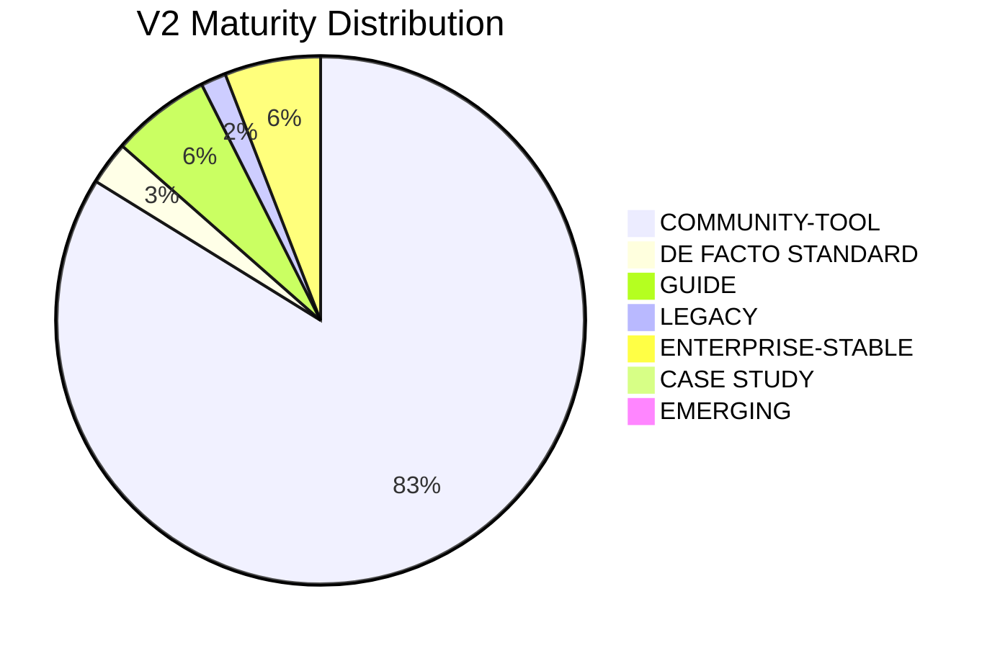

## 🏆 V2 Elite: Agentic Optimization Sync (2026)

The V2 Portal has been synchronized with the latest V1 changes. This update enforces the **Minimum Viable Quality (MVQ)** and O'Reilly-style architectural standards.

### 📊 High-Density Efficiency
| Metric | V1 Archive | V2 Elite | Delta / Efficiency |
| :--- | :---: | :---: | :---: |
| **Total Resources** | 15214 | 10317 | -4897 (67.81% Density) |
| **AI Enrichment** | N/A | 2854 / 10317 | 27.66% Coverage |
| **GitHub Metadata** | N/A | 1450 / 1756 | 82.57% Coverage |
| **Maturity Tagging** | Manual | AI-Vetted | 100% Coverage |
| **Hierarchical Depth** | Flat | Recursive | Max Depth: 10 |

### 🏗️ Evidence of Elite Status

📊 Clic para ver Gráfico de Distribución

### 🧠 AI Intelligence & Observability Report

#### 🤖 Agentic Roles & Model Selection (Dynamic)
Execution utilized a multi-agent Analyst-Auditor workflow for maximum robustness.

| Agent Role | Model Used | Successes |
| :--- | :--- | :---: |

#### 🤖 Model Performance Matrix
| Model Used | Successful Calls | Hierarchy Logic |
| :--- | :---: | :--- |
| No AI calls | 0 | N/A |

#### 🔑 API Infrastructure & Quota Management
| Key Index | Type | Provider Label | Usage | Errors (429/404) |
| :--- | :--- | :--- | :---: | :---: |

#### 📊 Consumption and Efficiency Metrics (2026 Units)
- **Total Prompt Tokens**: 0
- **Total Completion Tokens**: 0
- **💰 Estimated Cost**: **0.0000 €**
- **Database-First Cache Hits**: **0** (0.0% hit ratio)
- **Estimated Tokens Saved**: ~0 (Zero-API cost)
- **Execution Efficiency**: 0.0% (Completion/Prompt)

*Status: 0 models verified. System auto-adopted newest versions found.*

---
**Detailed Architectural Audit and Decision Matrix follow in comments.**

## 🛡️ Platinum Safety & Mandate Audit: ❌ FAILED
*Audit executed on 2026-05-22 15:26:54*

### 🔍 High-Value Pending Reviews
> ⚠️ The following resources have been preserved in V1 but hidden from V2 for manual audit.

- 📍 `New AWS Solutions Implementation: Tag Tamer`: Original: https://aws.amazon.com/about-aws/whats-new/2021/06/new-aws-solutions-implementation-tag-tamer | Proposed: NONE
- 📍 `AWS Site-to-Site VPN releases updated Download Configuration utility`: Original: https://aws.amazon.com/about-aws/whats-new/2021/09/aws-site-to-site-vpn-download-configuration-utility | Proposed: NONE
- 📍 `Announcing Amazon Elastic File System Replication`: Original: https://aws.amazon.com/about-aws/whats-new/2022/01/amazon-elastic-file-system-replication | Proposed: NONE
- 📍 `Amazon CloudWatch now supports high resolution metric extraction from structured logs`: Original: https://aws.amazon.com/about-aws/whats-new/2023/02/amazon-cloudwatch-high-resolution-metric-extraction-structured-logs | Proposed: NONE
- 📍 `AWS SAM CLI introduces ‘sam list’ command to inspect AWS SAM resources`: Original: https://aws.amazon.com/about-aws/whats-new/2023/02/aws-sam-cli-sam-list-command-inspect-resources | Proposed: NONE
- 📍 `Popular community plugins that can improve your Grafana dashboards 🌟`: Original: https://grafana.com/blog/2020/08/26/popular-community-plugins-that-can-improve-your-grafana-dashboards | Proposed: NONE
- 📍 `Thomas Publishing Case Study`: Original: https://aws.amazon.com/solutions/case-studies/thomas-publishing | Proposed: NONE
- 📍 `AWS Toolkits for Cloud9, JetBrains and VS Code now support interaction with over 200 new resource types 🌟`: Original: https://aws.amazon.com/about-aws/whats-new/2021/11/aws-toolkits-cloud9-jetbrains-vs-code | Proposed: NONE
- 📍 `smartbear.com: The State of API 2019 Report 🌟`: Original: https://smartbear.com/resources/ebooks/the-state-of-api-2019-report | Proposed: NONE
- 📍 `blog.testproject.io: Top 10 API Testing Tools to Watch in 2020 🌟`: Original: https://blog.testproject.io/2020/06/25/top-10-api-testing-tools-to-watch-in-2020 | Proposed: NONE
- 📍 `blog.testproject.io: API Testing 101 🌟`: Original: https://blog.testproject.io/2021/06/16/api-testing-101 | Proposed: NONE
- 📍 `Deploying to Azure: Secure Your GitHub Workflow with OIDC`: Original: https://thomasthornton.cloud/2025/02/27/deploying-to-azure-secure-your-github-workflow-with-oidc | Proposed: NONE
- 📍 `harness.io: Intro to Deployment Strategies: Blue-Green, Canary, and More 🌟`: Original: https://harness.io/blog/continuous-verification/blue-green-canary-deployment-strategies | Proposed: NONE
- 📍 `https://azure.github.io/Azure-Landing-Zones/accelerator`: Original: https://azure.github.io/Azure-Landing-Zones//accelerator | Proposed: NONE
- 📍 `postgresql.org: Crunchy PostgreSQL Operator 4.5: Enhanced Monitoring, Custom Annotations, PostgreSQL 13 🌟`: Original: https://www.postgresql.org/about/news/crunchy-postgresql-operator-45-enhanced-monitoring-custom-annotations-postgresql-13-2086 | Proposed: NONE
- 📍 `falco.org/about/case-studies/incepto-medical: Protect shared clusters for medical imaging`: Original: https://falco.org/about/case-studies/incepto-medical | Proposed: NONE
- 📍 `stackrox.com: Part 1 - Rancher Kubernetes Engine (RKE) Security Best Practices for Cluster Setup 🌟`: Original: https://www.stackrox.com/post/2021/01/part-1-rancher-kubernetes-engine-rke-security-best-practices-for-cluster-setup | Proposed: NONE
- 📍 `==thomasthornton.cloud: A DevOps journey using Azure DevOps==`: Original: https://thomasthornton.cloud/2021/12/26/a-devops-journey-using-azure-devops | Proposed: NONE
- 📍 `blog.vmware.com: DevOps: Culture – Collaboration, Empowerment, Autonomy 🌟`: Original: https://blogs.vmware.com/management/2020/06/devops-culture.html | Proposed: NONE
- 📍 `itproportal.com: How to implement DevOps successfully in 2021 🌟`: Original: https://www.itproportal.com/features/how-to-implement-devops-successfully-in-2021 | Proposed: NONE
- 📍 `itproportal.com: Stop messing up with CI/CD vs. DevOps and learn the difference finally`: Original: https://www.itproportal.com/features/stop-messing-up-with-cicd-vs-devops-and-learn-the-difference-finally | Proposed: NONE
- 📍 `==about.gitlab.com: Fantastic Infrastructure as Code security attacks and how to find them==`: Original: https://about.gitlab.com/blog/2022/02/17/fantastic-infrastructure-as-code-security-attacks-and-how-to-find-them | Proposed: NONE
- 📍 `about.gitlab.com: How to secure your container images with GitLab and Grype`: Original: https://about.gitlab.com/blog/2021/07/28/secure-container-images-with-gitlab-and-grype | Proposed: NONE
- 📍 `iximiuz.com: Container Networking Is Simple!`: Original: https://iximiuz.com/en/posts/container-networking-is-simple | Proposed: NONE
- 📍 `gitlab.com: How to keep your Git history clean with interactive rebase`: Original: https://about.gitlab.com/blog/2020/11/23/keep-git-history-clean-with-interactive-rebase | Proposed: NONE
- 📍 `about.gitlab.com: Why small merge requests are key to a great review 🌟`: Original: https://about.gitlab.com/blog/2021/03/18/iteration-and-code-review | Proposed: NONE
- 📍 `blog.testproject.io: Git 101 From Scratch: The Ultimate Guide for QAs 🌟`: Original: https://blog.testproject.io/2021/09/23/git-101-from-scratch-the-ultimate-guide-for-qas | Proposed: NONE
- 📍 `gitlab.com: GitLab’s guide to CI/CD for beginners`: Original: https://about.gitlab.com/blog/2020/07/06/beginner-guide-ci-cd | Proposed: NONE
- 📍 `about.gitlab.com: Want a more effective CI/CD pipeline? Try our pro tips`: Original: https://about.gitlab.com/blog/2020/07/29/effective-ci-cd-pipelines | Proposed: NONE
- 📍 `about.gitlab.com: A new era of Kubernetes integrations on GitLab.com`: Original: https://about.gitlab.com/blog/2021/02/22/gitlab-kubernetes-agent-on-gitlab-com | Proposed: NONE
- 📍 `hipertextual.com: GitHub une fuerzas con OpenIA para crear una inteligencia artificial capaz de autocompletar código`: Original: https://hipertextual.com/2021/06/github-inteligencia-artificial-autocompletar-codigo | Proposed: NONE
- 📍 `about.gitlab.com: 3 Ways to approach GitOps 🌟`: Original: https://about.gitlab.com/blog/2021/04/27/gitops-done-3-ways | Proposed: NONE
- 📍 `ibm.com: Enable GitOps`: Original: https://www.ibm.com/garage/method/practices/run/gitops | Proposed: NONE
- 📍 `blog.heaphero.io: What is GC Log, thread dump and Heapdump? 🌟`: Original: https://blog.heaphero.io/2020/10/16/what-is-gc-log-thread-dump-and-heapdump | Proposed: NONE
- 📍 `cloudbees.com: Jenkins Pipeline with Plugins`: Original: https://www.cloudbees.com/resource/whitepaper/jenkins-pipeline-plugins | Proposed: NONE
- 📍 `cuelogic.com: Decoding Pipeline as Code (With Jenkins) 🌟`: Original: https://www.cuelogic.com/blog/pipeline-as-code | Proposed: NONE
- 📍 `redhat.com: OpenShift Backup and Cluster failover with Triliovault 🌟`: Original: https://www.redhat.com/es/about/videos/openshift-backup-and-cluster-failover-triliovault | Proposed: NONE
- 📍 `Mirantis Docker Enterprise 3.1+ with Kubernetes`: Original: https://www.mirantis.com/software/docker/docker-enterprise | Proposed: NONE
- 📍 `sysdig.com: Kubernetes Security Guide 🌟`: Original: https://sysdig.com/resources/ebooks/kubernetes-security-guide | Proposed: NONE
- 📍 `Kubernetes Hardening Guidance 🌟🌟`: Original: https://media.defense.gov/2021/Aug/03/2002820425/-1/-1/1/CTR_KUBERNETES%20HARDENING%20GUIDANCE.PDF | Proposed: NONE
- 📍 `Hands on your first Kubernetes secrets 🌟`: Original: https://www.padok.fr/en/blog/kubernetes-secrets | Proposed: NONE
- 📍 `OpenEBS Features and Benefits`: Original: https://docs.openebs.io/docs/next/features.html | Proposed: NONE
- 📍 `==research.nccgroup.com: Detection Engineering for Kubernetes clusters==`: Original: https://research.nccgroup.com/2021/11/10/detection-engineering-for-kubernetes-clusters | Proposed: NONE
- 📍 `==azure.microsoft.com: Private preview: Azure Kubernetes Service (AKS) Backup== 🌟`: Original: https://azure.microsoft.com/en-us/updates/private-preview-aks-backup | Proposed: NONE
- 📍 `==grafana.com: Scrape Azure metrics and monitor AKS using Grafana Agent== 🌟`: Original: https://grafana.com/blog/2023/04/07/scrape-azure-metrics-and-monitor-aks-using-grafana-agent | Proposed: NONE
- 📍 `Apache Camel`: Original: https://camel.apache.org | Proposed: NONE
- 📍 `Distributed Load Testing on AWS 🌟`: Original: https://aws.amazon.com/solutions/implementations/distributed-load-testing-on-aws | Proposed: NONE
- 📍 `grafana.com: How we use metamonitoring Prometheus servers to monitor all other Prometheus servers at Grafana Labs`: Original: https://grafana.com/blog/2021/04/08/how-we-use-metamonitoring-prometheus-servers-to-monitor-all-other-prometheus-servers-at-grafana-labs | Proposed: NONE
- 📍 `blog.testproject.io: A Complete Guide to Test Automation Framework 🌟`: Original: https://blog.testproject.io/2021/06/17/a-complete-guide-to-test-automation-framework | Proposed: NONE
- 📍 `blog.testproject.io: REST API Automation From Scratch 🌟`: Original: https://blog.testproject.io/2021/07/28/rest-api-automation-from-scratch | Proposed: NONE
- 📍 `CoolerVoid/codecat: CodeCat - Tool to help in static code analysis`: Original: https://github.com/CoolerVoid/codecat | Proposed: NONE
- 📍 `aws.amazon.com: Serverless or Kubernetes on AWS 🌟`: Original: https://aws.amazon.com/architecture/serverless/serverless-or-kubernetes | Proposed: NONE
- 📍 `gitlab.com: VS Code extension development with GitLab`: Original: https://about.gitlab.com/blog/2020/11/30/vscode-extension-development-with-gitlab | Proposed: NONE
- 📍 `harness.io: Introduction to Helm: Charts, Deployments, & More 🌟`: Original: https://harness.io/blog/continuous-delivery/what-is-helm | Proposed: NONE
- 📍 `grafana.com: Introducing Kubernetes Monitoring in Grafana Cloud`: Original: https://grafana.com/blog/2022/07/13/introducing-kubernetes-monitoring-in-grafana-cloud | Proposed: NONE
- 📍 `grafana.com: How to optimize resource utilization with Kubernetes Monitoring for Grafana Cloud 🌟`: Original: https://grafana.com/blog/2023/03/03/how-to-optimize-resource-utilization-with-kubernetes-monitoring-for-grafana-cloud | Proposed: NONE
- 📍 `grafana.com: How to monitor Kubernetes clusters with the Prometheus Operator`: Original: https://grafana.com/blog/2023/01/19/how-to-monitor-kubernetes-clusters-with-the-prometheus-operator | Proposed: NONE
- 📍 `==iximiuz.com: How Kubernetes Reinvented Virtual Machines (in a good sense)== 🌟🌟`: Original: https://iximiuz.com/en/posts/kubernetes-vs-virtual-machines | Proposed: NONE
- 📍 `==iximiuz.com: Containers vs. Pods - Taking a Deeper Look==`: Original: https://iximiuz.com/en/posts/containers-vs-pods | Proposed: NONE
- 📍 `grafana.com: A beginner's guide to distributed tracing and how it can increase an application's performance 🌟`: Original: https://grafana.com/blog/2021/01/25/a-beginners-guide-to-distributed-tracing-and-how-it-can-increase-an-applications-performance | Proposed: NONE
- 📍 `grafana.com: Announcing Grafana Tempo, a massively scalable distributed tracing system 🌟`: Original: https://grafana.com/blog/2020/10/27/announcing-grafana-tempo-a-massively-scalable-distributed-tracing-system | Proposed: NONE
- 📍 `dynatrace.com: Why conventional observability fails in Kubernetes environments—A real-world use case 🌟`: Original: https://www.dynatrace.com/news/blog/why-conventional-observability-fails-in-kubernetes-environments-a-real-world-use-case | Proposed: NONE
- 📍 `youtube: Getting Started with OpenShift 4 Security 🌟`: Original: https://www.redhat.com/en/about/videos/getting-started-openshift-4-security | Proposed: NONE
- 📍 `business.vogue.es: Adiós a los jefes tóxicos: este es el nuevo tipo de liderazgo gentil que triunfa`: Original: https://business.vogue.es/carrera/articulos/adios-jefes-toxicos-la-salud-organizacional-rentabilidad-residen-liderazgo-gentil/533 | Proposed: NONE
- 📍 `https://highscalability.com/blog/2016/2/17/building-nginx-and-tarantool-based-services.html`: Original: https://highscalability.com/blog/2016/2/17/building-nginx-and-tarantool-based-services.html | Proposed: NONE
- 📍 `https://rollout.io/wp-content/uploads/2018/11/Rising.The_.Flag_.Rollout-1.pdf`: Original: https://rollout.io/wp-content/uploads/2018/11/Rising.The_.Flag_.Rollout-1.pdf | Proposed: NONE
- 📍 `https://www.toptechskills.com/ansible-tutorials-courses/speed-up-ansible-playbooks-pipelining-mitogen`: Original: https://www.toptechskills.com/ansible-tutorials-courses//speed-up-ansible-playbooks-pipelining-mitogen | Proposed: NONE
- 📍 `https://blog.azurebrains.com/despliega-azure-function-terraform-azuredevops`: Original: https://blog.azurebrains.com/despliega-azure-function-terraform-azuredevops | Proposed: NONE
- 📍 `https://www.dynatrace.com/solutions/observability-for-developers/-part-2`: Original: https://www.dynatrace.com/solutions/observability-for-developers/-part-2 | Proposed: NONE
- 📍 `https://www.root.io/docs/docker-desktop-extension.html`: Original: https://www.root.io/docs/docker-desktop-extension.html | Proposed: NONE
- 📍 `https://www.redhat.com/en/technologies/cloud-computing/openshift/blog/how-to-configure-ldap-sync-with-cronjobs-in-openshift`: Original: https://www.redhat.com/en/technologies/cloud-computing/openshift/blog/how-to-configure-ldap-sync-with-cronjobs-in-openshift | Proposed: NONE
- 📍 `https://cloudnativenow.com/features/the-rise-of-the-kubemaster`: Original: https://cloudnativenow.com//features/the-rise-of-the-kubemaster | Proposed: NONE
- 📍 `https://realpython.com/learning-paths/machine-learning-python`: Original: https://realpython.com/learning-paths//machine-learning-python | Proposed: NONE
- 📍 `https://www.redhat.com/en/technologies/cloud-computing/openshift/blog/operator-based-calico-cni-plug-in-is-supported-on-openshift-4`: Original: https://www.redhat.com/en/technologies/cloud-computing/openshift/blog/operator-based-calico-cni-plug-in-is-supported-on-openshift-4 | Proposed: NONE
- 📍 `https://aws.amazon.com/solutions/implementations/workload-discovery-on-aws`: Original: https://aws.amazon.com/solutions/implementations/workload-discovery-on-aws | Proposed: NONE
- 📍 `https://thenewstack.io/platform-engineering/architecture-and-design-considerations-for-platform-engineering-teams`: Original: https://thenewstack.io/platform-engineering//architecture-and-design-considerations-for-platform-engineering-teams | Proposed: NONE
- 📍 `https://www.redhat.com/en/technologies/cloud-computing/openshift/blog/8-answers-to-7-openshift-questions`: Original: https://www.redhat.com/en/technologies/cloud-computing/openshift/blog/8-answers-to-7-openshift-questions | Proposed: NONE
- 📍 `https://grafana.com/blog/2021/11/17/grafana-aws-cloudwatch-integration`: Original: https://grafana.com/blog/2021/11/17/grafana-aws-cloudwatch-integration | Proposed: NONE
- 📍 `https://blackbird.a8r.io/initializer`: Original: https://blackbird.a8r.io/initializer | Proposed: NONE
- 📍 `https://learn.microsoft.com/en-us/en-us/azure/site-recovery/azure-to-azure-how-to-enable-policy`: Original: https://learn.microsoft.com/en-us/en-us/azure/site-recovery/azure-to-azure-how-to-enable-policy | Proposed: NONE
- 📍 `https://www.redhat.com/en/technologies/cloud-computing/openshift/blog/introducing-azure-red-hat-openshift-on-openshift-4`: Original: https://www.redhat.com/en/technologies/cloud-computing/openshift/blog/introducing-azure-red-hat-openshift-on-openshift-4 | Proposed: NONE
- 📍 `https://www.f5.com/products/nginx/resources/library/complete-nginx-cookbook`: Original: https://www.f5.com/products/nginx/resources/library/complete-nginx-cookbook | Proposed: NONE
- 📍 `https://cloud.google.com/architecture/partners/a-hybrid-cloud-native-devsecops-pipeline-with-jfrog-artifactory-and-gke-on-prem`: Original: https://cloud.google.com/architecture/partners/a-hybrid-cloud-native-devsecops-pipeline-with-jfrog-artifactory-and-gke-on-prem | Proposed: NONE
- 📍 `https://www.red-gate.com/products/flyway/community`: Original: https://www.red-gate.com/products/flyway/community | Proposed: NONE
- 📍 `https://azure.microsoft.com/en-us/services/devops`: Original: https://azure.microsoft.com/en-us/services/devops | Proposed: NONE
- 📍 `https://trstringer.com/deploy-to-aks-from-github-actions/-self-hosted`: Original: https://trstringer.com/deploy-to-aks-from-github-actions/-self-hosted | Proposed: NONE
- 📍 `https://code.visualstudio.com/updates/v1_120/v1_46`: Original: https://code.visualstudio.com/updates/v1_120/v1_46 | Proposed: NONE
- 📍 `https://www.redhat.com/en/technologies/cloud-computing/openshift/blog/openshift-security-best-practices-for-kubernetes-cluster-design`: Original: https://www.redhat.com/en/technologies/cloud-computing/openshift/blog/openshift-security-best-practices-for-kubernetes-cluster-design | Proposed: NONE
- 📍 `https://jfrog.com/help/r/jfrog-artifactory-documentation/helm-chart-repositories`: Original: https://jfrog.com/help/r/jfrog-artifactory-documentation/helm-chart-repositories | Proposed: NONE
- 📍 `https://k21academy.com/microsoft-azure/az-104/azure-container-instances-and-kubernetes-service`: Original: https://k21academy.com/microsoft-azure/az-104/azure-container-instances-and-kubernetes-service | Proposed: NONE
- 📍 `https://docs.sonarsource.com/sonarqube-server/analyzing-source-code/scanners/sonarscanner-for-jenkins`: Original: https://docs.sonarsource.com/sonarqube-server/analyzing-source-code/scanners/sonarscanner-for-jenkins | Proposed: NONE
- 📍 `https://github.com/redhat-actions/openshift-actions-runners-chart`: Original: https://github.com/redhat-actions/openshift-actions-runners-chart | Proposed: NONE
- 📍 `https://thenewstack.io/kubernetes/-probes-and-why-they-matter-for-autoscaling`: Original: https://thenewstack.io/kubernetes/-probes-and-why-they-matter-for-autoscaling | Proposed: NONE
- 📍 `https://thenewstack.io/kubernetes/-lifecycle-management-so-important-what-does-it-mean`: Original: https://thenewstack.io/kubernetes/-lifecycle-management-so-important-what-does-it-mean | Proposed: NONE
- 📍 `https://thenewstack.io/kubernetes/-is-not-just-about-containers-its-about-the-api`: Original: https://thenewstack.io/kubernetes/-is-not-just-about-containers-its-about-the-api | Proposed: NONE
- 📍 `https://thenewstack.io/kubernetes/-observability-challenges-in-cloud-native-architecture`: Original: https://thenewstack.io/kubernetes/-observability-challenges-in-cloud-native-architecture | Proposed: NONE

### ⚖️ License & Compliance Dashboard
| License Type | Count |
| :--- | :---: |
| N/A | 13677 |
| Apache-2.0 | 793 |
| MIT | 432 |
| NOASSERTION | 121 |
| GPL-3.0 | 45 |
| CC0-1.0 | 36 |
| MPL-2.0 | 25 |
| BSD-3-Clause | 23 |
| AGPL-3.0 | 20 |
| MIT-0 | 14 |
| CC-BY-4.0 | 8 |
| CC-BY-SA-4.0 | 4 |
| GPL-2.0 | 4 |
| BSD-2-Clause | 3 |
| EPL-2.0 | 2 |
| 0BSD | 1 |
| WTFPL | 1 |
| Unlicense | 1 |
| ISC | 1 |
| Zlib | 1 |
| LGPL-3.0 | 1 |
| EPL-1.0 | 1 |

> ✅ **Compliance**: All monitored projects follow permissive Open Source standards.

### 🔴 Critical Failures
- 💎 **VIP Flag Missing**: `https://github.com/sindresorhus/awesome` from `other-awesome-lists.md` is not marked as Special
- 💎 **VIP Flag Missing**: `https://dev.to/playfulprogramming/the-awesome-side-of-github-awesome-lists-2a5h` from `other-awesome-lists.md` is not marked as Special
- 💎 **VIP Flag Missing**: `https://ramitsurana.github.io/awesome-kubernetes` from `other-awesome-lists.md` is not marked as Special
- 💎 **VIP Flag Missing**: `https://github.com/tomhuang12/awesome-k8s-resources` from `other-awesome-lists.md` is not marked as Special
- 💎 **VIP Flag Missing**: `https://github.com/sindresorhus/awesome` from `other-awesome-lists.md` is not marked as Special
- 💎 **VIP Flag Missing**: `https://github.com/jk8s/awesome-kubernetes` from `other-awesome-lists.md` is not marked as Special
- 💎 **VIP Flag Missing**: `http://dockerlabs.collabnix.com/kubernetes/kubetools` from `other-awesome-lists.md` is not marked as Special
- 💎 **VIP Flag Missing**: `https://collabnix.github.io/kubetools` from `other-awesome-lists.md` is not marked as Special
- 💎 **VIP Flag Missing**: `https://github.com/magnologan/awesome-k8s-security` from `other-awesome-lists.md` is not marked as Special
- 💎 **VIP Flag Missing**: `https://github.com/ksoclabs/awesome-kubernetes-security` from `other-awesome-lists.md` is not marked as Special
- 💎 **VIP Flag Missing**: `https://github.com/rootsongjc/awesome-cloud-native` from `other-awesome-lists.md` is not marked as Special
- 💎 **VIP Flag Missing**: `https://github.com/diegolnasc/kubernetes-best-practices` from `other-awesome-lists.md` is not marked as Special
- 💎 **VIP Flag Missing**: `https://unofficial-kubernetes.readthedocs.io/en/latest` from `other-awesome-lists.md` is not marked as Special
- 💎 **VIP Flag Missing**: `https://github.com/run-x/awesome-kubernetes` from `other-awesome-lists.md` is not marked as Special
- 💎 **VIP Flag Missing**: `https://github.com/clusterpedia-io/clusterpedia` from `other-awesome-lists.md` is not marked as Special
- 💎 **VIP Flag Missing**: `https://github.com/mikeroyal/Kubernetes-Guide` from `other-awesome-lists.md` is not marked as Special
- 💎 **VIP Flag Missing**: `https://www.fairwinds.com/blog/top-12-kubernetes-resources` from `other-awesome-lists.md` is not marked as Special
- 💎 **VIP Flag Missing**: `https://github.com/joseadanof/awesome-cloudnative-trainings` from `other-awesome-lists.md` is not marked as Special
- 💎 **VIP Flag Missing**: `https://github.com/calvin-puram/awesome-kubernetes-operator-resources` from `other-awesome-lists.md` is not marked as Special
- 💎 **VIP Flag Missing**: `https://free-for.dev` from `other-awesome-lists.md` is not marked as Special
- 💎 **VIP Flag Missing**: `https://github.com/tcnksm/awesome-container` from `other-awesome-lists.md` is not marked as Special
- 💎 **VIP Flag Missing**: `https://github.com/jyguyomarch/awesome-productivity` from `other-awesome-lists.md` is not marked as Special
- 💎 **VIP Flag Missing**: `https://github.com/inputsh/awesome-linux` from `other-awesome-lists.md` is not marked as Special
- 💎 **VIP Flag Missing**: `https://github.com/trimstray/the-book-of-secret-knowledge` from `other-awesome-lists.md` is not marked as Special
- 💎 **VIP Flag Missing**: `https://github.com/binhnguyennus/awesome-scalability` from `other-awesome-lists.md` is not marked as Special
- 💎 **VIP Flag Missing**: `https://github.com/bregman-arie/devops-exercises` from `other-awesome-lists.md` is not marked as Special
- 💎 **VIP Flag Missing**: `https://github.com/trimstray/test-your-sysadmin-skills` from `other-awesome-lists.md` is not marked as Special
- 💎 **VIP Flag Missing**: `https://github.com/upgundecha/howtheysre` from `other-awesome-lists.md` is not marked as Special
- 💎 **VIP Flag Missing**: `https://github.com/yangshun/tech-interview-handbook` from `other-awesome-lists.md` is not marked as Special
- 💎 **VIP Flag Missing**: `https://github.com/unixorn/awesome-zsh-plugins` from `other-awesome-lists.md` is not marked as Special
- 💎 **VIP Flag Missing**: `https://github.com/developer-guy/awesome-falco` from `other-awesome-lists.md` is not marked as Special
- 💎 **VIP Flag Missing**: `https://github.com/runacapital/awesome-oss-alternatives` from `other-awesome-lists.md` is not marked as Special
- 💎 **VIP Flag Missing**: `https://awesome-architecture.com` from `other-awesome-lists.md` is not marked as Special
- 💎 **VIP Flag Missing**: `https://github.com/lorien/awesome-web-scraping` from `other-awesome-lists.md` is not marked as Special
- 💎 **VIP Flag Missing**: `https://devdocs.io` from `other-awesome-lists.md` is not marked as Special
- 💎 **VIP Flag Missing**: `https://developer.hashicorp.com` from `other-awesome-lists.md` is not marked as Special
- 💎 **VIP Flag Missing**: `https://github.com/iximiuz/awesome-container-tinkering` from `other-awesome-lists.md` is not marked as Special
- 💎 **VIP Flag Missing**: `https://github.com/ran-isenberg/aws-lambda-handler-cookbook` from `other-awesome-lists.md` is not marked as Special
- 💎 **VIP Flag Missing**: `https://github.com/koslib/awesome-containerized-security` from `other-awesome-lists.md` is not marked as Special
- 💎 **VIP Flag Missing**: `https://github.com/steve-mt/awesome-slo` from `other-awesome-lists.md` is not marked as Special
- 💎 **VIP Flag Missing**: `https://github.com/Noovolari/awesome-cloudops` from `other-awesome-lists.md` is not marked as Special
- 💎 **VIP Flag Missing**: `https://github.com/collections/learn-to-code` from `other-awesome-lists.md` is not marked as Special
- 💎 **VIP Flag Missing**: `https://github.com/palark/awesome-devops-telegram` from `other-awesome-lists.md` is not marked as Special
- 💎 **VIP Flag Missing**: `https://github.com/punkpeye/awesome-mcp-servers` from `other-awesome-lists.md` is not marked as Special
- 💎 **VIP Flag Missing**: `https://github.com/terrytangyuan/awesome-kubeflow` from `other-awesome-lists.md` is not marked as Special
- 💎 **VIP Flag Missing**: `https://github.com/shahedbd/awesome-project-management` from `other-awesome-lists.md` is not marked as Special
- 💎 **VIP Flag Missing**: `https://github.com/lorabv/awesome-agile` from `other-awesome-lists.md` is not marked as Special
- 💎 **VIP Flag Missing**: `https://github.com/rayfrankenstein/AITOW` from `other-awesome-lists.md` is not marked as Special
- 💎 **VIP Flag Missing**: `https://github.com/kahun/awesome-sysadmin` from `other-awesome-lists.md` is not marked as Special
- 💎 **VIP Flag Missing**: `https://awesome.jimmysong.io` from `other-awesome-lists.md` is not marked as Special
- 💎 **VIP Flag Missing**: `https://github.com/saturnism/awesome-cloud-native-java` from `other-awesome-lists.md` is not marked as Special
- 💎 **VIP Flag Missing**: `https://github.com/cicdops/awesome-ciandcd` from `other-awesome-lists.md` is not marked as Special
- 💎 **VIP Flag Missing**: `https://github.com/pditommaso/awesome-pipeline` from `other-awesome-lists.md` is not marked as Special
- 💎 **VIP Flag Missing**: `https://github.com/sahilsk/awesome-jenkins` from `other-awesome-lists.md` is not marked as Special
- 💎 **VIP Flag Missing**: `https://github.com/orangetw/awesome-jenkins-rce-2019` from `other-awesome-lists.md` is not marked as Special
- 💎 **VIP Flag Missing**: `https://github.com/sdras/awesome-actions` from `other-awesome-lists.md` is not marked as Special
- 💎 **VIP Flag Missing**: `https://github.com/robzienert/awesome-spinnaker` from `other-awesome-lists.md` is not marked as Special
- 💎 **VIP Flag Missing**: `https://github.com/awesome-soft/awesome-devops` from `other-awesome-lists.md` is not marked as Special
- 💎 **VIP Flag Missing**: `https://github.com/bregman-arie/devops-resources` from `other-awesome-lists.md` is not marked as Special
- 💎 **VIP Flag Missing**: `https://github.com/andredesousa/devops-best-practices` from `other-awesome-lists.md` is not marked as Special
- 💎 **VIP Flag Missing**: `https://github.com/MichaelCade/90DaysOfDevOps` from `other-awesome-lists.md` is not marked as Special
- 💎 **VIP Flag Missing**: `https://github.com/sottlmarek/DevSecOps` from `other-awesome-lists.md` is not marked as Special
- 💎 **VIP Flag Missing**: `https://github.com/sottlmarek/DevSecOps#kubernetes` from `other-awesome-lists.md` is not marked as Special
- 💎 **VIP Flag Missing**: `https://github.com/hahwul/DevSecOps` from `other-awesome-lists.md` is not marked as Special
- 💎 **VIP Flag Missing**: `https://github.com/weaveworks/awesome-gitops` from `other-awesome-lists.md` is not marked as Special
- 💎 **VIP Flag Missing**: `https://github.com/microtica/gitops-resources` from `other-awesome-lists.md` is not marked as Special
- 💎 **VIP Flag Missing**: `https://github.com/dastergon/awesome-sre` from `other-awesome-lists.md` is not marked as Special
- 💎 **VIP Flag Missing**: `https://github.com/SquadcastHub/awesome-sre-tools` from `other-awesome-lists.md` is not marked as Special
- 💎 **VIP Flag Missing**: `https://github.com/mancubus77/awesome-sre` from `other-awesome-lists.md` is not marked as Special
- 💎 **VIP Flag Missing**: `https://github.com/awesome-sre/awesome-sre` from `other-awesome-lists.md` is not marked as Special
- 💎 **VIP Flag Missing**: `https://github.com/upgundecha/howtheysre` from `other-awesome-lists.md` is not marked as Special
- 💎 **VIP Flag Missing**: `https://github.com/oscp/awesome-openshift3` from `other-awesome-lists.md` is not marked as Special
- 💎 **VIP Flag Missing**: `https://github.com/mfornos/awesome-microservices` from `other-awesome-lists.md` is not marked as Special
- 💎 **VIP Flag Missing**: `https://github.com/akuity/awesome-argo` from `other-awesome-lists.md` is not marked as Special
- 💎 **VIP Flag Missing**: `https://github.com/akuity/awesome-argo` from `other-awesome-lists.md` is not marked as Special
- 💎 **VIP Flag Missing**: `https://github.com/adriannovegil/awesome-observability` from `other-awesome-lists.md` is not marked as Special
- 💎 **VIP Flag Missing**: `https://github.com/antonarhipov/awesome-apm` from `other-awesome-lists.md` is not marked as Special
- 💎 **VIP Flag Missing**: `https://github.com/donnemartin/awesome-aws` from `other-awesome-lists.md` is not marked as Special
- 💎 **VIP Flag Missing**: `https://github.com/GoogleCloudPlatform/awesome-google-cloud` from `other-awesome-lists.md` is not marked as Special
- 💎 **VIP Flag Missing**: `https://github.com/kristofferandreasen/awesome-azure` from `other-awesome-lists.md` is not marked as Special
- 💎 **VIP Flag Missing**: `https://github.com/simhol/awesome-azure` from `other-awesome-lists.md` is not marked as Special
- 💎 **VIP Flag Missing**: `https://github.com/jonleibowitz/awesome-digitalocean` from `other-awesome-lists.md` is not marked as Special
- 💎 **VIP Flag Missing**: `https://github.com/jimmyraywv/awesome-eks` from `other-awesome-lists.md` is not marked as Special
- 💎 **VIP Flag Missing**: `https://github.com/realvz/awesome-eks` from `other-awesome-lists.md` is not marked as Special
- 💎 **VIP Flag Missing**: `https://github.com/globalbao/awesome-azure-policy` from `other-awesome-lists.md` is not marked as Special
- 💎 **VIP Flag Missing**: `https://github.com/toniblyx/my-arsenal-of-aws-security-tools` from `other-awesome-lists.md` is not marked as Special
- 💎 **VIP Flag Missing**: `https://github.com/lukemurraynz/awesome-azure-architecture` from `other-awesome-lists.md` is not marked as Special
- 💎 **VIP Flag Missing**: `https://github.com/iam-veeramalla/Azure-zero-to-hero` from `other-awesome-lists.md` is not marked as Special
- 💎 **VIP Flag Missing**: `https://github.com/veggiemonk/awesome-docker` from `other-awesome-lists.md` is not marked as Special
- 💎 **VIP Flag Missing**: `https://github.com/docker/awesome-compose` from `other-awesome-lists.md` is not marked as Special
- 💎 **VIP Flag Missing**: `https://collabnix.github.io/docker-community-extensions` from `other-awesome-lists.md` is not marked as Special
- 💎 **VIP Flag Missing**: `https://github.com/jdauphant/awesome-ansible` from `other-awesome-lists.md` is not marked as Special
- 💎 **VIP Flag Missing**: `https://accounts.google.com/v3/signin/identifier?continue=https%3A%2F%2Fsites.google.com%2Fsite%2Fmrxpalmeiras%2Fansible%2Fansible-cheat-sheet&dsh=S1127513064%3A1779041015006518&followup=https%3A%2F%2Fsites.google.com%2Fsite%2Fmrxpalmeiras%2Fansible%2Fansible-cheat-sheet&osid=1&passive=1209600&flowName=WebLiteSignIn&flowEntry=ServiceLogin&ifkv=AWa2PatKhgmTZTEkwb3Q5nWpkPt4ntDFIyQrUJIi2ZjPJ-M3IOraCUtKjEa4_jbOFaWLmjeqIlS_` from `other-awesome-lists.md` is not marked as Special
- 💎 **VIP Flag Missing**: `https://github.com/ansible-community/awesome-ansible` from `other-awesome-lists.md` is not marked as Special
- 💎 **VIP Flag Missing**: `https://github.com/dchonch/awesome-packer` from `other-awesome-lists.md` is not marked as Special
- 💎 **VIP Flag Missing**: `https://github.com/shuaibiyy/awesome-tf` from `other-awesome-lists.md` is not marked as Special
- 💎 **VIP Flag Missing**: `https://github.com/ElYusubov/AWESOME-Azure-Bicep` from `other-awesome-lists.md` is not marked as Special
- 💎 **VIP Flag Missing**: `https://github.com/sbilly/awesome-security` from `other-awesome-lists.md` is not marked as Special
- 💎 **VIP Flag Missing**: `https://github.com/myugan/awesome-docker-security` from `other-awesome-lists.md` is not marked as Special
- 💎 **VIP Flag Missing**: `https://github.com/open-policy-agent/awesome-opa` from `other-awesome-lists.md` is not marked as Special
- 💎 **VIP Flag Missing**: `https://github.com/tldrsec/awesome-secure-defaults` from `other-awesome-lists.md` is not marked as Special
- 💎 **VIP Flag Missing**: `https://github.com/atinfo/awesome-test-automation` from `other-awesome-lists.md` is not marked as Special
- 💎 **VIP Flag Missing**: `https://github.com/ligurio/sqa-wiki` from `other-awesome-lists.md` is not marked as Special
- 💎 **VIP Flag Missing**: `https://github.com/TheJambo/awesome-testing` from `other-awesome-lists.md` is not marked as Special
- 💎 **VIP Flag Missing**: `https://github.com/slawekradzyminski/AwesomeTesting` from `other-awesome-lists.md` is not marked as Special
- 💎 **VIP Flag Missing**: `https://github.com/aliesbelik/awesome-jmeter` from `other-awesome-lists.md` is not marked as Special
- 💎 **VIP Flag Missing**: `https://github.com/mailtoharshit/Awesome-Api-Management-Tools` from `other-awesome-lists.md` is not marked as Special
- 💎 **VIP Flag Missing**: `https://github.com/yangtao309/awesome-api-gateway` from `other-awesome-lists.md` is not marked as Special
- 💎 **VIP Flag Missing**: `https://github.com/dictcp/awesome-git` from `other-awesome-lists.md` is not marked as Special
- 💎 **VIP Flag Missing**: `https://github.com/viatsko/awesome-vscode` from `other-awesome-lists.md` is not marked as Special
- 💎 **VIP Flag Missing**: `https://github.com/vinta/awesome-python` from `other-awesome-lists.md` is not marked as Special
- 💎 **VIP Flag Missing**: `https://github.com/akullpp/awesome-java` from `other-awesome-lists.md` is not marked as Special
- 💎 **VIP Flag Missing**: `https://github.com/PatrickJS/awesome-angular` from `other-awesome-lists.md` is not marked as Special
- 💎 **VIP Flag Missing**: `https://github.com/avelino/awesome-go` from `other-awesome-lists.md` is not marked as Special
- 💎 **VIP Flag Missing**: `https://github.com/thangchung/awesome-dotnet-core` from `other-awesome-lists.md` is not marked as Special
- 💎 **VIP Flag Missing**: `https://github.com/charlax/professional-programming` from `other-awesome-lists.md` is not marked as Special
- 💎 **VIP Flag Missing**: `https://www.igoroseledko.com/bash-and-expect-snippets` from `other-awesome-lists.md` is not marked as Special
- 💎 **VIP Flag Missing**: `https://github.com/janikvonrotz/awesome-powershell` from `other-awesome-lists.md` is not marked as Special
- 💎 **VIP Flag Missing**: `https://awesomerank.github.io/lists/janikvonrotz/awesome-powershell.html` from `other-awesome-lists.md` is not marked as Special
- 💎 **VIP Flag Missing**: `https://github.com/manuzhang/awesome-streaming` from `other-awesome-lists.md` is not marked as Special
- 💎 **VIP Flag Missing**: `https://github.com/monksy/awesome-kafka/blob/master/tools.md` from `other-awesome-lists.md` is not marked as Special
- 💎 **VIP Flag Missing**: `https://github.com/oxnr/awesome-bigdata` from `other-awesome-lists.md` is not marked as Special
- 💎 **VIP Flag Missing**: `https://github.com/visenger/awesome-mlops` from `other-awesome-lists.md` is not marked as Special
- 💎 **VIP Flag Missing**: `https://github.com/ekramasif/Basic-Machine-Learning` from `other-awesome-lists.md` is not marked as Special
- 💎 **VIP Flag Missing**: `https://github.com/abhishek-ch/around-dataengineering` from `other-awesome-lists.md` is not marked as Special
- 💎 **VIP Flag Missing**: `https://github.com/DataExpert-io/data-engineer-handbook` from `other-awesome-lists.md` is not marked as Special
- 💎 **VIP Flag Missing**: `https://opensource.builders` from `other-awesome-lists.md` is not marked as Special
- 💎 **VIP Flag Missing**: `https://free-for.dev` from `other-awesome-lists.md` is not marked as Special
- 💎 **VIP Flag Missing**: `https://github.com/kubernetes-sigs/krew-index/blob/master/plugins.md` from `other-awesome-lists.md` is not marked as Special
- 💎 **VIP Flag Missing**: `https://github.com/ishantanu/awesome-kubectl-plugins` from `other-awesome-lists.md` is not marked as Special
- 💎 **VIP Flag Missing**: `https://dev.to/swordheath/great-github-repositories-that-developers-love-1g97` from `other-awesome-lists.md` is not marked as Special
- 💎 **VIP Flag Missing**: `https://github.com/tensorchord/Awesome-LLMOps` from `other-awesome-lists.md` is not marked as Special
- 💎 **VIP Flag Missing**: `https://github.com/DevOps-Projects-Ideas/DevOps-Books` from `other-awesome-lists.md` is not marked as Special
- 💎 **VIP Flag Missing**: `https://www.redhat.com/en/blog/yaml-beginners` from `yaml.md` is not marked as Special
- 💎 **VIP Flag Missing**: `https://www.thoughtworks.com/radar/techniques/templating-in-yaml` from `yaml.md` is not marked as Special
- 💎 **VIP Flag Missing**: `https://www.thoughtworks.com/radar/platforms/kubernetes` from `yaml.md` is not marked as Special
- 💎 **VIP Flag Missing**: `https://www.thoughtworks.com/radar/tools/helm` from `yaml.md` is not marked as Special
- 💎 **VIP Flag Missing**: `https://jsonnet.org` from `yaml.md` is not marked as Special
- 💎 **VIP Flag Missing**: `https://stevehorsfield.wordpress.com/2019/08/13/devops-tricks-templating-yaml-files` from `yaml.md` is not marked as Special
- 💎 **VIP Flag Missing**: `https://get-ytt.io` from `yaml.md` is not marked as Special
- 💎 **VIP Flag Missing**: `https://mikefarah.gitbook.io/yq` from `yaml.md` is not marked as Special
- 💎 **VIP Flag Missing**: `https://www.redhat.com/en/blog/understanding-yaml-ansible` from `yaml.md` is not marked as Special
- 💎 **VIP Flag Missing**: `https://linuxhandbook.com/yaml-basics` from `yaml.md` is not marked as Special
- 💎 **VIP Flag Missing**: `https://developers.redhat.com/blog/2020/11/25/how-to-configure-yaml-schema-to-make-editing-files-easier` from `yaml.md` is not marked as Special
- 💎 **VIP Flag Missing**: `https://boxunix.com/2020/05/15/a-better-way-of-organizing-your-kubernetes-manifest-files` from `yaml.md` is not marked as Special
- 💎 **VIP Flag Missing**: `https://opensource.com/article/21/9/yaml-cheat-sheet` from `yaml.md` is not marked as Special
- 💎 **VIP Flag Missing**: `https://www.w3schools.io/file/yaml-vs-yml` from `yaml.md` is not marked as Special
- 💎 **VIP Flag Missing**: `https://realpython.com/python-yaml` from `yaml.md` is not marked as Special
- 💎 **VIP Flag Missing**: `https://spacelift.io/blog/yaml` from `yaml.md` is not marked as Special
- 💎 **VIP Flag Missing**: `https://ruudvanasseldonk.com/2023/01/11/the-yaml-document-from-hell` from `yaml.md` is not marked as Special
- 💎 **VIP Flag Missing**: `https://itnext.io/python-yaml-and-kubernetes-the-art-of-mastering-configuration-cd60029b3f62` from `yaml.md` is not marked as Special
- 💎 **VIP Flag Missing**: `https://itnext.io/kubernetes-yaml-tips-and-tricks-904a2c0b2b81` from `yaml.md` is not marked as Special
- 💎 **VIP Flag Missing**: `https://yaml.org/spec/1.2/spec.html#id2765878` from `yaml.md` is not marked as Special
- 💎 **VIP Flag Missing**: `https://support.atlassian.com/bitbucket-cloud/docs/yaml-anchors` from `yaml.md` is not marked as Special
- 💎 **VIP Flag Missing**: `https://docs.ansible.com/projects/ansible/latest/user_guide/playbooks_advanced_syntax.html#yaml-anchors-and-aliases-sharing-variable-values` from `yaml.md` is not marked as Special
- 💎 **VIP Flag Missing**: `https://github.com/topics/yaml-processor` from `yaml.md` is not marked as Special
- 💎 **VIP Flag Missing**: `https://get-ytt.io` from `yaml.md` is not marked as Special
- 💎 **VIP Flag Missing**: `https://mikefarah.gitbook.io/yq` from `yaml.md` is not marked as Special
- 💎 **VIP Flag Missing**: `https://helm.sh` from `yaml.md` is not marked as Special
- 💎 **VIP Flag Missing**: `https://mikefarah.gitbook.io/yq` from `yaml.md` is not marked as Special
- 💎 **VIP Flag Missing**: `https://dev.to/vikcodes/yq-a-command-line-tool-that-will-help-you-handle-your-yaml-resources-better-8j9` from `yaml.md` is not marked as Special
- 💎 **VIP Flag Missing**: `https://kapitan.dev` from `yaml.md` is not marked as Special
- 💎 **VIP Flag Missing**: `https://github.com/azohra/yaml.sh` from `yaml.md` is not marked as Special
- 💎 **VIP Flag Missing**: `https://github.com/andreazorzetto/yh` from `yaml.md` is not marked as Special
- 💎 **VIP Flag Missing**: `https://gist.github.com/so0k/42313dbb3b547a0f51a547bb968696ba` from `yaml.md` is not marked as Special
- 💎 **VIP Flag Missing**: `http://www.yamllint.com` from `yaml.md` is not marked as Special
- 💎 **VIP Flag Missing**: `https://codebeautify.org/yaml-validator` from `yaml.md` is not marked as Special
- 💎 **VIP Flag Missing**: `https://yamlvalidator.dev` from `yaml.md` is not marked as Special
- 💎 **VIP Flag Missing**: `https://onlineyamltools.com` from `yaml.md` is not marked as Special
- 💎 **VIP Flag Missing**: `https://github.com/avencera/yamine` from `yaml.md` is not marked as Special
- 💎 **VIP Flag Missing**: `https://k8syaml.com` from `yaml.md` is not marked as Special
- 💎 **VIP Flag Missing**: `https://itnext.io/how-to-create-kubernetes-yaml-files-abb8426eeb45` from `yaml.md` is not marked as Special
- 💎 **VIP Flag Missing**: `https://www.datree.io` from `yaml.md` is not marked as Special
- 💎 **VIP Flag Missing**: `https://dev.to/wkrzywiec/automating-quality-checks-for-kubernetes-yamls-398` from `yaml.md` is not marked as Special
- 💎 **VIP Flag Missing**: `https://github.com/23andMe/Yamale` from `yaml.md` is not marked as Special
- 💎 **VIP Flag Missing**: `https://github.com/instrumenta/kubeval` from `yaml.md` is not marked as Special
- 💎 **VIP Flag Missing**: `https://www.linkedin.com/pulse/how-write-yaml-file-kubernetes-megha-s-k` from `yaml.md` is not marked as Special
- 💎 **VIP Flag Missing**: `https://dotnet-helpers.com/powershell/convert-yaml-to-json-or-json-to-yaml-using-powershell` from `yaml.md` is not marked as Special
- 💎 **VIP Flag Missing**: `https://yamline.com` from `yaml.md` is not marked as Special
- 💎 **VIP Flag Missing**: `https://k8s-examples.container-solutions.com` from `yaml.md` is not marked as Special
- 💎 **VIP Flag Missing**: `https://github.com/arttor/helmify` from `yaml.md` is not marked as Special
- 💎 **VIP Flag Missing**: `https://www.json.org/json-en.html` from `yaml.md` is not marked as Special
- 💎 **VIP Flag Missing**: `https://jsonnet.org` from `yaml.md` is not marked as Special
- 💎 **VIP Flag Missing**: `https://dave.cheney.net/high-performance-json.html` from `yaml.md` is not marked as Special
- 💎 **VIP Flag Missing**: `https://json-schema.org/understanding-json-schema/reference` from `yaml.md` is not marked as Special
- 💎 **VIP Flag Missing**: `https://github.com/buger/jsonparser` from `yaml.md` is not marked as Special
- 💎 **VIP Flag Missing**: `https://dev.to/codereviewdoctor/the-json-trick-25-of-python-devs-dont-know-about-including-devs-at-microsoft-sentry-unicef-and-more-4h10` from `yaml.md` is not marked as Special
- 💎 **VIP Flag Missing**: `https://dev.to/urstrulyvishwak/convert-nested-json-to-simple-json-in-javascript-4a34` from `yaml.md` is not marked as Special
- 💎 **VIP Flag Missing**: `https://pythonspeed.com/articles/json-memory-streaming` from `yaml.md` is not marked as Special
- 💎 **VIP Flag Missing**: `https://thenewstack.io/why-and-how-you-should-manage-json-with-sql` from `yaml.md` is not marked as Special
- 💎 **VIP Flag Missing**: `https://automationreinvented.blogspot.com/2022/03/what-is-json-schema-and-how-to-perform.html` from `yaml.md` is not marked as Special
- 💎 **VIP Flag Missing**: `https://opensource.com/article/21/4/process-json-data-ansible` from `yaml.md` is not marked as Special
- 💎 **VIP Flag Missing**: `https://about.gitlab.com/blog/2021/04/21/devops-workflows-json-format-jq-ci-cd-lint` from `yaml.md` is not marked as Special
- 💎 **VIP Flag Missing**: `https://github.com/ilyash/show-struct` from `yaml.md` is not marked as Special
- 💎 **VIP Flag Missing**: `https://github.com/01mf02/jaq` from `yaml.md` is not marked as Special
- 💎 **VIP Flag Missing**: `https://jsoncrack.com` from `yaml.md` is not marked as Special
- 💎 **VIP Flag Missing**: `https://github.com/tomnomnom/gron` from `yaml.md` is not marked as Special
- 💎 **VIP Flag Missing**: `https://github.com/ynqa/jnv` from `yaml.md` is not marked as Special
- 💎 **VIP Flag Missing**: `https://github.com/JFryy/qq` from `yaml.md` is not marked as Special
- 💎 **VIP Flag Missing**: `https://jsoning.com` from `yaml.md` is not marked as Special
- 💎 **VIP Flag Missing**: `https://github.com/instrumenta/kubernetes-json-schema` from `yaml.md` is not marked as Special
- 💎 **VIP Flag Missing**: `https://learnkube.com/validating-kubernetes-yaml` from `yaml.md` is not marked as Special
- 💎 **VIP Flag Missing**: `https://teresaforcades.com/pensament/medicina.html` from `yaml.md` is not marked as Special
- 💎 **VIP Flag Missing**: `https://github.com/FairwindsOps/polaris` from `yaml.md` is not marked as Special
- 💎 **VIP Flag Missing**: `https://kubevious.io/blog/post/top-kubernetes-yaml-validation-tools` from `yaml.md` is not marked as Special
- 💎 **VIP Flag Missing**: `https://github.com/stackrox/kube-linter` from `yaml.md` is not marked as Special
- 💎 **VIP Flag Missing**: `https://thomasthornton.cloud/2022/04/13/analyze-your-kubernetes-yaml-files-and-helm-charts-to-ensure-best-practices-using-kuberlinter-in-azure-devops-pipeline` from `yaml.md` is not marked as Special
- 💎 **VIP Flag Missing**: `https://theketch.io` from `yaml.md` is not marked as Special
- 💎 **VIP Flag Missing**: `https://www.civo.com/learn` from `yaml.md` is not marked as Special
- 💎 **VIP Flag Missing**: `https://github.com/theketchio/ketch` from `yaml.md` is not marked as Special
- 💎 **VIP Flag Missing**: `https://shipa.io/devops-challenge-kubernetes-deployment-ketch-vs-yaml` from `yaml.md` is not marked as Special
- 💎 **VIP Flag Missing**: `https://github.com/krisnova/naml` from `yaml.md` is not marked as Special
- 💎 **VIP Flag Missing**: `https://jvns.ca/blog/2022/04/12/a-list-of-new-ish--command-line-tools` from `yaml.md` is not marked as Special
- 💎 **VIP Flag Missing**: `https://github.com/kislyuk/yq` from `yaml.md` is not marked as Special
- 🚫 **Standard Violation**: Ampersand `&` found in title `Eclipse JKube (formerly known as Fabric8 Maven Plugin) - Kubernetes & OpenShift Maven and Gradle Plugins` in `maven-gradle.md`. Use 'and'.
- 🚫 **Standard Violation**: Ampersand `&` found in title `Eclipse JKube Pipeline Library (formerly known as Fabric8 Kubernetes Plugin). Kubernetes & OpenShift Plugins` in `openshift-pipelines.md`. Use 'and'.
- 🚫 **Standard Violation**: Ampersand `&` found in title `Jenkins & JMeter` in `performance-testing-with-jenkins-and-jmeter.md`. Use 'and'.
- 🚫 **Standard Violation**: Ampersand `&` found in title `Jenkins & Gatling` in `performance-testing-with-jenkins-and-jmeter.md`. Use 'and'.
- 🚫 **Standard Violation**: Ampersand `&` found in title `Jenkins & CloudBees` in `index.md`. Use 'and'.
- 🚫 **Standard Violation**: Ampersand `&` found in title `Web Servers, Reverse Proxies, Java Runtimes & Caching Solutions` in `index.md`. Use 'and'.
- 🚫 **Standard Violation**: Ampersand `&` found in title `Cloud Based Integration & Messaging. Data Processing & Streaming (aka Data Pipeline)` in `index.md`. Use 'and'.
- 🚫 **Standard Violation**: Ampersand `&` found in title `Development & Frameworks` in `index.md`. Use 'and'.
- 🚫 **Standard Violation**: Ampersand `&` found in title `Logging & Centralized Log Management` in `monitoring.md`. Use 'and'.
- 🚫 **Standard Violation**: Ampersand `&` found in title `Crunchy Data Postgres Operator in OpenShift 4. Overview & Proof of Concept` in `crunchydata.md`. Use 'and'.
- 🚫 **Standard Violation**: Ampersand `&` found in title `OpenShift End-to-End. Day 0, Day 1 & Day 2` in `ocp4.md`. Use 'and'.
- 🚫 **Standard Violation**: Ampersand `&` found in title `Cluster Network Operator (CNO) & Routers` in `ocp4.md`. Use 'and'.
- 🚫 **Standard Violation**: Ampersand `&` found in title `Rapid API Marketplace. Free Public & Open REST APIs` in `developerportals.md`. Use 'and'.
- 🚫 **Standard Violation**: Ampersand `&` found in title `API Managers with API Gateways & Developer Portals` in `developerportals.md`. Use 'and'.
- 🚫 **Standard Violation**: Ampersand `&` found in title `OpenShift Network Model & Network Policy ` in `openshift.md`. Use 'and'.
- 🚫 **Standard Violation**: Ampersand `&` found in title `Postman & Newman API Automated Tests` in `demos.md`. Use 'and'.
- 🚫 **Standard Violation**: Ampersand `&` found in title `Apache Camel & ActiveMQ. Event driven integration` in `demos.md`. Use 'and'.
- 🚫 **Standard Violation**: Ampersand `&` found in title `Eclipse Jkube Java Client for Kubernetes (formerly known as Fabric8). Kubernetes & OpenShift Maven Plugins` in `kubernetes-client-libraries.md`. Use 'and'.
- 📚 **V2 TOC Missing**: `linux.md`
- 📚 **V2 TOC Missing**: `aws-storage.md`
- 📚 **V2 TOC Missing**: `aws-databases.md`
- 📚 **V2 TOC Missing**: `yaml.md`
- 📚 **V2 TOC Missing**: `recruitment.md`
- 📚 **V2 TOC Missing**: `registries.md`
- 📚 **V2 TOC Missing**: `aws-spain.md`
- 📚 **V2 TOC Missing**: `helm.md`
- 📚 **V2 TOC Missing**: `crossplane.md`
- 📚 **V2 TOC Missing**: `scaffolding.md`
- 📚 **V2 TOC Missing**: `argo.md`
- 📚 **V2 TOC Missing**: `faq.md`
- 📚 **V2 TOC Missing**: `aws-serverless.md`
- 📚 **V2 TOC Missing**: `freelancing.md`
- 📚 **V2 TOC Missing**: `managed-kubernetes-in-public-cloud.md`
- 📚 **V2 TOC Missing**: `java-and-java-performance-optimization.md`
- 📚 **V2 TOC Missing**: `golang.md`
- 📚 **V2 TOC Missing**: `ai.md`
- 📚 **V2 TOC Missing**: `aws-architecture.md`
- 📚 **V2 TOC Missing**: `message-queue.md`
- 📚 **V2 TOC Missing**: `cloud-asset-inventory.md`
- 📚 **V2 TOC Missing**: `private-cloud-solutions.md`
- 📚 **V2 TOC Missing**: `liquibase.md`
- 📚 **V2 TOC Missing**: `kubernetes-security.md`
- 📚 **V2 TOC Missing**: `kubernetes-on-premise.md`
- 📚 **V2 TOC Missing**: `kubernetes-based-devel.md`
- 📚 **V2 TOC Missing**: `javascript.md`
- 📚 **V2 TOC Missing**: `chatgpt.md`
- 📚 **V2 TOC Missing**: `maven-gradle.md`
- 📚 **V2 TOC Missing**: `sonarqube.md`
- 📚 **V2 TOC Missing**: `devops-tools.md`
- 📚 **V2 TOC Missing**: `openshift-pipelines.md`
- 📚 **V2 TOC Missing**: `ai-agents-mcp.md`
- 📚 **V2 TOC Missing**: `aws-devops.md`
- 📚 **V2 TOC Missing**: `kubernetes-bigdata.md`
- 📚 **V2 TOC Missing**: `interview-questions.md`
- 📚 **V2 TOC Missing**: `performance-testing-with-jenkins-and-jmeter.md`
- 📚 **V2 TOC Missing**: `cicd-kubernetes-plugins.md`
- 📚 **V2 TOC Missing**: `lowcode-nocode.md`
- 📚 **V2 TOC Missing**: `kubernetes-alternatives.md`
- 📚 **V2 TOC Missing**: `istio.md`
- 📚 **V2 TOC Missing**: `web-servers.md`
- 📚 **V2 TOC Missing**: `kubernetes-monitoring.md`
- 📚 **V2 TOC Missing**: `newsql.md`
- 📚 **V2 TOC Missing**: `oraclecloud.md`
- 📚 **V2 TOC Missing**: `devsecops.md`
- 📚 **V2 TOC Missing**: `aws-training.md`
- 📚 **V2 TOC Missing**: `cicd.md`
- 📚 **V2 TOC Missing**: `elearning.md`
- 📚 **V2 TOC Missing**: `sre.md`
- 📚 **V2 TOC Missing**: `git.md`
- 📚 **V2 TOC Missing**: `jenkins.md`
- 📚 **V2 TOC Missing**: `python.md`
- 📚 **V2 TOC Missing**: `kubernetes-tutorials.md`
- 📚 **V2 TOC Missing**: `databases.md`
- 📚 **V2 TOC Missing**: `aws-miscellaneous.md`
- 📚 **V2 TOC Missing**: `monitoring.md`
- 📚 **V2 TOC Missing**: `cloud-arch-diagrams.md`
- 📚 **V2 TOC Missing**: `caching.md`
- 📚 **V2 TOC Missing**: `finops.md`
- 📚 **V2 TOC Missing**: `java_frameworks.md`
- 📚 **V2 TOC Missing**: `ocp4.md`
- 📚 **V2 TOC Missing**: `gitops.md`
- 📚 **V2 TOC Missing**: `developerportals.md`
- 📚 **V2 TOC Missing**: `kubernetes-tools.md`
- 📚 **V2 TOC Missing**: `linux-dev-env.md`
- 📚 **V2 TOC Missing**: `kubectl-commands.md`
- 📚 **V2 TOC Missing**: `azure.md`
- 📚 **V2 TOC Missing**: `GoogleCloudPlatform.md`
- 📚 **V2 TOC Missing**: `api.md`
- 📚 **V2 TOC Missing**: `container-managers.md`
- 📚 **V2 TOC Missing**: `kubernetes-backup-migrations.md`
- 📚 **V2 TOC Missing**: `chaos-engineering.md`
- 📚 **V2 TOC Missing**: `aws-newfeatures.md`
- 📚 **V2 TOC Missing**: `aws-tools-scripts.md`
- 📚 **V2 TOC Missing**: `cheatsheets.md`
- 📚 **V2 TOC Missing**: `terraform.md`
- 📚 **V2 TOC Missing**: `kubernetes-networking.md`
- 📚 **V2 TOC Missing**: `devel-sites.md`
- 📚 **V2 TOC Missing**: `dotnet.md`
- 📚 **V2 TOC Missing**: `kubernetes.md`
- 📚 **V2 TOC Missing**: `aws-iac.md`
- 📚 **V2 TOC Missing**: `jenkins-alternatives.md`
- 📚 **V2 TOC Missing**: `devops.md`
- 📚 **V2 TOC Missing**: `openshift.md`
- 📚 **V2 TOC Missing**: `kustomize.md`
- 📚 **V2 TOC Missing**: `docker.md`
- 📚 **V2 TOC Missing**: `ansible.md`
- 📚 **V2 TOC Missing**: `kubernetes-troubleshooting.md`
- 📚 **V2 TOC Missing**: `securityascode.md`
- 📚 **V2 TOC Missing**: `visual-studio.md`
- 📚 **V2 TOC Missing**: `demos.md`
- 📚 **V2 TOC Missing**: `digitalocean.md`
- 📚 **V2 TOC Missing**: `aws-containers.md`
- 📚 **V2 TOC Missing**: `pulumi.md`
- 📚 **V2 TOC Missing**: `aws.md`
- 📚 **V2 TOC Missing**: `project-management-methodology.md`
- 📚 **V2 TOC Missing**: `aws-security.md`
- 📚 **V2 TOC Missing**: `serverless.md`
- 📚 **V2 TOC Missing**: `servicemesh.md`
- 📚 **V2 TOC Missing**: `iac.md`
- 📚 **V2 TOC Missing**: `prometheus.md`
- 📚 **V2 TOC Missing**: `introduction.md`
- 📚 **V2 TOC Missing**: `networking.md`
- 📚 **V2 TOC Missing**: `oauth.md`
- 📚 **V2 TOC Missing**: `customer.md`
- 📚 **V2 TOC Missing**: `kubernetes-client-libraries.md`
- 📚 **V2 TOC Missing**: `kubernetes-operators-controllers.md`
- 📚 **V2 TOC Missing**: `react.md`
- 📚 **V2 TOC Missing**: `tekton.md`
- 📚 **V2 TOC Missing**: `qa.md`
- 📚 **V2 TOC Missing**: `java_app_servers.md`

### 🟡 Warnings & Recommendations

Click to view 70 recommendations

- 🏚️ **MVQ Violation**: Stale repo `https://github.com/dirien/pulumi-civo-flux-bucket` (>4yrs) in V2 with low impact
- 🏚️ **MVQ Violation**: Stale repo `https://github.com/sonatype-nexus-community/nexus-kubernetes-openshift` (>4yrs) in V2 with low impact
- 🏚️ **MVQ Violation**: Stale repo `https://github.com/cinhtau/sonatype-nexus-waffle` (>4yrs) in V2 with low impact
- 🏚️ **MVQ Violation**: Stale repo `https://github.com/scorputty/packer-centos-awx` (>4yrs) in V2 with low impact
- 🏚️ **MVQ Violation**: Stale repo `https://github.com/abessifi/ansible-sqlplus` (>4yrs) in V2 with low impact
- 🏚️ **MVQ Violation**: Stale repo `https://github.com/mhausenblas/openshift-cheat-sheet` (>4yrs) in V2 with low impact
- 🏚️ **MVQ Violation**: Stale repo `https://github.com/askmeegs/yaml-your-cloud` (>4yrs) in V2 with low impact
- 🏚️ **MVQ Violation**: Stale repo `https://github.com/systemcraftsman/lab-tekton-pipelines` (>4yrs) in V2 with low impact
- 🏚️ **MVQ Violation**: Stale repo `https://github.com/deweya/OpenShift-Jenkins-Lab` (>4yrs) in V2 with low impact
- 🏚️ **MVQ Violation**: Stale repo `https://github.com/major/imagebuilder-containerized/blob/main/.github/workflows/main.yml` (>4yrs) in V2 with low impact
- 🏚️ **MVQ Violation**: Stale repo `https://github.com/jenkins-x-plugins/jx-secret-postrenderer` (>4yrs) in V2 with low impact
- 🏚️ **MVQ Violation**: Stale repo `https://github.com/nicolai86/github-rebase-bot` (>4yrs) in V2 with low impact
- 🏚️ **MVQ Violation**: Stale repo `https://github.com/IBM/CP4MCM-SDK` (>4yrs) in V2 with low impact
- 🏚️ **MVQ Violation**: Stale repo `https://github.com/jenkins-x/jenkins-x-openshift-image` (>4yrs) in V2 with low impact
- 🏚️ **MVQ Violation**: Stale repo `https://github.com/gfkse/jenkins-shared-library` (>4yrs) in V2 with low impact
- 🏚️ **MVQ Violation**: Stale repo `https://github.com/ManagedKube/kubernetes-development-environment-in-a-box` (>4yrs) in V2 with low impact
- 🏚️ **MVQ Violation**: Stale repo `https://github.com/jace-ys/sentry-operator` (>4yrs) in V2 with low impact
- 🏚️ **MVQ Violation**: Stale repo `https://github.com/didil/autobucket-operator` (>4yrs) in V2 with low impact
- 🏚️ **MVQ Violation**: Stale repo `https://github.com/tinyzimmer/gst-pipeline-operator` (>4yrs) in V2 with low impact
- 🏚️ **MVQ Violation**: Stale repo `https://github.com/ContainerSolutions/delayed-jobs-operator` (>4yrs) in V2 with low impact
- 🏚️ **MVQ Violation**: Stale repo `https://github.com/clvx/k8s-rbac-model` (>4yrs) in V2 with low impact
- 🏚️ **MVQ Violation**: Stale repo `https://github.com/dfrappart/articles/blob/master/podidentityjourney.md` (>4yrs) in V2 with low impact
- 🏚️ **MVQ Violation**: Stale repo `https://github.com/oscp/awesome-openshift3` (>4yrs) in V2 with low impact
- 🏚️ **MVQ Violation**: Stale repo `https://github.com/robzienert/awesome-spinnaker` (>4yrs) in V2 with low impact
- 🏚️ **MVQ Violation**: Stale repo `https://github.com/mancubus77/awesome-sre` (>4yrs) in V2 with low impact
- 🏚️ **MVQ Violation**: Stale repo `https://github.com/vincentserpoul/kubench` (>4yrs) in V2 with low impact
- 🏚️ **MVQ Violation**: Stale repo `https://github.com/LukeMwila/bootstrap-rke-cluster-in-aws` (>4yrs) in V2 with low impact
- 🏚️ **MVQ Violation**: Stale repo `https://github.com/tinyzimmer/k3p` (>4yrs) in V2 with low impact
- 🏚️ **MVQ Violation**: Stale repo `https://github.com/YannickRe/msgraph-utility-scripts` (>4yrs) in V2 with low impact
- 🏚️ **MVQ Violation**: Stale repo `https://github.com/Azure-Samples/azure-pipelines-remote-tasks` (>4yrs) in V2 with low impact
- 🏚️ **MVQ Violation**: Stale repo `https://github.com/adaptant-labs/k8s-dt-node-labeller` (>4yrs) in V2 with low impact
- 🏚️ **MVQ Violation**: Stale repo `https://github.com/adaptant-labs/k8s-node-label-monitor` (>4yrs) in V2 with low impact
- 🏚️ **MVQ Violation**: Stale repo `https://github.com/kareem-elsayed/k8s-alerts` (>4yrs) in V2 with low impact
- 🏚️ **MVQ Violation**: Stale repo `https://github.com/yteraoka/kubectl-isolate` (>4yrs) in V2 with low impact
- 🏚️ **MVQ Violation**: Stale repo `https://github.com/pyang55/k8sdeploy` (>4yrs) in V2 with low impact
- 🏚️ **MVQ Violation**: Stale repo `https://github.com/GambitResearch/kubeonoff` (>4yrs) in V2 with low impact
- 🏚️ **MVQ Violation**: Stale repo `https://github.com/anthonysterling/setec` (>4yrs) in V2 with low impact
- 🏚️ **MVQ Violation**: Stale repo `https://github.com/bit-cloner/kcg` (>4yrs) in V2 with low impact
- 🏚️ **MVQ Violation**: Stale repo `https://github.com/adaptant-labs/k8s-auto-labeller` (>4yrs) in V2 with low impact
- 🏚️ **MVQ Violation**: Stale repo `https://github.com/Isan-Rivkin/kube_query` (>4yrs) in V2 with low impact
- 🏚️ **MVQ Violation**: Stale repo `https://github.com/gimlet-io/gimletd` (>4yrs) in V2 with low impact
- 🏚️ **MVQ Violation**: Stale repo `https://github.com/yashvardhan-kukreja/kube-bench-exporter` (>4yrs) in V2 with low impact
- 🏚️ **MVQ Violation**: Stale repo `https://github.com/AICoE/OpenShiftKubeAudit` (>4yrs) in V2 with low impact
- 🏚️ **MVQ Violation**: Stale repo `https://github.com/night-gold/armada` (>4yrs) in V2 with low impact
- 🏚️ **MVQ Violation**: Stale repo `https://github.com/cloud-ark/caastle` (>4yrs) in V2 with low impact
- 🏚️ **MVQ Violation**: Stale repo `https://github.com/dcherman/image-cache-daemon` (>4yrs) in V2 with low impact
- 🏚️ **MVQ Violation**: Stale repo `https://github.com/maorfr/kube-tasks` (>4yrs) in V2 with low impact
- 🏚️ **MVQ Violation**: Stale repo `https://github.com/e-minguez/openshift-yolo` (>4yrs) in V2 with low impact
- 🏚️ **MVQ Violation**: Stale repo `https://github.com/devopshubproject/azure-terraform-ansible` (>4yrs) in V2 with low impact
- 🏚️ **MVQ Violation**: Stale repo `https://github.com/c0dyhi11/k3s-linkerd` (>4yrs) in V2 with low impact
- 🏚️ **MVQ Violation**: Stale repo `https://github.com/kuhlman-labs/terraform-azurerm-landing-zone` (>4yrs) in V2 with low impact
- 🏚️ **MVQ Violation**: Stale repo `https://github.com/pie-r/terragrunt-vs-terraspace` (>4yrs) in V2 with low impact
- 🏚️ **MVQ Violation**: Stale repo `https://github.com/mmmmmmpc/forklift-configmap-service` (>4yrs) in V2 with low impact
- 🏚️ **MVQ Violation**: Stale repo `https://github.com/nubenetes/apache-reverse-proxy-jenkins` (>4yrs) in V2 with low impact
- 🏚️ **MVQ Violation**: Stale repo `https://github.com/nubenetes/jenkins-CasC-kubernetes-demo` (>4yrs) in V2 with low impact
- 🏚️ **MVQ Violation**: Stale repo `https://github.com/tfxor/terraform-google-automation-demo` (>4yrs) in V2 with low impact
- 🏚️ **MVQ Violation**: Stale repo `https://github.com/nubenetes/nexus3-helm-chart` (>4yrs) in V2 with low impact
- 🏚️ **MVQ Violation**: Stale repo `https://github.com/sdduursma/github-merge-bot` (>4yrs) in V2 with low impact
- 🌐 **Missing Lang Tag**: `Universal Control Plane overview` in `registries.md` needs `[EN CONTENT]`
- 🌐 **Missing Lang Tag**: `jfrog.com: How to protect your secrets with Spectral and JFrog Pipelines` in `registries.md` needs `[EN CONTENT]`
- 🌐 **Missing Lang Tag**: `jfrog.com: How to protect your secrets with Spectral and JFrog Pipelines` in `helm.md` needs `[EN CONTENT]`
- 🧬 **Schema Incomplete**: `https://developers.redhat.com/blog/2019/11/27/handling-angular-environments-in-continuous-delivery-with-red-hat-openshift` missing ['hierarchy']
- 🧬 **Schema Incomplete**: `https://javascript.plainenglish.io/enough-why-its-time-to-rip-out-angular-7d831802c8a2` missing ['hierarchy']
- 🧬 **Schema Incomplete**: `https://calendly.com` missing ['hierarchy']
- 🧬 **Schema Incomplete**: `https://youcanbook.me` missing ['hierarchy']
- 🧬 **Schema Incomplete**: `https://acuityscheduling.com` missing ['hierarchy']
- 🧬 **Schema Incomplete**: `https://karenapp.io` missing ['hierarchy']
- 🧬 **Schema Incomplete**: `https://support.google.com/calendar/answer/190998` missing ['hierarchy']
- 🧬 **Schema Incomplete**: `https://cal.com` missing ['hierarchy']
- 🧬 **Schema Incomplete**: `https://support.google.com/google-workspace-individual/answer/10729749` missing ['hierarchy']

> 💡 **Note**: Align with Nubenetes Excellence standards.

