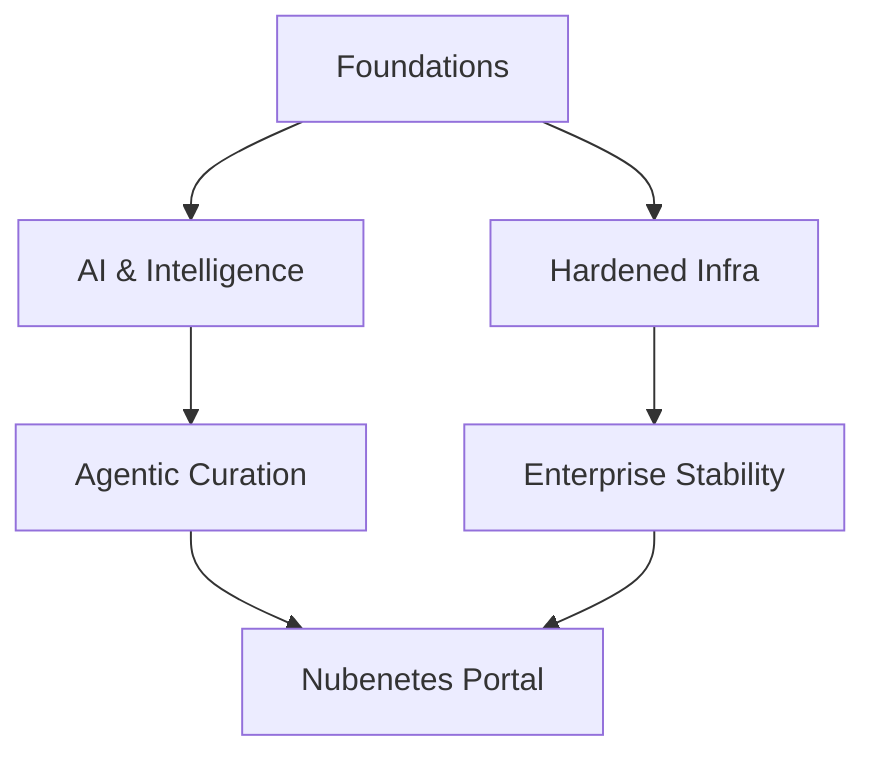

# Introduction. Microservice Architecture. From Java EE To Cloud Native. Openshift VS Kubernetes

!!! tip "Nubenetes V2 Elite Portal"
    You are browsing the AI-Curated V2 Elite Edition. Looking for the exhaustive list of references? Check out the [**V1 Historical Archive**](/v1/introduction/).

!!! info "Architectural Context"
    Detailed reference for Introduction. Microservice Architecture. From Java EE To Cloud Native. Openshift VS Kubernetes in the context of Architectural Foundations.

## Vision 2026

!!! quote "The Evolution of Autonomy"
    From manual curation to agentic intelligence.

### Ecosystem Map

## Application Modernization

### Monolith to Microservices

#### Automated Refactoring

  - **(2023)** [vFunction](https://vfunction.com) [ADVANCED LEVEL]  [COMMUNITY-TOOL] — An advanced, AI-driven application modernization platform designed to refactor monolithic Java applications. Live Grounding verifies that vFunction dynamically tracks codebase interactions and dependency call trees to generate optimal, decoupled microservices.
#### Case Studies

  - **(2021)** [thenewstack.io: vFunction Transforms Monolithic Java to Microservices](https://thenewstack.io/vfunction-transforms-monolithic-java-to-microservices) [ADVANCED LEVEL]  [LEGACY] — Deep-dive case study covering how vFunction automates the decomposition of complex legacy Java application structures into modern cloud-native APIs. Illustrates mapping monolithic complexity to decoupled Domain-Driven Design (DDD) boundaries.
#### Guides

  - **(2021)** [devops.com: Best of 2021 – Transform Legacy Java Apps to Microservices](https://devops.com/transform-legacy-java-apps-to-microservices) [ADVANCED LEVEL]  [LEGACY] — Strategic and tactical guide addressing the decomposition of legacy enterprise Java systems. Emphasizes modern automated refactoring engines to accurately map boundaries, mitigating migration risks while speeding up time-to-production.
## Architecture

### APIs

#### Protocols

??? note "nordicapis.com: 5 Protocols For Event-Driven API Architectures 🌟🌟🌟"
    **[Access Resource](https://nordicapis.com/5-protocols-for-event-driven-api-architectures)** 🌟🌟🌟 | Level: Intermediate
    
    Explores five critical protocols enabling asynchronous API communications: WebSockets, Webhooks, REST Hooks, Pub-Sub models, and Server-Sent Events (SSE). Details how eliminating polling reduces compute overhead and saves bandwidth.

### Best Practices

#### EDA

  - **(2023)** [aws.amazon.com: Best practices for implementing event-driven architectures in your organization](https://aws.amazon.com/blogs/architecture/best-practices-for-implementing-event-driven-architectures-in-your-organization) [ADVANCED LEVEL]  [CASE STUDY] [COMMUNITY-TOOL] — A comprehensive enterprise whitepaper on establishing organizational patterns for event-driven environments. Focuses on schema management, dead-letter queue (DLQ) operations, idempotency, and distributed tracing strategies.
### Data Management

#### Patterns

  - **(2022)** [acloudguru.com: Sharing data in the cloud: 4 patterns you should know](https://www.pluralsight.com/resources/blog/business-and-leadership/sharing-data-in-the-cloud-four-patterns-everyone-should-know)  [COMMUNITY-TOOL] — Outlines four distinct cloud-native patterns for shared-data architectures. Evaluates data virtualization, API-driven delivery, direct database sharing, and messaging queues based on security and real-time synchronization requirements.
### Microservices

#### Fundamentals

  - **(2023)** [redis.com: Microservice Architecture Key Concepts](https://redis.io/blog/microservice-architecture-key-concepts)  [COMMUNITY-TOOL] — A comprehensive breakdown of core microservices concepts including bounded contexts, service boundaries, and state isolation. Highlights why Redis is a logical fit for high-speed cache and pub-sub across decoupled domains.
### Patterns (1)

#### EDA (1)

??? note "eventstore.com: Service-Oriented Architecture vs Event-Driven Architecture 🌟"
    **[Access Resource](https://www.kurrent.io/blog/service-oriented-architecture-vs-event-driven-architecture)** 🌟 | Level: Intermediate
    
    Comprehensively contrasts the request-response paradigm of traditional SOA with the asynchronous, log-centric model of Event-Driven Architectures. Highlights Event Store and event sourcing patterns for strict audit trails.

  - **(2023)** [dev.to/aws-builders: Un Modelo de EDA: Event Driven Architectures](https://dev.to/aws-builders/un-modelo-de-eda-event-driven-architectures-4d9f) [SPANISH CONTENT]  [COMMUNITY-TOOL] — Una guía detallada sobre cómo implementar arquitecturas dirigidas por eventos (EDA) utilizando servicios nativos de AWS como EventBridge, SNS, SQS y Lambda para lograr un desacoplamiento de componentes de backend robusto.
??? note "equalexperts.com: Event driven architecture: the good, the bad, and the ugly 🌟"
    **[Access Resource](https://www.equalexperts.com/blog/tech-focus/event-driven-architecture-the-good-the-bad-and-the-ugly)** 🌟 | Level: Intermediate
    
    Discusses the practical realities of deploying EDA at scale. Evaluates benefits (decoupling, high performance) against complexities (distributed debugging, out-of-order execution, schema evolution management).

??? note "martinfowler.com: What do you mean by “Event-Driven”? 🌟"
    **[Access Resource](https://martinfowler.com/articles/201701-event-driven.html)** 🌟 | Level: Advanced
    
    Martin Fowler clarifies the ambiguous term 'Event-Driven'. Outlines four distinct patterns: Event Notification, Event-Carried State Transfer, Event Sourcing, and CQRS, detailing their operational advantages and pain points.

#### Evolution

  - **(2023)** [designgurus.io: Monolithic vs. Service-Oriented vs. Microservice Architecture: Top Architectural Design Patterns](https://www.designgurus.io/blog/monolithic-service-oriented-microservice-architecture)  [COMMUNITY-TOOL] — Compares monolithic systems, Enterprise Service Bus (ESB)-based SOAs, and decoupled microservices. Identifies modern trade-offs such as operational complexity, deployment velocity, and distributed transaction management.
#### Twelve-Factor App

  - **(2023)** [architecturenotes.co: 12 Factor App Revisited](https://architecturenotes.co/p/12-factor-app-revisited)  [COMMUNITY-TOOL] — Critically evaluates how classic 12-Factor concepts have aged. Addresses the challenges of serverless scaling, API-first interfaces, distributed telemetry, and modern build/release pipelines.
  - **(2021)** [opensource.com: An open source developer's guide to 12-Factor App methodology](https://opensource.com/article/21/11/open-source-12-factor-app-methodology)  [COMMUNITY-TOOL] [GUIDE] — Analyzes the application of 12-Factor methodology to open-source project standards. Highlights maintaining statelessness, dependency isolation, and configuration separation to simplify multi-environment testing and distribution.
### SaaS

#### Multi-Tenancy

  - **(2023)** [blog.scaleway.com: SaaS Solutions - What is the difference between a multi-instance and a multi-tenant architecture](https://www.scaleway.com/en/blog/saas-multi-tenant-vs-multi-instance-architectures)  [COMMUNITY-TOOL] — Compares multi-instance setups (dedicated systems per tenant) against multi-tenant models (shared compute/database with strict software isolation). Examines resource scaling, security boundaries, and noisy neighbor challenges.
### Technical Debt

#### Microservices (1)

  - **(2022)** [infoq.com: Managing Technical Debt in a Microservice Architecture](https://www.infoq.com/articles/managing-technical-debt-microservices) [ADVANCED LEVEL]  [COMMUNITY-TOOL] — Investigates the specific vectors of technical debt in microservices, including library drift, API versioning overhead, and domain-model fragmentation. Offers architectural rules of thumb to control distributed sprawl.
#### Orchestration

??? note "stackoverflow.blog: Using Kubernetes to rethink your system architecture and ease technical debt 🌟"
    **[Access Resource](https://stackoverflow.blog/2021/05/19/rethinking-system-architecture-can-kubernetes-help-to-solve-rewrite-anxiety)** 🌟 | Level: Intermediate
    
    Discusses utilizing a migration to Kubernetes as a strategic catalyst to refactor legacy monoliths. Reorganizes monolithic systems into decoupled containers, successfully lowering long-term architectural tech debt.

### Web Applications

#### Enterprise Patterns

  - **(2025)** [Enterprise Web App Patterns - Azure Architecture Center](https://learn.microsoft.com/en-us/azure/architecture/web-apps/guides/enterprise-app-patterns/overview) [NONE CONTENT] [DOCUMENTATION]  [COMMUNITY-TOOL] — Production-proven patterns and implementation pathways from the Azure Architecture Center. Establishes migration guidelines for modernizing monolithic applications into elastic web architectures.
## Architecture Patterns

### Microservices (2)

#### Cloud-Native Infrastructure

  - **(2022)** [techerati.com: Microservices in the Cloud-Native Era](https://www.techerati.com/features-hub/microservices-in-the-cloud-native-era) [ADVANCED LEVEL]  [COMMUNITY-TOOL] — Explores the strategic paradigm shift toward microservices as the de facto structural archetype for scalable cloud platforms. It dissects operational complexities including traffic routing, discovery mechanisms, and failure domain containment through circuit-breakers. A vital read for architects planning monolithic-to-microservices migrations under modern Kubernetes-centric infrastructures.
## Cloud Architecture

### Cloud-Native

#### Design Patterns

  - **(2020)** [capstonec.com: You Will Love These Cloud-native App Architecture Patterns 🌟](https://capstonec.com/2020/10/08/cloud-native-app-architecture-patterns)  [COMMUNITY-TOOL] — Investigates key structural patterns that define modern cloud-native systems, focusing on twelve-factor application rules, API-first delivery, resilient circuit breakers, and decoupling persistent storage systems from execution units.
### Modernization

#### Reactive Systems

  - **(2022)** [lightbend.com: From Java EE To Cloud Native: The End Of The Heavyweight Era 🌟](https://akka.io) [ADVANCED LEVEL]  [COMMUNITY-TOOL] — Lightbend presents the transition of traditional Java enterprise architectures to reactive, cloud-native frameworks (like Akka/Pekko). Evaluates high-concurrency patterns, asynchronous messaging, and horizontal scale-out benefits over synchronous architectures.
## Cloud Architecture and Infrastructure Strategy

### Modern Architectural Paradigms

#### MACH Architecture

??? note "thenewstack.io: Transform and Future-Proof Your Architecture with MACH"
    **[Access Resource](https://thenewstack.io/transform-and-future-proof-your-architecture-with-mach)** 🌟🌟🌟🌟 | Level: Intermediate
    
    Introduces MACH (Microservices, API-first, Cloud-native, Headless) as a modern enterprise blueprint for agile digital experience platforms. This modular paradigm allows businesses to scale individual pieces independently, facilitating seamless integrations and preventing monolithic vendor lock-in.

## Cloud Infrastructure

### Kubernetes

#### Container Patterns

  - **(2021)** [itnext.io: 4 Design Patterns for Containers in Kubernetes | Daniele Polencic 🌟](https://itnext.io/4-container-design-patterns-for-kubernetes-a8593028b4cd) [ADVANCED LEVEL]  [COMMUNITY-TOOL] — Discusses key container design patterns within Kubernetes pods, highlighting sidecars, adapters, and ambient patterns. It details how sidecar containers decouple infrastructure utilities (such as logging and service mesh proxies) from main application runtimes.
## Cloud Native Architecture

### Containerization

#### Kubernetes (1)

  - **(2018)** [developers.redhat.com: Why Kubernetes is The New Application Server](https://developers.redhat.com/blog/2018/06/28/why-kubernetes-is-the-new-application-server) [NONE CONTENT]  [COMMUNITY-TOOL] — This guide analyzes the transition from traditional enterprise application servers (like JBoss or WebSphere) to Kubernetes. It positions Kubernetes as the modern application server, handling routing, state management, and lifecycle patterns natively.
### Design Patterns (1)

#### Operators and Sidecars

  - **(2020)** [Operators and Sidecars Are the New Model for Software Delivery](https://thenewstack.io/operators-and-sidecars-are-the-new-model-for-software-delivery) [NONE CONTENT] [ADVANCED LEVEL]  [COMMUNITY-TOOL] — Discusses the architectural shift toward using the Sidecar pattern and Kubernetes Operators as standard software delivery mechanisms. This architecture segregates cross-cutting concerns like proxying, logging, and security away from application logic.
### GitOps

#### Cloud Native Strategy

  - **(2019)** [weave.works: Going Cloud Native: 6 essential things you need to know](https://www.weave.works/technologies/going-cloud-native-6-essential-things-you-need-to-know) [NONE CONTENT]  [COMMUNITY-TOOL] — Weave Works lays out six core pillars for going cloud native, focusing on containerization, declarative state management, and GitOps workflows to establish efficient deployment setups.
### Microservices (3)

#### Enterprise Solutions

  - **(2020)** [redhat.com: Why choose Red Hat for microservices?](https://www.redhat.com/en/topics/microservices/why-choose-red-hat-microservices) [NONE CONTENT]  [COMMUNITY-TOOL] — A comprehensive evaluation of Red Hat OpenShift and its ecosystem for microservices. It highlights built-in support for service mesh, security boundaries, and hybrid cloud portability as essential elements for enterprise deployments.
## DevOps and CICD

### Microservices (4)

#### Tooling Ecosystem

??? note "hcltech.com: DevOps Tools and Technologies to Manage Microservices 🌟"
    **[Access Resource](https://www.hcltech.com/blogs/devops-tools-and-technologies-manage-microservices)** 🌟🌟🌟🌟 | Level: Intermediate
    
    Maps out the comprehensive tooling stack required to manage complex microservice lifecycles. Details the intersection of build systems, container registries, service meshes, centralized logging (EFK/ELK), and distributed tracing tools (Jaeger) essential for observability.

## Frontend Architecture

### Design Patterns (2)

#### BFF

  - **(2021)** [developers.soundcloud.com: Service Architecture at SoundCloud — Part 1: Backends for Frontends](https://developers.soundcloud.com/blog/service-architecture-1) [ADVANCED LEVEL]  [CASE STUDY] [COMMUNITY-TOOL] — The pioneering engineering case study detailing SoundCloud's development of the Backends-for-Frontends (BFF) pattern. Explains how dedicated, platform-specific API gateways optimize network roundtrips and tailor response payloads for mobile and web clients.
### Microfrontends

#### AWS Serverless

  - **(2021)** [aws.amazon.com: Server-side rendering micro-frontends – UI composer and service discovery](https://aws.amazon.com/blogs/compute/server-side-rendering-micro-frontends-ui-composer-and-service-discovery) [ADVANCED LEVEL]  [COMMUNITY-TOOL] — Proposes a reference architecture for deploying server-side rendered (SSR) micro-frontends on AWS. It uses serverless services like AWS Lambda, Amazon CloudFront, and dynamic composition layers to optimize SEO and page load speeds.
#### Introduction

  - **(2021)** [semaphoreci.com: Microfrontends: Microservices for the Frontend](https://semaphore.io/blog/microfrontends)  [COMMUNITY-TOOL] — Explores extending microservice patterns to client-side presentation layers. Evaluates how microfrontends divide a single web application into independent, decoupled frontend modules maintained by autonomous cross-functional teams.
## Microservices (5)

### Anti-Patterns

#### Failure Modes

  - **(2019)** [infoq.com: 7 Ways to Fail at Microservices](https://www.infoq.com/articles/microservices-seven-fail) [ADVANCED LEVEL]  [COMMUNITY-TOOL] — Details common organizational and architectural traps when shifting to microservices. Critiques lack of boundary clarity, shared database anti-patterns, manual deployment strategies, and neglecting distributed observability networks.
#### Lessons Learned

  - **(2021)** [world.hey.com: Disasters I've seen in a microservices world 🌟🌟](https://world.hey.com/joaoqalves/disasters-i-ve-seen-in-a-microservices-world-a9137a51) [ADVANCED LEVEL]  [COMMUNITY-TOOL] — A candid engineering post-mortem of catastrophic distributed systems architectures. It warns against over-engineered microservice boundaries, distributed transactions, massive latency chains, and premature optimization that results in 'distributed monoliths'.
### Data Management (1)

#### Event-Driven Architecture

  - **(2016)** [infoq.com: Turning Microservices Inside-Out](https://www.infoq.com/articles/microservices-inside-out) [ADVANCED LEVEL]  [COMMUNITY-TOOL] — This piece outlines Martin Kleppmann's paradigm of 'turning the database inside-out'. It advocates for treating state logs as a first-class citizen, enabling downstream services to process and construct specialized read-optimized views.
### Design Patterns (3)

#### Best Practices (1)

  - **(2022)** [simform.com: 10 Microservice Best Practices: The 80/20 Way](https://www.simform.com/blog/microservice-best-practices)  [COMMUNITY-TOOL] — Synthesizes critical strategies for implementing resilient microservice deployments, highlighting domain-driven design, decentralized data management, API gateways, fault-isolation patterns, and automated telemetry ingestion to optimize the 80/20 impact curve.
#### Catalog

  - **(2021)** [javarevisited.blogspot.com: Top 10 Microservices Design Patterns and Principles - Examples](https://javarevisited.blogspot.com/2021/09/microservices-design-patterns-principles.html)  [COMMUNITY-TOOL] — Explores 10 industry-standard microservices design patterns, providing concrete conceptual diagrams and usage examples for Database-per-Microservice, Event Sourcing, CQRS, Saga Orchestration, and the Backends-for-Frontends (BFF) topology.
#### DotNet

  - **(2021)** [dotnetcurry.com: Microservices Architecture Pattern 🌟](https://www.dotnetcurry.com/microsoft-azure/microservices-architecture)  [COMMUNITY-TOOL] — Details implementing microservices architectures specifically utilizing modern .NET and Azure frameworks. It explores domain partitioning, local persistent storage designs, and event-driven communications mediated by Azure Service Bus.
#### Event-Driven

  - **(2021)** [zdnet.com: Why microservices need event-driven architecture](https://www.zdnet.com/article/when-microservices-need-event-driven-architecture) [ADVANCED LEVEL]  [COMMUNITY-TOOL] — Explores the symbiotic relationship between microservices and event-driven patterns. Outlines how asynchronous event publication decoupled via brokers like Kafka or RabbitMQ mitigates tight runtime coupling, enhancing overall system fault tolerance and temporal scalability.
#### Reference Architecture

  - **(2021)** [geeksarray.com: Microservice Architecture Pattern for Architects 🌟](https://geeksarray.com/blog/microservice-architecture-pattern-for-architects)  [COMMUNITY-TOOL] — Serves as a fundamental reference blueprint for systems architects designing microservices. Explains transaction boundaries, operational logging, API gateway proxies, database isolation, and service discovery mechanics.
### Design Principles

#### Core Principles

  - **(2022)** [developers.redhat.com: 5 design principles for microservices](https://developers.redhat.com/articles/2022/01/11/5-design-principles-microservices)  [COMMUNITY-TOOL] — Outlines five core engineering principles foundational to sustainable microservices: single responsibility boundaries, loose coupling, data isolation, failure-resilient architecture, and robust observability.
#### Evaluation

  - **(2022)** [simform.com: Microservices Design Principles: Do We Really Know It Well Enough? 🌟](https://www.simform.com/blog/microservices-design-principles)  [COMMUNITY-TOOL] — Critically evaluates common microservices design patterns, warning against over-engineering. It details the nuances of domain model partition boundaries and the runtime overhead of maintaining absolute microservices autonomy.
### Frameworks

#### Ecosystem

  - **(2022)** [simform.com: The Top Go-To Microservices Frameworks for a Scalable Application](https://www.simform.com/blog/microservices-framework)  [COMMUNITY-TOOL] — Compares modern software frameworks specifically built to streamline microservices development (e.g., Spring Boot, Go Kit, NestJS, and Quarkus). Evaluates runtime performance, cloud-native readiness, and tooling ecosystem support.
### Implementation

#### CQRS

  - **(2021)** [blog.bitsrc.io: Implementing a Microservices Application with CQRS (Command Query Responsibiltiy Segregation)](https://blog.bitsrc.io/implementing-microservices-with-cqrs-2cecb0b09c66) [ADVANCED LEVEL]  [COMMUNITY-TOOL] — Provides a practical, code-driven guide to setting up CQRS in a multi-service Node.js or TypeScript application, explaining how read-replicas are kept synchronized using event messaging systems.
### Modernization (1)

#### Automated Migration

  - **(2021)** [devops.com: Function Automates Conversion of Java Apps to Microservices](https://devops.com/vfunction-automates-conversion-of-java-apps-to-microservices) [ADVANCED LEVEL]  [LEGACY] — Details how automated profiling instruments compile-time and runtime dynamics of legacy enterprise codebases, identifying domain boundaries to programmatically extract microservice packages.
#### CDC Patterns

  - **(2021)** [developers.redhat.com: Application modernization patterns with Apache Kafka, Debezium, and Kubernetes](https://developers.redhat.com/articles/2021/06/14/application-modernization-patterns-apache-kafka-debezium-and-kubernetes) [ADVANCED LEVEL]  [COMMUNITY-TOOL] — A deep technical dive into change data capture (CDC) as an application modernization accelerator. Demonstrates how combining Debezium, Apache Kafka, and Kubernetes enables seamless database-to-database replication and asynchronous microservice integration.
#### Monolith Migration

  - **(2021)** [thenewstack.io: Monoliths to Microservices: 4 Modernization Best Practices](https://thenewstack.io/monoliths-to-microservices-4-modernization-best-practices-2) [ADVANCED LEVEL]  [LEGACY] — Outlines strategic methodologies for decomposing legacy monolithic architectures. Promotes the Strangler Fig pattern, domain-driven boundary definition, database decomposition techniques, and the evolutionary transition of data schemas to prevent transactional failure.
### Observability

#### Namespaces

  - **(2021)** [blog.appsignal.com: Microservices Monitoring: Using Namespaces for Data Structuring 🌟](https://blog.appsignal.com/2021/01/06/microservices-monitoring-using-namespaces-for-data-structuring.html)  [COMMUNITY-TOOL] — Discusses structured logging and telemetry tagging practices across distributed microservices. Explains how namespace isolation and unified tagging strategies allow DevOps teams to easily filter performance metrics, traces, and application logs.
### Orchestration (1)

#### Best Practices (2)

  - **(2021)** [blog.getambassador.io: Microservice Orchestration Best Practices](https://blog.getambassador.io/microservice-orchestration-best-practices-f32314dd6a12) [ADVANCED LEVEL]  [COMMUNITY-TOOL] — Contrasts orchestration and choreography in distributed microservice topologies. Analyzes the trade-offs of centralized workflow engines versus decentralized event routing, providing architectural criteria to guide deployment choices under scale.
## Microservices and Distributed Systems

### Architecture Evolution

#### Abstractions and Frameworks

??? note "thenewstack.io: The Future of Microservices? More Abstractions"
    **[Access Resource](https://thenewstack.io/microservices/the-future-of-microservices-more-abstractions)** 🌟🌟🌟🌟 | Level: Advanced
    
    Explores the evolutionary shift of microservices toward higher-level abstraction patterns, such as Dapr and WebAssembly, designed to isolate developers from network complexities. It details how externalizing cross-cutting concerns (state management, pub/sub, service discovery) into sidecars reduces cognitive overhead and boilerplate.

#### Curated Reference

??? note "redhat.com: Top 8 resources for microservices architecture of 2021"
    **[Access Resource](https://www.redhat.com/en/blog/best-microservices-2021)** 🌟🌟🌟 | Level: Intermediate
    
    A curated compilation of top-tier resources discussing microservices, distributed logging, service mesh implementations, and event-driven patterns. Provides platform architects with a quick roadmap to explore advanced container patterns and decentralized database design approaches.

### Architecture Patterns (1)

#### Anti-Patterns (1)

??? note "itnext.io: You Don’t Need Microservices 🌟"
    **[Access Resource](https://itnext.io/you-dont-need-microservices-2ad8508b9e27)** 🌟🌟🌟🌟 | Level: Intermediate
    
    Critically evaluates the industry's widespread push for microservices, highlighting cases of 'distributed monoliths' and unnecessary network overhead. Advocates for modular monolith designs as a better option for teams lacking the infrastructure capacity to manage distributed systems.

#### Best Practices (3)

??? note "geeksforgeeks.org: Microservice Architecture – Introduction, Challeneges & Best Practices"
    **[Access Resource](https://www.geeksforgeeks.org/blogs/microservice-architecture-introduction-challenges-best-practices)** 🌟🌟🌟🌟 | Level: Beginner
    
    Introduces microservices architecture foundations, delineating major design trade-offs around decentralized data management, inter-service networking, and distributed tracing. Outlines tactical approaches for handling network failures via sagas, API Gateways, and transactional outbox patterns.

#### Component Design

??? note "optisolbusiness.com: 8 Core Components are Microservices Architecture"
    **[Access Resource](https://www.optisolbusiness.com/insight/8-core-components-of-microservice-architecture)** 🌟🌟🌟🌟 | Level: Intermediate
    
    Details eight critical components of a microservice architecture, including Service Discovery, API Gateways, Service Registries, and Circuit Breakers. Explains how these interconnected components work together to provide reliable communication, load balancing, and fault isolation in production systems.

#### Decision Matrix

??? note "dev.to: When it Pays to Choose Microservices 🌟"
    **[Access Resource](https://dev.to/typeable/when-it-pays-to-choose-microservices-12h5)** 🌟🌟🌟🌟 | Level: Intermediate
    
    Establishes a rigorous decision framework for migrating from monolithic systems to microservices, balancing organization size, domain boundaries, and cognitive load. The synthesis emphasizes that microservices should only be selected when parallel development velocity and independent horizontal scaling justify the added network complexity.

#### Fundamentals (1)

??? note "thenewstack.io: What Is Microservices Architecture?"
    **[Access Resource](https://thenewstack.io/microservices/what-is-microservices-architecture)** 🌟🌟🌟🌟 | Level: Beginner
    
    Introduces microservice-based application design, emphasizing modularity, domain boundaries, and decentralized technical footprints. Compares traditional monolithic patterns against distributed designs, highlighting structural trade-offs, testing models, and continuous integration needs.

### Deployment Models

#### Orchestration Options

??? note "semaphoreci.com: 5 Options for Deploying Microservices 🌟"
    **[Access Resource](https://semaphore.io/blog/deploy-microservices)** 🌟🌟🌟🌟 | Level: Intermediate
    
    Compares five distinct patterns for microservices deployment: single machine/multiple processes, multi-VM hosting, containerization, specialized orchestrators, and serverless runtimes. Outlines the operational costs, performance attributes, and deployment complexities of each option.

### Software Engineering Principles

#### Developer Workflow

??? note "hackernoon.com: 9 Basic (and Crucial) Tips for Microservices Developers 🌟"
    **[Access Resource](https://hackernoon.com/9-basic-and-crucial-tips-for-microservices-developers)** 🌟🌟🌟🌟 | Level: Intermediate
    
    Synthesizes nine core guidelines for microservices engineering, focusing on isolated databases, API versioning, robust service contracts, and distributed tracing integration. Highlights the architectural imperative of treating microservices as loosely coupled, independently deployable domains.

### Testing and Reliability

#### Fault Tolerance

??? note "christophermeiklejohn.com: Understanding why Resilience Faults in Microservice Applications Occur"
    **[Access Resource](https://christophermeiklejohn.com/filibuster/2022/03/19/understanding-faults.html)** 🌟🌟🌟🌟 | Level: Advanced
    
    Evaluates systemic failure modes in microservice environments, emphasizing issues like cascading failures, misconfigured circuit breakers, and network partition timeouts. Shows how programmatic resilience-testing strategies can identify failure-handling errors during early design.

## Orchestration (2)

### Kubernetes (2)

#### Dependency Isolation

  - **(2022)** [itnext.io: Isolating and Managing Dependencies in 12-factor Microservice Applications — with Kubernetes](https://itnext.io/isolating-and-managing-dependencies-in-12-factor-microservice-applications-with-kubernetes-988638f8bc6d) [ADVANCED LEVEL]  [COMMUNITY-TOOL] — Focuses specifically on Factor II (Dependencies). Demonstrates isolating system dependencies using container images, multi-stage Dockerfiles, and initContainers to orchestrate external DB readiness checks before app startup.
#### Microservices (6)

  - **(2022)** [itnext.io: 12 factor Microservice applications — on Kubernetes](https://itnext.io/12-factor-microservice-applications-on-kubernetes-db913008b018) [ADVANCED LEVEL]  [COMMUNITY-TOOL] — A deep dive into implementing the complete 12-Factor framework within Kubernetes. Highlights strict environmental isolation, declarative deployment processes, and scaling microservices with pod replicas.
#### Paradigms

  - **(2022)** [traefik.io: Pets vs. Cattle: The Future of Kubernetes in 2022](https://traefik.io/blog/pets-vs-cattle-the-future-of-kubernetes-in-2022)  [COMMUNITY-TOOL] — Explores how modern Kubernetes clusters treat clusters, nodes, and ingress configurations as stateless, disposable entities (cattle). Examines automation engines and dynamic routing protocols like Traefik to abstract network edges.
#### Prerequisites

  - **(2022)** [thenewstack.io: Learn 12 Factor Apps Before Kubernetes](https://thenewstack.io/learn-12-factor-apps-before-kubernetes)  [COMMUNITY-TOOL] — Argues that mastering cloud-native architectural patterns (such as 12-Factor principles) is essential before deploying workloads on complex container orchestration fabrics like Kubernetes to prevent broken anti-patterns.
#### Processes

  - **(2022)** [itnext.io: Processes — for 12-factor Microservice Applications](https://itnext.io/processes-for-12-factor-microservice-applications-70551a9021b) [ADVANCED LEVEL]  [COMMUNITY-TOOL] — Unpacks Factor VI (Processes), requiring apps to run as stateless, shared-nothing executions. Details how to handle sticky sessions externally via Redis and run dynamic workloads cleanly across Kubernetes pods.
#### Twelve-Factor App (1)

  - **(2022)** [acloudguru.com: Twelve-Factor Apps in Kubernetes](https://www.pluralsight.com/resources/blog/cloud/twelve-factor-apps-in-kubernetes)  [COMMUNITY-TOOL] — Demonstrates mapping the 12-Factor framework directly onto Kubernetes primitives. Maps ConfigMaps and Secrets to Factor III (Config), and Deployments/ReplicaSets to Factor IX (Disposability).
#### Workloads

??? note "thenewstack.io: Kubernetes Evolution: From Microservices to Batch Processing Powerhouse 🌟🌟"
    **[Access Resource](https://thenewstack.io/kubernetes-evolution-from-microservices-to-batch-processing-powerhouse)** 🌟🌟 | Level: Advanced
    
    Explores Kubernetes' evolution from a simple microservices hosting platform to an advanced orchestrator for heavy batch processing, AI/ML training runs, and high-performance computing (HPC) jobs.

## Platform Engineering

### Reference Architectures

#### GCP

  - **(2023)** [humanitec.com: Platform reference architecture on GCP](https://humanitec.com/reference-architectures) [ADVANCED LEVEL]  [COMMUNITY-TOOL] [GUIDE] — Outlines enterprise platform blueprints tailored for Google Cloud Platform. Combines GKE, Cloud Run, and Secret Manager under a unified platform orchestrator layer to drive developer velocity while keeping governance secure.
### Service Catalogs

#### Microservices Governance

??? note "getcortexapp.com: Why You Need a Microservices Catalog Tool"
    **[Access Resource](https://www.cortex.io/post/why-you-need-a-microservices-catalog-tool)** 🌟🌟🌟 | Level: Intermediate
    
    Details the operational sprawl that occurs as organizations scale their microservices topologies. Proposes centralized service catalogs (similar to Backstage or Cortex) to map dependencies, track security compliance, enforce reliability standards, and assign service ownership across teams.

## Reliability Engineering

### Resilience Patterns

#### Infrastructure Stability

??? note "thenewstack.io: 7 Best Practices to Build and Maintain Resilient Applications and Infrastructure"
    **[Access Resource](https://thenewstack.io/7-best-practices-to-build-and-maintain-resilient-applications-and-infrastructure)** 🌟🌟🌟🌟 | Level: Intermediate
    
    Synthesizes core software engineering and site reliability practices to maintain resilient systems under load. Key patterns explored include chaos engineering, circuit breaking, automated canary deployments, proactive monitoring, and robust failure domain isolation.

## Software Architecture

### Application Modernization (1)

#### Legacy Migration

??? note "Modernize legacy applications with containers, microservices"
    **[Access Resource](https://www.techtarget.com/searchcloudcomputing/feature/Modernize-legacy-applications-with-containers-microservices)** 🌟🌟🌟🌟 | Level: Intermediate
    
    Examines methodologies for containerizing and decomposing legacy applications into microservices. It highlights refactoring patterns, the strangler fig pattern, and the steps required to isolate state and transition monolithic database architectures to distributed cloud-native databases.

### Event-Driven Systems

#### Asynchronous Messaging

??? note "thenewstack.io: React in Real-Time with Event-Driven APIs"
    **[Access Resource](https://thenewstack.io/react-in-real-time-with-event-driven-apis)** 🌟🌟🌟🌟 | Level: Advanced
    
    Evaluates the shifting architectural landscape towards event-driven API patterns. Discusses protocols and specifications like WebSockets, Server-Sent Events, and AsyncAPI, analyzing how they enable real-time asynchronous streaming and responsive microservice architectures.

### Microservices (7)

#### Decomposition Patterns

??? note "infoq.com: Migrating Monoliths to Microservices with Decomposition and Incremental Changes"
    **[Access Resource](https://www.infoq.com/articles/migrating-monoliths-to-microservices-with-decomposition)** 🌟🌟🌟🌟🌟 | Level: Advanced
    
    A highly structured technical article focused on database-first and domain-driven monolith decomposition strategies. Examines step-by-step decoupling techniques, including interface abstractions, event-driven data synchronization, and managing temporary shared states without degrading uptime.

??? note "codeopinion.com: Splitting up a Monolith into Microservices 🌟"
    **[Access Resource](https://codeopinion.com/splitting-up-a-monolith-into-microservices)** 🌟🌟🌟🌟 | Level: Advanced
    
    A tactical architectural guide detailing strategies to transition from a single monolithic code base to a decoupled microservice topology. Outlines bounded contexts, logical code isolation within the monolith, and utilizing transactional outbox patterns to prevent distributed split-brain scenarios.

??? note "blog.heroku.com: Deconstructing Monolithic Applications into Services"
    **[Access Resource](https://www.heroku.com/blog/monolithic-applications-into-services)** 🌟🌟🌟🌟 | Level: Advanced
    
    A detailed playbook on dividing monolithic backends into cohesive, independent services. It discusses domain-driven design (DDD) boundaries, API gateway design, database decomposition, and how to manage the incremental migration phases to minimize downtime.

??? note "vmware.com: How to Deconstruct a Monolith using Microservices – Getting Ready for Cloud-Native"
    **[Access Resource](https://blogs.vmware.com/vov/2018/08/06/how-to-deconstruct-a-monolith-using-microservices-getting-ready-for-cloud-native)** 🌟🌟🌟🌟 | Level: Advanced
    
    Provides an enterprise architectural path for decomposing traditional monoliths into distributed services. It focuses on identifying bounded contexts, managing cross-service communication via asynchronous events, and restructuring development teams around microservices boundaries.

#### Design Patterns (4)

??? note "infoq.com: Principles for Microservice Design: Think IDEALS, Rather than SOLID"
    **[Access Resource](https://www.infoq.com/articles/microservices-design-ideals)** 🌟🌟🌟🌟🌟 | Level: Advanced
    
    Introduces the IDEALS framework (Interface segregation, Deployability, Event-driven, Availability, Latency, State management) as the modern replacement for SOLID design principles in distributed systems. Evaluates how microservices necessitate a focus on network and execution boundaries rather than object relations.

??? note "thenewstack.io: Microservices vs. Monoliths: An Operational Comparison"
    **[Access Resource](https://thenewstack.io/microservices/microservices-vs-monoliths-an-operational-comparison)** 🌟🌟🌟🌟 | Level: Intermediate
    
    A comprehensive operational comparison of monolithic and microservices architectural patterns. It details how the distribution of systems shifts problems from single-process memory management to complex network-level routing, distributed tracing, eventual consistency, and CI/CD pipelines.

#### Distributed Transactions

??? note "infoq.com: Saga Orchestration for Microservices Using the Outbox Pattern"
    **[Access Resource](https://www.infoq.com/articles/saga-orchestration-outbox)** 🌟🌟🌟🌟🌟 | Level: Advanced
    
    A detailed exploration of Saga Orchestration coupled with the Transactional Outbox Pattern to maintain eventual consistency in distributed databases. Examines architectural tradeoffs of orchestration versus choreography and how to implement CDC (Change Data Capture) via Debezium.

#### Maturity Models

??? note "blog.container-solutions.com: How Mature Is Your Microservices Architecture? 🌟"
    **[Access Resource](https://blog.container-solutions.com/how-mature-is-your-microservices-architecture)** 🌟🌟🌟🌟 | Level: Intermediate
    
    Establishes a systematic maturity assessment framework for microservice architectures. Evaluates technical implementation levels across continuous deployment pipelines, automated system testing, distributed observability, configuration injection, and organizational alignment.

#### Technology Selection

??? note "devops.com: Why Boring Tech is Best to Avoid a Microservices Mess"
    **[Access Resource](https://devops.com/why-boring-tech-is-best-to-avoid-a-microservices-mess)** 🌟🌟🌟🌟 | Level: Intermediate
    
    Arguments for architectural conservatism when adopting a highly distributed microservices paradigm. By utilizing mature, 'boring' technology (e.g., PostgreSQL, REST/gRPC, stable programming runtimes), engineering teams can isolate and absorb the inherent complexity of distributed systems coordination.

#### Value Proposition

??? note "devops.com: 6 Advantages of Microservices"
    **[Access Resource](https://devops.com/6-advantages-of-microservices)** 🌟🌟🌟 | Level: Beginner
    
    Outlines the foundational architectural advantages of adopting a microservices pattern, including technological flexibility, autonomous deployability, localized scaling, fault isolation, and improved team ownership over distinct domain services.

### Modernization (2)

#### Strangler Pattern

  - **(2021)** [overops.com: Strangler Pattern: How to Deal With Legacy Code During the Container Revolution](https://www.harness.io/products/service-reliability-management)  [LEGACY] — Details the mechanics of the Strangler Fig pattern for migrating legacy codebases into containerized microservices. Analyzes API routing strategies, incremental migration boundaries, and monitoring paradigms for managing dual runtimes.
## Software Engineering

### Architecture Patterns (2)

#### Microservices (8)

  - **(2024)** [dynatrace.com: What are microservices? All you need to know](https://www.dynatrace.com/knowledge-base/microservices)  [COMMUNITY-TOOL] — A high-level architectural overview exploring the decoupling of corporate monoliths into agile microservices. Discusses structural changes, challenges in service discovery, and the crucial role of tracing telemetry for maintaining state consistency.
### Web Development

#### NodeJS

??? note "NodeJS Best Practices (Spanish Translation)"
    **[Access Resource](https://github.com/goldbergyoni/nodebestpractices/blob/spanish-translation/README.spanish.md)** 🌟🌟🌟🌟🌟 | Level: Advanced
    
    Spanish localization of the leading Node.js architecture and security handbook. It offers comprehensive design blueprints covering error handling, clean architecture, security, production readiness, and testing guidelines for scalable enterprise systems.

---
💡 **Explore Related:** [Git](./git.md) | [Other Awesome Lists](./other-awesome-lists.md) | [AWS Tools Scripts](./aws-tools-scripts.md)

🔗 **See Also:** [Kubernetes Backup Migrations](./kubernetes-backup-migrations.md) | [OCP 4](./ocp4.md)

