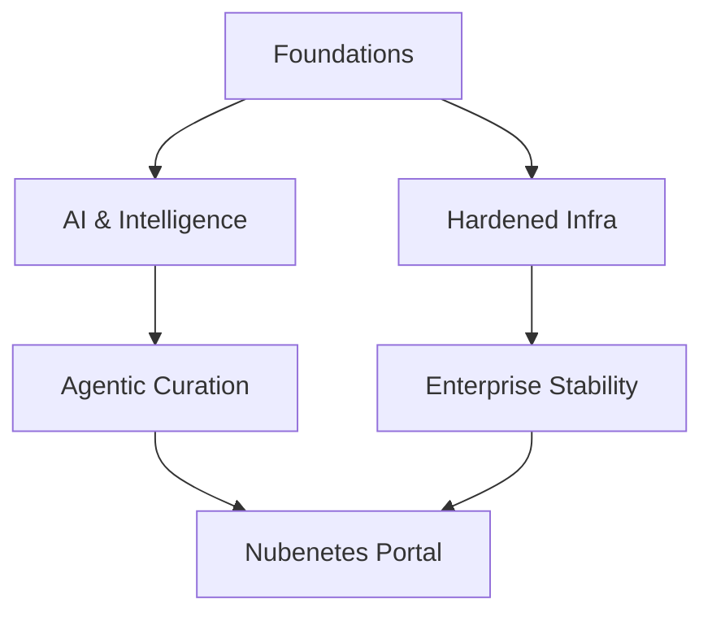

# Introduction

!!! info "Architectural Context"
    Detailed reference for Introduction in the context of Architectural Foundations.

## Vision 2026

!!! quote "The Evolution of Autonomy"
    From manual curation to agentic intelligence.

### Ecosystem Map

## Cloud Native Architecture

### Microservices

#### Event-Driven Design

  - [infoq.com: Turning Microservices Inside-Out](https://www.infoq.com/articles/microservices-inside-out) [ADVANCED LEVEL]  [ENTERPRISE-STABLE] [GUIDE] — This foundational architectural piece by Martin Kleppmann argues for treating database tables as streams of changes rather than static silos. By turning the database "inside out" using event streams (like Kafka), microservices can achieve decentralized state management and projection consistency. It bridges the gap between stream processing and relational storage.

---
💡 **Explore Related:** [Cloud Asset Inventory](./cloud-asset-inventory.md) | [Customer](./customer.md) | [Devops Tools](./devops-tools.md)

