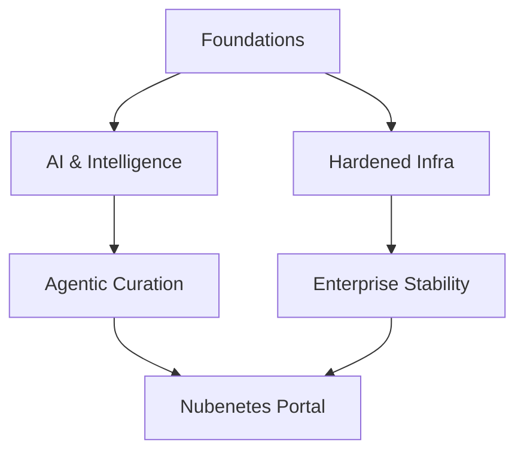

# Introduction. Microservice Architecture. From Java EE To Cloud Native. Openshift VS Kubernetes

!!! info "Architectural Context"
    Detailed reference for Introduction. Microservice Architecture. From Java EE To Cloud Native. Openshift VS Kubernetes in the context of Architectural Foundations.

## Table of Contents

1. [Platform](#platform)
  - [Reference](#reference)

## Vision 2026

!!! quote "The Evolution of Autonomy"
    From manual curation to agentic intelligence.

### Ecosystem Map

## Platform

### Reference

??? note "NodeJS Best Practices (Spanish Translation)"
    **[Access Resource](https://github.com/goldbergyoni/nodebestpractices/blob/spanish-translation/README.spanish.md)** 🌟🌟🌟🌟🌟 | Level: Intermediate
    
    A curated reference on NodeJS Best Practices (Spanish Translation) for modern cloud native architectures.

??? note "thenewstack.io: 7 Best Practices to Build and Maintain Resilient Applications and Infrastructure"
    **[Access Resource](https://thenewstack.io/7-best-practices-to-build-and-maintain-resilient-applications-and-infrastructure)** 🌟🌟🌟🌟🌟 | Level: Intermediate
    
    A curated reference on thenewstack.io: 7 Best Practices to Build and Maintain Resilient Applications and Infrastructure for modern cloud native architectures.

??? note "devops.com: Why Boring Tech is Best to Avoid a Microservices Mess"
    **[Access Resource](https://devops.com/why-boring-tech-is-best-to-avoid-a-microservices-mess)** 🌟🌟🌟🌟🌟 | Level: Intermediate
    
    A curated reference on devops.com: Why Boring Tech is Best to Avoid a Microservices Mess for modern cloud native architectures.

??? note "hardiks.medium.com: Top 6 Best practices for Container Orchestration 🌟"
    **[Access Resource](https://hardiks.medium.com/top-6-best-practices-for-container-orchestration-b4b0d3398ebc)** 🌟🌟🌟🌟🌟 | Level: Intermediate
    
    A curated reference on hardiks.medium.com: Top 6 Best practices for Container Orchestration 🌟 for modern cloud native architectures.

??? note "freecodecamp.org: How to Write Clean Code – Tips and Best Practices (Full Handbook)"
    **[Access Resource](https://www.freecodecamp.org/news/how-to-write-clean-code)** 🌟🌟🌟🌟🌟 | Level: Intermediate
    
    A curated reference on freecodecamp.org: How to Write Clean Code – Tips and Best Practices (Full Handbook) for modern cloud native architectures.

??? note "aws.amazon.com: Best practices for implementing event-driven architectures in your organization"
    **[Access Resource](https://aws.amazon.com/blogs/architecture/best-practices-for-implementing-event-driven-architectures-in-your-organization)** 🌟🌟🌟🌟🌟 | Level: Intermediate
    
    A curated reference on aws.amazon.com: Best practices for implementing event-driven architectures in your organization for modern cloud native architectures.

??? note "dzone: 7 Microservices Best Practices for Developers 🌟"
    **[Access Resource](https://dzone.com/articles/7-microservices-best-practices-for-developers)** 🌟🌟🌟🌟🌟 | Level: Intermediate
    
    A curated reference on dzone: 7 Microservices Best Practices for Developers 🌟 for modern cloud native architectures.

??? note "thenewstack.io: Monoliths to Microservices: 4 Modernization Best Practices"
    **[Access Resource](https://thenewstack.io/monoliths-to-microservices-4-modernization-best-practices-2)** 🌟🌟🌟🌟🌟 | Level: Intermediate
    
    A curated reference on thenewstack.io: Monoliths to Microservices: 4 Modernization Best Practices for modern cloud native architectures.

??? note "blog.getambassador.io: Microservice Orchestration Best Practices"
    **[Access Resource](https://blog.getambassador.io/microservice-orchestration-best-practices-f32314dd6a12)** 🌟🌟🌟🌟🌟 | Level: Intermediate
    
    A curated reference on blog.getambassador.io: Microservice Orchestration Best Practices for modern cloud native architectures.

??? note "medium.com/javarevisited: Top 10 Microservices Design Principles and Best Practices for Experienced Developers 🌟"
    **[Access Resource](https://medium.com/javarevisited/10-microservices-design-principles-every-developer-should-know-44f2f69e960f)** 🌟🌟🌟🌟🌟 | Level: Intermediate
    
    A curated reference on medium.com/javarevisited: Top 10 Microservices Design Principles and Best Practices for Experienced Developers 🌟 for modern cloud native architectures.

??? note "devops.com: Best of 2021 – Transform Legacy Java Apps to Microservices"
    **[Access Resource](https://devops.com/transform-legacy-java-apps-to-microservices)** 🌟🌟🌟🌟🌟 | Level: Intermediate
    
    A curated reference on devops.com: Best of 2021 – Transform Legacy Java Apps to Microservices for modern cloud native architectures.

??? note "developers.redhat.com: Why Kubernetes is The New Application Server"
    **[Access Resource](https://developers.redhat.com/blog/2018/06/28/why-kubernetes-is-the-new-application-server)** 🌟🌟🌟🌟 | Level: Intermediate
    
    A curated reference on developers.redhat.com: Why Kubernetes is The New Application Server for modern cloud native architectures.

??? note "Operators and Sidecars Are the New Model for Software Delivery"
    **[Access Resource](https://thenewstack.io/operators-and-sidecars-are-the-new-model-for-software-delivery)** 🌟🌟🌟🌟 | Level: Intermediate
    
    A curated reference on Operators and Sidecars Are the New Model for Software Delivery for modern cloud native architectures.

??? note "jaxenter.com: Practical Implications for Adopting a Multi-Cluster, Multi-Cloud Kubernetes Strategy"
    **[Access Resource](https://devm.io/kubernetes/kubernetes-practical-implications-171647)** 🌟🌟🌟🌟 | Level: Intermediate
    
    A curated reference on jaxenter.com: Practical Implications for Adopting a Multi-Cluster, Multi-Cloud Kubernetes Strategy for modern cloud native architectures.

??? note "jaxenter.com: Six Essential Kubernetes Extensions to Add to Your Toolkit 🌟"
    **[Access Resource](https://devm.io/kubernetes/kubernetes-extensions-172215)** 🌟🌟🌟🌟 | Level: Intermediate
    
    A curated reference on jaxenter.com: Six Essential Kubernetes Extensions to Add to Your Toolkit 🌟 for modern cloud native architectures.

??? note "addwebsolution.com: How Kubernetes helps businesses manage their IT infrastructure?"
    **[Access Resource](https://www.addwebsolution.com/blog/how-kubernetes-helps-businesses-manage-their-it-infrastructure)** 🌟🌟🌟🌟 | Level: Intermediate
    
    A curated reference on addwebsolution.com: How Kubernetes helps businesses manage their IT infrastructure? for modern cloud native architectures.

??? note "loves.cloud: Kubernetes: An Introduction"
    **[Access Resource](https://loves.cloud/kubernetes-an-introduction)** 🌟🌟🌟🌟 | Level: Intermediate
    
    A curated reference on loves.cloud: Kubernetes: An Introduction for modern cloud native architectures.

??? note "softwareengineeringdaily.com: Kubernetes vs. Serverless with Matt Ward (podcast) 🌟"
    **[Access Resource](https://softwareengineeringdaily.com/2020/12/29/kubernetes-vs-serverless-with-matt-ward-repeat)** 🌟🌟🌟🌟 | Level: Intermediate
    
    A curated reference on softwareengineeringdaily.com: Kubernetes vs. Serverless with Matt Ward (podcast) 🌟 for modern cloud native architectures.

??? note "thenewstack.io: Defining a Different Kubernetes User Interface for the Next Decade"
    **[Access Resource](https://thenewstack.io/defining-a-different-kubernetes-user-interface-for-the-next-decade)** 🌟🌟🌟🌟 | Level: Intermediate
    
    A curated reference on thenewstack.io: Defining a Different Kubernetes User Interface for the Next Decade for modern cloud native architectures.

??? note "javarevisited.blogspot.com: Why Every Programmer, DevOps Engineer Should learn Docker and Kubernetes in 2020"
    **[Access Resource](https://javarevisited.blogspot.com/2020/11/why-devops-engineer-learn-docker-kubernetes.html)** 🌟🌟🌟🌟 | Level: Intermediate
    
    A curated reference on javarevisited.blogspot.com: Why Every Programmer, DevOps Engineer Should learn Docker and Kubernetes in 2020 for modern cloud native architectures.

??? note "jaxenter.com: Kubernetes Is Much Bigger Than Containers: Here’s Where It Will Go Next"
    **[Access Resource](https://devm.io/kubernetes/kubernetes-bigger-173675)** 🌟🌟🌟🌟 | Level: Intermediate
    
    A curated reference on jaxenter.com: Kubernetes Is Much Bigger Than Containers: Here’s Where It Will Go Next for modern cloud native architectures.

??? note "cloud-melon.com: Under the hood of Kubernetes and microservices"
    **[Access Resource](https://cloud-melon.com/2019/12/26/under-the-hood-of-kubernetes-and-microservices)** 🌟🌟🌟🌟 | Level: Intermediate
    
    A curated reference on cloud-melon.com: Under the hood of Kubernetes and microservices for modern cloud native architectures.

??? note "devprojournal.com: Containers, Kubernetes and Software Development in 2021"
    **[Access Resource](https://www.devprojournal.com/technology-trends/kubernetes/containers-kubernetes-and-software-development-in-2021)** 🌟🌟🌟🌟 | Level: Intermediate
    
    A curated reference on devprojournal.com: Containers, Kubernetes and Software Development in 2021 for modern cloud native architectures.

??? note "thenewstack.io: Private vs. Public Cloud: How Kubernetes Shifts the Balance"
    **[Access Resource](https://thenewstack.io/private-vs-public-cloud-how-kubernetes-shifts-the-balance)** 🌟🌟🌟🌟 | Level: Intermediate
    
    A curated reference on thenewstack.io: Private vs. Public Cloud: How Kubernetes Shifts the Balance for modern cloud native architectures.

??? note "cloud.google.com: What is Kubernetes? 🌟"
    **[Access Resource](https://cloud.google.com/learn/what-is-kubernetes)** 🌟🌟🌟🌟 | Level: Intermediate
    
    A curated reference on cloud.google.com: What is Kubernetes? 🌟 for modern cloud native architectures.

??? note "thenewstack.io: App Modernization: 5 Tips When Migrating to Kubernetes"
    **[Access Resource](https://thenewstack.io/app-modernization-5-tips-when-migrating-to-kubernetes)** 🌟🌟🌟🌟 | Level: Intermediate
    
    A curated reference on thenewstack.io: App Modernization: 5 Tips When Migrating to Kubernetes for modern cloud native architectures.

??? note "thenewstack.io: Kubernetes and the Next Generation of PaaS"
    **[Access Resource](https://thenewstack.io/kubernetes-and-the-next-generation-of-paas)** 🌟🌟🌟🌟 | Level: Intermediate
    
    A curated reference on thenewstack.io: Kubernetes and the Next Generation of PaaS for modern cloud native architectures.

??? note "nathanpeck.com: Why should I use an orchestrator like Kubernetes, Amazon ECS, or Hashicorp Nomad?"
    **[Access Resource](https://nathanpeck.com/why-should-use-container-orchestration)** 🌟🌟🌟🌟 | Level: Intermediate
    
    A curated reference on nathanpeck.com: Why should I use an orchestrator like Kubernetes, Amazon ECS, or Hashicorp Nomad? for modern cloud native architectures.

??? note "eficode.com: The future of Kubernetes – and why developers should look beyond Kubernetes in 2022"
    **[Access Resource](https://www.eficode.com/blog/the-future-of-kubernetes-and-why-developers-should-look-beyond-kubernetes-in-2022)** 🌟🌟🌟🌟 | Level: Intermediate
    
    A curated reference on eficode.com: The future of Kubernetes – and why developers should look beyond Kubernetes in 2022 for modern cloud native architectures.

??? note "alibabacloud.com: Getting Started with Kubernetes | Deep Dive into Kubernetes Core Concepts"
    **[Access Resource](https://www.alibabacloud.com/blog/getting-started-with-kubernetes-%7C-deep-dive-into-kubernetes-core-concepts_595896)** 🌟🌟🌟🌟 | Level: Intermediate
    
    A curated reference on alibabacloud.com: Getting Started with Kubernetes | Deep Dive into Kubernetes Core Concepts for modern cloud native architectures.

??? note "thenewstack.io: Kubernetes Evolution: From Microservices to Batch Processing Powerhouse 🌟🌟"
    **[Access Resource](https://thenewstack.io/kubernetes-evolution-from-microservices-to-batch-processing-powerhouse)** 🌟🌟🌟🌟 | Level: Intermediate
    
    A curated reference on thenewstack.io: Kubernetes Evolution: From Microservices to Batch Processing Powerhouse 🌟🌟 for modern cloud native architectures.

??? note "paulbutler.org: The hater’s guide to Kubernetes"
    **[Access Resource](https://paulbutler.org/2024/the-haters-guide-to-kubernetes)** 🌟🌟🌟🌟 | Level: Intermediate
    
    A curated reference on paulbutler.org: The hater’s guide to Kubernetes for modern cloud native architectures.

??? note "traefik.io: Pets vs. Cattle: The Future of Kubernetes in 2022"
    **[Access Resource](https://traefik.io/blog/pets-vs-cattle-the-future-of-kubernetes-in-2022)** 🌟🌟🌟🌟 | Level: Intermediate
    
    A curated reference on traefik.io: Pets vs. Cattle: The Future of Kubernetes in 2022 for modern cloud native architectures.

??? note "stackoverflow.blog: Using Kubernetes to rethink your system architecture and ease technical debt 🌟"
    **[Access Resource](https://stackoverflow.blog/2021/05/19/rethinking-system-architecture-can-kubernetes-help-to-solve-rewrite-anxiety)** 🌟🌟🌟🌟 | Level: Intermediate
    
    A curated reference on stackoverflow.blog: Using Kubernetes to rethink your system architecture and ease technical debt 🌟 for modern cloud native architectures.

??? note "thenewstack.io: Learn 12 Factor Apps Before Kubernetes"
    **[Access Resource](https://thenewstack.io/learn-12-factor-apps-before-kubernetes)** 🌟🌟🌟🌟 | Level: Intermediate
    
    A curated reference on thenewstack.io: Learn 12 Factor Apps Before Kubernetes for modern cloud native architectures.

??? note "itnext.io: 12 factor Microservice applications — on Kubernetes"
    **[Access Resource](https://itnext.io/12-factor-microservice-applications-on-kubernetes-db913008b018)** 🌟🌟🌟🌟 | Level: Intermediate
    
    A curated reference on itnext.io: 12 factor Microservice applications — on Kubernetes for modern cloud native architectures.

??? note "itnext.io: Isolating and Managing Dependencies in 12-factor Microservice Applications — with Kubernetes"
    **[Access Resource](https://itnext.io/isolating-and-managing-dependencies-in-12-factor-microservice-applications-with-kubernetes-988638f8bc6d)** 🌟🌟🌟🌟 | Level: Intermediate
    
    A curated reference on itnext.io: Isolating and Managing Dependencies in 12-factor Microservice Applications — with Kubernetes for modern cloud native architectures.

??? note "itnext.io: 4 Design Patterns for Containers in Kubernetes | Daniele Polencic 🌟"
    **[Access Resource](https://itnext.io/4-container-design-patterns-for-kubernetes-a8593028b4cd)** 🌟🌟🌟🌟 | Level: Intermediate
    
    A curated reference on itnext.io: 4 Design Patterns for Containers in Kubernetes | Daniele Polencic 🌟 for modern cloud native architectures.

??? note "developers.redhat.com: Application modernization patterns with Apache Kafka, Debezium, and Kubernetes"
    **[Access Resource](https://developers.redhat.com/articles/2021/06/14/application-modernization-patterns-apache-kafka-debezium-and-kubernetes)** 🌟🌟🌟🌟 | Level: Intermediate
    
    A curated reference on developers.redhat.com: Application modernization patterns with Apache Kafka, Debezium, and Kubernetes for modern cloud native architectures.

??? note "ramansharma.substack.com: Containers are not just for Kubernetes"
    **[Access Resource](https://ramansharma.substack.com/p/containers-are-not-just-for-kubernetes-fa330653cbbd)** 🌟🌟🌟🌟 | Level: Intermediate
    
    A curated reference on ramansharma.substack.com: Containers are not just for Kubernetes for modern cloud native architectures.

??? note "Dzone.com: A Comparison of Kubernetes Distributions"
    **[Access Resource](https://dzone.com/articles/kubernetes-distributions-how-do-i-choose-one)** 🌟🌟🌟🌟 | Level: Intermediate
    
    A curated reference on Dzone.com: A Comparison of Kubernetes Distributions for modern cloud native architectures.

??? note "medium.com: The Differences Between Kubernetes and Openshift"
    **[Access Resource](https://medium.com/levvel-consulting/the-differences-between-kubernetes-and-openshift-ae778059a90e)** 🌟🌟🌟🌟 | Level: Intermediate
    
    A curated reference on medium.com: The Differences Between Kubernetes and Openshift for modern cloud native architectures.

??? note "blog.netsil.com: Kubernetes vs Openshift vs Tectonic: Comparing Enterprise Options"
    **[Access Resource](https://blog.netsil.com/kubernetes-vs-openshift-vs-tectonic-comparing-enterprise-options-e3a34dc60519)** 🌟🌟🌟🌟 | Level: Intermediate
    
    A curated reference on blog.netsil.com: Kubernetes vs Openshift vs Tectonic: Comparing Enterprise Options for modern cloud native architectures.

??? note "kubedex.com: Kubernetes On-Prem, OpenShift vs PKS vs Rancher"
    **[Access Resource](https://kubedex.com/redhat-openshift-vs-pivotal-pks-vs-rancher)** 🌟🌟🌟🌟 | Level: Intermediate
    
    A curated reference on kubedex.com: Kubernetes On-Prem, OpenShift vs PKS vs Rancher for modern cloud native architectures.

??? note "medium.com: Kubernetes — What Is It, What Problems Does It Solve and How Does It Compare With Alternatives?"
    **[Access Resource](https://medium.com/@srikanth.k/kubernetes-what-is-it-what-problems-does-it-solve-how-does-it-compare-with-its-alternatives-937fe80b754f)** 🌟🌟🌟🌟 | Level: Intermediate
    
    A curated reference on medium.com: Kubernetes — What Is It, What Problems Does It Solve and How Does It Compare With Alternatives? for modern cloud native architectures.

??? note "phoenixnap.com: Kubernetes vs OpenShift: Key Differences Compared 🌟"
    **[Access Resource](https://phoenixnap.com/blog/openshift-vs-kubernetes)** 🌟🌟🌟🌟 | Level: Intermediate
    
    A curated reference on phoenixnap.com: Kubernetes vs OpenShift: Key Differences Compared 🌟 for modern cloud native architectures.

??? note "levelup.gitconnected.com: OpenShift — The Next Level of Kubernetes"
    **[Access Resource](https://levelup.gitconnected.com/openshift-the-next-level-of-kubernetes-6d58ad722b26)** 🌟🌟🌟🌟 | Level: Intermediate
    
    A curated reference on levelup.gitconnected.com: OpenShift — The Next Level of Kubernetes for modern cloud native architectures.

??? note "thenewstack.io: What’s the Difference Between Kubernetes and OpenShift?"
    **[Access Resource](https://thenewstack.io/kubernetes/whats-the-difference-between-kubernetes-and-openshift)** 🌟🌟🌟🌟 | Level: Intermediate
    
    A curated reference on thenewstack.io: What’s the Difference Between Kubernetes and OpenShift? for modern cloud native architectures.

  - **(2026)** [Build Your Own X](https://github.com/codecrafters-io/build-your-own-x) 🌟🌟🌟 [COMMUNITY-TOOL] — A curated reference on Build Your Own X for modern cloud native architectures.
  - **(2026)** [Monoliths are the future | Kelsey Hightower](https://changelog.com/posts/monoliths-are-the-future) 🌟🌟🌟 [COMMUNITY-TOOL] — A curated reference on Monoliths are the future | Kelsey Hightower for modern cloud native architectures.
  - **(2026)** [allthingsdistributed.com: Monoliths are not dinosaurs](https://www.allthingsdistributed.com/2023/05/monoliths-are-not-dinosaurs.html) 🌟🌟🌟 [COMMUNITY-TOOL] — A curated reference on allthingsdistributed.com: Monoliths are not dinosaurs for modern cloud native architectures.
  - **(2026)** [thenewstack.io: Microservices vs. Monoliths: An Operational Comparison](https://thenewstack.io/microservices/microservices-vs-monoliths-an-operational-comparison) 🌟🌟🌟 [COMMUNITY-TOOL] — A curated reference on thenewstack.io: Microservices vs. Monoliths: An Operational Comparison for modern cloud native architectures.
  - **(2026)** [Monolithic versus Microservice architecture](https://www.enterprisetimes.co.uk/2020/07/23/monolithic-versus-microservice-architecture) 🌟🌟🌟 [COMMUNITY-TOOL] — A curated reference on Monolithic versus Microservice architecture for modern cloud native architectures.
  - **(2026)** [vmware.com: How to Deconstruct a Monolith using Microservices – Getting Ready for Cloud-Native](https://blogs.vmware.com/vov/2018/08/06/how-to-deconstruct-a-monolith-using-microservices-getting-ready-for-cloud-native) 🌟🌟🌟 [COMMUNITY-TOOL] — A curated reference on vmware.com: How to Deconstruct a Monolith using Microservices – Getting Ready for Cloud-Native for modern cloud native architectures.
  - **(2026)** [thenewstack.io: What is the modern cloud native stack? 🌟🌟](https://thenewstack.io/what-is-the-modern-cloud-native-stack) 🌟🌟🌟 [COMMUNITY-TOOL] — A curated reference on thenewstack.io: What is the modern cloud native stack? 🌟🌟 for modern cloud native architectures.
  - **(2026)** [cncf.io: Top 7 challenges to becoming cloud native](https://www.cncf.io/blog/2020/09/15/top-7-challenges-to-becoming-cloud-native) 🌟🌟🌟 [COMMUNITY-TOOL] — A curated reference on cncf.io: Top 7 challenges to becoming cloud native for modern cloud native architectures.
  - **(2026)** [devops.com: 6 Advantages of Microservices](https://devops.com/6-advantages-of-microservices) 🌟🌟🌟 [COMMUNITY-TOOL] — A curated reference on devops.com: 6 Advantages of Microservices for modern cloud native architectures.
  - **(2026)** [cloudpundit.com: Don’t boil the ocean to create your cloud 🌟](https://cloudpundit.com/2020/09/22/dont-boil-the-ocean-to-create-your-cloud) 🌟🌟🌟 [COMMUNITY-TOOL] — A curated reference on cloudpundit.com: Don’t boil the ocean to create your cloud 🌟 for modern cloud native architectures.
  - **(2026)** [opensource.com: 6 container concepts you need to understand](https://opensource.com/article/20/12/containers-101) 🌟🌟🌟 [COMMUNITY-TOOL] — A curated reference on opensource.com: 6 container concepts you need to understand for modern cloud native architectures.
  - **(2026)** [thenewstack.io: 3 Reasons Why You Can’t Afford to Ignore Cloud Native Computing 🌟](https://thenewstack.io/cloud-native/3-reasons-why-you-cant-afford-to-ignore-cloud-native-computing) 🌟🌟🌟 [COMMUNITY-TOOL] — A curated reference on thenewstack.io: 3 Reasons Why You Can’t Afford to Ignore Cloud Native Computing 🌟 for modern cloud native architectures.
  - **(2026)** [thenewstack.io: React in Real-Time with Event-Driven APIs](https://thenewstack.io/react-in-real-time-with-event-driven-apis) 🌟🌟🌟 [COMMUNITY-TOOL] — A curated reference on thenewstack.io: React in Real-Time with Event-Driven APIs for modern cloud native architectures.
  - **(2026)** [codeopinion.com: Splitting up a Monolith into Microservices 🌟](https://codeopinion.com/splitting-up-a-monolith-into-microservices) 🌟🌟🌟 [COMMUNITY-TOOL] — A curated reference on codeopinion.com: Splitting up a Monolith into Microservices 🌟 for modern cloud native architectures.
  - **(2026)** [shahirdaya.medium.com: What does it mean to be Cloud Native? 🌟](https://shahirdaya.medium.com/what-does-it-mean-to-be-cloud-native-12360a324571) 🌟🌟🌟 [COMMUNITY-TOOL] — A curated reference on shahirdaya.medium.com: What does it mean to be Cloud Native? 🌟 for modern cloud native architectures.
  - **(2026)** [enterprisersproject.com: 5 hybrid cloud trends to watch in 2021](https://enterprisersproject.com/article/2021/1/5-hybrid-cloud-trends-2021) 🌟🌟🌟 [COMMUNITY-TOOL] — A curated reference on enterprisersproject.com: 5 hybrid cloud trends to watch in 2021 for modern cloud native architectures.
  - **(2026)** [skamille.medium.com: Make Boring Plans](https://skamille.medium.com/make-boring-plans-9438ce5cb053) 🌟🌟🌟 [COMMUNITY-TOOL] — A curated reference on skamille.medium.com: Make Boring Plans for modern cloud native architectures.
  - **(2026)** [thenewstack.io: Study: Silos Are the Chief Impediment to IT and Business Value](https://thenewstack.io/study-silos-are-chief-impediment-to-it-and-business-value) 🌟🌟🌟 [COMMUNITY-TOOL] — A curated reference on thenewstack.io: Study: Silos Are the Chief Impediment to IT and Business Value for modern cloud native architectures.
  - **(2026)** [thenewstack.io: Prepare to Adopt the Cloud: A 10-Step Cloud Migration Checklist 🌟](https://thenewstack.io/prepare-to-adopt-the-cloud-a-10-step-cloud-migration-checklist) 🌟🌟🌟 [COMMUNITY-TOOL] — A curated reference on thenewstack.io: Prepare to Adopt the Cloud: A 10-Step Cloud Migration Checklist 🌟 for modern cloud native architectures.
  - **(2026)** [getcortexapp.com: Why You Need a Microservices Catalog Tool](https://www.cortex.io/post/why-you-need-a-microservices-catalog-tool) 🌟🌟🌟 [COMMUNITY-TOOL] — A curated reference on getcortexapp.com: Why You Need a Microservices Catalog Tool for modern cloud native architectures.
  - **(2026)** [shopify.engineering: Keeping Developers Happy with a Fast CI](https://shopify.engineering/faster-shopify-ci) 🌟🌟🌟 [COMMUNITY-TOOL] — A curated reference on shopify.engineering: Keeping Developers Happy with a Fast CI for modern cloud native architectures.
  - **(2026)** [medium: A Design Analysis of Cloud-based Microservices Architecture at Netflix](https://medium.com/swlh/a-design-analysis-of-cloud-based-microservices-architecture-at-netflix-98836b2da45f) 🌟🌟🌟 [COMMUNITY-TOOL] — A curated reference on medium: A Design Analysis of Cloud-based Microservices Architecture at Netflix for modern cloud native architectures.
  - **(2026)** [blog.container-solutions.com: How Mature Is Your Microservices Architecture? 🌟](https://blog.container-solutions.com/how-mature-is-your-microservices-architecture) 🌟🌟🌟 [COMMUNITY-TOOL] — A curated reference on blog.container-solutions.com: How Mature Is Your Microservices Architecture? 🌟 for modern cloud native architectures.
  - **(2026)** [thenewstack.io: The Cloud Native Landscape: Platforms Explained](https://thenewstack.io/cloud-native/the-cloud-native-landscape-platforms-explained) 🌟🌟🌟 [COMMUNITY-TOOL] — A curated reference on thenewstack.io: The Cloud Native Landscape: Platforms Explained for modern cloud native architectures.
  - **(2026)** [thenewstack.io: Are Private Clouds Proliferating?](https://thenewstack.io/google-and-oracle-cloud-adoption-doubles-among-enterprises-3) 🌟🌟🌟 [COMMUNITY-TOOL] — A curated reference on thenewstack.io: Are Private Clouds Proliferating? for modern cloud native architectures.
  - **(2026)** [thenewstack.io: Multicloud Challenges and Solutions](https://thenewstack.io/multicloud-challenges-and-solutions) 🌟🌟🌟 [COMMUNITY-TOOL] — A curated reference on thenewstack.io: Multicloud Challenges and Solutions for modern cloud native architectures.
  - **(2026)** [thenewstack.io: The Scalability Myth](https://thenewstack.io/the-scalability-myth) 🌟🌟🌟 [COMMUNITY-TOOL] — A curated reference on thenewstack.io: The Scalability Myth for modern cloud native architectures.
  - **(2026)** [thenewstack.io: The 4 Definitions of Multicloud: Part 1 — Data Portability](https://thenewstack.io/the-4-definitions-of-multicloud-part-1-data-portability) 🌟🌟🌟 [COMMUNITY-TOOL] — A curated reference on thenewstack.io: The 4 Definitions of Multicloud: Part 1 — Data Portability for modern cloud native architectures.
  - **(2026)** [thenewstack.io: Multicloud Paves the Way for Cloud Native Resiliency Models](https://thenewstack.io/multicloud-paves-the-way-for-cloud-native-resiliency-models) 🌟🌟🌟 [COMMUNITY-TOOL] — A curated reference on thenewstack.io: Multicloud Paves the Way for Cloud Native Resiliency Models for modern cloud native architectures.
  - **(2026)** [medium: Microservices Architecture From A to Z 🌟](https://medium.com/swlh/microservices-architecture-from-a-to-z-7287da1c5d28) 🌟🌟🌟 [COMMUNITY-TOOL] — A curated reference on medium: Microservices Architecture From A to Z 🌟 for modern cloud native architectures.
  - **(2026)** [skycrafters.io: Do Containers Really Contain? Virtual Machines vs. Containers 🌟](https://skycrafters.io/blog/2021/06/08/do-containers-really-contain) 🌟🌟🌟 [COMMUNITY-TOOL] — A curated reference on skycrafters.io: Do Containers Really Contain? Virtual Machines vs. Containers 🌟 for modern cloud native architectures.
  - **(2026)** [dev.to: When it Pays to Choose Microservices 🌟](https://dev.to/typeable/when-it-pays-to-choose-microservices-12h5) 🌟🌟🌟 [COMMUNITY-TOOL] — A curated reference on dev.to: When it Pays to Choose Microservices 🌟 for modern cloud native architectures.
  - **(2026)** [medium: Container Fundamentals — Part 1](https://medium.com/techbeatly/container-fundamentals-part-i-445881a81b7) 🌟🌟🌟 [COMMUNITY-TOOL] — A curated reference on medium: Container Fundamentals — Part 1 for modern cloud native architectures.
  - **(2026)** [thenewstack.io: The Future of Microservices? More Abstractions](https://thenewstack.io/microservices/the-future-of-microservices-more-abstractions) 🌟🌟🌟 [COMMUNITY-TOOL] — A curated reference on thenewstack.io: The Future of Microservices? More Abstractions for modern cloud native architectures.
  - **(2026)** [thenewstack.io: Transform and Future-Proof Your Architecture with MACH](https://thenewstack.io/transform-and-future-proof-your-architecture-with-mach) 🌟🌟🌟 [COMMUNITY-TOOL] — A curated reference on thenewstack.io: Transform and Future-Proof Your Architecture with MACH for modern cloud native architectures.
  - **(2026)** [opensource.com: What do we call post-modern system administrators?](https://opensource.com/article/21/7/system-administrators) 🌟🌟🌟 [COMMUNITY-TOOL] — A curated reference on opensource.com: What do we call post-modern system administrators? for modern cloud native architectures.
  - **(2026)** [thenewstack.io: Cloud Engineers Try Policy-as-Code to Cure Misconfiguration Woes](https://thenewstack.io/cloud-engineers-try-policy-as-code-to-cure-misconfiguration-woes) 🌟🌟🌟 [COMMUNITY-TOOL] — A curated reference on thenewstack.io: Cloud Engineers Try Policy-as-Code to Cure Misconfiguration Woes for modern cloud native architectures.
  - **(2026)** [medium: What is microservices and why is it different? 🌟](https://medium.com/microservices-for-net-developers/what-is-microservices-and-why-is-it-different-fac017cb8cf4) 🌟🌟🌟 [COMMUNITY-TOOL] — A curated reference on medium: What is microservices and why is it different? 🌟 for modern cloud native architectures.
  - **(2026)** [dzone: How Your Application Architecture Has Evolved 🌟🌟](https://dzone.com/articles/how-your-application-architecture-evolved) 🌟🌟🌟 [COMMUNITY-TOOL] — A curated reference on dzone: How Your Application Architecture Has Evolved 🌟🌟 for modern cloud native architectures.
  - **(2026)** [medium: Monoliths vs Microservices](https://medium.com/getdefault-in/monoliths-vs-microservices-59cff20bb106) 🌟🌟🌟 [COMMUNITY-TOOL] — A curated reference on medium: Monoliths vs Microservices for modern cloud native architectures.
  - **(2026)** [dzone: Top 6 Time Wastes as a Software Engineer](https://dzone.com/articles/top-time-wastes-as-a-software-engineer) 🌟🌟🌟 [COMMUNITY-TOOL] — A curated reference on dzone: Top 6 Time Wastes as a Software Engineer for modern cloud native architectures.
  - **(2026)** [thenewstack.io: Reasons to Opt for a Multicloud Strategy](https://thenewstack.io/reasons-to-opt-for-a-multicloud-strategy) 🌟🌟🌟 [COMMUNITY-TOOL] — A curated reference on thenewstack.io: Reasons to Opt for a Multicloud Strategy for modern cloud native architectures.
  - **(2026)** [community.hpe.com: Containers vs. VMs: What’s the difference?](https://community.hpe.com/hpeb/plugins/custom/hp/hpebresponsive/custom.bounce_endpoint?referer=https%3A%2F%2Fcommunity.hpe.com%2Ft5%2FHPE-Ezmeral-Uncut%2FContainers-vs-VMs-What-s-the-difference%2Fba-p%2F7147090) 🌟🌟🌟 [COMMUNITY-TOOL] — A curated reference on community.hpe.com: Containers vs. VMs: What’s the difference? for modern cloud native architectures.
  - **(2026)** [hiralee.medium.com: Software Architecture vs Design](https://hiralee.medium.com/software-design-vs-architecture-1da0a94322a4) 🌟🌟🌟 [COMMUNITY-TOOL] — A curated reference on hiralee.medium.com: Software Architecture vs Design for modern cloud native architectures.
  - **(2026)** [blog.deref.io: Containers Don't Solve Everything 🌟](https://blog.deref.io/containers-dont-solve-everything) 🌟🌟🌟 [COMMUNITY-TOOL] — A curated reference on blog.deref.io: Containers Don't Solve Everything 🌟 for modern cloud native architectures.
  - **(2026)** [thenewstack.io: Intention-as Code: Making Self-Healing Infrastructure Work](https://thenewstack.io/intention-as-code-making-self-healing-infrastructure-work) 🌟🌟🌟 [COMMUNITY-TOOL] — A curated reference on thenewstack.io: Intention-as Code: Making Self-Healing Infrastructure Work for modern cloud native architectures.
  - **(2026)** [hackernoon.com: 9 Basic (and Crucial) Tips for Microservices Developers 🌟](https://hackernoon.com/9-basic-and-crucial-tips-for-microservices-developers) 🌟🌟🌟 [COMMUNITY-TOOL] — A curated reference on hackernoon.com: 9 Basic (and Crucial) Tips for Microservices Developers 🌟 for modern cloud native architectures.
  - **(2026)** [engineering.monday.com: monday.com’s Multi-Regional Architecture: A Deep Dive](https://engineering.monday.com/monday-coms-multi-regional-architecture-a-deep-dive) 🌟🌟🌟 [COMMUNITY-TOOL] — A curated reference on engineering.monday.com: monday.com’s Multi-Regional Architecture: A Deep Dive for modern cloud native architectures.
  - **(2026)** [dzone: Transitioning from Monolith to Microservices (with python django example)](https://dzone.com/articles/transitioning-from-monolith-to-microservices) 🌟🌟🌟 [COMMUNITY-TOOL] — A curated reference on dzone: Transitioning from Monolith to Microservices (with python django example) for modern cloud native architectures.
  - **(2026)** [cncf.io: How to justify infrastructure replacement to your manager](https://www.cncf.io/blog/2021/10/29/how-to-justify-infrastructure-replacement-to-your-manager) 🌟🌟🌟 [COMMUNITY-TOOL] — A curated reference on cncf.io: How to justify infrastructure replacement to your manager for modern cloud native architectures.
  - **(2026)** [enter.co: Estos son los 10 lenguajes de programación más populares en 2021](https://www.enter.co/especiales/dev/herramientas-dev/estos-son-los-10-lenguajes-de-programacion-mas-populares-en-2021) 🌟🌟🌟 [COMMUNITY-TOOL] — A curated reference on enter.co: Estos son los 10 lenguajes de programación más populares en 2021 for modern cloud native architectures.
  - **(2026)** [venturebeat.com: 5 ways the world of IT operations will shift in 2022 (and beyond)](https://venturebeat.com/2021/12/22/5-ways-the-world-of-it-operations-will-shift-in-2022-and-beyond) 🌟🌟🌟 [COMMUNITY-TOOL] — A curated reference on venturebeat.com: 5 ways the world of IT operations will shift in 2022 (and beyond) for modern cloud native architectures.
  - **(2026)** [thenewstack.io: 5 Cloud Native Trends to Watch out for in 2022](https://thenewstack.io/5-cloud-native-trends-to-watch-out-for-in-2022) 🌟🌟🌟 [COMMUNITY-TOOL] — A curated reference on thenewstack.io: 5 Cloud Native Trends to Watch out for in 2022 for modern cloud native architectures.
  - **(2026)** [blog.devgenius.io: Distributed Monolith](https://blog.devgenius.io/distributed-monolith-1d2d9f86a68f) 🌟🌟🌟 [COMMUNITY-TOOL] — A curated reference on blog.devgenius.io: Distributed Monolith for modern cloud native architectures.
  - **(2026)** [medium.com/geekculture: A Beginners Guide to Understanding Microservices](https://medium.com/geekculture/a-beginners-guide-to-understanding-microservices-d2a8bae871b7) 🌟🌟🌟 [COMMUNITY-TOOL] — A curated reference on medium.com/geekculture: A Beginners Guide to Understanding Microservices for modern cloud native architectures.
  - **(2026)** [christophermeiklejohn.com: Understanding why Resilience Faults in Microservice Applications Occur](https://christophermeiklejohn.com/filibuster/2022/03/19/understanding-faults.html) 🌟🌟🌟 [COMMUNITY-TOOL] — A curated reference on christophermeiklejohn.com: Understanding why Resilience Faults in Microservice Applications Occur for modern cloud native architectures.
  - **(2026)** [medium.com/interviewnoodle: Shift from Monolith to CQRS 🌟](https://medium.com/interviewnoodle/shift-from-monolith-to-cqrs-a34bab75617e) 🌟🌟🌟 [COMMUNITY-TOOL] — A curated reference on medium.com/interviewnoodle: Shift from Monolith to CQRS 🌟 for modern cloud native architectures.
  - **(2026)** [bytebytego.com: System Design - Scale From Zero To Millions Of Users 🌟](https://bytebytego.com/courses/system-design-interview/scale-from-zero-to-millions-of-users) 🌟🌟🌟 [COMMUNITY-TOOL] — A curated reference on bytebytego.com: System Design - Scale From Zero To Millions Of Users 🌟 for modern cloud native architectures.
  - **(2026)** [medium.com/@ajin.sunny: System Design Architecture: Stateful vs. Stateless 🌟](https://medium.com/@ajin.sunny/system-design-architecture-stateful-vs-stateless-62ed0ddb9f2b) 🌟🌟🌟 [COMMUNITY-TOOL] — A curated reference on medium.com/@ajin.sunny: System Design Architecture: Stateful vs. Stateless 🌟 for modern cloud native architectures.
  - **(2026)** [medium.com/@ajin.sunny: System Design Concept: Rate limiting 🌟](https://medium.com/@ajin.sunny/system-design-concept-rate-limiting-f4da72371533) 🌟🌟🌟 [COMMUNITY-TOOL] — A curated reference on medium.com/@ajin.sunny: System Design Concept: Rate limiting 🌟 for modern cloud native architectures.
  - **(2026)** [medium.com/@ajin.sunny: Rate limiting in Distributed Systems 🌟](https://medium.com/@ajin.sunny/rate-limiting-in-distributed-systems-bbeca0c47b96) 🌟🌟🌟 [COMMUNITY-TOOL] — A curated reference on medium.com/@ajin.sunny: Rate limiting in Distributed Systems 🌟 for modern cloud native architectures.
  - **(2026)** [semaphoreci.com: 5 Options for Deploying Microservices 🌟](https://semaphore.io/blog/deploy-microservices) 🌟🌟🌟 [COMMUNITY-TOOL] — A curated reference on semaphoreci.com: 5 Options for Deploying Microservices 🌟 for modern cloud native architectures.
  - **(2026)** [blog.devgenius.io: Top 10 Architecture Characteristics / Non-Functional Requirements with Cheatsheet 🌟](https://blog.devgenius.io/top-10-architecture-characteristics-non-functional-requirements-with-cheatsheat-7ad14bbb0a9b) 🌟🌟🌟 [COMMUNITY-TOOL] — A curated reference on blog.devgenius.io: Top 10 Architecture Characteristics / Non-Functional Requirements with Cheatsheet 🌟 for modern cloud native architectures.
  - **(2026)** [medium.com/dotnet-hub: Software Architecture — Introduction to Cloud Native Application Architecture 🌟](https://medium.com/dotnet-hub/introduction-to-cloud-native-application-architecture-what-is-cloud-native-architecture-overview-benefits-e9be9aca0dd3) 🌟🌟🌟 [COMMUNITY-TOOL] — A curated reference on medium.com/dotnet-hub: Software Architecture — Introduction to Cloud Native Application Architecture 🌟 for modern cloud native architectures.
  - **(2026)** [bootcamp.uxdesign.cc: Popular Tech Stack for Startups in 2022](https://bootcamp.uxdesign.cc/popular-tech-stack-for-startups-in-2022-f3b53f50c18) 🌟🌟🌟 [COMMUNITY-TOOL] — A curated reference on bootcamp.uxdesign.cc: Popular Tech Stack for Startups in 2022 for modern cloud native architectures.
  - **(2026)** [itnext.io: You Don’t Need Microservices 🌟](https://itnext.io/you-dont-need-microservices-2ad8508b9e27) 🌟🌟🌟 [COMMUNITY-TOOL] — A curated reference on itnext.io: You Don’t Need Microservices 🌟 for modern cloud native architectures.
  - **(2026)** [medium.com/@interviewready: Data Replication in Distributed System](https://medium.com/@interviewready/data-replication-in-distributed-system-87f7d265ff28) 🌟🌟🌟 [COMMUNITY-TOOL] — A curated reference on medium.com/@interviewready: Data Replication in Distributed System for modern cloud native architectures.
  - **(2026)** [semaphoreci.medium.com: 12 Ways to Improve Your Monolith Before Transitioning to Microservices 🌟](https://semaphoreci.medium.com/12-ways-to-improve-your-monolith-before-transitioning-to-microservices-d1061e96ca1a) 🌟🌟🌟 [COMMUNITY-TOOL] — A curated reference on semaphoreci.medium.com: 12 Ways to Improve Your Monolith Before Transitioning to Microservices 🌟 for modern cloud native architectures.
  - **(2026)** [medium.com/@nadinCodeHat: HTTP based Microservices is a bad idea 🌟](https://medium.com/@nadinCodeHat/http-based-microservices-is-a-bad-idea-670d3db29ca6) 🌟🌟🌟 [COMMUNITY-TOOL] — A curated reference on medium.com/@nadinCodeHat: HTTP based Microservices is a bad idea 🌟 for modern cloud native architectures.
  - **(2026)** [medium.com/qe-unit: Microservices — Do You Need Them? Are You Ready? 🌟](https://medium.com/qe-unit/the-microservices-adoption-roadmap-e37f3f32877) 🌟🌟🌟 [COMMUNITY-TOOL] — A curated reference on medium.com/qe-unit: Microservices — Do You Need Them? Are You Ready? 🌟 for modern cloud native architectures.
  - **(2026)** [cloudnativeislamabad.hashnode.dev: Virtualization vs Containerization](https://cloudnativeislamabad.hashnode.dev/virtualization-vs-containerization) 🌟🌟🌟 [COMMUNITY-TOOL] — A curated reference on cloudnativeislamabad.hashnode.dev: Virtualization vs Containerization for modern cloud native architectures.
  - **(2026)** [medium.com/javarevisited: Distributed Transaction Management in Microservices — Part 1 🌟](https://medium.com/javarevisited/distributed-transaction-management-in-microservices-part-1-bb7dc1fbee9f) 🌟🌟🌟 [COMMUNITY-TOOL] — A curated reference on medium.com/javarevisited: Distributed Transaction Management in Microservices — Part 1 🌟 for modern cloud native architectures.
  - **(2026)** [betterprogramming.pub: How to Transform a Monolith Application Into a Microservices Architecture](https://betterprogramming.pub/how-to-transform-a-monolith-application-into-a-microservices-architecture-1e00363a03ba) 🌟🌟🌟 [COMMUNITY-TOOL] — A curated reference on betterprogramming.pub: How to Transform a Monolith Application Into a Microservices Architecture for modern cloud native architectures.
  - **(2026)** [medium.com/codex: MicroServices Architecture to Solve Distributed Transaction Management Problem](https://medium.com/codex/solving-distributed-transaction-management-problem-in-microservices-architecture-586ab3087efe) 🌟🌟🌟 [COMMUNITY-TOOL] — A curated reference on medium.com/codex: MicroServices Architecture to Solve Distributed Transaction Management Problem for modern cloud native architectures.
  - **(2026)** [betterprogramming.pub: How I Split a Monolith Into Microservices Without Refactoring 🌟🌟🌟](https://betterprogramming.pub/how-i-split-a-monolith-into-microservices-without-refactoring-5d76924c34c2) 🌟🌟🌟 [COMMUNITY-TOOL] — A curated reference on betterprogramming.pub: How I Split a Monolith Into Microservices Without Refactoring 🌟🌟🌟 for modern cloud native architectures.
  - **(2026)** [towardsdatascience.com: 3 High Availability Cloud Concepts You Should Know](https://towardsdatascience.com/3-high-availability-cloud-concepts-you-should-know-93f3bab2cb4a) 🌟🌟🌟 [COMMUNITY-TOOL] — A curated reference on towardsdatascience.com: 3 High Availability Cloud Concepts You Should Know for modern cloud native architectures.
  - **(2026)** [optisolbusiness.com: 8 Core Components are Microservices Architecture](https://www.optisolbusiness.com/insight/8-core-components-of-microservice-architecture) 🌟🌟🌟 [COMMUNITY-TOOL] — A curated reference on optisolbusiness.com: 8 Core Components are Microservices Architecture for modern cloud native architectures.
  - **(2026)** [thenewstack.io: What Is Microservices Architecture?](https://thenewstack.io/microservices/what-is-microservices-architecture) 🌟🌟🌟 [COMMUNITY-TOOL] — A curated reference on thenewstack.io: What Is Microservices Architecture? for modern cloud native architectures.
  - **(2026)** [levelup.gitconnected.com: Do you know Distributed Job Scheduling in Microservices Architecture? 🌟](https://levelup.gitconnected.com/do-you-know-distributed-job-scheduling-in-microservices-architecture-44082adad8ac) 🌟🌟🌟 [COMMUNITY-TOOL] — A curated reference on levelup.gitconnected.com: Do you know Distributed Job Scheduling in Microservices Architecture? 🌟 for modern cloud native architectures.
  - **(2026)** [medium.com/javarevisited: Microservices Communication part 1-every programmer must know 🌟](https://medium.com/javarevisited/microservices-communication-part-1-every-programmer-must-know-7c6607d2d563) 🌟🌟🌟 [COMMUNITY-TOOL] — A curated reference on medium.com/javarevisited: Microservices Communication part 1-every programmer must know 🌟 for modern cloud native architectures.
  - **(2026)** [medium.com/javarevisited: Microservices Communication — part 2— Sync vs Async vs Hybrid?](https://medium.com/javarevisited/microservices-communication-part-2-sync-vs-async-vs-hybrid-23d057e137d8) 🌟🌟🌟 [COMMUNITY-TOOL] — A curated reference on medium.com/javarevisited: Microservices Communication — part 2— Sync vs Async vs Hybrid? for modern cloud native architectures.
  - **(2026)** [deloitte.com/de: EMEA Center of Excellence for Application Modernization and Migration](https://www.deloitte.com/de/de/services/consulting/services/center-of-excellence-application-modernization.html) 🌟🌟🌟 [COMMUNITY-TOOL] — A curated reference on deloitte.com/de: EMEA Center of Excellence for Application Modernization and Migration for modern cloud native architectures.
  - **(2026)** [redis.com: Microservice Architecture Key Concepts](https://redis.io/blog/microservice-architecture-key-concepts) 🌟🌟🌟 [COMMUNITY-TOOL] — A curated reference on redis.com: Microservice Architecture Key Concepts for modern cloud native architectures.
  - **(2026)** [designgurus.io: Monolithic vs. Service-Oriented vs. Microservice Architecture: Top Architectural Design Patterns](https://www.designgurus.io/blog/monolithic-service-oriented-microservice-architecture) 🌟🌟🌟 [COMMUNITY-TOOL] — A curated reference on designgurus.io: Monolithic vs. Service-Oriented vs. Microservice Architecture: Top Architectural Design Patterns for modern cloud native architectures.
  - **(2026)** [elespanol.com: Mainframe: repaso de pasado y futuro a una tecnología de 1944 que se resiste a morir](https://www.elespanol.com/invertia/disruptores/grandes-actores/tecnologicas/20230416/mainframe-repaso-pasado-futuro-tecnologia-resiste-morir/756174490_0.html) 🌟🌟🌟 [COMMUNITY-TOOL] — A curated reference on elespanol.com: Mainframe: repaso de pasado y futuro a una tecnología de 1944 que se resiste a morir for modern cloud native architectures.
  - **(2026)** [medium.com/javarevisited: Why Microservices are not silver bullet? 10 Reasons for NOT using Microservices](https://medium.com/javarevisited/why-microservices-are-not-silver-bullet-10-reasons-for-not-using-microservices-74f7c0fa98c) 🌟🌟🌟 [COMMUNITY-TOOL] — A curated reference on medium.com/javarevisited: Why Microservices are not silver bullet? 10 Reasons for NOT using Microservices for modern cloud native architectures.
  - **(2026)** [devops.com: 8 Hot Takes: Will We See a Monolithic Renaissance?](https://devops.com/8-hot-takes-will-we-see-a-monolithic-renaissance) 🌟🌟🌟 [COMMUNITY-TOOL] — A curated reference on devops.com: 8 Hot Takes: Will We See a Monolithic Renaissance? for modern cloud native architectures.
  - **(2026)** [rahulh123.medium.com: Choosing the Right Architecture: Monolithic vs. Microservices — Analyzing Requirements for Success](https://rahulh123.medium.com/choosing-the-right-architecture-monolithic-vs-microservices-analyzing-requirements-for-success-70d681f6a1d0) 🌟🌟🌟 [COMMUNITY-TOOL] — A curated reference on rahulh123.medium.com: Choosing the Right Architecture: Monolithic vs. Microservices — Analyzing Requirements for Success for modern cloud native architectures.
  - **(2026)** [waswani.medium.com: Microservices Communication: Data Sharing using Database, an AntiPattern !!!](https://waswani.medium.com/microservices-data-sharing-using-database-an-antipattern-35e0196ee2ad) 🌟🌟🌟 [COMMUNITY-TOOL] — A curated reference on waswani.medium.com: Microservices Communication: Data Sharing using Database, an AntiPattern !!! for modern cloud native architectures.
  - **(2026)** [enriquedans.com: El desastre del software y la automoción](https://www.enriquedans.com/2023/12/el-desastre-del-software-y-la-automocion.html) 🌟🌟🌟 [COMMUNITY-TOOL] — A curated reference on enriquedans.com: El desastre del software y la automoción for modern cloud native architectures.
  - **(2026)** [medium.com/@bill.salvaggio: The AWS Cloud Resume Challenge Project](https://medium.com/@bill.salvaggio/the-aws-cloud-resume-challenge-project-c5c0c6fe9593) 🌟🌟🌟 [COMMUNITY-TOOL] — A curated reference on medium.com/@bill.salvaggio: The AWS Cloud Resume Challenge Project for modern cloud native architectures.
  - **(2026)** [blog.lealdasilva.com: Why You Should Switch from VMware to Proxmox in 2024](https://blog.lealdasilva.com/vmware2proxmox) 🌟🌟🌟 [COMMUNITY-TOOL] — A curated reference on blog.lealdasilva.com: Why You Should Switch from VMware to Proxmox in 2024 for modern cloud native architectures.
  - **(2026)** [cope.es: El ejemplo de 'la moneda' con el que entender cómo funciona un ordenador cuántico: "Será una revolución"](https://www.cope.es/programas/la-linterna/noticias/ejemplo-moneda-con-que-entender-como-funciona-ordenador-cuantico-una-revolucion-20240407_3232557) 🌟🌟🌟 [COMMUNITY-TOOL] — A curated reference on cope.es: El ejemplo de 'la moneda' con el que entender cómo funciona un ordenador cuántico: "Será una revolución" for modern cloud native architectures.
  - **(2026)** [humanitec.com: Platform reference architecture on Azure](https://humanitec.com/reference-architectures/azure) 🌟🌟🌟 [COMMUNITY-TOOL] — A curated reference on humanitec.com: Platform reference architecture on Azure for modern cloud native architectures.
  - **(2026)** [humanitec.com: Platform reference architecture on GCP](https://humanitec.com/reference-architectures) 🌟🌟🌟 [COMMUNITY-TOOL] — A curated reference on humanitec.com: Platform reference architecture on GCP for modern cloud native architectures.
  - **(2026)** [humanitec.com: Platform reference architecture on AWS](https://humanitec.com/reference-architectures/aws) 🌟🌟🌟 [COMMUNITY-TOOL] — A curated reference on humanitec.com: Platform reference architecture on AWS for modern cloud native architectures.
  - **(2026)** [towardsdev.com: Solution architecture 101 — Are you ready for the Solution Architect Path 🌟](https://towardsdev.com/solution-architecture-101-are-you-ready-for-the-solution-architect-path-5a2d01aebbb) 🌟🌟🌟 [COMMUNITY-TOOL] — A curated reference on towardsdev.com: Solution architecture 101 — Are you ready for the Solution Architect Path 🌟 for modern cloud native architectures.
  - **(2026)** [cloudscaling.com: The History of Pets vs Cattle and How to Use the Analogy Properly](https://cloudscaling.com/blog/cloud-computing/the-history-of-pets-vs-cattle) 🌟🌟🌟 [COMMUNITY-TOOL] — A curated reference on cloudscaling.com: The History of Pets vs Cattle and How to Use the Analogy Properly for modern cloud native architectures.
  - **(2026)** [mkaschke.medium.com: ud Native Part 1: What Is Cloud Native? 🌟](https://mkaschke.medium.com/cloud-native-part-1-what-is-cloud-native-40640f128834) 🌟🌟🌟 [COMMUNITY-TOOL] — A curated reference on mkaschke.medium.com: ud Native Part 1: What Is Cloud Native? 🌟 for modern cloud native architectures.
  - **(2026)** [leaddev.com: How to break the cycle of tech debt](https://leaddev.com/technical-direction/how-break-cycle-tech-debt) 🌟🌟🌟 [COMMUNITY-TOOL] — A curated reference on leaddev.com: How to break the cycle of tech debt for modern cloud native architectures.
  - **(2026)** [devops.com: Measuring Technical Debt](https://devops.com/measuring-technical-debt) 🌟🌟🌟 [COMMUNITY-TOOL] — A curated reference on devops.com: Measuring Technical Debt for modern cloud native architectures.
  - **(2026)** [thenewstack.io: Stop Technical Debt Before It Damages Your Company](https://thenewstack.io/stop-technical-debt-before-it-damages-your-company) 🌟🌟🌟 [COMMUNITY-TOOL] — A curated reference on thenewstack.io: Stop Technical Debt Before It Damages Your Company for modern cloud native architectures.
  - **(2026)** [medium.com/promyze: Avoid accidental complexity and technical debt](https://medium.com/promyze/avoid-accidental-complexity-and-technical-debt-2dc2cdf4dd4b) 🌟🌟🌟 [COMMUNITY-TOOL] — A curated reference on medium.com/promyze: Avoid accidental complexity and technical debt for modern cloud native architectures.
  - **(2026)** [opensource.com: An open source developer's guide to 12-Factor App methodology](https://opensource.com/article/21/11/open-source-12-factor-app-methodology) 🌟🌟🌟 [COMMUNITY-TOOL] — A curated reference on opensource.com: An open source developer's guide to 12-Factor App methodology for modern cloud native architectures.
  - **(2026)** [itnext.io: Processes — for 12-factor Microservice Applications](https://itnext.io/processes-for-12-factor-microservice-applications-70551a9021b) 🌟🌟🌟 [COMMUNITY-TOOL] — A curated reference on itnext.io: Processes — for 12-factor Microservice Applications for modern cloud native architectures.
  - **(2026)** [architecturenotes.co: 12 Factor App Revisited](https://architecturenotes.co/p/12-factor-app-revisited) 🌟🌟🌟 [COMMUNITY-TOOL] — A curated reference on architecturenotes.co: 12 Factor App Revisited for modern cloud native architectures.
  - **(2026)** [martinfowler.com: What do you mean by “Event-Driven”? 🌟](https://martinfowler.com/articles/201701-event-driven.html) 🌟🌟🌟 [COMMUNITY-TOOL] — A curated reference on martinfowler.com: What do you mean by “Event-Driven”? 🌟 for modern cloud native architectures.
  - **(2026)** [equalexperts.com: Event driven architecture: the good, the bad, and the ugly 🌟](https://www.equalexperts.com/blog/tech-focus/event-driven-architecture-the-good-the-bad-and-the-ugly) 🌟🌟🌟 [COMMUNITY-TOOL] — A curated reference on equalexperts.com: Event driven architecture: the good, the bad, and the ugly 🌟 for modern cloud native architectures.
  - **(2026)** [maheshwari-bittu.medium.com: Why Event-Driven Architecture (EDA) is needed? 🌟](https://maheshwari-bittu.medium.com/why-event-driven-architecture-eda-is-needed-fac2f00f25a8) 🌟🌟🌟 [COMMUNITY-TOOL] — A curated reference on maheshwari-bittu.medium.com: Why Event-Driven Architecture (EDA) is needed? 🌟 for modern cloud native architectures.
  - **(2026)** [medium.com/rocco-scaramuzzi-tech: Event-Driven Microservice Architecture, don’t use only events but use commands too!](https://medium.com/rocco-scaramuzzi-tech/event-driven-microservice-architecture-dont-use-only-events-but-use-commands-too-b8694d370436) 🌟🌟🌟 [COMMUNITY-TOOL] — A curated reference on medium.com/rocco-scaramuzzi-tech: Event-Driven Microservice Architecture, don’t use only events but use commands too! for modern cloud native architectures.
  - **(2026)** [deeptimittalblogger.medium.com: Event driven architecture](https://deeptimittalblogger.medium.com/event-driven-architecture-111f504a8cbc) 🌟🌟🌟 [COMMUNITY-TOOL] — A curated reference on deeptimittalblogger.medium.com: Event driven architecture for modern cloud native architectures.
  - **(2026)** [medium.com/mcdonalds-technical-blog: Behind the scenes: McDonald’s event-driven architecture](https://medium.com/mcdonalds-technical-blog/behind-the-scenes-mcdonalds-event-driven-architecture-51a6542c0d86) 🌟🌟🌟 [COMMUNITY-TOOL] — A curated reference on medium.com/mcdonalds-technical-blog: Behind the scenes: McDonald’s event-driven architecture for modern cloud native architectures.
  - **(2026)** [medium.com/mcdonalds-technical-blog: McDonald’s event-driven architecture: The data journey and how it works](https://medium.com/mcdonalds-technical-blog/mcdonalds-event-driven-architecture-the-data-journey-and-how-it-works-4591d108821f) 🌟🌟🌟 [COMMUNITY-TOOL] — A curated reference on medium.com/mcdonalds-technical-blog: McDonald’s event-driven architecture: The data journey and how it works for modern cloud native architectures.
  - **(2026)** [nordicapis.com: 5 Protocols For Event-Driven API Architectures 🌟🌟🌟](https://nordicapis.com/5-protocols-for-event-driven-api-architectures) 🌟🌟🌟 [COMMUNITY-TOOL] — A curated reference on nordicapis.com: 5 Protocols For Event-Driven API Architectures 🌟🌟🌟 for modern cloud native architectures.
  - **(2026)** [dev.to/aws-builders: Un Modelo de EDA: Event Driven Architectures](https://dev.to/aws-builders/un-modelo-de-eda-event-driven-architectures-4d9f) 🌟🌟🌟 [COMMUNITY-TOOL] — A curated reference on dev.to/aws-builders: Un Modelo de EDA: Event Driven Architectures for modern cloud native architectures.
  - **(2026)** [levelup.gitconnected.com: Error Handling in Event-Driven Systems](https://levelup.gitconnected.com/error-handling-in-event-driven-systems-1f0a7ef2cfb7) 🌟🌟🌟 [COMMUNITY-TOOL] — A curated reference on levelup.gitconnected.com: Error Handling in Event-Driven Systems for modern cloud native architectures.
  - **(2026)** [faun.pub: Understanding the Differences Between Event-Driven, Message-Driven, and Microservices Architectures with AWS Services](https://faun.pub/what-is-difference-of-event-driven-architecture-message-driven-architecture-and-microservices-f5623e51f868) 🌟🌟🌟 [COMMUNITY-TOOL] — A curated reference on faun.pub: Understanding the Differences Between Event-Driven, Message-Driven, and Microservices Architectures with AWS Services for modern cloud native architectures.
  - **(2026)** [levelup.gitconnected.com: 5 Tips To Design For Multi-Tenancy Architecture](https://levelup.gitconnected.com/5-tips-to-design-for-multi-tenancy-architecture-5f7d55657d77) 🌟🌟🌟 [COMMUNITY-TOOL] — A curated reference on levelup.gitconnected.com: 5 Tips To Design For Multi-Tenancy Architecture for modern cloud native architectures.
  - **(2026)** [levelup.gitconnected.com: Multi-Tenant Application](https://levelup.gitconnected.com/multi-tenant-application-a29153d31c5a) 🌟🌟🌟 [COMMUNITY-TOOL] — A curated reference on levelup.gitconnected.com: Multi-Tenant Application for modern cloud native architectures.
  - **(2026)** [thenewstack.io: What We Learned from Enabling Developer Self-Service](https://thenewstack.io/what-we-learned-from-enabling-developer-self-service) 🌟🌟🌟 [COMMUNITY-TOOL] — A curated reference on thenewstack.io: What We Learned from Enabling Developer Self-Service for modern cloud native architectures.
  - **(2026)** [dzone.com: Shift-Left: A Developer's Pipe(line) Dream?](https://dzone.com/articles/shift-left-a-developers-pipeline-dream) 🌟🌟🌟 [COMMUNITY-TOOL] — A curated reference on dzone.com: Shift-Left: A Developer's Pipe(line) Dream? for modern cloud native architectures.
  - **(2026)** [thenewstack.io: Disaster Recovery Is Different for the Cloud](https://thenewstack.io/disaster-recovery-is-different-for-the-cloud) 🌟🌟🌟 [COMMUNITY-TOOL] — A curated reference on thenewstack.io: Disaster Recovery Is Different for the Cloud for modern cloud native architectures.
  - **(2026)** [bunnyshell.com: DR in DevOps: How to Guarantee an Effective Disaster Recovery Plan with DevOps](https://www.bunnyshell.com/blog/disaster-recovery-devops) 🌟🌟🌟 [COMMUNITY-TOOL] — A curated reference on bunnyshell.com: DR in DevOps: How to Guarantee an Effective Disaster Recovery Plan with DevOps for modern cloud native architectures.
  - **(2026)** [architectelevator.com: Multi Cloud Architecture: Decisions and Options](https://architectelevator.com/cloud/hybrid-multi-cloud) 🌟🌟🌟 [COMMUNITY-TOOL] — A curated reference on architectelevator.com: Multi Cloud Architecture: Decisions and Options for modern cloud native architectures.
  - **(2026)** [medium: Multi Cloud Enterprise Deployment Pattern](https://medium.com/solutions-architecture-patterns/multi-cloud-enterprise-deployment-pattern-19571604e64b) 🌟🌟🌟 [COMMUNITY-TOOL] — A curated reference on medium: Multi Cloud Enterprise Deployment Pattern for modern cloud native architectures.
  - **(2026)** [devops.com: Infrastructure Abstraction Will Be Key to Managing Multi-Cloud](https://devops.com/infrastructure-abstraction-will-be-key-to-managing-multi-cloud) 🌟🌟🌟 [COMMUNITY-TOOL] — A curated reference on devops.com: Infrastructure Abstraction Will Be Key to Managing Multi-Cloud for modern cloud native architectures.
  - **(2026)** [thenewstack.io: What Is Cloud Automation and How Does It Benefit IT Teams? 🌟](https://thenewstack.io/what-is-cloud-automation-and-how-does-it-benefit-it-teams) 🌟🌟🌟 [COMMUNITY-TOOL] — A curated reference on thenewstack.io: What Is Cloud Automation and How Does It Benefit IT Teams? 🌟 for modern cloud native architectures.
  - **(2026)** [cncf.io: Automation is the future of cloud cost optimization 🌟](https://www.cncf.io/blog/2021/09/29/automation-is-the-future-of-cloud-cost-optimization) 🌟🌟🌟 [COMMUNITY-TOOL] — A curated reference on cncf.io: Automation is the future of cloud cost optimization 🌟 for modern cloud native architectures.
  - **(2026)** [capstonec.com: You Will Love These Cloud-native App Architecture Patterns 🌟](https://capstonec.com/2020/10/08/cloud-native-app-architecture-patterns) 🌟🌟🌟 [COMMUNITY-TOOL] — A curated reference on capstonec.com: You Will Love These Cloud-native App Architecture Patterns 🌟 for modern cloud native architectures.
  - **(2026)** [blog.couchbase.com: 4 Patterns for Microservices Architecture in Couchbase](https://blog.couchbase.com/microservices-architecture-in-couchbase) 🌟🌟🌟 [COMMUNITY-TOOL] — A curated reference on blog.couchbase.com: 4 Patterns for Microservices Architecture in Couchbase for modern cloud native architectures.
  - **(2026)** [medium: Pragmatic Microservices 🌟](https://medium.com/microservices-in-practice/microservices-in-practice-7a3e85b6624c) 🌟🌟🌟 [COMMUNITY-TOOL] — A curated reference on medium: Pragmatic Microservices 🌟 for modern cloud native architectures.
  - **(2026)** [dotnetcurry.com: Microservices Architecture Pattern 🌟](https://www.dotnetcurry.com/microsoft-azure/microservices-architecture) 🌟🌟🌟 [COMMUNITY-TOOL] — A curated reference on dotnetcurry.com: Microservices Architecture Pattern 🌟 for modern cloud native architectures.
  - **(2026)** [geeksarray.com: Microservice Architecture Pattern for Architects 🌟](https://geeksarray.com/blog/microservice-architecture-pattern-for-architects) 🌟🌟🌟 [COMMUNITY-TOOL] — A curated reference on geeksarray.com: Microservice Architecture Pattern for Architects 🌟 for modern cloud native architectures.
  - **(2026)** [developers.redhat.com: 5 design principles for microservices](https://developers.redhat.com/articles/2022/01/11/5-design-principles-microservices) 🌟🌟🌟 [COMMUNITY-TOOL] — A curated reference on developers.redhat.com: 5 design principles for microservices for modern cloud native architectures.
  - **(2026)** [javarevisited.blogspot.com: Top 10 Microservices Design Patterns and Principles - Examples](https://javarevisited.blogspot.com/2021/09/microservices-design-patterns-principles.html) 🌟🌟🌟 [COMMUNITY-TOOL] — A curated reference on javarevisited.blogspot.com: Top 10 Microservices Design Patterns and Principles - Examples for modern cloud native architectures.
  - **(2026)** [medium.com/@sandeepsharmaster: Design your Cloud Microservices Apps the DDD way (Hexagonal Architecture)](https://medium.com/@sandeepsharmaster/modernize-your-cloud-microservices-apps-hexagonal-architecture-769696494c0) 🌟🌟🌟 [COMMUNITY-TOOL] — A curated reference on medium.com/@sandeepsharmaster: Design your Cloud Microservices Apps the DDD way (Hexagonal Architecture) for modern cloud native architectures.
  - **(2026)** [medium.com/@denhox: Sharing Data Between Microservices](https://medium.com/@denhox/sharing-data-between-microservices-fe7fb9471208) 🌟🌟🌟 [COMMUNITY-TOOL] — A curated reference on medium.com/@denhox: Sharing Data Between Microservices for modern cloud native architectures.
  - **(2026)** [medium.com/@maneesha649nirman: Design Patterns For Microservices](https://medium.com/@maneesha649nirman/design-patterns-for-microservices-30bed0d215f5) 🌟🌟🌟 [COMMUNITY-TOOL] — A curated reference on medium.com/@maneesha649nirman: Design Patterns For Microservices for modern cloud native architectures.
  - **(2026)** [medium.com/@vinciabhinav7: Microservices Communication Architecture Patterns 🌟](https://medium.com/@vinciabhinav7/microservices-communication-architecture-patterns-a8e77e614c2c) 🌟🌟🌟 [COMMUNITY-TOOL] — A curated reference on medium.com/@vinciabhinav7: Microservices Communication Architecture Patterns 🌟 for modern cloud native architectures.
  - **(2026)** [medium.com/@mbarkin.narin: Problem Solving Strategies for Microservice Architecture Part III](https://medium.com/@mbarkin.narin/problem-solving-strategies-for-microservice-architecture-part-iii-c15830151890) 🌟🌟🌟 [COMMUNITY-TOOL] — A curated reference on medium.com/@mbarkin.narin: Problem Solving Strategies for Microservice Architecture Part III for modern cloud native architectures.
  - **(2026)** [blog.bitsrc.io: Implementing a Microservices Application with CQRS (Command Query Responsibiltiy Segregation)](https://blog.bitsrc.io/implementing-microservices-with-cqrs-2cecb0b09c66) 🌟🌟🌟 [COMMUNITY-TOOL] — A curated reference on blog.bitsrc.io: Implementing a Microservices Application with CQRS (Command Query Responsibiltiy Segregation) for modern cloud native architectures.
  - **(2026)** [developer.com: Overcoming the Common Microservices Anti-Patterns](https://www.developer.com/design/solving-microservices-anti-patterns) 🌟🌟🌟 [COMMUNITY-TOOL] — A curated reference on developer.com: Overcoming the Common Microservices Anti-Patterns for modern cloud native architectures.
  - **(2026)** [dzone: Micro Frontends With Example 🌟](https://dzone.com/articles/micro-frontends-by-example-8) 🌟🌟🌟 [COMMUNITY-TOOL] — A curated reference on dzone: Micro Frontends With Example 🌟 for modern cloud native architectures.
  - **(2026)** [levelup.gitconnected.com: Micro Frontend Architecture](https://levelup.gitconnected.com/micro-frontend-architecture-794442e9b325) 🌟🌟🌟 [COMMUNITY-TOOL] — A curated reference on levelup.gitconnected.com: Micro Frontend Architecture for modern cloud native architectures.
  - **(2026)** [dzone: Micro-Frontend Architecture](https://dzone.com/articles/micro-frontend-architecture) 🌟🌟🌟 [COMMUNITY-TOOL] — A curated reference on dzone: Micro-Frontend Architecture for modern cloud native architectures.
  - **(2026)** [semaphoreci.com: Microfrontends: Microservices for the Frontend](https://semaphore.io/blog/microfrontends) 🌟🌟🌟 [COMMUNITY-TOOL] — A curated reference on semaphoreci.com: Microfrontends: Microservices for the Frontend for modern cloud native architectures.
  - **(2026)** [aws.amazon.com: Server-side rendering micro-frontends – UI composer and service discovery](https://aws.amazon.com/blogs/compute/server-side-rendering-micro-frontends-ui-composer-and-service-discovery) 🌟🌟🌟 [COMMUNITY-TOOL] — A curated reference on aws.amazon.com: Server-side rendering micro-frontends – UI composer and service discovery for modern cloud native architectures.
  - **(2026)** [developers.soundcloud.com: Service Architecture at SoundCloud — Part 1: Backends for Frontends](https://developers.soundcloud.com/blog/service-architecture-1) 🌟🌟🌟 [COMMUNITY-TOOL] — A curated reference on developers.soundcloud.com: Service Architecture at SoundCloud — Part 1: Backends for Frontends for modern cloud native architectures.
  - **(2026)** [medium.com/whispering-data: The State of Data Engineering 2022](https://medium.com/whispering-data/the-state-of-data-engineering-2022-d6ef0f7cf607) 🌟🌟🌟 [COMMUNITY-TOOL] — A curated reference on medium.com/whispering-data: The State of Data Engineering 2022 for modern cloud native architectures.
  - **(2026)** [cookbook.learndataengineering.com: The Data Engineering Cookbook](https://cookbook.learndataengineering.com/docs/05-CaseStudies) 🌟🌟🌟 [COMMUNITY-TOOL] — A curated reference on cookbook.learndataengineering.com: The Data Engineering Cookbook for modern cloud native architectures.
  - **(2026)** [joereis.substack.com: Data Engineering in 2024. What I'm Seeing](https://joereis.substack.com/p/data-engineering-in-2024-what-im) 🌟🌟🌟 [COMMUNITY-TOOL] — A curated reference on joereis.substack.com: Data Engineering in 2024. What I'm Seeing for modern cloud native architectures.
  - **(2026)** [betterprogramming.pub: A Cloud Migration Questionnaire for Solution Architects 🌟🌟](https://betterprogramming.pub/a-cloud-migration-questionnaire-for-solution-architects-dec7ffcf063e) 🌟🌟🌟 [COMMUNITY-TOOL] — A curated reference on betterprogramming.pub: A Cloud Migration Questionnaire for Solution Architects 🌟🌟 for modern cloud native architectures.
  - **(2026)** [forbes.com: 3 Approaches To A Better Cloud Migration](https://www.forbes.com/sites/googlecloud/2021/10/27/3-approaches-to-a-better-cloud-migration) 🌟🌟🌟 [COMMUNITY-TOOL] — A curated reference on forbes.com: 3 Approaches To A Better Cloud Migration for modern cloud native architectures.
  - **(2026)** [blog.pragmaticengineer.com: Migrations Done Well: Typical Migration Approaches](https://blog.pragmaticengineer.com/typical-migration-approaches) 🌟🌟🌟 [COMMUNITY-TOOL] — A curated reference on blog.pragmaticengineer.com: Migrations Done Well: Typical Migration Approaches for modern cloud native architectures.
  - **(2026)** [world.hey.com: Disasters I've seen in a microservices world 🌟🌟](https://world.hey.com/joaoqalves/disasters-i-ve-seen-in-a-microservices-world-a9137a51) 🌟🌟🌟 [COMMUNITY-TOOL] — A curated reference on world.hey.com: Disasters I've seen in a microservices world 🌟🌟 for modern cloud native architectures.
  - **(2026)** [infoq.com: 7 Ways to Fail at Microservices](https://www.infoq.com/articles/microservices-seven-fail) 🌟🌟🌟 [COMMUNITY-TOOL] — A curated reference on infoq.com: 7 Ways to Fail at Microservices for modern cloud native architectures.
  - **(2026)** [devops.com: Function Automates Conversion of Java Apps to Microservices](https://devops.com/vfunction-automates-conversion-of-java-apps-to-microservices) 🌟🌟🌟 [COMMUNITY-TOOL] — A curated reference on devops.com: Function Automates Conversion of Java Apps to Microservices for modern cloud native architectures.
  - **(2026)** [blog.appsignal.com: Microservices Monitoring: Using Namespaces for Data Structuring 🌟](https://blog.appsignal.com/2021/01/06/microservices-monitoring-using-namespaces-for-data-structuring.html) 🌟🌟🌟 [COMMUNITY-TOOL] — A curated reference on blog.appsignal.com: Microservices Monitoring: Using Namespaces for Data Structuring 🌟 for modern cloud native architectures.
  - **(2026)** [The Raft Consensus Algorithm 🌟](https://raft.github.io) 🌟🌟🌟 [COMMUNITY-TOOL] — A curated reference on The Raft Consensus Algorithm 🌟 for modern cloud native architectures.
  - **(2026)** [wikipedia: Java Enterprise Edition (Java EE)](https://en.wikipedia.org/wiki/Java_Platform,_Enterprise_Edition) 🌟🌟🌟 [COMMUNITY-TOOL] — A curated reference on wikipedia: Java Enterprise Edition (Java EE) for modern cloud native architectures.
  - **(2026)** [lightbend.com: From Java EE To Cloud Native: The End Of The Heavyweight Era 🌟](https://akka.io) 🌟🌟🌟 [COMMUNITY-TOOL] — A curated reference on lightbend.com: From Java EE To Cloud Native: The End Of The Heavyweight Era 🌟 for modern cloud native architectures.
  - **(2026)** [dzone: Monolith to Microservices Using the Strangler Pattern 🌟](https://dzone.com/articles/monolith-to-microservices-using-the-strangler-patt) 🌟🌟🌟 [COMMUNITY-TOOL] — A curated reference on dzone: Monolith to Microservices Using the Strangler Pattern 🌟 for modern cloud native architectures.
  - **(2026)** [primevideotech.com: Scaling up the Prime Video audio/video monitoring service and reducing costs by 90%](https://www.aboutamazon.com/what-we-do/entertainment) 🌟🌟🌟 [COMMUNITY-TOOL] — A curated reference on primevideotech.com: Scaling up the Prime Video audio/video monitoring service and reducing costs by 90% for modern cloud native architectures.
  - **(2026)** [Dzone.com: 4 Cluster Management Tools to Compare](https://dzone.com/articles/4-cluster-management-tools-to-compare) 🌟🌟🌟 [COMMUNITY-TOOL] — A curated reference on Dzone.com: 4 Cluster Management Tools to Compare for modern cloud native architectures.
  - **(2026)** [thestack.com: OpenShift in a world of KaaS 🌟](https://techerati.com/the-stack-archive/cloud/2018/10/18/openshift-in-a-world-of-kaas) 🌟🌟🌟 [COMMUNITY-TOOL] — A curated reference on thestack.com: OpenShift in a world of KaaS 🌟 for modern cloud native architectures.
  - **(2026)** [forbes.com: 13 Signs You’re Selling Yourself Short In Your Career](https://www.forbes.com/sites/adunolaadeshola/2021/04/28/13-signs-youre-selling-yourself-short-in-your-career) 🌟🌟🌟 [COMMUNITY-TOOL] — A curated reference on forbes.com: 13 Signs You’re Selling Yourself Short In Your Career for modern cloud native architectures.
  - **(2026)** [Full Stack Developer's Roadmap 🌟](https://dev.to/ender_minyard/full-stack-developer-s-roadmap-2k12) 🌟🌟🌟 [COMMUNITY-TOOL] — A curated reference on Full Stack Developer's Roadmap 🌟 for modern cloud native architectures.
  - **(2026)** [dzone: 7 Software Development Models You Should Know](https://dzone.com/articles/7-software-development-models-you-should-know) 🌟🌟🌟 [COMMUNITY-TOOL] — A curated reference on dzone: 7 Software Development Models You Should Know for modern cloud native architectures.
  - **(2026)** [dzone: The Concept of Domain-Driven Design Explained](https://dzone.com/articles/the-concept-of-domain-driven-design-explained) 🌟🌟🌟 [COMMUNITY-TOOL] — A curated reference on dzone: The Concept of Domain-Driven Design Explained for modern cloud native architectures.
  - **(2026)** [medium.com/codex: DDD — Events Are Complex](https://medium.com/codex/ddd-events-are-complex-db4b1fb57817) 🌟🌟🌟 [COMMUNITY-TOOL] — A curated reference on medium.com/codex: DDD — Events Are Complex for modern cloud native architectures.
  - **(2026)** [ubiqum.com: 20 Software Development Tools that will make you more productive](https://ubiqum.com/blog/20-software-development-tools-that-will-make-you-more-productive) 🌟🌟🌟 [COMMUNITY-TOOL] — A curated reference on ubiqum.com: 20 Software Development Tools that will make you more productive for modern cloud native architectures.
  - **(2026)** [sloboda-studio.com: Python Tools for Machine Learning](https://sloboda-studio.com/blog/python-tools-for-machine-learning) 🌟🌟🌟 [COMMUNITY-TOOL] — A curated reference on sloboda-studio.com: Python Tools for Machine Learning for modern cloud native architectures.
  - **(2026)** [vFunction](https://vfunction.com) 🌟🌟🌟 [COMMUNITY-TOOL] — A curated reference on vFunction for modern cloud native architectures.
  - **(2026)** [thenewstack.io: vFunction Transforms Monolithic Java to Microservices](https://thenewstack.io/vfunction-transforms-monolithic-java-to-microservices) 🌟🌟🌟 [COMMUNITY-TOOL] — A curated reference on thenewstack.io: vFunction Transforms Monolithic Java to Microservices for modern cloud native architectures.
  - **(2026)** [spectrum.ieee.org: How Software Is Eating the Car](https://spectrum.ieee.org/software-eating-car) 🌟🌟🌟 [COMMUNITY-TOOL] — A curated reference on spectrum.ieee.org: How Software Is Eating the Car for modern cloud native architectures.
  - **(2026)** [cincodias.elpais.com: El sector del 'data center' eleva a 6.837 millones su inversión directa en nuevos centros en España hasta 2026](https://cincodias.elpais.com/cincodias/2022/03/31/companias/1648738965_952353.html) 🌟🌟🌟 [COMMUNITY-TOOL] — A curated reference on cincodias.elpais.com: El sector del 'data center' eleva a 6.837 millones su inversión directa en nuevos centros en España hasta 2026 for modern cloud native architectures.

---
💡 **Explore Related:** [Demos](./demos.md) | [Kubernetes](./kubernetes.md) | [Cloud Arch Diagrams](./cloud-arch-diagrams.md)

