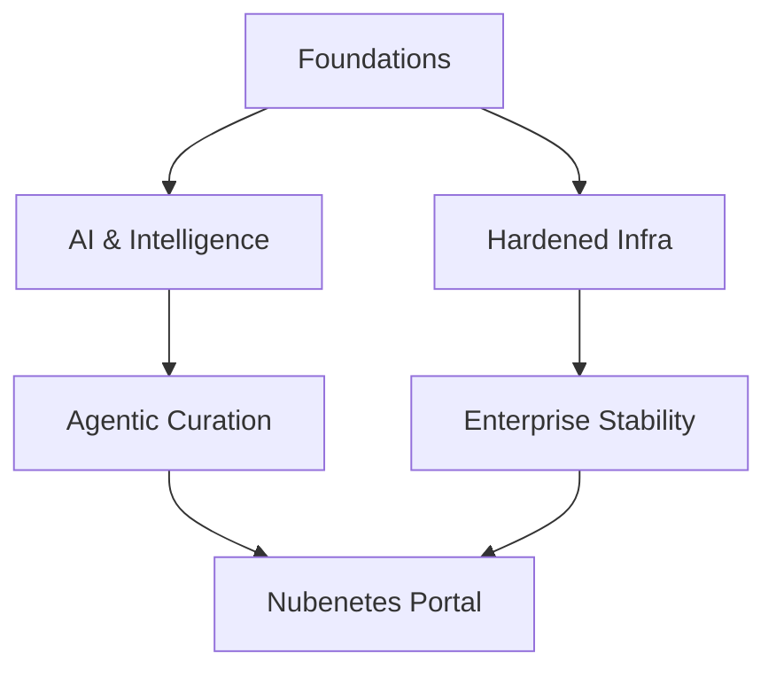

# Introduction

!!! info "Architectural Context"
    Detailed reference for Introduction in the context of Architectural Foundations.

## Vision 2026

!!! quote "The Evolution of Autonomy"
    From manual curation to agentic intelligence.

### Ecosystem Map

## Artificial Intelligence

### Machine Learning

#### Google Courses

  - **(2025)** [Machine Learning Crash Course](https://developers.google.com/machine-learning/crash-course?hl=es-419) [SPANISH CONTENT] 🌟🌟🌟 [COMMUNITY-TOOL] [GUIDE] — Google's formal, highly optimized machine learning crash course. Grounding indicates it offers a highly technical path for systems engineers wishing to deploy AI models in container environments. [SPANISH CONTENT]
## Cloud Native Architecture

### Microservices

#### Event-Driven Design

??? note "infoq.com: Turning Microservices Inside-Out"
    **[Access Resource](https://www.infoq.com/articles/microservices-inside-out)** 🌟🌟🌟🌟 | Level: Advanced
    
    This foundational architectural piece by Martin Kleppmann argues for treating database tables as streams of changes rather than static silos. By turning the database "inside out" using event streams (like Kafka), microservices can achieve decentralized state management and projection consistency. It bridges the gap between stream processing and relational storage.

## Container Orchestration

### Kubernetes Alternatives

#### Evaluations

  - **(2022)** [thenewstack.io: Do I Really Need Kubernetes?](https://thenewstack.io/do-i-really-need-kubernetes) [EN CONTENT]  [COMMUNITY-TOOL] — A candid architectural decision guide evaluating the complexity, overhead, and maintenance costs of adopting Kubernetes. Offers simpler alternative infrastructure paradigms.
## Networking

### Web Servers

#### Nginx

??? note "Nginx"
    **[Access Resource](https://www.f5.com/products/nginx)** 🌟🌟🌟🌟🌟 | Level: Intermediate
    
    Nginx is the premier high-performance web server, reverse proxy, and ingress standard globally. Its lightweight event-driven design allows it to process high-concurrency traffic patterns with extremely predictable memory and CPU footprints.

## Platform Engineering

### Site Reliability Engineering

#### Foundations

  - **(2024)** [itprotoday.com: Why Site Reliability Engineering Is Key to Modern DevOps](https://www.techtarget.com/searchcio/answer/ITPro-Today-Network-Computing-IoT-World-Today-combine-with-TechTarget) 🌟 [COMMUNITY-TOOL] — An executive analysis examining why SRE architecture is a vital component of any modern, high-density DevOps delivery system trying to limit service down-time.
## Security

### Cloud Native

#### Kubernetes Hardening

  - **(2023)** [Kubernetes Security Best Practices: A DevSecOps Perspective](https://www.linkedin.com/top-content/career)  [COMMUNITY-TOOL] — A DevSecOps assessment explaining key patterns for hardening Kubernetes namespaces. Reviews best practices for securing configuration secrets, configuring network isolation policies, and enforcing runtime container constraints.
## Software Engineering

### Microservices (1)

#### Design Patterns

  - **(2023)** [The 12-Factor App: An Updated Guide](https://newsletter.francofernando.com/p/the-12-factor-app-an-updated-guide)  [COMMUNITY-TOOL] — An updated architectural deep-dive into the Twelve-Factor App methodology. Reviews the classic software principles (like database separations, environment configs, and scaling processes) in modern Kubernetes environments.

---
💡 **Explore Related:** [Mkdocs](./mkdocs.md) | [Cheatsheets](./cheatsheets.md) | [Linux](./linux.md)

