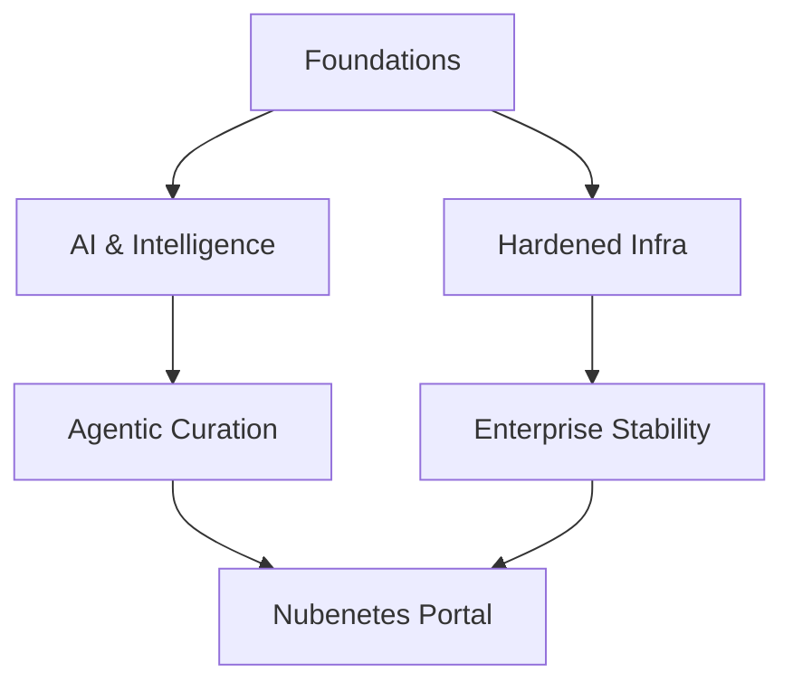

# Introduction. Microservice Architecture. From Java EE To Cloud Native. Openshift VS Kubernetes

!!! info "Architectural Context"
    Detailed reference for Introduction. Microservice Architecture. From Java EE To Cloud Native. Openshift VS Kubernetes in the context of Architectural Foundations.

## Vision 2026

!!! quote "The Evolution of Autonomy"
    From manual curation to agentic intelligence.

### Ecosystem Map

## Standard Reference

  - [Enterprise Web App Patterns - Azure Architecture Center](https://learn.microsoft.com/en-us/azure/architecture/web-apps/guides/enterprise-app-patterns/overview)  [COMMUNITY-TOOL]
  - [infoworld.com: Complexity is killing software developers](https://www.infoworld.com/article/2270714/complexity-is-killing-software-developers.html)  [COMMUNITY-TOOL]
  - [blog.min.io: Kubernetes, Consistency and Commoditization - The Way of the Cloud](https://www.min.io/blog)  [COMMUNITY-TOOL]
  - [jaxenter.com: Practical Implications for Adopting a Multi-Cluster, Multi-Cloud Kubernetes Strategy](https://devm.io/kubernetes/kubernetes-practical-implications-171647)  [COMMUNITY-TOOL]
  - [jaxenter.com: Six Essential Kubernetes Extensions to Add to Your Toolkit 🌟](https://devm.io/kubernetes/kubernetes-extensions-172215)  [COMMUNITY-TOOL]
  - [addwebsolution.com: How Kubernetes helps businesses manage their IT infrastructure?](https://www.addwebsolution.com/blog/how-kubernetes-helps-businesses-manage-their-it-infrastructure)  [COMMUNITY-TOOL]
  - [thenewstack.io: Microservices vs. Monoliths: An Operational Comparison](https://thenewstack.io/microservices/microservices-vs-monoliths-an-operational-comparison)  [COMMUNITY-TOOL]
  - [Modernize legacy applications with containers, microservices](https://www.techtarget.com/searchcloudcomputing/feature/Modernize-legacy-applications-with-containers-microservices)  [COMMUNITY-TOOL]
  - [blog.heroku.com: Deconstructing Monolithic Applications into Services](https://www.heroku.com/blog/monolithic-applications-into-services)  [COMMUNITY-TOOL]
  - [redhat.com: A sysadmin's guide to containerizing applications](https://www.redhat.com/en/blog/containerizing-applications)  [COMMUNITY-TOOL]
  - [thenewstack.io: 3 Reasons Why You Can’t Afford to Ignore Cloud Native Computing 🌟](https://thenewstack.io/cloud-native/3-reasons-why-you-cant-afford-to-ignore-cloud-native-computing)  [COMMUNITY-TOOL]
  - [jaxenter.com: Kubernetes Is Much Bigger Than Containers: Here’s Where It Will Go Next](https://devm.io/kubernetes/kubernetes-bigger-173675)  [COMMUNITY-TOOL]
  - [getcortexapp.com: Why You Need a Microservices Catalog Tool](https://www.cortex.io/post/why-you-need-a-microservices-catalog-tool)  [COMMUNITY-TOOL]
  - [ringcentral.co.uk: Software as a Service (SaaS)](https://www.ringcentral.com/gb/en/blog/definitions/software-as-a-service-saas)  [COMMUNITY-TOOL]
  - [thenewstack.io: The Cloud Native Landscape: Platforms Explained](https://thenewstack.io/cloud-native/the-cloud-native-landscape-platforms-explained)  [COMMUNITY-TOOL]
  - [infoworld.com: The decline of Heroku PaaS](https://www.infoworld.com/article/2264177/the-decline-of-heroku.html)  [COMMUNITY-TOOL]
  - [infoworld.com: 3 cloud architecture mistakes we all make, but shouldn't](https://www.infoworld.com/article/2264771/3-cloud-architecture-mistakes-we-all-make-but-shouldnt.html)  [COMMUNITY-TOOL]
  - [ringcentral.co.uk: Cloud Management 🌟](https://www.ringcentral.com/gb/en/blog/definitions/cloud-management)  [COMMUNITY-TOOL]
  - [simform.com: What is Multi Cloud? Why you Need a Multi Cloud Strategy?](https://www.simform.com/blog/multi-cloud-strategy)  [COMMUNITY-TOOL]
  - [acloudguru.com: Public cloud vs private cloud: What’s the difference? 🌟](https://www.pluralsight.com/resources/blog/business-and-leadership/public-cloud-vs-private-cloud-whats-the-difference)  [COMMUNITY-TOOL]
  - [thenewstack.io: The Future of Microservices? More Abstractions](https://thenewstack.io/microservices/the-future-of-microservices-more-abstractions)  [COMMUNITY-TOOL]
  - [community.hpe.com: Containers vs. VMs: What’s the difference?](https://community.hpe.com/hpeb/plugins/custom/hp/hpebresponsive/custom.bounce_endpoint?referer=https%3A%2F%2Fcommunity.hpe.com%2Ft5%2FHPE-Ezmeral-Uncut%2FContainers-vs-VMs-What-s-the-difference%2Fba-p%2F7147090)  [COMMUNITY-TOOL]
  - [geeksforgeeks.org: Microservice Architecture – Introduction, Challeneges & Best Practices](https://www.geeksforgeeks.org/blogs/microservice-architecture-introduction-challenges-best-practices)  [COMMUNITY-TOOL]
  - [redhat.com: Use automation to combat your increased workload](https://www.redhat.com/en/blog/automation-combat-increased-workload)  [COMMUNITY-TOOL]
  - [cloud.redhat.com: How to Modernize Virtualized Workloads 🌟](https://www.redhat.com/en/blog/how-to-modernize-virtualized-workloads)  [COMMUNITY-TOOL]
  - [theregister.com: How Kubernetes lowers costs and automates IT department work](https://www.theregister.com/software/2021/12/21/how-kubernetes-lowers-costs-and-automates-it-department-work/1316708)  [COMMUNITY-TOOL]
  - [redhat.com: Top 8 resources for microservices architecture of 2021](https://www.redhat.com/en/blog/best-microservices-2021)  [COMMUNITY-TOOL]
  - [infoworld.com: Kubernetes adoption up, serverless down, developer survey says](https://www.infoworld.com/article/2271482/kubernetes-up-serverless-down-report.html)  [COMMUNITY-TOOL]
  - [websiteplanet.com: What’s Open Source Software + How It Makes Money 2022](https://www.websiteplanet.com/blog/what-is-open-source-software/?geo=us&device=desktop)  [COMMUNITY-TOOL]
  - [semaphoreci.com: 5 Options for Deploying Microservices 🌟](https://semaphore.io/blog/deploy-microservices)  [COMMUNITY-TOOL] — - Option 1: Single machine, multiple processes
    - Option 2: Multiple machines and processes
    - Option 3: Deploy microservices with containers
    - Option 4: Orchestrators
    - Option 5: Deploy microservices as serverless functions
  - [deloitte.com/de: EMEA Center of Excellence for Application Modernization and Migration](https://www.deloitte.com/de/de/services/consulting/services/center-of-excellence-application-modernization.html)  [COMMUNITY-TOOL]
  - [redis.com: Microservice Architecture Key Concepts](https://redis.io/blog/microservice-architecture-key-concepts)  [COMMUNITY-TOOL]
  - [designgurus.io: Monolithic vs. Service-Oriented vs. Microservice Architecture: Top Architectural Design Patterns](https://www.designgurus.io/blog/monolithic-service-oriented-microservice-architecture)  [COMMUNITY-TOOL]
  - [elespanol.com: Mainframe: repaso de pasado y futuro a una tecnología de 1944 que se resiste a morir](https://www.elespanol.com/invertia/disruptores/grandes-actores/tecnologicas/20230416/mainframe-repaso-pasado-futuro-tecnologia-resiste-morir/756174490_0.html)  [COMMUNITY-TOOL]
  - [infoworld.com: Why we need both cloud architects and cloud engineers](https://www.infoworld.com/article/2335001/why-we-need-both-cloud-architects-and-cloud-engineers.html)  [COMMUNITY-TOOL]
  - [theregister.com: Basecamp details 'obscene' $3.2 million bill that caused it to quit the cloud](https://www.theregister.com/off-prem/2023/01/16/basecamp-details-32-million-bill-that-saw-it-quit-cloud/270397)  [COMMUNITY-TOOL]
  - [genbeta.com/a-fondo: Cinco repositorios de GitHub tan buenos que son imprescindibles si estás aprendiendo o te dedicas a programar](https://www.genbeta.com/desarrollo/cinco-repositorios-github-buenos-que-imprescindibles-estas-aprendiendo-te-dedicas-a-programar-1)  [COMMUNITY-TOOL]
  - [cloudscaling.com: The History of Pets vs Cattle and How to Use the Analogy Properly](http://cloudscaling.com/blog/cloud-computing/the-history-of-pets-vs-cattle)  [COMMUNITY-TOOL] — - __In the old way of doing things, we treat our servers like pets, for example Bob the mail server. If Bob goes down, it’s all hands on deck. The CEO can’t get his email and it’s the end of the world. In the new way, servers are numbered, like cattle in a herd. For example, www001 to www100. When one server goes down, it’s taken out back, shot, and replaced on the line.__
    - ==Pets==: __Servers or server pairs that are treated as indispensable or unique systems that can never be down. Typically they are manually built, managed, and “hand fed”. Examples include mainframes, solitary servers, HA loadbalancers/firewalls (active/active or active/passive), database systems designed as master/slave (active/passive), and so on.__
    - ==Cattle==: __Arrays of more than two servers, that are built using automated tools, and are designed for failure, where no one, two, or even three servers are irreplaceable. Typically, during failure events no human intervention is required as the array exhibits attributes of “routing around failures” by restarting failed servers or replicating data through strategies like triple replication or erasure coding. Examples include web server arrays, multi-master datastores such as Cassandra clusters, multiple racks of gear put together in clusters, and just about anything that is load-balanced and multi-master.__
  - [eventstore.com: Service-Oriented Architecture vs Event-Driven Architecture 🌟](https://www.kurrent.io/blog/service-oriented-architecture-vs-event-driven-architecture)  [COMMUNITY-TOOL]
  - [leaddev.com: How to break the cycle of tech debt](https://leaddev.com/technical-direction/how-break-cycle-tech-debt)  [COMMUNITY-TOOL]
  - [infoworld.com: You can’t run away from technical debt](https://www.infoworld.com/article/2338860/you-cant-run-away-from-technical-debt.html)  [COMMUNITY-TOOL]
  - [acloudguru.com: Twelve-Factor Apps in Kubernetes](https://www.pluralsight.com/resources/blog/cloud/twelve-factor-apps-in-kubernetes)  [COMMUNITY-TOOL]
  - [architecturenotes.co: 12 Factor App Revisited](https://architecturenotes.co/p/12-factor-app-revisited)  [COMMUNITY-TOOL]
  - [redhat.com: Why you should be using architecture decision records to document your project](https://www.redhat.com/en/blog/architecture-decision-records)  [COMMUNITY-TOOL]
  - [blog.scaleway.com: SaaS Solutions - What is the difference between a multi-instance and a multi-tenant architecture](https://www.scaleway.com/en/blog/saas-multi-tenant-vs-multi-instance-architectures)  [COMMUNITY-TOOL]
  - [acloudguru.com: Sharing data in the cloud: 4 patterns you should know](https://www.pluralsight.com/resources/blog/business-and-leadership/sharing-data-in-the-cloud-four-patterns-everyone-should-know)  [COMMUNITY-TOOL]
  - [softwebsolutions.com: Why enterprises need to adopt a multi-cloud strategy](https://www.softwebsolutions.com/resources/multi-cloud-adoption-strategy)  [COMMUNITY-TOOL]
  - [redhat.com: 5 essential tools for managing hybrid cloud infrastructure](https://www.redhat.com/en/blog/hybrid-cloud-management-tools)  [COMMUNITY-TOOL]
  - [semaphoreci.com: Microfrontends: Microservices for the Frontend](https://semaphore.io/blog/microfrontends)  [COMMUNITY-TOOL] — - Microservices are a popular way to build small, autonomous teams that can work independently. Unfortunately, by their very nature, microservices only work in the backend. Even with the best microservice architecture, frontend development still requires a high degree of interdependence, and this introduces coupling and communication overhead that can slow down everyone.
    - Can we take microservice architecture patterns and apply them to the frontend? It turns out we can. Companies such as Netflix, Zalando, and Capital One have pushed the pattern to the front, laying the groundwork for microfrontends. This article will explore microfrontends, their benefits and disadvantages, and how they differ from traditional microservices.
  - [acloudguru.com: 3 ways to practice migrating workloads to the cloud](https://www.pluralsight.com/resources/blog/cloud/3-ways-to-practice-migrating-workloads-to-the-cloud)  [COMMUNITY-TOOL]
  - [redhat.com: 5 strategies to shift your career from sysadmin to architect](https://www.redhat.com/en/blog/from-sysadmin-to-architect)  [COMMUNITY-TOOL]
  - [kamilgrzybek.com: Modular Monolith: A Primer 🌟](https://www.kamilgrzybek.com/blog/posts/modular-monolith-primer)  [COMMUNITY-TOOL]
  - [lightbend.com: From Java EE To Cloud Native: The End Of The Heavyweight Era 🌟](https://akka.io)  [COMMUNITY-TOOL]
  - [overops.com: Strangler Pattern: How to Deal With Legacy Code During the Container Revolution](https://www.harness.io/products/service-reliability-management)  [COMMUNITY-TOOL]
  - [primevideotech.com: Scaling up the Prime Video audio/video monitoring service and reducing costs by 90%](https://www.aboutamazon.com/what-we-do/entertainment)  [COMMUNITY-TOOL]
  - [spec-india.com: Kubernetes VS Openshift (July 23rd 2019)](https://www.spec-india.com/blog)  [COMMUNITY-TOOL]
  - [phoenixnap.com: Kubernetes vs OpenShift: Key Differences Compared 🌟](https://phoenixnap.com/blog/openshift-vs-kubernetes)  [COMMUNITY-TOOL]
  - [ibm.com: OpenShift vs. Kubernetes: What’s the Difference?](https://www.ibm.com/think/topics/openshift-vs-kubernetes)  [COMMUNITY-TOOL]
  - [Kelsey Hightower Fireside Chat: An Unconventional Path to IT and Some Life Advice](https://www.hashicorp.com/resources/kelsey-hightower-fireside-chat-an-unconventional-path-to-it-and-some-life-advice/?utm_source=linkedin)  [COMMUNITY-TOOL]
  - [Build Your Own X](https://github.com/codecrafters-io/build-your-own-x)  [COMMUNITY-TOOL]
  - [levelup.gitconnected.com: How to design a system to scale to your first' 100 million users](https://levelup.gitconnected.com/how-to-design-a-system-to-scale-to-your-first-100-million-users-4450a2f9703d)  [COMMUNITY-TOOL]
  - [medium.com/javarevisited: Microservices communication using gRPC Protocol](https://medium.com/javarevisited/microservices-communication-using-grpc-protocol-dc3a2f8b648d)  [COMMUNITY-TOOL]
  - [cloud.google.com: What is Kubernetes? 🌟](https://cloud.google.com/learn/what-is-kubernetes)  [COMMUNITY-TOOL]
  - [engineering.monday.com: monday.com’s Multi-Regional Architecture: A Deep' Dive](https://engineering.monday.com/monday-coms-multi-regional-architecture-a-deep-dive)  [COMMUNITY-TOOL]
  - [Red Hat automation glossary 🌟](https://www.redhat.com/en/blog/red-hat-automation-glossary)  [COMMUNITY-TOOL]
  - [softwareengineeringdaily.com: The Rise of Platform Engineering 🌟](https://softwareengineeringdaily.com/2020/02/13/setting-the-stage-for-platform-engineering)  [COMMUNITY-TOOL]
  - [freecodecamp.org: A Beginner-Friendly Introduction to Containers, VMs and' Docker](https://www.freecodecamp.org/news/a-beginner-friendly-introduction-to-containers-vms-and-docker-79a9e3e119b)  [COMMUNITY-TOOL]
  - [itnext.io: Platform-as-Code: how it relates to Infrastructure-as-Code and' what it enables](https://itnext.io/platform-as-code-how-it-compares-with-infrastructure-as-code-and-what-it-enables-2684b348be2e)  [COMMUNITY-TOOL]
  - [developers.redhat.com: Why Kubernetes is The New Application Server](https://developers.redhat.com/blog/2018/06/28/why-kubernetes-is-the-new-application-server)  [COMMUNITY-TOOL]
  - [redhat.com: Why choose Red Hat for microservices?](https://www.redhat.com/en/topics/microservices/why-choose-red-hat-microservices)  [COMMUNITY-TOOL]
  - [Monoliths are the future | Kelsey Hightower](https://changelog.com/posts/monoliths-are-the-future)  [COMMUNITY-TOOL]
  - [allthingsdistributed.com: Monoliths are not dinosaurs](https://www.allthingsdistributed.com/2023/05/monoliths-are-not-dinosaurs.html)  [COMMUNITY-TOOL]
  - [weave.works: Going Cloud Native: 6 essential things you need to know](https://www.weave.works/technologies/going-cloud-native-6-essential-things-you-need-to-know)  [COMMUNITY-TOOL]
  - [Operators and Sidecars Are the New Model for Software Delivery](https://thenewstack.io/operators-and-sidecars-are-the-new-model-for-software-delivery)  [COMMUNITY-TOOL]
  - [thoughtworks.com: Kubernetes](https://www.thoughtworks.com/radar/platforms/kubernetes)  [COMMUNITY-TOOL]
  - [loves.cloud: Kubernetes: An Introduction](https://loves.cloud/kubernetes-an-introduction)  [COMMUNITY-TOOL]
  - [weave.works: 6 Business Benefits of Kubernetes](https://www.weave.works/blog/6-business-benefits-of-kubernetes)  [COMMUNITY-TOOL]
  - [ituser.es: Las principales habilidades que un arquitecto cloud necesita' para triunfar](https://www.ituser.es/opinion/2020/07/las-principales-habilidades-que-un-arquitecto-cloud-necesita-para-triunfar)  [COMMUNITY-TOOL]
  - [Monolithic versus Microservice architecture](https://www.enterprisetimes.co.uk/2020/07/23/monolithic-versus-microservice-architecture)  [COMMUNITY-TOOL]
  - [vmware.com: How to Deconstruct a Monolith using Microservices – Getting' Ready for Cloud-Native](https://blogs.vmware.com/vov/2018/08/06/how-to-deconstruct-a-monolith-using-microservices-getting-ready-for-cloud-native)  [COMMUNITY-TOOL]
  - [thenewstack.io: 7 Best Practices to Build and Maintain Resilient Applications' and Infrastructure](https://thenewstack.io/7-best-practices-to-build-and-maintain-resilient-applications-and-infrastructure)  [COMMUNITY-TOOL]
  - [viewnext.com: Front End vs Back End (spanish)](https://www.viewnext.com/front-end-vs-back-end)  [COMMUNITY-TOOL]
  - [thenewstack.io: What is the modern cloud native stack? 🌟🌟](https://thenewstack.io/what-is-the-modern-cloud-native-stack)  [COMMUNITY-TOOL]
  - [cncf.io: Top 7 challenges to becoming cloud native](https://www.cncf.io/blog/2020/09/15/top-7-challenges-to-becoming-cloud-native)  [COMMUNITY-TOOL]
  - [lavanguardia.com: Por qué la transformación digital es mentira 🌟](https://www.lavanguardia.com/economia/20201014/484036217179/transformacion-digital-empresas-foncillas-pf-video-seo-lv.html)  [COMMUNITY-TOOL]
  - [devops.com: 6 Advantages of Microservices](https://devops.com/6-advantages-of-microservices)  [COMMUNITY-TOOL]
  - [cloudpundit.com: Don’t boil the ocean to create your cloud 🌟](https://cloudpundit.com/2020/09/22/dont-boil-the-ocean-to-create-your-cloud)  [COMMUNITY-TOOL]
  - [hcltech.com: DevOps Tools and Technologies to Manage Microservices 🌟](https://www.hcltech.com/blogs/devops-tools-and-technologies-manage-microservices)  [COMMUNITY-TOOL]
  - [opensource.com: 6 container concepts you need to understand](https://opensource.com/article/20/12/containers-101)  [COMMUNITY-TOOL]
  - [devops.com: Why Boring Tech is Best to Avoid a Microservices Mess](https://devops.com/why-boring-tech-is-best-to-avoid-a-microservices-mess)  [COMMUNITY-TOOL]
  - [softwareengineeringdaily.com: Kubernetes vs. Serverless with Matt Ward (podcast)' 🌟](https://softwareengineeringdaily.com/2020/12/29/kubernetes-vs-serverless-with-matt-ward-repeat)  [COMMUNITY-TOOL]
  - [thenewstack.io: Defining a Different Kubernetes User Interface for the Next' Decade](https://thenewstack.io/defining-a-different-kubernetes-user-interface-for-the-next-decade)  [COMMUNITY-TOOL]
  - [thenewstack.io: React in Real-Time with Event-Driven APIs](https://thenewstack.io/react-in-real-time-with-event-driven-apis)  [COMMUNITY-TOOL]
  - [codeopinion.com: Splitting up a Monolith into Microservices 🌟](https://codeopinion.com/splitting-up-a-monolith-into-microservices)  [COMMUNITY-TOOL]
  - [javarevisited.blogspot.com: Why Every Programmer, DevOps Engineer Should' learn Docker and Kubernetes in 2020](https://javarevisited.blogspot.com/2020/11/why-devops-engineer-learn-docker-kubernetes.html)  [COMMUNITY-TOOL]
  - [techrepublic.com: Kubernetes will deliver the app store experience for enterprise' software, says Weaveworks CEO](https://www.techrepublic.com/article/kubernetes-will-deliver-the-app-store-experience-for-enterprise-software-says-weaveworks-ceo)  [COMMUNITY-TOOL]
  - [shahirdaya.medium.com: What does it mean to be Cloud Native? 🌟](https://shahirdaya.medium.com/what-does-it-mean-to-be-cloud-native-12360a324571)  [COMMUNITY-TOOL]
  - [enterprisersproject.com: 5 hybrid cloud trends to watch in 2021](https://enterprisersproject.com/article/2021/1/5-hybrid-cloud-trends-2021)  [COMMUNITY-TOOL]
  - [skamille.medium.com: Make Boring Plans](https://skamille.medium.com/make-boring-plans-9438ce5cb053)  [COMMUNITY-TOOL]
  - [cloud-melon.com: Under the hood of Kubernetes and microservices](https://cloud-melon.com/2019/12/26/under-the-hood-of-kubernetes-and-microservices)  [COMMUNITY-TOOL]
  - [thenewstack.io: Study: Silos Are the Chief Impediment to IT and Business' Value](https://thenewstack.io/study-silos-are-chief-impediment-to-it-and-business-value)  [COMMUNITY-TOOL]
  - [thenewstack.io: Prepare to Adopt the Cloud: A 10-Step Cloud Migration Checklist' 🌟](https://thenewstack.io/prepare-to-adopt-the-cloud-a-10-step-cloud-migration-checklist)  [COMMUNITY-TOOL]
  - [devprojournal.com: Containers, Kubernetes and Software Development in 2021](https://www.devprojournal.com/technology-trends/kubernetes/containers-kubernetes-and-software-development-in-2021)  [COMMUNITY-TOOL]
  - [infoq.com: Migrating Monoliths to Microservices with Decomposition and Incremental' Changes](https://www.infoq.com/articles/migrating-monoliths-to-microservices-with-decomposition)  [COMMUNITY-TOOL]
  - [shopify.engineering: Keeping Developers Happy with a Fast CI](https://shopify.engineering/faster-shopify-ci)  [COMMUNITY-TOOL]
  - [infoq.com: Saga Orchestration for Microservices Using the Outbox Pattern](https://www.infoq.com/articles/saga-orchestration-outbox)  [COMMUNITY-TOOL]
  - [medium: A Design Analysis of Cloud-based Microservices Architecture at Netflix](https://medium.com/swlh/a-design-analysis-of-cloud-based-microservices-architecture-at-netflix-98836b2da45f)  [COMMUNITY-TOOL]
  - [blog.container-solutions.com: How Mature Is Your Microservices Architecture?' 🌟](https://blog.container-solutions.com/how-mature-is-your-microservices-architecture)  [COMMUNITY-TOOL]
  - [thenewstack.io: Are Private Clouds Proliferating?](https://thenewstack.io/google-and-oracle-cloud-adoption-doubles-among-enterprises-3)  [COMMUNITY-TOOL]
  - [thenewstack.io: Multicloud Challenges and Solutions](https://thenewstack.io/multicloud-challenges-and-solutions)  [COMMUNITY-TOOL]
  - [makeuseof.com: hich Container System Should You Use: Kubernetes or Docker?](https://www.makeuseof.com/kubernetes-or-docker)  [COMMUNITY-TOOL]
  - [infoq.com: Principles for Microservice Design: Think IDEALS, Rather than' SOLID](https://www.infoq.com/articles/microservices-design-ideals)  [COMMUNITY-TOOL]
  - [thenewstack.io: The Scalability Myth](https://thenewstack.io/the-scalability-myth)  [COMMUNITY-TOOL]
  - [thenewstack.io: The 4 Definitions of Multicloud: Part 1 — Data Portability](https://thenewstack.io/the-4-definitions-of-multicloud-part-1-data-portability)  [COMMUNITY-TOOL]
  - [thenewstack.io: Multicloud Paves the Way for Cloud Native Resiliency Models](https://thenewstack.io/multicloud-paves-the-way-for-cloud-native-resiliency-models)  [COMMUNITY-TOOL]
  - [hashicorp.com: Why Microservices? 🌟](https://www.hashicorp.com/resources/why-microservices)  [COMMUNITY-TOOL]
  - [thenewstack.io: Private vs. Public Cloud: How Kubernetes Shifts the Balance](https://thenewstack.io/private-vs-public-cloud-how-kubernetes-shifts-the-balance)  [COMMUNITY-TOOL]
  - [medium: Microservices Architecture From A to Z 🌟](https://medium.com/swlh/microservices-architecture-from-a-to-z-7287da1c5d28)  [COMMUNITY-TOOL]
  - [skycrafters.io: Do Containers Really Contain? Virtual Machines vs. Containers' 🌟](https://skycrafters.io/blog/2021/06/08/do-containers-really-contain)  [COMMUNITY-TOOL]
  - [xataka.com: La deuda técnica, un lastre para las tecnológicas: un estudio' señala que los informáticos pierden casi un día de trabajo a la semana para solventarlas](https://www.xataka.com/pro/deuda-tecnica-lastre-para-tecnologicas-estudio-senala-que-informaticos-pierden-casi-dia-trabajo-a-semana-para-solventarlas)  [COMMUNITY-TOOL]
  - [dev.to: When it Pays to Choose Microservices 🌟](https://dev.to/typeable/when-it-pays-to-choose-microservices-12h5)  [COMMUNITY-TOOL]
  - [medium: Container Fundamentals — Part 1](https://medium.com/techbeatly/container-fundamentals-part-i-445881a81b7)  [COMMUNITY-TOOL]
  - [thenewstack.io: Transform and Future-Proof Your Architecture with MACH](https://thenewstack.io/transform-and-future-proof-your-architecture-with-mach)  [COMMUNITY-TOOL]
  - [yellow.systems: How to Make a Scalable Web Application: Architecture,' Technologies, Cost 🌟](https://yellow.systems/blog/how-to-build-a-scalable-web-application)  [COMMUNITY-TOOL]
  - [opensource.com: What do we call post-modern system administrators?](https://opensource.com/article/21/7/system-administrators)  [COMMUNITY-TOOL]
  - [thenewstack.io: Cloud Engineers Try Policy-as-Code to Cure Misconfiguration' Woes](https://thenewstack.io/cloud-engineers-try-policy-as-code-to-cure-misconfiguration-woes)  [COMMUNITY-TOOL]
  - [medium: What is microservices and why is it different? 🌟](https://medium.com/microservices-for-net-developers/what-is-microservices-and-why-is-it-different-fac017cb8cf4)  [COMMUNITY-TOOL]
  - [How Your Application Architecture Has Evolved 🌟](https://dzone.com/articles/how-your-application-architecture-evolved)  [COMMUNITY-TOOL]
  - [simform.com: 6 Multi-Cloud Architecture Designs for an Effective Cloud Strategy' 🌟](https://www.simform.com/blog/multi-cloud-architecture)  [COMMUNITY-TOOL]
  - [simform.com: Cloud Migration ebook](https://www.simform.com/cloud-migration-ebook)  [COMMUNITY-TOOL]
  - [fylamynt.com: Mastering Cloud Automation in the Cloud-Native Era 🌟](https://www.fylamynt.com/post/mastering-cloud-automation-in-the-cloud-native-era)  [COMMUNITY-TOOL]
  - [medium: Monoliths vs Microservices](https://medium.com/getdefault-in/monoliths-vs-microservices-59cff20bb106)  [COMMUNITY-TOOL]
  - [dzone: Top 6 Time Wastes as a Software Engineer](https://dzone.com/articles/top-time-wastes-as-a-software-engineer)  [COMMUNITY-TOOL]
  - [thenewstack.io: Reasons to Opt for a Multicloud Strategy](https://thenewstack.io/reasons-to-opt-for-a-multicloud-strategy)  [COMMUNITY-TOOL]
  - [hiralee.medium.com: Software Architecture vs Design](https://hiralee.medium.com/software-design-vs-architecture-1da0a94322a4)  [COMMUNITY-TOOL]
  - [blog.deref.io: Containers Don't Solve Everything 🌟](https://blog.deref.io/containers-dont-solve-everything)  [COMMUNITY-TOOL]
  - [thenewstack.io: Intention-as Code: Making Self-Healing Infrastructure Work](https://thenewstack.io/intention-as-code-making-self-healing-infrastructure-work)  [COMMUNITY-TOOL]
  - [hackernoon.com: 9 Basic (and Crucial) Tips for Microservices Developers' 🌟](https://hackernoon.com/9-basic-and-crucial-tips-for-microservices-developers)  [COMMUNITY-TOOL]
  - [dzone: Transitioning from Monolith to Microservices (with python django' example)](https://dzone.com/articles/transitioning-from-monolith-to-microservices)  [COMMUNITY-TOOL]
  - [cncf.io: How to justify infrastructure replacement to your manager](https://www.cncf.io/blog/2021/10/29/how-to-justify-infrastructure-replacement-to-your-manager)  [COMMUNITY-TOOL]
  - [enter.co: Estos son los 10 lenguajes de programación más populares en 2021](https://www.enter.co/especiales/dev/herramientas-dev/estos-son-los-10-lenguajes-de-programacion-mas-populares-en-2021)  [COMMUNITY-TOOL]
  - [zesty.co: 10 Cloud Deficiencies You Should Know](https://zesty.co/blog/10-cloud-deficiencies)  [COMMUNITY-TOOL]
  - [weave.works: What is a Kubernetes Cluster? 🌟](https://www.weave.works/blog/kubernetes-cluster)  [COMMUNITY-TOOL]
  - [techrepublic.com: Enterprises get closer to the app store experience with' Kubernetes and GitOps](https://www.techrepublic.com/article/enterprises-get-closer-to-the-app-store-experience-with-kubernetes-and-gitops)  [COMMUNITY-TOOL]
  - [venturebeat.com: 5 ways the world of IT operations will shift in 2022 (and' beyond)](https://venturebeat.com/2021/12/22/5-ways-the-world-of-it-operations-will-shift-in-2022-and-beyond)  [COMMUNITY-TOOL]
  - [thenewstack.io: 5 Cloud Native Trends to Watch out for in 2022](https://thenewstack.io/5-cloud-native-trends-to-watch-out-for-in-2022)  [COMMUNITY-TOOL]
  - [blog.devgenius.io: Distributed Monolith](https://blog.devgenius.io/distributed-monolith-1d2d9f86a68f)  [COMMUNITY-TOOL]
  - [infoq.com: 9 Ways to Fail at Cloud Native](https://www.infoq.com/presentations/fail-cloud-native-migration)  [COMMUNITY-TOOL]
  - [thenewstack.io: App Modernization: 5 Tips When Migrating to Kubernetes](https://thenewstack.io/app-modernization-5-tips-when-migrating-to-kubernetes)  [COMMUNITY-TOOL]
  - [thenewstack.io: Kubernetes and the Next Generation of PaaS](https://thenewstack.io/kubernetes-and-the-next-generation-of-paas)  [COMMUNITY-TOOL]
  - [medium.com/geekculture: A Beginners Guide to Understanding Microservices](https://medium.com/geekculture/a-beginners-guide-to-understanding-microservices-d2a8bae871b7)  [COMMUNITY-TOOL]
  - [nathanpeck.com: Why should I use an orchestrator like Kubernetes, Amazon' ECS, or Hashicorp Nomad?](https://nathanpeck.com/why-should-use-container-orchestration)  [COMMUNITY-TOOL]
  - [christophermeiklejohn.com: Understanding why Resilience Faults in Microservice' Applications Occur](https://christophermeiklejohn.com/filibuster/2022/03/19/understanding-faults.html)  [COMMUNITY-TOOL]
  - [The future of Kubernetes – and why developers should look beyond Kubernetes in 2022](https://www.eficode.com/blog/the-future-of-kubernetes-and-why-developers-should-look-beyond-kubernetes-in-2022)  [COMMUNITY-TOOL]
  - [medium.com/interviewnoodle: Shift from Monolith to CQRS 🌟](https://medium.com/interviewnoodle/shift-from-monolith-to-cqrs-a34bab75617e)  [COMMUNITY-TOOL]
  - [bytebytego.com: System Design - Scale From Zero To Millions Of Users' 🌟](https://bytebytego.com/courses/system-design-interview/scale-from-zero-to-millions-of-users)  [COMMUNITY-TOOL]
  - [medium.com/@ajin.sunny: System Design Architecture: Stateful vs. Stateless' 🌟](https://medium.com/@ajin.sunny/system-design-architecture-stateful-vs-stateless-62ed0ddb9f2b)  [COMMUNITY-TOOL]
  - [medium.com/@ajin.sunny: System Design Concept: Rate limiting 🌟](https://medium.com/@ajin.sunny/system-design-concept-rate-limiting-f4da72371533)  [COMMUNITY-TOOL]
  - [medium.com/@ajin.sunny: Rate limiting in Distributed Systems 🌟](https://medium.com/@ajin.sunny/rate-limiting-in-distributed-systems-bbeca0c47b96)  [COMMUNITY-TOOL]
  - [blog.devgenius.io: Top 10 Architecture Characteristics / Non-Functional' Requirements with Cheatsheet 🌟](https://blog.devgenius.io/top-10-architecture-characteristics-non-functional-requirements-with-cheatsheat-7ad14bbb0a9b)  [COMMUNITY-TOOL]
  - [medium.com/dotnet-hub: Software Architecture — Introduction to Cloud Native' Application Architecture 🌟](https://medium.com/dotnet-hub/introduction-to-cloud-native-application-architecture-what-is-cloud-native-architecture-overview-benefits-e9be9aca0dd3)  [COMMUNITY-TOOL]
  - [bootcamp.uxdesign.cc: Popular Tech Stack for Startups in 2022](https://bootcamp.uxdesign.cc/popular-tech-stack-for-startups-in-2022-f3b53f50c18)  [COMMUNITY-TOOL]
  - [howtogeek.com: When Not to Use Docker: Cases Where Containers Don’t Help' 🌟](https://www.howtogeek.com/devops/when-not-to-use-docker-cases-where-containers-dont-help)  [COMMUNITY-TOOL]
  - [itnext.io: You Don’t Need Microservices 🌟](https://itnext.io/you-dont-need-microservices-2ad8508b9e27)  [COMMUNITY-TOOL]
  - [medium.com/@interviewready: Data Replication in Distributed System](https://medium.com/@interviewready/data-replication-in-distributed-system-87f7d265ff28)  [COMMUNITY-TOOL]
  - [semaphoreci.medium.com: 12 Ways to Improve Your Monolith Before Transitioning' to Microservices 🌟](https://semaphoreci.medium.com/12-ways-to-improve-your-monolith-before-transitioning-to-microservices-d1061e96ca1a)  [COMMUNITY-TOOL]
  - [hardiks.medium.com: Top 6 Best practices for Container Orchestration' 🌟](https://hardiks.medium.com/top-6-best-practices-for-container-orchestration-b4b0d3398ebc)  [COMMUNITY-TOOL]
  - [medium.com/@nadinCodeHat: HTTP based Microservices is a bad idea 🌟](https://medium.com/@nadinCodeHat/http-based-microservices-is-a-bad-idea-670d3db29ca6)  [COMMUNITY-TOOL]
  - [medium.com/qe-unit: Microservices — Do You Need Them? Are You Ready? 🌟](https://medium.com/qe-unit/the-microservices-adoption-roadmap-e37f3f32877)  [COMMUNITY-TOOL]
  - [alibabacloud.com: Getting Started with Kubernetes | Deep Dive into Kubernetes' Core Concepts](https://www.alibabacloud.com/blog/getting-started-with-kubernetes-%7C-deep-dive-into-kubernetes-core-concepts_595896)  [COMMUNITY-TOOL]
  - [micahlerner.com: Automatic Reliability Testing For Cluster Management Controllers](https://www.micahlerner.com/2022/07/24/automatic-reliability-testing-for-cluster-management-controllers.html)  [COMMUNITY-TOOL]
  - [cloudnativeislamabad.hashnode.dev: Virtualization vs Containerization](https://cloudnativeislamabad.hashnode.dev/virtualization-vs-containerization)  [COMMUNITY-TOOL]
  - [medium.com/javarevisited: Distributed Transaction Management in Microservices' — Part 1 🌟](https://medium.com/javarevisited/distributed-transaction-management-in-microservices-part-1-bb7dc1fbee9f)  [COMMUNITY-TOOL]
  - [betterprogramming.pub: How to Transform a Monolith Application Into a' Microservices Architecture](https://betterprogramming.pub/how-to-transform-a-monolith-application-into-a-microservices-architecture-1e00363a03ba)  [COMMUNITY-TOOL]
  - [medium.com/codex: MicroServices Architecture to Solve Distributed Transaction' Management Problem](https://medium.com/codex/solving-distributed-transaction-management-problem-in-microservices-architecture-586ab3087efe)  [COMMUNITY-TOOL]
  - [betterprogramming.pub: How I Split a Monolith Into Microservices Without' Refactoring 🌟🌟🌟](https://betterprogramming.pub/how-i-split-a-monolith-into-microservices-without-refactoring-5d76924c34c2)  [COMMUNITY-TOOL]
  - [towardsdatascience.com: 3 High Availability Cloud Concepts You Should Know](https://towardsdatascience.com/3-high-availability-cloud-concepts-you-should-know-93f3bab2cb4a)  [COMMUNITY-TOOL]
  - [ust.com: Do we really need Kubernetes and containers?](https://www.ust.com/en/insights/do-we-really-need-kubernetes-and-containers)  [COMMUNITY-TOOL]
  - [optisolbusiness.com: 8 Core Components are Microservices Architecture](https://www.optisolbusiness.com/insight/8-core-components-of-microservice-architecture)  [COMMUNITY-TOOL]
  - [thenewstack.io: What Is Microservices Architecture?](https://thenewstack.io/microservices/what-is-microservices-architecture)  [COMMUNITY-TOOL]
  - [levelup.gitconnected.com: Do you know Distributed Job Scheduling in Microservices' Architecture? 🌟](https://levelup.gitconnected.com/do-you-know-distributed-job-scheduling-in-microservices-architecture-44082adad8ac)  [COMMUNITY-TOOL]
  - [medium.com/javarevisited: Microservices Communication part 1-every programmer' must know 🌟](https://medium.com/javarevisited/microservices-communication-part-1-every-programmer-must-know-7c6607d2d563)  [COMMUNITY-TOOL]
  - [medium.com/javarevisited: Microservices Communication — part 2— Sync vs' Async vs Hybrid?](https://medium.com/javarevisited/microservices-communication-part-2-sync-vs-async-vs-hybrid-23d057e137d8)  [COMMUNITY-TOOL]
  - [thenewstack.io: Kubernetes Evolution: From Microservices to Batch Processing' Powerhouse 🌟](https://thenewstack.io/kubernetes-evolution-from-microservices-to-batch-processing-powerhouse)  [COMMUNITY-TOOL]
  - [medium.com/javarevisited: Why Microservices are not silver bullet? 10 Reasons' for NOT using Microservices](https://medium.com/javarevisited/why-microservices-are-not-silver-bullet-10-reasons-for-not-using-microservices-74f7c0fa98c)  [COMMUNITY-TOOL]
  - [devops.com: 8 Hot Takes: Will We See a Monolithic Renaissance?](https://devops.com/8-hot-takes-will-we-see-a-monolithic-renaissance)  [COMMUNITY-TOOL]
  - [rahulh123.medium.com: Choosing the Right Architecture: Monolithic vs. Microservices' — Analyzing Requirements for Success](https://rahulh123.medium.com/choosing-the-right-architecture-monolithic-vs-microservices-analyzing-requirements-for-success-70d681f6a1d0)  [COMMUNITY-TOOL]
  - [waswani.medium.com: Microservices Communication: Data Sharing using Database,' an AntiPattern !!!](https://waswani.medium.com/microservices-data-sharing-using-database-an-antipattern-35e0196ee2ad)  [COMMUNITY-TOOL]
  - [enriquedans.com: El desastre del software y la automoción](https://www.enriquedans.com/2023/12/el-desastre-del-software-y-la-automocion.html)  [COMMUNITY-TOOL]
  - [freecodecamp.org: How to Write Clean Code – Tips and Best Practices (Full' Handbook)](https://www.freecodecamp.org/news/how-to-write-clean-code)  [COMMUNITY-TOOL]
  - [medium.com/@bill.salvaggio: The AWS Cloud Resume Challenge Project](https://medium.com/@bill.salvaggio/the-aws-cloud-resume-challenge-project-c5c0c6fe9593)  [COMMUNITY-TOOL]
  - [thestack.technology: VMware is killing off 56 products amid "tectonic" infrastructure' shift](https://www.thestack.technology/vmware-is-killing-off-56-products-including-vsphere-hypervisor-and-nsx)  [COMMUNITY-TOOL]
  - [blog.lealdasilva.com: Why You Should Switch from VMware to Proxmox in 2024](https://blog.lealdasilva.com/vmware2proxmox)  [COMMUNITY-TOOL]
  - [welivesecurity.com: La ofuscación de código: un arte que reina en la ciberseguridad](https://www.welivesecurity.com/es/recursos-herramientas/ofuscacion-de-codigo-arte-ciberseguridad)  [COMMUNITY-TOOL]
  - [virtualizationhowto.com: VMware by Broadcom Lesson: Don’t base your career' on a product](https://www.virtualizationhowto.com/2024/02/vmware-by-broadcom-lesson-dont-base-your-career-on-a-product)  [COMMUNITY-TOOL]
  - [cope.es: El ejemplo de 'la moneda' con el que entender cómo funciona un' ordenador cuántico: "Será una revolución](https://www.cope.es/programas/la-linterna/noticias/ejemplo-moneda-con-que-entender-como-funciona-ordenador-cuantico-una-revolucion-20240407_3232557)  [COMMUNITY-TOOL]
  - [The hater’s guide to Kubernetes](https://paulbutler.org/2024/the-haters-guide-to-kubernetes)  [COMMUNITY-TOOL]
  - [humanitec.com: Platform reference architecture on Azure](https://humanitec.com/reference-architectures/azure)  [COMMUNITY-TOOL]
  - [humanitec.com: Platform reference architecture on GCP](https://humanitec.com/reference-architectures)  [COMMUNITY-TOOL]
  - [humanitec.com: Platform reference architecture on AWS](https://humanitec.com/reference-architectures/aws)  [COMMUNITY-TOOL]
  - [towardsdev.com: Solution architecture 101 — Are you ready for the Solution' Architect Path 🌟](https://towardsdev.com/solution-architecture-101-are-you-ready-for-the-solution-architect-path-5a2d01aebbb)  [COMMUNITY-TOOL]
  - [Pets vs. Cattle: The Future of Kubernetes in 2022](https://traefik.io/blog/pets-vs-cattle-the-future-of-kubernetes-in-2022)  [COMMUNITY-TOOL]
  - [mkaschke.medium.com: ud Native Part 1: What Is Cloud Native? 🌟](https://mkaschke.medium.com/cloud-native-part-1-what-is-cloud-native-40640f128834)  [COMMUNITY-TOOL]
  - [stackoverflow.blog: Using Kubernetes to rethink your system architecture' and ease technical debt 🌟](https://stackoverflow.blog/2021/05/19/rethinking-system-architecture-can-kubernetes-help-to-solve-rewrite-anxiety)  [COMMUNITY-TOOL]
  - [infoq.com: Managing Technical Debt in a Microservice Architecture](https://www.infoq.com/articles/managing-technical-debt-microservices)  [COMMUNITY-TOOL]
  - [devops.com: Measuring Technical Debt](https://devops.com/measuring-technical-debt)  [COMMUNITY-TOOL]
  - [thenewstack.io: Stop Technical Debt Before It Damages Your Company](https://thenewstack.io/stop-technical-debt-before-it-damages-your-company)  [COMMUNITY-TOOL]
  - [n-ix.com: How to reduce your technical debt: An ultimate guide](https://www.n-ix.com/reduce-technical-debt)  [COMMUNITY-TOOL]
  - [medium.com/promyze: Avoid accidental complexity and technical debt](https://medium.com/promyze/avoid-accidental-complexity-and-technical-debt-2dc2cdf4dd4b)  [COMMUNITY-TOOL]
  - [opensource.com: An open source developer's guide to 12-Factor App methodology](https://opensource.com/article/21/11/open-source-12-factor-app-methodology)  [COMMUNITY-TOOL]
  - [thenewstack.io: Learn 12 Factor Apps Before Kubernetes](https://thenewstack.io/learn-12-factor-apps-before-kubernetes)  [COMMUNITY-TOOL]
  - [itnext.io: 12 factor Microservice applications — on Kubernetes](https://itnext.io/12-factor-microservice-applications-on-kubernetes-db913008b018)  [COMMUNITY-TOOL]
  - [itnext.io: Isolating and Managing Dependencies in 12-factor Microservice' Applications — with Kubernetes](https://itnext.io/isolating-and-managing-dependencies-in-12-factor-microservice-applications-with-kubernetes-988638f8bc6d)  [COMMUNITY-TOOL]
  - [itnext.io: Processes — for 12-factor Microservice Applications](https://itnext.io/processes-for-12-factor-microservice-applications-70551a9021b)  [COMMUNITY-TOOL]
  - [martinfowler.com: What do you mean by “Event-Driven”? 🌟](https://martinfowler.com/articles/201701-event-driven.html)  [COMMUNITY-TOOL]
  - [equalexperts.com: Event driven architecture: the good, the bad, and the' ugly 🌟](https://www.equalexperts.com/blog/tech-focus/event-driven-architecture-the-good-the-bad-and-the-ugly)  [COMMUNITY-TOOL]
  - [maheshwari-bittu.medium.com: Why Event-Driven Architecture (EDA) is needed?' 🌟](https://maheshwari-bittu.medium.com/why-event-driven-architecture-eda-is-needed-fac2f00f25a8)  [COMMUNITY-TOOL]
  - [medium.com/rocco-scaramuzzi-tech: Event-Driven Microservice Architecture,' don’t use only events but use commands too!](https://medium.com/rocco-scaramuzzi-tech/event-driven-microservice-architecture-dont-use-only-events-but-use-commands-too-b8694d370436)  [COMMUNITY-TOOL]
  - [deeptimittalblogger.medium.com: Event driven architecture](https://deeptimittalblogger.medium.com/event-driven-architecture-111f504a8cbc)  [COMMUNITY-TOOL]
  - [medium.com/mcdonalds-technical-blog: Behind the scenes: McDonald’s event-driven' architecture](https://medium.com/mcdonalds-technical-blog/behind-the-scenes-mcdonalds-event-driven-architecture-51a6542c0d86)  [COMMUNITY-TOOL]
  - [medium.com/mcdonalds-technical-blog: McDonald’s event-driven architecture:' The data journey and how it works](https://medium.com/mcdonalds-technical-blog/mcdonalds-event-driven-architecture-the-data-journey-and-how-it-works-4591d108821f)  [COMMUNITY-TOOL]
  - [nordicapis.com: 5 Protocols For Event-Driven API Architectures 🌟🌟🌟](https://nordicapis.com/5-protocols-for-event-driven-api-architectures)  [COMMUNITY-TOOL]
  - [dev.to/aws-builders: Un Modelo de EDA: Event Driven Architectures](https://dev.to/aws-builders/un-modelo-de-eda-event-driven-architectures-4d9f)  [COMMUNITY-TOOL]
  - [levelup.gitconnected.com: Error Handling in Event-Driven Systems](https://levelup.gitconnected.com/error-handling-in-event-driven-systems-1f0a7ef2cfb7)  [COMMUNITY-TOOL]
  - [aws.amazon.com: Best practices for implementing event-driven architectures' in your organization](https://aws.amazon.com/blogs/architecture/best-practices-for-implementing-event-driven-architectures-in-your-organization)  [COMMUNITY-TOOL]
  - [faun.pub: Understanding the Differences Between Event-Driven, Message-Driven,' and Microservices Architectures with AWS Services](https://faun.pub/what-is-difference-of-event-driven-architecture-message-driven-architecture-and-microservices-f5623e51f868)  [COMMUNITY-TOOL]
  - [levelup.gitconnected.com: 5 Tips To Design For Multi-Tenancy Architecture](https://levelup.gitconnected.com/5-tips-to-design-for-multi-tenancy-architecture-5f7d55657d77)  [COMMUNITY-TOOL]
  - [levelup.gitconnected.com: Multi-Tenant Application](https://levelup.gitconnected.com/multi-tenant-application-a29153d31c5a)  [COMMUNITY-TOOL]
  - [weave.works: What is a self-service developer platform and why does it matter?](https://www.weave.works/blog/what-is-a-self-service-developer-platform)  [COMMUNITY-TOOL]
  - [thenewstack.io: What We Learned from Enabling Developer Self-Service 🌟](https://thenewstack.io/what-we-learned-from-enabling-developer-self-service)  [COMMUNITY-TOOL]
  - [dzone.com: Shift-Left: A Developer's Pipe(line) Dream?](https://dzone.com/articles/shift-left-a-developers-pipeline-dream)  [COMMUNITY-TOOL]
  - [thenewstack.io: Disaster Recovery Is Different for the Cloud](https://thenewstack.io/disaster-recovery-is-different-for-the-cloud)  [COMMUNITY-TOOL]
  - [bunnyshell.com: DR in DevOps: How to Guarantee an Effective Disaster Recovery' Plan with DevOps](https://www.bunnyshell.com/blog/disaster-recovery-devops)  [COMMUNITY-TOOL]
  - [architectelevator.com: Multi Cloud Architecture: Decisions and Options](https://architectelevator.com/cloud/hybrid-multi-cloud)  [COMMUNITY-TOOL]
  - [medium: Multi Cloud Enterprise Deployment Pattern](https://medium.com/solutions-architecture-patterns/multi-cloud-enterprise-deployment-pattern-19571604e64b)  [COMMUNITY-TOOL]
  - [devops.com: Infrastructure Abstraction Will Be Key to Managing Multi-Cloud](https://devops.com/infrastructure-abstraction-will-be-key-to-managing-multi-cloud)  [COMMUNITY-TOOL]
  - [zdnet.com: The year ahead in DevOps and agile: bring on the automation,' bring on the business involvement](https://www.zdnet.com/article/the-year-ahead-in-devops-and-agile-more-automation-more-business-involvement-needed)  [COMMUNITY-TOOL]
  - [thenewstack.io: What Is Cloud Automation and How Does It Benefit IT Teams?' 🌟](https://thenewstack.io/what-is-cloud-automation-and-how-does-it-benefit-it-teams)  [COMMUNITY-TOOL]
  - [Automation is the future of cloud cost optimization](https://www.cncf.io/blog/2021/09/29/automation-is-the-future-of-cloud-cost-optimization)  [COMMUNITY-TOOL]
  - [dzone: 7 Microservices Best Practices for Developers 🌟](https://dzone.com/articles/7-microservices-best-practices-for-developers)  [COMMUNITY-TOOL]
  - [zdnet.com: Why microservices need event-driven architecture](https://www.zdnet.com/article/when-microservices-need-event-driven-architecture)  [COMMUNITY-TOOL]
  - [simform.com: 10 Microservice Best Practices: The 80/20 Way](https://www.simform.com/blog/microservice-best-practices)  [COMMUNITY-TOOL]
  - [thenewstack.io: Monoliths to Microservices: 4 Modernization Best Practices](https://thenewstack.io/monoliths-to-microservices-4-modernization-best-practices-2)  [COMMUNITY-TOOL]
  - [itnext.io: 4 Design Patterns for Containers in Kubernetes | Daniele Polencic' 🌟](https://itnext.io/4-container-design-patterns-for-kubernetes-a8593028b4cd)  [COMMUNITY-TOOL]
  - [blog.getambassador.io: Microservice Orchestration Best Practices](https://blog.getambassador.io/microservice-orchestration-best-practices-f32314dd6a12)  [COMMUNITY-TOOL]
  - [capstonec.com: You Will Love These Cloud-native App Architecture Patterns' 🌟](https://capstonec.com/2020/10/08/cloud-native-app-architecture-patterns)  [COMMUNITY-TOOL]
  - [developers.redhat.com: Application modernization patterns with Apache Kafka,' Debezium, and Kubernetes](https://developers.redhat.com/articles/2021/06/14/application-modernization-patterns-apache-kafka-debezium-and-kubernetes)  [COMMUNITY-TOOL]
  - [blog.couchbase.com: 4 Patterns for Microservices Architecture in Couchbase](https://blog.couchbase.com/microservices-architecture-in-couchbase)  [COMMUNITY-TOOL]
  - [medium: Pragmatic Microservices 🌟](https://medium.com/microservices-in-practice/microservices-in-practice-7a3e85b6624c)  [COMMUNITY-TOOL]
  - [dotnetcurry.com: Microservices Architecture Pattern 🌟](https://www.dotnetcurry.com/microsoft-azure/microservices-architecture)  [COMMUNITY-TOOL]
  - [geeksarray.com: Microservice Architecture Pattern for Architects 🌟](https://geeksarray.com/blog/microservice-architecture-pattern-for-architects)  [COMMUNITY-TOOL]
  - [developers.redhat.com: 5 design principles for microservices](https://developers.redhat.com/articles/2022/01/11/5-design-principles-microservices)  [COMMUNITY-TOOL]
  - [simform.com: Microservices Design Principles: Do We Really Know It Well' Enough? 🌟](https://www.simform.com/blog/microservices-design-principles)  [COMMUNITY-TOOL]
  - [javarevisited.blogspot.com: Top 10 Microservices Design Patterns and Principles' - Examples](https://javarevisited.blogspot.com/2021/09/microservices-design-patterns-principles.html)  [COMMUNITY-TOOL]
  - [medium.com/@sandeepsharmaster: Design your Cloud Microservices Apps the' DDD way (Hexagonal Architecture)](https://medium.com/@sandeepsharmaster/modernize-your-cloud-microservices-apps-hexagonal-architecture-769696494c0)  [COMMUNITY-TOOL]
  - [medium.com/@denhox: Sharing Data Between Microservices](https://medium.com/@denhox/sharing-data-between-microservices-fe7fb9471208)  [COMMUNITY-TOOL]
  - [medium.com/@maneesha649nirman: Design Patterns For Microservices](https://medium.com/@maneesha649nirman/design-patterns-for-microservices-30bed0d215f5)  [COMMUNITY-TOOL]
  - [medium.com/@vinciabhinav7: Microservices Communication Architecture Patterns' 🌟](https://medium.com/@vinciabhinav7/microservices-communication-architecture-patterns-a8e77e614c2c)  [COMMUNITY-TOOL]
  - [medium.com/javarevisited: Top 10 Microservices Design Principles and Best' Practices for Experienced Developers 🌟](https://medium.com/javarevisited/10-microservices-design-principles-every-developer-should-know-44f2f69e960f)  [COMMUNITY-TOOL]
  - [medium.com/@mbarkin.narin: Problem Solving Strategies for Microservice Architecture' Part III](https://medium.com/@mbarkin.narin/problem-solving-strategies-for-microservice-architecture-part-iii-c15830151890)  [COMMUNITY-TOOL]
  - [blog.bitsrc.io: Implementing a Microservices Application with CQRS (Command' Query Responsibiltiy Segregation)](https://blog.bitsrc.io/implementing-microservices-with-cqrs-2cecb0b09c66)  [COMMUNITY-TOOL]
  - [developer.com: Overcoming the Common Microservices Anti-Patterns](https://www.developer.com/design/solving-microservices-anti-patterns)  [COMMUNITY-TOOL]
  - [dzone: Micro Frontends With Example 🌟](https://dzone.com/articles/micro-frontends-by-example-8)  [COMMUNITY-TOOL]
  - [levelup.gitconnected.com: Micro Frontend Architecture](https://levelup.gitconnected.com/micro-frontend-architecture-794442e9b325)  [COMMUNITY-TOOL]
  - [dzone: Micro-Frontend Architecture](https://dzone.com/articles/micro-frontend-architecture)  [COMMUNITY-TOOL]
  - [aws.amazon.com: Server-side rendering micro-frontends – UI composer and' service discovery](https://aws.amazon.com/blogs/compute/server-side-rendering-micro-frontends-ui-composer-and-service-discovery)  [COMMUNITY-TOOL]
  - [developers.soundcloud.com: Service Architecture at SoundCloud — Part 1:' Backends for Frontends](https://developers.soundcloud.com/blog/service-architecture-1)  [COMMUNITY-TOOL]
  - [medium.com/whispering-data: The State of Data Engineering 2022](https://medium.com/whispering-data/the-state-of-data-engineering-2022-d6ef0f7cf607)  [COMMUNITY-TOOL]
  - [cookbook.learndataengineering.com: The Data Engineering Cookbook](https://cookbook.learndataengineering.com/docs/05-CaseStudies/#data-science-at-CERN)  [COMMUNITY-TOOL]
  - [joereis.substack.com: Data Engineering in 2024. What I'm Seeing](https://joereis.substack.com/p/data-engineering-in-2024-what-im)  [COMMUNITY-TOOL]
  - [betterprogramming.pub: A Cloud Migration Questionnaire for Solution Architects' 🌟🌟](https://betterprogramming.pub/a-cloud-migration-questionnaire-for-solution-architects-dec7ffcf063e)  [COMMUNITY-TOOL]
  - [forbes.com: 3 Approaches To A Better Cloud Migration](https://www.forbes.com/sites/googlecloud/2021/10/27/3-approaches-to-a-better-cloud-migration)  [COMMUNITY-TOOL]
  - [blog.pragmaticengineer.com: Migrations Done Well: Typical Migration Approaches](https://blog.pragmaticengineer.com/typical-migration-approaches)  [COMMUNITY-TOOL]
  - [world.hey.com: Disasters I've seen in a microservices world 🌟🌟](https://world.hey.com/joaoqalves/disasters-i-ve-seen-in-a-microservices-world-a9137a51)  [COMMUNITY-TOOL]
  - [infoq.com: 7 Ways to Fail at Microservices](https://www.infoq.com/articles/microservices-seven-fail)  [COMMUNITY-TOOL]
  - [simform.com: The Top Go-To Microservices Frameworks for a Scalable Application](https://www.simform.com/blog/microservices-framework)  [COMMUNITY-TOOL]
  - [devops.com: Transform Legacy Java Apps to Microservices with vFunction](https://devops.com/transform-legacy-java-apps-to-microservices)  [COMMUNITY-TOOL]
  - [devops.com: Function Automates Conversion of Java Apps to Microservices](https://devops.com/vfunction-automates-conversion-of-java-apps-to-microservices)  [COMMUNITY-TOOL]
  - [blog.appsignal.com: Microservices Monitoring: Using Namespaces for Data' Structuring 🌟](https://blog.appsignal.com/2021/01/06/microservices-monitoring-using-namespaces-for-data-structuring.html)  [COMMUNITY-TOOL]
  - [The Raft Consensus Algorithm 🌟](https://raft.github.io)  [COMMUNITY-TOOL]
  - [What is Platform as a Service Software?](https://www.trustradius.com/platform-as-a-service-paas)  [COMMUNITY-TOOL]
  - [ramansharma.substack.com: Containers are not just for Kubernetes](https://ramansharma.substack.com/p/containers-are-not-just-for-kubernetes-fa330653cbbd)  [COMMUNITY-TOOL]
  - [wikipedia: Java Enterprise Edition (Java EE)](https://en.wikipedia.org/wiki/Java_Platform,_Enterprise_Edition)  [COMMUNITY-TOOL]
  - [dzone: Monolith to Microservices Using the Strangler Pattern 🌟](https://dzone.com/articles/monolith-to-microservices-using-the-strangler-patt)  [COMMUNITY-TOOL]
  - [Dzone.com: 4 Cluster Management Tools to Compare](https://dzone.com/articles/4-cluster-management-tools-to-compare)  [COMMUNITY-TOOL]
  - [Dzone.com: A Comparison of Kubernetes Distributions](https://dzone.com/articles/kubernetes-distributions-how-do-i-choose-one)  [COMMUNITY-TOOL]
  - [thestack.com: OpenShift in a world of KaaS 🌟](https://techerati.com/the-stack-archive/cloud/2018/10/18/openshift-in-a-world-of-kaas)  [COMMUNITY-TOOL]
  - [medium.com: The Differences Between Kubernetes and Openshift](https://medium.com/levvel-consulting/the-differences-between-kubernetes-and-openshift-ae778059a90e)  [COMMUNITY-TOOL]
  - [blog.netsil.com: Kubernetes vs Openshift vs Tectonic: Comparing Enterprise' Options](https://blog.netsil.com/kubernetes-vs-openshift-vs-tectonic-comparing-enterprise-options-e3a34dc60519)  [COMMUNITY-TOOL]
  - [kubedex.com: Kubernetes On-Prem, OpenShift vs PKS vs Rancher](https://kubedex.com/redhat-openshift-vs-pivotal-pks-vs-rancher)  [COMMUNITY-TOOL]
  - [medium.com: Kubernetes — What Is It, What Problems Does It Solve and How' Does It Compare With Alternatives?](https://medium.com/@srikanth.k/kubernetes-what-is-it-what-problems-does-it-solve-how-does-it-compare-with-its-alternatives-937fe80b754f)  [COMMUNITY-TOOL]
  - [levelup.gitconnected.com: OpenShift — The Next Level of Kubernetes](https://levelup.gitconnected.com/openshift-the-next-level-of-kubernetes-6d58ad722b26)  [COMMUNITY-TOOL]
  - [simplilearn.com: Understanding The Difference Between Kubernetes Vs. Openshift](https://www.simplilearn.com/kubernetes-vs-openshift-article)  [COMMUNITY-TOOL]
  - [imaginarycloud.com: OPENSHIFT VS KUBERNETES: WHAT ARE THE DIFFERENCES](https://www.imaginarycloud.com/blog/openshift-vs-kubernetes-differences)  [COMMUNITY-TOOL]
  - [thenewstack.io: What’s the Difference Between Kubernetes and OpenShift?](https://thenewstack.io/kubernetes/whats-the-difference-between-kubernetes-and-openshift)  [COMMUNITY-TOOL]
  - [forbes.com: 13 Signs You’re Selling Yourself Short In Your Career](https://www.forbes.com/sites/adunolaadeshola/2021/04/28/13-signs-youre-selling-yourself-short-in-your-career)  [COMMUNITY-TOOL]
  - [Full Stack Developer's Roadmap 🌟](https://dev.to/ender_minyard/full-stack-developer-s-roadmap-2k12)  [COMMUNITY-TOOL]
  - [dzone: 7 Software Development Models You Should Know](https://dzone.com/articles/7-software-development-models-you-should-know)  [COMMUNITY-TOOL]
  - [dzone: The Concept of Domain-Driven Design Explained](https://dzone.com/articles/the-concept-of-domain-driven-design-explained)  [COMMUNITY-TOOL]
  - [medium.com/codex: DDD — Events Are Complex](https://medium.com/codex/ddd-events-are-complex-db4b1fb57817)  [COMMUNITY-TOOL]
  - [ubiqum.com: 20 Software Development Tools that will make you more productive](https://ubiqum.com/blog/20-software-development-tools-that-will-make-you-more-productive)  [COMMUNITY-TOOL]
  - [sloboda-studio.com: Python Tools for Machine Learning](https://sloboda-studio.com/blog/python-tools-for-machine-learning)  [COMMUNITY-TOOL]
  - [vFunction](https://vfunction.com)  [COMMUNITY-TOOL]
  - [thenewstack.io: vFunction Transforms Monolithic Java to Microservices](https://thenewstack.io/vfunction-transforms-monolithic-java-to-microservices)  [COMMUNITY-TOOL]
  - [spectrum.ieee.org: How Software Is Eating the Car](https://spectrum.ieee.org/software-eating-car)  [COMMUNITY-TOOL]
  - [cincodias.elpais.com: El sector del 'data center' eleva a 6.837 millones' su inversión directa en nuevos centros en España hasta 2026](https://cincodias.elpais.com/cincodias/2022/03/31/companias/1648738965_952353.html)  [COMMUNITY-TOOL]

## Artificial Intelligence

### Machine Learning

#### Google Courses

  - [Machine Learning Crash Course](https://developers.google.com/machine-learning/crash-course?hl=es-419) [SPANISH CONTENT]  [COMMUNITY-TOOL] [GUIDE] — Google's formal, highly optimized machine learning crash course. Grounding indicates it offers a highly technical path for systems engineers wishing to deploy AI models in container environments. [SPANISH CONTENT]
## Cloud Infrastructure

### Training

#### AWS Official

  - [AWS Cloud Practitioner - Curso Completo 2023](https://www.youtube.com/watch?v=zQyrhjEAqLs) [SPANISH CONTENT]  [COMMUNITY-TOOL] [GUIDE] — A complete video guide systematically mapping the official AWS Cloud Practitioner certification domains in Spanish. [SPANISH CONTENT]
## Cloud Native Architecture

### Microservices

#### Event-Driven Design

  - [infoq.com: Turning Microservices Inside-Out](https://www.infoq.com/articles/microservices-inside-out) [ADVANCED LEVEL]  [ENTERPRISE-STABLE] [GUIDE] — This foundational architectural piece by Martin Kleppmann argues for treating database tables as streams of changes rather than static silos. By turning the database "inside out" using event streams (like Kafka), microservices can achieve decentralized state management and projection consistency. It bridges the gap between stream processing and relational storage.
## Container Orchestration

### Kubernetes Alternatives

#### Evaluations

  - [thenewstack.io: Do I Really Need Kubernetes?](https://thenewstack.io/do-i-really-need-kubernetes) [EN CONTENT]  [COMMUNITY-TOOL] — A candid architectural decision guide evaluating the complexity, overhead, and maintenance costs of adopting Kubernetes. Offers simpler alternative infrastructure paradigms.
## Developer Tools

### Collaboration and Workflow

#### Open Source Education

  - [GitHub for Beginners: Getting Started with OSS Contributions](https://github.blog/developer-skills/github/github-for-beginners-getting-started-with-oss-contributions)  [COMMUNITY-TOOL] [GUIDE] — An official GitHub onboarding guide tailored for software engineers looking to initiate their contributions to Open Source Software (OSS) projects. It teaches how to fork repositories, configure branches, submit pull requests, and write structured issues. Understanding these fundamentals is crucial for developers seeking to participate in the global cloud-native ecosystem.
## Software Engineering

### Microservices (1)

#### Design Patterns

  - [The 12-Factor App: An Updated Guide](https://newsletter.francofernando.com/p/the-12-factor-app-an-updated-guide)  [COMMUNITY-TOOL] — An updated architectural deep-dive into the Twelve-Factor App methodology. Reviews the classic software principles (like database separations, environment configs, and scaling processes) in modern Kubernetes environments.
### NodeJS

#### Best Practices

  - [NodeJS Best Practices (Spanish Translation)](https://github.com/goldbergyoni/nodebestpractices/blob/spanish-translation/README.spanish.md) ⭐ 105273 [SPANISH CONTENT]  [DE FACTO STANDARD] — Curator Insight hosts the comprehensive Spanish translation of the premier Node.js architecture and security handbook. Live Grounding validates its immense utility as an industry-standard guide covering testing, error handling, and production safety. [SPANISH CONTENT]

---
💡 **Explore Related:** [Mkdocs](./mkdocs.md) | [Cheatsheets](./cheatsheets.md) | [Git](./git.md)

