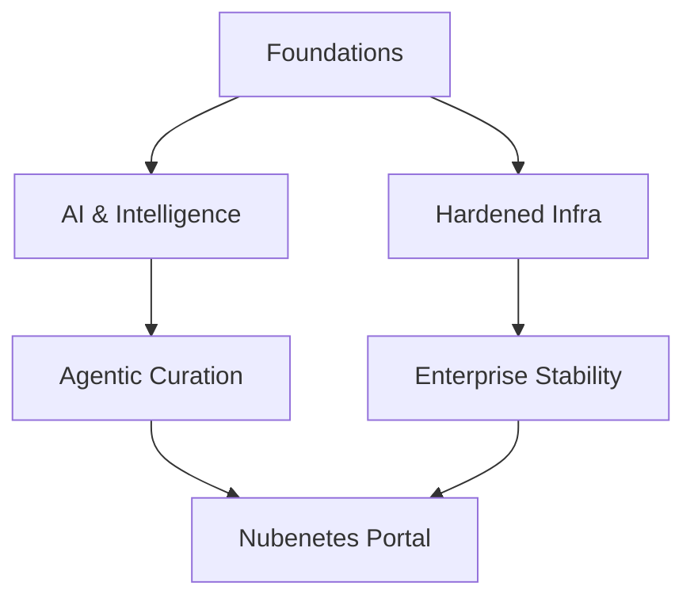

# Introduction. Microservice Architecture. From Java EE To Cloud Native. Openshift VS Kubernetes

!!! info "Architectural Context"
    Detailed reference for Introduction. Microservice Architecture. From Java EE To Cloud Native. Openshift VS Kubernetes in the context of Architectural Foundations.

## Vision 2026

!!! quote "The Evolution of Autonomy"
    From manual curation to agentic intelligence.

### Ecosystem Map

## Application Modernization

### Monolith to Microservices

#### Automated Refactoring

  - **(2023)** [vFunction](https://vfunction.com) [ADVANCED LEVEL]  [COMMUNITY-TOOL] — An advanced, AI-driven application modernization platform designed to refactor monolithic Java applications. Live Grounding verifies that vFunction dynamically tracks codebase interactions and dependency call trees to generate optimal, decoupled microservices.
#### Case Studies

  - **(2021)** [thenewstack.io: vFunction Transforms Monolithic Java to Microservices](https://thenewstack.io/vfunction-transforms-monolithic-java-to-microservices) [ADVANCED LEVEL]  [LEGACY] — Deep-dive case study covering how vFunction automates the decomposition of complex legacy Java application structures into modern cloud-native APIs. Illustrates mapping monolithic complexity to decoupled Domain-Driven Design (DDD) boundaries.
#### Guides

  - **(2021)** [devops.com: Best of 2021 – Transform Legacy Java Apps to Microservices](https://devops.com/transform-legacy-java-apps-to-microservices) [ADVANCED LEVEL]  [LEGACY] — Strategic and tactical guide addressing the decomposition of legacy enterprise Java systems. Emphasizes modern automated refactoring engines to accurately map boundaries, mitigating migration risks while speeding up time-to-production.
## Architecture

### APIs

#### Protocols

  - **(2021)** [nordicapis.com: 5 Protocols For Event-Driven API Architectures 🌟🌟🌟](https://nordicapis.com/5-protocols-for-event-driven-api-architectures) 🌟🌟🌟 [COMMUNITY-TOOL] — Explores five critical protocols enabling asynchronous API communications: WebSockets, Webhooks, REST Hooks, Pub-Sub models, and Server-Sent Events (SSE). Details how eliminating polling reduces compute overhead and saves bandwidth.
### Best Practices

#### EDA

  - **(2023)** [aws.amazon.com: Best practices for implementing event-driven architectures in your organization](https://aws.amazon.com/blogs/architecture/best-practices-for-implementing-event-driven-architectures-in-your-organization) [ADVANCED LEVEL]  [CASE STUDY] [COMMUNITY-TOOL] — A comprehensive enterprise whitepaper on establishing organizational patterns for event-driven environments. Focuses on schema management, dead-letter queue (DLQ) operations, idempotency, and distributed tracing strategies.
### Data Management

#### Patterns

  - **(2022)** [acloudguru.com: Sharing data in the cloud: 4 patterns you should know](https://www.pluralsight.com/resources/blog/business-and-leadership/sharing-data-in-the-cloud-four-patterns-everyone-should-know)  [COMMUNITY-TOOL] — Outlines four distinct cloud-native patterns for shared-data architectures. Evaluates data virtualization, API-driven delivery, direct database sharing, and messaging queues based on security and real-time synchronization requirements.
### Microservices

#### Fundamentals

  - **(2023)** [redis.com: Microservice Architecture Key Concepts](https://redis.io/blog/microservice-architecture-key-concepts)  [COMMUNITY-TOOL] — A comprehensive breakdown of core microservices concepts including bounded contexts, service boundaries, and state isolation. Highlights why Redis is a logical fit for high-speed cache and pub-sub across decoupled domains.
### Patterns (1)

#### EDA (1)

  - **(2023)** [eventstore.com: Service-Oriented Architecture vs Event-Driven Architecture 🌟](https://www.kurrent.io/blog/service-oriented-architecture-vs-event-driven-architecture) 🌟 [COMMUNITY-TOOL] — Comprehensively contrasts the request-response paradigm of traditional SOA with the asynchronous, log-centric model of Event-Driven Architectures. Highlights Event Store and event sourcing patterns for strict audit trails.
  - **(2021)** [equalexperts.com: Event driven architecture: the good, the bad, and the ugly 🌟](https://www.equalexperts.com/blog/tech-focus/event-driven-architecture-the-good-the-bad-and-the-ugly) 🌟 [COMMUNITY-TOOL] — Discusses the practical realities of deploying EDA at scale. Evaluates benefits (decoupling, high performance) against complexities (distributed debugging, out-of-order execution, schema evolution management).
  - **(2017)** [martinfowler.com: What do you mean by “Event-Driven”? 🌟](https://martinfowler.com/articles/201701-event-driven.html) [ADVANCED LEVEL] 🌟 [COMMUNITY-TOOL] — Martin Fowler clarifies the ambiguous term 'Event-Driven'. Outlines four distinct patterns: Event Notification, Event-Carried State Transfer, Event Sourcing, and CQRS, detailing their operational advantages and pain points.
  - **(2023)** [dev.to/aws-builders: Un Modelo de EDA: Event Driven Architectures](https://dev.to/aws-builders/un-modelo-de-eda-event-driven-architectures-4d9f) [SPANISH CONTENT]  [COMMUNITY-TOOL] — Una guía detallada sobre cómo implementar arquitecturas dirigidas por eventos (EDA) utilizando servicios nativos de AWS como EventBridge, SNS, SQS y Lambda para lograr un desacoplamiento de componentes de backend robusto.
#### Evolution

  - **(2023)** [designgurus.io: Monolithic vs. Service-Oriented vs. Microservice Architecture: Top Architectural Design Patterns](https://www.designgurus.io/blog/monolithic-service-oriented-microservice-architecture)  [COMMUNITY-TOOL] — Compares monolithic systems, Enterprise Service Bus (ESB)-based SOAs, and decoupled microservices. Identifies modern trade-offs such as operational complexity, deployment velocity, and distributed transaction management.
#### Monoliths

  - **(2023)** [devops.com: 8 Hot Takes: Will We See a Monolithic Renaissance?](https://devops.com/8-hot-takes-will-we-see-a-monolithic-renaissance)  [COMMUNITY-TOOL] — Discusses the potential return to macro-services or modular monoliths to address the operational overhead, network latency, and complex debugging of over-engineered microservice fleets.
#### Twelve-Factor App

  - **(2023)** [architecturenotes.co: 12 Factor App Revisited](https://architecturenotes.co/p/12-factor-app-revisited)  [COMMUNITY-TOOL] — Critically evaluates how classic 12-Factor concepts have aged. Addresses the challenges of serverless scaling, API-first interfaces, distributed telemetry, and modern build/release pipelines.
  - **(2021)** [opensource.com: An open source developer's guide to 12-Factor App methodology](https://opensource.com/article/21/11/open-source-12-factor-app-methodology) [GUIDE]  [COMMUNITY-TOOL] [GUIDE] — Analyzes the application of 12-Factor methodology to open-source project standards. Highlights maintaining statelessness, dependency isolation, and configuration separation to simplify multi-environment testing and distribution.
### SaaS

#### Multi-Tenancy

  - **(2023)** [blog.scaleway.com: SaaS Solutions - What is the difference between a multi-instance and a multi-tenant architecture](https://www.scaleway.com/en/blog/saas-multi-tenant-vs-multi-instance-architectures)  [COMMUNITY-TOOL] — Compares multi-instance setups (dedicated systems per tenant) against multi-tenant models (shared compute/database with strict software isolation). Examines resource scaling, security boundaries, and noisy neighbor challenges.
### Technical Debt

#### Microservices (1)

  - **(2022)** [infoq.com: Managing Technical Debt in a Microservice Architecture](https://www.infoq.com/articles/managing-technical-debt-microservices) [ADVANCED LEVEL]  [COMMUNITY-TOOL] — Investigates the specific vectors of technical debt in microservices, including library drift, API versioning overhead, and domain-model fragmentation. Offers architectural rules of thumb to control distributed sprawl.
#### Orchestration

  - **(2021)** [stackoverflow.blog: Using Kubernetes to rethink your system architecture and ease technical debt 🌟](https://stackoverflow.blog/2021/05/19/rethinking-system-architecture-can-kubernetes-help-to-solve-rewrite-anxiety) 🌟 [LEGACY] — Discusses utilizing a migration to Kubernetes as a strategic catalyst to refactor legacy monoliths. Reorganizes monolithic systems into decoupled containers, successfully lowering long-term architectural tech debt.
### Web Applications

#### Enterprise Patterns

  - **(2025)** [Enterprise Web App Patterns - Azure Architecture Center](https://learn.microsoft.com/en-us/azure/architecture/web-apps/guides/enterprise-app-patterns/overview) [NONE CONTENT] [DOCUMENTATION]  [COMMUNITY-TOOL] — Production-proven patterns and implementation pathways from the Azure Architecture Center. Establishes migration guidelines for modernizing monolithic applications into elastic web architectures.
## Architecture Patterns

### Microservices (2)

#### Cloud-Native Infrastructure

  - **(2022)** [techerati.com: Microservices in the Cloud-Native Era](https://www.techerati.com/features-hub/microservices-in-the-cloud-native-era) [ADVANCED LEVEL]  [COMMUNITY-TOOL] — Explores the strategic paradigm shift toward microservices as the de facto structural archetype for scalable cloud platforms. It dissects operational complexities including traffic routing, discovery mechanisms, and failure domain containment through circuit-breakers. A vital read for architects planning monolithic-to-microservices migrations under modern Kubernetes-centric infrastructures.
## Artificial Intelligence and ML

### Machine Learning Engineering

#### Python Ecosystem

  - **(2021)** [sloboda-studio.com: Python Tools for Machine Learning](https://sloboda-studio.com/blog/python-tools-for-machine-learning)  [COMMUNITY-TOOL] — Overview of essential Python machine learning libraries and toolchains. Details NumPy, Pandas, Scikit-Learn, and TensorFlow integration patterns, showing developers how to bridge data science models with scalable microservices runtimes.
## Business Architecture

### Digital Transformation

#### Cultural Dynamics

  - **(2020)** [lavanguardia.com: Por qué la transformación digital es mentira 🌟](https://www.lavanguardia.com/economia/20201014/484036217179/transformacion-digital-empresas-foncillas-pf-video-seo-lv.html) [SPANISH CONTENT] 🌟🌟🌟 [COMMUNITY-TOOL] — Un análisis crítico sobre las falacias que rodean el concepto de 'transformación digital' en el mundo corporativo. El autor argumenta que la tecnología por sí sola no arregla procesos rotos, señalando que el verdadero cambio radica en la reestructuración cultural y la optimización organizativa.
### Organizational Structure

#### DevOps Culture

  - **(2020)** [thenewstack.io: Study: Silos Are the Chief Impediment to IT and Business Value](https://thenewstack.io/study-silos-are-chief-impediment-to-it-and-business-value) 🌟🌟🌟 [COMMUNITY-TOOL] — Analyzes survey data proving how organizational and technological silos directly impede software delivery velocity and downstream business value. Argues that introducing modern container technology without breaking down departmental silos leads to failed platform transformations.
## Career Development

### Architect Strategy

#### Skillsets

  - **(2022)** [redhat.com: 5 strategies to shift your career from sysadmin to architect](https://www.redhat.com/en/blog/from-sysadmin-to-architect)  [COMMUNITY-TOOL] — Maps professional development strategies for system administrators transitioning to IT architect roles. Emphasizes system-level thinking, mastering cloud-native paradigms, understanding business metrics, and cultivating strong communication skills.
## Cloud Architecture

### Cloud Strategy

#### Design Anti-patterns

??? note "infoworld.com: 3 cloud architecture mistakes we all make, but shouldn't"
    **[Access Resource](https://www.infoworld.com/article/2264771/3-cloud-architecture-mistakes-we-all-make-but-shouldnt.html)** 🌟🌟🌟🌟 | Level: Intermediate
    
    Highlights three widespread cloud engineering anti-patterns: lift-and-shift migration without modernization, ignoring structural egress cost-profiles, and blindly utilizing proprietary managed services that lead to irreversible vendor lock-in.

#### Migration Methodology

??? note "cloudpundit.com: Don’t boil the ocean to create your cloud 🌟"
    **[Access Resource](https://cloudpundit.com/2020/09/22/dont-boil-the-ocean-to-create-your-cloud)** 🌟🌟🌟🌟 | Level: Intermediate
    
    Advocates for an incremental, pragmatic approach to cloud migration and platform construction. Warns against the architectural antipattern of designing an overengineered, all-encompassing private or public cloud solution on day one instead of starting with minimal viable platforms.

??? note "thenewstack.io: Prepare to Adopt the Cloud: A 10-Step Cloud Migration Checklist 🌟"
    **[Access Resource](https://thenewstack.io/prepare-to-adopt-the-cloud-a-10-step-cloud-migration-checklist)** 🌟🌟🌟🌟 | Level: Intermediate
    
    A comprehensive operational checklist for transitioning enterprise applications to public cloud systems. Key steps encompass assessing application dependencies, cost-modeling, security boundaries, containerization feasibility, and shifting deployment pipelines to modern CI/CD tooling.

### Cloud-Native

#### Design Patterns

  - **(2020)** [capstonec.com: You Will Love These Cloud-native App Architecture Patterns 🌟](https://capstonec.com/2020/10/08/cloud-native-app-architecture-patterns)  [COMMUNITY-TOOL] — Investigates key structural patterns that define modern cloud-native systems, focusing on twelve-factor application rules, API-first delivery, resilient circuit breakers, and decoupling persistent storage systems from execution units.
### Hybrid Cloud Strategy

#### Market Trends

  - **(2021)** [enterprisersproject.com: 5 hybrid cloud trends to watch in 2021](https://enterprisersproject.com/article/2021/1/5-hybrid-cloud-trends-2021) 🌟🌟🌟 [COMMUNITY-TOOL] — Identifies key industry shifts in the hybrid and multi-cloud landscape, focusing on managed hybrid control planes, unified security tooling, and the integration of edge environments with central public cloud architectures to meet data compliance requirements.
### Migration

#### Hands-On

  - **(2022)** [acloudguru.com: 3 ways to practice migrating workloads to the cloud](https://www.pluralsight.com/resources/blog/cloud/3-ways-to-practice-migrating-workloads-to-the-cloud)  [COMMUNITY-TOOL] — Provides instructional path frameworks for developers looking to gain hands-on migration experience. Focuses on setting up mock environments, replicating on-premise infrastructure in sandboxes, and utilizing provider-native migration automation tools.
#### Methodology

  - **(2021)** [blog.pragmaticengineer.com: Migrations Done Well: Typical Migration Approaches](https://blog.pragmaticengineer.com/typical-migration-approaches) [ADVANCED LEVEL]  [COMMUNITY-TOOL] — Written by Gergely Orosz, this deep-dive highlights technical planning and execution strategies for complex system migrations. Discusses mitigating dual-write issues, rollback preparations, and incremental phased cutovers to manage operational risk.
#### Strategies

  - **(2021)** [forbes.com: 3 Approaches To A Better Cloud Migration](https://www.forbes.com/sites/googlecloud/2021/10/27/3-approaches-to-a-better-cloud-migration)  [COMMUNITY-TOOL] — Synthesizes high-level corporate strategies for executing cloud migrations. It contrasts rehosting (lift-and-shift), platform optimization (replatforming), and cloud-native rebuilding (refactoring) along security, speed, and cost parameters.
### Modernization

#### Reactive Systems

  - **(2022)** [lightbend.com: From Java EE To Cloud Native: The End Of The Heavyweight Era 🌟](https://akka.io) [ADVANCED LEVEL]  [COMMUNITY-TOOL] — Lightbend presents the transition of traditional Java enterprise architectures to reactive, cloud-native frameworks (like Akka/Pekko). Evaluates high-concurrency patterns, asynchronous messaging, and horizontal scale-out benefits over synchronous architectures.
### Multi-Cloud Strategy

#### Data Management (1)

??? note "thenewstack.io: The 4 Definitions of Multicloud: Part 1 — Data Portability"
    **[Access Resource](https://thenewstack.io/the-4-definitions-of-multicloud-part-1-data-portability)** 🌟🌟🌟🌟 | Level: Advanced
    
    Evaluates the concept of data portability within multi-cloud configurations. Focuses on the architectural mechanisms of synchronizing state across varying proprietary cloud databases, minimizing network egress latency, and utilizing modern cloud-native storage interfaces (CSI) for storage flexibility.

#### Network and Security

??? note "thenewstack.io: Multicloud Challenges and Solutions"
    **[Access Resource](https://thenewstack.io/multicloud-challenges-and-solutions)** 🌟🌟🌟🌟 | Level: Advanced
    
    Details the immense architectural friction points of multi-cloud setups, from inconsistent IAM paradigms and distinct networking topologies to high egress fees. Reviews operational abstractions like cross-cloud controllers and unified policy management to reconcile these differences.

#### Resilience Patterns

??? note "thenewstack.io: Multicloud Paves the Way for Cloud Native Resiliency Models"
    **[Access Resource](https://thenewstack.io/multicloud-paves-the-way-for-cloud-native-resiliency-models)** 🌟🌟🌟🌟 | Level: Advanced
    
    Examines how a multi-cloud topology acts as the ultimate disaster recovery tier for highly critical modern platforms. Analyzes how active-active deployments across distinct public cloud providers mitigate regional or cloud-wide service provider outages.

### Private Cloud

#### Hybrid Cloud Strategy (1)

  - **(2020)** [thenewstack.io: Are Private Clouds Proliferating?](https://thenewstack.io/google-and-oracle-cloud-adoption-doubles-among-enterprises-3) 🌟🌟🌟 [COMMUNITY-TOOL] — Examines enterprise hybrid cloud data, highlighting why many organizations continue to maintain, build, or modernize private clouds alongside public cloud footprints. Looks at compliance, data sovereignty, predictable workloads, and hybrid architectures (e.g. Anthos, Outposts).
### Professional Development

#### Career Engineering

  - **(2020)** [ituser.es: Las principales habilidades que un arquitecto cloud necesita para triunfar](https://www.ituser.es/opinion/2020/07/las-principales-habilidades-que-un-arquitecto-cloud-necesita-para-triunfar) [SPANISH CONTENT] 🌟🌟🌟 [COMMUNITY-TOOL] — Analiza las competencias técnicas e interpersonales críticas para un arquitecto cloud en el panorama empresarial moderno. Destaca la necesidad de dominar no solo arquitecturas multinube, automatización con IaC y seguridad, sino también habilidades de comunicación para traducir decisiones tecnológicas en valor de negocio.
### Strategy

#### Multi-Cloud Benefits

  - **(2021)** [softwebsolutions.com: Why enterprises need to adopt a multi-cloud strategy](https://www.softwebsolutions.com/resources/multi-cloud-adoption-strategy)  [COMMUNITY-TOOL] — Discusses the business and technical drivers for enterprise multi-cloud adoption, including risk mitigation, disaster recovery, avoiding vendor lock-in, and optimizing workloads across disparate public cloud provider environments.
#### Multi-Cloud Decisions

  - **(2021)** [architectelevator.com: Multi Cloud Architecture: Decisions and Options](https://architectelevator.com/cloud/hybrid-multi-cloud) [ADVANCED LEVEL]  [COMMUNITY-TOOL] — Analyses strategic multi-cloud architectural decisions. Gregor Hohpe presents frameworks to distinguish between cloud integration, portability, and distribution, highlighting that multi-cloud should be a deliberate architectural choice rather than a default risk-mitigation strategy.
## Cloud Architecture and Infrastructure Strategy

### Application Design

#### Horizontal Scaling

??? note "yellow.systems: How to Make a Scalable Web Application: Architecture, Technologies, Cost 🌟"
    **[Access Resource](https://yellow.systems/blog/how-to-build-a-scalable-web-application)** 🌟🌟🌟🌟 | Level: Intermediate
    
    A holistic technical guide detailing architectural design patterns necessary to construct web systems capable of scaling to high volumes of traffic. Covers backend optimization, load balancing configurations, database sharding, caching layers, and the architectural shift from single-instance services to highly available distributed designs.

#### System Design Patterns

??? note "bytebytego.com: System Design - Scale From Zero To Millions Of Users 🌟"
    **[Access Resource](https://bytebytego.com/courses/system-design-interview/scale-from-zero-to-millions-of-users)** 🌟🌟🌟🌟🌟 | Level: Intermediate
    
    A structured breakdown of modern system scaling, illustrating how a single database configuration evolves into a multi-tiered global architecture. Covers key mechanics like database replication, global CDN routing, horizontal scaling of stateless application nodes, and distributed cache deployment.

### Cost Optimization and FinOps

#### Efficiency Bottlenecks

??? note "zesty.co: 10 Cloud Deficiencies You Should Know"
    **[Access Resource](https://zesty.co/blog/10-cloud-deficiencies)** 🌟🌟🌟🌟 | Level: Intermediate
    
    Highlights ten widespread cloud configuration deficiencies including over-provisioning of EBS volumes, orphaned compute instances, and poor auto-scaling metrics. Outlines practical mitigations for cloud-cost inflation (FinOps) and suboptimal performance caused by rigid resource constraints.

### Deployment Models

#### Comparison

  - **(2022)** [acloudguru.com: Public cloud vs private cloud: What’s the difference? 🌟](https://www.pluralsight.com/resources/blog/business-and-leadership/public-cloud-vs-private-cloud-whats-the-difference) 🌟🌟🌟 [COMMUNITY-TOOL] — Demystifies the core operational, fiscal, and regulatory distinctions between public and private cloud models. The article provides a structured baseline for cloud engineering teams to evaluate infrastructure capital expenditures (CapEx) against operational expenditures (OpEx) based on resource control needs.
#### Hybrid and Private Cloud

??? note "thenewstack.io: Private vs. Public Cloud: How Kubernetes Shifts the Balance"
    **[Access Resource](https://thenewstack.io/private-vs-public-cloud-how-kubernetes-shifts-the-balance)** 🌟🌟🌟🌟 | Level: Intermediate
    
    Analyzes the architectural shift enabled by Kubernetes in bridging the gap between private and public cloud environments. By decoupling applications from underlying infrastructure, Kubernetes acts as an abstraction layer that permits consistent deployments across heterogeneous footprints, optimizing operational costs and security posture.

### High Availability

#### Core Patterns

??? note "towardsdatascience.com: 3 High Availability Cloud Concepts You Should Know"
    **[Access Resource](https://towardsdatascience.com/3-high-availability-cloud-concepts-you-should-know-93f3bab2cb4a)** 🌟🌟🌟🌟 | Level: Intermediate
    
    Explores three fundamental high-availability cloud strategies: active-active vs active-passive configurations, geo-redundant database replication, and zero-downtime DNS-routed failovers. Discusses mathematical SLA models and network traffic planning required to achieve high service uptime.

### Market Trends (1)

#### Open Source Business Models

  - **(2022)** [websiteplanet.com: What’s Open Source Software + How It Makes Money 2022](https://www.websiteplanet.com/blog/what-is-open-source-software/?geo=us&device=desktop) 🌟🌟🌟 [COMMUNITY-TOOL] — Details the monetization mechanics driving open-source software (OSS) ecosystems, covering models like open-core, dual-licensing, and cloud hosting. Helps engineering leaders assess the long-term sustainability and licensing risks associated with critical software dependencies.
### Migration and Modernization

#### Enterprise Solutions

??? note "deloitte.com/de: EMEA Center of Excellence for Application Modernization and Migration"
    **[Access Resource](https://www.deloitte.com/de/de/services/consulting/services/center-of-excellence-application-modernization.html)** 🌟🌟🌟🌟 | Level: Intermediate
    
    Details the strategy of Deloitte's EMEA Center of Excellence for enterprise application modernization. Explains how consulting frameworks assess legacy codebases, evaluate migration paths, and apply cloud-native solutions to modernize large-scale systems.

#### Planning Resources

??? note "simform.com: Cloud Migration ebook"
    **[Access Resource](https://www.simform.com/cloud-migration-ebook)** 🌟🌟🌟🌟 | Level: Intermediate
    
    A programmatic playbook detailing the methodologies of migrating legacy infrastructure into public or hybrid cloud topologies. It maps the standard 'R' migration frameworks (Rehost, Replatform, Refactor, etc.), evaluating execution risks, database cutover strategies, and cost-modeling paradigms.

### Modern Architectural Paradigms

#### MACH Architecture

??? note "thenewstack.io: Transform and Future-Proof Your Architecture with MACH"
    **[Access Resource](https://thenewstack.io/transform-and-future-proof-your-architecture-with-mach)** 🌟🌟🌟🌟 | Level: Intermediate
    
    Introduces MACH (Microservices, API-first, Cloud-native, Headless) as a modern enterprise blueprint for agile digital experience platforms. This modular paradigm allows businesses to scale individual pieces independently, facilitating seamless integrations and preventing monolithic vendor lock-in.

### Multi-Cloud Strategy (1)

#### Architecture Designs

??? note "simform.com: 6 Multi-Cloud Architecture Designs for an Effective Cloud Strategy 🌟"
    **[Access Resource](https://www.simform.com/blog/multi-cloud-architecture)** 🌟🌟🌟🌟🌟 | Level: Advanced
    
    Evaluates six distinct multi-cloud topologies including Multi-Cloud Disaster Recovery, Cloud-to-Cloud Federation, and Split-Brain architectures. The guide explains practical ingress routing, state synchronization, and database replication patterns needed to sustain highly resilient, cross-cloud operations.

#### Architecture Planning

??? note "simform.com: What is Multi Cloud? Why you Need a Multi Cloud Strategy?"
    **[Access Resource](https://www.simform.com/blog/multi-cloud-strategy)** 🌟🌟🌟🌟 | Level: Intermediate
    
    Decouples the business and technical drivers of multi-cloud architectures, focusing on risk mitigation, vendor lock-in avoidance, and geographical redundancy. The guide contrasts hybrid deployments with multi-cloud topologies to establish clear decision matrices for technical architects.

#### Business Drivers

  - **(2022)** [thenewstack.io: Reasons to Opt for a Multicloud Strategy](https://thenewstack.io/reasons-to-opt-for-a-multicloud-strategy) 🌟🌟🌟 [COMMUNITY-TOOL] — Outlines key operational drivers supporting a deliberate multi-cloud migration strategy, centering on geographic expansion, regional regulatory mandates, and optimized billing leverage. The resource emphasizes treating multi-cloud as a strategic framework to optimize application delivery across diverse vendor strengths.
## Cloud Infrastructure

### Automation

#### Concepts

  - **(2021)** [thenewstack.io: What Is Cloud Automation and How Does It Benefit IT Teams? 🌟](https://thenewstack.io/what-is-cloud-automation-and-how-does-it-benefit-it-teams)  [COMMUNITY-TOOL] — Demystifies cloud automation paradigms, describing how automated resource provisioning, scaling, and configuration reduce operational overhead and human error. Key focus is placed on programmatic API orchestration and infrastructure-as-code.
### DevOps

#### Infrastructure Abstraction

  - **(2021)** [devops.com: Infrastructure Abstraction Will Be Key to Managing Multi-Cloud](https://devops.com/infrastructure-abstraction-will-be-key-to-managing-multi-cloud) [ADVANCED LEVEL]  [COMMUNITY-TOOL] — Explores how infrastructure-as-code (IaC) and Kubernetes-driven abstraction layers decouple workloads from underlying cloud provider primitives. This design pattern reduces complexity, minimizes lock-in, and enforces consistent deployment methodologies.
### Hybrid Cloud

#### Management Tools

  - **(2022)** [redhat.com: 5 essential tools for managing hybrid cloud infrastructure](https://www.redhat.com/en/blog/hybrid-cloud-management-tools)  [COMMUNITY-TOOL] — Identifies key categories and frameworks necessary for coordinating multi-cluster and hybrid environments. Emphasizes unified control planes, configuration management tools like Ansible, orchestration tools, and automated security scanning to maintain posture consistency.
### Kubernetes

#### Container Patterns

  - **(2021)** [itnext.io: 4 Design Patterns for Containers in Kubernetes | Daniele Polencic 🌟](https://itnext.io/4-container-design-patterns-for-kubernetes-a8593028b4cd) [ADVANCED LEVEL]  [COMMUNITY-TOOL] — Discusses key container design patterns within Kubernetes pods, highlighting sidecars, adapters, and ambient patterns. It details how sidecar containers decouple infrastructure utilities (such as logging and service mesh proxies) from main application runtimes.
#### OpenShift

  - **(2018)** [thestack.com: OpenShift in a world of KaaS 🌟](https://techerati.com/the-stack-archive/cloud/2018/10/18/openshift-in-a-world-of-kaas) [ADVANCED LEVEL]  [COMMUNITY-TOOL] — Evaluates Red Hat OpenShift's standing in an increasingly crowded Kubernetes-as-a-Service (KaaS) market. Details the architectural advantages of OpenShift's integrated developer tooling, security guardrails, and automated enterprise operator systems.
#### OpenShift Comparison

  - **(2023)** [ibm.com: OpenShift vs. Kubernetes: What’s the Difference?](https://www.ibm.com/think/topics/openshift-vs-kubernetes)  [COMMUNITY-TOOL] — An authoritative IBM reference contrasting standard Kubernetes and OpenShift. Explains how OpenShift encapsulates the vanilla Kubernetes engine with operational defaults, security governance, and multi-tenant tooling suitable for hybrid cloud environments.
  - **(2021)** [phoenixnap.com: Kubernetes vs OpenShift: Key Differences Compared 🌟](https://phoenixnap.com/blog/openshift-vs-kubernetes)  [COMMUNITY-TOOL] — Breaks down core differences between vanilla Kubernetes and Red Hat OpenShift, evaluating deployment mechanics, security configurations (SCC vs RBAC), built-in routing, out-of-the-box monitoring, and support models.
  - **(2021)** [simplilearn.com: Understanding The Difference Between Kubernetes Vs. Openshift](https://www.simplilearn.com/kubernetes-vs-openshift-article)  [COMMUNITY-TOOL] — An educational comparison detailing the architectural boundaries of Kubernetes and OpenShift. Explores developer workflows, installation processes, built-in CI/CD pipelines, and licensing structures.
  - **(2019)** [spec-india.com: Kubernetes VS Openshift (July 23rd 2019)](https://www.spec-india.com/blog)  [COMMUNITY-TOOL] — Compares upstream open-source Kubernetes with Red Hat OpenShift. Focuses on user-interface options, CLI differences, security policies, image registry capabilities, and integrated CI/CD toolchain setups in enterprise deployments.
## Cloud Infrastructure and Orchestration

### Public Cloud Administration

#### AWS Fundamentals

  - **(2023)** [AWS Cloud Practitioner - Curso Completo 2023](https://www.youtube.com/watch?v=zQyrhjEAqLs) [SPANISH CONTENT]  [COMMUNITY-TOOL] — Comprehensive Spanish instructional syllabus targeting the AWS Certified Cloud Practitioner domain. Details key global infrastructure components, core services (EC2, S3, RDS, VPC), billing architectures, and foundational security frameworks.
## Cloud Native and Kubernetes Core

### Business Value and ROI

#### Operational Automation

  - **(2021)** [theregister.com: How Kubernetes lowers costs and automates IT department work](https://www.theregister.com/software/2021/12/21/how-kubernetes-lowers-costs-and-automates-it-department-work/1316708) 🌟🌟🌟 [LEGACY] — Evaluates the cost-efficiency and performance benefits of transitioning IT operations from legacy VMs to Kubernetes-orchestrated workloads. Examines auto-scaling, bin-packing, and automated operations as primary factors for decreasing infrastructural and labor expenditures.
### Container Orchestration

#### Deep Dive

??? note "alibabacloud.com: Getting Started with Kubernetes | Deep Dive into Kubernetes Core Concepts"
    **[Access Resource](https://www.alibabacloud.com/blog/getting-started-with-kubernetes-%7C-deep-dive-into-kubernetes-core-concepts_595896)** 🌟🌟🌟🌟 | Level: Advanced
    
    Deep dive into core Kubernetes architectures, detailing controller-manager reconciliation mechanisms, kube-scheduler filters, and API-driven status updates. Provides a technical reference for engineers wanting to design resource control loops and manage standard system interactions.

#### Fundamentals (1)

??? note "weave.works: What is a Kubernetes Cluster? 🌟"
    **[Access Resource](https://www.weave.works/blog/kubernetes-cluster)** 🌟🌟🌟🌟 | Level: Beginner
    
    Details the core elements forming a Kubernetes cluster, covering worker nodes, control plane systems (etcd, scheduler, API server), and pod networking. Explains how these interconnected components synchronize state to ensure continuous deployment consistency.

#### Future Outlook

??? note "eficode.com: The future of Kubernetes – and why developers should look beyond Kubernetes in 2022"
    **[Access Resource](https://www.eficode.com/blog/the-future-of-kubernetes-and-why-developers-should-look-beyond-kubernetes-in-2022)** 🌟🌟🌟🌟 | Level: Intermediate
    
    Investigates the evolutionary curve of Kubernetes, arguing that developers should interface with high-level platform abstractions rather than direct cluster resources. Focuses on tools that simplify the developer workflow, keeping Kubernetes in the background as a dedicated execution runtime.

#### Orchestrator Comparison

??? note "nathanpeck.com: Why should I use an orchestrator like Kubernetes, Amazon ECS, or Hashicorp Nomad?"
    **[Access Resource](https://nathanpeck.com/why-should-use-container-orchestration)** 🌟🌟🌟🌟🌟 | Level: Intermediate
    
    Compares core orchestrators—Kubernetes, Amazon ECS, and HashiCorp Nomad—to clarify fit based on team expertise and operational scale. Outlines how orchestration solves key deployment needs such as bin-packing, cluster autoscaling, high-availability routing, and health checks.

#### Platform Engineering

??? note "thenewstack.io: Kubernetes and the Next Generation of PaaS"
    **[Access Resource](https://thenewstack.io/kubernetes-and-the-next-generation-of-paas)** 🌟🌟🌟🌟 | Level: Advanced
    
    Explores how Kubernetes acts as a core engine for modern Platform-as-a-Service (PaaS) engines, giving developers streamlined deployment controls without underlying cloud complexity. Discusses custom resource definitions (CRDs) and operators as tools for generating customized cloud abstraction layers.

### Market Trends (2)

#### Adoption Analytics

??? note "infoworld.com: Kubernetes adoption up, serverless down, developer survey says"
    **[Access Resource](https://www.infoworld.com/article/2271482/kubernetes-up-serverless-down-report.html)** 🌟🌟🌟🌟 | Level: Intermediate
    
    Examines empirical metrics demonstrating increased Kubernetes adoption alongside stagnant serverless framework growth. Highlights developer preference for containerized control, local reproducibility, and standardized deployment patterns over vendor-proprietary, event-driven serverless platforms.

#### Ecosystem Evolution

??? note "thenewstack.io: 5 Cloud Native Trends to Watch out for in 2022"
    **[Access Resource](https://thenewstack.io/5-cloud-native-trends-to-watch-out-for-in-2022)** 🌟🌟🌟🌟 | Level: Advanced
    
    Outlines five major architectural developments in cloud-native technology, highlighting eBPF-powered networking, WebAssembly (Wasm) runtime integration, and GitOps-centric deployment. Serves as a useful compass for aligning next-generation enterprise platforms with emerging standards.

### Migration and Modernization (1)

#### Anti-Patterns

??? note "infoq.com: 9 Ways to Fail at Cloud Native"
    **[Access Resource](https://www.infoq.com/presentations/fail-cloud-native-migration)** 🌟🌟🌟🌟 | Level: Advanced
    
    Identifies common organizational and architectural pitfalls encountered during cloud-native migrations, such as lifting-and-shifting legacy patterns directly into containers. Stresses the necessity of cultivating a DevOps culture, standardizing platforms, and focusing on cloud-native application patterns.

#### Workload Transition

??? note "thenewstack.io: App Modernization: 5 Tips When Migrating to Kubernetes"
    **[Access Resource](https://thenewstack.io/app-modernization-5-tips-when-migrating-to-kubernetes)** 🌟🌟🌟🌟 | Level: Intermediate
    
    Distills five high-impact operational guidelines for migrating application structures onto Kubernetes. Focuses on the elimination of hardcoded states, configuring robust health probes (liveness/readiness), configuring standard resource limits, and configuring external config parameters.

### Testing and Reliability

#### Control Plane Validation

??? note "micahlerner.com: Automatic Reliability Testing For Cluster Management Controllers"
    **[Access Resource](https://www.micahlerner.com/2022/07/24/automatic-reliability-testing-for-cluster-management-controllers.html)** 🌟🌟🌟🌟 | Level: Advanced
    
    Examines methods for testing Kubernetes-style controllers using fault-injection framework principles (e.g., Sieve). Details how injecting errors, API delays, and container crashes validates the reliability of reconciliation engines, ensuring robust system recovery in production.

### Virtualization and Containers

#### Architecture Comparison

??? note "community.hpe.com: Containers vs. VMs: What’s the difference?"
    **[Access Resource](https://community.hpe.com/hpeb/plugins/custom/hp/hpebresponsive/custom.bounce_endpoint?referer=https%3A%2F%2Fcommunity.hpe.com%2Ft5%2FHPE-Ezmeral-Uncut%2FContainers-vs-VMs-What-s-the-difference%2Fba-p%2F7147090)** 🌟🌟🌟🌟 | Level: Beginner
    
    Compares hardware-level hypervisor virtualization (VMs) against kernel-level OS virtualization (Containers). The analysis targets engineering constraints around performance, boot speeds, immutable deployment architectures, and compute efficiency, aiding architects in selecting virtualization tiers.

#### Container Anti-patterns

??? note "howtogeek.com: When Not to Use Docker: Cases Where Containers Don’t Help 🌟"
    **[Access Resource](https://www.howtogeek.com/devops/when-not-to-use-docker-cases-where-containers-dont-help)** 🌟🌟🌟🌟 | Level: Beginner
    
    Identifies scenarios where containerization introduces unnecessary complexity without providing distinct technical or operational benefits. Analyzes drawbacks for monoliths, GUI-heavy desktop programs, static legacy systems, or performance-critical processes requiring bare-metal host communication.

#### Modernization Strategy

??? note "cloud.redhat.com: How to Modernize Virtualized Workloads 🌟"
    **[Access Resource](https://www.redhat.com/en/blog/how-to-modernize-virtualized-workloads)** 🌟🌟🌟🌟 | Level: Intermediate
    
    Guides enterprise architects through modernizing traditional VM-based applications into containerized architectures using tools like OpenShift Virtualization (KubeVirt). This allows running legacy virtual machines side-by-side with cloud-native containers inside a unified Kubernetes environment.

## Cloud Native Architecture

### Containerization

#### Kubernetes (1)

  - **(2018)** [developers.redhat.com: Why Kubernetes is The New Application Server](https://developers.redhat.com/blog/2018/06/28/why-kubernetes-is-the-new-application-server) [NONE CONTENT]  [COMMUNITY-TOOL] — This guide analyzes the transition from traditional enterprise application servers (like JBoss or WebSphere) to Kubernetes. It positions Kubernetes as the modern application server, handling routing, state management, and lifecycle patterns natively.
### Design Patterns (1)

#### Operators and Sidecars

  - **(2020)** [Operators and Sidecars Are the New Model for Software Delivery](https://thenewstack.io/operators-and-sidecars-are-the-new-model-for-software-delivery) [NONE CONTENT] [ADVANCED LEVEL]  [COMMUNITY-TOOL] — Discusses the architectural shift toward using the Sidecar pattern and Kubernetes Operators as standard software delivery mechanisms. This architecture segregates cross-cutting concerns like proxying, logging, and security away from application logic.
### GitOps

#### Cloud Native Strategy

  - **(2019)** [weave.works: Going Cloud Native: 6 essential things you need to know](https://www.weave.works/technologies/going-cloud-native-6-essential-things-you-need-to-know) [NONE CONTENT]  [COMMUNITY-TOOL] — Weave Works lays out six core pillars for going cloud native, focusing on containerization, declarative state management, and GitOps workflows to establish efficient deployment setups.
### Microservices (3)

#### Enterprise Solutions (1)

  - **(2020)** [redhat.com: Why choose Red Hat for microservices?](https://www.redhat.com/en/topics/microservices/why-choose-red-hat-microservices) [NONE CONTENT]  [COMMUNITY-TOOL] — A comprehensive evaluation of Red Hat OpenShift and its ecosystem for microservices. It highlights built-in support for service mesh, security boundaries, and hybrid cloud portability as essential elements for enterprise deployments.
### Software Engineering

#### Monoliths (1)

  - **(2023)** [allthingsdistributed.com: Monoliths are not dinosaurs](https://www.allthingsdistributed.com/2023/05/monoliths-are-not-dinosaurs.html) [NONE CONTENT]  [COMMUNITY-TOOL] — Dr. Werner Vogels highlights that monolithic architectures remain highly relevant. The article argues that architectural choices must align with practical business problems rather than dogmatic adherence to microservices patterns.
  - **(2020)** [Monoliths are the future | Kelsey Hightower](https://changelog.com/posts/monoliths-are-the-future) [NONE CONTENT]  [COMMUNITY-TOOL] — Kelsey Hightower advocates for well-structured monolithic applications, challenging the microservices-by-default trend. The case study stresses that organizational discipline and clean boundaries are more important than physical system separation.
## Cloud Native Infrastructure

### Business Architecture (1)

#### Infrastructure Management

  - **(2021)** [addwebsolution.com: How Kubernetes helps businesses manage their IT infrastructure?](https://www.addwebsolution.com/blog/how-kubernetes-helps-businesses-manage-their-it-infrastructure) 🌟🌟🌟 [COMMUNITY-TOOL] — Outlines the business-level value propositions of Kubernetes, including horizontal auto-scaling, resource optimization, and reduced cloud vendor lock-in. It bridges the gap between technical orchestration features and business metrics like accelerated time-to-market and infrastructure cost-efficiency.
#### Value Proposition

  - **(2020)** [weave.works: 6 Business Benefits of Kubernetes](https://www.weave.works/blog/6-business-benefits-of-kubernetes) 🌟🌟🌟 [COMMUNITY-TOOL] — From the creators of GitOps, this analysis frames Kubernetes not just as an engineering luxury but as an enterprise driver. Key features highlighted include multi-cloud flexibility, faster software release cycles, robust self-healing infrastructure, and container-driven resource optimization.
### CNCF Ecosystem

#### Platform Engineering (1)

??? note "thenewstack.io: What is the modern cloud native stack? 🌟🌟"
    **[Access Resource](https://thenewstack.io/what-is-the-modern-cloud-native-stack)** 🌟🌟🌟🌟🌟 | Level: Intermediate
    
    Maps out the components of the modern Cloud Native Computing Foundation (CNCF) stack. From container runtimes (containerd) and orchestration (Kubernetes) to service meshes (Istio/Linkerd) and GitOps deployment paradigms (ArgoCD), this serves as an essential reference architecture.

??? note "thenewstack.io: The Cloud Native Landscape: Platforms Explained"
    **[Access Resource](https://thenewstack.io/cloud-native/the-cloud-native-landscape-platforms-explained)** 🌟🌟🌟🌟 | Level: Intermediate
    
    Demystifies the CNCF cloud-native interactive landscape by categorizing platform layer elements. Distinguishes Kubernetes distributions, managed Kubernetes offerings, private clouds, and application-level platform abstractions (PaaS) to aid enterprise architects in technology selection.

### Containerization (1)

#### Fundamentals (2)

  - **(2020)** [opensource.com: 6 container concepts you need to understand](https://opensource.com/article/20/12/containers-101) 🌟🌟🌟 [COMMUNITY-TOOL] — Demystifies Linux kernel-level container mechanisms by breaking down the core abstractions. Provides clear explanations of namespaces, cgroups, container images, registries, runtimes, and the relationship between containers and virtual machines.
  - **(2021)** [makeuseof.com: hich Container System Should You Use: Kubernetes or Docker?](https://www.makeuseof.com/kubernetes-or-docker) 🌟🌟 [COMMUNITY-TOOL] — Clarifies the common beginner point of confusion comparing Docker with Kubernetes. Explains that Docker is a containerization engine focused on packing and running single application workloads, while Kubernetes is an orchestrator managing fleets of containers across physical resources.
#### Operations Guide

??? note "redhat.com: A sysadmin's guide to containerizing applications"
    **[Access Resource](https://www.redhat.com/en/blog/containerizing-applications)** 🌟🌟🌟🌟 | Level: Intermediate
    
    A highly practical guide detailing how system administrators can containerize legacy workloads. It covers writing clean Containerfiles/Dockerfiles, selecting secure base images, managing non-root execution privileges, and transitioning configuration management to environment variables.

### Industry Standards

#### Market Trends (3)

??? note "thenewstack.io: 3 Reasons Why You Can’t Afford to Ignore Cloud Native Computing 🌟"
    **[Access Resource](https://thenewstack.io/cloud-native/3-reasons-why-you-cant-afford-to-ignore-cloud-native-computing)** 🌟🌟🌟🌟 | Level: Beginner
    
    Highlights the business-critical benefits of transitioning to a cloud-native compute model. Focuses on cloud-provider independence via portable API standards, massive efficiency gains from auto-scaling resources, and drastically improved fault tolerance compared to traditional legacy VMs.

### Kubernetes Orchestration

#### Fundamentals (3)

  - **(2020)** [loves.cloud: Kubernetes: An Introduction](https://loves.cloud/kubernetes-an-introduction) 🌟🌟🌟 [COMMUNITY-TOOL] — Introduces the foundational architecture of Kubernetes, tracing its heritage from Google's internal Borg system to an open-source standard. Explains core concepts such as Pods, Services, Deployments, and the control plane architecture (API Server, etcd, Scheduler, Controller Manager) for bare-metal and cloud migrations.
#### Future Trends

??? note "jaxenter.com: Kubernetes Is Much Bigger Than Containers: Here’s Where It Will Go Next"
    **[Access Resource](https://devm.io/kubernetes/kubernetes-bigger-173675)** 🌟🌟🌟🌟 | Level: Advanced
    
    Position paper explaining how Kubernetes has outgrown its primary definition as a container orchestrator to become the universal cloud operating system. Explains the power of the K8s API model, Custom Resource Definitions (CRDs), and how it is orchestrating non-containerized assets, database clusters, and virtual machines.

#### Industry Standards (1)

??? note "thoughtworks.com: Kubernetes"
    **[Access Resource](https://www.thoughtworks.com/radar/platforms/kubernetes)** 🌟🌟🌟🌟🌟 | Level: Intermediate
    
    A strategic overview from the Thoughtworks Tech Radar detailing the undisputed supremacy of Kubernetes as the container orchestration engine of choice. The entry evaluates the operational realities of adopting K8s, noting that while it is a de facto standard, organizations must watch out for accidental complexity and invest heavily in platform teams.

#### Industry Trends

  - **(2021)** [devprojournal.com: Containers, Kubernetes and Software Development in 2021](https://www.devprojournal.com/technology-trends/kubernetes/containers-kubernetes-and-software-development-in-2021) 🌟🌟🌟 [COMMUNITY-TOOL] — Evaluates market adoption trends of container ecosystems. Discusses how organizations leverage automated container configurations to speed up local testing cycles, isolate software runtimes, and optimize multi-cloud deployment paradigms.
#### Kubernetes Tools

??? note "jaxenter.com: Six Essential Kubernetes Extensions to Add to Your Toolkit 🌟"
    **[Access Resource](https://devm.io/kubernetes/kubernetes-extensions-172215)** 🌟🌟🌟🌟 | Level: Intermediate
    
    Evaluates a curated selection of Kubernetes command-line and cluster-level utilities designed to simplify debugging, manifest inspection, and deployment automation. Highlighting extensions like K9s, Helm, and Kubectl plugins, the article contrasts native Kubernetes CLI limits with accelerated platform-engineering workflows.

#### Multi-Cluster Strategy

??? note "jaxenter.com: Practical Implications for Adopting a Multi-Cluster, Multi-Cloud Kubernetes Strategy"
    **[Access Resource](https://devm.io/kubernetes/kubernetes-practical-implications-171647)** 🌟🌟🌟🌟 | Level: Advanced
    
    Analyzes the operational overhead and architectural patterns of deploying Kubernetes across multiple clusters and cloud providers. It contrasts local management with centralized control planes, emphasizing network topology, storage synchronization, and global load balancing. The guide demonstrates that operational complexity must be carefully traded off against high availability and disaster recovery goals.

#### Platform Engineering (2)

??? note "thenewstack.io: Defining a Different Kubernetes User Interface for the Next Decade"
    **[Access Resource](https://thenewstack.io/defining-a-different-kubernetes-user-interface-for-the-next-decade)** 🌟🌟🌟🌟 | Level: Advanced
    
    Discusses the evolution of the Kubernetes API and the growing necessity for user interfaces that abstract the complex YAML declarations. Explores trends like custom controllers, platform wrappers, and programmatic DSLs to simplify operations for non-expert system developers.

### Professional Development (1)

#### Career Engineering (1)

  - **(2020)** [javarevisited.blogspot.com: Why Every Programmer, DevOps Engineer Should learn Docker and Kubernetes in 2020](https://javarevisited.blogspot.com/2020/11/why-devops-engineer-learn-docker-kubernetes.html) 🌟🌟🌟 [COMMUNITY-TOOL] — Outlines why containerization and container orchestration skills have transitioned from advanced operational specialties to core software development competencies. Highlights the industry-wide ubiquity of Docker and Kubernetes for consistent, reproducible builds across local and cloud environments.
### Technology Assessment

#### Compute Paradigms

??? note "softwareengineeringdaily.com: Kubernetes vs. Serverless with Matt Ward (podcast) 🌟"
    **[Access Resource](https://softwareengineeringdaily.com/2020/12/29/kubernetes-vs-serverless-with-matt-ward-repeat)** 🌟🌟🌟🌟 | Level: Intermediate
    
    A deep-dive podcast discussion analyzing the philosophical and technical tradeoffs between Kubernetes-orchestrated long-running containers and serverless functions. Explores developer velocity, cold starts, operational complexity, and total cost of ownership (TCO) at scale.

## Cloud Native Orchestration

### Platform Comparison

#### OpenShift vs Kubernetes

  - **(2022)** [imaginarycloud.com: OPENSHIFT VS KUBERNETES: WHAT ARE THE DIFFERENCES](https://www.imaginarycloud.com/blog/openshift-vs-kubernetes-differences)  [COMMUNITY-TOOL] — A strategic comparison detailing the core structural and operational differences between upstream Kubernetes and Red Hat OpenShift. This piece evaluates security postures, default configurations, integration constraints, and deployment flexibility, offering architects clear decision criteria.
  - **(2021)** [thenewstack.io: What’s the Difference Between Kubernetes and OpenShift?](https://thenewstack.io/kubernetes/whats-the-difference-between-kubernetes-and-openshift)  [COMMUNITY-TOOL] — This architectural comparison highlights Red Hat's opinionated enterprise extensions built atop vanilla Kubernetes. It details how OpenShift integrates security defaults, built-in container registries, router mechanisms, and lifecycle management controls (OLM) out of the box.
## Data Engineering

### Education

#### Cookbook

  - **(2023)** [cookbook.learndataengineering.com: The Data Engineering Cookbook](https://cookbook.learndataengineering.com/docs/05-CaseStudies) [ADVANCED LEVEL] [GUIDE]  [COMMUNITY-TOOL] [GUIDE] — A comprehensive community cookbook gathering foundational data engineering designs, pipelines, and frameworks. Includes real-world infrastructure and data science architecture case studies, such as processing extreme datasets at CERN.
## DevOps and CICD

### Continuous Integration

#### Developer Experience

??? note "shopify.engineering: Keeping Developers Happy with a Fast CI"
    **[Access Resource](https://shopify.engineering/faster-shopify-ci)** 🌟🌟🌟🌟🌟 | Level: Advanced
    
    A case study from Shopify detailing the infrastructure and engineering effort required to maintain sub-minute continuous integration pipelines for large codebases. Explores parallelization techniques, test selection algorithms, and cache-optimization strategies that scale.

### Microservices (4)

#### Tooling Ecosystem

??? note "hcltech.com: DevOps Tools and Technologies to Manage Microservices 🌟"
    **[Access Resource](https://www.hcltech.com/blogs/devops-tools-and-technologies-manage-microservices)** 🌟🌟🌟🌟 | Level: Intermediate
    
    Maps out the comprehensive tooling stack required to manage complex microservice lifecycles. Details the intersection of build systems, container registries, service meshes, centralized logging (EFK/ELK), and distributed tracing tools (Jaeger) essential for observability.

## DevOps Automation and Modern Systems Engineering

### Automation and Orchestration

#### Operational Efficiency

  - **(2021)** [redhat.com: Use automation to combat your increased workload](https://www.redhat.com/en/blog/automation-combat-increased-workload) 🌟🌟🌟 [COMMUNITY-TOOL] — Focuses on the role of system-wide automation frameworks (e.g., Ansible, Chef) in managing scale complexity within modern engineering groups. Illustrates how automating toil and routine operations reduces human error rate and frees cognitive resources for high-value architecture planning.
### Culture and Roles

#### Systems Administration Evolution

  - **(2021)** [opensource.com: What do we call post-modern system administrators?](https://opensource.com/article/21/7/system-administrators) 🌟🌟🌟 [COMMUNITY-TOOL] — Reflects on the transformation of the system administrator role into Site Reliability Engineering (SRE), Platform Engineering, and DevOps roles. It highlights how infrastructure-as-code, GitOps, and high automation levels have reshaped the operational skills required to maintain state-of-the-art enterprise platforms.
### Infrastructure-as-Code

#### Self-Healing Systems

??? note "thenewstack.io: Intention-as Code: Making Self-Healing Infrastructure Work"
    **[Access Resource](https://thenewstack.io/intention-as-code-making-self-healing-infrastructure-work)** 🌟🌟🌟🌟 | Level: Advanced
    
    Describes the shift from declarative Infrastructure-as-Code to 'Intention-as-Code,' where engineers declare higher-level business expectations and allow self-healing loops to continuously resolve deviations. Explains reconciliation loops within container orchestrators as the foundational model for autonomous infrastructure engines.

### Security and Governance

#### Policy-as-Code

??? note "thenewstack.io: Cloud Engineers Try Policy-as-Code to Cure Misconfiguration Woes"
    **[Access Resource](https://thenewstack.io/cloud-engineers-try-policy-as-code-to-cure-misconfiguration-woes)** 🌟🌟🌟🌟 | Level: Intermediate
    
    Details the growth of Policy-as-Code (PaC) tooling like Open Policy Agent (OPA) and Kyverno in preventing critical cloud misconfigurations before runtime. By integrating deterministic rule engines directly into continuous integration loops, platform engineers enforce compliance and security invariants shift-left.

### Software Engineering Principles

#### Programming Languages

  - **(2021)** [enter.co: Estos son los 10 lenguajes de programación más populares en 2021](https://www.enter.co/especiales/dev/herramientas-dev/estos-son-los-10-lenguajes-de-programacion-mas-populares-en-2021) [SPANISH CONTENT] 🌟🌟🌟 [COMMUNITY-TOOL] — Revisa los lenguajes de programación más influyentes y demandados del año 2021, evaluando su adopción en microservicios, frontend y desarrollo móvil. Ayuda a los equipos de desarrollo a evaluar qué tecnologías garantizan mayor facilidad para contratar talento y compatibilidad de librerías a largo plazo.
#### Technical Debt (1)

  - **(2021)** [xataka.com: La deuda técnica, un lastre para las tecnológicas: un estudio señala que los informáticos pierden casi un día de trabajo a la semana para solventarlas](https://www.xataka.com/pro/deuda-tecnica-lastre-para-tecnologicas-estudio-senala-que-informaticos-pierden-casi-dia-trabajo-a-semana-para-solventarlas) [SPANISH CONTENT] 🌟🌟🌟 [COMMUNITY-TOOL] — Analiza las repercusiones financieras y operativas de la deuda técnica dentro de los equipos de desarrollo modernos, destacando que los ingenieros pierden aproximadamente un día por semana mitigándola. El informe subraya la necesidad de implementar prácticas de refactorización continuas y arquitecturas robustas para mitigar este impacto.
## Distributed Systems

### Consensus

#### Algorithms

  - **(2024)** [The Raft Consensus Algorithm 🌟](https://raft.github.io) [ADVANCED LEVEL]  [COMMUNITY-TOOL] [GUIDE] — An interactive educational visualizer for the Raft Consensus Algorithm, designed to be more understandable than Paxos. Covers leader election, log replication, safety mechanisms, and cluster membership changes in highly consistent databases.
## Edge and IoT Orchestration

### Embedded Software

#### Automotive Systems

  - **(2021)** [spectrum.ieee.org: How Software Is Eating the Car](https://spectrum.ieee.org/software-eating-car)  [COMMUNITY-TOOL] — An industry analysis of software-defined vehicle (SDV) architectures. Investigates how safety-critical embedded frameworks are migrating toward virtualized hardware, container workloads, and modular microservices structures in advanced automotive systems.
## Emerging Technology

### Quantum Computing

#### Fundamentals (4)

  - **(2024)** [cope.es: El ejemplo de 'la moneda' con el que entender cómo funciona un ordenador cuántico: "Será una revolución"](https://www.cope.es/programas/la-linterna/noticias/ejemplo-moneda-con-que-entender-como-funciona-ordenador-cuantico-una-revolucion-20240407_3232557) [SPANISH CONTENT]  [COMMUNITY-TOOL] — Introduce los principios de la computación cuántica de manera accesible mediante la analogía de una moneda girando para ilustrar la superposición. Destaca el impacto potencial de los cúbits frente a la computación clásica.
## Frontend Architecture

### Design Patterns (2)

#### BFF

  - **(2021)** [developers.soundcloud.com: Service Architecture at SoundCloud — Part 1: Backends for Frontends](https://developers.soundcloud.com/blog/service-architecture-1) [ADVANCED LEVEL] [CASE STUDY]  [CASE STUDY] [COMMUNITY-TOOL] — The pioneering engineering case study detailing SoundCloud's development of the Backends-for-Frontends (BFF) pattern. Explains how dedicated, platform-specific API gateways optimize network roundtrips and tailor response payloads for mobile and web clients.
### Microfrontends

#### AWS Serverless

  - **(2021)** [aws.amazon.com: Server-side rendering micro-frontends – UI composer and service discovery](https://aws.amazon.com/blogs/compute/server-side-rendering-micro-frontends-ui-composer-and-service-discovery) [ADVANCED LEVEL]  [COMMUNITY-TOOL] — Proposes a reference architecture for deploying server-side rendered (SSR) micro-frontends on AWS. It uses serverless services like AWS Lambda, Amazon CloudFront, and dynamic composition layers to optimize SEO and page load speeds.
#### Introduction

  - **(2021)** [semaphoreci.com: Microfrontends: Microservices for the Frontend](https://semaphore.io/blog/microfrontends)  [COMMUNITY-TOOL] — Explores extending microservice patterns to client-side presentation layers. Evaluates how microfrontends divide a single web application into independent, decoupled frontend modules maintained by autonomous cross-functional teams.
## Infrastructure

### Cloud Architecture (1)

#### Paradigms

  - **(2021)** [cloudscaling.com: The History of Pets vs Cattle and How to Use the Analogy Properly](https://cloudscaling.com/blog/cloud-computing/the-history-of-pets-vs-cattle)  [COMMUNITY-TOOL] — Unpacks the historical context of the 'Pets vs Cattle' cloud infrastructure analogy. Contrasts bespoke, manually maintained systems (pets) with standardized, automatically rebuilt, and ephemeral containerized node pools (cattle).
### Cloud Financials

#### FinOps

  - **(2023)** [theregister.com: Basecamp details 'obscene' $3.2 million bill that caused it to quit the cloud](https://www.theregister.com/off-prem/2023/01/16/basecamp-details-32-million-bill-that-saw-it-quit-cloud/270397) [ADVANCED LEVEL]  [COMMUNITY-TOOL] — Investigates 37signals' highly publicized exit from AWS public cloud infrastructure. Highlights the architectural transition back to owned bare-metal hardware, showcasing substantial cost reductions and FinOps optimization.
### Legacy

#### Mainframe

  - **(2023)** [elespanol.com: Mainframe: repaso de pasado y futuro a una tecnología de 1944 que se resiste a morir](https://www.elespanol.com/invertia/disruptores/grandes-actores/tecnologicas/20230416/mainframe-repaso-pasado-futuro-tecnologia-resiste-morir/756174490_0.html) [SPANISH CONTENT]  [COMMUNITY-TOOL] — Analiza la longevidad del hardware mainframe y su continua relevancia en el sector financiero y asegurador. Explora cómo las arquitecturas heredadas se integran con nubes híbridas modernas mediante APIs y capas de compatibilidad.
### Virtualization

#### Broadcom Era

  - **(2024)** [thestack.technology: VMware is killing off 56 products amid "tectonic" infrastructure shift](https://www.thestack.technology/vmware-is-killing-off-56-products-including-vsphere-hypervisor-and-nsx)  [COMMUNITY-TOOL] — Details Broadcom's aggressive consolidation of VMware's product portfolio. Analyzes the impact on enterprise infrastructure strategies, driving many organizations to accelerate their migrations to bare metal, KVM, or public cloud.
## Infrastructure and Hardware

### Data Center Investments

#### Europe

  - **(2022)** [cincodias.elpais.com: El sector del 'data center' eleva a 6.837 millones su inversión directa en nuevos centros en España hasta 2026](https://cincodias.elpais.com/cincodias/2022/03/31/companias/1648738965_952353.html) [SPANISH CONTENT]  [COMMUNITY-TOOL] — Industrial report tracking data center investments in Spain up to 2026. Highlights structural upgrades and major hardware infrastructure investments needed to support highly dense, low-latency regional cloud-native workloads.
## Kubernetes Tools (1)

### General Reference

  - [ringcentral.co.uk: Software as a Service (SaaS)](https://www.ringcentral.com/gb/en/blog/definitions/software-as-a-service-saas)  [COMMUNITY-TOOL] — A curated technical resource and architectural guide covering www.ringcentral.com in the Kubernetes Tools ecosystem.
  - [ringcentral.co.uk: Cloud Management 🌟](https://www.ringcentral.com/gb/en/blog/definitions/cloud-management)  [COMMUNITY-TOOL] — A curated technical resource and architectural guide covering www.ringcentral.com in the Kubernetes Tools ecosystem.
  - [Kelsey Hightower Fireside Chat: An Unconventional Path to IT and Some Life Advice](https://www.hashicorp.com/resources/kelsey-hightower-fireside-chat-an-unconventional-path-to-it-and-some-life-advice)  [COMMUNITY-TOOL] — A curated technical resource and architectural guide covering www.hashicorp.com in the Kubernetes Tools ecosystem.
  - [levelup.gitconnected.com: How to design a system to scale to your first' 100 million users](https://levelup.gitconnected.com/how-to-design-a-system-to-scale-to-your-first-100-million-users-4450a2f9703d)  [COMMUNITY-TOOL] — A curated technical resource and architectural guide covering levelup.gitconnected.com: How to design a system to scale to your first' 100 million users in the Kubernetes Tools ecosystem.
  - [medium.com/javarevisited: Microservices communication using gRPC Protocol](https://medium.com/javarevisited/microservices-communication-using-grpc-protocol-dc3a2f8b648d)  [COMMUNITY-TOOL] — A curated technical resource and architectural guide covering ==medium.com/javarevisited: Microservices communication using gRPC Protocol== in the Kubernetes Tools ecosystem.
  - [Monolithic versus Microservice architecture](https://www.enterprisetimes.co.uk/2020/07/23/monolithic-versus-microservice-architecture)  [COMMUNITY-TOOL] — A curated technical resource and architectural guide covering Monolithic versus Microservice architecture in the Kubernetes Tools ecosystem.
  - [cncf.io: Top 7 challenges to becoming cloud native](https://www.cncf.io/blog/2020/09/15/top-7-challenges-to-becoming-cloud-native)  [COMMUNITY-TOOL] — A curated technical resource and architectural guide covering cncf.io: Top 7 challenges to becoming cloud native in the Kubernetes Tools ecosystem.
  - [techrepublic.com: Kubernetes will deliver the app store experience for enterprise' software, says Weaveworks CEO](https://www.techrepublic.com/article/kubernetes-will-deliver-the-app-store-experience-for-enterprise-software-says-weaveworks-ceo)  [COMMUNITY-TOOL] — A curated technical resource and architectural guide covering techrepublic.com: Kubernetes will deliver the app store experience for enterprise' software, says Weaveworks CEO in the Kubernetes Tools ecosystem.
  - [shahirdaya.medium.com: What does it mean to be Cloud Native? 🌟](https://shahirdaya.medium.com/what-does-it-mean-to-be-cloud-native-12360a324571)  [COMMUNITY-TOOL] — A curated technical resource and architectural guide covering shahirdaya.medium.com: What does it mean to be Cloud Native? 🌟 in the Kubernetes Tools ecosystem.
  - [skamille.medium.com: Make Boring Plans](https://skamille.medium.com/make-boring-plans-9438ce5cb053)  [COMMUNITY-TOOL] — A curated technical resource and architectural guide covering skamille.medium.com: Make Boring Plans in the Kubernetes Tools ecosystem.
  - [cloud-melon.com: Under the hood of Kubernetes and microservices](https://cloud-melon.com/2019/12/26/under-the-hood-of-kubernetes-and-microservices)  [COMMUNITY-TOOL] — A curated technical resource and architectural guide covering cloud-melon.com: Under the hood of Kubernetes and microservices in the Kubernetes Tools ecosystem.
  - [medium: A Design Analysis of Cloud-based Microservices Architecture at Netflix](https://medium.com/swlh/a-design-analysis-of-cloud-based-microservices-architecture-at-netflix-98836b2da45f)  [COMMUNITY-TOOL] — A curated technical resource and architectural guide covering medium: A Design Analysis of Cloud-based Microservices Architecture at Netflix in the Kubernetes Tools ecosystem.
  - [hashicorp.com: Why Microservices? 🌟](https://www.hashicorp.com/resources/why-microservices)  [COMMUNITY-TOOL] — A curated technical resource and architectural guide covering hashicorp.com: Why Microservices? 🌟 in the Kubernetes Tools ecosystem.
  - [medium: Microservices Architecture From A to Z 🌟](https://medium.com/swlh/microservices-architecture-from-a-to-z-7287da1c5d28)  [COMMUNITY-TOOL] — A curated technical resource and architectural guide covering medium: Microservices Architecture From A to Z 🌟 in the Kubernetes Tools ecosystem.
  - [skycrafters.io: Do Containers Really Contain? Virtual Machines vs. Containers' 🌟](https://skycrafters.io/blog/2021/06/08/do-containers-really-contain)  [COMMUNITY-TOOL] — A curated technical resource and architectural guide covering skycrafters.io: Do Containers Really Contain? Virtual Machines vs. Containers' 🌟 in the Kubernetes Tools ecosystem.
  - [medium: Container Fundamentals — Part 1](https://medium.com/techbeatly/container-fundamentals-part-i-445881a81b7)  [COMMUNITY-TOOL] — A curated technical resource and architectural guide covering medium: Container Fundamentals — Part 1 in the Kubernetes Tools ecosystem.
  - [medium: What is microservices and why is it different? 🌟](https://medium.com/microservices-for-net-developers/what-is-microservices-and-why-is-it-different-fac017cb8cf4)  [COMMUNITY-TOOL] — A curated technical resource and architectural guide covering medium: What is microservices and why is it different? 🌟 in the Kubernetes Tools ecosystem.
  - [How Your Application Architecture Has Evolved 🌟](https://dzone.com/articles/how-your-application-architecture-evolved)  [COMMUNITY-TOOL] — A curated technical resource and architectural guide covering How Your Application Architecture Has Evolved 🌟 in the Kubernetes Tools ecosystem.
  - [fylamynt.com: Mastering Cloud Automation in the Cloud-Native Era 🌟](https://www.fylamynt.com/post/mastering-cloud-automation-in-the-cloud-native-era)  [COMMUNITY-TOOL] — A curated technical resource and architectural guide covering fylamynt.com: Mastering Cloud Automation in the Cloud-Native Era 🌟 in the Kubernetes Tools ecosystem.
  - [medium: Monoliths vs Microservices](https://medium.com/getdefault-in/monoliths-vs-microservices-59cff20bb106)  [COMMUNITY-TOOL] — A curated technical resource and architectural guide covering medium: Monoliths vs Microservices in the Kubernetes Tools ecosystem.
  - [dzone: Top 6 Time Wastes as a Software Engineer](https://dzone.com/articles/top-time-wastes-as-a-software-engineer)  [COMMUNITY-TOOL] — A curated technical resource and architectural guide covering dzone: Top 6 Time Wastes as a Software Engineer in the Kubernetes Tools ecosystem.
  - [hiralee.medium.com: Software Architecture vs Design](https://hiralee.medium.com/software-design-vs-architecture-1da0a94322a4)  [COMMUNITY-TOOL] — A curated technical resource and architectural guide covering hiralee.medium.com: Software Architecture vs Design in the Kubernetes Tools ecosystem.
  - [blog.deref.io: Containers Don't Solve Everything 🌟](https://blog.deref.io/containers-dont-solve-everything)  [COMMUNITY-TOOL] — A curated technical resource and architectural guide covering blog.deref.io: Containers Don't Solve Everything 🌟 in the Kubernetes Tools ecosystem.
  - [dzone: Transitioning from Monolith to Microservices (with python django' example)](https://dzone.com/articles/transitioning-from-monolith-to-microservices)  [COMMUNITY-TOOL] — A curated technical resource and architectural guide covering dzone: Transitioning from Monolith to Microservices (with python django' example) in the Kubernetes Tools ecosystem.
  - [cncf.io: How to justify infrastructure replacement to your manager](https://www.cncf.io/blog/2021/10/29/how-to-justify-infrastructure-replacement-to-your-manager)  [COMMUNITY-TOOL] — A curated technical resource and architectural guide covering cncf.io: How to justify infrastructure replacement to your manager in the Kubernetes Tools ecosystem.
  - [techrepublic.com: Enterprises get closer to the app store experience with' Kubernetes and GitOps](https://www.techrepublic.com/article/enterprises-get-closer-to-the-app-store-experience-with-kubernetes-and-gitops)  [COMMUNITY-TOOL] — A curated technical resource and architectural guide covering ==techrepublic.com: Enterprises get closer to the app store experience with' Kubernetes and GitOps== in the Kubernetes Tools ecosystem.
  - [venturebeat.com: 5 ways the world of IT operations will shift in 2022 (and' beyond)](https://venturebeat.com/2021/12/22/5-ways-the-world-of-it-operations-will-shift-in-2022-and-beyond)  [COMMUNITY-TOOL] — A curated technical resource and architectural guide covering venturebeat.com: 5 ways the world of IT operations will shift in 2022 (and' beyond) in the Kubernetes Tools ecosystem.
  - [blog.devgenius.io: Distributed Monolith](https://blog.devgenius.io/distributed-monolith-1d2d9f86a68f)  [COMMUNITY-TOOL] — A curated technical resource and architectural guide covering ==blog.devgenius.io: Distributed Monolith== in the Kubernetes Tools ecosystem.
  - [medium.com/geekculture: A Beginners Guide to Understanding Microservices](https://medium.com/geekculture/a-beginners-guide-to-understanding-microservices-d2a8bae871b7)  [COMMUNITY-TOOL] — A curated technical resource and architectural guide covering medium.com/geekculture: A Beginners Guide to Understanding Microservices in the Kubernetes Tools ecosystem.
  - [medium.com/interviewnoodle: Shift from Monolith to CQRS 🌟](https://medium.com/interviewnoodle/shift-from-monolith-to-cqrs-a34bab75617e)  [COMMUNITY-TOOL] — A curated technical resource and architectural guide covering ==medium.com/interviewnoodle: Shift from Monolith to CQRS== 🌟 in the Kubernetes Tools ecosystem.
  - [medium.com/@ajin.sunny: System Design Architecture: Stateful vs. Stateless' 🌟](https://medium.com/@ajin.sunny/system-design-architecture-stateful-vs-stateless-62ed0ddb9f2b)  [COMMUNITY-TOOL] — A curated technical resource and architectural guide covering ==medium.com/@ajin.sunny: System Design Architecture: Stateful vs. Stateless==' 🌟 in the Kubernetes Tools ecosystem.
  - [medium.com/@ajin.sunny: System Design Concept: Rate limiting 🌟](https://medium.com/@ajin.sunny/system-design-concept-rate-limiting-f4da72371533)  [COMMUNITY-TOOL] — A curated technical resource and architectural guide covering medium.com/@ajin.sunny: System Design Concept: Rate limiting 🌟 in the Kubernetes Tools ecosystem.
  - [medium.com/@ajin.sunny: Rate limiting in Distributed Systems 🌟](https://medium.com/@ajin.sunny/rate-limiting-in-distributed-systems-bbeca0c47b96)  [COMMUNITY-TOOL] — A curated technical resource and architectural guide covering medium.com/@ajin.sunny: Rate limiting in Distributed Systems 🌟 in the Kubernetes Tools ecosystem.
  - [blog.devgenius.io: Top 10 Architecture Characteristics / Non-Functional' Requirements with Cheatsheet 🌟](https://blog.devgenius.io/top-10-architecture-characteristics-non-functional-requirements-with-cheatsheat-7ad14bbb0a9b)  [COMMUNITY-TOOL] — A curated technical resource and architectural guide covering blog.devgenius.io: Top 10 Architecture Characteristics / Non-Functional' Requirements with Cheatsheet 🌟 in the Kubernetes Tools ecosystem.
  - [medium.com/dotnet-hub: Software Architecture — Introduction to Cloud Native' Application Architecture 🌟](https://medium.com/dotnet-hub/introduction-to-cloud-native-application-architecture-what-is-cloud-native-architecture-overview-benefits-e9be9aca0dd3)  [COMMUNITY-TOOL] — A curated technical resource and architectural guide covering ==medium.com/dotnet-hub: Software Architecture — Introduction to Cloud Native' Application Architecture== 🌟 in the Kubernetes Tools ecosystem.
  - [bootcamp.uxdesign.cc: Popular Tech Stack for Startups in 2022](https://bootcamp.uxdesign.cc/popular-tech-stack-for-startups-in-2022-f3b53f50c18)  [COMMUNITY-TOOL] — A curated technical resource and architectural guide covering bootcamp.uxdesign.cc: Popular Tech Stack for Startups in 2022 in the Kubernetes Tools ecosystem.
  - [medium.com/@interviewready: Data Replication in Distributed System](https://medium.com/@interviewready/data-replication-in-distributed-system-87f7d265ff28)  [COMMUNITY-TOOL] — A curated technical resource and architectural guide covering medium.com/@interviewready: Data Replication in Distributed System in the Kubernetes Tools ecosystem.
  - [semaphoreci.medium.com: 12 Ways to Improve Your Monolith Before Transitioning' to Microservices 🌟](https://semaphoreci.medium.com/12-ways-to-improve-your-monolith-before-transitioning-to-microservices-d1061e96ca1a)  [COMMUNITY-TOOL] — A curated technical resource and architectural guide covering ==semaphoreci.medium.com: 12 Ways to Improve Your Monolith Before Transitioning' to Microservices== 🌟 in the Kubernetes Tools ecosystem.
  - [hardiks.medium.com: Top 6 Best practices for Container Orchestration' 🌟](https://hardiks.medium.com/top-6-best-practices-for-container-orchestration-b4b0d3398ebc)  [COMMUNITY-TOOL] — A curated technical resource and architectural guide covering ==hardiks.medium.com: Top 6 Best practices for Container Orchestration==' 🌟 in the Kubernetes Tools ecosystem.
  - [medium.com/@nadinCodeHat: HTTP based Microservices is a bad idea 🌟](https://medium.com/@nadinCodeHat/http-based-microservices-is-a-bad-idea-670d3db29ca6)  [COMMUNITY-TOOL] — A curated technical resource and architectural guide covering medium.com/@nadinCodeHat: HTTP based Microservices is a bad idea 🌟 in the Kubernetes Tools ecosystem.
  - [medium.com/qe-unit: Microservices — Do You Need Them? Are You Ready? 🌟](https://medium.com/qe-unit/the-microservices-adoption-roadmap-e37f3f32877)  [COMMUNITY-TOOL] — A curated technical resource and architectural guide covering medium.com/qe-unit: Microservices — Do You Need Them? Are You Ready? 🌟 in the Kubernetes Tools ecosystem.
  - [cloudnativeislamabad.hashnode.dev: Virtualization vs Containerization](https://cloudnativeislamabad.hashnode.dev/virtualization-vs-containerization)  [COMMUNITY-TOOL] — A curated technical resource and architectural guide covering cloudnativeislamabad.hashnode.dev: Virtualization vs Containerization in the Kubernetes Tools ecosystem.
  - [medium.com/javarevisited: Distributed Transaction Management in Microservices' — Part 1 🌟](https://medium.com/javarevisited/distributed-transaction-management-in-microservices-part-1-bb7dc1fbee9f)  [COMMUNITY-TOOL] — A curated technical resource and architectural guide covering medium.com/javarevisited: Distributed Transaction Management in Microservices' — Part 1 🌟 in the Kubernetes Tools ecosystem.
  - [betterprogramming.pub: How to Transform a Monolith Application Into a' Microservices Architecture](https://betterprogramming.pub/how-to-transform-a-monolith-application-into-a-microservices-architecture-1e00363a03ba)  [COMMUNITY-TOOL] — A curated technical resource and architectural guide covering ==betterprogramming.pub: How to Transform a Monolith Application Into a' Microservices Architecture== in the Kubernetes Tools ecosystem.
  - [medium.com/codex: MicroServices Architecture to Solve Distributed Transaction' Management Problem](https://medium.com/codex/solving-distributed-transaction-management-problem-in-microservices-architecture-586ab3087efe)  [COMMUNITY-TOOL] — A curated technical resource and architectural guide covering medium.com/codex: MicroServices Architecture to Solve Distributed Transaction' Management Problem in the Kubernetes Tools ecosystem.
  - [betterprogramming.pub: How I Split a Monolith Into Microservices Without' Refactoring 🌟🌟🌟](https://betterprogramming.pub/how-i-split-a-monolith-into-microservices-without-refactoring-5d76924c34c2)  [COMMUNITY-TOOL] — A curated technical resource and architectural guide covering ==betterprogramming.pub: How I Split a Monolith Into Microservices Without' Refactoring== 🌟🌟🌟 in the Kubernetes Tools ecosystem.
  - [ust.com: Do we really need Kubernetes and containers?](https://www.ust.com/en/insights/do-we-really-need-kubernetes-and-containers)  [COMMUNITY-TOOL] — A curated technical resource and architectural guide covering ust.com: Do we really need Kubernetes and containers? in the Kubernetes Tools ecosystem.
  - [levelup.gitconnected.com: Do you know Distributed Job Scheduling in Microservices' Architecture? 🌟](https://levelup.gitconnected.com/do-you-know-distributed-job-scheduling-in-microservices-architecture-44082adad8ac)  [COMMUNITY-TOOL] — A curated technical resource and architectural guide covering levelup.gitconnected.com: Do you know Distributed Job Scheduling in Microservices' Architecture? 🌟 in the Kubernetes Tools ecosystem.
  - [medium.com/javarevisited: Microservices Communication part 1-every programmer' must know 🌟](https://medium.com/javarevisited/microservices-communication-part-1-every-programmer-must-know-7c6607d2d563)  [COMMUNITY-TOOL] — A curated technical resource and architectural guide covering ==medium.com/javarevisited: Microservices Communication part 1-every programmer' must know== 🌟 in the Kubernetes Tools ecosystem.
  - [medium.com/javarevisited: Microservices Communication — part 2— Sync vs' Async vs Hybrid?](https://medium.com/javarevisited/microservices-communication-part-2-sync-vs-async-vs-hybrid-23d057e137d8)  [COMMUNITY-TOOL] — A curated technical resource and architectural guide covering medium.com/javarevisited: Microservices Communication — part 2— Sync vs' Async vs Hybrid? in the Kubernetes Tools ecosystem.
  - [medium.com/javarevisited: Why Microservices are not silver bullet? 10 Reasons' for NOT using Microservices](https://medium.com/javarevisited/why-microservices-are-not-silver-bullet-10-reasons-for-not-using-microservices-74f7c0fa98c)  [COMMUNITY-TOOL] — A curated technical resource and architectural guide covering medium.com/javarevisited: Why Microservices are not silver bullet? 10 Reasons' for NOT using Microservices in the Kubernetes Tools ecosystem.
  - [rahulh123.medium.com: Choosing the Right Architecture: Monolithic vs. Microservices' — Analyzing Requirements for Success](https://rahulh123.medium.com/choosing-the-right-architecture-monolithic-vs-microservices-analyzing-requirements-for-success-70d681f6a1d0)  [COMMUNITY-TOOL] — A curated technical resource and architectural guide covering rahulh123.medium.com: Choosing the Right Architecture: Monolithic vs. Microservices' — Analyzing Requirements for Success in the Kubernetes Tools ecosystem.
  - [waswani.medium.com: Microservices Communication: Data Sharing using Database,' an AntiPattern !!!](https://waswani.medium.com/microservices-data-sharing-using-database-an-antipattern-35e0196ee2ad)  [COMMUNITY-TOOL] — A curated technical resource and architectural guide covering waswani.medium.com: Microservices Communication: Data Sharing using Database,' an AntiPattern !!! in the Kubernetes Tools ecosystem.
  - [medium.com/@bill.salvaggio: The AWS Cloud Resume Challenge Project](https://medium.com/@bill.salvaggio/the-aws-cloud-resume-challenge-project-c5c0c6fe9593)  [COMMUNITY-TOOL] — A curated technical resource and architectural guide covering ==medium.com/@bill.salvaggio: The AWS Cloud Resume Challenge Project== in the Kubernetes Tools ecosystem.
  - [blog.lealdasilva.com: Why You Should Switch from VMware to Proxmox in 2024](https://blog.lealdasilva.com/vmware2proxmox)  [COMMUNITY-TOOL] — A curated technical resource and architectural guide covering blog.lealdasilva.com: Why You Should Switch from VMware to Proxmox in 2024 in the Kubernetes Tools ecosystem.
  - [towardsdev.com: Solution architecture 101 — Are you ready for the Solution' Architect Path 🌟](https://towardsdev.com/solution-architecture-101-are-you-ready-for-the-solution-architect-path-5a2d01aebbb)  [COMMUNITY-TOOL] — A curated technical resource and architectural guide covering ==towardsdev.com: Solution architecture 101 — Are you ready for the Solution' Architect Path== 🌟 in the Kubernetes Tools ecosystem.
  - [mkaschke.medium.com: ud Native Part 1: What Is Cloud Native? 🌟](https://mkaschke.medium.com/cloud-native-part-1-what-is-cloud-native-40640f128834)  [COMMUNITY-TOOL] — A curated technical resource and architectural guide covering ==mkaschke.medium.com: ud Native Part 1: What Is Cloud Native?== 🌟 in the Kubernetes Tools ecosystem.
  - [medium.com/promyze: Avoid accidental complexity and technical debt](https://medium.com/promyze/avoid-accidental-complexity-and-technical-debt-2dc2cdf4dd4b)  [COMMUNITY-TOOL] — A curated technical resource and architectural guide covering medium.com/promyze: Avoid accidental complexity and technical debt in the Kubernetes Tools ecosystem.
  - [maheshwari-bittu.medium.com: Why Event-Driven Architecture (EDA) is needed?' 🌟](https://maheshwari-bittu.medium.com/why-event-driven-architecture-eda-is-needed-fac2f00f25a8)  [COMMUNITY-TOOL] — A curated technical resource and architectural guide covering maheshwari-bittu.medium.com: Why Event-Driven Architecture (EDA) is needed?' 🌟 in the Kubernetes Tools ecosystem.
  - [medium.com/rocco-scaramuzzi-tech: Event-Driven Microservice Architecture,' don’t use only events but use commands too!](https://medium.com/rocco-scaramuzzi-tech/event-driven-microservice-architecture-dont-use-only-events-but-use-commands-too-b8694d370436)  [COMMUNITY-TOOL] — A curated technical resource and architectural guide covering medium.com/rocco-scaramuzzi-tech: Event-Driven Microservice Architecture,' don’t use only events but use commands too! in the Kubernetes Tools ecosystem.
  - [deeptimittalblogger.medium.com: Event driven architecture](https://deeptimittalblogger.medium.com/event-driven-architecture-111f504a8cbc)  [COMMUNITY-TOOL] — A curated technical resource and architectural guide covering deeptimittalblogger.medium.com: Event driven architecture in the Kubernetes Tools ecosystem.
  - [medium.com/mcdonalds-technical-blog: Behind the scenes: McDonald’s event-driven' architecture](https://medium.com/mcdonalds-technical-blog/behind-the-scenes-mcdonalds-event-driven-architecture-51a6542c0d86)  [COMMUNITY-TOOL] — A curated technical resource and architectural guide covering medium.com/mcdonalds-technical-blog: Behind the scenes: McDonald’s event-driven' architecture in the Kubernetes Tools ecosystem.
  - [medium.com/mcdonalds-technical-blog: McDonald’s event-driven architecture:' The data journey and how it works](https://medium.com/mcdonalds-technical-blog/mcdonalds-event-driven-architecture-the-data-journey-and-how-it-works-4591d108821f)  [COMMUNITY-TOOL] — A curated technical resource and architectural guide covering medium.com/mcdonalds-technical-blog: McDonald’s event-driven architecture:' The data journey and how it works in the Kubernetes Tools ecosystem.
  - [levelup.gitconnected.com: Error Handling in Event-Driven Systems](https://levelup.gitconnected.com/error-handling-in-event-driven-systems-1f0a7ef2cfb7)  [COMMUNITY-TOOL] — A curated technical resource and architectural guide covering levelup.gitconnected.com: Error Handling in Event-Driven Systems in the Kubernetes Tools ecosystem.
  - [faun.pub: Understanding the Differences Between Event-Driven, Message-Driven,' and Microservices Architectures with AWS Services](https://faun.pub/what-is-difference-of-event-driven-architecture-message-driven-architecture-and-microservices-f5623e51f868)  [COMMUNITY-TOOL] — A curated technical resource and architectural guide covering faun.pub: Understanding the Differences Between Event-Driven, Message-Driven,' and Microservices Architectures with AWS Services in the Kubernetes Tools ecosystem.
  - [levelup.gitconnected.com: 5 Tips To Design For Multi-Tenancy Architecture](https://levelup.gitconnected.com/5-tips-to-design-for-multi-tenancy-architecture-5f7d55657d77)  [COMMUNITY-TOOL] — A curated technical resource and architectural guide covering levelup.gitconnected.com: 5 Tips To Design For Multi-Tenancy Architecture in the Kubernetes Tools ecosystem.
  - [levelup.gitconnected.com: Multi-Tenant Application](https://levelup.gitconnected.com/multi-tenant-application-a29153d31c5a)  [COMMUNITY-TOOL] — A curated technical resource and architectural guide covering levelup.gitconnected.com: Multi-Tenant Application in the Kubernetes Tools ecosystem.
  - [dzone.com: Shift-Left: A Developer's Pipe(line) Dream?](https://dzone.com/articles/shift-left-a-developers-pipeline-dream)  [COMMUNITY-TOOL] — A curated technical resource and architectural guide covering ==dzone.com: Shift-Left: A Developer's Pipe(line) Dream?== in the Kubernetes Tools ecosystem.
  - [medium: Multi Cloud Enterprise Deployment Pattern](https://medium.com/solutions-architecture-patterns/multi-cloud-enterprise-deployment-pattern-19571604e64b)  [COMMUNITY-TOOL] — A curated technical resource and architectural guide covering medium: Multi Cloud Enterprise Deployment Pattern in the Kubernetes Tools ecosystem.
  - [Automation is the future of cloud cost optimization](https://www.cncf.io/blog/2021/09/29/automation-is-the-future-of-cloud-cost-optimization)  [COMMUNITY-TOOL] — A curated technical resource and architectural guide covering Automation is the future of cloud cost optimization in the Kubernetes Tools ecosystem.
  - [dzone: 7 Microservices Best Practices for Developers 🌟](https://dzone.com/articles/7-microservices-best-practices-for-developers)  [COMMUNITY-TOOL] — A curated technical resource and architectural guide covering dzone: 7 Microservices Best Practices for Developers 🌟 in the Kubernetes Tools ecosystem.
  - [blog.couchbase.com: 4 Patterns for Microservices Architecture in Couchbase](https://blog.couchbase.com/microservices-architecture-in-couchbase)  [COMMUNITY-TOOL] — A curated technical resource and architectural guide covering blog.couchbase.com: 4 Patterns for Microservices Architecture in Couchbase in the Kubernetes Tools ecosystem.
  - [medium: Pragmatic Microservices 🌟](https://medium.com/microservices-in-practice/microservices-in-practice-7a3e85b6624c)  [COMMUNITY-TOOL] — A curated technical resource and architectural guide covering medium: Pragmatic Microservices 🌟 in the Kubernetes Tools ecosystem.
  - [medium.com/@sandeepsharmaster: Design your Cloud Microservices Apps the' DDD way (Hexagonal Architecture)](https://medium.com/@sandeepsharmaster/modernize-your-cloud-microservices-apps-hexagonal-architecture-769696494c0)  [COMMUNITY-TOOL] — A curated technical resource and architectural guide covering medium.com/@sandeepsharmaster: Design your Cloud Microservices Apps the' DDD way (Hexagonal Architecture) in the Kubernetes Tools ecosystem.
  - [medium.com/@denhox: Sharing Data Between Microservices](https://medium.com/@denhox/sharing-data-between-microservices-fe7fb9471208)  [COMMUNITY-TOOL] — A curated technical resource and architectural guide covering medium.com/@denhox: Sharing Data Between Microservices in the Kubernetes Tools ecosystem.
  - [medium.com/@maneesha649nirman: Design Patterns For Microservices](https://medium.com/@maneesha649nirman/design-patterns-for-microservices-30bed0d215f5)  [COMMUNITY-TOOL] — A curated technical resource and architectural guide covering medium.com/@maneesha649nirman: Design Patterns For Microservices in the Kubernetes Tools ecosystem.
  - [medium.com/@vinciabhinav7: Microservices Communication Architecture Patterns' 🌟](https://medium.com/@vinciabhinav7/microservices-communication-architecture-patterns-a8e77e614c2c)  [COMMUNITY-TOOL] — A curated technical resource and architectural guide covering ==medium.com/@vinciabhinav7: Microservices Communication Architecture Patterns==' 🌟 in the Kubernetes Tools ecosystem.
  - [medium.com/javarevisited: Top 10 Microservices Design Principles and Best' Practices for Experienced Developers 🌟](https://medium.com/javarevisited/10-microservices-design-principles-every-developer-should-know-44f2f69e960f)  [COMMUNITY-TOOL] — A curated technical resource and architectural guide covering ==medium.com/javarevisited: Top 10 Microservices Design Principles and Best' Practices for Experienced Developers== 🌟 in the Kubernetes Tools ecosystem.
  - [medium.com/@mbarkin.narin: Problem Solving Strategies for Microservice Architecture' Part III](https://medium.com/@mbarkin.narin/problem-solving-strategies-for-microservice-architecture-part-iii-c15830151890)  [COMMUNITY-TOOL] — A curated technical resource and architectural guide covering medium.com/@mbarkin.narin: Problem Solving Strategies for Microservice Architecture' Part III in the Kubernetes Tools ecosystem.
  - [developer.com: Overcoming the Common Microservices Anti-Patterns](https://www.developer.com/design/solving-microservices-anti-patterns)  [COMMUNITY-TOOL] — A curated technical resource and architectural guide covering developer.com: Overcoming the Common Microservices Anti-Patterns in the Kubernetes Tools ecosystem.
  - [dzone: Micro Frontends With Example 🌟](https://dzone.com/articles/micro-frontends-by-example-8)  [COMMUNITY-TOOL] — A curated technical resource and architectural guide covering dzone: Micro Frontends With Example 🌟 in the Kubernetes Tools ecosystem.
  - [levelup.gitconnected.com: Micro Frontend Architecture](https://levelup.gitconnected.com/micro-frontend-architecture-794442e9b325)  [COMMUNITY-TOOL] — A curated technical resource and architectural guide covering levelup.gitconnected.com: Micro Frontend Architecture in the Kubernetes Tools ecosystem.
  - [dzone: Micro-Frontend Architecture](https://dzone.com/articles/micro-frontend-architecture)  [COMMUNITY-TOOL] — A curated technical resource and architectural guide covering ==dzone: Micro-Frontend Architecture== in the Kubernetes Tools ecosystem.
  - [medium.com/whispering-data: The State of Data Engineering 2022](https://medium.com/whispering-data/the-state-of-data-engineering-2022-d6ef0f7cf607)  [COMMUNITY-TOOL] — A curated technical resource and architectural guide covering ==medium.com/whispering-data: The State of Data Engineering 2022== in the Kubernetes Tools ecosystem.
  - [joereis.substack.com: Data Engineering in 2024. What I'm Seeing](https://joereis.substack.com/p/data-engineering-in-2024-what-im)  [COMMUNITY-TOOL] — A curated technical resource and architectural guide covering joereis.substack.com: Data Engineering in 2024. What I'm Seeing in the Kubernetes Tools ecosystem.
  - [betterprogramming.pub: A Cloud Migration Questionnaire for Solution Architects' 🌟🌟](https://betterprogramming.pub/a-cloud-migration-questionnaire-for-solution-architects-dec7ffcf063e)  [COMMUNITY-TOOL] — A curated technical resource and architectural guide covering betterprogramming.pub: A Cloud Migration Questionnaire for Solution Architects' 🌟🌟 in the Kubernetes Tools ecosystem.
  - [What is Platform as a Service Software?](https://www.trustradius.com/platform-as-a-service-paas)  [COMMUNITY-TOOL] — A curated technical resource and architectural guide covering What is Platform as a Service Software? in the Kubernetes Tools ecosystem.
  - [ramansharma.substack.com: Containers are not just for Kubernetes](https://ramansharma.substack.com/p/containers-are-not-just-for-kubernetes-fa330653cbbd)  [COMMUNITY-TOOL] — A curated technical resource and architectural guide covering ==ramansharma.substack.com: Containers are not just for Kubernetes== in the Kubernetes Tools ecosystem.
  - [wikipedia: Java Enterprise Edition (Java EE)](https://en.wikipedia.org/wiki/Java_Platform,_Enterprise_Edition)  [COMMUNITY-TOOL] — A curated technical resource and architectural guide covering wikipedia: Java Enterprise Edition (Java EE) in the Kubernetes Tools ecosystem.
  - [dzone: Monolith to Microservices Using the Strangler Pattern 🌟](https://dzone.com/articles/monolith-to-microservices-using-the-strangler-patt)  [COMMUNITY-TOOL] — A curated technical resource and architectural guide covering dzone: Monolith to Microservices Using the Strangler Pattern 🌟 in the Kubernetes Tools ecosystem.
  - [Dzone.com: 4 Cluster Management Tools to Compare](https://dzone.com/articles/4-cluster-management-tools-to-compare)  [COMMUNITY-TOOL] — A curated technical resource and architectural guide covering Dzone.com: 4 Cluster Management Tools to Compare in the Kubernetes Tools ecosystem.
  - [Dzone.com: A Comparison of Kubernetes Distributions](https://dzone.com/articles/kubernetes-distributions-how-do-i-choose-one)  [COMMUNITY-TOOL] — A curated technical resource and architectural guide covering Dzone.com: A Comparison of Kubernetes Distributions in the Kubernetes Tools ecosystem.
  - [medium.com: The Differences Between Kubernetes and Openshift](https://medium.com/levvel-consulting/the-differences-between-kubernetes-and-openshift-ae778059a90e)  [COMMUNITY-TOOL] — A curated technical resource and architectural guide covering medium.com: The Differences Between Kubernetes and Openshift in the Kubernetes Tools ecosystem.
  - [blog.netsil.com: Kubernetes vs Openshift vs Tectonic: Comparing Enterprise' Options](https://blog.netsil.com/kubernetes-vs-openshift-vs-tectonic-comparing-enterprise-options-e3a34dc60519)  [COMMUNITY-TOOL] — A curated technical resource and architectural guide covering blog.netsil.com: Kubernetes vs Openshift vs Tectonic: Comparing Enterprise' Options in the Kubernetes Tools ecosystem.
  - [kubedex.com: Kubernetes On-Prem, OpenShift vs PKS vs Rancher](https://kubedex.com/redhat-openshift-vs-pivotal-pks-vs-rancher)  [COMMUNITY-TOOL] — A curated technical resource and architectural guide covering kubedex.com: Kubernetes On-Prem, OpenShift vs PKS vs Rancher in the Kubernetes Tools ecosystem.
  - [medium.com: Kubernetes — What Is It, What Problems Does It Solve and How' Does It Compare With Alternatives?](https://medium.com/@srikanth.k/kubernetes-what-is-it-what-problems-does-it-solve-how-does-it-compare-with-its-alternatives-937fe80b754f)  [COMMUNITY-TOOL] — A curated technical resource and architectural guide covering medium.com: Kubernetes — What Is It, What Problems Does It Solve and How' Does It Compare With Alternatives? in the Kubernetes Tools ecosystem.
  - [levelup.gitconnected.com: OpenShift — The Next Level of Kubernetes](https://levelup.gitconnected.com/openshift-the-next-level-of-kubernetes-6d58ad722b26)  [COMMUNITY-TOOL] — A curated technical resource and architectural guide covering levelup.gitconnected.com: OpenShift — The Next Level of Kubernetes in the Kubernetes Tools ecosystem.
  - [dzone: 7 Software Development Models You Should Know](https://dzone.com/articles/7-software-development-models-you-should-know)  [COMMUNITY-TOOL] — A curated technical resource and architectural guide covering dzone: 7 Software Development Models You Should Know in the Kubernetes Tools ecosystem.
  - [dzone: The Concept of Domain-Driven Design Explained](https://dzone.com/articles/the-concept-of-domain-driven-design-explained)  [COMMUNITY-TOOL] — A curated technical resource and architectural guide covering ==dzone: The Concept of Domain-Driven Design Explained== in the Kubernetes Tools ecosystem.
  - [medium.com/codex: DDD — Events Are Complex](https://medium.com/codex/ddd-events-are-complex-db4b1fb57817)  [COMMUNITY-TOOL] — A curated technical resource and architectural guide covering medium.com/codex: DDD — Events Are Complex in the Kubernetes Tools ecosystem.
## Methodology (1)

### Careers

#### Enterprise Strategy

  - **(2024)** [virtualizationhowto.com: VMware by Broadcom Lesson: Don’t base your career on a product](https://www.virtualizationhowto.com/2024/02/vmware-by-broadcom-lesson-dont-base-your-career-on-a-product)  [COMMUNITY-TOOL] — Reflects on the rapid changes post-Broadcom acquisition of VMware, serving as a cautionary tale for technical practitioners. Advises diversifying skills beyond proprietary ecosystems into open-source tooling like Kubernetes and Proxmox.
### Development

#### Best Practices (1)

  - **(2023)** [freecodecamp.org: How to Write Clean Code – Tips and Best Practices (Full Handbook)](https://www.freecodecamp.org/news/how-to-write-clean-code)  [COMMUNITY-TOOL] — A definitive guide on readability, testing, refactoring patterns, and SOLID principles. Helps engineers reduce mental overhead, secure maintainability, and keep technical debt low across codebases.
#### Learning Resources

  - **(2023)** [genbeta.com/a-fondo: Cinco repositorios de GitHub tan buenos que son imprescindibles si estás aprendiendo o te dedicas a programar](https://www.genbeta.com/desarrollo/cinco-repositorios-github-buenos-que-imprescindibles-estas-aprendiendo-te-dedicas-a-programar-1) [SPANISH CONTENT]  [COMMUNITY-TOOL] — Recopila cinco repositorios de GitHub esenciales para el aprendizaje continuo de programación. Incluye recursos interactivos sobre algoritmos, patrones de diseño, hojas de ruta de desarrollo y arquitecturas de sistemas.
### Documentation

#### Governance

  - **(2021)** [redhat.com: Why you should be using architecture decision records to document your project](https://www.redhat.com/en/blog/architecture-decision-records)  [COMMUNITY-TOOL] — Outlines the foundational value of Architecture Decision Records (ADRs). Demonstrates how recording the context, options, and rationale behind architectural changes prevents information decay and guides onboarding processes.
### Engineering Leadership

#### Governance (1)

  - **(2023)** [thenewstack.io: Stop Technical Debt Before It Damages Your Company](https://thenewstack.io/stop-technical-debt-before-it-damages-your-company)  [COMMUNITY-TOOL] — Outlines proactive governance models to identify and mitigate tech debt before it stunts organizational velocity. Advocates for clear code quality baselines, integrated CI/CD linter pipelines, and dedicated refactoring sprints.
#### Technical Debt (2)

  - **(2023)** [leaddev.com: How to break the cycle of tech debt](https://leaddev.com/technical-direction/how-break-cycle-tech-debt)  [LEGACY] — Provides engineering leadership strategies to break the endless loop of compounding legacy software issues. Outlines methods to negotiate refactoring cycles directly with product stakeholders using objective metrics.
### Metrics

#### Technical Debt (3)

  - **(2023)** [devops.com: Measuring Technical Debt](https://devops.com/measuring-technical-debt)  [LEGACY] — Explores analytical frameworks to measure technical debt objectively. Employs metrics like SQALE methodology, code coverage, cycle time impact, and escape defect rates to calculate the true cost of legacy architectures.
### Quality

#### Embedded Systems

  - **(2023)** [enriquedans.com: El desastre del software y la automoción](https://www.enriquedans.com/2023/12/el-desastre-del-software-y-la-automocion.html) [SPANISH CONTENT]  [COMMUNITY-TOOL] — Reflexiona sobre la crisis de desarrollo de software en la industria automotriz global. Analiza la transición crítica de la ingeniería puramente mecánica hacia ecosistemas de software complejos basados en actualizaciones OTA.
### Roles

#### Cloud Governance

  - **(2023)** [infoworld.com: Why we need both cloud architects and cloud engineers](https://www.infoworld.com/article/2335001/why-we-need-both-cloud-architects-and-cloud-engineers.html)  [COMMUNITY-TOOL] — Details the division of labor between cloud architects, who define strategic blueprints and governance, and cloud engineers, who handle implementation, IaC deployment, and operational maintenance.
### Software Engineering (1)

#### Technical Debt (4)

  - **(2023)** [n-ix.com: How to reduce your technical debt: An ultimate guide](https://www.n-ix.com/reduce-technical-debt) [GUIDE]  [GUIDE] [LEGACY] — A holistic architectural playbook for diagnosing, budgeting, and paying down complex software debt. Proposes systematic approaches like code reviews, architectural documentation, and legacy modernization patterns.
  - **(2023)** [infoworld.com: You can’t run away from technical debt](https://www.infoworld.com/article/2338860/you-cant-run-away-from-technical-debt.html)  [COMMUNITY-TOOL] — Discusses the inevitability of technical debt as cloud environments and architectures naturally age. Argues that cloud adoption does not eliminate debt but merely shifts it to configuration, infrastructure, and IaC domains.
## Microservices (5)

### Anti-Patterns (1)

#### Failure Modes

  - **(2019)** [infoq.com: 7 Ways to Fail at Microservices](https://www.infoq.com/articles/microservices-seven-fail) [ADVANCED LEVEL]  [COMMUNITY-TOOL] — Details common organizational and architectural traps when shifting to microservices. Critiques lack of boundary clarity, shared database anti-patterns, manual deployment strategies, and neglecting distributed observability networks.
#### Lessons Learned

  - **(2021)** [world.hey.com: Disasters I've seen in a microservices world 🌟🌟](https://world.hey.com/joaoqalves/disasters-i-ve-seen-in-a-microservices-world-a9137a51) [ADVANCED LEVEL]  [COMMUNITY-TOOL] — A candid engineering post-mortem of catastrophic distributed systems architectures. It warns against over-engineered microservice boundaries, distributed transactions, massive latency chains, and premature optimization that results in 'distributed monoliths'.
### Data Management (2)

#### Event-Driven Architecture

  - **(2016)** [infoq.com: Turning Microservices Inside-Out](https://www.infoq.com/articles/microservices-inside-out) [ADVANCED LEVEL]  [COMMUNITY-TOOL] — This piece outlines Martin Kleppmann's paradigm of 'turning the database inside-out'. It advocates for treating state logs as a first-class citizen, enabling downstream services to process and construct specialized read-optimized views.
### Design Patterns (3)

#### Best Practices (2)

  - **(2022)** [simform.com: 10 Microservice Best Practices: The 80/20 Way](https://www.simform.com/blog/microservice-best-practices)  [COMMUNITY-TOOL] — Synthesizes critical strategies for implementing resilient microservice deployments, highlighting domain-driven design, decentralized data management, API gateways, fault-isolation patterns, and automated telemetry ingestion to optimize the 80/20 impact curve.
#### Catalog

  - **(2021)** [javarevisited.blogspot.com: Top 10 Microservices Design Patterns and Principles - Examples](https://javarevisited.blogspot.com/2021/09/microservices-design-patterns-principles.html)  [COMMUNITY-TOOL] — Explores 10 industry-standard microservices design patterns, providing concrete conceptual diagrams and usage examples for Database-per-Microservice, Event Sourcing, CQRS, Saga Orchestration, and the Backends-for-Frontends (BFF) topology.
#### DotNet

  - **(2021)** [dotnetcurry.com: Microservices Architecture Pattern 🌟](https://www.dotnetcurry.com/microsoft-azure/microservices-architecture)  [COMMUNITY-TOOL] — Details implementing microservices architectures specifically utilizing modern .NET and Azure frameworks. It explores domain partitioning, local persistent storage designs, and event-driven communications mediated by Azure Service Bus.
#### Event-Driven

  - **(2021)** [zdnet.com: Why microservices need event-driven architecture](https://www.zdnet.com/article/when-microservices-need-event-driven-architecture) [ADVANCED LEVEL]  [COMMUNITY-TOOL] — Explores the symbiotic relationship between microservices and event-driven patterns. Outlines how asynchronous event publication decoupled via brokers like Kafka or RabbitMQ mitigates tight runtime coupling, enhancing overall system fault tolerance and temporal scalability.
#### Reference Architecture

  - **(2021)** [geeksarray.com: Microservice Architecture Pattern for Architects 🌟](https://geeksarray.com/blog/microservice-architecture-pattern-for-architects)  [COMMUNITY-TOOL] — Serves as a fundamental reference blueprint for systems architects designing microservices. Explains transaction boundaries, operational logging, API gateway proxies, database isolation, and service discovery mechanics.
### Design Principles

#### Core Principles

  - **(2022)** [developers.redhat.com: 5 design principles for microservices](https://developers.redhat.com/articles/2022/01/11/5-design-principles-microservices)  [COMMUNITY-TOOL] — Outlines five core engineering principles foundational to sustainable microservices: single responsibility boundaries, loose coupling, data isolation, failure-resilient architecture, and robust observability.
#### Evaluation

  - **(2022)** [simform.com: Microservices Design Principles: Do We Really Know It Well Enough? 🌟](https://www.simform.com/blog/microservices-design-principles)  [COMMUNITY-TOOL] — Critically evaluates common microservices design patterns, warning against over-engineering. It details the nuances of domain model partition boundaries and the runtime overhead of maintaining absolute microservices autonomy.
### Frameworks

#### Ecosystem

  - **(2022)** [simform.com: The Top Go-To Microservices Frameworks for a Scalable Application](https://www.simform.com/blog/microservices-framework)  [COMMUNITY-TOOL] — Compares modern software frameworks specifically built to streamline microservices development (e.g., Spring Boot, Go Kit, NestJS, and Quarkus). Evaluates runtime performance, cloud-native readiness, and tooling ecosystem support.
### Implementation

#### CQRS

  - **(2021)** [blog.bitsrc.io: Implementing a Microservices Application with CQRS (Command Query Responsibiltiy Segregation)](https://blog.bitsrc.io/implementing-microservices-with-cqrs-2cecb0b09c66) [ADVANCED LEVEL]  [COMMUNITY-TOOL] — Provides a practical, code-driven guide to setting up CQRS in a multi-service Node.js or TypeScript application, explaining how read-replicas are kept synchronized using event messaging systems.
### Modernization (1)

#### Automated Migration

  - **(2021)** [devops.com: Function Automates Conversion of Java Apps to Microservices](https://devops.com/vfunction-automates-conversion-of-java-apps-to-microservices) [ADVANCED LEVEL]  [LEGACY] — Details how automated profiling instruments compile-time and runtime dynamics of legacy enterprise codebases, identifying domain boundaries to programmatically extract microservice packages.
#### CDC Patterns

  - **(2021)** [developers.redhat.com: Application modernization patterns with Apache Kafka, Debezium, and Kubernetes](https://developers.redhat.com/articles/2021/06/14/application-modernization-patterns-apache-kafka-debezium-and-kubernetes) [ADVANCED LEVEL]  [COMMUNITY-TOOL] — A deep technical dive into change data capture (CDC) as an application modernization accelerator. Demonstrates how combining Debezium, Apache Kafka, and Kubernetes enables seamless database-to-database replication and asynchronous microservice integration.
#### Monolith Migration

  - **(2021)** [thenewstack.io: Monoliths to Microservices: 4 Modernization Best Practices](https://thenewstack.io/monoliths-to-microservices-4-modernization-best-practices-2) [ADVANCED LEVEL]  [LEGACY] — Outlines strategic methodologies for decomposing legacy monolithic architectures. Promotes the Strangler Fig pattern, domain-driven boundary definition, database decomposition techniques, and the evolutionary transition of data schemas to prevent transactional failure.
### Observability

#### Namespaces

  - **(2021)** [blog.appsignal.com: Microservices Monitoring: Using Namespaces for Data Structuring 🌟](https://blog.appsignal.com/2021/01/06/microservices-monitoring-using-namespaces-for-data-structuring.html)  [COMMUNITY-TOOL] — Discusses structured logging and telemetry tagging practices across distributed microservices. Explains how namespace isolation and unified tagging strategies allow DevOps teams to easily filter performance metrics, traces, and application logs.
### Orchestration (1)

#### Best Practices (3)

  - **(2021)** [blog.getambassador.io: Microservice Orchestration Best Practices](https://blog.getambassador.io/microservice-orchestration-best-practices-f32314dd6a12) [ADVANCED LEVEL]  [COMMUNITY-TOOL] — Contrasts orchestration and choreography in distributed microservice topologies. Analyzes the trade-offs of centralized workflow engines versus decentralized event routing, providing architectural criteria to guide deployment choices under scale.
## Microservices and Distributed Systems

### Architecture Evolution

#### Abstractions and Frameworks

??? note "thenewstack.io: The Future of Microservices? More Abstractions"
    **[Access Resource](https://thenewstack.io/microservices/the-future-of-microservices-more-abstractions)** 🌟🌟🌟🌟 | Level: Advanced
    
    Explores the evolutionary shift of microservices toward higher-level abstraction patterns, such as Dapr and WebAssembly, designed to isolate developers from network complexities. It details how externalizing cross-cutting concerns (state management, pub/sub, service discovery) into sidecars reduces cognitive overhead and boilerplate.

#### Curated Reference

  - **(2021)** [redhat.com: Top 8 resources for microservices architecture of 2021](https://www.redhat.com/en/blog/best-microservices-2021) 🌟🌟🌟 [COMMUNITY-TOOL] — A curated compilation of top-tier resources discussing microservices, distributed logging, service mesh implementations, and event-driven patterns. Provides platform architects with a quick roadmap to explore advanced container patterns and decentralized database design approaches.
### Architecture Patterns (1)

#### Anti-Patterns (2)

??? note "itnext.io: You Don’t Need Microservices 🌟"
    **[Access Resource](https://itnext.io/you-dont-need-microservices-2ad8508b9e27)** 🌟🌟🌟🌟 | Level: Intermediate
    
    Critically evaluates the industry's widespread push for microservices, highlighting cases of 'distributed monoliths' and unnecessary network overhead. Advocates for modular monolith designs as a better option for teams lacking the infrastructure capacity to manage distributed systems.

#### Best Practices (4)

??? note "geeksforgeeks.org: Microservice Architecture – Introduction, Challeneges & Best Practices"
    **[Access Resource](https://www.geeksforgeeks.org/blogs/microservice-architecture-introduction-challenges-best-practices)** 🌟🌟🌟🌟 | Level: Beginner
    
    Introduces microservices architecture foundations, delineating major design trade-offs around decentralized data management, inter-service networking, and distributed tracing. Outlines tactical approaches for handling network failures via sagas, API Gateways, and transactional outbox patterns.

#### Component Design

??? note "optisolbusiness.com: 8 Core Components are Microservices Architecture"
    **[Access Resource](https://www.optisolbusiness.com/insight/8-core-components-of-microservice-architecture)** 🌟🌟🌟🌟 | Level: Intermediate
    
    Details eight critical components of a microservice architecture, including Service Discovery, API Gateways, Service Registries, and Circuit Breakers. Explains how these interconnected components work together to provide reliable communication, load balancing, and fault isolation in production systems.

#### Decision Matrix

??? note "dev.to: When it Pays to Choose Microservices 🌟"
    **[Access Resource](https://dev.to/typeable/when-it-pays-to-choose-microservices-12h5)** 🌟🌟🌟🌟 | Level: Intermediate
    
    Establishes a rigorous decision framework for migrating from monolithic systems to microservices, balancing organization size, domain boundaries, and cognitive load. The synthesis emphasizes that microservices should only be selected when parallel development velocity and independent horizontal scaling justify the added network complexity.

#### Fundamentals (5)

??? note "thenewstack.io: What Is Microservices Architecture?"
    **[Access Resource](https://thenewstack.io/microservices/what-is-microservices-architecture)** 🌟🌟🌟🌟 | Level: Beginner
    
    Introduces microservice-based application design, emphasizing modularity, domain boundaries, and decentralized technical footprints. Compares traditional monolithic patterns against distributed designs, highlighting structural trade-offs, testing models, and continuous integration needs.

### Deployment Models (1)

#### Orchestration Options

??? note "semaphoreci.com: 5 Options for Deploying Microservices 🌟"
    **[Access Resource](https://semaphore.io/blog/deploy-microservices)** 🌟🌟🌟🌟 | Level: Intermediate
    
    Compares five distinct patterns for microservices deployment: single machine/multiple processes, multi-VM hosting, containerization, specialized orchestrators, and serverless runtimes. Outlines the operational costs, performance attributes, and deployment complexities of each option.

### Software Engineering Principles (1)

#### Developer Workflow

??? note "hackernoon.com: 9 Basic (and Crucial) Tips for Microservices Developers 🌟"
    **[Access Resource](https://hackernoon.com/9-basic-and-crucial-tips-for-microservices-developers)** 🌟🌟🌟🌟 | Level: Intermediate
    
    Synthesizes nine core guidelines for microservices engineering, focusing on isolated databases, API versioning, robust service contracts, and distributed tracing integration. Highlights the architectural imperative of treating microservices as loosely coupled, independently deployable domains.

### Testing and Reliability (1)

#### Fault Tolerance

??? note "christophermeiklejohn.com: Understanding why Resilience Faults in Microservice Applications Occur"
    **[Access Resource](https://christophermeiklejohn.com/filibuster/2022/03/19/understanding-faults.html)** 🌟🌟🌟🌟 | Level: Advanced
    
    Evaluates systemic failure modes in microservice environments, emphasizing issues like cascading failures, misconfigured circuit breakers, and network partition timeouts. Shows how programmatic resilience-testing strategies can identify failure-handling errors during early design.

## Operations

### Disaster Recovery

#### Cloud-Native (1)

  - **(2023)** [thenewstack.io: Disaster Recovery Is Different for the Cloud](https://thenewstack.io/disaster-recovery-is-different-for-the-cloud)  [LEGACY] — Highlights the key differences between legacy cold-standby disaster recovery models and modern, cloud-native active-active paradigms. Highlights regional replication, automatic failover orchestration, and chaotic failure injection.
#### DevOps (1)

  - **(2023)** [bunnyshell.com: DR in DevOps: How to Guarantee an Effective Disaster Recovery Plan with DevOps](https://www.bunnyshell.com/blog/disaster-recovery-devops)  [COMMUNITY-TOOL] — Explores integrating DR validation directly within DevOps lifecycles. Details setting up automated environment cloning, infrastructure-as-code state synchronization, and defining recovery point objectives (RPO) and recovery time objectives (RTO).
## Orchestration (2)

### Kubernetes (2)

#### Anti-Patterns (3)

  - **(2024)** [paulbutler.org: The hater’s guide to Kubernetes](https://paulbutler.org/2024/the-haters-guide-to-kubernetes)  [COMMUNITY-TOOL] — Offers a pragmatic, critical look at Kubernetes' administrative complexity. Outlines strategic advice for startups, warning against premature orchestration setup while detailing how to run lean, low-overhead Kubernetes deployments.
#### Dependency Isolation

  - **(2022)** [itnext.io: Isolating and Managing Dependencies in 12-factor Microservice Applications — with Kubernetes](https://itnext.io/isolating-and-managing-dependencies-in-12-factor-microservice-applications-with-kubernetes-988638f8bc6d) [ADVANCED LEVEL]  [COMMUNITY-TOOL] — Focuses specifically on Factor II (Dependencies). Demonstrates isolating system dependencies using container images, multi-stage Dockerfiles, and initContainers to orchestrate external DB readiness checks before app startup.
#### Microservices (6)

  - **(2022)** [itnext.io: 12 factor Microservice applications — on Kubernetes](https://itnext.io/12-factor-microservice-applications-on-kubernetes-db913008b018) [ADVANCED LEVEL]  [COMMUNITY-TOOL] — A deep dive into implementing the complete 12-Factor framework within Kubernetes. Highlights strict environmental isolation, declarative deployment processes, and scaling microservices with pod replicas.
#### Paradigms (1)

  - **(2022)** [traefik.io: Pets vs. Cattle: The Future of Kubernetes in 2022](https://traefik.io/blog/pets-vs-cattle-the-future-of-kubernetes-in-2022)  [COMMUNITY-TOOL] — Explores how modern Kubernetes clusters treat clusters, nodes, and ingress configurations as stateless, disposable entities (cattle). Examines automation engines and dynamic routing protocols like Traefik to abstract network edges.
#### Prerequisites

  - **(2022)** [thenewstack.io: Learn 12 Factor Apps Before Kubernetes](https://thenewstack.io/learn-12-factor-apps-before-kubernetes)  [COMMUNITY-TOOL] — Argues that mastering cloud-native architectural patterns (such as 12-Factor principles) is essential before deploying workloads on complex container orchestration fabrics like Kubernetes to prevent broken anti-patterns.
#### Processes

  - **(2022)** [itnext.io: Processes — for 12-factor Microservice Applications](https://itnext.io/processes-for-12-factor-microservice-applications-70551a9021b) [ADVANCED LEVEL]  [COMMUNITY-TOOL] — Unpacks Factor VI (Processes), requiring apps to run as stateless, shared-nothing executions. Details how to handle sticky sessions externally via Redis and run dynamic workloads cleanly across Kubernetes pods.
#### Twelve-Factor App (1)

  - **(2022)** [acloudguru.com: Twelve-Factor Apps in Kubernetes](https://www.pluralsight.com/resources/blog/cloud/twelve-factor-apps-in-kubernetes)  [COMMUNITY-TOOL] — Demonstrates mapping the 12-Factor framework directly onto Kubernetes primitives. Maps ConfigMaps and Secrets to Factor III (Config), and Deployments/ReplicaSets to Factor IX (Disposability).
#### Workloads

  - **(2024)** [thenewstack.io: Kubernetes Evolution: From Microservices to Batch Processing Powerhouse 🌟🌟](https://thenewstack.io/kubernetes-evolution-from-microservices-to-batch-processing-powerhouse) [ADVANCED LEVEL] 🌟🌟 [COMMUNITY-TOOL] — Explores Kubernetes' evolution from a simple microservices hosting platform to an advanced orchestrator for heavy batch processing, AI/ML training runs, and high-performance computing (HPC) jobs.
## Platform Engineering (3)

### PaaS Solutions

#### Market Shifts

??? note "infoworld.com: The decline of Heroku PaaS"
    **[Access Resource](https://www.infoworld.com/article/2264177/the-decline-of-heroku.html)** 🌟🌟🌟🌟 | Level: Intermediate
    
    A diagnostic retrospective detailing the structural decline of Heroku in the developer ecosystem. It traces how a lack of feature innovation, persistent pricing structure limitations, and the massive rise of container-based orchestration engines and modern edge platforms drove teams away from classic PaaS models.

### Reference Architectures

#### AWS

  - **(2023)** [humanitec.com: Platform reference architecture on AWS](https://humanitec.com/reference-architectures/aws) [ADVANCED LEVEL]  [COMMUNITY-TOOL] [GUIDE] — Illustrates modern Platform Engineering frameworks on AWS. Details integrating EKS, RDS, and AWS Secrets Manager with Score and Humanitec to build scalable, low-friction self-service infrastructure portals.
#### Azure

  - **(2023)** [humanitec.com: Platform reference architecture on Azure](https://humanitec.com/reference-architectures/azure) [ADVANCED LEVEL]  [COMMUNITY-TOOL] [GUIDE] — A production-ready blueprint mapping internal developer platforms (IDP) to native Azure resources. Details how to utilize AKS, Azure Key Vault, and Terraform to implement automated, secure self-service infrastructure pipelines.
#### GCP

  - **(2023)** [humanitec.com: Platform reference architecture on GCP](https://humanitec.com/reference-architectures) [ADVANCED LEVEL]  [COMMUNITY-TOOL] [GUIDE] — Outlines enterprise platform blueprints tailored for Google Cloud Platform. Combines GKE, Cloud Run, and Secret Manager under a unified platform orchestrator layer to drive developer velocity while keeping governance secure.
### Self-Service

#### Case Studies (1)

  - **(2023)** [thenewstack.io: What We Learned from Enabling Developer Self-Service](https://thenewstack.io/what-we-learned-from-enabling-developer-self-service)  [COMMUNITY-TOOL] — Analyzes the lessons learned from deploying internal developer platforms. Emphasizes that successful self-service portals require careful user-research, avoiding over-automation, and continuous developer feedback loops.
#### Concepts (1)

  - **(2022)** [weave.works: What is a self-service developer platform and why does it matter?](https://www.weave.works/blog/what-is-a-self-service-developer-platform)  [COMMUNITY-TOOL] — Details the philosophy of Platform Engineering through self-service developer portals. Explains how curating 'golden paths' reduces cognitive load on developers, allowing them to spin up database and infrastructure templates securely.
### Service Catalogs

#### Microservices Governance

  - **(2021)** [getcortexapp.com: Why You Need a Microservices Catalog Tool](https://www.cortex.io/post/why-you-need-a-microservices-catalog-tool) 🌟🌟🌟 [COMMUNITY-TOOL] — Details the operational sprawl that occurs as organizations scale their microservices topologies. Proposes centralized service catalogs (similar to Backstage or Cortex) to map dependencies, track security compliance, enforce reliability standards, and assign service ownership across teams.
## Professional Development (2)

### Career Guidance

  - **(2021)** [forbes.com: 13 Signs You’re Selling Yourself Short In Your Career](https://www.forbes.com/sites/adunolaadeshola/2021/04/28/13-signs-youre-selling-yourself-short-in-your-career) [MARKDOWN CONTENT]  [COMMUNITY-TOOL] — An executive career-strategy publication focusing on professional growth, self-worth, and leadership traits. Though non-technical, 2026 engineering team development paradigms heavily emphasize these foundational soft skills alongside cloud proficiency to foster highly autonomous Platform Engineering structures.
## Reliability Engineering

### Resilience Patterns (1)

#### Infrastructure Stability

??? note "thenewstack.io: 7 Best Practices to Build and Maintain Resilient Applications and Infrastructure"
    **[Access Resource](https://thenewstack.io/7-best-practices-to-build-and-maintain-resilient-applications-and-infrastructure)** 🌟🌟🌟🌟 | Level: Intermediate
    
    Synthesizes core software engineering and site reliability practices to maintain resilient systems under load. Key patterns explored include chaos engineering, circuit breaking, automated canary deployments, proactive monitoring, and robust failure domain isolation.

## Security

### Software Protection

#### Obfuscation

  - **(2023)** [welivesecurity.com: La ofuscación de código: un arte que reina en la ciberseguridad](https://www.welivesecurity.com/es/recursos-herramientas/ofuscacion-de-codigo-arte-ciberseguridad) [SPANISH CONTENT]  [COMMUNITY-TOOL] — Explica cómo la ofuscación de código protege la propiedad intelectual y dificulta la ingeniería inversa por parte de actores maliciosos. Describe métodos comunes como el cambio de flujos de control y cifrado de cadenas.
## Software Architecture

### Application Modernization (1)

#### Legacy Migration

??? note "Modernize legacy applications with containers, microservices"
    **[Access Resource](https://www.techtarget.com/searchcloudcomputing/feature/Modernize-legacy-applications-with-containers-microservices)** 🌟🌟🌟🌟 | Level: Intermediate
    
    Examines methodologies for containerizing and decomposing legacy applications into microservices. It highlights refactoring patterns, the strangler fig pattern, and the steps required to isolate state and transition monolithic database architectures to distributed cloud-native databases.

### Event-Driven Systems

#### Asynchronous Messaging

??? note "thenewstack.io: React in Real-Time with Event-Driven APIs"
    **[Access Resource](https://thenewstack.io/react-in-real-time-with-event-driven-apis)** 🌟🌟🌟🌟 | Level: Advanced
    
    Evaluates the shifting architectural landscape towards event-driven API patterns. Discusses protocols and specifications like WebSockets, Server-Sent Events, and AsyncAPI, analyzing how they enable real-time asynchronous streaming and responsive microservice architectures.

### Microservices (7)

#### Decomposition Patterns

??? note "infoq.com: Migrating Monoliths to Microservices with Decomposition and Incremental Changes"
    **[Access Resource](https://www.infoq.com/articles/migrating-monoliths-to-microservices-with-decomposition)** 🌟🌟🌟🌟🌟 | Level: Advanced
    
    A highly structured technical article focused on database-first and domain-driven monolith decomposition strategies. Examines step-by-step decoupling techniques, including interface abstractions, event-driven data synchronization, and managing temporary shared states without degrading uptime.

??? note "codeopinion.com: Splitting up a Monolith into Microservices 🌟"
    **[Access Resource](https://codeopinion.com/splitting-up-a-monolith-into-microservices)** 🌟🌟🌟🌟 | Level: Advanced
    
    A tactical architectural guide detailing strategies to transition from a single monolithic code base to a decoupled microservice topology. Outlines bounded contexts, logical code isolation within the monolith, and utilizing transactional outbox patterns to prevent distributed split-brain scenarios.

??? note "blog.heroku.com: Deconstructing Monolithic Applications into Services"
    **[Access Resource](https://www.heroku.com/blog/monolithic-applications-into-services)** 🌟🌟🌟🌟 | Level: Advanced
    
    A detailed playbook on dividing monolithic backends into cohesive, independent services. It discusses domain-driven design (DDD) boundaries, API gateway design, database decomposition, and how to manage the incremental migration phases to minimize downtime.

??? note "vmware.com: How to Deconstruct a Monolith using Microservices – Getting Ready for Cloud-Native"
    **[Access Resource](https://blogs.vmware.com/vov/2018/08/06/how-to-deconstruct-a-monolith-using-microservices-getting-ready-for-cloud-native)** 🌟🌟🌟🌟 | Level: Advanced
    
    Provides an enterprise architectural path for decomposing traditional monoliths into distributed services. It focuses on identifying bounded contexts, managing cross-service communication via asynchronous events, and restructuring development teams around microservices boundaries.

#### Design Patterns (4)

??? note "infoq.com: Principles for Microservice Design: Think IDEALS, Rather than SOLID"
    **[Access Resource](https://www.infoq.com/articles/microservices-design-ideals)** 🌟🌟🌟🌟🌟 | Level: Advanced
    
    Introduces the IDEALS framework (Interface segregation, Deployability, Event-driven, Availability, Latency, State management) as the modern replacement for SOLID design principles in distributed systems. Evaluates how microservices necessitate a focus on network and execution boundaries rather than object relations.

??? note "thenewstack.io: Microservices vs. Monoliths: An Operational Comparison"
    **[Access Resource](https://thenewstack.io/microservices/microservices-vs-monoliths-an-operational-comparison)** 🌟🌟🌟🌟 | Level: Intermediate
    
    A comprehensive operational comparison of monolithic and microservices architectural patterns. It details how the distribution of systems shifts problems from single-process memory management to complex network-level routing, distributed tracing, eventual consistency, and CI/CD pipelines.

#### Distributed Transactions

??? note "infoq.com: Saga Orchestration for Microservices Using the Outbox Pattern"
    **[Access Resource](https://www.infoq.com/articles/saga-orchestration-outbox)** 🌟🌟🌟🌟🌟 | Level: Advanced
    
    A detailed exploration of Saga Orchestration coupled with the Transactional Outbox Pattern to maintain eventual consistency in distributed databases. Examines architectural tradeoffs of orchestration versus choreography and how to implement CDC (Change Data Capture) via Debezium.

#### Maturity Models

??? note "blog.container-solutions.com: How Mature Is Your Microservices Architecture? 🌟"
    **[Access Resource](https://blog.container-solutions.com/how-mature-is-your-microservices-architecture)** 🌟🌟🌟🌟 | Level: Intermediate
    
    Establishes a systematic maturity assessment framework for microservice architectures. Evaluates technical implementation levels across continuous deployment pipelines, automated system testing, distributed observability, configuration injection, and organizational alignment.

#### Monolith Transition

  - **(2023)** [primevideotech.com: Scaling up the Prime Video audio/video monitoring service and reducing costs by 90%](https://www.aboutamazon.com/what-we-do/entertainment) [ADVANCED LEVEL] [CASE STUDY]  [CASE STUDY] [COMMUNITY-TOOL] — The famous Prime Video case study describing the refactoring of a highly distributed, serverless orchestration pipeline back to a consolidated monolithic service. Demonstrates how eliminating network serialization and step functions reduced operating costs by 90%.
#### Technology Selection

??? note "devops.com: Why Boring Tech is Best to Avoid a Microservices Mess"
    **[Access Resource](https://devops.com/why-boring-tech-is-best-to-avoid-a-microservices-mess)** 🌟🌟🌟🌟 | Level: Intermediate
    
    Arguments for architectural conservatism when adopting a highly distributed microservices paradigm. By utilizing mature, 'boring' technology (e.g., PostgreSQL, REST/gRPC, stable programming runtimes), engineering teams can isolate and absorb the inherent complexity of distributed systems coordination.

#### Value Proposition (1)

  - **(2020)** [devops.com: 6 Advantages of Microservices](https://devops.com/6-advantages-of-microservices) 🌟🌟🌟 [COMMUNITY-TOOL] — Outlines the foundational architectural advantages of adopting a microservices pattern, including technological flexibility, autonomous deployability, localized scaling, fault isolation, and improved team ownership over distinct domain services.
### Modernization (2)

#### Strangler Pattern

  - **(2021)** [overops.com: Strangler Pattern: How to Deal With Legacy Code During the Container Revolution](https://www.harness.io/products/service-reliability-management)  [LEGACY] — Details the mechanics of the Strangler Fig pattern for migrating legacy codebases into containerized microservices. Analyzes API routing strategies, incremental migration boundaries, and monitoring paradigms for managing dual runtimes.
### Monoliths (2)

#### Modular Monolith

  - **(2021)** [kamilgrzybek.com: Modular Monolith: A Primer 🌟](https://www.kamilgrzybek.com/blog/posts/modular-monolith-primer) [ADVANCED LEVEL]  [COMMUNITY-TOOL] — An architectural deep dive arguing that modular monoliths are a robust alternative to premature microservices. Outlines domain boundaries, strict module encapsulation, asynchronous internal communication, and database schema segregation rules.
## Software Delivery

### DevOps (2)

#### Industry Trends (1)

  - **(2022)** [zdnet.com: The year ahead in DevOps and agile: bring on the automation, bring on the business involvement](https://www.zdnet.com/article/the-year-ahead-in-devops-and-agile-more-automation-more-business-involvement-needed)  [COMMUNITY-TOOL] — Examines evolutionary trends in agile delivery and DevOps, emphasizing the integration of business operations with engineering pipelines. It underscores automation, value-stream mapping, and the integration of artificial intelligence into CI/CD pipelines.
## Software Engineering (2)

### Architecture Patterns (2)

#### Microservices (8)

  - **(2024)** [dynatrace.com: What are microservices? All you need to know](https://www.dynatrace.com/knowledge-base/microservices)  [COMMUNITY-TOOL] — A high-level architectural overview exploring the decoupling of corporate monoliths into agile microservices. Discusses structural changes, challenges in service discovery, and the crucial role of tracing telemetry for maintaining state consistency.
### Education (1)

#### Systems Programming

??? note "Build Your Own X"
    **[Access Resource](https://github.com/codecrafters-io/build-your-own-x)** 🌟🌟🌟🌟🌟 | Level: Advanced
    
    An immensely popular community-driven compilation of step-by-step guides for building complex software systems (compilers, databases, operating systems, Docker) from scratch. Perfect for deep pedagogical exploration of core engineering systems.

### Full-Stack Fundamentals

#### Architectural Roles

  - **(2020)** [viewnext.com: Front End vs Back End (spanish)](https://www.viewnext.com/front-end-vs-back-end) [SPANISH CONTENT] 🌟🌟 [COMMUNITY-TOOL] — Explica la división fundamental del desarrollo de software entre el Front End y el Back End. Describe las tecnologías clave de la capa de presentación (HTML, CSS, JavaScript frameworks) y las arquitecturas de servidor de la capa lógica, bases de datos y APIs que las sostienen.
### Performance Optimization

#### System Architecture

??? note "thenewstack.io: The Scalability Myth"
    **[Access Resource](https://thenewstack.io/the-scalability-myth)** 🌟🌟🌟🌟 | Level: Intermediate
    
    Deconstructs the architectural fixation on infinite scaling patterns, exposing the operational costs and technical debt of prematurely optimizing for hyper-scale. Explores real-world performance tuning, database indexing, and efficient code paths as more cost-effective alternatives.

### Web Development

#### NodeJS

??? note "NodeJS Best Practices (Spanish Translation)"
    **[Access Resource](https://github.com/goldbergyoni/nodebestpractices/blob/spanish-translation/README.spanish.md)** 🌟🌟🌟🌟🌟 | Level: Advanced
    
    Spanish localization of the leading Node.js architecture and security handbook. It offers comprehensive design blueprints covering error handling, clean architecture, security, production readiness, and testing guidelines for scalable enterprise systems.

## Software Engineering Practices

### Developer Productivity

#### Roadmaps

  - **(2021)** [Full Stack Developer's Roadmap 🌟](https://dev.to/ender_minyard/full-stack-developer-s-roadmap-2k12)  [COMMUNITY-TOOL] — A holistic guide detailing modern career trajectories and essential technical skills for full-stack developers. While covering classic frontend and backend tools, it places significant emphasis on containerization (Docker) and modern microservices orchestration patterns.
#### Toolkits

  - **(2022)** [ubiqum.com: 20 Software Development Tools that will make you more productive](https://ubiqum.com/blog/20-software-development-tools-that-will-make-you-more-productive)  [COMMUNITY-TOOL] — Curated technical list analyzing software development tools engineered to enhance engineering velocity. Explores IDE extensions, local container utilities, source control clients, and task automators critical for scaling developer operations.

---
💡 **Explore Related:** [Demos](./demos.md) | [Kubernetes](./kubernetes.md) | [Cheatsheets](./cheatsheets.md)

