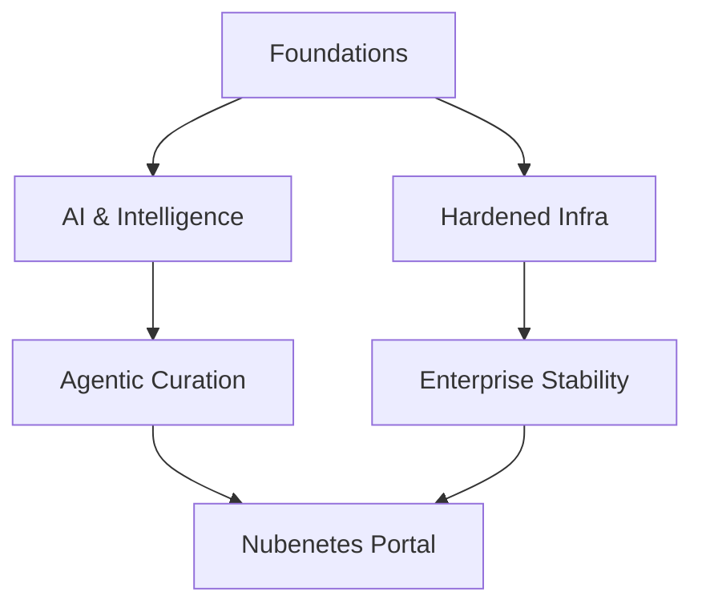

# Introduction

!!! info "Architectural Context"
    Detailed reference for Introduction in the context of Architectural Foundations.

## Vision 2026

!!! quote "The Evolution of Autonomy"
    From manual curation to agentic intelligence.

### Ecosystem Map

## Artificial Intelligence

### Machine Learning

#### Google Courses

  - **(2025)** [Machine Learning Crash Course](https://developers.google.com/machine-learning/crash-course?hl=es-419) [SPANISH CONTENT] 🌟🌟🌟 [COMMUNITY-TOOL] [GUIDE] — Google's formal, highly optimized machine learning crash course. Grounding indicates it offers a highly technical path for systems engineers wishing to deploy AI models in container environments. [SPANISH CONTENT]

---
💡 **Explore Related:** [Kubernetes](./kubernetes.md) | [Git](./git.md) | [Kubernetes Tools](./kubernetes-tools.md)

